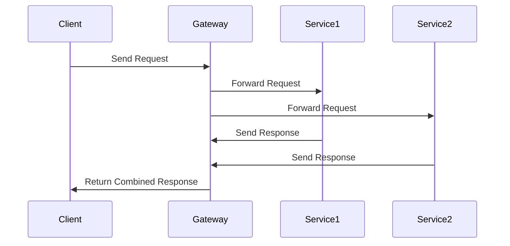
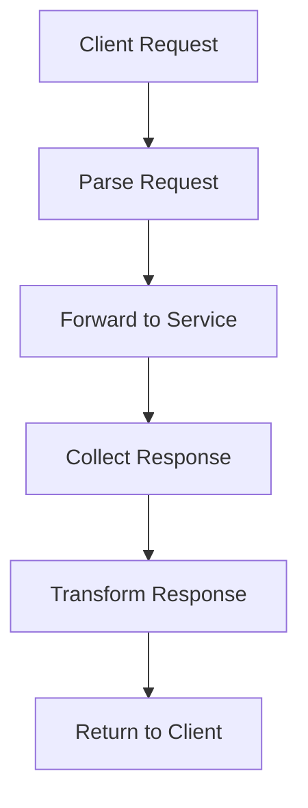
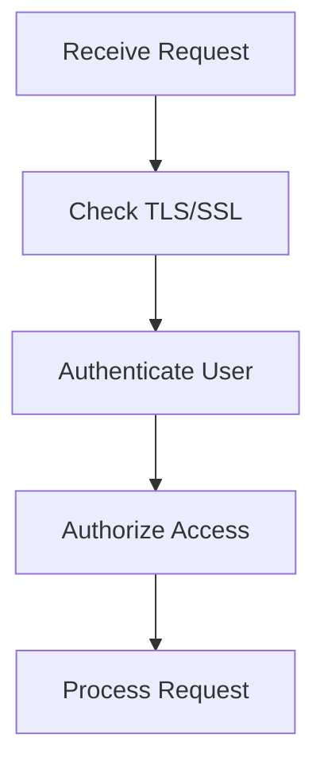
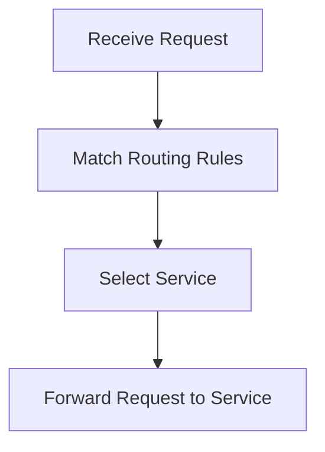
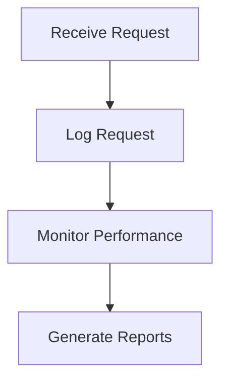

                 


### API Gateway Design and Implementation

#### Keywords: API Gateway, Microservices, Service Mesh, Security, Performance, Architecture

#### Abstract:
This comprehensive guide delves into the intricacies of API Gateway design and implementation. It begins with a foundational overview, followed by a deep dive into design principles, architecture, core components, and open-source frameworks. The book concludes with real-world case studies, future trends, and best practices, providing a holistic understanding of API Gateways in modern application architectures.

----------------------------------------------------------------

## Introduction to API Gateway

### Definition and Core Concepts

An API Gateway is a single entry point for all client requests to an application or service. It acts as a mediator between the client and the backend services, providing functionalities such as request routing, load balancing, security, and request preprocessing. The concept of an API Gateway has gained popularity in the era of microservices and service-oriented architectures due to its ability to simplify complex service interactions and provide a unified interface to consumers.

### Background

The need for an API Gateway arises from the increasing complexity of modern applications. As applications evolve, they often become a collection of microservices communicating with each other over a network. This distributed nature introduces challenges in terms of managing, monitoring, and securing these services. An API Gateway helps to address these challenges by providing a centralized point of control and abstraction.

### Problem Description

The primary problem an API Gateway aims to solve is the decoupling of the client from the underlying service architecture. This ensures that any changes in the backend services do not affect the clients, thereby promoting modularity and scalability. Additionally, API Gateways enhance security by implementing authentication, authorization, and rate limiting, thus protecting the backend services from malicious traffic.

### Solution and Boundaries

The solution involves designing and implementing an API Gateway that can handle various aspects of service management and security. The boundaries include defining the scope of services that the API Gateway will manage and ensuring that it can scale to handle high traffic loads without compromising performance.

### Core Components and Structure

The core components of an API Gateway include:

1. **Request Router**: Determines the destination of the request based on routing rules.
2. **Security Manager**: Handles authentication and authorization.
3. **Load Balancer**: Distributes incoming requests across multiple backend services.
4. **Throttling and Rate Limiting**: Controls the number of requests a client can make within a specified time frame.
5. **Logging and Monitoring**: Provides insights into the performance and health of the gateway and backend services.

### ER Diagram

```mermaid
erDiagram
  APIGateway ||--|{ Request : processes|
  APIGateway ||--|{ Security : manages|
  APIGateway ||--|{ LoadBalancer : distributes|
  APIGateway ||--|{ Throttling : controls|
  APIGateway ||--|{ Logging : records|
```

----------------------------------------------------------------

## Design Principles of API Gateway

### Extensibility

An API Gateway must be designed with extensibility in mind to accommodate future changes and enhancements. This involves using modular components and decoupled architectures, allowing for easy integration of new features without disrupting existing functionality.

### Scalability

Scalability is crucial for an API Gateway, as it needs to handle a large number of concurrent requests. Designing for scalability can involve horizontal scaling (adding more gateway instances) and vertical scaling (increasing the resources allocated to each instance).

### High Availability

High availability ensures that the API Gateway remains operational even in the face of hardware or software failures. This can be achieved through redundancy, load balancing, and failover mechanisms.

### Security

Security is a primary concern for an API Gateway. It should implement robust authentication and authorization mechanisms, secure communication channels (e.g., TLS/SSL), and enforce rate limiting to prevent abuse.

### Performance Optimization

Performance optimization is essential for ensuring that the API Gateway can handle high traffic loads efficiently. This can involve caching frequently requested data, minimizing request processing time, and optimizing network connections.

### Table: Concept Attributes Comparison

| Attribute | Description |
| --- | --- |
| Extensibility | Ability to add new features without rework |
| Scalability | Ability to handle increased load |
| High Availability | Resilience to failures |
| Security | Protection against unauthorized access and data breaches |
| Performance Optimization | Efficiency in processing requests |

----------------------------------------------------------------

## Architecture of API Gateway

### Gateway Architectural Patterns

There are several architectural patterns commonly used in designing API Gateways, each with its own advantages and disadvantages. These include:

1. **Single-Point of Entry**: All requests pass through a single gateway instance, which routes them to appropriate services.
2. **Multi-Stage Gateway**: Multiple gateway instances handle different stages of request processing, such as authentication, routing, and logging.
3. **Service Mesh**: A service mesh is a dedicated infrastructure layer that manages service-to-service communication. It decouples service implementations from service interaction logic.

### Service Decomposition and Integration

Service decomposition involves breaking down a large monolithic application into smaller, more manageable microservices. Integration of these services is crucial for ensuring seamless communication and coordination. API Gateways play a pivotal role in this process by managing service interactions and providing a unified interface for clients.

### API Routing and Load Balancing

API routing involves determining the destination of a request based on routing rules. Load balancing distributes incoming requests across multiple instances of a service to ensure optimal resource utilization and fault tolerance.

### Traffic Monitoring and Logging

Monitoring and logging are essential for maintaining the health and performance of an API Gateway. This involves tracking request rates, response times, and error rates, as well as logging detailed information about each request and response.

### Mermaid Diagram: API Gateway Architecture



----------------------------------------------------------------

### Core Components of API Gateway

The core components of an API Gateway are critical to its functionality and performance. These components include request and response handling, security management, service routing, and traffic control mechanisms such as load balancing and rate limiting.

#### Request and Response Handling

Request handling involves receiving client requests, parsing them, and forwarding them to the appropriate services. Response handling involves collecting responses from the services, transforming them if necessary, and returning them to the client.

##### Mermaid Diagram: Request Handling



#### Security Management

Security management is crucial for protecting the API Gateway and backend services from unauthorized access and malicious activities. This includes implementing authentication and authorization mechanisms, as well as securing communication channels using TLS/SSL.

##### Mermaid Diagram: Security Management



#### Service Routing

Service routing determines the destination of client requests based on predefined routing rules. This ensures that requests are directed to the correct services, improving the efficiency and scalability of the system.

##### Mermaid Diagram: Service Routing



#### Load Balancing and Rate Limiting

Load balancing distributes incoming requests across multiple instances of a service, preventing any single instance from becoming a bottleneck. Rate limiting controls the number of requests a client can make within a specific time frame, preventing abuse and ensuring fair usage of resources.

##### Mermaid Diagram: Load Balancing and Rate Limiting

```mermaid
flowchart TD
  A[Receive Request] --> B[Check Rate Limit]
  B --> C{Is Rate Limit Exceeded?}
  C -->|No| D[Forward Request]
  C -->|Yes| E[Reject Request]
  D --> F[Load Balance to Service]
  F --> G[Process Request]
```



#### Logging and Monitoring

Logging and monitoring are essential for maintaining the health and performance of the API Gateway. They provide valuable insights into request patterns, error rates, and system health, enabling proactive maintenance and optimization.

##### Mermaid Diagram: Logging and Monitoring



----------------------------------------------------------------

## Open Source API Gateway Frameworks

There are several popular open-source API Gateway frameworks available that provide powerful functionalities for managing and securing microservices. In this section, we will discuss some of the most notable ones: Apache APISIX, Kong, and Tyk.

### Apache APISIX

Apache APISIX is a high-performance, high-concurrency, and easy-to-use API Gateway written in the Go programming language. It is designed to handle large-scale traffic and provides features like traffic management, service discovery, dynamic configuration, and dynamic routing.

#### Core Features

- **High Performance**: Apache APISIX is built on Go, which allows it to handle high-concurrency traffic efficiently.
- **Dynamic Configuration**: It supports dynamic updates of configuration without restarting the service.
- **Plugin System**: Apache APISIX has a rich ecosystem of plugins that extend its functionalities, including authentication, rate limiting, and logging.

#### Installation

To install Apache APISIX, you can use the following command:
```bash
git clone https://github.com/apache/apisix.git
cd apisix
./docker-compose.sh up -d
```

### Kong

Kong is a scalable, high-performance API Gateway and microservices platform that is written in the Lua programming language. It provides features such as routing, authentication, rate limiting, and request transformation.

#### Core Features

- **Scalability**: Kong is designed to handle large-scale traffic with ease.
- **Extensibility**: Kong uses Lua as its configuration language, allowing developers to add custom plugins for various functionalities.
- **Service Discovery**: Kong supports service discovery mechanisms like Consul, etcd, and Kubernetes.

#### Installation

To install Kong, you can use the following command:
```bash
docker run -d --name kong --restart=always -p 8000:8000 -p 8443:8443 kong/kubernetes-ingress
```

### Tyk

Tyk is a fully-featured, open-source API Gateway that is designed to manage, secure, and control your API infrastructure. It provides functionalities like authentication, rate limiting, request transformation, and analytics.

#### Core Features

- **Modular Architecture**: Tyk's architecture allows for easy integration with other systems and tools.
- **High Availability**: Tyk supports clustering for high availability and failover.
- **Customizable**: Tyk provides a variety of customization options to tailor the gateway to your needs.

#### Installation

To install Tyk, you can use the following command:
```bash
sudo apt-get update && sudo apt-get install tyk-gateway
```

### Nginx as an API Gateway

Nginx is a high-performance web server that can also function as an API Gateway. It is known for its stability, security, and low resource consumption.

#### Core Features

- **High Performance**: Nginx is optimized for high concurrency and low latency.
- **Configurability**: Nginx provides extensive configuration options for routing, security, and logging.
- **Load Balancing**: Nginx supports various load balancing algorithms to distribute traffic efficiently.

#### Installation

To install Nginx, you can use the following command:
```bash
sudo apt-get update && sudo apt-get install nginx
```

In conclusion, each of these open-source API Gateway frameworks has its strengths and is suitable for different use cases. Whether you need a high-performance gateway, extensive customization, or a simple, lightweight solution, there is an API Gateway framework that fits your needs.

----------------------------------------------------------------

## Deployment and Operations of API Gateway

### Deployment Strategies

Deploying an API Gateway involves several considerations to ensure high availability, scalability, and performance. The deployment strategy should be chosen based on the specific requirements of the application and the infrastructure available.

#### Single Instance Deployment

In a single instance deployment, the API Gateway runs on a single server. This approach is simple and requires minimal configuration but lacks redundancy and fault tolerance.

#### Multi-Instance Deployment

A multi-instance deployment involves running multiple instances of the API Gateway across different servers. This approach provides high availability and fault tolerance but requires additional configuration for load balancing and service discovery.

#### Containerization with Docker

Containerization with Docker provides a lightweight and portable deployment approach. It allows you to deploy the API Gateway on any system that supports Docker, making it easier to manage and scale.

#### Kubernetes Deployment

Kubernetes is an orchestration tool that simplifies the deployment, scaling, and management of containerized applications. It provides advanced features like service discovery, load balancing, and self-healing.

### Containerization and Kubernetes

Containerization with Docker and Kubernetes is a popular deployment strategy for API Gateways. Docker provides a way to package the API Gateway and its dependencies into a container, ensuring consistency across environments. Kubernetes then manages these containers, providing features like automatic scaling, load balancing, and self-healing.

#### Dockerfile

A Dockerfile is used to define the steps required to build the Docker image for the API Gateway. Here's an example Dockerfile for a simple API Gateway:

```Dockerfile
FROM node:14
WORKDIR /app
COPY package.json ./
RUN npm install
COPY . .
CMD ["npm", "start"]
```

#### Kubernetes Deployment YAML

A Kubernetes deployment YAML file is used to define the deployment configuration. Here's an example YAML file for deploying an API Gateway using Docker:

```yaml
apiVersion: apps/v1
kind: Deployment
metadata:
  name: api-gateway
spec:
  replicas: 3
  selector:
    matchLabels:
      app: api-gateway
  template:
    metadata:
      labels:
        app: api-gateway
    spec:
      containers:
      - name: api-gateway
        image: api-gateway:latest
        ports:
        - containerPort: 80
```

### Automation and Monitoring

Automating the deployment and monitoring of the API Gateway is essential for maintaining high availability and performance. Tools like Jenkins or GitLab CI can be used for automated builds and deployments. Monitoring tools like Prometheus and Grafana can be used to collect and visualize metrics, providing insights into the performance and health of the API Gateway.

### Logging and Management

Logging and management of the API Gateway are critical for troubleshooting and optimization. Centralized logging tools like ELK (Elasticsearch, Logstash, Kibana) can be used to aggregate and analyze logs from multiple instances of the gateway. Management tools like HashiCorp's Terraform or Ansible can be used to manage infrastructure and configurations.

----------------------------------------------------------------

## Case Studies of API Gateway in Practice

### Case Study 1: E-commerce Platform

In the case of an e-commerce platform, the API Gateway serves as the central nervous system, managing requests from clients such as mobile apps, web browsers, and third-party integrations. The API Gateway handles authentication, rate limiting, and request routing to various microservices responsible for handling product listings, user accounts, payments, and orders.

**Key Challenges:**
- **High Traffic**: E-commerce platforms experience peak traffic during sales events, which puts significant pressure on the API Gateway to handle high concurrency.
- **Security**: Ensuring secure access to sensitive data like user credentials and payment information.
- **Scalability**: The platform needs to scale horizontally to handle increased load without affecting performance.

**Solution:**
- **Load Balancing**: Implementing load balancing to distribute traffic across multiple API Gateway instances.
- **Rate Limiting**: Applying rate limiting to prevent abuse and ensure fair usage.
- **Security Enhancements**: Implementing TLS/SSL for secure communication, OAuth 2.0 for authentication, and JWT for authorization.

**Outcome:**
- **Improved Performance**: The API Gateway effectively manages high traffic, ensuring fast response times even during peak periods.
- **Enhanced Security**: Secure communication channels and robust authentication mechanisms protect sensitive data.
- **Scalable Infrastructure**: Horizontal scaling allows the platform to handle increased load efficiently.

### Case Study 2: Financial Services

In the financial services industry, API Gateways are critical for managing secure and reliable interactions between banking systems, payment gateways, and third-party services. The API Gateway ensures compliance with regulatory requirements, manages transaction security, and facilitates real-time processing.

**Key Challenges:**
- **Compliance**: Adhering to strict regulatory standards such as GDPR, PCI-DSS, and others.
- **Reliability**: Ensuring high availability and minimal downtime to prevent financial losses.
- **Performance**: Handling high latency and ensuring low response times for critical transactions.

**Solution:**
- **Compliance Monitoring**: Implementing monitoring and reporting tools to ensure compliance with regulatory requirements.
- **High Availability**: Deploying the API Gateway across multiple data centers with failover mechanisms.
- **Performance Optimization**: Using caching, load balancing, and optimizing database queries to improve response times.

**Outcome:**
- **Compliance Assurance**: The API Gateway maintains compliance with regulatory standards, reducing the risk of penalties and legal issues.
- **High Reliability**: The API Gateway's high availability ensures continuous operation, minimizing downtime and financial risks.
- **Improved Performance**: Optimized performance ensures that critical transactions are processed quickly and efficiently.

### Case Study 3: IoT Solutions

In the realm of IoT solutions, API Gateways play a crucial role in managing data flows between IoT devices, cloud services, and analytics platforms. The API Gateway ensures secure and efficient communication, handles data filtering, and facilitates device management.

**Key Challenges:**
- **Device Heterogeneity**: Managing a wide range of IoT devices with different communication protocols and data formats.
- **Data Security**: Ensuring secure data transmission and storage to protect sensitive information.
- **Scalability**: Handling a large number of devices and data points without compromising performance.

**Solution:**
- **Protocol Translation**: Implementing protocol translation and data normalization to handle different device types.
- **Data Encryption**: Using encryption to secure data in transit and at rest.
- **Scalable Architecture**: Deploying a scalable architecture with load balancing and auto-scaling to handle increasing device and data volumes.

**Outcome:**
- **Interoperability**: The API Gateway facilitates seamless communication between different IoT devices and platforms.
- **Enhanced Security**: Secure data transmission and storage protect sensitive IoT data from unauthorized access.
- **Scalable Infrastructure**: The scalable architecture ensures that the API Gateway can handle increased device and data loads without degradation in performance.

These case studies demonstrate the practical applications and benefits of API Gateway implementation in diverse industries. By addressing key challenges and implementing robust solutions, API Gateways enable organizations to build secure, reliable, and scalable systems that can adapt to evolving requirements.

----------------------------------------------------------------

## Future Trends in API Gateway

### 5G and API Gateway

The advent of 5G technology promises faster network speeds, lower latency, and greater capacity. This presents both opportunities and challenges for API Gateways. With faster networks, API Gateways can handle more data-intensive operations, such as real-time analytics and streaming. However, the increased network speed also means that latency issues must be managed carefully to maintain performance. API Gateways can leverage 5G capabilities by optimizing request processing and leveraging real-time analytics features.

### Cloud-Native API Gateway

Cloud-native architectures, particularly those built on Kubernetes, are becoming increasingly popular. Cloud-native API Gateways are designed to be containerized and can be easily deployed, scaled, and managed within a Kubernetes cluster. These gateways leverage the scalability and resilience of cloud environments, making them ideal for modern, distributed systems. Key features include automated rollouts and rollbacks, zero-downtime updates, and seamless integration with other cloud-native services.

### AI and API Gateway Integration

Artificial Intelligence (AI) is set to play a significant role in the future of API Gateways. AI can be used to enhance security by identifying and mitigating sophisticated attacks, optimizing traffic routing based on real-time analytics, and providing personalized responses to clients. For example, AI algorithms can analyze historical data to predict user behavior and route requests to the most efficient backend services. This integration can lead to more intelligent and responsive API Gateways.

### API Gateway in IoT

As the Internet of Things (IoT) continues to expand, API Gateways are becoming essential for managing the vast amounts of data generated by IoT devices. API Gateways in IoT environments handle device authentication, data normalization, and protocol translation, ensuring seamless integration with cloud services and analytics platforms. The future of API Gateways in IoT will likely involve advanced features like real-time analytics, machine learning for predictive maintenance, and enhanced security protocols.

### Trends and Impact

The future of API Gateways will be shaped by several key trends:

- **Increased Focus on Security**: As applications become more complex and interconnected, ensuring secure communication will remain a top priority.
- **Advancements in Performance**: Optimizing performance to handle increasing data volumes and faster network speeds will be crucial.
- **Integration with AI and ML**: AI and machine learning will enable API Gateways to become more intelligent and adaptive.
- **Cloud-Native Deployments**: The shift to cloud-native architectures will drive the adoption of containerized API Gateways.

These trends will not only enhance the capabilities of API Gateways but also expand their applications across various industries and use cases. As technology evolves, API Gateways will continue to play a critical role in managing and securing modern application architectures.

----------------------------------------------------------------

## Conclusion and Best Practices

In conclusion, API Gateway design and implementation are pivotal for building robust, scalable, and secure microservices architectures. This guide has covered the fundamental concepts, design principles, architecture, components, and real-world applications of API Gateways. Key takeaways include the importance of extensibility, scalability, and high availability, along with the role of security, performance optimization, and integration with modern technologies like AI and 5G.

**Best Practices:**

1. **Modular Design**: Design the API Gateway with modularity to allow for easy updates and integrations.
2. **Security First**: Implement robust security measures, including TLS/SSL encryption, OAuth 2.0, and rate limiting.
3. **Performance Optimization**: Use caching, load balancing, and efficient algorithms to ensure optimal performance.
4. **Monitoring and Logging**: Implement comprehensive monitoring and logging to gain insights into gateway performance and health.
5. **Containerization**: Deploy the API Gateway using containerization for easy management and scalability.

**Final Thoughts:**

As the landscape of modern application architectures continues to evolve, API Gateways will remain a critical component. By following best practices and staying abreast of emerging trends, organizations can leverage API Gateways to build secure, efficient, and scalable systems.

**References:**

1. **API Gateway Design Patterns** by Daniel F. Kottmann
2. **API Design for Microservices** by Sam Newman
3. **Kubernetes: Up and Running** by Kelsey Hightower, Brendan Burns, and Joe Beda
4. **Artificial Intelligence: A Modern Approach** by Stuart Russell and Peter Norvig

**Author:**

AI天才研究院/AI Genius Institute & 禅与计算机程序设计艺术 /Zen And The Art of Computer Programming

