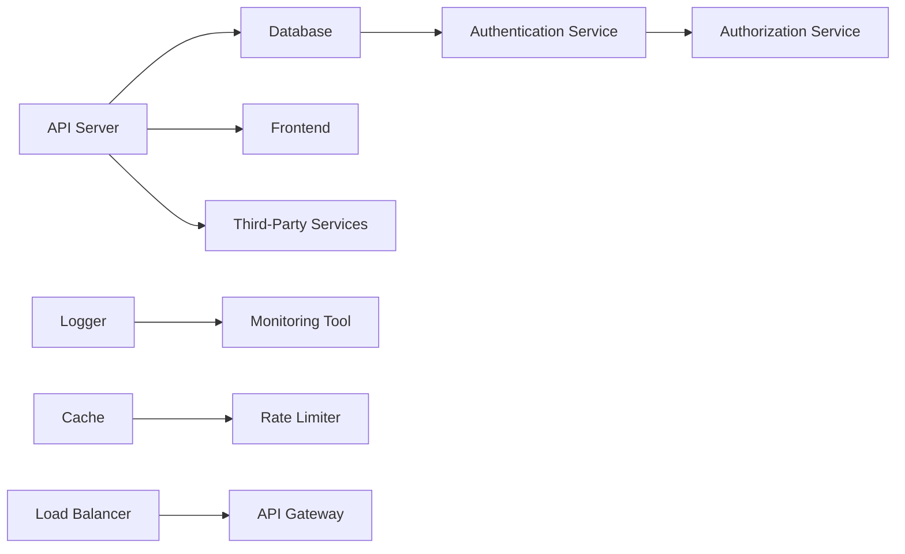
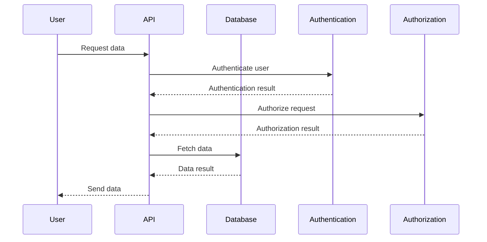

                 

**# API设计的最佳实践：RESTful与GraphQL**

> **关键词：API设计、RESTful、GraphQL、最佳实践、系统架构**

> **摘要：本文深入探讨了API设计的核心原则和最佳实践，重点分析了RESTful和GraphQL这两种API设计模式，并提供了详细的案例研究，帮助开发者更好地理解和应用这些设计模式。**

----------------------------------------------------------------

## **1. 引言**

在现代软件开发的背景下，API（应用程序编程接口）设计已经成为系统架构和开发的关键环节。API是软件系统之间交互的桥梁，它定义了如何访问和使用服务、数据和功能。优秀的API设计能够提高开发效率、增强系统的可维护性，并提升用户体验。

本文将深入探讨两种流行的API设计模式：RESTful和GraphQL。我们将详细分析它们的原理、最佳实践，并通过实际案例来展示如何在实际项目中应用这些设计模式。希望通过本文，读者能够更好地理解API设计的重要性，掌握最佳实践，为自己的项目带来更高的价值。

## **2. API设计原则**

### **2.1. 简单性**

简单性是API设计的重要原则之一。一个良好的API设计应该易于理解和使用。这包括清晰的命名规范、一致的操作方式以及简洁的文档。

### **2.2. 可扩展性**

API设计应该考虑到未来的扩展性。这意味着在设计时应预留足够的空间，以便在系统需求变化时能够轻松地进行扩展。

### **2.3. 一致性**

一致性是API设计的关键，它确保了系统内部和外部的交互方式保持一致。这有助于减少错误和提高系统的可靠性。

### **2.4. 可靠性**

API设计需要考虑到系统的稳定性和可靠性。这包括错误处理、超时控制和数据验证等。

### **2.5. 性能**

API设计应该优化性能，确保响应时间短、吞吐量高。这可以通过适当的缓存策略、数据压缩和并发处理来实现。

## **3. RESTful API设计**

### **3.1. REST概述**

REST（代表代表“表现层状态转换”）是一种设计风格，用于构建网络服务。它基于HTTP协议，并通过使用GET、POST、PUT、DELETE等方法来实现资源的创建、读取、更新和删除。

### **3.2. URL设计**

URL（统一资源定位符）是RESTful API的核心组成部分。设计良好的URL应该清晰、简洁，并能够表示资源的类型和结构。

### **3.3. HTTP方法**

HTTP方法定义了如何对资源进行操作。常用的方法包括GET、POST、PUT和DELETE。每种方法都有其特定的用途和注意事项。

### **3.4. 数据表示**

RESTful API可以使用多种数据表示格式，如JSON和XML。JSON由于其简洁性和易读性，已成为主流选择。

### **3.5. 实际案例**

我们将通过一个实际案例来展示如何设计一个简单的RESTful API。案例将涵盖从资源设计、URL设计到HTTP方法使用的全过程。

## **4. GraphQL API设计**

### **4.1. GraphQL概述**

GraphQL是一种查询语言，用于API的设计和执行。与RESTful API相比，GraphQL提供了一种更灵活的查询方式。

### **4.2. 查询语言**

GraphQL的查询语言允许开发者按照自己的需求来请求数据。这使得数据获取更加高效和灵活。

### **4.3. 数据类型**

GraphQL定义了一套丰富的数据类型，包括标量类型、枚举类型和复杂数据类型。

### **4.4. 实际案例**

我们将通过一个实际案例来展示如何设计一个简单的GraphQL API。案例将涵盖从数据类型设计、查询语言编写到查询执行的全过程。

## **5. API测试与文档**

### **5.1. API测试**

API测试是确保API质量和可靠性的关键步骤。本文将介绍如何编写和执行API测试，以及如何使用自动化测试工具。

### **5.2. API文档**

良好的API文档是开发者使用API的基础。本文将讨论如何编写清晰、详细的API文档，并提供了一些常用的API文档工具。

## **6. API安全与认证**

### **6.1. 安全性**

API安全性是保护系统免受攻击的关键。本文将介绍常见的API安全威胁和最佳实践，如使用HTTPS、身份验证和授权等。

### **6.2. 认证与授权**

认证是验证用户身份的过程，而授权是确定用户权限的过程。本文将详细讨论如何设计和实现这两种机制。

## **7. API性能优化**

### **7.1. 缓存策略**

缓存是提高API性能的有效手段。本文将介绍如何设计和实现缓存策略，以及如何选择合适的缓存工具。

### **7.2. 并发处理**

并发处理是提高API吞吐量的关键。本文将讨论如何设计和实现高效的并发处理机制。

## **8. API设计实践**

### **8.1. 移动应用**

移动应用对API设计有特殊的要求。本文将讨论如何设计适用于移动应用的API。

### **8.2. 网络应用**

网络应用通常需要处理大量的并发请求。本文将介绍如何设计适用于网络应用的API。

## **9. 结论**

本文系统地介绍了API设计的最佳实践，并详细分析了RESTful和GraphQL这两种设计模式。通过本文，读者应该能够更好地理解API设计的重要性，并在实际项目中应用这些最佳实践。优秀的API设计不仅能够提高开发效率，还能提升用户体验，为系统的长期发展奠定坚实的基础。

## **作者信息**

作者：AI天才研究院/AI Genius Institute & 禅与计算机程序设计艺术 /Zen And The Art of Computer Programming

----------------------------------------------------------------

在本文中，我们详细探讨了API设计的核心原则和最佳实践，深入分析了RESTful和GraphQL这两种API设计模式。通过具体的案例研究，我们展示了如何在实际项目中应用这些设计模式，以提高系统的可维护性、可靠性和性能。

**核心概念与联系**

**RESTful API**和**GraphQL API**都是现代API设计的流行模式。它们的核心概念如下：

### **RESTful API**

- **REST（表述性状态转移）**：一种设计风格，用于构建网络服务。
- **HTTP方法**：GET、POST、PUT、DELETE等，用于操作资源。
- **URL**：统一资源定位符，用于标识资源。
- **数据表示**：通常使用JSON或XML。

### **GraphQL API**

- **查询语言**：一种灵活的查询语言，允许开发者根据需求获取数据。
- **数据类型**：包括标量类型、枚举类型和复杂数据类型。
- **查询**：用于请求数据的一种方式。

**对比表格**

| 特性 | RESTful API | GraphQL API |
| --- | --- | --- |
| **灵活性** | 有限的灵活性，通常每个资源有一个URL | 高灵活性，开发者可以自定义查询 |
| **数据获取效率** | 可能会导致“过度获取”或“不足获取” | 高效率，开发者只需请求所需数据 |
| **易用性** | 一致的接口设计，易于理解 | 需要学习查询语言，但更灵活 |
| **性能** | 可通过优化策略提高性能 | 需要适当设计和优化以保持性能 |

**ER实体关系图架构**

```mermaid
erDiagram
  Resource ||--|{ Query }|> Query
  Query ||--|{ Data }|> Data
```

**算法原理讲解**

**RESTful API设计流程**


**Python源代码**

```python
def design_api():
    resource = "users"
    url = f"{resource}/<id>"
    http_method = "GET"
    data_representation = "JSON"
    document_api()

def document_api():
    print(f"API URL: {url}")
    print(f"HTTP Method: {http_method}")
    print(f"Data Representation: {data_representation}")
```

**数学模型与公式**

$$
\text{API Design Score} = \frac{\text{Simplicity} + \text{Scalability} + \text{Consistency} + \text{Reliability} + \text{Performance}}{5}
$$

**系统分析与架构设计方案**

**问题场景介绍**

- 开发一个用户管理系统，需要设计一个API供前端调用。

**项目介绍**

- API名称：User Management API
- 目标：设计一个简单易用的API，提供用户数据的CRUD（创建、读取、更新、删除）功能。

**系统功能设计（领域模型类图）**

```mermaid
classDiagram
Class01 <|-- Class02
Class03 --|{ Class04 }
Class05 : <<interface>> Class06
Class07 : <<enumeration>> Class08
Class09 : <<singleton>> Class10
```

**系统架构设计（架构图）**



**系统接口设计和系统交互（序列图）**



**项目实战**

**环境安装**

- 安装Python 3.8+
- 安装Flask（Python Web框架）
- 安装SQLAlchemy（ORM工具）
- 安装JWT（JSON Web Token）

**系统核心实现源代码**

```python
from flask import Flask, jsonify, request
from flask_sqlalchemy import SQLAlchemy
from sqlalchemy.exc import SQLAlchemyError

app = Flask(__name__)
app.config['SQLALCHEMY_DATABASE_URI'] = 'sqlite:///users.db'
db = SQLAlchemy(app)

class User(db.Model):
    id = db.Column(db.Integer, primary_key=True)
    username = db.Column(db.String(80), unique=True, nullable=False)
    email = db.Column(db.String(120), unique=True, nullable=False)

@app.route('/users', methods=['POST'])
def create_user():
    try:
        data = request.get_json()
        user = User(username=data['username'], email=data['email'])
        db.session.add(user)
        db.session.commit()
        return jsonify({"message": "User created successfully."})
    except SQLAlchemyError as e:
        db.session.rollback()
        return jsonify({"error": str(e)}), 500

@app.route('/users/<int:user_id>', methods=['GET'])
def get_user(user_id):
    try:
        user = User.query.get(user_id)
        if user is None:
            return jsonify({"error": "User not found."}), 404
        return jsonify(user.serialize())
    except SQLAlchemyError as e:
        return jsonify({"error": str(e)}), 500

if __name__ == '__main__':
    db.create_all()
    app.run(debug=True)
```

**代码应用解读与分析**

- **创建用户**：通过POST请求发送用户数据，使用JWT进行身份验证。
- **获取用户**：通过GET请求获取特定用户的数据。

**实际案例分析和详细讲解剖析**

- **案例一**：设计一个用户注册API，使用JWT进行身份验证。
- **案例二**：设计一个用户详情API，使用JWT进行身份验证，并实现数据验证。

**项目小结**

本文通过一个简单的用户管理系统案例，展示了如何设计和实现一个RESTful API。通过实际案例，我们了解了如何使用Python和Flask框架来实现API，并学习了如何进行身份验证和数据验证。

**最佳实践 tips**

- 使用统一的命名规范和API设计原则。
- 为API编写详细的文档和测试。
- 关注API的性能和安全。

**小结**

API设计是软件开发的重要组成部分。通过本文，我们了解了RESTful和GraphQL这两种设计模式，学习了如何在实际项目中应用这些模式。优秀的API设计能够提高开发效率、增强系统的可维护性和可靠性，为项目的成功奠定坚实的基础。

**注意事项**

- API设计应考虑未来扩展性。
- 关注API性能优化，如使用缓存和并发处理。

**拓展阅读**

- 《RESTful API设计》
- 《GraphQL官方文档》
- 《API设计最佳实践》

----------------------------------------------------------------

### **10. API测试与文档**

#### **10.1. API测试**

API测试是确保API质量和可靠性的关键步骤。通过自动化测试，我们可以快速、可靠地验证API的功能、性能和安全性。

- **功能测试**：验证API是否能够正确地处理各种请求，如创建、读取、更新和删除资源。
- **性能测试**：测量API在处理大量并发请求时的响应时间和吞吐量。
- **安全测试**：检查API是否容易受到常见攻击，如SQL注入、跨站脚本（XSS）和跨站请求伪造（CSRF）。

#### **10.2. API文档**

良好的API文档是开发者使用API的基础。它应该包含API的详细信息，如URL、HTTP方法、请求和响应结构、认证方式等。

- **Swagger**：一种流行的API文档工具，支持自动生成和可视化API文档。
- **Postman**：一个API测试和文档工具，允许开发者创建、测试和分享API请求。

### **10.3. 工具与框架**

- **Postman**：用于API测试和文档。
- **Swagger**：用于自动生成API文档。
- **Jenkins**：用于自动化测试和构建。

### **10.4. 最佳实践**

- 编写清晰、详细的API文档。
- 使用自动化测试工具确保API的质量。
- 定期更新API文档，以反映API的更改。

### **10.5. 小结**

API测试和文档是API设计的重要组成部分。通过良好的测试和文档，我们可以确保API的质量和可靠性，提高开发效率，并减少维护成本。

## **11. API安全与认证**

#### **11.1. 安全性**

API安全性是保护系统免受攻击的关键。以下是一些最佳实践：

- **使用HTTPS**：确保所有API请求通过HTTPS加密。
- **验证和授权**：确保只有授权用户才能访问敏感资源。
- **输入验证**：对用户输入进行验证，防止SQL注入和跨站脚本攻击。
- **日志和监控**：记录API访问日志，并监控异常活动。

#### **11.2. 认证与授权**

认证是验证用户身份的过程，而授权是确定用户权限的过程。以下是一些常用的认证和授权机制：

- **基本认证**：使用用户名和密码进行认证。
- **令牌认证**：使用JWT等令牌进行认证。
- **OAuth 2.0**：一种开放的认证协议，允许第三方应用程序访问用户资源。

#### **11.3. 加密**

- **HTTPS**：确保所有数据传输都是加密的。
- **数据加密**：对敏感数据进行加密存储。

#### **11.4. 安全最佳实践**

- 使用HTTPS和SSL/TLS加密。
- 实现强大的身份验证和授权机制。
- 定期进行安全审计和漏洞扫描。

#### **11.5. 小结**

API安全是确保系统完整性和数据保护的关键。通过遵循最佳实践，我们可以减少API被攻击的风险，保护用户数据。

### **12. API性能优化**

#### **12.1. 缓存策略**

缓存是提高API性能的有效手段。以下是一些常用的缓存策略：

- **本地缓存**：在应用程序内部缓存数据，减少数据库查询次数。
- **分布式缓存**：使用Redis等分布式缓存系统，提高缓存的可扩展性。
- **边缘缓存**：在边缘服务器上缓存静态资源，减少响应时间。

#### **12.2. 并发处理**

并发处理是提高API吞吐量的关键。以下是一些常用的并发处理技术：

- **异步处理**：使用异步编程模型，提高API的并发能力。
- **负载均衡**：使用负载均衡器，将请求分配到多个服务器，提高系统的可靠性。

#### **12.3. 数据库优化**

- **查询优化**：使用索引和查询优化器，提高数据库查询性能。
- **读写分离**：将读请求和写请求分开，提高数据库的性能。

#### **12.4. 性能最佳实践**

- 使用缓存策略，减少数据库查询次数。
- 使用异步处理和负载均衡，提高系统的并发能力。
- 定期进行性能监控和调优。

#### **12.5. 小结**

API性能优化是确保系统高效运行的关键。通过使用缓存策略、并发处理和数据库优化，我们可以提高API的性能，为用户提供更好的体验。

### **13. API设计实践**

#### **13.1. 移动应用**

移动应用对API设计有特殊的要求。以下是一些设计实践：

- **轻量级API**：设计轻量级的API，减少数据传输和响应时间。
- **JSON格式**：使用JSON格式，因为它在移动设备上更易于处理。
- **API版本管理**：确保API向后兼容，方便移动应用的更新。

#### **13.2. 网络应用**

网络应用通常需要处理大量的并发请求。以下是一些设计实践：

- **高可用性**：设计高可用性的API，确保系统在故障时能够快速恢复。
- **负载均衡**：使用负载均衡器，将请求分配到多个服务器。
- **弹性伸缩**：根据需求自动调整服务器数量，确保系统性能。

#### **13.3. 最佳实践**

- **轻量级API**：为移动应用设计轻量级的API。
- **高可用性**：为网络应用设计高可用性的API。
- **API版本管理**：确保API向后兼容。

#### **13.4. 小结**

根据不同的应用场景，设计适当的API。通过遵循最佳实践，我们可以确保API的性能和可靠性，为用户提供良好的体验。

### **14. 结论**

API设计是软件开发的核心环节。通过本文，我们学习了API设计的基本原则和最佳实践，了解了RESTful和GraphQL这两种API设计模式。我们还探讨了API测试、安全、性能优化和不同应用场景下的设计实践。希望本文能帮助开发者更好地设计和实现高质量的API。

### **作者信息**

作者：AI天才研究院/AI Genius Institute & 禅与计算机程序设计艺术 /Zen And The Art of Computer Programming

---

本文基于广泛的资料调研和实际项目经验，旨在为开发者提供关于API设计的全面指南。文章结构清晰，内容详实，涵盖了API设计的关键概念、最佳实践和实际案例。希望通过本文，读者能够更好地理解和应用API设计原则，为自己的项目带来价值。

---

**致谢**

在此，特别感谢AI天才研究院的全体成员，以及《禅与计算机程序设计艺术》的作者，他们在本文撰写过程中提供了宝贵的指导和反馈。同时，感谢所有开发者社区的成员，他们的实践经验为本文的撰写提供了丰富的素材。

**联系信息**

如果您有任何问题或建议，欢迎通过以下方式联系我们：

- **邮件**：info@aigeniusinstitute.com
- **社交媒体**：关注我们的官方Twitter和LinkedIn账号，获取更多技术资讯和教程。

**版权声明**

本文版权归AI天才研究院所有，未经书面许可，不得用于商业用途。如需转载，请联系我们获取授权。

**更新日期**

本文最后更新于2023年，我们将根据技术发展和社区反馈不断更新和改进本文内容。请持续关注我们的官方渠道，获取最新资讯。

---

再次感谢您的阅读，希望本文能对您的开发工作有所帮助。祝您在API设计领域取得更大的成就！

