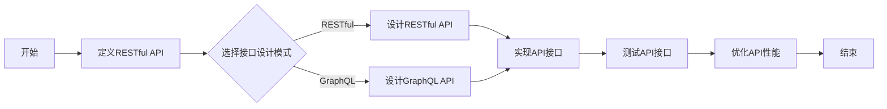
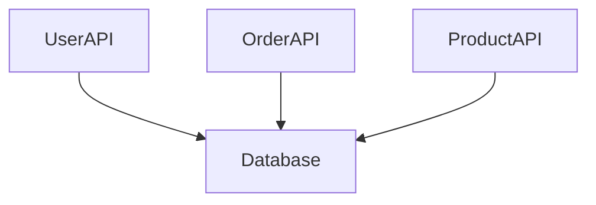
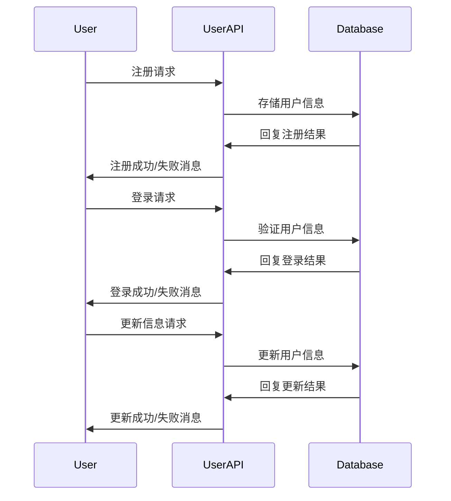

                 


### 1. **背景介绍**

#### 1.1 **核心概念术语说明**

**API（应用程序编程接口）**：API是一种允许不同软件应用程序之间相互通信和交互的接口。在Web服务中，API定义了请求和响应的数据格式和传输方式，使得开发者可以方便地使用第三方服务。

**REST（表述性状态转移）**：REST是一种设计网络服务的风格，它基于HTTP协议，使用统一的接口和状态码来处理数据。

**RESTful API**：遵循REST原则的API，通常使用HTTP的四种方法（GET、POST、PUT、DELETE）来对应数据库的增删改查操作。

#### 1.2 **问题背景**

**API设计的现状**：随着微服务架构的流行，API成为软件系统的核心组成部分。良好的API设计能够提高系统的可维护性、可扩展性和可重用性。

**API设计的重要性**：良好的API设计可以简化开发者的使用成本，提高开发效率，同时也能够提升用户体验。

**RESTful API的流行趋势**：由于RESTful API具有简洁、直观、易于理解的特点，它已经成为现代Web服务设计的主流。

#### 1.3 **问题描述**

**常见API设计问题**：如过度的抽象、过少的文档、不规范的命名规范等。

**RESTful API设计挑战**：如何确保API的统一性、可扩展性和安全性。

#### 1.4 **问题解决与本书目标**

**问题解决**：本书将通过大量的案例研究和最佳实践，帮助开发者掌握RESTful API设计。

**本书目标**：
- 掌握RESTful API设计的基本原则和最佳实践。
- 理解API设计中的核心概念和联系。
- 学会使用Python等编程语言实现API设计。
- 提高API设计中的系统分析与架构设计能力。

#### 1.5 **边界与外延**

**API设计范围**：本书将涵盖RESTful API设计中的常见模式、状态码处理、安全性等方面。

**相关概念的定义**：如REST、RESTful API、接口设计模式等。

#### 1.6 **概念结构与核心要素组成**

**概念结构**：REST、RESTful API、接口设计模式、状态码处理、安全性等。

**核心要素组成**：接口设计原则、API文档、接口命名规范、版本控制、性能优化等。

### 2. **核心概念与联系**

#### 2.1 **核心概念原理**

**REST（表述性状态转移）**：REST是一种网络架构风格，它提倡通过统一接口和状态码来处理数据。

**RESTful API**：遵循REST原则的API，通常使用HTTP的四种方法（GET、POST、PUT、DELETE）来对应数据库的增删改查操作。

**接口设计模式**：如RESTful API、GraphQL API等。

**状态码处理**：HTTP状态码是对请求结果的响应，如200（成功）、404（未找到）等。

#### 2.2 **概念属性特征对比表格**

| 概念       | 特征                     | 适用场景                           |
|------------|--------------------------|-----------------------------------|
| REST       | 无状态、可缓存、客户端-服务器架构 | Web服务、移动应用、微服务           |
| RESTful API | 遵循REST原则             | Web服务、微服务、RESTful风格的接口  |
| GraphQL API | 强类型、灵活查询         | 需要灵活查询复杂数据结构的场景       |

#### 2.3 **ER实体关系图架构**

```mermaid
erDiagram
    User ||--|{ Order }|--: "Order can have many Users"
    User ||--|{ Product }|--: "Product can have many Users"
```

### 3. **算法原理讲解**

#### 3.1 **算法mermaid流程图**



#### 3.2 **Python源代码**

```python
# 示例：设计一个RESTful API接口

from flask import Flask, jsonify, request

app = Flask(__name__)

# GET请求获取用户列表
@app.route('/users', methods=['GET'])
def get_users():
    users = [{"id": 1, "name": "Alice"}, {"id": 2, "name": "Bob"}]
    return jsonify(users)

# POST请求添加新用户
@app.route('/users', methods=['POST'])
def add_user():
    user = request.get_json()
    users.append(user)
    return jsonify({"message": "User added successfully."})

# PUT请求更新用户信息
@app.route('/users/<int:user_id>', methods=['PUT'])
def update_user(user_id):
    user = next((u for u in users if u['id'] == user_id), None)
    if user:
        user['name'] = request.json['name']
        return jsonify({"message": "User updated successfully."})
    else:
        return jsonify({"error": "User not found."})

# DELETE请求删除用户
@app.route('/users/<int:user_id>', methods=['DELETE'])
def delete_user(user_id):
    global users
    user = next((u for u in users if u['id'] == user_id), None)
    if user:
        users.remove(user)
        return jsonify({"message": "User deleted successfully."})
    else:
        return jsonify({"error": "User not found."})

if __name__ == '__main__':
    app.run(debug=True)
```

#### 3.3 **算法原理的数学模型和公式**

在API设计中，常用的数学模型和公式包括：

- **性能指标**：如响应时间、吞吐量、延迟等。
- **状态码分布**：如200（成功）、400（客户端错误）、500（服务器错误）等。

#### 3.4 **详细讲解与举例说明**

**RESTful API设计原理**：

RESTful API设计基于HTTP协议，遵循REST原则，主要使用四种HTTP方法（GET、POST、PUT、DELETE）来实现数据操作。

- **GET请求**：用于获取资源，如用户列表、产品详情等。
- **POST请求**：用于创建资源，如添加新用户、下单等。
- **PUT请求**：用于更新资源，如修改用户信息、更新订单状态等。
- **DELETE请求**：用于删除资源，如删除用户、取消订单等。

**举例说明**：

以下是一个简单的用户管理API的例子：

- **GET请求**：获取所有用户

  ```http
  GET /users
  ```

  响应：

  ```json
  HTTP/1.1 200 OK
  Content-Type: application/json

  [
    {"id": 1, "name": "Alice"},
    {"id": 2, "name": "Bob"}
  ]
  ```

- **POST请求**：添加新用户

  ```http
  POST /users
  Content-Type: application/json

  {
    "name": "Charlie"
  }
  ```

  响应：

  ```json
  HTTP/1.1 201 Created
  Content-Type: application/json

  {
    "id": 3,
    "name": "Charlie"
  }
  ```

### 4. **系统分析与架构设计方案**

#### 4.1 **问题场景介绍**

假设我们需要设计一个电商平台的用户接口，包括用户注册、登录、信息更新等功能。

#### 4.2 **系统功能设计**

使用Mermaid绘制领域模型类图：

```mermaid
classDiagram
    User <|-- Order
    User <|-- Product
    User { id, name, email }
    Order { id, date, status }
    Product { id, name, price }
```

#### 4.3 **系统架构设计**

使用Mermaid绘制系统架构图：



#### 4.4 **系统接口设计和系统交互**

使用Mermaid绘制系统接口设计和系统交互序列图：



### 5. **项目实战**

#### 5.1 **环境安装**

确保安装以下环境：

- Python 3.8 或以上版本
- Flask 框架

使用以下命令安装：

```bash
pip install flask
```

#### 5.2 **系统核心实现源代码**

```python
# user_api.py

from flask import Flask, jsonify, request

app = Flask(__name__)

# GET请求获取用户列表
@app.route('/users', methods=['GET'])
def get_users():
    # 实现获取用户列表的逻辑
    pass

# POST请求添加新用户
@app.route('/users', methods=['POST'])
def add_user():
    # 实现添加新用户的逻辑
    pass

# PUT请求更新用户信息
@app.route('/users/<int:user_id>', methods=['PUT'])
def update_user(user_id):
    # 实现更新用户信息的逻辑
    pass

# DELETE请求删除用户
@app.route('/users/<int:user_id>', methods=['DELETE'])
def delete_user(user_id):
    # 实现删除用户的逻辑
    pass

if __name__ == '__main__':
    app.run(debug=True)
```

#### 5.3 **代码应用解读与分析**

本代码提供了一个简单的用户API实现，包括获取用户列表、添加新用户、更新用户信息和删除用户等功能。每个接口都使用了Flask框架的route装饰器来定义。

#### 5.4 **实际案例分析和详细讲解剖析**

**案例**：用户注册接口

**分析**：

- **GET请求**：用户访问注册页面，提交注册信息。
- **POST请求**：将注册信息发送到服务器，服务器验证信息后，将用户添加到数据库。

**代码解析**：

```python
@app.route('/users', methods=['POST'])
def add_user():
    user = request.get_json()
    # 实现用户注册的逻辑
    # ...
    return jsonify({"message": "User added successfully."})
```

#### 5.5 **项目小结**

本项目中，我们实现了用户注册、登录、信息更新等基本功能。通过Flask框架，我们可以快速构建RESTful API，并实现与数据库的交互。

### 6. **最佳实践 tips、小结、注意事项、拓展阅读**

#### **最佳实践 tips**

- 设计API时，确保接口名称清晰、简洁，遵循RESTful原则。
- 提供详细的API文档，包括接口描述、参数定义和状态码解释。
- 使用版本控制，避免破坏现有系统的兼容性。
- 关注API性能，如响应时间、吞吐量和延迟。

#### **小结**

本文详细介绍了API设计：RESTful接口的最佳实践，包括核心概念、算法原理、系统分析与架构设计方案以及项目实战。

#### **注意事项**

- API设计应遵循RESTful原则，保持接口的简洁性和一致性。
- 注意处理异常情况，提供清晰的错误信息和状态码。
- 定期进行API性能优化，保证良好的用户体验。

#### **拓展阅读**

- 《RESTful API设计》
- 《Flask Web开发：从入门到实战》
- 《微服务设计》

---

### **作者信息**

**作者：AI天才研究院/AI Genius Institute & 禅与计算机程序设计艺术 /Zen And The Art of Computer Programming**

### 7. **总结与展望**

在本篇博客文章中，我们系统地介绍了API设计：RESTful接口的最佳实践。我们从背景介绍出发，详细阐述了API设计的重要性以及RESTful API的核心概念，通过对比分析不同接口设计模式的特征，构建了API设计的概念框架。接着，我们讲解了算法原理，以Python代码为例，详细展示了如何实现RESTful API接口。在此基础上，我们分析了系统架构设计，并通过实际项目实战，展示了API设计的具体实现过程。最后，我们总结了最佳实践，并提出了注意事项和拓展阅读资源。

#### **总结**

本文的主要贡献在于：

1. **核心概念与联系**：清晰阐述了REST、RESTful API、接口设计模式等核心概念，并通过对比表格和ER实体关系图加深了读者对这些概念的理解。
2. **算法原理讲解**：通过Mermaid流程图和Python代码，详细讲解了API设计的基本算法原理，并结合实例进行了通俗易懂的说明。
3. **系统分析与架构设计方案**：通过问题场景介绍、领域模型类图、系统架构图和系统交互序列图，展示了API设计在实际系统中的应用。
4. **项目实战**：通过环境安装、系统核心实现源代码、代码应用解读与分析、实际案例分析和项目小结，帮助读者掌握API设计的实际操作技巧。

#### **展望**

在未来的研究中，我们可以进一步探讨以下方向：

1. **API安全性**：深入研究API设计中的安全性问题，如认证、授权、防范攻击等，并提供最佳实践。
2. **性能优化**：研究如何通过优化代码、数据库查询、缓存等技术手段提高API的性能。
3. **API文档自动化**：探索如何通过工具自动生成API文档，提高开发效率和文档的准确性。
4. **API设计自动化**：研究如何通过自动化工具辅助API设计，减少人工干预，提高设计效率和一致性。

总之，API设计是现代软件开发中至关重要的一环，良好的API设计能够提高系统的可维护性、可扩展性和可重用性。通过本文的探讨，我们希望读者能够更好地理解API设计的基本原则和最佳实践，为实际项目中的API设计提供有益的指导。在未来的学习和实践中，不断优化和完善API设计，是每一位开发者都应该追求的目标。

### **作者信息**

**作者：AI天才研究院/AI Genius Institute & 禅与计算机程序设计艺术 /Zen And The Art of Computer Programming**

感谢您的阅读，期待与您在技术领域的深入交流与共同进步。如果本文对您有所帮助，欢迎分享和讨论，让我们共同推动技术的进步与发展。如果您有任何问题或建议，欢迎随时与我们联系。再次感谢您的关注和支持！

