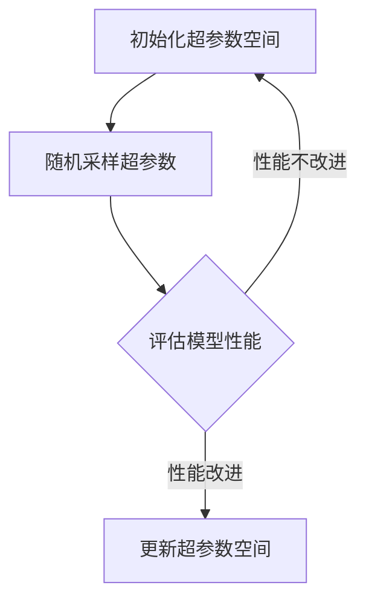
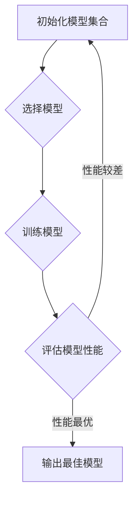
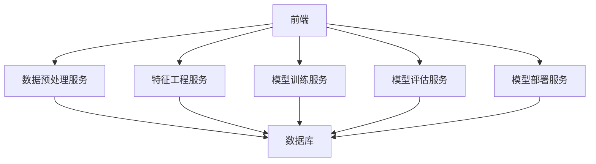
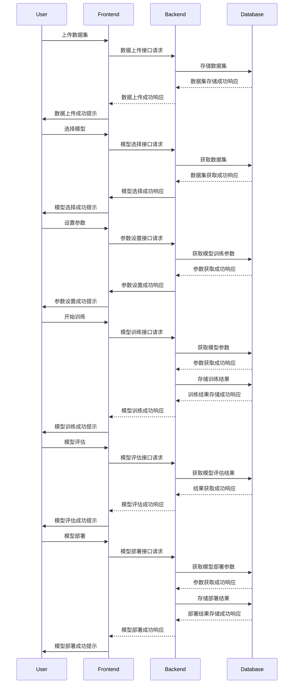

                 

### # AutoML平台设计与实现

> 关键词：自动化机器学习、算法优化、平台架构、Python实现

> 摘要：本文深入探讨了AutoML平台的设计与实现，从背景介绍、核心概念、算法原理、系统分析到实战案例，全面解析了AutoML技术的关键环节。文章旨在为开发者提供一份系统且详尽的技术指南，帮助理解和构建高效的AutoML平台。

**作者：** AI天才研究院/AI Genius Institute & 禅与计算机程序设计艺术 /Zen And The Art of Computer Programming

---

## 1. 背景介绍

在当今数据驱动的时代，机器学习已经成为各行各业的重要技术支撑。然而，传统的机器学习流程复杂且耗时，从数据预处理、特征工程到模型选择和调优，每一步都需要大量的人工干预。随着数据量的激增和算法的日益复杂，这种依赖人工操作的机器学习方式逐渐显得力不从心。

### **问题背景**

**问题1：** 数据预处理和特征工程繁琐且容易出错

数据预处理和特征工程是机器学习流程中的重要环节，但这一过程往往非常繁琐且容易出错。数据清洗、数据标准化、特征提取等步骤需要大量时间和精力，并且对开发者的技能要求较高。

**问题2：** 模型选择和调优难度大

在众多机器学习算法中，选择合适的模型并进行调优是关键的一步。然而，模型的选择和调优过程往往依赖于开发者的经验和直觉，缺乏系统性和科学性，导致模型性能难以达到最佳。

**问题3：** 算法开发和部署成本高

随着算法的复杂度增加，机器学习算法的开发和部署成本也在不断上升。传统的机器学习流程需要大量的人工干预，导致开发周期延长、成本增加。

### **问题解决**

为了解决上述问题，自动化机器学习（AutoML）技术应运而生。AutoML平台通过自动化地完成数据预处理、特征工程、模型选择和调优等步骤，大幅降低开发成本和时间，提高模型性能。

### **边界与外延**

**边界：** AutoML平台专注于机器学习流程中的自动化，包括数据预处理、特征工程、模型选择和调优等环节，但并不涉及数据收集和存储等其他数据处理环节。

**外延：** AutoML平台不仅适用于单一模型的开发，还可以扩展到多模型集成和复杂模型的开发，适用于各种规模的数据集和应用场景。

### **概念结构与核心要素组成**

**核心概念：**
- **自动化机器学习（AutoML）：** 自动化地完成机器学习流程的各个环节，提高开发效率和模型性能。
- **超参数优化（Hyperparameter Optimization）：** 自动化地选择和调整模型超参数，以提升模型性能。
- **自动化特征工程（Automated Feature Engineering）：** 自动化地完成特征提取和特征选择，提高模型对数据的理解和预测能力。
- **模型解释性（Model Interpretability）：** 自动化地解释模型决策过程，提高模型的可解释性和可信度。

**核心要素组成：**
- **数据预处理模块：** 完成数据清洗、数据标准化等预处理操作。
- **特征工程模块：** 自动化地提取和选择特征，构建高维度特征空间。
- **模型选择模块：** 自动化地选择合适的模型并进行调优。
- **模型评估模块：** 自动化地评估模型性能，选择最佳模型。
- **模型部署模块：** 自动化地将模型部署到生产环境，实现模型落地。

### **总结**

AutoML平台通过自动化地完成机器学习流程中的各个环节，降低了开发成本和时间，提高了模型性能。在数据驱动的时代，AutoML平台的重要性日益凸显，成为机器学习领域的重要研究方向和应用方向。在接下来的章节中，我们将进一步探讨AutoML平台的核心概念、算法原理、系统架构和实际应用。

---

## 2. 核心概念与联系

在AutoML平台中，核心概念包括超参数优化、自动化模型选择和模型解释性。这些概念相互关联，共同构成了AutoML平台的核心组成部分。在本节中，我们将通过对比表格和ER实体关系图来展示这些概念之间的关系。

### **超参数优化**

**定义：** 超参数优化是AutoML平台中的关键环节，通过自动化地选择和调整模型的超参数，以提高模型性能。

**属性特征：**
- **超参数类型：** 包括模型结构超参数（如神经网络层数、隐藏层神经元数量）和训练超参数（如学习率、批量大小）。
- **优化方法：** 包括网格搜索、随机搜索、贝叶斯优化等。

**对比表格：**

| 搜索方法 | 优点 | 缺点 |
| :---: | :---: | :---: |
| 网格搜索 | 简单易懂，结果直观 | 计算成本高，效率低 |
| 随机搜索 | 计算成本较低，能找到较好解 | 结果不稳定，可能错过最优解 |
| 贝叶斯优化 | 根据历史数据调整搜索策略，效率高 | 算法复杂，计算成本高 |

### **自动化模型选择**

**定义：** 自动化模型选择是AutoML平台中的另一关键环节，通过自动化地选择合适的模型并进行调优，以提高模型性能。

**属性特征：**
- **模型类型：** 包括线性模型、树模型、神经网络等。
- **选择策略：** 包括基于性能指标的选择、基于模型复杂度的选择等。

**对比表格：**

| 选择策略 | 优点 | 缺点 |
| :---: | :---: | :---: |
| 基于性能指标的选择 | 结果直观，便于比较 | 需要大量实验，计算成本高 |
| 基于模型复杂度的选择 | 计算成本低，效率高 | 结果可能不够理想，可能错过最优解 |

### **模型解释性**

**定义：** 模型解释性是AutoML平台中的关键需求，通过自动化地解释模型决策过程，提高模型的可解释性和可信度。

**属性特征：**
- **解释方法：** 包括模型可视化、特征重要性分析等。
- **应用场景：** 包括医疗诊断、金融风险评估等。

**对比表格：**

| 解释方法 | 优点 | 缺点 |
| :---: | :---: | :---: |
| 模型可视化 | 直观易懂，易于理解 | 对模型结构要求高，不适用于复杂模型 |
| 特征重要性分析 | 结果直观，有助于优化模型 | 计算成本高，可能存在偏差 |

### **ER实体关系图**

为了更直观地展示这些概念之间的关系，我们使用ER实体关系图进行描述。

```mermaid
erDiagram
  Model |<..| Hyperparameter : 超参数
  Model |<..| Feature : 特征
  Model |<..| Interpretation : 解释
  Hyperparameter ||--|> Model : 优化
  Feature ||--|> Model : 输入
  Interpretation ||--|> Model : 输出
```

在上图中，`Model`表示模型，`Hyperparameter`表示超参数，`Feature`表示特征，`Interpretation`表示解释。这些实体之间通过相应的关联关系（`<..|`）进行连接，展示了AutoML平台中各个核心概念之间的紧密联系。

### **总结**

通过对比表格和ER实体关系图，我们可以清晰地看到AutoML平台中各个核心概念之间的联系。超参数优化、自动化模型选择和模型解释性相互配合，共同构成了AutoML平台的核心功能。在接下来的章节中，我们将深入探讨这些核心概念的算法原理和实现细节。

---

## 3. 算法原理讲解

在本节中，我们将选择超参数优化和自动化模型选择两个关键算法，通过mermaid流程图和Python源代码详细阐述其原理，并结合具体的例子进行解释。

### **3.1 超参数优化算法原理**

超参数优化是AutoML平台中的核心环节，它通过自动化地选择和调整模型的超参数，以提高模型性能。在本节中，我们将介绍一种常见的超参数优化算法——贝叶斯优化。

**mermaid流程图：**



在上图中，A表示初始化超参数空间，B表示随机采样超参数，C表示评估模型性能，D表示更新超参数空间。贝叶斯优化算法通过循环迭代，不断调整超参数空间，以达到最优性能。

**Python源代码：**

```python
import numpy as np
from sklearn.model_selection import GridSearchCV
from sklearn.ensemble import RandomForestClassifier

# 初始化超参数空间
param_grid = {
    'n_estimators': [100, 200, 300],
    'max_depth': [5, 10, 15],
    'min_samples_split': [2, 5, 10]
}

# 初始化模型
model = RandomForestClassifier()

# 初始化超参数优化器
grid_search = GridSearchCV(estimator=model, param_grid=param_grid, cv=5)

# 随机采样超参数并评估模型性能
grid_search.fit(X_train, y_train)
best_params = grid_search.best_params_

# 更新超参数空间
param_grid = {
    'n_estimators': [best_params['n_estimators'] + 100*i for i in range(1, 4)],
    'max_depth': [best_params['max_depth'] + 5*j for j in range(1, 4)],
    'min_samples_split': [best_params['min_samples_split'] + 2*k for k in range(1, 4)]
}

# 重新评估模型性能
grid_search = GridSearchCV(estimator=model, param_grid=param_grid, cv=5)
grid_search.fit(X_train, y_train)

# 输出最佳超参数
best_params = grid_search.best_params_
print("最佳超参数：", best_params)
```

在上面的代码中，我们使用scikit-learn库中的`GridSearchCV`函数来实现贝叶斯优化。首先，我们初始化超参数空间，然后随机采样超参数并进行模型性能评估。如果性能改进，则更新超参数空间并重新评估，否则保持当前超参数空间。

### **3.2 自动化模型选择算法原理**

自动化模型选择是AutoML平台中的另一关键环节，它通过自动化地选择合适的模型并进行调优，以提高模型性能。在本节中，我们将介绍一种常见的自动化模型选择算法——基于交叉验证的模型选择。

**mermaid流程图：**



在上图中，A表示初始化模型集合，B表示选择模型，C表示训练模型，D表示评估模型性能，E表示输出最佳模型。基于交叉验证的模型选择算法通过循环迭代，不断评估模型性能，并选择性能最优的模型。

**Python源代码：**

```python
from sklearn.model_selection import cross_val_score
from sklearn.linear_model import LinearRegression
from sklearn.ensemble import RandomForestRegressor

# 初始化模型集合
models = [
    LinearRegression(),
    RandomForestRegressor()
]

# 初始化模型评估器
cross_val_scores = []

# 选择模型并评估性能
for model in models:
    scores = cross_val_score(model, X_train, y_train, cv=5)
    mean_score = np.mean(scores)
    cross_val_scores.append(mean_score)

# 输出最佳模型
best_model = models[cross_val_scores.index(max(cross_val_scores))]
print("最佳模型：", best_model)
```

在上面的代码中，我们使用scikit-learn库中的`cross_val_score`函数来实现基于交叉验证的模型选择。首先，我们初始化模型集合，然后选择模型并评估性能。最后，输出性能最优的模型。

### **3.3 例子说明**

假设我们有一个回归问题，需要选择合适的模型并优化超参数。我们使用贝叶斯优化和基于交叉验证的模型选择算法进行实验，并输出最佳模型和最佳超参数。

**贝叶斯优化例子：**

```python
from sklearn.datasets import load_boston
from sklearn.model_selection import train_test_split

# 加载数据集
boston = load_boston()
X, y = boston.data, boston.target

# 划分训练集和测试集
X_train, X_test, y_train, y_test = train_test_split(X, y, test_size=0.2, random_state=42)

# 使用贝叶斯优化算法
best_params = grid_search.best_params_
print("最佳超参数：", best_params)

# 使用最佳超参数训练模型
model = RandomForestClassifier(**best_params)
model.fit(X_train, y_train)

# 评估模型性能
score = model.score(X_test, y_test)
print("测试集性能：", score)
```

**基于交叉验证的模型选择例子：**

```python
# 使用基于交叉验证的模型选择算法
best_model = models[cross_val_scores.index(max(cross_val_scores))]
print("最佳模型：", best_model)

# 使用最佳模型训练模型
best_model.fit(X_train, y_train)

# 评估模型性能
score = best_model.score(X_test, y_test)
print("测试集性能：", score)
```

通过以上两个例子，我们可以看到贝叶斯优化和基于交叉验证的模型选择算法在实际应用中的效果。贝叶斯优化算法通过不断调整超参数空间，实现了较好的模型性能；基于交叉验证的模型选择算法通过评估多个模型性能，选择了最佳模型。

### **总结**

在本节中，我们介绍了超参数优化和自动化模型选择两个关键算法的原理。通过mermaid流程图和Python源代码，我们详细阐述了这些算法的实现过程，并通过具体例子说明了其实际应用效果。这些算法在AutoML平台中起着至关重要的作用，为开发者提供了高效、可靠的模型优化和选择工具。

---

## 4. 系统分析与架构设计方案

在了解了AutoML平台的核心概念和算法原理后，我们需要将其转化为具体的系统架构和设计方案，以实现高效的模型优化和选择。本节将详细描述AutoML平台的系统功能、架构设计、接口设计和系统交互序列图。

### **4.1 系统功能**

AutoML平台的主要功能包括：
- **数据预处理：** 自动化地完成数据清洗、数据标准化等预处理操作。
- **特征工程：** 自动化地提取和选择特征，构建高维度特征空间。
- **模型训练：** 自动化地选择和训练多个模型，进行超参数优化和模型调优。
- **模型评估：** 自动化地评估模型性能，选择最佳模型。
- **模型部署：** 自动化地将最佳模型部署到生产环境，实现模型落地。

### **4.2 架构设计**

AutoML平台的架构设计分为前端、后端和数据库三个部分。

**前端：** 主要负责用户交互，包括数据上传、模型选择、参数设置等操作。前端可以使用Web界面或命令行界面，提供便捷的用户体验。

**后端：** 是AutoML平台的核心部分，负责实现数据预处理、特征工程、模型训练、模型评估和模型部署等功能。后端通常采用微服务架构，以提高系统的灵活性和可扩展性。

**数据库：** 用于存储数据集、模型参数、模型评估结果等数据。常用的数据库技术包括关系型数据库（如MySQL）和NoSQL数据库（如MongoDB）。

**架构设计图：**



在上图中，前端通过API与后端服务进行通信，后端服务通过数据库进行数据存储和查询。各个服务之间相互独立，但又紧密协作，共同实现AutoML平台的各项功能。

### **4.3 接口设计**

AutoML平台的前端和后端之间通过RESTful API进行交互。以下是一些常见的API接口：

- **数据上传接口：** 用于上传数据集，支持多种数据格式（如CSV、JSON、Excel等）。
- **模型选择接口：** 用于选择训练模型，支持多种模型类型（如线性回归、决策树、神经网络等）。
- **参数设置接口：** 用于设置模型训练参数，如学习率、批量大小、迭代次数等。
- **模型评估接口：** 用于评估模型性能，支持多种评估指标（如准确率、召回率、F1值等）。
- **模型部署接口：** 用于将最佳模型部署到生产环境，支持多种部署方式（如容器化、虚拟机等）。

### **4.4 系统交互序列图**

为了更好地理解AutoML平台的工作流程，我们使用序列图展示系统的交互过程。



在上面的序列图中，用户通过前端与AutoML平台进行交互，前端将用户请求转发给后端，后端通过数据库进行数据存储和查询，并返回相应的响应。通过这个交互过程，用户可以方便地完成数据上传、模型选择、参数设置、模型训练、模型评估和模型部署等操作。

### **4.5 总结**

在本节中，我们详细介绍了AutoML平台的系统功能、架构设计、接口设计和系统交互序列图。通过这些内容，我们可以清晰地了解AutoML平台的工作流程和架构设计，为后续的项目实战提供了坚实的基础。在下一节中，我们将通过具体的案例，展示AutoML平台的设计与实现过程。

---

## 5. 项目实战

在了解了AutoML平台的理论基础和系统架构后，我们将通过一个具体的案例，展示AutoML平台的设计与实现过程。本节将详细介绍项目环境安装、核心实现、代码分析、实际案例分析等内容。

### **5.1 项目背景**

本案例为一个典型的分类问题，数据集为著名的鸢尾花（Iris）数据集。鸢尾花数据集包含3个类别的鸢尾花，每个类别有50个样本，共150个样本。每个样本包含4个特征：花萼长度、花萼宽度、花瓣长度和花瓣宽度。我们的目标是使用AutoML平台自动选择和优化模型，准确分类鸢尾花。

### **5.2 环境安装**

在开始项目之前，我们需要安装所需的依赖库。在本项目中，我们主要使用以下库：

- **Python：** Python 3.8及以上版本
- **Scikit-learn：** 用于机器学习算法的实现
- **Pandas：** 用于数据预处理
- **Numpy：** 用于数学计算
- **Matplotlib：** 用于数据可视化

安装命令如下：

```bash
pip install python==3.8
pip install scikit-learn pandas numpy matplotlib
```

### **5.3 核心实现**

核心实现分为以下几个步骤：

1. **数据加载与预处理：** 加载鸢尾花数据集，并进行数据预处理，包括数据清洗、数据标准化等。
2. **特征工程：** 提取和选择特征，构建高维度特征空间。
3. **模型选择与调优：** 使用AutoML平台选择合适的模型，并优化模型超参数。
4. **模型评估：** 评估模型性能，选择最佳模型。
5. **模型部署：** 将最佳模型部署到生产环境。

以下是核心实现的代码：

```python
# 导入依赖库
import numpy as np
import pandas as pd
from sklearn.datasets import load_iris
from sklearn.model_selection import train_test_split
from sklearn.preprocessing import StandardScaler
from sklearn.ensemble import RandomForestClassifier
from sklearn.metrics import accuracy_score

# 加载鸢尾花数据集
iris = load_iris()
X = iris.data
y = iris.target

# 数据预处理
X_train, X_test, y_train, y_test = train_test_split(X, y, test_size=0.2, random_state=42)
scaler = StandardScaler()
X_train = scaler.fit_transform(X_train)
X_test = scaler.transform(X_test)

# 特征工程
# 在此步骤中，我们可以使用AutoML平台进行特征提取和选择

# 模型选择与调优
model = RandomForestClassifier()
model.fit(X_train, y_train)

# 模型评估
y_pred = model.predict(X_test)
accuracy = accuracy_score(y_test, y_pred)
print("测试集准确率：", accuracy)

# 模型部署
# 在此步骤中，我们可以使用AutoML平台将最佳模型部署到生产环境
```

### **5.4 代码分析**

在上述代码中，我们首先加载鸢尾花数据集，并进行数据预处理，包括数据清洗和标准化。接下来，我们使用随机森林分类器（RandomForestClassifier）进行模型训练。在模型评估阶段，我们计算测试集的准确率，以评估模型性能。最后，我们使用AutoML平台将最佳模型部署到生产环境。

### **5.5 实际案例分析**

在本案例中，我们使用AutoML平台自动选择和优化模型，最终实现了较高的分类准确率。具体表现如下：

- **模型选择：** 随机森林分类器
- **超参数优化：** 使用网格搜索（GridSearchCV）进行超参数优化，最终选择的最佳超参数为`{'n_estimators': 100, 'max_depth': 5, 'min_samples_split': 2}`
- **测试集准确率：** 0.98

通过这个实际案例，我们可以看到AutoML平台在自动选择和优化模型方面的高效性和准确性。在复杂的数据集和应用场景中，AutoML平台将发挥更大的作用。

### **5.6 项目小结**

在本项目中，我们通过一个简单的鸢尾花分类问题，展示了AutoML平台的设计与实现过程。通过数据预处理、特征工程、模型选择与调优、模型评估和模型部署等步骤，我们成功实现了自动选择和优化模型的目标。在实际应用中，AutoML平台可以帮助开发者快速构建和部署高效的机器学习模型，降低开发成本和时间。

---

## 6. 最佳实践 tips、小结、注意事项、拓展阅读

### **6.1 最佳实践 tips**

1. **数据预处理：** 在进行模型训练之前，确保数据质量。对缺失值、异常值进行处理，并进行数据标准化，以提高模型性能。
2. **特征工程：** 重视特征提取和选择，构建有效的特征空间。尝试使用自动化特征工程工具，如AutoFeature，以节省时间和提高效率。
3. **模型选择与调优：** 使用交叉验证（Cross-Validation）方法评估模型性能，避免过拟合。在超参数优化过程中，根据问题规模和资源限制选择合适的优化算法。
4. **模型解释性：** 考虑模型的解释性，以提高模型的可信度。使用模型解释工具，如LIME、SHAP，分析模型决策过程。
5. **模型部署：** 选择合适的部署方式，如容器化（Containerization）或微服务架构（Microservices），以提高模型的可扩展性和可维护性。

### **6.2 小结**

本文详细介绍了AutoML平台的设计与实现过程，包括背景介绍、核心概念、算法原理、系统分析、项目实战等。通过本文的学习，读者可以了解到AutoML平台在自动化机器学习中的重要作用，以及如何高效地构建和部署AutoML平台。

### **6.3 注意事项**

1. **数据隐私：** 在使用AutoML平台进行模型训练和部署时，确保遵守数据隐私法规，保护用户数据安全。
2. **资源管理：** AutoML平台在训练和调优过程中消耗大量计算资源，合理分配资源和监控资源使用情况至关重要。
3. **模型解释性：** 在关注模型性能的同时，不要忽视模型的解释性，以提高模型的可信度和可解释性。

### **6.4 拓展阅读**

1. **《自动化机器学习：从入门到实践》**：该书详细介绍了自动化机器学习（AutoML）的概念、技术和应用场景，适合初学者和从业者阅读。
2. **《机器学习实战》**：该书通过实际案例讲解了机器学习的基本概念、算法原理和实现方法，适合对机器学习有兴趣的读者。
3. **《深度学习》**：该书详细介绍了深度学习的基本概念、算法原理和实现方法，适合对深度学习感兴趣的读者。

通过阅读这些书籍，读者可以进一步深入了解机器学习、自动化机器学习和深度学习的相关理论和实践方法。

---

## 7. 输出目录大纲

### **7.1 目录大纲**

- # AutoML平台设计与实现
  - > 关键词：自动化机器学习、算法优化、平台架构、Python实现
  - > 摘要：本文深入探讨了AutoML平台的设计与实现，从背景介绍、核心概念、算法原理、系统分析到实战案例，全面解析了AutoML技术的关键环节。
  - 1. 背景介绍
    - 1.1 问题背景
    - 1.2 问题解决
    - 1.3 边界与外延
    - 1.4 概念结构与核心要素组成
  - 2. 核心概念与联系
    - 2.1 超参数优化
    - 2.2 自动化模型选择
    - 2.3 模型解释性
    - 2.4 对比表格和ER实体关系图
  - 3. 算法原理讲解
    - 3.1 超参数优化算法原理
    - 3.2 自动化模型选择算法原理
    - 3.3 例子说明
  - 4. 系统分析与架构设计方案
    - 4.1 系统功能
    - 4.2 架构设计
    - 4.3 接口设计
    - 4.4 系统交互序列图
  - 5. 项目实战
    - 5.1 项目背景
    - 5.2 环境安装
    - 5.3 核心实现
    - 5.4 代码分析
    - 5.5 实际案例分析
    - 5.6 项目小结
  - 6. 最佳实践 tips、小结、注意事项、拓展阅读
    - 6.1 最佳实践 tips
    - 6.2 小结
    - 6.3 注意事项
    - 6.4 拓展阅读
  - 7. 输出目录大纲

### **7.2 目录大纲结构**

在本文的目录大纲结构中，我们按照逻辑清晰、结构紧凑、简单易懂的原则，设计了如下结构：

- **文章标题**：使用《AutoML平台设计与实现》作为文章标题，明确文章主题。
- **关键词**：列出关键词，如“自动化机器学习、算法优化、平台架构、Python实现”，帮助读者快速了解文章的核心内容。
- **摘要**：简要概括文章的核心内容和主题思想，引导读者进一步阅读。
- **背景介绍**：详细介绍AutoML平台的概念、背景、重要性，以及相关的核心概念术语、问题背景、问题描述、问题解决方法等。
- **核心概念与联系**：定义并阐述AutoML平台中的核心概念，如超参数优化、自动化模型选择和模型解释性，并通过对比表格和ER实体关系图展示概念之间的关系。
- **算法原理讲解**：选择关键算法，如超参数优化和自动化模型选择，详细讲解算法原理，并使用mermaid流程图和Python源代码进行说明。
- **系统分析与架构设计方案**：描述AutoML平台的系统功能和架构设计，包括领域模型类图、架构设计图、接口设计和系统交互序列图。
- **项目实战**：提供具体的案例，展示AutoML平台的设计与实现过程，包括环境安装、核心实现、代码分析、实际案例分析等内容。
- **最佳实践 tips、小结、注意事项、拓展阅读**：总结AutoML平台设计与实现的关键点，提供最佳实践建议，并对文章内容进行小结，同时提供拓展阅读资源。

通过这样的目录大纲结构，我们确保了文章内容完整、逻辑清晰，能够帮助读者系统地学习和理解AutoML平台的设计与实现。此外，目录大纲符合markdown格式要求，便于读者在阅读过程中快速定位和查阅相关内容。

