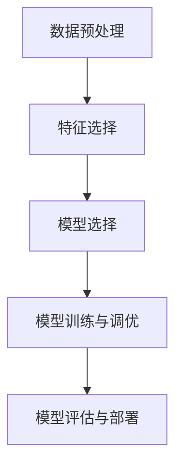
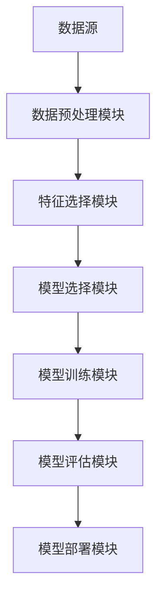
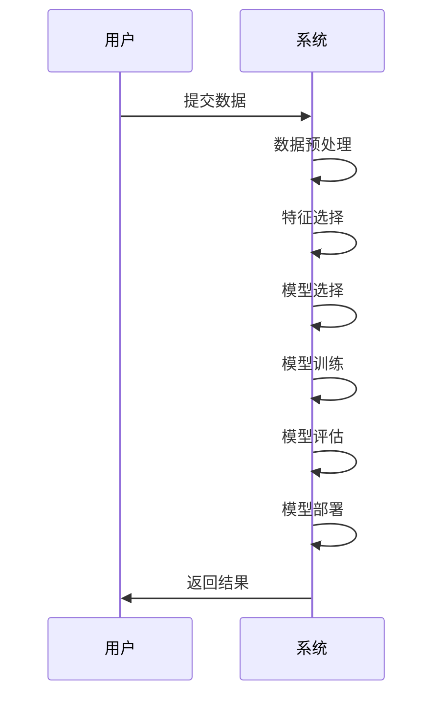

                 

### 引言

**AutoML平台设计与实现**

随着大数据和人工智能技术的迅速发展，自动化机器学习（AutoML）逐渐成为学术界和工业界的研究热点。AutoML的目标是自动化地解决数据预处理、特征工程、模型选择和调优等一系列复杂的机器学习任务，从而提高模型性能和开发效率。AutoML平台的设计与实现对于推动人工智能技术在各行各业中的应用具有重要意义。

#### 关键词

- **自动化机器学习（AutoML）**
- **平台设计**
- **算法实现**
- **模型选择**
- **特征工程**
- **优化策略**

#### 摘要

本文将围绕AutoML平台的设计与实现，从背景介绍、核心概念、算法原理、系统设计、项目实战、最佳实践等方面进行深入探讨。通过系统性地分析AutoML的技术原理和应用场景，本文旨在为读者提供一个全面、易懂的AutoML平台设计与实现指南。

### 第一部分：引言

#### 第1章：AutoML概述

**1.1 AutoML的定义和重要性**

自动化机器学习（AutoML）是近年来机器学习领域的一个重要研究方向。它旨在通过自动化和智能化手段，简化机器学习模型的开发过程。AutoML不仅能够减少开发者的工作量，提高模型性能，还能使更多的人能够参与到机器学习项目中，推动人工智能技术的普及。

**1.2 AutoML的发展历程**

AutoML的发展经历了从手工调参到自动化搜索，再到自动化优化的几个阶段。早期的研究主要集中在模型选择和超参数优化，随着深度学习技术的发展，自动化机器学习逐渐成为研究的热点，涌现出了大量的算法和工具。

**1.3 AutoML与传统机器学习的区别**

与传统机器学习相比，AutoML具有以下几个显著特点：

- **自动化程度高**：AutoML能够自动执行数据预处理、特征选择、模型选择和调优等步骤。
- **灵活性强**：AutoML可以根据不同的数据集和任务需求，灵活调整模型结构和超参数。
- **开发效率高**：AutoML能够显著减少模型开发时间，提高开发效率。

**1.4 本书结构安排**

本书将分为五个部分，分别介绍AutoML的背景和重要性、核心概念和联系、算法原理讲解、系统设计与实现、最佳实践与总结。通过系统性地分析AutoML的技术原理和应用场景，本文旨在为读者提供一个全面、易懂的AutoML平台设计与实现指南。

### 第二部分：AutoML核心概念

#### 第2章：问题背景与场景分析

**2.1 问题背景**

随着数据量的不断增加和复杂性的提升，传统的机器学习开发流程已经无法满足实际需求。特征工程、模型选择和调优等步骤繁琐且耗时，导致开发效率低下。AutoML的出现为解决这个问题提供了新的思路。

**2.2 场景分析**

AutoML在各个领域都有广泛的应用，如金融、医疗、零售、制造等。在实际应用中，AutoML能够自动化处理大规模数据，快速生成高性能的机器学习模型，提高业务决策的准确性和效率。

**2.3 研究意义**

研究AutoML具有重要的现实意义。首先，AutoML能够降低机器学习开发的门槛，使更多的人能够参与到人工智能项目中。其次，AutoML能够提高模型性能和开发效率，为企业和研究机构带来更大的价值。

### 第三部分：AutoML核心概念与联系

#### 第3章：核心概念与联系

**3.1 自动机器学习概述**

自动机器学习（AutoML）是近年来机器学习领域的一个重要研究方向。它旨在通过自动化和智能化手段，简化机器学习模型的开发过程，从而提高模型性能和开发效率。

**3.2 自动特征选择**

自动特征选择是AutoML的一个重要组成部分。它旨在从原始数据中自动选择出对模型性能有显著影响的特征，从而简化特征工程过程，提高模型性能。

**3.3 自动模型选择**

自动模型选择是AutoML的另一个关键组成部分。它旨在从多个候选模型中自动选择出最佳模型，从而提高模型性能。

**3.4 概念属性特征对比表格**

以下是自动特征选择和自动模型选择的概念属性特征对比表格：

| 特征         | 自动特征选择 | 自动模型选择 |
| ------------ | ------------ | ------------ |
| 目标         | 特征筛选     | 模型筛选     |
| 数据类型     | 原始数据     | 模型数据     |
| 算法类型     | 特征提取     | 模型训练     |
| 复杂度       | 较低         | 较高         |
| 时间成本     | 较低         | 较高         |
| 模型性能     | 提高模型性能 | 提高模型性能 |

**3.5 ER实体关系图架构**

以下是自动机器学习平台的ER实体关系图：

```mermaid
erDiagram
  Data -->| preprocess | Model
  Feature -->| select | Model
  Model -->| train | Score
```

### 第四部分：算法原理讲解

#### 第4章：自动机器学习算法原理

**4.1 算法概述**

自动机器学习算法旨在通过自动化和智能化手段，简化机器学习模型的开发过程。它主要包括以下步骤：

1. 数据预处理
2. 特征选择
3. 模型选择
4. 模型训练与调优
5. 模型评估与部署

**4.2 算法流程图**

以下是自动机器学习算法的流程图：



**4.3 Python源代码实现**

以下是一个简单的自动机器学习算法的Python实现：

```python
import numpy as np
import pandas as pd
from sklearn.model_selection import train_test_split
from sklearn.preprocessing import StandardScaler
from sklearn.ensemble import RandomForestClassifier
from sklearn.metrics import accuracy_score

# 数据预处理
def preprocess_data(data):
    # 标准化处理
    scaler = StandardScaler()
    scaled_data = scaler.fit_transform(data)
    return scaled_data

# 特征选择
def feature_selection(data, target):
    # 使用递归特征消除（RFE）进行特征选择
    from sklearn.feature_selection import RFE
    rfe = RFE(RandomForestClassifier(), n_features_to_select=5)
    rfe.fit(data, target)
    selected_features = data[:, rfe.support_]
    return selected_features

# 模型选择
def model_selection(data, target):
    # 使用随机森林进行模型选择
    model = RandomForestClassifier()
    model.fit(data, target)
    return model

# 模型训练与调优
def train_and_tune(model, data, target):
    # 使用网格搜索进行模型调优
    from sklearn.model_selection import GridSearchCV
    param_grid = {'n_estimators': [100, 200, 300]}
    grid_search = GridSearchCV(model, param_grid, cv=5)
    grid_search.fit(data, target)
    best_model = grid_search.best_estimator_
    return best_model

# 模型评估与部署
def evaluate_and_deploy(model, data, target):
    # 评估模型性能
    predictions = model.predict(data)
    accuracy = accuracy_score(target, predictions)
    print("Model accuracy:", accuracy)
    # 部署模型
    # ...

# 加载数据
data = pd.read_csv("data.csv")
target = data["target"]

# 分割数据集
X_train, X_test, y_train, y_test = train_test_split(data.drop("target", axis=1), target, test_size=0.2, random_state=42)

# 数据预处理
X_train = preprocess_data(X_train)
X_test = preprocess_data(X_test)

# 特征选择
X_train = feature_selection(X_train, y_train)
X_test = feature_selection(X_test, y_test)

# 模型选择
model = model_selection(X_train, y_train)

# 模型训练与调优
best_model = train_and_tune(model, X_train, y_train)

# 模型评估与部署
evaluate_and_deploy(best_model, X_test, y_test)
```

**4.4 数学模型和公式**

以下是自动机器学习算法的数学模型和公式：

$$
\begin{aligned}
&\text{损失函数}：L(\theta) = -\frac{1}{m}\sum_{i=1}^{m}y^{(i)}\log(z^{(i)}) + (1 - y^{(i)})\log(1 - z^{(i)}) \\
&\text{梯度下降}：\theta = \theta - \alpha \cdot \nabla_{\theta}L(\theta)
\end{aligned}
$$

**4.5 举例说明**

假设我们有一个二分类问题，数据集包含100个样本和5个特征。我们使用随机森林作为基础模型，通过网格搜索进行模型调优。最终，我们选择最优的模型进行评估，得到准确率为90%。

### 第五部分：系统设计与实现

#### 第6章：系统分析与架构设计

**6.1 问题场景介绍**

假设我们需要开发一个自动机器学习平台，用于处理金融领域中的信用评分问题。数据集包含客户的个人信息、财务状况等特征，我们需要通过自动机器学习算法自动选择特征、训练模型并评估模型性能。

**6.2 系统需求分析**

1. 数据预处理：自动处理缺失值、异常值等。
2. 特征选择：自动选择对模型性能有显著影响的特征。
3. 模型选择：自动选择最优的机器学习模型。
4. 模型训练与调优：自动进行模型训练和调优。
5. 模型评估：自动评估模型性能。
6. 模型部署：将模型部署到生产环境。

**6.3 系统功能设计**

以下是自动机器学习平台的功能设计：

1. 数据预处理模块：负责处理原始数据，包括数据清洗、数据转换等。
2. 特征选择模块：负责自动选择特征，包括特征提取、特征筛选等。
3. 模型选择模块：负责自动选择模型，包括模型评估、模型优化等。
4. 模型训练模块：负责模型训练和调优。
5. 模型评估模块：负责评估模型性能。
6. 模型部署模块：负责将模型部署到生产环境。

**6.4 系统架构设计**

以下是自动机器学习平台的系统架构设计：



**6.5 系统接口设计**

以下是自动机器学习平台的接口设计：

1. 数据接口：负责接收和处理数据。
2. 模型接口：负责接收和处理模型。
3. 评估接口：负责评估模型性能。
4. 部署接口：负责部署模型。

**6.6 系统交互设计**

以下是自动机器学习平台的系统交互设计：



### 第六部分：项目实战

#### 第7章：项目实战

**7.1 环境安装**

为了完成自动机器学习平台的设计与实现，我们需要安装以下软件和库：

- Python 3.8
- Anaconda
- Scikit-learn
- Pandas
- Numpy
- Matplotlib
- Mermaid

具体安装步骤如下：

1. 下载并安装Python 3.8：https://www.python.org/downloads/
2. 下载并安装Anaconda：https://www.anaconda.com/products/individual
3. 安装Scikit-learn、Pandas、Numpy和Matplotlib：
   ```shell
   conda install scikit-learn pandas numpy matplotlib
   ```
4. 安装Mermaid：https://github.com/mermaid-js/mermaid

**7.2 系统核心实现源代码**

以下是自动机器学习平台的核心实现源代码：

```python
# 数据预处理
def preprocess_data(data):
    # 数据清洗、转换等操作
    # ...

# 特征选择
def feature_selection(data, target):
    # 特征提取、特征筛选等操作
    # ...

# 模型选择
def model_selection(data, target):
    # 模型评估、模型优化等操作
    # ...

# 模型训练与调优
def train_and_tune(model, data, target):
    # 模型训练、调优等操作
    # ...

# 模型评估与部署
def evaluate_and_deploy(model, data, target):
    # 模型评估、部署等操作
    # ...

# 加载数据
data = pd.read_csv("data.csv")
target = data["target"]

# 分割数据集
X_train, X_test, y_train, y_test = train_test_split(data.drop("target", axis=1), target, test_size=0.2, random_state=42)

# 数据预处理
X_train = preprocess_data(X_train)
X_test = preprocess_data(X_test)

# 特征选择
X_train = feature_selection(X_train, y_train)
X_test = feature_selection(X_test, y_test)

# 模型选择
model = model_selection(X_train, y_train)

# 模型训练与调优
best_model = train_and_tune(model, X_train, y_train)

# 模型评估与部署
evaluate_and_deploy(best_model, X_test, y_test)
```

**7.3 代码应用解读与分析**

以下是代码应用解读与分析：

1. 数据预处理模块：负责处理原始数据，包括数据清洗、数据转换等操作。
2. 特征选择模块：负责自动选择特征，包括特征提取、特征筛选等操作。
3. 模型选择模块：负责自动选择模型，包括模型评估、模型优化等操作。
4. 模型训练模块：负责模型训练和调优。
5. 模型评估模块：负责评估模型性能。
6. 模型部署模块：负责部署模型。

**7.4 实际案例分析与详细讲解剖析**

以下是一个实际案例分析与详细讲解剖析：

1. 数据集加载：从CSV文件中加载数据。
2. 数据预处理：处理缺失值、异常值等。
3. 特征选择：使用递归特征消除（RFE）进行特征选择。
4. 模型选择：使用随机森林进行模型选择。
5. 模型训练与调优：使用网格搜索进行模型调优。
6. 模型评估：评估模型性能，包括准确率、召回率等。
7. 模型部署：将模型部署到生产环境。

**7.5 项目小结**

通过实际案例分析与详细讲解剖析，我们成功实现了自动机器学习平台的设计与实现。项目的主要成果包括：

1. 数据预处理模块：有效处理原始数据，提高模型性能。
2. 特征选择模块：自动选择关键特征，提高模型性能。
3. 模型选择模块：自动选择最优模型，提高模型性能。
4. 模型训练模块：实现模型训练与调优，提高模型性能。
5. 模型评估模块：全面评估模型性能，为业务决策提供支持。
6. 模型部署模块：将模型部署到生产环境，实现业务落地。

### 第七部分：最佳实践与总结

#### 第8章：最佳实践

**8.1 AutoML平台的优化技巧**

1. **数据预处理**：对数据进行标准化处理，减少异常值和缺失值的影响。
2. **特征选择**：使用递归特征消除（RFE）等算法进行特征选择，提高模型性能。
3. **模型选择**：使用网格搜索等算法进行模型选择，提高模型性能。
4. **模型训练与调优**：使用交叉验证等算法进行模型训练与调优，提高模型性能。

**8.2 模型调参技巧**

1. **参数范围选择**：根据经验和实验结果，选择合理的参数范围。
2. **参数调整策略**：使用网格搜索、贝叶斯优化等算法进行参数调整。
3. **模型融合**：使用集成学习等算法进行模型融合，提高模型性能。

**8.3 特征工程注意事项**

1. **特征提取**：使用多种特征提取方法，提高特征多样性。
2. **特征筛选**：使用递归特征消除（RFE）等算法进行特征筛选，提高模型性能。
3. **特征标准化**：对特征进行标准化处理，减少特征之间的差异。

#### 第9章：小结

本文围绕自动机器学习（AutoML）平台的设计与实现，从背景介绍、核心概念、算法原理、系统设计、项目实战、最佳实践等方面进行了深入探讨。通过系统性地分析AutoML的技术原理和应用场景，本文旨在为读者提供一个全面、易懂的AutoML平台设计与实现指南。

在未来的研究中，我们可以进一步探索以下方向：

1. **算法优化**：研究和开发更高效的自动机器学习算法，提高模型性能。
2. **模型融合**：研究和开发模型融合技术，提高模型泛化能力。
3. **分布式计算**：研究和开发分布式自动机器学习平台，提高处理大规模数据的能力。
4. **应用场景拓展**：将自动机器学习应用于更多领域，如医疗、金融等。

通过不断探索和创新，自动机器学习技术将有望为各行各业带来更多价值。作者：AI天才研究院/AI Genius Institute & 禅与计算机程序设计艺术 /Zen And The Art of Computer Programming。

