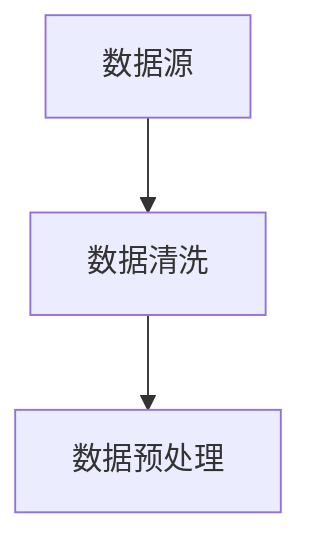
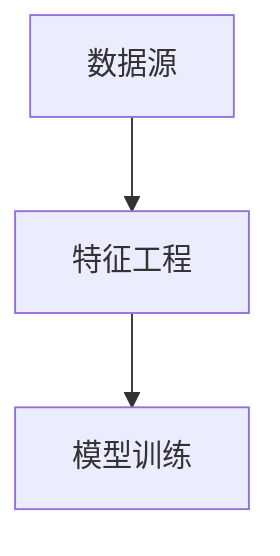
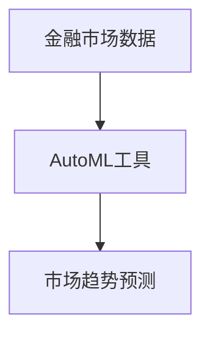
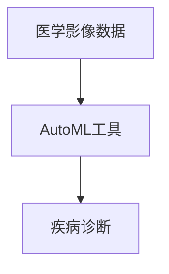
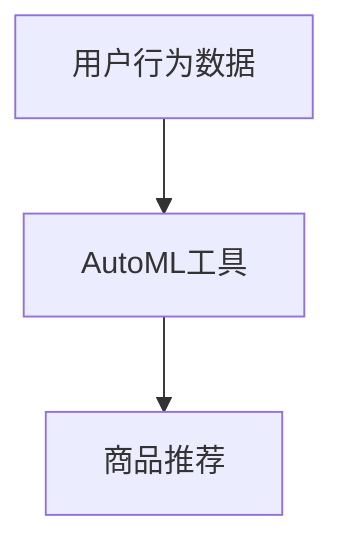

                 

### AutoML：自动化机器学习工具与实践

#### 关键词：自动化机器学习，AutoML工具，实践，算法，人工智能

#### 摘要：
本文将深入探讨自动化机器学习（AutoML）的概念、工具与实践。通过系统化的分析，我们将揭示AutoML在提升机器学习开发效率、降低技术门槛方面的巨大潜力，并探讨其在实际应用中的挑战与未来发展趋势。

### 第一部分：AutoML简介与背景

#### 第1章: AutoML概述

##### 1.1 问题背景与定义

在传统的机器学习工作中，数据科学家需要手动进行数据清洗、特征工程、模型选择和调优等繁琐的任务。这不仅耗费时间，而且容易引入人为错误。AutoML应运而生，旨在通过自动化工具，简化这些任务，提高开发效率。

**定义：**
自动化机器学习（AutoML）是一种通过自动化技术，简化机器学习模型开发流程的方法。它能够自动完成数据预处理、特征选择、模型选择和调优等工作。

##### 1.2 AutoML的发展历程

AutoML的发展可以追溯到2000年代初，随着机器学习领域的快速发展，研究人员开始探索如何通过自动化技术来简化机器学习流程。2010年后，随着深度学习的兴起，AutoML工具得到了进一步的发展和完善。如今，许多AutoML平台如AutoKeras、H2O.ai等已经逐渐成熟，为数据科学家提供了强大的支持。

##### 1.3 AutoML的关键角色与关系

在AutoML的生态系统中，有多种角色和工具相互协作。以下是其中几个关键角色及其关系：

- **数据科学家：**负责定义问题和数据，使用AutoML工具进行模型开发。
- **AutoML平台：**提供自动化工具，如自动特征工程、模型选择和调优。
- **算法工程师：**优化和调整AutoML平台的算法，提高模型性能。
- **领域专家：**提供行业知识和需求，指导模型应用。

### 第二部分：自动化机器学习的核心概念

#### 第2章: 自动化机器学习的核心概念

##### 2.1 数据准备

数据准备是机器学习项目中的关键步骤，AutoML工具在这方面提供了显著的帮助。

###### 2.1.1 数据清洗

数据清洗包括处理缺失值、异常值和重复值等。AutoML工具通常内置了数据清洗功能，能够自动识别和处理这些问题。



###### 2.1.2 特征工程

特征工程是数据准备的核心，包括特征提取、特征选择和特征转换等。AutoML工具能够自动进行特征工程，提高模型性能。



##### 2.2 模型选择

模型选择是机器学习中的关键步骤，AutoML工具通过自动搜索和评估多种模型，帮助数据科学家选择最佳模型。

```python
# Python代码示例：模型选择
from automl import AutoML
aml = AutoML()
aml.fit(X_train, y_train)
best_model = aml.get_best_model()
```

##### 2.3 模型调优

模型调优是提升模型性能的关键步骤，AutoML工具通过自动调整超参数，优化模型性能。

```python
# Python代码示例：模型调优
from automl import AutoML
aml = AutoML()
aml.fit(X_train, y_train, n_trials=50)
aml.optimize_hyperparameters()
```

### 第三部分：AutoML工具与应用

#### 第3章: AutoML工具与应用

##### 3.1 AutoML工具分类

AutoML工具可以分为开源工具和商业工具两类。开源工具如AutoKeras、H2O.ai等，商业工具如Google AutoML、AWS SageMaker等。

##### 3.2 实际应用场景

AutoML工具在多个领域都有广泛的应用，如金融市场分析、医疗诊断、电商推荐系统等。

###### 3.2.1 金融市场分析

在金融市场分析中，AutoML工具能够自动识别市场趋势，为投资者提供决策支持。



###### 3.2.2 医疗诊断

在医疗诊断中，AutoML工具能够自动分析医学影像，提高诊断准确率。



###### 3.2.3 电商推荐系统

在电商推荐系统中，AutoML工具能够自动分析用户行为，提高推荐精度。



### 第四部分：自动化机器学习的挑战与未来

#### 第4章: 自动化机器学习的挑战与未来

##### 4.1 当前挑战

虽然AutoML在提高机器学习开发效率方面取得了显著成果，但仍然面临一些挑战，如数据质量、模型可解释性和模型泛化能力等。

##### 4.2 未来发展趋势

随着人工智能技术的发展，AutoML的未来将更加光明。未来发展趋势包括人工智能与AutoML的结合、AutoML工具的智能化和AutoML生态的完善等。

### 第五部分：AutoML项目实战

#### 第5章: AutoML项目实战

##### 5.1 项目介绍

在本章中，我们将通过一个实际项目，展示如何使用AutoML工具进行机器学习模型开发。

##### 5.2 环境安装与配置

在本章中，我们将介绍如何安装和配置AutoML工具，为项目开发做好准备。

##### 5.3 数据准备与处理

在本章中，我们将介绍如何处理项目数据，为模型训练做好准备。

##### 5.4 模型训练与评估

在本章中，我们将介绍如何使用AutoML工具进行模型训练和评估，确保模型性能达到预期。

##### 5.5 项目小结与反思

在本章中，我们将对项目进行总结和反思，分享项目中的经验和教训。

### 第六部分：AutoML最佳实践与注意事项

#### 第6章: AutoML最佳实践与注意事项

##### 6.1 最佳实践

在本章中，我们将介绍一些AutoML最佳实践，帮助读者更好地使用AutoML工具。

##### 6.2 小结

在本章中，我们将对AutoML的核心内容进行总结，帮助读者更好地理解和应用。

##### 6.3 注意事项

在本章中，我们将介绍一些使用AutoML工具时需要注意的事项，避免潜在的问题。

##### 6.4 拓展阅读

在本章中，我们将提供一些拓展阅读资源，帮助读者深入了解AutoML领域。

### 第七部分：总结与展望

#### 第7章: 总结与展望

##### 7.1 本书内容回顾

在本章中，我们将回顾本书的核心内容，帮助读者巩固知识点。

##### 7.2 学习建议

在本章中，我们将给出一些学习建议，帮助读者更好地掌握AutoML知识。

##### 7.3 展望AutoML的未来

在本章中，我们将展望AutoML的未来发展趋势，激发读者对这一领域的兴趣。

---

### 作者信息

作者：AI天才研究院/AI Genius Institute & 禅与计算机程序设计艺术 /Zen And The Art of Computer Programming

本文旨在提供对自动化机器学习（AutoML）的全面理解，包括其核心概念、工具与应用，以及挑战与未来发展趋势。通过本文，读者可以了解AutoML在提高机器学习开发效率方面的巨大潜力，并掌握相关最佳实践和注意事项。希望本文能够为您的机器学习之旅提供有价值的参考。

