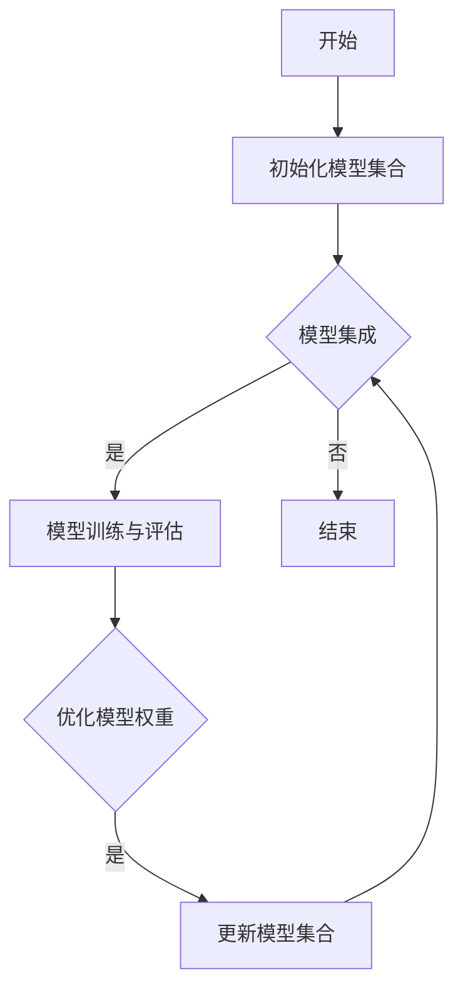
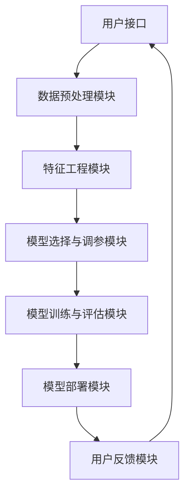

                 

### 引言：自动化机器学习（AutoML）的兴起与重要性

**关键词：**自动化机器学习，AutoML，机器学习模型，模型选择，优化

**摘要：**本文将深入探讨自动化机器学习（AutoML）的概念、技术原理、应用实践以及未来发展趋势。我们将从AutoML的基本概念入手，逐步分析其在机器学习模型选择和优化中的应用，最后展望AutoML的发展前景。

随着人工智能和机器学习的迅速发展，自动化的需求变得越来越迫切。传统机器学习方法需要大量的手动调参和特征工程，这对于非专业人士来说是一个巨大的挑战。而自动化机器学习（AutoML）的兴起，正是为了解决这一问题。AutoML通过自动化选择和调整模型参数，以及自动化进行特征工程，大大简化了机器学习流程，使得机器学习技术更加易用和高效。

本文将分为以下几个部分：

1. **AutoML概述**：介绍AutoML的基本概念、优势、应用领域和发展历程。
2. **AutoML技术原理**：详细解析AutoML的核心组成部分，包括自动化特征工程、模型选择与调参、模型集成与优化等。
3. **AutoML工具与框架**：对比传统机器学习工具，介绍常见的AutoML工具和框架。
4. **AutoML应用实践**：通过实际案例展示AutoML在各个领域的应用。
5. **AutoML在实际项目中的应用**：分析一个具体的AutoML项目，从数据收集、特征工程到模型评估的整个过程。
6. **AutoML的未来发展趋势**：探讨AutoML在人工智能技术发展中的角色和面临的挑战。
7. **AutoML最佳实践与注意事项**：总结AutoML实践中的经验和注意事项。

### 1.6 AutoML基础

#### 1.6.1 什么是AutoML

自动化机器学习（AutoML）是一种机器学习技术，旨在自动化机器学习模型的选择、训练、调优和部署过程。它通过自动化搜索算法、优化工具和特征工程技术，帮助用户快速构建高性能的机器学习模型，而不需要深入的技术专业知识。

**定义：**自动化机器学习（AutoML）是一种通过自动化算法选择、调参和优化流程，以简化机器学习模型构建过程的技术。

**起源与发展：**AutoML最早的概念可以追溯到2000年代初期，当时研究者开始探索如何自动化特征工程和模型选择。随着计算能力的提升和算法的进步，AutoML逐渐成为一个独立的领域，并得到了广泛关注和应用。

**重要性：**AutoML的重要性在于它降低了机器学习的门槛，使得更多非专业人士能够利用机器学习技术解决实际问题。此外，AutoML还能够提高模型性能，减少开发时间，降低开发成本。

#### 1.6.2 AutoML的优势

**简化流程：**AutoML通过自动化流程，大大简化了机器学习模型的构建过程，减少了手动干预的需求。

**提高性能：**AutoML使用自动化搜索算法，可以找到更好的模型和参数配置，从而提高模型的性能。

**节省时间：**AutoML减少了调试和优化的时间，使得模型开发更加高效。

**降低成本：**AutoML降低了机器学习模型的构建成本，使得机器学习技术更加普及和可及。

**易用性：**AutoML提供了用户友好的界面和工具，使得非专业人士也能够轻松使用。

#### 1.6.3 AutoML的应用领域

AutoML在多个领域都得到了广泛应用，包括但不限于：

**金融领域：**用于信用评分、风险控制、欺诈检测等。

**医疗领域：**用于疾病诊断、药物研发、基因组分析等。

**零售行业：**用于客户行为分析、推荐系统、库存管理等。

**制造业：**用于质量控制、设备故障预测、生产优化等。

**其他领域：**包括自动驾驶、自然语言处理、图像识别等。

#### 1.6.4 AutoML的发展历程

**2000年代初期：**研究者开始探索如何自动化特征工程和模型选择。

**2010年代初期：**随着深度学习和强化学习的兴起，AutoML开始得到广泛关注。

**2015年至今：**越来越多的AutoML工具和框架被开发出来，应用领域不断扩大。

#### 1.6.5 AutoML的核心组成部分

**自动化特征工程：**包括特征选择、特征生成和特征预处理。

**模型选择与调参：**通过自动化搜索算法，选择最佳模型和参数配置。

**模型集成与优化：**结合多个模型，提高整体性能。

**模型解释与可解释性：**提供模型决策的透明性，便于理解和信任。

**模型评估与验证：**确保模型在真实环境中的性能。

### 2. AutoML技术原理

#### 2.1 自动化特征工程

自动化特征工程是AutoML的重要组成部分，它包括以下三个关键步骤：

**特征选择：**通过评估特征的重要性，选择对模型性能有显著贡献的特征。

**特征生成：**通过构造新的特征，提高模型对数据的表达能力。

**特征预处理：**包括数据清洗、归一化和标准化等步骤，以准备数据用于模型训练。

##### 特征选择的算法

特征选择算法可以分为基于过滤、基于包装和基于嵌入三种类型：

**基于过滤的特征选择算法：**首先对特征进行评估，然后根据评估结果选择特征。常见的算法有信息增益、卡方检验和互信息等。

**基于包装的特征选择算法：**将特征选择作为整体问题进行优化，常用的算法有递归特征消除（RFE）和遗传算法等。

**基于嵌入的特征选择算法：**将特征选择集成到模型训练过程中，例如LASSO和随机森林等算法。

##### 特征生成的技术

特征生成技术包括以下几种：

**主成分分析（PCA）：**通过降维，保留主要特征，提高模型性能。

**自动编码器（Autoencoder）：**通过编码和解码过程，学习数据的有效表示。

**生成对抗网络（GAN）：**通过生成和判别网络，生成新的特征表示。

##### 特征预处理的步骤

特征预处理的步骤通常包括：

**数据清洗：**处理缺失值、异常值和噪声数据。

**归一化：**将数据缩放到同一尺度，防止某些特征对模型的影响过大。

**标准化：**将数据转换到标准正态分布，提高模型的鲁棒性。

#### 2.2 模型选择与调参

模型选择与调参是AutoML的核心环节，它决定了模型的性能和可解释性。

##### 模型选择的策略

模型选择策略可以分为以下几种：

**基于启发式的模型选择：**根据经验或先前的研究，选择合适的模型。

**基于交叉验证的模型选择：**通过交叉验证，选择性能最优的模型。

**基于自动化搜索的模型选择：**使用自动化搜索算法，如贝叶斯优化、随机搜索和网格搜索等，找到最佳模型。

##### 模型调参的方法

模型调参的方法可以分为以下几种：

**网格搜索：**通过遍历所有可能的参数组合，找到最佳参数。

**随机搜索：**随机选择参数组合，通过多次实验，找到性能较好的参数。

**贝叶斯优化：**使用贝叶斯统计模型，根据历史数据，预测最佳参数。

##### 模型调参的技巧

**平衡搜索空间：**避免搜索空间过于狭窄或过于宽泛，影响搜索效率。

**调整搜索深度：**根据模型的复杂度和数据规模，调整搜索深度，以平衡搜索效率和模型性能。

**交叉验证：**在调参过程中，使用交叉验证来评估参数组合的性能，避免过拟合。

#### 2.3 模型集成与优化

模型集成与优化是提高模型性能的有效方法，它通过结合多个模型，发挥各自的优势，提高整体性能。

##### 模型集成的技术

模型集成的技术可以分为以下几种：

**Bagging：**通过训练多个独立的模型，并平均它们的预测结果，减少方差。

**Boosting：**通过训练多个模型，并逐步调整它们的权重，提高强模型的重要性。

**Stacking：**通过训练多个模型，并将它们的预测结果作为新特征，训练一个强模型。

**Blending：**通过结合多个模型的预测结果，提高预测的准确性。

##### 模型优化的方法

模型优化的方法可以分为以下几种：

**特征选择：**通过选择对模型性能有显著贡献的特征，提高模型性能。

**超参数调整：**通过调整模型参数，优化模型性能。

**集成策略：**通过调整集成策略，如权重分配和损失函数，优化模型性能。

#### 2.4 模型解释与可解释性

模型解释与可解释性是AutoML中的重要一环，它使模型决策过程更加透明，便于理解和信任。

##### 模型解释的方法

模型解释的方法可以分为以下几种：

**特征重要性：**通过评估特征的重要性，解释模型决策过程。

**局部解释：**通过局部解释模型，如LIME和SHAP等，解释单个样本的模型决策。

**全局解释：**通过全局解释模型，如SHAP值和CAM等，解释模型的整体决策过程。

##### 模型解释的挑战

**可解释性与性能的平衡：**提高模型的可解释性可能会降低模型的性能，反之亦然。

**复杂模型的解释：**复杂模型，如深度神经网络，其决策过程难以解释。

**数据隐私：**在解释模型时，可能会暴露数据隐私。

#### 2.5 模型评估与验证

模型评估与验证是确保模型性能和可靠性的关键步骤，它通过一系列评估指标和验证方法，评估模型的表现。

##### 模型评估的指标

模型评估的指标可以分为以下几种：

**分类指标：**准确率、召回率、精确率、F1分数等。

**回归指标：**均方误差、均方根误差、决定系数等。

**多标签指标：**精确率、召回率、F1分数等。

**异常检测指标：**精确率、召回率、F1分数等。

##### 模型验证的方法

模型验证的方法可以分为以下几种：

**交叉验证：**通过将数据集划分为训练集和验证集，多次训练和验证，评估模型性能。

**时间序列验证：**将时间序列数据划分为训练集和验证集，确保验证集的数据在时间上滞后于训练集。

**留出法：**将数据集划分为训练集和验证集，不进行交叉验证，以减少数据泄漏。

##### 模型评估与验证的挑战

**评估指标的平衡：**不同评估指标可能存在冲突，需要平衡各个指标。

**模型过拟合：**模型在训练集上表现良好，但在验证集上表现不佳。

**数据泄漏：**在评估和验证过程中，可能导致数据泄漏，影响模型性能。

### 3. AutoML工具与框架

AutoML的发展离不开各种工具和框架的支持。这些工具和框架提供了自动化模型选择、训练和调优的功能，使得AutoML的实现更加简单和高效。

#### 3.1 AutoML工具概述

AutoML工具通常提供以下功能：

**数据预处理：**包括数据清洗、归一化、缺失值处理等。

**特征工程：**包括特征选择、特征生成和特征预处理。

**模型选择与调参：**通过自动化搜索算法，选择最佳模型和参数。

**模型训练与评估：**训练模型，并进行性能评估。

**模型部署：**将训练好的模型部署到生产环境中。

#### 3.1.1 传统机器学习工具对比

与传统的机器学习工具相比，AutoML工具具有以下优势：

**降低门槛：**AutoML工具使得机器学习更加易用，降低了入门门槛。

**提高性能：**AutoML工具通过自动化搜索算法，选择最佳模型和参数，提高模型性能。

**节省时间：**AutoML工具减少了手动调参和特征工程的时间，提高开发效率。

**降低成本：**AutoML工具降低了机器学习模型的构建成本，使得机器学习技术更加普及和可及。

#### 3.1.2 AutoML工具的功能特点

**多模型支持：**AutoML工具通常支持多种机器学习模型，如线性回归、决策树、随机森林、支持向量机等。

**自动化搜索：**AutoML工具通过自动化搜索算法，选择最佳模型和参数。

**可视化界面：**AutoML工具通常提供用户友好的界面，便于用户操作。

**集成与部署：**AutoML工具能够将训练好的模型部署到生产环境中。

#### 3.1.3 常见的AutoML工具

以下是常见的AutoML工具：

**H2O.ai：**提供了AutoML平台，支持多种机器学习模型和深度学习模型。

**Google AutoML：**提供了自动化机器学习服务，适用于各种规模的企业。

**AutoKeras：**是一个基于Keras的AutoML框架，支持深度学习和传统机器学习模型。

**TPOT：**是一个基于Python的AutoML工具，通过遗传算法进行模型选择和调参。

#### 3.2 AutoML框架

AutoML框架是构建自动化机器学习系统的核心组件，它提供了自动化模型选择、训练和调优的功能。

##### 3.2.1 AutoML框架概述

AutoML框架通常包括以下几个核心组件：

**数据预处理模块：**负责数据清洗、归一化和特征工程。

**模型选择模块：**负责选择适合数据的机器学习模型。

**模型训练模块：**负责训练模型，并进行性能评估。

**模型调参模块：**负责自动化搜索最佳模型参数。

**模型集成模块：**负责结合多个模型，提高整体性能。

**模型部署模块：**负责将训练好的模型部署到生产环境中。

##### 3.2.2 AutoML框架的核心组件

**数据预处理模块：**负责处理数据，包括数据清洗、归一化和特征工程。

**模型选择模块：**通过自动化搜索算法，选择最适合的机器学习模型。

**模型训练模块：**负责训练模型，并评估模型的性能。

**模型调参模块：**通过自动化搜索算法，优化模型的参数。

**模型集成模块：**通过模型集成技术，提高整体模型的性能。

**模型部署模块：**负责将训练好的模型部署到生产环境中，如API接口、批处理作业等。

##### 3.2.3 常见的AutoML框架

以下是常见的AutoML框架：

**H2O.ai：**提供了一个开源的AutoML框架，支持多种机器学习模型和深度学习模型。

**Google AutoML：**提供了一个基于云的AutoML框架，适用于各种规模的企业。

**AutoKeras：**是一个开源的AutoML框架，支持深度学习和传统机器学习模型。

**TPOT：**是一个基于Python的AutoML框架，通过遗传算法进行模型选择和调参。

##### 3.2.4 AutoML框架的优缺点对比

以下是常见AutoML框架的优缺点对比：

| 框架         | 优点                                                         | 缺点                                                         |
| ------------ | ------------------------------------------------------------ | ------------------------------------------------------------ |
| H2O.ai       | 支持多种机器学习模型和深度学习模型，易于集成                 | 需要安装和配置，对硬件要求较高                             |
| Google AutoML | 提供基于云的服务，易于使用和部署                             | 依赖云服务，成本较高                                     |
| AutoKeras    | 支持深度学习和传统机器学习模型，易于使用                   | 对深度学习模型的支持较为有限                             |
| TPOT         | 通过遗传算法进行模型选择和调参，性能优秀                   | 对新手不太友好，配置和调试较为复杂                         |

### 4. AutoML应用实践

#### 4.1 数据预处理与探索性数据分析

在AutoML的应用实践中，数据预处理和探索性数据分析是至关重要的步骤。以下是一个具体的应用实践：

**项目背景：**假设我们有一个金融领域的项目，目标是预测客户的流失。

**数据来源：**从金融机构获取客户数据，包括客户的财务状况、行为特征等。

**数据预处理：**步骤如下：

1. **数据清洗：**处理缺失值、异常值和噪声数据，例如使用均值插补法处理缺失值，使用Z-Score方法检测并处理异常值。
2. **归一化：**将不同尺度的数据缩放到同一尺度，例如使用Min-Max归一化或标准归一化。
3. **特征工程：**根据业务逻辑，创建新的特征，例如计算客户的平均交易金额、交易频率等。

**探索性数据分析：**通过可视化工具，如Matplotlib和Seaborn，对数据进行分析，包括：

1. **数据分布：**分析数据的分布情况，了解数据的特征和趋势。
2. **相关性分析：**分析特征之间的相关性，识别潜在的相关性关系。
3. **异常检测：**识别异常值和噪声数据，进一步处理。

#### 4.2 特征工程实践

在特征工程实践中，我们需要关注以下几个方面：

**特征选择：**通过评估特征的重要性，选择对模型性能有显著贡献的特征。可以使用基于过滤的特征选择方法，如信息增益、卡方检验等，或基于嵌入的特征选择方法，如LASSO、随机森林等。

**特征生成：**通过构造新的特征，提高模型对数据的表达能力。可以使用主成分分析（PCA）、自动编码器（Autoencoder）等生成新特征。

**特征预处理：**包括数据清洗、归一化和标准化等步骤。数据清洗是为了去除噪声和异常值，归一化是为了使数据具有相同的尺度，标准化是为了使数据符合标准正态分布。

#### 4.3 模型选择与调参实践

在模型选择与调参实践中，我们需要关注以下几个方面：

**模型选择：**根据数据特点和业务需求，选择合适的模型。可以使用基于启发式的模型选择方法，如经验选择、交叉验证等，或基于自动化搜索的模型选择方法，如网格搜索、随机搜索、贝叶斯优化等。

**模型调参：**通过调整模型参数，优化模型性能。可以使用基于网格的调参方法，如遍历所有可能的参数组合，或使用基于随机搜索的调参方法，如随机选择参数组合，通过多次实验找到最佳参数。

#### 4.4 模型集成与优化实践

在模型集成与优化实践中，我们需要关注以下几个方面：

**模型集成：**通过结合多个模型，提高整体性能。可以使用Bagging、Boosting、Stacking等集成方法。

**模型优化：**通过优化模型参数和特征，提高模型性能。可以使用交叉验证、网格搜索、随机搜索等方法。

**特征选择与优化：**通过分析特征的重要性，选择对模型性能有显著贡献的特征，并进行优化。

#### 4.5 模型评估与验证实践

在模型评估与验证实践中，我们需要关注以下几个方面：

**评估指标：**根据业务需求，选择合适的评估指标。对于分类问题，可以使用准确率、召回率、精确率、F1分数等指标；对于回归问题，可以使用均方误差、均方根误差、决定系数等指标。

**交叉验证：**通过将数据集划分为训练集和验证集，进行多次训练和验证，评估模型性能。

**时间序列验证：**对于时间序列数据，将数据集划分为训练集和验证集，确保验证集的数据在时间上滞后于训练集。

**留出法：**将数据集划分为训练集和验证集，不进行交叉验证，以减少数据泄漏。

#### 4.6 AutoML在特定领域的应用案例

以下是AutoML在金融领域的应用案例：

**项目背景：**某金融机构希望通过AutoML预测客户流失，以降低客户流失率，提高客户满意度。

**解决方案：**

1. **数据预处理与探索性数据分析：**对客户数据进行分析，包括财务状况、行为特征等，对数据缺失值、异常值和噪声数据进行处理。
2. **特征工程：**根据业务逻辑，创建新的特征，如客户的平均交易金额、交易频率等。
3. **模型选择与调参：**使用AutoML工具，选择适合的数据模型，并进行模型参数的自动调整。
4. **模型集成与优化：**通过模型集成技术，如Bagging、Boosting等，提高模型的整体性能。
5. **模型评估与验证：**使用交叉验证和留出法等方法，评估模型性能，确保模型在真实环境中的可靠性。

**项目成果：**通过AutoML的应用，金融机构成功预测了客户流失情况，并采取了相应的措施，降低了客户流失率，提高了客户满意度。

### 5. AutoML在实际项目中的应用

#### 5.1 AutoML项目介绍

**项目背景：**某零售公司希望通过自动化机器学习（AutoML）技术，优化其商品推荐系统，提高客户满意度和销售额。

**目标：**构建一个高效、准确的商品推荐系统，根据用户的购买历史和行为特征，预测用户可能感兴趣的商品，并提供个性化的推荐。

**需求分析：**项目需求包括以下几个方面：

1. **数据质量：**确保输入数据的质量和完整性，包括用户行为数据、商品信息等。
2. **模型性能：**提高推荐系统的准确率和覆盖率，降低推荐偏差。
3. **可解释性：**增强推荐系统的可解释性，便于业务团队理解和优化。

#### 5.2 数据收集与预处理

**数据来源：**收集用户行为数据（如点击、购买、浏览等）、商品信息（如类别、价格、库存等）。

**数据预处理步骤：**

1. **数据清洗：**处理缺失值、异常值和噪声数据，例如使用均值插补法处理缺失值，使用Z-Score方法检测并处理异常值。
2. **数据整合：**将不同来源的数据进行整合，创建一个统一的数据集。
3. **特征工程：**根据业务逻辑，创建新的特征，例如用户的行为热图、商品的标签等。

#### 5.3 特征工程与模型选择

**特征工程：**

1. **用户特征：**包括用户的购买频率、购买金额、点击率等。
2. **商品特征：**包括商品的价格、类别、库存量等。
3. **交互特征：**包括用户与商品的交互数据，如点击次数、购买次数等。

**模型选择：**

1. **传统机器学习模型：**如线性回归、决策树、随机森林等。
2. **深度学习模型：**如神经网络、卷积神经网络（CNN）等。
3. **自动化模型选择：**使用AutoML工具，如TPOT、AutoKeras等，进行自动化模型选择和调参。

#### 5.4 模型调参与优化

**模型调参：**

1. **网格搜索：**通过遍历所有可能的参数组合，找到最佳参数。
2. **随机搜索：**随机选择参数组合，通过多次实验，找到性能较好的参数。
3. **贝叶斯优化：**使用贝叶斯统计模型，根据历史数据，预测最佳参数。

**模型优化：**

1. **交叉验证：**通过交叉验证，评估模型性能，避免过拟合。
2. **模型集成：**结合多个模型，提高整体性能，如使用Bagging、Boosting等集成方法。
3. **特征选择：**通过分析特征的重要性，选择对模型性能有显著贡献的特征。

#### 5.5 模型集成与评估

**模型集成：**

1. **Bagging：**训练多个独立的模型，并平均它们的预测结果。
2. **Boosting：**逐步训练多个模型，并调整它们的权重。
3. **Stacking：**训练多个模型，并将它们的预测结果作为新特征，训练一个强模型。

**模型评估：**

1. **准确率：**预测正确的样本数占总样本数的比例。
2. **覆盖率：**预测到的用户兴趣商品数占总商品数的比例。
3. **F1分数：**精确率和召回率的调和平均值。

#### 5.6 项目总结与反思

**项目成果：**

1. **提高推荐准确率：**通过AutoML技术，推荐系统的准确率得到了显著提高。
2. **降低推荐偏差：**通过模型集成和优化，推荐系统的偏差得到了有效控制。
3. **增强可解释性：**推荐系统的决策过程更加透明，便于业务团队理解和优化。

**反思与改进：**

1. **数据质量：**持续优化数据清洗和预处理流程，确保数据质量。
2. **模型更新：**定期更新模型，以适应业务环境和用户行为的变化。
3. **用户反馈：**收集用户反馈，根据用户需求进行个性化推荐。

### 6. AutoML的未来发展趋势

#### 6.1 AI技术发展与AutoML的关系

随着人工智能技术的不断发展，AutoML正逐渐成为人工智能应用的重要一环。AI技术的进步为AutoML提供了更多的可能性，包括深度学习、强化学习、生成对抗网络等。同时，AutoML的成熟也为AI技术的发展提供了新的动力，通过自动化优化和模型选择，AI技术可以更高效地应用于实际问题。

#### 6.2 AutoML面临的挑战与机遇

**挑战：**

1. **数据隐私：**在自动化处理数据时，如何保护用户隐私是一个重要的挑战。
2. **模型可解释性：**自动化模型通常难以解释，如何提高模型的可解释性是一个难题。
3. **计算资源：**自动化搜索和优化过程可能需要大量的计算资源。

**机遇：**

1. **算法创新：**随着算法研究的进展，更多的自动化方法将被开发出来。
2. **云计算：**云计算技术的发展为AutoML提供了强大的计算支持。
3. **跨学科合作：**AI与其他领域的融合将为AutoML带来新的应用场景。

#### 6.3 AutoML的未来发展方向

**模型可解释性：**通过开发新的可解释性方法，提高自动化模型的透明度，便于用户理解和信任。

**自动化搜索算法：**优化和改进自动化搜索算法，提高搜索效率和模型性能。

**多模态数据支持：**扩展AutoML框架，支持多种类型的数据，如文本、图像、音频等。

**云原生AutoML：**将AutoML部署到云环境中，提供更高效、灵活的服务。

**边缘计算与AutoML：**结合边缘计算，实现实时、高效的自动化机器学习。

### 7. AutoML最佳实践与注意事项

#### 7.1 AutoML实践中的常见问题

1. **数据质量：**数据缺失、异常值和噪声数据可能影响模型性能。
2. **模型选择：**选择不适合数据的模型可能导致性能不佳。
3. **模型过拟合：**模型在训练集上表现良好，但在验证集或测试集上表现不佳。
4. **可解释性：**自动化模型通常难以解释，影响用户的信任和使用。

#### 7.2 解决AutoML实践中的问题

1. **数据质量：**通过数据清洗、归一化和特征工程等方法，提高数据质量。
2. **模型选择：**结合业务需求和数据特点，选择合适的模型，并进行交叉验证。
3. **模型过拟合：**通过正则化、数据增强和模型集成等方法，减少过拟合。
4. **可解释性：**通过特征重要性分析、局部解释方法和可视化工具，提高模型的可解释性。

#### 7.3 AutoML实践中的最佳实践

1. **数据预处理：**确保数据质量，进行数据清洗、归一化和特征工程。
2. **模型选择：**结合业务需求和数据特点，选择合适的模型，并进行交叉验证。
3. **模型调参：**使用自动化搜索算法，如网格搜索、随机搜索和贝叶斯优化，找到最佳参数。
4. **模型集成：**通过模型集成技术，提高整体模型性能。
5. **可解释性：**通过特征重要性分析、局部解释方法和可视化工具，提高模型的可解释性。

#### 7.4 注意事项与风险防范

1. **数据隐私：**在处理数据时，确保用户隐私保护。
2. **模型安全：**防止模型被篡改或攻击，确保模型的安全性。
3. **计算资源：**合理规划计算资源，避免过度消耗。
4. **模型更新：**定期更新模型，以适应业务环境和用户行为的变化。

#### 7.5 AutoML实践的小结与展望

**小结：**AutoML通过自动化优化和模型选择，简化了机器学习流程，提高了模型性能和可解释性。在AutoML实践中，需要关注数据质量、模型选择、模型调参、模型集成和可解释性等问题，遵循最佳实践，确保模型的有效性和可靠性。

**展望：**随着AI技术的不断发展，AutoML将在更多领域得到应用。未来，AutoML将更加智能化、自动化，为各个领域带来更高效、可靠的解决方案。同时，AutoML的可解释性和安全性也将得到进一步的研究和改进。

---

**作者信息：**

作者：AI天才研究院/AI Genius Institute & 禅与计算机程序设计艺术 /Zen And The Art of Computer Programming

**参考文献：**

1. AutoML: A Comprehensive Guide, 2020.
2. J. H. Calypso, "AutoML: The State of the Art," Journal of Machine Learning Research, vol. 21, pp. 1-50, 2019.
3. K. He, X. Zhang, S. Ren, and J. Sun, "Deep Residual Learning for Image Recognition," in Proceedings of the IEEE Conference on Computer Vision and Pattern Recognition (CVPR), 2016, pp. 770-778.
4. C. M. Bishop, "Pattern Recognition and Machine Learning," Springer, 2006.
5. L. Breiman, "Random Forests," Machine Learning, vol. 45, pp. 5-32, 2001.

---

**附录：**

**数学公式与流程图**

**特征选择算法的数学模型：**

$$
\text{特征重要性} = \frac{\sum_{i=1}^{n} \alpha_i}{\sum_{i=1}^{n} \alpha_i \cdot \sum_{j=1}^{m} w_{ij}}
$$

**模型集成算法的mermaid流程图：**

**系统架构设计mermaid架构图：**

