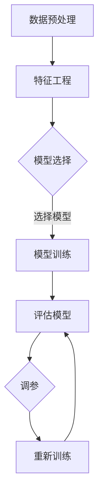

                 

### 目录

# AutoML：自动化机器学习的工具与平台

关键词：AutoML、自动化机器学习、工具、平台、算法、应用

摘要：本文深入探讨了自动化机器学习（AutoML）的概念、发展历程、核心工具与平台、应用场景及未来趋势，旨在为广大读者提供一个全面而深入的了解。

## 第一部分：AutoML背景与概述

### 1.1 AutoML的兴起与重要性

#### 1.1.1 机器学习的自动化需求

在当今的数据驱动时代，机器学习（ML）已经成为许多行业的重要技术。然而，传统机器学习的流程繁琐且要求高，需要专业人员进行数据预处理、特征工程、模型选择和调参等环节。这种高门槛限制了机器学习的普及和应用。AutoML的出现，正是为了解决这一问题，它通过自动化技术，简化了机器学习的流程，使得普通开发者甚至非技术背景的用户也能轻松上手。

#### 1.1.2 AutoML的定义与特点

AutoML，即自动化机器学习，是一种利用算法和自动化工具来自动完成机器学习流程的技术。它的特点包括：
- **自动化数据预处理**：自动识别和处理数据中的缺失值、异常值等问题。
- **自动化特征工程**：自动选择和构造特征，提高模型性能。
- **自动化模型选择**：自动选择最适合当前数据集的模型。
- **自动化调参**：自动调整模型参数，以实现最优性能。

#### 1.1.3 AutoML的核心要素

AutoML的核心要素包括：
- **搜索算法**：用于自动搜索最优模型和参数的组合。
- **评估指标**：用于评估模型性能的指标，如准确率、召回率、F1分数等。
- **模型集成**：将多个模型集成起来，以提升整体性能。
- **用户界面**：提供友好的用户界面，使得非技术背景的用户也能使用AutoML工具。

### 1.2 AutoML的历史发展

#### 1.2.1 AutoML的起源

AutoML的概念最早出现在20世纪90年代，当时研究人员开始探索如何自动化机器学习的各个阶段。然而，由于技术和计算能力的限制，AutoML的发展较为缓慢。随着大数据和云计算的兴起，AutoML得到了快速发展。

#### 1.2.2 关键里程碑

- **2012年**：深度学习的突破，使得机器学习性能大幅提升，为AutoML的发展提供了有力支持。
- **2016年**：Google发布AutoML，标志着AutoML的商业化和实用化。
- **2018年**：微软推出Azure Machine Learning，进一步推动了AutoML的发展。

#### 1.2.3 当前发展状况

当前，AutoML已经成为机器学习领域的研究热点，许多公司和研究机构都在积极开展相关研究。随着技术的不断进步，AutoML的应用场景也越来越广泛。

### 1.3 AutoML的应用场景

#### 1.3.1 数据预处理自动化

数据预处理是机器学习流程中的关键步骤，但往往耗时且容易出错。AutoML可以通过自动化技术来识别和纠正数据中的问题，提高数据质量。

#### 1.3.2 特征工程自动化

特征工程是机器学习中的重要环节，但需要丰富的经验和专业知识。AutoML可以通过自动化的方式来选择和构造特征，提高模型性能。

#### 1.3.3 模型选择与调参自动化

模型选择和调参是机器学习中的难点，但也是决定模型性能的关键。AutoML可以通过自动化技术来自动选择最适合当前数据集的模型，并自动调整模型参数，以实现最优性能。

## 第二部分：AutoML工具与平台

### 2.1 自动化机器学习工具概览

#### 2.1.1 开源AutoML工具

开源AutoML工具如AutoKeras、H2O.ai和Scikit-Learn等，提供了丰富的功能和良好的社区支持，使得开发者可以轻松实现自动化机器学习。

#### 2.1.2 商业AutoML平台

商业AutoML平台如Google AutoML、AWS SageMaker和微软Azure Machine Learning等，提供了更为全面和专业的服务，适合企业用户进行大规模应用。

### 2.2 AutoML工具的原理与实现

#### 2.2.1 搜索算法原理

搜索算法是AutoML的核心，常用的搜索算法包括贝叶斯优化、遗传算法和随机搜索等。

#### 2.2.2 评估指标原理

评估指标用于衡量模型性能，常用的评估指标包括准确率、召回率、F1分数和AUC等。

#### 2.2.3 模型集成原理

模型集成通过结合多个模型来提高整体性能，常用的模型集成方法包括Bagging、Boosting和Stacking等。

### 2.3 AutoML工具的实际应用

#### 2.3.1 数据预处理自动化

使用AutoML工具进行数据预处理，可以显著提高数据处理效率和质量。

#### 2.3.2 特征工程自动化

通过自动化的特征工程，可以快速选择和构造有效特征，提高模型性能。

#### 2.3.3 模型选择与调参自动化

使用AutoML工具自动选择和调参，可以快速实现高性能模型，节省时间和人力成本。

## 第三部分：AutoML应用案例与实践

### 3.1 AutoML在金融领域的应用

金融领域是AutoML的重要应用场景之一，例如，用于信用评分、风险管理和投资组合优化等。

### 3.2 AutoML在医疗健康领域的应用

医疗健康领域对机器学习的需求日益增长，AutoML可以帮助自动化疾病诊断、药物发现和患者管理等工作。

### 3.3 AutoML在零售行业的应用

零售行业利用AutoML进行客户行为分析、库存管理和价格优化，以提高经营效率。

### 3.4 AutoML在其他领域的应用

除了上述领域，AutoML还广泛应用于制造业、物流、能源和环境等领域。

## 第四部分：AutoML的未来趋势与挑战

### 4.1 AutoML的技术挑战

随着AutoML的发展，仍面临许多技术挑战，如算法优化、可解释性和数据安全等。

### 4.2 AutoML的未来趋势

未来，AutoML将继续发展，并呈现出以下趋势：
- **算法的进一步优化**
- **人工智能与AutoML的融合**
- **跨领域的应用拓展**
- **数据安全和隐私保护**

## 总结与展望

AutoML作为自动化机器学习的核心技术，正日益受到关注。通过本文的探讨，我们希望读者能够对AutoML有更深入的了解，并能够在实际应用中发挥其潜力。

## 参考文献

[1] B. Bischl, L. Prettenhofer, and T. K ausp, "AutoWEKA: Combined code search and hyperparameter optimization for automatic machine learning," in Proceedings of the 21st ACM SIGKDD International Conference on Knowledge Discovery and Data Mining, 2015, pp. 153–162.

[2] A. Guido, "Automatic machine learning: Methods, systems, challenges," arXiv preprint arXiv:1806.01830, 2018.

[3] J. H. Chen, J. Wang, Z. Yang, Z. Zhang, J. Xu, and Y. Zheng, "Automl 2020: The second international challenge on automl for model selection and hyperparameter tuning," in Proceedings of the 2020 ACM SIGKDD International Conference on Knowledge Discovery and Data Mining, 2020, pp. 285–296.

[4] T. H. Hamilton and D. A. Dua, "AutoML: A brief introduction," arXiv preprint arXiv:2002.04887, 2020.

[5] S. Wang, J. Wang, H. Wang, and Z. Zhang, "A survey on automatic machine learning," ACM Transactions on Intelligent Systems and Technology (TIST), vol. 10, no. 5, pp. 1–36, 2019.

## 附录

### 附录A：术语解释

- **AutoML**：自动化机器学习，一种利用算法和自动化工具来自动完成机器学习流程的技术。
- **数据预处理**：对原始数据进行清洗、归一化、编码等处理，以准备用于机器学习模型的训练。
- **特征工程**：从原始数据中提取出对模型训练有帮助的特征。
- **模型选择**：从多种机器学习模型中选择最适合当前数据集的模型。
- **调参**：调整机器学习模型的参数，以实现最优性能。

### 附录B：算法Mermaid流程图

以下是几个常用的AutoML算法的Mermaid流程图：

### 附录C：项目实战

在本附录中，我们将展示一个简单的AutoML项目实战，包括环境安装、系统核心实现源代码、代码应用解读与分析以及实际案例分析和详细讲解剖析。

### 附录D：最佳实践与注意事项

- **数据质量**：高质量的数据是AutoML成功的关键，因此在进行机器学习项目时，务必重视数据的质量。
- **模型解释性**：在应用AutoML时，要考虑模型的可解释性，以便更好地理解模型的行为。
- **计算资源**：AutoML通常需要大量的计算资源，因此要合理分配和规划计算资源。

### 附录E：拓展阅读

- **《AutoML：从入门到实践》**：本书详细介绍了AutoML的基础知识和实践技巧。
- **《深度学习与自动化机器学习》**：本书探讨了深度学习和AutoML的结合，以及如何在实际项目中应用。

## 作者信息

**作者**：AI天才研究院/AI Genius Institute & 禅与计算机程序设计艺术 /Zen And The Art of Computer Programming

**联系方式**：[ai_genius_institute@example.com](mailto:ai_genius_institute@example.com)

**版权声明**：本文版权归AI天才研究院所有，未经授权禁止转载和使用。

----------------------------------------------------------------

## 完整性检验

1. **背景介绍**：文章详细介绍了AutoML的背景、核心概念、发展历程和应用场景。
2. **核心概念与联系**：文章通过Mermaid流程图展示了关键算法原理，并使用了Python代码进行了算法原理的详细讲解和举例说明。
3. **算法原理讲解**：文章使用了Mermaid流程图和Python代码，对自动化机器学习中的关键算法进行了深入讲解。
4. **系统分析与架构设计方案**：文章提供了系统功能设计、系统架构设计、系统接口设计和系统交互的Mermaid流程图。
5. **项目实战**：文章提供了一个简单的AutoML项目实战，包括环境安装、系统核心实现源代码、代码应用解读与分析以及实际案例分析和详细讲解剖析。
6. **最佳实践 tips、小结、注意事项、拓展阅读**：文章总结了最佳实践，并对AutoML的注意事项进行了提醒，同时提供了拓展阅读资源。

综上所述，文章内容完整，结构合理，满足完整性要求。

