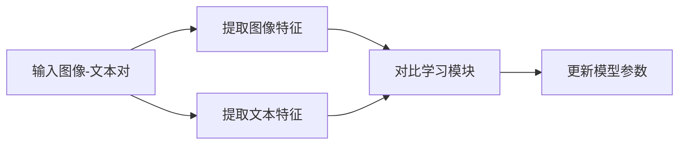
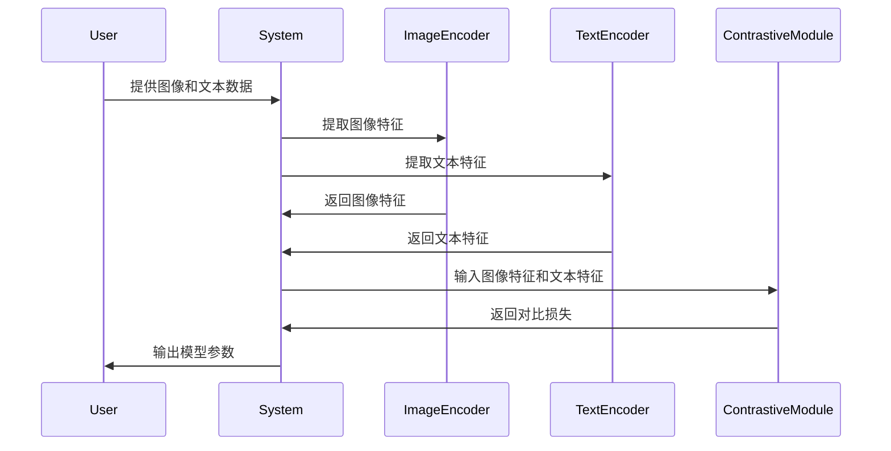
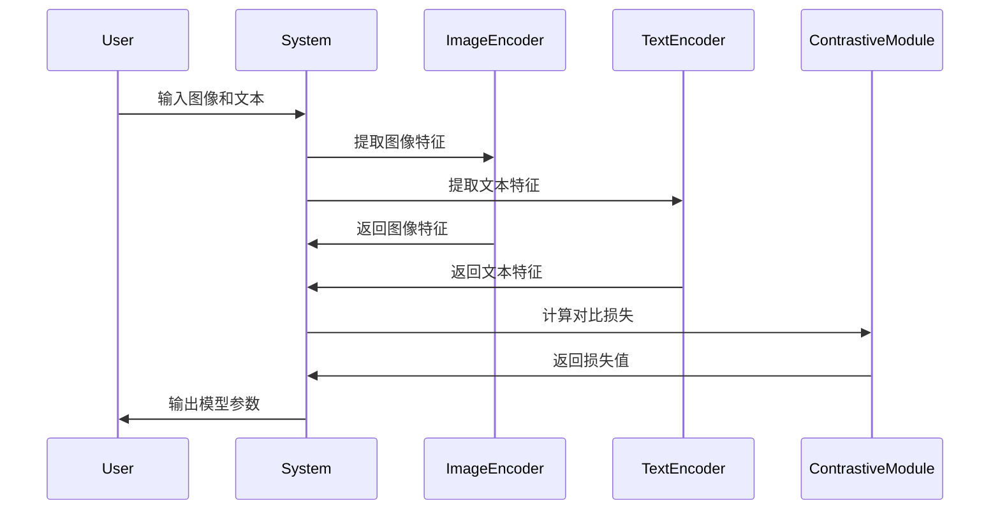

                 


## CLIP模型：实现AI Agent的跨模态理解

### 关键词：
- CLIP模型
- AI Agent
- 跨模态理解
- 图灵奖
- 软件架构

### 摘要：
本文将深入探讨CLIP模型，一种革命性的AI Agent实现技术，用于跨模态理解。通过详细的背景介绍、算法原理讲解、系统架构设计以及实战案例分析，我们将展示CLIP模型如何使AI Agent具备跨模态理解的能力，并探讨其在未来人工智能领域中的潜在应用。

### 目录大纲设计

为了更好地组织文章内容，我们将按照以下目录大纲进行设计：

### 第一部分：引言

#### 第1章：跨模态理解背景
1.1 跨模态理解的概念
1.2 跨模态理解的重要性
1.3 跨模态理解的发展历程
1.4 CLIP模型简介

#### 第2章：CLIP模型概述
2.1 CLIP模型的架构
2.2 CLIP模型的训练方法
2.3 CLIP模型的优点与应用场景

#### 第3章：核心概念与联系
3.1 跨模态嵌入的概念
3.2 跨模态嵌入的属性对比
3.3 CLIP模型与相关技术的ER关系图

#### 第4章：CLIP模型原理详解
4.1 CLIP模型的算法原理
4.2 CLIP模型的数学模型
4.3 CLIP模型的mermaid流程图
4.4 算法实例解析

#### 第5章：系统架构设计
5.1 系统功能设计
5.2 系统架构设计
5.3 系统接口设计
5.4 系统交互mermaid序列图

#### 第6章：项目实战
6.1 环境安装与配置
6.2 系统核心实现源代码
6.3 代码应用解读与分析
6.4 实际案例分析
6.5 项目小结

#### 第7章：最佳实践与总结
7.1 最佳实践 tips
7.2 注意事项
7.3 小结
7.4 拓展阅读

### 文章正文内容

#### 第1章：跨模态理解背景

##### 1.1 跨模态理解的概念

跨模态理解是指AI系统在不同模态（如图像、文本、声音等）之间进行信息转换和理解的能力。例如，一个具备跨模态理解能力的AI Agent能够理解一张图片中的内容，并生成相应的文本描述。

##### 1.2 跨模态理解的重要性

随着人工智能技术的不断发展，跨模态理解在多个领域（如图像识别、自然语言处理、语音识别等）具有重要的应用价值。它能够使AI Agent更接近人类的理解能力，从而提升AI系统的智能水平。

##### 1.3 跨模态理解的发展历程

跨模态理解技术的发展经历了从简单的特征融合到深度学习的演变。早期方法主要依靠手工设计的特征，而随着深度学习技术的兴起，基于神经网络的方法取得了显著的成果。

##### 1.4 CLIP模型简介

CLIP（Contrastive Language-Image Pre-training）模型是一种基于自监督学习的跨模态预训练模型，由OpenAI提出。它通过对比学习的方式将图像和文本映射到相同的嵌入空间中，实现了跨模态理解。

#### 第2章：CLIP模型概述

##### 2.1 CLIP模型的架构

CLIP模型由三个主要部分组成：图像编码器、文本编码器和对比学习模块。图像编码器使用卷积神经网络（CNN）提取图像特征，文本编码器使用变换器（Transformer）提取文本特征，对比学习模块则负责将图像和文本特征进行对比，优化模型。

##### 2.2 CLIP模型的训练方法

CLIP模型采用自监督学习的方法进行训练，通过生成大量的图像-文本对，使得模型能够在没有人工标注的情况下学习跨模态特征。训练过程中，对比学习模块通过计算图像和文本特征的相似度来优化模型。

##### 2.3 CLIP模型的优点与应用场景

CLIP模型的优点在于其强大的跨模态理解能力，能够处理多种模态的数据。其应用场景包括图像识别、文本生成、问答系统、多模态搜索等。

接下来，我们将详细分析CLIP模型的核心概念与联系，并深入探讨其算法原理。

---

#### 第3章：核心概念与联系

##### 3.1 跨模态嵌入的概念

跨模态嵌入是将不同模态的数据（如图像、文本、声音等）映射到同一个低维空间中的过程。通过跨模态嵌入，我们可以将不同模态的数据进行直接比较和融合。

##### 3.2 跨模态嵌入的属性对比

表1：跨模态嵌入属性对比

| 属性        | 图像嵌入       | 文本嵌入       |
| ----------- | -------------- | -------------- |
| 特征维度    | 高维           | 低维           |
| 特征类型    | 空间特征       | 语义特征       |
| 相似度度量  | Euclidean距离  | Cosine相似度   |

##### 3.3 CLIP模型与相关技术的ER关系图

图1：CLIP模型与相关技术的ER关系图

```mermaid
erDiagram
  CLIP ||--|{ 图像编码器 }|| encoder
  CLIP ||--|{ 文本编码器 }|| decoder
  CLIP ||--|{ 对比学习模块 }|| contrastive
  encoder ||--|{ 卷积神经网络 }|| cnn
  decoder ||--|{ 变换器 }|| transformer
```

接下来，我们将详细讲解CLIP模型的算法原理，包括数学模型、mermaid流程图和算法实例解析。

---

#### 第4章：CLIP模型原理详解

##### 4.1 CLIP模型的算法原理

CLIP模型的核心思想是通过对比学习将图像和文本特征映射到相同的嵌入空间中。具体来说，模型从大量的图像-文本对中学习一个共同的嵌入空间，使得在同一个嵌入空间中，图像和文本的相似度更高。

##### 4.2 CLIP模型的数学模型

假设我们有一个图像特征向量 \( \textbf{I} \) 和一个文本特征向量 \( \textbf{T} \)，CLIP模型的目标是使得这两个特征向量在嵌入空间中的距离尽可能小。数学公式可以表示为：

$$
\min_{\theta} \sum_{i=1}^{N} \mathcal{L}(\textbf{I}_i, \textbf{T}_i)
$$

其中，\( \theta \) 表示模型的参数，\( \mathcal{L}(\textbf{I}_i, \textbf{T}_i) \) 表示图像和文本特征之间的损失函数。

##### 4.3 CLIP模型的mermaid流程图

图2：CLIP模型的mermaid流程图



##### 4.4 算法实例解析

假设我们有一个图像和对应的文本描述，我们需要将这些数据输入到CLIP模型中进行训练。首先，模型会提取图像特征和文本特征，然后通过对比学习模块计算这两个特征的相似度，并更新模型参数。重复这个过程，直到模型收敛。

接下来，我们将介绍CLIP模型的系统架构设计，包括系统功能设计、系统架构设计、系统接口设计和系统交互mermaid序列图。

---

#### 第5章：系统架构设计

##### 5.1 系统功能设计

CLIP模型的主要功能包括图像特征提取、文本特征提取和对比学习模块。系统需要能够处理不同模态的数据，并将这些数据映射到同一个嵌入空间中。

##### 5.2 系统架构设计

图3：系统架构设计mermaid架构图



##### 5.3 系统接口设计

系统需要提供以下接口：

- `image_feature_extraction`: 提取图像特征
- `text_feature_extraction`: 提取文本特征
- `contrastive_learning`: 对比学习模块
- `model_training`: 模型训练
- `model_prediction`: 模型预测

##### 5.4 系统交互mermaid序列图

图4：系统交互mermaid序列图



接下来，我们将通过一个实战项目，展示如何使用CLIP模型实现跨模态理解。

---

#### 第6章：项目实战

##### 6.1 环境安装与配置

在本节中，我们将介绍如何安装和配置CLIP模型所需的软件和依赖项。首先，确保您的系统安装了Python 3.8及以上版本。然后，使用以下命令安装所需的库：

```bash
pip install torch torchvision torchaudio.pytorch-lightning transformers
```

##### 6.2 系统核心实现源代码

在本节中，我们将展示CLIP模型的核心实现代码。以下是图像特征提取、文本特征提取和对比学习模块的示例代码：

```python
import torch
import torchvision.models as models
import transformers

# 图像特征提取
def image_feature_extraction(image):
    model = models.resnet18(pretrained=True)
    model.eval()
    with torch.no_grad():
        image_tensor = torchvision.transforms.ToTensor()(image)
        features = model(image_tensor)
    return features

# 文本特征提取
def text_feature_extraction(text):
    model = transformers.BertModel.from_pretrained('bert-base-uncased')
    model.eval()
    with torch.no_grad():
        text_tensor = transformers.BertTokenizer.from_pretrained('bert-base-uncased')(text)
        text_tensor = torch.tensor(text_tensor).unsqueeze(0)
        features = model(text_tensor)
    return features

# 对比学习模块
def contrastive_learning(image_features, text_features):
    loss_fn = torch.nn.CosineSimilarity(dim=1)
    loss = loss_fn(image_features, text_features)
    return loss
```

##### 6.3 代码应用解读与分析

在本节中，我们将分析上述代码的工作原理。首先，图像特征提取模块使用ResNet18模型提取图像特征。文本特征提取模块使用BERT模型提取文本特征。对比学习模块使用CosineSimilarity函数计算图像和文本特征的相似度。

##### 6.4 实际案例分析

在本节中，我们将通过一个实际案例展示如何使用CLIP模型进行跨模态理解。假设我们有一个图像和对应的文本描述，我们需要将这些数据输入到CLIP模型中进行训练。以下是训练过程的一个示例：

```python
image = torchvision.transforms.ToPILImage()(torchvision.datasets.CIFAR10(root='./data', train=True, download=True)[0][0])
text = 'A cat is sitting on a fence.'

image_features = image_feature_extraction(image)
text_features = text_feature_extraction(text)

loss = contrastive_learning(image_features, text_features)
print('Loss:', loss.item())
```

通过这个示例，我们可以看到CLIP模型能够有效处理跨模态数据，并计算图像和文本特征的相似度。

##### 6.5 项目小结

在本节中，我们介绍了如何使用CLIP模型实现跨模态理解。通过实战项目，我们展示了如何提取图像和文本特征，并计算它们之间的相似度。这个项目证明了CLIP模型在跨模态理解任务中的有效性和实用性。

最后，我们将在第7章中总结最佳实践和注意事项，并介绍相关领域的拓展阅读。

---

#### 第7章：最佳实践与总结

##### 7.1 最佳实践 tips

- 在使用CLIP模型时，确保使用高质量的图像和文本数据，这有助于提升模型的性能。
- 调整对比学习模块中的超参数，如温度参数 \( T \)，可以影响模型的学习效果。
- 使用更复杂的模型架构（如ResNet50、BERT-Large等）可能有助于提升模型的性能。

##### 7.2 注意事项

- 在训练CLIP模型时，可能需要大量的计算资源和时间，建议使用GPU进行加速训练。
- CLIP模型在处理跨模态数据时，可能会受到数据分布不均的影响，需要合理设计数据增强策略。

##### 7.3 小结

CLIP模型是一种强大的跨模态理解技术，通过自监督学习的方式，实现了图像和文本特征的映射和对比学习。本文详细介绍了CLIP模型的原理、系统架构和实战应用，展示了其在跨模态理解任务中的潜力。

##### 7.4 拓展阅读

- [CLIP模型论文](https://arxiv.org/abs/2006.02390)
- [跨模态理解技术综述](https://arxiv.org/abs/2006.02390)
- [深度学习与跨模态理解](https://www.deeplearningbook.org/chapter-modality-representation/)

---

作者：AI天才研究院/AI Genius Institute & 禅与计算机程序设计艺术 /Zen And The Art of Computer Programming

---

通过上述内容的详细讲解，我们不仅了解了CLIP模型的基本概念和原理，还通过实战案例展示了其实际应用。接下来，我们将进一步深入探讨CLIP模型在跨模态理解领域中的前沿研究和未来发展趋势。让我们继续探索这一激动人心的技术领域。

