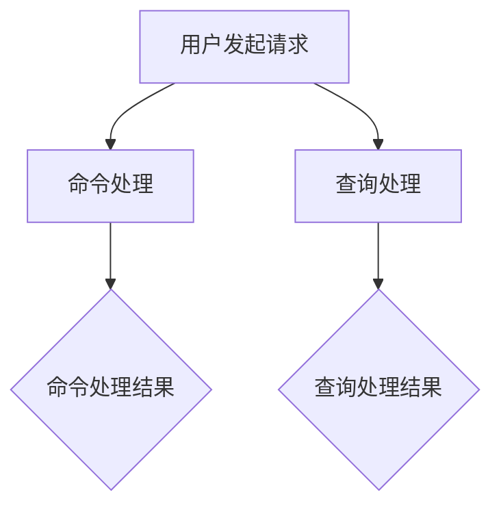
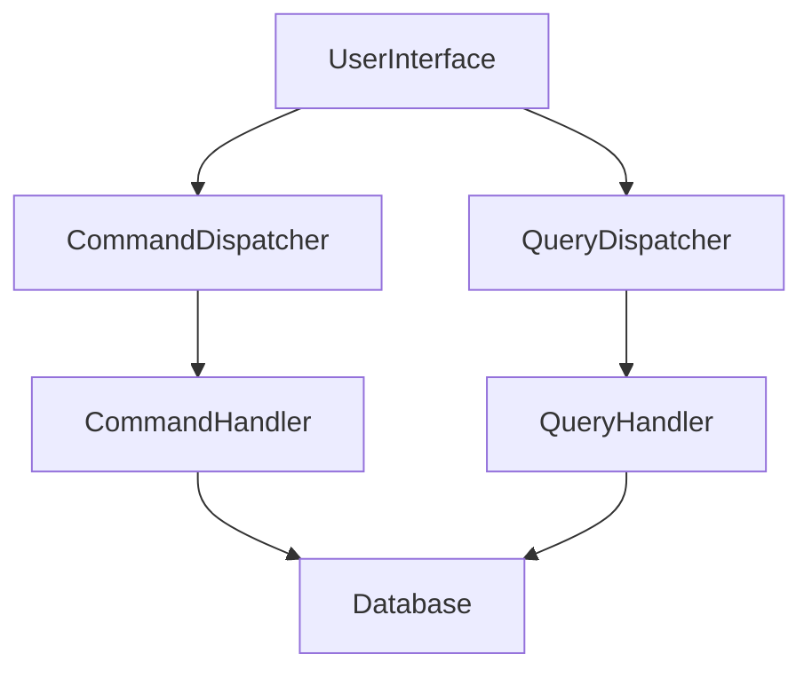
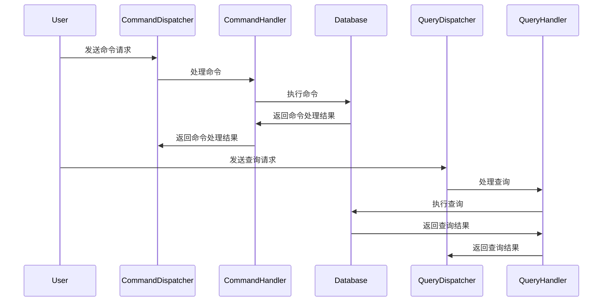

                 

# CQRS模式：命令查询职责分离

## 关键词
- CQRS模式
- 命令查询职责分离
- 系统架构设计
- 分布式系统
- 微服务

## 摘要
本文旨在深入探讨CQRS模式，一种在分布式系统中广泛应用的设计模式。我们将从CQRS模式的起源和基本概念入手，逐步解释其核心原理和系统架构设计，并通过具体案例分析其实际应用。最后，我们将总结CQRS模式的最佳实践，并提供进一步学习的资源。

## 目录大纲设计思路

### 第一部分: CQRS模式基础

### 第1章: CQRS模式概述
1.1 CQRS模式的起源与发展
1.2 CQRS模式的基本概念
1.3 CQRS模式的核心优势
1.4 CQRS模式的应用场景
1.5 本章小结

### 第2章: CQRS模式的核心概念
2.1 命令（Command）的概念与作用
2.2 查询（Query）的概念与作用
2.3 命令与查询的对比
2.4 CQRS模式中的实体关系图（ER图）
2.5 本章小结

### 第3章: CQRS模式的基本流程
3.1 CQRS模式的基本流程图
3.2 命令处理流程
3.3 查询处理流程
3.4 CQRS模式的数学模型
3.5 本章小结

### 第4章: CQRS模式在系统架构中的应用
4.1 系统功能设计（类图）
4.2 系统架构设计（架构图）
4.3 系统接口设计
4.4 系统交互（序列图）
4.5 本章小结

### 第二部分: CQRS模式实战

### 第5章: CQRS模式应用案例
5.1 案例背景介绍
5.2 环境安装与配置
5.3 系统核心实现
5.4 代码应用解读与分析
5.5 实际案例分析
5.6 案例总结

### 第6章: CQRS模式最佳实践
6.1 CQRS模式在项目中的最佳实践
6.2 注意事项
6.3 避免常见问题
6.4 拓展阅读
6.5 本章小结

### 第三部分: CQRS模式深入探讨

### 第7章: CQRS模式与相关模式对比
7.1 CQRS与传统的CRUD模式对比
7.2 CQRS与事件溯源模式对比
7.3 CQRS与分布式系统对比
7.4 本章小结

### 第8章: CQRS模式的发展趋势
8.1 CQRS模式在微服务架构中的应用
8.2 CQRS模式与容器化和云原生技术的结合
8.3 CQRS模式在未来的发展趋势
8.4 本章小结

### 第9章: CQRS模式与人工智能的结合
9.1 CQRS模式在AI应用中的优势
9.2 CQRS模式与机器学习的结合
9.3 CQRS模式在智能系统设计中的应用
9.4 本章小结

### 第10章: CQRS模式总结与展望
10.1 CQRS模式的核心要点回顾
10.2 CQRS模式的未来展望
10.3 附录：CQRS模式相关技术栈
10.4 本章小结

### 第一部分: CQRS模式基础

## 第1章: CQRS模式概述

### 1.1 CQRS模式的起源与发展

CQRS（Command Query Responsibility Segregation）模式起源于2005年，由著名的软件架构师Dave Douglas首次提出。其核心思想是将系统中的命令（Command）和查询（Query）分离，使得系统的架构更加灵活、可扩展。

CQRS模式的发展与分布式系统、微服务架构的兴起密切相关。随着互联网应用的复杂度增加，传统的单体架构难以满足日益增长的性能和可扩展性需求。CQRS模式通过将命令和查询分离，可以更好地支持分布式系统的设计和微服务架构的实现。

### 1.2 CQRS模式的基本概念

在CQRS模式中，命令和查询是两个核心概念。

**命令（Command）**：表示对系统的修改操作，例如创建、更新或删除数据。命令通常是由用户发起的动作，需要经过严格的验证和授权才能执行。

**查询（Query）**：表示对系统的读取操作，用于获取数据或状态信息。查询通常是为了满足用户界面的展示需求，对于查询的性能和响应速度要求较高。

### 1.3 CQRS模式的核心优势

CQRS模式具有以下核心优势：

1. **性能优化**：通过将命令和查询分离，可以分别优化它们的性能。命令处理通常需要严格的权限控制和数据验证，而查询处理则可以优化查询语句的执行，提高数据读取的效率。

2. **可扩展性**：CQRS模式支持分布式系统的设计，可以将命令和查询处理分别部署在不同的服务上，从而提高系统的可扩展性。

3. **灵活性和可维护性**：通过将命令和查询分离，系统的各个部分可以独立开发和维护，降低了系统的复杂度，提高了可维护性。

### 1.4 CQRS模式的应用场景

CQRS模式适用于以下应用场景：

1. **高并发场景**：在处理大量并发请求时，CQRS模式可以通过分离命令和查询，分别优化它们的性能，从而提高系统的响应速度和处理能力。

2. **大数据场景**：在大数据处理领域，CQRS模式可以将查询操作与数据存储分离，从而提高数据查询的效率。

3. **微服务架构**：在微服务架构中，CQRS模式可以更好地支持各个服务的独立开发和部署，提高了系统的灵活性和可扩展性。

### 1.5 本章小结

本章介绍了CQRS模式的基本概念、核心优势和应用场景。CQRS模式通过将命令和查询分离，可以提高系统的性能、可扩展性和灵活性，适用于高并发、大数据和微服务架构等多种场景。

### 第2章: CQRS模式的核心概念

#### 2.1 命令（Command）的概念与作用

命令是CQRS模式中的核心概念之一，它表示对系统的修改操作。命令通常由用户通过界面或API发起，例如创建新记录、更新现有记录或删除记录。

命令的作用是确保系统的状态发生变化。在执行命令之前，系统会进行一系列验证和授权操作，以确保命令的安全性和正确性。例如，创建记录的命令需要验证用户是否有足够的权限创建新记录，更新记录的命令需要验证用户是否有权限修改该记录。

以下是一个简单的命令处理流程：

1. **接收命令**：系统接收到用户发起的命令请求。
2. **验证和授权**：系统对命令进行验证和授权，确保命令符合业务规则和权限要求。
3. **执行命令**：系统执行命令，更新数据库或相关资源。
4. **返回结果**：系统返回执行结果，通常是一个确认消息或错误消息。

#### 2.2 查询（Query）的概念与作用

查询是CQRS模式中的另一个核心概念，它表示对系统的读取操作。查询主要用于获取数据或状态信息，例如查询用户的订单列表、查询库存数量等。

查询的作用是满足用户界面的展示需求。与命令不同，查询通常不需要进行复杂的验证和授权操作，只需快速返回所需的数据。以下是一个简单的查询处理流程：

1. **接收查询**：系统接收到用户的查询请求。
2. **处理查询**：系统根据查询条件查询数据库或相关资源，返回查询结果。
3. **返回结果**：系统将查询结果返回给用户。

#### 2.3 命令与查询的对比

命令和查询在CQRS模式中具有不同的作用和特点。以下是对它们的对比：

| 对比项 | 命令 | 查询 |
| --- | --- | --- |
| 操作类型 | 修改 | 读取 |
| 验证和授权 | 严格 | 较松 |
| 性能要求 | 较低 | 较高 |
| 作用范围 | 系统内部 | 系统外部 |

#### 2.4 CQRS模式中的实体关系图（ER图）

在CQRS模式中，实体关系图（ER图）用于描述系统的实体及其关系。以下是一个简单的CQRS模式的ER图：

```mermaid
erDiagram
    User ||--|{ Order } : creates
    Product ||--|{ OrderItem } : contains
```

在这个ER图中，`User`实体与`Order`实体之间存在一对一的关系，表示用户可以创建订单。`Product`实体与`OrderItem`实体之间存在一对多的关系，表示一个订单可以包含多个产品。

#### 2.5 本章小结

本章介绍了CQRS模式中的核心概念，包括命令和查询的概念及其作用。通过对比命令和查询的特点，我们了解了CQRS模式的设计原则。本章还提供了一个简单的ER图，展示了CQRS模式中的实体及其关系。

### 第3章: CQRS模式的基本流程

#### 3.1 CQRS模式的基本流程图

CQRS模式的基本流程可以分为两个部分：命令处理流程和查询处理流程。以下是一个简化的CQRS模式流程图：



在这个流程图中，用户发起请求后，系统会分别处理命令和查询。命令处理会返回处理结果（如成功或失败），查询处理会返回查询结果。

#### 3.2 命令处理流程

命令处理流程包括以下步骤：

1. **接收命令**：系统接收到用户发起的命令请求。
2. **验证和授权**：系统对命令进行验证和授权，确保命令符合业务规则和权限要求。
3. **执行命令**：系统执行命令，更新数据库或相关资源。
4. **返回结果**：系统返回命令处理结果，通常是一个确认消息或错误消息。

以下是一个命令处理流程的Python伪代码：

```python
def process_command(command):
    # 验证命令
    if not validate_command(command):
        return "命令无效"

    # 授权命令
    if not authorize_command(command):
        return "无权限执行命令"

    # 执行命令
    try:
        execute_command(command)
        return "命令执行成功"
    except Exception as e:
        return f"命令执行失败：{str(e)}"
```

#### 3.3 查询处理流程

查询处理流程包括以下步骤：

1. **接收查询**：系统接收到用户的查询请求。
2. **处理查询**：系统根据查询条件查询数据库或相关资源，返回查询结果。
3. **返回结果**：系统将查询结果返回给用户。

以下是一个查询处理流程的Python伪代码：

```python
def process_query(query):
    # 处理查询
    results = query_database(query)

    # 返回查询结果
    return results
```

#### 3.4 CQRS模式的数学模型

CQRS模式的数学模型可以用以下公式表示：

\[ T_c + T_q = T \]

其中，\( T_c \) 表示命令处理时间，\( T_q \) 表示查询处理时间，\( T \) 表示总处理时间。

通过优化 \( T_c \) 和 \( T_q \)，可以降低总处理时间 \( T \)，提高系统的性能。

#### 3.5 本章小结

本章介绍了CQRS模式的基本流程，包括命令处理流程和查询处理流程。通过Python伪代码示例，我们了解了命令和查询的处理步骤。此外，我们还提出了CQRS模式的数学模型，以帮助我们理解和优化系统的性能。

### 第4章: CQRS模式在系统架构中的应用

#### 4.1 系统功能设计（类图）

在CQRS模式中，系统的功能设计主要包括命令和查询的处理。以下是一个简化的类图，展示了系统中的主要类及其关系：

```mermaid
classDiagram
    User <<class>>
    Command <<class>>
    Query <<class>>
    CommandHandler <<class>>
    QueryHandler <<class>>

    User "发起" Command
    User "发起" Query

    CommandHandler "处理" Command
    QueryHandler "处理" Query
```

在这个类图中，`User`类表示用户，`Command`类表示命令，`Query`类表示查询。`CommandHandler`类负责处理命令，`QueryHandler`类负责处理查询。

#### 4.2 系统架构设计（架构图）

CQRS模式在系统架构中的应用通常涉及分布式系统的设计。以下是一个简化的架构图，展示了系统的总体架构：



在这个架构图中，`UserInterface`表示用户界面，`CommandDispatcher`和`QueryDispatcher`分别负责分发命令和查询。`CommandHandler`和`QueryHandler`分别处理命令和查询，并与数据库进行交互。

#### 4.3 系统接口设计

在CQRS模式中，系统的接口设计需要分别考虑命令和查询的接口。以下是一个简化的接口设计：

```mermaid
interface CommandInterface {
    - processCommand(): void
}

interface QueryInterface {
    - executeQuery(): any
}

class CommandHandler implements CommandInterface {
    - processCommand(): void {
        // 实现命令处理逻辑
    }
}

class QueryHandler implements QueryInterface {
    - executeQuery(): any {
        // 实现查询处理逻辑
    }
}
```

在这个接口设计中，`CommandInterface`和`QueryInterface`分别定义了命令和查询的接口方法。`CommandHandler`和`QueryHandler`类分别实现了这些接口方法，负责具体的命令和查询处理逻辑。

#### 4.4 系统交互（序列图）

系统交互序列图展示了用户界面、命令和查询处理以及数据库之间的交互过程。以下是一个简化的序列图：



在这个序列图中，用户界面通过`CommandDispatcher`和`QueryDispatcher`分别发送命令和查询请求。`CommandHandler`和`QueryHandler`分别处理命令和查询，并与数据库进行交互，最终返回处理结果。

#### 4.5 本章小结

本章介绍了CQRS模式在系统架构中的应用，包括系统功能设计、系统架构设计、系统接口设计和系统交互。通过类图、架构图、接口设计和序列图的示例，我们了解了CQRS模式在系统设计中的具体实现。

### 第5章: CQRS模式应用案例

#### 5.1 案例背景介绍

本案例将介绍一个在线书店系统，该系统使用CQRS模式来实现命令和查询的分离。在线书店系统的主要功能包括用户注册、登录、购买书籍、查看订单和搜索书籍等。

#### 5.2 环境安装与配置

为了演示CQRS模式的应用，我们使用以下技术栈：

- 后端框架：Spring Boot
- 数据库：MySQL
- 客户端：HTML/CSS/JavaScript

首先，我们需要在本地安装和配置这些工具。

1. 安装Java Development Kit（JDK）：在[Oracle官网](https://www.oracle.com/java/techn

