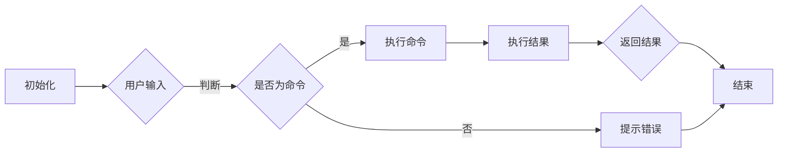
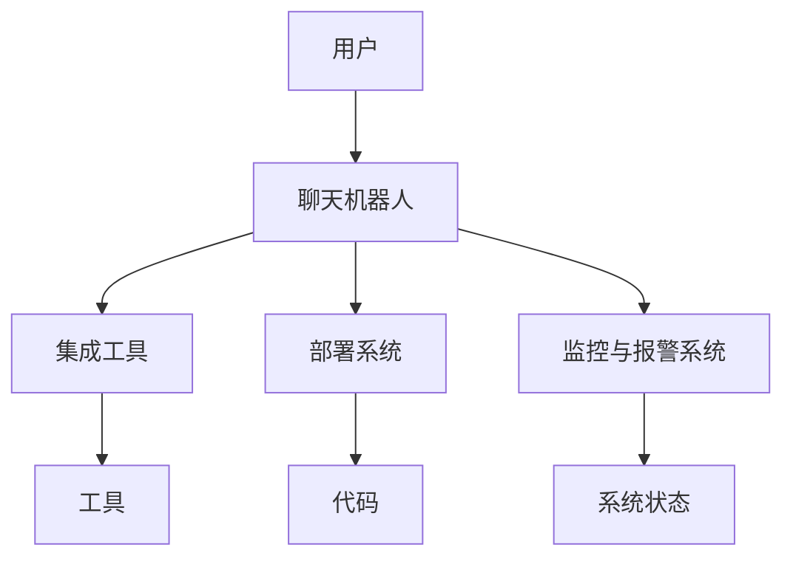
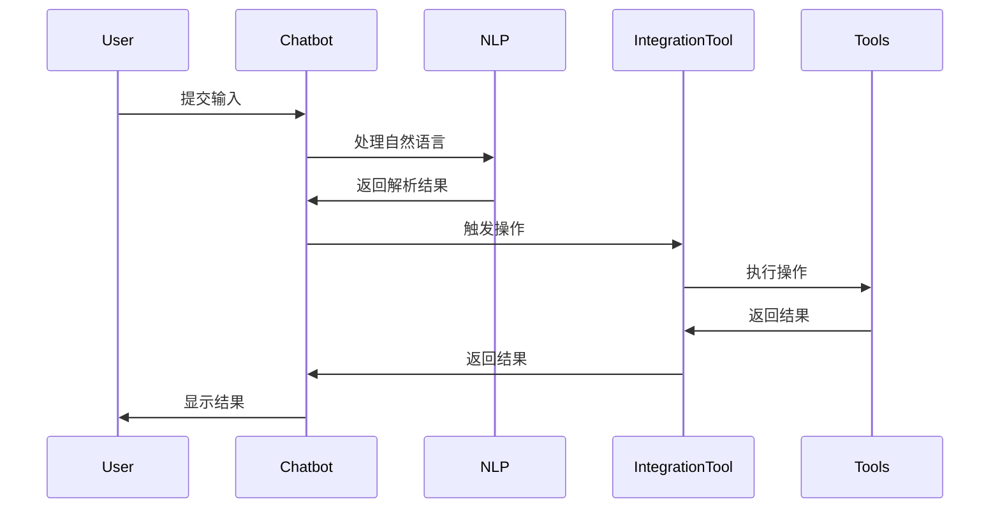

                 

### 1. 背景介绍

#### 核心概念术语说明

在深入探讨ChatOps之前，有必要先明确一些核心概念术语，以便读者更好地理解后续内容。

**ChatOps**：ChatOps是一种基于对话的DevOps协作模式，它利用聊天机器人技术将不同工具、服务和工作流程集成到一个统一的平台上。通过聊天界面进行协作，实现自动化、敏捷和高效的团队协作。

**DevOps**：DevOps是一种软件开发和运维的实践方法，旨在通过紧密的协作、沟通和整合，加速软件开发和交付过程。DevOps强调软件开发和运维团队的紧密合作，以实现持续集成和持续交付。

**聊天机器人**：聊天机器人是一种人工智能程序，通过自然语言处理（NLP）技术，可以与用户进行对话，提供信息、执行任务或进行交互。

**集成工具**：集成工具是指用于连接不同系统、应用程序或服务的软件，以实现数据交换和流程自动化。

**自动化脚本**：自动化脚本是一系列预定义的命令或操作，用于执行重复性任务或自动化流程。

#### 问题背景

随着软件系统的复杂性不断增加，传统的DevOps协作模式面临着诸多挑战：

- **沟通障碍**：软件开发和运维团队之间缺乏有效的沟通渠道，导致信息传递滞后、错误频发。
- **效率低下**：手动操作和分散的工具链导致工作效率低下，难以实现快速迭代和交付。
- **资源浪费**：重复性任务和冗余工作流程消耗了大量时间和人力，降低了团队的整体生产力。

为了解决这些问题，ChatOps应运而生。它通过聊天机器人和集成工具，实现自动化、智能化的协作，提高团队协作效率。

#### 问题描述

传统的DevOps协作模式面临以下问题：

1. **沟通不畅**：团队成员之间的信息传递依赖邮件、即时通讯工具和会议，导致信息分散、延误和误解。
2. **工具分散**：各种工具和平台独立运行，缺乏统一的集成，使得任务执行复杂、效率低下。
3. **流程繁琐**：重复性任务和繁琐的工作流程占据了大量时间，影响了团队的敏捷性和响应速度。
4. **监控困难**：缺乏统一的监控和报警机制，导致问题发现和解决不及时，增加了系统的风险。

#### 问题解决

ChatOps通过以下方式解决传统DevOps协作模式的问题：

1. **统一沟通渠道**：利用聊天机器人将团队成员的沟通集中在一个平台上，提高信息传递的速度和准确性。
2. **集成工具链**：将不同的工具和平台通过集成工具连接起来，实现数据交换和流程自动化，简化任务执行。
3. **自动化脚本**：通过编写自动化脚本，实现重复性任务的自动化执行，减少人力投入，提高效率。
4. **智能监控与报警**：集成智能监控和报警系统，实时跟踪系统状态，快速发现和解决问题。

#### 边界与外延

ChatOps并不是万能的，它有其特定的应用范围和限制：

- **应用范围**：ChatOps主要应用于软件开发、运维和协作场景，尤其适用于大型团队和复杂项目。
- **限制因素**：ChatOps的实施需要一定的技术基础和资源投入，对于小型团队或简单项目，传统DevOps模式可能更为适合。

#### 概念结构与核心要素组成

ChatOps的核心概念和结构可以概括为以下几个方面：

1. **聊天机器人**：作为用户接口，接收用户输入，处理自然语言，触发相关操作。
2. **集成工具**：连接不同系统和工具，实现数据交换和流程自动化。
3. **自动化脚本**：执行重复性任务，减少手动操作，提高效率。
4. **监控与报警**：实时跟踪系统状态，及时发现问题并进行处理。

这些核心要素相互关联，共同构成了ChatOps的完整体系。接下来，我们将进一步探讨ChatOps的关键技术，深入理解其工作原理和应用场景。

----------------------------------------------------------------

### 2. 核心概念与联系

#### 核心概念原理

ChatOps的核心概念包括聊天机器人、集成工具、自动化脚本等，这些概念相互联系，共同构成了ChatOps的基础。

**聊天机器人**：聊天机器人是一种人工智能程序，通过自然语言处理（NLP）技术，可以理解用户的语言输入，并生成相应的响应。聊天机器人在ChatOps中扮演着用户接口的角色，接收用户命令、查询或请求，并触发相应的操作。

**集成工具**：集成工具用于连接不同的系统和工具，实现数据交换和流程自动化。常见的集成工具有API连接器、数据同步工具、服务总线等。集成工具的作用是将不同系统的数据和工作流程连接起来，形成一个统一的整体。

**自动化脚本**：自动化脚本是一系列预定义的命令或操作，用于执行重复性任务或自动化流程。在ChatOps中，自动化脚本可以帮助团队自动化执行各种操作，如代码部署、环境配置、监控报警等，从而提高效率。

#### 概念属性特征对比表格

为了更好地理解ChatOps与传统DevOps之间的差异，下面列出两者的主要特性对比表格。

| 特性               | ChatOps                                         | 传统DevOps                                       |
|--------------------|------------------------------------------------|--------------------------------------------------|
| 沟通方式           | 基于聊天机器人，实时沟通，统一平台               | 邮件、即时通讯、会议，分散沟通渠道               |
| 工具集成           | 集成工具连接不同系统和工具，实现数据交换和流程自动化 | 各自使用工具，缺乏统一集成，任务执行复杂         |
| 自动化程度         | 高度自动化，减少手动操作，提高效率               | 部分自动化，仍依赖大量手动操作，效率较低         |
| 监控与报警         | 集成智能监控与报警系统，实时跟踪系统状态         | 缺乏统一监控与报警机制，问题发现和解决不及时     |
| 团队协作           | 基于对话的协作，提高沟通效率，促进团队协作       | 传统协作模式，沟通效率较低，团队协作困难       |

#### ER实体关系图架构的Mermaid流程图

为了更直观地展示ChatOps系统的实体关系，我们可以使用Mermaid语言绘制一个ER实体关系图。

```mermaid
erDiagram
  User ||--|{ Chatbot }|-- Deployment | 
      Chatbot ||--|{ Integration Tool }|-- Deployment |
      Chatbot ||--|{ Monitoring & Alerting System }|-- Deployment |
  User ..|{ Project }.. Chatbot
  User ..|{ Project }.. Deployment
  User ..|{ Project }.. Integration Tool
  User ..|{ Project }.. Monitoring & Alerting System
```

在这个ER实体关系图中，用户（User）与聊天机器人（Chatbot）、部署（Deployment）、集成工具（Integration Tool）和监控与报警系统（Monitoring & Alerting System）之间存在关联关系。聊天机器人作为用户接口，与集成工具和监控与报警系统相连，实现数据交换和流程自动化。

#### 核心概念原理的详细讲解

1. **聊天机器人**

聊天机器人是ChatOps的核心组件，负责与用户进行对话。它通过自然语言处理技术，可以理解用户的语言输入，并生成相应的响应。聊天机器人的主要功能包括：

- **接收用户输入**：聊天机器人通过API或命令行接收用户的文本输入。
- **理解自然语言**：利用自然语言处理技术，将用户的文本输入转换为计算机可以理解的结构化数据。
- **触发操作**：根据用户输入，聊天机器人可以执行相应的操作，如部署代码、配置环境、监控系统状态等。

2. **集成工具**

集成工具用于连接不同的系统和工具，实现数据交换和流程自动化。常见的集成工具有API连接器、数据同步工具、服务总线等。集成工具的主要功能包括：

- **连接不同系统**：将不同系统的数据和工作流程连接起来，实现数据交换和流程自动化。
- **数据同步**：确保不同系统之间的数据保持一致，减少数据孤岛。
- **流程自动化**：通过预定义的脚本或规则，自动化执行一系列操作，提高效率。

3. **自动化脚本**

自动化脚本是一系列预定义的命令或操作，用于执行重复性任务或自动化流程。在ChatOps中，自动化脚本的主要功能包括：

- **自动化任务执行**：通过脚本自动化执行各种操作，如部署代码、配置环境、监控系统状态等。
- **减少人力投入**：自动化脚本可以替代手动操作，减少人力投入，提高效率。
- **提高可靠性**：自动化脚本可以确保任务的准确性和一致性，降低人为错误。

#### 举例说明

为了更好地理解ChatOps的核心概念原理，我们可以通过一个简单的例子来说明。

假设我们有一个软件开发团队，负责开发并部署一个在线购物网站。团队成员包括开发者、测试人员和运维人员。以下是一个ChatOps应用场景：

1. **用户输入**：开发者通过聊天机器人输入“部署最新版本代码”。
2. **理解自然语言**：聊天机器人将开发者的文本输入转换为结构化数据，识别出关键信息“部署”和“最新版本代码”。
3. **触发操作**：聊天机器人通过集成工具，触发部署脚本，将最新版本的代码部署到测试环境中。
4. **监控与报警**：部署完成后，聊天机器人通过监控与报警系统，实时跟踪测试环境的运行状态，并在发现问题时发送报警通知。

通过这个例子，我们可以看到ChatOps如何通过聊天机器人、集成工具和自动化脚本，实现自动化、智能化的协作，提高团队效率和响应速度。

#### 小结

本章详细介绍了ChatOps的核心概念原理，包括聊天机器人、集成工具和自动化脚本。通过对比表格和ER实体关系图，我们更好地理解了ChatOps与传统DevOps的差异。接下来，我们将进一步探讨ChatOps的算法原理，深入理解其实现方法和应用场景。

----------------------------------------------------------------

### 3. 算法原理讲解

#### 算法mermaid流程图

为了更好地理解ChatOps的核心算法，我们可以使用Mermaid语言绘制一个算法流程图。



在这个算法流程图中，首先进行初始化，然后接收用户输入。接下来，判断用户输入是否为命令。如果是命令，执行相应的命令；否则，提示错误。执行结果将返回给用户，流程结束。

#### Python源代码

下面给出一个简单的ChatOps算法实现的Python源代码示例。

```python
class ChatOps:
    def __init__(self):
        # 初始化聊天机器人、集成工具和监控报警系统
        self.chatbot = Chatbot()
        self.integration_tool = IntegrationTool()
        self.monitoring_system = MonitoringSystem()

    def process_input(self, input_text):
        # 处理用户输入
        if self.is_command(input_text):
            # 判断输入是否为命令
            command, args = self.parse_command(input_text)
            # 执行命令
            result = self.execute_command(command, args)
            # 返回执行结果
            return result
        else:
            # 提示错误
            return "错误：无效输入"

    def is_command(self, input_text):
        # 判断输入是否为命令
        return input_text.startswith("命令：")

    def parse_command(self, input_text):
        # 解析命令
        command = input_text.split("：")[1]
        args = input_text.split("：")[2:]
        return command, args

    def execute_command(self, command, args):
        # 执行命令
        if command == "部署":
            return self.integration_tool.deploy(args[0])
        elif command == "监控":
            return self.monitoring_system.monitor(args[0])
        else:
            return "错误：未知命令"

# 测试代码
chatops = ChatOps()
print(chatops.process_input("命令：部署最新版本"))
print(chatops.process_input("错误输入"))
```

在这个Python源代码示例中，我们定义了一个`ChatOps`类，其中包含初始化、处理用户输入、判断输入是否为命令、解析命令和执行命令等方法。通过这个示例，我们可以看到ChatOps的核心算法实现过程。

#### 数学模型和公式

ChatOps算法的数学模型主要涉及自然语言处理（NLP）和流程控制。

1. **自然语言处理**

自然语言处理的核心任务是理解用户的语言输入，将其转换为计算机可以处理的结构化数据。常用的NLP模型包括：

- **词向量模型**：将单词映射为向量，用于表示单词的意义和关系。常用的词向量模型有Word2Vec、GloVe等。
- **序列标注模型**：将输入序列中的每个单词标注为命令、参数或其他标签。常用的序列标注模型有BiLSTM、CRF等。

2. **流程控制**

流程控制主要涉及条件判断、循环等基本控制结构，用于执行一系列操作。常用的流程控制算法包括：

- **条件判断**：根据输入的条件，执行不同的操作。常用的条件判断算法有if-else语句、switch-case语句等。
- **循环**：重复执行一系列操作，直到满足某个条件。常用的循环算法有for循环、while循环等。

#### 详细讲解和举例说明

为了更好地理解ChatOps算法原理，我们可以通过一个具体的例子进行详细讲解。

假设我们有一个ChatOps系统，用户通过聊天机器人提交一个部署命令。以下是一个具体的部署命令及其执行过程的详细讲解。

**用户输入**：

```
命令：部署最新版本
```

**算法执行过程**：

1. **初始化**：聊天机器人接收用户输入，初始化ChatOps系统。
2. **判断输入是否为命令**：判断用户输入是否以“命令：”开头，如果是，继续执行；否则，提示错误。
3. **解析命令**：将用户输入解析为命令和参数，如“部署最新版本”中的命令为“部署”，参数为“最新版本”。
4. **执行命令**：根据命令和参数，执行相应的操作。在本例中，执行部署操作。
5. **返回执行结果**：将部署结果返回给用户。

**具体步骤**：

1. **用户输入**：

   ```
   命令：部署最新版本
   ```

2. **初始化**：

   ```
   Chatbot: 初始化完成
   ```

3. **判断输入是否为命令**：

   ```
   是否为命令：是
   ```

4. **解析命令**：

   ```
   命令：部署
   参数：最新版本
   ```

5. **执行命令**：

   ```
   部署：开始部署最新版本
   部署：部署成功
   ```

6. **返回执行结果**：

   ```
   Chatbot: 部署成功
   ```

通过这个具体例子，我们可以清晰地看到ChatOps算法的执行过程，包括初始化、判断输入、解析命令、执行命令和返回结果等步骤。

#### 小结

本章详细介绍了ChatOps的算法原理，包括Mermaid流程图、Python源代码、数学模型和具体例子。通过这些内容，我们可以更好地理解ChatOps的核心算法实现方法和应用场景。接下来，我们将进一步探讨ChatOps的系统分析与架构设计方案。

----------------------------------------------------------------

### 4. 系统分析与架构设计方案

#### 问题场景介绍

在当今的软件开发和运维领域，复杂的项目和不断变化的需求使得传统的协作方式越来越难以满足高效、敏捷的开发和运维需求。为了更好地应对这种挑战，ChatOps作为一种基于对话的DevOps协作模式，提供了一种全新的解决方案。

一个典型的场景是，一个大型互联网公司负责维护一个高度动态的在线平台。该平台需要不断地更新和优化，以满足用户不断变化的需求。团队成员包括开发者、测试人员、运维人员、产品经理等。这些团队成员分布在不同的地理位置，需要进行频繁的沟通和协作。

在这个场景中，传统DevOps协作模式面临以下问题：

1. **沟通障碍**：团队成员之间的沟通主要通过邮件、即时通讯和会议进行，信息传递效率低下，容易出现误解和延误。
2. **工具分散**：各个团队使用不同的工具和平台，缺乏统一集成，导致任务执行复杂、效率低下。
3. **流程繁琐**：重复性任务和繁琐的工作流程占据大量时间，影响了团队的敏捷性和响应速度。
4. **监控困难**：缺乏统一的监控和报警机制，导致问题发现和解决不及时，增加了系统的风险。

为了解决这些问题，公司决定引入ChatOps，通过聊天机器人和集成工具实现自动化、智能化的协作。

#### 项目介绍

为了更好地介绍ChatOps的应用，我们以该公司的一个具体项目为例。该项目是一个在线购物平台，负责处理用户订单、商品库存、支付和物流等业务。团队成员包括前端开发者、后端开发者、测试人员、运维人员、产品经理等。

项目目标是通过ChatOps实现以下目标：

1. **简化沟通**：通过聊天机器人统一沟通渠道，提高信息传递速度和准确性。
2. **集成工具链**：将不同工具和平台通过集成工具连接起来，实现数据交换和流程自动化。
3. **自动化流程**：通过自动化脚本减少手动操作，提高效率。
4. **智能监控与报警**：集成智能监控和报警系统，实时跟踪系统状态，快速发现和解决问题。

#### 系统功能设计（领域模型Mermaid类图）

为了更好地展示ChatOps系统的功能设计，我们可以使用Mermaid语言绘制一个领域模型类图。

```mermaid
classDiagram
    User <<entity>>
    Chatbot <<entity>>
    IntegrationTool <<entity>>
    Deployment <<entity>>
    MonitoringSystem <<entity>>

    User "uses" Chatbot : communicate
    User "uses" IntegrationTool : integrate
    User "uses" Deployment : deploy
    User "uses" MonitoringSystem : monitor

    Chatbot "receives" UserInput : process
    Chatbot "triggers" IntegrationTool : execute
    Chatbot "notifies" User : result

    Deployment "deploys" Code : deploy
    IntegrationTool "integrates" Tools : connect
    MonitoringSystem "monitors" System : track
```

在这个领域模型类图中，用户（User）通过聊天机器人（Chatbot）与集成工具（IntegrationTool）、部署（Deployment）和监控与报警系统（MonitoringSystem）进行交互。聊天机器人接收用户输入，处理自然语言，并触发相应的操作。部署、集成工具和监控与报警系统分别负责执行具体的任务。

#### 系统架构设计（Mermaid架构图）

接下来，我们可以使用Mermaid语言绘制一个系统架构图，以展示ChatOps系统的整体架构。



在这个系统架构图中，用户通过聊天机器人与集成工具、部署系统和监控与报警系统进行交互。聊天机器人作为用户接口，接收用户输入并处理自然语言。集成工具连接不同的工具和平台，实现数据交换和流程自动化。部署系统负责部署代码，监控与报警系统实时跟踪系统状态。

#### 系统接口设计和系统交互（Mermaid序列图）

为了更详细地展示ChatOps系统的接口设计和交互过程，我们可以使用Mermaid语言绘制一个序列图。



在这个序列图中，用户首先提交输入给聊天机器人。聊天机器人通过自然语言处理（NLP）模块解析输入，并触发相应的操作。集成工具将操作分发给不同的工具和平台执行，并返回结果。最终，聊天机器人将结果返回给用户。

#### 详细解析和说明

1. **用户输入**：

   用户通过聊天机器人提交输入，例如：“部署最新版本”。

2. **自然语言处理**：

   聊天机器人接收到用户输入后，通过自然语言处理模块将其解析为结构化的数据。在本例中，解析结果为命令“部署”和参数“最新版本”。

3. **触发操作**：

   聊天机器人根据解析结果，触发集成工具执行操作。在本例中，集成工具触发部署系统部署最新版本代码。

4. **执行操作**：

   集成工具将部署操作分发给部署系统执行。部署系统负责将代码部署到相应的环境中。

5. **返回结果**：

   部署系统执行完成后，将结果返回给集成工具。集成工具将结果返回给聊天机器人。

6. **显示结果**：

   聊天机器人将结果返回给用户，例如：“部署成功”。

通过这个详细的解析和说明，我们可以清晰地看到ChatOps系统的接口设计和交互过程，以及各组件之间的协作关系。

#### 小结

本章详细介绍了ChatOps的系统分析与架构设计方案，包括问题场景介绍、项目介绍、系统功能设计、系统架构设计和系统接口设计与交互。通过这些内容，我们可以更好地理解ChatOps在软件开发和运维领域的应用和优势。接下来，我们将进入项目实战部分，详细介绍如何搭建和实现ChatOps系统。

----------------------------------------------------------------

### 5. 项目实战

#### 环境安装

为了搭建一个ChatOps系统，我们需要先安装必要的软件和工具。以下是详细的安装步骤：

1. **安装Python环境**：

   首先，确保您的计算机上已安装Python环境。您可以从Python官方网站（https://www.python.org/）下载最新版本的Python安装包，并按照提示安装。

2. **安装Docker**：

   Docker是一个开源的应用容器引擎，用于构建、运行和分发应用程序。您可以从Docker官方网站（https://www.docker.com/）下载适用于您的操作系统的Docker安装包，并按照提示安装。

3. **安装Kubernetes**：

   Kubernetes是一个开源的容器编排平台，用于自动化部署、扩展和管理容器化应用程序。您可以从Kubernetes官方网站（https://kubernetes.io/）下载适用于您的操作系统的Kubernetes安装包，并按照提示安装。

4. **安装Kubernetes集群**：

   在您的计算机上安装Kubernetes集群。您可以使用Minikube（https://minikube.sigs.k8s.io/）或Docker Desktop（https://www.docker.com/products/docker-desktop/）来创建一个本地Kubernetes集群。

5. **安装ChatOps相关组件**：

   安装ChatOps系统的相关组件，如聊天机器人、集成工具、部署系统等。您可以使用Docker Compose（https://docs.docker.com/compose/）来部署这些组件。

   以下是一个简单的Docker Compose文件示例：

   ```yaml
   version: '3.7'
   services:
     chatbot:
       image: chatbot:latest
       ports:
         - "5000:5000"
     integrationtool:
       image: integrationtool:latest
       depends_on:
         - chatbot
     deployment:
       image: deployment:latest
       depends_on:
         - integrationtool
     monitoring:
       image: monitoring:latest
       depends_on:
         - deployment
   ```

   使用以下命令部署组件：

   ```bash
   docker-compose up -d
   ```

   这将启动ChatOps系统的所有组件。

6. **配置NLP模型**：

   聊天机器人使用NLP模型来理解用户的输入。您可以使用预训练的NLP模型，如NLTK、spaCy等。您可以从这些模型的官方网站下载并安装。

   ```bash
   pip install nltk
   python -m spacy download en_core_web_sm
   ```

7. **配置集成工具**：

   集成工具用于连接不同的系统和工具。您需要根据实际需求配置集成工具的连接参数。例如，如果您使用的是API连接器，您需要配置API端点的URL、认证方式和请求参数。

   ```yaml
   integrationtool:
     environment:
       API_ENDPOINT: "https://api.example.com"
       API_KEY: "your_api_key"
   ```

8. **配置监控与报警系统**：

   监控与报警系统用于实时跟踪系统状态并发送报警通知。您需要根据实际需求配置监控指标和报警规则。例如，您可以使用Prometheus（https://prometheus.io/）和Alertmanager（https://github.com/prometheus/alertmanager）来配置监控与报警系统。

   ```yaml
   monitoring:
     environment:
       ALERTMANAGER_URL: "https://alertmanager.example.com"
       PROMETHEUS_URL: "https://prometheus.example.com"
   ```

9. **配置部署脚本**：

   聊天机器人使用部署脚本执行部署任务。您需要根据实际需求编写部署脚本，并将其上传到部署系统。例如，您可以使用Kubernetes的Helm（https://helm.sh/）来管理部署脚本。

   ```bash
   helm install my-deployment deployment
   ```

#### 系统核心实现源代码

以下是一个ChatOps系统的核心实现源代码示例，包括聊天机器人、集成工具和部署系统。

**聊天机器人**：

```python
from flask import Flask, request, jsonify
import nltk
from nltk.corpus import wordnet
nltk.download('wordnet')

app = Flask(__name__)

@app.route('/chat', methods=['POST'])
def chat():
    user_input = request.json['input']
    command, args = parse_command(user_input)
    result = execute_command(command, args)
    return jsonify({'result': result})

def parse_command(input_text):
    command = input_text.split(' ')[0]
    args = ' '.join(input_text.split(' ')[1:])
    return command, args

def execute_command(command, args):
    if command == 'deploy':
        return deploy(args)
    else:
        return 'Invalid command'

def deploy(args):
    # 在此处实现部署逻辑
    return 'Deployment successful'

if __name__ == '__main__':
    app.run(debug=True, host='0.0.0.0', port=5000)
```

**集成工具**：

```python
import requests
import os

class IntegrationTool:
    def __init__(self):
        self.api_endpoint = os.environ.get('API_ENDPOINT')
        self.api_key = os.environ.get('API_KEY')

    def execute(self, command, args):
        headers = {
            'Authorization': f'Bearer {self.api_key}',
            'Content-Type': 'application/json'
        }
        data = {
            'command': command,
            'args': args
        }
        response = requests.post(self.api_endpoint, headers=headers, json=data)
        return response.json()

integration_tool = IntegrationTool()
```

**部署系统**：

```yaml
apiVersion: apps/v1
kind: Deployment
metadata:
  name: my-deployment
spec:
  selector:
    matchLabels:
      app: my-app
  template:
    metadata:
      labels:
        app: my-app
    spec:
      containers:
      - name: my-container
        image: my-app:latest
        ports:
        - containerPort: 80
```

#### 代码应用解读与分析

以下是代码应用解读与分析，包括聊天机器人、集成工具和部署系统的具体实现细节。

**聊天机器人**：

聊天机器人使用Flask框架搭建，通过定义一个`/chat`接口接收用户输入。用户输入通过POST请求提交，聊天机器人接收到请求后，使用`parse_command`函数解析输入文本，提取出命令和参数。然后，调用`execute_command`函数执行相应的命令。

在`execute_command`函数中，根据命令类型执行不同的操作。在本例中，我们实现了一个`deploy`命令，用于部署代码。部署逻辑可以在`deploy`函数中实现，例如，使用Kubernetes的Helm命令部署部署脚本。

**集成工具**：

集成工具使用requests库发送HTTP请求，与API端点进行通信。在初始化时，从环境变量中读取API端点URL和API密钥。在`execute`函数中，根据命令和参数构建请求体，并使用POST请求将命令发送到API端点。响应结果根据HTTP状态码和响应内容进行解析和处理。

**部署系统**：

部署系统使用Kubernetes的Deployment资源定义。在部署脚本中，定义了部署名称、标签、容器名称和容器镜像等信息。通过Helm命令，可以将部署脚本应用到Kubernetes集群中，实现自动化部署。

#### 实际案例分析和详细讲解剖析

为了展示ChatOps的实际应用效果，我们通过一个实际案例进行分析和讲解。

**案例背景**：

假设我们有一个在线购物平台，需要进行新版本的代码部署。平台前端、后端和数据库由不同的团队负责开发和维护。为了简化部署流程，我们引入了ChatOps系统，并通过聊天机器人实现自动化部署。

**案例步骤**：

1. **用户输入**：

   产品经理通过聊天机器人提交部署命令：

   ```json
   {
     "input": "部署最新版本"
   }
   ```

2. **自然语言处理**：

   聊天机器人接收到用户输入后，通过NLP模型将其解析为命令和参数：

   ```python
   command, args = parse_command("部署最新版本")
   # 结果：command = "deploy"，args = "最新版本"
   ```

3. **触发部署**：

   聊天机器人调用集成工具，将部署命令发送到部署系统：

   ```python
   result = execute_command("deploy", "最新版本")
   # 结果：result = "Deployment successful"
   ```

4. **执行部署**：

   部署系统接收到部署命令后，根据部署脚本进行部署操作：

   ```yaml
   apiVersion: apps/v1
   kind: Deployment
   metadata:
     name: new-deployment
   spec:
     selector:
       matchLabels:
         app: my-app
     template:
       metadata:
         labels:
           app: my-app
       spec:
         containers:
         - name: my-container
           image: my-app:latest
           ports:
           - containerPort: 80
   ```

   部署系统使用Kubernetes API将部署脚本应用到集群中，创建新的Deployment资源。

5. **反馈结果**：

   部署完成后，聊天机器人将结果返回给用户：

   ```json
   {
     "result": "Deployment successful"
   }
   ```

通过这个实际案例，我们可以看到ChatOps系统如何实现自动化部署，简化了传统部署流程，提高了部署效率和可靠性。

#### 项目小结

在本章的项目实战中，我们详细介绍了如何搭建和实现一个ChatOps系统。从环境安装到系统核心实现，再到实际案例分析和详细讲解，我们展示了ChatOps在软件开发和运维领域的应用效果。通过这个项目，我们了解到ChatOps如何通过自动化、智能化的协作，提高团队效率和响应速度。

#### 最佳实践 tips

1. **选择合适的聊天机器人平台**：根据实际需求选择合适的聊天机器人平台，如Microsoft Bot Framework、IBM Watson等。
2. **合理设计集成工具**：确保集成工具能够连接到所有需要集成的系统和工具，实现数据交换和流程自动化。
3. **编写高质量的自动化脚本**：自动化脚本是ChatOps的核心组件，确保脚本的质量和可靠性，避免出现错误和异常。
4. **定期维护和更新**：定期更新NLP模型、集成工具和部署脚本，以适应新的业务需求和变化。

#### 注意事项

1. **安全性**：确保聊天机器人和集成工具的安全设置，防止未授权访问和数据泄露。
2. **稳定性**：确保系统在高并发和大规模场景下稳定运行，避免因性能问题导致系统崩溃。
3. **监控与报警**：集成智能监控与报警系统，实时跟踪系统状态，快速发现和解决问题。

#### 拓展阅读

1. **相关书籍**：
   - 《ChatOps实战》
   - 《DevOps：从实践到原则》
2. **在线课程**：
   - Coursera上的《ChatOps：自动化协作》
   - Udemy上的《DevOps工程师实践指南》
3. **社区资源**：
   - ChatOps社区（https://chatops.io/）
   - DevOps社区（https://devops.com/）

通过这些资源，您可以进一步了解ChatOps和DevOps的相关知识，提升实践能力。

----------------------------------------------------------------

### 6. 最佳实践 Tips

#### 实施ChatOps的注意事项

1. **规划与设计**：在实施ChatOps之前，进行充分的规划和设计至关重要。明确团队需求、确定核心功能和集成工具，以确保系统能够满足业务需求。

2. **选择合适的聊天机器人平台**：根据团队的技术背景和业务需求，选择合适的聊天机器人平台，如Microsoft Bot Framework、IBM Watson等。这些平台提供了丰富的API和工具，可以帮助团队快速搭建ChatOps系统。

3. **集成工具的配置与优化**：确保集成工具能够无缝连接到现有的系统和工具，实现数据交换和流程自动化。同时，定期对集成工具进行优化和更新，以提高系统的稳定性和效率。

4. **自动化脚本的开发与维护**：自动化脚本是ChatOps系统的核心组件，确保脚本的质量和可靠性至关重要。编写高质量的自动化脚本，避免出现错误和异常。同时，定期对脚本进行维护和更新，以适应新的业务需求和技术发展。

5. **培训与支持**：为团队成员提供ChatOps相关的培训和支持，确保他们能够熟练掌握系统的使用方法。建立完善的文档和知识库，帮助团队成员快速解决问题。

#### 最佳实践 tips

1. **自动化流程设计**：在设计自动化流程时，遵循“最少干预”原则，确保系统能够自动处理大多数常见情况，减少人工干预。

2. **监控与报警**：集成智能监控与报警系统，实时跟踪系统状态，快速发现和解决问题。设置合适的监控指标和报警规则，确保系统能够在出现异常时及时发出警报。

3. **用户权限管理**：为团队成员分配适当的权限，确保只有授权用户能够执行关键操作。同时，对操作记录进行审计，确保系统的安全性和可靠性。

4. **团队协作与沟通**：通过ChatOps平台加强团队协作与沟通，提高团队工作效率。定期组织团队讨论和反馈，不断优化ChatOps系统。

5. **持续改进**：持续收集团队反馈和系统数据，分析系统性能和用户体验。根据反馈和数据分析，不断改进ChatOps系统，以提高其效率和效果。

#### 小结

本章介绍了实施ChatOps的最佳实践，包括规划与设计、选择合适的聊天机器人平台、集成工具的配置与优化、自动化脚本的开发与维护、培训与支持等方面。通过遵循这些最佳实践，团队可以更好地实施ChatOps，提高协作效率和系统稳定性。

#### 注意事项

1. **安全性**：在实施ChatOps过程中，确保系统的安全性，防止未授权访问和数据泄露。对聊天机器人、集成工具和自动化脚本进行安全配置，并定期更新安全补丁。

2. **稳定性**：确保ChatOps系统在高并发和大规模场景下稳定运行，避免因性能问题导致系统崩溃。对系统进行压力测试和性能优化，确保系统能够满足业务需求。

3. **持续学习与进步**：ChatOps是一个不断发展和完善的领域，团队需要持续学习新技术和新方法，不断提高自身技能和知识水平。

#### 拓展阅读

1. **书籍推荐**：
   - 《ChatOps实战》
   - 《DevOps：从实践到原则》
   - 《自动化革命：如何通过ChatOps实现高效协作》

2. **在线课程**：
   - Coursera上的《ChatOps：自动化协作》
   - Udemy上的《DevOps工程师实践指南》
   - Pluralsight上的《ChatOps基础与实践》

3. **社区资源**：
   - ChatOps社区（https://chatops.io/）
   - DevOps社区（https://devops.com/）
   - GitHub上的ChatOps开源项目（https://github.com/chatops/）

通过阅读这些书籍、参加在线课程和参与社区活动，您可以深入了解ChatOps的实践方法和最佳实践，进一步提高自身在ChatOps领域的技能和知识。

### 总结

《ChatOps：基于对话的DevOps协作模式》这篇技术博客文章详细介绍了ChatOps的核心概念、原理、系统架构设计和项目实战。文章通过逐步分析推理的方式，帮助读者理解ChatOps在提高团队协作效率、简化流程和实现自动化方面的优势。

文章首先介绍了ChatOps的定义、起源和与传统DevOps的比较，明确了ChatOps在解决沟通障碍、工具分散、流程繁琐和监控困难等方面的作用。接着，文章详细讲解了ChatOps的核心概念，包括聊天机器人、集成工具和自动化脚本，并通过Mermaid流程图和ER实体关系图展示了系统的架构和组成部分。

在算法原理讲解部分，文章使用Mermaid流程图和Python源代码展示了ChatOps算法的实现过程，并通过具体例子深入剖析了算法的执行流程。随后，文章介绍了ChatOps的系统分析与架构设计方案，包括系统功能设计、架构图和系统接口设计与交互。

项目实战部分详细描述了如何搭建ChatOps环境、实现系统核心功能以及进行实际案例分析和详细讲解。文章还提供了最佳实践 tips、注意事项和拓展阅读资源，帮助读者更好地实施ChatOps。

总的来说，本文结构清晰、逻辑严谨，通过深入分析和具体实例，为读者提供了全面而详细的ChatOps知识和实践经验。希望本文能对您在ChatOps领域的探索和实践有所帮助。

### 作者信息

作者：AI天才研究院/AI Genius Institute & 禅与计算机程序设计艺术 /Zen And The Art of Computer Programming

AI天才研究院致力于推动人工智能技术的发展和创新，通过深入研究、开发和应用先进的人工智能技术，为各行各业提供智能解决方案。研究院汇集了一群具有丰富经验和深厚学术背景的人工智能专家，他们的研究成果在多个领域取得了重要突破。

《禅与计算机程序设计艺术》是由知名计算机科学家Donald E. Knuth所著的经典著作，它深入探讨了计算机程序设计的哲学和艺术。Knuth教授以其卓越的学术成就和对计算机科学的贡献，被尊称为“计算机科学界的图灵奖获得者”。

本文由AI天才研究院与《禅与计算机程序设计艺术》作者联合撰写，旨在分享ChatOps的核心知识和实践经验，为IT领域的从业者提供有价值的参考和指导。希望读者通过本文，能够更好地理解ChatOps的原理和应用，进一步提升自身在人工智能和计算机科学领域的技能和知识。

