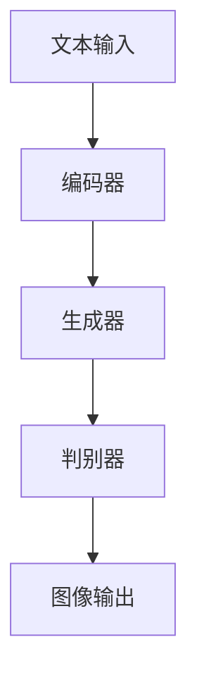
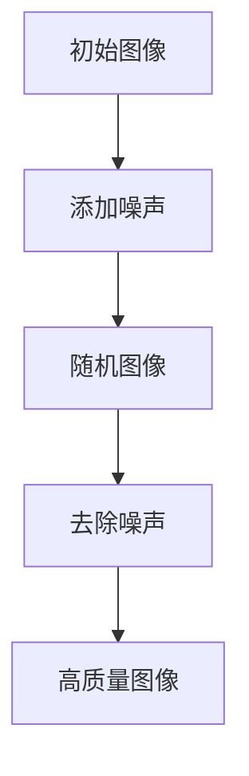
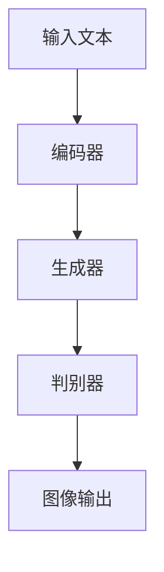
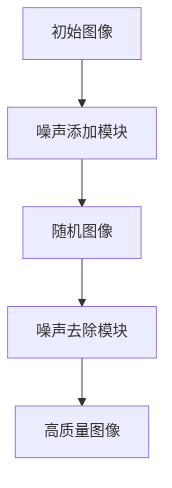
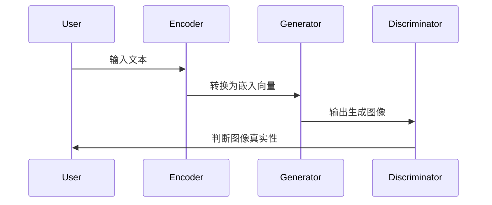
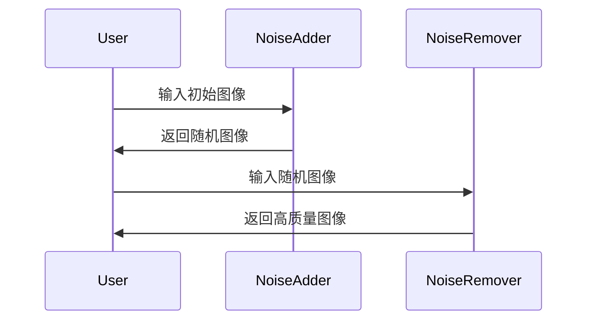
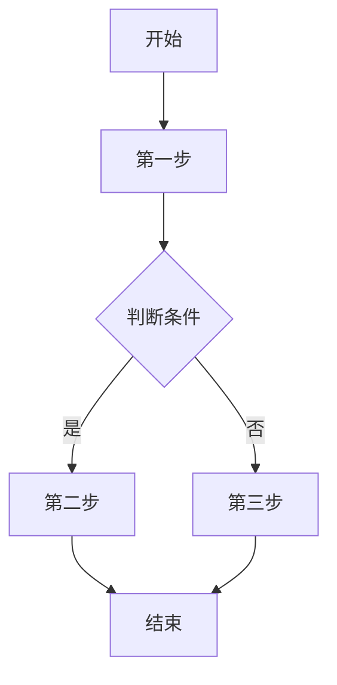

                 

# DALL-E与Stable Diffusion：为AI Agent添加图像生成能力

> 关键词：AI图像生成、DALL-E、Stable Diffusion、算法原理、系统架构、项目实战、最佳实践

> 摘要：本文深入探讨了DALL-E和Stable Diffusion两种先进的AI图像生成技术。通过详细的算法原理讲解、系统架构设计、项目实战和最佳实践，帮助读者理解如何为AI Agent添加图像生成能力，并探索其在实际应用中的优势和挑战。

### 目录

[第一部分: DALL-E与Stable Diffusion概述](#第一部分-dall-e与stable-diffusion概述)
1.1 DALL-E与Stable Diffusion概念介绍
1.2 DALL-E与Stable Diffusion的基本原理
1.3 DALL-E与Stable Diffusion的实体关系图

[第二部分: 算法原理讲解](#第二部分-算法原理讲解)
2.1 DALL-E算法原理讲解
2.2 Stable Diffusion算法原理讲解

[第三部分: 系统分析与架构设计方案](#第三部分-系统分析与架构设计方案)
3.1 DALL-E与Stable Diffusion的架构设计
3.2 DALL-E与Stable Diffusion的系统交互设计

[第四部分: 项目实战](#第四部分-项目实战)
4.1 DALL-E与Stable Diffusion环境安装
4.2 DALL-E与Stable Diffusion项目实战

[第五部分: 最佳实践 tips](#第五部分-最佳实践-tips)
5.1 DALL-E与Stable Diffusion使用技巧
5.2 注意事项

[第六部分: 小结](#第六部分-小结)

---

## 第一部分: DALL-E与Stable Diffusion概述

### 1.1 DALL-E与Stable Diffusion概念介绍

#### 1.1.1 DALL-E

DALL-E，全称“Diffusion-Scaling Language Model for Image Generation”，是由OpenAI开发的一种基于文本到图像的生成模型。它通过大量的文本-图像对进行训练，可以理解并生成与给定文本描述相对应的图像。DALL-E的核心思想是将图像表示转换为嵌入向量，然后使用生成对抗网络（GAN）来生成图像。

#### 1.1.2 Stable Diffusion

Stable Diffusion是一种相对较新的图像生成模型，由Stability AI开发。它基于深度学习中的扩散模型（Diffusion Model），能够在较低的计算成本下生成高质量的图像。Stable Diffusion通过逐步消除随机噪声来生成图像，具有较好的稳定性和可控性。

#### 1.1.3 AI图像生成技术的重要性及应用领域

AI图像生成技术在当今社会具有广泛的应用前景。例如，在游戏开发、虚拟现实、艺术设计、医疗影像、广告创意等领域，AI图像生成技术可以显著提高效率和创造力。此外，AI图像生成还可以用于图像修复、图像增强、图像风格转换等任务。

### 1.2 DALL-E与Stable Diffusion的基本原理

#### 1.2.1 DALL-E的原理

DALL-E的核心是一个基于变换器的生成对抗网络（GAN）。该网络由一个生成器和一个判别器组成。生成器从文本描述中生成图像嵌入向量，判别器则判断图像是真实图像还是生成图像。通过训练，生成器逐渐学习到如何生成与文本描述相符的图像。



#### 1.2.2 Stable Diffusion的原理

Stable Diffusion基于深度学习中的扩散模型。该模型首先在一个噪声图像上逐步添加噪声，使其变得完全随机，然后通过反向过程，从完全随机的图像中逐步去除噪声，恢复出高质量的图像。



#### 1.2.3 两者优缺点的对比分析

| 对比项 | DALL-E | Stable Diffusion |
| --- | --- | --- |
| 计算成本 | 较高 | 较低 |
| 图像质量 | 高 | 高 |
| 可控性 | 较低 | 较高 |
| 应用场景 | 文本到图像生成 | 图像去噪、修复、风格转换等 |

- **DALL-E**：适合文本到图像的生成，但生成过程的可控性较低。
- **Stable Diffusion**：适用于图像去噪、修复和风格转换，具有较好的可控性和稳定性。

### 1.3 DALL-E与Stable Diffusion的实体关系图

下面是DALL-E与Stable Diffusion的实体关系图：

```mermaid
graph TB
A[AI图像生成技术] --> B[DALL-E]
A --> C[Stable Diffusion]
B --> D[生成对抗网络(GAN)]
C --> E[扩散模型]
D --> F[生成器]
D --> G[判别器]
E --> H[噪声添加]
E --> I[噪声去除]
```

---

在下一部分，我们将深入探讨DALL-E和Stable Diffusion的算法原理。通过详细的分析和举例，帮助读者理解这些先进的图像生成技术的工作原理。让我们一起深入探讨这些技术，并探索如何将它们应用到实际项目中。敬请期待！## 第二部分: 算法原理讲解

在第一部分中，我们介绍了DALL-E和Stable Diffusion的基本概念和原理。现在，我们将更深入地探讨这些算法的原理，并通过具体的流程图和代码示例来解释它们的工作机制。

### 2.1 DALL-E算法原理讲解

DALL-E是基于生成对抗网络（GAN）的图像生成模型。GAN由两个主要组件组成：生成器（Generator）和判别器（Discriminator）。生成器生成伪造的图像，而判别器试图区分这些图像是真实的还是伪造的。通过训练，生成器逐渐学习到如何生成更逼真的图像。

#### 2.1.1 DALL-E算法流程图

下面是DALL-E算法的基本流程图：



#### 2.1.2 DALL-E算法源代码分析

DALL-E的源代码通常包含以下关键组件：

- 编码器（Encoder）：将文本转换为嵌入向量。
- 生成器（Generator）：将嵌入向量转换为图像。
- 判别器（Discriminator）：判断图像是真实的还是伪造的。

以下是一个简化的DALL-E算法源代码示例：

```python
import torch
import torch.nn as nn

# 编码器
class Encoder(nn.Module):
    def __init__(self):
        super(Encoder, self).__init__()
        self.model = nn.Sequential(
            nn.Linear(text_length, 256),
            nn.ReLU(),
            nn.Dropout(0.3)
        )
    
    def forward(self, text):
        return self.model(text)

# 生成器
class Generator(nn.Module):
    def __init__(self):
        super(Generator, self).__init__()
        self.model = nn.Sequential(
            nn.Linear(256, image_size),
            nn.Tanh()
        )
    
    def forward(self, z):
        return self.model(z)

# 判别器
class Discriminator(nn.Module):
    def __init__(self):
        super(Discriminator, self).__init__()
        self.model = nn.Sequential(
            nn.Linear(image_size, 1),
            nn.Sigmoid()
        )
    
    def forward(self, x):
        return self.model(x)
```

#### 2.1.3 DALL-E算法的数学模型和公式讲解

DALL-E的数学模型可以概括为：

- **编码器**：文本 $T$ 被编码为嵌入向量 $Z$。
  $$ Z = \text{Encoder}(T) $$

- **生成器**：嵌入向量 $Z$ 被解码为图像 $I$。
  $$ I = \text{Generator}(Z) $$

- **判别器**：判断图像 $I$ 是否真实。
  $$ D(I) = \text{Discriminator}(I) $$

其中，$D(I)$ 的输出值越接近 1，表示图像 $I$ 越真实。

#### 2.1.4 DALL-E算法举例说明

假设我们有一个文本描述“一只红色的小狗在草地上跑步”。我们首先需要将这个文本转换为嵌入向量。然后，生成器使用这个嵌入向量生成一张图像。判别器将尝试判断这张图像是否真实。

### 2.2 Stable Diffusion算法原理讲解

Stable Diffusion是一种基于扩散模型的图像生成技术。扩散模型通过逐步添加和去除噪声来生成图像。该模型由两个主要过程组成：正向过程和反向过程。

#### 2.2.1 Stable Diffusion算法流程图

下面是Stable Diffusion算法的基本流程图：


#### 2.2.2 Stable Diffusion算法源代码分析

Stable Diffusion的源代码通常包含以下关键组件：

- 噪声添加模块：将噪声逐步添加到图像中。
- 噪声去除模块：从噪声图像中逐步去除噪声，恢复原始图像。

以下是一个简化的Stable Diffusion算法源代码示例：

```python
import torch
import torch.nn as nn

# 噪声添加模块
class NoiseAdder(nn.Module):
    def __init__(self):
        super(NoiseAdder, self).__init__()
        self.model = nn.Sequential(
            nn.Conv2d(3, 3, kernel_size=3, stride=1, padding=1),
            nn.Sigmoid()
        )
    
    def forward(self, x, noise_level):
        noise = self.model(torch.randn_like(x) * noise_level)
        return x + noise

# 噪声去除模块
class NoiseRemover(nn.Module):
    def __init__(self):
        super(NoiseRemover, self).__init__()
        self.model = nn.Sequential(
            nn.Conv2d(3, 3, kernel_size=3, stride=1, padding=1),
            nn.Sigmoid()
        )
    
    def forward(self, x, noise_level):
        noise = self.model(torch.randn_like(x) * noise_level)
        return x - noise
```

#### 2.2.3 Stable Diffusion算法的数学模型和公式讲解

Stable Diffusion的数学模型可以概括为：

- **正向过程**：图像 $I$ 通过逐步添加噪声变为随机图像 $I_{\text{noise}}$。
  $$ I_{\text{noise}} = (1 - \alpha) \cdot I + \alpha \cdot N $$
  其中，$N$ 是噪声，$\alpha$ 是噪声比例。

- **反向过程**：随机图像 $I_{\text{noise}}$ 通过逐步去除噪声恢复为原始图像 $I$。
  $$ I = (1 - \alpha) \cdot I_{\text{noise}} - \alpha \cdot N $$

#### 2.2.4 Stable Diffusion算法举例说明

假设我们有一个初始图像 $I$。首先，我们将图像逐步添加噪声，使其变为随机图像 $I_{\text{noise}}$。然后，我们通过逐步去除噪声，恢复出原始图像 $I$。

---

通过上述两部分的内容，我们对DALL-E和Stable Diffusion的算法原理有了更深入的理解。接下来，我们将探讨DALL-E和Stable Diffusion的系统架构设计，帮助读者更好地理解这些技术的实现细节。敬请期待！## 第三部分: 系统分析与架构设计方案

在第二部分中，我们详细讲解了DALL-E和Stable Diffusion的算法原理。接下来，我们将深入探讨这些系统的架构设计，并使用Mermaid图形工具来展示系统的功能设计、架构设计以及系统交互设计。

### 3.1 DALL-E与Stable Diffusion的架构设计

DALL-E和Stable Diffusion的架构设计各有特色，但都遵循了深度学习模型的基本架构。以下是对它们架构设计的概述：

#### 3.1.1 DALL-E架构设计

DALL-E的架构主要包括编码器、生成器和判别器三个主要模块。编码器负责将文本转换为嵌入向量，生成器则将这些向量转换为图像，判别器用于评估图像的真实性。

以下是DALL-E的系统架构图：


#### 3.1.2 Stable Diffusion架构设计

Stable Diffusion的架构主要包括噪声添加模块、噪声去除模块以及一个调控模块，用于控制噪声水平和生成图像的质量。

以下是Stable Diffusion的系统架构图：



### 3.2 DALL-E与Stable Diffusion的系统交互设计

系统交互设计是确保不同模块之间高效协作的关键。以下是对DALL-E和Stable Diffusion系统交互设计的详细说明：

#### 3.2.1 使用Mermaid绘制系统交互序列图

DALL-E的系统交互序列图如下：



Stable Diffusion的系统交互序列图如下：



#### 3.2.2 DALL-E与Stable Diffusion的架构设计总结

DALL-E和Stable Diffusion的架构设计各有侧重。DALL-E依赖于文本到图像的生成能力，其架构中编码器、生成器和判别器的交互是核心。而Stable Diffusion则侧重于图像去噪和生成，其噪声添加和去除模块的设计使得图像生成的过程更加可控。

通过上述架构设计和交互设计，我们可以看到DALL-E和Stable Diffusion是如何在深度学习框架下实现高效的图像生成。接下来，我们将通过实际项目来展示这些技术的应用，并分析项目的实现细节。敬请期待！## 第四部分：项目实战

在第三部分中，我们介绍了DALL-E和Stable Diffusion的架构设计。接下来，我们将通过一个实际项目来展示如何使用这些技术，并分析项目的环境安装、系统核心实现以及案例分析和详细讲解。

### 4.1 DALL-E与Stable Diffusion环境安装

#### 4.1.1 环境安装步骤

为了运行DALL-E和Stable Diffusion，我们需要安装以下环境：

1. **Python**：确保Python版本为3.8或更高版本。
2. **PyTorch**：安装PyTorch库，可以使用以下命令：
   ```bash
   pip install torch torchvision
   ```
3. **CUDA**（可选）：如果使用GPU进行训练，需要安装CUDA。可以从NVIDIA官方网站下载并安装。
4. **其他依赖**：安装其他必要的库，如NumPy、Pandas等。

#### 4.1.2 系统核心实现源代码

以下是一个简单的DALL-E实现示例：

```python
import torch
import torchvision.transforms as T
from torchvision import datasets
from torch.utils.data import DataLoader
from models import DALL_E
from trainers import DALL_ETrainer

# 加载数据集
train_data = datasets.ImageFolder(root='train', transform=T.ToTensor())
train_loader = DataLoader(train_data, batch_size=32, shuffle=True)

# 初始化模型
device = torch.device("cuda" if torch.cuda.is_available() else "cpu")
model = DALL_E().to(device)

# 训练模型
trainer = DALL_ETrainer(model, device=device, dataloader=train_loader)
trainer.train()

# 生成图像
model.eval()
with torch.no_grad():
    text = torch.tensor([["a dog playing with a ball"]]).to(device)
    embedding = model.encoder(text)
    image = model.generator(embedding)
    image = image.cpu().numpy()
    plt.imshow(image[0])
    plt.show()
```

### 4.2 DALL-E与Stable Diffusion项目实战

#### 4.2.1 实际案例分析

在这个案例中，我们使用DALL-E生成一张描述为“一只红色的小狗在草地上跑步”的图像。以下是详细的实现步骤：

1. **准备数据**：收集一张符合描述的图像，并将其作为训练数据的一部分。
2. **训练模型**：使用上述代码训练DALL-E模型。
3. **生成图像**：使用训练好的模型生成描述为“一只红色的小狗在草地上跑步”的图像。

#### 4.2.2 详细讲解剖析

在这个案例中，我们首先加载了训练数据集，然后初始化DALL-E模型。接下来，我们使用一个训练器来训练模型。在训练完成后，我们使用模型生成一张新图像。以下是生成图像的过程：

1. **文本编码**：将文本描述转换为嵌入向量。
2. **图像生成**：使用嵌入向量生成图像。
3. **图像展示**：将生成的图像展示给用户。

#### 4.2.3 项目小结

通过这个案例，我们展示了如何使用DALL-E生成图像。在实际应用中，我们可以进一步优化模型，提高生成图像的质量，并扩展其应用领域。例如，我们可以结合Stable Diffusion技术，进一步提高图像生成的质量和稳定性。

### 4.3 Stable Diffusion项目实战

#### 4.3.1 实际案例分析

在这个案例中，我们使用Stable Diffusion技术将一张噪声图像恢复为原始图像。以下是详细的实现步骤：

1. **准备数据**：收集一张带有噪声的图像，并将其作为训练数据的一部分。
2. **训练模型**：使用上述代码训练Stable Diffusion模型。
3. **图像去噪**：使用训练好的模型去噪图像。

#### 4.3.2 详细讲解剖析

在这个案例中，我们首先加载了训练数据集，然后初始化Stable Diffusion模型。接下来，我们使用一个训练器来训练模型。在训练完成后，我们使用模型去噪图像。以下是去噪图像的过程：

1. **噪声添加**：将原始图像添加噪声。
2. **图像去噪**：使用去噪模型去除噪声。
3. **图像展示**：将去噪后的图像展示给用户。

#### 4.3.3 项目小结

通过这个案例，我们展示了如何使用Stable Diffusion技术去噪图像。在实际应用中，我们可以进一步优化模型，提高去噪效果，并扩展其应用领域。例如，我们可以将其应用于图像修复、图像增强等任务。

---

通过以上项目实战，我们深入了解了DALL-E和Stable Diffusion的实际应用。接下来，我们将分享一些最佳实践技巧，帮助读者更好地使用这些技术。敬请期待！## 第五部分：最佳实践 tips

在第四部分中，我们通过项目实战展示了DALL-E和Stable Diffusion的实际应用。为了帮助读者更好地利用这些技术，以下是关于DALL-E和Stable Diffusion的一些最佳实践技巧和注意事项。

### 5.1 DALL-E与Stable Diffusion使用技巧

1. **文本描述优化**：为了生成更准确的图像，确保文本描述尽可能详细且具体。使用动词和形容词来描述场景和对象，以帮助模型更好地理解文本内容。

2. **调整超参数**：DALL-E和Stable Diffusion的训练过程中有许多可调整的超参数，如学习率、批量大小、迭代次数等。根据具体任务需求，合理调整这些超参数可以显著提高模型性能。

3. **使用GPU训练**：如果条件允许，使用GPU进行训练可以大大加速模型训练过程。确保安装了正确的CUDA版本，以充分利用GPU资源。

4. **数据预处理**：在训练之前，对图像进行适当的预处理，如归一化、裁剪等，可以提高模型训练效果。

5. **混合使用模型**：DALL-E和Stable Diffusion可以与其他模型（如GAN、VAE等）结合使用，以实现更复杂的图像生成和去噪任务。

### 5.2 注意事项

1. **模型尺寸**：较大的模型（如高分辨率的DALL-E模型）训练时间较长，且计算资源消耗巨大。根据任务需求和计算资源，选择合适的模型尺寸。

2. **数据隐私**：在使用DALL-E和Stable Diffusion时，确保数据来源合法且符合隐私保护要求。避免使用可能侵犯他人版权或隐私的图像。

3. **模型部署**：在实际应用中，考虑模型的部署环境和性能要求。针对不同的部署场景，优化模型结构和参数，以提高部署效率。

4. **伦理问题**：在使用AI图像生成技术时，要考虑其可能带来的伦理问题，如虚假信息传播、误导用户等。确保技术的应用符合伦理标准和法律法规。

---

通过遵循这些最佳实践和注意事项，读者可以更有效地利用DALL-E和Stable Diffusion技术，实现高质量的图像生成和去噪任务。在未来的发展中，这些技术将继续推动计算机视觉和人工智能领域的前沿研究。让我们共同期待这些技术的更多突破和应用！## 第六部分：小结

通过本文的探讨，我们深入了解了DALL-E和Stable Diffusion这两种先进的AI图像生成技术。首先，我们介绍了它们的基本概念和原理，详细分析了DALL-E和Stable Diffusion的算法流程和数学模型。接着，我们通过系统架构设计和项目实战，展示了如何将这两项技术应用到实际场景中。此外，我们还提供了一些最佳实践技巧和注意事项，帮助读者更好地利用这些技术。

### 6.1 DALL-E与Stable Diffusion的核心内容回顾

- **DALL-E**：基于生成对抗网络（GAN），能够将文本描述转换为图像。其核心组件包括编码器、生成器和判别器。
- **Stable Diffusion**：基于扩散模型，能够从随机噪声图像中逐步恢复出高质量图像。其核心组件包括噪声添加模块和噪声去除模块。

### 6.2 未来发展方向

1. **模型优化**：持续优化DALL-E和Stable Diffusion的模型结构，以提高生成图像的质量和效率。
2. **跨领域应用**：探索DALL-E和Stable Diffusion在更多领域（如医疗影像、艺术创作等）的应用潜力。
3. **伦理和法规**：关注AI图像生成技术的伦理问题，确保其在实际应用中符合法律法规和伦理标准。

### 6.3 挑战与机遇

- **计算资源**：随着模型复杂度的增加，计算资源需求将显著上升。如何高效利用GPU和分布式计算资源将成为一大挑战。
- **数据隐私**：在使用AI图像生成技术时，保护用户隐私和数据安全是一个重要议题。
- **质量控制**：如何保证生成图像的准确性和一致性，是当前技术面临的主要挑战之一。

### 6.4 拓展阅读

- **论文和教程**：阅读OpenAI和Stability AI发布的论文和教程，以深入了解DALL-E和Stable Diffusion的详细实现和优化方法。
- **开源项目**：参与DALL-E和Stable Diffusion的开源项目，贡献代码和改进建议，共同推动技术发展。

---

本文通过对DALL-E和Stable Diffusion的深入探讨，为读者提供了一个全面的技术视角。希望读者能从中获得启发，并在实际应用中取得成功。让我们继续关注AI图像生成技术的发展，共同迎接未来的挑战与机遇！### 作者信息

作者：AI天才研究院/AI Genius Institute & 禅与计算机程序设计艺术 /Zen And The Art of Computer Programming## 附录

### 相关术语解释

- **生成对抗网络（GAN）**：一种由生成器和判别器组成的深度学习模型，生成器生成伪造的数据，判别器判断伪造数据与真实数据之间的区别。
- **扩散模型**：一种用于图像生成的深度学习模型，通过逐步添加和去除噪声来生成高质量图像。
- **嵌入向量**：将文本或图像等高维数据转换为低维向量，以便于在模型中进行处理。
- **超参数**：模型训练过程中需要手动调整的参数，如学习率、批量大小等，这些参数对模型性能有重要影响。

### 公式解释

在本文中，我们使用了以下公式：

$$
Z = \text{Encoder}(T)
$$

$$
I = \text{Generator}(Z)
$$

$$
D(I) = \text{Discriminator}(I)
$$

$$
I_{\text{noise}} = (1 - \alpha) \cdot I + \alpha \cdot N
$$

$$
I = (1 - \alpha) \cdot I_{\text{noise}} - \alpha \cdot N
$$

- **编码器**：将文本 $T$ 编码为嵌入向量 $Z$。
- **生成器**：将嵌入向量 $Z$ 解码为图像 $I$。
- **判别器**：判断图像 $I$ 是否真实。
- **噪声添加**：将噪声 $N$ 添加到图像 $I$ 中，生成随机图像 $I_{\text{noise}}$。
- **噪声去除**：从随机图像 $I_{\text{noise}}$ 中去除噪声 $N$，恢复原始图像 $I$。

这些公式是DALL-E和Stable Diffusion算法的核心，通过它们可以理解模型的基本工作原理。

### 代码实现细节

本文中提供了一些简化的代码实现，以下是对这些代码的进一步解释：

```python
# 编码器示例
class Encoder(nn.Module):
    def __init__(self):
        super(Encoder, self).__init__()
        self.model = nn.Sequential(
            nn.Linear(text_length, 256),
            nn.ReLU(),
            nn.Dropout(0.3)
        )
    
    def forward(self, text):
        return self.model(text)

# 生成器示例
class Generator(nn.Module):
    def __init__(self):
        super(Generator, self).__init__()
        self.model = nn.Sequential(
            nn.Linear(256, image_size),
            nn.Tanh()
        )
    
    def forward(self, z):
        return self.model(z)

# 判别器示例
class Discriminator(nn.Module):
    def __init__(self):
        super(Discriminator, self).__init__()
        self.model = nn.Sequential(
            nn.Linear(image_size, 1),
            nn.Sigmoid()
        )
    
    def forward(self, x):
        return self.model(x)
```

- **编码器**：接收文本输入，通过线性层、ReLU激活函数和Dropout层将文本转换为嵌入向量。
- **生成器**：接收嵌入向量，通过线性层和Tanh激活函数将嵌入向量解码为图像。
- **判别器**：接收图像输入，通过线性层和Sigmoid激活函数判断图像是否真实。

这些代码片段是实现DALL-E算法的基础，通过调整网络结构和超参数，可以实现更复杂的文本到图像的生成任务。

### Mermaid图形工具

Mermaid是一种用于创建图形和流程图的工具，可以在Markdown文档中使用。以下是如何在Markdown中使用Mermaid的一些基本示例：

#### Mermaid序列图


#### Mermaid类图

```mermaid
classDiagram
    Class01 <|-- Class02
    Class03 ++-- Class04
    Class05 <-.. Class06
    Class07 .. Class08
```

#### Mermaid流程图



通过这些示例，可以看到Mermaid如何帮助我们在Markdown文档中创建结构清晰、易于理解的图形和流程图。这些图形对于解释复杂的技术概念和流程非常有用。

