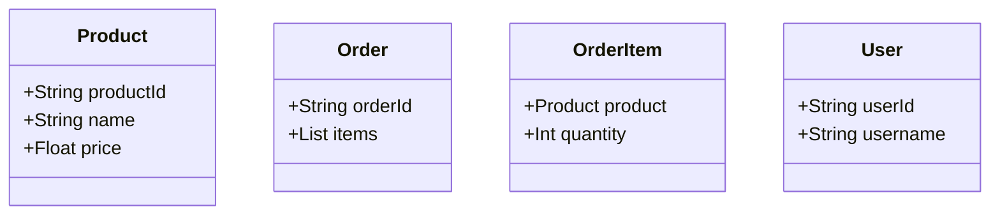
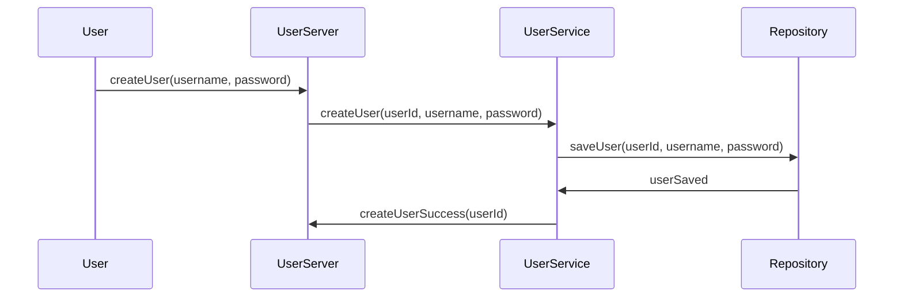

                 

### DDD实践：领域驱动设计在微服务中的应用

> 关键词：领域驱动设计、微服务、架构设计、领域模型、领域服务、实体关系图

> 摘要：本文将探讨领域驱动设计（DDD）在微服务架构中的应用，旨在帮助开发者深入理解DDD的核心概念和实践方法，并掌握如何将DDD应用于微服务架构中，提高软件开发的效率和系统的可维护性。

### 第1章：DDD的背景和概述

#### 1.1 问题背景

在现代软件开发中，随着系统规模的不断扩大和业务需求的日益复杂，传统的面向对象编程（OOP）方法越来越难以应对这些挑战。OOP强调的是对象的封装、继承和多态等特性，但在处理复杂的业务逻辑和领域模型时，往往会导致模型复杂度增加、维护难度加大等问题。

#### 1.2 DDD的定义

领域驱动设计（Domain-Driven Design，简称DDD）是由Eric Evans于2004年提出的一种软件设计方法论。DDD的核心思想是将领域模型作为设计的中心，通过抽象和封装业务逻辑，提高系统的可维护性和可扩展性。

#### 1.3 DDD的核心目标

1. 提高软件的可维护性和可扩展性。
2. 加强开发团队与业务人员之间的沟通。
3. 建立与业务紧密相关的领域模型。

#### 1.4 DDD与传统OOP的关系

DDD并非替代OOP，而是对OOP的一种补充和扩展。OOP侧重于对象的封装和复用，而DDD则更注重领域模型的设计和业务逻辑的抽象。

### 第2章：DDD的核心概念

#### 2.1 领域模型

领域模型是DDD的核心概念之一，它是对业务领域中的实体、关系和规则的抽象表示。领域模型由实体、值对象、聚合、领域服务等多个要素构成。

#### 2.1.1 领域模型的定义

领域模型是现实世界中的业务领域在软件中的映射，它包含了一系列的业务规则和操作。

#### 2.1.2 领域模型的核心要素

- 实体：具有独立业务身份的领域对象。
- 值对象：具有特定业务属性的领域对象。
- 聚合：由一组实体和值对象组成的逻辑单元。
- 领域服务：处理业务逻辑的函数或方法。

#### 2.1.3 实体与值对象的区别

实体通常具有标识（ID）和生命周期，而值对象则不具有标识和生命周期。

#### 2.2 领域服务

领域服务是对领域逻辑的封装，它们通常处理跨聚合的操作，具有明确的业务含义。

#### 2.2.1 领域服务的定义

领域服务是处理特定业务逻辑的函数或方法，它们通常与领域模型中的实体和值对象交互。

#### 2.2.2 领域服务的应用场景

领域服务适用于处理复杂的业务逻辑，特别是在需要跨聚合进行操作的场景中。

#### 2.2.3 领域服务的设计原则

- 高内聚：领域服务应尽量保持高内聚，避免处理过多不相关的业务逻辑。
- 低耦合：领域服务之间应尽量保持低耦合，以减少依赖关系。

### 第3章：实体关系图与领域模型

#### 3.1 实体关系图

实体关系图（Entity-Relationship Diagram，简称ERD）是表示领域模型中实体及其关系的图形化工具。

#### 3.1.1 实体关系图的定义

实体关系图是一种用于表示实体、关系和属性的图形化工具，它可以帮助开发者更清晰地理解领域模型。

#### 3.1.2 实体关系图的组成部分

实体关系图主要由实体、关系、属性和约束等部分组成。

#### 3.1.3 实体关系图的绘制

使用Mermaid等图形化工具可以方便地绘制实体关系图，以下是使用Mermaid绘制的简单示例：

```mermaid
erDiagram
    Customer ||--|{ Order }|
    Product ||--|{ Order }|
```

### 第4章：DDD在微服务架构中的应用

#### 4.1 微服务架构的概述

微服务架构是一种将大型复杂系统拆分为多个小型、独立服务的架构风格。微服务架构具有高可扩展性、高灵活性和高可维护性等优点。

#### 4.1.1 微服务架构的定义

微服务架构是一种将应用程序作为一组小服务的集合来构建、运行和管理的体系结构风格。

#### 4.1.2 微服务架构的优势

- 高可扩展性：可以根据业务需求独立扩展单个服务。
- 高灵活性：服务之间相互独立，便于技术创新和业务调整。
- 高可维护性：服务拆分后，可以更容易地管理和维护。

#### 4.1.3 微服务架构的挑战

- 服务治理：如何管理和监控众多服务。
- 跨服务通信：服务之间如何高效、稳定地通信。
- 数据一致性：如何在分布式系统中保持数据一致性。

#### 4.2 DDD与微服务架构的结合

DDD与微服务架构有着天然的契合关系。DDD可以帮助开发者更好地理解和抽象业务领域，而微服务架构则提供了实现DDD的具体框架。

#### 4.2.1 DDD在微服务架构中的应用

在微服务架构中，DDD可以用于设计每个服务的领域模型，确保服务之间的高内聚和低耦合。

#### 4.2.2 DDD在微服务架构中的最佳实践

- 基于业务领域划分服务。
- 遵循领域驱动开发流程，逐步完善领域模型。
- 使用领域服务处理跨服务操作。
- 保持服务之间的松耦合，确保系统可维护性和可扩展性。

#### 4.2.3 DDD在微服务架构中的挑战

- 如何在分布式系统中保持领域模型的完整性。
- 如何在服务拆分过程中保持业务逻辑的一致性。
- 如何处理复杂的跨服务事务。

### 第5章：DDD实践案例

#### 5.1 案例背景

以一个在线购物平台为例，该平台需要支持商品管理、订单管理、用户管理等功能。

#### 5.2 领域模型设计

根据业务需求，设计商品、订单、用户等核心领域模型。



#### 5.3 领域服务设计

设计领域服务，如商品服务、订单服务和用户服务。



#### 5.4 微服务架构设计

将领域模型和服务拆分为多个微服务，如商品微服务、订单微服务和用户微服务。

```mermaid
erDiagram
    Product ||--|{ Order }|
    User ||--|{ Order }|
```

#### 5.5 实际应用效果分析

通过DDD和微服务架构的结合，平台在可维护性、可扩展性和灵活性等方面得到了显著提升。

### 第6章：DDD实践技巧与最佳实践

#### 6.1 DDD实践技巧

- 理解业务领域，与业务人员紧密合作。
- 设计简洁、直观的领域模型。
- 保持领域服务的独立性。
- 使用事件驱动架构，确保系统可观测性和可追溯性。

#### 6.2 最佳实践

- 团队协作：跨职能团队紧密合作，共同推进项目。
- 技术选型：选择适合业务需求的微服务框架和工具。
- 性能优化：关注系统的性能瓶颈，进行针对性优化。

### 第7章：DDD实践总结与展望

#### 7.1 总结

DDD和微服务架构的结合为软件开发带来了诸多好处，但同时也带来了一些挑战。通过本文的探讨，我们了解了DDD的核心概念和实践方法，以及如何在微服务架构中应用DDD。

#### 7.2 展望

未来，随着技术的发展和业务需求的不断变化，DDD和微服务架构将在软件开发中发挥越来越重要的作用。开发者需要不断学习和实践，以应对这些挑战，提高软件开发的效率和质量。

### 作者信息

作者：AI天才研究院/AI Genius Institute & 禅与计算机程序设计艺术 /Zen And The Art of Computer Programming

---

本文旨在帮助读者深入理解领域驱动设计（DDD）在微服务架构中的应用，通过具体的案例和实践技巧，使读者能够更好地将DDD应用于实际开发中。希望本文能够为您的软件开发之路带来一些启示和帮助。在后续的学习和实践中，不断探索和创新，为软件行业的发展贡献自己的力量。

