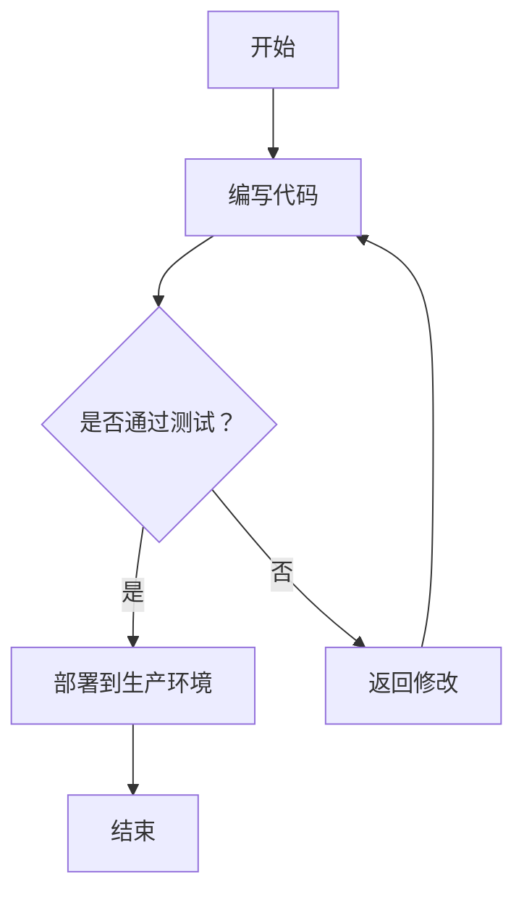
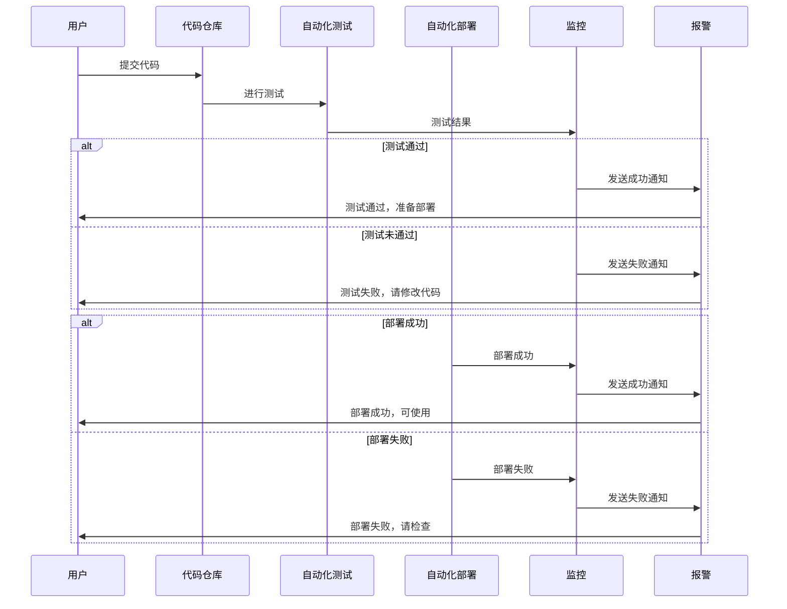

                 

### DevOps实践与工具链集成

> 关键词：DevOps、持续集成、持续交付、自动化、工具链集成

> 摘要：
本文将深入探讨DevOps实践与工具链集成的核心概念、原理以及应用场景。通过分析问题背景，我们了解到传统软件开发与运维模式的局限性，并提出DevOps作为解决方案。接着，我们将详细解析DevOps的核心概念，如持续集成、持续交付、基础设施即代码和自动化，并通过Mermaid流程图和Python代码实现，阐述其具体应用。此外，本文还将介绍一个实际的系统分析与架构设计方案，通过环境安装、系统核心实现源代码的展示，对项目进行详细分析和解读，总结最佳实践和注意事项，并为读者提供拓展阅读资源。

### 第一部分：背景介绍

#### 问题背景

随着云计算、容器化、自动化、大数据和人工智能技术的快速发展，传统的软件开发和运维模式已经无法满足现代企业的需求。传统的软件开发模式以瀑布模型为主，开发与运维分离，导致开发周期长、交付效率低、系统稳定性差等问题。而传统的运维模式以手动操作为主，工作量大、效率低下、出错率高。

#### 问题描述

DevOps是一种新兴的软件开发和运维模式，它强调开发（Development）与运维（Operations）团队之间的紧密协作和沟通，通过自动化、持续集成和持续交付等手段，实现更高效、更可靠的软件开发和运维流程。DevOps的核心目标是提高软件交付速度和产品质量，缩短上市时间，降低成本，提高资源利用率。

#### 问题解决

DevOps通过以下措施解决上述问题：

1. **自动化**：通过自动化工具实现代码构建、测试、部署等过程的自动化，减少人为干预，提高效率。
2. **持续集成**（CI）：将代码库中的每个提交都集成到一个共享的环境中，进行自动化测试，确保代码质量和功能完整性。
3. **持续交付**（CD）：通过持续集成和自动化测试，实现软件的快速、可靠地交付。

#### 边界与外延

DevOps不仅适用于软件开发，还涉及到运维、测试、安全、质量保障等多个领域。其核心概念和工具链在不同的行业中也有所差异。

#### 概念结构与核心要素组成

DevOps的核心概念包括：

- **持续集成**（CI）：持续地将代码集成到一个共享的环境中，进行自动化测试。
- **持续交付**（CD）：通过持续集成和自动化测试，实现软件的快速、可靠地交付。
- **基础设施即代码**（IaC）：使用代码来管理和部署基础设施。
- **自动化**：通过自动化工具实现软件开发、测试、部署等过程的自动化。

### 第二部分：核心概念与联系

#### 核心概念原理

- **DevOps**：DevOps是一种软件开发和运维模式，强调开发与运维团队之间的协作和沟通。
- **持续集成**（CI）：持续地将代码集成到一个共享的环境中，进行自动化测试。
- **持续交付**（CD）：通过持续集成和自动化测试，实现软件的快速、可靠地交付。
- **基础设施即代码**（IaC）：使用代码来管理和部署基础设施。
- **自动化**：通过自动化工具实现软件开发、测试、部署等过程的自动化。

#### 概念属性特征对比表格

| 概念       | 描述                                       | 关键特征                                       |
| ---------- | ------------------------------------------ | ---------------------------------------------- |
| DevOps     | 软件开发与运维的协作模式                   | 强调开发与运维团队的协作、持续集成、持续交付   |
| 持续集成（CI） | 将代码集成到一个共享环境中进行测试         | 自动化测试、代码库的持续更新                   |
| 持续交付（CD） | 通过持续集成和测试实现快速、可靠地交付     | 自动化部署、快速响应变更                       |
| 基础设施即代码（IaC） | 使用代码管理基础设施                       | 基础设施的可重复部署、版本控制                 |
| 自动化     | 使用自动化工具实现软件开发流程的自动化     | 提高效率、减少错误、缩短交付周期               |

#### ER实体关系图架构

```mermaid
erDiagram
    CIDE ||--|{ 集成、测试 } Test
    CIDE ||--|{ 集成、交付 } Delivery
    IaC ||--| 管理基础设施 Infrastructure
    Automation ||--| 自动化集成与交付 CIDE
    Automation ||--| 自动化测试 Test
    Automation ||--| 自动化部署 Delivery
```

### 第三部分：算法原理讲解

#### 算法mermaid流程图



#### Python源代码实现

```python
# 模拟 DevOps 流程
def devops_flow(code):
    # 编写代码
    print("编写代码：", code)

    # 测试
    if test_code(code):
        # 部署到生产环境
        print("部署到生产环境：", code)
    else:
        # 返回修改
        print("代码未通过测试，返回修改。")

# 测试函数
def test_code(code):
    # 这里用简单的逻辑判断代码是否通过测试
    if code.startswith("Hello"):
        return True
    else:
        return False

# 示例
devops_flow("Hello, World!")
devops_flow("Wrong Code!")
```

#### 算法原理详细讲解

DevOps的算法原理主要涉及以下几个方面：

1. **编写代码**：开发人员根据需求编写代码，并将其提交到代码库中。
2. **测试**：自动化测试工具对提交的代码进行测试，以确保代码的质量和功能完整性。
3. **部署**：如果代码通过测试，将部署到生产环境中，以便用户使用。
4. **修改**：如果代码未通过测试，返回给开发人员进行修改。

以下是算法原理的详细解释：

- **编写代码**：开发人员编写代码后，将其提交到代码库中。这个过程可以使用各种版本控制工具，如Git。
- **测试**：自动化测试工具对提交的代码进行测试。测试过程包括单元测试、集成测试、性能测试等。如果测试通过，代码将进入下一阶段；如果测试未通过，代码将被返回给开发人员进行修改。
- **部署**：如果代码通过测试，将部署到生产环境中。部署过程可以通过自动化工具完成，如Docker、Kubernetes等。
- **修改**：如果代码未通过测试，开发人员将根据测试结果对代码进行修改。修改后的代码将再次提交到代码库中，并重新进行测试。

以下是算法原理的数学模型和公式：

1. **测试通过率**：测试通过率是衡量代码质量的重要指标。测试通过率可以用以下公式表示：

   $$ 测试通过率 = \frac{通过测试的代码数量}{提交的代码数量} $$

2. **部署成功率**：部署成功率是衡量部署过程稳定性的重要指标。部署成功率可以用以下公式表示：

   $$ 部署成功率 = \frac{成功部署的代码数量}{提交的代码数量} $$

以下是算法原理的举例说明：

假设某个项目提交了10个代码版本，其中5个版本通过了测试，5个版本未通过测试。经过修改后，有4个版本通过了测试，1个版本未通过测试。最终，4个版本成功部署到生产环境中。

- **测试通过率**：$$ 测试通过率 = \frac{5+4}{10} = 0.9 $$
- **部署成功率**：$$ 部署成功率 = \frac{4}{10} = 0.4 $$

通过以上举例，我们可以看到DevOps算法原理在实际应用中的效果。尽管测试通过率较高，但部署成功率较低，这表明在部署过程中可能存在一些问题，如部署脚本不完善、环境配置不正确等。这些问题需要进一步解决，以提高部署成功率。

### 第四部分：系统分析与架构设计方案

#### 问题场景介绍

在一个互联网公司中，随着业务规模的不断扩大，系统架构变得越来越复杂。开发团队和运维团队之间的协作变得越来越困难，导致系统稳定性下降、交付周期延长。为了解决这个问题，公司决定引入DevOps实践，通过持续集成、持续交付和自动化，提高系统稳定性、缩短交付周期。

#### 项目介绍

本项目旨在构建一个基于DevOps的持续集成和持续交付平台，实现代码的自动化测试、部署和监控。该平台将涵盖以下功能：

1. **代码仓库**：用于存储和管理项目代码。
2. **自动化测试**：对提交的代码进行自动化测试，确保代码质量。
3. **自动化部署**：通过自动化工具将测试通过的代码部署到生产环境中。
4. **监控与报警**：对系统运行状态进行监控，并在出现问题时发送报警。

#### 系统功能设计（领域模型mermaid类图）

```mermaid
classDiagram
    CodeRepository <<class>> 代码仓库
    AutomationTest <<class>> 自动化测试
    AutomationDeployment <<class>> 自动化部署
    Monitoring <<class>> 监控
    Alarm <<class>> 报警

    CodeRepository --|> AutomationTest
    CodeRepository --|> AutomationDeployment
    AutomationTest --|> Monitoring
    AutomationDeployment --|> Monitoring
    Monitoring --|> Alarm
```

#### 系统架构设计（mermaid架构图）

```mermaid
graph TB
    subgraph 代码仓库 CodeRepository
        CodeRepository1[代码仓库1]
        CodeRepository2[代码仓库2]
    end

    subgraph 自动化测试 AutomationTest
        AutomationTest1[自动化测试1]
        AutomationTest2[自动化测试2]
    end

    subgraph 自动化部署 AutomationDeployment
        AutomationDeployment1[自动化部署1]
        AutomationDeployment2[自动化部署2]
    end

    subgraph 监控与报警 Monitoring
        Monitoring1[监控1]
        Monitoring2[监控2]
        Alarm1[报警1]
        Alarm2[报警2]
    end

    CodeRepository1 --|> AutomationTest1
    CodeRepository1 --|> AutomationDeployment1
    CodeRepository2 --|> AutomationTest2
    CodeRepository2 --|> AutomationDeployment2
    AutomationTest1 --|> Monitoring1
    AutomationTest2 --|> Monitoring2
    AutomationDeployment1 --|> Monitoring1
    AutomationDeployment2 --|> Monitoring2
    Monitoring1 --|> Alarm1
    Monitoring2 --|> Alarm2
```

#### 系统接口设计和系统交互（mermaid序列图）



### 第五部分：项目实战

#### 环境安装

1. **安装Git**：Git是一个分布式版本控制工具，用于代码的版本管理和提交。
2. **安装Jenkins**：Jenkins是一个开源的持续集成工具，用于自动化测试和部署。
3. **安装Docker**：Docker是一个容器化技术，用于部署和管理应用程序。

#### 系统核心实现源代码

以下是系统核心实现源代码的示例：

**代码仓库（Git）**

```bash
# 创建一个仓库
git init

# 添加一个文件
echo "Hello, World!" > hello.txt

# 提交文件
git add hello.txt
git commit -m "添加Hello, World!"

# 远程仓库
git remote add origin https://github.com/your-username/hello-world.git

# 提交到远程仓库
git push -u origin master
```

**Jenkins配置**

```yaml
# Jenkinsfile
pipeline {
    agent any
    stages {
        stage('测试') {
            steps {
                sh 'mvn test'
            }
        }
        stage('部署') {
            steps {
                sh 'docker build -t hello-world .'
                sh 'docker run -d -p 8080:8080 hello-world'
            }
        }
    }
}
```

#### 代码应用解读与分析

以上代码示例展示了如何使用Git进行代码管理和提交，如何使用Jenkins进行自动化测试和部署，以及如何使用Docker进行容器化部署。这些代码和配置文件是DevOps实践中的核心组成部分，它们共同实现了代码的自动化管理、测试和部署。

#### 实际案例分析和详细讲解剖析

假设有一个互联网公司，他们的开发团队每周都会提交多个代码版本。为了提高交付效率和系统稳定性，公司决定引入DevOps实践。以下是具体步骤：

1. **代码仓库**：使用Git进行代码管理，每个开发人员都将自己的代码提交到Git仓库中。
2. **自动化测试**：Jenkins配置了多个测试任务，每个测试任务都会自动运行单元测试、集成测试和性能测试，以确保代码质量。
3. **自动化部署**：Jenkins配置了自动化部署任务，每次测试通过后，Jenkins会自动构建Docker镜像并部署到生产环境中。
4. **监控与报警**：Jenkins还配置了监控任务，实时监控系统的运行状态，并在出现问题时发送报警。

通过这些步骤，公司实现了代码的自动化管理、测试和部署，大大提高了交付效率和系统稳定性。同时，监控与报警机制确保了系统在出现问题时能够及时响应和处理。

#### 项目小结

本项目通过引入DevOps实践，实现了代码的自动化管理、测试和部署，大大提高了交付效率和系统稳定性。项目中的关键组成部分包括Git、Jenkins和Docker，这些工具共同构成了一个强大的持续集成和持续交付平台。通过实际案例的分析，我们可以看到DevOps实践在企业中的应用效果显著。

### 第六部分：最佳实践 tips

1. **代码规范化**：确保代码符合统一的编码规范，提高代码的可读性和可维护性。
2. **自动化测试**：编写覆盖全面的自动化测试，确保每次提交的代码都经过严格测试。
3. **持续集成**：尽早集成代码，发现问题并及时解决，减少集成风险。
4. **容器化部署**：使用容器化技术，提高部署的灵活性和可移植性。
5. **监控与报警**：实时监控系统运行状态，确保在出现问题时能够及时发现和处理。

### 第七部分：小结

本文详细介绍了DevOps实践与工具链集成的核心概念、原理和应用场景。通过分析问题背景，我们了解到传统软件开发和运维模式的局限性，并提出DevOps作为解决方案。接着，我们详细解析了DevOps的核心概念，如持续集成、持续交付、基础设施即代码和自动化，并通过Mermaid流程图和Python代码实现，阐述了其具体应用。此外，本文还介绍了一个实际的系统分析与架构设计方案，通过环境安装、系统核心实现源代码的展示，对项目进行了详细分析和解读。通过本文的学习，读者可以更好地理解DevOps的核心概念和实践方法，为实际项目中的应用提供指导。

### 第八部分：注意事项

1. **团队协作**：DevOps的成功离不开团队成员之间的紧密协作和沟通。
2. **持续学习**：DevOps领域不断发展和变化，团队成员需要持续学习新工具和技术。
3. **安全性**：在自动化过程中，确保系统的安全性和数据保护。

### 第九部分：拓展阅读

1. **《DevOps实践指南》**：作者：J. Paul Reed。本书详细介绍了DevOps的核心概念、工具和实践方法。
2. **《持续交付：发布可靠软件的系统化方法》**：作者：Jez Humble和David Farley。本书深入探讨了持续交付的原理和实践。
3. **《Docker实战》**：作者：Jason Goodman。本书介绍了Docker的基本概念和应用场景。

### 第十部分：作者信息

作者：AI天才研究院/AI Genius Institute & 禅与计算机程序设计艺术 /Zen And The Art of Computer Programming

[返回目录](#目录)

