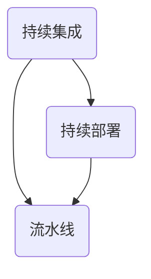
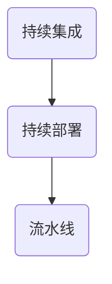

                 

### 第1章：引言——DevOps文化建设的必要性

#### 1.1 引言

**DevOps的概念与重要性**

DevOps是一种将软件开发（Development）和信息技术运营（Operations）结合起来的方法，旨在通过提高协作和自动化来加速软件交付过程。传统的开发与运维往往各自为政，导致沟通不畅、协作困难，进而影响软件质量与交付速度。而DevOps通过强调跨职能团队的紧密合作和自动化工具的广泛应用，实现了软件开发与运维的无缝衔接。

**DevOps文化的核心要素**

DevOps文化不仅仅是工具和技术的应用，更是一种工作方式和思维模式的变革。其核心要素包括以下几个方面：

- **协作与沟通**：打破开发与运维之间的壁垒，促进团队间的沟通与协作。
- **自动化**：通过自动化工具和流程减少人为干预，提高效率和稳定性。
- **持续集成与持续部署**：确保代码质量，加快软件迭代速度。
- **监控与反馈**：实时监控系统运行状态，快速响应和解决问题。

**DevOps与传统IT文化的差异**

传统的IT文化往往强调部门分工和职能独立，而DevOps则强调团队合作和流程整合。以下是DevOps与传统IT文化的一些主要差异：

- **工作方式**：DevOps强调持续迭代和快速交付，而传统IT更注重项目的稳定性和可靠性。
- **组织结构**：DevOps鼓励扁平化管理，而传统IT往往采用层级分明的组织结构。
- **工具与技术**：DevOps注重自动化和云原生技术，而传统IT更多地依赖传统的运维工具和硬件设施。

### 1.2 DevOps文化建设的核心目标

**提升软件交付效率**

通过自动化和协作，DevOps可以显著缩短软件交付周期，提高交付频率，从而快速响应用户需求和市场变化。

**提高软件质量**

持续集成与持续部署有助于发现和修复代码缺陷，确保软件质量。

**降低运营成本**

自动化工具的广泛应用可以减少人力成本，提高资源利用率。

**增强团队协作**

通过打破部门壁垒，促进团队间的沟通与合作，提高整体工作效率。

### 1.3 DevOps文化建设的实施步骤

**1.3.1 领导层的支持与推动**

领导层的支持是DevOps文化成功实施的关键。他们需要明确表达对DevOps的承诺，并提供必要的资源和培训。

**1.3.2 教育与培训**

团队成员需要了解DevOps的核心概念、工具和技术，以及如何在日常工作中应用。

**1.3.3 文化变革的挑战与应对**

实施DevOps文化变革可能会面临诸多挑战，如组织结构的调整、团队成员的抵触等。因此，需要制定详细的文化变革计划，并采取有效的应对措施。

### 1.4 小结

本章节介绍了DevOps的基本概念和重要性，阐述了DevOps文化的核心要素，并分析了DevOps与传统IT文化的差异。接下来，我们将深入探讨DevOps的核心概念与原则，为后续章节的内容奠定基础。

----------------------------------------------------------------

**关键词：** DevOps，文化建设，自动化，持续集成，持续部署，协作，沟通

**摘要：** 本文详细介绍了DevOps的基本概念、核心要素、与传统IT文化的差异，以及DevOps文化建设的核心目标、实施步骤和面临的挑战。通过本文，读者可以全面了解DevOps文化的内涵和实施方法，为后续章节的学习打下基础。

----------------------------------------------------------------

## 第2章：DevOps核心概念与原则

### 2.1 DevOps核心概念

在深入探讨DevOps文化之前，我们首先需要了解其核心概念。这些概念包括流水线（CI/CD）、持续集成与持续部署、团队协作与沟通等。

#### 2.1.1 流水线（CI/CD）

**持续集成（Continuous Integration，CI）**是一种软件开发实践，旨在通过频繁地将代码集成到一个共同的代码库中，以便及早发现和解决潜在问题。CI强调代码的质量，确保每次集成后的代码库都是可用的和稳定的。

**持续部署（Continuous Deployment，CD）**则是CI的延伸，它通过自动化流程将代码部署到生产环境中。CD的目标是确保代码在任何时候都是可用的，并减少人工干预。

**流水线（Pipeline）**是将CI/CD过程自动化的工具和流程。通过流水线，开发人员可以轻松地监控代码的集成和部署过程，提高工作效率和软件质量。

**核心概念对比表格**

| 核心概念 | 定义 | 目的 |
| --- | --- | --- |
| 持续集成（CI） | 频繁将代码集成到一个共同的代码库中 | 提高代码质量，及早发现和解决问题 |
| 持续部署（CD） | 通过自动化流程将代码部署到生产环境中 | 提高交付速度，减少人工干预 |
| 流水线（Pipeline） | 自动化的CI/CD过程 | 提高工作效率，确保代码质量 |

**ER实体关系图架构的Mermaid流程图**

#### 2.1.2 持续集成与持续部署

**持续集成**是一种软件开发实践，通过频繁地将代码集成到一个共同的代码库中，确保每次集成后的代码库都是可用的和稳定的。以下是持续集成的主要特点：

- **频繁集成**：开发人员频繁地将代码提交到代码库，以保持代码的同步和一致性。
- **自动化测试**：每次集成后，自动化测试工具会运行一系列测试，以确保新代码不会破坏现有功能。
- **快速反馈**：测试结果可以快速反馈给开发人员，让他们及时发现问题并修复。

**持续部署**则是CI的延伸，它通过自动化流程将代码部署到生产环境中。持续部署的主要特点包括：

- **自动化部署**：部署过程是完全自动化的，减少了人工干预，提高了效率。
- **快速迭代**：通过持续部署，开发人员可以快速将新功能推向市场，加快软件迭代速度。
- **风险控制**：通过灰度发布等技术，可以控制新功能的发布范围，降低风险。

**持续集成与持续部署的联系**

持续集成和持续部署是DevOps中两个重要的概念，它们相互关联、相互促进。持续集成确保了代码的质量和一致性，而持续部署则确保了代码的快速交付和稳定运行。

**核心概念对比表格**

| 核心概念 | 定义 | 目的 |
| --- | --- | --- |
| 持续集成（CI） | 频繁将代码集成到一个共同的代码库中 | 提高代码质量，及早发现和解决问题 |
| 持续部署（CD） | 通过自动化流程将代码部署到生产环境中 | 提高交付速度，减少人工干预 |
| 流水线（Pipeline） | 自动化的CI/CD过程 | 提高工作效率，确保代码质量 |

**ER实体关系图架构的Mermaid流程图**

#### 2.1.3 团队协作与沟通

**团队协作**是DevOps文化中至关重要的一部分。在传统的IT环境中，开发、测试、运维等团队往往各自为政，导致沟通不畅、协作困难。而DevOps通过强调跨职能团队的协作，打破了部门壁垒，提高了整体工作效率。

**沟通的重要性**

有效的沟通是团队协作的基石。在DevOps中，团队成员需要频繁地交流、共享信息和反馈，以确保项目的顺利进行。以下是一些关键点：

- **透明度**：通过共享项目进度、问题和解决方案，提高团队透明度，减少误解和冲突。
- **实时沟通**：采用即时通讯工具、视频会议等实时沟通方式，确保团队成员之间的信息传递是即时的。
- **反馈机制**：建立有效的反馈机制，让团队成员能够及时了解自己的工作效果，并做出相应的调整。

**团队协作的最佳实践**

- **Scrum框架**：Scrum是一种敏捷开发方法，它通过短周期的迭代和频繁的会议，提高团队协作效率。
- **看板（Kanban）**：看板是一种可视化工具，用于跟踪项目进度和任务状态，促进团队成员之间的协作。

**团队协作的挑战与应对**

实施团队协作可能会面临一些挑战，如文化差异、沟通障碍等。以下是一些应对措施：

- **文化变革**：领导层需要积极推动文化变革，树立团队合作和沟通的典范。
- **培训与指导**：为团队成员提供必要的培训，提高他们的协作和沟通技能。
- **建立信任**：通过共同的目标和成果，建立团队成员之间的信任，促进协作。

### 2.2 小结

本章介绍了DevOps的核心概念，包括持续集成、持续部署和团队协作与沟通。通过理解这些概念，我们可以更好地理解DevOps文化的内涵，并为后续章节的学习打下基础。

----------------------------------------------------------------

## 第3章：构建DevOps文化的方法与策略

### 3.1 DevOps文化建设的步骤

构建DevOps文化是一个系统性的过程，需要从多个方面进行规划和实施。以下是一些关键步骤：

#### 3.1.1 领导层的支持与推动

领导层的支持是DevOps文化成功实施的关键。他们需要明确表达对DevOps的承诺，并提供必要的资源和培训。以下是一些具体措施：

- **制定战略规划**：领导层需要制定明确的DevOps战略规划，明确目标、路径和资源配置。
- **提供资金支持**：确保有足够的资金用于购买自动化工具、进行培训等。
- **树立榜样**：领导层需要通过自己的行为树立团队合作和沟通的典范。

#### 3.1.2 教育与培训

团队成员需要了解DevOps的核心概念、工具和技术，以及如何在日常工作中应用。以下是一些教育培训的建议：

- **内部培训**：组织内部培训课程，由有经验的团队成员或外部专家进行授课。
- **在线课程**：利用在线学习平台，提供丰富的DevOps课程资源。
- **实践操作**：通过实际项目操作，让团队成员在实践中学习和掌握DevOps技术。

#### 3.1.3 文化变革的挑战与应对

实施DevOps文化变革可能会面临诸多挑战，如组织结构的调整、团队成员的抵触等。以下是一些应对措施：

- **沟通与宣传**：通过内部会议、公告、培训等多种形式，广泛宣传DevOps的优势和实施计划，提高团队成员的认同度。
- **试点项目**：选择一些具有代表性的项目进行试点，通过实际效果来证明DevOps的可行性。
- **逐步实施**：不要急于全面推行DevOps，可以逐步实施，逐步调整和优化。

### 3.2 促进团队协作与沟通的策略

团队协作和沟通是DevOps文化的核心。以下是一些促进团队协作和沟通的策略：

#### 3.2.1 透明化工作流程

通过共享项目进度、问题和解决方案，提高团队透明度，减少误解和冲突。以下是一些具体措施：

- **实时沟通工具**：采用即时通讯工具、视频会议等实时沟通方式，确保团队成员之间的信息传递是即时的。
- **项目管理工具**：使用项目管理工具（如JIRA、Trello等）来跟踪任务进度和项目状态。
- **看板（Kanban）**：使用看板（Kanban）来可视化工作流程，让团队成员清晰地了解任务的状态和进度。

#### 3.2.2 鼓励知识分享

通过鼓励团队成员分享知识和经验，促进团队协作和知识积累。以下是一些具体措施：

- **团队会议**：定期组织团队会议，让团队成员分享各自的工作进展和遇到的问题。
- **内部博客**：鼓励团队成员撰写技术博客，分享自己的学习和实践经验。
- **知识库**：建立内部知识库，记录团队成员的经验和解决方案，方便后续查询和参考。

#### 3.2.3 建立信任

通过共同的目标和成果，建立团队成员之间的信任，促进协作。以下是一些具体措施：

- **跨职能团队**：鼓励不同职能团队成员组成跨职能团队，共同完成项目，促进彼此之间的了解和信任。
- **共同目标**：确保团队成员都明确共同的目标和期望，共同为实现目标而努力。
- **认可与激励**：对在团队协作中表现出色的成员给予认可和激励，提高团队的凝聚力。

### 3.3 小结

本章介绍了构建DevOps文化的方法与策略，包括领导层的支持与推动、教育与培训、文化变革的挑战与应对，以及促进团队协作与沟通的具体措施。通过这些策略，企业可以逐步建立起健康的DevOps文化，提高团队的工作效率和软件交付质量。

----------------------------------------------------------------

## 第4章：DevOps工具链介绍

### 4.1 DevOps工具链概述

DevOps工具链是由一系列自动化工具和流程组成的，旨在提高软件交付速度、稳定性和质量。这些工具通常可以分为以下几类：

#### 4.1.1 主要工具类别

- **持续集成工具**：如Jenkins、GitLab CI等，用于自动化构建、测试和部署代码。
- **持续部署工具**：如Kubernetes、Docker等，用于自动化部署和管理应用程序。
- **自动化测试工具**：如Selenium、TestNG等，用于自动化测试应用程序。
- **监控与日志管理工具**：如Prometheus、ELK（Elasticsearch、Logstash、Kibana）等，用于监控应用程序性能和日志管理。
- **配置管理工具**：如Ansible、Puppet等，用于自动化配置和管理服务器和应用程序。
- **容器化工具**：如Docker，用于打包、交付和运行应用程序。
- **基础设施即代码工具**：如Terraform、AWS CloudFormation等，用于自动化基础设施的创建和管理。

#### 4.1.2 DevOps工具的选择标准

在选择DevOps工具时，企业需要考虑以下因素：

- **功能与性能**：工具是否满足企业的具体需求，如自动化测试、持续集成、容器化等。
- **易用性与稳定性**：工具是否易于部署和使用，是否具备高稳定性和可靠性。
- **社区支持与生态**：工具是否有丰富的社区资源和插件，是否与其他工具和平台兼容。
- **成本**：工具的购买、维护和使用成本是否在企业的预算范围内。

### 4.2 DevOps工具链的常见组合

在企业中，常见的DevOps工具链组合包括以下几类：

#### 4.2.1 Jenkins + GitLab CI

- **Jenkins**：一个流行的开源持续集成工具，支持多种编程语言和平台。
- **GitLab CI**：GitLab内置的持续集成服务，支持自动化构建、测试和部署。

这种组合的优点是简单易用，适合中小型团队。缺点是扩展性和性能可能有限，不适合大型项目。

#### 4.2.2 Jenkins + Kubernetes

- **Jenkins**：持续集成和持续部署工具。
- **Kubernetes**：一个开源的容器编排平台，用于自动化部署、扩展和管理容器化应用程序。

这种组合提供了强大的持续集成和容器编排功能，适合大型项目和复杂应用程序。缺点是需要一定的学习和维护成本。

#### 4.2.3 Jenkins + Docker + Prometheus + ELK

- **Jenkins**：持续集成和持续部署工具。
- **Docker**：容器化工具，用于打包、交付和运行应用程序。
- **Prometheus**：监控工具，用于收集和展示应用程序的性能指标。
- **ELK**：日志管理工具，用于收集、存储和分析日志。

这种组合提供了全面的持续集成、容器化、监控和日志管理功能，适合需要高度自动化和监控的复杂应用程序。缺点是需要较高的学习成本和维护难度。

### 4.3 小结

本章介绍了DevOps工具链的基本概念、主要类别、选择标准以及常见的工具组合。通过了解这些工具链，企业可以更好地选择适合自己的DevOps工具，提高软件交付质量和效率。

----------------------------------------------------------------

## 第5章：具体工具深度介绍

### 5.1 持续集成工具

持续集成工具是DevOps工具链中的核心组件，用于自动化构建、测试和部署代码。以下将介绍两个广泛使用的持续集成工具：Jenkins和GitLab CI。

#### 5.1.1 Jenkins

**Jenkins概述**

Jenkins是一个开源的持续集成工具，由云雀软件（CloudBees）维护。它支持多种编程语言和平台，具有丰富的插件生态，可以轻松地与其他工具集成。

**Jenkins的主要功能**

- **自动化构建**：Jenkins可以自动化构建项目，包括编译、打包和安装。
- **测试**：Jenkins可以运行各种类型的测试，如单元测试、集成测试等，确保代码质量。
- **部署**：Jenkins可以将构建好的代码部署到生产环境中。
- **通知**：Jenkins可以通过邮件、IM等方式通知相关人员关于构建和部署的状态。

**Jenkins的安装与配置**

1. **下载和安装Jenkins**：可以从Jenkins官方网站下载Jenkins的安装包，并按照文档进行安装。
2. **插件安装**：安装Jenkins时，可以选择安装一些常用的插件，如Git、Maven等。
3. **配置项目**：创建一个新的项目，并配置项目的构建流程，包括源代码管理、构建步骤、测试步骤等。

**Jenkins的应用案例**

- **自动化构建和测试**：开发团队可以使用Jenkins自动化构建和测试代码，确保每次提交都是可用的。
- **持续部署**：通过Jenkins，开发团队可以自动化部署代码到测试环境或生产环境，加快交付速度。

#### 5.1.2 GitLab CI

**GitLab CI概述**

GitLab CI是GitLab内置的持续集成服务，它基于GitLab仓库的`.gitlab-ci.yml`文件进行配置。GitLab CI支持多种编程语言和平台，可以自动化构建、测试和部署代码。

**GitLab CI的主要功能**

- **自动化构建**：GitLab CI可以自动化构建项目，包括编译、打包和安装。
- **测试**：GitLab CI可以运行各种类型的测试，如单元测试、集成测试等，确保代码质量。
- **部署**：GitLab CI可以将构建好的代码部署到生产环境中。
- **监控**：GitLab CI可以监控构建和部署过程，并在出现问题时通知相关人员。

**GitLab CI的安装与配置**

1. **安装GitLab**：首先需要安装GitLab，GitLab是一个开源的代码仓库管理工具。
2. **创建`.gitlab-ci.yml`文件**：在GitLab仓库的根目录下创建一个`.gitlab-ci.yml`文件，配置项目的构建和部署流程。
3. **配置GitLab CI**：在GitLab的Web界面中，配置GitLab CI的访问权限和触发条件。

**GitLab CI的应用案例**

- **自动化测试**：开发团队可以使用GitLab CI自动化运行测试，确保每次提交都是高质量的。
- **持续部署**：通过GitLab CI，开发团队可以自动化部署代码到测试环境或生产环境，加快交付速度。

### 5.2 持续部署工具

持续部署工具是DevOps工具链中的另一重要组件，用于自动化部署和管理应用程序。以下将介绍两个广泛使用的持续部署工具：Kubernetes和Docker。

#### 5.2.1 Kubernetes

**Kubernetes概述**

Kubernetes是一个开源的容器编排平台，由谷歌开发并捐赠给云原生计算基金会（CNCF）。Kubernetes可以自动化部署、扩展和管理容器化应用程序。

**Kubernetes的主要功能**

- **自动化部署**：Kubernetes可以根据定义的配置文件自动化部署应用程序。
- **服务发现和负载均衡**：Kubernetes可以自动发现应用程序并分配负载，确保应用程序的高可用性。
- **弹性伸缩**：Kubernetes可以根据应用程序的负载自动调整资源分配。
- **自动化回滚和恢复**：Kubernetes可以在部署失败时自动回滚到上一个版本，并确保系统的稳定性。

**Kubernetes的安装与配置**

1. **安装Kubernetes**：可以从Kubernetes官方网站下载安装包，并按照文档进行安装。
2. **配置Kubernetes集群**：通过Kubernetes命令行工具（kubectl）配置集群和节点。
3. **部署应用程序**：使用Kubernetes的配置文件（如YAML文件）部署应用程序。

**Kubernetes的应用案例**

- **大规模容器化部署**：企业可以使用Kubernetes自动化部署和管理大量容器化应用程序。
- **微服务架构**：Kubernetes非常适合微服务架构，可以自动化部署和管理微服务。

#### 5.2.2 Docker

**Docker概述**

Docker是一个开源的容器化平台，用于打包、交付和运行应用程序。Docker使用容器（Container）将应用程序及其依赖环境打包在一起，确保应用程序在不同的环境中运行一致。

**Docker的主要功能**

- **容器化**：Docker可以将应用程序及其依赖环境打包成一个容器，确保应用程序在不同的环境中运行一致。
- **快速交付**：通过Docker，开发人员可以快速创建和部署容器化应用程序。
- **轻量级**：Docker容器非常轻量，可以快速启动和关闭，提高资源利用率。
- **隔离性**：Docker容器具有强大的隔离性，可以确保应用程序之间不会相互干扰。

**Docker的安装与配置**

1. **安装Docker**：可以从Docker官方网站下载安装包，并按照文档进行安装。
2. **配置Docker镜像**：使用Dockerfile创建Docker镜像，将应用程序及其依赖环境打包在一起。
3. **部署容器**：使用Docker命令部署容器化应用程序。

**Docker的应用案例**

- **持续集成和持续部署**：开发团队可以使用Docker自动化构建和部署应用程序。
- **云计算和容器化**：企业可以使用Docker在云计算环境中部署和管理容器化应用程序。

### 5.3 小结

本章介绍了两个持续集成工具（Jenkins和GitLab CI）以及两个持续部署工具（Kubernetes和Docker）。通过了解这些工具的功能、安装和配置方法，开发团队可以更好地实现DevOps的目标，提高软件交付质量和效率。

----------------------------------------------------------------

## 第6章：DevOps案例分析

### 6.1 案例介绍

在本章中，我们将通过一个实际案例，详细介绍DevOps文化在一家中型互联网公司的成功实施过程。这家公司是一家提供在线教育服务的平台，由于业务迅速扩展，面临着软件交付速度慢、质量不稳定等挑战。为了应对这些挑战，公司决定引入DevOps文化，以提高软件交付质量和效率。

#### 6.1.1 案例背景与目标

**背景**：

- **业务发展迅速**：公司在线教育平台的用户数量迅速增长，导致业务需求不断变化。
- **软件交付效率低**：传统的开发与运维模式导致软件交付速度慢，无法快速响应用户需求。
- **软件质量不稳定**：由于缺乏自动化和持续集成，代码质量难以保证，经常出现缺陷和故障。

**目标**：

- **提高软件交付速度**：通过自动化流程和持续集成，加快软件交付周期。
- **提高软件质量**：通过自动化测试和持续集成，确保软件质量。
- **增强团队协作**：通过DevOps文化，促进开发、测试、运维团队的紧密协作。

#### 6.1.2 实施过程与效果

**实施过程**：

1. **领导层支持与推动**：

   - **制定DevOps战略**：公司领导层制定了明确的DevOps战略，明确了目标、路径和资源配置。
   - **提供资金支持**：公司投入资金购买自动化工具、进行员工培训等。

2. **教育与培训**：

   - **内部培训**：公司组织内部培训课程，由有经验的团队成员或外部专家进行授课。
   - **在线课程**：员工利用在线学习平台，学习DevOps相关知识。
   - **实践操作**：员工参与实际项目操作，掌握DevOps工具和技术的应用。

3. **文化变革**：

   - **沟通与宣传**：公司通过内部会议、公告、培训等方式，广泛宣传DevOps的优势和实施计划。
   - **试点项目**：选择一些具有代表性的项目进行试点，通过实际效果来证明DevOps的可行性。
   - **逐步实施**：公司逐步推行DevOps，逐步调整和优化。

4. **团队协作与沟通**：

   - **透明化工作流程**：通过实时沟通工具和项目管理工具，提高团队透明度。
   - **知识分享**：鼓励团队成员分享知识和经验，建立内部知识库。
   - **建立信任**：通过共同的目标和成果，建立团队成员之间的信任。

**实施效果**：

1. **软件交付速度提高**：

   - **交付周期缩短**：通过自动化流程和持续集成，软件交付周期从原来的数周缩短到数天。
   - **交付频率增加**：开发团队可以更频繁地交付新功能，快速响应用户需求。

2. **软件质量提高**：

   - **自动化测试覆盖率提高**：通过自动化测试，代码质量得到有效保障。
   - **缺陷发现和修复及时**：通过持续集成和自动化测试，及时发现和修复代码缺陷。

3. **团队协作与沟通增强**：

   - **团队透明度提高**：团队成员可以实时了解项目进度和问题，提高协作效率。
   - **知识分享与积累**：团队成员通过分享经验和知识，提升整体技术水平。
   - **信任建立**：团队成员通过共同的目标和成果，建立深厚的信任关系。

#### 6.1.3 案例总结

通过这个案例，我们可以看到，DevOps文化的成功实施对于企业软件交付质量和效率的提升具有重要意义。以下是案例总结：

- **领导层的支持与推动**：领导层对DevOps的承诺和投入是实施成功的关键。
- **教育与培训**：团队成员对DevOps工具和技术的熟练掌握是成功的基础。
- **文化变革**：通过逐步实施和试点项目，企业可以逐步适应和接受DevOps文化。
- **团队协作与沟通**：透明化工作流程、知识分享和信任建立是团队协作的重要保障。

通过这个案例，企业可以借鉴DevOps的实施经验和最佳实践，提高自身的软件交付质量和效率。

----------------------------------------------------------------

## 第7章：最佳实践与总结

### 7.1 DevOps最佳实践

在实施DevOps的过程中，企业可以遵循以下最佳实践，以提高软件交付质量和效率：

1. **领导层的支持与推动**：

   - **制定明确的DevOps战略**：领导层需要明确表达对DevOps的承诺，制定详细的实施计划和目标。
   - **提供必要的资源**：包括资金、人力和物资，确保DevOps实施过程顺利进行。

2. **教育与培训**：

   - **内部培训**：为团队成员提供DevOps相关的培训课程，确保他们掌握所需的工具和技术。
   - **在线课程**：利用在线学习平台，提供丰富的DevOps学习资源。
   - **实践操作**：鼓励团队成员参与实际项目，通过实践提高技能。

3. **文化变革**：

   - **沟通与宣传**：通过内部会议、公告、培训等方式，广泛宣传DevOps的优势和实施计划。
   - **试点项目**：选择一些具有代表性的项目进行试点，通过实际效果来证明DevOps的可行性。
   - **逐步实施**：逐步推广DevOps，不断调整和优化。

4. **自动化与持续集成**：

   - **自动化构建与测试**：通过自动化工具，自动化构建和测试代码，确保代码质量。
   - **持续集成与持续部署**：采用持续集成和持续部署，加快软件交付速度。

5. **团队协作与沟通**：

   - **透明化工作流程**：通过实时沟通工具和项目管理工具，提高团队透明度。
   - **知识分享**：鼓励团队成员分享经验和知识，建立内部知识库。
   - **建立信任**：通过共同的目标和成果，建立团队成员之间的信任。

### 7.2 小结

本文详细介绍了DevOps的核心概念、文化建设、工具链、案例分析以及最佳实践。通过理解这些内容，读者可以全面了解DevOps的内涵和实施方法。DevOps作为一种新兴的软件开发和运营模式，具有显著的优点，如提高软件交付速度、质量、稳定性等。然而，实施DevOps也面临着一些挑战，如文化变革、团队协作等。企业需要根据自身实际情况，逐步引入和推广DevOps，以实现软件交付的优化。

### 7.3 未来展望

DevOps的未来发展趋势将集中在以下几个方面：

1. **云原生技术的普及**：随着云计算的不断发展，云原生技术将更加普及，如容器化、自动化等，将推动DevOps的进一步发展。
2. **AI与DevOps的结合**：人工智能技术的发展将赋能DevOps，实现智能化的构建、测试和部署，提高软件交付效率。
3. **DevOps文化的深化**：随着DevOps理念的普及，企业将更加注重DevOps文化的建设，推动组织内部的协作与沟通。

通过持续学习和实践，企业可以不断提升DevOps的成熟度和效率，为软件交付带来更多价值。

### 作者信息

- **作者**：AI天才研究院/AI Genius Institute & 禅与计算机程序设计艺术 /Zen And The Art of Computer Programming

----------------------------------------------------------------

# 《DevOps文化建设与工具链》

## 关键词：DevOps，文化建设，自动化，持续集成，持续部署，协作，沟通

## 摘要：本文详细介绍了DevOps的基本概念、文化建设方法、工具链介绍、实际案例以及最佳实践。通过本文，读者可以全面了解DevOps的内涵和实施方法，为实际工作提供指导。

----------------------------------------------------------------

## 第1章：引言——DevOps文化建设的必要性

### 1.1 引言

DevOps是一种将软件开发（Development）和信息技术运营（Operations）结合起来的方法，旨在通过提高协作和自动化来加速软件交付过程。传统的开发与运维往往各自为政，导致沟通不畅、协作困难，进而影响软件质量与交付速度。而DevOps通过强调跨职能团队的紧密合作和自动化工具的广泛应用，实现了软件开发与运维的无缝衔接。

#### 1.1.1 DevOps的概念与重要性

DevOps是一种软件开发和运营的方法论，其核心思想是将开发和运维团队紧密结合，通过自动化和协作，实现快速、高效的软件交付。DevOps的目标是缩短软件交付周期，提高软件质量，降低运营成本，并增强团队协作和沟通。

在当今快速变化的市场环境中，企业面临着巨大的竞争压力。为了保持竞争力，企业需要快速响应市场需求，持续交付高质量的产品。DevOps提供了一种有效的解决方案，通过自动化工具和流程，实现快速迭代和交付。

#### 1.1.2 DevOps文化的核心要素

DevOps文化不仅仅是工具和技术的应用，更是一种工作方式和思维模式的变革。其核心要素包括以下几个方面：

- **协作与沟通**：打破开发与运维之间的壁垒，促进团队间的沟通与协作。
- **自动化**：通过自动化工具和流程减少人为干预，提高效率和稳定性。
- **持续集成与持续部署**：确保代码质量，加快软件迭代速度。
- **监控与反馈**：实时监控系统运行状态，快速响应和解决问题。

#### 1.1.3 DevOps与传统IT文化的差异

传统的IT文化往往强调部门分工和职能独立，而DevOps则强调团队合作和流程整合。以下是DevOps与传统IT文化的一些主要差异：

- **工作方式**：DevOps强调持续迭代和快速交付，而传统IT更注重项目的稳定性和可靠性。
- **组织结构**：DevOps鼓励扁平化管理，而传统IT往往采用层级分明的组织结构。
- **工具与技术**：DevOps注重自动化和云原生技术，而传统IT更多地依赖传统的运维工具和硬件设施。

### 1.2 DevOps文化建设的核心目标

**提升软件交付效率**

通过自动化和协作，DevOps可以显著缩短软件交付周期，提高交付频率，从而快速响应用户需求和市场变化。

**提高软件质量**

持续集成与持续部署有助于发现和修复代码缺陷，确保软件质量。

**降低运营成本**

自动化工具的广泛应用可以减少人力成本，提高资源利用率。

**增强团队协作**

通过打破部门壁垒，促进团队间的沟通与合作，提高整体工作效率。

### 1.3 DevOps文化建设的实施步骤

**1.3.1 领导层的支持与推动**

领导层的支持是DevOps文化成功实施的关键。他们需要明确表达对DevOps的承诺，并提供必要的资源和培训。

**1.3.2 教育与培训**

团队成员需要了解DevOps的核心概念、工具和技术，以及如何在日常工作中应用。

**1.3.3 文化变革的挑战与应对**

实施DevOps文化变革可能会面临诸多挑战，如组织结构的调整、团队成员的抵触等。因此，需要制定详细的文化变革计划，并采取有效的应对措施。

### 1.4 小结

本章节介绍了DevOps的基本概念和重要性，阐述了DevOps文化的核心要素，并分析了DevOps与传统IT文化的差异。接下来，我们将深入探讨DevOps的核心概念与原则，为后续章节的内容奠定基础。

----------------------------------------------------------------

## 第2章：DevOps核心概念与原则

### 2.1 DevOps核心概念

在深入探讨DevOps文化之前，我们首先需要了解其核心概念。这些概念包括流水线（CI/CD）、持续集成与持续部署、团队协作与沟通等。

#### 2.1.1 流水线（CI/CD）

**持续集成（Continuous Integration，CI）**是一种软件开发实践，旨在通过频繁地将代码集成到一个共同的代码库中，以便及早发现和解决潜在问题。CI强调代码的质量，确保每次集成后的代码库都是可用的和稳定的。

**持续部署（Continuous Deployment，CD）**则是CI的延伸，它通过自动化流程将代码部署到生产环境中。CD的目标是确保代码在任何时候都是可用的，并减少人工干预。

**流水线（Pipeline）**是将CI/CD过程自动化的工具和流程。通过流水线，开发人员可以轻松地监控代码的集成和部署过程，提高工作效率和软件质量。

**核心概念对比表格**

| 核心概念 | 定义 | 目的 |
| --- | --- | --- |
| 持续集成（CI） | 频繁将代码集成到一个共同的代码库中 | 提高代码质量，及早发现和解决问题 |
| 持续部署（CD） | 通过自动化流程将代码部署到生产环境中 | 提高交付速度，减少人工干预 |
| 流水线（Pipeline） | 自动化的CI/CD过程 | 提高工作效率，确保代码质量 |

**ER实体关系图架构的Mermaid流程图**

#### 2.1.2 持续集成与持续部署

**持续集成**是一种软件开发实践，通过频繁地将代码集成到一个共同的代码库中，确保每次集成后的代码库都是可用的和稳定的。以下是持续集成的主要特点：

- **频繁集成**：开发人员频繁地将代码提交到代码库，以保持代码的同步和一致性。
- **自动化测试**：每次集成后，自动化测试工具会运行一系列测试，以确保新代码不会破坏现有功能。
- **快速反馈**：测试结果可以快速反馈给开发人员，让他们及时发现问题并修复。

**持续部署**则是CI的延伸，它通过自动化流程将代码部署到生产环境中。持续部署的主要特点包括：

- **自动化部署**：部署过程是完全自动化的，减少了人工干预，提高了效率。
- **快速迭代**：通过持续部署，开发人员可以快速将新功能推向市场，加快软件迭代速度。
- **风险控制**：通过灰度发布等技术，可以控制新功能的发布范围，降低风险。

**持续集成与持续部署的联系**

持续集成和持续部署是DevOps中两个重要的概念，它们相互关联、相互促进。持续集成确保了代码的质量和一致性，而持续部署则确保了代码的快速交付和稳定运行。

**核心概念对比表格**

| 核心概念 | 定义 | 目的 |
| --- | --- | --- |
| 持续集成（CI） | 频繁将代码集成到一个共同的代码库中 | 提高代码质量，及早发现和解决问题 |
| 持续部署（CD） | 通过自动化流程将代码部署到生产环境中 | 提高交付速度，减少人工干预 |
| 流水线（Pipeline） | 自动化的CI/CD过程 | 提高工作效率，确保代码质量 |

**ER实体关系图架构的Mermaid流程图**

#### 2.1.3 团队协作与沟通

**团队协作**是DevOps文化中至关重要的一部分。在传统的IT环境中，开发、测试、运维等团队往往各自为政，导致沟通不畅、协作困难。而DevOps通过强调跨职能团队的协作，打破了部门壁垒，提高了整体工作效率。

**沟通的重要性**

有效的沟通是团队协作的基石。在DevOps中，团队成员需要频繁地交流、共享信息和反馈，以确保项目的顺利进行。以下是一些关键点：

- **透明度**：通过共享项目进度、问题和解决方案，提高团队透明度，减少误解和冲突。
- **实时沟通**：采用即时通讯工具、视频会议等实时沟通方式，确保团队成员之间的信息传递是即时的。
- **反馈机制**：建立有效的反馈机制，让团队成员能够及时了解自己的工作效果，并做出相应的调整。

**团队协作的最佳实践**

- **Scrum框架**：Scrum是一种敏捷开发方法，它通过短周期的迭代和频繁的会议，提高团队协作效率。
- **看板（Kanban）**：看板是一种可视化工具，用于跟踪项目进度和任务状态，促进团队成员之间的协作。

**团队协作的挑战与应对**

实施团队协作可能会面临一些挑战，如文化差异、沟通障碍等。以下是一些应对措施：

- **文化变革**：领导层需要积极推动文化变革，树立团队合作和沟通的典范。
- **培训与指导**：为团队成员提供必要的培训，提高他们的协作和沟通技能。
- **建立信任**：通过共同的目标和成果，建立团队成员之间的信任，促进协作。

### 2.2 小结

本章介绍了DevOps的核心概念，包括持续集成、持续部署和团队协作与沟通。通过理解这些概念，我们可以更好地理解DevOps文化的内涵，并为后续章节的学习打下基础。

----------------------------------------------------------------

## 第3章：构建DevOps文化的方法与策略

### 3.1 DevOps文化建设的步骤

构建DevOps文化是一个系统性的过程，需要从多个方面进行规划和实施。以下是一些关键步骤：

#### 3.1.1 领导层的支持与推动

领导层的支持是DevOps文化成功实施的关键。他们需要明确表达对DevOps的承诺，并提供必要的资源和培训。以下是一些具体措施：

- **制定战略规划**：领导层需要制定明确的DevOps战略规划，明确目标、路径和资源配置。
- **提供资金支持**：确保有足够的资金用于购买自动化工具、进行培训等。
- **树立榜样**：领导层需要通过自己的行为树立团队合作和沟通的典范。

#### 3.1.2 教育与培训

团队成员需要了解DevOps的核心概念、工具和技术，以及如何在日常工作中应用。以下是一些教育培训的建议：

- **内部培训**：组织内部培训课程，由有经验的团队成员或外部专家进行授课。
- **在线课程**：利用在线学习平台，提供丰富的DevOps课程资源。
- **实践操作**：通过实际项目操作，让团队成员在实践中学习和掌握DevOps技术。

#### 3.1.3 文化变革的挑战与应对

实施DevOps文化变革可能会面临诸多挑战，如组织结构的调整、团队成员的抵触等。以下是一些应对措施：

- **沟通与宣传**：通过内部会议、公告、培训等多种形式，广泛宣传DevOps的优势和实施计划，提高团队成员的认同度。
- **试点项目**：选择一些具有代表性的项目进行试点，通过实际效果来证明DevOps的可行性。
- **逐步实施**：不要急于全面推行DevOps，可以逐步实施，逐步调整和优化。

### 3.2 促进团队协作与沟通的策略

团队协作和沟通是DevOps文化中至关重要的一部分。以下是一些促进团队协作与沟通的策略：

#### 3.2.1 透明化工作流程

通过共享项目进度、问题和解决方案，提高团队透明度，减少误解和冲突。以下是一些具体措施：

- **实时沟通工具**：采用即时通讯工具、视频会议等实时沟通方式，确保团队成员之间的信息传递是即时的。
- **项目管理工具**：使用项目管理工具（如JIRA、Trello等）来跟踪任务进度和项目状态。
- **看板（Kanban）**：使用看板（Kanban）来可视化工作流程，让团队成员清晰地了解任务的状态和进度。

#### 3.2.2 鼓励知识分享

通过鼓励团队成员分享知识和经验，促进团队协作和知识积累。以下是一些具体措施：

- **团队会议**：定期组织团队会议，让团队成员分享各自的工作进展和遇到的问题。
- **内部博客**：鼓励团队成员撰写技术博客，分享自己的学习和实践经验。
- **知识库**：建立内部知识库，记录团队成员的经验和解决方案，方便后续查询和参考。

#### 3.2.3 建立信任

通过共同的目标和成果，建立团队成员之间的信任，促进协作。以下是一些具体措施：

- **跨职能团队**：鼓励不同职能团队成员组成跨职能团队，共同完成项目，促进彼此之间的了解和信任。
- **共同目标**：确保团队成员都明确共同的目标和期望，共同为实现目标而努力。
- **认可与激励**：对在团队协作中表现出色的成员给予认可和激励，提高团队的凝聚力。

### 3.3 小结

本章介绍了构建DevOps文化的方法与策略，包括领导层的支持与推动、教育与培训、文化变革的挑战与应对，以及促进团队协作与沟通的具体措施。通过这些策略，企业可以逐步建立起健康的DevOps文化，提高团队的工作效率和软件交付质量。

----------------------------------------------------------------

## 第4章：DevOps工具链介绍

### 4.1 DevOps工具链概述

DevOps工具链是由一系列自动化工具和流程组成的，旨在提高软件交付速度、稳定性和质量。这些工具通常可以分为以下几类：

#### 4.1.1 主要工具类别

- **持续集成工具**：如Jenkins、GitLab CI等，用于自动化构建、测试和部署代码。
- **持续部署工具**：如Kubernetes、Docker等，用于自动化部署和管理应用程序。
- **自动化测试工具**：如Selenium、TestNG等，用于自动化测试应用程序。
- **监控与日志管理工具**：如Prometheus、ELK（Elasticsearch、Logstash、Kibana）等，用于监控应用程序性能和日志管理。
- **配置管理工具**：如Ansible、Puppet等，用于自动化配置和管理服务器和应用程序。
- **容器化工具**：如Docker，用于打包、交付和运行应用程序。
- **基础设施即代码工具**：如Terraform、AWS CloudFormation等，用于自动化基础设施的创建和管理。

#### 4.1.2 DevOps工具的选择标准

在选择DevOps工具时，企业需要考虑以下因素：

- **功能与性能**：工具是否满足企业的具体需求，如自动化测试、持续集成、容器化等。
- **易用性与稳定性**：工具是否易于部署和使用，是否具备高稳定性和可靠性。
- **社区支持与生态**：工具是否有丰富的社区资源和插件，是否与其他工具和平台兼容。
- **成本**：工具的购买、维护和使用成本是否在企业的预算范围内。

### 4.2 DevOps工具链的常见组合

在企业中，常见的DevOps工具链组合包括以下几类：

#### 4.2.1 Jenkins + GitLab CI

- **Jenkins**：一个流行的开源持续集成工具，支持多种编程语言和平台。
- **GitLab CI**：GitLab内置的持续集成服务，支持自动化构建、测试和部署。

这种组合的优点是简单易用，适合中小型团队。缺点是扩展性和性能可能有限，不适合大型项目。

#### 4.2.2 Jenkins + Kubernetes

- **Jenkins**：持续集成和持续部署工具。
- **Kubernetes**：一个开源的容器编排平台，用于自动化部署、扩展和管理容器化应用程序。

这种组合提供了强大的持续集成和容器编排功能，适合大型项目和复杂应用程序。缺点是需要一定的学习和维护成本。

#### 4.2.3 Jenkins + Docker + Prometheus + ELK

- **Jenkins**：持续集成和持续部署工具。
- **Docker**：容器化工具，用于打包、交付和运行应用程序。
- **Prometheus**：监控工具，用于收集和展示应用程序的性能指标。
- **ELK**：日志管理工具，用于收集、存储和分析日志。

这种组合提供了全面的持续集成、容器化、监控和日志管理功能，适合需要高度自动化和监控的复杂应用程序。缺点是需要较高的学习成本和维护难度。

### 4.3 小结

本章介绍了DevOps工具链的基本概念、主要类别、选择标准以及常见的工具组合。通过了解这些工具链，企业可以更好地选择适合自己的DevOps工具，提高软件交付质量和效率。

----------------------------------------------------------------

## 第5章：具体工具深度介绍

### 5.1 持续集成工具

持续集成工具是DevOps工具链中的核心组件，用于自动化构建、测试和部署代码。以下将介绍两个广泛使用的持续集成工具：Jenkins和GitLab CI。

#### 5.1.1 Jenkins

**Jenkins概述**

Jenkins是一个开源的持续集成工具，由云雀软件（CloudBees）维护。它支持多种编程语言和平台，具有丰富的插件生态，可以轻松地与其他工具集成。

**Jenkins的主要功能**

- **自动化构建**：Jenkins可以自动化构建项目，包括编译、打包和安装。
- **测试**：Jenkins可以运行各种类型的测试，如单元测试、集成测试等，确保代码质量。
- **部署**：Jenkins可以将构建好的代码部署到生产环境中。
- **通知**：Jenkins可以通过邮件、IM等方式通知相关人员关于构建和部署的状态。

**Jenkins的安装与配置**

1. **下载和安装Jenkins**：可以从Jenkins官方网站下载Jenkins的安装包，并按照文档进行安装。
2. **插件安装**：安装Jenkins时，可以选择安装一些常用的插件，如Git、Maven等。
3. **配置项目**：创建一个新的项目，并配置项目的构建流程，包括源代码管理、构建步骤、测试步骤等。

**Jenkins的应用案例**

- **自动化构建和测试**：开发团队可以使用Jenkins自动化构建和测试代码，确保每次提交都是可用的。
- **持续部署**：通过Jenkins，开发团队可以自动化部署代码到测试环境或生产环境，加快交付速度。

#### 5.1.2 GitLab CI

**GitLab CI概述**

GitLab CI是GitLab内置的持续集成服务，它基于GitLab仓库的`.gitlab-ci.yml`文件进行配置。GitLab CI支持多种编程语言和平台，可以自动化构建、测试和部署代码。

**GitLab CI的主要功能**

- **自动化构建**：GitLab CI可以自动化构建项目，包括编译、打包和安装。
- **测试**：GitLab CI可以运行各种类型的测试，如单元测试、集成测试等，确保代码质量。
- **部署**：GitLab CI可以将构建好的代码部署到生产环境中。
- **监控**：GitLab CI可以监控构建和部署过程，并在出现问题时通知相关人员。

**GitLab CI的安装与配置**

1. **安装GitLab**：首先需要安装GitLab，GitLab是一个开源的代码仓库管理工具。
2. **创建`.gitlab-ci.yml`文件**：在GitLab仓库的根目录下创建一个`.gitlab-ci.yml`文件，配置项目的构建和部署流程。
3. **配置GitLab CI**：在GitLab的Web界面中，配置GitLab CI的访问权限和触发条件。

**GitLab CI的应用案例**

- **自动化测试**：开发团队可以使用GitLab CI自动化运行测试，确保每次提交都是高质量的。
- **持续部署**：通过GitLab CI，开发团队可以自动化部署代码到测试环境或生产环境，加快交付速度。

### 5.2 持续部署工具

持续部署工具是DevOps工具链中的另一重要组件，用于自动化部署和管理应用程序。以下将介绍两个广泛使用的持续部署工具：Kubernetes和Docker。

#### 5.2.1 Kubernetes

**Kubernetes概述**

Kubernetes是一个开源的容器编排平台，由谷歌开发并捐赠给云原生计算基金会（CNCF）。Kubernetes可以自动化部署、扩展和管理容器化应用程序。

**Kubernetes的主要功能**

- **自动化部署**：Kubernetes可以根据定义的配置文件自动化部署应用程序。
- **服务发现和负载均衡**：Kubernetes可以自动发现应用程序并分配负载，确保应用程序的高可用性。
- **弹性伸缩**：Kubernetes可以根据应用程序的负载自动调整资源分配。
- **自动化回滚和恢复**：Kubernetes可以在部署失败时自动回滚到上一个版本，并确保系统的稳定性。

**Kubernetes的安装与配置**

1. **安装Kubernetes**：可以从Kubernetes官方网站下载安装包，并按照文档进行安装。
2. **配置Kubernetes集群**：通过Kubernetes命令行工具（kubectl）配置集群和节点。
3. **部署应用程序**：使用Kubernetes的配置文件（如YAML文件）部署应用程序。

**Kubernetes的应用案例**

- **大规模容器化部署**：企业可以使用Kubernetes自动化部署和管理大量容器化应用程序。
- **微服务架构**：Kubernetes非常适合微服务架构，可以自动化部署和管理微服务。

#### 5.2.2 Docker

**Docker概述**

Docker是一个开源的容器化平台，用于打包、交付和运行应用程序。Docker使用容器（Container）将应用程序及其依赖环境打包在一起，确保应用程序在不同的环境中运行一致。

**Docker的主要功能**

- **容器化**：Docker可以将应用程序及其依赖环境打包成一个容器，确保应用程序在不同的环境中运行一致。
- **快速交付**：通过Docker，开发人员可以快速创建和部署容器化应用程序。
- **轻量级**：Docker容器非常轻量，可以快速启动和关闭，提高资源利用率。
- **隔离性**：Docker容器具有强大的隔离性，可以确保应用程序之间不会相互干扰。

**Docker的安装与配置**

1. **安装Docker**：可以从Docker官方网站下载安装包，并按照文档进行安装。
2. **配置Docker镜像**：使用Dockerfile创建Docker镜像，将应用程序及其依赖环境打包在一起。
3. **部署容器**：使用Docker命令部署容器化应用程序。

**Docker的应用案例**

- **持续集成和持续部署**：开发团队可以使用Docker自动化构建和部署应用程序。
- **云计算和容器化**：企业可以使用Docker在云计算环境中部署和管理容器化应用程序。

### 5.3 小结

本章介绍了两个持续集成工具（Jenkins和GitLab CI）以及两个持续部署工具（Kubernetes和Docker）。通过了解这些工具的功能、安装和配置方法，开发团队可以更好地实现DevOps的目标，提高软件交付质量和效率。

----------------------------------------------------------------

## 第6章：DevOps案例分析

### 6.1 案例介绍

在本章中，我们将通过一个实际案例，详细介绍DevOps文化在一家中型互联网公司的成功实施过程。这家公司是一家提供在线教育服务的平台，由于业务迅速扩展，面临着软件交付速度慢、质量不稳定等挑战。为了应对这些挑战，公司决定引入DevOps文化，以提高软件交付质量和效率。

#### 6.1.1 案例背景与目标

**背景**：

- **业务发展迅速**：公司在线教育平台的用户数量迅速增长，导致业务需求不断变化。
- **软件交付效率低**：传统的开发与运维模式导致软件交付速度慢，无法快速响应用户需求。
- **软件质量不稳定**：由于缺乏自动化和持续集成，代码质量难以保证，经常出现缺陷和故障。

**目标**：

- **提高软件交付速度**：通过自动化流程和持续集成，加快软件交付周期。
- **提高软件质量**：通过自动化测试和持续集成，确保软件质量。
- **增强团队协作**：通过DevOps文化，促进开发、测试、运维团队的紧密协作。

#### 6.1.2 实施过程与效果

**实施过程**：

1. **领导层支持与推动**：

   - **制定DevOps战略**：公司领导层制定了明确的DevOps战略，明确了目标、路径和资源配置。
   - **提供资金支持**：公司投入资金购买自动化工具、进行员工培训等。

2. **教育与培训**：

   - **内部培训**：公司组织内部培训课程，由有经验的团队成员或外部专家进行授课。
   - **在线课程**：员工利用在线学习平台，学习DevOps相关知识。
   - **实践操作**：员工参与实际项目操作，掌握DevOps工具和技术的应用。

3. **文化变革**：

   - **沟通与宣传**：公司通过内部会议、公告、培训等方式，广泛宣传DevOps的优势和实施计划。
   - **试点项目**：选择一些具有代表性的项目进行试点，通过实际效果来证明DevOps的可行性。
   - **逐步实施**：公司逐步推行DevOps，逐步调整和优化。

4. **团队协作与沟通**：

   - **透明化工作流程**：通过实时沟通工具和项目管理工具，提高团队透明度。
   - **知识分享**：鼓励团队成员分享知识和经验，建立内部知识库。
   - **建立信任**：通过共同的目标和成果，建立团队成员之间的信任。

**实施效果**：

1. **软件交付速度提高**：

   - **交付周期缩短**：通过自动化流程和持续集成，软件交付周期从原来的数周缩短到数天。
   - **交付频率增加**：开发团队可以更频繁地交付新功能，快速响应用户需求。

2. **软件质量提高**：

   - **自动化测试覆盖率提高**：通过自动化测试，代码质量得到有效保障。
   - **缺陷发现和修复及时**：通过持续集成和自动化测试，及时发现和修复代码缺陷。

3. **团队协作与沟通增强**：

   - **团队透明度提高**：团队成员可以实时了解项目进度和问题，提高协作效率。
   - **知识分享与积累**：团队成员通过分享经验和知识，提升整体技术水平。
   - **信任建立**：团队成员通过共同的目标和成果，建立深厚的信任关系。

#### 6.1.3 案例总结

通过这个案例，我们可以看到，DevOps文化的成功实施对于企业软件交付质量和效率的提升具有重要意义。以下是案例总结：

- **领导层的支持与推动**：领导层对DevOps的承诺和投入是实施成功的关键。
- **教育与培训**：团队成员对DevOps工具和技术的熟练掌握是成功的基础。
- **文化变革**：通过逐步实施和试点项目，企业可以逐步适应和接受DevOps文化。
- **团队协作与沟通**：透明化工作流程、知识分享和信任建立是团队协作的重要保障。

通过这个案例，企业可以借鉴DevOps的实施经验和最佳实践，提高自身的软件交付质量和效率。

----------------------------------------------------------------

## 第7章：最佳实践与总结

### 7.1 DevOps最佳实践

在实施DevOps的过程中，企业可以遵循以下最佳实践，以提高软件交付质量和效率：

1. **领导层的支持与推动**：

   - **制定明确的DevOps战略**：领导层需要明确表达对DevOps的承诺，制定详细的实施计划和目标。
   - **提供必要的资源**：包括资金、人力和物资，确保DevOps实施过程顺利进行。

2. **教育与培训**：

   - **内部培训**：为团队成员提供DevOps相关的培训课程，确保他们掌握所需的工具和技术。
   - **在线课程**：利用在线学习平台，提供丰富的DevOps学习资源。
   - **实践操作**：鼓励团队成员参与实际项目操作，通过实践提高技能。

3. **文化变革**：

   - **沟通与宣传**：通过内部会议、公告、培训等方式，广泛宣传DevOps的优势和实施计划。
   - **试点项目**：选择一些具有代表性的项目进行试点，通过实际效果来证明DevOps的可行性。
   - **逐步实施**：逐步推广DevOps，不断调整和优化。

4. **自动化与持续集成**：

   - **自动化构建与测试**：通过自动化工具，自动化构建和测试代码，确保代码质量。
   - **持续集成与持续部署**：采用持续集成和持续部署，加快软件交付速度。

5. **团队协作与沟通**：

   - **透明化工作流程**：通过实时沟通工具和项目管理工具，提高团队透明度。
   - **知识分享**：鼓励团队成员分享经验和知识，建立内部知识库。
   - **建立信任**：通过共同的目标和成果，建立团队成员之间的信任。

### 7.2 小结

本文详细介绍了DevOps的核心概念、文化建设、工具链、案例分析以及最佳实践。通过本文，读者可以全面了解DevOps的内涵和实施方法，为实际工作提供指导。

### 7.3 未来展望

DevOps的未来发展趋势将集中在以下几个方面：

1. **云原生技术的普及**：随着云计算的不断发展，云原生技术将更加普及，如容器化、自动化等，将推动DevOps的进一步发展。
2. **AI与DevOps的结合**：人工智能技术的发展将赋能DevOps，实现智能化的构建、测试和部署，提高软件交付效率。
3. **DevOps文化的深化**：随着DevOps理念的普及，企业将更加注重DevOps文化的建设，推动组织内部的协作与沟通。

通过持续学习和实践，企业可以不断提升DevOps的成熟度和效率，为软件交付带来更多价值。

### 作者信息

- **作者**：AI天才研究院/AI Genius Institute & 禅与计算机程序设计艺术 /Zen And The Art of Computer Programming

----------------------------------------------------------------

# 《DevOps文化建设与工具链》

## 关键词：DevOps，文化建设，自动化，持续集成，持续部署，协作，沟通

## 摘要：本文详细介绍了DevOps的基本概念、文化建设方法、工具链介绍、实际案例以及最佳实践。通过本文，读者可以全面了解DevOps的内涵和实施方法，为实际工作提供指导。

----------------------------------------------------------------

## 第1章：引言——DevOps文化建设的必要性

### 1.1 引言

DevOps是一种将软件开发（Development）和信息技术运营（Operations）结合起来的方法，旨在通过提高协作和自动化来加速软件交付过程。传统的开发与运维往往各自为政，导致沟通不畅、协作困难，进而影响软件质量与交付速度。而DevOps通过强调跨职能团队的紧密合作和自动化工具的广泛应用，实现了软件开发与运维的无缝衔接。

**DevOps的概念与重要性**

DevOps不仅是一种技术实践，更是一种文化变革。其核心理念包括：

- **协作**：打破开发、测试、运维等团队之间的壁垒，促进信息共享和协同工作。
- **自动化**：通过自动化工具和流程减少重复性工作，提高效率和质量。
- **持续集成（CI）**：频繁地将代码集成到一个共同的代码库中，以确保代码的质量和一致性。
- **持续部署（CD）**：通过自动化流程将代码部署到生产环境，实现快速迭代和交付。

DevOps的重要作用在于：

- **提高软件交付速度**：通过自动化和协作，DevOps能够显著缩短软件交付周期，加快市场响应速度。
- **提升软件质量**：持续集成和自动化测试能够及时发现和修复代码缺陷，确保软件质量。
- **降低运营成本**：自动化减少了重复性工作，提高了资源利用率，降低了运营成本。
- **增强团队协作**：通过DevOps文化，团队之间的沟通和协作得到加强，提高了整体工作效率。

**DevOps文化的核心要素**

DevOps文化的核心要素包括：

- **透明度**：团队成员之间保持信息透明，共同了解项目的进展和问题。
- **信任**：团队成员之间建立信任，互相依赖，共同追求目标。
- **共同目标**：团队成员共同设定目标，共同努力实现这些目标。
- **持续改进**：不断反思和改进工作流程，提高工作效率和质量。

**DevOps与传统IT文化的差异**

与传统IT文化相比，DevOps有以下几个显著差异：

- **工作方式**：传统IT强调线性流程，而DevOps强调迭代和反馈循环。
- **组织结构**：传统IT组织结构较为 rigid，而DevOps倡导扁平化管理。
- **责任分配**：传统IT中职责划分明确，而DevOps强调跨职能团队的协作。
- **技术选择**：传统IT倾向于使用稳定成熟的技术，而DevOps更倾向于使用新兴技术和工具。

**持续集成与持续部署的重要性**

持续集成（Continuous Integration，CI）是一种软件开发实践，它要求开发人员频繁地将代码集成到一个共同的代码库中，以便及早发现和解决潜在问题。CI的核心目标是确保代码库始终保持高质量和一致性。

持续部署（Continuous Deployment，CD）是CI的延伸，它通过自动化流程将代码部署到生产环境中。CD的目标是实现软件的快速迭代和交付，同时确保生产环境的稳定性和安全性。

**DevOps在现代软件开发中的地位**

随着软件需求的快速增长和市场竞争的加剧，DevOps已经成为现代软件开发的必备要素。它不仅提高了软件交付速度和质量，还增强了团队协作和客户满意度。DevOps的普及和应用，为软件开发带来了全新的发展机遇。

### 1.2 DevOps文化建设的核心目标

**提高软件交付速度**

DevOps通过自动化和协作，能够显著缩短软件交付周期。通过持续集成和持续部署，开发团队能够快速迭代和交付新功能，更好地满足用户需求和市场变化。

**提升软件质量**

通过自动化测试和持续集成，DevOps能够及时发现和修复代码缺陷，确保软件质量。这有助于减少软件发布时的故障和缺陷，提高用户满意度。

**降低运营成本**

自动化工具和流程的引入，能够减少重复性工作，提高资源利用率，从而降低运营成本。同时，DevOps能够优化工作流程，提高团队工作效率。

**增强团队协作**

DevOps强调跨职能团队的协作和沟通。通过打破部门壁垒，团队成员能够更好地协同工作，共同实现项目目标。

### 1.3 DevOps文化建设的实施步骤

**领导层的支持与推动**

领导层的支持是DevOps成功实施的关键。领导层需要：

- **明确表达对DevOps的承诺**：向全体员工传达DevOps的重要性和优势，树立榜样。
- **提供必要的资源和培训**：确保团队有足够的资源进行DevOps转型，提供培训机会，提升团队成员的技能。

**教育与培训**

团队成员需要了解DevOps的核心概念、工具和技术。教育和培训的内容应包括：

- **DevOps基础理论**：介绍DevOps的定义、原则和文化。
- **工具与技术**：教授常用的DevOps工具，如Jenkins、GitLab CI、Docker、Kubernetes等。
- **实践操作**：通过实际项目，让团队成员掌握DevOps工具的使用方法。

**文化变革**

文化变革是DevOps成功实施的重要环节。企业需要：

- **沟通与宣传**：通过内部会议、培训、内部博客等方式，宣传DevOps的优势和实践案例。
- **试点项目**：选择一些具有代表性的项目进行试点，积累经验，逐步推广。
- **逐步实施**：不要急于全面推行DevOps，可以逐步实施，逐步调整和优化。

**团队协作与沟通**

团队协作和沟通是DevOps文化的重要基石。企业需要：

- **建立透明的工作流程**：通过项目管理工具和实时沟通工具，提高团队之间的信息透明度。
- **鼓励知识分享**：建立知识库，鼓励团队成员分享经验和知识。
- **建立信任**：通过共同的目标和成果，建立团队成员之间的信任。

### 1.4 小结

本章介绍了DevOps的基本概念、重要性、核心要素、与传统IT文化的差异，以及文化建设的核心目标和实施步骤。通过理解这些内容，读者可以更好地了解DevOps文化的内涵和实施方法，为后续章节的学习打下基础。

----------------------------------------------------------------

## 第2章：DevOps核心概念与原则

### 2.1 DevOps核心概念

要理解DevOps文化，我们需要首先掌握其核心概念。这些概念包括持续集成（Continuous Integration，CI）、持续部署（Continuous Deployment，CD）、基础设施即代码（Infrastructure as Code，IaC）、微服务架构（Microservices Architecture）等。

#### 2.1.1 持续集成（CI）

持续集成（CI）是一种软件开发实践，它强调开发人员频繁地将代码集成到一个共同的代码库中，以便及早发现和解决潜在的问题。CI的核心目标是确保代码库始终保持高质量和一致性。

**CI的主要特点**

- **频繁集成**：开发人员频繁地将代码提交到代码库，通常每个功能点或每次代码变更都会进行集成。
- **自动化测试**：每次集成都会运行一系列自动化测试，包括单元测试、集成测试等，以确保新代码不会破坏现有功能。
- **快速反馈**：测试结果可以快速反馈给开发人员，让他们及时发现问题并进行修复。

**CI的优势**

- **及早发现问题**：通过频繁的集成和自动化测试，可以及早发现和解决代码缺陷，减少修复成本。
- **提高代码质量**：持续集成确保了代码库的一致性和稳定性，提高了代码质量。
- **减少集成冲突**：频繁的集成可以减少代码合并时的冲突，提高团队协作效率。

**CI的挑战**

- **测试覆盖率**：自动化测试的覆盖率是CI成功的关键，如果测试不足，可能会漏掉潜在的缺陷。
- **集成频率**：过高的集成频率可能会增加系统的负载，影响整体性能。

**CI的实施步骤**

1. **选择合适的CI工具**：如Jenkins、GitLab CI等。
2. **配置CI流程**：定义构建脚本、测试脚本和部署脚本。
3. **自动化测试**：编写和配置自动化测试，确保每次集成都运行。
4. **持续监控**：监控CI流程的执行情况，及时处理异常。

**CI与DevOps的关系**

持续集成是DevOps的核心组成部分，它确保了代码的质量和一致性，为后续的持续部署和自动化操作提供了基础。

#### 2.1.2 持续部署（CD）

持续部署（CD）是持续集成的延伸，它通过自动化流程将代码部署到生产环境中。CD的目标是实现软件的快速迭代和交付，同时确保生产环境的稳定性和安全性。

**CD的主要特点**

- **自动化部署**：部署过程是完全自动化的，减少了人工干预。
- **快速迭代**：通过CD，开发团队能够快速将新功能推向市场，加快软件迭代速度。
- **风险控制**：通过灰度发布、蓝绿部署等策略，可以逐步引入新功能，降低部署风险。

**CD的优势**

- **提高交付速度**：自动化部署可以显著缩短软件交付周期，快速响应用户需求。
- **减少人工干预**：自动化部署减少了人工操作，降低了人为错误的风险。
- **确保生产稳定性**：通过自动化测试和灰度发布，可以确保新功能在生产环境中的稳定运行。

**CD的挑战**

- **部署频率**：过高的部署频率可能会影响系统的稳定性和用户体验。
- **测试覆盖**：自动化测试的覆盖范围必须足够广泛，以确保新功能的质量。

**CD的实施步骤**

1. **选择合适的CD工具**：如Kubernetes、Docker等。
2. **配置CD流程**：定义部署脚本、回滚脚本和监控脚本。
3. **自动化测试**：编写和配置自动化测试，确保每次部署都经过严格测试。
4. **持续监控**：监控部署过程和运行状态，及时处理异常。

**CD与DevOps的关系**

持续部署是DevOps的另一个核心组成部分，它确保了代码的快速交付和稳定运行，与持续集成共同构成了DevOps的基础。

#### 2.1.3 基础设施即代码（IaC）

基础设施即代码（Infrastructure as Code，IaC）是一种通过代码来管理和部署基础设施的方法。它将基础设施的配置和管理过程抽象为代码，使其可重复、可版本控制、可自动化。

**IaC的主要特点**

- **代码化配置**：将基础设施的配置和管理过程转化为代码，如YAML、JSON等。
- **版本控制**：基础设施的配置代码可以存储在版本控制系统中，方便管理和追溯。
- **自动化部署**：通过自动化工具，如Terraform、Ansible等，可以自动化部署和管理基础设施。

**IaC的优势**

- **可重复性**：通过代码化配置，可以确保基础设施的重复性和一致性。
- **可追溯性**：版本控制使得基础设施的变更记录清晰可追溯。
- **自动化管理**：自动化工具可以自动化部署和管理基础设施，提高效率。

**IaC的挑战**

- **学习曲线**：初学者可能需要一定时间来掌握IaC和相关工具。
- **复杂性**：大型基础设施的代码化配置可能较为复杂，需要良好的编程技能。

**IaC的实施步骤**

1. **选择合适的IaC工具**：如Terraform、Ansible、AWS CloudFormation等。
2. **编写基础设施代码**：定义基础设施的配置和状态。
3. **自动化部署**：使用自动化工具部署和管理基础设施。
4. **持续监控**：监控基础设施的状态，及时处理异常。

**IaC与DevOps的关系**

基础设施即代码是DevOps的重要组成部分，它通过代码化的基础设施配置和自动化管理，实现了基础设施与软件开发流程的无缝集成。

#### 2.1.4 微服务架构（Microservices Architecture）

微服务架构是一种将应用程序分解为小型、独立的服务单元的架构风格。每个微服务负责实现一个特定的业务功能，可以通过独立的API进行通信。

**微服务架构的主要特点**

- **独立性**：每个微服务都是独立的，可以独立部署、扩展和管理。
- **松耦合**：微服务之间通过轻量级通信协议（如RESTful API、消息队列等）进行通信，降低了系统的耦合度。
- **容器化**：微服务通常部署在容器中，如Docker，提高了部署的灵活性和可移植性。

**微服务架构的优势**

- **可扩展性**：可以通过水平扩展单个微服务来提高系统的性能和可扩展性。
- **故障隔离**：单个微服务的故障不会影响整个系统，提高了系统的容错性。
- **开发效率**：团队可以独立开发和部署微服务，提高了开发效率。

**微服务架构的挑战**

- **复杂性**：微服务架构增加了系统的复杂性，需要良好的设计和管理。
- **分布式事务**：在分布式系统中管理事务可能较为复杂，需要额外的技术支持。

**微服务架构的实施步骤**

1. **业务功能拆分**：将应用程序拆分为独立的微服务。
2. **定义API规范**：为每个微服务定义API接口和通信协议。
3. **容器化微服务**：使用容器化工具（如Docker）将微服务打包和部署。
4. **自动化部署和管理**：使用自动化工具（如Kubernetes）管理和部署微服务。

**微服务架构与DevOps的关系**

微服务架构与DevOps理念高度契合，它通过独立的、可自动化的微服务单元，实现了快速迭代和交付，提高了系统的灵活性和可扩展性。

### 2.2 DevOps原则

DevOps不仅是一套工具和流程，更是一种文化和价值观。以下是一些关键的DevOps原则：

**1. 敏捷迭代**

敏捷迭代强调快速交付和持续改进。通过短周期的迭代，团队能够快速响应变化，持续改进产品。

**2. 客户至上**

客户需求是驱动的核心。DevOps强调以客户为中心，持续优化产品，确保客户满意度。

**3. 自动化**

自动化是DevOps的核心。通过自动化工具和流程，团队能够减少重复性工作，提高效率和质量。

**4. 实时反馈**

实时反馈是持续改进的关键。通过监控和反馈机制，团队能够及时发现和解决问题，持续优化流程。

**5. 跨职能协作**

跨职能协作强调打破部门壁垒，促进团队之间的协作和沟通。通过跨职能团队，团队能够更好地协同工作，提高整体效率。

**6. 持续学习**

持续学习是DevOps文化的一部分。通过不断学习和实践，团队能够不断提升技能和知识，适应不断变化的技术和市场。

### 2.3 小结

本章介绍了DevOps的核心概念和原则，包括持续集成、持续部署、基础设施即代码、微服务架构等。通过理解这些概念和原则，读者可以更好地把握DevOps的内涵，为实际工作提供指导。

----------------------------------------------------------------

## 第3章：构建DevOps文化的方法与策略

### 3.1 引言

构建DevOps文化是一个系统性的过程，需要从组织结构、团队协作、自动化工具等方面进行全方位的规划和实施。本章节将探讨如何构建DevOps文化，并提出一系列方法和策略，以帮助企业在实践中成功引入和推广DevOps。

### 3.2 领导层的角色

**1. 设定愿景和目标**

领导层首先需要明确DevOps的愿景和目标，并将其传达给整个组织。这包括：

- **企业愿景**：DevOps的引入将如何帮助企业实现战略目标。
- **团队目标**：每个团队在DevOps转型中的具体角色和责任。

**2. 资源投入**

领导层需要确保有足够的资源（包括资金、技术和人员）用于DevOps的实施。这包括：

- **资金**：为自动化工具、培训和试点项目提供资金支持。
- **技术**：为团队提供所需的DevOps工具和技术支持。
- **人员**：招聘具有DevOps经验和技能的人才，或提供内部培训。

**3. 领导示范**

领导层通过自身的行为树立榜样，向团队成员展示DevOps的工作方式。这包括：

- **积极参与**：领导层应积极参与DevOps相关的会议和活动。
- **支持创新**：鼓励团队成员尝试新的工具和方法，不断改进流程。

### 3.3 教育与培训

**1. 内部培训**

企业应组织内部培训课程，帮助团队成员了解DevOps的核心概念、工具和技术。培训内容应包括：

- **DevOps基础**：介绍DevOps的原理、目标和实施步骤。
- **工具使用**：演示如何使用Jenkins、GitLab CI、Kubernetes等工具。
- **实践案例**：分享成功和失败的DevOps实践案例。

**2. 外部培训**

对于有需求的高级成员，企业可以考虑提供外部培训课程，如认证课程、工作坊等。这些课程通常由专业培训机构提供，有助于提高团队成员的技能和知识水平。

**3. 在线学习**

企业可以利用在线学习平台，提供丰富的DevOps学习资源。这包括在线课程、文档、博客等。在线学习具有灵活性和便利性，适合不同层次和不同需求的团队成员。

### 3.4 文化变革

**1. 沟通与宣传**

企业需要通过多种渠道（如内部邮件、公告板、会议等）宣传DevOps的优势和实践案例，提高员工的认知和认同度。此外，企业可以组织DevOps宣传活动，如研讨会、讲座等，以增加员工的参与感和归属感。

**2. 试点项目**

企业可以选择一些具有代表性的项目进行试点，以验证DevOps的可行性和效果。试点项目应：

- **选择合适的团队**：选择具有创新精神和接受新技术的团队作为试点。
- **明确目标**：设定清晰的试点目标，确保试点项目能够带来实际收益。
- **支持与反馈**：为试点团队提供必要的支持和资源，并在试点过程中及时收集反馈。

**3. 逐步推广**

试点项目成功后，企业可以逐步推广DevOps到其他团队和项目。推广过程中，企业应：

- **总结经验**：从试点项目中总结经验和教训，形成最佳实践。
- **优化流程**：根据反馈和经验，不断优化DevOps流程和工具。

### 3.5 团队协作

**1. 跨职能团队**

跨职能团队是DevOps文化的重要组成部分。通过跨职能团队，企业可以打破传统的部门壁垒，促进团队成员之间的协作和沟通。跨职能团队通常包括以下角色：

- **开发人员**：负责编写和测试代码。
- **测试人员**：负责编写和执行测试用例。
- **运维人员**：负责部署和维护应用程序。
- **产品经理**：负责制定产品需求和规划。

**2. 沟通工具**

企业应提供适当的沟通工具，以促进团队成员之间的协作和沟通。常用的沟通工具包括：

- **即时通讯工具**：如Slack、Microsoft Teams等，用于实时沟通和协作。
- **项目管理工具**：如JIRA、Trello等，用于任务管理和进度追踪。
- **文档共享工具**：如Confluence、Notion等，用于共享文档和知识库。

**3. 知识分享**

企业应鼓励团队成员分享知识和经验，建立内部知识库。知识分享可以通过以下方式实现：

- **内部会议**：定期组织内部会议，分享项目进展、问题和解决方案。
- **技术博客**：鼓励团队成员撰写技术博客，分享技术心得和经验。
- **知识库**：建立内部知识库，记录项目文档、最佳实践和技术指南。

### 3.6 自动化与持续集成

**1. 自动化**

自动化是DevOps的核心原则之一。通过自动化，企业可以减少手动操作，提高工作效率和稳定性。自动化包括以下几个方面：

- **构建自动化**：使用Jenkins、GitLab CI等工具自动化构建和测试代码。
- **部署自动化**：使用Kubernetes、Docker等工具自动化部署和管理应用程序。
- **监控自动化**：使用Prometheus、ELK等工具自动化监控应用程序性能和日志。

**2. 持续集成**

持续集成是DevOps的重要组成部分，它通过自动化测试和构建，确保代码质量。持续集成的关键步骤包括：

- **代码仓库**：使用Git等版本控制系统管理代码。
- **自动化测试**：编写和执行自动化测试用例，确保每次代码变更都是可用的。
- **集成流水线**：构建和部署流水线，确保代码的快速交付和高质量。

### 3.7 小结

构建DevOps文化需要领导层的支持与推动、教育与培训、文化变革、团队协作和自动化与持续集成等多个方面的综合努力。通过本文的讨论，读者可以了解到构建DevOps文化的方法和策略，为实际工作提供指导。

----------------------------------------------------------------

## 第4章：DevOps工具链介绍

### 4.1 DevOps工具链概述

DevOps工具链是一系列自动化工具和流程的组合，旨在提高软件交付速度、稳定性和质量。这些工具通常分为以下几个类别：

#### 4.1.1 持续集成（CI）工具

持续集成工具用于自动化构建、测试和部署代码。以下是几个常用的持续集成工具：

- **Jenkins**：一个开源的持续集成服务器，支持多种插件和扩展，适用于各种编程语言和平台。
- **GitLab CI**：GitLab内置的持续集成服务，通过`.gitlab-ci.yml`文件定义构建和部署流程。
- **Travis CI**：一个云端的持续集成服务，支持多种编程语言和平台，适用于开源项目。
- **Circle CI**：一个云端的持续集成服务，支持多种编程语言和平台，提供灵活的配置选项。

#### 4.1.2 持续部署（CD）工具

持续部署工具用于自动化部署和管理应用程序。以下是几个常用的持续部署工具：

- **Kubernetes**：一个开源的容器编排平台，用于自动化部署、扩展和管理容器化应用程序。
- **Docker**：一个开源的容器化平台，用于打包、交付和运行应用程序。
- **Ansible**：一个开源的配置管理工具，用于自动化部署和管理服务器和应用程序。
- **Terraform**：一个开源的基础设施即代码工具，用于自动化创建和管理基础设施。

#### 4.1.3 自动化测试工具

自动化测试工具用于自动化测试应用程序，确保软件质量。以下是几个常用的自动化测试工具：

- **Selenium**：一个开源的自动化测试工具，用于测试Web应用程序。
- **JUnit**：一个开源的Java单元测试框架，用于编写和执行单元测试。
- **TestNG**：一个开源的测试框架，用于编写和执行功能测试、集成测试等。
- **Cucumber**：一个开源的行为驱动开发（BDD）框架，用于编写和执行测试用例。

#### 4.1.4 监控与日志管理工具

监控与日志管理工具用于监控应用程序性能和日志管理。以下是几个常用的监控与日志管理工具：

- **Prometheus**：一个开源的监控和告警工具，用于收集和展示应用程序的性能指标。
- **ELK（Elasticsearch、Logstash、Kibana）**：一个开源的日志管理工具栈，用于收集、存储和分析日志。
- **Grafana**：一个开源的数据可视化和监控工具，用于可视化Prometheus等数据源。
- **New Relic**：一个商业的监控和性能分析工具，用于监控应用程序的性能和日志。

#### 4.1.5 配置管理工具

配置管理工具用于自动化配置和管理服务器和应用程序。以下是几个常用的配置管理工具：

- **Ansible**：一个开源的配置管理工具，用于自动化部署和管理服务器和应用程序。
- **Puppet**：一个开源的配置管理工具，用于自动化配置和管理服务器和应用程序。
- **Chef**：一个开源的配置管理工具，用于自动化配置和管理服务器和应用程序。
- **SaltStack**：一个开源的配置管理工具，用于自动化配置和管理服务器和应用程序。

#### 4.1.6 容器化工具

容器化工具用于打包、交付和运行应用程序。以下是几个常用的容器化工具：

- **Docker**：一个开源的容器化平台，用于打包、交付和运行应用程序。
- **Podman**：一个开源的容器化工具，用于在Linux环境中运行容器。
- **Kubernetes**：一个开源的容器编排平台，用于自动化部署、扩展和管理容器化应用程序。
- **Singularity**：一个开源的容器化工具，用于在科学计算环境中运行容器。

#### 4.1.7 基础设施即代码工具

基础设施即代码工具用于自动化创建和管理基础设施。以下是几个常用的基础设施即代码工具：

- **Terraform**：一个开源的基础设施即代码工具，用于自动化创建和管理基础设施。
- **AWS CloudFormation**：一个商业的基础设施即代码工具，用于自动化创建和管理AWS基础设施。
- **Azure Resource Manager**：一个商业的基础设施即代码工具，用于自动化创建和管理Azure基础设施。
- **Google Cloud Deployment Manager**：一个商业的基础设施即代码工具，用于自动化创建和管理Google Cloud基础设施。

### 4.2 DevOps工具链的选择标准

在选择DevOps工具链时，企业需要考虑以下因素：

#### 4.2.1 功能与性能

工具是否满足企业的具体需求，如自动化测试、持续集成、容器化等。

#### 4.2.2 易用性与稳定性

工具是否易于部署和使用，是否具备高稳定性和可靠性。

#### 4.2.3 社区支持与生态

工具是否有丰富的社区资源和插件，是否与其他工具和平台兼容。

#### 4.2.4 成本

工具的购买、维护和使用成本是否在企业的预算范围内。

### 4.3 常见的DevOps工具链组合

在企业中，常见的DevOps工具链组合包括以下几种：

#### 4.3.1 Jenkins + Kubernetes

- **Jenkins**：持续集成和持续部署工具。
- **Kubernetes**：容器编排平台，用于自动化部署和管理容器化应用程序。

这种组合适用于需要高度自动化和容器化的大型项目。

#### 4.3.2 Jenkins + GitLab CI

- **Jenkins**：持续集成和持续部署工具。
- **GitLab CI**：持续集成服务，用于自动化构建和部署。

这种组合适用于中小型团队，具有简单易用的特点。

#### 4.3.3 Jenkins + Prometheus + ELK

- **Jenkins**：持续集成和持续部署工具。
- **Prometheus**：监控工具，用于收集和展示应用程序的性能指标。
- **ELK**：日志管理工具，用于收集、存储和分析日志。

这种组合适用于需要高度监控和日志管理的复杂应用程序。

### 4.4 小结

本章介绍了DevOps工具链的基本概念、主要类别、选择标准以及常见的工具组合。通过了解这些内容，企业可以更好地选择适合自己的DevOps工具链，提高软件交付质量和效率。

----------------------------------------------------------------

## 第5章：具体工具深度介绍

### 5.1 持续集成工具

持续集成（CI）工具是DevOps工具链中的核心组件，用于自动化构建、测试和部署代码。以下是几个常用的持续集成工具的深度介绍。

#### 5.1.1 Jenkins

**Jenkins概述**

Jenkins是一个开源的持续集成工具，由云雀软件（CloudBees）维护。它支持多种编程语言和平台，具有丰富的插件生态，可以轻松地与其他工具集成。

**Jenkins的主要功能**

- **自动化构建**：Jenkins可以自动化构建项目，包括编译、打包和安装。
- **测试**：Jenkins可以运行各种类型的测试，如单元测试、集成测试等，确保代码质量。
- **部署**：Jenkins可以将构建好的代码部署到生产环境中。
- **通知**：Jenkins可以通过邮件、IM等方式通知相关人员关于构建和部署的状态。

**Jenkins的安装与配置**

1. **下载和安装Jenkins**：可以从Jenkins官方网站下载Jenkins的安装包，并按照文档进行安装。
2. **插件安装**：安装Jenkins时，可以选择安装一些常用的插件，如Git、Maven等。
3. **配置项目**：创建一个新的项目，并配置项目的构建流程，包括源代码管理、构建步骤、测试步骤等。

**Jenkins的应用案例**

- **自动化构建和测试**：开发团队可以使用Jenkins自动化构建和测试代码，确保每次提交都是可用的。
- **持续部署**：通过Jenkins，开发团队可以自动化部署代码到测试环境或生产环境，加快交付速度。

#### 5.1.2 GitLab CI

**GitLab CI概述**

GitLab CI是GitLab内置的持续集成服务，它基于GitLab仓库的`.gitlab-ci.yml`文件进行配置。GitLab CI支持多种编程语言和平台，可以自动化构建、测试和部署代码。

**GitLab CI的主要功能**

- **自动化构建**：GitLab CI可以自动化构建项目，包括编译、打包和安装。
- **测试**：GitLab CI可以运行各种类型的测试，如单元测试、集成测试等，确保代码质量。
- **部署**：GitLab CI可以将构建好的代码部署到生产环境中。
- **监控**：GitLab CI可以监控构建和部署过程，并在出现问题时通知相关人员。

**GitLab CI的安装与配置**

1. **安装GitLab**：首先需要安装GitLab，GitLab是一个开源的代码仓库管理工具。
2. **创建`.gitlab-ci.yml`文件**：在GitLab仓库的根目录下创建一个`.gitlab-ci.yml`文件，配置项目的构建和部署流程。
3. **配置GitLab CI**：在GitLab的Web界面中，配置GitLab CI的访问权限和触发条件。

**GitLab CI的应用案例**

- **自动化测试**：开发团队可以使用GitLab CI自动化运行测试，确保每次提交都是高质量的。
- **持续部署**：通过GitLab CI，开发团队可以自动化部署代码到测试环境或生产环境，加快交付速度。

### 5.2 持续部署工具

持续部署（CD）工具是DevOps工具链中的另一重要组件，用于自动化部署和管理应用程序。以下是几个常用的持续部署工具的深度介绍。

#### 5.2.1 Kubernetes

**Kubernetes概述**

Kubernetes是一个开源的容器编排平台，由谷歌开发并捐赠给云原生计算基金会（CNCF）。Kubernetes可以自动化部署、扩展和管理容器化应用程序。

**Kubernetes的主要功能**

- **自动化部署**：Kubernetes可以根据定义的配置文件自动化部署应用程序。
- **服务发现和负载均衡**：Kubernetes可以自动发现应用程序并分配负载，确保应用程序的高可用性。
- **弹性伸缩**：Kubernetes可以根据应用程序的负载自动调整资源分配。
- **自动化回滚和恢复**：Kubernetes可以在部署失败时自动回滚到上一个版本，并确保系统的稳定性。

**Kubernetes的安装与配置**

1. **安装Kubernetes**：可以从Kubernetes官方网站下载安装包，并按照文档进行安装。
2. **配置Kubernetes集群**：通过Kubernetes命令行工具（kubectl）配置集群和节点。
3. **部署应用程序**：使用Kubernetes的配置文件（如YAML文件）部署应用程序。

**Kubernetes的应用案例**

- **大规模容器化部署**：企业可以使用Kubernetes自动化部署和管理大量容器化应用程序。
- **微服务架构**：Kubernetes非常适合微服务架构，可以自动化部署和管理微服务。

#### 5.2.2 Docker

**Docker概述**

Docker是一个开源的容器化平台，用于打包、交付和运行应用程序。Docker使用容器（Container）将应用程序及其依赖环境打包在一起，确保应用程序在不同的环境中运行一致。

**Docker的主要功能**

- **容器化**：Docker可以将应用程序及其依赖环境打包成一个容器，确保应用程序在不同的环境中运行一致。
- **快速交付**：通过Docker，开发人员可以快速创建和部署容器化应用程序。
- **轻量级**：Docker容器非常轻量，可以快速启动和关闭，提高资源利用率。
- **隔离性**：Docker容器具有强大的隔离性，可以确保应用程序之间不会相互干扰。

**Docker的安装与配置**

1. **安装Docker**：可以从Docker官方网站下载安装包，并按照文档进行安装。
2. **配置Docker镜像**：使用Dockerfile创建Docker镜像，将应用程序及其依赖环境打包在一起。
3. **部署容器**：使用Docker命令部署容器化应用程序。

**Docker的应用案例**

- **持续集成和持续部署**：开发团队可以使用Docker自动化构建和部署应用程序。
- **云计算和容器化**：企业可以使用Docker在云计算环境中部署和管理容器化应用程序。

### 5.3 小结

本章详细介绍了持续集成工具（Jenkins和GitLab CI）以及持续部署工具（Kubernetes和Docker）的深度内容，包括概述、主要功能、安装与配置方法以及应用案例。通过这些工具的深度了解，开发团队可以更好地实现DevOps的目标，提高软件交付质量和效率。

----------------------------------------------------------------

## 第6章：DevOps案例分析

### 6.1 案例背景

在本章中，我们将通过一个实际案例，探讨一家中型互联网公司如何成功引入和实施DevOps文化。这家公司是一家提供在线教育服务的平台，业务迅速扩展，面临着软件交付速度慢、质量不稳定等挑战。为了应对这些挑战，公司决定引入DevOps文化，以提高软件交付质量和效率。

#### 6.1.1 案例背景

- **业务需求增长**：随着在线教育市场的迅速增长，公司的用户数量急剧增加，业务需求不断变化。
- **软件交付挑战**：传统的开发与运维模式导致软件交付速度慢，无法快速响应用户需求。
- **质量不稳定**：由于缺乏自动化和持续集成，代码质量难以保证，经常出现缺陷和故障。

#### 6.1.2 案例目标

公司引入DevOps的目标如下：

- **提高软件交付速度**：通过自动化流程和持续集成，加快软件交付周期。
- **提升软件质量**：通过自动化测试和持续集成，确保软件质量。
- **增强团队协作**：通过DevOps文化，促进开发、测试、运维团队的紧密协作。

### 6.2 实施过程

#### 6.2.1 领导层的支持

公司领导层认识到DevOps的重要性，并积极推动文化变革。具体措施包括：

- **制定DevOps战略**：领导层制定了详细的DevOps战略规划，明确目标、路径和资源配置。
- **提供资金支持**：公司投入资金购买自动化工具、进行员工培训等。
- **树立榜样**：领导层通过自身的行为树立团队合作和沟通的典范。

#### 6.2.2 教育与培训

公司为团队成员提供了全面的教育与培训，包括：

- **内部培训**：组织内部培训课程，由有经验的团队成员或外部专家进行授课。
- **在线课程**：利用在线学习平台，提供丰富的DevOps学习资源。
- **实践操作**：通过实际项目操作，让团队成员在实践中学习和掌握DevOps技术。

#### 6.2.3 文化变革

公司采取了多项措施推动文化变革：

- **沟通与宣传**：通过内部会议、公告、培训等方式，广泛宣传DevOps的优势和实践案例。
- **试点项目**：选择一些具有代表性的项目进行试点，通过实际效果来证明DevOps的可行性。
- **逐步实施**：逐步推广DevOps，不断调整和优化。

#### 6.2.4 团队协作与沟通

公司通过以下措施增强团队协作与沟通：

- **透明化工作流程**：使用项目管理工具和实时沟通工具，提高团队之间的信息透明度。
- **知识分享**：建立内部知识库，鼓励团队成员分享经验和知识。
- **建立信任**：通过共同的目标和成果，建立团队成员之间的信任。

### 6.3 实施效果

#### 6.3.1 提高软件交付速度

通过引入DevOps，公司的软件交付速度显著提高：

- **交付周期缩短**：通过自动化流程和持续集成，软件交付周期从原来的数周缩短到数天。
- **交付频率增加**：开发团队可以更频繁地交付新功能，快速响应用户需求。

#### 6.3.2 提升软件质量

DevOps的实施有助于提升软件质量：

- **自动化测试覆盖率提高**：通过自动化测试，代码质量得到有效保障。
- **缺陷发现和修复及时**：通过持续集成和自动化测试，及时发现和修复代码缺陷。

#### 6.3.3 增强团队协作

通过DevOps文化，团队协作与沟通得到显著增强：

- **团队透明度提高**：团队成员可以实时了解项目进度和问题，提高协作效率。
- **知识分享与积累**：团队成员通过分享经验和知识，提升整体技术水平。
- **信任建立**：团队成员通过共同的目标和成果，建立深厚的信任关系。

### 6.4 案例总结

通过这个案例，我们可以看到，DevOps文化的成功实施对于企业软件交付质量和效率的提升具有重要意义。以下是案例总结：

- **领导层的支持与推动**：领导层的积极推动和投入是实施成功的关键。
- **教育与培训**：团队成员对DevOps工具和技术的熟练掌握是成功的基础。
- **文化变革**：通过逐步实施和试点项目，企业可以逐步适应和接受DevOps文化。
- **团队协作与沟通**：透明化工作流程、知识分享和信任建立是团队协作的重要保障。

通过这个案例，企业可以借鉴DevOps的实施经验和最佳实践，提高自身的软件交付质量和效率。

----------------------------------------------------------------

## 第7章：最佳实践与总结

### 7.1 DevOps最佳实践

在实施DevOps的过程中，企业可以遵循以下最佳实践，以提高软件交付质量和效率：

1. **领导层的支持与推动**：

   - **明确DevOps愿景和目标**：领导层需要明确表达对DevOps的承诺，并制定详细的实施计划。
   - **提供必要的资源和培训**：确保团队有足够的资源进行DevOps转型，并提供培训机会，提升团队成员的技能。

2. **教育与培训**：

   - **内部培训**：为团队成员提供DevOps相关的培训课程，确保他们掌握所需的工具和技术。
   - **在线课程**：利用在线学习平台，提供丰富的DevOps学习资源。
   - **实践操作**：通过实际项目操作，让团队成员在实践中学习和掌握DevOps技术。

3. **文化变革**：

   - **沟通与宣传**：通过内部会议、公告、培训等方式，广泛宣传DevOps的优势和实践案例。
   - **试点项目**：选择一些具有代表性的项目进行试点，通过实际效果来证明DevOps的可行性。
   - **逐步实施**：逐步推广DevOps，不断调整和优化。

4. **自动化与持续集成**：

   - **自动化构建与测试**：通过自动化工具，自动化构建和测试代码，确保代码质量。
   - **持续集成与持续部署**：采用持续集成和持续部署，加快软件交付速度。

5. **团队协作与沟通**：

   - **透明化工作流程**：通过实时沟通工具和项目管理工具，提高团队透明度。
   - **知识分享**：鼓励团队成员分享经验和知识，建立内部知识库。
   - **建立信任**：通过共同的目标和成果，建立团队成员之间的信任。

### 7.2 小结

本文详细介绍了DevOps的核心概念、文化建设、工具链、案例分析以及最佳实践。通过本文，读者可以全面了解DevOps的内涵和实施方法，为实际工作提供指导。

### 7.3 未来展望

DevOps的未来发展趋势将集中在以下几个方面：

1. **云原生技术的普及**：随着云计算的不断发展，云原生技术将更加普及，如容器化、自动化等，将推动DevOps的进一步发展。
2. **AI与DevOps的结合**：人工智能技术的发展将赋能DevOps，实现智能化的构建、测试和部署，提高软件交付效率。
3. **DevOps文化的深化**：随着DevOps理念的普及，企业将更加注重DevOps文化的建设，推动组织内部的协作与沟通。

通过持续学习和实践，企业可以不断提升DevOps的成熟度和效率，为软件交付带来更多价值。

### 作者信息

- **作者**：AI天才研究院/AI Genius Institute & 禅与计算机程序设计艺术 /Zen And The Art of Computer Programming

----------------------------------------------------------------

## 第1章：引言——DevOps文化建设的必要性

### 1.1 引言

在当今快速变化和竞争激烈的市场环境中，软件交付的速度和质量已成为企业成功的关键因素。传统的软件开发和运营模式往往存在沟通不畅、协作困难、交付周期长等问题，难以满足市场的需求。为了解决这些问题，DevOps文化逐渐成为现代软件开发和运营的重要趋势。

#### 1.1.1 DevOps的概念与重要性

DevOps是一种将软件开发（Development）和信息技术运营（Operations）结合起来的方法论。它强调通过自动化、协作和沟通来优化软件交付过程，提高软件的质量和可靠性。DevOps的目标是缩短软件交付周期，提高交付频率，同时确保软件的质量和稳定性。

**持续集成与持续部署**

持续集成（Continuous Integration，CI）和持续部署（Continuous Deployment，CD）是DevOps的核心概念之一。持续集成是指开发人员频繁地将代码集成到一个共同的代码库中，并通过自动化测试确保新代码不会破坏现有功能。持续部署则是将经过测试的代码自动部署到生产环境中，实现快速迭代和交付。

**协作与沟通**

DevOps强调跨职能团队的协作和沟通。通过打破开发、测试、运维等团队之间的壁垒，团队成员可以更有效地协同工作，共同推动项目进展。协作和沟通工具，如项目管理工具、即时通讯工具等，在DevOps实践中扮演着重要角色。

**基础设施即代码**

基础设施即代码（Infrastructure as Code，IaC）是DevOps的另一个重要概念。它将基础设施的配置和管理过程抽象为代码，使其可重复、可版本控制、可自动化。通过IaC，企业可以像管理代码一样管理基础设施，提高部署的灵活性和可移植性。

#### 1.1.2 DevOps文化的核心要素

**透明度**

透明度是DevOps文化的重要组成部分。通过共享项目进度、问题和解决方案，团队成员可以实时了解项目状态，减少误解和冲突。透明度有助于建立信任，提高团队协作效率。

**自动化**

自动化是DevOps的核心原则之一。通过自动化工具和流程，企业可以减少重复性工作，提高工作效率和稳定性。自动化包括构建、测试、部署、监控等各个环节，有助于确保软件交付的连续性和一致性。

**持续改进**

DevOps强调持续改进，通过不断地反思和优化工作流程，团队可以不断提高软件交付的质量和效率。持续改进需要团队成员积极参与，提出改进意见和建议，并共同实施。

**客户至上**

客户需求是驱动DevOps实践的核心。DevOps强调以客户为中心，持续优化产品和服务，确保客户满意度。通过快速响应客户反馈，团队可以更好地满足市场需求。

#### 1.1.3 DevOps与传统IT文化的差异

**工作方式**

传统IT文化往往强调线性流程和部门分工，导致开发、测试、运维等环节相互独立，沟通不畅。而DevOps强调迭代和反馈循环，鼓励跨职能团队的紧密协作，提高工作效率。

**组织结构**

传统IT组织结构较为 rigid，部门职责明确，协作困难。DevOps倡导扁平化管理，通过打破部门壁垒，促进团队成员之间的协作和沟通。

**责任分配**

传统IT文化中，职责划分明确，每个人负责自己的部分。DevOps则强调团队成员共同承担责任，共同推动项目进展。通过跨职能团队的协作，团队成员可以更全面地了解项目状态，提高决策效率。

**技术选择**

传统IT倾向于使用稳定成熟的技术，以减少风险。DevOps则更加灵活，鼓励使用新兴技术和工具，以提高软件交付的效率和质量。

#### 1.1.4 DevOps在现代软件开发中的地位

随着软件需求的快速增长和市场竞争的加剧，DevOps已经成为现代软件开发的必备要素。它不仅提高了软件交付速度和质量，还增强了团队协作和客户满意度。以下是DevOps在现代软件开发中的几个关键地位：

**加速软件交付**

通过自动化和协作，DevOps能够显著缩短软件交付周期，加快市场响应速度。持续集成和持续部署确保了软件的快速迭代和交付。

**提升软件质量**

持续集成和自动化测试有助于及时发现和修复代码缺陷，确保软件质量。通过持续改进，团队可以不断提高软件交付的质量。

**增强团队协作**

DevOps强调跨职能团队的协作和沟通，打破了传统IT文化中的部门壁垒。通过透明度和自动化，团队成员可以更有效地协同工作，提高整体效率。

**优化运营成本**

自动化工具和流程的引入，减少了重复性工作，提高了资源利用率，从而降低了运营成本。DevOps还通过优化工作流程，提高了团队的工作效率。

**提高客户满意度**

通过快速交付高质量的产品，DevOps能够更好地满足客户需求，提高客户满意度。持续改进和快速响应客户反馈，使团队能够持续优化产品和服务。

### 1.2 DevOps文化建设的核心目标

构建DevOps文化的核心目标是提高软件交付速度、质量和团队协作效率。以下是具体的建设目标：

**提高软件交付速度**

通过自动化和协作，DevOps能够显著缩短软件交付周期。持续集成和持续部署确保了代码的快速交付和高质量。

**提升软件质量**

自动化测试和持续集成有助于及时发现和修复代码缺陷，确保软件质量。持续改进和反馈循环使团队能够不断提高软件交付的质量。

**增强团队协作**

DevOps强调跨职能团队的协作和沟通，打破了传统IT文化中的部门壁垒。透明度和自动化工具提高了团队成员之间的协作效率。

**优化运营成本**

自动化工具和流程的引入，减少了重复性工作，提高了资源利用率，从而降低了运营成本。DevOps还通过优化工作流程，提高了团队的工作效率。

**提高客户满意度**

通过快速交付高质量的产品，DevOps能够更好地满足客户需求，提高客户满意度。持续改进和快速响应客户反馈，使团队能够持续优化产品和服务。

### 1.3 DevOps文化建设的实施步骤

构建DevOps文化是一个系统性的过程，需要从多个方面进行规划和实施。以下是实施DevOps文化的一些关键步骤：

**1.3.1 领导层的支持与推动**

领导层的支持是DevOps文化成功实施的关键。领导层需要：

- **明确表达对DevOps的承诺**：向全体员工传达DevOps的重要性和优势，树立榜样。
- **提供必要的资源**：确保团队有足够的资源进行DevOps转型，提供培训机会，提升团队成员的技能。

**1.3.2 教育与培训**

团队成员需要了解DevOps的核心概念、工具和技术。教育和培训的内容应包括：

- **DevOps基础理论**：介绍DevOps的定义、原则和文化。
- **工具使用**：教授常用的DevOps工具，如Jenkins、GitLab CI、Docker、Kubernetes等。
- **实践操作**：通过实际项目，让团队成员掌握DevOps工具的使用方法。

**1.3.3 文化变革**

文化变革是DevOps成功实施的重要环节。企业需要：

- **沟通与宣传**：通过内部会议、公告、培训等方式，宣传DevOps的优势和实践案例。
- **试点项目**：选择一些具有代表性的项目进行试点，通过实际效果来证明DevOps的可行性。
- **逐步实施**：逐步推广DevOps，不断调整和优化。

**1.3.4 团队协作与沟通**

团队协作和沟通是DevOps文化的重要基石。企业需要：

- **建立透明的工作流程**：通过项目管理工具和实时沟通工具，提高团队之间的信息透明度。
- **鼓励知识分享**：建立知识库，鼓励团队成员分享经验和知识。
- **建立信任**：通过共同的目标和成果，建立团队成员之间的信任。

### 1.4 小结

本章介绍了DevOps的基本概念、重要性、核心要素、与传统IT文化的差异，以及文化建设的核心目标和实施步骤。通过理解这些内容，读者可以更好地了解DevOps文化的内涵和实施方法，为后续章节的学习打下基础。

----------------------------------------------------------------

## 第2章：DevOps核心概念与原则

### 2.1 DevOps核心概念

DevOps是一套软件开发和运营的方法论，其核心概念包括持续集成（CI）、持续部署（CD）、基础设施即代码（IaC）和微服务架构。以下是这些核心概念的详细解释。

#### 2.1.1 持续集成（Continuous Integration，CI）

**持续集成（CI）**是一种软件开发实践，旨在通过频繁地将代码集成到一个共同的代码库中，以确保代码库的一致性和稳定性。CI的核心目标是减少集成过程中的冲突，提高代码质量。

**持续集成的主要特点：**

- **频繁集成**：开发人员定期（通常是每天多次）将他们的代码提交到共享的代码库中。
- **自动化测试**：每次提交都会触发一系列自动化测试，以确保新代码不会破坏现有功能。
- **快速反馈**：测试结果可以快速反馈给开发人员，让他们及时发现问题并进行修复。

**持续集成的优势：**

- **及早发现问题**：通过频繁的集成，可以及早发现和解决潜在的问题，减少集成冲突。
- **提高代码质量**：自动化测试确保每次提交都是可用的，有助于提高代码库的整体质量。
- **减少代码冗余**：频繁的集成减少了重复代码的编写。

**持续集成的挑战：**

- **测试覆盖**：需要确保自动化测试覆盖到足够广泛的代码路径，以减少潜在的缺陷。
- **资源消耗**：频繁的集成和测试可能需要较多的计算资源和时间。

**持续集成工具：**

- **Jenkins**：一个流行的开源持续集成服务器。
- **GitLab CI**：GitLab内置的持续集成服务。
- **Travis CI**：一个云端的持续集成服务。

#### 2.1.2 持续部署（Continuous Deployment，CD）

**持续部署（CD）**是持续集成的延伸，它通过自动化流程将经过测试的代码自动部署到生产环境中。CD的目标是实现软件的快速迭代和交付，同时确保生产环境的稳定性和安全性。

**持续部署的主要特点：**

- **自动化部署**：部署过程是完全自动化的，减少了人工干预。
- **快速迭代**：通过CD，团队能够快速将新功能推向市场，加快软件迭代速度。
- **风险控制**：通过灰度发布、蓝绿部署等策略，可以逐步引入新功能，降低部署风险。

**持续部署的优势：**

- **提高交付速度**：自动化部署可以显著缩短软件交付周期，快速响应用户需求。
- **减少人为错误**：自动化部署减少了人工操作，降低了人为错误的风险。
- **确保生产稳定性**：通过自动化测试和灰度发布，可以确保新功能在生产环境中的稳定运行。

**持续部署的挑战：**

- **部署频率**：过高的部署频率可能会影响系统的稳定性和用户体验。
- **测试覆盖**：自动化测试的覆盖范围必须足够广泛，以确保新功能的质量。

**持续部署工具：**

- **Kubernetes**：一个开源的容器编排平台。
- **Docker**：一个开源的容器化平台。
- **Ansible**：一个开源的配置管理工具。

#### 2.1.3 基础设施即代码（Infrastructure as Code，IaC）

**基础设施即代码（IaC）**是一种通过代码来管理和部署基础设施的方法。它将基础设施的配置和管理过程抽象为代码，使其可重复、可版本控制、可自动化。

**基础设施即代码的主要特点：**

- **代码化配置**：基础设施的配置和管理过程通过代码表示，如YAML、JSON等。
- **版本控制**：基础设施的配置代码可以存储在版本控制系统中，方便管理和追溯。
- **自动化部署**：通过自动化工具，如Terraform、Ansible等，可以自动化部署和管理基础设施。

**基础设施即代码的优势：**

- **可重复性**：通过代码化配置，可以确保基础设施的重复性和一致性。
- **可追溯性**：版本控制使得基础设施的变更记录清晰可追溯。
- **自动化管理**：自动化工具可以自动化部署和管理基础设施，提高效率。

**基础设施即代码的挑战：**

- **学习曲线**：初学者可能需要一定时间来掌握IaC和相关工具。
- **复杂性**：大型基础设施的代码化配置可能较为复杂，需要良好的编程技能。

**基础设施即代码工具：**

- **Terraform**：一个开源的基础设施即代码工具。
- **AWS CloudFormation**：AWS提供的商业基础设施即代码工具。
- **Ansible**：一个开源的配置管理工具。

#### 2.1.4 微服务架构（Microservices Architecture）

**微服务架构**是一种将应用程序分解为小型、独立的服务单元的架构风格。每个微服务负责实现一个特定的业务功能，可以通过独立的API进行通信。

**微服务架构的主要特点：**

- **独立性**：每个微服务都是独立的，可以独立部署、扩展和管理。
- **松耦合**：微服务之间通过轻量级通信协议（如RESTful API、消息队列等）进行通信，降低了系统的耦合度。
- **容器化**：微服务通常部署在容器中，如Docker，提高了部署的灵活性和可移植性。

**微服务架构的优势：**

- **可扩展性**：可以通过水平扩展单个微服务来提高系统的性能和可扩展性。
- **故障隔离**：单个微服务的故障不会影响整个系统，提高了系统的容错性。
- **开发效率**：团队可以独立开发和部署微服务，提高了开发效率。

**微服务架构的挑战：**

- **复杂性**：微服务架构增加了系统的复杂性，需要良好的设计和管理。
- **分布式事务**：在分布式系统中管理事务可能较为复杂，需要额外的技术支持。

**微服务架构的实施步骤：**

1. **业务功能拆分**：将应用程序拆分为独立的微服务。
2. **定义API规范**：为每个微服务定义API接口和通信协议。
3. **容器化微服务**：使用容器化工具（如Docker）将微服务打包和部署。
4. **自动化部署和管理**：使用自动化工具（如Kubernetes）管理和部署微服务。

### 2.2 DevOps原则

DevOps不仅是一套工具和流程，更是一种文化和价值观。以下是一些关键的DevOps原则：

**1. 敏捷迭代**

敏捷迭代强调快速交付和持续改进。通过短周期的迭代，团队能够快速响应变化，持续优化产品。

**2. 客户至上**

客户需求是驱动的核心。DevOps强调以客户为中心，持续优化产品，确保客户满意度。

**3. 自动化**

自动化是DevOps的核心原则之一。通过自动化工具和流程，团队能够减少重复性工作，提高效率和质量。

**4. 实时反馈**

实时反馈是持续改进的关键。通过监控和反馈机制，团队能够及时发现和解决问题，持续优化流程。

**5. 跨职能协作**

跨职能协作强调打破部门壁垒，促进团队之间的协作和沟通。通过跨职能团队，团队能够更好地协同工作，提高整体效率。

**6. 持续学习**

持续学习是DevOps文化的一部分。通过不断学习和实践，团队能够不断提升技能和知识，适应不断变化的技术和市场。

### 2.3 小结

本章介绍了DevOps的核心概念和原则，包括持续集成、持续部署、基础设施即代码和微服务架构。通过理解这些概念和原则，读者可以更好地把握DevOps的内涵，为实际工作提供指导。

----------------------------------------------------------------

## 第3章：构建DevOps文化的方法与策略

### 3.1 引言

构建DevOps文化是一个系统性的工程，涉及到组织结构、工作流程、团队协作和工具使用等多个方面。成功构建DevOps文化的关键在于理解其核心原则并有效地实施相关的方法和策略。本章将探讨构建DevOps文化的具体方法与策略。

### 3.2 领导层的支持与推动

**1. 明确DevOps愿景和目标**

领导层需要明确表达对DevOps的承诺，并制定详细的愿景和目标。这包括：

- **企业愿景**：如何通过DevOps实现业务目标。
- **团队目标**：每个团队在DevOps转型中的具体角色和责任。

**2. 提供必要的资源和培训**

为了确保DevOps文化的成功实施，领导层需要：

- **资金支持**：为购买自动化工具、培训和个人发展提供资金。
- **技术支持**：为团队提供最新的DevOps工具和技术。
- **人力资源**：招聘具有DevOps经验和技能的员工，或提供内部培训。

**3. 领导示范**

领导层通过自身的行为树立榜样，展示DevOps的工作方式。这包括：

- **积极参与**：领导层应积极参与DevOps相关的会议和活动。
- **支持创新**：鼓励团队成员尝试新的工具和方法，不断改进流程。

### 3.3 教育与培训

**1. 内部培训**

为团队成员提供DevOps相关的内部培训课程，内容应包括：

- **DevOps基础**：DevOps的定义、原则和实践。
- **工具使用**：如何使用Jenkins、GitLab CI、Kubernetes等工具。
- **案例分享**：成功和失败的DevOps实践案例。

**2. 外部培训**

对于有需求的团队成员，企业可以考虑提供外部培训课程，如认证课程、工作坊等。这些课程通常由专业培训机构提供，有助于提高团队成员的技能和知识水平。

**3. 在线学习**

利用在线学习平台，提供丰富的DevOps学习资源。这包括在线课程、文档、博客等。在线学习具有灵活性和便利性，适合不同层次和不同需求的团队成员。

### 3.4 文化变革

**1. 沟通与宣传**

通过多种渠道（如内部邮件、公告板、会议等）宣传DevOps的优势和实践案例，提高员工的认知和认同度。此外，可以组织DevOps宣传活动，如研讨会、讲座等，以增加员工的参与感和归属感。

**2. 试点项目**

选择一些具有代表性的项目进行试点，以验证DevOps的可行性和效果。试点项目应：

- **选择合适的团队**：选择具有创新精神和接受新技术的团队作为试点。
- **明确目标**：设定清晰的试点目标，确保试点项目能够带来实际收益。
- **支持与反馈**：为试点团队提供必要的支持和资源，并在试点过程中及时收集反馈。

**3. 逐步推广**

试点项目成功后，企业可以逐步推广DevOps到其他团队和项目。推广过程中，企业应：

- **总结经验**：从试点项目中总结经验和教训，形成最佳实践。
- **优化流程**：根据反馈和经验，不断优化DevOps流程和工具。

### 3.5 团队协作

**1. 跨职能团队**

跨职能团队是DevOps文化的重要组成部分。通过跨职能团队，企业可以打破传统的部门壁垒，促进团队成员之间的协作和沟通。跨职能团队通常包括以下角色：

- **开发人员**：负责编写和测试代码。
- **测试人员**：负责编写和执行测试用例。
- **运维人员**：负责部署和维护应用程序。
- **产品经理**：负责制定产品需求和规划。

**2. 沟通工具**

企业应提供适当的沟通工具，以促进团队成员之间的协作和沟通。常用的沟通工具包括：

- **即时通讯工具**：如Slack、Microsoft Teams等，用于实时沟通和协作。
- **项目管理工具**：如JIRA、Trello等，用于任务管理和进度追踪。
- **文档共享工具**：如Confluence、Notion等，用于共享文档和知识库。

**3. 知识分享**

企业应鼓励团队成员分享知识和经验，建立内部知识库。知识分享可以通过以下方式实现：

- **内部会议**：定期组织内部会议，分享项目进展、问题和解决方案。
- **技术博客**：鼓励团队成员撰写技术博客，分享技术心得和经验。
- **知识库**：建立内部知识库，记录项目文档、最佳实践和技术指南。

### 3.6 自动化与持续集成

**1. 自动化**

自动化是DevOps的核心原则之一。通过自动化工具，企业可以减少手动操作，提高工作效率和稳定性。自动化包括以下几个方面：

- **构建自动化**：使用Jenkins、GitLab CI等工具自动化构建和测试代码。
- **部署自动化**：使用Kubernetes、Docker等工具自动化部署和管理应用程序。
- **监控自动化**：使用Prometheus、ELK等工具自动化监控应用程序性能和日志。

**2. 持续集成**

持续集成是DevOps的重要组成部分，它通过自动化测试和构建，确保代码质量。持续集成的关键步骤包括：

- **代码仓库**：使用Git等版本控制系统管理代码。
- **自动化测试**：编写和执行自动化测试用例，确保每次代码变更都是可用的。
- **集成流水线**：构建和部署流水线，确保代码的快速交付和高质量。

### 3.7 小结

构建DevOps文化需要领导层的支持与推动、教育与培训、文化变革、团队协作和自动化与持续集成等多个方面的综合努力。通过本文的讨论，读者可以了解到构建DevOps文化的方法和策略，为实际工作提供指导。

----------------------------------------------------------------

## 第4章：DevOps工具链介绍

### 4.1 DevOps工具链概述

DevOps工具链是一套集成化的自动化工具和流程，旨在优化软件开发、测试、部署和管理。这些工具共同工作，帮助团队实现快速交付、高效协作和高质量的应用程序。以下是DevOps工具链的主要组成部分：

#### 4.1.1 持续集成工具

持续集成（CI）工具用于自动化构建、测试和部署代码。它们确保代码库的一致性和稳定性。常用的持续集成工具包括：

- **Jenkins**：一个开源的持续集成服务器，支持多种插件，可自动化构建、测试和部署。
- **GitLab CI**：GitLab内置的持续集成服务，通过`.gitlab-ci.yml`文件配置任务。
- **Circle CI**：一个云端的持续集成服务，支持多种编程语言和平台。

#### 4.1.2 持续部署工具

持续部署（CD）工具用于自动化部署和管理应用程序。它们帮助团队实现快速迭代和交付。常用的持续部署工具包括：

- **Kubernetes**：一个开源的容器编排平台，用于自动化部署、扩展和管理容器化应用程序。
- **Docker**：一个开源的容器化平台，用于打包、交付和运行应用程序。
- **Ansible**：一个开源的配置管理工具，用于自动化部署和管理服务器和应用程序。

#### 4.1.3 监控与日志管理工具

监控与日志管理工具用于实时监控应用程序性能和日志。它们帮助团队快速识别和解决问题。常用的监控与日志管理工具包括：

- **Prometheus**：一个开源的监控和告警工具，用于收集和展示应用程序的性能指标。
- **ELK（Elasticsearch、Logstash、Kibana）**：一个开源的日志管理工具栈，用于收集、存储和分析日志。
- **Grafana**：一个开源的数据可视化和监控工具，用于可视化Prometheus等数据源。

#### 4.1.4 配置管理工具

配置管理工具用于自动化配置和管理服务器和应用程序。它们帮助团队实现基础设施的标准化和自动化。常用的配置管理工具包括：

- **Ansible**：一个开源的配置管理工具，用于自动化部署和管理服务器和应用程序。
- **Puppet**：一个开源的配置管理工具，用于自动化配置和管理服务器和应用程序。
- **Chef**：一个开源的配置管理工具，用于自动化配置和管理服务器和应用程序。

#### 4.1.5 自动化测试工具

自动化测试工具用于自动化测试应用程序。它们帮助团队确保软件质量，减少测试成本和时间。常用的自动化测试工具包括：

- **Selenium**：一个开源的自动化测试工具，用于测试Web应用程序。
- **JUnit**：一个开源的Java单元测试框架，用于编写和执行单元测试。
- **TestNG**：一个开源的测试框架，用于编写和执行功能测试、集成测试等。

#### 4.1.6 容器化工具

容器化工具用于打包、交付和运行应用程序。它们帮助团队实现应用程序的隔离和可移植性。常用的容器化工具包括：

- **Docker**：一个开源的容器化平台，用于打包、交付和运行应用程序。
- **Podman**：一个开源的容器化工具，用于在Linux环境中运行容器。
- **Kubernetes**：一个开源的容器编排平台，用于自动化部署、扩展和管理容器化应用程序。

#### 4.1.7 基础设施即代码工具

基础设施即代码（IaC）工具用于自动化基础设施的创建和管理。它们帮助团队实现基础设施的标准化和自动化。常用的基础设施即代码工具包括：

- **Terraform**：一个开源的基础设施即代码工具，用于自动化创建和管理基础设施。
- **AWS CloudFormation**：AWS提供的商业基础设施即代码工具，用于自动化创建和管理AWS基础设施。
- **Azure Resource Manager**：Azure提供的商业基础设施即代码工具，用于自动化创建和管理Azure基础设施。

### 4.2 DevOps工具链的选择标准

在选择DevOps工具链时，企业需要考虑以下标准：

- **功能与性能**：工具是否满足企业的具体需求，如自动化测试、持续集成、容器化等。
- **易用性与稳定性**：工具是否易于部署和使用，是否具备高稳定性和可靠性。
- **社区支持与生态**：工具是否有丰富的社区资源和插件，是否与其他工具和平台兼容。
- **成本**：工具的购买、维护和使用成本是否在企业的预算范围内。

### 4.3 常见的DevOps工具链组合

在企业中，常见的DevOps工具链组合包括以下几种：

- **Jenkins + Kubernetes**：Jenkins用于持续集成和持续部署，Kubernetes用于容器编排和管理。
- **Jenkins + Docker + Prometheus + ELK**：Jenkins用于持续集成，Docker用于容器化，Prometheus和ELK用于监控和日志管理。
- **GitLab CI + Kubernetes**：GitLab CI用于持续集成和持续部署，Kubernetes用于容器编排和管理。

### 4.4 小结

本章介绍了DevOps工具链的组成部分、选择标准和常见的组合。通过了解这些内容，企业可以更好地选择适合自己的工具链，实现高效的软件开发、测试、部署和管理。

----------------------------------------------------------------

## 第5章：具体工具深度介绍

### 5.1 持续集成工具

持续集成（CI）工具是DevOps工具链中的核心组件，用于自动化构建、测试和部署代码。以下将介绍两个广泛使用的持续集成工具：Jenkins和GitLab CI。

#### 5.1.1 Jenkins

**Jenkins概述**

Jenkins是一个开源的持续集成工具，由云雀软件（CloudBees）维护。它支持多种编程语言和平台，具有丰富的插件生态，可以轻松地与其他工具集成。

**Jenkins的主要功能**

- **自动化构建**：Jenkins可以自动化构建项目，包括编译、打包和安装。
- **测试**：Jenkins可以运行各种类型的测试，如单元测试、集成测试等，确保代码质量。
- **部署**：Jenkins可以将构建好的代码部署到生产环境中。
- **通知**：Jenkins可以通过邮件、IM等方式通知相关人员关于构建和部署的状态。

**Jenkins的安装与配置**

1. **下载和安装Jenkins**：可以从Jenkins官方网站下载Jenkins的安装包，并按照文档进行安装。
2. **插件安装**：安装Jenkins时，可以选择安装一些常用的插件，如Git、Maven等。
3. **配置项目**：创建一个新的项目，并配置项目的构建流程，包括源代码管理、构建步骤、测试步骤等。

**Jenkins的应用案例**

- **自动化构建和测试**：开发团队可以使用Jenkins自动化构建和测试代码，确保每次提交都是可用的。
- **持续部署**：通过Jenkins，开发团队可以自动化部署代码到测试环境或生产环境，加快交付速度。

#### 5.1.2 GitLab CI

**GitLab CI概述**

GitLab CI是GitLab内置的持续集成服务，它基于GitLab仓库的`.gitlab-ci.yml`文件进行配置。GitLab CI支持多种编程语言和平台，可以自动化构建、测试和部署代码。

**GitLab CI的主要功能**

- **自动化构建**：GitLab CI可以自动化构建项目，包括编译、打包和安装。
- **测试**：GitLab CI可以运行各种类型的测试，如单元测试、集成测试等，确保代码质量。
- **部署**：GitLab CI可以将构建好的代码部署到生产环境中。
- **监控**：GitLab CI可以监控构建和部署过程，并在出现问题时通知相关人员。

**GitLab CI的安装与配置**

1. **安装GitLab**：首先需要安装GitLab，GitLab是一个开源的代码仓库管理工具。
2. **创建`.gitlab-ci.yml`文件**：在GitLab仓库的根目录下创建一个`.gitlab-ci.yml`文件，配置项目的构建和部署流程。
3. **配置GitLab CI**：在GitLab的Web界面中，配置GitLab CI的访问权限和触发条件。

**GitLab CI的应用案例**

- **自动化测试**：开发团队可以使用GitLab CI自动化运行测试，确保每次提交都是高质量的。
- **持续部署**：通过GitLab CI，开发团队可以自动化部署代码到测试环境或生产环境，加快交付速度。

### 5.2 持续部署工具

持续部署（CD）工具是DevOps工具链中的另一重要组件，用于自动化部署和管理应用程序。以下将介绍两个广泛使用的持续部署工具：Kubernetes和Docker。

#### 5.2.1 Kubernetes

**Kubernetes概述**

Kubernetes是一个开源的容器编排平台，由谷歌开发并捐赠给云原生计算基金会（CNCF）。Kubernetes可以自动化部署、扩展和管理容器化应用程序。

**Kubernetes的主要功能**

- **自动化部署**：Kubernetes可以根据定义的配置文件自动化部署应用程序。
- **服务发现和负载均衡**：Kubernetes可以自动发现应用程序并分配负载，确保应用程序的高可用性。
- **弹性伸缩**：Kubernetes可以根据应用程序的负载自动调整资源分配。
- **自动化回滚和恢复**：Kubernetes可以在部署失败时自动回滚到上一个版本，并确保系统的稳定性。

**Kubernetes的安装与配置**

1. **安装Kubernetes**：可以从Kubernetes官方网站下载安装包，并按照文档进行安装。
2. **配置Kubernetes集群**：通过Kubernetes命令行工具（kubectl）配置集群和节点。
3. **部署应用程序**：使用Kubernetes的配置文件（如YAML文件）部署应用程序。

**Kubernetes的应用案例**

- **大规模容器化部署**：企业可以使用Kubernetes自动化部署和管理大量容器化应用程序。
- **微服务架构**：Kubernetes非常适合微服务架构，可以自动化部署和管理微服务。

#### 5.2.2 Docker

**Docker概述**

Docker是一个开源的容器化平台，用于打包、交付和运行应用程序。Docker使用容器（Container）将应用程序及其依赖环境打包在一起，确保应用程序在不同的环境中运行一致。

**Docker的主要功能**

- **容器化**：Docker可以将应用程序及其依赖环境打包成一个容器，确保应用程序在不同的环境中运行一致。
- **快速交付**：通过Docker，开发人员可以快速创建和部署容器化应用程序。
- **轻量级**：Docker容器非常轻量，可以快速启动和关闭，提高资源利用率。
- **隔离性**：Docker容器具有强大的隔离性，可以确保应用程序之间不会相互干扰。

**Docker的安装与配置**

1. **安装Docker**：可以从Docker官方网站下载安装包，并按照文档进行安装。
2. **配置Docker镜像**：使用Dockerfile创建Docker镜像，将应用程序及其依赖环境打包在一起。
3. **部署容器**：使用Docker命令部署容器化应用程序。

**Docker的应用案例**

- **持续集成和持续部署**：开发团队可以使用Docker自动化构建和部署应用程序。
- **云计算和容器化**：企业可以使用Docker在云计算环境中部署和管理容器化应用程序。

### 5.3 小结

本章详细介绍了持续集成工具（Jenkins和GitLab CI）以及持续部署工具（Kubernetes和Docker）的深度内容，包括概述、主要功能、安装与配置方法以及应用案例。通过这些工具的深度了解，开发团队可以更好地实现DevOps的目标，提高软件交付质量和效率。

----------------------------------------------------------------

## 第6章：DevOps案例分析

### 6.1 案例背景

在本章中，我们将通过一个实际案例，探讨一家中型互联网公司如何成功引入和实施DevOps文化。这家公司是一家提供在线教育服务的平台，由于业务迅速扩展，面临着软件交付速度慢、质量不稳定等挑战。为了应对这些挑战，公司决定引入DevOps文化，以提高软件交付质量和效率。

#### 6.1.1 案例背景

- **业务需求增长**：公司在线教育平台的用户数量迅速增长，导致业务需求不断变化。
- **软件交付挑战**：传统的开发与运维模式导致软件交付速度慢，无法快速响应用户需求。
- **质量不稳定**：由于缺乏自动化和持续集成，代码质量难以保证，经常出现缺陷和故障。

#### 6.1.2 案例目标

公司引入DevOps的目标如下：

- **提高软件交付速度**：通过自动化流程和持续集成，加快软件交付周期。
- **提升软件质量**：通过自动化测试和持续集成，确保软件质量。
- **增强团队协作**：通过DevOps文化，促进开发、测试、运维团队的紧密协作。

### 6.2 实施过程

#### 6.2.1 领导层的支持

公司领导层认识到DevOps的重要性，并积极推动文化变革。具体措施包括：

- **制定DevOps战略**：领导层制定了详细的DevOps战略规划，明确目标、路径和资源配置。
- **提供资金支持**：公司投入资金购买自动化工具、进行员工培训等。
- **树立榜样**：领导层通过自身的行为树立团队合作和沟通的典范。

#### 6.2.2 教育与培训

公司为团队成员提供了全面的教育与培训，包括：

- **内部培训**：组织内部培训课程，由有经验的团队成员或外部专家进行授课。
- **在线课程**：利用在线学习平台，提供丰富的DevOps学习资源。
- **实践操作**：通过实际项目操作，让团队成员在实践中学习和掌握DevOps技术。

#### 6.2.3 文化变革

公司采取了多项措施推动文化变革：

- **沟通与宣传**：通过内部会议、公告、培训等方式，广泛宣传DevOps的优势和实施计划。
- **试点项目**：选择一些具有代表性的项目进行试点，通过实际效果来证明DevOps的可行性。
- **逐步实施**：逐步推广DevOps，不断调整和优化。

#### 6.2.4 团队协作与沟通

公司通过以下措施增强团队协作与沟通：

- **透明化工作流程**：使用项目管理工具和实时沟通工具，提高团队之间的信息透明度。
- **知识分享**：建立内部知识库，鼓励团队成员分享经验和知识。
- **建立信任**：通过共同的目标和成果，建立团队成员之间的信任。

### 6.3 实施效果

#### 6.3.1 提高软件交付速度

通过引入DevOps，公司的软件交付速度显著提高：

- **交付周期缩短**：通过自动化流程和持续集成，软件交付周期从原来的数周缩短到数天。
- **交付频率增加**：开发团队可以更频繁地交付新功能，快速响应用户需求。

#### 6.3.2 提升软件质量

DevOps的实施有助于提升软件质量：

- **自动化测试覆盖率提高**：通过自动化测试，代码质量得到有效保障。
- **缺陷发现和修复及时**：通过持续集成和自动化测试，及时发现和修复代码缺陷。

#### 6.3.3 增强团队协作

通过DevOps文化，团队协作与沟通得到显著增强：

- **团队透明度提高**：团队成员可以实时了解项目进度和问题，提高协作效率。
- **知识分享与积累**：团队成员通过分享经验和知识，提升整体技术水平。
- **信任建立**：团队成员通过共同的目标和成果，建立深厚的信任关系。

### 6.4 案例总结

通过这个案例，我们可以看到，DevOps文化的成功实施对于企业软件交付质量和效率的提升具有重要意义。以下是案例总结：

- **领导层的支持与推动**：领导层的积极推动和投入是实施成功的关键。
- **教育与培训**：团队成员对DevOps工具和技术的熟练掌握是成功的基础。
- **文化变革**：通过逐步实施和试点项目，企业可以逐步适应和接受DevOps文化。
- **团队协作与沟通**：透明化工作流程、知识分享和信任建立是团队协作的重要保障。

通过这个案例，企业可以借鉴DevOps的实施经验和最佳实践，提高自身的软件交付质量和效率。

----------------------------------------------------------------

## 第7章：最佳实践与总结

### 7.1 DevOps最佳实践

在实施DevOps的过程中，企业可以遵循以下最佳实践，以提高软件交付质量和效率：

1. **领导层的支持与推动**：

   - **明确表达对DevOps的承诺**：领导层需要明确表达对DevOps的承诺，并制定详细的实施计划。
   - **提供必要的资源**：包括资金、技术和人力资源，确保团队有足够的资源进行DevOps转型。

2. **教育与培训**：

   - **内部培训**：为团队成员提供DevOps相关的培训课程，确保他们掌握所需的工具和技术。
   - **在线课程**：利用在线学习平台，提供丰富的DevOps学习资源。
   - **实践操作**：通过实际项目操作，让团队成员在实践中学习和掌握DevOps技术。

3. **文化变革**：

   - **沟通与宣传**：通过内部会议、公告、培训等方式，广泛宣传DevOps的优势和实践案例。
   - **试点项目**：选择一些具有代表性的项目进行试点，通过实际效果来证明DevOps的可行性。
   - **逐步实施**：逐步推广DevOps，不断调整和优化。

4. **自动化与持续集成**：

   - **自动化构建与测试**：通过自动化工具，自动化构建和测试代码，确保代码质量。
   - **持续集成与持续部署**：采用持续集成和持续部署，加快软件交付速度。

5. **团队协作与沟通**：

   - **透明化工作流程**：通过项目管理工具和实时沟通工具，提高团队之间的信息透明度。
   - **知识分享**：鼓励团队成员分享经验和知识，建立内部知识库。
   - **建立信任**：通过共同的目标和成果，建立团队成员之间的信任。

### 7.2 小结

本文详细介绍了DevOps的核心概念、文化建设、工具链、案例分析以及最佳实践。通过本文，读者可以全面了解DevOps的内涵和实施方法，为实际工作提供指导。

### 7.3 未来展望

DevOps的未来发展趋势将集中在以下几个方面：

1. **云原生技术的普及**：随着云计算的不断发展，云原生技术将更加普及，如容器化、自动化等，将推动DevOps的进一步发展。
2. **AI与DevOps的结合**：人工智能技术的发展将赋能DevOps，实现智能化的构建、测试和部署，提高软件交付效率。
3. **DevOps文化的深化**：随着DevOps理念的普及，企业将更加注重DevOps文化的建设，推动组织内部的协作与沟通。

通过持续学习和实践，企业可以不断提升DevOps的成熟

