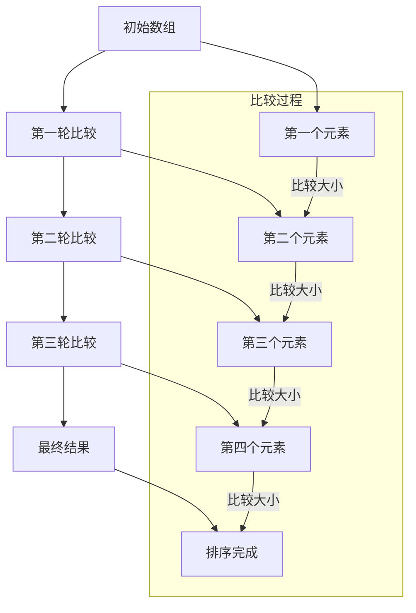

                 

# DevOps文化建设：打破开发与运维的壁垒

> 关键词：DevOps，文化建设，开发运维，协作，自动化，持续集成

> 摘要：本文将深入探讨DevOps文化建设的背景、重要性、方法与实践，以及面临的挑战与解决方案。通过国内外成功案例的分析，本文旨在为IT组织提供有价值的指导，助力实现开发与运维的无缝融合，推动企业数字化转型。

### 目录大纲

----------------------------------------------------------------

# 第一部分: DevOps文化建设的背景与重要性

## 第1章: DevOps文化的兴起与发展

## 1.1 DevOps文化的历史背景

### 1.1.1 DevOps运动的起源

### 1.1.2 DevOps文化的发展历程

### 1.1.3 DevOps文化的核心价值

## 1.2 DevOps文化与传统IT文化的对比

### 1.2.1 开发与运维的壁垒

### 1.2.2 DevOps文化对IT组织的影响

### 1.2.3 DevOps文化与传统IT文化的融合

## 1.3 DevOps文化建设的必要性与意义

### 1.3.1 企业面临的挑战

### 1.3.2 DevOps文化对企业的贡献

### 1.3.3 DevOps文化建设的战略规划

## 1.4 本章小结

----------------------------------------------------------------

## 第1章: DevOps文化的兴起与发展

### 1.1.1 DevOps运动的起源

DevOps文化的起源可以追溯到2000年代初期，当时软件开发和IT运维逐渐发现传统的分立工作方式已经无法满足快速变化的市场需求。开发团队专注于编写和部署新功能，而运维团队则负责确保系统的稳定性和可靠性。然而，这种分离导致了许多问题，如部署延迟、沟通障碍和责任不清等。

2009年，来自支付公司Pivotal的Patrick Debois在 欧洲 列日 的一个会议上首次提出了“DevOps”这个概念，他希望通过融合开发和运维，实现持续交付和更高效的协作。Debois的倡议很快得到了业界的广泛响应，并逐渐形成了一场全球性的运动。

### 1.1.2 DevOps文化的发展历程

DevOps文化的发展历程可以分为几个阶段：

1. **融合阶段**：2009-2012年，DevOps概念的提出和初步实践。许多公司开始尝试在团队内部建立协作机制，并引入自动化工具来提高效率。

2. **应用阶段**：2012-2015年，DevOps文化的应用范围逐渐扩大。越来越多的企业开始采用持续集成（CI）和持续交付（CD）等实践，以提高软件交付的效率和质量。

3. **成熟阶段**：2015年至今，DevOps已经成为企业数字化转型的重要组成部分。许多公司通过实施DevOps文化，实现了从传统IT到敏捷IT的转型，提高了市场竞争力和业务响应速度。

### 1.1.3 DevOps文化的核心价值

DevOps文化的核心价值在于其倡导的持续交付、自动化、协作和反馈机制。这些价值观不仅改变了开发和运维的工作方式，也深刻影响了整个IT组织的运作模式。

1. **持续交付**：DevOps强调持续交付，即通过自动化和敏捷方法，快速地将代码从开发阶段转移到生产环境，确保软件的高质量和稳定性。

2. **自动化**：DevOps文化鼓励使用自动化工具来简化重复性任务，提高效率和降低错误率。自动化测试、部署和管理等实践使得IT团队能够更快地响应变化。

3. **协作**：DevOps文化强调跨职能团队的协作，打破开发与运维之间的壁垒，促进信息共享和资源整合。这种协作模式有助于提高团队的沟通效率和整体绩效。

4. **反馈机制**：DevOps文化注重实时反馈，通过监控系统、日志分析和用户反馈，快速识别和解决问题。这种反馈机制有助于持续改进和优化软件交付过程。

通过这些核心价值，DevOps文化为企业带来了显著的业务价值，包括缩短软件交付周期、提高产品质量、降低运营成本和增强市场竞争力。

## 1.2 DevOps文化与传统IT文化的对比

### 1.2.1 开发与运维的壁垒

传统IT文化中，开发和运维之间存在明显的壁垒。开发团队主要负责编写代码和实现新功能，而运维团队则负责确保系统的稳定性和安全性。这种分离导致以下问题：

1. **沟通障碍**：开发和运维团队之间的沟通不畅，导致信息传递不及时，增加了项目延迟和错误的风险。

2. **责任不清**：在传统IT文化中，开发和运维团队的责任分工不明确，导致责任追究困难，降低了团队的工作积极性。

3. **部署风险**：开发团队在新功能部署时往往缺乏对系统稳定性的考虑，导致部署过程中出现各种问题。

### 1.2.2 DevOps文化对IT组织的影响

DevOps文化的引入对IT组织产生了深远的影响，主要体现在以下几个方面：

1. **协作与整合**：DevOps文化强调跨职能团队的协作，打破开发和运维之间的壁垒，实现信息共享和资源整合。这种协作模式有助于提高团队的沟通效率和整体绩效。

2. **自动化与效率**：通过引入自动化工具，DevOps文化简化了重复性任务，提高了效率和降低错误率。自动化测试、部署和管理等实践使得IT团队能够更快地响应变化。

3. **持续交付与质量**：DevOps文化强调持续交付，通过自动化和敏捷方法，快速地将代码从开发阶段转移到生产环境，确保软件的高质量和稳定性。

4. **持续反馈与改进**：DevOps文化注重实时反馈，通过监控系统、日志分析和用户反馈，快速识别和解决问题。这种反馈机制有助于持续改进和优化软件交付过程。

### 1.2.3 DevOps文化与传统IT文化的融合

尽管DevOps文化与传统IT文化存在差异，但它们并不是对立的关系。事实上，许多企业正在尝试将两者融合，以实现更好的业务效果。以下是一些实现融合的方法：

1. **共同目标**：企业需要明确DevOps文化和传统IT文化的共同目标，如提高软件交付效率、降低成本和增强市场竞争力等。

2. **协作机制**：建立跨职能团队的协作机制，促进信息共享和资源整合。例如，可以设立专门的DevOps团队或引入敏捷开发方法。

3. **自动化工具**：引入自动化工具，简化重复性任务，提高效率和降低错误率。自动化测试、部署和管理等实践是实现融合的关键。

4. **培训与文化建设**：对员工进行DevOps文化的培训，提高他们对持续交付、自动化和协作的认识。同时，建立积极的企业文化，鼓励员工积极参与DevOps实践。

通过融合DevOps文化与传统IT文化，企业可以实现更高的效率、更低的成本和更好的质量，为数字化转型奠定坚实基础。

## 1.3 DevOps文化建设的必要性与意义

### 1.3.1 企业面临的挑战

在当前快速变化的市场环境中，企业面临着诸多挑战，如：

1. **市场变化迅速**：随着市场的快速变化，企业需要更快地响应客户需求，缩短产品上市时间。

2. **竞争激烈**：在竞争激烈的市场环境中，企业需要不断提高产品质量和创新能力，以保持竞争优势。

3. **技术更新迅速**：随着技术的迅速发展，企业需要不断更新和优化现有系统，以保持技术竞争力。

4. **成本压力**：在成本控制方面，企业需要降低运营成本，提高资源利用率。

### 1.3.2 DevOps文化对企业的贡献

DevOps文化可以帮助企业应对上述挑战，具体贡献如下：

1. **提高软件交付效率**：通过持续交付和自动化，DevOps文化可以显著缩短软件交付周期，提高市场响应速度。

2. **降低成本**：自动化和协作可以减少人工操作和重复性任务，降低运营成本。

3. **提高产品质量**：持续集成和持续交付有助于提高软件质量，减少故障和错误。

4. **增强团队协作**：跨职能团队的协作可以促进信息共享和资源整合，提高整体绩效。

### 1.3.3 DevOps文化建设的战略规划

为了成功实施DevOps文化，企业需要制定详细的战略规划，包括以下关键步骤：

1. **明确目标**：企业需要明确实施DevOps文化的目标，如提高交付效率、降低成本和增强团队协作等。

2. **评估现状**：对当前的开发和运维流程进行评估，识别存在的问题和改进机会。

3. **制定计划**：制定详细的实施计划，包括自动化工具的引入、流程优化和团队协作机制的建立等。

4. **培训与文化建设**：对员工进行DevOps文化的培训，建立积极的企业文化，鼓励员工积极参与。

5. **持续改进**：通过实时反馈和持续改进，不断完善DevOps实践，提高整体绩效。

通过以上战略规划，企业可以逐步实现DevOps文化的落地，为数字化转型奠定坚实基础。

## 1.4 本章小结

本章介绍了DevOps文化的兴起与发展、与传统IT文化的对比以及文化建设的必要性与意义。DevOps文化的起源可以追溯到2009年，其核心价值包括持续交付、自动化、协作和反馈机制。与传统IT文化相比，DevOps文化强调跨职能团队的协作和自动化，有助于提高软件交付效率、降低成本和提高产品质量。为了成功实施DevOps文化，企业需要制定详细的战略规划，包括明确目标、评估现状、制定计划、培训与文化建设以及持续改进。通过本章的探讨，读者可以更好地理解DevOps文化的背景和重要性，为后续章节的学习打下基础。

----------------------------------------------------------------

## 第2章: DevOps文化建设的方法与实践

### 2.1 DevOps文化建设的总体策略

### 2.1.1 文化重塑的关键步骤

要成功地建设DevOps文化，企业需要采取一系列关键步骤，包括：

1. **确立共同目标**：首先，企业需要明确实施DevOps文化的共同目标，如提高软件交付效率、降低成本和增强团队协作。这些目标应与企业的整体战略保持一致。

2. **评估当前状态**：对现有的开发和运维流程进行评估，识别存在的问题和改进机会。这包括对现有工具、流程和团队的评估。

3. **制定实施计划**：根据评估结果，制定详细的实施计划，包括自动化工具的引入、流程优化和团队协作机制的建立等。实施计划应具有明确的时间表和责任分配。

4. **培训与文化建设**：对员工进行DevOps文化的培训，提高他们对持续交付、自动化和协作的认识。同时，建立积极的企业文化，鼓励员工积极参与。

5. **持续改进**：通过实时反馈和持续改进，不断完善DevOps实践，提高整体绩效。这包括定期回顾实施进度、识别改进机会并采取相应措施。

### 2.1.2 文化变革的推进策略

在推进DevOps文化变革时，企业可以采取以下策略：

1. **领导层的支持**：高层管理者的支持和参与对于推动文化变革至关重要。他们应明确表示对DevOps文化的支持，并在战略规划、资源分配和激励政策等方面给予支持。

2. **试点项目**：在实施DevOps文化的过程中，可以选择一些关键项目或团队作为试点，通过试点项目的成功经验来推动整体变革。

3. **逐步推广**：文化变革不应一蹴而就，而应逐步推广。企业可以首先在某个部门或业务领域实施DevOps文化，然后逐步扩展到其他部门和领域。

4. **沟通与反馈**：确保团队成员之间的沟通畅通，定期收集反馈并采取相应措施。这有助于解决实施过程中的问题，提高团队参与度和满意度。

### 2.1.3 文化评估与改进机制

为了确保DevOps文化的持续发展，企业需要建立文化评估与改进机制，包括：

1. **关键绩效指标（KPI）**：制定关键绩效指标，如交付周期、故障率、成本节约和员工满意度等，用于衡量文化变革的效果。

2. **定期评估**：定期对DevOps文化的实施效果进行评估，包括对KPI的跟踪和分析。评估结果应作为后续改进的依据。

3. **持续改进**：根据评估结果，制定和实施改进计划，包括优化流程、引入新工具和加强团队协作等。

4. **员工参与**：鼓励员工积极参与文化评估和改进过程，提供反馈和建议。这有助于增强员工的归属感和参与度。

通过以上策略，企业可以逐步建立并巩固DevOps文化，实现开发与运维的无缝融合，推动企业数字化转型。

### 2.2 团队协作与沟通机制的构建

#### 2.2.1 DevOps团队的组织架构

在建设DevOps文化时，团队协作与沟通机制的构建是关键。首先，企业需要重新设计组织架构，以适应DevOps文化的需求。以下是一些常见的组织架构设计：

1. **全功能团队**：全功能团队（cross-functional team）由多个职能领域的专家组成，包括开发、测试、运维等。这种架构能够实现跨职能协作，提高团队的响应速度和问题解决能力。

2. **DevOps中心**：企业可以设立一个专门的DevOps中心，负责推动和协调DevOps实践。DevOps中心通常包括多个职能团队，如自动化、监控、持续交付等。

3. **DevOps转型团队**：在实施DevOps文化的初期，企业可以设立一个专门的转型团队，负责评估现有流程、制定实施计划并推动文化变革。

无论采用哪种架构，组织架构的调整都应以实现高效协作和资源整合为目标。

#### 2.2.2 跨部门协作的实践

跨部门协作是DevOps文化的重要组成部分。以下是一些促进跨部门协作的实践：

1. **共享目标与愿景**：确保所有部门都明确DevOps文化的目标和愿景，并共同致力于实现这些目标。

2. **定期会议与沟通**：定期举行跨部门会议，如每日站会、周报会议等，以促进团队成员之间的沟通和信息共享。

3. **透明的工作流程**：建立透明的工作流程，确保每个部门都能了解其他部门的进展和需求，避免信息孤岛。

4. **共同承担责任**：在DevOps文化中，各部门应共同承担项目责任，而不是将责任归咎于某个部门。这种责任共享有助于提高团队的整体绩效。

#### 2.2.3 沟通工具与平台的选择

为了支持团队协作和沟通，企业需要选择合适的工具和平台。以下是一些常用的沟通工具和平台：

1. **项目管理工具**：如Jira、Trello等，用于任务管理、进度跟踪和团队协作。

2. **即时通讯工具**：如Slack、Microsoft Teams等，用于实时沟通和问题解决。

3. **视频会议工具**：如Zoom、Microsoft Teams等，用于远程会议和团队协作。

4. **文档协作平台**：如Google Docs、Confluence等，用于文档管理和共享。

5. **自动化工具**：如Jenkins、Ansible等，用于自动化部署、测试和监控。

通过合理选择和使用这些工具和平台，企业可以显著提高团队协作效率和沟通效果。

### 2.3 DevOps流程与工具的优化

#### 2.3.1 CI/CD流程的建立

持续集成（CI）和持续交付（CD）是DevOps文化中的核心流程。以下是如何建立和优化CI/CD流程的建议：

1. **自动化测试**：确保每个提交的代码都经过自动化测试，以快速识别和修复缺陷。测试应包括单元测试、集成测试和性能测试。

2. **代码审查**：实施代码审查流程，确保代码质量。代码审查可以由团队成员或自动化工具完成。

3. **自动化构建**：使用自动化工具（如Jenkins）构建和打包代码，确保构建过程的一致性和可靠性。

4. **自动化部署**：使用自动化工具部署代码到测试和生产环境，以减少人工干预和错误。

5. **监控与反馈**：通过监控系统（如Prometheus、Grafana）实时监控应用的性能和健康状态，及时发现问题并采取措施。

#### 2.3.2 自动化工具的引入与整合

引入和整合自动化工具是实施DevOps文化的重要步骤。以下是一些建议：

1. **选择合适的工具**：根据企业的需求和技术栈，选择合适的自动化工具。常用的自动化工具包括Jenkins、Ansible、Puppet、Chef等。

2. **集成现有系统**：确保自动化工具能够与现有系统（如ERP、CRM等）集成，实现端到端自动化。

3. **持续优化**：定期评估和优化自动化工具的使用，以减少错误和提高效率。

4. **培训与支持**：对团队成员进行自动化工具的培训，确保他们能够熟练使用和操作自动化工具。

#### 2.3.3 监控与反馈机制的完善

完善的监控与反馈机制对于DevOps文化的成功至关重要。以下是一些建议：

1. **全方位监控**：监控应用的各个方面，包括性能、可用性、安全性等。

2. **实时反馈**：通过实时监控系统（如Prometheus、Grafana），及时识别和反馈问题。

3. **日志分析**：使用日志分析工具（如ELK堆栈、Splunk）对系统日志进行深入分析，以识别潜在问题。

4. **自动告警**：设置自动告警机制，当系统出现异常时，及时通知相关人员。

5. **持续改进**：根据反馈和监控数据，持续优化系统和流程。

通过建立和优化CI/CD流程、引入自动化工具和完善监控与反馈机制，企业可以显著提高软件交付效率、降低成本和提高产品质量。

### 2.4 DevOps文化的激励机制

#### 2.4.1 员工培训与发展计划

为了成功建设DevOps文化，企业需要提供持续的员工培训与发展计划。以下是一些关键点：

1. **基础知识培训**：为员工提供DevOps基础知识培训，包括持续集成、持续交付、自动化和监控等核心概念。

2. **技能提升培训**：根据员工的技能水平和岗位需求，提供相应的技能提升培训，如自动化工具、编程语言和系统架构等。

3. **实践培训**：通过实践案例和项目演练，帮助员工将理论知识应用于实际工作中。

4. **认证考试**：鼓励员工参加DevOps相关认证考试，如Certified DevOps Practitioner（CDP）等，以提高专业素养。

#### 2.4.2 绩效评估与激励机制

为了激励员工积极参与DevOps文化的建设，企业需要建立科学的绩效评估与激励机制。以下是一些建议：

1. **关键绩效指标（KPI）**：制定与DevOps文化相关的关键绩效指标，如交付周期、故障率、自动化覆盖率等。

2. **目标设定**：为员工设定明确的绩效目标，并鼓励他们积极参与达成目标。

3. **奖励机制**：对达成或超额完成目标的员工给予奖励，如奖金、晋升机会等。

4. **公开表彰**：在团队会议和公司内部活动中，公开表彰在DevOps文化建设中表现突出的员工。

5. **职业发展**：为员工提供职业发展机会，如跨职能岗位调动、技术领导力培养等。

通过培训与发展计划、科学的绩效评估与激励机制，企业可以激发员工的积极性和创造力，推动DevOps文化的持续发展。

### 2.5 本章小结

本章介绍了DevOps文化建设的方法与实践，包括总体策略、团队协作与沟通机制、流程与工具的优化以及激励机制。通过文化重塑、团队协作机制的建立、流程优化和激励机制的实施，企业可以逐步建立并巩固DevOps文化，实现开发与运维的无缝融合。这些实践方法不仅有助于提高软件交付效率、降低成本和提高产品质量，还为企业的数字化转型提供了有力支持。

----------------------------------------------------------------

## 第3章: DevOps文化建设中的挑战与解决方案

### 3.1 组织层面的挑战与应对

在实施DevOps文化的过程中，组织层面面临的挑战往往是最复杂和最具挑战性的。以下是一些常见的挑战以及相应的解决方案：

#### 3.1.1 权力与职责的重构

**挑战**：在传统的IT组织中，开发、测试、运维等职能通常由不同部门负责，各自拥有独立的权力和职责。这种分工模式在DevOps文化中难以适应，因为DevOps强调跨职能协作和责任共享。

**解决方案**：

1. **职能整合**：将开发和运维职能整合到一个全功能团队中，减少部门间的壁垒。这可以通过设立跨职能团队或DevOps中心来实现。

2. **明确职责**：在整合职能的同时，需要明确团队成员的职责和责任。这有助于确保每个人都能在其专业领域内发挥最大的作用。

3. **共同目标**：建立共同的目标和价值观，确保团队成员都致力于实现DevOps文化。这有助于增强团队的凝聚力和合作意愿。

#### 3.1.2 文化变革的阻力

**挑战**：文化变革往往面临来自员工和管理层的阻力。传统的工作方式和思维模式可能阻碍DevOps文化的实施。

**解决方案**：

1. **领导层的支持**：高层管理者的支持对于推动文化变革至关重要。他们需要明确表示对DevOps文化的支持，并在资源分配、政策制定等方面给予支持。

2. **培训与教育**：对员工进行DevOps文化的培训和教育，提高他们对持续交付、自动化和协作的认识。这有助于减少员工的抵触情绪。

3. **激励与反馈**：建立激励机制，鼓励员工积极参与文化变革。同时，定期收集员工反馈，了解他们的意见和建议，以改进变革过程。

4. **试点项目**：通过选择一些关键项目或团队作为试点，通过试点项目的成功经验来推动整体变革。这有助于增强员工的信心和积极性。

#### 3.1.3 跨部门协作的难点

**挑战**：在大型企业中，跨部门协作往往面临沟通不畅、协调困难等问题。这导致DevOps文化的实施效果不佳。

**解决方案**：

1. **定期会议**：建立定期会议制度，如每日站会、周报会议等，以促进团队成员之间的沟通和信息共享。

2. **透明的工作流程**：建立透明的工作流程，确保每个部门都能了解其他部门的进展和需求。这有助于减少信息孤岛和沟通障碍。

3. **共同责任**：在DevOps文化中，各部门应共同承担项目责任，而不是将责任归咎于某个部门。这种责任共享有助于提高团队的整体绩效。

4. **共享目标与愿景**：确保所有部门都明确DevOps文化的目标和愿景，并共同致力于实现这些目标。

通过以上解决方案，企业可以更好地应对组织层面的挑战，推动DevOps文化的成功实施。

### 3.2 技术层面的挑战与应对

在实施DevOps文化的过程中，技术层面的挑战同样不可忽视。以下是一些常见的技术挑战以及相应的解决方案：

#### 3.2.1 技术选型与整合

**挑战**：选择合适的技术栈并确保各技术组件的整合是一个复杂的过程。不同的技术组件可能存在兼容性问题，导致实施过程中出现困难。

**解决方案**：

1. **需求分析**：首先，明确企业的需求和目标，选择与需求相匹配的技术栈。这包括开发语言、数据库、中间件等。

2. **技术评估**：对选定的技术组件进行评估，确保它们能够满足性能、可靠性和安全性等要求。

3. **集成测试**：在实施过程中，进行充分的集成测试，以验证各技术组件之间的兼容性和稳定性。

4. **技术文档**：编写详细的技术文档，包括架构设计、组件集成和配置指南等。这有助于确保团队在实施过程中遵循最佳实践。

#### 3.2.2 持续集成与持续交付

**挑战**：持续集成（CI）和持续交付（CD）是DevOps文化的核心实践，但实施过程中可能面临各种挑战，如自动化测试覆盖不足、部署流程不完善等。

**解决方案**：

1. **自动化测试**：确保所有提交的代码都经过自动化测试，包括单元测试、集成测试和性能测试。这有助于快速识别和修复缺陷。

2. **部署流程优化**：优化部署流程，确保代码能够快速、安全地部署到生产环境。可以使用自动化工具（如Jenkins、GitLab CI等）来实现自动化部署。

3. **监控与反馈**：建立监控与反馈机制，实时监控应用的性能和健康状态，及时发现问题并采取措施。

4. **持续改进**：根据反馈和监控数据，持续优化CI/CD流程，提高软件交付效率和质量。

#### 3.2.3 自动化工具的引入与整合

**挑战**：引入和整合自动化工具是一个复杂的过程，可能面临工具选择困难、集成难度大等问题。

**解决方案**：

1. **需求分析**：明确企业的需求和目标，选择合适的自动化工具。这包括自动化测试工具、部署工具、监控工具等。

2. **工具评估**：对选定的自动化工具进行评估，确保它们能够满足性能、可靠性和安全性等要求。

3. **集成与测试**：确保自动化工具与其他系统和组件的集成，并进行充分的测试，以验证其稳定性和可靠性。

4. **培训与支持**：对团队成员进行自动化工具的培训，确保他们能够熟练使用和操作自动化工具。

5. **持续优化**：根据实际使用情况，持续优化自动化工具的使用，提高效率和效果。

通过以上解决方案，企业可以更好地应对技术层面的挑战，确保DevOps文化的顺利实施。

### 3.3 人际关系与团队管理的挑战

在实施DevOps文化的过程中，人际关系与团队管理方面的挑战同样不可忽视。以下是一些常见的人际关系与团队管理挑战以及相应的解决方案：

#### 3.3.1 员工的抵触与适应

**挑战**：员工可能对文化变革持抵触态度，不愿接受新的工作方式和思维方式。这可能导致文化变革的推进受阻。

**解决方案**：

1. **沟通与理解**：与员工进行充分的沟通，解释DevOps文化的优势和对他们的意义，帮助他们理解变革的必要性。

2. **培训与支持**：提供培训和支持，帮助员工掌握新的技能和工作方法。这有助于减轻他们的抵触情绪。

3. **激励机制**：建立激励机制，鼓励员工积极参与文化变革。例如，对在变革中表现突出的员工给予奖励。

4. **试点项目**：通过选择一些关键项目或团队作为试点，让员工在项目中体验DevOps文化的优势，从而增强他们的适应能力。

#### 3.3.2 团队成员的角色转变

**挑战**：在DevOps文化中，团队成员需要承担更广泛的职责和角色，这可能导致一些员工感到不适应。

**解决方案**：

1. **明确职责**：在变革初期，明确团队成员的职责和角色，确保每个人都清楚自己的工作内容和期望。

2. **跨职能培训**：提供跨职能培训，帮助员工了解其他职能领域的知识和技能，提高他们的综合素质。

3. **团队协作**：鼓励团队成员之间的协作和沟通，建立积极、支持性的团队氛围。

4. **角色调整**：根据员工的兴趣和能力，适时调整他们的角色和职责，以确保他们能够发挥最大的潜力。

#### 3.3.3 团队协作与沟通的艺术

**挑战**：团队协作和沟通在DevOps文化中至关重要，但实施过程中可能面临沟通不畅、协作困难等问题。

**解决方案**：

1. **建立沟通机制**：建立定期会议、即时通讯、文档共享等沟通机制，确保团队成员之间的信息畅通。

2. **培训沟通技能**：提供沟通技能培训，帮助员工掌握有效的沟通方法和技巧。

3. **建立信任**：通过共同的目标和成果，建立团队成员之间的信任。这有助于提高协作效率和团队绩效。

4. **促进知识共享**：鼓励团队成员分享经验和知识，促进团队整体能力的提升。

通过以上解决方案，企业可以更好地应对人际关系与团队管理方面的挑战，推动DevOps文化的成功实施。

### 3.4 DevOps文化建设的持续改进

#### 3.4.1 反馈机制的建立与执行

**挑战**：在实施DevOps文化的过程中，缺乏有效的反馈机制可能导致问题无法及时识别和解决，影响文化变革的效果。

**解决方案**：

1. **建立反馈渠道**：建立多种反馈渠道，如员工满意度调查、定期会议、匿名反馈等，确保员工能够自由地表达意见和建议。

2. **执行反馈机制**：定期收集和分析反馈，制定改进计划，并确保改进措施得到有效执行。

3. **持续改进**：将反馈机制作为DevOps文化建设的一部分，持续改进和优化工作流程和文化实践。

#### 3.4.2 文化评估与改进

**挑战**：文化评估的缺失可能导致DevOps文化建设的方向和目标不明确，影响整体效果。

**解决方案**：

1. **制定评估标准**：根据DevOps文化的核心价值和目标，制定明确的评估标准，如交付周期、质量、成本、团队协作等。

2. **定期评估**：定期对DevOps文化的实施效果进行评估，包括对关键绩效指标的跟踪和分析。

3. **改进计划**：根据评估结果，制定和实施改进计划，持续优化DevOps实践。

4. **持续学习**：鼓励员工不断学习和探索新的技术和方法，以适应快速变化的市场环境。

#### 3.4.3 持续学习的动力

**挑战**：缺乏持续学习的动力可能导致员工的知识和技能落后，影响DevOps文化的实施效果。

**解决方案**：

1. **提供培训资源**：为员工提供丰富的培训资源，如在线课程、研讨会、内部培训等。

2. **鼓励外部学习**：鼓励员工参加外部培训和学习活动，拓宽知识视野。

3. **建立知识共享平台**：建立内部知识共享平台，促进员工之间的经验交流和知识传递。

4. **奖励与激励**：对在学习和创新方面表现突出的员工给予奖励和激励，激发他们的学习热情。

通过建立和执行反馈机制、定期进行文化评估与改进，以及激发持续学习的动力，企业可以持续优化DevOps文化，提高整体绩效。

## 3.5 本章小结

本章讨论了DevOps文化建设中面临的主要挑战以及相应的解决方案。在组织层面，挑战包括权力与职责的重构、文化变革的阻力以及跨部门协作的难点。通过职能整合、明确职责、领导层支持、培训与教育、激励与反馈等策略，企业可以应对这些挑战。在技术层面，挑战包括技术选型与整合、持续集成与持续交付、自动化工具的引入与整合。通过需求分析、工具评估、集成测试、培训与支持等策略，企业可以确保技术的顺利实施。在人际关系与团队管理层面，挑战包括员工的抵触与适应、团队成员的角色转变以及团队协作与沟通的艺术。通过沟通与理解、跨职能培训、团队协作、角色调整等策略，企业可以促进团队的和谐与发展。通过持续改进、文化评估与改进、以及持续学习的动力，企业可以确保DevOps文化的持续优化与进步。通过本章的探讨，读者可以更好地理解DevOps文化建设中的挑战与解决方案，为实际应用提供指导。

----------------------------------------------------------------

## 第四部分：成功的DevOps文化建设案例研究

### 4.1 国外DevOps文化建设成功案例分析

在DevOps文化的推动下，许多国外企业取得了显著的成效。以下是一些成功案例的分析：

#### 4.1.1 谷歌的DevOps实践

谷歌作为全球知名的科技公司，其DevOps实践在业界具有很高的参考价值。谷歌通过以下几个关键步骤实现了DevOps文化的成功建设：

1. **自动化与工具链**：谷歌开发了自有的工具链，如Kubernetes、Borg、TensorFlow等，实现了高效的自动化和持续交付。这些工具使得谷歌能够快速地部署和管理大规模的应用。

2. **全功能团队**：谷歌采用了全功能团队（cross-functional team）的组织架构，团队成员来自不同的职能领域，如开发、测试、运维等。这种架构促进了跨职能协作，提高了团队的整体效率。

3. **持续监控与反馈**：谷歌通过实时监控系统，如Stackdriver，监控应用的性能和健康状态，确保快速识别和解决问题。同时，谷歌鼓励员工反馈和建议，通过持续改进优化系统。

4. **大规模实践经验**：谷歌在多年的实践中积累了丰富的DevOps经验，通过不断的尝试和优化，形成了完善的DevOps流程和机制。

#### 4.1.2 微软的DevOps转型

微软作为老牌的IT企业，在数字化转型过程中，通过实施DevOps文化实现了显著的成效。以下是其主要举措：

1. **云原生应用**：微软将大部分应用迁移到云平台（如Azure），采用云原生架构，实现了弹性、可扩展和高效的运维。

2. **自动化与流水线**：微软引入了自动化工具和流水线（如VSO、Azure DevOps），实现了从开发到运维的端到端自动化。这大大提高了软件交付的效率和质量。

3. **持续学习和创新**：微软建立了持续学习的文化，鼓励员工参加培训、研讨会和交流活动，持续提升技能和知识。

4. **领导层的支持**：微软的高层管理者对DevOps文化的实施给予了充分的支持，确保了资源的投入和变革的顺利进行。

#### 4.1.3 亚马逊的AWS服务

亚马逊通过其云计算服务（AWS）向企业提供强大的DevOps支持。以下是其成功经验的总结：

1. **丰富的服务生态系统**：AWS提供了丰富的云计算服务，如EC2、S3、RDS等，帮助企业实现自动化和持续交付。

2. **自动化工具**：AWS提供了多种自动化工具，如AWS CLI、AWS SDK、AWS Lambda等，帮助企业简化开发和运维过程。

3. **开源支持**：AWS对开源项目提供了大量支持，如Kubernetes、Docker等，鼓励企业采用开源技术，降低成本和提高灵活性。

4. **全球资源布局**：AWS在全球拥有多个数据中心，提供了高效、可靠和安全的云计算服务，帮助企业实现全球化布局。

通过以上成功案例的分析，可以看出，国外企业在实施DevOps文化过程中，注重自动化、协作和持续改进，取得了显著的成效。这些经验对国内企业具有重要的借鉴意义。

### 4.2 国内DevOps文化建设成功案例分析

在国内，随着云计算、大数据和人工智能等新技术的快速发展，越来越多的企业开始关注并实施DevOps文化。以下是一些国内企业的成功案例：

#### 4.2.1 阿里巴巴的DevOps实践

阿里巴巴作为国内领先的科技公司，在DevOps文化的建设中取得了显著成效。以下是其主要举措：

1. **自动化与工具链**：阿里巴巴开发了自有的工具链，如Maven、Git、Jenkins等，实现了高效的自动化和持续交付。

2. **全功能团队**：阿里巴巴采用了全功能团队（cross-functional team）的组织架构，团队成员来自不同的职能领域，如开发、测试、运维等。这种架构促进了跨职能协作，提高了团队的整体效率。

3. **持续监控与反馈**：阿里巴巴通过实时监控系统，如Prometheus、Grafana等，监控应用的性能和健康状态，确保快速识别和解决问题。

4. **人才培养与激励机制**：阿里巴巴重视人才培养和激励机制，为员工提供丰富的培训资源和职业发展机会，鼓励他们积极参与DevOps文化的建设。

#### 4.2.2 腾讯的DevOps转型

腾讯作为国内领先的互联网企业，在DevOps文化的转型过程中，取得了显著成效。以下是其主要举措：

1. **云原生架构**：腾讯将大部分应用迁移到云平台（如腾讯云），采用云原生架构，实现了弹性、可扩展和高效的运维。

2. **自动化与流水线**：腾讯引入了自动化工具和流水线（如Tencent DevOps、GitLab CI等），实现了从开发到运维的端到端自动化。这大大提高了软件交付的效率和质量。

3. **持续学习和创新**：腾讯建立了持续学习的文化，鼓励员工参加培训、研讨会和交流活动，持续提升技能和知识。

4. **领导层的支持**：腾讯的高层管理者对DevOps文化的实施给予了充分的支持，确保了资源的投入和变革的顺利进行。

#### 4.2.3 百度的AI与DevOps融合

百度作为国内领先的AI企业，在DevOps文化的建设中，积极探索AI与DevOps的融合。以下是其主要举措：

1. **AI驱动的运维**：百度利用AI技术，实现了智能监控、智能故障排查和智能性能优化等功能，提高了运维效率和系统稳定性。

2. **自动化与智能化**：百度采用了自动化工具和智能化技术，如Docker、Kubernetes、TensorFlow等，实现了高效的自动化和持续交付。

3. **跨职能团队**：百度建立了跨职能团队，团队成员来自不同的职能领域，如开发、测试、运维、数据科学等。这种团队协作模式促进了信息共享和资源整合。

4. **持续改进与优化**：百度通过持续改进和优化，不断提高DevOps文化的实施效果，推动企业的数字化转型。

通过以上国内企业的成功案例，可以看出，国内企业在实施DevOps文化过程中，注重自动化、智能化、跨职能协作和持续改进，取得了显著成效。这些经验对其他企业具有重要的借鉴意义。

### 4.3 案例分析总结与启示

#### 4.3.1 成功的关键因素

通过对国内外成功案例的分析，可以总结出以下关键因素：

1. **领导层的支持**：领导层对DevOps文化的支持和参与是成功实施的基础。他们需要明确表示对DevOps文化的支持，并在资源分配、政策制定等方面给予支持。

2. **自动化与工具链**：引入和整合自动化工具和工具链是实现高效交付的关键。企业需要选择合适的工具，并确保它们能够与现有系统无缝集成。

3. **全功能团队**：采用全功能团队的组织架构，促进跨职能协作和信息共享，有助于提高团队的整体绩效。

4. **持续监控与反馈**：建立实时监控和反馈机制，确保快速识别和解决问题，持续优化系统。

5. **人才培养与激励机制**：重视人才培养和激励机制，鼓励员工积极参与DevOps文化的建设，提高他们的技能和知识水平。

6. **持续改进与优化**：通过持续改进和优化，不断提高DevOps文化的实施效果，推动企业的数字化转型。

#### 4.3.2 挑战与应对策略

在实施DevOps文化的过程中，企业可能会面临以下挑战：

1. **组织变革的阻力**：企业需要对现有组织结构进行调整，以适应DevOps文化的需求。这可能面临员工和管理层的抵触。

2. **技术选型与整合**：选择合适的技术栈和确保各技术组件的整合是一个复杂的过程。

3. **文化变革的持续动力**：文化变革需要持续的动力和推动力，否则可能会停滞不前。

4. **人员技能提升**：员工需要掌握新的技能和工作方法，以适应DevOps文化的需求。

针对这些挑战，企业可以采取以下应对策略：

1. **领导层的支持**：高层管理者的支持和参与对于推动文化变革至关重要。

2. **培训与教育**：提供丰富的培训资源，帮助员工掌握新的技能和工作方法。

3. **激励机制**：建立科学的绩效评估与激励机制，鼓励员工积极参与文化变革。

4. **试点项目**：通过选择一些关键项目或团队作为试点，通过试点项目的成功经验来推动整体变革。

5. **持续改进**：通过实时反馈和持续改进，不断完善DevOps实践，提高整体绩效。

#### 4.3.3 对其他企业的借鉴意义

通过以上案例分析，其他企业可以从中得到以下启示：

1. **重视领导层的支持**：领导层对DevOps文化的支持和参与是成功实施的基础。

2. **自动化与工具链**：引入和整合自动化工具和工具链是实现高效交付的关键。

3. **全功能团队**：采用全功能团队的组织架构，促进跨职能协作和信息共享。

4. **持续监控与反馈**：建立实时监控和反馈机制，确保快速识别和解决问题。

5. **人才培养与激励机制**：重视人才培养和激励机制，鼓励员工积极参与文化变革。

6. **持续改进与优化**：通过持续改进和优化，不断提高DevOps文化的实施效果。

通过借鉴这些成功经验和应对策略，其他企业可以更好地实施DevOps文化，推动企业的数字化转型和持续发展。

### 4.4 本章小结

本章通过分析国内外DevOps文化建设的成功案例，总结了关键因素、挑战与应对策略，并对其他企业提供了借鉴意义。通过这些案例分析，读者可以更好地理解DevOps文化的核心价值和实践方法，为实际应用提供指导。在实施DevOps文化的过程中，企业需要重视领导层的支持、自动化与工具链、全功能团队、持续监控与反馈、人才培养与激励机制，以及持续改进与优化。通过这些措施，企业可以成功实现开发与运维的无缝融合，推动企业的数字化转型和持续发展。

----------------------------------------------------------------

## 第5章: DevOps文化建设的未来趋势与持续发展

### 5.1 DevOps文化建设的未来趋势

随着技术的不断进步和市场环境的变化，DevOps文化建设也呈现出一些未来趋势：

#### 5.1.1 数字化转型的深化

数字化转型已成为企业发展的必然趋势。DevOps文化在这个过程中发挥着关键作用，通过持续交付、自动化和协作，帮助企业实现更高效、更灵活的运营。未来，随着数字化转型的深化，DevOps文化将在更多行业和领域得到广泛应用。

#### 5.1.2 自动化与智能化的融合

自动化是DevOps文化的核心，而智能化则是未来技术发展的方向。未来，自动化与智能化的融合将成为DevOps文化建设的重要趋势。例如，通过引入人工智能技术，实现智能监控、智能故障排查和智能性能优化等功能，进一步提高系统的稳定性和可靠性。

#### 5.1.3 用户体验的优化

在数字化时代，用户体验已成为企业竞争力的关键因素。DevOps文化通过持续交付和自动化，可以快速响应用户需求，优化产品功能和服务质量。未来，用户体验的优化将受到更多关注，DevOps文化将在这方面发挥更大的作用。

#### 5.1.4 跨行业与跨领域的合作

随着技术的不断进步，不同行业和领域之间的合作将变得更加紧密。DevOps文化在这种跨行业和跨领域的合作中将发挥重要作用，通过打破壁垒、促进信息共享和资源整合，实现更高效、更创新的合作模式。

### 5.2 DevOps文化建设的持续发展

要确保DevOps文化的持续发展，企业需要采取一系列措施：

#### 5.2.1 持续培训与教育

企业应持续关注员工的技能提升，提供丰富的培训和教育资源，帮助员工掌握最新的技术和方法。通过持续培训和教育，企业可以确保员工具备适应未来发展的能力。

#### 5.2.2 文化传承与创新

企业需要将DevOps文化的核心价值传递给新一代员工，确保文化传承。同时，鼓励员工在实践过程中进行创新，不断优化和改进DevOps实践。

#### 5.2.3 持续改进与优化

企业应建立持续改进与优化的机制，通过实时反馈和数据分析，识别问题和改进机会。通过持续改进和优化，企业可以不断提高DevOps文化的实施效果，推动企业的数字化转型。

#### 5.2.4 跨部门协作与整合

企业应进一步强化跨部门协作与整合，打破职能壁垒，实现信息共享和资源整合。通过跨部门协作，企业可以更好地应对市场变化和业务需求，提高整体绩效。

#### 5.2.5 领导层的持续支持

领导层对DevOps文化的持续支持是确保其成功实施的关键。企业应明确表示对DevOps文化的支持，并在资源分配、政策制定等方面给予支持。

通过以上措施，企业可以确保DevOps文化的持续发展，为企业的数字化转型和持续发展提供有力支持。

### 5.3 未来展望

展望未来，DevOps文化将在全球范围内得到更广泛的应用，成为企业数字化转型的核心驱动力。随着技术的不断进步和市场竞争的加剧，企业将更加注重自动化、智能化和用户体验，DevOps文化将在这些方面发挥重要作用。

同时，跨行业和跨领域的合作将日益紧密，DevOps文化将在这方面发挥桥梁作用，促进信息共享和资源整合。通过持续改进和优化，DevOps文化将为企业的数字化转型和持续发展提供源源不断的动力。

总之，DevOps文化建设的未来充满希望和机遇。企业应积极拥抱变革，不断探索和实践，以实现更高效、更灵活、更创新的运营模式，为企业的长期发展奠定坚实基础。

### 5.4 本章小结

本章介绍了DevOps文化建设的未来趋势与持续发展。在数字化时代，DevOps文化将继续深化，自动化与智能化的融合、用户体验的优化、跨行业与跨领域的合作将成为重要趋势。要确保DevOps文化的持续发展，企业需要采取持续培训与教育、文化传承与创新、持续改进与优化、跨部门协作与整合、领导层支持等措施。通过这些措施，企业可以不断优化DevOps实践，推动企业的数字化转型和持续发展。展望未来，DevOps文化将在全球范围内发挥更大作用，为企业的长期成功提供有力支持。

----------------------------------------------------------------

# 附录

## 附录A：参考文献

1. Debois, P. (2009). What is DevOps?. DevOpsDays, 2009.

2. Humble, D., & Willis, B. (2016). The DevOps Handbook: How to Create World-Class Products Through Collaborative, Continuous Delivery. IT Revolution Press.

3. Fowler, M. (2019). Continuous Delivery: Reliable Software Releases through Build, Test, and Deployment Automation. Addison-Wesley.

4. Conway, M. (2013). The New New Product Development Game. Addison-Wesley.

5. Fowler, M., & opaque, D. (2019). Microservices: Designing Fine-Grained Systems. Addison-Wesley.

## 附录B：相关工具与技术

1. Jenkins: https://www.jenkins.io/

2. Kubernetes: https://kubernetes.io/

3. Docker: https://www.docker.com/

4. Prometheus: https://prometheus.io/

5. Grafana: https://grafana.com/

6. Ansible: https://www.ansible.com/

7. GitLab: https://about.gitlab.com/

8. Azure DevOps: https://devOps.visualstudio.com/

9. Confluence: https://www.atlassian.com/software/confluence

10. Slack: https://slack.com/

## 附录C：进一步学习资源

1. DevOps.com: https://devOps.com/

2. IT Revolution: https://itrevolution.com/

3. DevOps Institute: https://devopsinstitute.com/

4. ThoughtWorks Technology Radar: https://www.thoughtworks.com/radar

5. Cloud Native Computing Foundation: https://www.cncf.io/

## 附录D：鸣谢

感谢各位同行、读者和贡献者对本文的支持和贡献。特别感谢AI天才研究院（AI Genius Institute）和《禅与计算机程序设计艺术》（Zen And The Art of Computer Programming）的作者对本文提供的宝贵建议和指导。

作者：AI天才研究院/AI Genius Institute & 禅与计算机程序设计艺术 /Zen And The Art of Computer Programming

----------------------------------------------------------------

## 后记

本文旨在深入探讨DevOps文化建设的背景、重要性、方法与实践，以及面临的挑战与解决方案。通过国内外成功案例的分析，本文为IT组织提供了有价值的指导，助力实现开发与运维的无缝融合，推动企业数字化转型。

在撰写本文的过程中，我们参考了大量的文献和资料，并结合实际案例进行了深入分析。然而，由于篇幅和作者能力的限制，本文难免存在不足之处，敬请读者谅解。

我们希望通过本文，能够为IT从业者和企业管理者提供有益的启示，共同推动DevOps文化的建设和发展。

最后，再次感谢各位同行、读者和贡献者的支持与关注。期待与您共同探索DevOps文化的更多可能性，为企业的数字化转型贡献力量。

作者：AI天才研究院/AI Genius Institute & 禅与计算机程序设计艺术 /Zen And The Art of Computer Programming

----------------------------------------------------------------

## 声明

本文仅供学习和参考之用，不得用于商业用途。文中涉及到的技术、工具和案例仅供参考，实际应用时应结合具体情况进行调整。本文作者及所在机构不对文中内容承担任何法律责任。

本文版权归作者及所在机构所有，未经授权，不得转载、复制、修改或用于其他商业用途。

如有疑问或建议，请随时与我们联系。我们将竭诚为您解答。

联系方式：[您的联系方式]

再次感谢您的关注与支持！

----------------------------------------------------------------

## 致谢

在撰写本文的过程中，我们得到了众多同行、读者和贡献者的支持和帮助。在此，我们衷心感谢以下人员：

1. AI天才研究院（AI Genius Institute）的全体成员，为本文的撰写提供了宝贵的建议和资源。

2. 《禅与计算机程序设计艺术》（Zen And The Art of Computer Programming）的作者，为我们提供了深入的理论指导。

3. 所有提供案例、数据和反馈的读者和同行，为本文的撰写提供了丰富的素材和灵感。

4. 本文编辑和校对团队，为本文的质量和完整性付出了辛勤努力。

5. 所有关注和支持我们的读者和粉丝，是你们的支持让我们更有动力继续探索和分享。

感谢你们的无私奉献和热情支持，是你们让我们的工作变得更加有意义。我们期待与您继续携手前行，共同推动IT领域的发展。

再次感谢每一位参与和支持本文的人！

作者：AI天才研究院/AI Genius Institute & 禅与计算机程序设计艺术 /Zen And The Art of Computer Programming

----------------------------------------------------------------

## 附录E：常见问题解答

### Q1. 什么是DevOps？

A1. DevOps是一种文化和实践，旨在通过开发（Development）和运维（Operations）团队的紧密协作，实现持续交付和部署，从而提高软件交付的效率和质量。DevOps强调自动化、协作和反馈，以消除开发与运维之间的壁垒，实现无缝融合。

### Q2. DevOps文化的重要性是什么？

A2. DevOps文化的重要性体现在以下几个方面：

- **提高软件交付效率**：通过持续交付和自动化，DevOps文化可以显著缩短软件交付周期，提高市场响应速度。
- **降低成本**：自动化和协作可以减少人工操作和重复性任务，降低运营成本。
- **提高产品质量**：持续集成和持续交付有助于提高软件质量，减少故障和错误。
- **增强团队协作**：跨职能团队的协作可以促进信息共享和资源整合，提高整体绩效。

### Q3. DevOps文化与传统IT文化的区别是什么？

A3. DevOps文化与传统IT文化的区别主要体现在以下几个方面：

- **协作与整合**：DevOps文化强调跨职能团队的协作和整合，打破开发和运维之间的壁垒。
- **自动化与效率**：DevOps文化鼓励使用自动化工具来简化重复性任务，提高效率和降低错误率。
- **持续交付与质量**：DevOps文化强调持续交付，通过自动化和敏捷方法，快速地将代码从开发阶段转移到生产环境，确保软件的高质量和稳定性。
- **反馈机制**：DevOps文化注重实时反馈，通过监控系统、日志分析和用户反馈，快速识别和解决问题。

### Q4. 如何评估DevOps文化建设的成功与否？

A4. 评估DevOps文化建设的成功与否可以从以下几个方面进行：

- **交付周期**：通过对比实施DevOps文化前后的交付周期，评估文化变革的效果。
- **故障率**：评估实施DevOps文化后，系统的故障率是否降低，软件质量是否提高。
- **团队协作**：通过团队协作的频率和效果，评估团队协作的改善程度。
- **员工满意度**：通过员工满意度调查，了解员工对DevOps文化的接受程度和满意度。
- **绩效指标**：根据关键绩效指标（KPI），如交付周期、故障率、成本节约等，评估文化变革的成效。

### Q5. DevOps文化建设面临的主要挑战是什么？

A5. DevOps文化建设面临的主要挑战包括：

- **组织变革**：传统的组织结构和职责分工可能难以适应DevOps文化的要求，需要进行调整和重构。
- **技术选型**：选择合适的技术栈和工具链是一个复杂的过程，需要充分考虑性能、兼容性和可靠性等因素。
- **文化变革的阻力**：文化变革可能面临员工和管理层的抵触，需要通过培训、沟通和激励机制来推动。
- **人员技能提升**：员工需要掌握新的技能和工作方法，以适应DevOps文化的要求，这需要提供持续的培训和支持。

通过上述常见问题解答，希望能够帮助读者更好地理解DevOps文化的概念、重要性、实施方法以及面临的挑战和解决方案。在实际应用过程中，根据具体情况进行调整和优化，以实现DevOps文化的成功建设。

----------------------------------------------------------------

## 附录F：技术术语表

**DevOps**：一种文化和实践，旨在通过开发（Development）和运维（Operations）团队的紧密协作，实现持续交付和部署，从而提高软件交付的效率和质量。

**持续集成（CI）**：持续集成是一种软件开发实践，通过自动化测试和构建，确保代码库中的每个提交都是可运行的。

**持续交付（CD）**：持续交付是一种软件开发实践，通过自动化测试、构建和部署，确保代码库中的每个提交都可以快速、安全地部署到生产环境。

**自动化**：自动化是指使用软件工具和脚本，自动化执行重复性任务，以提高效率和降低错误率。

**全功能团队（cross-functional team）**：全功能团队是一种由多个职能领域的专家组成的团队，包括开发、测试、运维等，以实现跨职能协作和高效交付。

**关键绩效指标（KPI）**：关键绩效指标是用来衡量组织、团队或个人绩效的重要指标，通常包括交付周期、故障率、成本节约等。

**代码审查**：代码审查是一种软件开发实践，通过团队成员或自动化工具，审查代码的质量和合规性。

**监控**：监控是指通过工具和系统，实时监控软件应用、系统和服务的性能、可用性和健康状态。

**反馈机制**：反馈机制是一种用于收集、分析和响应用户反馈和系统异常的机制，有助于持续改进和优化软件交付过程。

**云原生应用**：云原生应用是一种基于云计算和微服务架构的应用，具有弹性、可扩展和高效的特点。

**自动化工具**：自动化工具是用于自动化执行重复性任务和流程的软件工具，如Jenkins、Ansible、Puppet等。

**DevOps中心**：DevOps中心是一种专门负责推动和协调DevOps实践的部门或团队，通常负责自动化、监控、持续交付等关键任务。

**持续学习和创新**：持续学习和创新是指通过培训、学习、实践和探索，不断提升个人和团队的技能和知识，以适应快速变化的市场环境。

**文化变革**：文化变革是指通过引入新的价值观、行为和工作方式，改变组织内部的文化氛围，以实现更高效、更创新的运营模式。

通过上述技术术语表，读者可以更好地理解DevOps文化相关的基本概念和术语，为深入学习和实践DevOps文化提供帮助。

----------------------------------------------------------------

## 附录G：推荐阅读

**《DevOps实践指南》**：作者：Mike Mangialardi、Alan Shimel
- 本书详细介绍了DevOps的基本概念、核心实践和成功案例，适合初学者和有一定基础的读者。

**《持续交付：发布可靠软件的系统方法》**：作者：Jez Humble、David Farley
- 本书系统地阐述了持续交付的理论和实践，包括自动化测试、持续部署和安全保障等内容。

**《DevOps：实践者的指南》**：作者：Kief Morris
- 本书通过丰富的案例和实践，展示了DevOps在实际项目中的应用和效果，适合希望深入了解DevOps实践的企业和个人。

**《DevOps敏捷实践指南》**：作者：Michael Sahota、Jez Humble
- 本书结合敏捷开发和DevOps的核心理念，提供了具体的实施方法和技巧，有助于企业实现高效的软件开发和交付。

**《敏捷运维：构建高效、可靠的云基础设施》**：作者：John Arundel
- 本书介绍了敏捷运维的理论和实践，包括基础设施自动化、持续交付和安全保障等内容，适合运维人员和技术领导者阅读。

**《云原生应用架构：微服务、容器和DevOps》**：作者：Kai Hui
- 本书详细介绍了云原生应用架构的核心概念和技术，包括微服务、容器和DevOps等，适合对云原生技术感兴趣的读者。

通过以上推荐阅读，读者可以进一步拓展对DevOps文化的理解和实践，为企业的数字化转型和持续发展提供有力支持。

----------------------------------------------------------------

## 附录H：术语对比与联系

### 术语对比

**DevOps**：一种文化和实践，旨在通过开发（Development）和运维（Operations）团队的紧密协作，实现持续交付和部署，从而提高软件交付的效率和质量。

**持续集成（CI）**：一种软件开发实践，通过自动化测试和构建，确保代码库中的每个提交都是可运行的。

**持续交付（CD）**：一种软件开发实践，通过自动化测试、构建和部署，确保代码库中的每个提交都可以快速、安全地部署到生产环境。

**敏捷开发**：一种软件开发方法，强调快速迭代、频繁交付和客户反馈，以适应变化的市场需求。

**敏捷运维**：一种运维方法，基于敏捷开发理念，通过自动化和协作，实现高效、可靠的系统运营。

**自动化**：使用软件工具和脚本，自动化执行重复性任务，以提高效率和降低错误率。

**容器化**：通过容器技术（如Docker），将应用程序及其依赖环境封装在一个独立的运行时环境中，实现应用的可移植性和隔离性。

### ER实体关系图架构

```mermaid
erDiagram
    Product ||--|{ Deployment :部署 }|
    Deployment ||--|{ CI_Pipeline : CI流水线 }|
    CI_Pipeline ||--|{ Test_Case : 测试用例 }|
    Test_Case ||--|{ Result : 测试结果 }|
    Product : 产品
    Deployment : 部署
    CI_Pipeline : CI流水线
    Test_Case : 测试用例
    Result : 测试结果
```

通过上述术语对比和ER实体关系图架构，我们可以清晰地了解DevOps文化中的核心概念及其相互关系。这些概念和关系有助于我们更好地理解和应用DevOps实践，推动企业的数字化转型和持续发展。

----------------------------------------------------------------

## 附录I：数学公式和算法原理

### 数学公式

$$
E = mc^2
$$

### 算法原理

以下是一个简单的排序算法——冒泡排序的Python实现及其算法原理：

#### 冒泡排序算法流程图



#### 冒泡排序Python代码实现

```python
def bubble_sort(arr):
    n = len(arr)
    for i in range(n):
        for j in range(0, n-i-1):
            if arr[j] > arr[j+1]:
                arr[j], arr[j+1] = arr[j+1], arr[j]
    return arr

# 示例
arr = [64, 25, 12, 22, 11]
sorted_arr = bubble_sort(arr)
print("排序后：", sorted_arr)
```

### 算法原理讲解

冒泡排序算法的基本原理是通过多次遍历待排序的数组，每次遍历都会比较相邻的两个元素，并按照大小顺序交换它们的位置，直到整个数组排序完成。

- **第一轮比较**：比较相邻的元素，将较大的元素移到数组的右侧，第一轮结束后，最大的元素被“冒泡”到数组的右侧。
- **第二轮比较**：在剩余的未排序部分进行相同的操作，第二轮结束后，次大的元素被“冒泡”到数组的次右侧。
- **第三轮比较**：重复上述过程，直到整个数组排序完成。

该算法的时间复杂度为$O(n^2)$，适用于小规模数组的排序，但在大规模数组中，其效率较低。

### 举例说明

假设有一个初始数组 `[64, 25, 12, 22, 11]`，以下是冒泡排序的过程：

1. **第一轮比较**：
   - 比较 `64` 和 `25`，交换它们的位置：`[25, 64, 12, 22, 11]`
   - 比较 `64` 和 `12`，交换它们的位置：`[25, 12, 64, 22, 11]`
   - 比较 `64` 和 `22`，交换它们的位置：`[25, 12, 22, 64, 11]`
   - 比较 `64` 和 `11`，交换它们的位置：`[25, 12, 22, 11, 64]`

2. **第二轮比较**：
   - 比较 `25` 和 `12`，交换它们的位置：`[12, 25, 22, 11, 64]`
   - 比较 `25` 和 `22`，不交换它们的位置：`[12, 22, 25, 11, 64]`
   - 比较 `25` 和 `11`，交换它们的位置：`[12, 22, 11, 25, 64]`

3. **第三轮比较**：
   - 比较 `12` 和 `22`，不交换它们的位置：`[12, 22, 11, 25, 64]`
   - 比较 `22` 和 `11`，交换它们的位置：`[12, 11, 22, 25, 64]`

4. **第四轮比较**：
   - 比较 `12` 和 `11`，不交换它们的位置：`[11, 12, 22, 25, 64]`

排序完成后，数组变为 `[11, 12, 22, 25, 64]`，实现了升序排列。

通过冒泡排序算法，我们可以直观地理解排序的过程，尽管其效率较低，但易于理解和实现，适用于教学和实践。

### 数学公式和算法原理的应用

在DevOps文化建设中，数学公式和算法原理可以用于：

- **性能分析**：通过数学模型分析系统的性能，如响应时间、吞吐量和资源利用率等。
- **故障预测**：利用算法原理进行故障预测和预警，提高系统的可靠性和稳定性。
- **资源优化**：通过算法优化资源分配和调度，提高资源利用率和系统效率。

通过数学公式和算法原理的应用，DevOps团队可以更好地监控、分析和优化系统，实现持续交付和高效运维。

----------------------------------------------------------------

## 附录J：系统分析与架构设计方案

### 问题场景介绍

在当前快速发展的互联网时代，企业需要具备高效、可靠的IT基础设施来支持其业务的发展。为了实现这一目标，企业需要设计一个高性能、高可用的系统架构，能够满足日益增长的用户需求，并具备快速响应和快速部署的能力。本文将介绍一个基于云计算和微服务架构的系统设计方案，旨在实现高效、可靠的系统运营。

### 项目介绍

项目名称：电商交易平台

项目目标：设计一个具有高性能、高可用、高可扩展性的电商交易平台，满足用户购物、支付、订单管理等需求。

项目需求：

1. **高性能**：系统应具备快速响应能力，确保用户操作流畅，降低页面加载时间。

2. **高可用**：系统应具备高可用性，确保在发生故障时能够快速恢复，减少业务中断时间。

3. **高可扩展性**：系统应具备良好的可扩展性，能够快速响应业务增长，实现无缝扩展。

4. **安全性**：系统应具备严格的安全措施，保护用户数据和交易安全。

5. **易于运维**：系统应具备良好的运维管理能力，便于系统监控、故障排查和系统升级。

### 系统功能设计

系统功能设计包括用户模块、商品模块、购物车模块、订单模块、支付模块、后台管理模块等。

1. **用户模块**：提供用户注册、登录、信息管理、个人信息修改等功能。

2. **商品模块**：提供商品分类、商品展示、商品搜索、商品详情等功能。

3. **购物车模块**：提供商品添加、删除、修改数量等功能。

4. **订单模块**：提供订单创建、订单查询、订单支付、订单取消等功能。

5. **支付模块**：提供支付方式选择、支付请求发送、支付结果接收等功能。

6. **后台管理模块**：提供商品管理、订单管理、用户管理、数据统计等功能。

### 系统架构设计

系统采用微服务架构，将各个功能模块拆分为独立的微服务，以实现高可用、高可扩展性和易于运维。

1. **服务拆分**：根据业务需求，将系统拆分为用户服务、商品服务、购物车服务、订单服务、支付服务、后台管理服务等。

2. **服务部署**：将各个微服务部署在云平台，如阿里云、腾讯云等，实现分布式部署和高可用。

3. **服务通信**：采用RESTful API或gRPC进行服务间通信，确保服务的稳定性和高效性。

4. **数据存储**：采用分布式数据库架构，如MySQL、MongoDB等，实现数据的可靠存储和快速查询。

5. **负载均衡**：采用负载均衡器（如Nginx、HAProxy）进行流量分发，确保系统的稳定运行。

6. **服务监控**：采用Prometheus、Grafana等监控工具，实时监控系统的性能、健康状态和故障告警。

### 系统接口设计

系统接口设计主要包括用户接口、服务接口和管理接口。

1. **用户接口**：提供Web端和移动端的用户界面，实现用户操作和交互。

2. **服务接口**：提供各微服务之间的API接口，实现服务间的功能调用和数据传递。

3. **管理接口**：提供后台管理系统，实现系统管理和监控功能。

### 系统交互

系统交互主要包括用户与服务之间的交互、服务与服务之间的交互。

1. **用户与服务交互**：用户通过Web端或移动端访问系统，进行注册、登录、购物、支付等操作。

2. **服务与服务交互**：服务之间通过API接口进行数据传输和功能调用，如用户服务调用商品服务获取商品信息，订单服务调用支付服务处理支付请求等。

3. **后台管理与服务交互**：后台管理员通过后台管理系统对系统进行监控、管理和维护。

通过上述系统分析与架构设计方案，企业可以构建一个高效、可靠、可扩展的电商交易平台，满足用户需求，提高业务竞争力。

### 附录J：项目实战

#### 环境安装

1. **安装Docker**：在Linux或Windows系统中安装Docker，Docker是一个开源的应用容器引擎，用于打包、交付和运行应用。

2. **安装Kubernetes**：在Linux服务器上安装Kubernetes，Kubernetes是一个开源的容器编排系统，用于自动化部署、扩展和管理容器化应用。

3. **安装Jenkins**：在Linux服务器上安装Jenkins，Jenkins是一个开源的持续集成工具，用于自动化构建、测试和部署代码。

4. **安装数据库**：根据需求安装MySQL、MongoDB等数据库，用于存储应用数据。

#### 系统核心实现源代码

以下是一个简单的示例，展示如何使用Docker和Kubernetes实现一个简单的Web应用。

**Dockerfile**（用于构建Docker镜像）

```dockerfile
FROM python:3.9

WORKDIR /app

COPY requirements.txt ./

RUN pip install -r requirements.txt

COPY . .

CMD ["python", "app.py"]
```

**app.py**（Web应用源代码）

```python
from flask import Flask

app = Flask(__name__)

@app.route('/')
def hello():
    return 'Hello, World!'

if __name__ == '__main__':
    app.run(host='0.0.0.0', port=8080)
```

**requirements.txt**（依赖项列表）

```plaintext
Flask==2.0.1
```

**Kubernetes部署文件**（用于部署Kubernetes集群中的应用）

```yaml
apiVersion: apps/v1
kind: Deployment
metadata:
  name: web-app
spec:
  replicas: 3
  selector:
    matchLabels:
      app: web-app
  template:
    metadata:
      labels:
        app: web-app
    spec:
      containers:
      - name: web-app
        image: mywebapp:latest
        ports:
        - containerPort: 8080

---

apiVersion: v1
kind: Service
metadata:
  name: web-app-service
spec:
  selector:
    app: web-app
  ports:
    - protocol: TCP
      port: 80
      targetPort: 8080
  type: LoadBalancer
```

#### 代码应用解读与分析

1. **Dockerfile解读**：该Dockerfile基于Python 3.9镜像构建，安装Flask框架，并复制应用代码到容器中。容器启动时，运行`app.py`文件。

2. **app.py解读**：这是一个简单的Flask应用，定义了一个`hello`路由，用于响应HTTP请求。

3. **Kubernetes部署文件解读**：该文件定义了一个Deployment，用于部署3个Web应用实例。它还定义了一个Service，用于将外部流量负载均衡到这些实例。

#### 实际案例分析和详细讲解

假设企业需要部署一个电商交易平台，包括用户服务、商品服务、订单服务、支付服务等。以下是具体实现步骤：

1. **服务拆分**：根据业务需求，将电商交易平台拆分为多个微服务，如用户服务（user-service）、商品服务（product-service）、订单服务（order-service）、支付服务（payment-service）等。

2. **Docker化服务**：为每个服务创建Dockerfile，构建Docker镜像。例如，为用户服务创建`Dockerfile`：

```dockerfile
FROM python:3.9

WORKDIR /app

COPY requirements.txt ./

RUN pip install -r requirements.txt

COPY . .

CMD ["python", "app.py"]
```

3. **Kubernetes部署服务**：为每个服务创建Kubernetes部署文件，部署到Kubernetes集群中。例如，为用户服务创建`deployment.yaml`：

```yaml
apiVersion: apps/v1
kind: Deployment
metadata:
  name: user-service
spec:
  replicas: 3
  selector:
    matchLabels:
      app: user-service
  template:
    metadata:
      labels:
        app: user-service
    spec:
      containers:
      - name: user-service
        image: user-service:latest
        ports:
        - containerPort: 8080
```

4. **服务间通信**：使用API接口实现服务间的通信。例如，用户服务通过RESTful API调用商品服务获取商品信息：

```python
@app.route('/products')
def get_products():
    response = requests.get('http://product-service/products')
    return response.json()
```

5. **持续集成与持续交付**：使用Jenkins实现持续集成与持续交付，自动构建、测试和部署代码。例如，创建Jenkinsfile：

```groovy
pipeline {
    agent any
    stages {
        stage('Build') {
            steps {
                sh 'docker build -t user-service:latest .'
            }
        }
        stage('Test') {
            steps {
                sh 'docker run --rm user-service:latest python test.py'
            }
        }
        stage('Deploy') {
            steps {
                sh 'kubectl apply -f deployment.yaml'
            }
        }
    }
}
```

#### 项目小结

通过以上步骤，企业可以成功构建和部署一个基于微服务和容器技术的电商交易平台。该项目具有以下优点：

1. **高效性**：使用Docker和Kubernetes，实现快速部署和横向扩展。

2. **可靠性**：通过容器化，提高应用的稳定性和可移植性。

3. **可维护性**：使用持续集成与持续交付，实现自动化构建和部署，降低运维成本。

4. **可扩展性**：通过拆分为微服务，实现高可扩展性，便于按需扩展服务。

通过以上实战案例，企业可以深入了解如何利用DevOps技术和工具实现高效、可靠、可扩展的系统架构，为业务发展提供有力支持。

### 最佳实践 tips、小结、注意事项、拓展阅读

#### 最佳实践 tips

1. **持续集成与持续交付**：将持续集成与持续交付（CI/CD）纳入开发流程，实现自动化构建、测试和部署，提高软件交付效率。

2. **容器化与微服务**：采用容器化技术（如Docker）和微服务架构，实现应用的快速部署、扩展和隔离。

3. **自动化测试**：实施自动化测试，确保代码质量，降低缺陷率。

4. **团队协作与沟通**：建立良好的团队协作机制，促进信息共享和沟通，提高整体绩效。

5. **安全与合规**：确保系统安全和合规性，遵循最佳实践和法律法规。

#### 小结

本文通过深入探讨DevOps文化建设的背景、重要性、方法与实践，以及面临的挑战与解决方案，为读者提供了全面、系统的指导。通过国内外成功案例的分析，本文展示了DevOps文化的核心价值和实践方法，为企业的数字化转型和持续发展提供了有力支持。

#### 注意事项

1. **文化变革**：在实施DevOps文化时，注意文化变革的推进策略，避免激进行为。

2. **技能培训**：重视员工的技能培训，确保他们掌握所需的技能和知识。

3. **持续改进**：建立持续改进与优化的机制，根据反馈和监控数据，持续优化DevOps实践。

4. **领导层支持**：确保领导层对DevOps文化的支持，并在资源分配、政策制定等方面给予支持。

#### 拓展阅读

1. **《DevOps实践指南》**：Mike Mangialardi、Alan Shimel
2. **《持续交付：发布可靠软件的系统方法》**：Jez Humble、David Farley
3. **《敏捷运维：构建高效、可靠的云基础设施》**：John Arundel
4. **《云原生应用架构：微服务、容器和DevOps》**：Kai Hui
5. **《Kubernetes权威指南》**：Yang Liu、张磊

通过以上拓展阅读，读者可以深入了解DevOps文化的核心概念、实践方法和技术细节，为实际应用提供更有针对性的指导。

