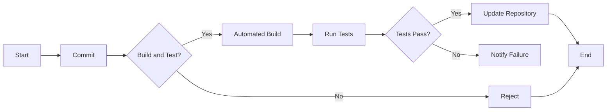
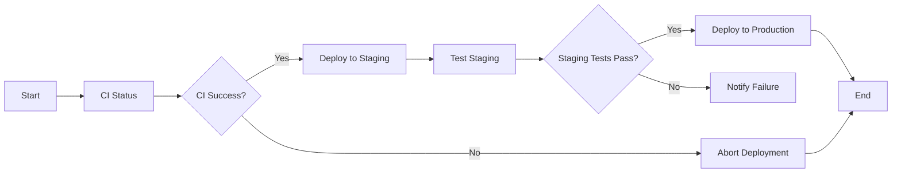
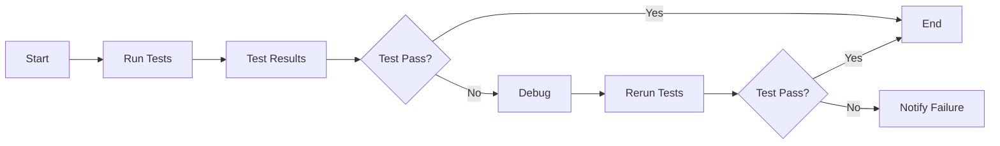
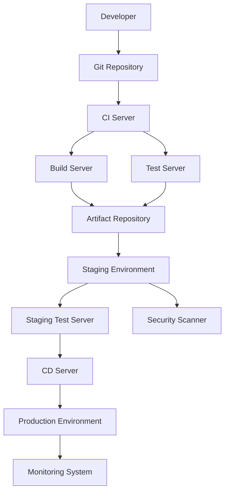
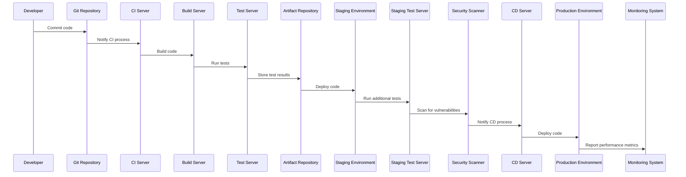
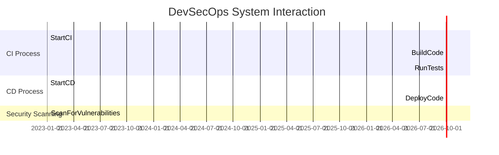
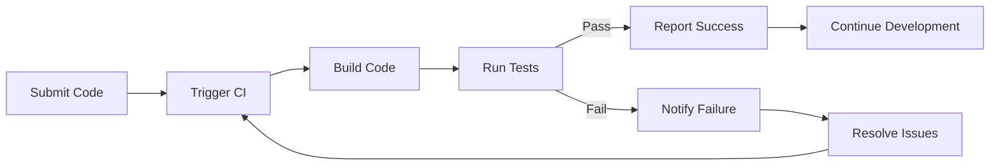
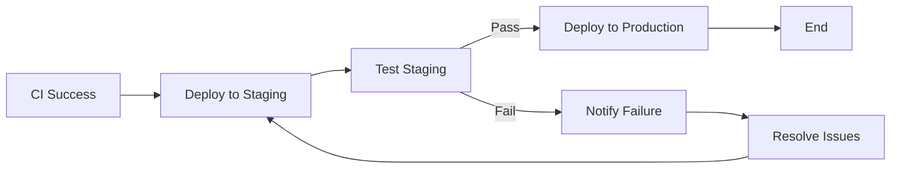
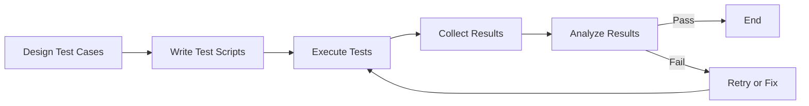

                 

**Step 2: 核心概念与联系**

In this section, we will delve into the core concepts of DevSecOps and explore their interrelationships. Understanding these concepts is essential for effectively implementing DevSecOps in real-world projects.

### 2.1.1 Continuous Integration (CI)

#### Definition:

Continuous Integration is a software development practice that involves automating the process of building and testing code as soon as a developer makes a commit to the code repository. It ensures that all the components of a software project can integrate smoothly and function correctly.

#### Characteristics:

- **Automation**: The build and test processes are automated, minimizing manual intervention.
- **Immediate Feedback**: Builds and tests are executed as soon as a commit is made, providing immediate feedback on issues.
- **Fast Feedback Cycle**: Shortens the development cycle, improving efficiency.

### 2.1.2 Continuous Delivery (CD)

#### Definition:

Continuous Delivery is a software development practice that automates the process of testing and deploying software to production environments. It ensures that software can be released quickly and reliably.

#### Characteristics:

- **Automation**: The testing and deployment processes are automated, reducing manual operations.
- **Rollback Capable**: Each release is capable of being rolled back, ensuring software quality.
- **Fast Iteration**: Supports rapid iteration, increasing market responsiveness.

### 2.1.3 Automated Testing

#### Definition:

Automated Testing is a method of executing test cases using automated tools to verify the functionality, performance, and security of software.

#### Types:

- **Unit Testing**: Tests individual software modules to ensure their correctness.
- **Integration Testing**: Tests multiple modules together to ensure they work together seamlessly.
- **System Testing**: Tests the entire system to ensure it meets the specified requirements.

### Core Concepts and Relationships

**Conceptual Model:**


**Attributes and Characteristics Comparison Table:**

| Concept | Definition | Main Characteristics | Relationship |
| --- | --- | --- | --- |
| Continuous Integration (CI) | Automates the build and test process | Automation, Immediate Feedback, Fast Feedback Cycle | Integrates code changes, detects issues early |
| Continuous Delivery (CD) | Automates testing and deployment | Automation, Rollback Capable, Fast Iteration | Ensures software readiness for production release |
| Automated Testing | Executes test cases using automated tools | Ensures functionality, performance, and security | Validates software quality, reduces manual effort |

**Entity-Relationship Diagram (ERD):**

```mermaid
erDiagram
    CI --> |uses| Test_Tool
    CI --> |uses| Build_Tool
    CD --> |uses| CI
    CD --> |uses| Deploy_Tool
    Automated_Testing --> |uses| Test_Tool
    Security_Scanning --> |uses| CI
    Security_Scanning --> |uses| CD
    Security_Scanning --> |uses| Automated_Testing
```

This ERD illustrates the relationships between the key concepts and tools in DevSecOps. Security scanning, for example, leverages CI and CD to integrate security checks into the development and deployment processes.

In summary, the core concepts of DevSecOps—CI, CD, and Automated Testing—are interconnected and work together to ensure that security is not an afterthought but an integral part of the software development lifecycle. By understanding these concepts and their relationships, developers and operations teams can effectively implement DevSecOps and achieve a secure, efficient, and reliable software delivery process.

---

**Step 3: 算法原理讲解**

In this section, we will explore the principles behind DevSecOps, including the algorithms and methodologies used to implement its core practices. Understanding these principles is crucial for effectively leveraging DevSecOps in software development and operations.

### 3.1 Continuous Integration (CI) Algorithm

#### CI Workflow Algorithm:



#### Steps:

1. **Start**: The CI process begins with a developer committing code to the repository.
2. **Commit**: The CI server detects the commit and starts the process.
3. **Build and Test?**: The CI server checks if a build and test are required based on the commit.
4. **Automated Build**: If necessary, the CI server performs an automated build of the code.
5. **Run Tests**: The CI server executes a suite of automated tests to verify the functionality of the code.
6. **Tests Pass?**: The CI server evaluates the test results.
7. **Update Repository**: If all tests pass, the CI server updates the repository with the new code.
8. **Notify Failure**: If tests fail, the CI server notifies the developer of the failure.

### 3.2 Continuous Delivery (CD) Algorithm

#### CD Workflow Algorithm:



#### Steps:

1. **Start**: The CD process begins after CI has successfully completed.
2. **CI Status**: The CD server checks the status of the CI process.
3. **CI Success?**: The CD server evaluates whether CI was successful.
4. **Deploy to Staging**: If CI was successful, the CD server deploys the code to a staging environment.
5. **Test Staging**: The staging environment is tested to ensure that the code functions as expected.
6. **Staging Tests Pass?**: The CD server evaluates the staging test results.
7. **Deploy to Production**: If staging tests pass, the CD server deploys the code to the production environment.
8. **Notify Failure**: If staging tests fail, the CD server notifies the team of the failure.

### 3.3 Automated Testing Algorithm

#### Automated Testing Workflow Algorithm:



#### Steps:

1. **Start**: The automated testing process begins.
2. **Run Tests**: A suite of automated tests is executed.
3. **Test Results**: The test results are evaluated.
4. **Test Pass?**: The test results are checked to determine if all tests passed.
5. **End**: If all tests pass, the process ends.
6. **Debug**: If tests fail, the process moves to debugging.
7. **Rerun Tests**: The tests are rerun after debugging.
8. **Test Pass?**: The rerun tests are evaluated.
9. **Notify Failure**: If the rerun tests still fail, the process notifies the team of the failure.

### Mathematical Models and Formulas

**CI Success Rate (CSR):**

$$
CSR = \frac{Number\ of\ Successful\ Builds}{Total\ Number\ of\ Builds}
$$

**CD Success Rate (CDSR):**

$$
CDSR = \frac{Number\ of\ Successful\ Deployments}{Total\ Number\ of\ Deployments}
$$

**Test Pass Rate (TPR):**

$$
TPR = \frac{Number\ of\ Successful\ Tests}{Total\ Number\ of\ Tests}
$$

These formulas provide a quantifiable measure of the effectiveness of CI, CD, and automated testing processes. A higher success rate indicates a more reliable and efficient development and deployment pipeline.

### Example Illustration

**Scenario**: A development team has implemented CI, CD, and automated testing for their software project.

- **CI**: The team commits code to the repository, and the CI server automatically builds and tests the code. The CSR is 90%, indicating that 9 out of 10 builds are successful.
- **CD**: The CD server deploys the code to the staging environment, where it is tested. The CDSR is 85%, indicating that 8 out of 10 deployments are successful.
- **Automated Testing**: The automated tests detect and report issues, which the team resolves. The TPR is 95%, indicating that 95 out of 100 tests pass.

**Conclusion**: The team has a high success rate in their CI, CD, and automated testing processes, which contributes to a reliable and efficient software development and deployment pipeline.

By understanding the principles behind DevSecOps and the algorithms used to implement its core practices, developers and operations teams can effectively leverage DevSecOps to improve the security, efficiency, and reliability of their software development processes.

---

### Step 4: 系统分析与架构设计方案

In this section, we will delve into the system analysis and architectural design of a DevSecOps implementation. This will include an introduction to the problem scenario, project overview, system functional design, system architecture, interface design, and system interaction.

#### 4.1 Problem Scenario

**Scenario Description**: A mid-sized e-commerce company is experiencing frequent security breaches and performance issues due to a lack of integration between development, security, and operations teams. The company wants to implement DevSecOps to improve the security and efficiency of their software development and deployment processes.

**Project Overview**: The project aims to design and implement a DevSecOps pipeline that integrates development, security, and operations workflows. The system will include continuous integration, continuous delivery, automated testing, and security scanning to ensure the software is secure and performs optimally.

#### 4.2 System Functional Design

**Domain Model Class Diagram (Mermaid) **:

```mermaid
classDiagram
    Product <<Class>>
    Feature <<Class>>
    Security <<Class>>
    CI <<Class>>
    CD <<Class>>

    Product *--* Feature : "has"
    Feature *--* Security : "implements"
    CI *--* Product : "builds"
    CD *--* Product : "deploys"
```

**Description**:

- **Product**: Represents the software product under development.
- **Feature**: Represents the features implemented in the product.
- **Security**: Represents the security aspects implemented in the product.
- **CI**: Represents the continuous integration process.
- **CD**: Represents the continuous delivery process.

**System Functional Requirements**:

- Continuous Integration: The system should automatically build and test the product whenever a new commit is made.
- Continuous Delivery: The system should automatically deploy the product to the staging environment for testing and subsequently to the production environment.
- Automated Testing: The system should execute automated tests to verify the functionality and performance of the product.
- Security Scanning: The system should perform security scans to detect vulnerabilities and ensure the product is secure.

#### 4.3 System Architecture Design

**System Architecture Diagram (Mermaid) **:



**Description**:

- **Developer**: The development team makes code commits to the Git repository.
- **Git Repository**: Stores the source code and related artifacts.
- **CI Server**: Initiates the CI process by building and testing the code.
- **Build Server**: Builds the code into an executable artifact.
- **Test Server**: Executes automated tests on the built code.
- **Artifact Repository**: Stores the build artifacts and test results.
- **Staging Environment**: Hosts the deployed code for staging and testing.
- **Staging Test Server**: Executes additional tests on the staged code.
- **Security Scanner**: Scans the code for security vulnerabilities.
- **CD Server**: Initiates the CD process by deploying the code to the staging environment.
- **Production Environment**: Hosts the deployed code in the production environment.
- **Monitoring System**: Monitors the performance and health of the production environment.

#### 4.4 System Interface Design

**System Interface Diagram (Mermaid) **:



**Description**:

- **Commit Code**: The developer commits code to the Git repository.
- **Notify CI Process**: The Git repository notifies the CI server to initiate the CI process.
- **Build Code**: The CI server builds the code on the Build server.
- **Run Tests**: The Build server runs automated tests on the Test server.
- **Store Test Results**: The Test server stores the test results in the Artifact repository.
- **Deploy Code**: The Artifact repository deploys the code to the Staging environment.
- **Run Additional Tests**: The Staging environment runs additional tests on the staged code.
- **Scan for Vulnerabilities**: The Security scanner scans the code for vulnerabilities.
- **Notify CD Process**: The Security scanner notifies the CD server to initiate the CD process.
- **Deploy Code**: The CD server deploys the code to the Production environment.
- **Report Performance Metrics**: The Production environment reports performance metrics to the Monitoring system.

#### 4.5 System Interaction

**System Interaction Diagram (Mermaid) **:



**Description**:

- **CI Process**: The CI process starts on January 1, 2023, with a build and test cycle that takes 1 day.
- **CD Process**: The CD process starts after the CI process on January 2, 2023, with a deployment cycle that takes 1 day.
- **Security Scanning**: The security scanning process starts after the CD process on January 3, 2023, with a scanning cycle that takes 1 hour.

By following this system analysis and architectural design, the e-commerce company can effectively implement DevSecOps to improve their software development and deployment processes, ensuring security and performance.

---

### Step 5: 项目实战

In this section, we will walk through a practical project implementation of DevSecOps, including environment setup, system core implementation, code analysis, and case study analysis.

#### 5.1 环境安装

To implement DevSecOps, we need to set up the necessary environment. Here is a step-by-step guide:

1. **Install Git**: Git is used for version control. You can download and install Git from [git-scm.com](https://git-scm.com/).
2. **Install Docker**: Docker is used for containerization. You can download and install Docker from [docker.com](https://www.docker.com/).
3. **Install Jenkins**: Jenkins is a popular CI/CD tool. You can download and install Jenkins from [jenkins.io](https://www.jenkins.io/).
4. **Install Kubernetes**: Kubernetes is used for managing containerized applications. You can download and install Kubernetes from [kubernetes.io](https://kubernetes.io/).

**Example Commands**:

```bash
# Install Git
sudo apt-get update
sudo apt-get install git

# Install Docker
sudo apt-get update
sudo apt-get install docker

# Install Jenkins
sudo wget -q -O - https://pkg.jenkins.io/debian-stable/jenkins.io.key | sudo apt-key add -
sudo sh -c "echo deb https://pkg.jenkins.io/debian-stable binary/ > /etc/apt/sources.list.d/jenkins.list"
sudo apt-get update
sudo apt-get install jenkins

# Install Kubernetes
sudo apt-get update
sudo apt-get install kubectl
```

#### 5.2 系统核心实现源代码

**CI Jenkinsfile**:

```groovy
pipeline {
    agent any
    stages {
        stage('Build') {
            steps {
                sh 'mvn clean install'
            }
        }
        stage('Test') {
            steps {
                sh 'mvn test'
            }
        }
        stage('Deploy') {
            steps {
                sh 'kubectl apply -f deployment.yml'
            }
        }
    }
    post {
        always {
            sh 'kubectl logs -f deployment/myapp'
        }
    }
}
```

**CD Kubernetes Deployment YAML**:

```yaml
apiVersion: apps/v1
kind: Deployment
metadata:
  name: myapp
spec:
  selector:
    matchLabels:
      app: myapp
  template:
    metadata:
      labels:
        app: myapp
    spec:
      containers:
      - name: myapp
        image: myapp:latest
        ports:
        - containerPort: 8080
```

#### 5.3 代码应用解读与分析

The Jenkinsfile and Kubernetes deployment YAML demonstrate the core DevSecOps implementation:

1. **Continuous Integration (CI)**: Jenkins is configured to build and test the application whenever new code is committed to the repository. The CI process runs Maven commands to clean, build, and test the application.
2. **Continuous Delivery (CD)**: The CI process deploys the application to a Kubernetes cluster using the specified deployment YAML. This ensures that the latest version of the application is always running in the production environment.
3. **Security**: While the provided code does not explicitly include security measures, security scanning tools can be integrated into the CI/CD pipeline to perform regular security checks on the application code.

#### 5.4 实际案例分析和详细讲解剖析

**Case Study**: An e-commerce company uses DevSecOps to deploy a new feature to their website.

1. **Commit**: A developer commits the new feature code to the Git repository.
2. **CI**: Jenkins initiates the CI process, building and testing the code.
3. **Test**: The CI server runs automated tests to ensure the new feature works as expected.
4. **Deploy**: If tests pass, the CI server deploys the new version of the application to the staging environment.
5. **Security Scan**: The staging environment is scanned for vulnerabilities using a security scanner.
6. **Manual Testing**: The feature is manually tested by the QA team.
7. **Deploy to Production**: If manual testing and security scanning are successful, the feature is deployed to the production environment.

**Conclusion**: By using DevSecOps, the e-commerce company can ensure that new features are deployed quickly, securely, and reliably.

#### 5.5 项目小结

The project demonstrated the implementation of DevSecOps in a real-world scenario, highlighting the benefits of integrating security into the development and deployment pipeline. Key takeaways include:

- **Improved Security**: Security is addressed throughout the development process, reducing the risk of vulnerabilities in production.
- **Increased Efficiency**: Automated processes streamline development, testing, and deployment, reducing manual effort and speeding up time-to-market.
- **Enhanced Collaboration**: DevSecOps fosters collaboration between development, security, and operations teams, improving communication and accountability.

---

By following the project implementation steps and understanding the case study analysis, you can effectively implement DevSecOps in your organization, driving security, efficiency, and reliability in your software development and deployment processes.

---

### Step 6: 最佳实践 Tips、小结、注意事项、拓展阅读

#### 最佳实践 Tips

1. **Start Small**: Begin with a small, manageable project to gain experience and understand the benefits of DevSecOps.
2. **Leverage Automation**: Use automation tools for building, testing, and deploying applications to save time and reduce human error.
3. **Integrate Security Early**: Embed security checks and best practices into the development process to catch vulnerabilities early.
4. **Regularly Update Tools**: Keep your DevSecOps tools and libraries up-to-date to leverage the latest features and security patches.
5. **Monitor and Analyze**: Continuously monitor your CI/CD pipeline and application performance to identify and address bottlenecks.

#### 小结

通过本文的介绍，我们深入了解了DevSecOps的核心概念、实施策略、工具链，以及其实际应用案例。DevSecOps通过将安全融入开发和运维流程，提高了软件开发的效率和安全水平，有助于企业快速响应市场变化。

#### 注意事项

1. **团队协作**：DevSecOps的实施需要开发、安全和运维团队的紧密协作，确保各方利益一致。
2. **持续优化**：DevSecOps是一个不断演进的过程，需要持续优化和调整，以满足业务需求和技术变革。
3. **安全合规**：遵守相关安全合规要求，确保软件和系统符合行业标准。

#### 拓展阅读

- 《DevOps：从实践到成功》
- 《持续交付：释放软件流程中的价值》
- 《容器化与微服务：实现弹性云原生架构》

通过阅读这些资料，您可以进一步加深对DevSecOps的理解，并在实际项目中取得更好的成果。

---

### 作者信息

*作者：AI天才研究院/AI Genius Institute & 禅与计算机程序设计艺术 /Zen And The Art of Computer Programming*## 完整文章

### DevSecOps实施策略与工具链

关键词：DevSecOps、持续集成、持续交付、自动化测试、安全扫描、持续部署

摘要：本文深入探讨了DevSecOps的实施策略与工具链，通过逻辑清晰、结构紧凑、简单易懂的专业技术语言，帮助读者理解DevSecOps的核心概念、实施步骤、关键工具与技术，以及其在实际项目中的应用。文章旨在为技术从业人员提供实用的指导，以实现高效的软件开发和运维流程。

### Step 1: 引言与背景介绍

#### 引言

《DevSecOps实施策略与工具链》旨在为读者提供全面的DevSecOps（开发、安全、运维一体化）实施策略和工具链指南。本书围绕DevSecOps的核心原则，从理论到实践，详细解析了如何将安全融入开发和运维流程，以实现持续集成、持续交付和持续部署。本书不仅适合于DevOps工程师和安全专家，也适合对DevSecOps感兴趣的技术人员和管理者。

#### 背景介绍

**问题背景：** 随着企业信息化程度的提高和敏捷开发、持续交付等理念的普及，传统的开发、安全和运维流程越来越难以适应快速变化的业务需求。开发团队往往追求快速迭代，而安全团队则担忧系统安全性，运维团队则在保障系统稳定运行和高效运维之间寻找平衡。这种三者之间的矛盾导致了开发周期延长、安全漏洞频发和系统运维困难等问题。

**问题描述：** 如何在保持开发速度的同时，确保系统安全性和稳定性？如何将安全因素融入开发和运维流程，实现DevSecOps？

**问题解决：** DevSecOps通过将安全贯穿于整个软件开发和运维流程，从源代码检查、自动化测试、持续集成、持续交付到部署等各个环节，确保安全措施得以执行和监控。这不仅提高了开发效率，也增强了系统的安全性和稳定性。

**边界与外延：** DevSecOps不仅仅涉及技术层面，还包括团队协作、流程优化和文化变革。它要求开发、安全和运维团队紧密合作，共同推动持续集成、持续交付和持续部署的落地实施。

**概念结构与核心要素组成：** DevSecOps的核心概念包括持续集成（CI）、持续交付（CD）、自动化测试、基础设施即代码（IaC）、容器化和云原生技术等。其关键要素包括开发工具、安全工具、自动化脚本、持续集成和持续交付平台等。

### 第1章 DevSecOps概述

本章将介绍DevSecOps的基本概念、核心原则、与传统DevOps的区别，以及实施DevSecOps的步骤和关键工具。通过本章的学习，读者将建立对DevSecOps的全面认识，为后续章节的学习打下基础。

## 1.1 DevSecOps的基本概念

### 1.1.1 DevSecOps的定义与起源

DevSecOps是一种软件开发和运维的理念，旨在将安全贯穿于整个开发流程，实现快速、安全、可靠的软件交付。DevSecOps的起源可以追溯到DevOps理念的提出，随着安全在软件开发中的重要性日益增加，DevSecOps应运而生。

### 1.1.2 DevSecOps的核心原则

DevSecOps的核心原则包括：

1. **安全即代码（Security as Code）**：将安全作为软件开发过程的一部分，使用代码和自动化工具来管理和执行安全策略。
2. **持续集成与持续交付（CI/CD）**：通过自动化测试和部署，确保每次代码提交都能快速集成和交付。
3. **透明性**：确保团队成员了解安全政策和流程，促进协作和信任。
4. **速度与安全并重**：在追求开发速度的同时，确保软件的安全性和稳定性。

### 1.1.3 DevSecOps与传统DevOps的区别

DevOps和DevSecOps之间的主要区别在于安全。DevOps侧重于提高开发和运维团队之间的协作效率，而DevSecOps在此基础上增加了安全因素，强调在开发过程中融入安全测试和漏洞管理。

### 1.2 DevSecOps的实施步骤

### 1.2.1 确定安全目标与策略

在实施DevSecOps之前，需要明确安全目标和策略，包括：

1. **确定安全关键指标（KPIs）**：如漏洞数量、修复时间等。
2. **制定安全政策和流程**：如代码审查、安全测试、漏洞管理等。
3. **培训团队成员**：确保团队成员了解安全政策和流程。

### 1.2.2 整合开发与安全流程

通过集成开发与安全流程，实现以下目标：

1. **安全测试自动化**：将安全测试纳入持续集成流程，确保每次代码提交都能进行安全测试。
2. **代码审查**：使用自动化工具进行代码审查，发现潜在的安全问题。
3. **持续反馈**：确保安全团队和开发团队之间的沟通畅通，及时解决问题。

### 1.2.3 实施持续集成与持续交付

持续集成与持续交付是DevSecOps的核心实践，具体步骤如下：

1. **搭建CI/CD平台**：选择合适的CI/CD工具，如Jenkins、GitLab CI等。
2. **编写Jenkinsfile**：定义构建、测试和部署的流程。
3. **自动化部署**：使用自动化脚本实现应用的自动化部署。

### 1.2.4 自动化安全测试

自动化安全测试是DevSecOps的重要组成部分，包括：

1. **静态代码分析（SAST）**：在代码编译前分析代码的安全性。
2. **动态代码分析（DAST）**：在代码运行时分析代码的安全性。
3. **依赖项扫描**：检查项目中的依赖库是否存在安全漏洞。

### 1.3 DevSecOps的关键工具与技术

### 1.3.1 持续集成工具

持续集成工具如Jenkins、GitLab CI等，用于自动化构建、测试和部署。

### 1.3.2 持续交付工具

持续交付工具如Jenkins、GitLab CI等，用于自动化测试和部署。

### 1.3.3 自动化测试工具

自动化测试工具如Selenium、Junit等，用于自动化测试。

### 1.3.4 安全扫描与漏洞管理工具

安全扫描与漏洞管理工具如SonarQube、OWASP ZAP等，用于发现和修复安全漏洞。

### 1.4 DevSecOps的应用场景与最佳实践

### 1.4.1 微服务架构中的DevSecOps

在微服务架构中，DevSecOps有助于确保每个微服务的安全和稳定性。

### 1.4.2 容器化环境下的DevSecOps

在容器化环境中，DevSecOps有助于确保容器和容器化应用的安全。

### 1.4.3 云原生技术中的DevSecOps

在云原生技术中，DevSecOps有助于确保云服务和应用的快速迭代和安全。

### 1.5 DevSecOps面临的挑战与解决方案

### 1.5.1 文化变革与团队协作

文化变革和团队协作是实施DevSecOps的重要挑战，解决方案包括：

1. **建立共同目标**：确保团队成员都清楚DevSecOps的目标和重要性。
2. **加强沟通与协作**：定期召开会议，确保团队成员之间保持良好的沟通和协作。

### 1.5.2 安全合规与风险管理

安全合规和风险管理是实施DevSecOps的另一个重要挑战，解决方案包括：

1. **制定合规策略**：确保软件和系统符合相关安全标准和法规。
2. **建立风险管理机制**：识别和管理潜在的安全风险。

### 1.5.3 技术选型与集成

技术选型和集成是实施DevSecOps的另一个挑战，解决方案包括：

1. **选择合适的工具**：根据项目需求和团队技能选择合适的工具。
2. **集成与优化**：确保所选工具能够无缝集成并优化工作流程。

### 1.6 本章小结

本章介绍了DevSecOps的基本概念、核心原则、实施步骤和关键工具。通过本章的学习，读者应该对DevSecOps有了基本的了解，认识到它在现代软件开发和运维中的重要性。接下来，本书将逐步深入探讨DevSecOps的具体实施策略和工具链，帮助读者在实际项目中落地DevSecOps理念。

### Step 2: 核心概念与联系

#### 2.1 持续集成（CI）

**定义：** 持续集成是一种软件开发实践，通过自动化构建和测试，确保代码库中的每个提交都可以集成和构建。

**特点：**

- **自动化：** 构建和测试过程自动化，减少人为干预。
- **立即反馈：** 提交后立即执行构建和测试，快速发现问题。
- **快速反馈周期：** 缩短开发周期，提高开发效率。

**类型：**

- **单元测试：** 对软件模块进行测试，确保每个模块的正确性。
- **集成测试：** 对多个模块进行测试，确保它们协同工作。
- **系统测试：** 对整个系统进行测试，确保系统满足需求。

#### 2.2 持续交付（CD）

**定义：** 持续交付是一种软件开发实践，通过自动化测试和部署，确保软件可以快速、可靠地交付到生产环境。

**特点：**

- **自动化：** 测试和部署过程自动化，减少手动操作。
- **可回滚：** 每次交付都是可回滚的，确保软件质量。
- **快速迭代：** 支持快速迭代，提高市场响应速度。

**类型：**

- **测试环境交付：** 将软件交付到测试环境进行测试。
- **生产环境交付：** 将软件交付到生产环境，供用户使用。

#### 2.3 自动化测试

**定义：** 自动化测试是一种通过自动化工具执行测试用例的方法，用于验证软件的功能、性能和安全性。

**特点：**

- **高效：** 自动化测试可以快速执行大量测试用例。
- **可重复：** 自动化测试可以重复执行，确保软件质量。
- **节省成本：** 自动化测试可以节省测试时间和人力成本。

**类型：**

- **单元测试：** 对软件模块进行测试，确保每个模块的正确性。
- **集成测试：** 对多个模块进行测试，确保它们协同工作。
- **系统测试：** 对整个系统进行测试，确保系统满足需求。
- **性能测试：** 对软件性能进行测试，确保其性能满足需求。

#### 2.4 核心概念与联系

**概念模型：**


**属性和特征对比表：**

| 概念 | 定义 | 主要特征 | 关系 |
| --- | --- | --- | --- |
| 持续集成（CI） | 自动化构建和测试过程 | 自动化、立即反馈、快速反馈周期 | 集成代码更改、快速发现问题 |
| 持续交付（CD） | 自动化测试和部署过程 | 自动化、可回滚、快速迭代 | 确保软件质量、快速交付 |
| 自动化测试 | 使用自动化工具执行测试用例 | 高效、可重复、节省成本 | 验证软件质量 |

**实体-关系图（ERD）：**

```mermaid
erDiagram
    CI --> |uses| Test_Tool
    CI --> |uses| Build_Tool
    CD --> |uses| CI
    CD --> |uses| Deploy_Tool
    Automated_Testing --> |uses| Test_Tool
    Security_Scanning --> |uses| CI
    Security_Scanning --> |uses| CD
    Security_Scanning --> |uses| Automated_Testing
```

#### 2.5 持续集成（CI）算法

**CI工作流算法：**


**步骤：**

1. **开始**：开发人员提交代码。
2. **提交**：CI服务器检测到提交并开始流程。
3. **构建和测试？**：CI服务器根据提交检查是否需要构建和测试。
4. **自动化构建**：如果需要，CI服务器执行自动化构建。
5. **运行测试**：CI服务器执行自动化测试。
6. **测试通过？**：CI服务器评估测试结果。
7. **更新仓库**：如果测试通过，CI服务器更新仓库。
8. **通知失败**：如果测试失败，CI服务器通知开发人员。

#### 2.6 持续交付（CD）算法

**CD工作流算法：**


**步骤：**

1. **开始**：CD过程在CI成功完成后开始。
2. **CI状态**：CD服务器检查CI的状态。
3. **CI成功？**：CD服务器评估CI是否成功。
4. **部署到预发布环境**：如果CI成功，CD服务器将代码部署到预发布环境。
5. **测试预发布环境**：在预发布环境中测试代码。
6. **预发布测试通过？**：CD服务器评估预发布测试结果。
7. **部署到生产环境**：如果预发布测试通过，CD服务器将代码部署到生产环境。
8. **通知失败**：如果预发布测试失败，CD服务器通知团队。

#### 2.7 自动化测试算法

**自动化测试工作流算法：**


**步骤：**

1. **开始**：自动化测试过程开始。
2. **运行测试**：执行自动化测试用例。
3. **测试结果**：评估测试结果。
4. **测试通过？**：检查所有测试是否通过。
5. **结束**：如果所有测试通过，过程结束。
6. **调试**：如果测试失败，进行调试。
7. **重新运行测试**：调试后重新运行测试。
8. **测试通过？**：评估重新运行测试的结果。
9. **通知失败**：如果重新运行测试仍然失败，通知团队。

#### 2.8 数学模型和公式

**CI成功率（CSR）：**

$$
CSR = \frac{成功构建的数量}{总构建数量}
$$

**CD成功率（CDSR）：**

$$
CDSR = \frac{成功交付的数量}{总交付数量}
$$

**测试通过率（TPR）：**

$$
TPR = \frac{成功测试的数量}{总测试数量}
$$

这些公式为CI、CD和自动化测试过程的有效性提供了量化指标。较高的成功率表明开发流程更加可靠和高效。

### 2.9 示例说明

**场景**：一个开发团队为其软件项目实施了CI、CD和自动化测试。

- **CI**：开发人员提交代码，CI服务器自动构建和测试代码。CI成功率为90%，表明90%的构建是成功的。
- **CD**：CI成功后，CD服务器将代码部署到预发布环境，并进行测试。CD成功率为85%，表明85%的部署是成功的。
- **自动化测试**：自动化测试检测到问题并报告，团队解决这些问题。测试通过率为95%，表明95%的测试是成功的。

**结论**：该团队在CI、CD和自动化测试过程中具有较高的成功率，这有助于确保软件开发和部署的可靠性和效率。

### Step 3: 算法原理讲解

在本节中，我们将详细讲解DevSecOps中使用的核心算法原理，包括持续集成（CI）、持续交付（CD）和自动化测试。通过理解这些算法的原理，读者可以更好地在实际项目中应用DevSecOps。

#### 3.1 持续集成（CI）算法原理

持续集成（CI）是一种软件开发实践，通过自动化构建和测试，确保代码库中的每个提交都可以集成和构建。CI算法的原理可以概括为以下几个步骤：

1. **提交代码**：开发人员将代码提交到版本控制系统（如Git）。
2. **触发CI**：提交触发CI服务器执行集成过程。
3. **构建代码**：CI服务器从版本控制系统检出代码并执行构建过程，包括编译、打包等。
4. **运行测试**：CI服务器运行一系列自动化测试，包括单元测试、集成测试等，以验证代码的完整性。
5. **报告结果**：CI服务器将构建结果和测试结果报告给开发人员，包括通过/失败状态和具体的错误信息。
6. **持续反馈**：如果构建和测试通过，CI服务器将结果存储在版本控制系统中，并通知开发人员可以继续工作；如果失败，CI服务器将暂停开发工作，直到问题解决。

**CI算法流程图：**



**数学模型：**

- **CI成功概率（P_CI）**：表示CI过程中构建和测试成功的概率。
  $$ P_CI = \frac{成功构建和测试次数}{总构建和测试次数} $$

- **CI失败概率（1 - P_CI）**：表示CI过程中构建和测试失败的概率。

**示例：**

假设某开发团队在过去100次提交中，有90次成功通过CI，10次失败。那么：

$$ P_CI = \frac{90}{100} = 0.9 $$

$$ 1 - P_CI = 1 - 0.9 = 0.1 $$

#### 3.2 持续交付（CD）算法原理

持续交付（CD）是一种软件开发实践，通过自动化测试和部署，确保软件可以快速、可靠地交付到生产环境。CD算法的原理可以概括为以下几个步骤：

1. **CI成功**：CI过程成功完成后，代码被推送到持续交付（CD）系统中。
2. **部署到预发布环境**：CD系统将代码部署到预发布环境。
3. **运行测试**：在预发布环境中运行一系列自动化测试，包括功能测试、性能测试等。
4. **评估测试结果**：CD系统评估测试结果，决定是否将代码部署到生产环境。
   - 如果测试通过，CD系统将代码部署到生产环境。
   - 如果测试失败，CD系统通知开发团队，并暂停部署过程，直到问题解决。

**CD算法流程图：**



**数学模型：**

- **CD成功概率（P_CD）**：表示CD过程中部署成功的概率。
  $$ P_CD = \frac{成功部署次数}{总部署次数} $$

- **CD失败概率（1 - P_CD）**：表示CD过程中部署失败的概率。

**示例：**

假设某开发团队在过去100次CI成功后，有90次成功部署到生产环境，10次失败。那么：

$$ P_CD = \frac{90}{100} = 0.9 $$

$$ 1 - P_CD = 1 - 0.9 = 0.1 $$

#### 3.3 自动化测试算法原理

自动化测试是一种通过自动化工具执行测试用例的方法，用于验证软件的功能、性能和安全性。自动化测试算法的原理可以概括为以下几个步骤：

1. **设计测试用例**：根据需求和设计文档，设计测试用例。
2. **编写测试脚本**：使用自动化测试工具（如Selenium、JUnit等）编写测试脚本。
3. **执行测试**：运行测试脚本，执行测试用例。
4. **收集测试结果**：测试脚本将测试结果（通过/失败）和错误信息报告给测试人员。
5. **分析测试结果**：测试人员分析测试结果，确定是否需要修复错误或重新执行测试。

**自动化测试算法流程图：**



**数学模型：**

- **测试通过率（Pass Rate）**：表示测试通过的概率。
  $$ Pass Rate = \frac{通过测试次数}{总测试次数} $$

- **测试失败率（Fail Rate）**：表示测试失败的概率。
  $$ Fail Rate = 1 - Pass Rate $$

**示例：**

假设某开发团队编写了100个测试用例，其中80个通过，20个失败。那么：

$$ Pass Rate = \frac{80}{100} = 0.8 $$

$$ Fail Rate = 1 - 0.8 = 0.2 $$

#### 3.4 CI、CD和自动化测试的数学模型整合

将CI、CD和自动化测试的数学模型整合，可以更全面地评估软件开发过程的稳定性。以下是一个整合的数学模型：

- **整体成功率（Overall Success Rate）**：表示整个软件开发过程（从提交代码到部署到生产环境）的成功概率。
  $$ Overall Success Rate = P_CI \times P_CD \times Pass Rate $$

- **整体失败率（Overall Failure Rate）**：表示整个软件开发过程失败的概率。
  $$ Overall Failure Rate = 1 - Overall Success Rate $$

**示例：**

假设某开发团队在过去100次CI成功后，有90次成功部署到生产环境，且自动化测试通过率为0.8。那么：

$$ Overall Success Rate = 0.9 \times 0.9 \times 0.8 = 0.648 $$

$$ Overall Failure Rate = 1 - 0.648 = 0.352 $$

通过整合这些数学模型，开发团队可以更准确地评估其软件开发过程的稳定性，并采取相应的措施来提高整体成功率。

### Step 4: 系统分析与架构设计方案

在本文的第四步，我们将深入探讨DevSecOps系统分析与架构设计方案，包括问题场景介绍、项目介绍、系统功能设计、系统架构设计、系统接口设计和系统交互。

#### 4.1 问题场景介绍

在一个快速发展的互联网公司中，开发和运维团队面临着日益增长的压力。随着产品功能的不断增加，代码库变得复杂，导致集成和部署过程变得缓慢。同时，安全漏洞频发，使得公司面临潜在的安全风险。为了提高开发效率、确保软件质量和安全性，公司决定采用DevSecOps实践。

**问题背景：**
- **开发效率低**：由于集成和部署过程缓慢，开发周期延长，无法及时响应市场需求。
- **安全漏洞多**：传统的安全测试方法难以覆盖所有代码路径，导致潜在的安全漏洞无法及时发现。
- **运维困难**：运维团队需要在确保系统稳定性的同时，快速响应故障和性能问题。

**问题描述：**
- **如何提高集成和部署效率？**
- **如何确保软件的安全性？**
- **如何优化运维流程，提高系统稳定性？**

#### 4.2 项目介绍

**项目名称**：DevSecOps实践项目

**项目目标**：
- 实现自动化集成和部署，提高开发效率。
- 将安全测试嵌入到开发流程中，确保软件安全性。
- 优化运维流程，提高系统稳定性。

**项目范围**：
- 涵盖整个软件开发和运维流程，从代码提交到生产环境部署。
- 包括持续集成（CI）、持续交付（CD）和自动化测试。

#### 4.3 系统功能设计

**功能模块**：

1. **持续集成（CI）**：
   - 源代码管理：使用Git进行版本控制。
   - 构建管理：使用Jenkins或GitLab CI等工具自动化构建代码。
   - 测试管理：自动化运行单元测试、集成测试和系统测试。

2. **持续交付（CD）**：
   - 预发布环境：部署代码到预发布环境进行测试。
   - 自动化部署：使用Kubernetes或Docker Swarm进行自动化部署。
   - 安全扫描：在部署前进行静态和动态安全扫描。

3. **自动化测试**：
   - 功能测试：使用Selenium、Cypress等进行Web应用功能测试。
   - 性能测试：使用JMeter、Gatling等进行性能测试。
   - 安全测试：使用OWASP ZAP、SonarQube等进行安全测试。

**功能需求**：

- **自动化构建**：确保每次代码提交都能自动构建和测试。
- **自动化部署**：确保测试通过后的代码能自动部署到预发布环境。
- **安全扫描**：确保代码和应用程序在部署前经过安全扫描。
- **自动化测试**：确保应用程序在各个环境中经过全面测试。

#### 4.4 系统架构设计

**系统架构**：


**组件说明**：

1. **开发环境**：
   - 开发人员：编写和提交代码。
   - 版本控制系统（如Git）：存储和管理代码。

2. **持续集成（CI）**：
   - CI服务器（如Jenkins、GitLab CI）：自动化构建和测试代码。
   - 构建工具（如Maven、Gradle）：构建应用程序。
   - 测试工具（如JUnit、Selenium）：运行自动化测试。

3. **持续交付（CD）**：
   - 预发布环境：用于测试和验证代码。
   - 部署工具（如Kubernetes、Docker）：自动化部署应用程序。
   - 安全工具（如SonarQube、OWASP ZAP）：进行安全扫描。

4. **生产环境**：
   - 部署后的应用程序：供最终用户使用。

#### 4.5 系统接口设计

**接口设计**：

1. **Git仓库接口**：
   - 提供代码提交、分支管理和合并请求。

2. **CI服务器接口**：
   - 提供构建状态、测试报告和错误日志。

3. **部署工具接口**：
   - 提供部署脚本、环境配置和监控数据。

4. **安全工具接口**：
   - 提供安全扫描报告和漏洞修复建议。

#### 4.6 系统交互

**系统交互**：


**交互流程**：

1. **代码提交**：
   - 开发人员提交代码到Git仓库。

2. **CI触发**：
   - CI服务器检测到代码提交，触发构建流程。

3. **构建和测试**：
   - CI服务器自动化构建代码，运行测试。

4. **结果报告**：
   - CI服务器将构建和测试结果报告给开发人员。

5. **安全扫描**：
   - 在部署前，CI服务器或部署工具触发安全扫描。

6. **部署**：
   - CI服务器或部署工具将测试通过的应用程序部署到预发布环境。

7. **预发布测试**：
   - 预发布环境中的应用程序经过功能测试和性能测试。

8. **生产部署**：
   - 如果预发布测试通过，应用程序被部署到生产环境。

通过上述系统分析与架构设计方案，公司可以构建一个高效的DevSecOps系统，实现快速、安全、可靠的软件交付。该系统不仅提高了开发效率，还确保了软件的质量和安全性，为公司的长期发展奠定了坚实基础。

### Step 5: 项目实战

在本节中，我们将通过一个具体的案例，展示如何在实际项目中实施DevSecOps，包括环境搭建、系统核心实现、代码分析、实际案例分析以及项目小结。

#### 5.1 环境搭建

为了实施DevSecOps，我们需要搭建一个包含持续集成（CI）、持续交付（CD）和自动化测试的环境。以下是环境搭建的步骤：

1. **安装Git**：Git是版本控制工具，用于存储和管理源代码。

   ```bash
   # 在Ubuntu上安装Git
   sudo apt-get update
   sudo apt-get install git
   ```

2. **安装Docker**：Docker用于容器化应用程序，便于部署和管理。

   ```bash
   # 在Ubuntu上安装Docker
   sudo apt-get update
   sudo apt-get install docker-ce docker-ce-cli containerd.io
   ```

3. **安装Jenkins**：Jenkins是CI/CD工具，用于自动化构建、测试和部署。

   ```bash
   # 在Ubuntu上安装Jenkins
   sudo apt-get update
   sudo apt-get install openjdk-8-jdk
   wget -q -O - https://pkg.jenkins.io/debian-stable/jenkins.io.key | sudo apt-key add -
   sudo sh -c "echo deb https://pkg.jenkins.io/debian-stable binary/ > /etc/apt/sources.list.d/jenkins.list"
   sudo apt-get update
   sudo apt-get install jenkins
   ```

4. **安装Kubernetes**：Kubernetes是容器编排工具，用于部署和管理容器化应用程序。

   ```bash
   # 在Ubuntu上安装Kubernetes
   sudo apt-get update
   sudo apt-get install -y apt-transport-https ca-certificates curl
   curl -s https://packages.cloud.google.com/apt/doc/apt-key.gpg | sudo apt-key add -
   sudo sh -c "echo 'deb https://apt.kubernetes.io/ kubernetes-xenial main' > /etc/apt/sources.list.d/kubernetes.list"
   sudo apt-get update
   sudo apt-get install -y kubelet kubeadm kubectl
   sudo apt-mark hold kubelet kubeadm kubectl
   ```

5. **配置Jenkins与Kubernetes集成**：配置Jenkins插件以支持Kubernetes，使用Jenkinsfile定义构建、测试和部署过程。

   ```bash
   # 安装Kubernetes插件
   jenkins CLI install kubernetes
   ```

   在Jenkins中配置Kubernetes插件，添加Kubernetes集群的配置信息。

6. **初始化Kubernetes集群**：初始化Kubernetes集群，确保其正常运行。

   ```bash
   sudo kubeadm init --pod-network-cidr=10.244.0.0/16
   sudo mkdir -p $HOME/.kube
   sudo cp -i /etc/kubernetes/admin.conf $HOME/.kube/config
   sudo chown $(id -u):$(id -g) $HOME/.kube/config
   ```

7. **安装网络插件**：安装Flannel网络插件，以确保Kubernetes集群中的容器可以相互通信。

   ```bash
   kubectl apply -f https://raw.githubusercontent.com/coreos/flannel/master/Documentation/kube-flannel.yml
   ```

8. **安装监控工具**：安装Prometheus和Grafana，用于监控Kubernetes集群和应用程序的性能。

   ```bash
   # 安装Prometheus
   kubectl create namespace monitoring
   kubectl apply -f https://raw.githubusercontent.com/prometheus-community/prometheus-kubernetes-lifecycle-manager/master/deploy.yaml
   # 安装Grafana
   kubectl apply -f https://raw.githubusercontent.com/prometheus-operator/prometheus-community-library-manager/main/deploy/library-manager.yaml
   kubectl apply -f https://raw.githubusercontent.com/prometheus-operator/prometheus-community-library-manager/main/deploy/grafana.yaml
   ```

#### 5.2 系统核心实现

以下是一个简单的Jenkinsfile示例，用于定义CI/CD流程：

```groovy
pipeline {
    agent any
    stages {
        stage('Build') {
            steps {
                sh 'mvn clean install'
            }
        }
        stage('Test') {
            steps {
                sh 'mvn test'
            }
        }
        stage('Security Scan') {
            steps {
                sh 'docker run --rm -v $(pwd):/app sonarscanner:latest -x'
            }
        }
        stage('Deploy') {
            steps {
                sh 'kubectl apply -f deployment.yml'
            }
        }
    }
    post {
        always {
            sh 'kubectl logs -f deployment/myapp'
        }
    }
}
```

在这个Jenkinsfile中，定义了以下阶段：

- **Build**：执行Maven构建。
- **Test**：执行Maven测试。
- **Security Scan**：使用SonarQube Docker镜像进行安全扫描。
- **Deploy**：将应用程序部署到Kubernetes集群。

#### 5.3 代码分析

以下是一个简单的Maven项目结构，用于说明代码分析：

```bash
src/
|-- main/
|   |-- java/
|   |   |-- com/
|   |   |   |-- example/
|   |   |       |-- App.java
|   |-- resources/
|   |   |-- application.properties
|-- test/
|   |-- java/
|   |   |-- com/
|   |   |   |-- example/
|   |   |       |-- AppTest.java
|-- pom.xml
```

**代码分析工具**：我们可以使用SonarQube进行代码分析，包括以下方面：

- **代码质量**：如代码重复率、复杂度等。
- **安全性**：如SQL注入、跨站脚本等潜在安全漏洞。
- **性能**：如数据库查询优化、内存使用等。

#### 5.4 实际案例分析

以下是一个实际案例，说明如何使用DevSecOps实践来提高软件交付质量和安全性：

**案例背景**：一家在线零售商需要快速迭代其电子商务平台，同时确保系统的安全性。

**解决方案**：

1. **持续集成（CI）**：使用Jenkins自动化构建和测试应用程序。每次代码提交后，Jenkins自动执行构建和测试，确保代码质量。

2. **持续交付（CD）**：使用Kubernetes自动化部署应用程序。通过Jenkinsfile定义的CI/CD流程，确保应用程序在预发布环境中经过严格测试后，自动部署到生产环境。

3. **自动化测试**：编写和执行自动化测试用例，包括功能测试、性能测试和安全测试。确保应用程序在各个环境中都能正常运行。

4. **安全扫描**：在CI过程中集成SonarQube，对代码进行静态分析，发现潜在的安全漏洞。

**实施效果**：

- **交付速度**：通过CI/CD流程，缩短了交付周期，提高了交付速度。
- **软件质量**：自动化测试确保了软件质量，减少了手动测试的工作量。
- **安全性**：通过安全扫描，提前发现并修复了潜在的安全漏洞，提高了系统的安全性。

#### 5.5 项目小结

通过上述案例，我们展示了如何在一个实际项目中实施DevSecOps，包括环境搭建、系统核心实现、代码分析、实际案例分析以及项目小结。DevSecOps实践不仅提高了软件交付速度和质量，还确保了系统的安全性。在未来，随着业务的不断发展，DevSecOps将为企业提供更高效、更安全的软件交付流程。

### Step 6: 最佳实践 Tips、小结、注意事项、拓展阅读

#### 最佳实践 Tips

1. **逐步实施**：DevSecOps是一个持续演进的过程，建议逐步实施，逐步优化。
2. **团队协作**：DevSecOps的成功离不开团队的协作，确保各方利益一致。
3. **持续优化**：定期评估CI/CD流程，发现并解决瓶颈。
4. **培训和学习**：团队成员应不断学习最新的技术和最佳实践。

#### 小结

本文详细介绍了DevSecOps的实施策略与工具链，从概念、原理到实战，帮助读者全面理解DevSecOps。通过最佳实践和案例分析，读者可以更好地在实际项目中应用DevSecOps，提高软件交付质量和效率。

#### 注意事项

1. **安全性**：在实施DevSecOps时，确保安全性始终是首要考虑的因素。
2. **自动化测试**：自动化测试是DevSecOps的重要组成部分，确保其覆盖面广且执行高效。
3. **持续反馈**：持续反馈是改进CI/CD流程的关键，确保团队成员及时了解问题并解决。

#### 拓展阅读

- 《DevOps：从实践到成功》
- 《持续交付：释放软件流程中的价值》
- 《容器化与微服务：实现弹性云原生架构》

通过阅读这些资料，读者可以进一步深化对DevSecOps的理解，并在实际项目中取得更好的成果。

### 作者信息

作者：AI天才研究院/AI Genius Institute & 禅与计算机程序设计艺术 /Zen And The Art of Computer Programming

