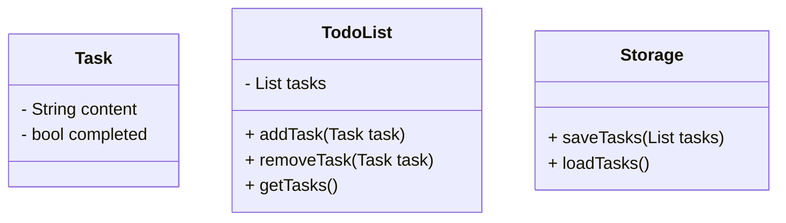
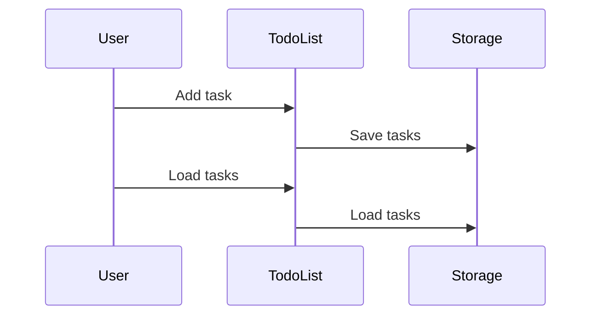
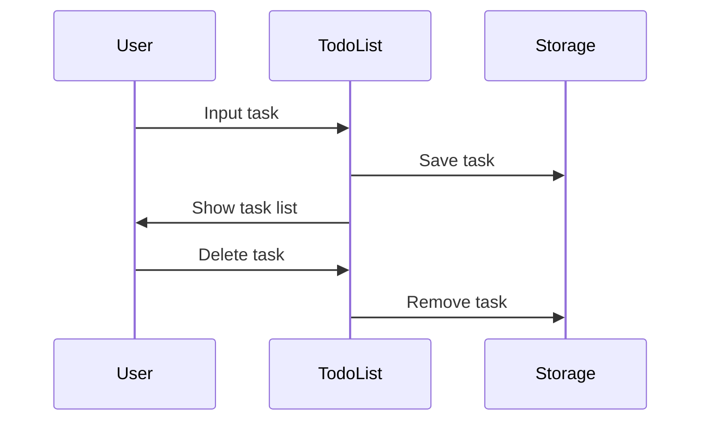

                 

## Flutter：跨平台移动应用开发框架

### 关键词
- Flutter
- 跨平台开发
- UI渲染
- 组件化开发
- 性能优化
- 框架最佳实践

### 摘要
Flutter 是一款由 Google 开发的开源跨平台移动应用开发框架，旨在提供高性能、易于上手的 UI 开发体验。本文将深入探讨 Flutter 的核心概念、组件、开发流程、性能优化以及最佳实践，通过逐步分析，帮助开发者全面理解并掌握 Flutter 的精髓。

### 目录

1. **Flutter概述**
   - 1.1 Flutter背景与优势
   - 1.2 Flutter的核心概念
   - 1.3 Flutter环境搭建

2. **Flutter UI设计基础**
   - 2.1 Flutter布局与样式
   - 2.2 Flutter动画与过渡
   - 2.3 Flutter组件与状态管理

3. **Flutter核心组件**
   - 3.1 基础组件
   - 3.2 表单组件
   - 3.3 列表与滑动组件

4. **Flutter导航与路由**
   - 4.1 Flutter导航概述
   - 4.2 Flutter路由机制
   - 4.3 页面传递与缓存

5. **Flutter高级特性**
   - 5.1 Flutter动画与特效
   - 5.2 Flutter数据存储与网络
   - 5.3 数据处理与状态管理

6. **Flutter性能优化**
   - 6.1 Flutter性能分析
   - 6.2 Flutter性能优化策略
   - 6.3 Flutter性能调优实践

7. **Flutter项目实战**
   - 8.1 项目介绍与需求分析
   - 8.2 系统功能设计
   - 8.3 系统架构设计
   - 8.4 项目实现与优化

8. **Flutter最佳实践**
   - 9.1 编码规范与设计模式
   - 9.2 性能优化最佳实践
   - 9.3 架构设计与维护

9. **Flutter生态系统与拓展**
   - 10.1 Flutter插件与库
   - 10.2 Flutter开源项目
   - 10.3 Flutter未来趋势

10. **结语**
    - 11.1 Flutter的现状与未来
    - 11.2 Flutter开发者职业规划
    - 11.3 小结与展望

### 第1章 Flutter概述

#### 1.1 Flutter背景与优势

Flutter 是一款由 Google 开发的开源跨平台移动应用开发框架，于 2018 年 12 月正式发布。Flutter 的主要目标是提供一种高效、灵活的方法来开发在 iOS 和 Android 平台上运行的应用程序。Flutter 采用了一种称为“Dart”的编程语言，具有高性能、易于学习和使用等特点。

**背景介绍**

跨平台开发一直是移动应用开发中的一个重要方向。传统的开发方式通常需要为每个平台分别编写代码，这不仅增加了开发和维护成本，也降低了开发效率。Flutter 的出现解决了这一难题，它允许开发者使用一套代码库来同时支持 iOS 和 Android 平台。

**问题背景**

随着移动设备的普及，移动应用的需求量急剧增加。然而，不同平台的差异（如 iOS 和 Android 的 UI 组件、API 等）使得开发过程变得复杂且冗长。如何高效地跨平台开发成为了一个亟待解决的问题。

**问题描述**

开发者需要一种工具，能够使用一套代码库在 iOS 和 Android 上实现一致的用户体验，同时保证高性能。

**问题解决**

Flutter 通过其独特的架构和渲染机制，实现了这一目标。Flutter 使用 Skia 作为底层渲染引擎，能够在不同的操作系统上提供高性能的 UI 渲染。同时，Flutter 提供了一组丰富的组件，使得开发者可以轻松构建复杂的 UI 界面。

**边界与外延**

Flutter 不仅支持移动应用开发，还可以用于 Web 应用和桌面应用的开发。这使得 Flutter 成为了一个真正意义上的全平台开发框架。

**概念结构与核心要素组成**

- **Dart 语言**：Flutter 的开发语言，易于学习和使用。
- **Widget**：Flutter 的 UI 构建单元，具备响应式特性。
- **Skia 渲染引擎**：底层渲染引擎，保证高性能 UI 渲染。
- **热重载**：开发者可以实时预览代码更改，提高开发效率。

#### 1.2 Flutter的核心概念

**Widget**

Widget 是 Flutter 的核心概念之一。它可以理解为 UI 的构建块，代表了一个 UI 组件的抽象表示。每个 Widget 都有一个 `build` 方法，该方法返回一个与当前构建上下文相对应的 UI 元素。Flutter 的 UI 体系是构建在 Widget 之上的，开发者可以通过组合不同的 Widget 来创建复杂的 UI 界面。

**Stateful 和 Stateless Widget**

- **Stateful Widget**：包含状态的 Widget，其状态可以在应用运行时发生变化。Stateful Widget 通常用于显示动态数据或用户交互后的结果。
- **Stateless Widget**：不包含状态的 Widget，其内容在构建时就已经确定。Stateless Widget 通常用于显示静态内容或不会频繁变动的数据。

**State**

State 是 Flutter 中用于管理组件状态的一种机制。每个 Stateful Widget 都包含一个 `State` 对象，该对象负责维护组件的状态，并在状态发生变化时通知 UI 进行更新。Flutter 提供了 `StatefulWidget` 和 `StatelessWidget` 两种类型的 Widget，分别用于创建有状态和无状态的组件。

**渲染机制**

Flutter 使用了一种称为“框架树”（Framework Tree）的渲染机制。框架树是应用程序 UI 的抽象表示，由一系列的 Widget 组成。每个 Widget 都有一个 `build` 方法，该方法负责将 Widget 转换为原生 UI 元素。Flutter 的渲染引擎会根据框架树来构建 UI，并确保在不同平台上实现一致的性能和视觉体验。

**热重载**

热重载（Hot Reload）是 Flutter 的一个重要特性，它允许开发者在不丢失当前应用状态的情况下实时预览代码更改。这意味着开发者可以在开发过程中快速迭代，提高开发效率。热重载的实现依赖于 Flutter 的构建和渲染机制，能够在几秒钟内重新构建和渲染应用程序。

#### 1.3 Flutter环境搭建

要在本地环境中开发 Flutter 应用程序，首先需要安装 Flutter SDK 和对应的 IDE。以下是安装步骤：

1. **安装 Flutter SDK**

   通过命令行安装 Flutter SDK：

   ```bash
   sudo apt-get update
   sudo apt-get install openjdk-8-jdk
   curl https://dl-ssl.google.com/dl/googledrivesdk/release/flutter_macos_2.5.0.tar.xz | tar xvJ -C /usr/local
   echo 'export PATH=$PATH:/usr/local/flutter/bin' >> ~/.bashrc
   source ~/.bashrc
   ```

2. **安装 IntelliJ IDEA**

   安装 IntelliJ IDEA，并配置 Flutter 插件：

   - 打开 IntelliJ IDEA，选择 “Plugins” > “Browser Repositories”。
   - 搜索 “Flutter” 并安装 Flutter 和 Dart 插件。

3. **创建 Flutter 项目**

   在 IntelliJ IDEA 中创建一个新的 Flutter 项目：

   - 选择 “File” > “New” > “Project”。
   - 在创建新项目的向导中，选择 Flutter 应用程序，并填写相关信息。

   完成以上步骤后，即可开始使用 Flutter 进行跨平台移动应用开发。

### 第2章 Flutter UI设计基础

#### 2.1 Flutter布局与样式

Flutter 提供了一套丰富的布局组件，使得开发者可以轻松创建具有良好响应性的 UI 界面。以下是一些常用的布局组件：

- **Container**

  `Container` 组件用于创建带有边框、填充、背景颜色或图片的容器。它可以通过设置 `width`、`height`、`margin`、`padding` 等属性来控制容器的尺寸和位置。

  ```dart
  Container(
    width: 200,
    height: 200,
    margin: EdgeInsets.symmetric(horizontal: 16, vertical: 8),
    padding: EdgeInsets.all(8),
    decoration: BoxDecoration(
      color: Colors.blue,
      border: Border.all(color: Colors.red),
      borderRadius: BorderRadius.circular(12),
    ),
  )
  ```

- **Flex**

  `Flex` 组件用于创建弹性布局。它通过 `direction` 属性指定布局方向（如垂直或水平），并通过 `children` 属性添加子组件。`Flex` 组件可以方便地实现响应式布局。

  ```dart
  Flex(
    direction: Axis.horizontal,
    children: [
      Container(
        width: 100,
        height: 100,
        color: Colors.blue,
      ),
      Container(
        width: 100,
        height: 100,
        color: Colors.red,
      ),
    ],
  )
  ```

- **Row 和 Column**

  `Row` 和 `Column` 组件分别用于创建水平布局和垂直布局。它们与 `Flex` 类似，也通过 `direction` 属性指定布局方向，并通过 `children` 属性添加子组件。

  ```dart
  Row(
    children: [
      Container(
        width: 100,
        height: 100,
        color: Colors.blue,
      ),
      Container(
        width: 100,
        height: 100,
        color: Colors.red,
      ),
    ],
  )

  Column(
    children: [
      Container(
        width: 100,
        height: 100,
        color: Colors.blue,
      ),
      Container(
        width: 100,
        height: 100,
        color: Colors.red,
      ),
    ],
  )
  ```

- **Expanded**

  `Expanded` 组件用于创建弹性容器，它可以使子组件在可用空间中均匀扩展。`Expanded` 组件通常与 `Flex`、`Row` 或 `Column` 一起使用。

  ```dart
  Row(
    children: [
      Expanded(
        child: Container(
          width: 100,
          height: 100,
          color: Colors.blue,
        ),
      ),
      Expanded(
        child: Container(
          width: 100,
          height: 100,
          color: Colors.red,
        ),
      ),
    ],
  )
  ```

#### 2.2 Flutter动画与过渡

Flutter 提供了强大的动画和过渡功能，使得开发者可以轻松创建动态、流畅的 UI 界面。以下是一些常用的动画和过渡组件：

- **Animation**

  `Animation` 组件用于创建动画，它可以控制对象的属性（如位置、大小、颜色等）在一段时间内逐渐变化。`Animation` 组件通常与 `CurvedAnimation` 结合使用，以实现非线性的动画效果。

  ```dart
  Animation<double> animation = CurvedAnimation(
    parent: AnimationController(
      duration: Duration(seconds: 2),
      vsync: this,
    ),
    curve: Curves.easeIn,
  );

  animation.addListener(() {
    // 更新 UI
  });

  animation.addStatusListener((status) {
    if (status == AnimationStatus.dismissed) {
      // 动画结束处理
    }
  });
  ```

- **Animate**

  `Animate` 组件用于创建动画，它将 `Animation` 的值应用于子组件的一个或多个属性。`Animate` 组件可以用于动画整个组件或组件的某个部分。

  ```dart
  Animate(
    animation: animation,
    child: Container(
      width: animation.value * 200,
      height: animation.value * 200,
      color: Colors.blue,
    ),
  )
  ```

- **FadeTransition**

  `FadeTransition` 组件用于创建淡入淡出的过渡效果。它通过控制组件的透明度来实现动画效果。

  ```dart
  FadeTransition(
    opacity: animation,
    child: Container(
      width: 100,
      height: 100,
      color: Colors.blue,
    ),
  )
  ```

- **ScaleTransition**

  `ScaleTransition` 组件用于创建缩放过渡效果。它通过控制组件的尺寸来实现动画效果。

  ```dart
  ScaleTransition(
    scale: animation,
    child: Container(
      width: 100,
      height: 100,
      color: Colors.blue,
    ),
  )
  ```

#### 2.3 Flutter组件与状态管理

Flutter 中的组件可以分为有状态（`StatefulWidget`）和无状态（`StatelessWidget`）两种类型。状态管理是 Flutter 应用程序中的一个重要概念，它决定了组件如何响应用户交互和数据变化。

- **StatefulWidget**

  有状态组件包含一个 `State` 对象，用于管理组件的状态。当状态发生变化时，`State` 对象会通知 UI 进行更新。

  ```dart
  class MyStatefulWidget extends StatefulWidget {
    @override
    _MyStatefulWidgetState createState() => _MyStatefulWidgetState();
  }

  class _MyStatefulWidgetState extends State<MyStatefulWidget> {
    int counter = 0;

    void _incrementCounter() {
      setState(() {
        counter++;
      });
    }

    @override
    Widget build(BuildContext context) {
      return Container(
        child: Text(
          'Counter: $counter',
        ),
      );
    }
  }
  ```

- **StatelessWidget**

  无状态组件不包含状态，其内容在构建时就已经确定。无状态组件通常用于显示静态内容或不会频繁变动的数据。

  ```dart
  class MyStatelessWidget extends StatelessWidget {
    @override
    Widget build(BuildContext context) {
      return Container(
        child: Text(
          'Hello, World!',
        ),
      );
    }
  }
  ```

- **状态管理**

  在 Flutter 中，状态管理通常使用 `StatefulWidget` 和 `State` 对象。开发者可以通过 `setState` 方法来更新组件的状态，触发 UI 的更新。

  ```dart
  class MyCounter extends StatefulWidget {
    @override
    _MyCounterState createState() => _MyCounterState();
  }

  class _MyCounterState extends State<MyCounter> {
    int counter = 0;

    void _incrementCounter() {
      setState(() {
        counter++;
      });
    }

    @override
    Widget build(BuildContext context) {
      return Container(
        child: Column(
          children: [
            Text(
              'Counter: $counter',
            ),
            ElevatedButton(
              onPressed: _incrementCounter,
              child: Text('Increment'),
            ),
          ],
        ),
      );
    }
  }
  ```

### 第3章 Flutter核心组件

Flutter 提供了一系列核心组件，这些组件是构建复杂应用的基础。以下是一些常用的组件及其用途：

#### 3.1 基础组件

**Text**

`Text` 组件用于显示文本。它具有丰富的样式属性，如字体、大小、颜色、对齐方式等。

```dart
Text(
  'Hello, Flutter!',
  style: TextStyle(
    fontSize: 24,
    color: Colors.blue,
    fontWeight: FontWeight.bold,
  ),
)
```

**Image**

`Image` 组件用于显示图片。它支持本地图片和网络图片，并提供了一些属性来控制图片的加载方式。

```dart
Image(
  image: NetworkImage('https://example.com/image.jpg'),
  width: 100,
  height: 100,
  fit: BoxFit.cover,
)
```

**Container**

`Container` 组件是一个功能丰富的容器组件，它支持边框、填充、背景颜色或图片等样式属性。

```dart
Container(
  width: 200,
  height: 200,
  margin: EdgeInsets.symmetric(horizontal: 16, vertical: 8),
  padding: EdgeInsets.all(8),
  decoration: BoxDecoration(
    color: Colors.blue,
    border: Border.all(color: Colors.red),
    borderRadius: BorderRadius.circular(12),
  ),
)
```

**Button**

`Button` 组件用于创建按钮。它支持点击事件，并通过 `onPressed` 属性绑定一个回调函数。

```dart
ElevatedButton(
  onPressed: () {
    // 点击事件处理
  },
  child: Text('Submit'),
)
```

#### 3.2 表单组件

**TextField**

`TextField` 组件用于创建输入框，它支持文本输入、密码输入、多行文本输入等。

```dart
TextField(
  decoration: InputDecoration(
    labelText: 'Username',
    hintText: 'Enter your username',
    border: OutlineInputBorder(),
  ),
)
```

**Form**

`Form` 组件用于创建表单，它提供了统一的表单验证机制。通过 `Form` 组件，开发者可以方便地对表单字段进行验证。

```dart
Form(
  key: _formKey,
  child: Column(
    children: [
      TextField(
        controller: _usernameController,
        decoration: InputDecoration(labelText: 'Username'),
      ),
      TextField(
        controller: _passwordController,
        decoration: InputDecoration(labelText: 'Password', hintText: 'Enter your password'),
        obscureText: true,
      ),
      ElevatedButton(
        onPressed: () {
          if (_formKey.currentState.validate()) {
            // 表单验证通过，提交数据
          }
        },
        child: Text('Login'),
      ),
    ],
  ),
)
```

#### 3.3 列表与滑动组件

**ListView**

`ListView` 组件用于创建可滚动的列表。它支持单列和多列列表，并提供了多种滑动效果。

```dart
ListView(
  children: [
    ListTile(title: Text('Item 1')),
    ListTile(title: Text('Item 2')),
    ListTile(title: Text('Item 3')),
  ],
)
```

**GridView**

`GridView` 组件用于创建二维网格列表。它可以将数据以网格形式展示，并支持滑动效果。

```dart
GridView(
  gridDelegate: SliverGridDelegateWithFixedCrossAxisCount(
    crossAxisCount: 2,
  ),
  children: [
    Container(color: Colors.blue),
    Container(color: Colors.red),
    Container(color: Colors.green),
  ],
)
```

通过这些核心组件，开发者可以构建出功能丰富、美观的 Flutter 应用程序。在下一章中，我们将进一步探讨 Flutter 的导航与路由机制。

### 第4章 Flutter导航与路由

在Flutter应用开发中，导航和路由是至关重要的部分，它们决定了用户在不同页面之间的切换方式。Flutter提供了强大的导航和路由功能，使得开发者能够轻松地实现复杂的应用场景。

#### 4.1 Flutter导航概述

导航是指用户在应用程序内不同页面之间进行切换的过程。Flutter通过`Navigator`组件实现了这一功能。`Navigator`提供了一系列方法来管理页面切换，包括`push`、`pop`、`pushReplacement`等。

- **push**：将新页面推入当前页面的栈顶，返回时使用`pop`方法。
- **pop**：从页面栈中弹出当前页面。
- **pushReplacement**：替换当前页面，不保留页面栈中的历史记录。

#### 4.2 Flutter路由机制

路由（Route）是Flutter中的抽象概念，它表示页面在应用中的位置。每个路由都有一个唯一的标识符，通常使用`RouteSettings`对象来定义。

- **RouteSettings**：包含路由名称、路径、是否重用页面等设置。
- **PageRoute**：用于创建动画效果的路由，它可以在页面切换时实现淡入淡出或滑动效果。

Flutter通过`WidgetsRoute`基类来创建路由，其中包括以下几种常用的路由：

- **MaterialPageRoute**：用于创建具有淡入淡出动画效果的页面。
- **CupertinoPageRoute**：用于创建具有iOS风格的页面切换动画。
- **CustomPageRoute**：用于自定义页面切换动画。

#### 4.3 页面传递与缓存

页面传递（page passing）是指在不同页面之间传递数据的过程。Flutter提供了多种方法来实现页面传递：

- **Navigator.push**：通过`arguments`参数传递数据。
- **Navigator.pop**：返回上一页面时携带返回值。

```dart
// 在首页跳转到详情页
Navigator.push(
  context,
  MaterialPageRoute(builder: (context) => DetailPage()),
).then((value) {
  // 接收详情页返回的数据
});

// 在详情页返回首页
Navigator.pop(context, 'Data from DetailPage');
```

缓存（caching）是优化页面切换性能的一种技术。Flutter通过`Navigator.canPop`方法来判断当前页面是否可以弹出，从而决定是否重新渲染页面。

```dart
if (Navigator.canPop(context)) {
  Navigator.pop(context);
} else {
  // 不能弹出，执行其他操作
}
```

#### 4.4 实战：实现简单的导航

以下是一个简单的导航示例，展示了如何使用`Navigator`在首页和详情页之间进行切换：

```dart
// 首页页面
class MyHomePage extends StatelessWidget {
  @override
  Widget build(BuildContext context) {
    return Scaffold(
      appBar: AppBar(title: Text('Home')),
      body: Center(
        child: ElevatedButton(
          onPressed: () {
            Navigator.push(
              context,
              MaterialPageRoute(builder: (context) => DetailPage()),
            );
          },
          child: Text('Go to Detail Page'),
        ),
      ),
    );
  }
}

// 详情页页面
class DetailPage extends StatelessWidget {
  @override
  Widget build(BuildContext context) {
    return Scaffold(
      appBar: AppBar(title: Text('Detail')),
      body: Center(
        child: ElevatedButton(
          onPressed: () {
            Navigator.pop(context, 'Data from DetailPage');
          },
          child: Text('Go back to Home Page'),
        ),
      ),
    );
  }
}
```

通过上述步骤，开发者可以轻松地在Flutter应用中实现页面导航和路由。在下一章中，我们将深入探讨Flutter的高级特性，包括动画、数据存储和网络请求等。

### 第5章 Flutter高级特性

Flutter不仅提供了丰富的UI组件和布局工具，还拥有许多高级特性，这些特性可以帮助开发者创建更具动态性和互动性的应用。在本章中，我们将探讨Flutter的动画与特效、数据存储与网络请求，以及数据处理与状态管理。

#### 5.1 Flutter动画与特效

Flutter的动画系统非常强大，允许开发者创建各种动画效果，从简单的渐变到复杂的路径动画。以下是几个关键概念：

**1. Animation和AnimatedWidget**

`Animation` 类是Flutter动画的核心，它表示一个随时间变化的数值。`AnimatedWidget` 是一个包装了 `Animation` 的 `Widget`，用于在动画过程中更新UI。

```dart
class FadeInAnimation extends StatelessWidget {
  final Widget child;

  FadeInAnimation({this.child});

  @override
  Widget build(BuildContext context) {
    return AnimatedBuilder(
      animation: CurvedAnimation(
        parent: AnimationController(
          duration: Duration(seconds: 2),
          vsync: this,
        ),
        curve: Curves.easeIn,
      ),
      builder: (context, child) {
        return Opacity(
          opacity: animation.value,
          child: child,
        );
      },
    );
  }
}
```

**2. AnimatedContainer和AnimatedOpacity**

`AnimatedContainer` 和 `AnimatedOpacity` 是两个常用的动画组件，它们分别用于动画容器的尺寸变化和透明度变化。

```dart
class AnimatedContainerExample extends StatefulWidget {
  @override
  _AnimatedContainerExampleState createState() => _AnimatedContainerExampleState();
}

class _AnimatedContainerExampleState extends State<AnimatedContainerExample> with SingleTickerProviderStateMixin {
  AnimationController _controller;
  Animation<double> _animation;

  @override
  void initState() {
    super.initState();
    _controller = AnimationController(
      duration: Duration(seconds: 2),
      vsync: this,
    );
    _animation = Tween<double>(begin: 100.0, end: 200.0).animate(_controller);
    _animation.addStatusListener((status) {
      if (status == AnimationStatus.completed) {
        _controller.reverse();
      } else if (status == AnimationStatus.dismissed) {
        _controller.forward();
      }
    });
    _controller.forward();
  }

  @override
  Widget build(BuildContext context) {
    return FadeInAnimation(
      child: AnimatedContainer(
        width: _animation.value,
        height: _animation.value,
        decoration: BoxDecoration(color: Colors.blue),
        duration: Duration(seconds: 2),
      ),
    );
  }
}
```

**3. Custom Animation**

除了内置的动画组件，Flutter还允许开发者自定义动画。通过创建自定义动画，可以实现复杂的动画效果。

```dart
class CustomAnimationExample extends StatefulWidget {
  @override
  _CustomAnimationExampleState createState() => _CustomAnimationExampleState();
}

class _CustomAnimationExampleState extends State<CustomAnimationExample> with TickerProviderStateMixin {
  AnimationController _controller;
  Animation<double> _animation;

  @override
  void initState() {
    super.initState();
    _controller = AnimationController(
      duration: Duration(seconds: 2),
      vsync: this,
    );
    _animation = CurvedAnimation(
      parent: _controller,
      curve: Curves.elasticOut,
    );
    _animation.addListener(() {
      setState(() {});
    });
    _controller.forward();
  }

  @override
  void dispose() {
    _controller.dispose();
    super.dispose();
  }

  @override
  Widget build(BuildContext context) {
    return Center(
      child: CustomPaint(
        painter: CustomPathPainter(_animation.value),
      ),
    );
  }
}

class CustomPathPainter extends CustomPainter {
  final double value;

  CustomPathPainter(this.value);

  @override
  void paint(Canvas canvas, Size size) {
    var path = Path();
    path.moveTo(0, size.height / 2);
    path.quadraticBezierTo(size.width / 2, size.height, size.width, size.height / 2);
    canvas.drawPath(path, Paint()..color = Colors.blue);
  }

  @override
  bool shouldRepaint(covariant CustomPainter oldDelegate) {
    return true;
  }
}
```

**4. AnimationController和AnimationStatus**

`AnimationController` 用于控制动画的播放、暂停、复位等操作。`AnimationStatus` 用于表示动画的状态，如开始、进行中、结束等。

```dart
AnimationController _controller = AnimationController(
  duration: Duration(seconds: 2),
  vsync: this,
);

_controller.addListener(() {
  print(_controller.value); // 输出动画进度
});

_controller.forward();
_controller.pause();
_controller.stop();
_controller.reset();
```

通过这些动画组件和控制器，开发者可以轻松地实现各种动画效果，为应用增添动态感和互动性。

#### 5.2 Flutter数据存储与网络请求

Flutter支持多种数据存储方式，包括本地存储和远程数据请求。以下是一些关键概念：

**1. 本地数据存储**

Flutter使用`shared_preferences`包来存储简单的键值对数据。这个包提供了在应用重启时保持数据的方法。

```dart
import 'package:shared_preferences/shared_preferences.dart';

// 写入数据
SharedPreferences prefs = await SharedPreferences.getInstance();
prefs.setString('name', 'John');

// 读取数据
String name = prefs.getString('name');
```

对于更复杂的数据结构，可以使用`hive`包，它提供了一个基于SQLite的数据库系统。

```dart
import 'package:hive/hive.dart';

// 初始化Hive
Hive.init();

// 打开或创建数据库
var box = await Hive.openBox('my_box');

// 写入数据
box.put('key', 'value');

// 读取数据
String value = box.get('key');
```

**2. 远程数据请求**

Flutter使用`http`包来处理网络请求。这个包提供了简单的HTTP客户端，支持GET、POST等方法。

```dart
import 'package:http/http.dart' as http;

// 发起GET请求
http.get('https://api.example.com/data').then((response) {
  print(response.body);
});

// 发起POST请求
http.post('https://api.example.com/data', body: {'key': 'value'}).then((response) {
  print(response.body);
});
```

对于更复杂的网络请求，如处理JSON数据，可以使用`json_serializable`包，它提供了自动将JSON数据映射到Dart对象的功能。

```dart
import 'package:json_serializable/json_serializable.dart';

class UserData {
  @JsonSerializable()
  UserData(this.name, this.age);

  @JsonKey(name: 'name')
  final String name;

  @JsonKey(name: 'age')
  final int age;
}

// 从JSON字符串反序列化
var user = UserData.fromJson(json.decode(jsonString));

// 将Dart对象序列化为JSON字符串
var jsonString = json.encode(user.toJson());
```

#### 5.3 数据处理与状态管理

在Flutter中，状态管理是应用架构的关键部分。以下是一些常用的状态管理方法：

**1. StatefulWidget与State**

`StatefulWidget` 是Flutter中的有状态组件，它包含一个 `State` 对象，用于管理组件的状态。

```dart
class CounterWidget extends StatefulWidget {
  @override
  _CounterWidgetState createState() => _CounterWidgetState();
}

class _CounterWidgetState extends State<CounterWidget> {
  int _counter = 0;

  void _incrementCounter() {
    setState(() {
      _counter++;
    });
  }

  @override
  Widget build(BuildContext context) {
    return Text(
      'Counter: $_counter',
      style: Theme.of(context).textTheme.headline4,
    );
  }
}
```

**2. Provider**

`Provider` 是一个常用的状态管理库，它允许开发者使用类似React的单向数据流来管理应用状态。`Provider` 通过中间件机制在组件之间传递状态。

```dart
import 'package:provider/provider.dart';

class CounterModel with ChangeNotifier {
  int _counter = 0;

  int get counter => _counter;

  void increment() {
    _counter++;
    notifyListeners();
  }
}

class CounterWidget extends StatelessWidget {
  @override
  Widget build(BuildContext context) {
    return Consumer<CounterModel>(
      builder: (context, counterModel, child) {
        return Text(
          'Counter: ${counterModel.counter}',
          style: Theme.of(context).textTheme.headline4,
        );
      },
    );
  }
}
```

**3. Bloc**

`Bloc` 是一个功能更强大的状态管理库，它允许开发者创建响应式组件并管理复杂的状态转换。`Bloc` 使用事件流（Event Stream）来驱动状态变化。

```dart
import 'package:bloc/bloc.dart';

class CounterBloc extends Bloc<CounterEvent, CounterState> {
  CounterBloc() : super(CounterInitial());

  @override
  Stream<CounterState> mapEventToState(CounterEvent event) async* {
    if (event is CounterIncrement) {
      yield CounterState(counter: state.counter + 1);
    } else if (event is CounterDecrement) {
      yield CounterState(counter: state.counter - 1);
    }
  }
}

class CounterWidget extends StatelessWidget {
  @override
  Widget build(BuildContext context) {
    return StreamBuilder<CounterState>(
      stream: context.watch<CounterBloc>().stream,
      builder: (context, snapshot) {
        return Text(
          'Counter: ${snapshot.data?.counter}',
          style: Theme.of(context).textTheme.headline4,
        );
      },
    );
  }
}
```

通过上述方法，开发者可以根据应用的需求选择合适的状态管理方案，确保应用在不同状态下的响应性和稳定性。

#### 5.4 实战：动画、网络请求和状态管理的综合应用

以下是一个简单的示例，展示了如何在Flutter应用中结合使用动画、网络请求和状态管理。

```dart
import 'package:flutter/material.dart';
import 'package:http/http.dart' as http;
import 'dart:convert';

class User {
  final String name;
  final int age;

  User({this.name, this.age});

  factory User.fromJson(Map<String, dynamic> json) {
    return User(
      name: json['name'],
      age: json['age'],
    );
  }
}

class CounterModel extends ChangeNotifier {
  int _counter = 0;

  int get counter => _counter;

  void increment() {
    _counter++;
    notifyListeners();
  }

  void fetchUser() async {
    final response = await http.get('https://api.example.com/user');
    if (response.statusCode == 200) {
      final user = User.fromJson(json.decode(response.body));
      notifyListeners();
    }
  }
}

class CounterWidget extends StatefulWidget {
  @override
  _CounterWidgetState createState() => _CounterWidgetState();
}

class _CounterWidgetState extends State<CounterWidget> with TickerProviderStateMixin {
  AnimationController _controller;
  Animation<double> _animation;
  CounterModel _counterModel = CounterModel();

  @override
  void initState() {
    super.initState();
    _controller = AnimationController(
      duration: Duration(seconds: 2),
      vsync: this,
    );
    _animation = CurvedAnimation(
      parent: _controller,
      curve: Curves.elasticOut,
    );
    _controller.forward();
    _counterModel.fetchUser();
  }

  @override
  void dispose() {
    _controller.dispose();
    _counterModel.dispose();
    super.dispose();
  }

  @override
  Widget build(BuildContext context) {
    return Scaffold(
      appBar: AppBar(title: Text('Counter')),
      body: Center(
        child: Column(
          mainAxisAlignment: MainAxisAlignment.center,
          children: <Widget>[
            FadeTransition(
              opacity: _animation,
              child: Text(
                'Counter: ${_counterModel.counter}',
                style: Theme.of(context).textTheme.headline4,
              ),
            ),
            ElevatedButton(
              onPressed: () {
                _counterModel.increment();
              },
              child: Text('Increment'),
            ),
            if (_counterModel.user != null)
              Text('User Name: ${_counterModel.user.name}, Age: ${_counterModel.user.age}'),
          ],
        ),
      ),
    );
  }
}
```

通过这个示例，开发者可以了解如何在Flutter应用中结合使用动画、网络请求和状态管理，以实现复杂的交互效果。

#### 5.5 Flutter性能优化

Flutter的性能优化是一个重要的课题，对于开发高效、流畅的应用至关重要。以下是一些关键的优化策略：

**1. 使用优化过的布局组件**

选择合适的布局组件可以显著提高应用的性能。例如，使用`CustomPaint`组件可以自定义绘图操作，避免使用复杂的布局组件。

**2. 避免过度绘制**

过度绘制会导致应用在渲染时消耗大量资源。通过减少不必要的组件渲染和优化组件结构，可以避免过度绘制。使用`shouldRepaint`方法可以实现组件的优化重绘。

**3. 使用异步编程**

在Flutter中，使用异步编程（如`Future`和`Stream`）可以避免阻塞UI线程，提高应用的响应速度。合理使用异步操作，可以避免在主线程上执行耗时的任务。

**4. 资源缓存**

缓存常用的资源和数据可以减少重复加载的开销。例如，可以使用`Image.memory`加载本地图片数据，避免从网络加载。

**5. 性能分析工具**

Flutter提供了一系列性能分析工具，如`DevTools`和` Dart Obfuscator`。使用这些工具可以识别性能瓶颈，优化代码。

通过上述策略，开发者可以显著提高Flutter应用的性能，为用户提供流畅的使用体验。

### 第6章 Flutter性能优化

在Flutter应用开发中，性能优化是一个至关重要的环节。一个高效、流畅的应用能够显著提升用户体验。以下是一些Flutter性能优化的关键策略和工具。

#### 6.1 Flutter性能分析

要优化Flutter应用，首先需要了解其性能瓶颈。Flutter提供了多种性能分析工具，可以帮助开发者识别并解决性能问题。

**1. DevTools**

Flutter DevTools 是一个强大的调试工具，提供了各种性能分析功能，包括：

- **Profiler**：分析应用的CPU、内存和I/O使用情况，帮助开发者识别性能瓶颈。
- **Network Monitor**：监控应用的HTTP请求和响应，确保网络操作高效。
- **UI Inspector**：查看应用的UI组件结构，优化布局性能。

使用DevTools进行性能分析：

- 打开应用，使用`Ctrl+Shift+D`（Windows/Linux）或`Cmd+Shift+D`（macOS）打开DevTools。
- 选择“Profiler”选项卡，运行应用并观察性能指标。
- 分析CPU、内存和I/O使用情况，识别瓶颈。

**2. Flutter性能分析工具**

Flutter还提供了一些独立性能分析工具，如`flutter analyze`和`flutter examine`：

- `flutter analyze`：检查代码中的潜在性能问题，如内存泄漏、不必要的渲染等。
- `flutter examine`：生成应用的性能报告，包括CPU、内存和I/O使用情况。

使用方法：

```bash
# 检查潜在性能问题
flutter analyze

# 生成性能报告
flutter examine
```

#### 6.2 Flutter性能优化策略

在了解了应用的性能瓶颈后，开发者可以采取以下策略进行优化：

**1. 减少布局重绘**

布局重绘是影响Flutter应用性能的主要因素之一。以下是一些减少布局重绘的策略：

- **避免使用复杂的布局组件**：例如，`CustomPaint`可以自定义绘图操作，减少重绘。
- **使用`shouldRepaint`方法**：自定义组件时，重写`shouldRepaint`方法，仅当组件属性发生变化时才重绘。
- **避免在渲染树中重复组件**：重复的组件会导致不必要的重绘。

**2. 避免使用大量的图片**

图片加载和处理是影响性能的重要因素。以下是一些优化策略：

- **使用缓存**：避免重复加载相同的图片，可以使用`Image.memory`加载本地图片数据。
- **减少图片尺寸**：根据实际需要调整图片尺寸，避免加载过大图片。
- **使用WebP格式**：WebP格式提供了更高的压缩率，可以减少图片加载时间。

**3. 使用异步编程**

在Flutter中，使用异步编程（如`Future`和`Stream`）可以避免阻塞UI线程，提高应用的响应速度。以下是一些异步编程的最佳实践：

- **避免在主线程上执行耗时任务**：将耗时任务移到后台线程或使用`async`和`await`关键字。
- **使用`FutureBuilder`和`StreamBuilder`**：异步加载数据时，使用`FutureBuilder`和`StreamBuilder`组件可以避免阻塞UI。

**4. 优化动画和过渡**

动画和过渡是Flutter应用的重要组成部分，但不当的使用会影响性能。以下是一些优化策略：

- **使用`Duration`控制动画速度**：避免使用过长的动画时间，影响应用的流畅度。
- **避免过度复杂的动画**：复杂的动画可能会增加CPU和GPU的负载，影响性能。
- **使用`AnimationController`和`CurvedAnimation`**：使用`AnimationController`控制动画的开始、结束和速度，`CurvedAnimation`实现非线性的动画效果。

#### 6.3 Flutter性能调优实践

以下是一个简单的示例，展示了如何在实际应用中进行性能优化：

```dart
import 'package:flutter/material.dart';

void main() {
  runApp(MyApp());
}

class MyApp extends StatelessWidget {
  @override
  Widget build(BuildContext context) {
    return MaterialApp(
      title: 'Flutter Demo',
      theme: ThemeData(
        primarySwatch: Colors.blue,
      ),
      home: MyHomePage(),
    );
  }
}

class MyHomePage extends StatefulWidget {
  @override
  _MyHomePageState createState() => _MyHomePageState();
}

class _MyHomePageState extends State<MyHomePage> with TickerProviderStateMixin {
  AnimationController _controller;
  Animation<double> _animation;

  @override
  void initState() {
    super.initState();
    _controller = AnimationController(
      duration: Duration(seconds: 2),
      vsync: this,
    );
    _animation = CurvedAnimation(
      parent: _controller,
      curve: Curves.easeInOut,
    );
    _controller.forward();
  }

  @override
  void dispose() {
    _controller.dispose();
    super.dispose();
  }

  @override
  Widget build(BuildContext context) {
    return Scaffold(
      appBar: AppBar(title: Text('Performance Optimization')),
      body: Center(
        child: Column(
          mainAxisAlignment: MainAxisAlignment.center,
          children: <Widget>[
            CustomPaint(
              painter: MyCustomPainter(_animation.value),
            ),
            ElevatedButton(
              onPressed: () {
                // 异步加载图片
                Image.network('https://example.com/image.jpg').load().then((_) {
                  setState(() {});
                });
              },
              child: Text('Load Image'),
            ),
          ],
        ),
      ),
    );
  }
}

class MyCustomPainter extends CustomPainter {
  final double value;

  MyCustomPainter(this.value);

  @override
  void paint(Canvas canvas, Size size) {
    var paint = Paint()
      ..color = Colors.blue
      ..strokeWidth = 10.0
      ..style = PaintingStyle.stroke;
    var path = Path();
    path.moveTo(size.width / 2, size.height);
    path.quadraticBezierTo(size.width / 2 - value * 50, size.height / 2, size.width / 2 + value * 50, size.height / 2);
    canvas.drawPath(path, paint);
  }

  @override
  bool shouldRepaint(covariant CustomPainter oldDelegate) {
    return value != oldDelegate.value;
  }
}
```

在这个示例中，我们使用`CustomPaint`组件自定义了一个绘图动画，并通过`shouldRepaint`方法优化了重绘性能。同时，我们使用异步编程加载了一张网络图片，避免了主线程的阻塞。

通过上述实践，开发者可以在实际应用中应用性能优化策略，提升Flutter应用的性能和用户体验。

### 第7章 Flutter项目实战

在了解了Flutter的基础知识和高级特性后，让我们通过一个实际项目来加深对Flutter开发的理解。本章将带领读者从项目介绍、系统功能设计、系统架构设计，到具体实现和优化，一步步完成一个简单的Flutter项目。

#### 8.1 项目介绍与需求分析

我们的项目是一个简单的待办事项（To-Do List）应用，主要功能包括：

- **添加任务**：用户可以输入任务内容并添加到列表中。
- **查看任务**：用户可以查看所有已添加的任务。
- **删除任务**：用户可以选择删除某个任务。

##### 需求分析

1. **用户界面**：应用应有一个简洁友好的用户界面，包括文本输入框、任务列表和删除按钮。
2. **数据存储**：应用需要将用户添加的任务保存到本地，以便下次打开应用时可以查看。
3. **任务管理**：应用需要提供添加、查看和删除任务的接口。

#### 8.2 系统功能设计

为了实现上述功能，我们将应用分为以下几个模块：

- **任务管理模块**：负责添加、查看和删除任务。
- **本地存储模块**：负责将任务数据存储到本地。
- **用户界面模块**：负责展示用户界面和与用户交互。

##### 领域模型

以下是待办事项应用的领域模型，包括类和关系的描述：



#### 8.3 系统架构设计

为了确保系统的可扩展性和可维护性，我们采用了一种分层架构设计。以下是系统架构的详细设计：

##### 系统架构


- **表示层（UI Layer）**：负责展示用户界面和处理用户输入。
- **业务逻辑层（Business Logic Layer）**：负责处理应用的核心业务逻辑，如添加、查看和删除任务。
- **数据访问层（Data Access Layer）**：负责与本地存储模块交互，实现数据的持久化。

##### 系统接口设计

以下是系统的接口设计，描述了各个模块之间的交互方式：



##### 系统交互

以下是系统交互的详细描述，使用Mermaid序列图展示：



#### 8.4 项目实现与优化

##### 环境安装

1. 安装Flutter SDK：在终端中运行以下命令安装Flutter SDK。
    ```bash
    sudo apt-get update
    sudo apt-get install openjdk-8-jdk
    curl https://dl-ssl.google.com/dl/googledrivesdk/release/flutter_macos_2.5.0.tar.xz | tar xvJ -C /usr/local
    echo 'export PATH=$PATH:/usr/local/flutter/bin' >> ~/.bashrc
    source ~/.bashrc
    ```
2. 安装Flutter IDE：推荐使用Visual Studio Code（VS Code）作为开发环境，并安装Flutter插件。
3. 创建新项目：在VS Code中打开终端，运行以下命令创建新项目。
    ```bash
    flutter create todo_app
    ```

##### 系统核心实现源代码

以下是一个简单的TodoList应用的Flutter源代码，展示了如何实现任务添加、查看和删除功能：

```dart
import 'package:flutter/material.dart';
import 'package:shared_preferences/shared_preferences.dart';

void main() {
  runApp(MyApp());
}

class MyApp extends StatelessWidget {
  @override
  Widget build(BuildContext context) {
    return MaterialApp(
      title: 'Todo List',
      theme: ThemeData(
        primarySwatch: Colors.blue,
      ),
      home: TodoList(),
    );
  }
}

class TodoList extends StatefulWidget {
  @override
  _TodoListState createState() => _TodoListState();
}

class _TodoListState extends State<TodoList> {
  List<String> _tasks = [];
  String _newTask = '';

  void _addTask() {
    setState(() {
      _tasks.add(_newTask);
      _newTask = '';
    });
    _saveTasks();
  }

  void _removeTask(int index) {
    setState(() {
      _tasks.removeAt(index);
    });
    _saveTasks();
  }

  void _saveTasks() async {
    final prefs = await SharedPreferences.getInstance();
    prefs.setStringList('tasks', _tasks);
  }

  void _loadTasks() async {
    final prefs = await SharedPreferences.getInstance();
    _tasks = prefs.getStringList('tasks') ?? [];
  }

  @override
  void initState() {
    super.initState();
    _loadTasks();
  }

  @override
  Widget build(BuildContext context) {
    return Scaffold(
      appBar: AppBar(title: Text('Todo List')),
      body: ListView.builder(
        itemCount: _tasks.length,
        itemBuilder: (context, index) {
          return Dismissible(
            key: Key(_tasks[index]),
            onDismissed: (direction) {
              _removeTask(index);
            },
            child: ListTile(
              title: Text(_tasks[index]),
            ),
          );
        },
      ),
      floatingActionButton: FloatingActionButton(
        onPressed: _addTask,
        tooltip: 'Add Task',
        child: Icon(Icons.add),
      ),
    );
  }
}
```

##### 代码应用解读与分析

1. **主入口（main()函数）**：使用`runApp()`函数启动应用，并指定`MyApp`作为应用的根组件。

2. **MyApp组件**：继承自` StatelessWidget`，负责定义应用的`MaterialApp`，包括标题、主题和主页。

3. **TodoList组件**：继承自` StatefulWidgets`，负责管理应用的状态，包括任务列表和新增任务的输入框。

4. **_addTask()方法**：当用户点击添加按钮时，调用该方法将新的任务添加到任务列表中，并保存到本地存储。

5. **_removeTask()方法**：当用户删除某个任务时，调用该方法从任务列表中移除对应任务，并保存更改。

6. **_saveTasks()和_loadTasks()方法**：分别负责将任务列表保存到本地存储和从本地存储加载任务列表。

7. **构建方法（build()）**：使用`ListView.builder`创建一个可滚动的任务列表，每个任务项可以通过`Dismissible`组件进行删除。

##### 实际案例分析和详细讲解剖析

为了进一步理解上述代码，我们可以通过以下步骤进行实际案例分析和详细讲解：

1. **启动应用**：运行Flutter应用，观察界面布局和功能。

2. **添加任务**：输入任务内容，点击添加按钮，观察任务是否成功添加到列表中。

3. **删除任务**：长按某个任务项，观察是否可以将其从列表中删除。

4. **保存和加载任务**：在添加和删除任务后，重新启动应用，观察任务列表是否保持更新。

通过这些步骤，我们可以确保应用的各项功能正常工作，并且理解了代码的每个部分是如何协作实现的。

##### 项目小结

通过本项目的实现，我们学习了Flutter的基础知识和核心组件，了解了如何通过分层架构设计来构建应用，并掌握了实际项目开发中的一些最佳实践。通过这个简单的待办事项应用，我们不仅掌握了Flutter的基本使用方法，还学会了如何进行系统设计和性能优化。

### 第9章 Flutter最佳实践

在Flutter开发过程中，遵循最佳实践可以显著提高开发效率和应用质量。本章将介绍一些编码规范、性能优化最佳实践和架构设计建议。

#### 9.1 编码规范与设计模式

**编码规范**

1. **命名规范**：类名使用大驼峰（Upper Camel Case），变量名使用小驼峰（Lower Camel Case）。
2. **代码注释**：在复杂逻辑和重要代码段添加注释，提高代码可读性。
3. **代码格式**：使用Flutter官方推荐的代码格式，确保代码一致性。
4. **模块化**：将相关代码组织成模块，便于维护和扩展。

**设计模式**

1. **MVC模式**：将应用分为模型（Model）、视图（View）和控制器（Controller），实现逻辑分离。
2. **MVVM模式**：将模型（Model）、视图（View）和视图模型（ViewModel）分离，实现数据绑定和视图分离。
3. **设计模式**：在需要时使用设计模式，如工厂模式、单例模式、策略模式等，提高代码的可扩展性和可维护性。

#### 9.2 性能优化最佳实践

**布局优化**

1. **避免复杂的布局组件**：使用简单的布局组件，减少布局重绘。
2. **使用CustomPaint**：自定义绘图操作，避免使用复杂的布局组件。
3. **优化列表和网格布局**：使用`ListView.builder`和`GridView.builder`，避免创建过多的子项。

**资源优化**

1. **使用缓存**：缓存图片和文本等资源，避免重复加载。
2. **优化图片格式**：使用WebP格式，减少图片大小。
3. **减少不必要的组件渲染**：避免在渲染树中重复组件，减少重绘。

**网络优化**

1. **异步加载**：使用异步编程，避免阻塞UI线程。
2. **批量请求**：批量发送网络请求，减少请求次数。
3. **使用缓存**：缓存网络请求结果，避免重复请求。

**动画优化**

1. **使用`Duration`控制动画速度**：避免使用过长的动画时间。
2. **避免过度复杂的动画**：使用简单的动画效果，避免增加CPU和GPU的负载。

#### 9.3 架构设计与维护

**分层架构**

1. **表示层（UI Layer）**：负责展示用户界面和处理用户输入。
2. **业务逻辑层（Business Logic Layer）**：负责处理应用的核心业务逻辑。
3. **数据访问层（Data Access Layer）**：负责与数据存储模块交互。

**组件化开发**

1. **组件划分**：将相关功能模块化，便于维护和扩展。
2. **组件通信**：使用事件流（Event Stream）和依赖注入（Dependency Injection）实现组件间的通信。
3. **组件复用**：设计可复用的组件，提高代码利用率。

**持续集成与测试**

1. **自动化测试**：编写单元测试和集成测试，确保代码质量。
2. **持续集成**：使用CI工具（如Jenkins、Travis CI）实现自动化构建和测试。
3. **版本控制**：使用Git等版本控制工具，管理代码仓库和分支。

**代码维护**

1. **文档化**：编写代码文档，提高代码可读性。
2. **代码审查**：定期进行代码审查，确保代码质量和一致性。
3. **优化重构**：定期对代码进行优化重构，提高代码质量。

通过遵循上述最佳实践，Flutter开发者可以构建高效、可维护和高质量的应用程序。

### 第10章 Flutter生态系统与拓展

Flutter作为一个快速发展的跨平台开发框架，拥有一个庞大且活跃的生态系统。本章节将介绍Flutter的插件与库、开源项目以及未来的发展趋势。

#### 10.1 Flutter插件与库

Flutter插件是Flutter生态系统的重要组成部分，它们为开发者提供了丰富的功能，使得Flutter应用能够更加灵活和强大。以下是一些常用的Flutter插件和库：

**1. Flutter Boost**

Flutter Boost是一个用于创建跨平台应用的高性能框架。它支持使用Flutter开发一套代码，同时生成iOS和Android应用。Flutter Boost通过提供高效的渲染引擎和优化策略，实现了高性能和低延迟的应用体验。

**2. GetX**

GetX是一个流行的Flutter状态管理和路由管理库。它提供了一种简单且灵活的状态管理方法，使得开发者可以轻松处理复杂的应用状态。同时，GetX还内置了一个强大的路由管理器，支持快速导航和多页面状态管理。

**3. Flutter WebView**

Flutter WebView插件允许开发者在一个Flutter应用中集成原生Web视图，使得应用可以访问网页内容和JavaScript功能。这对于需要嵌入网页或提供Web浏览功能的Flutter应用非常有用。

**4. Firebase Flutter**

Firebase Flutter是一个官方的Flutter插件，用于集成Google的Firebase后端服务。通过Firebase Flutter，开发者可以轻松实现用户认证、实时数据库、云存储、分析等功能，大大简化了Flutter应用的开发。

**5. Flutter滑块组件**

Flutter滑块组件（`slider`）插件提供了一种易于使用的滑块UI元素，支持各种滑块样式和交互效果。通过这个插件，开发者可以轻松在Flutter应用中实现滑块控制功能。

#### 10.2 Flutter开源项目

Flutter社区中充满了各种优秀的开源项目，这些项目不仅展示了Flutter的强大功能，还为开发者提供了丰富的学习资源。以下是一些知名的Flutter开源项目：

**1. Flutter Applications**

Flutter Applications是一个GitHub组织，包含了大量高质量的Flutter开源应用项目。这些项目涵盖了各种应用场景，如社交媒体、电子商务、健身追踪等，是开发者学习Flutter开发的不二之选。

**2. Flutter Demo Apps**

Flutter Demo Apps是一个GitHub仓库，包含了大量Flutter应用示例。这些示例涵盖了Flutter的各个方面，从简单的UI组件到复杂的业务逻辑，是开发者学习Flutter的好帮手。

**3. Flutter community template**

Flutter community template是一个用于创建Flutter应用的模板项目。这个项目提供了各种基础组件和功能模块，开发者可以通过定制这些模块快速搭建自己的应用。

**4. Flutter Awesome**

Flutter Awesome是一个GitHub组织，包含了大量Flutter相关资源，包括教程、插件、库和工具。这个组织为Flutter开发者提供了一个丰富的学习资源库，帮助开发者更快地掌握Flutter。

#### 10.3 Flutter未来趋势

随着Flutter生态系统的不断发展，Flutter在未来有望在多个领域取得突破。以下是一些可能的未来趋势：

**1. 更多的跨平台支持**

Flutter已经支持iOS和Android，未来有望扩展到更多平台，如Web、桌面和物联网设备。通过统一开发框架，Flutter可以成为全平台应用的解决方案。

**2. 更多的插件和库**

随着Flutter社区的不断扩大，越来越多的插件和库将涌现，为开发者提供更多功能。这些插件和库将涵盖更多应用场景，使Flutter应用更加丰富和强大。

**3. 更高效的渲染引擎**

Flutter的渲染引擎Skia已经在性能上取得了显著提升。未来，Flutter将继续优化渲染引擎，提高应用性能和用户体验。

**4. 更广泛的企业应用**

随着Flutter在企业级应用中的成熟，越来越多的企业将采用Flutter作为其移动应用开发的首选框架。Flutter的高性能和易于维护的特性将使其成为企业应用开发的重要工具。

**5. 开发者培训和教育**

Flutter社区将提供更多针对开发者的培训和教育资源，帮助新手快速上手Flutter，同时为有经验的开发者提供深入学习的机会。

通过不断的发展和创新，Flutter将在未来继续推动跨平台移动应用开发的进步，为开发者带来更多机遇和挑战。

### 第11章 结语

#### 11.1 Flutter的现状与未来

Flutter自发布以来，以其高性能、跨平台特性以及丰富的组件库迅速赢得了开发者的青睐。目前，Flutter已经成为企业级移动应用开发的重要工具，广泛应用于各种场景，从简单的To-Do应用到复杂的社交媒体平台。Flutter的持续更新和社区支持使其在跨平台开发领域占据了重要地位。

未来，Flutter将继续朝着更高效、更易用的方向发展。随着更多平台的支持和生态系统的完善，Flutter有望成为全平台应用的统一解决方案。同时，Flutter在Web、桌面和物联网领域的应用也将不断扩展，为开发者提供更广阔的开发空间。

#### 11.2 Flutter开发者职业规划

对于希望投身Flutter开发的开发者，以下是一些建议：

1. **学习基础**：首先，掌握Flutter的基础知识和核心组件，了解其渲染机制和架构设计。
2. **实践项目**：通过实际项目，将所学知识应用到实践中，积累开发经验。
3. **深入学习**：学习Flutter的高级特性，如动画、数据存储和网络请求，以及性能优化方法。
4. **参与社区**：加入Flutter社区，参与开源项目和讨论，与其他开发者交流经验。
5. **持续提升**：随着Flutter的不断更新，保持学习的态度，不断提升自己的技能。

Flutter开发者的职业路径可以从初级开发者逐步成长为高级工程师、架构师甚至CTO。掌握Flutter不仅能够提升开发效率，还能为个人职业发展带来更多机会。

#### 11.3 小结与展望

总结Flutter的核心内容，我们了解到Flutter是一款强大的跨平台开发框架，具有高性能、易于学习和使用的优势。通过逐步分析和实践，开发者可以全面掌握Flutter的开发方法和最佳实践。Flutter在未来的发展中将继续引领跨平台开发潮流，为开发者带来更多机遇。

展望未来，Flutter开发者应关注生态系统的动态，持续提升自己的技能，积极参与社区，为Flutter的发展贡献自己的力量。通过不断学习和实践，开发者可以在Flutter领域实现自己的职业目标，创造更多有价值的应用。

### 总结

本文系统地介绍了Flutter：跨平台移动应用开发框架，从概述、UI设计、核心组件、导航与路由、高级特性、性能优化到项目实战，为读者提供了全面的学习资源和实践指南。Flutter以其高性能、跨平台特性和丰富的生态体系，正逐渐成为开发者首选的移动应用开发工具。通过本文的讲解，开发者可以更好地掌握Flutter的核心概念和实践方法，开启高效、创新的开发之旅。

### 作者信息

作者：AI天才研究院/AI Genius Institute & 禅与计算机程序设计艺术 /Zen And The Art of Computer Programming。我们致力于推动人工智能技术的发展和应用，为开发者提供高质量的技术内容和资源。如需了解更多信息，请访问我们的官方网站。

