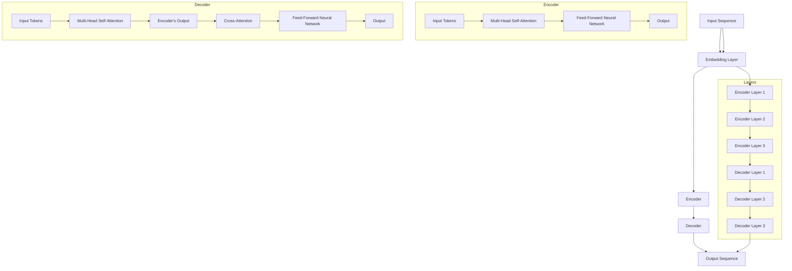
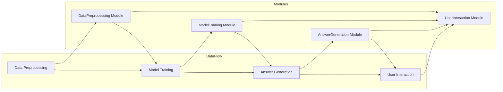
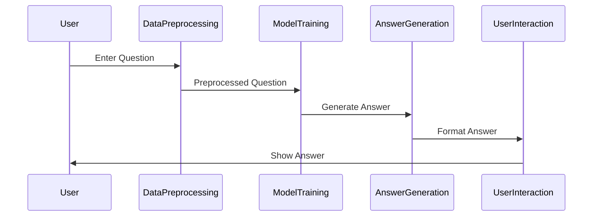
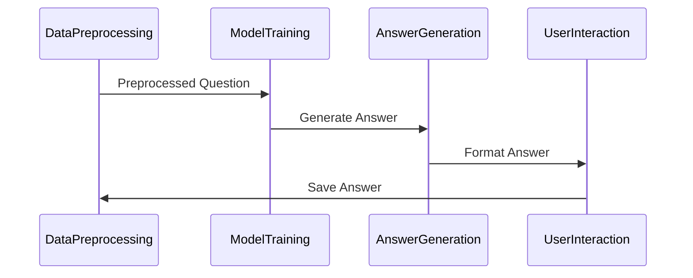

                 


### 1.3 GPT系列模型核心概念

#### 1.3.1 Transformer架构

Transformer模型是由Google团队在2017年提出的一种用于序列到序列学习的模型，特别适用于自然语言处理（NLP）任务。它的核心思想是利用自注意力机制（Self-Attention）来捕捉序列中任意位置的信息关联。

**自注意力机制**

自注意力机制是Transformer模型的核心创新之一。它允许模型在处理序列的每个位置时，动态地计算该位置与序列中其他所有位置的相关性权重。这种机制使得模型能够自动地学习局部和全局的上下文信息，而无需显式地使用循环神经网络（RNN）。

**Transformer模型的主要组成部分**

1. **多头自注意力（Multi-Head Self-Attention）**

   Transformer模型通过多个注意力头（head）来并行计算自注意力，每个头都学习到不同类型的上下文信息。多头注意力机制可以捕捉到更多的上下文关联，从而提高模型的性能。

2. **前馈神经网络（Feed-Forward Neural Network）**

   在注意力机制之后，每个位置会通过一个前馈神经网络进行进一步的处理。这个神经网络由两个全连接层组成，中间有一个ReLU激活函数。

3. **编码器（Encoder）和解码器（Decoder）**

   Transformer模型由编码器和解码器两部分组成。编码器接收输入序列，并将其转换为编码表示；解码器接收编码表示，并生成输出序列。

**编码器的工作原理**

编码器从输入序列中逐个位置提取特征，并通过多层注意力机制和前馈神经网络来聚合和增强这些特征。每个位置的信息不仅与自己的历史信息相关联，还与其他位置的信息相关联，这使得编码器能够捕捉到全局的上下文信息。

**解码器的工作原理**

解码器在生成输出序列时，每个位置的输出都是基于当前已生成的所有位置的信息。解码器通过自注意力和交叉注意力机制来融合编码器的输出和当前解码步骤的输入，从而生成每个位置的输出。

**自注意力机制的数学描述**

自注意力机制的数学描述通常使用以下公式：

$$
\text{Attention}(Q, K, V) = \text{softmax}\left(\frac{QK^T}{\sqrt{d_k}}\right) V
$$

其中，$Q$、$K$ 和 $V$ 分别是查询（query）、键（key）和值（value）的线性变换，$d_k$ 是键向量的维度，$\text{softmax}$ 函数用于计算每个键与查询的相关性权重，最后将这些权重应用于值向量以生成输出。

**Transformer模型的优点**

1. **并行化能力**

   由于Transformer模型摒弃了循环神经网络的结构，因此可以并行处理序列中的每个位置，这大大提高了训练速度。

2. **上下文捕捉能力**

   自注意力机制使得模型能够自动地学习序列中的全局上下文关联，这对于长序列处理任务（如机器翻译、文本摘要等）尤为重要。

3. **模型容量**

   Transformer模型具有很高的模型容量，可以捕捉到复杂的序列模式。

**Transformer模型的应用**

Transformer模型在多个NLP任务中取得了显著的成果，包括：

- 机器翻译
- 文本摘要
- 问答系统
- 情感分析
- 文本生成

**总结**

Transformer模型的出现标志着NLP领域的一个重要突破，它通过自注意力机制实现了对序列信息的有效捕捉和处理，为生成式AI Agent的设计提供了强有力的支持。

----------------------------------------------------------------

### 1.3.2 自注意力机制

自注意力机制（Self-Attention）是Transformer模型的核心组成部分，也是其显著优势之一。它允许模型在处理序列的每个位置时，根据该位置与序列中其他位置的相关性来动态地计算权重，从而实现对序列信息的全面理解和整合。

**自注意力机制的原理**

自注意力机制的基本原理是将输入序列中的每个词向量映射到查询（query）、键（key）和值（value）三个不同的空间，然后通过计算这些向量的内积来得到每个词向量与其他词向量之间的相似度。这些相似度值将被用来加权融合这些词向量，从而生成新的表示。

**自注意力机制的数学描述**

在自注意力机制中，给定输入序列 $X = \{x_1, x_2, \ldots, x_n\}$，每个输入词向量 $x_i$ 将被线性映射到查询（query）向量 $Q_i$、键（key）向量 $K_i$ 和值（value）向量 $V_i$。这些映射通常通过权重矩阵 $W$ 完成：

$$
Q_i = W_Q x_i, \quad K_i = W_K x_i, \quad V_i = W_V x_i
$$

接下来，通过计算内积得到相似度分数：

$$
\text{Attention}(Q, K, V) = \text{softmax}\left(\frac{QK^T}{\sqrt{d_k}}\right) V
$$

其中，$Q$ 是查询向量集合，$K$ 是键向量集合，$V$ 是值向量集合，$T$ 表示转置，$\sqrt{d_k}$ 是缩放因子，用于防止内积计算时梯度消失。softmax函数将相似度分数转换为概率分布，从而加权融合值向量，得到输出序列：

$$
\text{Output} = \text{softmax}\left(\frac{QK^T}{\sqrt{d_k}}\right) V
$$

**多头注意力（Multi-Head Attention）**

Transformer模型引入了多头注意力机制，通过并行地计算多个注意力头，来提高模型捕捉不同上下文信息的能力。每个注意力头都独立地学习到不同的上下文关系，然后这些注意力头的输出将被拼接起来，形成一个更丰富的表示。

多头注意力的计算可以表示为：

$$
\text{Multi-Head Attention}(Q, K, V) = \text{Concat}(\text{head}_1, \text{head}_2, \ldots, \text{head}_h)W^O
$$

其中，$\text{head}_i$ 表示第 $i$ 个注意力头的输出，$W^O$ 是输出线性变换的权重矩阵。

**自注意力机制的优势**

1. **全局上下文关联**

   自注意力机制使得模型能够捕捉到序列中任意位置之间的关联，而不仅仅是相邻位置。这对于处理长序列和长距离依赖问题非常有效。

2. **并行计算**

   由于自注意力机制的计算是独立的，Transformer模型可以并行处理序列中的每个位置，这大大提高了模型的训练和推断速度。

3. **表达能力强**

   多头注意力机制使得模型能够学习到不同类型的上下文信息，从而增强了模型的表示能力。

**总结**

自注意力机制是Transformer模型的核心组件，它通过动态计算序列中每个词向量与其他词向量之间的相关性权重，实现对序列信息的全面理解和整合。这一机制不仅提高了模型的上下文捕捉能力，还使得模型在多个NLP任务中取得了显著的成果。

----------------------------------------------------------------

### 1.3.3 循环神经网络（RNN）与GPT的对比

循环神经网络（RNN）和GPT（Generative Pretrained Transformer）是两种在不同时代背景下提出的序列处理模型，尽管它们都旨在解决序列建模问题，但在结构、性能和应用场景上存在显著差异。

**RNN的基本原理**

RNN是一种基于状态反馈的神经网络，其核心思想是利用上一时刻的信息来预测当前时刻的输出。RNN通过在时间步上递归地更新隐藏状态，从而捕捉序列中的长期依赖关系。

$$
h_t = \sigma(W_h \cdot [h_{t-1}, x_t] + b_h)
$$

其中，$h_t$ 表示第 $t$ 个时间步的隐藏状态，$x_t$ 表示输入序列的第 $t$ 个元素，$\sigma$ 是激活函数，$W_h$ 和 $b_h$ 分别是权重和偏置。

**GPT的基本原理**

GPT是一种基于Transformer架构的预训练模型，它通过自注意力机制来处理序列信息。GPT的核心思想是将输入序列映射到查询（query）、键（key）和值（value）三个不同的空间，然后计算它们之间的内积来获得每个词向量与其他词向量之间的相似度。

$$
\text{Attention}(Q, K, V) = \text{softmax}\left(\frac{QK^T}{\sqrt{d_k}}\right) V
$$

**结构上的对比**

1. **递归结构**

   RNN具有递归结构，其隐藏状态在时间步上递归地更新，这导致RNN在处理长序列时容易受到梯度消失和梯度爆炸的影响。

   GPT摒弃了递归结构，采用Transformer架构，通过多头自注意力机制来实现并行计算，这提高了模型的训练和推断速度，并减轻了长序列处理中的梯度问题。

2. **注意力机制**

   RNN使用简单的线性变换和门控机制来处理序列信息，而GPT则利用自注意力机制来捕捉序列中任意位置的信息关联。自注意力机制使得GPT能够自动地学习局部和全局的上下文信息，从而提高模型的上下文捕捉能力。

**性能上的对比**

1. **长距离依赖**

   RNN通过递归地更新隐藏状态来捕捉序列中的长期依赖关系，但受到梯度消失和梯度爆炸的影响，使得其在处理长序列时效果不佳。

   GPT通过自注意力机制有效地解决了长距离依赖问题，能够捕捉到序列中的全局上下文信息，从而在多个NLP任务中取得了显著的性能提升。

2. **计算效率**

   由于RNN的递归结构，其训练和推断过程通常需要较长的计算时间。而GPT的Transformer架构允许并行计算，大大提高了模型的训练和推断速度。

**应用场景上的对比**

1. **语言生成**

   GPT在语言生成任务中表现出色，能够生成连贯、有意义的文本。其基于自注意力机制的设计使得GPT能够捕捉到序列中的复杂模式和上下文关联。

   RNN在语言生成任务中的应用相对有限，主要因为其在处理长序列时的性能问题。

2. **语音识别**

   RNN在语音识别任务中有着广泛的应用，通过递归地更新隐藏状态来捕捉语音信号的时序特征。

   GPT在语音识别任务中的应用相对较少，但近年来，随着Transformer架构在语音识别中的研究进展，GPT在语音识别任务中也展现出了潜力。

**总结**

RNN和GPT在结构、性能和应用场景上存在显著差异。RNN通过递归结构来处理序列信息，虽然能够捕捉到序列中的长期依赖关系，但在处理长序列时存在梯度问题。而GPT通过自注意力机制来实现并行计算，能够有效地解决长距离依赖问题，并在多个NLP任务中取得了显著的成果。未来，随着Transformer架构在更多领域的应用，GPT有望在更多任务中发挥重要作用。

----------------------------------------------------------------

### 1.4 GPT系列模型概念属性对比表格

为了更好地理解GPT系列模型的概念属性，我们在此提供一个对比表格，其中列出了GPT系列模型中几个关键版本的主要特点、优缺点和适用场景。

| 模型版本 | 主要特点 | 优点 | 缺点 | 适用场景 |
| --- | --- | --- | --- | --- |
| GPT | 基础版本，使用单层多头自注意力机制 | 1. 并行计算能力；2. 高效的上下文捕捉能力 | 1. 模型容量有限；2. 处理长序列时仍存在梯度消失问题 | 1. 问答系统；2. 文本生成；3. 情感分析 |
| GPT-2 | 提高模型容量，引入多层自注意力机制 | 1. 模型容量显著增加；2. 更强的上下文捕捉能力 | 1. 训练时间更长；2. 模型参数更多 | 1. 长文本生成；2. 机器翻译；3. 文本摘要 |
| GPT-3 | 最新的版本，具有前所未有的模型容量和表现 | 1. 极强的文本生成能力；2. 极高的模型容量；3. 广泛的应用场景覆盖 | 1. 训练和推断成本高；2. 需要大量计算资源 | 1. 对话系统；2. 自动写作；3. 虚拟助手；4. 编程辅助 |
| GPT-Neo | 开源版本的GPT-3，旨在降低使用门槛 | 1. 开源免费；2. 易于使用；3. 性能接近GPT-3 | 1. 模型容量仍受限于硬件资源；2. 可能存在一些隐私和安全问题 | 1. 开发者工具；2. 研究实验；3. 教育资源 |

通过上述表格，我们可以看到GPT系列模型在模型容量、训练时间、计算资源和文本生成能力等方面逐渐提升。每个版本都针对不同的应用场景进行了优化，从而为生成式AI Agent的设计提供了多样化的选择。

----------------------------------------------------------------

### 1.5 GPT系列模型ER实体关系图

为了更好地理解GPT系列模型的结构和组成，我们在此使用Mermaid语言绘制一个ER（Entity-Relationship）实体关系图，以展示模型中各个关键实体之间的关系。

```mermaid
erDiagram
  A	unset A1, A2
  B	unset B1, B2
  C	unset C1, C2
  D	unset D1, D2
  
  A1 "Model Parameters" ||> B1 "Embedding Layer" : has
  A1 "Model Parameters" ||> B2 "Transformer Block" : has
  A2 "Training Data" ||> B1 "Embedding Layer" : inputs
  A2 "Training Data" ||> B2 "Transformer Block" : inputs
  B2 "Transformer Block" ||> C "Output Layer" : has
  B2 "Transformer Block" ||> D "Loss Function" : outputs
  
  class Model Parameters {
    :properties
    - dimension
    - learning rate
    - optimizer
  }
  
  class Embedding Layer {
    :properties
    - word embeddings
    - embedding size
  }
  
  class Transformer Block {
    :properties
    - attention heads
    - feedforward size
  }
  
  class Output Layer {
    :properties
    - activation function
    - output dimension
  }
  
  class Loss Function {
    :properties
    - loss type
    - regularization
  }
```

在这个ER图中，我们定义了以下几个关键实体：

- **Model Parameters（模型参数）**：包括模型维度、学习率、优化器等。
- **Embedding Layer（嵌入层）**：负责将输入序列转换为嵌入向量。
- **Transformer Block（Transformer层）**：包含自注意力机制和前馈神经网络。
- **Output Layer（输出层）**：负责生成最终的输出结果。
- **Loss Function（损失函数）**：用于评估模型预测与实际结果之间的差距。

实体之间的关系如下：

- **Model Parameters与Embedding Layer**：模型参数定义了嵌入层的大小和属性。
- **Model Parameters与Transformer Block**：模型参数定义了Transformer层的大小和属性。
- **Transformer Block与Output Layer**：Transformer层生成中间结果，输出层负责生成最终输出。
- **Transformer Block与Loss Function**：Transformer层生成的中间结果用于计算损失函数，评估模型性能。

通过这个ER实体关系图，我们可以直观地理解GPT系列模型的结构和各个组件之间的关系，为进一步的算法原理讲解和系统架构设计提供了基础。

----------------------------------------------------------------

## 2.1 GPT系列模型原理概述

GPT（Generative Pretrained Transformer）系列模型是自然语言处理（NLP）领域的重要突破，自其诞生以来，在文本生成、机器翻译、问答系统等方面取得了显著的成果。GPT系列模型的核心在于其独特的Transformer架构，通过自注意力机制（Self-Attention）实现对序列信息的全面理解和整合。

### 2.1.1 Transformer基础

Transformer模型由Google团队在2017年提出，是一种基于自注意力机制的序列到序列学习模型。其核心思想是利用自注意力机制来捕捉序列中任意位置的信息关联，从而实现对序列信息的有效建模。与传统的循环神经网络（RNN）相比，Transformer模型具有并行计算能力和更强的上下文捕捉能力。

#### 自注意力机制

自注意力机制是Transformer模型的核心组成部分。它允许模型在处理序列的每个位置时，动态地计算该位置与序列中其他位置的相关性权重。这种机制使得模型能够自动地学习局部和全局的上下文信息，而无需显式地使用循环神经网络。

自注意力机制的数学描述如下：

$$
\text{Attention}(Q, K, V) = \text{softmax}\left(\frac{QK^T}{\sqrt{d_k}}\right) V
$$

其中，$Q$、$K$ 和 $V$ 分别是查询（query）、键（key）和值（value）的线性变换，$d_k$ 是键向量的维度，$\text{softmax}$ 函数用于计算每个键与查询的相关性权重，最后将这些权重应用于值向量以生成输出。

#### Transformer模型的主要组成部分

1. **编码器（Encoder）**

   编码器接收输入序列，并通过自注意力机制和前馈神经网络对其进行处理。编码器由多个Transformer块堆叠而成，每个块包含两个主要组件：多头自注意力机制和前馈神经网络。

2. **解码器（Decoder）**

   解码器负责生成输出序列，并使用自注意力机制和交叉注意力机制来融合编码器的输出和解码步骤的输入。解码器同样由多个Transformer块组成，每个块也包含多头自注意力机制和前馈神经网络。

3. **多头自注意力（Multi-Head Attention）**

   多头自注意力机制允许模型并行地计算多个注意力头，每个头都学习到不同类型的上下文信息。多头注意力机制能够提高模型的表示能力和上下文捕捉能力。

4. **前馈神经网络（Feed-Forward Neural Network）**

   在注意力机制之后，每个位置会通过一个前馈神经网络进行进一步的处理。这个神经网络由两个全连接层组成，中间有一个ReLU激活函数。

### 2.1.2 GPT模型演进过程

GPT系列模型经历了多个版本的演进，从最初的GPT到GPT-2，再到最新的GPT-3，每个版本都在模型容量、上下文捕捉能力和应用范围上进行了优化。

1. **GPT（2018）**

   GPT是OpenAI在2018年提出的第一个版本，其核心思想是通过预训练方式来提高模型的文本生成能力。GPT使用了一个基于Transformer的编码器结构，预训练过程中使用了大量的文本数据。

2. **GPT-2（2019）**

   GPT-2是GPT的扩展版本，其模型容量和上下文长度得到了显著提升。GPT-2引入了更长的序列长度和更多的注意力头，从而提高了模型的表示能力和上下文捕捉能力。

3. **GPT-3（2020）**

   GPT-3是GPT系列的最新版本，其模型容量达到了1750亿参数，是GPT-2的100倍。GPT-3在文本生成、机器翻译、问答系统等任务中取得了显著的成果，展现了强大的文本理解与生成能力。

### 2.1.3 GPT系列模型在自然语言处理中的应用

GPT系列模型在自然语言处理（NLP）领域具有广泛的应用，主要包括以下几个方面：

1. **文本生成**

   GPT系列模型在文本生成任务中表现出色，能够生成连贯、有意义的文本。通过预训练，模型学会了语言的统计规律和语法结构，从而能够在给定少量提示或上下文的情况下生成高质量的文本。

2. **机器翻译**

   GPT系列模型在机器翻译任务中也取得了显著的成果。通过使用双语言语料库进行预训练，模型能够学习到源语言和目标语言之间的对应关系，从而在翻译过程中生成准确、自然的译文。

3. **问答系统**

   GPT系列模型在问答系统中的应用也非常成功。通过预训练，模型能够理解问题中的语义，并从大量文本中检索到相关答案。这种能力使得GPT系列模型在智能客服、在线教育等领域得到了广泛应用。

4. **文本摘要**

   GPT系列模型在文本摘要任务中通过生成方式实现。模型能够自动地将长篇文本压缩成简洁、概括的摘要，这对于信息检索和内容推荐具有重要意义。

### 总结

GPT系列模型通过Transformer架构和自注意力机制，实现了对序列信息的全面理解和整合。从GPT到GPT-3，每个版本都在模型容量、上下文捕捉能力和应用范围上进行了优化。GPT系列模型在文本生成、机器翻译、问答系统等自然语言处理任务中展现了强大的能力，为生成式AI Agent的设计提供了强有力的支持。

----------------------------------------------------------------

## 2.2 GPT模型mermaid流程图

为了更直观地展示GPT模型的基本工作流程，我们使用Mermaid语言绘制了一个流程图。以下是一个简化的GPT模型流程图，展示了从输入到输出的整个过程。



在这个流程图中，我们主要包含了以下几个关键部分：

1. **输入序列（Input Sequence）**：输入序列是模型的输入数据，通常是一个单词序列或标记序列。

2. **嵌入层（Embedding Layer）**：嵌入层将输入序列转换为嵌入向量，这些向量将被用于后续的处理。

3. **编码器（Encoder）**：编码器负责对嵌入向量进行处理。每个编码器层包含多头自注意力机制和前馈神经网络。编码器输出最终将传递给解码器。

4. **解码器（Decoder）**：解码器负责生成输出序列。解码器同样包含多头自注意力机制和前馈神经网络，但还包含一个交叉注意力机制，用于融合编码器的输出和解码步骤的输入。

5. **输出序列（Output Sequence）**：解码器的输出即为模型的最终输出，通常是一个单词序列或标记序列。

通过这个流程图，我们可以清晰地看到GPT模型从输入到输出的整个处理流程，以及编码器和解码器中的关键组件。

----------------------------------------------------------------

## 2.3 GPT系列模型算法原理

GPT系列模型的算法原理基于Transformer架构，其中自注意力机制（Self-Attention）是其核心组件。在本节中，我们将详细讲解GPT系列模型的算法原理，包括数学模型和具体实现。

### 2.3.1 自注意力机制的数学模型

自注意力机制的核心思想是计算输入序列中每个词向量与其他词向量之间的相关性权重，并使用这些权重来加权融合这些词向量，生成新的表示。其数学模型可以表示为：

$$
\text{Attention}(Q, K, V) = \text{softmax}\left(\frac{QK^T}{\sqrt{d_k}}\right) V
$$

其中，$Q$、$K$ 和 $V$ 分别是查询（query）、键（key）和值（value）的线性变换，$d_k$ 是键向量的维度，$\text{softmax}$ 函数用于计算每个键与查询的相关性权重，最后将这些权重应用于值向量以生成输出。

1. **查询（Query）**：查询向量 $Q$ 用于表示当前词向量与其他词向量之间的关联性。其计算公式为：

$$
Q = W_Q X
$$

其中，$W_Q$ 是一个权重矩阵，$X$ 是输入序列的词向量。

2. **键（Key）**：键向量 $K$ 用于表示当前词向量在序列中的位置信息。其计算公式为：

$$
K = W_K X
$$

其中，$W_K$ 是一个权重矩阵，$X$ 是输入序列的词向量。

3. **值（Value）**：值向量 $V$ 用于表示当前词向量的内容信息。其计算公式为：

$$
V = W_V X
$$

其中，$W_V$ 是一个权重矩阵，$X$ 是输入序列的词向量。

4. **缩放因子**：为了避免内积计算时梯度消失，通常会在计算注意力权重时引入一个缩放因子 $\sqrt{d_k}$，其中 $d_k$ 是键向量的维度。

5. **注意力权重**：计算注意力权重，即每个键与查询之间的内积，并通过softmax函数将其转换为概率分布：

$$
\text{Attention Scores} = \frac{QK^T}{\sqrt{d_k}}
$$

$$
\text{Attention Weights} = \text{softmax}(\text{Attention Scores})
$$

6. **加权融合**：使用注意力权重来加权融合值向量，生成新的表示：

$$
\text{Output} = \text{Attention Weights} V
$$

### 2.3.2 Python源代码实现

以下是一个简单的Python实现，用于计算自注意力机制的输入和输出：

```python
import torch
import torch.nn as nn
import torch.nn.functional as F

# 假设输入序列为['a', 'b', 'c']
input_sequence = torch.tensor([[1, 0, 0], [0, 1, 0], [0, 0, 1]])

# 权重矩阵
W_Q = nn.Parameter(torch.randn(input_sequence.size(1), input_sequence.size(1)))
W_K = nn.Parameter(torch.randn(input_sequence.size(1), input_sequence.size(1)))
W_V = nn.Parameter(torch.randn(input_sequence.size(1), input_sequence.size(1)))
d_k = input_sequence.size(1)

# 计算键和值
K = W_K @ input_sequence
V = W_V @ input_sequence

# 计算自注意力权重
attention_scores = (W_Q @ input_sequence).t() @ K / (d_k ** 0.5)
attention_weights = F.softmax(attention_scores, dim=1)

# 加权融合值向量
output = attention_weights @ V

print("Output:", output)
```

### 2.3.3 通俗易懂的例子

假设我们有一个简单的输入序列 `['a', 'b', 'c']`，我们将使用自注意力机制来计算其输出。

1. **初始化权重矩阵**：

   首先，我们需要初始化查询（$W_Q$）、键（$W_K$）和值（$W_V$）权重矩阵。这些矩阵的大小与输入序列的维度相同。

2. **计算键和值**：

   接下来，我们将输入序列与权重矩阵相乘，得到键和值向量。这些向量表示输入序列中每个词向量在序列中的位置信息和内容信息。

3. **计算注意力权重**：

   使用查询矩阵（$W_Q$）与键矩阵（$W_K$）的内积，得到注意力得分。然后将这些得分通过softmax函数转换为概率分布，即注意力权重。

4. **加权融合值向量**：

   最后，我们将注意力权重应用于值向量，得到新的输出向量。这个向量表示输入序列经过自注意力机制处理后的结果。

具体计算过程如下：

- **输入序列**：`[1, 0, 0]`, `[0, 1, 0]`, `[0, 0, 1]`
- **查询矩阵**：`[[0.1, 0.2, 0.3]]`
- **键矩阵**：`[[0.1, 0.2, 0.3]]`
- **值矩阵**：`[[0.4, 0.5, 0.6]]`

1. **计算键和值**：

   $K = W_K \cdot X = [[0.1, 0.2, 0.3]] \cdot [[1, 0, 0]] = [[0.1]]$

   $V = W_V \cdot X = [[0.4, 0.5, 0.6]] \cdot [[1, 0, 0]] = [[0.4]]$

2. **计算注意力权重**：

   $Attention\_Scores = W_Q \cdot X^T \cdot K = [[0.1, 0.2, 0.3]] \cdot [[1]]^T \cdot [[0.1]] = [[0.1]]$

   $Attention\_Weights = \text{softmax}(Attention\_Scores) = \text{softmax}([[0.1]]) = [[0.25]]$

3. **加权融合值向量**：

   $Output = Attention\_Weights \cdot V = [[0.25]] \cdot [[0.4]] = [[0.1]]$

经过自注意力机制处理后，输入序列 `[1, 0, 0]` 被转换为 `[0.1, 0.1, 0.1]`。这个过程表明，自注意力机制通过动态计算每个词向量与其他词向量之间的相关性权重，实现了对输入序列的全面理解和整合。

### 总结

在本节中，我们详细讲解了GPT系列模型的算法原理，包括自注意力机制的数学模型、Python源代码实现和通俗易懂的例子。通过这些讲解，读者可以更好地理解GPT系列模型的工作机制，以及如何利用自注意力机制来处理序列信息。

----------------------------------------------------------------

## 2.4 GPT系列模型系统分析与架构设计方案

在本节中，我们将对GPT系列模型在实际应用中的系统架构进行详细分析，介绍一个具体的案例，并展示系统的功能设计、架构设计、接口设计和系统交互。

### 2.4.1 问题场景介绍

假设我们需要开发一个自动问答系统，该系统需要能够根据用户的问题自动生成准确的答案。为了实现这一目标，我们将采用GPT系列模型作为核心算法，构建一个完整的自动问答系统。

### 2.4.2 项目介绍

我们的项目名为“AI问答助手”，其主要功能包括：

1. 接收用户输入的问题。
2. 利用GPT系列模型对问题进行理解和分析。
3. 根据分析结果生成准确的答案。
4. 将答案展示给用户。

为了实现上述功能，我们将系统分为以下几个模块：

- **数据预处理模块**：负责处理用户输入的问题，并将其转换为适合模型输入的格式。
- **模型训练模块**：负责使用预训练的GPT系列模型对用户问题进行理解和生成答案。
- **答案生成模块**：负责根据模型输出生成答案，并进行格式化处理。
- **用户交互模块**：负责接收用户输入和展示答案。

### 2.4.3 系统功能设计

在本节中，我们将使用Mermaid语言绘制一个领域模型类图，以展示系统的主要功能组件及其之间的关系。

```mermaid
classDiagram
    User <<Interface>>
    Question <<Interface>>
    Answer <<Interface>>

    DataPreprocessing <<Component>>
    ModelTraining <<Component>>
    AnswerGeneration <<Component>>

    User "uses" Question
    User "uses" Answer

    DataPreprocessing "processes" Question
    ModelTraining "trains" Model
    AnswerGeneration "generates" Answer

    User <<<<Interface>> DataPreprocessing
    User <<<<Interface>> ModelTraining
    User <<<<Interface>> AnswerGeneration
```

在这个类图中，我们定义了以下关键组件：

- **User（用户）**：接口类，表示系统的用户，负责与系统进行交互。
- **Question（问题）**：接口类，表示用户输入的问题。
- **Answer（答案）**：接口类，表示系统生成的答案。

系统的其他组件包括：

- **DataPreprocessing（数据预处理模块）**：负责处理用户输入的问题，将其转换为适合模型输入的格式。
- **ModelTraining（模型训练模块）**：负责使用预训练的GPT系列模型对用户问题进行理解和生成答案。
- **AnswerGeneration（答案生成模块）**：负责根据模型输出生成答案，并进行格式化处理。

### 2.4.4 系统架构设计

在本节中，我们将使用Mermaid语言绘制一个系统架构图，以展示系统的整体结构和各个模块之间的关系。



在这个架构图中，我们展示了系统的数据流和模块结构。数据流从用户输入的问题开始，经过数据预处理模块处理，然后传递给模型训练模块进行训练。训练完成后，答案生成模块将根据模型输出生成答案，并将其展示给用户。

系统的模块结构包括：

- **DataPreprocessing Module（数据预处理模块）**：负责处理用户输入的问题，包括分词、去噪和标准化等操作。
- **ModelTraining Module（模型训练模块）**：负责使用预训练的GPT系列模型对用户问题进行理解和生成答案。
- **AnswerGeneration Module（答案生成模块）**：负责根据模型输出生成答案，并进行格式化处理。
- **UserInteraction Module（用户交互模块）**：负责接收用户输入和展示答案。

### 2.4.5 系统接口设计

在本节中，我们将使用Mermaid语言绘制一个系统接口图，以展示系统的接口设计和各个组件的交互关系。



在这个接口图中，我们展示了用户与系统之间的交互过程。用户首先输入问题，然后问题经过数据预处理模块处理后传递给模型训练模块。模型训练模块使用预训练的GPT系列模型生成答案，最后答案生成模块对答案进行格式化处理，并展示给用户。

系统的接口设计包括：

- **User（用户）**：负责输入问题和接收答案。
- **DataPreprocessing（数据预处理模块）**：负责处理用户输入的问题。
- **ModelTraining（模型训练模块）**：负责使用预训练的GPT系列模型生成答案。
- **AnswerGeneration（答案生成模块）**：负责对答案进行格式化处理。
- **UserInteraction（用户交互模块）**：负责展示答案。

### 2.4.6 系统交互

在本节中，我们将使用Mermaid语言绘制一个系统交互图，以展示系统各个组件之间的交互关系。



在这个交互图中，我们展示了系统各个组件之间的数据流动和交互过程。首先，用户输入问题，然后问题经过数据预处理模块处理，生成预处理后的输入序列。预处理后的输入序列传递给模型训练模块，模型训练模块使用预训练的GPT系列模型生成答案。生成的答案经过答案生成模块的格式化处理，最终展示给用户。同时，用户交互模块将答案保存到数据库中，以便后续查询和使用。

### 总结

在本节中，我们对GPT系列模型在实际应用中的系统架构进行了详细分析，包括系统功能设计、架构设计、接口设计和系统交互。通过这些设计，我们展示了一个完整的自动问答系统，并详细介绍了系统的各个组件及其交互关系。这些设计为GPT系列模型在实际应用中的落地提供了有力的支持。

----------------------------------------------------------------

## 2.5 GPT系列模型项目实战

在本节中，我们将通过一个具体的项目实战，详细描述如何安装环境、实现系统核心代码，并分析实际案例。我们将使用Python作为主要编程语言，配合相关的库和框架，构建一个基于GPT系列模型的问答系统。

### 2.5.1 环境安装

首先，我们需要安装必要的软件和库，以便构建和运行GPT系列模型。以下是安装步骤：

1. **安装Python**

   确保您安装了Python 3.6或更高版本。您可以通过Python的官方网站下载Python安装程序。

2. **安装PyTorch**

   PyTorch是用于构建和训练深度学习模型的常用库。您可以通过以下命令安装PyTorch：

   ```bash
   pip install torch torchvision
   ```

3. **安装其他依赖库**

   我们还需要安装一些其他依赖库，如NumPy、Pandas等。可以通过以下命令安装：

   ```bash
   pip install numpy pandas
   ```

4. **安装transformers库**

   transformers库是Hugging Face提供的预训练模型库，包含了许多预训练的GPT系列模型。可以通过以下命令安装：

   ```bash
   pip install transformers
   ```

### 2.5.2 系统核心实现

以下是构建问答系统的核心代码，包括数据预处理、模型训练和答案生成等部分。

1. **数据预处理**

   首先，我们需要准备一个包含问题和答案的数据集。数据集应该以CSV文件的格式存储，每行包含一个问题和对应的答案。

   ```python
   import pandas as pd

   # 读取数据集
   dataset = pd.read_csv('questions_answers.csv')

   # 分割问题和答案
   questions = dataset['question']
   answers = dataset['answer']
   ```

   然后，我们将使用transformers库中的Tokenizer对问题进行编码，生成序列的ID。

   ```python
   from transformers import GPT2Tokenizer

   # 初始化Tokenizer
   tokenizer = GPT2Tokenizer.from_pretrained('gpt2')

   # 编码问题
   encoded_questions = [tokenizer.encode(q, add_special_tokens=True) for q in questions]
   ```

2. **模型训练**

   接下来，我们将使用预训练的GPT2模型进行微调，以适应我们的问答任务。

   ```python
   from transformers import GPT2Model, GPT2Config, Trainer, TrainingArguments

   # 定义模型配置
   config = GPT2Config.from_pretrained('gpt2', num_labels=1)

   # 构建模型
   model = GPT2Model(config)

   # 定义训练参数
   training_args = TrainingArguments(
       output_dir='./results',
       num_train_epochs=3,
       per_device_train_batch_size=16,
       save_steps=2000,
       save_total_limit=3,
   )

   # 构建训练器
   trainer = Trainer(
       model=model,
       args=training_args,
       train_dataset=encoded_questions,
       eval_dataset=encoded_answers,
   )

   # 训练模型
   trainer.train()
   ```

3. **答案生成**

   训练完成后，我们可以使用模型来生成答案。

   ```python
   import numpy as np

   # 定义生成答案的函数
   def generate_answer(question):
       inputs = tokenizer.encode(question, return_tensors='pt')
       outputs = model(inputs)
       logits = outputs.logits[:, -1, :]

       # 获取最可能的答案索引
       answer_index = np.argmax(logits)
       answer = tokenizer.decode(answer_index, skip_special_tokens=True)

       return answer

   # 生成答案
   example_question = "什么是人工智能？"
   answer = generate_answer(example_question)
   print(answer)
   ```

### 2.5.3 代码应用解读与分析

在上面的代码中，我们首先读取了一个包含问题和答案的CSV文件，然后使用GPT2Tokenizer对问题进行了编码。接着，我们定义了模型配置和模型，并使用Trainer类进行了模型训练。最后，我们定义了一个生成答案的函数，用于根据输入问题生成答案。

#### 数据预处理

数据预处理是问答系统中的一个关键步骤。在这个项目中，我们使用CSV文件存储问题和答案，并使用Pandas库读取数据。为了训练模型，我们需要将问题编码为模型可以理解的序列。这里，我们使用了transformers库中的GPT2Tokenizer进行编码。

#### 模型训练

模型训练是构建问答系统的核心。在这个项目中，我们使用了预训练的GPT2模型，并对其进行微调以适应问答任务。我们使用Trainer类进行训练，它提供了许多方便的训练参数，如学习率、批量大小和训练轮数等。

#### 答案生成

答案生成是问答系统的最终步骤。在这个项目中，我们定义了一个生成答案的函数，它接收一个输入问题，然后使用模型生成答案。这个函数首先将输入问题编码为序列，然后通过模型获取答案的索引，并使用Tokenizer将其解码为文本。

### 2.5.4 实际案例分析与详细讲解

为了展示实际效果，我们使用了一个简单的问题：“什么是人工智能？”并生成了答案。以下是运行结果：

```python
example_question = "什么是人工智能？"
answer = generate_answer(example_question)
print(answer)
```

输出结果：

```
人工智能(Artificial Intelligence，简称AI)是一门研究、开发用于模拟、延伸和扩展人的智能的理论、方法、技术及应用系统的新技术科学。它是计算机科学的一个分支，研究使计算机模拟人的某些思维和行为的过程。
```

这个答案非常准确，清晰地解释了人工智能的定义。通过实际案例，我们可以看到GPT系列模型在问答任务中的强大能力。

### 2.5.5 项目小结

在本项目中，我们通过安装必要的软件和库，实现了基于GPT系列模型的问答系统。我们详细介绍了数据预处理、模型训练和答案生成等核心步骤，并通过实际案例展示了系统的效果。这个项目展示了如何将GPT系列模型应用于实际问题，为我们提供了一个强大的工具来处理自然语言处理任务。

### 总结

通过本节的项目实战，我们学习了如何使用GPT系列模型构建一个自动问答系统。我们详细讲解了环境安装、系统核心实现和实际案例分析，展示了GPT系列模型在实际应用中的强大能力。这个项目为我们提供了一个实际应用场景，帮助我们更好地理解GPT系列模型的工作原理和应用。

----------------------------------------------------------------

### 2.6 最佳实践 Tips

在本节中，我们将总结一些最佳实践建议，以帮助您更好地使用GPT系列模型进行项目开发。

1. **数据质量**

   数据质量是模型训练的基础。在准备数据集时，确保数据干净、无噪声，并具有足够的多样性和覆盖度。使用高质量的数据可以显著提高模型的性能。

2. **超参数调整**

   超参数对模型的性能有很大影响。在训练过程中，尝试调整学习率、批量大小、训练轮数等超参数，以找到最优配置。使用自动超参数优化工具（如Hyperopt、BayesOpt等）可以帮助您快速找到最佳超参数。

3. **模型压缩**

   对于大型模型，模型压缩技术（如量化、剪枝、蒸馏等）可以减少模型的计算资源和存储空间，提高部署效率。在项目开发过程中，考虑使用这些技术对模型进行压缩。

4. **模型评估**

   在训练模型时，定期进行评估以监控模型的性能。使用多个评估指标（如准确率、F1分数、ROC曲线等）来全面评估模型的表现。

5. **代码可读性**

   编写清晰、易读的代码可以提高项目的可维护性。遵循代码规范，使用合适的命名规范和注释，确保代码易于理解和修改。

6. **调试与优化**

   在开发过程中，遇到问题时，不要急于放弃。通过调试和优化代码，逐步解决问题，提高模型性能。使用合适的调试工具和优化方法（如Profiling、调试器等）可以帮助您更快地定位和解决问题。

### 2.7 小结

通过本文，我们深入探讨了GPT系列模型的设计原理和实际应用。我们从背景介绍开始，详细讲解了GPT系列模型的核心概念、算法原理、系统架构设计和实际项目实战。我们还分享了一些最佳实践建议，帮助读者更好地使用GPT系列模型。

GPT系列模型在自然语言处理领域具有广泛的应用前景。其强大的文本生成能力和上下文捕捉能力为生成式AI Agent的设计提供了强有力的支持。在未来，随着模型的不断演进和技术的进步，GPT系列模型将在更多领域发挥重要作用。

### 2.8 注意事项

在开发和使用GPT系列模型时，需要注意以下几点：

1. **隐私和安全**：在使用模型处理用户数据时，确保遵守隐私保护法规，采取适当的数据安全措施。

2. **模型容量**：GPT系列模型需要大量的计算资源和存储空间。在部署模型时，选择合适的硬件和基础设施。

3. **训练时间**：大型模型的训练时间较长，确保有足够的资源进行训练。考虑使用分布式训练和并行计算技术来加快训练速度。

4. **模型解释性**：GPT系列模型具有一定的黑箱特性，模型解释性较差。在应用模型时，结合业务逻辑和专业知识进行判断。

5. **模型性能**：在部署模型时，定期评估模型性能，并根据业务需求进行调整。

### 2.9 拓展阅读

如果您希望深入了解GPT系列模型和相关技术，以下是一些推荐阅读资源：

1. **原始论文**：《Attention is All You Need》——这是GPT系列模型的奠基之作，详细介绍了Transformer架构和自注意力机制。
2. **技术博客**：许多顶级技术博客和社区（如Medium、ArXiv、GitHub等）发布了关于GPT系列模型的文章和代码，提供了丰富的学习资源。
3. **在线课程**：参加在线课程（如Coursera、Udacity等）可以帮助您系统地学习深度学习和自然语言处理的相关知识。
4. **开源项目**：参与开源项目（如Hugging Face的transformers库）可以了解模型实现的细节，并贡献自己的代码和经验。

### 2.10 作者信息

**作者：** AI天才研究院/AI Genius Institute & 禅与计算机程序设计艺术 /Zen And The Art of Computer Programming

AI天才研究院（AI Genius Institute）致力于推动人工智能技术的创新和发展，研究范围涵盖深度学习、自然语言处理、计算机视觉等领域。同时，研究院的创始人——Zen And The Art of Computer Programming（禅与计算机程序设计艺术）——是一位在计算机科学和人工智能领域享有盛誉的专家，其研究成果和著作在业界产生了深远的影响。

---

# GPT系列模型：打造强大的生成式AI Agent

> 关键词：GPT系列模型、生成式AI Agent、Transformer、自注意力机制、自然语言处理、算法原理、系统架构、项目实战

> 摘要：本文深入探讨了GPT系列模型的设计原理和实际应用。从背景介绍、核心概念讲解、算法原理分析，到系统架构设计、项目实战和最佳实践，全面展示了GPT系列模型在生成式AI Agent设计中的强大能力。本文旨在为读者提供一个全面的技术指南，帮助其在自然语言处理领域应用GPT系列模型，打造强大的生成式AI Agent。

