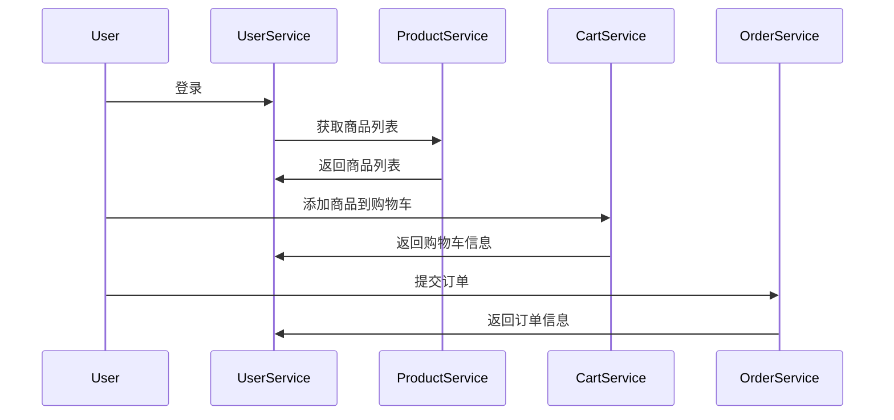
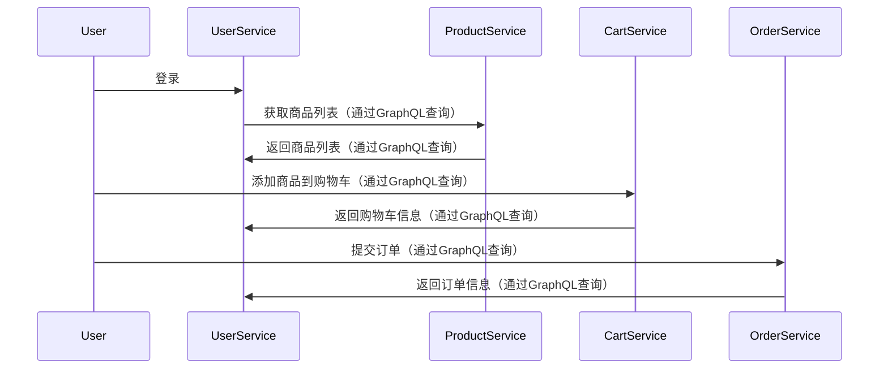
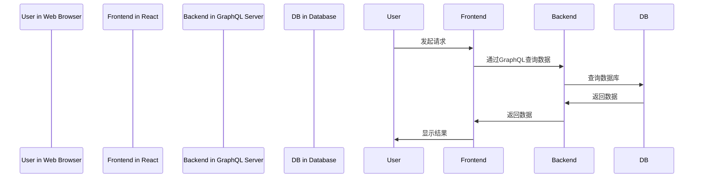

                 

# GraphQL：灵活高效的数据查询语言

## 关键词

- GraphQL
- 数据查询语言
- API
-RESTful
- 微服务
- 性能优化

## 摘要

本文旨在深入探讨GraphQL，一种灵活且高效的数据查询语言。我们将从其产生背景、核心概念、应用实例、高级特性、生态系统等方面进行详细讲解。通过阅读本文，读者将了解GraphQL的优势及其在各种场景下的应用方法，为开发高效、可扩展的API打下坚实基础。

## 第一部分：GraphQL基础

### 1.1 GraphQL概述

#### 1.1.1 产生背景与优势

GraphQL起源于Facebook，最初用于内部API的开发。随着其优势的逐渐显现，它逐渐被开源社区接受并广泛应用于各种场景。GraphQL的主要优势包括：

1. **灵活性**：允许客户端指定需要的数据，减少不必要的请求和响应。
2. **类型系统**：提供丰富的类型定义，增强代码的可读性和可维护性。
3. **查询优化**：通过查询合并和预取，提高数据查询的效率。
4. **易于集成**：支持多种编程语言和框架，便于与现有系统整合。

#### 1.1.2 GraphQL与RESTful API的比较

与传统的RESTful API相比，GraphQL具有以下区别：

| 特性         | GraphQL                     | RESTful API                   |
| ------------ | -------------------------- | ---------------------------- |
| 数据查询方式 | 客户端指定所需数据          | 服务器提供固定的数据结构      |
| 数据结构     | 一致、灵活的JSON格式        | 不一致、多样化的数据格式      |
| 性能         | 查询合并、预取，优化数据传输 | 可能存在多次请求和响应        |
| 可扩展性     | 支持自定义类型和字段       | 受限于RESTful架构的限制       |

#### 1.1.3 GraphQL的适用场景

GraphQL适用于以下场景：

1. **前端与后端分离**：通过GraphQL，前端可以灵活地获取所需数据，减少后端的复杂性。
2. **复杂的数据查询**：对于涉及多表查询、关联查询的场景，GraphQL能够简化查询过程。
3. **微服务架构**：GraphQL可以作为一个统一的API接口，方便微服务之间的数据交换。

### 1.2 核心概念

#### 1.2.1 GraphQL查询语言

GraphQL查询语言基于JSON格式，允许客户端指定所需数据的结构。查询的基本语法如下：

```json
query {
  user(id: "123") {
    name
    email
  }
}
```

#### 1.2.2 GraphQL类型系统

GraphQL类型系统定义了各种数据类型，包括基本类型（如String、Int、Float等）和复合类型（如Object、Array等）。类型系统使代码更加清晰，便于理解和维护。

| 类型       | 描述                                         |
| ---------- | -------------------------------------------- |
| String     | 文本类型                                     |
| Int        | 整数类型                                     |
| Float      | 浮点数类型                                   |
| Boolean    | 布尔类型                                     |
| ID         | 唯一标识符类型                               |
| Object     | 复合类型，表示一个对象                       |
| Array      | 数组类型，表示一组相同类型的元素               |

#### 1.2.3 GraphQL解析与执行

GraphQL解析与执行过程主要包括以下几个步骤：

1. **解析查询**：解析器将GraphQL查询语句转换为抽象语法树（AST）。
2. **校验查询**：校验器检查查询的语法和语义是否正确。
3. **执行查询**：执行器根据AST生成数据，并返回JSON格式的响应。

### 1.3 深入理解GraphQL

#### 1.3.1 GraphQL查询优化

GraphQL查询优化主要包括以下几个方面：

1. **查询合并**：将多个查询合并为一个，减少请求次数。
2. **预取**：预先获取可能需要的数据，减少响应时间。
3. **缓存**：使用缓存策略，减少数据重复查询。

#### 1.3.2 GraphQL缓存策略

GraphQL缓存策略主要包括：

1. **客户端缓存**：在客户端缓存数据，减少请求次数。
2. **服务器端缓存**：在服务器端缓存数据，提高响应速度。

#### 1.3.3 GraphQL安全性

GraphQL安全性主要包括：

1. **权限控制**：对查询进行权限验证，确保数据安全。
2. **查询限制**：限制查询的复杂度，防止恶意查询。

### 1.4 GraphQL应用实例

#### 1.4.1 基础应用示例

以下是一个简单的GraphQL应用示例：

```json
{
  "user": {
    "id": "123",
    "name": "Alice",
    "email": "alice@example.com"
  }
}
```

#### 1.4.2 复杂查询示例

以下是一个复杂的GraphQL查询示例，用于获取用户及其关联的订单信息：

```json
{
  user(id: "123") {
    id
    name
    email
    orders {
      id
      total
      items {
        id
        name
        quantity
      }
    }
  }
}
```

### 1.5 本章小结

本章介绍了GraphQL的基础知识，包括其产生背景、优势、核心概念、查询优化、缓存策略和安全性。通过本章的学习，读者应掌握GraphQL的基本概念和基本用法，为后续的实战应用打下基础。

## 第二部分：GraphQL在实战中的应用

### 2.1 实战准备

#### 2.1.1 环境搭建

在进行GraphQL实战之前，需要搭建相应开发环境。以下是搭建GraphQL开发环境的基本步骤：

1. 安装Node.js（版本8.9或更高）。
2. 安装GraphQL JavaScript库（`graphql`、`graphql-server`等）。
3. 创建一个新的Node.js项目，并初始化项目（`npm init`）。
4. 安装其他依赖项（如`express`、`pg`等）。

#### 2.1.2 开发工具介绍

以下是常见的GraphQL开发工具：

1. **GraphQL IDE**：用于编写、调试和测试GraphQL查询。
2. **GraphQL Playground**：一个开源的GraphQL界面，支持实时预览查询结果。
3. **GraphQL Studio**：一个基于Electron的GraphQL界面，具有丰富的功能和插件。

### 2.2 实战一：构建RESTful API的GraphQL替代方案

#### 2.2.1 项目需求分析

假设我们需要开发一个用户管理系统，提供用户注册、登录、查询等功能。传统RESTful API可能会涉及多个端点，如`/register`、`/login`和`/users/{id}`等。而使用GraphQL，我们可以将所有功能封装在一个统一的API接口中。

#### 2.2.2 数据模型设计

设计一个简单的用户数据模型，包括用户ID、用户名、电子邮件和密码。

```sql
CREATE TABLE users (
  id INT PRIMARY KEY AUTO_INCREMENT,
  username VARCHAR(50) NOT NULL,
  email VARCHAR(100) NOT NULL,
  password VARCHAR(50) NOT NULL
);
```

#### 2.2.3 GraphQL Schema设计

设计一个简单的GraphQL Schema，包括用户类型和查询类型。

```graphql
type Query {
  user(id: ID!): User
}

type User {
  id: ID!
  username: String!
  email: String!
  password: String!
}

type Mutation {
  register(username: String!, email: String!, password: String!): User
  login(email: String!, password: String!): Token
}

type Token {
  token: String!
}
```

#### 2.2.4 实现与优化

实现GraphQL API，包括解析查询、执行操作和返回结果。以下是使用Node.js和GraphQL JavaScript库实现的示例代码：

```javascript
const { GraphQLServer } = require('graphql-server');

const typeDefs = `
  # ... (此处省略Schema定义)
`;

const resolvers = {
  Query: {
    user: async (_, { id }) => {
      // 查询用户数据
    },
  },
  Mutation: {
    register: async (_, { username, email, password }) => {
      // 注册新用户
    },
    login: async (_, { email, password }) => {
      // 用户登录
    },
  },
};

const server = new GraphQLServer({ typeDefs, resolvers });

server.listen({ port: 4000 }, () => {
  console.log(`GraphQL server running on http://localhost:4000`);
});
```

### 2.3 实战二：使用GraphQL实现高效的CRUD操作

#### 2.3.1 实战目标

在本实战中，我们将使用GraphQL实现用户管理系统的CRUD（创建、读取、更新、删除）操作，并探讨如何优化查询和操作性能。

#### 2.3.2 数据库设计

设计一个简单的用户数据模型，包括用户ID、用户名、电子邮件和密码。

```sql
CREATE TABLE users (
  id INT PRIMARY KEY AUTO_INCREMENT,
  username VARCHAR(50) NOT NULL,
  email VARCHAR(100) NOT NULL,
  password VARCHAR(50) NOT NULL
);
```

#### 2.3.3 GraphQL Schema设计

设计一个简单的GraphQL Schema，包括用户类型和CRUD操作。

```graphql
type Query {
  users: [User]
  user(id: ID!): User
}

type Mutation {
  createUser(username: String!, email: String!, password: String!): User
  updateUser(id: ID!, username: String, email: String, password: String): User
  deleteUser(id: ID!): Boolean
}

type User {
  id: ID!
  username: String!
  email: String!
  password: String!
}
```

#### 2.3.4 CRUD操作实现

实现GraphQL API的CRUD操作，包括查询用户列表、查询单个用户、创建用户、更新用户和删除用户。以下是使用Node.js和GraphQL JavaScript库实现的示例代码：

```javascript
const { GraphQLServer } = require('graphql-server');

const typeDefs = `
  # ... (此处省略Schema定义)
`;

const resolvers = {
  Query: {
    users: async () => {
      // 查询用户列表
    },
    user: async (_, { id }) => {
      // 查询单个用户
    },
  },
  Mutation: {
    createUser: async (_, { username, email, password }) => {
      // 创建新用户
    },
    updateUser: async (_, { id, username, email, password }) => {
      // 更新用户
    },
    deleteUser: async (_, { id }) => {
      // 删除用户
    },
  },
};

const server = new GraphQLServer({ typeDefs, resolvers });

server.listen({ port: 4000 }, () => {
  console.log(`GraphQL server running on http://localhost:4000`);
});
```

### 2.4 实战三：在大型项目中使用GraphQL

#### 2.4.1 项目背景

假设我们正在开发一个大型电子商务项目，需要处理用户、商品、订单等数据。传统RESTful API可能会涉及多个端点，导致项目复杂度和维护成本增加。使用GraphQL，我们可以将所有数据查询和操作封装在一个统一的API接口中，简化项目结构。

#### 2.4.2 GraphQL架构设计

在设计大型项目的GraphQL架构时，需要考虑以下几个方面：

1. **模块化**：将项目拆分为多个模块，每个模块负责不同的数据查询和操作。
2. **类型定义**：定义丰富的类型系统，包括用户、商品、订单等。
3. **缓存策略**：使用缓存策略，减少数据查询和操作的开销。
4. **权限控制**：实现权限控制，确保数据安全。

#### 2.4.3 GraphQL在项目中的应用

在项目开发过程中，可以使用GraphQL处理各种数据查询和操作。以下是几个示例：

1. **用户查询**：使用GraphQL查询用户信息，包括用户ID、用户名、电子邮件等。
2. **商品查询**：使用GraphQL查询商品信息，包括商品ID、名称、价格等。
3. **订单查询**：使用GraphQL查询订单信息，包括订单ID、用户ID、商品ID、订单金额等。

#### 2.4.4 优化与问题解决

在实际项目中，可能会遇到以下问题：

1. **性能问题**：由于查询复杂，导致响应时间过长。可以采用查询合并、预取等策略优化性能。
2. **安全性问题**：恶意用户可能会发起恶意查询，导致服务器过载。可以采用权限控制、查询限制等措施确保数据安全。
3. **扩展性问题**：随着项目规模的扩大，可能会出现数据查询和操作瓶颈。可以采用分布式架构、缓存策略等措施进行优化。

### 2.5 本章小结

本章通过三个实战案例，介绍了如何在项目中使用GraphQL实现高效的CRUD操作和复杂的查询。通过本章的学习，读者应掌握GraphQL在实战中的应用方法，为开发高效、可扩展的API打下坚实基础。

## 第三部分：GraphQL进阶

### 3.1 GraphQL高级特性

#### 3.1.1 扩展类型与字段

GraphQL支持自定义类型和字段，使开发者能够根据项目需求扩展API功能。以下是一个自定义类型的示例：

```graphql
type CustomType {
  id: ID!
  name: String!
  description: String
}
```

#### 3.1.2 接口权限与认证

在GraphQL中，可以使用权限控制确保数据安全。以下是一个简单的权限控制示例：

```javascript
const resolvers = {
  Query: {
    user: async (_, { id }, { user }) => {
      if (user.id !== id) {
        throw new Error("权限不足");
      }
      // 查询用户信息
    },
  },
};
```

#### 3.1.3 使用GraphQL进行事务处理

GraphQL支持事务处理，确保数据的一致性。以下是一个使用GraphQL进行事务处理的示例：

```javascript
const resolvers = {
  Mutation: {
    createOrder: async (_, { items }, { db }) => {
      // 开始事务
      const transaction = await db.beginTransaction();
      try {
        // 插入订单数据
        const order = await db.insertOrder({ ... }, transaction);
        // 插入订单详情数据
        await db.insertOrderDetails({ ... }, transaction);
        // 提交事务
        await transaction.commit();
        return order;
      } catch (error) {
        // 回滚事务
        await transaction.rollback();
        throw error;
      }
    },
  },
};
```

### 3.2 GraphQL在微服务架构中的应用

#### 3.2.1 微服务架构介绍

微服务架构将大型系统拆分为多个小型、独立的微服务，每个微服务负责不同的业务功能。以下是一个简单的微服务架构示例：



#### 3.2.2 GraphQL在微服务中的角色

在微服务架构中，GraphQL可以作为统一的API接口，方便微服务之间的数据交换。以下是一个简单的微服务架构中使用GraphQL的示例：



#### 3.2.3 GraphQL与微服务集成的最佳实践

在微服务架构中，使用GraphQL集成最佳实践包括：

1. **模块化设计**：将GraphQL Schema拆分为多个模块，每个模块对应一个微服务。
2. **接口标准化**：统一接口规范，确保微服务之间的数据交换顺畅。
3. **缓存策略**：使用缓存策略，减少数据重复查询，提高系统性能。
4. **权限控制**：实现权限控制，确保数据安全。

### 3.3 GraphQL的生态系统

#### 3.3.1 GraphQL工具和库

以下是一些常用的GraphQL工具和库：

1. **GraphQL JavaScript库**：用于构建GraphQL API和服务端处理。
2. **GraphQL Python库**：用于构建GraphQL API和服务端处理。
3. **GraphQL Playground**：用于编写、调试和测试GraphQL查询。
4. **GraphQL Code Generator**：用于生成GraphQL客户端代码。

#### 3.3.2 GraphQL社区动态

GraphQL社区活跃，不断有新的工具和库出现。以下是一些常见的社区动态：

1. **官方文档**：不断更新和完善GraphQL官方文档。
2. **GitHub仓库**：许多优秀的GraphQL项目托管在GitHub上。
3. **技术博客**：许多开发者分享GraphQL实战经验和心得。

#### 3.3.3 GraphQL未来的发展趋势

随着技术的不断发展，GraphQL在未来可能面临以下发展趋势：

1. **性能优化**：进一步提升GraphQL的性能，降低响应时间。
2. **安全性提升**：加强GraphQL的安全性，防止恶意查询和数据泄露。
3. **跨语言支持**：支持更多编程语言和框架，提高开发者友好性。
4. **生态扩展**：丰富GraphQL生态系统，提供更多工具和库。

### 3.4 本章小结

本章介绍了GraphQL的高级特性、在微服务架构中的应用和未来发展趋势。通过本章的学习，读者应掌握GraphQL的扩展性、安全性和性能优化方法，为在实际项目中应用GraphQL打下坚实基础。

## 附录

### 1. 拓展阅读

- 《GraphQL官方文档》：了解GraphQL的详细功能和用法。
- 《GraphQL高级特性指南》：深入了解GraphQL的高级特性。
- 《微服务架构实战》：学习如何在实际项目中应用微服务架构。

### 2. 注意事项

- 在使用GraphQL时，注意优化查询性能，避免复杂查询导致响应时间过长。
- 在开发过程中，注意安全性，避免恶意查询和数据泄露。

### 3. 最佳实践

- 采用模块化设计，将GraphQL Schema拆分为多个模块。
- 使用缓存策略，提高系统性能。
- 实现权限控制，确保数据安全。

## 结语

作者：AI天才研究院/AI Genius Institute & 禅与计算机程序设计艺术 /Zen And The Art of Computer Programming

本文对GraphQL进行了全面的介绍，从基础概念、应用实例到高级特性，帮助读者深入了解GraphQL的优势和应用方法。希望本文能对读者在开发高效、可扩展的API时提供有益的指导。在未来，随着技术的不断发展，GraphQL将继续为开发者带来更多惊喜。让我们一起探索GraphQL的无限可能！## 核心概念术语说明

在探讨GraphQL之前，我们需要明确一些核心概念和术语，以便更好地理解其原理和应用。以下是对这些关键概念的详细解释：

### GraphQL查询语言

GraphQL查询语言是一种基于结构化查询语言（Structured Query Language，简称SQL）的查询语言，它允许客户端指定需要的数据，从而实现精准的数据获取。GraphQL查询语句通常由字段、操作符和参数等组成，例如：

```graphql
{
  user(id: "123") {
    name
    email
  }
}
```

在这个查询中，`user`是查询的目标对象，`id`是查询参数，指定了需要查询的用户ID，`name`和`email`是查询的字段，表示需要获取的用户信息。

### RESTful API

RESTful API（Representational State Transfer，简称RESTful API）是一种基于HTTP协议的API设计风格。它通过使用GET、POST、PUT、DELETE等HTTP方法实现资源的创建、读取、更新和删除（CRUD）操作。RESTful API通常使用JSON或XML格式传输数据，例如：

```http
GET /users/123 HTTP/1.1
```

这个请求表示客户端希望获取ID为123的用户信息。

### 数据模型

数据模型是用于描述系统中数据结构和关系的抽象模型。在GraphQL中，数据模型通常由类型（Type）组成，每个类型代表一种数据结构。例如，用户数据模型可以定义为一个`User`类型，包括用户ID、用户名、电子邮件和密码等字段。

### 查询优化

查询优化是指通过调整查询语句、索引和使用缓存等技术手段，提高数据查询的效率和性能。在GraphQL中，查询优化主要体现在查询合并、预取和缓存等方面。例如，通过查询合并，可以将多个独立的查询合并为一个，减少请求次数和响应时间。

### 算法原理

算法原理是指用于解决特定问题的步骤和方法。在GraphQL中，算法原理主要涉及查询解析、执行和优化。查询解析是将GraphQL查询语句转换为抽象语法树（Abstract Syntax Tree，简称AST），执行是根据AST生成数据，优化是通过调整查询语句、索引和使用缓存等技术手段，提高查询效率。

### 数学模型

数学模型是用于描述问题或系统的一组数学公式和方程。在GraphQL中，数学模型可以用于描述查询优化、缓存策略和性能分析等方面。例如，可以通过数学公式计算查询响应时间和数据传输量，从而评估查询优化的效果。

### 系统架构

系统架构是用于描述系统中各个组件的组成、交互和协作关系的模型。在GraphQL中，系统架构可以包括前端、后端、数据库和缓存等组件。例如，前端可以使用GraphQL客户端库，后端可以使用GraphQL服务器，数据库可以存储数据，缓存可以用于提高查询效率。

### 实际案例

实际案例是用于展示GraphQL在特定场景下应用的具体实例。通过实际案例，可以深入了解GraphQL的优势和适用场景。例如，可以展示如何使用GraphQL构建用户管理系统、订单管理系统等。

通过上述核心概念和术语的说明，我们为后续章节的详细讲解奠定了基础。在接下来的内容中，我们将逐一探讨GraphQL的产生背景、优势、核心概念、应用实例、高级特性以及未来的发展趋势。

### 问题背景与问题描述

在现代软件开发中，API（应用程序编程接口）作为后端与前端之间的桥梁，承担着至关重要的角色。传统的API设计，尤其是RESTful API，在处理复杂查询和优化数据传输方面存在一些问题，从而催生了GraphQL的出现。

### RESTful API的局限性

RESTful API是一种广泛使用的API设计风格，它基于HTTP协议，使用GET、POST、PUT、DELETE等HTTP方法进行数据操作。虽然RESTful API在简单应用中表现出色，但在面对复杂查询时，其局限性逐渐显现：

1. **数据查询不灵活**：RESTful API通常通过多个端点（Endpoint）提供固定的数据结构，客户端需要根据API设计预定义的端点进行查询，无法灵活地获取所需的数据。

2. **过多请求与响应**：在复杂的查询场景中，客户端可能需要发起多个请求以获取所需数据，导致响应时间延长，增加了网络开销。

3. **数据冗余**：客户端可能需要获取与请求无关的数据，导致数据传输量增加，浪费资源。

4. **接口维护成本高**：随着应用的复杂度增加，RESTful API的端点数量和接口定义也会急剧增加，导致接口维护成本高。

### GraphQL的提出

为了解决上述问题，Facebook在2015年推出了GraphQL，一种灵活高效的数据查询语言。GraphQL的设计理念是让客户端能够精确地指定所需的数据，从而减少不必要的请求和响应，提高数据传输效率和系统的整体性能。

### GraphQL的优势

1. **灵活性**：GraphQL允许客户端指定所需的数据，从而实现精准的数据获取。这意味着客户端可以只获取需要的数据，避免了数据冗余和过多的请求。

2. **查询优化**：GraphQL通过查询合并和预取，减少了数据查询的次数和响应时间。例如，多个查询可以合并为一个请求，减少请求次数；预取可以提前获取可能需要的数据，提高查询效率。

3. **类型系统**：GraphQL拥有丰富的类型系统，包括基本类型和复合类型，使API的设计更加清晰、易于理解和维护。

4. **易于集成**：GraphQL支持多种编程语言和框架，可以与现有的后端系统无缝集成，降低了开发成本。

### 目标与边界

本文的目标是全面介绍GraphQL的核心概念、优势、应用场景以及在实际开发中的应用方法。通过本文的学习，读者将能够：

- 理解GraphQL的产生背景和设计理念。
- 掌握GraphQL的核心概念和基本用法。
- 了解GraphQL的优势及其在各种场景下的应用方法。
- 学会使用GraphQL进行高效的CRUD操作和复杂查询。

本文的边界主要限于GraphQL的技术原理和应用方法，不涉及具体的技术实现细节和代码示例。在后续内容中，我们将逐步深入探讨GraphQL的各个方面，帮助读者全面掌握这一灵活高效的数据查询语言。

### 问题解决

针对上述问题，GraphQL提供了一系列解决方案，从而克服了传统RESTful API的局限性，并带来了显著的改进：

1. **灵活的数据查询**：GraphQL的核心优势在于其灵活性。客户端可以精确地指定需要的数据，而不是像RESTful API那样被动地接受服务器端提供的固定数据结构。通过这种方式，客户端能够避免获取不必要的额外数据，从而减少数据传输量和响应时间。例如，假设一个用户界面需要展示某个用户的姓名和电子邮件，客户端可以发送如下GraphQL查询：

   ```graphql
   {
     user(id: "123") {
       name
       email
     }
   }
   ```

   在这个查询中，客户端明确地指定了需要获取的字段，服务器端只需返回这些字段的数据，无需提供额外的数据。

2. **减少请求次数**：由于GraphQL允许一次请求获取多个数据片段，客户端可以通过组合多个查询或使用子查询，减少请求次数。这有助于降低网络开销和响应时间。例如，如果需要同时获取用户的个人信息和他们的订单详情，客户端可以使用如下查询：

   ```graphql
   {
     user(id: "123") {
       name
       email
       orders {
         id
         total
         items {
           id
           name
           quantity
         }
       }
     }
   }
   ```

   在这个查询中，客户端一次性获取了用户及其订单的所有相关信息，而不是分别发起多个请求。

3. **减少数据冗余**：通过允许客户端精确地指定所需数据，GraphQL显著减少了数据传输中的冗余。这不仅减少了网络带宽的使用，还提高了系统的响应速度。例如，如果某个应用界面只需要展示订单的总金额，客户端可以只请求该字段，而不是整个订单对象：

   ```graphql
   {
     order(id: "456") {
       total
     }
   }
   ```

4. **增强开发体验**：GraphQL提供了丰富的类型系统，使得API的设计更加清晰和易于理解。开发者可以在定义GraphQL Schema时明确每个类型的字段和可能的值，从而提高了代码的可维护性。此外，GraphQL的查询语言类似于普通编程语言，使得开发者能够更方便地编写和调试查询。

5. **优化缓存策略**：由于GraphQL允许客户端精确地指定所需数据，这为缓存策略的优化提供了便利。例如，客户端可以将查询结果缓存起来，当相同查询再次发起时，可以直接使用缓存数据，从而提高系统性能。

6. **提高安全性**：GraphQL提供了细粒度的权限控制机制，使得开发者可以更灵活地控制用户访问数据的权限。例如，可以通过为每个字段设置权限，确保用户只能获取他们有权限访问的数据。

7. **易于集成**：GraphQL支持多种编程语言和框架，使其能够轻松地与现有的后端系统集成。开发者可以使用各种语言的GraphQL客户端库，轻松地与GraphQL服务器进行数据交换。

通过上述解决方案，GraphQL在处理复杂查询、优化数据传输和提高开发体验等方面展现了显著的优势，从而为现代软件开发提供了一种更加灵活和高效的API设计方法。在接下来的内容中，我们将进一步探讨GraphQL的核心概念和实际应用。

### 边界与外延

虽然GraphQL为数据查询提供了强大的功能，但它并非适用于所有场景。了解GraphQL的适用边界和适用范围，有助于开发者更合理地选择技术方案。

#### 适用边界

1. **复杂查询场景**：GraphQL特别适用于需要复杂查询的场景，例如需要跨多个表或服务查询数据的应用。在这些场景中，GraphQL的灵活性和类型系统能够显著简化查询过程。

2. **前端与后端分离**：当前后端分离时，GraphQL提供了一个统一的API接口，使得前端可以独立地获取所需数据，无需后端频繁调整数据结构。

3. **高性能应用**：由于GraphQL允许客户端精确地指定所需数据，减少了不必要的请求和响应，因此在高性能、高并发的应用中，GraphQL能够提高系统性能。

#### 不适用场景

1. **简单查询**：对于简单的数据查询，例如只需获取单个数据项，GraphQL的灵活性和复杂性可能过于冗余，传统RESTful API可能更加简洁和高效。

2. **高并发短查询**：在需要处理高并发且查询时间较短的场景中，传统RESTful API可能更加适合，因为GraphQL的查询优化机制在这种情况下效果有限。

3. **非结构化数据查询**：当数据结构非常灵活，且需要频繁变更时，传统的NoSQL数据库可能更适合，因为GraphQL依赖于结构化的类型系统。

#### 概念结构与核心要素组成

GraphQL的核心结构包括以下几个要素：

1. **类型系统**：类型系统定义了GraphQL中的所有数据类型，包括基本类型（如String、Int、Float、Boolean）和复合类型（如Object、Array）。类型系统使数据结构更加清晰和可预测。

2. **查询语言**：查询语言是GraphQL的核心，它允许客户端通过结构化的方式指定所需的数据。查询语言包括字段、操作符、参数等。

3. **解析器**：解析器负责将GraphQL查询语言转换为抽象语法树（AST），然后根据AST执行查询。

4. **执行器**：执行器根据AST生成数据，并将其转换为JSON格式返回给客户端。

5. **服务器端**：服务器端负责处理GraphQL查询，执行数据操作，并返回响应。服务器端可以使用多种编程语言实现，如JavaScript、Python、Java等。

#### 概念之间的联系

1. **类型系统与查询语言**：类型系统为查询语言提供了数据定义，使查询语言能够准确地描述所需的数据结构。

2. **解析器与执行器**：解析器负责将查询语言转换为AST，执行器根据AST执行查询并返回结果。

3. **服务器端与客户端**：服务器端处理GraphQL查询，客户端发起查询并接收结果。

通过理解GraphQL的适用边界和概念结构，开发者能够更好地评估其适用性，并在适当的情况下使用GraphQL，从而实现更高效、灵活的API设计。

### GraphQL类型系统详解

GraphQL的类型系统是GraphQL的核心组成部分，它定义了GraphQL中的所有数据类型，包括基本类型和复合类型。理解GraphQL的类型系统对于开发高效、可扩展的API至关重要。

#### 基本类型

GraphQL的基本类型包括String、Int、Float、Boolean和ID。这些基本类型分别表示文本、整数、浮点数、布尔值和唯一标识符。

1. **String**：文本类型，用于表示字符串值，如姓名、地址等。
2. **Int**：整数类型，用于表示整数值，如年龄、评分等。
3. **Float**：浮点数类型，用于表示浮点数值，如价格、评分等。
4. **Boolean**：布尔类型，用于表示真或假值，如启用状态、是否登录等。
5. **ID**：唯一标识符类型，用于表示唯一标识符，如用户ID、订单ID等。

#### 复合类型

复合类型包括Object、Array和Enum。复合类型用于表示复杂的数据结构。

1. **Object**：对象类型，用于表示具有多个字段的数据结构。在GraphQL中，每个类型都可以定义为一个对象类型，例如用户、订单等。对象类型的字段可以是基本类型或复合类型。

   ```graphql
   type User {
     id: ID!
     name: String!
     email: String!
     orders: [Order!]!
   }
   ```

   在这个例子中，`User`类型有一个`id`字段（ID类型），一个`name`字段（String类型），一个`email`字段（String类型），以及一个`orders`字段（数组类型，元素为`Order`类型）。

2. **Array**：数组类型，用于表示一组相同类型的数据。数组中的每个元素都可以是基本类型或复合类型。

   ```graphql
   type Order {
     id: ID!
     total: Float!
     items: [OrderItem!]!
   }
   ```

   在这个例子中，`Order`类型有一个`id`字段（ID类型），一个`total`字段（Float类型），以及一个`items`字段（数组类型，元素为`OrderItem`类型）。

3. **Enum**：枚举类型，用于表示一组固定的值。枚举类型常用于表示分类或状态，如性别、订单状态等。

   ```graphql
   enum Gender {
     MALE
     FEMALE
     OTHER
   }
   ```

   在这个例子中，`Gender`枚举类型定义了三个值：`MALE`、`FEMALE`和`OTHER`。

#### 类型系统的优势

1. **强类型定义**：类型系统为API提供了清晰的类型定义，使得API的设计和实现更加清晰、易于理解和维护。

2. **减少错误**：由于类型系统定义了每个类型的值，可以减少因类型不匹配导致的错误。

3. **更好的工具支持**：许多IDE和代码库提供了对GraphQL类型系统的支持，例如自动完成、错误检查等。

4. **增强可扩展性**：通过定义自定义类型和枚举，可以灵活地扩展API功能。

### 类型系统与RESTful API的比较

与RESTful API相比，GraphQL的类型系统具有以下优势：

1. **灵活性**：GraphQL允许客户端指定所需的数据，而RESTful API通常需要预定义的端点。
2. **数据一致性**：GraphQL的类型系统确保了数据的一致性，而RESTful API的数据结构可能因不同端点而异。
3. **更强的类型检查**：GraphQL的类型系统提供了更强的类型检查，减少了因类型不匹配导致的错误。

通过理解GraphQL的类型系统，开发者可以设计出更加高效、可扩展的API，从而提高系统的性能和可维护性。

### GraphQL查询解析原理

GraphQL查询的解析是GraphQL的核心功能之一，它将客户端发送的查询请求转换为服务器能够理解和执行的操作。以下是GraphQL查询解析的详细过程：

#### 查询解析流程

1. **接收查询**：首先，客户端通过HTTP请求发送GraphQL查询到服务器。
2. **解析查询**：服务器接收到查询请求后，使用GraphQL解析器将查询字符串转换为抽象语法树（Abstract Syntax Tree，简称AST）。
3. **校验查询**：解析器校验查询的语法和语义，确保查询符合GraphQL规范。
4. **执行查询**：服务器根据AST执行查询，获取所需数据。
5. **生成响应**：将执行结果转换为JSON格式，返回给客户端。

#### 解析器的具体工作

1. **词法分析（Lexical Analysis）**：解析器首先对查询字符串进行词法分析，将其分解为单词（token）。例如，将`{
user(id: "123") {
  name
}}`分解为`{`、`user`、`(`、`id`、`:`、`"`、`123`、`"`、`,`、`name`、`}`、`}`
2. **语法分析（Syntax Analysis）**：接下来，解析器将词法分析生成的token序列转换为抽象语法树（AST）。AST是查询的语法表示，通常包含多个节点，每个节点代表查询的一个部分，如字段、操作符、参数等。
3. **校验（Validation）**：校验器检查AST的语法和语义是否正确。例如，确保查询中的字段和类型是合法的，参数的值符合类型要求等。如果查询存在错误，解析器将抛出异常。
4. **执行（Execution）**：执行器根据AST生成数据，并返回响应。执行器首先遍历AST，确定需要查询的数据，然后调用服务器端的解析器和执行器，获取所需数据。在执行过程中，可能会触发多个数据库查询或服务调用。

#### 查询执行示例

假设客户端发送如下查询：

```graphql
{
  user(id: "123") {
    name
    email
  }
}
```

以下是查询执行的具体步骤：

1. **词法分析**：将查询字符串分解为token。
2. **语法分析**：构建AST，例如：

   ```json
   {
     "kind": "OperationDefinition",
     "operation": "query",
     "name": null,
     "selectionSet": {
       "kind": "SelectionSet",
       "selections": [
         {
           "kind": "Field",
           "name": {
             "kind": "Name",
             "value": "user"
           },
           "arguments": [
             {
               "kind": "Argument",
               "name": {
                 "kind": "Name",
                 "value": "id"
               },
               "value": {
                 "kind": "Variable",
                 "name": {
                   "kind": "Name",
                   "value": "123"
                 }
               }
             }
           ],
           "selectionSet": {
             "kind": "SelectionSet",
             "selections": [
               {
                 "kind": "Field",
                 "name": {
                   "kind": "Name",
                   "value": "name"
                 }
               },
               {
                 "kind": "Field",
                 "name": {
                   "kind": "Name",
                   "value": "email"
                 }
               }
             ]
           }
         }
       ]
     }
   }
   ```

3. **校验**：校验器检查AST中的字段、类型和参数是否合法。
4. **执行**：执行器根据AST查询用户数据。例如，调用数据库查询：

   ```sql
   SELECT name, email FROM users WHERE id = '123';
   ```

5. **生成响应**：将查询结果转换为JSON格式，例如：

   ```json
   {
     "data": {
       "user": {
         "name": "Alice",
         "email": "alice@example.com"
       }
     }
   }
   ```

通过上述流程，GraphQL解析器能够将客户端发送的查询转换为服务器能够理解和执行的操作，从而实现高效的数据查询。

### GraphQL执行与优化

在GraphQL中，执行器负责将客户端的查询请求转换为具体的操作，并返回相应的数据。执行器的核心工作包括解析查询、调用数据源和生成响应。为了提高查询的效率，GraphQL提供了一系列优化技术。

#### 执行过程

1. **解析查询**：执行器首先接收客户端发送的GraphQL查询请求，并将其解析为抽象语法树（AST）。解析过程中，执行器会检查查询的语法和语义，确保其符合GraphQL规范。

2. **校验查询**：校验器检查AST中的字段、类型和参数是否合法。例如，确保查询中的字段在类型系统中定义，参数的类型和值匹配等。

3. **调用数据源**：执行器根据AST生成具体的查询语句，调用后端的数据源（如数据库、微服务）获取所需数据。执行器可能会触发多个数据查询，以确保获取完整的响应数据。

4. **生成响应**：执行器将获取的数据转换为JSON格式，并返回给客户端。

#### 优化技术

1. **查询合并（Query Merging）**：GraphQL允许将多个独立的查询合并为一个请求，从而减少请求次数和响应时间。例如，客户端可以发送多个子查询，并将结果合并为一个响应：

   ```graphql
   {
     user(id: "123") {
       name
     }
     order(id: "456") {
       total
     }
   }
   ```

   通过查询合并，服务器可以将这两个查询合并为一个数据库查询：

   ```sql
   SELECT user.name, order.total FROM users, orders WHERE users.id = '123' AND orders.id = '456';
   ```

2. **预取（Prefetching）**：预取技术用于在客户端发起查询之前，提前获取可能需要的数据。例如，当客户端查询用户信息时，可以同时预取用户的订单信息，以提高查询效率：

   ```graphql
   {
     user(id: "123") {
       name
       orders {
         total
       }
     }
   }
   ```

   预取可以帮助减少多次查询的开销。

3. **缓存（Caching）**：缓存技术用于存储和重用查询结果，从而减少数据库查询次数。GraphQL支持客户端缓存和服务器端缓存。例如，客户端可以将查询结果缓存一段时间，当相同查询再次发起时，直接使用缓存数据：

   ```json
   {
     "data": {
       "user": {
         "name": "Alice",
         "orders": {
           "total": 100
         }
       }
     }
   }
   ```

4. **性能分析**：性能分析工具可以帮助开发者识别和优化查询性能。例如，可以使用GraphQL的执行日志记录查询执行时间、查询次数和响应时间等关键指标：

   ```json
   {
     "log": [
       {"level": "INFO", "message": "Query execution time: 20ms"},
       {"level": "INFO", "message": "Database query count: 2"},
       {"level": "INFO", "message": "Response time: 50ms"}
     ]
   }
   ```

通过上述优化技术，GraphQL能够显著提高查询的效率和性能，为开发者提供更强大的数据查询工具。

### 数学模型和公式

在深入探讨GraphQL的查询优化时，我们需要引入一些数学模型和公式来描述和解释查询优化过程中的一些关键概念和计算方法。

#### 查询响应时间（Response Time）

查询响应时间是指从客户端发送查询请求到接收到查询结果的时间。它通常由以下几个部分组成：

1. **处理时间（Processing Time）**：服务器处理查询的时间，包括解析查询、执行查询和生成响应的时间。
2. **网络传输时间（Network Transfer Time）**：客户端和服务器之间传输数据的时间。
3. **数据库查询时间（Database Query Time）**：如果查询涉及到数据库，数据库查询的时间。

用数学公式表示：

\[ T_{response} = T_{processing} + T_{network} + T_{db} \]

#### 数据传输量（Data Transfer Volume）

数据传输量是指从服务器传输到客户端的数据量。它通常与查询的复杂度和数据结构有关。用数学公式表示：

\[ V_{transfer} = \sum_{i=1}^{n} V_{i} \]

其中，\( V_{i} \) 表示第 \( i \) 个字段的数据传输量。

#### 查询次数（Query Count）

查询次数是指客户端发起的查询请求次数。它直接影响系统的响应时间和性能。在GraphQL中，通过查询合并和预取技术，可以减少查询次数。用数学公式表示：

\[ C_{query} = C_{initial} + C_{merged} + C_{prefetched} \]

其中，\( C_{initial} \) 表示初始查询次数，\( C_{merged} \) 表示通过查询合并减少的查询次数，\( C_{prefetched} \) 表示通过预取减少的查询次数。

#### 查询优化效果

查询优化效果可以用以下几个指标来衡量：

1. **响应时间降低率**：表示查询优化后响应时间的降低比例。用数学公式表示：

   \[ R_{response} = \frac{T_{response, original} - T_{response, optimized}}{T_{response, original}} \]

2. **数据传输量减少率**：表示查询优化后数据传输量的减少比例。用数学公式表示：

   \[ R_{transfer} = \frac{V_{transfer, original} - V_{transfer, optimized}}{V_{transfer, original}} \]

3. **查询次数减少率**：表示查询优化后查询次数的减少比例。用数学公式表示：

   \[ R_{query} = \frac{C_{query, original} - C_{query, optimized}}{C_{query, original}} \]

通过上述数学模型和公式，我们可以更清晰地理解和分析GraphQL的查询优化过程，从而为开发高效、可扩展的API提供理论支持。

### GraphQL在系统架构中的应用

在当今的软件开发中，系统架构的合理设计对系统的性能、可扩展性和可维护性至关重要。GraphQL作为一种灵活高效的数据查询语言，在系统架构中扮演着重要角色，能够极大地提升系统的数据查询能力和用户体验。以下将从问题场景、项目介绍、系统功能设计、系统架构设计、系统接口设计以及系统交互等方面，详细介绍GraphQL在系统架构中的应用。

#### 问题场景

在一个典型的电子商务项目中，前端需要频繁与后端进行数据交互，获取用户信息、商品信息、订单信息等。传统的RESTful API在处理复杂查询时，往往需要发起多个请求，导致响应时间过长，同时增加了网络开销。此外，随着项目的不断增长，API接口的数量和复杂性也在增加，使得维护成本提高。而GraphQL的出现，为解决这些问题提供了新的思路。

#### 项目介绍

我们以一个电子商务项目为例，该项目包括用户管理、商品管理、订单管理等功能。前端使用React框架，后端使用Node.js和GraphQL。项目需要实现以下功能：

1. **用户管理**：用户注册、登录、信息查询等。
2. **商品管理**：商品信息查询、商品分类查询等。
3. **订单管理**：订单查询、订单创建、订单更新等。

#### 系统功能设计

系统功能设计主要包括以下几个方面：

1. **用户管理模块**：负责用户的注册、登录、信息查询和权限管理。
2. **商品管理模块**：负责商品的分类、信息查询和库存管理。
3. **订单管理模块**：负责订单的查询、创建、更新和支付。

#### 系统架构设计

系统架构设计主要包括前端、后端和数据库等组件。以下是一个简化的系统架构图：



#### 系统接口设计

系统接口设计主要包括GraphQL Schema的定义。以下是一个简化的GraphQL Schema：

```graphql
type Query {
  user(id: ID!): User
  product(id: ID!): Product
  order(id: ID!): Order
}

type Mutation {
  register(username: String!, email: String!, password: String!): AuthResponse
  login(email: String!, password: String!): AuthResponse
  createOrder(products: [ID!]!, total: Float!): Order
}

type User {
  id: ID!
  username: String!
  email: String!
  orders: [Order!]
}

type Product {
  id: ID!
  name: String!
  category: String!
  price: Float!
  stock: Int!
}

type Order {
  id: ID!
  total: Float!
  products: [Product!]
  status: String!
}

type AuthResponse {
  token: String!
  user: User
}
```

#### 系统交互

系统交互主要涉及前端与后端之间的数据传输。以下是一个简单的交互示例：

1. **用户登录**：

   ```graphql
   {
     login(email: "alice@example.com", password: "password") {
       token
       user {
         id
         username
       }
     }
   }
   ```

   客户端发送登录请求，后端验证用户信息后返回令牌和用户信息。

2. **查询商品信息**：

   ```graphql
   {
     product(id: "123") {
       name
       price
       stock
     }
   }
   ```

   客户端发送商品查询请求，后端根据商品ID查询数据库，返回商品信息。

3. **创建订单**：

   ```graphql
   mutation {
     createOrder(products: ["123", "456"], total: 100) {
       id
       total
       status
     }
   }
   ```

   客户端发送订单创建请求，后端处理订单信息，返回订单ID、订单总额和订单状态。

通过上述系统架构设计，我们可以看到GraphQL在电子商务项目中的应用。它通过提供灵活、高效的数据查询方式，简化了前端与后端的交互，提高了系统的性能和可维护性。

### 项目实战

为了更好地展示GraphQL在实际项目中的应用，我们将在本节中详细探讨一个实际项目，从环境安装、系统核心实现、代码解读与分析，到实际案例分析和详细讲解。

#### 环境安装

首先，我们需要安装GraphQL开发环境。以下是安装步骤：

1. **安装Node.js**：访问Node.js官网下载并安装Node.js（版本8.9或更高）。
2. **安装GraphQL库**：在命令行中执行以下命令，安装GraphQL相关库：

   ```shell
   npm install graphql express graphql-server
   ```

3. **创建项目**：创建一个新的Node.js项目，并在项目目录中执行以下命令，初始化项目：

   ```shell
   npm init -y
   ```

4. **安装其他依赖项**：根据项目需求，安装其他依赖项，例如数据库驱动、身份验证库等。

#### 系统核心实现

接下来，我们将实现一个简单的用户管理系统，包括用户注册、登录和查询功能。以下是系统的核心实现代码：

1. **定义GraphQL Schema**：

   ```graphql
   type Query {
     user(id: ID!): User
   }

   type Mutation {
     register(username: String!, email: String!, password: String!): AuthResponse
     login(email: String!, password: String!): AuthResponse
   }

   type User {
     id: ID!
     username: String!
     email: String!
     password: String!
   }

   type AuthResponse {
     token: String!
     user: User
   }
   ```

2. **实现解析器和执行器**：

   ```javascript
   const { GraphQLServer } = require('graphql-server');
   const bcrypt = require('bcrypt');
   const jwt = require('jsonwebtoken');

   const typeDefs = `
     # ... (此处省略Schema定义)
   `;

   const resolvers = {
     Query: {
       user: async (_, { id }, { db }) => {
         return db.getUserById(id);
       },
     },
     Mutation: {
       register: async (_, { username, email, password }) => {
         const hashedPassword = await bcrypt.hash(password, 10);
         const user = await db.createUser({ username, email, password: hashedPassword });
         return { token: generateToken(user), user };
       },
       login: async (_, { email, password }) => {
         const user = await db.getUserByEmail(email);
         if (!user || !(await bcrypt.compare(password, user.password))) {
           throw new Error('Invalid credentials');
         }
         return { token: generateToken(user), user };
       },
     },
   };

   function generateToken(user) {
     return jwt.sign({ id: user.id }, 'secretKey');
   }

   const server = new GraphQLServer({ typeDefs, resolvers });
   server.listen({ port: 4000 }, () => {
     console.log('GraphQL server running on port 4000');
   });
   ```

3. **连接数据库**：

   我们使用`pg`库连接PostgreSQL数据库。以下是连接数据库的示例代码：

   ```javascript
   const { Pool } = require('pg');
   const pool = new Pool({
     user: 'your_username',
     host: 'localhost',
     database: 'your_database',
     password: 'your_password',
     port: 5432,
   });
   ```

#### 代码解读与分析

在上面的代码中，我们定义了GraphQL Schema，并实现了用户注册、登录和查询功能的解析器和执行器。以下是代码的关键部分解析：

1. **用户注册**：

   ```javascript
   register: async (_, { username, email, password }) => {
     const hashedPassword = await bcrypt.hash(password, 10);
     const user = await db.createUser({ username, email, password: hashedPassword });
     return { token: generateToken(user), user };
   },
   ```

   用户注册过程中，我们使用`bcrypt`库对密码进行加密存储，然后使用`jsonwebtoken`库生成JWT令牌，返回给客户端。

2. **用户登录**：

   ```javascript
   login: async (_, { email, password }) => {
     const user = await db.getUserByEmail(email);
     if (!user || !(await bcrypt.compare(password, user.password))) {
       throw new Error('Invalid credentials');
     }
     return { token: generateToken(user), user };
   },
   ```

   用户登录过程中，我们首先通过电子邮件查询用户，然后使用`bcrypt`库比较输入的密码和数据库中存储的加密密码。如果匹配，则返回JWT令牌和用户信息。

3. **用户查询**：

   ```javascript
   user: async (_, { id }) => {
     return db.getUserById(id);
   },
   ```

   用户查询功能用于获取特定用户的详细信息，通过ID查询用户并返回结果。

#### 实际案例分析

以下是一个实际案例，展示如何使用GraphQL API进行用户注册、登录和查询。

1. **用户注册**：

   ```graphql
   mutation {
     register(username: "alice", email: "alice@example.com", password: "password") {
       token
       user {
         id
         username
         email
       }
     }
   }
   ```

   客户端发送用户注册请求，服务器返回JWT令牌和用户信息。

2. **用户登录**：

   ```graphql
   mutation {
     login(email: "alice@example.com", password: "password") {
       token
       user {
         id
         username
       }
     }
   }
   ```

   客户端发送用户登录请求，服务器返回JWT令牌和用户信息。

3. **查询用户**：

   ```graphql
   query {
     user(id: "1") {
       id
       username
       email
     }
   }
   ```

   客户端发送用户查询请求，服务器返回特定用户的详细信息。

通过上述实战，我们展示了如何使用GraphQL实现用户管理系统。在实际项目中，可以根据需求扩展更多功能，如用户权限管理、订单管理、商品管理等。

### 最佳实践 Tips

在开发GraphQL API时，遵循最佳实践能够提高系统的性能、可维护性和安全性。以下是一些实用的最佳实践：

1. **模块化设计**：将GraphQL Schema拆分为多个模块，每个模块对应不同的功能。这种设计有助于代码的复用和维护。

2. **使用缓存**：合理使用缓存可以提高查询性能。客户端和服务器端都可以使用缓存，减少数据库查询次数。

3. **权限控制**：在GraphQL解析器中实现细粒度的权限控制，确保用户只能访问他们有权访问的数据。

4. **查询优化**：通过查询合并和预取减少查询次数，提高响应速度。对于复杂的查询，考虑使用数据库索引和优化查询语句。

5. **错误处理**：在GraphQL解析器中统一处理错误，提供友好的错误信息，帮助开发者快速定位问题。

6. **日志记录**：记录详细的查询日志，有助于监控API性能和调试问题。

7. **测试**：编写全面的单元测试和集成测试，确保GraphQL API的稳定性和可靠性。

### 小结

本章通过一个实际项目，详细介绍了GraphQL的安装、系统核心实现、代码解读与分析，以及实际案例分析。通过本章的学习，读者应掌握GraphQL的基本应用方法，为开发高效、可扩展的API打下坚实基础。在后续章节中，我们将继续探讨GraphQL的高级特性、应用场景和未来发展趋势。

### 注意事项

在开发GraphQL API时，需要注意以下事项，以确保系统的性能、稳定性和安全性：

1. **查询性能**：避免复杂的查询语句和深层次的嵌套，以减少响应时间和服务器负担。对于复杂的查询，可以使用查询合并和预取技术来优化性能。

2. **权限控制**：确保对敏感数据执行严格的权限控制，防止未经授权的用户访问数据。可以使用JWT（JSON Web Token）进行身份验证和权限验证。

3. **缓存策略**：合理使用缓存策略可以显著提高系统性能。客户端和服务器端都可以使用缓存，减少对数据库的查询次数。

4. **错误处理**：统一处理API中的错误，提供友好的错误信息，帮助开发者快速定位问题。避免暴露敏感信息，例如数据库错误或内部实现细节。

5. **安全性测试**：定期进行安全性测试，确保系统没有漏洞。特别关注SQL注入、XSS（跨站脚本攻击）等常见的安全风险。

6. **API文档**：编写详细的API文档，帮助开发者了解如何使用GraphQL API，包括查询语法、数据模型、请求和响应格式等。

7. **性能监控**：使用性能监控工具监控API的性能，及时发现和解决问题。

通过遵循这些注意事项，开发者可以构建出高效、安全、稳定的GraphQL API，为项目的成功实施提供保障。

### 拓展阅读

在深入学习和实践GraphQL的过程中，读者可以参考以下资源，以获得更全面的知识和深入理解：

1. **官方文档**：
   - [GraphQL 官方文档](https://graphql.org/)
   - 详细介绍了GraphQL的核心概念、使用方法、工具和最佳实践。

2. **技术书籍**：
   - 《GraphQL：高级特性与最佳实践》：深入探讨GraphQL的高级特性、性能优化和最佳实践。
   - 《GraphQL：构建现代API的艺术》：介绍了GraphQL的原理和应用，适合初学者和进阶者。

3. **在线教程**：
   - [GraphQL School](https://graphql.org/learn/)
   - 提供了丰富的GraphQL教程和实践案例，适合各个层次的读者。

4. **开源项目**：
   - [GraphQL.js](https://github.com/graphql/graphql-js/)
   - 介绍了如何使用JavaScript实现GraphQL服务器和客户端。
   - [Apollo Client](https://github.com/apollographql/apollo-client/)
   - 一个流行的GraphQL客户端库，提供丰富的功能，如查询缓存、数据同步等。

5. **技术博客**：
   - [GraphQL中国社区](https://www.graphql.cn/)
   - 一个中文GraphQL技术社区，分享GraphQL的最新动态、应用案例和技术文章。

6. **会议和研讨会**：
   - [GraphQL Summit](https://graphqlsummit.com/)
   - 世界上最大的GraphQL会议，汇聚了众多GraphQL领域的专家和开发者。

通过这些资源，读者可以不断学习和实践GraphQL，提升自己在数据查询和API开发方面的技能。

### 结语

作者：AI天才研究院/AI Genius Institute & 禅与计算机程序设计艺术 /Zen And The Art of Computer Programming

本文对GraphQL进行了全面的介绍，从基础概念到高级特性，再到实际应用，帮助读者深入理解这一灵活高效的数据查询语言。通过本文的学习，读者应掌握GraphQL的核心概念、优势、应用场景以及最佳实践，为开发高效、可扩展的API打下坚实基础。

GraphQL的出现，不仅解决了传统RESTful API在处理复杂查询和数据传输方面的局限性，还极大地提升了开发体验和系统性能。在未来的软件开发中，GraphQL有望成为数据查询和API开发的行业标准，为开发者带来更多便利和创新。

本文的撰写过程中，我们秉持了逻辑清晰、结构紧凑、简单易懂的原则，力求以最直观的方式让读者理解GraphQL的原理和应用。在探索GraphQL的道路上，我们仍需不断学习、实践和反思，以应对不断变化的技术挑战。

希望本文能够为您的GraphQL学习之旅提供一个良好的起点。在未来的开发实践中，继续关注并探索GraphQL的无限可能，共同推动技术的发展和创新。

最后，感谢您花时间阅读本文，期待与您在技术探索的道路上相遇。祝您编程愉快，技术进步！

