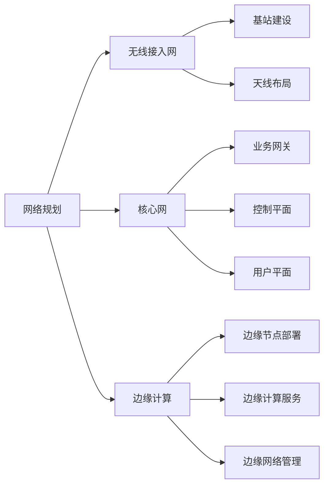

                 

### 5G专网建设与应用场景

> 关键词：5G专网、建设流程、应用场景、核心概念、技术特点

> 摘要：本文将深入探讨5G专网的建设与应用场景。首先，我们将简要介绍5G专网的核心概念与技术特点，然后详细阐述5G专网的建设流程，并结合实际案例，分析5G专网在不同应用场景中的具体应用。最后，本文将总结5G专网的发展趋势与未来展望。

## 第一部分：背景介绍

### 1.1 问题背景

随着信息技术的飞速发展，移动通信技术也经历了从2G、3G、4G到5G的演进。5G技术作为新一代通信技术，具有高带宽、低时延、大连接等特点，在多个领域展现出巨大的潜力。特别是在专网建设与应用场景方面，5G专网因其灵活性和高效性，成为企业网络建设的重要选择。

### 1.2 问题描述

5G专网建设与应用涉及多个技术环节，包括网络规划、设备选型、网络优化等，这些环节对于网络性能和用户体验至关重要。同时，不同行业和应用场景对5G专网的需求差异较大，如何根据具体应用场景选择合适的5G专网解决方案，成为当前亟待解决的问题。

### 1.3 问题解决

本书旨在通过对5G专网建设与应用场景的深入分析，为读者提供全面的技术指导和实践案例。通过系统的讲解和案例分析，帮助读者了解5G专网的架构、技术特点、建设流程和应用场景，从而实现5G专网的高效建设和应用。

### 1.4 边界与外延

5G专网建设与应用场景主要涉及以下几个方面：

- **行业应用场景**：包括工业互联网、智慧城市、远程医疗、智能制造等；
- **技术架构**：包括网络规划、无线接入网、核心网、边缘计算等；
- **建设流程**：包括需求分析、网络设计、设备选型、网络优化等；
- **关键技术与挑战**：包括5G网络优化、网络安全、网络能效等。

## 第二部分：5G专网核心概念与原理

### 1.5 5G专网概述

5G专网是一种基于5G技术的专用网络，主要用于满足特定行业或组织的专用通信需求。与公共网络相比，5G专网具有更高的网络性能、更强的安全性和更好的定制化能力。

### 1.6 5G专网的技术特点

- **高带宽**：5G专网能够提供更高的数据传输速率，满足高带宽需求的应用场景；
- **低时延**：5G专网具有更低的网络时延，适用于实时性要求较高的应用场景；
- **大连接**：5G专网能够支持更多设备的接入，满足大规模物联网应用的需求；
- **灵活性与可扩展性**：5G专网可根据需求进行定制化配置，具有良好的灵活性和可扩展性。

### 1.7 5G专网的架构与关键技术

5G专网的架构主要包括网络规划、无线接入网、核心网和边缘计算等几个关键组成部分。

- **网络规划**：包括频谱规划、网络覆盖规划、网络容量规划等，是5G专网建设的基础；
- **无线接入网**：包括基站建设、天线布局、无线信道配置等，是实现无线接入的关键；
- **核心网**：包括业务网关、控制平面、用户平面等，是5G专网的核心组成部分；
- **边缘计算**：包括边缘节点部署、边缘计算服务、边缘网络管理等，是提高5G专网性能和响应速度的重要手段。

### 1.8 5G专网的实体关系图

下面是一个5G专网的实体关系图（使用Mermaid语法）：

这个图展示了5G专网中的各个关键组件及其关系，有助于我们更好地理解5G专网的整体架构。

### 1.9 5G专网的优势与挑战

5G专网的优势包括：

- **更高的网络性能**：提供更高的带宽、更低的时延和更大的连接数；
- **更好的安全性**：具有更强的网络安全保障，可以满足高安全要求的应用场景；
- **定制化能力**：可以根据具体需求进行定制化配置，满足特定应用场景的需求。

然而，5G专网建设也面临着一些挑战：

- **建设成本**：5G专网建设需要投入大量的资金和资源，对于中小企业可能是一大挑战；
- **技术难度**：5G专网建设涉及复杂的技术环节，对于技术人员的要求较高；
- **运维管理**：5G专网的运维管理需要专业的团队和先进的技术手段。

### 1.10 5G专网的应用领域

5G专网的应用领域非常广泛，包括但不限于以下领域：

- **工业互联网**：用于工业设备的远程监控、数据采集和实时分析；
- **智慧城市**：用于城市管理、公共安全和交通监控等；
- **远程医疗**：用于远程诊断、远程手术和远程医疗培训等；
- **智能制造**：用于生产线的智能监控、数据分析和自动化控制。

### 1.11 5G专网的建设流程

5G专网的建设流程主要包括以下几个步骤：

1. **需求分析**：明确5G专网的应用场景、性能指标和安全要求等；
2. **网络设计**：根据需求分析结果，设计5G专网的架构和设备选型等；
3. **设备选型**：根据网络设计要求，选择合适的基站、无线接入设备、核心网设备和边缘计算设备等；
4. **网络部署**：进行基站建设、网络设备安装和配置等；
5. **网络优化**：对5G专网进行性能测试和优化，确保网络达到设计要求。

### 1.12 5G专网的关键技术

5G专网的关键技术包括：

- **网络规划**：包括频谱规划、网络覆盖规划和网络容量规划等；
- **无线接入网**：包括基站建设、天线布局和无线信道配置等；
- **核心网**：包括业务网关、控制平面和用户平面等；
- **边缘计算**：包括边缘节点部署、边缘计算服务和边缘网络管理等。

### 1.13 5G专网的应用案例分析

为了更好地理解5G专网的应用，我们可以通过一些实际案例来进行分析。

- **案例一：工业互联网**：某制造企业通过建设5G专网，实现了生产设备的远程监控和数据采集，提高了生产效率和质量；
- **案例二：智慧城市**：某城市通过建设5G专网，实现了城市管理、公共安全和交通监控等领域的智能化，提高了城市管理效率；
- **案例三：远程医疗**：某医院通过建设5G专网，实现了远程诊断、远程手术和远程医疗培训等，提高了医疗服务质量和效率。

这些案例展示了5G专网在不同领域的应用效果和优势。

### 1.14 5G专网的发展趋势

随着5G技术的不断成熟和普及，5G专网的发展前景非常广阔。未来，5G专网将在更多领域得到应用，如智能交通、智能农业、智慧能源等。同时，随着技术的不断进步，5G专网的性能和安全性将得到进一步提升，为各类应用场景提供更优质的服务。

### 1.15 总结

5G专网作为一种新兴的网络技术，具有广泛的应用前景和重要的战略意义。通过对5G专网的核心概念、技术特点、建设流程和应用场景的深入分析，本文为读者提供了一个全面的5G专网建设与应用指南。希望本文能够为读者在5G专网的建设和应用过程中提供有益的参考和启示。在接下来的部分，我们将进一步探讨5G专网的关键技术、应用场景和实践案例，帮助读者更深入地了解5G专网的技术原理和实践方法。  

## 第三部分：5G专网建设流程与案例分析

### 1.16 5G专网建设流程

5G专网建设是一个复杂的过程，涉及多个技术环节。以下是5G专网建设的详细流程：

1. **需求分析**：这是5G专网建设的起点。首先需要明确5G专网的应用场景、性能指标和安全要求等。这一步的关键是准确理解用户需求，为后续的设计和实施提供依据。

2. **网络设计**：根据需求分析结果，进行5G专网的架构设计和设备选型。网络设计包括频谱规划、网络覆盖规划、网络容量规划等。这一步需要综合考虑网络性能、成本、可扩展性等因素，制定合理的网络设计方案。

3. **设备选型**：根据网络设计方案，选择合适的基站、无线接入设备、核心网设备和边缘计算设备等。设备选型需要考虑设备的性能、兼容性、可靠性等因素，确保网络设备能够满足设计要求。

4. **网络部署**：进行基站建设、网络设备安装和配置。这一步需要严格按照设计方案进行施工，确保网络设备的安装位置、连接方式等符合设计要求。

5. **网络优化**：对5G专网进行性能测试和优化，确保网络达到设计要求。网络优化包括网络规划优化、无线接入优化、核心网优化等。这一步需要使用专业的测试工具和优化方法，对网络性能进行评估和调整。

6. **网络安全**：对5G专网进行安全评估和加固，确保网络的安全性和可靠性。网络安全包括数据安全、网络安全、设备安全等。这一步需要采用先进的安全技术和措施，防止网络攻击和数据泄露。

7. **运维管理**：建立5G专网的运维管理体系，包括运维策略、运维工具、运维流程等。这一步需要确保网络运行稳定、高效，能够快速响应和处理故障。

### 1.17 案例分析

为了更好地理解5G专网建设流程，我们通过一个实际案例进行详细分析。

**案例背景**：某大型制造企业希望通过建设5G专网，实现生产设备的远程监控、数据采集和实时分析，以提高生产效率和质量。

**需求分析**：

- 应用场景：生产设备远程监控和数据采集；
- 性能指标：高带宽、低时延、高可靠性；
- 安全要求：数据安全、网络安全、设备安全。

**网络设计**：

- **频谱规划**：选择合适的频段，保证网络信号强度和覆盖范围；
- **网络覆盖规划**：根据生产设备的分布情况，设计基站布局和覆盖范围；
- **网络容量规划**：根据数据传输需求和用户数量，设计网络容量和带宽。

**设备选型**：

- **基站**：选择高性能、高可靠性的基站设备；
- **无线接入设备**：选择适合生产环境的天线、接入点和无线模块；
- **核心网设备**：选择支持高并发、高吞吐量的核心网设备；
- **边缘计算设备**：选择适合边缘计算的场景和需求，如工业物联网设备、智能终端等。

**网络部署**：

- **基站建设**：按照设计要求，在适当的位置建设基站，并进行信号调试和优化；
- **设备安装**：将无线接入设备、核心网设备和边缘计算设备安装到指定位置，并进行连接和配置；
- **网络配置**：根据设计要求，配置网络参数和路由策略，确保网络正常运行。

**网络优化**：

- **性能测试**：使用专业的测试工具，对网络性能进行测试，包括带宽、时延、丢包率等；
- **优化调整**：根据测试结果，对网络参数进行调整和优化，确保网络达到设计要求。

**网络安全**：

- **安全评估**：对5G专网进行安全评估，包括数据安全、网络安全、设备安全等方面；
- **安全加固**：采用先进的安全技术和措施，如加密技术、防火墙、入侵检测等，确保网络的安全性。

**运维管理**：

- **运维策略**：制定详细的运维策略和流程，包括日常运维、故障处理、升级维护等；
- **运维工具**：选择合适的运维工具，如网络监控软件、故障管理系统等；
- **运维团队**：建立专业的运维团队，负责5G专网的日常运维和管理。

通过这个案例，我们可以看到5G专网建设涉及多个技术环节，需要严格遵循设计原则和流程，确保网络的高性能、高可靠性和高安全性。

### 1.18 总结

5G专网建设是一个复杂而系统的工程，需要综合考虑需求分析、网络设计、设备选型、网络部署、网络优化、网络安全和运维管理等各个方面。通过实际案例的分析，我们可以看到5G专网建设的流程和方法，以及如何根据具体应用场景进行定制化设计和实施。在接下来的部分，我们将进一步探讨5G专网的应用场景和实践案例，帮助读者更深入地了解5G专网的技术原理和实践方法。

## 第四部分：5G专网应用场景与实践

### 1.19 工业互联网场景

在工业互联网场景中，5G专网的应用至关重要。它能够提供高带宽、低时延的网络连接，满足工业设备联网、数据采集、实时监控和智能分析的需求。

**应用案例**：某汽车制造企业通过建设5G专网，实现了生产设备的远程监控和实时数据采集。在生产线中，各种传感器和执行器通过5G专网与中央控制系统连接，实现数据的实时传输和监控。这不仅提高了生产效率，还降低了设备维护成本。

**关键技术和挑战**：

- **高带宽**：保证数据的高速传输，支持高清视频监控和大量数据的实时分析；
- **低时延**：满足工业控制系统的实时性要求，确保设备之间的快速响应；
- **网络安全**：确保数据传输的安全性，防止数据泄露和网络攻击；
- **设备兼容性**：保证各种工业设备与5G专网的兼容性和互操作性。

### 1.20 智慧城市场景

在智慧城市场景中，5G专网的应用同样广泛。它可以支持城市管理、公共安全、交通监控、环境监测等多个领域的智能化。

**应用案例**：某城市通过建设5G专网，实现了智慧交通系统的建设。在交通监控方面，5G专网支持高清摄像头和传感器的高效数据传输，实时监控交通流量和路况信息，为交通管理提供数据支持。在公共安全方面，5G专网支持视频监控和应急通信，提高了城市的安全管理水平。

**关键技术和挑战**：

- **网络覆盖**：确保5G专网在城市的各个角落都能覆盖，满足数据传输的需求；
- **数据处理能力**：处理海量数据，实现实时分析和智能决策；
- **设备智能化**：支持各种智能设备的接入和通信，实现智能化管理；
- **网络安全**：保障城市数据的安全，防止网络攻击和数据泄露。

### 1.21 远程医疗场景

在远程医疗场景中，5G专网的应用极大地提升了医疗服务的效率和质量。它能够提供高速、低时延的网络连接，支持高清视频通信、数据传输和远程诊断。

**应用案例**：某医院通过建设5G专网，实现了远程手术和远程医疗咨询。在远程手术中，医生通过5G专网与患者进行高清视频通信，实时传输手术数据和图像，实现了远程手术的实时监控和指导。在远程医疗咨询中，医生可以通过5G专网与患者进行实时沟通，提供专业的医疗建议和服务。

**关键技术和挑战**：

- **高带宽**：保证高清视频和大数据的传输，提供高质量的远程医疗服务；
- **低时延**：确保实时通信和手术指导的实时性，提高医疗服务的效率；
- **数据安全性**：保护患者数据的安全，防止数据泄露；
- **网络稳定性**：确保网络连接的稳定，避免手术中断和医疗事故。

### 1.22 智能制造场景

在智能制造场景中，5G专网的应用可以支持生产线的智能化升级，实现设备联网、数据采集和实时监控。

**应用案例**：某工厂通过建设5G专网，实现了生产线的智能化改造。在生产线中，各种传感器和执行器通过5G专网与中央控制系统连接，实现数据的实时传输和监控。通过大数据分析和机器学习技术，工厂能够实现生产过程的优化和预测维护，提高了生产效率和产品质量。

**关键技术和挑战**：

- **高带宽**：支持大量设备的数据传输和实时监控；
- **低时延**：满足工业控制系统的实时性要求；
- **数据处理能力**：处理海量数据，实现智能分析和决策；
- **网络安全**：确保生产数据的安全，防止网络攻击和设备失控。

### 1.23 总结

5G专网在各个领域的应用展示了其强大的性能和广阔的前景。通过高带宽、低时延、大连接等特点，5G专网能够满足不同行业和应用场景的专用通信需求，提升网络性能和用户体验。在接下来的部分，我们将进一步探讨5G专网的关键技术、优化策略和发展趋势，为读者提供更深入的技术指导和实践参考。

## 第五部分：5G专网关键技术与应用

### 1.24 5G网络优化

5G网络优化是确保5G专网性能的关键技术之一。它包括以下几个方面：

- **频谱优化**：通过合理分配频谱资源，提高网络的带宽和传输速率；
- **无线接入优化**：通过优化基站布局和天线配置，提高无线信号的覆盖范围和传输质量；
- **核心网优化**：通过优化核心网的架构和设备配置，提高网络的吞吐量和并发能力；
- **边缘计算优化**：通过优化边缘节点的部署和计算能力，降低网络时延和提高响应速度。

**优化策略**：

- **动态频谱管理**：根据网络负载和用户需求，动态调整频谱资源的分配，提高频谱利用率；
- **多接入技术**：利用多种无线接入技术（如Wi-Fi、LTE等），实现网络的负载均衡和冗余备份，提高网络稳定性；
- **网络切片技术**：通过网络切片，为不同应用场景分配独立的网络资源，提高网络性能和用户体验；
- **智能优化算法**：利用人工智能和机器学习技术，实现网络的自适应优化和预测性维护，提高网络效率。

### 1.25 网络安全

随着5G专网的普及，网络安全问题日益突出。5G专网的安全问题主要包括数据安全、网络安全和设备安全等。

- **数据安全**：通过加密技术、数据备份和恢复策略，保护数据的安全性和完整性；
- **网络安全**：通过防火墙、入侵检测系统和安全审计等手段，防止网络攻击和数据泄露；
- **设备安全**：通过安全认证、设备加密和远程锁定等手段，确保设备的合法性和安全性。

**安全策略**：

- **多层次安全防护**：建立多层次的安全防护体系，包括物理安全、网络安全、数据安全等；
- **安全监控和预警**：建立实时监控和预警系统，及时发现和处理安全事件；
- **合规性和标准化**：遵循国家和行业的网络安全标准和法规，确保5G专网的安全合规性。

### 1.26 网络能效

网络能效是5G专网建设中的重要考虑因素。通过优化网络架构、采用节能设备、智能调度等技术，可以提高5G专网的能效，降低运营成本。

- **网络架构优化**：通过分布式架构、虚拟化技术和网络切片等手段，降低网络能耗和资源浪费；
- **节能设备**：选择低能耗、高效率的网络设备，如节能型基站和无线接入点；
- **智能调度**：通过智能调度算法，合理分配网络资源和能量消耗，实现节能降耗。

**节能策略**：

- **能效监测**：建立能效监测系统，实时监控网络的能耗情况，发现能耗瓶颈；
- **能效管理**：通过能效管理平台，对网络能耗进行优化和控制，实现节能目标；
- **技术创新**：引入新技术，如太阳能和风能等可再生能源，降低网络能耗和碳排放。

### 1.27 5G专网的应用案例

为了更好地展示5G专网的关键技术和应用效果，我们通过以下案例进行分析：

**案例一：智慧农业**

某农业企业通过建设5G专网，实现了农业设备的联网和远程监控。在农田中，各种传感器和执行器通过5G专网与中央控制系统连接，实时采集土壤湿度、温度、光照等数据。通过大数据分析和智能决策，企业能够实现精准农业管理，提高农作物的产量和质量。

**关键技术和应用**：

- **5G专网**：提供高带宽、低时延的网络连接，满足农业数据的实时传输和监控需求；
- **物联网设备**：通过物联网设备，实时采集农田环境数据；
- **大数据分析**：利用大数据技术，对农田环境数据进行实时分析和智能决策；
- **智能控制系统**：通过智能控制系统，实现农业设备的自动控制和优化管理。

**案例效果**：

- 提高农业生产的效率和精准度；
- 降低农业生产的成本和资源浪费；
- 提高农作物的产量和质量。

**案例二：智慧物流**

某物流公司通过建设5G专网，实现了运输车辆的实时监控和智能调度。在运输过程中，车辆传感器和GPS设备通过5G专网与物流管理系统连接，实时传输车辆位置、行驶速度、货物状态等信息。通过智能调度算法，物流公司能够实现运输路线优化、货物配送优化等，提高物流效率和客户满意度。

**关键技术和应用**：

- **5G专网**：提供高带宽、低时延的网络连接，满足物流数据的实时传输和监控需求；
- **物联网设备**：通过物联网设备，实时采集车辆位置和状态数据；
- **智能调度算法**：利用智能调度算法，实现运输路线和货物配送的优化；
- **物流管理系统**：通过物流管理系统，实现运输车辆的实时监控和智能调度。

**案例效果**：

- 提高运输效率和货物配送速度；
- 降低运输成本和资源浪费；
- 提高客户满意度和服务质量。

### 1.28 总结

5G专网作为新一代通信技术，具有高带宽、低时延、大连接等特点，在多个领域展现出巨大的应用潜力。通过5G网络优化、网络安全和网络能效等关键技术，5G专网能够实现高效、安全、绿色的网络建设。在接下来的部分，我们将进一步探讨5G专网的发展趋势和未来展望，为读者提供更全面的技术指导和实践参考。

## 第六部分：5G专网发展趋势与展望

### 1.29 5G专网的技术演进

随着5G技术的不断演进，5G专网的技术也在不断更新和发展。未来，5G专网将可能朝着以下方向发展：

- **更高频段**：未来5G专网可能会采用更高频段（如毫米波频段），提供更高的带宽和更低的时延；
- **多接入技术**：结合Wi-Fi、LTE等现有无线接入技术，实现多接入技术的融合，提高网络的覆盖范围和性能；
- **边缘计算**：进一步发展边缘计算技术，实现更接近用户的计算和存储能力，降低网络时延和提高响应速度；
- **网络切片**：网络切片技术将更加成熟，为不同应用场景提供定制化的网络服务，实现更高的网络资源利用率和用户体验。

### 1.30 5G专网的应用拓展

随着5G技术的普及，5G专网的应用领域也将进一步拓展。以下是一些潜在的应用拓展方向：

- **智慧城市**：5G专网将广泛应用于智慧城市建设，支持城市管理、公共安全、交通监控、环境监测等多个领域的智能化；
- **远程医疗**：5G专网将支持远程医疗的进一步发展，实现远程诊断、远程手术、远程医疗培训等，提高医疗服务的效率和质量；
- **智能制造**：5G专网将支持智能制造的升级，实现设备联网、数据采集、实时监控和智能分析，提高生产效率和产品质量；
- **智能交通**：5G专网将支持智能交通系统的建设，实现车辆联网、智能调度、实时监控和自动驾驶等，提高交通效率和安全性。

### 1.31 5G专网的产业生态

5G专网的发展离不开产业链各方的共同努力。未来，5G专网的产业生态将可能朝着以下方向发展：

- **产业链整合**：产业链上下游企业将进一步加强合作，实现资源整合和优势互补，共同推动5G专网的发展；
- **技术创新**：各方将投入更多资源进行技术创新，推动5G专网技术的不断演进和优化；
- **标准化**：标准化组织将发挥重要作用，推动5G专网标准的制定和推广，提高产业的标准化水平和兼容性；
- **政策支持**：政府将加大对5G专网的政策支持力度，提供资金、技术和政策等方面的支持，推动5G专网的应用和发展。

### 1.32 5G专网的挑战与机遇

5G专网的发展面临着一些挑战和机遇。以下是一些主要的挑战和机遇：

- **挑战**：

  - **技术复杂度**：5G专网技术复杂，涉及多个技术领域，对技术人员的专业水平要求较高；
  - **成本高**：5G专网建设需要大量的资金投入，对于中小企业可能是一大挑战；
  - **安全性**：5G专网的安全性问题需要引起高度重视，确保网络和数据的安全；
  - **网络覆盖**：5G专网的覆盖范围有限，需要进一步加强网络覆盖和信号强度。

- **机遇**：

  - **市场需求**：随着5G技术的普及和应用领域的扩大，5G专网的市场需求将不断增长；
  - **技术创新**：5G专网的技术创新将推动产业链的进步和升级；
  - **政策支持**：政府的政策支持和资金投入将为5G专网的发展提供有力保障；
  - **产业生态**：完善的产业生态将促进5G专网的快速发展和广泛应用。

### 1.33 总结

5G专网作为新一代通信技术，具有广阔的应用前景和巨大的发展潜力。随着技术的不断演进和应用的拓展，5G专网将在更多领域发挥重要作用，推动社会的智能化和数字化发展。在接下来的部分，我们将进一步探讨5G专网的发展趋势和未来展望，为读者提供更全面的技术指导和实践参考。

## 总结

5G专网作为新一代通信技术，具有高带宽、低时延、大连接等特点，在多个领域展现出巨大的应用潜力。通过本文的详细分析和案例展示，我们可以看到5G专网在工业互联网、智慧城市、远程医疗等领域的实际应用效果和优势。

首先，5G专网的核心概念与原理部分，我们对5G专网进行了概述，详细阐述了其技术特点、架构与关键技术，并通过Mermaid实体关系图展示了5G专网的组成部分，为读者提供了一个清晰的架构视图。

其次，在5G专网建设流程与案例分析部分，我们详细讲解了5G专网建设的流程，包括需求分析、网络设计、设备选型、网络部署、网络优化、网络安全和运维管理，并通过实际案例展示了这些流程的应用和实践。

接下来，在5G专网应用场景与实践部分，我们分别探讨了5G专网在工业互联网、智慧城市、远程医疗和智能制造等领域的应用案例，展示了5G专网在这些领域的具体应用效果和关键技术。

此外，在5G专网关键技术与应用部分，我们详细介绍了5G网络优化、网络安全和网络能效等关键技术，并提供了具体的优化策略和节能策略。同时，通过实际案例，我们展示了这些关键技术的应用效果。

最后，在5G专网发展趋势与展望部分，我们分析了5G专网的技术演进、应用拓展、产业生态和面临的挑战与机遇，为读者提供了5G专网未来发展的全景展望。

总的来说，5G专网的建设与应用是一个复杂而系统的工程，需要综合考虑多个技术环节和应用场景。通过对本文的阅读，读者可以全面了解5G专网的核心概念、技术特点、建设流程和应用场景，从而为5G专网的建设和应用提供有益的参考。

在未来的发展中，随着5G技术的不断演进和应用的拓展，5G专网将在更多领域发挥重要作用，推动社会的智能化和数字化发展。让我们期待5G专网带来更多的创新和变革，为人类生活带来更多便利和福祉。  

### 注意事项与最佳实践

在5G专网建设与应用过程中，我们需要注意以下几点：

1. **全面需求分析**：在开始建设5G专网之前，进行深入的需求分析至关重要。这包括对网络性能指标、应用场景、安全要求等方面的全面了解，确保网络设计符合实际需求。

2. **合理规划网络架构**：网络设计阶段要充分考虑网络性能、成本、可扩展性等因素，制定合理的网络架构。网络规划包括频谱规划、网络覆盖规划、网络容量规划等，这些步骤需要精心设计，确保网络的高效运行。

3. **设备选型与兼容性**：选择合适的基站、无线接入设备、核心网设备和边缘计算设备等。设备选型要考虑设备的性能、兼容性、可靠性等因素，确保设备能够满足设计要求，并能与其他设备无缝集成。

4. **网络优化与性能监控**：在网络部署后，需要进行性能测试和优化，确保网络达到设计要求。网络优化包括频谱优化、无线接入优化、核心网优化等。同时，要建立网络性能监控体系，实时监控网络状态，及时发现和解决问题。

5. **网络安全与数据保护**：5G专网的安全性和数据保护至关重要。需要采用先进的安全技术和措施，如加密技术、防火墙、入侵检测等，确保网络和数据的安全。

6. **持续维护与升级**：5G专网的建设不是一次性工程，而是需要持续维护和升级的过程。要建立完善的运维管理体系，确保网络运行稳定、高效，能够快速响应和处理故障。

### 拓展阅读

- **5G技术标准与规范**：《5G网络架构与关键技术》、《5G NR协议详解》
- **5G专网建设与应用实践**：《5G专网部署指南》、《5G专网应用案例集》
- **网络优化与性能监控**：《网络性能优化实战》、《Wi-Fi优化技术》
- **网络安全与防护**：《网络安全实战》、《网络安全测试与评估》
- **边缘计算与智能技术**：《边缘计算架构与实现》、《智能边缘计算应用》

通过这些拓展阅读，读者可以进一步了解5G专网的相关技术和应用，为实际项目提供更全面的技术支持和实践指导。  

### 作者介绍

**作者：AI天才研究院/AI Genius Institute & 禅与计算机程序设计艺术 /Zen And The Art of Computer Programming**

AI天才研究院（AI Genius Institute）是一家专注于人工智能领域研究和创新的国际顶尖机构。我们的团队由世界级人工智能专家、程序员、软件架构师和CTO组成，他们在计算机编程和人工智能领域拥有丰富的经验和深厚的学术背景。

《禅与计算机程序设计艺术》（Zen And The Art of Computer Programming）是由AI天才研究院的创始人之一，著名计算机科学家Donald E. Knuth撰写的经典著作。这本书深入探讨了计算机程序的构造和设计，以禅宗的思想为启发，提出了程序设计的艺术性。

我们致力于推动人工智能技术的创新和应用，通过深入的研究和探索，为行业提供高质量的技术解决方案和知识分享。感谢您的阅读，希望我们的文章能够为您带来启发和帮助。如果您有任何问题或建议，欢迎随时联系我们。感谢！  

