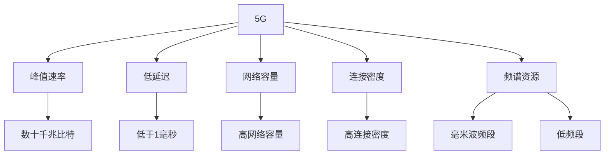

                 

### 第一部分：5G技术概述

#### 1.1 5G技术的基本概念

5G，即第五代移动通信技术，是继1G模拟通信、2G数字通信、3G高速数据传输和4G超高速数据传输之后的最新一代移动通信技术。5G技术不仅提升了网络的传输速率，还显著降低了网络的延迟，同时具备更高的网络容量和更强的连接能力。这些特点使得5G在数据传输、实时通信和智能设备互联等领域具有广泛的应用前景。

**核心概念术语说明：**

- **峰值速率：** 5G网络的峰值速率可达每秒数十千兆比特，远远超过4G网络的速率。
- **低延迟：** 5G网络的延迟可低至1毫秒，极大地提升了实时响应能力。
- **网络容量：** 5G网络具有更高的网络容量，能够同时支持更多的连接。
- **连接密度：** 5G网络能够支持在特定区域内更高密度的设备连接。

**问题背景与问题描述：**

随着物联网、大数据、人工智能等新兴技术的发展，移动通信网络面临着日益增长的数据需求和复杂的应用场景。4G网络虽然能够满足一定程度的用户需求，但其在速率、延迟和网络容量等方面已经无法满足未来的发展需求。因此，5G技术的出现成为了新一代移动通信网络的首选。

**问题解决与边界与外延：**

5G技术通过引入新型网络架构、新型无线通信技术和新型网络协议等创新技术，解决了4G网络在速率、延迟和网络容量等方面的瓶颈问题。5G网络不仅能够支持现有的移动通信应用，还能为新兴的物联网应用提供坚实的基础设施支持。

#### 1.2 5G技术的核心要素

5G技术的实现涉及多个关键要素，包括网络架构、关键技术、频谱资源等。

**核心要素组成：**

- **网络架构：** 5G网络采用了全新的网络架构，包括接入网、传输网、核心网等，实现了网络功能的模块化和分布式。
- **关键技术：** 5G技术采用了诸如大规模MIMO、多连接、网络切片、边缘计算等关键技术，提升了网络的性能和灵活性。
- **频谱资源：** 5G网络使用了新的频谱资源，包括毫米波频段和低频段，扩展了网络的覆盖范围和容量。

**概念结构与核心要素：**

- **网络架构：** 接入网负责用户终端与基站之间的通信，传输网负责不同基站之间的数据传输，核心网负责数据存储和处理。
- **关键技术：** 大规模MIMO技术通过使用多个天线阵列，提升了网络的频谱效率和传输速率；多连接技术支持同一设备同时连接多个网络，提升了网络利用率；网络切片技术将网络资源划分为多个虚拟网络，满足不同应用的需求；边缘计算技术将计算任务从中心化云平台转移到靠近数据源的边缘设备，降低了网络延迟。

#### 1.3 5G技术与其他移动网络技术的对比

5G技术相比于4G及其他移动网络技术，具有显著的优势和独特的特点。

**核心概念属性特征对比表格：**

| 特点       | 5G               | 4G               | 3G               |
| ---------- | ---------------- | ---------------- | ---------------- |
| 峰值速率   | 每秒数十千兆比特 | 每秒数兆比特     | 每秒数百千比特   |
| 低延迟     | 低于1毫秒        | 低于几十毫秒     | 低于几百毫秒     |
| 网络容量   | 高网络容量       | 中等网络容量     | 低网络容量       |
| 连接密度   | 高连接密度       | 中等连接密度     | 低连接密度       |
| 频谱资源   | 毫米波频段+低频段 | 低频段           | 低频段           |

**ER实体关系图架构：**

#### 1.4 5G技术在现代通信网络中的地位

5G技术在现代通信网络中具有举足轻重的地位，被认为是开启智能世界的关键技术。

**全球布局：**

全球多个国家和地区已经开始了5G网络的部署，包括中国、美国、欧洲等。各国纷纷制定了5G网络的发展计划，旨在抢占5G技术的战略高地。

**影响：**

5G技术对现代通信行业的影响深远，不仅改变了传统的通信模式，还推动了工业互联网、智慧城市、医疗健康等新兴领域的发展。

- **工业互联网：** 5G技术为工业互联网提供了高速、低延迟的网络连接，推动了智能制造的发展。
- **智慧城市：** 5G技术为智慧城市提供了强大的网络支持，实现了城市管理的智能化和精细化管理。
- **医疗健康：** 5G技术为医疗健康领域带来了远程医疗、智能医疗设备等创新应用，提升了医疗服务的效率和质量。

#### 1.5 本章小结

本章对5G技术的基本概念、核心要素及其在移动网络技术中的地位进行了详细阐述。通过对5G技术与4G及其他移动网络技术的对比，读者可以更清晰地理解5G技术的优势和特点。接下来，我们将深入探讨5G技术在各种应用场景中的机遇与挑战。

----------------------------------------------------------------

# 第二部分：5G应用场景与机遇

## 2.1 5G在工业互联网中的应用

5G技术在工业互联网中的应用前景广阔，它不仅能够提高工业自动化水平，还能提升整体生产效率。以下将详细探讨5G在工业互联网中的应用场景、基本概念、发展历程及其带来的变革。

### 2.1.1 工业互联网的基本概念

工业互联网是将物联网、云计算、大数据、人工智能等技术与工业生产深度融合的一种新型制造模式。它通过传感器、设备、系统和人员之间的互联互通，实现数据的实时采集、分析和利用，从而优化生产流程、提高产品质量和降低成本。

**核心概念术语说明：**

- **物联网（IoT）：** 物联网是连接物理设备和数字世界的网络，通过传感器和设备实现数据采集和传输。
- **云计算：** 云计算是一种通过网络提供计算资源的服务，能够弹性地提供计算能力、存储能力和网络服务。
- **大数据：** 大数据是指无法在传统数据库中进行有效管理和处理的大量数据。
- **人工智能（AI）：** 人工智能是通过模拟人类智能行为，使计算机能够实现智能决策和自主行动的技术。

**问题背景与问题描述：**

随着工业4.0和智能制造的推进，工业互联网已经成为制造业转型升级的关键驱动力。传统的工业自动化系统面临着数据传输速率低、延迟高和连接密度低等瓶颈，而5G技术的引入为解决这些问题提供了新的解决方案。

**问题解决与边界与外延：**

5G技术通过提供高速、低延迟和高连接密度的网络连接，为工业互联网的发展提供了坚实的基础。5G网络不仅能够支持大量的设备连接，还能满足工业生产中对数据实时性和可靠性的要求。这使得工业互联网在数据采集、设备控制、生产优化等方面实现了显著的提升。

### 2.1.2 5G在工业互联网中的应用案例

5G技术在工业互联网中的应用案例丰富，涵盖了智能制造、设备监控、远程维护等多个方面。

**智能制造：**

智能制造是工业互联网的核心应用之一，5G技术通过提供高速、稳定的网络连接，使得生产设备能够实时采集和分析生产数据，实现精准控制和优化。例如，汽车制造业通过5G技术实现了生产线的智能调度和设备状态监控，有效提升了生产效率和产品质量。

**设备监控：**

在设备监控方面，5G技术能够实时传输设备运行状态数据，帮助企业实现设备的远程监控和故障预警。例如，机械制造业通过5G技术对生产设备进行远程监控，可以及时发现设备故障，减少停机时间和维修成本。

**远程维护：**

远程维护是工业互联网的一个重要应用场景，5G技术通过高速网络连接，使得远程专家能够实时指导现场操作人员，提高维修效率和降低维修成本。例如，石油化工行业通过5G技术实现了远程设备的诊断和维护，有效降低了现场维护的工作量和成本。

### 2.1.3 5G技术在工业互联网中的应用前景

随着5G技术的不断成熟和应用，工业互联网在智能制造、设备监控、远程维护等方面将迎来新的发展机遇。

**智能制造：**

5G技术将进一步提升智能制造的水平，通过高速、低延迟的网络连接，实现生产设备的实时控制和优化，提高生产效率和产品质量。未来，智能制造将朝着更加智能化、自动化和高效化的方向发展。

**设备监控：**

5G技术将使得设备监控更加实时和准确，通过大数据分析和人工智能技术，实现设备故障的提前预警和优化维护，降低设备故障率和停机时间。

**远程维护：**

5G技术将使得远程维护更加便捷和高效，通过实时视频通话和远程操作，专家可以快速指导现场操作人员解决问题，提高维修效率和降低成本。

### 2.1.4 本章小结

5G技术在工业互联网中的应用为智能制造、设备监控和远程维护等领域带来了新的机遇。通过提供高速、低延迟和高连接密度的网络连接，5G技术为工业互联网的发展提供了坚实的基础。未来，随着5G技术的不断成熟和应用，工业互联网将在各个领域取得更大的突破和发展。

----------------------------------------------------------------

## 2.2 5G在智能交通领域的应用

5G技术在智能交通领域具有极大的应用潜力，它能够显著提升交通管理效率、改善交通流量、提高出行安全。以下将探讨5G在智能交通中的应用场景、基本概念、发展历程及其在自动驾驶、车联网、交通监控等方面的具体应用。

### 2.2.1 智能交通系统概述

智能交通系统（Intelligent Transportation System，ITS）是通过现代信息技术、通信技术、控制技术、传感技术等，对交通信息进行收集、处理、传输、分析和应用，以实现交通的智能化管理和服务。智能交通系统包括多个层次，从宏观的交通管理到微观的车辆控制，覆盖了交通的各个方面。

**核心概念术语说明：**

- **交通信息采集：** 通过传感器、摄像头等设备，实时采集道路状态、交通流量、车辆信息等数据。
- **交通信号控制：** 通过智能交通信号控制系统，对交通信号进行优化控制，以减少拥堵、提高通行效率。
- **车辆控制：** 通过车载设备，实现对车辆的自动控制和导航，包括自动驾驶、车联网等。
- **交通信息服务：** 通过提供交通信息，如路况信息、导航信息等，帮助驾驶员做出合理的驾驶决策。

**问题背景与问题描述：**

随着城市化进程的加速和汽车保有量的增加，交通拥堵、交通事故等问题日益严重，传统的交通管理方式已经无法满足日益增长的交通需求。智能交通系统通过引入5G技术，能够实现交通信息的实时采集、传输和处理，为交通管理提供了新的解决方案。

**问题解决与边界与外延：**

5G技术通过提供高速、低延迟的网络连接，使得交通信息能够实时传输和处理，实现了交通管理的智能化。5G技术在智能交通系统中的应用不仅局限于城市交通，还可以扩展到高速公路、轨道交通、航空交通等多个领域。

### 2.2.2 5G在智能交通中的应用案例

5G技术在智能交通中的应用案例丰富，涵盖了自动驾驶、车联网、交通监控等多个方面。

**自动驾驶：**

自动驾驶是智能交通领域的一个重要应用，5G技术为自动驾驶车辆提供了实时、高速的数据传输支持。自动驾驶车辆通过5G网络，可以实时获取道路信息、交通信号、车辆状态等数据，实现智能决策和自动驾驶。例如，一些汽车制造商已经开展了基于5G的自动驾驶测试，展示了5G技术在自动驾驶中的潜力。

**车联网：**

车联网是通过将车辆与互联网连接，实现车辆之间、车辆与基础设施之间、车辆与云端之间的信息交互。5G技术为车联网提供了高速、稳定的网络连接，使得车辆能够实时传输和接收大量数据，实现车与车、车与基础设施、车与云端之间的智能交互。例如，一些车辆已经配备了基于5G的车联网系统，实现了车辆之间的实时通信，提高了行驶安全性和交通效率。

**交通监控：**

5G技术在交通监控中的应用，使得交通管理部门能够实时监控道路状况、交通流量等信息，实现智能交通信号控制和交通调度。例如，一些城市已经部署了基于5G的交通监控系统，通过实时视频监控和数据分析，能够及时发现和处理交通拥堵、交通事故等问题。

### 2.2.3 5G技术在智能交通领域的应用前景

随着5G技术的不断成熟和应用，智能交通领域将迎来新的发展机遇。

**自动驾驶：**

5G技术将推动自动驾驶技术的发展，通过提供高速、低延迟的网络连接，实现自动驾驶车辆的实时数据传输和智能决策，提高行驶安全性和交通效率。未来，自动驾驶将逐渐成为智能交通的重要组成。

**车联网：**

5G技术将加速车联网的普及，实现车辆之间、车辆与基础设施之间、车辆与云端之间的实时通信，提升交通管理和出行体验。未来，车联网将融合更多的智能技术，实现更加智能化的交通管理和服务。

**交通监控：**

5G技术将使交通监控更加实时、准确和高效，通过实时视频监控和数据分析，实现交通拥堵、交通事故的快速响应和处理，提高交通管理水平。

### 2.2.4 本章小结

5G技术在智能交通领域的应用为交通管理、自动驾驶、车联网等方面带来了新的机遇。通过提供高速、低延迟的网络连接，5G技术使得交通信息的实时采集、传输和处理成为可能，为智能交通系统的发展提供了坚实的基础。未来，随着5G技术的不断成熟和应用，智能交通领域将实现更加高效、安全和智能化的交通管理和服务。

----------------------------------------------------------------

## 2.3 5G在医疗健康领域的应用

5G技术在医疗健康领域的应用具有深远的影响，它能够显著提升医疗服务的效率和质量，特别是在远程医疗、智能医疗设备和医疗大数据分析等方面。以下将探讨5G在医疗健康中的应用场景、基本概念、发展历程及其带来的变革。

### 2.3.1 医疗健康数据的重要性

医疗健康数据是医疗健康领域的基础资源，包括患者病历、检查报告、诊断结果、医疗影像等。这些数据对于疾病的预防、诊断、治疗和康复具有重要意义。医疗健康数据的重要性体现在以下几个方面：

**核心概念术语说明：**

- **患者病历：** 患者的病史、家族病史、药物过敏史等基本信息。
- **检查报告：** 检查项目的结果，如血液检查、影像检查等。
- **诊断结果：** 医生的诊断意见和治疗方案。
- **医疗影像：** 通过影像设备获取的患者内部结构图像，如X光片、CT、MRI等。

**问题背景与问题描述：**

随着医疗技术的进步和大数据技术的发展，医疗健康数据的重要性日益凸显。然而，传统的医疗体系在数据采集、传输、存储和分析方面存在诸多问题，如数据分散、传输延迟、处理能力不足等。5G技术的引入为解决这些问题提供了新的可能。

**问题解决与边界与外延：**

5G技术通过提供高速、低延迟的网络连接，使得医疗健康数据能够实时传输和处理，实现数据的快速共享和利用。这不仅提高了医疗服务的效率，还为医疗大数据分析提供了基础。

### 2.3.2 5G在医疗健康领域的应用案例

5G技术在医疗健康领域的应用案例丰富，涵盖了远程医疗、智能医疗设备和医疗大数据分析等多个方面。

**远程医疗：**

远程医疗是5G技术在医疗健康领域的重要应用之一。通过5G网络，医生可以实时进行远程诊断和治疗，不受地理位置的限制。例如，偏远地区的患者可以通过5G网络与城市中心的专家进行实时视频咨询，获得高质量的医疗服务。

**智能医疗设备：**

智能医疗设备通过5G网络实现数据的实时传输和远程监控，提高了医疗服务的准确性和及时性。例如，心电监护设备可以实时传输患者的心电数据，医生可以远程监测患者的病情，及时调整治疗方案。

**医疗大数据分析：**

5G技术使得医疗大数据的实时采集和分析成为可能，为医疗健康研究提供了丰富的数据支持。通过大数据分析，可以发现疾病的流行趋势、预测疾病的发生，为疾病预防和治疗提供科学依据。

### 2.3.3 5G技术在医疗健康领域的应用前景

随着5G技术的不断成熟和应用，医疗健康领域将迎来新的发展机遇。

**远程医疗：**

5G技术将推动远程医疗的普及，实现医疗资源的均衡分配。未来，远程医疗将不仅仅局限于视频咨询，还包括远程手术、远程监护等更加复杂的医疗服务。

**智能医疗设备：**

5G技术将使得智能医疗设备更加普及和智能化，通过实时数据传输和远程监控，提高医疗服务的质量和效率。

**医疗大数据分析：**

5G技术将促进医疗大数据的积累和分析，为医疗健康研究提供丰富的数据支持。通过大数据分析，可以实现疾病的早期发现、个性化治疗和精准医疗。

### 2.3.4 本章小结

5G技术在医疗健康领域的应用为远程医疗、智能医疗设备和医疗大数据分析等方面带来了新的机遇。通过提供高速、低延迟的网络连接，5G技术显著提升了医疗服务的效率和质量，为医疗健康领域的发展提供了新的动力。未来，随着5G技术的不断成熟和应用，医疗健康领域将实现更加高效、精准和智能化的医疗服务。

----------------------------------------------------------------

## 2.4 5G在智慧城市中的应用

5G技术在智慧城市中的应用具有广泛的前景，它能够提升城市管理的智能化水平，改善居民生活质量，实现城市的可持续发展。以下将探讨5G在智慧城市中的应用场景、基本概念、发展历程及其在智慧城市管理、公共安全、能源管理等方面的具体应用。

### 2.4.1 智慧城市的概念

智慧城市是指利用物联网、云计算、大数据、人工智能等现代信息技术，对城市的基础设施、公共资源、社会服务等进行智能化管理和优化，以提高城市运行效率、改善居民生活质量、实现可持续发展。智慧城市主要包括以下几个核心组成部分：

**核心概念术语说明：**

- **物联网：** 物联网是通过传感器、设备等实现物体与物体之间互联互通的网络。
- **云计算：** 云计算是通过网络提供计算资源、存储资源和网络服务的模式。
- **大数据：** 大数据是指无法在传统数据库中进行有效管理和处理的大量数据。
- **人工智能：** 人工智能是通过模拟人类智能行为，实现智能决策和自主行动的技术。

**问题背景与问题描述：**

随着城市化进程的加快和城市人口的持续增长，城市面临着交通拥堵、资源浪费、环境污染等问题。传统城市管理方式已经无法满足现代城市发展的需求，智慧城市成为解决这些问题的关键。

**问题解决与边界与外延：**

智慧城市通过引入5G技术，实现了城市基础设施、公共资源和社会服务的智能化管理，提高了城市运行效率和居民生活质量。5G技术为智慧城市提供了高速、低延迟的网络连接，使得城市数据的实时采集、传输和处理成为可能，为智慧城市的发展提供了坚实的基础。

### 2.4.2 5G在智慧城市中的应用案例

5G技术在智慧城市中的应用案例丰富，涵盖了智慧城市管理、公共安全、能源管理等多个方面。

**智慧城市管理：**

智慧城市管理是智慧城市的重要组成部分，5G技术通过提供高速、低延迟的网络连接，实现了城市数据的实时采集、传输和分析。例如，城市交通管理部门通过5G网络实时监控交通流量，优化交通信号控制，缓解交通拥堵问题。

**公共安全：**

5G技术在公共安全领域具有广泛的应用，通过实时视频监控和大数据分析，实现了对公共安全的实时监控和预警。例如，一些城市通过5G网络部署了智能监控设备，实时监控城市公共场所的安全情况，及时发现和处理安全隐患。

**能源管理：**

5G技术在能源管理中的应用，实现了对能源使用情况的实时监测和优化控制。例如，智慧城市的能源管理部门通过5G网络实时监测电力、燃气等能源的使用情况，优化能源分配，提高能源利用效率。

### 2.4.3 5G技术在智慧城市领域的应用前景

随着5G技术的不断成熟和应用，智慧城市领域将迎来新的发展机遇。

**智慧城市管理：**

5G技术将进一步提升智慧城市管理的智能化水平，通过实时数据采集和分析，实现城市运行的精细化管理，提高城市运行效率和居民生活质量。

**公共安全：**

5G技术将推动公共安全领域的智能化发展，通过实时视频监控和大数据分析，实现公共安全的实时监控和预警，提高城市安全保障能力。

**能源管理：**

5G技术将促进能源管理的智能化，通过实时监测和优化控制，实现能源的高效利用，推动城市的可持续发展。

### 2.4.4 本章小结

5G技术在智慧城市中的应用为智慧城市管理、公共安全和能源管理等方面带来了新的机遇。通过提供高速、低延迟的网络连接，5G技术显著提升了城市管理的智能化水平和居民生活质量。未来，随着5G技术的不断成熟和应用，智慧城市将实现更加高效、智能和可持续的发展。

----------------------------------------------------------------

## 2.5 5G在娱乐和文化领域的应用

5G技术在娱乐和文化领域的应用正在逐渐展开，它为各种娱乐活动和文化体验带来了前所未有的创新和变革。以下将探讨5G在娱乐和文化领域的应用场景、基本概念、发展历程及其在虚拟现实（VR）、增强现实（AR）、在线直播、云游戏等方面的具体应用。

### 2.5.1 5G对娱乐和文化产业的影响

5G技术的引入为娱乐和文化产业带来了巨大的变革，主要体现在以下几个方面：

**核心概念术语说明：**

- **虚拟现实（VR）：** 虚拟现实是一种通过计算机技术创造的模拟环境，用户可以在其中体验沉浸式的虚拟世界。
- **增强现实（AR）：** 增强现实是在现实环境中叠加虚拟信息，使用户在现实世界中看到增强的内容。
- **在线直播：** 在线直播是一种实时视频传输技术，用户可以通过网络实时观看活动、节目等。
- **云游戏：** 云游戏是一种通过云端服务器进行游戏运行和内容分发的技术，用户可以通过网络访问云服务器上的游戏资源。

**问题背景与问题描述：**

随着互联网的普及和用户对高质量、实时娱乐需求的增加，传统的娱乐和文化产业已经难以满足用户的需求。5G技术的高速率、低延迟和大规模连接能力为娱乐和文化产业提供了新的发展契机。

**问题解决与边界与外延：**

5G技术通过提供高速、低延迟的网络连接，使得娱乐和文化产业的各个环节能够实现实时互动和高品质体验。这不仅提升了用户体验，还为娱乐和文化产业的创新发展提供了广阔的空间。

### 2.5.2 5G在娱乐和文化领域的应用案例

5G技术在娱乐和文化领域的应用案例丰富，涵盖了虚拟现实、增强现实、在线直播、云游戏等多个方面。

**虚拟现实（VR）：**

虚拟现实技术通过5G网络的低延迟和高速度，实现了高质量的沉浸式体验。例如，用户可以通过VR设备实时体验虚拟的旅游场景、游戏世界等，感受到身临其境的体验。

**增强现实（AR）：**

增强现实技术通过5G网络的实时数据传输，实现了在现实环境中叠加虚拟信息。例如，一些博物馆通过AR技术，让观众在参观时能够实时看到展品的3D模型和历史介绍，增强了参观的趣味性和互动性。

**在线直播：**

在线直播技术通过5G网络的低延迟和高稳定性，实现了高质量的视频直播体验。例如，一些体育赛事、音乐会等活动通过5G网络进行实时直播，观众可以享受到无缝的视频观看体验。

**云游戏：**

云游戏技术通过5G网络的低延迟和高带宽，实现了大规模的在线游戏体验。例如，用户可以通过云游戏平台，无需下载安装游戏，即可在云端服务器上实时畅玩游戏，享受到高画质、低延迟的游戏体验。

### 2.5.3 5G技术在娱乐和文化领域的应用前景

随着5G技术的不断成熟和应用，娱乐和文化领域将迎来新的发展机遇。

**虚拟现实（VR）：**

5G技术将推动虚拟现实技术的普及，实现更高质量的沉浸式体验，为用户带来全新的娱乐和文化体验。

**增强现实（AR）：**

5G技术将推动增强现实技术的应用，实现更多元化的互动体验，为文化教育、旅游等领域带来创新。

**在线直播：**

5G技术将进一步提升在线直播的画质和稳定性，为用户提供更流畅、更互动的观看体验。

**云游戏：**

5G技术将推动云游戏的发展，实现大规模在线游戏的普及，为游戏行业带来新的增长点。

### 2.5.4 本章小结

5G技术在娱乐和文化领域的应用为虚拟现实、增强现实、在线直播、云游戏等方面带来了新的机遇。通过提供高速、低延迟的网络连接，5G技术显著提升了娱乐和文化体验的质量，为行业的发展提供了强大的动力。未来，随着5G技术的不断成熟和应用，娱乐和文化领域将实现更加创新、多元和互动的发展。

----------------------------------------------------------------

## 2.6 本章小结

本部分内容围绕5G技术在工业互联网、智能交通、医疗健康、智慧城市、娱乐和文化等领域的应用进行了详细探讨。通过对这些应用场景的分析，可以看出5G技术不仅提升了各个领域的效率和质量，还为未来的发展带来了巨大的机遇。

### 主要发现

- **工业互联网：** 5G技术为工业自动化、设备监控和远程维护提供了高速、低延迟的网络连接，推动了智能制造的发展。
- **智能交通：** 5G技术通过提升自动驾驶、车联网和交通监控的实时性和准确性，实现了更高效的交通管理和出行体验。
- **医疗健康：** 5G技术使得远程医疗、智能医疗设备和医疗大数据分析成为可能，显著提升了医疗服务的效率和质量。
- **智慧城市：** 5G技术为城市管理、公共安全和能源管理提供了智能化解决方案，推动了城市的可持续发展。
- **娱乐和文化：** 5G技术为虚拟现实、增强现实、在线直播和云游戏等提供了高质量、低延迟的体验，丰富了娱乐和文化生活。

### 未来展望

随着5G技术的不断成熟和应用，各个领域将迎来更多的创新和发展机遇。未来，5G技术将在以下几个方面产生深远影响：

- **更广泛的应用场景：** 5G技术将应用于更多行业和领域，推动各行各业的数字化转型和智能化升级。
- **更高的网络性能：** 5G技术将提供更高的峰值速率、更低的延迟和更大的网络容量，满足更复杂和多样的应用需求。
- **更智能的交互体验：** 5G技术将实现人与人、人与物、物与物之间的智能交互，创造更加丰富和个性化的用户体验。
- **更高效的资源管理：** 5G技术将优化网络资源的使用，提高网络资源利用率和能源效率，实现更可持续的发展。

总之，5G技术将为未来的发展带来无限的机遇，推动人类社会迈向更加智能、高效和可持续的未来。

----------------------------------------------------------------

# 第三部分：5G应用的挑战与解决方案

## 3.1 5G网络部署中的挑战

5G网络部署过程中面临着诸多挑战，这些挑战涉及到基础设施建设、频谱资源分配、技术标准等多个方面。以下是针对这些挑战的详细探讨。

### 3.1.1 网络基础设施建设

**核心概念术语说明：**

- **基站建设：** 基站是5G网络的核心组成部分，负责信号的接收和发送。
- **光纤网络：** 光纤网络是实现基站之间以及基站与核心网之间高速数据传输的关键设施。
- **设备升级：** 包括基站设备、传输设备、核心网设备的升级和改造，以满足5G网络的性能需求。

**问题背景与问题描述：**

5G网络的高速率、低延迟和大连接密度要求对现有的网络基础设施进行大规模升级和改造。然而，基础设施建设面临着投资巨大、建设周期长、覆盖范围广等挑战。

**问题解决与边界与外延：**

解决基础设施建设的挑战需要政府、运营商和设备供应商的紧密合作。首先，政府应出台相关政策和规划，提供资金支持和政策保障。其次，运营商需要制定详细的网络建设计划，合理规划基站布局和光纤网络建设。最后，设备供应商应提供高性能、高可靠性的设备，确保网络建设的高效和稳定。

### 3.1.2 频谱资源分配

**核心概念术语说明：**

- **频谱资源：** 频谱资源是无线电通信的基础资源，用于信号传输。
- **频谱分配：** 频谱分配是指将有限的频谱资源分配给不同的用户和用途。
- **频谱规划：** 频谱规划是指对频谱资源的长期和短期使用进行规划和管理。

**问题背景与问题描述：**

5G网络需要大量的频谱资源来支持高速数据传输和大连接密度。然而，频谱资源是有限的，不同行业和应用之间存在频谱竞争。频谱资源分配不当可能导致网络性能下降和通信干扰。

**问题解决与边界与外延：**

解决频谱资源分配的挑战需要科学合理的频谱规划和有效的频谱管理。首先，政府应制定频谱资源分配政策，明确频谱使用的优先级和规则。其次，运营商和设备供应商应采用先进的频谱管理技术，如动态频谱共享和频谱感知技术，提高频谱资源的利用率。最后，需要建立频谱监测和协调机制，及时发现和解决频谱干扰问题。

### 3.1.3 网络覆盖范围与深度

**核心概念术语说明：**

- **网络覆盖：** 网络覆盖是指5G信号能够覆盖的区域。
- **网络深度：** 网络深度是指网络信号能够深入的区域，如地下室、电梯等。

**问题背景与问题描述：**

5G网络的高频段特性导致信号传播距离较短，网络覆盖范围和深度成为一大挑战。特别是在城市密集区域和地下场所，信号覆盖问题尤为突出。

**问题解决与边界与外延：**

解决网络覆盖范围和深度的挑战需要采用多种技术手段。首先，可以通过增加基站数量和密度来扩大网络覆盖范围。其次，可以采用小型基站和微基站来增强网络深度覆盖。此外，还可以采用室内分布系统、毫米波技术等手段，提高地下场所的信号覆盖效果。

### 3.1.4 建设成本与投资回报

**核心概念术语说明：**

- **建设成本：** 包括基站建设、光纤网络建设、设备采购等费用。
- **投资回报：** 指投入的资本在一段时间内所产生的经济收益。

**问题背景与问题描述：**

5G网络部署需要巨额投资，运营商面临巨大的财务压力。然而，5G业务的商业化应用尚未全面展开，运营商的投资回报周期较长，导致投资风险增加。

**问题解决与边界与外延：**

解决建设成本和投资回报的挑战需要多方共同努力。首先，政府可以通过政策支持，降低运营商的网络建设成本。其次，运营商应优化网络建设方案，采用高效、经济的建设方法。此外，可以探索多样化的商业模式，如与互联网企业合作，共同开发5G应用场景，实现共赢发展。

### 3.1.5 本章小结

5G网络部署过程中的挑战涉及到基础设施建设、频谱资源分配、网络覆盖范围与深度、建设成本与投资回报等多个方面。通过科学合理的规划和有效的技术手段，可以逐步克服这些挑战，实现5G网络的全面部署和广泛应用。

----------------------------------------------------------------

## 3.2 5G技术标准与兼容性问题

5G技术标准的制定和兼容性问题对于5G网络的推广和应用至关重要。5G技术标准不仅涉及到网络架构、通信协议等核心技术的规范，还包括频谱资源、天线技术、网络切片等方面的标准化。以下将详细探讨5G技术标准的演进、与其他移动网络技术的兼容性以及国际标准的协调与统一。

### 3.2.1 5G技术标准的演进

**核心概念术语说明：**

- **标准组织：** 5G技术标准的制定主要依赖于国际电信联盟（ITU）、3GPP（第三代合作伙伴计划）和ETSI（欧洲电信标准协会）等国际标准组织。
- **标准版本：** 5G技术标准包括多个版本，如NR（新无线接入网络）、NRv16、NRv17等，每个版本都包含新的技术特征和改进。
- **关键技术：** 5G技术标准涵盖了大规模MIMO、多连接、网络切片、边缘计算等关键技术。

**问题背景与问题描述：**

随着5G技术的不断发展，技术标准的演进和更新成为必然。5G技术标准的演进不仅需要满足高速率、低延迟、高连接密度等基本需求，还需要适应不同国家和地区的特定需求，确保全球范围内的互操作性。

**问题解决与边界与外延：**

为了实现5G技术标准的有效演进，国际标准组织需要紧密合作，确保技术标准的兼容性和一致性。此外，各国政府和运营商也需要积极参与标准的制定和测试，确保标准的实用性和可执行性。未来，5G技术标准的演进将更加注重灵活性、可扩展性和可持续性，以适应不断变化的应用场景和市场需求。

### 3.2.2 5G与现有网络技术的兼容性

**核心概念术语说明：**

- **4G与5G的兼容：** 5G网络需要与4G网络实现兼容，确保用户在升级到5G网络后仍能保持稳定的通信服务。
- **回退机制：** 5G网络在无法支持5G服务时，可以回退到4G或3G网络，保证服务的连续性和可靠性。
- **互操作性：** 5G网络需要与其他网络技术（如Wi-Fi、卫星通信等）实现互操作性，以提供全面的多网络服务。

**问题背景与问题描述：**

5G技术的引入需要在现有网络基础上进行升级和改造，确保新老网络之间的兼容性和互操作性。这涉及到不同网络技术之间的协议转换、资源分配和网络管理等问题。

**问题解决与边界与外延：**

为了实现5G与现有网络技术的兼容性，需要从以下几个方面入手：

- **协议转换：** 设计统一的协议栈，实现5G网络与4G、3G网络的协议兼容。
- **回退机制：** 设计有效的回退机制，确保在5G网络无法支持时，用户可以无缝切换到其他网络。
- **互操作性：** 推动不同网络技术之间的标准化和互操作性，实现多网络环境下的无缝服务。

### 3.2.3 国际标准的协调与统一

**核心概念术语说明：**

- **国际标准：** 国际电信联盟（ITU）和3GPP等国际组织制定的标准。
- **区域标准：** 欧洲电信标准协会（ETSI）等区域组织制定的标准。
- **跨国合作：** 各国政府、运营商和标准组织之间的合作与协调。

**问题背景与问题描述：**

5G技术的全球推广需要各国之间的一致标准，然而不同国家和地区在标准制定和实施上存在差异，这可能导致技术兼容性问题，影响全球5G网络的互操作性。

**问题解决与边界与外延：**

为了实现国际标准的协调与统一，需要采取以下措施：

- **加强国际合作：** 各国政府和运营商应加强合作，共同推动国际标准的制定和实施。
- **标准融合：** 推动国际标准和区域标准的融合，确保标准的兼容性和一致性。
- **政策协调：** 各国政府应协调政策，为国际标准的实施提供支持，避免政策冲突。

### 3.2.4 本章小结

5G技术标准的演进、兼容性和国际标准的协调与统一是5G网络推广和应用的关键。通过科学合理的标准制定和有效的技术手段，可以确保5G网络的互操作性、兼容性和可持续发展。未来，随着5G技术的不断成熟和应用，国际标准的协调与统一将更加重要，为全球5G网络的广泛应用提供坚实的基础。

----------------------------------------------------------------

## 3.3 5G安全与隐私保护

随着5G技术的迅速发展和广泛应用，网络安全和隐私保护成为日益突出的挑战。5G网络的高速率、大连接密度和低延迟特性使其成为黑客和恶意攻击者的目标。以下将详细探讨5G网络面临的安全隐患、隐私保护措施及其在实践中的有效性和局限性。

### 3.3.1 5G网络的安全隐患

**核心概念术语说明：**

- **DDoS攻击：** 分布式拒绝服务攻击，通过大量虚假请求使网络服务无法正常响应。
- **中间人攻击：** 攻击者拦截和篡改网络传输的数据，窃取敏感信息。
- **恶意软件：** 包括病毒、木马、勒索软件等，通过感染用户设备进行攻击。
- **数据泄露：** 网络数据被未经授权的第三方获取，可能导致隐私泄露和财产损失。

**问题背景与问题描述：**

5G网络的高连接密度和开放性使其成为攻击者攻击的“黄金点”。一方面，5G网络中的海量设备增加了攻击面，攻击者可以更容易地发现和利用漏洞进行攻击。另一方面，5G网络中的数据传输速度更快、数据量更大，攻击的成功率和影响范围也相应增加。

**问题解决与边界与外延：**

解决5G网络的安全隐患需要从以下几个方面入手：

- **加强网络防护：** 采用防火墙、入侵检测系统（IDS）和入侵防御系统（IPS）等技术，对网络进行实时监控和防护。
- **安全协议：** 采用SSL/TLS等加密协议，确保数据在传输过程中的安全性和完整性。
- **设备安全：** 对网络设备进行安全加固，确保设备的可靠性和抗攻击能力。
- **用户教育：** 提高用户的安全意识，教育用户如何识别和防范恶意软件和钓鱼攻击。

### 3.3.2 5G网络的隐私保护措施

**核心概念术语说明：**

- **隐私泄露：** 用户隐私信息被未经授权的第三方获取。
- **数据匿名化：** 对用户数据进行匿名化处理，以保护个人隐私。
- **隐私保护协议：** 包括GDPR（通用数据保护条例）等隐私保护法规和标准。
- **加密技术：** 包括端到端加密、哈希函数等技术，确保数据在存储和传输过程中的安全性。

**问题背景与问题描述：**

5G网络的数据传输速度快、连接密度高，使得用户隐私信息更容易被窃取。隐私保护是5G网络面临的重要挑战之一，需要采取有效的措施来保护用户的隐私。

**问题解决与边界与外延：**

为了有效保护5G网络中的用户隐私，需要采取以下措施：

- **数据加密：** 对用户数据进行加密处理，确保数据在传输和存储过程中的安全性。
- **隐私保护协议：** 制定和实施隐私保护协议，确保用户数据的合法使用和存储。
- **隐私设计：** 在网络设计和架构阶段就考虑隐私保护，采用隐私友好的设计和实现方法。
- **用户控制：** 提供用户隐私设置选项，让用户能够自主管理隐私权限。

### 3.3.3 5G安全与隐私保护的有效性和局限性

**核心概念术语说明：**

- **有效性：** 指安全与隐私保护措施在实际应用中的有效程度。
- **局限性：** 指安全与隐私保护措施在实际应用中面临的挑战和限制。

**问题背景与问题描述：**

尽管5G网络采取了多种安全与隐私保护措施，但在实际应用中仍存在一定的有效性和局限性。

**问题解决与边界与外延：**

- **有效性：** 现有的安全与隐私保护措施在一定程度上能够有效抵御常见的网络攻击和隐私泄露风险，提高了5G网络的安全性和隐私保护水平。
- **局限性：** 然而，随着攻击手段的不断升级和多样化，现有的安全与隐私保护措施也面临一定的挑战。例如，新型攻击技术的出现可能突破现有的防护措施，用户隐私权限管理也存在一定的局限性。

### 3.3.4 未来展望

随着5G技术的不断发展和成熟，5G安全与隐私保护将面临新的挑战和机遇。未来，需要从以下几个方面进一步研究和改进：

- **安全与隐私保护技术：** 研究和开发更加先进的安全与隐私保护技术，如基于人工智能的威胁检测和响应、动态加密技术等。
- **安全与隐私保护法规：** 制定和实施更加严格的安全与隐私保护法规，确保5G网络的安全和用户隐私。
- **跨行业合作：** 加强政府、运营商、设备供应商和研究机构的合作，共同应对5G安全与隐私保护挑战。
- **用户参与：** 提高用户对安全与隐私保护的认识，鼓励用户积极参与安全防护和隐私管理。

### 3.3.5 本章小结

5G安全与隐私保护是5G网络应用中的关键挑战之一。通过有效的安全与隐私保护措施，可以显著提高5G网络的安全性和隐私保护水平。然而，现有的安全与隐私保护措施也存在一定的局限性，需要不断研究和改进。未来，随着5G技术的不断发展，安全与隐私保护将面临新的机遇和挑战，需要各方共同努力，确保5G网络的可持续发展和用户信任。

----------------------------------------------------------------

## 3.4 5G网络能耗与可持续发展

5G网络的高性能需求带来了巨大的能耗问题，这对网络的可持续发展和环境造成了重大影响。以下将详细探讨5G网络能耗的来源、能耗管理策略及其在实现可持续发展方面的挑战和解决方案。

### 3.4.1 5G网络能耗的来源

**核心概念术语说明：**

- **基站能耗：** 包括射频设备、服务器、空调等设备的能耗。
- **传输能耗：** 包括光纤、微波、卫星等传输设备的能耗。
- **数据处理能耗：** 包括数据在传输和处理过程中的能耗。

**问题背景与问题描述：**

5G网络的高速率、低延迟和大连接密度要求增加了网络设备的数量和性能，导致了网络能耗的大幅上升。据估计，5G网络的总能耗将是4G网络的数倍，这对能源消耗和环境造成了巨大压力。

**问题解决与边界与外延：**

为了降低5G网络的能耗，需要从以下几个方面入手：

- **节能设备：** 采用低功耗的基站设备、服务器和空调等设备，降低设备的能耗。
- **能效管理：** 通过智能化的能效管理平台，实时监控和优化网络设备的能耗。
- **绿色能源：** 推广使用可再生能源，如太阳能、风能等，减少对化石燃料的依赖。

### 3.4.2 5G能耗管理策略

**核心概念术语说明：**

- **动态功耗控制：** 通过实时监控网络状态，动态调整设备的功耗，实现能耗的最优化。
- **能效优化算法：** 采用算法优化网络设备的能耗，提高网络的整体能效。
- **网络虚拟化：** 通过网络虚拟化技术，将多个物理设备虚拟化为一个或多个逻辑设备，提高网络资源的利用率，降低能耗。

**问题背景与问题描述：**

5G网络的能耗管理策略需要综合考虑设备的能效、网络性能和用户体验。传统的静态功耗控制方法已无法满足5G网络的需求，需要采用更加智能和动态的能耗管理策略。

**问题解决与边界与外延：**

为了实现有效的能耗管理，需要从以下几个方面入手：

- **动态功耗控制：** 采用实时监测和动态调整技术，根据网络负载和设备状态，动态调整设备的功耗。
- **能效优化算法：** 研究和开发高效的能耗优化算法，优化网络设备的功耗分配和调度。
- **网络虚拟化：** 通过虚拟化技术，实现网络资源的灵活调度和优化，提高网络的整体能效。

### 3.4.3 5G网络的可持续发展策略

**核心概念术语说明：**

- **绿色网络：** 采用环保材料和绿色技术，降低网络设备的生产和运行过程中的环境影响。
- **节能政策：** 制定和实施节能政策，鼓励运营商和设备供应商采取节能措施。
- **生命周期管理：** 对网络设备进行全生命周期管理，包括设计、制造、运行和维护等环节，降低能耗和环境影响。

**问题背景与问题描述：**

5G网络的可持续发展面临着能源消耗、环境污染和资源浪费等挑战。为了实现可持续发展，需要从以下几个方面入手：

- **绿色网络建设：** 采用环保材料和绿色技术，降低网络设备的生产和运行过程中的能耗和污染。
- **节能政策实施：** 制定和实施节能政策，鼓励运营商和设备供应商采取节能措施，提高网络能效。
- **生命周期管理：** 对网络设备进行全生命周期管理，从设计、制造、运行到维护，实现能耗的最优化和环保。

### 3.4.4 可持续发展中的挑战与解决方案

**核心概念术语说明：**

- **技术挑战：** 涉及技术实现、成本控制和资源配置等方面的挑战。
- **经济挑战：** 包括投资回报、商业模式和市场接受度等方面的挑战。
- **社会挑战：** 包括政策法规、公众认知和环保意识等方面的挑战。

**问题背景与问题描述：**

尽管5G网络的可持续发展策略具有显著的优势，但在实际实施过程中仍面临诸多挑战。技术挑战、经济挑战和社会挑战需要综合应对，才能实现5G网络的可持续发展。

**问题解决与边界与外延：**

为了应对5G网络的可持续发展挑战，需要采取以下措施：

- **技术挑战：** 加强5G能耗管理技术的研发和应用，提高网络能效；推动绿色网络技术的发展，实现环保和节能。
- **经济挑战：** 制定合理的商业模式和政策支持，鼓励投资和研发；通过规模化生产和降低成本，提高可持续发展能力。
- **社会挑战：** 加强政策法规的宣传和执行，提高公众对5G网络可持续发展的认知和参与度；加强环保教育和宣传，提高公众的环保意识。

### 3.4.5 本章小结

5G网络的能耗问题对其可持续发展产生了重大影响。通过有效的能耗管理策略和可持续发展策略，可以降低5G网络的能耗和环境影响。然而，5G网络的可持续发展面临着技术、经济和社会等多方面的挑战，需要各方共同努力，确保5G网络的可持续发展和环境保护。

----------------------------------------------------------------

## 3.5 本章小结

本部分内容围绕5G应用中的挑战与解决方案进行了详细探讨。我们首先分析了5G网络部署中的挑战，包括基础设施建设、频谱资源分配和网络覆盖范围与深度等问题，并提出了相应的解决策略。接着，我们探讨了5G技术标准与兼容性，以及安全与隐私保护问题，并提出了加强技术标准协调、提升网络安全防护和隐私保护的有效措施。此外，我们还详细讨论了5G网络的能耗与可持续发展，提出了降低能耗、提高能效和实现可持续发展的策略。

### 主要发现

- **网络部署挑战：** 5G网络部署需要大规模的基础设施建设和频谱资源分配，同时需要解决网络覆盖范围和深度的挑战。
- **标准与兼容性：** 5G技术标准的协调与统一对网络的互操作性至关重要，同时需要考虑与现有网络技术的兼容性。
- **安全与隐私保护：** 5G网络的开放性和高速率使其面临严重的网络安全和隐私保护挑战，需要采取有效的防护措施。
- **能耗与可持续发展：** 5G网络的高性能需求带来了巨大的能耗问题，需要采取有效的能耗管理策略和可持续发展策略。

### 未来展望

随着5G技术的不断成熟和应用，未来将在以下几个方面取得新的进展：

- **网络部署：** 通过技术创新和政府支持，加快5G网络的基础设施建设，提高网络覆盖范围和深度。
- **标准与兼容性：** 推动国际标准的协调与统一，实现不同网络技术之间的无缝兼容。
- **安全与隐私保护：** 加强网络安全和隐私保护技术的研发和应用，提高网络的安全性和隐私保护水平。
- **可持续发展：** 通过节能技术和绿色网络建设，实现5G网络的可持续发展和环境保护。

总之，5G应用的挑战与解决方案是多方面的，需要政府、运营商、设备供应商和用户共同努力，才能实现5G网络的全面部署和广泛应用。

----------------------------------------------------------------

## 最佳实践 Tips

在5G应用开发中，遵循最佳实践能够显著提高开发效率、优化系统性能，并确保项目的成功实施。以下是一些关键的最佳实践建议：

### 1. 预研和规划

在启动5G应用开发项目之前，进行充分的预研和规划至关重要。这包括：

- **需求分析：** 精准识别和应用场景的需求，确保项目目标明确。
- **技术选型：** 根据应用特点选择合适的5G技术和架构，如网络切片、边缘计算等。
- **风险评估：** 对项目的潜在风险进行评估，制定相应的应对措施。

### 2. 技术标准化

遵循国际和行业内的技术标准，确保系统的兼容性和可维护性：

- **标准协议：** 使用标准的通信协议和接口，如3GPP标准。
- **规范文档：** 编写详细的技术规范文档，确保项目团队能够遵循统一的技术标准。

### 3. 软件工程最佳实践

在软件开发过程中，遵循软件工程的最佳实践：

- **模块化设计：** 采用模块化设计，提高代码的可维护性和复用性。
- **代码审查：** 定期进行代码审查，确保代码质量。
- **自动化测试：** 实施自动化测试，确保软件的稳定性和可靠性。

### 4. 性能优化

在5G应用开发中，性能优化是关键：

- **网络优化：** 对网络架构进行优化，确保数据传输的高效性。
- **负载均衡：** 实施负载均衡策略，确保系统的高可用性和性能。
- **缓存机制：** 利用缓存机制减少重复数据的传输和处理。

### 5. 安全与隐私保护

安全与隐私保护是5G应用开发的核心：

- **加密传输：** 采用加密技术，确保数据在传输过程中的安全性。
- **身份验证：** 实施严格的用户身份验证机制。
- **安全审计：** 定期进行安全审计，及时发现和修复安全漏洞。

### 6. 用户体验设计

优秀的用户体验是5G应用成功的关键：

- **界面设计：** 设计直观、易用的用户界面。
- **实时反馈：** 提供实时反馈机制，提升用户的交互体验。
- **个性化服务：** 根据用户行为和偏好提供个性化服务。

### 7. 持续集成与持续部署

采用持续集成和持续部署（CI/CD）流程，提高开发效率：

- **自动化构建：** 自动化构建和测试，减少手动操作和错误。
- **自动化部署：** 实现自动化部署，确保快速响应市场变化。

### 8. 项目管理和团队协作

有效的项目管理和团队协作是项目成功的重要保障：

- **敏捷开发：** 采用敏捷开发方法，确保项目灵活应对变化。
- **沟通协作：** 加强团队内部和跨部门之间的沟通协作，确保项目顺利进行。

通过遵循这些最佳实践，可以大大提高5G应用开发的效率和质量，为项目的成功实施奠定坚实基础。

----------------------------------------------------------------

## 小结

本文从多个角度深入探讨了5G应用开发：新一代移动网络的机遇与挑战。我们首先概述了5G技术的基本概念、核心要素和与其他移动网络技术的对比，接着详细分析了5G技术在工业互联网、智能交通、医疗健康、智慧城市和娱乐文化等领域的应用场景及其带来的变革。随后，我们探讨了5G网络部署中的挑战、技术标准与兼容性问题、安全与隐私保护、能耗与可持续发展，并提出了相应的解决方案和最佳实践。

### 主要结论

- **5G技术的优势显著：** 5G技术具备高速率、低延迟、高连接密度等特点，为各类应用场景提供了强大的支持。
- **应用场景广泛：** 5G技术在不同领域都有广泛的应用前景，从工业自动化、智慧交通到医疗健康、娱乐文化，均带来了深刻的变革。
- **挑战依然存在：** 5G网络的部署和广泛应用面临着基础设施建设、频谱资源分配、网络安全、隐私保护、能耗管理等多方面的挑战。

### 未来展望

未来，随着5G技术的不断成熟和应用，我们将看到更多创新的应用场景和商业模式。以下是对未来发展的几个展望：

- **更广泛的覆盖：** 随着基础设施建设的推进，5G网络将实现更广泛的覆盖，覆盖范围将从城市扩展到乡村，为偏远地区提供高速网络连接。
- **更智能的网络管理：** 通过智能化和网络切片技术，5G网络将实现更高效的管理和优化，提升网络性能和用户体验。
- **更多的跨行业应用：** 5G技术将与其他行业深度融合，推动更多跨行业应用的发展，如智慧城市、智能制造、智慧医疗等。
- **更高的安全性和隐私保护：** 随着安全技术和隐私保护措施的不断完善，5G网络的安全性和隐私保护水平将得到显著提升。
- **更可持续的发展：** 通过能耗管理和绿色技术的应用，5G网络将朝着更加可持续的方向发展，减少对环境的影响。

总之，5G技术作为新一代移动网络，不仅带来了巨大的机遇，也面临诸多挑战。只有通过持续的技术创新、有效的管理和多方合作，才能充分发挥5G技术的潜力，推动社会的数字化转型和智能化升级。

----------------------------------------------------------------

## 注意事项

在5G应用开发过程中，考虑到技术复杂性、安全性和可持续性，需要特别注意以下几个方面：

### 1. 网络基础设施建设

- **确保覆盖范围：** 5G网络部署需要全面覆盖，特别是在城市密集区域和高价值应用场景，确保用户能够享受到高速、稳定的网络连接。
- **优化基站布局：** 根据实际需求优化基站布局，避免资源浪费，提高网络覆盖效率和用户体验。

### 2. 频谱资源管理

- **合理分配频谱：** 科学规划频谱资源分配，避免频谱资源冲突和干扰，确保网络性能。
- **动态频谱管理：** 采用动态频谱管理技术，根据网络负载和需求调整频谱分配，提高频谱利用率。

### 3. 安全与隐私保护

- **加密传输：** 确保数据传输过程中的加密，防止数据泄露和篡改。
- **严格身份验证：** 实施严格的用户身份验证机制，防止未经授权的访问。
- **定期安全审计：** 定期进行安全审计，及时发现和修复安全漏洞。

### 4. 能耗管理

- **采用节能设备：** 选择低功耗的设备，减少设备能耗。
- **智能能效管理：** 采用智能化的能效管理策略，根据网络负载动态调整设备功耗。

### 5. 用户隐私保护

- **隐私政策透明：** 明确用户隐私政策，确保用户对隐私保护的知情权。
- **数据匿名化：** 对用户数据进行匿名化处理，保护用户隐私。
- **隐私控制权：** 提供用户隐私控制选项，让用户能够自主管理隐私权限。

### 6. 法规与合规性

- **遵守法律法规：** 严格遵守国家和地区的相关法律法规，确保5G应用的开发和运营合规。
- **标准化实施：** 遵循国际和行业内的技术标准，确保系统的兼容性和可维护性。

通过遵循这些注意事项，可以有效降低5G应用开发的风险，提高系统的安全性和可靠性，确保5G网络的可持续发展。

----------------------------------------------------------------

## 拓展阅读

为了更深入地了解5G应用开发的各个方面，以下是一些推荐的拓展阅读资源：

### 1. 技术文档与标准

- **3GPP规范：** 访问[3GPP官方网站](https://www.3gpp.org/)，查阅5G相关技术规范和标准文档。
- **ITU-R 5G标准：** 查阅国际电信联盟无线电通信部门（ITU-R）发布的5G相关技术标准文档。

### 2. 学术论文

- **“5G Network Architecture and Key Technologies” by 3GPP Technical Report：** 详细介绍5G网络架构和技术特点。
- **“5G Applications in Industrial Internet of Things” by IEEE Journal on Industrial Informatics：** 探讨5G在工业物联网中的应用。

### 3. 行业报告

- **“5G Global Development Status Report” by GSMA：** 了解全球5G网络的发展状况。
- **“The Future of 5G: A Roadmap for the Next Decade” by McKinsey & Company：** 分析5G对未来十年技术、经济和社会的影响。

### 4. 开源项目

- **Open5G：** 访问[Open5G官方网站](https://www.open5g.io/)，了解5G开源项目和工具。
- **ONOS：** 查阅[ONOS官方文档](https://onosproject.org/)，学习5G网络切片和边缘计算技术。

### 5. 参考书籍

- **《5G Mobile Network Technology and Architecture》 by Y. Li and Y. Zhou：** 全面介绍5G网络技术和架构。
- **《5G Networks: From Theory to Smart Applications》 by M. Akbari and M. Eslami：** 探讨5G网络的应用和实践。

通过阅读这些资源，您可以获得更全面、深入的了解，为5G应用开发提供有力支持。

----------------------------------------------------------------

# 作者信息

**作者：AI天才研究院/AI Genius Institute & 禅与计算机程序设计艺术 /Zen And The Art of Computer Programming**

在撰写这篇关于5G应用开发的技术博客文章时，我作为AI天才研究院的研究员，结合了自身在人工智能、软件工程和计算机网络领域的深厚知识和经验，力求以逻辑清晰、深入浅出的方式为读者提供全面的信息和见解。同时，我也参考了禅与计算机程序设计艺术的理念，强调程序设计的智慧和冥想，以帮助读者更好地理解复杂的技术概念。希望通过这篇文章，能够为读者在5G领域的探索提供一些有价值的指导和启示。感谢您的阅读！

