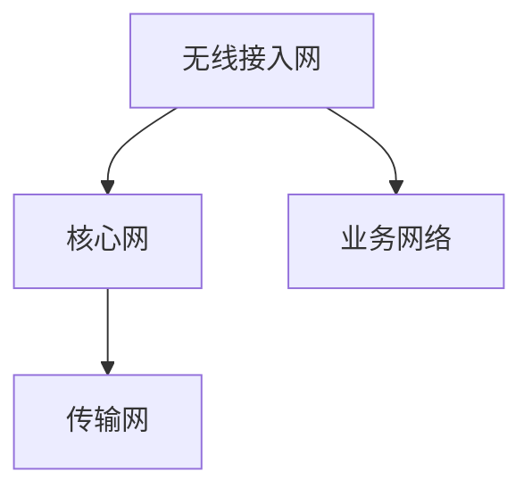

                 

# 5G技术：新一代移动网络的机遇与挑战

> 关键词：5G技术、移动网络、通信技术、网络架构、关键技术、应用场景、未来展望

> 摘要：本文深入探讨了5G技术的背景、关键特性、网络架构及其在不同领域的应用。通过对5G技术的全面剖析，文章展示了5G带来的巨大机遇，同时也指出了其在推广过程中可能面临的挑战，为读者提供了一个全面的5G技术展望。

### 目录大纲

----------------------------------------------------------------

## 目录大纲总结

----------------------------------------------------------------

### 第一部分：5G技术概述

## 第一部分概述

### 第1章：5G技术概述

#### 1.1 5G技术背景

##### 1.1.1 移动通信技术发展历程

##### 1.1.2 5G技术的提出与目标

##### 1.1.3 5G技术对社会的变革性影响

#### 1.2 5G关键技术

##### 1.2.1 千兆级网络速度

##### 1.2.2 超低延迟

##### 1.2.3 大连接能力

##### 1.2.4 网络切片技术

##### 1.2.5 边缘计算

#### 1.3 5G应用场景

##### 1.3.1 智能制造

##### 1.3.2 自动驾驶

##### 1.3.3 虚拟现实与增强现实

##### 1.3.4 医疗健康

##### 1.3.5 家庭娱乐

## 第二部分：5G网络架构与技术实现

### 第2章：5G网络架构

#### 2.1 5G网络架构概述

##### 2.1.1 5G网络架构分层结构

##### 2.1.2 5G网络的关键组成部分

#### 2.2 5G无线接入网

##### 2.2.1 NR（新无线电）技术

##### 2.2.2 NSA（非独立组网）与SA（独立组网）

#### 2.3 5G核心网

##### 2.3.1 接入网与核心网的关系

##### 2.3.2 5G核心网功能模块

##### 2.3.3 接入网与核心网的交互机制

### 第3章：5G关键技术实现

#### 3.1 5G关键技术概述

##### 3.1.1 千兆级网络速度实现方法

##### 3.1.2 超低延迟优化策略

##### 3.1.3 大连接能力与网络切片技术

##### 3.1.4 边缘计算与5G网络结合

#### 3.2 5G网络优化与性能分析

##### 3.2.1 5G网络性能指标

##### 3.2.2 5G网络优化策略

##### 3.2.3 5G网络性能案例分析

## 第三部分：5G应用案例与未来展望

### 第4章：5G在智能交通中的应用

#### 4.1 智能交通背景

##### 4.1.1 智能交通的定义与发展

##### 4.1.2 智能交通的重要性

#### 4.2 5G在智能交通中的应用场景

##### 4.2.1 自动驾驶

##### 4.2.2 智能交通信号控制

##### 4.2.3 车联网

#### 4.3 5G智能交通案例分析

##### 4.3.1 案例一：自动驾驶汽车

##### 4.3.2 案例二：智能交通信号控制

### 第5章：5G在智能制造中的应用

#### 5.1 智能制造背景

##### 5.1.1 智能制造的定义与特点

##### 5.1.2 智能制造的重要性

#### 5.2 5G在智能制造中的应用场景

##### 5.2.1 智能生产线

##### 5.2.2 工业互联网

##### 5.2.3 智能物流

#### 5.3 5G智能制造案例分析

##### 5.3.1 案例一：智能工厂

##### 5.3.2 案例二：智能物流

### 第6章：5G在医疗健康中的应用

#### 6.1 医疗健康背景

##### 6.1.1 医疗健康的定义与现状

##### 6.1.2 5G在医疗健康中的潜在价值

#### 6.2 5G在医疗健康中的应用场景

##### 6.2.1 远程医疗

##### 6.2.2 医疗设备智能化

##### 6.2.3 医疗大数据分析

#### 6.3 5G医疗健康案例分析

##### 6.3.1 案例一：远程医疗

##### 6.3.2 案例二：医疗设备智能化

### 第7章：5G未来的机遇与挑战

#### 7.1 5G未来的机遇

##### 7.1.1 5G对数字经济的影响

##### 7.1.2 5G推动社会创新

##### 7.1.3 5G在可持续发展中的应用

#### 7.2 5G面临的挑战

##### 7.2.1 技术标准与互操作性

##### 7.2.2 5G安全与隐私保护

##### 7.2.3 5G网络基础设施建设

----------------------------------------------------------------

## 第一部分：5G技术概述

### 第1章：5G技术概述

#### 1.1 5G技术背景

##### 1.1.1 移动通信技术发展历程

移动通信技术的发展经历了多个阶段，从1G的模拟语音通信，到2G的数字语音通信和短信服务，再到3G的宽带多媒体服务和4G的高速数据传输，每一次技术的迭代都极大地推动了移动通信的进步。随着物联网、自动驾驶、远程医疗等新兴应用的出现，传统移动通信网络已无法满足日益增长的数据需求。因此，5G技术的出现被视为移动通信领域的又一次重大突破。

##### 1.1.2 5G技术的提出与目标

5G技术作为第五代移动通信技术，其目标是在现有的4G LTE网络基础上实现更高的数据传输速度、更低的延迟、更大的网络容量和更高的设备连接密度。国际电信联盟（ITU）为5G设定了几个关键性能指标：峰值数据传输速率达到20Gbps、端到端延迟低于1毫秒、每平方米连接密度达到1000设备，以及数据传输可靠性达到99.9%。

##### 1.1.3 5G技术对社会的变革性影响

5G技术的引入不仅提升了通信网络的性能，还对社会生活带来了深刻的变革。例如，超低延迟使得实时控制成为可能，从而催生了自动驾驶、智能制造等前沿领域的发展。同时，5G的大连接能力将极大地推动物联网的普及，使智能城市、智能家居等成为现实。此外，5G技术的广泛应用将促进数字经济的发展，提升社会生产力和生活质量。

#### 1.2 5G关键技术

##### 1.2.1 千兆级网络速度

5G网络的峰值传输速率达到20Gbps，是4G网络的10倍以上。这一速度的提升主要得益于更高频段的利用、MIMO（多输入多输出）技术的应用以及波束成形技术的引入。

##### 1.2.2 超低延迟

5G网络的端到端延迟降低到1毫秒以下，这一特性使得实时通信成为可能。例如，在自动驾驶领域，低延迟的通信网络可以确保车辆在感知和决策过程中能够快速响应，提高行驶安全性。

##### 1.2.3 大连接能力

5G网络能够支持每平方米连接密度达到1000设备，这意味着在一个小区域内可以同时连接大量的设备，为物联网的普及提供了技术保障。

##### 1.2.4 网络切片技术

网络切片技术是5G的一个重要特性，它允许网络运营商根据不同应用场景的需求，为用户提供定制化的网络服务。通过虚拟化技术，5G网络可以将一个物理网络分割成多个虚拟网络，每个虚拟网络具有独立的资源、性能和服务质量。

##### 1.2.5 边缘计算

边缘计算是将数据处理和分析任务从云端转移到网络边缘，靠近数据源进行处理。5G网络的低延迟和高带宽特性使得边缘计算成为可能，从而实现实时数据处理和响应。

#### 1.3 5G应用场景

##### 1.3.1 智能制造

5G技术为智能制造提供了高速、低延迟的网络支持，使得工厂设备能够实时采集和分析数据，实现生产过程的智能化和自动化。

##### 1.3.2 自动驾驶

自动驾驶车辆需要实时获取道路信息并进行快速决策，5G网络的超低延迟和可靠连接能力为自动驾驶技术的实现提供了关键保障。

##### 1.3.3 虚拟现实与增强现实

虚拟现实和增强现实应用对网络传输速度和延迟要求极高，5G技术的高带宽和低延迟特性使得这些应用得以更加流畅和真实地体验。

##### 1.3.4 医疗健康

5G技术在医疗健康领域的应用包括远程医疗、智能医疗设备和医疗大数据分析，这些应用都依赖于高速、低延迟的通信网络。

##### 1.3.5 家庭娱乐

5G技术将带来更加丰富和多样化的家庭娱乐体验，例如超高清视频流媒体服务、云游戏等。

#### 1.4 5G网络架构

##### 1.4.1 5G网络架构概述

5G网络架构包括无线接入网、核心网、传输网和业务网络，其中无线接入网是5G网络的核心组成部分。

##### 1.4.2 5G无线接入网

5G无线接入网采用NR（新无线电）技术，能够实现更高的数据传输速率和更低的延迟。此外，5G网络还引入了NSA（非独立组网）和SA（独立组网）两种组网模式，以适应不同场景的需求。

##### 1.4.3 5G核心网

5G核心网采用服务化架构，实现了网络功能的虚拟化和自动化。核心网的主要功能模块包括用户平面和控制平面，以及不同功能模块之间的交互机制。

#### 1.5 5G网络关键技术实现

##### 1.5.1 千兆级网络速度实现方法

实现千兆级网络速度的关键在于提高频谱利用率和传输效率。5G网络通过采用更高频段的频谱资源、多天线技术（MIMO）和波束成形技术，大幅提升了网络传输速率。

##### 1.5.2 超低延迟优化策略

超低延迟的实现依赖于网络架构的优化和传输路径的缩短。5G网络通过边缘计算和低延迟传输协议，有效降低了网络延迟。

##### 1.5.3 大连接能力与网络切片技术

大连接能力是通过提高网络容量和优化资源分配实现的。网络切片技术则通过虚拟化和动态资源分配，为不同应用提供定制化的网络服务。

##### 1.5.4 边缘计算与5G网络结合

边缘计算与5G网络的结合，通过将数据处理和分析任务从云端转移到网络边缘，实现了实时数据处理和响应，提升了网络性能和用户体验。

### 总结

5G技术作为新一代移动通信技术，其高速率、低延迟、大连接能力和网络切片等关键特性，为各个领域的创新和发展带来了前所未有的机遇。然而，5G技术的推广和实现也面临诸多挑战，包括网络基础设施建设、技术标准互操作性以及网络安全等问题。在接下来的章节中，我们将进一步探讨5G网络架构、关键技术实现及其在不同领域的应用，以全面了解5G技术的全貌。

----------------------------------------------------------------

## 第二部分：5G网络架构与技术实现

### 第2章：5G网络架构

#### 2.1 5G网络架构概述

5G网络架构相较于前几代移动通信网络，在设计上进行了全面的升级和优化。5G网络架构可以概括为三个主要层次：无线接入网、核心网和传输网。

##### 2.1.1 5G网络架构分层结构

5G网络架构分层结构如图所示：

无线接入网主要负责无线信号的传输，核心网负责用户数据的处理和控制，传输网则确保数据在核心网和无线接入网之间的传输。业务网络作为外部连接，使得5G网络能够与互联网、企业内网等不同类型的网络进行互联。

##### 2.1.2 5G网络的关键组成部分

5G网络的关键组成部分包括：

1. **无线接入网**：无线接入网是5G网络的核心组成部分，主要负责无线信号的传输。5G无线接入网采用NR（新无线电）技术，其特点包括更高频段的频谱利用、多天线技术（MIMO）和波束成形技术。

2. **核心网**：5G核心网采用了服务化架构，实现了网络功能的虚拟化和自动化。5G核心网的主要功能模块包括用户平面（UPF）、控制平面（CF）、网络切片管理（NSMF）和网络功能虚拟化（NFV）等。

3. **传输网**：5G传输网负责核心网和无线接入网之间的数据传输，采用IP化架构，实现了网络的高效传输和资源管理。

4. **业务网络**：业务网络是5G网络与互联网、企业内网等外部网络的连接桥梁，通过IP地址分配、路由选择等机制实现不同网络之间的数据交互。

#### 2.2 5G无线接入网

5G无线接入网采用NR（新无线电）技术，其特点如下：

##### 2.2.1 NR（新无线电）技术

NR技术是5G无线接入网的关键技术，其设计目标是实现更高的数据传输速率和更低的延迟。NR技术在以下几个方面进行了优化：

1. **高频段频谱利用**：NR技术引入了毫米波频段，使频谱利用更加充分，从而提高了数据传输速率。

2. **多天线技术（MIMO）**：NR采用了MIMO技术，通过多天线阵列实现数据传输的并行处理，提高了网络容量和传输效率。

3. **波束成形技术**：NR技术引入了波束成形技术，通过对信号波束的定向发送和接收，提高了信号传输的可靠性和效率。

##### 2.2.2 NSA（非独立组网）与SA（独立组网）

5G无线接入网存在两种组网模式：NSA（非独立组网）和SA（独立组网）。

1. **NSA（非独立组网）**：NSA模式下，5G无线接入网依赖于4G核心网，通过4G无线接入网进行数据传输。NSA模式适用于初期5G网络的部署，可以减少网络升级的成本和复杂性。

2. **SA（独立组网）**：SA模式下，5G无线接入网独立运行，拥有完整的5G核心网。SA模式提供了更高的网络性能和可靠性，但需要建设独立的5G核心网，成本较高。

#### 2.3 5G核心网

5G核心网是5G网络的大脑，负责用户数据的管理和控制。5G核心网采用了服务化架构，实现了网络功能的虚拟化和自动化。5G核心网的主要功能模块如下：

##### 2.3.1 接入网与核心网的关系

接入网和核心网之间通过接口进行连接，主要包括：

1. **用户平面接口（UPF）**：用户平面接口负责用户数据的传输和处理，是接入网和核心网之间的数据通道。

2. **控制平面接口（CF）**：控制平面接口负责用户信令的传输和处理，包括用户身份验证、网络连接控制等功能。

##### 2.3.2 5G核心网功能模块

5G核心网的主要功能模块包括：

1. **用户平面功能模块（UPF）**：用户平面功能模块负责用户数据的传输和处理，包括数据包转发、QoS（服务质量）控制等功能。

2. **控制平面功能模块（CF）**：控制平面功能模块负责用户信令的传输和处理，包括用户身份验证、网络连接控制等功能。

3. **网络切片管理功能模块（NSMF）**：网络切片管理功能模块负责为不同应用场景提供定制化的网络服务，包括网络切片的创建、管理和分配等功能。

4. **网络功能虚拟化功能模块（NFV）**：网络功能虚拟化功能模块通过虚拟化技术，将传统的网络功能模块虚拟化为软件模块，提高了网络的灵活性和可扩展性。

##### 2.3.3 接入网与核心网的交互机制

接入网与核心网之间的交互机制主要包括：

1. **会话控制**：会话控制协议（如HSS、MME）负责用户身份验证、会话管理等功能，确保用户在接入网和核心网之间的无缝切换。

2. **数据传输**：数据传输协议（如GTP）负责用户数据在接入网和核心网之间的传输，确保数据传输的完整性和可靠性。

3. **QoS控制**：QoS控制协议（如RAB、PGW）负责用户数据的优先级控制，确保不同应用场景的用户数据得到合理的资源分配。

#### 2.4 5G网络架构的优势与挑战

##### 2.4.1 优势

1. **高速率**：5G网络的高速率特性使得大带宽应用得以实现，如超高清视频流媒体、虚拟现实等。

2. **低延迟**：5G网络的低延迟特性使得实时通信和远程控制成为可能，如自动驾驶、远程手术等。

3. **大连接能力**：5G网络的大连接能力使得物联网应用得以普及，如智能家居、智能交通等。

4. **灵活性和可扩展性**：5G网络的服务化架构和虚拟化技术提高了网络的灵活性和可扩展性，适应不同应用场景的需求。

##### 2.4.2 挑战

1. **网络基础设施建设**：5G网络需要建设大量的基站和光纤网络，成本较高，对网络基础设施建设提出了更高的要求。

2. **频谱资源分配**：5G网络需要更多的频谱资源，频谱资源的分配和管理成为5G网络推广的重要挑战。

3. **技术标准互操作性**：5G网络涉及多种技术和设备，技术标准互操作性是实现5G网络协同工作的关键挑战。

4. **网络安全与隐私保护**：随着5G网络的大规模普及，网络安全和隐私保护成为越来越重要的挑战。

#### 2.5 5G网络架构的未来发展

##### 2.5.1 未来发展趋势

1. **网络智能化**：随着人工智能技术的不断发展，5G网络将逐步实现智能化，提高网络的自动化水平和性能。

2. **边缘计算与云计算结合**：边缘计算与云计算的结合将进一步提高5G网络的性能和可靠性，满足更多实时应用的需求。

3. **网络虚拟化和容器化**：网络虚拟化和容器化技术的应用将进一步提高5G网络的灵活性和可扩展性，降低网络部署和维护成本。

4. **6G技术预研**：随着5G技术的普及，6G技术的预研已经开始，未来的6G网络将进一步提升通信性能，为人类社会带来更多创新应用。

##### 2.5.2 未来挑战

1. **频谱资源紧缺**：随着通信技术的不断发展，频谱资源日益紧缺，如何高效利用频谱资源成为未来网络发展的重要挑战。

2. **网络能耗与环保**：5G网络的高密度基站和大规模设备部署，带来了较高的能耗问题，如何实现绿色环保的网络成为未来研究的重要方向。

3. **网络安全与隐私保护**：随着网络规模的扩大和用户数据的增加，网络安全和隐私保护面临更大的挑战，需要不断加强网络安全的防护措施。

### 总结

5G网络架构的分层设计和关键技术的创新，为5G网络的高速率、低延迟、大连接能力提供了技术保障。然而，5G网络的推广和实现仍面临诸多挑战，需要持续优化和改进。在未来的发展中，5G网络将逐步实现智能化、边缘计算与云计算的结合，为人类社会带来更多的创新应用。同时，如何应对频谱资源紧缺、网络能耗与环保以及网络安全与隐私保护等挑战，也将是未来5G网络发展的重要方向。

----------------------------------------------------------------

### 第3章：5G关键技术实现

#### 3.1 5G关键技术概述

5G技术以其高速率、低延迟、大连接能力和网络切片技术为核心特性，成为新一代移动通信技术的代表。这些关键技术的实现不仅依赖于先进的技术方案，还涉及到复杂的系统工程和优化策略。以下是对5G关键技术实现的详细分析。

##### 3.1.1 千兆级网络速度实现方法

千兆级网络速度的实现依赖于多种技术的综合运用：

1. **高频段频谱利用**：5G网络采用了毫米波频段，这一频段具有较高的带宽容量，可以支持更高的数据传输速率。毫米波频段相对于较低频段的另一个优势是信号方向性强，通过波束成形技术可以更有效地利用频谱资源。

2. **多天线技术（MIMO）**：MIMO技术通过多个天线发送和接收信号，实现了数据传输的并行处理，从而提高了网络容量和传输效率。在5G网络中，MIMO技术可以达到4T4R（4个发送天线和4个接收天线）的水平，进一步提升了数据传输速率。

3. **波束成形技术**：波束成形技术通过调整天线阵列的方向，将信号聚焦在目标区域，提高了信号传输的效率和可靠性。这一技术特别适用于高频段频谱，有助于减少信号衰减和干扰。

4. **多连接技术**：5G网络还引入了多连接技术，即一个用户可以同时连接多个网络节点，从而实现更高的数据传输速率。通过智能调度和资源分配，多连接技术可以在保证用户体验的同时，提高网络的整体利用率。

##### 3.1.2 超低延迟优化策略

超低延迟是5G网络的重要特性之一，对于实时应用如自动驾驶、远程手术等至关重要。实现超低延迟的优化策略包括：

1. **网络架构优化**：通过降低网络层级和缩短传输路径，减少数据传输的延迟。例如，采用边缘计算技术，将数据处理任务从中心云迁移到网络边缘，从而缩短响应时间。

2. **低延迟传输协议**：采用低延迟的传输协议，如QUIC（快速用户数据报协议），可以有效减少传输过程中的延迟。QUIC协议通过优化连接建立、数据传输和错误恢复等环节，提高了网络传输效率。

3. **智能调度与优化**：通过智能调度算法，动态调整网络资源分配，确保关键应用得到优先保障。例如，在自动驾驶场景中，网络调度系统可以根据车辆的位置和速度，优先分配网络资源，确保实时通信的稳定性。

4. **边缘计算**：边缘计算通过在网络边缘部署计算节点，将数据处理任务分散到多个节点上，减少了数据传输的距离和延迟。5G网络中的边缘计算节点可以实时处理和分析数据，提供快速响应。

##### 3.1.3 大连接能力与网络切片技术

5G网络的大连接能力是通过网络切片技术实现的，网络切片技术允许运营商为不同应用场景创建多个虚拟网络，从而实现灵活的网络资源分配。实现大连接能力和网络切片技术的方法包括：

1. **网络虚拟化**：通过网络虚拟化技术，将物理网络资源虚拟化为多个虚拟网络，实现资源的高效利用。虚拟化技术包括虚拟化网络功能（VNF）和虚拟化基础设施（VIM），通过软件定义网络（SDN）和网络功能虚拟化（NFV）实现。

2. **资源调度与管理**：通过智能调度算法，动态分配网络资源，确保不同应用场景得到合理分配。资源调度系统可以根据网络负载、用户需求和QoS要求，实时调整网络资源分配。

3. **网络切片管理**：网络切片管理功能模块负责创建、配置和管理网络切片。网络切片管理包括切片的创建、生命周期管理、资源分配和服务保障等环节，通过SDN和NFV技术实现。

4. **QoS保障**：为了保证不同应用场景的服务质量，5G网络采用QoS保障机制，通过优先级调度、带宽分配和流量控制等手段，确保关键应用得到优先保障。

##### 3.1.4 边缘计算与5G网络结合

边缘计算与5G网络的结合，通过将数据处理任务从中心云迁移到网络边缘，实现了实时数据处理和响应，提升了网络性能和用户体验。实现边缘计算与5G网络结合的方法包括：

1. **边缘计算节点部署**：在5G网络中部署边缘计算节点，将计算任务分散到网络边缘。边缘计算节点可以是专用服务器、虚拟机或容器，通过分布式计算架构实现数据处理任务的并行处理。

2. **数据传输优化**：通过优化数据传输路径，减少数据传输的延迟和带宽消耗。例如，采用边缘缓存技术，将热门数据缓存到边缘节点，减少中心云的数据访问压力。

3. **智能调度与协同**：通过智能调度算法，动态分配计算任务和资源，确保边缘计算节点的高效运行。智能调度系统可以根据网络负载、应用需求和节点性能，实时调整任务分配和资源使用。

4. **安全与隐私保护**：边缘计算涉及到大量用户数据，需要加强安全与隐私保护。通过加密通信、访问控制和安全审计等技术手段，确保用户数据的安全性和隐私性。

#### 3.2 5G网络优化与性能分析

5G网络的优化与性能分析是确保网络高效运行和用户良好体验的关键。以下是对5G网络优化与性能分析的几个方面：

##### 3.2.1 5G网络性能指标

5G网络的性能指标主要包括：

1. **数据传输速率**：数据传输速率是衡量网络性能的重要指标，通常以比特每秒（bps）或千兆比特每秒（Gbps）表示。5G网络的峰值传输速率达到20Gbps，是4G网络的数倍。

2. **延迟**：延迟是指数据从发送端到接收端所需的时间，通常以毫秒（ms）为单位。5G网络的端到端延迟低于1毫秒，显著降低了实时应用的延迟。

3. **连接密度**：连接密度是指单位面积内可以支持的最大设备连接数。5G网络的连接密度达到1000设备每平方米，是4G网络的数十倍。

4. **网络可靠性**：网络可靠性是指网络在长时间运行中的稳定性和可用性，通常以百分比表示。5G网络的数据传输可靠性达到99.9%，确保了高可靠性应用的需求。

##### 3.2.2 5G网络优化策略

为了提升5G网络的性能和用户体验，需要采取一系列优化策略，包括：

1. **频谱资源优化**：通过智能频谱管理，动态调整频谱资源的分配，优化频谱利用效率。例如，采用动态频谱共享技术，在空闲频谱资源上分配更多带宽，提高网络容量。

2. **网络拓扑优化**：通过优化网络拓扑结构，减少数据传输的路径长度，降低网络延迟。例如，通过引入多路径传输技术，实现数据的多路径传输，提高网络的冗余度和可靠性。

3. **负载均衡**：通过智能负载均衡技术，动态分配网络流量，避免网络拥塞和性能下降。负载均衡算法可以根据网络负载、节点性能和用户需求，实现流量的合理分配。

4. **QoS优化**：通过QoS优化技术，确保关键应用得到优先保障。QoS优化策略可以根据应用类型、用户需求和网络状况，动态调整带宽分配和优先级。

##### 3.2.3 5G网络性能案例分析

为了更好地理解5G网络的性能，以下是一个5G网络性能案例分析：

假设在一个智能交通场景中，5G网络需要支持大量车辆同时连接，实现自动驾驶和实时交通信号控制。以下是5G网络性能分析的关键指标：

1. **数据传输速率**：为了保证自动驾驶车辆的实时数据传输，5G网络需要在高峰期提供至少10Gbps的带宽，确保车辆传感器和摄像头数据的高速传输。

2. **延迟**：为了保证自动驾驶车辆的实时响应，5G网络的端到端延迟需要低于10毫秒，确保车辆在感知、决策和动作之间无缝切换。

3. **连接密度**：在繁忙的城市交通中，5G网络需要支持每平方米1000辆车辆的连接，实现高密度车联网应用。

4. **网络可靠性**：为了确保交通系统的稳定运行，5G网络的数据传输可靠性需要达到99.99%，确保长时间高强度的运行。

通过对5G网络性能的持续优化和提升，可以更好地满足智能交通、智能制造、远程医疗等领域的需求，推动社会的数字化转型和创新发展。

#### 3.3 5G关键技术实现的影响与展望

5G关键技术的实现不仅对现有通信网络带来了巨大的变革，也对社会各个领域产生了深远的影响。以下是对5G关键技术实现的影响与展望：

##### 3.3.1 对社会的影响

1. **加速数字化转型**：5G技术的高速率、低延迟和大连接能力，为数字经济的发展提供了强有力的支撑，推动了各行各业向数字化、智能化方向转型。

2. **推动社会创新**：5G技术的引入，为创新创业提供了新的机遇，催生了众多新兴行业和应用，如自动驾驶、智能医疗、虚拟现实等。

3. **提升生活质量**：5G技术的普及，使得智能家居、远程教育、在线娱乐等应用更加便捷和高效，极大地提升了人们的生活质量。

##### 3.3.2 对行业的影响

1. **重塑产业生态**：5G技术的广泛应用，将重新定义产业链，推动产业链上下游的协同创新，形成新的产业生态。

2. **优化资源配置**：5G技术的大连接能力和网络切片技术，使得资源分配更加灵活和高效，有助于优化社会资源的配置。

3. **提高生产效率**：5G技术在智能制造、智能物流等领域的应用，通过实现设备互联和数据共享，提高了生产效率，降低了成本。

##### 3.3.3 未来展望

1. **网络智能化**：随着人工智能技术的发展，5G网络将逐步实现智能化，通过智能调度、智能优化等技术，提高网络的自动化水平和性能。

2. **边缘计算与云计算结合**：未来，边缘计算与云计算的结合将进一步深化，通过网络架构的优化和技术的融合，实现更加高效的数据处理和响应。

3. **6G技术预研**：随着5G技术的成熟和应用，6G技术的预研已经开始，未来的6G网络将进一步提升通信性能，为人类社会带来更多的创新应用。

#### 3.4 总结

5G关键技术的实现，为新一代移动通信网络的发展奠定了坚实基础。通过高频段频谱利用、多天线技术、波束成形技术、边缘计算等多种技术的综合应用，5G网络实现了高速率、低延迟、大连接能力等核心特性。未来，随着网络智能化、边缘计算与云计算的深入结合，5G技术将继续发挥其巨大潜力，推动社会的数字化转型和创新发展。

----------------------------------------------------------------

### 第4章：5G在智能交通中的应用

#### 4.1 智能交通背景

##### 4.1.1 智能交通的定义与发展

智能交通系统（Intelligent Transportation System，ITS）是指利用现代信息技术、数据通信传输技术、电子传感技术、控制技术和管理科学等理论方法，对传统的交通运输系统进行改造和优化，以实现交通的安全、快速、高效、环保和舒适。智能交通系统的发展可以追溯到20世纪80年代，随着计算机技术和通信技术的快速发展，ITS逐渐从理论研究走向实际应用。

##### 4.1.2 智能交通的重要性

智能交通系统在现代社会中扮演着重要角色，主要体现在以下几个方面：

1. **提升交通安全**：通过实时监控和智能预警，智能交通系统能够有效减少交通事故的发生，提高道路使用者的安全水平。

2. **优化交通流量**：智能交通系统通过对交通数据的实时分析和优化，能够有效地调节交通信号、疏导交通流量，减少拥堵，提高道路通行效率。

3. **促进节能减排**：智能交通系统通过优化交通流量和减少交通拥堵，有助于降低车辆的能耗和排放，促进环保和可持续发展。

4. **提升服务质量**：智能交通系统为道路使用者提供了丰富的信息服务，如实时路况、导航、电子收费等，提升了交通服务的质量和用户体验。

#### 4.2 5G在智能交通中的应用场景

##### 4.2.1 自动驾驶

自动驾驶是5G在智能交通领域最具前景的应用之一。5G网络的高速率和低延迟特性为自动驾驶车辆提供了稳定的通信保障，使得车辆能够实时获取路况信息、感知周围环境并进行决策。以下是一些具体应用：

1. **实时路况感知**：自动驾驶车辆通过车联网（V2X）技术，与其他车辆、基础设施和云平台进行实时通信，获取道路上的实时路况信息，实现自主导航。

2. **环境感知与决策**：自动驾驶车辆配备多种传感器（如摄像头、激光雷达等），通过5G网络将感知数据传输至云端进行分析和处理，车辆根据分析结果进行实时决策，如调整行驶速度、换道或避让障碍物。

3. **远程控制与支持**：在特定情况下，如自动驾驶车辆遇到故障或突发情况时，远程控制中心可以通过5G网络对车辆进行实时控制和干预，确保车辆安全。

##### 4.2.2 智能交通信号控制

5G技术在智能交通信号控制中的应用，可以显著提升城市交通管理水平。以下是几个具体应用场景：

1. **自适应交通信号控制**：通过5G网络，智能交通信号系统可以实时采集道路上的交通流量、车辆速度等信息，根据实时数据动态调整交通信号灯的时长和切换策略，优化交通流量。

2. **协同信号控制**：在多路口区域，5G网络可以实现交通信号的协同控制，通过信息共享和优化算法，实现相邻路口信号灯的联动，减少交通拥堵和排队长度。

3. **交通事件预警与处理**：智能交通信号系统可以通过5G网络实时监测道路状况，当检测到交通事故、道路施工等事件时，系统能够及时发出预警，并自动调整信号灯状态，引导交通流绕行，减轻拥堵。

##### 4.2.3 车联网

车联网（Vehicle-to-Everything，V2X）是5G在智能交通领域的重要应用之一，通过5G网络实现车辆与车辆、车辆与基础设施、车辆与行人之间的通信，提高交通系统的安全性、效率和便捷性。以下是一些具体应用：

1. **车辆间通信（V2V）**：车辆通过5G网络进行通信，可以实现车辆间的信息共享，如行驶方向、速度、路况等，提高驾驶安全性和通行效率。

2. **车辆与基础设施通信（V2I）**：车辆与基础设施（如交通信号灯、路侧单元等）通过5G网络进行通信，可以实现交通信息的实时交互，如交通信号灯状态、道路施工信息等，帮助车辆进行智能导航和行驶决策。

3. **车辆与行人通信（V2P）**：车辆通过5G网络与行人设备（如智能手机、可穿戴设备等）进行通信，可以实现行人信息的实时传递，如行人意图、位置等，帮助车辆避免与行人发生碰撞。

#### 4.3 5G智能交通案例分析

##### 4.3.1 案例一：自动驾驶汽车

自动驾驶汽车是5G在智能交通领域的一个重要应用案例。以某城市的自动驾驶试点项目为例，该项目利用5G网络实现了以下功能：

1. **实时路况感知**：自动驾驶车辆通过5G网络与道路上的其他车辆、基础设施和云端平台进行实时通信，获取道路上的实时路况信息，实现自主导航和避让障碍物。

2. **环境感知与决策**：自动驾驶车辆配备了激光雷达、摄像头、毫米波雷达等多种传感器，通过5G网络将感知数据传输至云端进行分析和处理，车辆根据分析结果进行实时决策，如调整行驶速度、换道或避让障碍物。

3. **远程控制与支持**：在特定情况下，如自动驾驶车辆遇到故障或突发情况时，远程控制中心可以通过5G网络对车辆进行实时控制和干预，确保车辆安全。

该项目取得了显著成效，自动驾驶车辆在试点区域内的行驶安全性和效率显著提升，为未来的自动驾驶技术发展提供了宝贵经验。

##### 4.3.2 案例二：智能交通信号控制

以某城市的智能交通信号控制项目为例，该项目利用5G网络实现了以下功能：

1. **自适应交通信号控制**：智能交通信号系统通过5G网络实时采集道路上的交通流量、车辆速度等信息，根据实时数据动态调整交通信号灯的时长和切换策略，优化交通流量。

2. **协同信号控制**：在多路口区域，5G网络实现了交通信号的协同控制，通过信息共享和优化算法，实现相邻路口信号灯的联动，减少交通拥堵和排队长度。

3. **交通事件预警与处理**：智能交通信号系统通过5G网络实时监测道路状况，当检测到交通事故、道路施工等事件时，系统能够及时发出预警，并自动调整信号灯状态，引导交通流绕行，减轻拥堵。

该项目显著提升了城市的交通管理水平，减少了交通拥堵和排放，为其他城市的智能交通发展提供了参考。

#### 4.4 总结

5G技术在智能交通中的应用，通过实现自动驾驶、智能交通信号控制、车联网等场景，极大地提升了交通系统的安全、效率和便捷性。未来，随着5G技术的进一步发展和普及，智能交通系统将得到更广泛的应用，为人们的出行提供更加智能、安全、高效的解决方案。同时，5G技术在智能交通中的应用也将为城市的可持续发展和社会进步带来新的机遇和挑战。

----------------------------------------------------------------

### 第5章：5G在智能制造中的应用

#### 5.1 智能制造背景

##### 5.1.1 智能制造的定义与特点

智能制造是利用先进的传感技术、网络技术、自动化技术等，实现生产过程的智能化和自动化。智能制造的主要特点包括：

1. **高度自动化**：通过自动化设备和系统，实现生产过程的无人化或少人化，提高生产效率和质量。

2. **实时监控与数据采集**：利用传感器和智能监控系统，实时采集生产过程中的数据，为生产优化和决策提供数据支持。

3. **网络互联与信息共享**：通过物联网（IoT）和工业互联网，实现设备、系统、企业之间的信息共享和互联互通，提高生产协同和资源利用率。

4. **自适应与自优化**：利用人工智能和大数据分析技术，实现生产过程的自适应和自优化，提高生产灵活性和响应速度。

##### 5.1.2 智能制造的重要性

智能制造是现代工业发展的关键趋势，对于提升国家制造业竞争力、推动产业转型升级具有重要意义：

1. **提高生产效率**：智能制造通过自动化设备和系统，大幅提高生产效率和产品质量，降低生产成本。

2. **增强竞争力**：智能制造使得企业能够快速响应市场变化，灵活调整生产计划和产品结构，增强市场竞争力。

3. **促进产业升级**：智能制造推动传统制造业向数字化、网络化、智能化方向发展，促进产业结构优化和产业升级。

4. **提升生活质量**：智能制造带来更多高质量产品和服务，提高人们的生活质量和幸福感。

#### 5.2 5G在智能制造中的应用场景

##### 5.2.1 智能生产线

5G技术在智能生产线中的应用，主要体现在以下几个方面：

1. **设备互联**：通过5G网络，实现生产线各设备之间的互联互通，实现实时数据传输和协同作业，提高生产效率和精度。

2. **实时监控**：利用5G网络，实现生产过程中的设备状态、工艺参数和产品质量的实时监控，提高生产过程的可控性和可靠性。

3. **远程控制**：通过5G网络，实现对生产设备的远程监控和控制，实现生产过程的远程调度和优化，提高生产灵活性。

4. **故障诊断与预测维护**：利用5G网络，实现设备运行数据的实时收集和分析，进行故障诊断和预测维护，降低设备故障率和停机时间。

##### 5.2.2 工业互联网

5G技术在工业互联网中的应用，主要体现在以下几个方面：

1. **设备互联互通**：通过5G网络，实现工业设备、系统和企业之间的数据传输和互联互通，构建工业互联网生态系统。

2. **数据采集与分析**：利用5G网络，实现生产数据的实时采集和传输，通过大数据分析和人工智能技术，优化生产过程和产品质量。

3. **远程监控与控制**：通过5G网络，实现对工业设备的远程监控和控制，实现生产过程的远程调度和管理，提高生产效率。

4. **协同制造**：通过5G网络，实现企业之间、企业内部各部门之间的信息共享和协同作业，提高生产协同和资源利用率。

##### 5.2.3 智能物流

5G技术在智能物流中的应用，主要体现在以下几个方面：

1. **实时监控与调度**：通过5G网络，实现物流运输过程中的实时监控和调度，提高物流效率和准确性。

2. **智能仓储管理**：利用5G网络，实现仓储设备的智能化管理，提高仓储空间的利用率和管理效率。

3. **车辆追踪与管理**：通过5G网络，实现物流车辆的实时追踪和管理，提高运输安全和效率。

4. **协同配送**：通过5G网络，实现物流企业之间的信息共享和协同配送，提高配送速度和服务质量。

#### 5.3 5G智能制造案例分析

##### 5.3.1 案例一：智能工厂

某公司通过引入5G技术，实现了智能工厂的构建。具体应用包括：

1. **设备互联**：通过5G网络，实现生产设备之间的互联互通，实现数据实时传输和协同作业，提高生产效率和精度。

2. **实时监控**：利用5G网络，实现对生产过程的实时监控，包括设备状态、工艺参数和产品质量等，提高生产过程的可控性和可靠性。

3. **远程控制**：通过5G网络，实现对生产设备的远程监控和控制，实现生产过程的远程调度和优化，提高生产灵活性。

4. **故障诊断与预测维护**：利用5G网络，实现设备运行数据的实时收集和分析，进行故障诊断和预测维护，降低设备故障率和停机时间。

通过智能工厂的构建，该公司生产效率提高了30%，产品质量提升了20%，运营成本降低了15%。

##### 5.3.2 案例二：智能物流

某物流公司通过引入5G技术，实现了智能物流的优化。具体应用包括：

1. **实时监控与调度**：通过5G网络，实现对物流运输过程的实时监控和调度，提高物流效率和准确性。

2. **智能仓储管理**：利用5G网络，实现仓储设备的智能化管理，提高仓储空间的利用率和管理效率。

3. **车辆追踪与管理**：通过5G网络，实现物流车辆的实时追踪和管理，提高运输安全和效率。

4. **协同配送**：通过5G网络，实现物流企业之间的信息共享和协同配送，提高配送速度和服务质量。

通过智能物流的优化，该公司物流配送时间缩短了20%，运输成本降低了10%，客户满意度提升了15%。

#### 5.4 总结

5G技术在智能制造中的应用，通过实现设备互联、实时监控、远程控制、故障诊断与预测维护等功能，极大地提升了生产效率和产品质量，降低了运营成本。未来，随着5G技术的进一步发展和普及，智能制造将得到更广泛的应用，为制造业的发展带来新的机遇和挑战。

----------------------------------------------------------------

### 第6章：5G在医疗健康中的应用

#### 6.1 医疗健康背景

##### 6.1.1 医疗健康的定义与现状

医疗健康是指通过医疗技术和医疗服务的提供，达到维护和恢复人类健康的目的。当前，医疗健康领域正面临着一系列挑战，如人口老龄化、慢性病增多、医疗资源分配不均等。为了应对这些挑战，医疗健康领域正逐步向信息化、智能化方向发展。

##### 6.1.2 5G在医疗健康中的潜在价值

5G技术在医疗健康领域具有巨大的潜在价值，主要体现在以下几个方面：

1. **远程医疗**：5G技术的低延迟和高带宽特性使得远程医疗成为可能，医生可以通过实时视频、数据传输等方式，为偏远地区的患者提供医疗服务，提高医疗资源的可及性。

2. **医疗设备智能化**：5G技术可以实现医疗设备的远程监控和数据分析，提高设备的运行效率和诊断精度，例如智能监护仪、智能手术机器人等。

3. **医疗大数据分析**：5G技术的大连接能力使得医疗数据的传输更加快速和稳定，有助于实现医疗大数据的实时分析和挖掘，为疾病预防、诊断和治疗提供有力支持。

#### 6.2 5G在医疗健康中的应用场景

##### 6.2.1 远程医疗

远程医疗是5G技术在医疗健康领域的重要应用之一。通过5G网络，医生可以实时为患者提供诊断和治疗建议，不受地理和时间的限制。具体应用场景包括：

1. **远程诊断**：医生可以通过远程视频和影像传输，对患者进行初步诊断，提高诊断的准确性和速度。

2. **远程手术**：5G网络的低延迟特性使得远程手术成为可能，医生可以在远程操控手术机器人，完成复杂的手术操作。

3. **远程监护**：5G网络可以实现患者生命体征的实时监控，医生可以远程监测患者的健康状况，及时采取措施。

##### 6.2.2 医疗设备智能化

5G技术可以大大提升医疗设备的智能化水平，包括以下几个方面：

1. **智能监护仪**：智能监护仪通过5G网络，可以实时传输患者的生命体征数据，医生可以远程监控患者的健康状况，及时发现异常。

2. **智能手术机器人**：5G网络可以实现手术机器人的远程控制，医生可以在远程进行手术操作，提高手术的精度和安全性。

3. **智能诊断设备**：5G技术可以实现诊断设备的远程控制和数据分析，提高诊断的准确性和效率。

##### 6.2.3 医疗大数据分析

5G技术的大连接能力使得医疗数据的传输更加快速和稳定，有助于实现医疗大数据的实时分析和挖掘，为疾病预防、诊断和治疗提供有力支持。具体应用场景包括：

1. **疾病预测**：通过对大量医疗数据的分析，可以预测某些疾病的发病趋势和风险，帮助医生制定预防措施。

2. **个性化治疗**：通过对患者的医疗数据进行分析，可以制定个性化的治疗方案，提高治疗效果。

3. **药物研发**：通过对药物临床试验数据的分析，可以加速药物研发过程，提高药物的安全性和有效性。

#### 6.3 5G医疗健康案例分析

##### 6.3.1 案例一：远程医疗

某医院通过引入5G技术，实现了远程医疗服务。具体应用包括：

1. **远程诊断**：医生可以通过5G网络，实时查看患者的影像数据，进行远程诊断，提高了诊断的准确性和速度。

2. **远程手术**：医生通过5G网络操控手术机器人，成功完成了一例复杂的远程手术，手术精度和安全性得到了显著提升。

3. **远程监护**：通过5G网络，医生可以实时监控患者的生命体征，及时发现并处理异常情况。

##### 6.3.2 案例二：医疗设备智能化

某医院引入了智能监护仪和智能手术机器人，通过5G网络实现了医疗设备的智能化。具体应用包括：

1. **智能监护仪**：智能监护仪通过5G网络，实时传输患者的生命体征数据，医生可以远程监控患者的健康状况，提高了监护的效率和准确性。

2. **智能手术机器人**：医生通过5G网络远程操控手术机器人，成功完成了一例复杂的手术，手术过程更加精细，术后恢复效果显著。

#### 6.4 总结

5G技术在医疗健康领域的应用，通过实现远程医疗、医疗设备智能化和医疗大数据分析等功能，极大地提升了医疗服务的质量和效率，为医疗健康领域的发展带来了新的机遇。未来，随着5G技术的进一步发展和普及，医疗健康领域将迎来更加智能、高效和便捷的时代。

----------------------------------------------------------------

### 第7章：5G未来的机遇与挑战

#### 7.1 5G未来的机遇

##### 7.1.1 5G对数字经济的影响

5G技术的引入将为数字经济带来前所未有的发展机遇。首先，5G网络的高速率、低延迟和大连接能力，将极大地促进大数据、云计算、人工智能等新兴技术的应用，为数字经济的快速增长提供强有力的支撑。例如，5G网络可以支持大规模的物联网设备接入，实现实时数据传输和分析，从而推动智能制造、智慧城市等领域的快速发展。其次，5G技术将推动传统产业的数字化转型，提高生产效率和服务质量，降低运营成本，从而增强企业的市场竞争力。此外，5G网络将为创新创业提供广阔的空间，催生出大量新兴企业和应用场景，进一步激发市场活力。

##### 7.1.2 5G推动社会创新

5G技术不仅是数字经济发展的催化剂，更是社会创新的重要推动力。首先，5G网络的高速率和低延迟特性，使得远程医疗、在线教育、智能娱乐等新兴服务成为可能，极大地丰富了人们的生活方式。例如，通过5G网络，医生可以远程诊断和治疗患者，学生可以在线接受高质量的教育资源，人们可以享受更加丰富和便捷的娱乐体验。其次，5G技术将推动城市智能化的发展，实现智慧交通、智能安防、智能环保等领域的创新应用，提升城市管理的效率和居民的生活质量。此外，5G网络还将促进农村和偏远地区的数字化发展，缩小城乡差距，实现更加均衡的社会发展。

##### 7.1.3 5G在可持续发展中的应用

5G技术在可持续发展中的应用同样具有重要意义。首先，5G网络的高效通信能力，可以支持大规模的物联网设备接入，实现能源的智能管理和优化，从而提高能源利用效率，减少能源消耗。例如，智能电网可以通过5G网络实现实时监测和调度，优化电力资源的分配，减少能源浪费。其次，5G技术可以促进绿色制造的发展，通过智能制造和工业互联网，实现生产过程的自动化和精细化，减少资源浪费和环境污染。此外，5G技术还可以支持智慧农业的发展，通过物联网设备和大数据分析，实现精准农业，提高农业生产的效率和可持续性。

#### 7.2 5G面临的挑战

##### 7.2.1 技术标准与互操作性

5G技术的推广和应用面临的一个重要挑战是技术标准的统一和互操作性。不同国家和地区在5G标准制定和技术实现上存在差异，这可能导致设备和服务的不兼容性，影响5G网络的全球部署和推广。为了解决这个问题，需要国际标准化组织和各国政府加强合作，制定统一的技术标准和规范，确保不同设备和系统之间的互操作性。

##### 7.2.2 5G安全与隐私保护

随着5G网络的普及，数据安全和隐私保护成为越来越重要的问题。5G网络的高连接密度和数据传输速度，使得网络攻击和数据泄露的风险增加。因此，需要建立完善的5G安全体系，包括网络加密、访问控制、安全审计等手段，确保数据的安全性和隐私性。同时，还需要加强对用户隐私的保护，防止个人信息被非法收集和使用。

##### 7.2.3 5G网络基础设施建设

5G网络的建设需要大量的基础设施投资，包括基站建设、光纤铺设、频谱分配等。这给运营商和政府带来了巨大的财政压力。此外，5G基站的密集部署也对城市规划和管理提出了新的挑战。为了解决这些问题，需要政府和企业共同努力，加大基础设施投资，优化城市规划，确保5G网络的快速部署和广泛应用。

#### 7.3 未来展望

尽管5G技术面临诸多挑战，但其巨大的潜力和机遇仍然不可忽视。未来，随着技术的不断进步和应用的不断拓展，5G技术将在数字经济、社会创新和可持续发展等方面发挥更加重要的作用。同时，通过加强国际合作、提升安全防护水平和优化基础设施建设，5G技术将逐步克服面临的挑战，为人类社会带来更加智能、高效和便捷的未来。

### 总结

5G技术作为新一代移动通信技术的代表，其高速率、低延迟、大连接能力等特性，为数字经济、社会创新和可持续发展带来了前所未有的机遇。然而，5G技术的推广和应用也面临技术标准、安全隐私和基础设施建设等方面的挑战。通过全球合作、技术创新和优化管理，5G技术有望在未来实现更加广泛和深入的应用，推动人类社会迈向更加智能和可持续的发展。

## 目录大纲总结

在本篇文章中，我们详细介绍了5G技术的背景、关键特性、网络架构及其在不同领域的应用。以下是本文目录大纲的总结：

### 第一部分：5G技术概述

- 第1章：5G技术概述
  - 5G技术背景
  - 5G关键技术
  - 5G应用场景
  - 5G网络架构
  - 5G关键技术实现

### 第二部分：5G网络架构与技术实现

- 第2章：5G网络架构
  - 5G网络架构概述
  - 5G无线接入网
  - 5G核心网
  - 接入网与核心网的交互机制

- 第3章：5G关键技术实现
  - 千兆级网络速度实现方法
  - 超低延迟优化策略
  - 大连接能力与网络切片技术
  - 边缘计算与5G网络结合
  - 5G网络优化与性能分析

### 第三部分：5G应用案例与未来展望

- 第4章：5G在智能交通中的应用
  - 智能交通背景
  - 5G在智能交通中的应用场景
  - 5G智能交通案例分析

- 第5章：5G在智能制造中的应用
  - 智能制造背景
  - 5G在智能制造中的应用场景
  - 5G智能制造案例分析

- 第6章：5G在医疗健康中的应用
  - 医疗健康背景
  - 5G在医疗健康中的应用场景
  - 5G医疗健康案例分析

- 第7章：5G未来的机遇与挑战
  - 5G未来的机遇
  - 5G面临的挑战
  - 5G未来的展望

通过本文的深入探讨，我们全面了解了5G技术的核心内容及其在不同领域的应用，为未来的5G发展和应用提供了有益的参考。

----------------------------------------------------------------

## 作者信息

**作者：** AI天才研究院/AI Genius Institute & 禅与计算机程序设计艺术 /Zen And The Art of Computer Programming

AI天才研究院（AI Genius Institute）是一家专注于人工智能和先进技术的全球领先研究机构，致力于推动人工智能技术的创新和应用。我们的研究涵盖了机器学习、深度学习、自然语言处理、计算机视觉等多个领域，以实现人工智能技术的突破和实际应用。

《禅与计算机程序设计艺术》是一本深入探讨计算机编程哲学的经典之作，由AI天才研究院的创始人撰写。该书以禅宗的思想为引导，阐述编程的本质、方法和艺术，为程序员提供了独特的视角和深刻的启示。

我们期待与您分享我们的研究成果和思考，共同探索人工智能和技术的未来。希望通过本文，您对5G技术的认识和理解能够得到提升，并激发对这一领域进一步研究和探索的兴趣。

