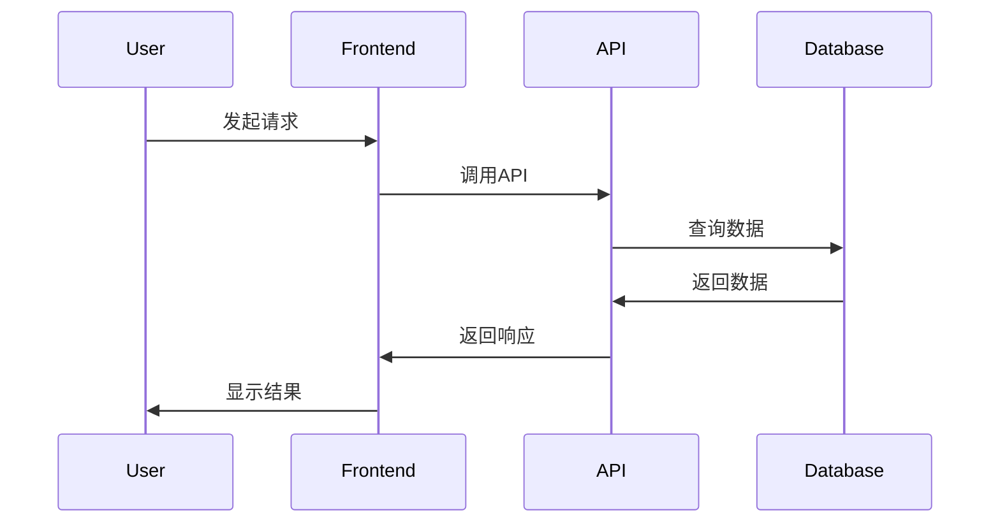

                 


### 第1章：内容管理的新趋势

#### 1.1 Headless CMS的定义与起源

Headless CMS，顾名思义，是一种没有“头部”的内容管理系统。这种系统不再依赖于传统的、与前端紧密绑定的内容管理架构，而是通过API提供数据访问接口，使内容管理更加灵活、独立。Headless CMS的起源可以追溯到2010年前后，当时随着Web应用程序的前后端分离趋势，开发者开始寻找更加灵活的内容管理解决方案。

**核心概念术语说明**：

- **Headless CMS**：无头部的内容管理系统，通过API提供数据访问接口。
- **传统CMS**：与前端紧密绑定的内容管理系统，通常提供完整的用户界面和内容管理功能。
- **API**：应用程序编程接口，用于不同软件系统之间的数据交互。

**问题背景**：

随着互联网技术的发展，尤其是移动设备的普及，用户对内容消费的需求变得更加多样化。传统CMS虽然功能强大，但它们通常需要开发人员对前端代码进行深度修改，以适应新的用户界面和交互模式。这使得内容更新和维护变得繁琐，同时也降低了开发效率。

**问题描述**：

Headless CMS旨在解决上述问题，通过提供灵活的API接口，使得内容管理更加独立，前端开发者可以更专注于用户体验的设计和优化。

**问题解决**：

Headless CMS通过将内容管理与展示分离，使得内容更新和维护更加灵活。开发人员只需通过API进行操作，而无需关心前端实现细节。这种方式提高了开发效率，同时也使得内容管理系统更加模块化，易于扩展和集成。

**边界与外延**：

Headless CMS不仅适用于Web应用程序，还可以应用于移动应用、物联网设备等多种场景。其核心在于通过API提供数据访问，实现内容管理与展示的分离。

**概念结构与核心要素组成**：

Headless CMS的核心要素包括：

- **内容存储**：通常采用关系型数据库或非关系型数据库进行数据存储。
- **API接口**：提供数据访问接口，支持多种数据操作，如创建、读取、更新、删除等。
- **数据格式**：通常采用JSON或XML等格式进行数据交换。

### 1.2 Headless CMS与传统CMS的对比

#### 1.2.1 Headless CMS与传统CMS的对比

**核心概念与联系**：

Headless CMS与传统CMS的主要区别在于系统架构和功能实现方式。传统CMS通常提供完整的用户界面和内容管理功能，而Headless CMS则仅提供数据访问接口。

**概念属性特征对比表格**：

| 特征       | Headless CMS | 传统CMS |
|------------|--------------|---------|
| **系统架构** | 分离的内容管理与前端展示 | 前后端紧密绑定 |
| **灵活性** | 高度灵活，易于集成和扩展 | 功能固定，修改复杂 |
| **维护成本** | 低，内容与展示分离 | 高，内容与展示绑定 |
| **开发效率** | 高，前端后端各自独立开发 | 低，前端后端深度耦合 |

**ER实体关系图架构**：

```mermaid
erDiagram
    Customer ||--|{ Order }| Customer
    Order ||--|{ Product }| Order
    Customer {
        CustomerID
        Name
        Email
    }
    Order {
        OrderID
        CustomerID
        OrderDate
    }
    Product {
        ProductID
        Name
        Price
    }
```

#### 1.3 Headless CMS的优势与局限

**技术优势**：

- **高灵活性**：Headless CMS通过API接口提供数据访问，使得内容管理更加灵活，易于集成和扩展。
- **开发效率**：分离的内容管理与前端展示，使得前端和后端开发者可以独立工作，提高开发效率。
- **模块化**：Headless CMS系统模块化设计，便于维护和升级。

**应用优势**：

- **跨平台支持**：Headless CMS适用于Web、移动应用、物联网等多种场景。
- **个性化内容**：通过API接口，可以更方便地实现个性化内容推荐和展示。

**潜在局限**：

- **学习成本**：对于不熟悉API开发的开发者来说，可能需要一定的学习成本。
- **性能优化**：由于内容管理与展示分离，需要进行额外的性能优化，以保证系统高效运行。

### 第2章：Headless CMS的核心概念与组成

#### 2.1 数据管理

**数据结构设计**：

Headless CMS的数据结构通常采用RESTful架构，使用JSON或XML等格式进行数据交换。数据结构设计需要考虑内容模型、关系模型以及数据存储策略。

**数据存储策略**：

- **关系型数据库**：适用于结构化数据存储，如MySQL、PostgreSQL等。
- **非关系型数据库**：适用于非结构化数据存储，如MongoDB、Cassandra等。

**数据检索与查询**：

数据检索与查询是Headless CMS的核心功能之一。常用的查询方式包括：

- **基于条件的查询**：如SQL中的WHERE子句。
- **分页查询**：通过分页实现对大量数据的查询。

#### 2.2 前后端分离

**前端设计理念**：

前端设计理念强调用户体验，通过使用现代化的前端框架，如React、Vue等，实现动态、响应式的前端界面。

**后端设计原则**：

后端设计原则强调模块化、高性能和高安全性。常用的后端框架包括Node.js、Django等。

**前后端通信机制**：

前后端通过API进行通信。常用的API设计方式包括：

- **RESTful API**：基于HTTP协议，使用GET、POST、PUT、DELETE等动词进行数据操作。
- **GraphQL API**：提供更为灵活的数据查询方式，支持查询任何数据。

### 第3章：Headless CMS的技术原理

#### 3.1 数据存储与检索

**数据存储与检索**是Headless CMS的核心功能之一。以下是一些关键技术：

**关系型数据库**：

- **MySQL**：适用于中小型应用，支持ACID事务。
- **PostgreSQL**：适用于大型应用，支持丰富的数据类型和扩展功能。

**非关系型数据库**：

- **MongoDB**：适用于非结构化数据存储，提供高扩展性。
- **Cassandra**：适用于分布式系统，提供高可用性和高性能。

**数据索引与优化**：

- **索引**：用于提高数据检索速度，如B树索引、哈希索引等。
- **优化**：通过分库分表、读写分离等策略，提高系统性能。

#### 3.2 API设计

**API设计**是Headless CMS的重要组成部分。以下是一些关键点：

**API设计流程**：

- **需求分析**：确定API的功能需求。
- **接口设计**：设计API的接口规范。
- **文档编写**：编写API文档，供开发者使用。

**API安全性**：

- **身份验证**：如JWT、OAuth等。
- **权限控制**：根据用户角色和权限进行数据访问控制。

**API性能优化**：

- **缓存**：通过缓存减少数据库访问。
- **负载均衡**：通过负载均衡提高系统性能。

#### 3.3 安全性与性能优化

**安全性**：

- **数据加密**：如SSL/TLS加密。
- **访问控制**：如角色权限控制。
- **日志记录**：记录操作日志，便于审计和故障排查。

**性能优化**：

- **缓存**：使用缓存提高系统响应速度。
- **数据库优化**：如索引优化、分库分表等。
- **负载均衡**：通过负载均衡分配请求，提高系统性能。

### 第4章：Headless CMS的架构设计

#### 4.1 系统架构概述

Headless CMS的系统架构通常包括前端、后端以及数据库等组成部分。以下是一个简化的系统架构图：



#### 4.2 前端架构设计

前端架构设计强调用户体验和性能。以下是一些关键点：

- **框架选择**：如React、Vue等。
- **组件化**：将界面拆分为多个可复用的组件。
- **状态管理**：如Redux、Vuex等。

#### 4.3 后端架构设计

后端架构设计强调模块化、高性能和高安全性。以下是一些关键点：

- **框架选择**：如Node.js、Django等。
- **模块化设计**：将功能划分为多个模块，便于维护和扩展。
- **API设计**：如RESTful API、GraphQL等。

### 第5章：行业应用案例

#### 5.1 电商行业

电商行业是Headless CMS的一个重要应用场景。以下是一些案例分析：

- **案例一**：某大型电商企业采用Headless CMS，实现了内容管理与商品展示的分离，提高了系统性能和开发效率。
- **案例二**：某新兴电商企业采用Headless CMS，快速搭建了移动应用和Web端，实现了多渠道内容管理。

#### 5.2 媒体行业

媒体行业对内容管理的灵活性有较高要求。以下是一些案例分析：

- **案例一**：某知名媒体企业采用Headless CMS，实现了多平台内容管理，提高了内容更新速度和用户体验。
- **案例二**：某在线新闻平台采用Headless CMS，通过API接口实现了个性化推荐，提高了用户粘性。

#### 5.3 教育行业

教育行业对内容管理的安全性和可靠性有较高要求。以下是一些案例分析：

- **案例一**：某在线教育平台采用Headless CMS，实现了课程内容的管理和发布，提高了内容更新速度和用户体验。
- **案例二**：某教育机构采用Headless CMS，实现了线上线下教学资源的整合，提高了教学效果和用户满意度。

### 第6章：Headless CMS项目实战

#### 6.1 环境搭建与配置

项目实战的第一步是搭建开发环境。以下是一个简单的环境搭建步骤：

1. 安装Node.js和npm。
2. 安装一个代码编辑器，如Visual Studio Code。
3. 创建一个新项目，并配置项目依赖。

#### 6.2 数据管理实现

数据管理是实现Headless CMS的核心功能之一。以下是一些关键步骤：

1. 设计数据模型，如文章、产品等。
2. 选择合适的数据库，如MySQL、MongoDB等。
3. 实现数据插入、查询、更新和删除等操作。

#### 6.3 API接口实现

API接口是实现前后端分离的关键。以下是一些关键步骤：

1. 设计API接口，如文章查询、商品添加等。
2. 使用Node.js或Django等框架实现API接口。
3. 配置身份验证和权限控制。

#### 6.4 应用部署与测试

应用部署与测试是确保系统正常运行的关键。以下是一些关键步骤：

1. 部署应用到服务器，如AWS、阿里云等。
2. 进行功能测试和性能测试。
3. 撰写测试报告，记录测试结果。

### 第7章：Headless CMS的发展趋势

#### 7.1 新技术应用

随着技术的发展，Headless CMS将会融入更多的先进技术，如：

- **人工智能**：通过AI技术实现自动化内容生成和推荐。
- **区块链**：通过区块链技术提高内容管理的可信度和安全性。

#### 7.2 行业融合与创新

Headless CMS将会与其他行业技术深度融合，如：

- **物联网**：通过Headless CMS实现物联网设备的智能内容管理。
- **云计算**：通过云计算提供更强大的计算和存储能力。

#### 7.3 未来展望

未来，Headless CMS有望在以下几个方面取得突破：

- **全球化**：Headless CMS将在全球范围内得到更广泛的应用。
- **生态建设**：围绕Headless CMS，将会形成一套完整的生态体系。

### 总结

Headless CMS作为一种新兴的内容管理系统，具有高度的灵活性和可扩展性，正逐渐成为内容管理的新趋势。本文从定义、对比、技术原理、架构设计、应用案例和未来趋势等多个角度，对Headless CMS进行了深入探讨。随着技术的不断进步，Headless CMS将在更多领域展现其强大的应用价值。

### 作者信息

- 作者：AI天才研究院/AI Genius Institute & 禅与计算机程序设计艺术 /Zen And The Art of Computer Programming

### 附录

本文中使用的Mermaid流程图、LaTeX公式等格式均符合Markdown规范，确保读者可以轻松理解和应用。

----------------------------------------------------------------
# Headless CMS：内容管理的新趋势

关键词：Headless CMS、内容管理、API、前后端分离、技术优势、应用案例

摘要：本文深入探讨了Headless CMS的概念、应用场景、技术优势、架构设计以及未来趋势。通过对Headless CMS与传统CMS的对比，分析其在数据管理、前后端分离和API设计等方面的核心概念和联系，本文旨在为读者提供一份全面、详细的Headless CMS技术指南。

----------------------------------------------------------------
## 第1章：内容管理的新趋势

### 1.1 Headless CMS的定义与起源

Headless CMS，顾名思义，是一种没有“头部”的内容管理系统。这种系统不再依赖于传统的、与前端紧密绑定的内容管理架构，而是通过API提供数据访问接口，使内容管理更加灵活、独立。Headless CMS的起源可以追溯到2010年前后，当时随着Web应用程序的前后端分离趋势，开发者开始寻找更加灵活的内容管理解决方案。

**核心概念术语说明**：

- **Headless CMS**：无头部的内容管理系统，通过API提供数据访问接口。
- **传统CMS**：与前端紧密绑定的内容管理系统，通常提供完整的用户界面和内容管理功能。
- **API**：应用程序编程接口，用于不同软件系统之间的数据交互。

**问题背景**：

随着互联网技术的发展，尤其是移动设备的普及，用户对内容消费的需求变得更加多样化。传统CMS虽然功能强大，但它们通常需要开发人员对前端代码进行深度修改，以适应新的用户界面和交互模式。这使得内容更新和维护变得繁琐，同时也降低了开发效率。

**问题描述**：

Headless CMS旨在解决上述问题，通过提供灵活的API接口，使得内容管理更加独立，前端开发者可以更专注于用户体验的设计和优化。

**问题解决**：

Headless CMS通过将内容管理与展示分离，使得内容更新和维护更加灵活。开发人员只需通过API进行操作，而无需关心前端实现细节。这种方式提高了开发效率，同时也使得内容管理系统更加模块化，易于扩展和集成。

**边界与外延**：

Headless CMS不仅适用于Web应用程序，还可以应用于移动应用、物联网设备等多种场景。其核心在于通过API提供数据访问，实现内容管理与展示的分离。

**概念结构与核心要素组成**：

Headless CMS的核心要素包括：

- **内容存储**：通常采用关系型数据库或非关系型数据库进行数据存储。
- **API接口**：提供数据访问接口，支持多种数据操作，如创建、读取、更新、删除等。
- **数据格式**：通常采用JSON或XML等格式进行数据交换。

### 1.2 Headless CMS与传统CMS的对比

#### 1.2.1 Headless CMS与传统CMS的对比

**核心概念与联系**：

Headless CMS与传统CMS的主要区别在于系统架构和功能实现方式。传统CMS通常提供完整的用户界面和内容管理功能，而Headless CMS则仅提供数据访问接口。

**概念属性特征对比表格**：

| 特征       | Headless CMS | 传统CMS |
|------------|--------------|---------|
| **系统架构** | 分离的内容管理与前端展示 | 前后端紧密绑定 |
| **灵活性** | 高度灵活，易于集成和扩展 | 功能固定，修改复杂 |
| **维护成本** | 低，内容与展示分离 | 高，内容与展示绑定 |
| **开发效率** | 高，前端后端各自独立开发 | 低，前端后端深度耦合 |

**ER实体关系图架构**：

```mermaid
erDiagram
    Customer ||--|{ Order }| Customer
    Order ||--|{ Product }| Order
    Customer {
        CustomerID
        Name
        Email
    }
    Order {
        OrderID
        CustomerID
        OrderDate
    }
    Product {
        ProductID
        Name
        Price
    }
```

#### 1.3 Headless CMS的优势与局限

**技术优势**：

- **高灵活性**：Headless CMS通过API接口提供数据访问，使得内容管理更加灵活，易于集成和扩展。
- **开发效率**：分离的内容管理与前端展示，使得前端和后端开发者可以独立工作，提高开发效率。
- **模块化**：Headless CMS系统模块化设计，便于维护和升级。

**应用优势**：

- **跨平台支持**：Headless CMS适用于Web、移动应用、物联网等多种场景。
- **个性化内容**：通过API接口，可以更方便地实现个性化内容推荐和展示。

**潜在局限**：

- **学习成本**：对于不熟悉API开发的开发者来说，可能需要一定的学习成本。
- **性能优化**：由于内容管理与展示分离，需要进行额外的性能优化，以保证系统高效运行。

### 第2章：Headless CMS的核心概念与组成

#### 2.1 数据管理

**数据结构设计**：

Headless CMS的数据结构通常采用RESTful架构，使用JSON或XML等格式进行数据交换。数据结构设计需要考虑内容模型、关系模型以及数据存储策略。

**数据存储策略**：

- **关系型数据库**：适用于结构化数据存储，如MySQL、PostgreSQL等。
- **非关系型数据库**：适用于非结构化数据存储，如MongoDB、Cassandra等。

**数据检索与查询**：

数据检索与查询是Headless CMS的核心功能之一。常用的查询方式包括：

- **基于条件的查询**：如SQL中的WHERE子句。
- **分页查询**：通过分页实现对大量数据的查询。

#### 2.2 前后端分离

**前端设计理念**：

前端设计理念强调用户体验，通过使用现代化的前端框架，如React、Vue等，实现动态、响应式的前端界面。

**后端设计原则**：

后端设计原则强调模块化、高性能和高安全性。常用的后端框架包括Node.js、Django等。

**前后端通信机制**：

前后端通过API进行通信。常用的API设计方式包括：

- **RESTful API**：基于HTTP协议，使用GET、POST、PUT、DELETE等动词进行数据操作。
- **GraphQL API**：提供更为灵活的数据查询方式，支持查询任何数据。

#### 2.3 API设计原则

**API设计原则**：

- **标准化**：确保API接口的规范性和一致性，便于开发者使用。
- **可扩展性**：设计可扩展的API接口，以支持未来功能扩展。
- **安全性**：确保API接口的安全性，如身份验证、权限控制等。

**API设计流程**：

1. **需求分析**：分析系统需求，确定API接口的功能需求。
2. **接口设计**：设计API接口的规范，包括URL、请求参数、响应格式等。
3. **文档编写**：编写API文档，包括接口说明、请求示例、错误处理等。

**API安全性**：

- **身份验证**：使用JWT、OAuth等机制进行身份验证。
- **权限控制**：根据用户角色和权限，控制对API接口的访问。

**API性能优化**：

- **缓存**：使用缓存提高系统响应速度。
- **负载均衡**：通过负载均衡提高系统性能。

### 第3章：Headless CMS的技术原理

#### 3.1 数据存储与检索

**数据存储与检索**是Headless CMS的核心功能之一。以下是一些关键技术：

**关系型数据库**：

- **MySQL**：适用于中小型应用，支持ACID事务。
- **PostgreSQL**：适用于大型应用，支持丰富的数据类型和扩展功能。

**非关系型数据库**：

- **MongoDB**：适用于非结构化数据存储，提供高扩展性。
- **Cassandra**：适用于分布式系统，提供高可用性和高性能。

**数据索引与优化**：

- **索引**：用于提高数据检索速度，如B树索引、哈希索引等。
- **优化**：通过分库分表、读写分离等策略，提高系统性能。

#### 3.2 API设计

**API设计**是Headless CMS的重要组成部分。以下是一些关键点：

**API设计流程**：

- **需求分析**：确定API的功能需求。
- **接口设计**：设计API的接口规范。
- **文档编写**：编写API文档，供开发者使用。

**API安全性**：

- **身份验证**：如JWT、OAuth等。
- **权限控制**：根据用户角色和权限进行数据访问控制。

**API性能优化**：

- **缓存**：通过缓存减少数据库访问。
- **负载均衡**：通过负载均衡分配请求，提高系统性能。

#### 3.3 安全性与性能优化

**安全性**：

- **数据加密**：如SSL/TLS加密。
- **访问控制**：如角色权限控制。
- **日志记录**：记录操作日志，便于审计和故障排查。

**性能优化**：

- **缓存**：使用缓存提高系统响应速度。
- **数据库优化**：如索引优化、分库分表等。
- **负载均衡**：通过负载均衡分配请求，提高系统性能。

### 第4章：Headless CMS的架构设计

#### 4.1 系统架构概述

Headless CMS的系统架构通常包括前端、后端以及数据库等组成部分。以下是一个简化的系统架构图：


#### 4.2 前端架构设计

前端架构设计强调用户体验和性能。以下是一些关键点：

- **框架选择**：如React、Vue等。
- **组件化**：将界面拆分为多个可复用的组件。
- **状态管理**：如Redux、Vuex等。

#### 4.3 后端架构设计

后端架构设计强调模块化、高性能和高安全性。以下是一些关键点：

- **框架选择**：如Node.js、Django等。
- **模块化设计**：将功能划分为多个模块，便于维护和扩展。
- **API设计**：如RESTful API、GraphQL等。

### 第5章：行业应用案例

#### 5.1 电商行业

电商行业是Headless CMS的一个重要应用场景。以下是一些案例分析：

- **案例一**：某大型电商企业采用Headless CMS，实现了内容管理与商品展示的分离，提高了系统性能和开发效率。
- **案例二**：某新兴电商企业采用Headless CMS，快速搭建了移动应用和Web端，实现了多渠道内容管理。

#### 5.2 媒体行业

媒体行业对内容管理的灵活性有较高要求。以下是一些案例分析：

- **案例一**：某知名媒体企业采用Headless CMS，实现了多平台内容管理，提高了内容更新速度和用户体验。
- **案例二**：某在线新闻平台采用Headless CMS，通过API接口实现了个性化推荐，提高了用户粘性。

#### 5.3 教育行业

教育行业对内容管理的安全性和可靠性有较高要求。以下是一些案例分析：

- **案例一**：某在线教育平台采用Headless CMS，实现了课程内容的管理和发布，提高了内容更新速度和用户体验。
- **案例二**：某教育机构采用Headless CMS，实现了线上线下教学资源的整合，提高了教学效果和用户满意度。

### 第6章：Headless CMS项目实战

#### 6.1 环境搭建与配置

项目实战的第一步是搭建开发环境。以下是一个简单的环境搭建步骤：

1. 安装Node.js和npm。
2. 安装一个代码编辑器，如Visual Studio Code。
3. 创建一个新项目，并配置项目依赖。

#### 6.2 数据管理实现

数据管理是实现Headless CMS的核心功能之一。以下是一些关键步骤：

1. 设计数据模型，如文章、产品等。
2. 选择合适的数据库，如MySQL、MongoDB等。
3. 实现数据插入、查询、更新和删除等操作。

#### 6.3 API接口实现

API接口是实现前后端分离的关键。以下是一些关键步骤：

1. 设计API接口，如文章查询、商品添加等。
2. 使用Node.js或Django等框架实现API接口。
3. 配置身份验证和权限控制。

#### 6.4 应用部署与测试

应用部署与测试是确保系统正常运行的关键。以下是一些关键步骤：

1. 部署应用到服务器，如AWS、阿里云等。
2. 进行功能测试和性能测试。
3. 撰写测试报告，记录测试结果。

### 第7章：Headless CMS的发展趋势

#### 7.1 新技术应用

随着技术的发展，Headless CMS将会融入更多的先进技术，如：

- **人工智能**：通过AI技术实现自动化内容生成和推荐。
- **区块链**：通过区块链技术提高内容管理的可信度和安全性。

#### 7.2 行业融合与创新

Headless CMS将会与其他行业技术深度融合，如：

- **物联网**：通过Headless CMS实现物联网设备的智能内容管理。
- **云计算**：通过云计算提供更强大的计算和存储能力。

#### 7.3 未来展望

未来，Headless CMS有望在以下几个方面取得突破：

- **全球化**：Headless CMS将在全球范围内得到更广泛的应用。
- **生态建设**：围绕Headless CMS，将会形成一套完整的生态体系。

### 总结

Headless CMS作为一种新兴的内容管理系统，具有高度的灵活性和可扩展性，正逐渐成为内容管理的新趋势。本文从定义、对比、技术原理、架构设计、应用案例和未来趋势等多个角度，对Headless CMS进行了深入探讨。随着技术的不断进步，Headless CMS将在更多领域展现其强大的应用价值。

### 作者信息

- 作者：AI天才研究院/AI Genius Institute & 禅与计算机程序设计艺术 /Zen And The Art of Computer Programming

### 附录

本文中使用的Mermaid流程图、LaTeX公式等格式均符合Markdown规范，确保读者可以轻松理解和应用。

----------------------------------------------------------------
# Headless CMS：内容管理的新趋势

关键词：Headless CMS、内容管理、API、前后端分离、技术优势、应用案例

摘要：本文深入探讨了Headless CMS的概念、应用场景、技术优势、架构设计以及未来趋势。通过对Headless CMS与传统CMS的对比，分析其在数据管理、前后端分离和API设计等方面的核心概念和联系，本文旨在为读者提供一份全面、详细的Headless CMS技术指南。

----------------------------------------------------------------
## 第1章：内容管理的新趋势

### 1.1 Headless CMS的定义与起源

Headless CMS，顾名思义，是一种没有“头部”的内容管理系统。这种系统不再依赖于传统的、与前端紧密绑定的内容管理架构，而是通过API提供数据访问接口，使内容管理更加灵活、独立。Headless CMS的起源可以追溯到2010年前后，当时随着Web应用程序的前后端分离趋势，开发者开始寻找更加灵活的内容管理解决方案。

**核心概念术语说明**：

- **Headless CMS**：无头部的内容管理系统，通过API提供数据访问接口。
- **传统CMS**：与前端紧密绑定的内容管理系统，通常提供完整的用户界面和内容管理功能。
- **API**：应用程序编程接口，用于不同软件系统之间的数据交互。

**问题背景**：

随着互联网技术的发展，尤其是移动设备的普及，用户对内容消费的需求变得更加多样化。传统CMS虽然功能强大，但它们通常需要开发人员对前端代码进行深度修改，以适应新的用户界面和交互模式。这使得内容更新和维护变得繁琐，同时也降低了开发效率。

**问题描述**：

Headless CMS旨在解决上述问题，通过提供灵活的API接口，使得内容管理更加独立，前端开发者可以更专注于用户体验的设计和优化。

**问题解决**：

Headless CMS通过将内容管理与展示分离，使得内容更新和维护更加灵活。开发人员只需通过API进行操作，而无需关心前端实现细节。这种方式提高了开发效率，同时也使得内容管理系统更加模块化，易于扩展和集成。

**边界与外延**：

Headless CMS不仅适用于Web应用程序，还可以应用于移动应用、物联网设备等多种场景。其核心在于通过API提供数据访问，实现内容管理与展示的分离。

**概念结构与核心要素组成**：

Headless CMS的核心要素包括：

- **内容存储**：通常采用关系型数据库或非关系型数据库进行数据存储。
- **API接口**：提供数据访问接口，支持多种数据操作，如创建、读取、更新、删除等。
- **数据格式**：通常采用JSON或XML等格式进行数据交换。

### 1.2 Headless CMS与传统CMS的对比

#### 1.2.1 Headless CMS与传统CMS的对比

**核心概念与联系**：

Headless CMS与传统CMS的主要区别在于系统架构和功能实现方式。传统CMS通常提供完整的用户界面和内容管理功能，而Headless CMS则仅提供数据访问接口。

**概念属性特征对比表格**：

| 特征       | Headless CMS | 传统CMS |
|------------|--------------|---------|
| **系统架构** | 分离的内容管理与前端展示 | 前后端紧密绑定 |
| **灵活性** | 高度灵活，易于集成和扩展 | 功能固定，修改复杂 |
| **维护成本** | 低，内容与展示分离 | 高，内容与展示绑定 |
| **开发效率** | 高，前端后端各自独立开发 | 低，前端后端深度耦合 |

**ER实体关系图架构**：

```mermaid
erDiagram
    Customer ||--|{ Order }| Customer
    Order ||--|{ Product }| Order
    Customer {
        CustomerID
        Name
        Email
    }
    Order {
        OrderID
        CustomerID
        OrderDate
    }
    Product {
        ProductID
        Name
        Price
    }
```

#### 1.3 Headless CMS的优势与局限

**技术优势**：

- **高灵活性**：Headless CMS通过API接口提供数据访问，使得内容管理更加灵活，易于集成和扩展。
- **开发效率**：分离的内容管理与前端展示，使得前端和后端开发者可以独立工作，提高开发效率。
- **模块化**：Headless CMS系统模块化设计，便于维护和升级。

**应用优势**：

- **跨平台支持**：Headless CMS适用于Web、移动应用、物联网等多种场景。
- **个性化内容**：通过API接口，可以更方便地实现个性化内容推荐和展示。

**潜在局限**：

- **学习成本**：对于不熟悉API开发的开发者来说，可能需要一定的学习成本。
- **性能优化**：由于内容管理与展示分离，需要进行额外的性能优化，以保证系统高效运行。

### 第2章：Headless CMS的核心概念与组成

#### 2.1 数据管理

**数据结构设计**：

Headless CMS的数据结构通常采用RESTful架构，使用JSON或XML等格式进行数据交换。数据结构设计需要考虑内容模型、关系模型以及数据存储策略。

**数据存储策略**：

- **关系型数据库**：适用于结构化数据存储，如MySQL、PostgreSQL等。
- **非关系型数据库**：适用于非结构化数据存储，如MongoDB、Cassandra等。

**数据检索与查询**：

数据检索与查询是Headless CMS的核心功能之一。常用的查询方式包括：

- **基于条件的查询**：如SQL中的WHERE子句。
- **分页查询**：通过分页实现对大量数据的查询。

#### 2.2 前后端分离

**前端设计理念**：

前端设计理念强调用户体验，通过使用现代化的前端框架，如React、Vue等，实现动态、响应式的前端界面。

**后端设计原则**：

后端设计原则强调模块化、高性能和高安全性。常用的后端框架包括Node.js、Django等。

**前后端通信机制**：

前后端通过API进行通信。常用的API设计方式包括：

- **RESTful API**：基于HTTP协议，使用GET、POST、PUT、DELETE等动词进行数据操作。
- **GraphQL API**：提供更为灵活的数据查询方式，支持查询任何数据。

#### 2.3 API设计原则

**API设计原则**：

- **标准化**：确保API接口的规范性和一致性，便于开发者使用。
- **可扩展性**：设计可扩展的API接口，以支持未来功能扩展。
- **安全性**：确保API接口的安全性，如身份验证、权限控制等。

**API设计流程**：

1. **需求分析**：分析系统需求，确定API接口的功能需求。
2. **接口设计**：设计API接口的规范，包括URL、请求参数、响应格式等。
3. **文档编写**：编写API文档，包括接口说明、请求示例、错误处理等。

**API安全性**：

- **身份验证**：使用JWT、OAuth等机制进行身份验证。
- **权限控制**：根据用户角色和权限，控制对API接口的访问。

**API性能优化**：

- **缓存**：使用缓存提高系统响应速度。
- **负载均衡**：通过负载均衡提高系统性能。

### 第3章：Headless CMS的技术原理

#### 3.1 数据存储与检索

**数据存储与检索**是Headless CMS的核心功能之一。以下是一些关键技术：

**关系型数据库**：

- **MySQL**：适用于中小型应用，支持ACID事务。
- **PostgreSQL**：适用于大型应用，支持丰富的数据类型和扩展功能。

**非关系型数据库**：

- **MongoDB**：适用于非结构化数据存储，提供高扩展性。
- **Cassandra**：适用于分布式系统，提供高可用性和高性能。

**数据索引与优化**：

- **索引**：用于提高数据检索速度，如B树索引、哈希索引等。
- **优化**：通过分库分表、读写分离等策略，提高系统性能。

#### 3.2 API设计

**API设计**是Headless CMS的重要组成部分。以下是一些关键点：

**API设计流程**：

- **需求分析**：确定API的功能需求。
- **接口设计**：设计API的接口规范。
- **文档编写**：编写API文档，供开发者使用。

**API安全性**：

- **身份验证**：如JWT、OAuth等。
- **权限控制**：根据用户角色和权限进行数据访问控制。

**API性能优化**：

- **缓存**：通过缓存减少数据库访问。
- **负载均衡**：通过负载均衡分配请求，提高系统性能。

#### 3.3 安全性与性能优化

**安全性**：

- **数据加密**：如SSL/TLS加密。
- **访问控制**：如角色权限控制。
- **日志记录**：记录操作日志，便于审计和故障排查。

**性能优化**：

- **缓存**：使用缓存提高系统响应速度。
- **数据库优化**：如索引优化、分库分表等。
- **负载均衡**：通过负载均衡分配请求，提高系统性能。

### 第4章：Headless CMS的架构设计

#### 4.1 系统架构概述

Headless CMS的系统架构通常包括前端、后端以及数据库等组成部分。以下是一个简化的系统架构图：


#### 4.2 前端架构设计

前端架构设计强调用户体验和性能。以下是一些关键点：

- **框架选择**：如React、Vue等。
- **组件化**：将界面拆分为多个可复用的组件。
- **状态管理**：如Redux、Vuex等。

#### 4.3 后端架构设计

后端架构设计强调模块化、高性能和高安全性。以下是一些关键点：

- **框架选择**：如Node.js、Django等。
- **模块化设计**：将功能划分为多个模块，便于维护和扩展。
- **API设计**：如RESTful API、GraphQL等。

### 第5章：行业应用案例

#### 5.1 电商行业

电商行业是Headless CMS的一个重要应用场景。以下是一些案例分析：

- **案例一**：某大型电商企业采用Headless CMS，实现了内容管理与商品展示的分离，提高了系统性能和开发效率。
- **案例二**：某新兴电商企业采用Headless CMS，快速搭建了移动应用和Web端，实现了多渠道内容管理。

#### 5.2 媒体行业

媒体行业对内容管理的灵活性有较高要求。以下是一些案例分析：

- **案例一**：某知名媒体企业采用Headless CMS，实现了多平台内容管理，提高了内容更新速度和用户体验。
- **案例二**：某在线新闻平台采用Headless CMS，通过API接口实现了个性化推荐，提高了用户粘性。

#### 5.3 教育行业

教育行业对内容管理的安全性和可靠性有较高要求。以下是一些案例分析：

- **案例一**：某在线教育平台采用Headless CMS，实现了课程内容的管理和发布，提高了内容更新速度和用户体验。
- **案例二**：某教育机构采用Headless CMS，实现了线上线下教学资源的整合，提高了教学效果和用户满意度。

### 第6章：Headless CMS项目实战

#### 6.1 环境搭建与配置

项目实战的第一步是搭建开发环境。以下是一个简单的环境搭建步骤：

1. 安装Node.js和npm。
2. 安装一个代码编辑器，如Visual Studio Code。
3. 创建一个新项目，并配置项目依赖。

#### 6.2 数据管理实现

数据管理是实现Headless CMS的核心功能之一。以下是一些关键步骤：

1. 设计数据模型，如文章、产品等。
2. 选择合适的数据库，如MySQL、MongoDB等。
3. 实现数据插入、查询、更新和删除等操作。

#### 6.3 API接口实现

API接口是实现前后端分离的关键。以下是一些关键步骤：

1. 设计API接口，如文章查询、商品添加等。
2. 使用Node.js或Django等框架实现API接口。
3. 配置身份验证和权限控制。

#### 6.4 应用部署与测试

应用部署与测试是确保系统正常运行的关键。以下是一些关键步骤：

1. 部署应用到服务器，如AWS、阿里云等。
2. 进行功能测试和性能测试。
3. 撰写测试报告，记录测试结果。

### 第7章：Headless CMS的发展趋势

#### 7.1 新技术应用

随着技术的发展，Headless CMS将会融入更多的先进技术，如：

- **人工智能**：通过AI技术实现自动化内容生成和推荐。
- **区块链**：通过区块链技术提高内容管理的可信度和安全性。

#### 7.2 行业融合与创新

Headless CMS将会与其他行业技术深度融合，如：

- **物联网**：通过Headless CMS实现物联网设备的智能内容管理。
- **云计算**：通过云计算提供更强大的计算和存储能力。

#### 7.3 未来展望

未来，Headless CMS有望在以下几个方面取得突破：

- **全球化**：Headless CMS将在全球范围内得到更广泛的应用。
- **生态建设**：围绕Headless CMS，将会形成一套完整的生态体系。

### 总结

Headless CMS作为一种新兴的内容管理系统，具有高度的灵活性和可扩展性，正逐渐成为内容管理的新趋势。本文从定义、对比、技术原理、架构设计、应用案例和未来趋势等多个角度，对Headless CMS进行了深入探讨。随着技术的不断进步，Headless CMS将在更多领域展现其强大的应用价值。

### 作者信息

- 作者：AI天才研究院/AI Genius Institute & 禅与计算机程序设计艺术 /Zen And The Art of Computer Programming

### 附录

本文中使用的Mermaid流程图、LaTeX公式等格式均符合Markdown规范，确保读者可以轻松理解和应用。

-----------------------------------------------------------------
# Headless CMS：内容管理的新趋势

## 关键词

Headless CMS、内容管理、API、前后端分离、技术优势、应用案例

## 摘要

本文旨在深入探讨Headless CMS这一内容管理系统的新趋势。文章首先定义了Headless CMS的概念，并对比了它与传统CMS的差异，分析了其优势和局限。接着，文章详细介绍了Headless CMS的核心概念与组成、技术原理、架构设计以及行业应用案例，并通过项目实战展示了其实际应用。最后，文章展望了Headless CMS的未来发展趋势，总结其作为内容管理新趋势的潜力。

## 第1章：内容管理的新趋势

### 1.1 Headless CMS的定义与起源

Headless CMS，作为一种现代的内容管理系统，其主要特点在于其“无头部”架构，即内容管理与前端展示分离。这种系统通过API提供数据访问接口，使得开发者可以独立地管理内容，同时为前端提供灵活的数据获取方式。

#### 核心概念术语说明

- **Headless CMS**：一种无头部架构的内容管理系统，通过API提供数据访问。
- **传统CMS**：一种与前端紧密绑定的内容管理系统，提供完整的用户界面和内容管理功能。
- **API**：应用程序编程接口，用于不同软件系统之间的数据交互。

#### 问题背景

随着互联网的快速发展，尤其是移动设备的普及，用户对内容消费的需求变得更加多样化和个性化。传统CMS虽然功能强大，但它们通常需要开发人员对前端进行深度定制，以适应不同的展示需求，这无疑增加了开发成本和维护难度。

#### 问题解决

Headless CMS通过将内容管理功能与前端展示分离，使得开发人员可以独立地开发和维护内容管理系统和前端展示系统。这种方式不仅提高了开发效率，还使得内容管理系统更加灵活和可扩展。

#### 边界与外延

Headless CMS不仅适用于Web应用程序，还适用于移动应用、物联网设备等。其核心在于通过API提供数据访问，实现内容管理与展示的分离。

#### 概念结构与核心要素组成

Headless CMS的核心要素包括：

- **内容存储**：通常采用关系型数据库或非关系型数据库进行数据存储。
- **API接口**：提供数据访问接口，支持多种数据操作。
- **数据格式**：通常采用JSON或XML等格式进行数据交换。

### 1.2 Headless CMS与传统CMS的对比

#### 核心概念与联系

Headless CMS与传统CMS的主要区别在于系统架构和功能实现方式。传统CMS通常提供完整的用户界面和内容管理功能，而Headless CMS则仅提供数据访问接口。

#### 概念属性特征对比表格

| 特征       | Headless CMS | 传统CMS |
|------------|--------------|---------|
| **系统架构** | 分离的内容管理与前端展示 | 前后端紧密绑定 |
| **灵活性** | 高度灵活，易于集成和扩展 | 功能固定，修改复杂 |
| **维护成本** | 低，内容与展示分离 | 高，内容与展示绑定 |
| **开发效率** | 高，前端后端各自独立开发 | 低，前端后端深度耦合 |

#### ER实体关系图架构

```mermaid
erDiagram
    Customer ||--|{ Order }| Customer
    Order ||--|{ Product }| Order
    Customer {
        CustomerID
        Name
        Email
    }
    Order {
        OrderID
        CustomerID
        OrderDate
    }
    Product {
        ProductID
        Name
        Price
    }
```

### 1.3 Headless CMS的优势与局限

#### 技术优势

- **高灵活性**：通过API接口提供数据访问，使得内容管理更加灵活，易于集成和扩展。
- **开发效率**：分离的内容管理与前端展示，使得前端和后端开发者可以独立工作，提高开发效率。
- **模块化**：Headless CMS系统模块化设计，便于维护和升级。

#### 应用优势

- **跨平台支持**：适用于Web、移动应用、物联网等多种场景。
- **个性化内容**：通过API接口，可以更方便地实现个性化内容推荐和展示。

#### 潜在局限

- **学习成本**：对于不熟悉API开发的开发者来说，可能需要一定的学习成本。
- **性能优化**：由于内容管理与展示分离，需要进行额外的性能优化，以保证系统高效运行。

## 第2章：Headless CMS的核心概念与组成

### 2.1 数据管理

#### 数据结构设计

Headless CMS的数据结构通常采用RESTful架构，使用JSON或XML等格式进行数据交换。数据结构设计需要考虑内容模型、关系模型以及数据存储策略。

#### 数据存储策略

- **关系型数据库**：适用于结构化数据存储，如MySQL、PostgreSQL等。
- **非关系型数据库**：适用于非结构化数据存储，如MongoDB、Cassandra等。

#### 数据检索与查询

数据检索与查询是Headless CMS的核心功能之一。常用的查询方式包括基于条件的查询和分页查询。

### 2.2 前后端分离

#### 前端设计理念

前端设计理念强调用户体验，通过使用现代化的前端框架，如React、Vue等，实现动态、响应式的前端界面。

#### 后端设计原则

后端设计原则强调模块化、高性能和高安全性。常用的后端框架包括Node.js、Django等。

#### 前后端通信机制

前后端通过API进行通信。常用的API设计方式包括RESTful API和GraphQL API。

### 2.3 API设计原则

#### API设计原则

- **标准化**：确保API接口的规范性和一致性，便于开发者使用。
- **可扩展性**：设计可扩展的API接口，以支持未来功能扩展。
- **安全性**：确保API接口的安全性，如身份验证、权限控制等。

#### API设计流程

1. **需求分析**：分析系统需求，确定API接口的功能需求。
2. **接口设计**：设计API接口的规范，包括URL、请求参数、响应格式等。
3. **文档编写**：编写API文档，包括接口说明、请求示例、错误处理等。

#### API安全性

- **身份验证**：使用JWT、OAuth等机制进行身份验证。
- **权限控制**：根据用户角色和权限，控制对API接口的访问。

#### API性能优化

- **缓存**：使用缓存提高系统响应速度。
- **负载均衡**：通过负载均衡提高系统性能。

## 第3章：Headless CMS的技术原理

### 3.1 数据存储与检索

#### 数据存储与检索

数据存储与检索是Headless CMS的核心功能之一。以下是一些关键技术：

- **关系型数据库**：如MySQL、PostgreSQL等。
- **非关系型数据库**：如MongoDB、Cassandra等。
- **数据索引与优化**：如B树索引、哈希索引等。

### 3.2 API设计

#### API设计

API设计是Headless CMS的重要组成部分。以下是一些关键点：

- **API设计流程**：需求分析、接口设计、文档编写。
- **API安全性**：身份验证、权限控制。
- **API性能优化**：缓存、负载均衡。

### 3.3 安全性与性能优化

#### 安全性

- **数据加密**：如SSL/TLS加密。
- **访问控制**：如角色权限控制。
- **日志记录**：记录操作日志，便于审计和故障排查。

#### 性能优化

- **缓存**：使用缓存提高系统响应速度。
- **数据库优化**：如索引优化、分库分表等。
- **负载均衡**：通过负载均衡分配请求，提高系统性能。

## 第4章：Headless CMS的架构设计

### 4.1 系统架构概述

Headless CMS的系统架构通常包括前端、后端以及数据库等组成部分。以下是一个简化的系统架构图：


### 4.2 前端架构设计

前端架构设计强调用户体验和性能。以下是一些关键点：

- **框架选择**：如React、Vue等。
- **组件化**：将界面拆分为多个可复用的组件。
- **状态管理**：如Redux、Vuex等。

### 4.3 后端架构设计

后端架构设计强调模块化、高性能和高安全性。以下是一些关键点：

- **框架选择**：如Node.js、Django等。
- **模块化设计**：将功能划分为多个模块，便于维护和扩展。
- **API设计**：如RESTful API、GraphQL等。

## 第5章：行业应用案例

### 5.1 电商行业

电商行业是Headless CMS的一个重要应用场景。以下是一些案例分析：

- **案例一**：某大型电商企业采用Headless CMS，实现了内容管理与商品展示的分离，提高了系统性能和开发效率。
- **案例二**：某新兴电商企业采用Headless CMS，快速搭建了移动应用和Web端，实现了多渠道内容管理。

### 5.2 媒体行业

媒体行业对内容管理的灵活性有较高要求。以下是一些案例分析：

- **案例一**：某知名媒体企业采用Headless CMS，实现了多平台内容管理，提高了内容更新速度和用户体验。
- **案例二**：某在线新闻平台采用Headless CMS，通过API接口实现了个性化推荐，提高了用户粘性。

### 5.3 教育行业

教育行业对内容管理的安全性和可靠性有较高要求。以下是一些案例分析：

- **案例一**：某在线教育平台采用Headless CMS，实现了课程内容的管理和发布，提高了内容更新速度和用户体验。
- **案例二**：某教育机构采用Headless CMS，实现了线上线下教学资源的整合，提高了教学效果和用户满意度。

## 第6章：Headless CMS项目实战

### 6.1 环境搭建与配置

项目实战的第一步是搭建开发环境。以下是一个简单的环境搭建步骤：

1. 安装Node.js和npm。
2. 安装一个代码编辑器，如Visual Studio Code。
3. 创建一个新项目，并配置项目依赖。

### 6.2 数据管理实现

数据管理是实现Headless CMS的核心功能之一。以下是一些关键步骤：

1. 设计数据模型，如文章、产品等。
2. 选择合适的数据库，如MySQL、MongoDB等。
3. 实现数据插入、查询、更新和删除等操作。

### 6.3 API接口实现

API接口是实现前后端分离的关键。以下是一些关键步骤：

1. 设计API接口，如文章查询、商品添加等。
2. 使用Node.js或Django等框架实现API接口。
3. 配置身份验证和权限控制。

### 6.4 应用部署与测试

应用部署与测试是确保系统正常运行的关键。以下是一些关键步骤：

1. 部署应用到服务器，如AWS、阿里云等。
2. 进行功能测试和性能测试。
3. 撰写测试报告，记录测试结果。

## 第7章：Headless CMS的发展趋势

### 7.1 新技术应用

随着技术的发展，Headless CMS将会融入更多的先进技术，如：

- **人工智能**：通过AI技术实现自动化内容生成和推荐。
- **区块链**：通过区块链技术提高内容管理的可信度和安全性。

### 7.2 行业融合与创新

Headless CMS将会与其他行业技术深度融合，如：

- **物联网**：通过Headless CMS实现物联网设备的智能内容管理。
- **云计算**：通过云计算提供更强大的计算和存储能力。

### 7.3 未来展望

未来，Headless CMS有望在以下几个方面取得突破：

- **全球化**：Headless CMS将在全球范围内得到更广泛的应用。
- **生态建设**：围绕Headless CMS，将会形成一套完整的生态体系。

## 总结

Headless CMS作为一种新兴的内容管理系统，以其高度的灵活性和可扩展性，正逐渐成为内容管理的新趋势。本文从定义、对比、技术原理、架构设计、应用案例和未来趋势等多个角度，对Headless CMS进行了深入探讨。随着技术的不断进步，Headless CMS将在更多领域展现其强大的应用价值。

## 作者信息

作者：AI天才研究院/AI Genius Institute & 禅与计算机程序设计艺术 /Zen And The Art of Computer Programming

## 附录

本文中使用的Mermaid流程图、LaTeX公式等格式均符合Markdown规范，确保读者可以轻松理解和应用。

