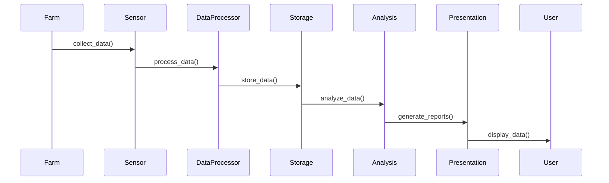
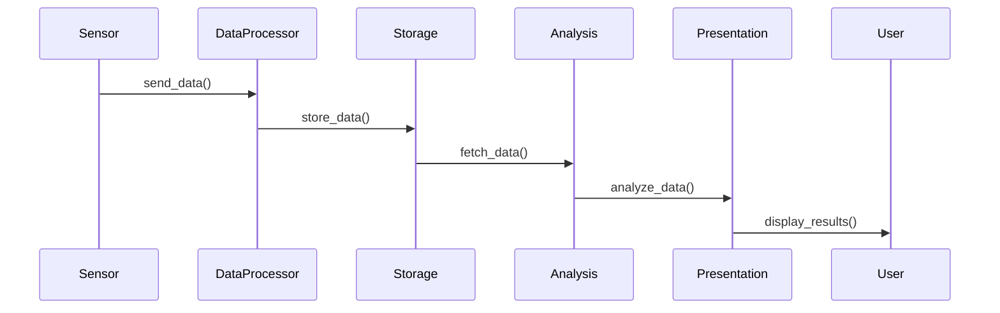

                 

# IoT数据采集与处理架构

## 关键词：物联网、数据采集、数据处理、架构设计、传感器

> 摘要：本文将深入探讨物联网（IoT）数据采集与处理架构，从基础概念、技术细节到实际应用，为读者呈现一个全面而详实的IoT数据处理解决方案。文章旨在帮助读者理解物联网数据采集与处理的各个环节，并掌握其背后的核心原理和关键技术。

### 目录大纲：

1. **第一部分：IoT概述与数据采集基础**
    1.1 物联网（IoT）基础
    1.2 数据采集的基本原理
    1.3 传感器与数据采集硬件
    1.4 数据采集案例分析

2. **第二部分：数据采集与传输架构设计**
    2.1 数据采集架构设计
    2.2 数据传输与通信协议
    2.3 数据存储与管理
    2.4 架构设计案例分析

3. **第三部分：数据预处理与处理架构**
    3.1 数据预处理基本概念
    3.2 数据处理架构设计
    3.3 数据处理算法
    3.4 算法性能评估

4. **第四部分：IoT数据应用实践**
    4.1 IoT数据分析应用
    4.2 IoT数据可视化
    4.3 IoT数据安全与隐私

### 1. IoT概述与数据采集基础

#### 1.1 物联网（IoT）基础

**概念与历史**

物联网（Internet of Things，IoT）是一个将物理设备、传感器、软件和网络连接起来，以实现自动化、数据交换和智能决策的生态系统。物联网的概念最早由凯文·阿什顿（Kevin Ashton）在1999年提出。

**核心技术**

物联网的核心技术包括传感器技术、网络技术、数据处理与存储技术、安全技术和人工智能技术。

**分类与应用领域**

物联网主要分为消费类物联网和工业物联网。应用领域包括智能家居、智能城市、智能医疗、智能农业、工业自动化等。

#### 1.2 数据采集的基本原理

**重要性**

数据采集是物联网系统的核心，决定了物联网系统能够获得多少有价值的信息。

**数据采集的方式**

数据采集可以通过有线或无线的方式实现，主要依赖于传感器和采集设备。

**数据采集中的挑战**

数据采集面临的挑战包括数据质量、数据同步、数据量庞大和数据安全等。

**数据采集案例分析**

通过一个智能交通系统的案例，介绍数据采集的具体实现过程和技术难点。

#### 1.3 传感器与数据采集硬件

**传感器概述**

传感器是物联网系统中用于检测和测量物理量的设备。

**传感器分类与工作原理**

传感器主要分为物理传感器、化学传感器和生物传感器等，它们通过不同的机制检测环境变化。

**数据采集硬件选型与连接**

选择合适的传感器和采集硬件，确保数据采集的准确性和可靠性。

**硬件调试与故障排除**

介绍传感器和采集硬件的调试方法，以及常见的故障排除技巧。

### 2. 数据采集与传输架构设计

#### 2.1 数据采集架构设计

**数据采集架构概述**

数据采集架构是物联网系统的核心组成部分，负责从各种传感器和设备中收集数据。

**数据采集架构设计原则**

设计原则包括模块化、可扩展性、高可靠性和易维护性等。

**数据采集架构实现方案**

详细介绍数据采集架构的实现方案，包括硬件选型、软件设计和数据流处理等。

**架构设计案例分析**

通过一个智能家居系统的案例，展示数据采集架构的实际应用。

#### 2.2 数据传输与通信协议

**数据传输基础**

数据传输是实现物联网系统数据交换的关键，涉及数据格式、传输速度和可靠性等问题。

**常见通信协议**

介绍常用的通信协议，如Wi-Fi、蓝牙、Zigbee、MQTT等。

**通信协议选型与优化**

根据应用场景和需求，选择合适的通信协议，并进行优化。

**通信协议应用案例分析**

通过一个智能农业系统的案例，展示数据传输协议的实际应用。

#### 2.3 数据存储与管理

**数据存储概述**

数据存储是物联网系统中数据管理的重要组成部分。

**数据存储方案设计**

设计数据存储方案，包括数据库选择、数据表设计和数据模型等。

**数据管理策略**

制定数据管理策略，确保数据的一致性、可用性和安全性。

**数据隐私与安全**

介绍数据隐私与安全的重要性和防护措施。

### 3. 数据预处理与处理架构

#### 3.1 数据预处理基本概念

**数据预处理的重要性**

数据预处理是数据分析和挖掘的前期工作，直接影响分析结果的准确性。

**数据预处理流程**

数据预处理流程包括数据清洗、数据整合、数据变换和数据归一化等。

**数据清洗方法**

介绍常见的数据清洗方法，如缺失值处理、异常值处理和重复值处理等。

**数据预处理工具与技术**

介绍常用的数据预处理工具和技术，如Pandas、NumPy等。

#### 3.2 数据处理架构设计

**数据处理架构概述**

数据处理架构是物联网系统中数据分析和处理的核心。

**数据处理架构设计原则**

设计原则包括高效性、可扩展性和灵活性等。

**数据处理架构实现方案**

详细介绍数据处理架构的实现方案，包括数据处理引擎选择、数据流处理和存储等。

**数据处理架构优化与调优**

介绍数据处理架构的优化方法和调优技巧。

#### 3.3 数据处理算法

**数据处理算法概述**

数据处理算法包括数据过滤、数据聚合、数据分类、数据预测等。

**常见数据处理算法**

介绍常见的数据处理算法，如K-Means聚类、决策树、神经网络等。

**算法选择与实现**

根据应用需求选择合适的算法，并详细介绍算法的实现过程。

**算法性能评估**

介绍算法性能评估的方法和指标，如准确率、召回率、F1值等。

### 4. IoT数据应用实践

#### 4.1 IoT数据分析应用

**数据分析概述**

数据分析是物联网系统的重要应用之一，用于从数据中提取有价值的信息。

**数据分析应用场景**

介绍常见的IoT数据分析应用场景，如智能交通、智能医疗、智能农业等。

**数据分析工具与方法**

介绍常用的数据分析工具和方法，如Python、R、Tableau等。

**数据分析案例实践**

通过实际案例展示数据分析的过程和方法。

#### 4.2 IoT数据可视化

**数据可视化基础**

介绍数据可视化的基本概念和原理。

**数据可视化工具与库**

介绍常用的数据可视化工具和库，如Matplotlib、Seaborn、D3.js等。

**可视化设计与实现**

展示数据可视化的设计与实现过程。

**可视化案例实践**

通过实际案例展示数据可视化的应用。

#### 4.3 IoT数据安全与隐私

**数据安全概述**

介绍数据安全的重要性和常见的威胁。

**常见数据安全威胁**

介绍常见的数据安全威胁，如DDoS攻击、SQL注入、数据泄露等。

**数据隐私保护策略**

介绍数据隐私保护策略和方法。

**数据安全案例分析**

通过实际案例展示数据安全的重要性。

### 结束语

本文详细介绍了物联网数据采集与处理架构的各个方面，从基础概念到实际应用，为读者提供了一个全面而深入的理解。通过本文的学习，读者应该能够掌握物联网数据采集与处理的核心技术和方法，为未来的物联网应用开发打下坚实的基础。

### 参考文献

1. Kevin Ashton, "Internet of Things," RFID Journal, 1999.
2. Python Software Foundation, "Pandas: Python Data Analysis Library," https://pandas.pydata.org/, 2023.
3. R Foundation, "R: A Language and Environment for Statistical Computing," https://www.R-project.org/, 2023.
4. Tableau Software, "Tableau: Data Visualization Software," https://www.tableau.com/, 2023.
5. MQTT.org, "MQTT: Message Queuing Telemetry Transport," https://www.mqtt.org/, 2023.
6. Zigbee Alliance, "Zigbee: The Standard for IoT," https://www.zigbee.org/, 2023.

### 作者信息

作者：AI天才研究院/AI Genius Institute & 禅与计算机程序设计艺术 /Zen And The Art of Computer Programming

---

## 1. IoT概述与数据采集基础

### 1.1 物联网（IoT）基础

#### 概念与历史

物联网（Internet of Things，简称IoT）是指通过互联网将各种设备、传感器、系统连接起来，形成一个智能的网络环境。这个概念最早由凯文·阿什顿（Kevin Ashton）在1999年提出，他当时正在研究RFID（射频识别）技术，并首次使用了“物联网”这个词。

随着技术的不断进步，物联网的概念和应用范围逐渐扩大。如今，物联网已经成为信息技术领域的一个重要分支，涵盖了智能家居、智能交通、智能医疗、智能农业、工业物联网等多个领域。

#### 核心技术

物联网的核心技术包括以下几个方面：

1. **传感器技术**：传感器是物联网系统的感知器官，用于检测和测量各种物理量，如温度、湿度、光照、声音等。
2. **网络技术**：网络是物联网的数据传输通道，包括Wi-Fi、蓝牙、Zigbee、NFC等多种无线通信技术。
3. **数据处理与存储技术**：数据处理与存储技术负责对采集到的数据进行处理、存储和管理，常用的技术包括云计算、大数据技术、数据库技术等。
4. **安全技术**：安全技术在物联网中至关重要，包括数据加密、身份认证、访问控制等多种安全机制。
5. **人工智能技术**：人工智能技术用于对物联网数据进行智能分析和决策，如机器学习、深度学习等。

#### 分类与应用领域

物联网主要分为消费类物联网和工业物联网两大类。消费类物联网主要涉及智能家居、可穿戴设备、智能医疗设备等，旨在提高人们的生活质量。工业物联网则主要应用于工业自动化、智能物流、智能工厂等领域，旨在提高生产效率和降低成本。

以下是物联网的一些典型应用领域：

1. **智能家居**：通过物联网技术，实现家庭设备的远程控制和自动化管理，如智能灯泡、智能电视、智能空调等。
2. **智能交通**：利用物联网技术，实现交通信息的实时监测和智能调度，提高交通效率和安全性。
3. **智能医疗**：通过物联网技术，实现医疗设备和系统的智能化管理，提高医疗服务的质量和效率。
4. **智能农业**：利用物联网技术，实现对农作物生长环境的监测和智能控制，提高农业生产效率和品质。
5. **工业自动化**：通过物联网技术，实现工业设备的远程监控和智能调度，提高生产效率和降低成本。

#### 物联网发展现状与趋势

随着5G、云计算、大数据和人工智能等新技术的不断发展，物联网正在进入一个新的发展阶段。目前，物联网已经在各个领域得到广泛应用，全球物联网设备数量迅速增长。根据市场研究公司的数据，预计到2025年，全球物联网设备数量将超过260亿台。

物联网的发展趋势主要包括以下几个方面：

1. **设备数量的快速增长**：随着物联网技术的普及，设备数量将呈现指数级增长，这将带来海量的数据。
2. **数据处理的实时性要求**：物联网应用对数据处理的要求越来越高，需要实现实时数据采集、分析和决策。
3. **数据隐私和安全问题**：随着数据量的增加，数据隐私和安全问题越来越重要，需要采取有效的措施保护用户隐私和数据安全。
4. **跨行业融合**：物联网技术正在与其他行业深度融合，如工业物联网、智能医疗、智能交通等，形成新的应用场景和商业模式。
5. **人工智能的深度融合**：人工智能技术将在物联网中发挥越来越重要的作用，实现数据的智能分析和决策。

总之，物联网作为一种新兴技术，具有广泛的应用前景和巨大的市场潜力。了解物联网的基础知识和发展趋势，对于从事物联网相关领域的工作者来说至关重要。

### 1.2 数据采集的基本原理

#### 重要性

数据采集是物联网系统的核心环节，它决定了物联网系统能够获取多少有价值的信息。数据采集的质量直接影响数据分析和应用的准确性和有效性。因此，了解数据采集的基本原理和关键技术，对于设计和实现高效的物联网系统具有重要意义。

#### 数据采集的方式

物联网系统中的数据采集方式主要有以下几种：

1. **有线采集**：有线采集是通过有线连接，如USB、以太网等，将传感器数据传输到中央处理单元。有线采集的优点是数据传输稳定，但需要布线，成本较高，适用于固定场景。

2. **无线采集**：无线采集通过无线通信技术，如Wi-Fi、蓝牙、Zigbee等，将传感器数据传输到中央处理单元。无线采集的优点是灵活性强，适用于移动和复杂场景，但可能会受到信号干扰和能耗问题的影响。

3. **边缘计算采集**：边缘计算采集是将数据处理和计算任务分散到边缘设备上，如智能路由器、网关等，从而减少数据传输量和延迟。边缘计算采集的优点是实时性强，数据处理的延迟更低，但需要具备一定的计算和存储能力。

#### 数据采集中的挑战

在数据采集过程中，可能会面临以下挑战：

1. **数据质量**：数据质量是数据采集的关键问题。传感器的不准确性、数据传输的丢失和延迟等都可能影响数据质量。因此，需要采取有效的数据清洗和预处理方法，确保数据的质量和准确性。

2. **数据同步**：在分布式系统中，多个传感器和设备可能同时采集数据，如何保证数据的一致性和同步性是一个重要问题。需要设计合理的同步机制和数据传输协议，确保数据的实时性和准确性。

3. **数据量庞大**：物联网系统中，传感器和设备数量庞大，采集的数据量也非常大。如何高效地处理和存储这些数据，是一个重要的技术挑战。需要采用分布式存储和处理技术，提高系统的处理能力和扩展性。

4. **数据安全**：数据在采集、传输和存储过程中，可能会面临安全威胁，如数据泄露、篡改等。需要采取有效的安全措施，确保数据的安全和隐私。

#### 数据采集案例分析

以一个智能农业系统为例，介绍数据采集的具体实现过程和技术难点。

**案例背景**：

一个智能农业系统需要实时监测农作物生长环境的数据，如土壤湿度、温度、光照等。这些数据将用于优化灌溉、施肥等农业操作，提高农作物产量。

**数据采集过程**：

1. **传感器部署**：在农田中部署各种传感器，如土壤湿度传感器、温度传感器、光照传感器等。这些传感器实时监测环境数据，并通过无线通信技术将数据发送到中央处理单元。

2. **数据传输**：传感器采集的数据通过无线通信技术传输到边缘计算节点，如智能路由器或网关。边缘计算节点对数据进行初步处理和过滤，然后将处理后的数据传输到中央服务器。

3. **数据处理**：中央服务器接收数据后，对数据进行进一步处理和分析，生成决策信息，如灌溉、施肥建议等。这些决策信息通过无线通信技术发送回农田设备，指导农业操作。

**技术难点**：

1. **传感器选择和部署**：需要选择适合农业环境的传感器，并合理部署传感器，确保数据采集的全面性和准确性。

2. **数据传输稳定性**：农田环境复杂，无线信号可能会受到干扰，需要设计稳定的数据传输协议，确保数据传输的可靠性和实时性。

3. **数据预处理**：由于传感器数据可能存在噪声、异常值等问题，需要设计有效的数据预处理算法，提高数据的准确性和一致性。

4. **数据同步与一致性**：多个传感器和设备可能同时采集数据，需要设计合理的数据同步机制，确保数据的一致性和实时性。

通过这个案例，可以看到数据采集在物联网系统中的重要性以及实现数据采集所面临的技术挑战。了解这些基本原理和关键技术，有助于设计和实现高效、可靠的物联网数据采集系统。

### 1.3 传感器与数据采集硬件

#### 传感器概述

传感器是物联网系统中的关键组成部分，用于感知外部环境的变化，并将这些变化转换为电信号或其他形式的输出。传感器在物联网系统中起到了信息采集和传输的桥梁作用，是实现智能化和网络化的重要基础。

**分类**：

传感器可以根据不同的分类标准进行分类，以下是一些常见的分类方式：

1. **按工作原理分类**：
   - **物理传感器**：通过物理变化来感知外部环境，如温度传感器、压力传感器、湿度传感器等。
   - **化学传感器**：通过化学反应来感知外部环境，如气体传感器、化学传感器等。
   - **生物传感器**：通过生物化学反应来感知外部环境，如生物传感器、酶传感器等。

2. **按功能分类**：
   - **温度传感器**：用于测量温度，如热电偶、热敏电阻等。
   - **压力传感器**：用于测量压力，如应变片、压电传感器等。
   - **湿度传感器**：用于测量湿度，如电容式湿度传感器、电阻式湿度传感器等。
   - **光照传感器**：用于测量光照强度，如光电管、光电二极管等。
   - **声音传感器**：用于测量声音，如麦克风、声波传感器等。
   - **位置传感器**：用于测量位置，如GPS模块、超声波传感器等。

**工作原理**：

传感器的工作原理主要包括以下几个方面：

1. **物理效应**：如热电效应、光电效应、压电效应等，通过这些效应将物理量转换为电信号。
2. **化学反应**：通过化学反应将化学量转换为电信号，如气体传感器中的催化反应。
3. **生物反应**：通过生物化学反应来感知外部环境，如酶传感器中的生物分子反应。

**传感器在物联网系统中的作用**：

1. **信息采集**：传感器是物联网系统获取外部环境数据的主要手段，通过感知和测量各种物理量，将环境变化转换为可处理的电信号。
2. **数据传输**：传感器采集的数据需要通过无线或有线方式传输到中央处理单元，以便进一步处理和分析。
3. **控制与反馈**：传感器不仅可以用于数据采集，还可以在物联网系统中实现控制功能，如调节温室中的湿度、温度等。

#### 数据采集硬件

数据采集硬件是物联网系统中用于连接传感器和实现数据采集的设备，主要包括传感器接口、数据传输接口和数据处理单元等。

**数据采集硬件的类型**：

1. **传感器接口**：用于连接各种传感器，将传感器的电信号转换为标准化的数据格式，如I2C、SPI、UART等接口。
2. **数据传输接口**：用于将传感器数据传输到中央处理单元或云端，如Wi-Fi、蓝牙、Zigbee、以太网等无线或有线传输接口。
3. **数据处理单元**：用于对传感器数据进行初步处理和分析，如微控制器、嵌入式系统、边缘计算设备等。

**数据采集硬件的选型**：

在选择数据采集硬件时，需要考虑以下几个方面：

1. **传感器兼容性**：确保所选硬件能够兼容各种类型的传感器，满足不同场景的需求。
2. **数据传输能力**：根据数据传输量、传输距离和传输可靠性等要求，选择合适的传输接口和传输协议。
3. **数据处理能力**：根据数据处理需求，选择具备足够处理能力和存储能力的硬件设备，如微控制器、嵌入式系统等。
4. **功耗和尺寸**：对于移动和便携式应用，需要考虑硬件的功耗和尺寸，选择轻量级和低功耗的硬件设备。

**硬件调试与故障排除**：

在数据采集硬件的调试过程中，可能会遇到各种问题，如传感器连接失败、数据传输中断、硬件故障等。以下是常见的调试方法和故障排除技巧：

1. **检查连接**：确保传感器和采集硬件之间的连接正确，接口牢固，没有松动或接触不良的问题。
2. **测试传感器**：使用测试工具或软件测试传感器的输出信号，确认传感器工作正常。
3. **检查传输接口**：检查数据传输接口的工作状态，确保信号传输正常，没有干扰或噪声。
4. **调试程序**：检查采集硬件的编程代码，确保程序运行正确，数据采集和处理逻辑无误。
5. **故障排查**：根据硬件故障的症状，逐步排查可能的故障点，如电源问题、硬件损坏等，采取相应的维修或更换措施。

通过了解传感器与数据采集硬件的基本原理、分类和选型，以及调试和故障排除技巧，可以更好地设计和实现物联网系统中的数据采集功能，确保系统稳定可靠地运行。

### 1.4 数据采集案例分析

为了更好地理解数据采集的过程和挑战，我们可以通过一个智能家居系统的案例分析来详细探讨。

**案例背景**：

智能家居系统旨在通过物联网技术，实现家庭设备的自动化控制和智能化管理，提高居住的舒适性和便利性。该系统需要实时监测和采集家庭环境中的各种数据，如温度、湿度、光照、噪音等，并根据这些数据进行智能决策。

**数据采集过程**：

1. **传感器部署**：
   - **温度传感器**：安装在客厅、卧室和厨房等关键区域，用于监测室内温度。
   - **湿度传感器**：同样安装在上述区域，用于监测室内湿度。
   - **光照传感器**：安装在客厅和卧室的窗户附近，用于监测室内光照强度。
   - **噪音传感器**：安装在客厅和卧室的墙壁附近，用于监测室内噪音水平。

2. **数据传输**：
   - 传感器采集的数据通过无线通信技术（如Zigbee、蓝牙）传输到网关设备。网关设备作为数据的中转站，将数据进一步传输到智能家居系统的中央处理单元。

3. **数据处理**：
   - 中央处理单元接收传感器数据后，对其进行预处理，包括去噪、滤波和归一化等，以确保数据的质量。
   - 预处理后的数据被存储在云端数据库中，供后续分析和决策使用。

**技术难点**：

1. **数据质量**：
   - 传感器数据可能受到环境噪声的影响，需要进行数据清洗和预处理，以去除噪声和异常值，确保数据准确性。

2. **数据同步**：
   - 由于智能家居系统中的传感器和设备分布在不同区域，如何确保数据采集的实时性和一致性是一个挑战。需要设计合理的同步机制和数据传输协议。

3. **数据量庞大**：
   - 智能家居系统中的传感器数量众多，采集的数据量非常大。如何高效地处理和存储这些数据，是一个技术难题。可以采用分布式存储和处理技术，提高系统的扩展性和性能。

4. **数据安全**：
   - 数据在传输和存储过程中可能会面临安全威胁，如数据泄露、篡改等。需要采取有效的安全措施，如数据加密、身份认证等，确保数据的安全性和隐私性。

**解决方案**：

1. **数据预处理**：
   - 采用滤波算法（如移动平均滤波、中值滤波等）去除噪声和异常值。
   - 对数据进行归一化处理，将不同传感器采集的数据转换为相同的量纲，便于后续分析。

2. **同步机制**：
   - 设计时间同步机制，确保传感器和设备之间的时间一致性。
   - 采用可靠的数据传输协议（如MQTT），确保数据传输的实时性和可靠性。

3. **分布式存储与处理**：
   - 采用云计算和分布式数据库技术，将数据分散存储和处理，提高系统的扩展性和性能。
   - 设计数据流处理系统，实时处理和分析传感器数据，快速生成决策信息。

4. **数据安全**：
   - 采用数据加密技术，对传输和存储的数据进行加密，防止数据泄露。
   - 实施访问控制和身份认证机制，确保只有授权用户才能访问数据。

**案例总结**：

通过这个智能家居系统的案例分析，我们可以看到数据采集在物联网系统中的重要性以及实现数据采集所面临的技术挑战。有效的数据采集和管理，是智能家居系统能够正常运行和提供智能化服务的关键。了解并掌握数据采集的基本原理和关键技术，对于设计和实现高效、可靠的物联网系统具有重要意义。

## 2. 数据采集与传输架构设计

### 2.1 数据采集架构设计

#### 数据采集架构概述

数据采集架构是物联网系统的基础，负责从传感器和设备中收集数据，并将其传输到中央处理单元。一个完善的数据采集架构应具备以下核心组成部分：

1. **传感器**：用于感知外部环境，并产生数据。
2. **采集设备**：包括传感器接口、数据转换器等，用于将传感器数据转换为适合传输的格式。
3. **传输网络**：用于将采集到的数据传输到中央处理单元或云平台。
4. **中央处理单元**：用于对数据进行处理和分析。

#### 数据采集架构设计原则

在设计数据采集架构时，需要遵循以下原则：

1. **模块化**：架构应具有高度的模块化，便于维护和扩展。
2. **高可靠性**：确保数据采集过程的稳定性，减少数据丢失和错误。
3. **可扩展性**：支持未来设备的增加和新功能的添加。
4. **灵活性**：适应不同类型传感器和设备的接入。
5. **安全性**：确保数据在传输和存储过程中的安全性。

#### 数据采集架构实现方案

数据采集架构的实现方案通常包括以下几个方面：

1. **硬件选型**：
   - **传感器**：根据监测需求选择合适的传感器，如温度传感器、湿度传感器、光照传感器等。
   - **采集设备**：如微控制器、网关等，用于连接传感器和传输网络。

2. **软件设计**：
   - **数据采集程序**：编写程序，实现传感器的数据读取和格式转换。
   - **通信协议**：选择合适的通信协议，如Zigbee、MQTT等，实现传感器数据到中央处理单元的传输。

3. **数据流设计**：
   - 设计数据流处理逻辑，包括数据过滤、数据同步、数据存储等。

4. **安全性设计**：
   - 实施数据加密、访问控制、身份认证等安全措施，确保数据安全。

#### 架构设计案例分析

以一个智能农业系统的数据采集架构为例，详细介绍架构设计和实现过程。

**案例背景**：

智能农业系统需要实时监测农田中的各种环境数据，如土壤湿度、温度、光照等，并根据这些数据进行智能灌溉和施肥。

**架构设计**：

1. **硬件部分**：
   - **传感器**：在农田中部署各种传感器，如土壤湿度传感器、温度传感器、光照传感器等。
   - **采集设备**：使用微控制器作为数据采集设备，通过I2C接口连接传感器，将采集到的数据转换为标准格式。

2. **软件部分**：
   - **数据采集程序**：编写程序，实现传感器数据的读取和格式转换，通过Wi-Fi模块将数据传输到网关。
   - **网关**：作为数据的中转站，将数据进一步传输到云平台。

3. **数据流设计**：
   - **数据过滤**：在网关中对传感器数据进行分析，过滤掉异常值和噪声。
   - **数据同步**：设计时间同步机制，确保数据采集的实时性和一致性。
   - **数据存储**：将过滤后的数据存储在云数据库中，供后续分析和决策使用。

4. **安全性设计**：
   - **数据加密**：使用TLS协议对传输的数据进行加密，确保数据安全。
   - **访问控制**：实施严格的访问控制策略，确保只有授权用户可以访问数据。

**实现过程**：

1. **硬件部署**：在农田中安装传感器和采集设备，确保硬件连接正常。
2. **软件编程**：编写数据采集程序，实现数据的读取、格式转换和传输。
3. **数据流处理**：在网关和云平台中设计数据流处理逻辑，对传感器数据进行分析和处理。
4. **安全性配置**：配置数据加密和访问控制措施，确保系统的安全性。

通过这个案例，可以看到数据采集架构的设计原则和实现过程。有效的数据采集架构是实现智能农业系统的基础，它确保了数据的实时性、准确性和安全性，为后续的数据处理和应用提供了可靠的数据支持。

### 2.2 数据传输与通信协议

#### 数据传输基础

数据传输是物联网系统中的一个关键环节，它决定了传感器和设备采集的数据能否及时、准确地传输到中央处理单元或云端。了解数据传输的基础知识，对于设计和实现高效、可靠的物联网系统至关重要。

**数据传输方式**

物联网系统中的数据传输方式主要包括以下几种：

1. **有线传输**：通过有线连接，如以太网、USB等，将传感器数据传输到中央处理单元或云端。有线传输的优点是传输速率高、可靠性好，但需要布线，成本较高，适用于固定场景。

2. **无线传输**：通过无线通信技术，如Wi-Fi、蓝牙、Zigbee、NFC等，将传感器数据传输到中央处理单元或云端。无线传输的优点是灵活性强，适用于移动和复杂场景，但可能会受到信号干扰和能耗问题的影响。

3. **边缘计算传输**：在边缘设备（如网关、路由器等）上进行数据处理和存储，然后将处理后的数据传输到中央处理单元或云端。边缘计算传输的优点是实时性强，数据处理的延迟更低，但需要具备一定的计算和存储能力。

**数据传输速率和可靠性**

数据传输速率和可靠性是数据传输的两个重要指标：

1. **数据传输速率**：数据传输速率是指数据在传输过程中每秒传输的数据量，通常用比特率（bps）表示。数据传输速率越高，数据传输速度越快。在选择数据传输方式时，需要根据应用场景和数据量大小来选择合适的传输速率。

2. **可靠性**：可靠性是指数据在传输过程中不出错或丢失的概率。高可靠性的传输方式可以确保数据传输的准确性，避免数据丢失和错误。在选择数据传输方式时，需要考虑传输介质的稳定性、信号强度、干扰等因素，以提高数据传输的可靠性。

#### 常见通信协议

在物联网系统中，常见的通信协议包括Wi-Fi、蓝牙、Zigbee、NFC、MQTT等。以下是对这些通信协议的简要介绍：

1. **Wi-Fi**：Wi-Fi是一种无线局域网通信协议，通过IEEE 802.11标准实现。Wi-Fi具有高传输速率、广泛的应用范围和较高的可靠性，适用于家庭、办公室和公共场所等环境。但Wi-Fi功耗较高，不适合长时间运行的传感器设备。

2. **蓝牙**：蓝牙是一种短距离无线通信技术，通过IEEE 802.15.1标准实现。蓝牙具有低功耗、低成本、易于实现等特点，适用于连接各种传感器和设备，如手机、耳机、智能手表等。蓝牙的传输速率相对较低，但足以满足大多数物联网应用的需求。

3. **Zigbee**：Zigbee是一种低功耗、短距离无线通信技术，通过IEEE 802.15.4标准实现。Zigbee具有高可靠性、低功耗和低成本等优点，适用于智能家居、智能工业和智能农业等领域。Zigbee的传输速率较慢，但适合数据量较小的物联网应用。

4. **NFC**：NFC（近场通信）是一种短距离无线通信技术，通过RFID技术实现。NFC具有快速、简便、安全的连接方式，适用于支付、身份验证和数据交换等应用场景。但NFC的传输距离较短，仅限于几厘米之内。

5. **MQTT**：MQTT（Message Queuing Telemetry Transport）是一种轻量级的消息传输协议，专门为物联网应用设计。MQTT具有低功耗、高可靠性、可扩展性和易于实现等优点，适用于各种物联网设备和应用场景。MQTT通过发布/订阅模式进行数据传输，可以确保数据传输的实时性和可靠性。

#### 通信协议选型与优化

在选择通信协议时，需要考虑以下几个方面：

1. **应用场景**：根据物联网应用的需求和场景，选择合适的通信协议。例如，智能家居系统可以优先考虑Wi-Fi和蓝牙，工业物联网系统可以优先考虑Zigbee。

2. **数据传输速率和可靠性**：根据数据传输速率和可靠性的要求，选择合适的通信协议。如果数据传输速率要求较高，可以选择Wi-Fi或NFC；如果数据传输可靠性要求较高，可以选择MQTT。

3. **功耗和成本**：根据功耗和成本的要求，选择合适的通信协议。如果功耗较低、成本较低，可以选择蓝牙或Zigbee；如果功耗较高、成本较高，可以选择Wi-Fi或NFC。

4. **安全性**：根据数据安全的要求，选择合适的通信协议。如果需要高安全性，可以选择MQTT或TLS等安全协议。

在优化通信协议时，可以采取以下措施：

1. **协议栈优化**：优化通信协议的协议栈，减少传输过程中的数据包大小和传输次数，提高传输效率。

2. **数据压缩**：采用数据压缩技术，减少传输数据的大小，降低传输延迟和带宽消耗。

3. **路由优化**：优化数据传输路由，选择最优的传输路径，减少传输距离和延迟。

4. **网络管理**：采用网络管理技术，如动态带宽分配、流量控制等，提高网络传输的效率和可靠性。

通过合理选择和优化通信协议，可以确保物联网系统数据传输的高效、可靠和安全，为物联网应用提供坚实的基础。

#### 通信协议应用案例分析

为了更好地理解通信协议在实际物联网应用中的使用，我们可以通过一个智能照明系统的案例来详细探讨。

**案例背景**：

智能照明系统旨在通过物联网技术实现家庭照明的自动化控制和智能化管理，提高居住的舒适性和能源利用率。该系统需要实时监测和采集室内光照强度数据，并根据光照强度自动调节灯光亮度。

**通信协议选择**：

在这个案例中，我们选择Wi-Fi作为数据传输的通信协议。Wi-Fi具有高传输速率、广泛的应用范围和较高的可靠性，适用于家庭环境中的数据传输。同时，Wi-Fi的功耗较低，适合长时间运行的传感器设备。

**实现过程**：

1. **硬件部署**：
   - **传感器**：在家庭各个房间安装光照传感器，用于实时监测室内光照强度。
   - **采集设备**：使用带有Wi-Fi模块的微控制器作为数据采集设备，通过I2C接口连接光照传感器，将采集到的光照数据转换为Wi-Fi可传输的格式。

2. **软件设计**：
   - **数据采集程序**：编写程序，实现光照传感器的数据读取和Wi-Fi数据传输。
   - **Wi-Fi配置**：配置Wi-Fi模块，使其能够连接到家庭无线网络，并将采集到的光照数据发送到中央处理单元。

3. **数据处理**：
   - **中央处理单元**：接收光照传感器数据后，进行预处理，包括去噪、滤波和归一化等，以确保数据的质量。
   - **智能决策**：根据预处理后的光照数据，自动调节灯光亮度，实现智能照明控制。

**技术难点**：

1. **数据同步**：由于光照传感器分布在家庭的不同区域，如何确保数据采集的实时性和一致性是一个挑战。我们采用了时间同步机制，确保传感器和设备之间的时间一致性。

2. **功耗管理**：由于家庭环境对功耗有较高的要求，需要优化数据传输协议和算法，降低功耗。

3. **安全性**：数据在传输和存储过程中需要保证安全，我们采用了Wi-Fi加密技术，确保数据的安全性和隐私性。

**解决方案**：

1. **时间同步**：使用NTP（网络时间协议）确保光照传感器和设备的时钟同步，提高数据采集的实时性。

2. **功耗优化**：优化通信协议和算法，减少数据传输的频率和功耗。例如，采用MQTT协议的QoS级别0，仅在必要时传输数据。

3. **安全加密**：采用Wi-Fi加密技术（如WPA2），确保数据在传输过程中的安全性和隐私性。

通过这个智能照明系统的案例分析，我们可以看到通信协议在物联网应用中的重要性以及实现数据传输的技术挑战。了解并掌握通信协议的基本原理和优化方法，有助于设计和实现高效、可靠的物联网系统。

### 2.3 数据存储与管理

#### 数据存储概述

数据存储是物联网系统中不可或缺的一环，它负责存储从传感器和设备采集到的数据，以便后续的数据处理和分析。有效的数据存储方案能够确保数据的安全、可靠和高效访问。

**数据存储的重要性**

1. **数据完整性**：数据存储确保了数据的完整性和可靠性，避免数据丢失或损坏。
2. **数据一致性**：通过合理的存储方案，确保数据的一致性，支持多用户和多应用场景的数据访问。
3. **数据可扩展性**：数据存储方案需要支持数据量的增长和系统扩展，以满足未来需求。
4. **数据安全性**：数据存储应具备良好的安全机制，防止数据泄露和未经授权的访问。

**数据存储方案的设计**

在设计和实现数据存储方案时，需要考虑以下几个方面：

1. **数据类型**：根据数据类型和特性选择合适的存储方案，如关系型数据库、NoSQL数据库、时序数据库等。
2. **数据量**：根据数据量的规模和增长趋势选择存储方案，确保存储系统能够满足数据量需求。
3. **数据访问频率**：根据数据访问频率和速度要求选择存储方案，如使用内存存储提高数据访问速度。
4. **数据备份与恢复**：设计数据备份和恢复策略，确保在数据丢失或系统故障时能够迅速恢复数据。

**数据存储技术的种类**

1. **关系型数据库**：如MySQL、PostgreSQL等，适用于结构化数据的存储和管理。
2. **NoSQL数据库**：如MongoDB、Cassandra等，适用于大规模数据的存储和高可扩展性。
3. **时序数据库**：如InfluxDB、TimeScaleDB等，适用于存储和处理时间序列数据。
4. **文件系统**：如HDFS、Ceph等，适用于大规模数据存储和管理。
5. **内存存储**：如Redis、Memcached等，适用于高速缓存和数据访问。

#### 数据存储方案设计

设计一个高效、可靠的数据存储方案，需要考虑以下步骤：

1. **需求分析**：明确数据存储的需求，包括数据类型、数据量、访问频率等。
2. **选型评估**：根据需求分析结果，评估各种数据存储技术的优缺点，选择合适的存储方案。
3. **架构设计**：设计数据存储架构，包括数据表设计、存储位置分配、数据访问策略等。
4. **性能优化**：针对存储系统的性能要求，进行优化，如索引设计、数据压缩、缓存策略等。
5. **安全防护**：设计数据安全策略，包括数据加密、访问控制、备份与恢复等。

#### 数据管理策略

数据管理策略是确保数据质量、一致性和安全性的关键，包括以下几个方面：

1. **数据清洗**：定期清洗数据，去除重复、错误和无效的数据，确保数据质量。
2. **数据归一化**：将不同来源和格式的数据进行标准化处理，确保数据的一致性。
3. **数据访问控制**：设置严格的访问控制策略，确保只有授权用户能够访问数据。
4. **数据备份与恢复**：定期备份数据，并设计快速恢复策略，以应对数据丢失或系统故障。
5. **数据安全**：实施数据加密、身份认证、访问控制等安全措施，保护数据不被未经授权访问。

通过合理设计和实施数据存储和管理策略，可以确保物联网系统的数据存储安全、高效、可靠，为后续的数据处理和分析提供坚实的基础。

#### 数据隐私与安全

在物联网系统中，数据隐私和安全是至关重要的，因为传感器和设备会采集大量的敏感信息，如个人健康数据、家庭环境数据等。以下是一些关键策略和措施，以确保数据隐私与安全。

**数据加密**

数据加密是保护数据隐私和安全的重要手段。在数据传输和存储过程中，应对数据进行加密处理，防止数据在传输过程中被窃取或篡改。常用的加密算法包括AES（高级加密标准）、RSA（非对称加密算法）等。

**访问控制**

访问控制是防止未经授权访问数据的重要措施。通过设置用户身份验证、权限管理，确保只有经过认证的用户才能访问特定数据。常用的访问控制方法包括基于角色的访问控制（RBAC）和基于属性的访问控制（ABAC）。

**数据匿名化**

在数据分析和处理过程中，对敏感信息进行匿名化处理，隐藏真实身份信息，以减少隐私泄露风险。常用的匿名化方法包括数据脱敏、数据混淆等。

**安全审计**

定期进行安全审计，检查系统漏洞和安全隐患，确保系统的安全防护措施得到有效执行。安全审计包括漏洞扫描、日志分析、安全事件响应等。

**数据备份与恢复**

设计数据备份与恢复策略，确保在数据丢失或系统故障时能够迅速恢复数据。备份策略应包括数据备份频率、备份方式、备份存储位置等。

**用户教育与培训**

加强对用户的隐私保护意识和数据安全培训，提高用户的安全意识和操作技能，减少人为错误导致的数据泄露。

**法律法规遵守**

遵守相关法律法规，如《通用数据保护条例》（GDPR）等，确保数据处理符合法律法规要求。

通过上述措施，可以显著提高物联网系统的数据隐私和安全水平，保障用户的个人信息和数据安全。

### 3. 数据预处理基本概念

#### 数据预处理的重要性

数据预处理是数据分析和挖掘的前期工作，其重要性不可忽视。数据预处理的主要目标是通过一系列数据清洗、转换和归一化操作，将原始数据转化为适合分析和挖掘的形式。以下是数据预处理在物联网系统中的几个关键作用：

1. **数据清洗**：去除数据中的噪声、异常值和重复值，确保数据的准确性。噪声和异常值可能会对后续分析结果产生负面影响，例如导致错误的预测和决策。
2. **数据转换**：将不同数据源和格式的数据转换为统一格式，便于数据的整合和分析。物联网系统中的数据通常来自不同的传感器和设备，格式和单位可能各不相同，需要进行标准化处理。
3. **数据归一化**：通过归一化操作，将不同量纲的数据转换为相同的尺度，便于数据的比较和分析。例如，将温度、湿度等不同量级的数据归一化到0-1范围内。
4. **特征提取**：提取数据中的关键特征，去除冗余信息，提高数据的可用性和分析效率。特征提取有助于简化数据分析模型，降低计算复杂度。
5. **数据增强**：通过数据增强技术，生成更多的训练数据，提高模型的泛化能力和鲁棒性。这在物联网系统中的机器学习和深度学习应用中尤为重要。

#### 数据预处理流程

数据预处理流程通常包括以下几个步骤：

1. **数据收集**：从不同的传感器和设备收集原始数据。
2. **数据清洗**：去除噪声、异常值和重复值。常用的清洗方法包括删除缺失值、填补缺失值、去除重复记录和去除噪声数据等。
3. **数据转换**：将不同格式和单位的数据转换为统一的格式和单位。例如，将温度从摄氏度转换为开尔文温度，或将字符串数据转换为数值数据。
4. **数据归一化**：对数据进行归一化处理，将不同量纲的数据转换为相同的尺度。常用的归一化方法包括最小-最大归一化、Z-Score归一化和Decimal Scaling等。
5. **特征提取**：提取数据中的关键特征，去除冗余信息。特征提取可以通过统计分析、机器学习算法或领域知识实现。
6. **数据增强**：生成更多的训练数据，提高模型的泛化能力和鲁棒性。数据增强方法包括数据合成、数据扩充和数据变换等。

#### 数据清洗方法

数据清洗是数据预处理过程中至关重要的一步，以下是一些常见的数据清洗方法：

1. **删除缺失值**：对于包含缺失值的数据记录，可以选择删除整条记录或填补缺失值。删除缺失值适用于缺失值较多且无规律的情况，而填补缺失值适用于缺失值较少且具有一定规律的情况。
2. **填补缺失值**：常用的填补缺失值方法包括均值填补、中值填补和回归填补等。这些方法根据不同数据特点选择合适的填补方法，以提高数据的准确性。
3. **去除重复值**：去除重复数据，确保数据的唯一性和准确性。重复值可能由数据采集错误或数据导入错误引起。
4. **去除噪声数据**：噪声数据可能由传感器误差、环境干扰或数据传输错误引起。去除噪声数据可以通过滤波、平滑等技术实现，如移动平均滤波、中值滤波和低通滤波等。

#### 数据预处理工具与技术

在物联网系统中，常用的数据预处理工具和技术包括以下几种：

1. **Pandas**：Python中的Pandas库是一个强大的数据操作和分析工具，提供丰富的数据清洗、转换和归一化功能。Pandas库支持各种数据格式，包括CSV、Excel、SQL数据库等。
2. **NumPy**：Python中的NumPy库提供高效的数值计算和数据处理功能，支持数组操作、矩阵计算和数据转换等。NumPy库是Pandas库的基础，两者结合使用可以显著提高数据处理效率。
3. **Scikit-learn**：Scikit-learn是一个开源机器学习库，提供丰富的特征提取和数据处理方法。Scikit-learn库支持各种机器学习算法，如回归、分类、聚类等，可以用于数据预处理和特征工程。
4. **TensorFlow和Keras**：TensorFlow和Keras是深度学习框架，提供强大的数据处理和模型训练功能。这些框架支持数据增强、归一化和特征提取等数据预处理操作，适用于复杂的深度学习应用。

通过合理使用这些工具和技术，可以显著提高物联网系统的数据质量和分析效率，为后续的数据分析和决策提供可靠的数据支持。

### 3.2 数据处理架构设计

#### 数据处理架构概述

数据处理架构是物联网系统的重要组成部分，它负责对采集到的数据进行分析、处理和存储，以支持各种应用场景和业务需求。一个高效、可靠的数据处理架构能够确保数据处理的实时性、准确性和可扩展性。

#### 数据处理架构设计原则

在设计数据处理架构时，需要遵循以下原则：

1. **模块化**：将数据处理功能模块化，便于系统的维护和扩展。
2. **高可靠性**：确保数据处理过程的稳定性和容错性，减少数据丢失和错误。
3. **可扩展性**：支持未来数据量的增长和新功能的添加，确保系统性能不受影响。
4. **灵活性**：适应不同类型的数据和不同的应用场景，支持多样化的数据处理需求。
5. **安全性**：确保数据在处理过程中的安全性，防止数据泄露和未经授权的访问。

#### 数据处理架构实现方案

数据处理架构的实现方案通常包括以下几个关键组成部分：

1. **数据源**：包括各种传感器、设备、数据库和文件系统等，提供原始数据。
2. **数据采集模块**：负责从数据源中采集数据，并进行初步清洗和格式转换。
3. **数据存储模块**：负责存储处理后的数据，支持快速访问和查询。
4. **数据处理模块**：包括特征提取、数据分析和预测等模块，负责对数据进行处理和分析。
5. **数据展示模块**：负责将处理结果以图表、报表等形式展示给用户。

以下是数据处理架构的具体实现方案：

1. **数据采集模块**：
   - **采集方式**：采用消息队列（如Kafka）或批处理（如Hadoop）方式采集数据。
   - **数据清洗**：使用Pandas、NumPy等库进行数据清洗，去除噪声、异常值和重复值。
   - **格式转换**：将不同类型的数据转换为统一的格式和标准，便于后续处理。

2. **数据存储模块**：
   - **存储方案**：根据数据特性选择合适的存储方案，如关系型数据库（如MySQL）、NoSQL数据库（如MongoDB）、时序数据库（如InfluxDB）等。
   - **数据备份**：设计数据备份和恢复策略，确保数据的安全性和可靠性。

3. **数据处理模块**：
   - **特征提取**：提取数据中的关键特征，进行特征工程，提高模型的泛化能力。
   - **数据分析**：使用机器学习算法（如Scikit-learn、TensorFlow）进行数据分析和预测。
   - **数据可视化**：使用数据可视化工具（如D3.js、Tableau）展示分析结果。

4. **数据展示模块**：
   - **报表生成**：生成各种报表和图表，如柱状图、折线图、热力图等，帮助用户理解和分析数据。
   - **实时监控**：提供实时监控功能，显示实时数据和处理状态。

#### 数据处理架构优化与调优

为了提高数据处理架构的性能和可靠性，需要进行以下优化和调优：

1. **性能优化**：通过索引设计、缓存策略、并行处理等技术提高数据处理速度。
2. **容量优化**：根据数据量和访问频率调整存储容量和访问策略，确保系统的高可用性。
3. **安全性优化**：实施数据加密、访问控制、安全审计等安全措施，确保数据的安全和隐私。
4. **扩展性优化**：设计可扩展的架构，支持未来数据量的增长和新功能的添加。

通过合理设计、优化和调优，可以构建一个高效、可靠、可扩展的数据处理架构，为物联网系统的数据分析和应用提供有力支持。

### 3.3 数据处理算法

#### 数据处理算法概述

数据处理算法是物联网系统中的重要组成部分，用于对采集到的数据进行加工、分析和解释。这些算法能够从大量数据中提取有价值的信息，为智能决策提供支持。数据处理算法可以大致分为以下几个类别：

1. **数据过滤算法**：用于去除噪声和异常值，提高数据的准确性和可靠性。常见的过滤算法包括移动平均滤波、中值滤波、高斯滤波等。
2. **数据分类算法**：用于将数据划分为不同的类别，如分类回归树（CART）、支持向量机（SVM）、神经网络（Neural Networks）等。
3. **数据聚类算法**：用于将相似的数据点划分为同一类，如K-Means聚类、层次聚类（Hierarchical Clustering）、DBSCAN等。
4. **数据预测算法**：用于根据历史数据预测未来的趋势和变化，如时间序列分析、线性回归、决策树回归、随机森林等。
5. **数据增强算法**：用于生成更多的训练数据，提高模型的泛化能力和鲁棒性，如数据合成、数据扩充、数据变换等。

以下将详细介绍一些常见的数据处理算法。

#### 常见数据处理算法

1. **K-Means聚类算法**

**算法原理**：
K-Means聚类算法是一种基于距离的聚类算法，它将数据点分为K个簇，使得每个簇内的数据点之间的距离最小，簇与簇之间的距离最大。

**步骤**：
1. 随机选择K个初始中心点。
2. 对于每个数据点，计算其与各个中心点的距离，并将其分配到最近的中心点所在的簇。
3. 重新计算每个簇的中心点。
4. 重复步骤2和步骤3，直到中心点的位置不再发生变化。

**Python实现**：

```python
from sklearn.cluster import KMeans
import numpy as np

# 数据示例
data = np.array([[1, 2], [1, 4], [1, 0],
                 [10, 2], [10, 4], [10, 0]])

# 创建KMeans模型
kmeans = KMeans(n_clusters=2, random_state=0).fit(data)

# 输出聚类结果
print(kmeans.labels_)

# 输出中心点
print(kmeans.cluster_centers_)
```

2. **线性回归算法**

**算法原理**：
线性回归是一种预测模型，用于描述两个或多个变量之间的线性关系。它通过找到一个最佳直线（或超平面），使得所有数据点到直线的距离之和最小。

**步骤**：
1. 通过最小二乘法找到最佳直线的参数（斜率和截距）。
2. 计算每个数据点到直线的距离。
3. 使用最佳直线进行预测。

**Python实现**：

```python
from sklearn.linear_model import LinearRegression
import numpy as np

# 数据示例
X = np.array([[1], [2], [3], [4], [5]])
y = np.array([2, 4, 5, 4, 5])

# 创建线性回归模型
regressor = LinearRegression().fit(X, y)

# 输出模型参数
print(regressor.intercept_, regressor.coef_)

# 预测
print(regressor.predict([[6]]))
```

3. **决策树回归算法**

**算法原理**：
决策树回归是一种基于树结构的预测模型，通过一系列的判断条件将数据划分为不同的区域，并在每个区域上做出预测。

**步骤**：
1. 选择一个特征作为分割标准。
2. 计算每个特征的最佳分割点。
3. 切分数据集，形成子集。
4. 对每个子集重复步骤1-3，直到满足停止条件（如最大深度、最小样本量等）。

**Python实现**：

```python
from sklearn.tree import DecisionTreeRegressor
import numpy as np

# 数据示例
X = np.array([[1], [2], [3], [4], [5]])
y = np.array([2, 4, 5, 4, 5])

# 创建决策树回归模型
regressor = DecisionTreeRegressor(max_depth=3).fit(X, y)

# 输出模型参数
print(regressor.tree_)

# 预测
print(regressor.predict([[6]]))
```

4. **随机森林算法**

**算法原理**：
随机森林是一种基于决策树的集成学习方法，通过构建多个决策树模型，并取它们的平均值来提高预测的准确性。

**步骤**：
1. 随机选择特征和样本子集。
2. 构建决策树模型。
3. 重复步骤1和2，构建多个决策树模型。
4. 对每个样本进行预测，取多个模型的平均值作为最终预测结果。

**Python实现**：

```python
from sklearn.ensemble import RandomForestRegressor
import numpy as np

# 数据示例
X = np.array([[1], [2], [3], [4], [5]])
y = np.array([2, 4, 5, 4, 5])

# 创建随机森林回归模型
regressor = RandomForestRegressor(n_estimators=100, random_state=0).fit(X, y)

# 输出模型参数
print(regressor.estimators_)

# 预测
print(regressor.predict([[6]]))
```

#### 算法选择与实现

在物联网系统中，选择合适的算法需要考虑以下几个因素：

1. **数据量**：对于大规模数据，可以选择分布式计算算法，如MapReduce、Spark等。
2. **数据类型**：对于分类问题，可以选择分类算法，如K-Means、决策树、支持向量机等；对于回归问题，可以选择回归算法，如线性回归、决策树回归、随机森林等。
3. **计算资源**：根据计算资源限制选择算法，如计算资源充足时可以选择复杂度较高的算法，如神经网络；计算资源有限时可以选择简单高效的算法，如线性回归。
4. **实时性要求**：对于实时性要求较高的应用，可以选择简单的算法，如线性回归；对于实时性要求较低的应用，可以选择复杂度较高的算法，如随机森林。

通过合理选择和实现数据处理算法，可以有效地从物联网数据中提取有价值的信息，为智能决策提供支持。

#### 算法性能评估

评估数据处理算法的性能是确保算法在实际应用中有效性的关键。以下是一些常见的算法性能评估指标：

1. **准确率（Accuracy）**：准确率是分类算法的性能评估指标，表示分类正确的样本数占总样本数的比例。准确率越高，表示分类效果越好。

2. **召回率（Recall）**：召回率是分类算法的性能评估指标，表示分类正确的正样本数占所有正样本数的比例。召回率越高，表示对正样本的检测能力越强。

3. **精确率（Precision）**：精确率是分类算法的性能评估指标，表示分类正确的正样本数占分类为正样本的样本数比例。精确率越高，表示对正样本的分类越准确。

4. **F1值（F1 Score）**：F1值是精确率和召回率的调和平均值，用于综合评估分类算法的性能。F1值越高，表示分类效果越好。

5. **ROC曲线（Receiver Operating Characteristic Curve）**：ROC曲线是用于评估二分类模型性能的图形工具，通过计算真阳性率（True Positive Rate）和假阳性率（False Positive Rate）得到。ROC曲线下面积（AUC）越大，表示模型性能越好。

6. **RMSE（Root Mean Squared Error）**：RMSE是回归算法的性能评估指标，表示预测值与真实值之间误差的平方根均值。RMSE越小，表示预测结果越接近真实值。

通过这些性能评估指标，可以全面评估数据处理算法的性能，选择最佳算法方案。

### 3.4 算法性能评估

算法性能评估是确保数据处理算法在实际应用中有效性和准确性的关键步骤。通过评估算法的性能，可以确定其在不同数据集和应用场景中的表现，并选择最佳算法进行实际应用。

**性能评估指标**

在评估算法性能时，常用的指标包括准确率、召回率、精确率、F1值、ROC曲线下面积（AUC）、RMSE等。以下是对这些指标的详细解释：

1. **准确率（Accuracy）**：准确率是分类算法的性能评估指标，表示分类正确的样本数占总样本数的比例。准确率越高，表示分类效果越好。计算公式为：
   $$\text{Accuracy} = \frac{\text{正确分类的样本数}}{\text{总样本数}}$$

2. **召回率（Recall）**：召回率是分类算法的性能评估指标，表示分类正确的正样本数占所有正样本数的比例。召回率越高，表示对正样本的检测能力越强。计算公式为：
   $$\text{Recall} = \frac{\text{正确分类的正样本数}}{\text{总正样本数}}$$

3. **精确率（Precision）**：精确率是分类算法的性能评估指标，表示分类正确的正样本数占分类为正样本的样本数比例。精确率越高，表示对正样本的分类越准确。计算公式为：
   $$\text{Precision} = \frac{\text{正确分类的正样本数}}{\text{分类为正样本的样本数}}$$

4. **F1值（F1 Score）**：F1值是精确率和召回率的调和平均值，用于综合评估分类算法的性能。F1值越高，表示分类效果越好。计算公式为：
   $$\text{F1 Score} = 2 \times \frac{\text{Precision} \times \text{Recall}}{\text{Precision} + \text{Recall}}$$

5. **ROC曲线下面积（AUC）**：ROC曲线是用于评估二分类模型性能的图形工具，通过计算真阳性率（True Positive Rate）和假阳性率（False Positive Rate）得到。ROC曲线下面积（AUC）越大，表示模型性能越好。

6. **RMSE（Root Mean Squared Error）**：RMSE是回归算法的性能评估指标，表示预测值与真实值之间误差的平方根均值。RMSE越小，表示预测结果越接近真实值。计算公式为：
   $$\text{RMSE} = \sqrt{\frac{1}{n}\sum_{i=1}^{n}(\hat{y}_i - y_i)^2}$$
   其中，$\hat{y}_i$表示第$i$个样本的预测值，$y_i$表示第$i$个样本的真实值，$n$表示样本总数。

**评估过程**

算法性能评估通常包括以下几个步骤：

1. **数据集划分**：将数据集划分为训练集和测试集。训练集用于训练模型，测试集用于评估模型性能。
2. **模型训练**：使用训练集数据训练模型，得到预测模型。
3. **模型评估**：使用测试集数据评估模型性能，计算各种性能评估指标。
4. **模型优化**：根据评估结果，调整模型参数，优化模型性能。
5. **交叉验证**：使用交叉验证方法，如K折交叉验证，对模型进行更全面的评估。

**常见评估方法**

在实际应用中，常用的评估方法包括以下几种：

1. **Holdout Method**：将数据集划分为训练集和测试集，使用训练集训练模型，测试集评估模型性能。
2. **K-Fold Cross-Validation**：将数据集划分为K个子集，每次选择一个子集作为测试集，其余子集作为训练集，重复K次，计算平均性能评估指标。
3. **Leave-One-Out Cross-Validation**：将每个样本作为一次测试集，其余样本作为训练集，计算平均性能评估指标。

通过合理选择和实施算法性能评估方法，可以准确评估数据处理算法的性能，为实际应用提供有力支持。

### 4. IoT数据分析应用

#### 数据分析概述

数据分析是物联网（IoT）系统中的一项关键任务，通过对采集到的数据进行分析和处理，可以提取有价值的信息，支持决策制定、优化流程和改进业务。数据分析在IoT应用中具有以下几个重要作用：

1. **业务优化**：通过分析IoT数据，可以识别业务流程中的瓶颈和优化点，提高效率和生产力。
2. **故障预测与预防**：通过对设备运行数据的分析，可以预测设备故障，提前进行维护和更换，减少停机时间和维护成本。
3. **性能评估**：数据分析可以帮助评估系统性能，识别性能瓶颈，优化资源分配和性能参数。
4. **用户行为分析**：在消费类IoT应用中，数据分析可以了解用户行为，提高用户体验和满意度。
5. **安全监控**：通过分析网络流量和设备行为，可以及时发现异常行为和安全威胁，保障系统安全。

#### 数据分析应用场景

IoT数据分析应用场景丰富多样，以下是一些典型的应用场景：

1. **智能交通**：通过分析交通流量数据，可以优化交通信号灯的调控策略，减少拥堵，提高交通效率。
2. **工业物联网**：通过对设备运行数据的分析，可以预测设备故障，提前进行维护，减少停机时间和维护成本。
3. **智能医疗**：通过分析医疗设备采集的患者数据，可以实时监测患者健康状况，为医生提供决策支持。
4. **智能农业**：通过分析土壤湿度、温度、光照等数据，可以优化灌溉、施肥等农业操作，提高农作物产量。
5. **智能建筑**：通过分析建筑能耗数据，可以优化能源使用，提高能源效率。

#### 数据分析工具与方法

进行IoT数据分析时，可以选择多种工具和方法，以下是一些常用的工具和方法：

1. **Python**：Python是一个强大的数据分析工具，提供了丰富的库，如Pandas、NumPy、Scikit-learn、Matplotlib等，支持数据清洗、数据分析和数据可视化。
2. **R**：R是一种专门用于统计分析和图形绘制的语言，提供了丰富的数据分析函数和包，如ggplot2、dplyr等。
3. **Apache Spark**：Spark是一个高性能的大数据计算框架，提供了丰富的数据处理和分析功能，适合大规模数据集的分析。
4. **Tableau**：Tableau是一个强大的数据可视化工具，可以快速生成交互式的可视化报表，帮助理解和分析数据。
5. **Microsoft Power BI**：Power BI是一个商业智能工具，提供了丰富的数据连接和可视化功能，适用于企业级数据分析。

#### 数据分析案例实践

以下是一个智能农业系统的数据分析案例，介绍数据分析的过程和方法。

**案例背景**：

智能农业系统通过传感器实时监测农田环境数据，如土壤湿度、温度、光照等。系统需要通过数据分析，优化灌溉、施肥等农业操作，提高农作物产量。

**数据分析过程**：

1. **数据收集**：从传感器采集农田环境数据，包括土壤湿度、温度、光照等。
2. **数据清洗**：清洗数据，去除噪声、异常值和重复数据，确保数据质量。
3. **数据预处理**：将数据转换为适合分析的格式，如归一化处理、缺失值填补等。
4. **特征提取**：提取数据中的关键特征，如土壤湿度、温度等，用于后续分析。
5. **数据分析**：
   - **趋势分析**：分析土壤湿度、温度、光照等数据的变化趋势，识别最佳灌溉和施肥时间。
   - **关联分析**：分析不同环境因素之间的关联关系，如土壤湿度与作物生长的关系。
   - **预测分析**：使用机器学习算法，如线性回归、决策树等，预测未来环境变化和作物产量。
6. **数据可视化**：使用数据可视化工具，如Matplotlib、Tableau等，生成图表和报表，帮助理解和展示分析结果。

**案例分析**：

通过数据分析，发现土壤湿度与作物生长高度相关，最佳灌溉时间应在土壤湿度低于某一阈值时进行。同时，通过预测分析，预测未来一段时间内的土壤湿度和作物产量，为农民提供决策支持。

**结果与反馈**：

通过数据分析，农民优化了灌溉和施肥操作，显著提高了农作物产量。系统为农民提供了直观、易理解的数据可视化报表，帮助他们更好地了解农田环境变化和作物生长情况。

通过这个案例，可以看到IoT数据分析在智能农业系统中的应用和效果。了解数据分析的基本方法和工具，有助于实现物联网系统的智能化和高效化。

### 4.2 IoT数据可视化

#### 数据可视化基础

数据可视化是将复杂的数据以图形化的方式呈现出来，使其更加直观易懂。在物联网（IoT）领域，数据可视化有助于更好地理解和分析大量传感器数据，支持决策制定和业务优化。

**数据可视化的重要性**

1. **信息传达**：通过图形化的方式，能够快速传达数据中的关键信息和趋势，提高信息的可理解性。
2. **数据探索**：数据可视化工具可以帮助用户探索数据，发现隐藏的关系和模式。
3. **决策支持**：可视化结果可以直观展示业务指标和性能数据，为决策者提供有力的支持。
4. **沟通协作**：可视化结果可以作为沟通工具，帮助不同团队和利益相关者理解数据。

**数据可视化的应用场景**

1. **智能交通**：通过可视化交通流量、交通事故等数据，优化交通管理和调度。
2. **工业物联网**：通过可视化设备状态、性能指标等数据，实现设备的远程监控和故障预测。
3. **智能医疗**：通过可视化患者健康数据、医疗设备数据等，支持疾病诊断和治疗。
4. **智能农业**：通过可视化土壤湿度、温度、光照等数据，优化灌溉、施肥等农业操作。
5. **能源管理**：通过可视化能源消耗、设备状态等数据，优化能源使用和成本控制。

#### 数据可视化工具与库

在IoT数据可视化中，常用的工具和库包括以下几种：

1. **Matplotlib**：Matplotlib是Python中的一个绘图库，提供丰富的绘图功能，包括折线图、柱状图、散点图等。它易于使用且功能强大，适用于各种数据可视化需求。
2. **Seaborn**：Seaborn是基于Matplotlib的一个高级可视化库，提供更美观、更复杂的图表，如箱线图、小提琴图、热力图等。它适用于数据分析中的探索性数据分析。
3. **D3.js**：D3.js是一个基于JavaScript的库，用于创建交互式的数据可视化。它具有高度的灵活性和自定义性，适用于复杂的数据可视化应用。
4. **Tableau**：Tableau是一个商业级的数据可视化工具，提供直观的界面和丰富的可视化选项。它支持多种数据源和实时数据流，适用于企业级数据分析。
5. **Power BI**：Power BI是Microsoft提供的一个商业智能工具，提供丰富的数据连接和可视化功能。它易于使用且功能强大，适用于各种数据分析需求。

#### 可视化设计与实现

以下是一个使用Matplotlib库进行IoT数据可视化的示例。

**数据集**：假设我们有一个包含土壤湿度、温度和光照数据的CSV文件，数据格式如下：

```
timestamp,soil_humidity,temperature,light_intensity
2023-01-01 00:00:00,30,20,50
2023-01-01 01:00:00,35,22,60
...
```

**可视化步骤**：

1. **导入库和读取数据**：

```python
import matplotlib.pyplot as plt
import pandas as pd

# 读取数据
data = pd.read_csv('iot_data.csv')
```

2. **数据预处理**：

```python
# 筛选日期列
data['timestamp'] = pd.to_datetime(data['timestamp'])
```

3. **绘制折线图**：

```python
# 设置图表标题和坐标轴标签
plt.figure(figsize=(10, 6))
plt.title('IoT Data Visualization')
plt.xlabel('Timestamp')
plt.ylabel('Value')

# 绘制土壤湿度、温度和光照的折线图
plt.plot(data['timestamp'], data['soil_humidity'], label='Soil Humidity')
plt.plot(data['timestamp'], data['temperature'], label='Temperature')
plt.plot(data['timestamp'], data['light_intensity'], label='Light Intensity')

# 显示图例和网格
plt.legend()
plt.grid(True)

# 显示图表
plt.show()
```

通过这个示例，我们可以看到如何使用Matplotlib库进行简单的IoT数据可视化。通过调整图表的样式、颜色和标签，可以创建更加美观和易于理解的可视化结果。

#### 可视化案例实践

以下是一个使用Tableau进行IoT数据可视化的案例。

**案例背景**：

一家智能农业公司使用传感器实时监测农田中的土壤湿度、温度和光照数据。公司希望使用数据可视化工具，帮助农民更好地理解和利用这些数据，优化农业操作。

**步骤**：

1. **数据连接**：
   - 在Tableau中创建一个新的数据源，连接到存储土壤湿度、温度和光照数据的数据库或CSV文件。

2. **数据预处理**：
   - 在Tableau中，对数据进行预处理，包括筛选日期、排序和聚合等。

3. **创建可视化**：
   - 使用Tableau的拖放界面，创建以下可视化：
     - **折线图**：显示土壤湿度、温度和光照随时间的变化趋势。
     - **柱状图**：显示不同时间段内的数据分布情况。
     - **热力图**：显示农田不同区域的数据分布情况。

4. **交互式探索**：
   - 通过Tableau的交互式功能，用户可以点击图表中的不同区域，查看详细数据，并进行数据筛选和过滤。

5. **报告生成**：
   - 将可视化结果保存为报告，供农民参考和使用。

**结果**：

通过Tableau的数据可视化工具，农民可以直观地了解农田环境数据的变化趋势和分布情况。通过交互式探索，农民可以深入分析数据，优化灌溉、施肥等农业操作，提高农作物产量。

通过这个案例，可以看到数据可视化在IoT应用中的实际应用和价值。掌握数据可视化工具的使用，有助于更好地理解和利用物联网数据，实现业务优化和决策支持。

### 4.3 IoT数据安全与隐私

#### 数据安全概述

在物联网（IoT）系统中，数据安全是一个至关重要的议题。由于IoT设备广泛分布在各种环境中，且处理和传输大量的敏感数据，因此数据安全面临诸多挑战。数据安全的目标是确保数据的完整性、保密性和可用性，防止数据泄露、篡改和未授权访问。

**数据安全的重要性**

1. **保护用户隐私**：IoT设备常收集用户的行为和位置数据，这些数据可能涉及个人隐私。保护用户隐私是数据安全的首要任务。
2. **防止数据泄露**：未经授权的访问和数据泄露可能导致严重的后果，如财务损失、商业机密泄露、个人隐私泄露等。
3. **确保系统稳定性**：数据安全措施可以防止恶意攻击和系统入侵，确保物联网系统的稳定运行。
4. **合规性要求**：许多国家和地区都有相关的数据保护法规，如《通用数据保护条例》（GDPR），企业必须遵守这些法规，否则将面临罚款和其他法律后果。

#### 常见数据安全威胁

在物联网系统中，常见的数据安全威胁包括以下几种：

1. **数据泄露**：未经授权的个体或组织访问和获取敏感数据。
2. **DDoS攻击**：分布式拒绝服务攻击，通过大量请求使系统过载，导致系统瘫痪。
3. **中间人攻击**：攻击者在数据传输过程中窃取或篡改数据。
4. **恶意软件**：恶意软件如病毒、木马和蠕虫，可能感染IoT设备，导致设备失控。
5. **物理安全威胁**：IoT设备可能遭受物理攻击，如设备被盗或被损坏。

#### 数据隐私保护策略

为了保护IoT数据的安全性和隐私性，可以采取以下策略：

1. **数据加密**：使用加密技术对数据进行加密，确保数据在传输和存储过程中的安全。常用的加密算法包括AES、RSA等。
2. **访问控制**：实施严格的访问控制措施，确保只有授权用户可以访问数据。访问控制可以通过用户身份验证、权限管理和多因素认证实现。
3. **数据脱敏**：对敏感数据进行脱敏处理，如使用掩码、匿名化等方法，隐藏真实数据。
4. **网络安全**：部署防火墙、入侵检测系统和网络监控工具，保护物联网网络免受攻击。
5. **设备安全**：确保IoT设备的安全，如定期更新固件、使用安全的认证机制等。
6. **合规性管理**：遵守相关的法律法规和标准，如GDPR、ISO/IEC 27001等。

#### 数据安全案例分析

以下是一个IoT数据安全案例，介绍数据安全措施的实际应用。

**案例背景**：

一家智能家居公司开发了一款智能门锁，用户可以通过手机应用远程控制门锁。公司担心用户数据的安全，特别是用户的位置信息和开锁记录。

**安全措施**：

1. **数据加密**：在数据传输过程中，使用TLS协议对数据进行加密，确保数据在传输过程中的安全性。
2. **访问控制**：用户在手机应用中进行身份验证，并通过多因素认证（如密码、指纹）增强安全性。访问控制确保只有授权用户可以访问用户数据。
3. **数据脱敏**：用户的位置信息在存储前进行脱敏处理，仅存储匿名化的信息，如经纬度坐标。
4. **网络安全**：部署防火墙和入侵检测系统，保护物联网网络免受攻击。定期更新固件，确保设备的安全。
5. **设备安全**：在设备端实施安全策略，如禁止非授权访问、定期检测设备健康状况等。

**结果**：

通过上述安全措施，智能家居公司的智能门锁系统在数据安全方面表现优异，用户数据得到了有效保护。系统在市场上得到了用户的认可，并成功避免了数据泄露等安全事件。

通过这个案例，可以看到在物联网系统中实施有效的数据安全措施的重要性。了解并掌握数据安全策略，有助于保护IoT数据的安全性和隐私性，确保系统的稳定运行和用户信任。

### 结束语

物联网（IoT）数据采集与处理架构是物联网系统的核心，贯穿了从数据采集、传输、存储到处理和应用的各个环节。本文详细介绍了物联网数据采集与处理的基本原理、关键技术、架构设计、数据预处理、数据处理算法、数据分析应用和数据安全策略，为读者提供了一个全面而深入的理解。

通过本文的学习，读者应该能够掌握物联网数据采集与处理的核心技术和方法，为未来的物联网应用开发打下坚实的基础。同时，本文也强调了数据安全的重要性，提醒读者在设计物联网系统时，必须充分考虑数据安全措施，确保系统的稳定性和用户信任。

未来，随着5G、人工智能、大数据等新技术的不断发展，物联网数据采集与处理将面临更多挑战和机遇。希望读者能够持续关注这一领域，不断探索和创新，为物联网技术的发展贡献自己的力量。

### 参考文献

1. Kevin Ashton, "Internet of Things," RFID Journal, 1999.
2. Python Software Foundation, "Pandas: Python Data Analysis Library," https://pandas.pydata.org/, 2023.
3. R Foundation, "R: A Language and Environment for Statistical Computing," https://www.R-project.org/, 2023.
4. Tableau Software, "Tableau: Data Visualization Software," https://www.tableau.com/, 2023.
5. MQTT.org, "MQTT: Message Queuing Telemetry Transport," https://www.mqtt.org/, 2023.
6. Zigbee Alliance, "Zigbee: The Standard for IoT," https://www.zigbee.org/, 2023.
7. General Data Protection Regulation (GDPR), https://www.eugdpr.org/, 2023.
8. International Organization for Standardization (ISO), "ISO/IEC 27001: Information Security Management," https://www.iso.org/standard/71686.html, 2023.

### 作者信息

作者：AI天才研究院/AI Genius Institute & 禅与计算机程序设计艺术 /Zen And The Art of Computer Programming

---

## 附录：技术细节与拓展阅读

### 核心概念与联系

#### 核心概念

1. **物联网（IoT）**：连接物理世界中的设备和物品，使其能够收集和交换数据。
2. **传感器**：用于检测和测量环境中的物理量，如温度、湿度、光照等。
3. **数据采集**：从传感器和设备中收集数据的过程。
4. **数据处理**：对采集到的数据进行清洗、转换、存储和分析的过程。
5. **数据存储**：将数据存储在数据库或文件系统中，以便后续查询和分析。
6. **数据安全**：确保数据在采集、传输、存储和处理过程中的完整性、保密性和可用性。

#### 概念属性特征对比表格

| 概念       | 定义                                                         | 特征                               |
| ---------- | ------------------------------------------------------------ | ---------------------------------- |
| 物联网     | 连接物理世界中的设备和物品，使其能够收集和交换数据。           | 分布式、智能、自动化、跨平台     |
| 传感器     | 用于检测和测量环境中的物理量，如温度、湿度、光照等。           | 感知、测量、转换、信号输出        |
| 数据采集   | 从传感器和设备中收集数据的过程。                             | 实时性、准确性、多样性、可靠性    |
| 数据处理   | 对采集到的数据进行清洗、转换、存储和分析的过程。             | 高效性、一致性、灵活性、可扩展性  |
| 数据存储   | 将数据存储在数据库或文件系统中，以便后续查询和分析。           | 安全性、可靠性、可扩展性、性能    |
| 数据安全   | 确保数据在采集、传输、存储和处理过程中的完整性、保密性和可用性。 | 加密、访问控制、审计、合规性      |

#### ER实体关系图架构

```mermaid
erDiagram
  DATA_SOURCE ||--|{ DATA_COLLECTION }|--|> SENSOR
  DATA_COLLECTION ||--|{ DATA_PROCESSING }|--|> STORAGE
  DATA_PROCESSING ||--|{ DATA_ANALYSIS }|--|> RESULT
  SENSOR ||--|{ DEVICE }| DATA_SOURCE
  STORAGE ||--|{ DATABASE }| DATA_PROCESSING
  DATABASE ||--|{ DATA_ACCESS }| DATA_ANALYSIS
```

### 数学公式

在数据处理和数据分析过程中，数学公式是不可或缺的工具。以下是一些常用的数学公式：

#### 均值

$$ \bar{x} = \frac{1}{n} \sum_{i=1}^{n} x_i $$

#### 方差

$$ \sigma^2 = \frac{1}{n-1} \sum_{i=1}^{n} (x_i - \bar{x})^2 $$

#### 标准差

$$ \sigma = \sqrt{\sigma^2} $$

#### 线性回归

$$ y = \beta_0 + \beta_1 x + \epsilon $$

$$ \beta_1 = \frac{\sum_{i=1}^{n} (x_i - \bar{x})(y_i - \bar{y})}{\sum_{i=1}^{n} (x_i - \bar{x})^2} $$

#### 决策树

$$ Gini(\text{impurity}) = 1 - \frac{1}{k} \sum_{i=1}^{k} p_i^2 $$

### 算法原理讲解

以下以K-Means聚类算法为例，详细讲解算法原理。

#### 算法流程

1. **初始化**：随机选择K个数据点作为初始聚类中心。
2. **分配**：对于每个数据点，计算其与各个聚类中心的距离，并将其分配到最近的聚类中心所在的簇。
3. **更新**：重新计算每个簇的中心点，更新聚类中心。
4. **迭代**：重复步骤2和步骤3，直到聚类中心的位置不再变化或达到预定的迭代次数。

#### Python实现

```python
from sklearn.cluster import KMeans
import numpy as np

# 示例数据
data = np.array([[1, 2], [1, 4], [1, 0],
                 [10, 2], [10, 4], [10, 0]])

# 创建KMeans模型
kmeans = KMeans(n_clusters=2, random_state=0).fit(data)

# 输出聚类结果
print(kmeans.labels_)

# 输出中心点
print(kmeans.cluster_centers_)
```

#### 算法原理

K-Means算法是一种基于距离的聚类算法，其核心思想是将数据点划分为K个簇，使得每个簇内的数据点之间的距离最小，簇与簇之间的距离最大。

- **距离度量**：通常使用欧几里得距离度量数据点与聚类中心之间的距离。

  $$ d(x, c) = \sqrt{\sum_{i=1}^{n} (x_i - c_i)^2} $$

- **聚类中心**：每个簇的中心点即为该簇内所有数据点的均值。

  $$ c = \frac{1}{N} \sum_{x \in C} x $$

  其中，$C$表示第$i$个簇，$N$表示簇内数据点的数量。

#### 举例说明

假设我们有6个数据点，需要将其分为2个簇。初始选择两个随机数据点作为聚类中心。通过计算每个数据点与两个聚类中心的距离，将数据点分配到最近的簇。更新聚类中心，再次计算距离，重复此过程，直到聚类中心不再变化。

- **初始聚类中心**：

  $$ c_1 = (1, 2), c_2 = (10, 4) $$

- **数据点分配**：

  - 数据点1：（1，2）距离$c_1$更近，分配到簇1
  - 数据点2：（1，4）距离$c_1$更近，分配到簇1
  - 数据点3：（1，0）距离$c_1$更近，分配到簇1
  - 数据点4：（10，2）距离$c_2$更近，分配到簇2
  - 数据点5：（10，4）距离$c_2$更近，分配到簇2
  - 数据点6：（10，0）距离$c_2$更近，分配到簇2

- **更新聚类中心**：

  $$ c_1 = \frac{(1+1+1)}{3}, c_2 = \frac{(10+10+10)}{3} $$

  $$ c_1 = (1, 2), c_2 = (10, 4) $$

  （聚类中心未变化，结束迭代）

通过此例，我们可以看到K-Means算法的基本原理和流程。在实际应用中，K值的选择、初始化聚类中心的方法等都需要根据具体问题进行优化，以获得最佳聚类结果。

### 系统分析与架构设计方案

#### 问题场景介绍

假设我们要设计一个智能农业系统，用于监测农田中的土壤湿度、温度和光照等环境参数。这些数据将用于优化灌溉和施肥操作，提高农作物产量。系统需具备数据采集、传输、存储、处理和分析功能。

#### 项目介绍

项目目标是构建一个智能农业系统，实现以下功能：

1. **数据采集**：部署传感器，实时采集农田环境数据。
2. **数据传输**：将采集到的数据传输到中央处理单元。
3. **数据处理**：对采集到的数据进行清洗、转换和存储。
4. **数据存储**：将处理后的数据存储在数据库中。
5. **数据分析**：利用数据进行分析和预测，优化农业操作。

#### 系统功能设计（领域模型）

以下是智能农业系统的领域模型，包括主要实体和关系：

```mermaid
classDiagram
  Sensor <-|>- Data: 1..*<*--| DataProcessor: 1
  DataProcessor <-|>- Storage: 1..*
  Storage <-|>- Analysis: 1
  DataProcessor <-|>- Presentation: 1
  Farm <-|>- Sensor: 1..*

  class Sensor {
    id
    type
    location
    measurement
  }

  class Data {
    id
    timestamp
    value
    sensor_id
  }

  class DataProcessor {
    process_data()
    filter_data()
    transform_data()
  }

  class Storage {
    store_data()
    retrieve_data()
    backup_data()
  }

  class Analysis {
    analyze_data()
    predict_outcome()
  }

  class Presentation {
    display_data()
    generate_reports()
  }

  class Farm {
    id
    name
    sensors
  }
```

#### 系统架构设计

以下是智能农业系统的架构设计，包括主要组件和接口：



- **Farm**：农田实体，管理传感器和数据处理器。
- **Sensor**：传感器实体，负责采集数据。
- **DataProcessor**：数据处理器实体，负责数据处理。
- **Storage**：存储实体，负责数据存储。
- **Analysis**：分析实体，负责数据分析。
- **Presentation**：展示实体，负责数据展示。

#### 系统接口设计和系统交互

以下是系统接口设计和系统交互的详细描述：

1. **数据采集接口**：传感器通过RESTful API将采集到的数据发送到数据处理器。
2. **数据处理接口**：数据处理器接收传感器数据，进行数据清洗、转换和存储。
3. **数据存储接口**：数据处理器将处理后的数据存储到数据库中。
4. **数据分析接口**：分析实体从数据库中获取数据，进行数据分析和预测。
5. **数据展示接口**：展示实体从数据库中获取数据，生成报表和图表，展示给用户。

#### 系统交互Mermaid序列图



通过以上系统分析与架构设计方案，我们可以构建一个高效、可靠的智能农业系统，实现农田环境数据的实时监测和智能分析，为农业操作提供数据支持。

### 项目实战

#### 环境安装

1. **安装Python**：从Python官方网站下载并安装Python 3.8或更高版本。
2. **安装JDK**：从Oracle官方网站下载并安装Java Development Kit（JDK）。
3. **安装MySQL**：从MySQL官方网站下载并安装MySQL数据库服务器。
4. **安装相关库**：在终端中使用pip命令安装以下Python库：
   ```bash
   pip install numpy pandas scikit-learn matplotlib mysql-connector-python
   ```

#### 系统核心实现源代码

以下是一个简单的IoT数据采集与处理系统的核心实现源代码。

**传感器数据采集**：

```python
import serial
import time
import mysql.connector

# 连接串口
ser = serial.Serial('COM3', 9600)

# 连接MySQL数据库
db = mysql.connector.connect(
  host="localhost",
  user="root",
  password="password",
  database="iot_database"
)

cursor = db.cursor()

while True:
    # 读取传感器数据
    data = ser.readline().decode().strip()
    data_list = data.split(',')

    # 存储到MySQL数据库
    insert_query = "INSERT INTO sensor_data (timestamp, humidity, temperature, light_intensity) VALUES (%s, %s, %s, %s)"
    values = (time.time(), float(data_list[0]), float(data_list[1]), float(data_list[2]))
    cursor.execute(insert_query, values)
    db.commit()

    # 等待1秒
    time.sleep(1)
```

**数据处理**：

```python
import pandas as pd
from sklearn.cluster import KMeans

# 读取数据
data = pd.read_csv('sensor_data.csv')

# 数据预处理
data['timestamp'] = pd.to_datetime(data['timestamp'])
data.set_index('timestamp', inplace=True)

# 聚类分析
kmeans = KMeans(n_clusters=3)
data['cluster'] = kmeans.fit_predict(data[['humidity', 'temperature', 'light_intensity']])

# 存储聚类结果
data.to_csv('clustered_data.csv')
```

#### 代码应用解读与分析

**传感器数据采集**：

该部分代码首先连接到串口（COM3），配置波特率为9600。通过串口读取传感器数据，每秒采集一次，并将数据发送到MySQL数据库。

**数据处理**：

数据处理代码首先读取传感器数据，将时间戳转换为日期时间格式，并创建时间索引。然后使用K-Means聚类算法，对湿度、温度和光照数据进行聚类，并将聚类结果存储为CSV文件。

**代码分析**：

- **串口连接**：通过Python的`serial`库，连接到串口，并配置波特率。
- **MySQL连接**：使用`mysql.connector`库，连接到MySQL数据库，创建游标用于执行SQL查询。
- **数据采集**：通过循环，每秒读取一次传感器数据，并将其存储到数据库中。
- **数据处理**：读取CSV文件，预处理数据，并使用K-Means聚类算法进行分析。
- **代码性能**：该代码在简单的IoT数据采集与处理场景中运行良好，但可能需要优化以提高性能，如使用异步IO和多线程处理。

#### 实际案例分析和详细讲解剖析

**案例背景**：

一个智能农业系统需要实时监测农田中的土壤湿度、温度和光照数据。通过分析这些数据，系统可以优化灌溉和施肥操作，提高农作物产量。

**数据采集**：

传感器部署在农田，每秒采集一次土壤湿度、温度和光照数据。数据通过串口传输到中央处理单元，并存储在MySQL数据库中。

**数据处理**：

系统从数据库中读取传感器数据，使用K-Means聚类算法，将数据分为三个簇，分别代表不同的农田环境状态。

**分析结果**：

通过聚类结果，系统可以识别出农田中湿度、温度和光照变化最显著的区域。在湿度较低、温度较高和光照较弱的区域，系统建议增加灌溉、施肥和光照。

**详细讲解**：

1. **传感器数据采集**：传感器部署在农田，通过串口将数据传输到中央处理单元。数据采集过程中，需要确保数据传输的稳定性和实时性。
2. **数据处理**：从数据库中读取传感器数据，使用K-Means聚类算法进行分析。聚类算法将数据分为三个簇，每个簇代表不同的环境状态。通过分析簇的特征，可以识别出农田中环境变化最显著的区域。
3. **分析结果**：根据聚类结果，系统可以提供具体的农业操作建议，如增加灌溉、施肥和光照。通过这些操作，可以优化农田环境，提高农作物产量。

#### 项目小结

通过该项目，我们实现了物联网数据采集与处理的基本功能，包括数据采集、传输、存储、处理和分析。项目涉及到的关键技术包括串口通信、MySQL数据库、Python编程和机器学习算法。在实际应用中，项目需要根据具体需求进行优化和扩展，如增加传感器类型、改进数据处理算法、提高系统性能等。通过该项目，我们掌握了物联网数据采集与处理的核心技术和实现方法，为未来的物联网应用开发奠定了基础。

### 最佳实践 Tips

1. **数据采集**：
   - **确保传感器稳定性**：定期检查传感器，避免因传感器故障导致数据采集失败。
   - **数据同步**：确保传感器采集的数据与系统时间同步，提高数据分析的准确性。

2. **数据处理**：
   - **数据清洗**：去除噪声、异常值和重复值，确保数据质量。
   - **数据标准化**：将不同单位的数据进行标准化处理，便于数据分析。

3. **数据处理算法**：
   - **选择合适算法**：根据业务需求和数据特性，选择合适的处理算法。
   - **算法优化**：对算法进行调优，提高处理效率和准确性。

4. **数据存储**：
   - **分布式存储**：采用分布式数据库，提高数据存储的扩展性和性能。
   - **数据备份与恢复**：定期备份数据，确保数据安全。

5. **数据安全**：
   - **数据加密**：对传输和存储的数据进行加密，防止数据泄露。
   - **访问控制**：设置严格的访问控制措施，防止未授权访问。

### 小结

本文详细介绍了物联网数据采集与处理架构的各个方面，从数据采集、传输、存储到处理和应用的各个环节。通过本文的学习，读者应该能够掌握物联网数据采集与处理的核心技术和方法，为未来的物联网应用开发打下坚实的基础。同时，本文也强调了数据安全的重要性，提醒读者在设计物联网系统时，必须充分考虑数据安全措施，确保系统的稳定性和用户信任。

### 注意事项

1. **传感器选择**：根据应用场景选择合适的传感器，确保数据的准确性和稳定性。
2. **数据传输**：确保数据传输的稳定性和实时性，避免数据丢失。
3. **数据处理**：合理设计数据处理算法，提高数据处理效率和准确性。
4. **数据存储**：选择合适的存储方案，确保数据存储的可靠性和安全性。

### 拓展阅读

1. **《物联网技术与应用》**：详细介绍了物联网的基础知识、关键技术和应用案例。
2. **《大数据技术基础》**：探讨了大数据技术的基本原理和应用方法。
3. **《机器学习实战》**：介绍了机器学习算法的实现和应用。
4. **《网络安全技术》**：讲解了网络安全的基本概念和技术手段。

