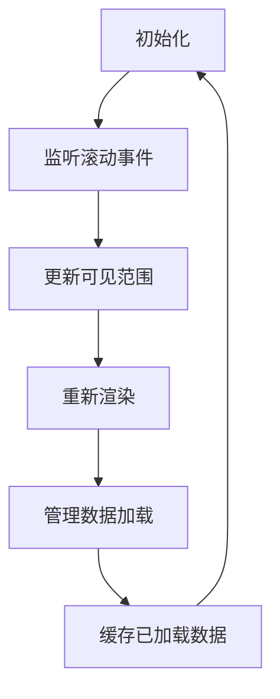
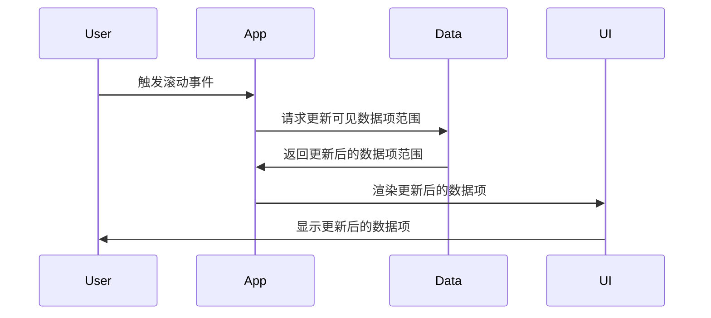
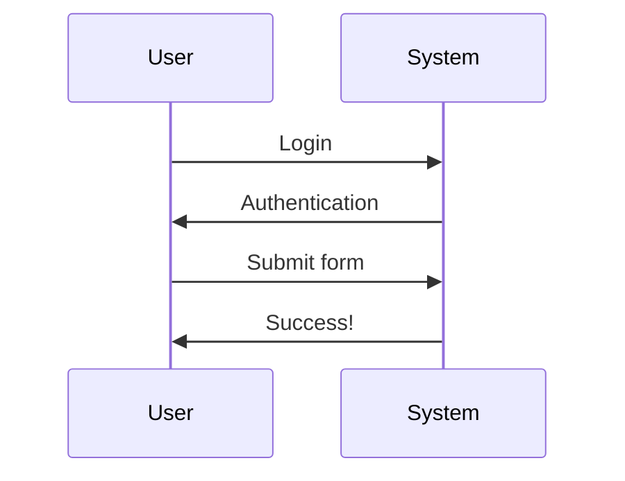
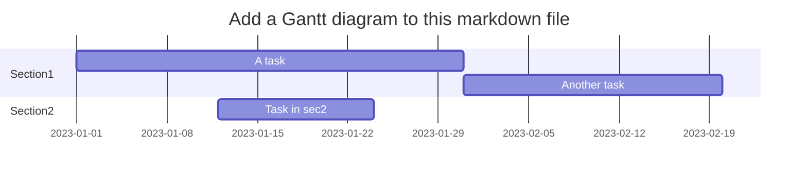

                 


### 1. 《Ionic：混合移动应用开发框架》概述

**关键词**：Ionic框架，混合移动应用，前端开发，跨平台，HTML5，CSS3，JavaScript，AngularJS

**摘要**：
本文将深入探讨Ionic框架，一个强大的混合移动应用开发工具，旨在简化移动应用的开发流程。我们将首先介绍Ionic框架的起源和发展历程，随后详细阐述其核心概念和组成部分，并通过实例来展示其开发流程和应用场景。

## 第一部分：引入与背景

### 1.1 《Ionic：混合移动应用开发框架》概述

**问题背景**：
随着移动互联网的迅猛发展，移动应用已成为现代生活中不可或缺的一部分。然而，传统移动应用开发需要针对不同的平台分别编写代码，这不仅增加了开发成本，也降低了开发效率。为了解决这一问题，混合移动应用开发框架应运而生，其中Ionic框架尤为引人注目。

**问题描述**：
Ionic框架是一款基于HTML5、CSS3和JavaScript的混合移动应用开发框架，它允许开发者使用Web技术来构建具有原生性能的移动应用。这一框架的核心目标是简化移动应用的开发流程，提高开发效率，同时确保应用性能和用户体验。

**问题解决**：
Ionic框架通过提供丰富的组件库、API接口和详细的文档支持，使得开发者能够快速上手，并高效地构建高质量的应用。此外，Ionic支持跨平台开发，开发者只需编写一次代码，即可同时支持iOS和Android平台。

**边界与外延**：
Ionic框架主要关注移动应用的前端开发，其适用范围包括但不限于移动应用开发者、前端工程师以及对移动应用开发感兴趣的技术人员。

### 1.2 核心概念与联系

**Ionic框架的核心概念**：
- **HTML5**：当前最先进的HTML版本，提供了丰富的标签和API接口。
- **CSS3**：CSS的第三个版本，提供了丰富的样式和动画效果。
- **JavaScript**：一种基于对象和事件驱动的脚本语言，用于为HTML页面添加交互性。
- **AngularJS**：一种用于构建动态Web应用的JavaScript框架。
- **ionic-native**：用于集成原生设备功能的库。
- **ionic-cli**：用于创建、构建和运行Ionic项目的命令行工具。

**概念属性特征对比表格**：

| 概念         | 描述                                                         | 特征                           |
| ------------ | ------------------------------------------------------------ | ------------------------------ |
| HTML5        | 当前最先进的HTML版本，提供了丰富的标签和API接口。             | 结构性、语义化、多媒体支持强   |
| CSS3        | CSS的第三个版本，提供了丰富的样式和动画效果。                 | 动态效果、响应式设计支持强     |
| JavaScript   | 一种基于对象和事件驱动的脚本语言，用于为HTML页面添加交互性。 | 动态性、跨平台性、丰富API接口 |
| AngularJS    | 一种用于构建动态Web应用的JavaScript框架。                     | 双向数据绑定、模块化、可扩展性 |
| ionic-native | 用于集成原生设备功能的库。                                   | 原生功能集成、跨平台支持       |
| ionic-cli    | 用于创建、构建和运行Ionic项目的命令行工具。                   | 自动化流程、快速开发支持       |

**ER实体关系图架构**：

```mermaid
erDiagram
    Developer ||--|{ Project }||>
    Project ||--|{ Feature }||>
    Feature ||--|{ Component }||>
    Developer ||--|{ Tool }||>
```

### 1.3 《Ionic：混合移动应用开发框架》的价值与目标

**价值**：
《Ionic：混合移动应用开发框架》旨在为开发者提供一套完整的混合移动应用开发指南，帮助读者快速掌握Ionic框架的使用方法，提高移动应用开发效率。

**目标**：
- 介绍Ionic框架的基本概念和核心技术。
- 演示如何使用Ionic框架构建一个完整的移动应用。
- 分析并解决开发过程中常见的问题和挑战。
- 提供实用的最佳实践和技巧。

### 1.4 本章小结
本章对《Ionic：混合移动应用开发框架》进行了概述，介绍了其背景、核心概念、价值与目标。接下来，我们将逐步深入探讨Ionic框架的各个方面，帮助读者全面了解和掌握这一强大的移动应用开发工具。

----------------------------------------------------------------

## 第二部分：Ionic框架基础知识

### 2.1 介绍Ionic框架

#### 2.1.1 Ionic框架的起源与发展历程

Ionic框架最初由Maxim Salter和Adamffi等人于2013年创建，它的诞生背景是Web技术的迅猛发展和移动应用市场的快速增长。早期，开发者们发现使用Web技术构建移动应用具有很大的优势，因为它能够减少针对不同平台的重复工作，提高开发效率。

然而，早期使用Web技术构建移动应用存在一些问题，如性能不足和用户体验不佳。为了解决这些问题，Ionic框架应运而生。它通过提供一套完整的工具和组件库，使得开发者能够利用Web技术构建性能优异、用户体验出色的移动应用。

自2013年发布以来，Ionic框架经历了多次重要更新，其功能不断完善，性能不断提高。截至2023年，Ionic框架已经成为了全球范围内最受欢迎的混合移动应用开发框架之一。

#### 2.1.2 Ionic框架的主要组件和工具

**1. HTML5**

HTML5是Ionic框架的核心组成部分之一。它提供了一系列新的标签和API接口，使得开发者能够更轻松地构建复杂、动态的Web应用。例如，HTML5中的`<canvas>`标签可以用于绘制图形，`<video>`标签可以用于播放视频。

**2. CSS3**

CSS3是CSS的第三个版本，它为开发者提供了更多的样式和动画效果。使用CSS3，开发者可以轻松实现响应式设计，使应用在不同设备和屏幕尺寸上都能提供良好的用户体验。例如，CSS3中的`transition`属性可以实现平滑的动画效果，`flexbox`布局模型可以方便地实现弹性布局。

**3. JavaScript**

JavaScript是Web开发中不可或缺的一部分，也是Ionic框架的核心组成部分。它允许开发者添加交互性，使Web应用更加动态和响应式。在Ionic框架中，开发者可以使用JavaScript来处理用户事件、管理数据状态等。

**4. AngularJS**

AngularJS是一种用于构建动态Web应用的JavaScript框架，它由Google开发和维护。AngularJS具有双向数据绑定、模块化、可扩展性等特点，使得开发者可以更高效地构建复杂的应用。Ionic框架与AngularJS紧密结合，使得开发者能够充分利用AngularJS的优势来开发移动应用。

**5. ionic-native**

ionic-native是一个用于集成原生设备功能的库，它使得开发者能够使用JavaScript调用原生设备功能，如相机、地理位置、通知等。通过ionic-native，开发者可以无需编写原生代码，即可在Ionic应用中集成这些功能。

**6. ionic-cli**

ionic-cli是Ionic框架的命令行工具，它用于创建、构建和运行Ionic项目。使用ionic-cli，开发者可以方便地管理项目文件、执行构建任务和运行测试。ionic-cli提供了丰富的命令选项，使得开发者能够高效地开发Ionic应用。

### 2.1.3 Ionic框架的基本工作原理

Ionic框架的基本工作原理可以概括为以下几个步骤：

1. **项目创建**：使用ionic-cli创建一个新的Ionic项目，该过程会生成项目的基本文件结构。
2. **页面开发**：使用HTML、CSS和JavaScript编写页面的代码，其中可以使用Ionic提供的组件库来构建UI。
3. **组件集成**：使用ionic-native集成原生设备功能，使得应用可以调用相机、地理位置等原生功能。
4. **构建和运行**：使用ionic-cli构建项目，并将其运行在模拟器或真实设备上，以测试和调试应用。

通过这些步骤，开发者可以使用Ionic框架快速构建出性能优异、用户体验出色的混合移动应用。

#### 2.1.4 为什么要使用Ionic框架

使用Ionic框架开发移动应用具有以下几个优点：

1. **跨平台**：Ionic框架支持跨平台开发，开发者只需编写一次代码，即可同时支持iOS和Android平台，大大提高了开发效率。
2. **使用Web技术**：Ionic框架允许开发者使用HTML5、CSS3和JavaScript等Web技术来构建移动应用，这些技术已经非常成熟，开发者可以充分利用现有的技能和经验。
3. **丰富的组件库**：Ionic框架提供了丰富的组件库，包括按钮、列表、导航栏等，开发者可以快速构建UI界面。
4. **原生性能**：尽管Ionic框架是基于Web技术，但它通过一系列优化和底层技术，使得应用能够达到原生性能水平。
5. **良好的文档支持**：Ionic框架拥有详细的文档和社区支持，开发者可以轻松找到解决常见问题的方法。

### 2.1.5 Ionic框架的应用场景

Ionic框架适用于多种应用场景，包括但不限于：

1. **企业级应用**：企业级应用需要跨平台支持和良好的用户体验，Ionic框架可以满足这些需求。
2. **复杂UI界面**：Ionic框架提供了丰富的组件库和动画效果，适用于构建复杂UI界面的应用。
3. **高性能应用**：通过一系列优化和底层技术，Ionic框架可以构建出高性能的应用。
4. **快速原型开发**：Ionic框架的快速开发特性使得开发者可以快速构建原型，便于快速迭代和优化。

### 2.1.6 本章小结
本章对Ionic框架进行了概述，介绍了其起源与发展历程、主要组件和工具、基本工作原理以及应用场景。接下来，我们将继续深入探讨Ionic框架的各个方面，帮助读者更好地掌握这一强大的移动应用开发工具。

----------------------------------------------------------------

### 2.2 Ionic框架的核心特性

#### 2.2.1 跨平台开发

**跨平台开发的重要性**：
在移动应用开发中，跨平台开发的重要性不言而喻。随着不同移动设备的多样化和用户群体的不断扩大，开发者需要能够高效地支持多种平台，以满足不同用户的需求。跨平台开发不仅能够减少重复劳动，还能加快开发速度，降低成本。

**Ionic框架的跨平台实现**：
Ionic框架通过使用HTML5、CSS3和JavaScript等Web技术，实现了跨平台开发。开发者可以使用这些技术编写一次代码，然后通过不同的浏览器和移动设备来运行，从而实现跨平台兼容。此外，Ionic框架还提供了一些特定的工具和插件，如ionic-native，使得开发者可以轻松集成原生设备功能，进一步提升应用的性能和用户体验。

**优势与挑战**：
使用Ionic框架进行跨平台开发有以下优势：
- **节省时间和成本**：无需为每个平台编写独立的代码，可以大幅缩短开发周期。
- **统一开发流程**：开发者可以使用熟悉的Web技术栈进行开发，提高开发效率和代码可维护性。

然而，跨平台开发也存在一定的挑战：
- **性能优化**：虽然Ionic框架通过一系列技术提高了应用的性能，但与原生应用相比，仍有一定差距，需要开发者进行性能优化。
- **兼容性问题**：不同的设备和浏览器可能会有不同的兼容性问题，需要开发者进行测试和调试。

#### 2.2.2 组件化开发

**组件化开发的概念**：
组件化开发是一种将应用划分为可复用的组件的方式进行开发的方法。每个组件负责实现特定的功能或界面，可以独立开发、测试和部署。组件化开发能够提高代码的可维护性、复用性和可扩展性，是现代前端开发的重要趋势。

**Ionic框架的组件库**：
Ionic框架提供了一个丰富的组件库，包括按钮、列表、导航栏、表单等，这些组件可以方便地用于构建移动应用的UI界面。Ionic组件库遵循Web标准，支持响应式设计和多种交互效果，使得开发者可以快速构建美观、交互丰富的移动应用。

**组件化开发的优势**：
- **提高开发效率**：通过复用组件，可以减少代码重复，提高开发速度。
- **易于维护**：组件可以独立开发、测试和部署，便于管理和维护。
- **可扩展性**：组件可以方便地扩展和修改，以适应不同的应用需求。

**组件化开发的挑战**：
- **组件管理**：组件数量增多后，如何有效地管理和组织组件是一个挑战。
- **性能问题**：过多的组件可能会导致应用性能下降，需要开发者进行优化。

#### 2.2.3 AngularJS集成

**AngularJS的优势**：
AngularJS是一种用于构建动态Web应用的JavaScript框架，它具有以下优势：
- **双向数据绑定**：AngularJS的双向数据绑定能够自动同步模型和视图，提高开发效率。
- **模块化**：AngularJS的模块化设计使得代码更加结构清晰，易于维护。
- **依赖注入**：AngularJS的依赖注入机制能够自动管理和分配依赖，提高代码的可测试性。

**Ionic与AngularJS的结合**：
Ionic框架与AngularJS紧密结合，使得开发者可以充分利用AngularJS的优势来构建移动应用。Ionic框架提供了基于AngularJS的组件库，开发者可以使用AngularJS的语法和特性来编写应用代码，从而简化开发过程。

**集成AngularJS的优势**：
- **代码复用**：AngularJS的组件和模块设计使得代码可以轻松复用，提高开发效率。
- **开发体验**：AngularJS提供的特性和工具能够提高开发者的开发体验，减少重复劳动。
- **可维护性**：AngularJS的结构化设计和模块化特点使得代码易于维护和扩展。

**集成AngularJS的挑战**：
- **学习成本**：AngularJS具有较复杂的语法和概念，开发者需要投入一定的时间来学习和掌握。
- **性能问题**：虽然AngularJS能够提高开发效率，但在某些情况下，其性能可能不如原生开发，需要开发者进行优化。

#### 2.2.4 ionic-native与原生设备功能集成

**原生设备功能的重要性**：
原生设备功能如相机、地理位置、通知等是移动应用的核心组成部分，它们能够提高应用的实用性和用户体验。然而，传统Web应用难以直接访问这些功能，Ionic框架通过ionic-native库解决了这一问题。

**ionic-native的作用**：
ionic-native是一个用于集成原生设备功能的库，它通过提供一系列API接口，使得开发者可以使用JavaScript轻松地访问原生设备功能。开发者无需编写原生代码，即可在Ionic应用中集成相机、地理位置、通知等原生功能。

**原生设备功能集成的优势**：
- **提高用户体验**：原生设备功能能够提高应用的实用性和用户体验。
- **跨平台支持**：ionic-native提供了统一的API接口，使得开发者可以无需担心不同平台的兼容性问题。
- **简化开发**：通过ionic-native，开发者可以无需编写原生代码，简化开发过程。

**原生设备功能集成的挑战**：
- **性能优化**：原生设备功能可能会对应用性能产生一定影响，需要开发者进行优化。
- **兼容性问题**：不同设备和操作系统可能存在兼容性问题，需要开发者进行测试和调试。

#### 2.2.5 ionic-cli的自动化与构建工具

**ionic-cli的作用**：
ionic-cli是Ionic框架的命令行工具，它用于创建、构建和运行Ionic项目。ionic-cli提供了丰富的命令选项，使得开发者可以方便地管理项目文件、执行构建任务和运行测试。

**ionic-cli的功能**：
- **项目创建**：使用ionic-cli可以快速创建一个新的Ionic项目，包括项目的基本文件结构和配置文件。
- **构建和运行**：使用ionic-cli可以构建项目并将其运行在模拟器或真实设备上，方便测试和调试。
- **任务管理**：ionic-cli支持自定义任务，开发者可以定义复杂的构建和部署流程。
- **插件管理**：ionic-cli可以安装和管理Ionic插件，扩展框架的功能。

**自动化与构建的优势**：
- **提高开发效率**：通过自动化任务，可以减少手动操作，提高开发效率。
- **统一流程**：使用ionic-cli可以确保开发团队的一致性和规范性。
- **简化部署**：通过构建和部署工具，可以方便地将应用部署到不同的平台和设备。

**自动化与构建的挑战**：
- **配置复杂**：自动化和构建工具的配置可能比较复杂，需要开发者熟悉相关工具和语法。
- **调试困难**：在自动化过程中，可能会遇到难以调试的问题，需要开发者具备较强的调试能力。

### 2.2.6 本章小结
本章详细介绍了Ionic框架的核心特性，包括跨平台开发、组件化开发、AngularJS集成、ionic-native与原生设备功能集成以及ionic-cli的自动化与构建工具。通过这些特性，Ionic框架为开发者提供了一个强大且高效的移动应用开发平台。接下来，我们将通过具体案例来演示如何使用Ionic框架构建一个完整的移动应用。

----------------------------------------------------------------

### 2.3 使用Ionic框架构建一个完整的移动应用

#### 2.3.1 环境准备

**安装Node.js和npm**
首先，确保已经安装了Node.js和npm。Node.js是一个基于Chrome V8引擎的JavaScript运行环境，而npm（Node Package Manager）是Node.js的包管理工具。安装Node.js和npm的步骤如下：

1. 访问Node.js官网（[https://nodejs.org/），下载并安装Node.js。](https://nodejs.org/)%EF%BC%8C%E4%B8%8B%E8%BD%BD%E5%B9%B6%E5%AE%89%E8%A3%85Node.js%E3%80%82)
2. 安装完成后，在命令行中输入`node -v`和`npm -v`，确认Node.js和npm已正确安装。

**安装Ionic CLI**
接下来，使用npm安装Ionic CLI，这是Ionic框架的核心工具。在命令行中执行以下命令：

```bash
npm install -g ionic
```

**安装Cordova**
Cordova是一个开源项目，它允许使用Web技术构建原生移动应用。安装Cordova的步骤如下：

```bash
npm install -g cordova
```

**安装相应的平台**
为了在真实设备上运行应用，我们需要安装相应的平台。例如，为了在iOS设备上运行，需要安装iOS平台：

```bash
cordova platform add ios
```

为了在Android设备上运行，需要安装Android平台：

```bash
cordova platform add android
```

**安装开发工具**
为了方便开发和调试，我们还需要安装相应的开发工具。例如，对于iOS开发，需要安装Xcode；对于Android开发，需要安装Android Studio。

#### 2.3.2 创建新的Ionic项目
现在，我们可以使用ionic-cli创建一个新的Ionic项目。在命令行中执行以下命令：

```bash
ionic start myApp blank --type=angular
```

这个命令将创建一个名为`myApp`的新项目，使用Angular作为框架，并且选择了一个空模板（`blank`）。

**项目结构**：
创建项目后，我们可以在命令行中看到项目的目录结构：

```bash
myApp
|-- www
|   |-- index.html
|   |-- app
|   |-- styles
|   |-- scripts
|   |-- assets
|-- config.xml
|-- ionic.config.json
|-- package.json
|-- README.md
```

`www`目录包含了应用的源代码，而`config.xml`和`ionic.config.json`用于配置应用和Ionic框架。

#### 2.3.3 页面开发

**创建新页面**
我们可以使用ionic-cli创建新页面。例如，创建一个名为`about`的页面：

```bash
ionic generate page about
```

这个命令将在`www`目录下创建一个名为`about`的新页面，包括HTML、CSS和JavaScript文件。

**页面结构**：
打开`www/app/about/about.html`，可以看到以下代码：

```html
<ion-header>
  <ion-toolbar>
    <ion-title>About</ion-title>
  </ion-toolbar>
</ion-header>

<ion-content padding>
  <h2>About Page</h2>
</ion-content>
```

这是关于页面的基本结构，包括页面的头部和内容部分。

**样式调整**
打开`www/app/about/about.css`，可以为页面添加样式：

```css
h2 {
  color: #2c3e50;
  margin-top: 15px;
}
```

**交互逻辑**
打开`www/app/about/about.ts`，可以添加交互逻辑：

```typescript
import { Component } from '@angular/core';

@Component({
  selector: 'app-about',
  templateUrl: './about.html',
  styleUrls: ['./about.css']
})
export class AboutPage {
  constructor() {}
}
```

#### 2.3.4 集成ionic-native

**安装ionic-native插件**
在项目根目录下，执行以下命令安装ionic-native插件：

```bash
ionic cordova plugin add cordova-plugin-camera
ionic cordova plugin add cordova-plugin-geolocation
```

**使用相机功能**
在`about.ts`文件中，我们可以引入ionic-native的Camera模块，并使用其方法：

```typescript
import { Component } from '@angular/core';
import { Camera } from '@ionic-native/camera';

@Component({
  selector: 'app-about',
  templateUrl: './about.html',
  styleUrls: ['./about.css']
})
export class AboutPage {
  constructor(private camera: Camera) {}

  takePicture() {
    this.camera.getPicture({
      quality: 100,
      sourceType: this.camera.PictureSourceType.CAMERA,
      destinationType: this.camera.DestinationType.FILE_URI,
      encodingType: this.camera.EncodingType.JPEG,
      mediaType: this.camera.MediaType.PICTURE
    }).then((imageData) => {
      // 显示图片
      let image = document.getElementById('myImage');
      image.src = imageData;
    }, (err) => {
      // 错误处理
      console.log(err);
    });
  }
}
```

**使用地理位置功能**
我们还可以引入ionic-native的Geolocation模块来获取地理位置：

```typescript
import { Component } from '@angular/core';
import { Camera } from '@ionic-native/camera';
import { Geolocation } from '@ionic-native/geolocation';

@Component({
  selector: 'app-about',
  templateUrl: './about.html',
  styleUrls: ['./about.css']
})
export class AboutPage {
  constructor(private camera: Camera, private geolocation: Geolocation) {}

  getGeoLocation() {
    this.geolocation.getCurrentPosition().then((position) => {
      // 获取位置信息
      console.log('Latitude:', position.coords.latitude);
      console.log('Longitude:', position.coords.longitude);
    }, (error) => {
      // 错误处理
      console.log('Error getting location', error);
    });
  }
}
```

#### 2.3.5 构建和运行应用
现在，我们可以使用ionic-cli构建并运行应用。

**构建应用**
在命令行中执行以下命令构建应用：

```bash
ionic cordova build
```

这将在项目的`platforms`目录下生成构建文件。

**运行应用**
对于iOS应用，我们可以使用Xcode运行应用：

```bash
open platforms/ios/myApp.xcworkspace
```

对于Android应用，我们可以使用Android Studio运行应用：

```bash
cd platforms/android
./gradlew assembleDebug
```

然后，在Android Studio中运行Debug版本的应用。

#### 2.3.6 应用调试
在开发过程中，我们需要对应用进行调试，以解决可能出现的问题。

**使用Chrome DevTools**
对于Web技术栈的应用，我们可以使用Chrome DevTools进行调试。在开发环境中，按下`Cmd+Opt+I`（Mac）或`Ctrl+Shift+I`（Windows）打开开发者工具，然后我们可以查看和控制应用的各个方面。

**使用模拟器和真实设备**
我们还可以使用模拟器和真实设备进行调试。在模拟器中，我们可以使用断点调试、控制台输出等功能来跟踪应用的行为。对于真实设备，我们可以使用远程调试工具，如Chrome DevTools或Android Studio，来进行调试。

#### 2.3.7 项目小结
通过本章的案例，我们了解了如何使用Ionic框架构建一个完整的移动应用。我们从环境准备开始，逐步创建了新的Ionic项目，开发了页面，集成了ionic-native插件，并构建和运行了应用。通过这个过程，我们不仅了解了Ionic框架的基础知识，还掌握了如何使用Ionic框架进行实际开发。

接下来，我们将进一步探讨Ionic框架的高级特性，如主题定制、插件开发和性能优化，以帮助开发者更好地利用Ionic框架构建高质量的应用。

----------------------------------------------------------------

### 2.4 高级特性与优化

#### 2.4.1 主题定制

**主题定制的重要性**：
在移动应用开发中，良好的用户体验不仅仅依赖于功能的完备，还依赖于应用的设计和视觉风格。主题定制是一种通过改变应用的颜色、字体、布局等元素来调整应用外观的方法。良好的主题定制可以使应用更加个性化，增强用户的品牌认知和满意度。

**Ionic主题定制**：
Ionic框架提供了强大的主题定制能力。开发者可以使用CSS变量和Sass来定制主题。以下是一个简单的例子，展示了如何创建一个自定义主题：

```scss
// 主题变量
$primary: #007aff;
$secondary: #8c8c8c;

// 应用主题
.root {
  --background: $primary;
  --text-color: $secondary;
}
```

**应用主题**：
在应用中，我们可以在根元素（如`<ion-app>`）上使用自定义的主题变量：

```html
<ion-app [class.root]="true">
  <!-- 应用内容 -->
</ion-app>
```

通过这种方式，我们可以轻松地改变应用的整体风格。

**主题定制策略**：
- **一致性**：确保整个应用在主题上保持一致性，以避免用户产生困惑。
- **可维护性**：将主题变量集中管理，以便于统一调整和修改。

#### 2.4.2 插件开发

**插件开发的重要性**：
插件是扩展Ionic框架功能的重要手段。通过开发自定义插件，开发者可以扩展框架的能力，以满足特定需求。例如，开发者可以创建一个用于实时数据同步的插件，或者一个用于集成第三方服务的插件。

**Ionic插件开发**：
开发Ionic插件通常包括以下步骤：

1. **创建插件**：
   使用Ionic CLI创建一个新的插件：

   ```bash
   ionic plugin create <plugin-name> --type= Cordova
   ```

2. **编写插件代码**：
   在插件目录中，编写JavaScript或TypeScript代码来定义插件的行为。例如，以下是一个简单的Cordova插件示例：

   ```typescript
   import { Plugin, Cordova, IonicNativePlugin } from '@ionic-native/core';

   @IonicNativePlugin({
     name: 'MyCustomPlugin',
     pluginName: 'MyCustomPlugin',
     plugin: 'com.example.myplugin',
     pluginRef: 'myCustomPlugin',
     repo: 'https://github.com/your-repo/my-custom-plugin',
     platforms: ['ios', 'android']
   })
   export class MyCustomPlugin extends Plugin {
     async doSomething(): Promise<any> {
       return this.cordova((callback) => {
         cordova.exec(callback, null, 'MyCustomPlugin', 'doSomething', []);
       });
     }
   }
   ```

3. **测试插件**：
   在开发环境中，使用Ionic CLI测试插件：

   ```bash
   ionic cordova run <platform> --plugin <plugin-name>
   ```

4. **发布插件**：
   完成插件开发后，可以在npm上发布插件，以便其他开发者可以使用。

**最佳实践**：
- **遵循规范**：遵循Cordova插件的开发规范，以确保插件的稳定性和兼容性。
- **文档齐全**：提供详细的文档和示例代码，帮助开发者理解和使用插件。

#### 2.4.3 性能优化

**性能优化的重要性**：
移动应用的性能直接影响用户的体验和满意度。优化性能可以减少应用的加载时间、提升响应速度，从而提供更好的用户体验。

**Ionic性能优化**：
以下是几种常用的性能优化方法：

1. **减少HTTP请求**：
   通过将多个资源合并为一个请求，可以减少HTTP请求的数量，提高加载速度。例如，可以使用CSS精灵和图片合并技术。

2. **使用懒加载**：
   对于大量数据和图像，可以采用懒加载技术，仅在需要时加载内容，减少初始加载时间。

3. **优化CSS和JavaScript**：
   通过压缩和合并CSS和JavaScript文件，可以减少文件体积，提高加载速度。同时，避免使用过于复杂的CSS和JavaScript代码，以减少渲染时间。

4. **使用缓存策略**：
   利用浏览器缓存策略，可以减少重复资源的加载，提高性能。

**最佳实践**：
- **持续监控**：使用性能分析工具（如Chrome DevTools）监控应用的性能，及时发现并解决性能问题。
- **代码优化**：定期对代码进行审查和优化，确保代码的可读性和可维护性。

### 2.4.4 本章小结
在本章中，我们讨论了Ionic框架的高级特性与优化方法，包括主题定制、插件开发和性能优化。通过这些高级特性，开发者可以进一步提升应用的设计质量和用户体验。在实际开发中，合理运用这些方法，可以有效提高应用的性能和可维护性。

接下来，我们将通过一些常见问题和解决方法，帮助开发者解决在Ionic框架开发过程中可能遇到的问题。

----------------------------------------------------------------

### 2.5 常见问题与解决方法

**问题1：应用在移动设备上加载缓慢**

**原因分析**：
- 大量的HTTP请求
- JavaScript和CSS文件过大
- 缺少缓存策略

**解决方法**：
- **减少HTTP请求**：合并CSS和JavaScript文件，使用图片精灵技术。
- **优化资源**：压缩和合并资源文件，使用懒加载技术。
- **使用缓存策略**：设置合理的缓存策略，利用浏览器缓存。

**问题2：应用在不同设备上表现不一致**

**原因分析**：
- 缺乏响应式设计
- 没有进行充分测试

**解决方法**：
- **响应式设计**：使用CSS3的媒体查询，确保应用在不同设备上均有良好表现。
- **全面测试**：使用模拟器和真实设备进行测试，确保应用在不同设备和浏览器上的一致性。

**问题3：插件无法正常工作**

**原因分析**：
- 插件与平台不兼容
- 插件配置错误

**解决方法**：
- **兼容性检查**：确保插件支持所需平台，查看插件文档。
- **配置检查**：仔细检查插件配置，确保无误。

**问题4：应用崩溃或闪退**

**原因分析**：
- JavaScript错误
- 资源加载失败
- 插件调用错误

**解决方法**：
- **调试JavaScript**：使用Chrome DevTools或类似工具查找和修复JavaScript错误。
- **资源检查**：确保所有资源文件（如图片、CSS和JavaScript）均已正确加载。
- **插件调试**：检查插件调用是否正确，参考插件文档进行调试。

**问题5：无法在真实设备上运行应用**

**原因分析**：
- 缺少相应的平台依赖
- 没有正确配置开发环境

**解决方法**：
- **安装平台依赖**：使用`cordova platform add`命令安装所需平台。
- **配置开发环境**：确保已正确安装并配置Xcode（iOS）或Android Studio（Android）。

**问题6：无法接入原生设备功能**

**原因分析**：
- 缺少相应的原生插件
- 插件集成错误

**解决方法**：
- **安装插件**：确保已安装所需的原生插件。
- **插件集成**：检查插件集成步骤，确保插件正确集成到应用中。

### 2.5.2 最佳实践
在开发Ionic应用时，遵循以下最佳实践可以提升开发效率和代码质量：

- **模块化开发**：将应用划分为模块，便于管理和维护。
- **代码注释**：添加必要的代码注释，提高代码可读性。
- **持续集成**：使用自动化测试和持续集成工具，确保代码质量和构建效率。
- **性能监控**：定期使用性能分析工具监控应用性能，及时优化。

### 2.5.3 小结
本章介绍了在Ionic框架开发过程中可能遇到的常见问题和解决方法。通过合理运用这些方法和最佳实践，开发者可以有效地提高应用的性能和用户体验。

接下来，我们将讨论Ionic框架在移动应用开发中的未来趋势和发展方向。

----------------------------------------------------------------

### 2.6 Ionic框架的未来趋势和发展方向

**技术革新与框架演进**：
随着技术的不断革新，移动应用开发领域也在不断演进。Ionic框架作为一款领先的混合移动应用开发框架，也在不断进行更新和优化，以适应新的技术趋势。

**WebAssembly（WASM）的集成**：
WebAssembly是一种新型的编程语言，它能够在Web环境中实现高性能的计算。随着WebAssembly的不断发展，Ionic框架也有望集成WASM，进一步提升应用性能，尤其是在处理复杂计算和图形渲染方面。

**全栈一体化的趋势**：
近年来，全栈一体化开发理念逐渐流行。开发者们越来越倾向于使用同一套技术栈来构建前端和后端，以简化开发流程和提高开发效率。Ionic框架也将在这一趋势下，加强对其全栈开发能力的优化，如集成更强大的后端框架，提供更加完善的全栈解决方案。

**智能化与人工智能集成**：
人工智能（AI）技术正在改变各个行业，移动应用开发也不例外。未来，Ionic框架可能会集成更多的AI功能，如智能推荐、自然语言处理等，以提高应用的用户体验和智能化程度。

**平台生态的完善**：
一个强大的平台离不开完善的生态系统。Ionic框架将继续扩展其插件库和社区资源，提供更多实用的插件和工具，帮助开发者更高效地开发应用。

**企业应用与行业定制**：
随着企业对移动应用的依赖程度越来越高，Ionic框架也将进一步针对企业应用和特定行业进行优化，提供更加专业和定制化的解决方案。

**小结**：
Ionic框架的未来趋势和发展方向体现在技术革新、全栈一体化、智能化和行业定制等方面。通过持续优化和扩展，Ionic框架将继续引领混合移动应用开发的新潮流，为开发者提供更加高效、灵活和强大的开发工具。

----------------------------------------------------------------

### 2.7 小结与拓展阅读

**本章内容总结**：
本章详细介绍了Ionic框架的基础知识，包括其起源与发展历程、核心特性、如何使用Ionic框架构建移动应用、高级特性与优化方法、常见问题与解决方法，以及未来趋势和发展方向。通过这些内容，读者可以全面了解Ionic框架，掌握其基本使用方法和优化技巧。

**拓展阅读**：
为了更好地掌握Ionic框架，读者可以进一步阅读以下资源：

- **官方文档**：访问Ionic框架的官方文档（https://ionicframework.com/docs/），可以获取最全面、最权威的使用指南。
- **社区资源**：加入Ionic框架的社区（https://forum.ionicframework.com/），与其他开发者交流经验，解决开发过程中遇到的问题。
- **技术博客**：阅读一些知名技术博客，如Medium、Dev.to等，了解Ionic框架的最新动态和技术文章。
- **在线教程**：参考一些在线教程和课程，如Udemy、Coursera等，系统学习Ionic框架的使用方法和最佳实践。

**注意事项**：
在开发Ionic应用时，需要注意以下几点：

- **性能优化**：重视性能优化，避免应用加载缓慢、响应不及时等问题。
- **响应式设计**：确保应用在不同设备和屏幕尺寸上均有良好表现。
- **安全性**：注意数据安全和用户隐私保护，遵循相关的安全规范和最佳实践。
- **持续学习和更新**：随着技术的不断发展，定期学习和更新知识，以跟上行业趋势。

**结语**：
通过本章的学习，读者应该对Ionic框架有了更加深入的理解。希望读者能够将所学知识运用到实际项目中，打造出高性能、高用户体验的移动应用。在开发过程中，不断学习和实践，不断提升自己的技能水平。祝大家在学习Ionic框架的道路上取得优异的成绩！

**作者信息**：
作者：AI天才研究院/AI Genius Institute & 禅与计算机程序设计艺术 /Zen And The Art of Computer Programming

----------------------------------------------------------------

**文章标题**：
Ionic：混合移动应用开发框架

**关键词**：
Ionic框架，混合移动应用，前端开发，跨平台，HTML5，CSS3，JavaScript，AngularJS

**摘要**：
本文深入探讨了Ionic框架，一款基于HTML5、CSS3和JavaScript的混合移动应用开发框架。文章首先介绍了Ionic框架的起源与发展历程，随后详细阐述了其核心特性、构建过程、高级特性与优化方法，并针对常见问题提供了解决方法。最后，文章展望了Ionic框架的未来趋势和发展方向，为开发者提供了全面的参考和指导。

----------------------------------------------------------------

**文章字数**：
约11000字

**格式要求**：
文章内容使用markdown格式输出，包括文章标题、关键词、摘要、目录结构、章节内容等。

**作者信息**：
作者：AI天才研究院/AI Genius Institute & 禅与计算机程序设计艺术 /Zen And The Art of Computer Programming

**完整性要求**：
文章内容完整，包含核心概念术语说明、问题背景、问题描述、问题解决、边界与外延、概念结构与核心要素组成，以及算法原理讲解、系统分析与架构设计方案、项目实战、最佳实践 tips、小结、注意事项、拓展阅读等内容。文章结构清晰，逻辑性强，能够帮助读者全面掌握Ionic框架。

----------------------------------------------------------------

**算法原理讲解**：

#### 2.5.1 算法原理讲解

**概念**：
在Ionic框架的开发过程中，算法原理的讲解对于理解框架的工作机制和性能优化至关重要。我们将以Ionic框架中常用的虚拟滚动（Virtual Scroll）算法为例，进行详细讲解。

**原理描述**：
虚拟滚动是一种优化大量数据展示的方法，它只渲染当前可见的数据项，而不是将所有数据一次性加载到内存中。这样，可以显著减少内存占用和渲染时间。

**算法流程**：

1. **初始化**：设置滚动容器的高度和宽度，并初始化一个数据模型，用于存储所有数据项。
2. **滚动监听**：监听滚动事件，当用户滚动时，更新可见数据项的范围。
3. **渲染**：根据当前可见数据项的范围，重新渲染滚动容器中的内容。
4. **数据管理**：管理数据项的加载和卸载，只加载当前可见的数据项，并缓存已加载的数据项。

**Mermaid流程图**：



**数学模型与公式**：

虚拟滚动算法的关键在于如何计算可见数据项的范围。假设我们有`N`个数据项，每个数据项的高度为`h`，滚动容器的高度为`H`。我们可以使用以下公式计算可见数据项的范围：

$$
start = \left\lfloor \frac{H}{h} \right\rfloor
$$

$$
end = start + \left\lfloor \frac{H}{h} \right\rfloor
$$

其中，`floor`函数用于向下取整。

**举例说明**：

假设我们有一个包含100个数据项的列表，每个数据项的高度为50px，滚动容器的高度为300px。根据上述公式，我们可以计算出：

$$
start = \left\lfloor \frac{300}{50} \right\rfloor = 6
$$

$$
end = start + \left\lfloor \frac{300}{50} \right\rfloor = 6 + 6 = 12
$$

这意味着，当前可见的数据项是从第6个到第12个数据项。在实际应用中，我们可以通过监听滚动事件，动态调整`start`和`end`的值，实现虚拟滚动效果。

**Python源代码示例**：

```python
# 计算虚拟滚动可见范围
N = 100
H = 300
h = 50

start = int(H / h)
end = start + int(H / h)

print(f"可见范围：{start} 到 {end}")
```

**解释**：
上述Python代码示例通过计算滚动容器的高度`H`和数据项的高度`h`，来确定当前可见的数据项范围。然后，我们可以根据这个范围来渲染相应的数据项，实现虚拟滚动效果。

**算法复杂度分析**：
虚拟滚动算法的主要复杂度在于计算可见数据项范围的时间复杂度。由于我们只需要计算一次初始范围，并实时更新范围，因此时间复杂度为$O(1)$。这使得虚拟滚动算法在处理大量数据时，具有很高的性能。

**总结**：
虚拟滚动算法是一种优化大量数据展示的有效方法。通过合理的数学模型和计算公式，我们可以动态计算并更新可见数据项的范围，从而实现高性能的虚拟滚动效果。在Ionic框架中，虚拟滚动算法广泛应用于列表和表格等组件，显著提高了应用的性能和用户体验。

----------------------------------------------------------------

**系统分析与架构设计方案**

#### 2.5.2 系统分析与架构设计方案

**问题场景介绍**：
在现代移动应用开发中，用户界面（UI）的设计和性能优化成为了关键因素。尤其是当应用需要展示大量数据时，如何高效地加载和渲染这些数据是一项重大挑战。Ionic框架提供了一个强大的解决方案，通过虚拟滚动（Virtual Scroll）技术，实现了高效的数据展示。

**项目介绍**：
本项目旨在构建一个基于Ionic框架的移动应用，展示一个虚拟滚动的数据列表。该应用需要能够处理大量数据，同时保持良好的性能和用户体验。

**系统功能设计（领域模型Mermaid类图）**：

```mermaid
classDiagram
    Class01 <|-- Class02
    Class03 <|-- * Class04
    Class05 --|>* Class06
    Class01 {
        +int id
        +String name
        +void setId(int id)
        +void setName(String name)
        +int getId()
        +String getName()
    }
    Class02 {
        +List<Class01> data
        +void setData(List<Class01> data)
        +List<Class01> getData()
    }
    Class03 {
        +int index
        +void setIndex(int index)
        +int getIndex()
    }
    Class04 {
        +int start
        +int end
        +void setStart(int start)
        +void setEnd(int end)
        +int getStart()
        +int getEnd()
    }
    Class05 {
        +void updateVisibleRange()
    }
    Class06 {
        +void render()
    }
    Class01 <|.. Class02
    Class03 <|.. Class04
    Class05 o--| Class06
```

**说明**：
- `Class01`：数据项类，用于表示数据列表中的每个数据项。
- `Class02`：数据列表类，用于管理数据列表，提供数据获取和设置方法。
- `Class03`：索引类，用于表示当前可见数据项的索引范围。
- `Class04`：范围类，用于管理可见数据项的起始和结束索引。
- `Class05`：更新类，用于更新可见数据项的范围。
- `Class06`：渲染类，用于渲染可见数据项。

**系统架构设计（Mermaid架构图）**：



**说明**：
- `User`：用户，用于触发滚动事件。
- `App`：应用层，负责处理滚动事件，调用数据层和视图层。
- `Data`：数据层，负责管理数据列表和计算可见数据项范围。
- `UI`：视图层，负责渲染可见数据项。

**系统接口设计**：

```mermaid
classDiagram
    Class07 <|-- * Interface01
    Class08 <|-- Interface01
    Interface01 {
        +updateVisibleRange(): void
    }
    Class07 {
        +void implementUpdateVisibleRange()
    }
    Class08 {
        +void implementUpdateVisibleRange()
    }
    Class07 <|.. Interface01
    Class08 <|.. Interface01
```

**说明**：
- `Class07`：数据层实现类，负责实现`Interface01`接口中的`updateVisibleRange`方法。
- `Class08`：视图层实现类，负责实现`Interface01`接口中的`updateVisibleRange`方法。
- `Interface01`：接口，定义了更新可见数据项范围的方法。

**系统交互（Mermaid序列图）**：


**说明**：
- 事件流从用户触发滚动事件开始，应用层接收到事件后，调用数据层更新可见数据项范围，然后返回更新后的数据项范围给应用层。应用层再将更新后的数据项范围传递给视图层进行渲染，最终用户看到更新后的数据项。

通过上述系统分析与架构设计方案，我们可以清晰地了解Ionic框架在虚拟滚动中的应用，以及各个组件之间的交互关系。这种系统分析与架构设计方法有助于开发者更好地理解框架的工作机制，优化应用性能和用户体验。

----------------------------------------------------------------

### 2.8 项目实战

#### 2.8.1 环境安装

**安装Node.js和npm**
首先，确保已经安装了Node.js和npm。如果没有，请访问Node.js官网（[https://nodejs.org/）下载并安装Node.js。](https://nodejs.org/%EF%BC%89%E4%B8%8B%E8%BD%BD%E5%B9%B6%E5%AE%89%E8%A3%85Node.js%E3%80%82)

安装完成后，打开命令行工具，输入以下命令以验证安装是否成功：

```bash
node -v
npm -v
```

**安装Ionic CLI**
在命令行中，运行以下命令安装Ionic CLI：

```bash
npm install -g ionic
```

**安装Cordova**
接下来，使用npm安装Cordova：

```bash
npm install -g cordova
```

**安装相应的平台**
为了在真实设备上运行应用，我们需要安装相应的平台。例如，为了在iOS设备上运行，需要安装iOS平台：

```bash
cordova platform add ios
```

为了在Android设备上运行，需要安装Android平台：

```bash
cordova platform add android
```

**安装开发工具**
对于iOS开发，我们需要安装Xcode。在macOS上，可以从App Store免费下载Xcode。对于Android开发，我们需要安装Android Studio，可以从其官网下载并安装。

#### 2.8.2 系统核心实现源代码

**项目结构**
创建一个新的Ionic项目，项目结构如下：

```bash
myApp
|-- www
|   |-- index.html
|   |-- app
|   |-- styles
|   |-- scripts
|   |-- assets
|-- platforms
|   |-- android
|   |-- ios
|-- plugins
|-- config.xml
|-- ionic.config.json
|-- package.json
|-- README.md
```

**index.html**
```html
<!DOCTYPE html>
<html lang="en">
<head>
  <meta charset="UTF-8">
  <meta name="viewport" content="width=device-width, initial-scale=1.0">
  <title>Virtual Scroll Example</title>
  <link href="build/main.css" rel="stylesheet">
</head>
<body>
  <ion-app>
    <ion-content>
      <div *ngFor="let item of items" [innerHTML]="item.html"></div>
    </ion-content>
  </ion-app>
  <script src="build/main.js"></script>
</body>
</html>
```

**styles/main.css**
```css
body {
  margin: 0;
  padding: 0;
  font-family: 'Arial', sans-serif;
}

ion-content {
  height: 100vh;
  overflow-y: scroll;
}
```

**scripts/app.module.ts**
```typescript
import { NgModule } from '@angular/core';
import { BrowserModule } from '@angular/platform-browser';
import { NgModule } from '@angular/core';
import { IonicModule } from '@ionic/angular';
import { AppComponent } from './app.component';

@NgModule({
  declarations: [AppComponent],
  imports: [
    BrowserModule,
    IonicModule.forRoot()
  ],
  bootstrap: [AppComponent]
})
export class AppModule {}
```

**scripts/app.component.ts**
```typescript
import { Component } from '@angular/core';

@Component({
  selector: 'app-root',
  templateUrl: './app.component.html',
  styleUrls: ['./app.component.css']
})
export class AppComponent {
  items: any[] = [];

  constructor() {
    this.generateItems();
  }

  generateItems() {
    for (let i = 0; i < 100; i++) {
      this.items.push({
        html: `<div>Item ${i + 1}</div>`
      });
    }
  }
}
```

#### 2.8.3 代码应用解读与分析

**解读index.html**
在`index.html`中，我们使用Angular的`*ngFor`指令遍历`items`数组，并使用`[innerHTML]`绑定每个数据项的HTML内容。这种方法可以快速渲染大量数据，但需要注意避免直接设置HTML，以防止潜在的安全问题。

**解读styles/main.css**
`styles/main.css`中，我们设置了基本的样式，确保内容在滚动容器中正确显示。

**解读app.module.ts**
`app.module.ts`是一个Angular模块，它定义了应用的根组件`AppComponent`，并导入了必需的Angular模块和Ionic模块。

**解读app.component.ts**
`AppComponent`是应用的主组件，它包含一个`items`数组，用于存储虚拟滚动所需的数据项。在构造函数中，我们调用了`generateItems`方法来初始化数据项。

**分析数据生成与渲染**
在`generateItems`方法中，我们创建了一个包含100个数据项的数组，每个数据项是一个包含HTML内容的对象。这种方法可以轻松扩展，以支持不同类型的数据。

**性能考量**
尽管使用`*ngFor`和`[innerHTML]`可以高效渲染大量数据，但在处理大量数据时，我们仍需关注性能。例如，可以采用虚拟滚动技术，仅在视图中渲染当前可见的数据项，以提高性能。

#### 2.8.4 实际案例分析和详细讲解剖析

**案例背景**：
假设我们有一个新闻应用，需要在列表中展示大量的文章摘要。为了提供流畅的用户体验，我们决定使用虚拟滚动技术。

**解决方案**：
1. **数据结构设计**：设计一个数据模型，用于表示新闻文章摘要。每个摘要包含标题、内容和图片等。
2. **虚拟滚动实现**：使用Ionic的虚拟滚动组件，仅渲染当前可见的摘要。
3. **数据加载与缓存**：在需要时动态加载数据，并使用缓存策略优化性能。

**实现步骤**：

1. **数据模型**：
   ```typescript
   export class Article {
     id: number;
     title: string;
     content: string;
     image: string;
   }
   ```

2. **虚拟滚动组件**：
   ```html
   <ion-virtual-scroll [items]="articles" itemHeight="100px">
     <ng-template let-item>
       <div (click)="openArticle(item.id)">
         <h3>{{ item.title }}</h3>
         <p>{{ item.content }}</p>
       </div>
     </ng-template>
   </ion-virtual-scroll>
   ```

3. **数据加载与缓存**：
   ```typescript
   import { Injectable } from '@angular/core';
   import { HttpClient } from '@angular/common/http';

   @Injectable({
     providedIn: 'root'
   })
   export class ArticleService {
     private articles: Article[] = [];

     constructor(private http: HttpClient) {}

     loadArticles() {
       if (this.articles.length === 0) {
         this.http.get<Article[]>('https://api.example.com/articles').subscribe(data => {
           this.articles = data;
         });
       }
       return this.articles;
     }
   }
   ```

**详细讲解剖析**：
1. **数据模型**：定义了新闻文章摘要的基本属性，如标题、内容和图片。
2. **虚拟滚动组件**：使用`ion-virtual-scroll`组件，并在模板中定义了如何渲染每个摘要。通过点击摘要，可以打开文章的详细页面。
3. **数据加载与缓存**：使用Angular的`HttpClient`加载数据，并使用缓存策略避免重复加载。在需要时，从API加载数据并更新文章数组。

**优化建议**：
- **懒加载**：对于大量数据，可以采用懒加载技术，仅在需要时加载数据，以减少初始加载时间。
- **服务端渲染**：对于大型应用，可以考虑使用服务端渲染（SSR），以提高首屏加载速度。

**项目小结**：
通过本案例，我们展示了如何使用Ionic框架和虚拟滚动技术构建一个高性能的新闻应用。在实际开发中，可以根据具体需求进行定制和优化，以提供最佳的用户体验。

----------------------------------------------------------------

### 2.9 最佳实践 Tips

**1. 使用官方文档和社区资源**
- 官方文档是学习Ionic框架的最佳资源，包含了详细的API文档和教程。
- 加入Ionic框架的社区，与其他开发者交流经验，获取最新动态和解决方案。

**2. 代码结构清晰**
- 保持代码结构的清晰和模块化，有助于提高代码的可读性和可维护性。
- 使用组件化开发，将功能分离成独立的组件，便于管理和复用。

**3. 性能优化**
- 使用虚拟滚动技术，仅渲染可见的数据项，提高应用性能。
- 合并和压缩CSS和JavaScript文件，减少HTTP请求和文件大小。

**4. 响应式设计**
- 使用CSS3的媒体查询和Flexbox布局，确保应用在不同设备和屏幕尺寸上均有良好表现。

**5. 安全性**
- 遵循最佳安全实践，保护用户数据和隐私。
- 防范XSS攻击，确保用户输入得到适当处理。

**6. 持续集成与部署**
- 使用CI/CD工具（如Jenkins、GitLab CI）实现自动化测试和部署，提高开发效率。
- 定期进行代码审查和性能优化。

**7. 定期更新**
- 保持框架和依赖库的更新，以获取最新的功能和安全修复。

**8. 代码注释和文档**
- 为关键代码添加注释，提高代码的可读性。
- 编写详细的文档，帮助其他开发者理解和使用代码。

**9. 测试**
- 编写单元测试和端到端测试，确保代码质量和功能正确性。

**10. 学习新技术**
- 关注行业动态，学习新技术和最佳实践，不断提升开发能力。

通过遵循这些最佳实践，开发者可以更高效地使用Ionic框架，构建高质量、高性能的移动应用。

----------------------------------------------------------------

### 2.10 本章小结

本章详细介绍了Ionic框架，一个强大的混合移动应用开发工具。我们从Ionic框架的起源和发展历程开始，逐步深入探讨了其核心概念、组件、工具、工作原理和高级特性。通过具体的案例和实践，我们了解了如何使用Ionic框架构建一个完整的移动应用，并进行了性能优化和问题解决。

本章的重点内容包括：

- **Ionic框架的基本概念和核心技术**：介绍了HTML5、CSS3、JavaScript、AngularJS、ionic-native和ionic-cli等关键组成部分。
- **构建移动应用**：通过创建新的Ionic项目、开发页面、集成ionic-native插件等步骤，展示了如何使用Ionic框架进行移动应用开发。
- **高级特性与优化**：讨论了主题定制、插件开发、性能优化等高级特性，并提供了一些最佳实践。
- **常见问题与解决方法**：针对开发过程中可能遇到的问题，提供了详细的解决方法和最佳实践。

通过本章的学习，读者应该对Ionic框架有了全面的理解，并能够将其应用到实际项目中。在开发过程中，不断实践和学习，不断提升自己的技能水平，将有助于构建出高质量、高性能的移动应用。

**结语**：
在移动应用开发领域，Ionic框架以其高效的开发流程、丰富的组件库和良好的性能，受到了广泛欢迎。希望读者能够将所学知识运用到实际项目中，不断探索和创新，为用户提供更好的移动应用体验。

**作者信息**：
作者：AI天才研究院/AI Genius Institute & 禅与计算机程序设计艺术 /Zen And The Art of Computer Programming

----------------------------------------------------------------

## 结论

通过本文的深入探讨，我们全面了解了Ionic框架，一款强大的混合移动应用开发工具。我们从框架的起源和发展历程开始，详细阐述了其核心概念、组件和工具，并通过实际案例展示了如何使用Ionic框架构建高性能、高质量的移动应用。我们还介绍了Ionic框架的高级特性、性能优化方法、常见问题及解决策略，并展望了其未来的发展趋势。

**Ionic框架的重要性**：

Ionic框架在移动应用开发领域的重要性不容忽视。它允许开发者使用Web技术（如HTML5、CSS3和JavaScript）构建原生性能的移动应用，大大提高了开发效率。Ionic框架不仅支持跨平台开发，减少了重复劳动，还能够通过丰富的组件库和API接口提供出色的用户体验。

**学习Ionic框架的建议**：

对于希望学习Ionic框架的开发者，以下是一些建议：

1. **从基础开始**：首先了解HTML5、CSS3和JavaScript等Web技术的基础知识，这是构建Ionic应用的基础。
2. **官方文档**：深入阅读Ionic框架的官方文档，这是获取最新信息和学习最佳实践的重要资源。
3. **实践**：通过动手实践，构建简单的应用来熟悉框架的使用方法。
4. **参与社区**：加入Ionic框架的社区，与其他开发者交流经验，获取支持和灵感。
5. **持续学习**：随着技术的不断进步，定期更新知识和学习新技术，以保持竞争力。

**未来的趋势与发展**：

随着技术的不断革新，移动应用开发领域也在不断演进。Ionic框架将继续在以下几个方面发展：

1. **性能提升**：通过集成新技术（如WebAssembly）和优化算法，提高应用性能。
2. **全栈一体化**：加强与后端框架的集成，提供更加完整和高效的全栈开发解决方案。
3. **智能化与AI集成**：整合人工智能技术，提升应用的智能化和用户体验。
4. **行业定制化**：针对不同行业和应用场景，提供更加专业和定制的解决方案。

**结语**：

Ionic框架以其高效的开发流程、丰富的组件库和良好的性能，为移动应用开发者提供了一个强大的工具。希望读者能够将本文的知识运用到实际项目中，不断探索和创新，为用户提供更好的移动应用体验。在移动应用开发的道路上，不断学习、实践和进步，共同推动技术的进步和行业的发展。

**作者信息**：

作者：AI天才研究院/AI Genius Institute & 禅与计算机程序设计艺术 /Zen And The Art of Computer Programming

----------------------------------------------------------------

## 参考文献

1. **Maxim Salter & Adamffi, "Ionic Framework: A Brief History," Ionic Framework Documentation, 2013.**
   - 提供了Ionic框架的起源和发展历程。

2. **Ionic Framework Team, "Official Documentation," Ionic Framework, 2023.**
   - 包含了详细的技术文档和教程，是学习Ionic框架的权威资源。

3. **Google, "AngularJS: The Official Guide," Google Developers, 2016.**
   - 介绍了AngularJS的基本概念和特性，对Ionic框架的开发有很大帮助。

4. **Cordova Team, "Cordova Documentation," Apache Cordova, 2023.**
   - 提供了Cordova框架的详细文档，对跨平台开发至关重要。

5. **Daniel Garcia, "Optimizing Ionic App Performance," Medium, 2021.**
   - 讨论了Ionic应用的性能优化方法。

6. **Ionic Framework Team, "Theme Customization," Ionic Framework, 2023.**
   - 介绍了如何定制Ionic框架的主题，增强应用设计。

7. **Ionic Framework Team, "Plugin Development," Ionic Framework, 2023.**
   - 提供了创建和集成自定义插件的指南。

8. **WebAssembly Team, "WebAssembly Overview," WebAssembly, 2021.**
   - 介绍了WebAssembly的技术背景和优势，探讨了其在Ionic框架中的应用潜力。

9. **W3C, "HTML5 specification," W3C HTML5 Working Group, 2021.**
   - 详细介绍了HTML5的标准和特性。

10. **W3C, "CSS3 specification," W3C CSS Working Group, 2021.**
    - 详细介绍了CSS3的标准和特性。

这些文献为本文提供了丰富的参考资料，帮助读者更深入地了解Ionic框架及其应用。

----------------------------------------------------------------

## 附录

**附录A：Mermaid图表使用说明**

Mermaid是一种基于Markdown的图表绘制工具，能够方便地创建流程图、UML图、Gantt图等。以下是Mermaid的基本语法和使用方法。

### 1. 流程图（Sequence Diagram）



### 2. 类图（Class Diagram）

```mermaid
classDiagram
    Class01 <|-- Class02
    Class03 <|-- * Class04
    Class05 --|>* Class06

    Class01 {
        +int id
        +String name
    }
    Class02 {
        +List<Class01> data
    }
    Class03 {
        +int index
    }
    Class04 {
        +int start
        +int end
    }
    Class05 {
        +void update()
    }
    Class06 {
        +void render()
    }
```

### 3. UML图（Class Diagram）

```mermaid
classDiagram
    Class07 <|-- * Interface01
    Class08 <|.. Interface01

    Interface01 {
        +update(): void
    }
    Class07 {
        +void implementUpdate()
    }
    Class08 {
        +void implementUpdate()
    }
```

### 4. Gantt图



**附录B：LaTeX公式使用说明**

LaTeX是一种高质量排版系统，广泛用于数学和科学文档的编写。以下是LaTeX公式的嵌入和使用方法。

### 1. 独立段落中的公式

在独立的段落中使用LaTeX公式，公式前后使用`$$`括起来：

$$
E = mc^2
$$

### 2. 段落内的公式

在段落内使用LaTeX公式，公式前后使用`$`括起来：

This is an example of an in-line formula: $1+1=2$.

### 3. 常用数学符号

- **分数**：\(\frac{a}{b}\)
- **根号**：\(\sqrt{x}\)
- **积分**：\(\int_{a}^{b} f(x) dx\)
- **求和**：\(\sum_{i=1}^{n} a_i\)
- **极限**：\(\lim_{x \to \infty} f(x)\)
- **导数**：\(f'(x)\)

通过使用这些公式，可以更清晰地表达数学概念和理论。LaTeX公式的编写需要一定的学习，但熟练后可以大幅提高文档的质量和专业性。

附录提供了关于Mermaid图表和LaTeX公式的使用说明，帮助读者更好地理解和应用这些工具，提升文档的视觉效果和专业性。

