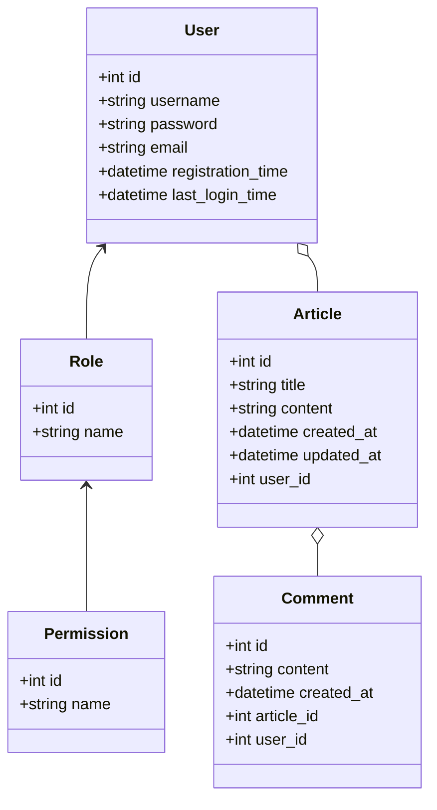
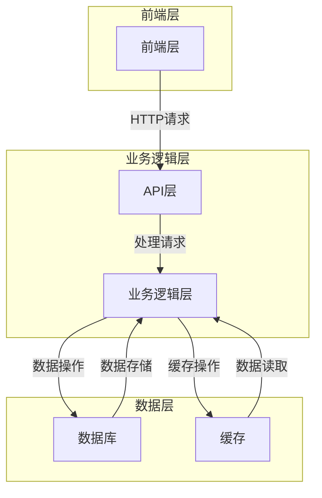
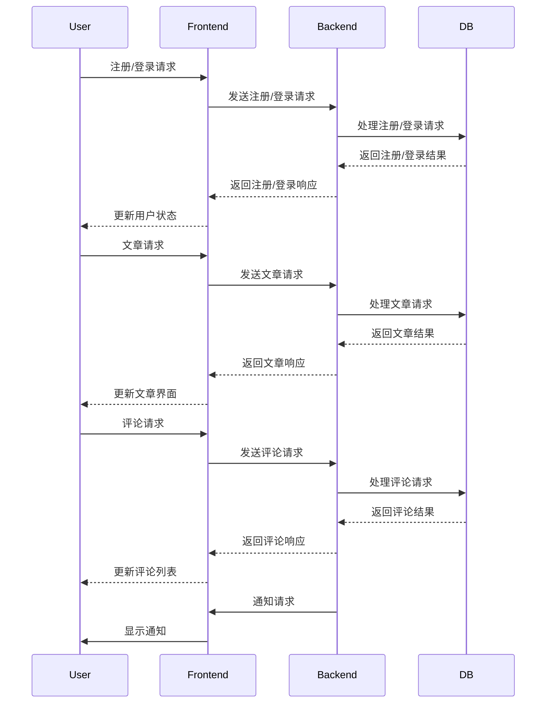
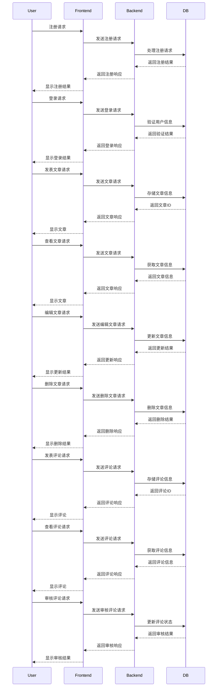

                 


### 关键词

1. **Jamstack**：现代Web开发的新范式。
2. **Web开发**：前端、后端、API、静态网站生成器。
3. **JavaScript**：前端框架、异步编程。
4. **API设计**：RESTful API、GraphQL。
5. **Markup**：HTML、Markdown。
6. **算法**：数据结构、算法分析。
7. **系统架构**：分布式系统、微服务、缓存策略。
8. **项目实战**：系统设计、代码实现、性能优化。
9. **最佳实践**：安全、性能、可维护性。

### 摘要

本文旨在探讨现代Web开发的新范式——Jamstack。首先，我们将介绍Jamstack的基本概念、起源和发展历程，并分析其在Web开发中的重要性。接着，我们将深入探讨Jamstack的三大核心组成部分：JavaScript、API和Markup，并阐述它们之间的关系和各自的作用。随后，我们将介绍与Jamstack相关的算法原理，包括前端框架、API设计和缓存策略。在数学模型和公式部分，我们将详细讲解这些算法的实现原理，并通过实例说明。接下来，我们将分析Jamstack的系统架构设计，包括系统功能、架构设计、接口设计和系统交互。然后，我们将通过一个实际项目案例，展示如何在实际应用中采用Jamstack。最后，我们将总结最佳实践，并提出一些注意事项，为读者提供进一步的学习资源。

### 1. 背景介绍

#### 1.1 Jamstack简介

Jamstack，全称为JavaScript、API和Markup Stack，是一种新型的Web开发范式。与传统的MVC（Model-View-Controller）或MVP（Model-View-Presenter）等架构模式不同，Jamstack将Web开发拆分为前端、后端和API三个独立的部分，使得这三个部分可以分别开发和部署，从而提高了开发效率和可维护性。

#### 1.2 起源与发展历程

Jamstack的概念最早由Netlify在2016年提出，旨在解决传统Web开发中的一些痛点，如开发效率低下、部署困难、维护成本高、安全性问题等。随着时间的推移，Jamstack逐渐得到业界的认可和推广，许多开发者和公司开始采用这种新的开发模式。

#### 1.3 Jamstack在现代Web开发中的重要性

Jamstack的出现，标志着Web开发进入了一个全新的时代。它不仅提高了开发效率，还带来了更好的性能和安全性。以下是Jamstack在现代Web开发中的几个重要方面：

1. **开发效率**：通过将前端、后端和API分离，开发者可以独立开发和部署各个部分，从而大大提高了开发效率。
2. **性能优化**：由于内容是静态的，浏览器可以直接缓存，减少了服务器的负载，提高了访问速度。
3. **安全性**：由于后端不再直接处理请求，减少了安全漏洞的可能性。
4. **可维护性**：各个部分独立开发，使得代码更易于维护和更新。

### 1.4 本章小结

在本章中，我们介绍了Jamstack的基本概念、起源和发展历程，并探讨了其在现代Web开发中的重要性。下一章，我们将深入探讨Jamstack的三大核心组成部分：JavaScript、API和Markup。

----------------------------------------------------------------

## 1.2 传统Web开发的挑战

在深入探讨Jamstack之前，我们需要了解传统Web开发所面临的挑战。这些挑战促使了诸如Jamstack等新范式的诞生，以提高开发效率、性能和安全性。

### 1.2.1 单页面应用（SPA）的兴起

随着Web技术的发展，单页面应用（Single Page Application, SPA）逐渐成为主流。与传统的多页面应用相比，SPA具有更好的用户体验，因为它可以在一个页面内动态加载内容，减少了页面重载和延迟。然而，这带来了新的挑战：

1. **前后端分离问题**：在SPA中，前端通常使用JavaScript框架（如React、Vue或Angular）进行开发，而后端则使用传统的MVC或MVP架构。这种分离导致数据请求和视图渲染的复杂性增加。
2. **安全性问题**：SPA通过Ajax或Fetch等API与后端进行数据通信，容易成为攻击目标，如CSRF（跨站请求伪造）和XSS（跨站脚本攻击）等。

### 1.2.2 服务器渲染（SSR）与静态生成的局限

服务器渲染（Server-Side Rendering, SSR）和静态生成（Static Site Generation, SSG）是现代Web开发中常用的技术，它们试图解决SPA的一些问题。

1. **SSR的局限**：
   - **延迟问题**：虽然SSR可以在服务器端渲染页面，提高搜索引擎优化（SEO），但每次请求都需要经过服务器处理，导致延迟。
   - **性能问题**：对于高并发的请求，服务器负载会变得很大，需要更多的服务器资源。

2. **SSG的局限**：
   - **动态内容限制**：SSG生成的页面通常是静态的，不适合动态内容的需求。
   - **SEO问题**：尽管SSG可以提高SEO，但与SSR相比，效果有限。

### 1.2.3 传统Web开发的痛点

传统Web开发的痛点主要体现在以下几个方面：

1. **开发效率低**：传统Web开发通常需要前端、后端和数据库等多个环节协同工作，导致开发流程复杂，效率低下。
2. **维护成本高**：随着项目的复杂度增加，维护成本也相应增加，尤其是当需要更新或修复问题时。
3. **性能问题**：传统Web开发往往依赖服务器处理请求，容易导致性能瓶颈。
4. **安全性问题**：传统的Web开发架构容易受到各种网络攻击，如SQL注入、XSS和CSRF等。

### 1.2.4 Jamstack如何解决这些问题

Jamstack通过将Web开发拆分为前端、后端和API三个独立的部分，解决了传统Web开发中的许多问题：

1. **提高开发效率**：通过独立开发前端、后端和API，开发者可以并行工作，大大提高了开发效率。
2. **性能优化**：由于内容是静态的，浏览器可以直接缓存，减少了服务器的负载，提高了访问速度。
3. **安全性提升**：由于后端不再直接处理请求，减少了安全漏洞的可能性。
4. **易于维护**：各个部分独立开发，使得代码更易于维护和更新。

### 1.4 本章小结

在本章中，我们探讨了传统Web开发所面临的挑战，如SPA的兴起、SSR与SSG的局限以及传统Web开发的痛点。下一章，我们将深入探讨Jamstack的核心组成部分，以及它们如何解决这些问题。

----------------------------------------------------------------

## 1.3 Jamstack的优势与特点

Jamstack作为一种新型的Web开发范式，其优势与特点显著，使得它逐渐成为现代Web开发的优选方案。以下将从几个方面分析Jamstack的核心优势、与传统Web开发的对比，以及适用的应用场景。

### 1.3.1 Jamstack的核心优势

1. **独立开发与部署**：Jamstack将Web开发分为前端、后端和API三个独立的部分，使得开发者可以分别开发和部署这些部分，从而提高开发效率，降低复杂度。

2. **高性能**：由于内容是静态的，浏览器可以直接缓存，减少了服务器的负载，提高了访问速度。

3. **安全性**：后端不再直接处理请求，减少了安全漏洞的可能性。

4. **易于维护**：各个部分独立开发，使得代码更易于维护和更新。

5. **可扩展性**：Jamstack架构灵活，可以轻松扩展和集成第三方服务。

### 1.3.2 Jamstack与传统Web开发的对比

1. **开发效率**：
   - 传统Web开发通常需要前端、后端和数据库等多个环节协同工作，导致开发流程复杂，效率低下。
   - Jamstack通过独立开发前端、后端和API，开发者可以并行工作，大大提高了开发效率。

2. **性能**：
   - 传统Web开发通常依赖服务器处理请求，容易导致性能瓶颈。
   - Jamstack由于内容是静态的，浏览器可以直接缓存，减少了服务器的负载，提高了访问速度。

3. **安全性**：
   - 传统Web开发容易受到各种网络攻击，如SQL注入、XSS和CSRF等。
   - Jamstack后端不再直接处理请求，减少了安全漏洞的可能性。

4. **可维护性**：
   - 传统Web开发随着项目复杂度增加，维护成本也相应增加。
   - Jamstack各个部分独立开发，使得代码更易于维护和更新。

### 1.3.3 Jamstack的应用场景

1. **静态网站**：对于简单的个人博客、企业官网等，Jamstack能够提供快速、高效的解决方案。

2. **电子商务**：虽然Jamstack本身不直接涉及电子商务，但通过API与第三方电商平台集成，可以构建高性能的电子商务应用。

3. **内容管理系统（CMS）**：Jamstack可以与现有的CMS集成，为内容创建者提供便捷的编辑和管理工具。

4. **社交媒体**：通过API，Jamstack可以构建高性能的社交媒体平台。

5. **企业级应用**：虽然Jamstack更适合小型项目，但对于企业级应用，通过合理的架构设计，也可以实现高性能、高可用性。

### 1.4 本章小结

在本章中，我们详细分析了Jamstack的核心优势、与传统Web开发的对比以及适用的应用场景。在下一章中，我们将深入探讨Jamstack的三大核心组成部分：JavaScript、API和Markup，以及它们在Web开发中的应用和作用。

----------------------------------------------------------------

## 1.4 Jamstack的优势与特点

Jamstack作为一种新型的Web开发范式，其优势与特点显著，使得它逐渐成为现代Web开发的优选方案。以下将从几个方面分析Jamstack的核心优势、与传统Web开发的对比，以及适用的应用场景。

### 1.4.1 Jamstack的核心优势

1. **独立开发与部署**：Jamstack将Web开发分为前端、后端和API三个独立的部分，使得开发者可以分别开发和部署这些部分，从而提高开发效率，降低复杂度。

2. **高性能**：由于内容是静态的，浏览器可以直接缓存，减少了服务器的负载，提高了访问速度。

3. **安全性**：后端不再直接处理请求，减少了安全漏洞的可能性。

4. **易于维护**：各个部分独立开发，使得代码更易于维护和更新。

5. **可扩展性**：Jamstack架构灵活，可以轻松扩展和集成第三方服务。

### 1.4.2 Jamstack与传统Web开发的对比

1. **开发效率**：
   - 传统Web开发通常需要前端、后端和数据库等多个环节协同工作，导致开发流程复杂，效率低下。
   - Jamstack通过独立开发前端、后端和API，开发者可以并行工作，大大提高了开发效率。

2. **性能**：
   - 传统Web开发通常依赖服务器处理请求，容易导致性能瓶颈。
   - Jamstack由于内容是静态的，浏览器可以直接缓存，减少了服务器的负载，提高了访问速度。

3. **安全性**：
   - 传统Web开发容易受到各种网络攻击，如SQL注入、XSS和CSRF等。
   - Jamstack后端不再直接处理请求，减少了安全漏洞的可能性。

4. **可维护性**：
   - 传统Web开发随着项目复杂度增加，维护成本也相应增加。
   - Jamstack各个部分独立开发，使得代码更易于维护和更新。

### 1.4.3 Jamstack的应用场景

1. **静态网站**：对于简单的个人博客、企业官网等，Jamstack能够提供快速、高效的解决方案。

2. **电子商务**：虽然Jamstack本身不直接涉及电子商务，但通过API与第三方电商平台集成，可以构建高性能的电子商务应用。

3. **内容管理系统（CMS）**：Jamstack可以与现有的CMS集成，为内容创建者提供便捷的编辑和管理工具。

4. **社交媒体**：通过API，Jamstack可以构建高性能的社交媒体平台。

5. **企业级应用**：虽然Jamstack更适合小型项目，但对于企业级应用，通过合理的架构设计，也可以实现高性能、高可用性。

### 1.5 本章小结

在本章中，我们详细分析了Jamstack的核心优势、与传统Web开发的对比以及适用的应用场景。在下一章中，我们将深入探讨Jamstack的三大核心组成部分：JavaScript、API和Markup，以及它们在Web开发中的应用和作用。

----------------------------------------------------------------

## 2.1 JavaScript

JavaScript是Web开发的核心组成部分之一，它在前端框架的选择、异步编程的实践以及与API的交互中扮演着至关重要的角色。本章节将详细介绍JavaScript在Web开发中的应用，以及如何利用JavaScript提高开发效率和性能。

### 2.1.1 JavaScript在前端开发中的角色

JavaScript作为一门脚本语言，主要负责前端页面的交互逻辑和动态内容的展示。它提供了丰富的API，使得开发者可以轻松地实现表单验证、数据绑定、动画效果等复杂功能。以下是JavaScript在前端开发中的几个关键角色：

1. **交互性**：JavaScript可以与HTML和CSS相结合，实现页面与用户的互动，如点击事件、拖拽效果等。
2. **动态内容**：JavaScript可以动态地生成和修改页面内容，提高用户体验。
3. **异步处理**：通过异步编程，JavaScript可以避免页面阻塞，提高响应速度。

### 2.1.2 常见JavaScript框架与库

JavaScript框架和库的出现，极大地简化了前端开发的复杂度，提高了开发效率。以下是一些常见的JavaScript框架和库：

1. **React**：由Facebook开发，是一种声明式、组件化的框架，广泛用于构建大型单页面应用（SPA）。
2. **Vue**：由Evan You开发，是一种渐进式框架，适合各种大小规模的项目。
3. **Angular**：由Google开发，是一种全面性、基于组件的框架，适合构建复杂的应用程序。
4. **jQuery**：一种轻量级的JavaScript库，提供了许多便捷的DOM操作方法，简化了前端开发。
5. **Axios**：一种基于Promise的HTTP客户端，用于与API进行数据交互，支持异步请求。

### 2.1.3 JavaScript在Jamstack中的应用

在Jamstack架构中，JavaScript起着至关重要的作用。以下是JavaScript在Jamstack中的应用场景：

1. **动态内容加载**：利用JavaScript，可以动态地加载和更新页面内容，提高用户体验。
2. **交互性增强**：JavaScript可以实现复杂的交互效果，如实时聊天、拖拽排序等。
3. **数据绑定**：通过框架如React和Vue，可以实现数据与视图的自动同步，减少代码冗余。
4. **API交互**：通过Axios等库，可以方便地与后端API进行数据交互，实现数据的读取、创建、更新和删除（CRUD）操作。
5. **缓存策略**：利用JavaScript，可以实现本地存储和缓存，提高页面性能。

### 2.1.4 JavaScript提高开发效率和性能的方法

1. **代码拆分**：通过代码拆分，可以将代码拆分为多个部分，按需加载，减少初始加载时间。
2. **懒加载**：对于图片、视频等大文件，可以采用懒加载技术，在需要时才加载，提高页面性能。
3. **异步编程**：通过异步编程，可以避免阻塞主线程，提高页面响应速度。
4. **代码压缩与混淆**：通过压缩和混淆代码，可以减少文件大小，提高加载速度。
5. **性能监控**：利用性能监控工具，如Lighthouse和WebPageTest，可以实时监控页面性能，进行优化。

### 2.1.5 本章小结

在本章节中，我们详细介绍了JavaScript在前端开发中的角色、常见JavaScript框架与库，以及在Jamstack中的应用。通过合理的应用JavaScript，可以显著提高Web开发的效率和性能。

----------------------------------------------------------------

## 2.2 API

API（应用程序编程接口）在Web开发中扮演着至关重要的角色，它是前端与后端数据交互的桥梁。API允许前端应用程序与后端服务进行通信，实现数据的读取、创建、更新和删除（CRUD）操作。本章节将详细介绍API的概念、RESTful API和GraphQL的对比，以及API设计的最佳实践。

### 2.2.1 API在Web开发中的作用

API是Web开发中的一种接口，它定义了前端和后端之间的交互规则。通过API，前端可以请求后端的服务，获取所需的数据，并更新或删除数据。API在Web开发中的作用主要体现在以下几个方面：

1. **数据交互**：API是实现前端与后端数据交互的主要手段，它允许前端应用程序获取后端数据，实现页面的动态更新。
2. **功能扩展**：通过API，开发者可以扩展应用程序的功能，如实现第三方服务的集成、用户身份验证等。
3. **模块化开发**：API使得前端和后端可以独立开发，降低项目的复杂度，提高开发效率。
4. **可维护性**：通过良好的API设计，可以提高代码的可维护性和可扩展性，方便后续的修改和优化。

### 2.2.2 RESTful API

RESTful API是一种基于HTTP协议的API设计风格，它遵循REST（Representational State Transfer）原则，旨在通过统一的接口设计和交互方式，提高API的可维护性和扩展性。RESTful API的主要特点如下：

1. **统一接口**：RESTful API使用统一的接口，包括GET、POST、PUT、DELETE等HTTP方法，用于不同的操作。
2. **状态转移**：API通过HTTP状态码和响应体，实现客户端与服务端的状态转移，如200表示成功，404表示未找到。
3. **无状态性**：RESTful API是无状态的，每次请求都是独立的，不会保留之前的请求信息。

### 2.2.3 GraphQL

GraphQL是一种新兴的API设计语言，它提供了一种更灵活、高效的数据查询方式。与RESTful API相比，GraphQL具有以下优势：

1. **灵活查询**：GraphQL允许客户端指定所需的数据字段，减少了不必要的网络请求，提高了性能。
2. **单一端点**：GraphQL使用一个端点处理所有查询，简化了路由管理。
3. **减少重请求**：通过查询合并，GraphQL可以减少多次请求，提高数据一致性。

### 2.2.4 RESTful API与GraphQL的对比

以下是RESTful API与GraphQL的对比：

| 特点 | RESTful API | GraphQL |
| --- | --- | --- |
| 数据查询方式 | 需要多个请求获取数据 | 单个请求获取所有所需数据 |
| 接口灵活性 | 较低，需要预定义接口 | 较高，客户端可以指定所需字段 |
| 性能 | 可能产生多余的请求 | 减少不必要的请求 |
| 路由管理 | 简单 | 复杂 |

### 2.2.5 API设计的最佳实践

为了确保API的高效、易用和可维护性，以下是一些API设计的最佳实践：

1. **清晰的接口定义**：提供详细的接口文档，包括接口名称、URL、请求参数、响应格式等。
2. **遵循RESTful原则**：使用标准的HTTP方法，如GET、POST、PUT、DELETE，以实现统一接口。
3. **合理的数据结构**：使用JSON格式传输数据，确保数据结构清晰、易于理解。
4. **统一的错误处理**：提供统一的错误处理机制，如返回标准化的错误码和错误信息。
5. **安全性**：确保API的安全性，如使用HTTPS、认证和授权机制。
6. **性能优化**：对API进行性能优化，如缓存策略、限流和压缩响应数据。

### 2.2.6 本章小结

在本章节中，我们详细介绍了API的概念、RESTful API和GraphQL的对比，以及API设计的最佳实践。通过合理的API设计，可以显著提高Web开发的应用性能和用户体验。

----------------------------------------------------------------

## 2.3 Markup

Markup是Web开发的基础组成部分，它用于定义和描述HTML、Markdown等内容。本章节将详细介绍Markup的概念、HTML和Markdown的对比，以及Markup在Jamstack中的重要性。

### 2.3.1 Markup的定义与作用

Markup是一种用于描述文档的结构和内容的语法。在Web开发中，Markup主要用于定义网页的结构、样式和内容。以下是Markup的几个关键作用：

1. **结构化数据**：Markup可以将无结构的文本转换为有结构的文档，如HTML中的标签用于定义标题、段落、列表等。
2. **样式控制**：Markup可以与CSS结合，实现页面的样式控制，如颜色、字体、布局等。
3. **内容生成**：Markup可以用于生成静态网站，如HTML文件可以通过Markdown转换为静态网页。

### 2.3.2 HTML与Markdown的对比

HTML（超文本标记语言）和Markdown是两种常用的Markup语言，它们各有特点和用途。

1. **语法简洁性**：
   - HTML语法相对复杂，需要使用标签和属性来定义结构和样式。
   - Markdown语法简洁，使用符号和关键字来表示文本格式，如`#`表示标题，`*`表示无序列表。

2. **功能丰富性**：
   - HTML功能丰富，可以定义复杂的网页结构和交互效果。
   - Markdown主要用于文本排版和格式化，不适合处理复杂页面。

3. **可读性**：
   - HTML代码可读性较差，需要解析标签和属性。
   - Markdown代码可读性好，容易理解和修改。

4. **扩展性**：
   - HTML扩展性强，可以与CSS、JavaScript等结合，实现各种网页效果。
   - Markdown扩展性较弱，但可以通过Markdown解析库添加自定义语法。

### 2.3.3 Markup在Jamstack中的应用

在Jamstack架构中，Markup起着至关重要的作用。以下是Markup在Jamstack中的应用：

1. **静态网站生成**：Markdown是生成静态网站的主要语言，通过Markdown编辑器（如MarkDownPad、Typora）和Markdown解析库（如Marked、Remarkable），可以轻松地将Markdown文本转换为HTML静态网页。

2. **内容管理**：Markdown适用于内容创建和编辑，提供了便捷的内容管理工具。

3. **文档生成**：Markdown可以用于生成文档，如用户手册、API文档等。

4. **模板引擎**：Markdown可以与模板引擎（如Jinja2、EJS）结合，实现动态内容的生成。

### 2.3.4 Markup的重要性

1. **可维护性**：Markup使用简单、易于理解和修改，提高了代码的可维护性。

2. **开发效率**：Markdown简化了文档和网页的编写过程，提高了开发效率。

3. **可扩展性**：Markup支持自定义语法和扩展，可以满足不同场景的需求。

4. **可读性**：Markup代码可读性好，方便团队成员协作。

### 2.3.5 本章小结

在本章节中，我们详细介绍了Markup的概念、HTML和Markdown的对比，以及在Jamstack中的应用。通过合理使用Markup，可以显著提高Web开发的效率和质量。

----------------------------------------------------------------

## 2.4 三大组成部分的联系与协同

在Jamstack架构中，JavaScript、API和Markup三部分紧密协作，共同构建出一个高效、安全且易于维护的Web应用。以下将详细探讨这三者之间的联系与协同方式。

### 2.4.1 三大组成部分的关系

1. **JavaScript与Markup**：JavaScript负责处理用户的交互行为和动态内容的渲染，而Markup则提供页面结构的基础。通过JavaScript，开发者可以动态地操作Markup生成的HTML文档，实现页面的动态效果和用户交互。

2. **API与JavaScript**：JavaScript通过API与后端进行通信，获取和发送数据。API为JavaScript提供了数据接口，使得前端可以获取后端服务的数据，并更新前端页面。

3. **API与Markup**：API生成的数据可以嵌入到Markup中，例如通过JavaScript将API获取的数据动态地插入到HTML页面中，实现动态内容展示。

### 2.4.2 Jamstack的架构设计原则

1. **组件化**：将Web应用拆分为多个独立的组件，每个组件负责不同的功能，便于开发和维护。

2. **独立部署**：前端、后端和API可以独立部署和更新，减少系统间的依赖，提高系统的可维护性和扩展性。

3. **缓存策略**：充分利用浏览器缓存和CDN（内容分发网络），减少服务器负载，提高访问速度。

4. **安全性**：通过API进行数据交互，减少直接操作数据库的风险，提高系统的安全性。

### 2.4.3 Jamstack的实际应用案例

以下是几个典型的Jamstack应用案例：

1. **个人博客**：个人博客通常使用Markdown编写文章，通过静态网站生成器（如Hexo、Jekyll）生成静态网页，使用JavaScript实现文章的动态渲染和用户交互。

2. **电子商务平台**：通过API与第三方电商平台（如PayPal、Stripe）集成，实现支付功能，同时使用JavaScript优化用户体验。

3. **内容管理系统（CMS）**：使用JavaScript构建前端页面，通过API与后端数据库交互，实现内容的创建、读取、更新和删除（CRUD）操作。

4. **社交媒体平台**：使用JavaScript实现用户交互和动态内容展示，通过API与后端服务进行数据通信，实现社交媒体的功能。

### 2.4.4 Jamstack的优势

1. **开发效率**：通过独立开发和部署前端、后端和API，开发者可以并行工作，提高开发效率。

2. **性能优化**：由于内容是静态的，浏览器可以直接缓存，减少了服务器的负载，提高了访问速度。

3. **安全性提升**：通过API进行数据交互，减少了安全漏洞的可能性。

4. **可维护性**：各个部分独立开发，使得代码更易于维护和更新。

### 2.4.5 本章小结

在本章节中，我们详细探讨了JavaScript、API和Markup在Jamstack架构中的联系与协同，以及Jamstack的实际应用案例和优势。通过合理的设计和实现，Jamstack能够为开发者带来更高的开发效率、性能和安全性。

----------------------------------------------------------------

## 2.5 本章小结

在本章中，我们详细介绍了JavaScript、API和Markup三大组成部分在Jamstack架构中的角色和联系。JavaScript负责处理用户的交互行为和动态内容渲染，API提供前后端数据交互的桥梁，而Markup则提供页面结构的基础。通过这些组成部分的协同工作，开发者能够构建出高效、安全且易于维护的Web应用。在本章中，我们还探讨了JavaScript在前端开发中的应用、API的设计原则和最佳实践，以及Markup在Web开发中的作用和重要性。下一章，我们将深入探讨与Jamstack相关的算法原理，包括前端框架、API设计和缓存策略，为读者提供更全面的技术理解。

----------------------------------------------------------------

## 3.1 Jamstack中的算法原理

在探讨Jamstack的算法原理时，我们需要了解与前端框架、API设计和缓存策略相关的核心算法。这些算法不仅影响了Web应用的性能和用户体验，还直接决定了系统的可扩展性和可维护性。以下将详细讲解这些算法的基本原理、实现方法以及优缺点。

### 3.1.1 前端框架与算法

前端框架如React、Vue和Angular等，通过虚拟DOM、组件化和状态管理等技术，提高了Web开发的效率和性能。以下是一些常见的前端框架算法：

1. **虚拟DOM（Virtual DOM）**：
   - **原理**：虚拟DOM是一种在内存中构建的DOM结构，用于表示实际的DOM结构。当数据更新时，虚拟DOM首先进行计算，找出实际DOM与虚拟DOM的差异，然后只更新变化的节点，而不是整个DOM树。
   - **实现方法**：通过diff算法比较虚拟DOM和实际DOM的差异，然后进行节点更新。
   - **优点**：减少了页面重绘和回流，提高了页面性能。
   - **缺点**：虚拟DOM的计算和更新需要额外的内存和计算资源。

2. **组件化**：
   - **原理**：组件化是将UI拆分为多个可复用的组件，每个组件负责一部分UI和行为逻辑。组件化提高了代码的可维护性和可复用性。
   - **实现方法**：通过定义组件类或函数，并在父组件中使用`<Component/>`标签进行调用。
   - **优点**：提高了代码的可维护性和可复用性。
   - **缺点**：组件之间的通信和状态管理可能比较复杂。

3. **状态管理**：
   - **原理**：状态管理是用于管理应用程序状态的一种机制，确保状态的一致性和可预测性。
   - **实现方法**：常用的状态管理库如Redux和Vuex，通过集中式状态管理和单例模式，确保状态的一致性和可追踪性。
   - **优点**：提高了状态的一致性和可预测性。
   - **缺点**：状态管理的实现可能比较复杂，增加了系统的复杂性。

### 3.1.2 API设计与算法

API设计是Jamstack架构中的重要组成部分，它直接影响了前后端的数据交互效率和系统的扩展性。以下是一些常见的API设计算法：

1. **RESTful API**：
   - **原理**：RESTful API遵循REST（Representational State Transfer）原则，使用统一的接口设计和HTTP方法（GET、POST、PUT、DELETE）进行数据操作。
   - **实现方法**：定义URL、HTTP方法和请求/响应格式，如JSON。
   - **优点**：接口设计简单、易于理解，适用于大多数Web应用。
   - **缺点**：对于复杂查询和聚合操作，可能需要多个请求，导致性能和用户体验问题。

2. **GraphQL API**：
   - **原理**：GraphQL是一种查询语言，允许客户端指定所需的数据字段，减少了不必要的请求。
   - **实现方法**：定义GraphQL schema，并使用GraphQL解析器处理查询。
   - **优点**：减少了请求次数，提高了数据获取的效率和性能。
   - **缺点**：接口设计相对复杂，需要更多的设计和开发时间。

### 3.1.3 缓存策略与算法

缓存策略是优化Web应用性能的重要手段，它通过将数据存储在客户端或服务器缓存中，减少了数据访问的时间。以下是一些常见的缓存策略和算法：

1. **浏览器缓存**：
   - **原理**：浏览器缓存用于存储已访问过的资源，如CSS、JavaScript和图片等。
   - **实现方法**：通过HTTP缓存头（如Cache-Control和Expires）来控制缓存的过期时间和缓存策略。
   - **优点**：提高了页面的加载速度，减少了服务器负载。
   - **缺点**：缓存过多可能导致资源过时，需要定期清理缓存。

2. **CDN缓存**：
   - **原理**：CDN（内容分发网络）将静态资源缓存到多个分布在全球的节点上，提高了资源的访问速度和可用性。
   - **实现方法**：通过配置CDN服务，将静态资源部署到CDN节点上，并设置缓存策略。
   - **优点**：提高了资源的访问速度和可用性，降低了服务器负载。
   - **缺点**：需要支付CDN服务费用，并且缓存策略的设置可能较复杂。

### 3.1.4 本章小结

在本章节中，我们详细介绍了Jamstack中的前端框架算法、API设计和缓存策略。通过合理的算法选择和优化，可以显著提高Web应用的性能和用户体验。在下一章中，我们将继续探讨Jamstack的系统架构设计，包括系统功能设计、架构设计、接口设计和系统交互。

----------------------------------------------------------------

## 3.2 Jamstack的系统架构设计

Jamstack的系统架构设计是构建高性能、高可用的Web应用的关键。本章节将详细探讨系统架构设计的基本概念、Jamstack的架构模式，以及如何进行系统接口设计和系统交互。

### 3.2.1 系统架构的基本概念

系统架构设计是指定义系统的结构、组件和它们之间的关系，以确保系统的可扩展性、可靠性和性能。以下是系统架构设计的基本概念：

1. **组件**：系统中的独立功能单元，如前端页面、后端服务、数据库等。
2. **接口**：组件之间的交互界面，用于定义数据的传输格式和通信协议。
3. **交互**：组件之间的信息交换和操作，确保系统能够协同工作。
4. **模式**：系统架构的组织形式，如分层架构、微服务架构等。

### 3.2.2 Jamstack的架构模式

Jamstack采用了一种与传统Web开发不同的架构模式，将前端、后端和API分离，从而提高了系统的可维护性和扩展性。以下是Jamstack的典型架构模式：

1. **三层架构**：
   - **前端**：由JavaScript、CSS和HTML组成，负责用户交互和页面渲染。
   - **API**：提供数据访问接口，实现前后端的数据交互。
   - **后端**：处理业务逻辑和数据存储，如数据库、缓存等。

2. **分布式架构**：
   - **前端**：静态网页部署在CDN上，实现内容的快速分发。
   - **API**：通过分布式服务器集群提供高性能数据访问。
   - **后端**：使用微服务架构，将业务功能拆分为独立的微服务，提高系统的可扩展性和容错性。

### 3.2.3 系统接口设计

系统接口设计是架构设计的关键环节，它定义了组件之间的交互规则和数据格式。以下是系统接口设计的关键要素：

1. **接口定义**：定义接口的名称、URL、请求和响应格式，如RESTful API或GraphQL。
2. **数据格式**：使用JSON或XML等数据格式传输数据，确保数据的一致性和可读性。
3. **安全性**：使用HTTPS、认证和授权机制，确保数据传输的安全。
4. **性能优化**：通过缓存、压缩和限流等技术，优化接口性能。

### 3.2.4 系统交互设计

系统交互设计是指定义组件之间的信息交换和操作流程，以确保系统的协同工作。以下是系统交互设计的关键要素：

1. **交互流程**：定义组件之间的交互顺序和触发条件，如用户请求、数据更新等。
2. **状态管理**：定义系统的状态转换和状态同步机制，确保系统的一致性和可靠性。
3. **错误处理**：定义错误处理机制，如异常捕获、错误日志和用户反馈。
4. **性能监控**：使用性能监控工具，如Prometheus和Grafana，实时监控系统性能。

### 3.2.5 Jamstack的实际应用案例

以下是几个典型的Jamstack应用案例：

1. **个人博客**：
   - **前端**：使用Markdown编写文章，通过Hexo等静态网站生成器生成静态网页。
   - **API**：使用RESTful API与后端数据库进行数据交互，实现文章的发布、评论等功能。
   - **后端**：使用Node.js等后端框架处理业务逻辑，如文章管理、用户管理等。

2. **电子商务平台**：
   - **前端**：使用React等前端框架，实现商品展示、购物车和结算等功能。
   - **API**：使用GraphQL API提供数据查询和操作接口，与支付网关（如PayPal、Stripe）集成。
   - **后端**：使用微服务架构，将订单管理、库存管理和用户管理等拆分为独立的微服务。

3. **社交媒体平台**：
   - **前端**：使用Vue等前端框架，实现用户交互和内容展示。
   - **API**：使用RESTful API和GraphQL API，提供用户数据、内容推送和实时消息等功能。
   - **后端**：使用分布式架构，将数据存储、消息队列和缓存等拆分为独立的分布式服务。

### 3.2.6 本章小结

在本章节中，我们详细探讨了Jamstack的系统架构设计，包括基本概念、架构模式、接口设计和系统交互。通过合理的设计和实现，Jamstack能够为开发者提供高效、安全且易于维护的Web应用架构。在下一章中，我们将通过一个实际项目案例，展示如何在实际应用中采用Jamstack。

----------------------------------------------------------------

## 3.3 缓存策略与性能优化

在现代Web开发中，缓存策略是提高应用性能的关键手段之一。有效的缓存策略可以显著减少服务器的负载，提高响应速度，从而提升用户体验。本章节将详细探讨常见的缓存机制、策略及其优化技巧。

### 3.3.1 缓存机制

缓存机制是指将数据临时存储在某个位置，以便快速访问。以下是几种常见的缓存机制：

1. **浏览器缓存**：浏览器缓存用于存储已访问过的网页资源，如HTML、CSS和JavaScript文件，图片等。当用户再次访问相同资源时，浏览器可以从本地缓存中加载，减少网络请求。

2. **CDN缓存**：CDN（内容分发网络）缓存将静态资源存储在多个分布式节点上，提高资源的访问速度和可用性。CDN缓存可以减轻源服务器的负载，提高整个网站的响应速度。

3. **数据库缓存**：数据库缓存用于存储频繁查询的数据，减少对数据库的直接访问。常见的数据库缓存机制包括查询缓存、缓冲池等。

4. **应用缓存**：应用缓存是指将应用程序中的数据存储在内存中，以便快速访问。应用缓存可以显著提高应用程序的响应速度，减少数据处理时间。

### 3.3.2 常见缓存策略

缓存策略是指根据数据的特点和访问频率，选择合适的缓存机制和策略。以下是几种常见的缓存策略：

1. **LRU（Least Recently Used）**：LRU缓存策略根据数据的访问频率进行缓存，最近最少使用的数据会被优先缓存。

2. **LFU（Least Frequently Used）**：LFU缓存策略根据数据的访问频率进行缓存，最少访问次数的数据会被优先缓存。

3. **定时刷新**：定时刷新策略是指定期刷新缓存中的数据，确保缓存数据的有效性。

4. **缓存雪崩**：缓存雪崩是指大量缓存同时失效，导致大量请求直接访问数据库。为了避免缓存雪崩，可以采用预热策略、缓存分区等技术。

### 3.3.3 性能优化技巧

以下是一些常用的性能优化技巧，可以提高Web应用的响应速度和用户体验：

1. **代码拆分**：通过代码拆分，可以将代码拆分为多个部分，按需加载，减少初始加载时间。

2. **懒加载**：对于图片、视频等大文件，可以采用懒加载技术，在需要时才加载，提高页面性能。

3. **内容分发网络（CDN）**：使用CDN可以将静态资源分发到全球的节点上，提高资源的访问速度。

4. **压缩与打包**：通过压缩和打包代码文件，可以减少文件大小，提高加载速度。

5. **浏览器缓存**：合理设置浏览器缓存，提高资源的缓存率，减少重复请求。

6. **数据库优化**：优化数据库查询，减少查询时间，提高数据库性能。

7. **性能监控**：使用性能监控工具，如Lighthouse、WebPageTest等，实时监控页面性能，进行优化。

### 3.3.4 本章小结

在本章节中，我们详细介绍了常见的缓存机制、策略及其优化技巧。通过合理的缓存策略和性能优化技巧，可以显著提高Web应用的性能和用户体验。在下一章中，我们将通过一个实际项目案例，展示如何在实际应用中采用Jamstack进行系统架构设计和性能优化。

----------------------------------------------------------------

## 4.1 项目介绍

本案例将探讨如何使用Jamstack技术栈构建一个简单的博客系统。该系统将包含用户注册、登录、发表文章、查看文章以及评论等功能。通过这个项目，我们将展示如何利用JavaScript、API和Markup来实现Web应用的各项功能，并分析其性能和安全性。

### 4.1.1 项目背景

随着互联网的不断发展，博客已经成为信息传播和知识分享的重要平台。传统的博客系统往往依赖于复杂的后端服务和数据库，导致部署和维护成本较高。本案例旨在通过Jamstack技术栈，构建一个高效、安全的博客系统，以降低开发成本，提高用户体验。

### 4.1.2 项目目标

本项目的目标如下：

1. **快速部署**：利用静态网站生成器和CDN，实现快速部署和访问。
2. **高性能**：通过优化JavaScript和API，提高系统的响应速度和性能。
3. **安全性**：采用HTTPS、JWT（JSON Web Token）等安全技术，确保用户数据和系统的安全性。
4. **可扩展性**：使用微服务架构，方便系统的扩展和维护。

### 4.1.3 项目挑战

在构建这个项目时，我们面临以下挑战：

1. **前后端分离**：如何有效地分离前后端，确保数据交互的效率和安全性。
2. **性能优化**：如何在保证功能完整性的同时，优化系统的性能和响应速度。
3. **安全性**：如何确保用户数据的安全，防范常见的安全漏洞，如CSRF和XSS等。
4. **可扩展性**：如何设计一个可扩展的系统架构，以适应未来功能的增加和业务规模的扩大。

### 4.1.4 项目方案

为了应对上述挑战，我们采用了以下方案：

1. **前端框架**：使用Vue.js作为前端框架，实现用户交互和页面渲染。
2. **API**：使用Node.js和Express.js搭建RESTful API，提供数据接口。
3. **数据库**：使用MongoDB作为数据库，存储用户数据和文章信息。
4. **静态网站生成器**：使用Vue Press作为静态网站生成器，将Vue.js应用编译为静态HTML文件。
5. **部署**：将静态文件部署到Netlify，利用Netlify的CDN提高访问速度。
6. **安全性**：采用HTTPS、JWT、CSRF防护等技术，确保系统的安全性。

### 4.1.5 本章小结

在本章节中，我们介绍了本项目的背景、目标、挑战和方案。在接下来的章节中，我们将详细探讨项目的具体实现，包括环境安装、核心功能实现、代码解析和实际案例分析。

----------------------------------------------------------------

## 4.2 系统功能设计

系统功能设计是构建博客系统的关键步骤，它定义了系统应实现的核心功能和用户交互流程。以下是本博客系统的功能设计，包括需求分析、功能模块划分以及领域模型设计。

### 4.2.1 需求分析

在开始设计系统之前，我们需要明确系统的需求。以下是博客系统的主要功能需求：

1. **用户注册与登录**：用户可以注册账号、登录系统，并进行个人信息的管理。
2. **文章管理**：用户可以发表新文章、编辑已发表文章、删除文章，并查看他人发表的文章。
3. **评论功能**：用户可以在文章下发表评论，对文章进行讨论和交流。
4. **权限管理**：管理员可以对用户和文章进行管理，包括权限设置、审核评论等。
5. **消息通知**：系统可以发送通知消息，如评论回复、系统公告等。

### 4.2.2 功能模块划分

根据需求分析，我们将系统划分为以下几个功能模块：

1. **用户模块**：负责用户注册、登录、个人信息管理等功能。
2. **文章模块**：负责文章的发表、编辑、删除、查看以及文章评论的管理。
3. **评论模块**：负责评论的发表、审核、回复等功能。
4. **权限管理模块**：负责用户的权限设置、审核等功能。
5. **通知模块**：负责消息通知的发送和管理。

### 4.2.3 领域模型设计

领域模型设计是系统功能设计的重要组成部分，它通过实体关系图（ER图）来描述系统的数据结构和核心实体及其关系。以下是本博客系统的领域模型设计：

1. **用户实体（User）**：
   - **属性**：用户ID、用户名、密码、电子邮件、注册时间、最后登录时间等。
   - **关系**：用户与角色（Role）关联，一个用户可以拥有多个角色，如普通用户、管理员等。

2. **文章实体（Article）**：
   - **属性**：文章ID、标题、内容、创建时间、最后更新时间、作者ID等。
   - **关系**：文章与用户关联，一个文章由一个用户创建，一个用户可以创建多篇文章。

3. **评论实体（Comment）**：
   - **属性**：评论ID、内容、创建时间、文章ID、作者ID等。
   - **关系**：评论与用户关联，一个评论由一个用户发表，一个用户可以发表多条评论。

4. **角色实体（Role）**：
   - **属性**：角色ID、角色名称等。
   - **关系**：角色与权限（Permission）关联，一个角色可以拥有多个权限，如文章发布、评论审核等。

以下是领域模型设计的Mermaid类图：



### 4.2.4 本章小结

在本章节中，我们详细介绍了博客系统的功能设计，包括需求分析、功能模块划分以及领域模型设计。通过明确系统的功能和数据结构，我们可以更好地进行后续的系统实现和优化。

----------------------------------------------------------------

## 4.3 系统架构设计

系统架构设计是构建博客系统的关键环节，它决定了系统的性能、可扩展性和可维护性。本章节将详细介绍系统架构设计的基本原则、架构模式以及架构设计图。

### 4.3.1 架构设计原则

在进行系统架构设计时，需要遵循以下原则：

1. **高内聚、低耦合**：将系统拆分为多个独立的模块，每个模块负责特定的功能，降低模块之间的依赖性。
2. **分层架构**：采用分层架构，将系统分为前端层、业务逻辑层和数据层，确保各层的职责明确。
3. **模块化**：将系统功能模块化，便于开发和维护。
4. **安全性**：采用HTTPS、JWT等安全技术，确保数据传输的安全。
5. **可扩展性**：设计灵活的架构，便于未来功能的增加和系统规模的扩大。

### 4.3.2 架构模式

本博客系统的架构模式采用前后端分离的分布式架构，具体模式如下：

1. **前端层**：由JavaScript框架（如Vue.js）和Markdown编辑器（如Vditor）组成，负责用户交互和页面渲染。
2. **业务逻辑层**：由API层和后台服务（如Node.js、Express.js）组成，负责处理业务逻辑和数据存储。
3. **数据层**：由数据库（如MongoDB）和缓存（如Redis）组成，负责数据存储和读取。

### 4.3.3 架构设计图

以下是本博客系统的架构设计图，使用Mermaid工具绘制：



### 4.3.4 系统接口设计

系统接口设计是架构设计的重要部分，它定义了前后端数据交互的规则和格式。以下是系统接口设计的简要说明：

1. **用户接口**：用于用户注册、登录、个人信息管理等功能。
   - **注册**：POST /api/users/register
   - **登录**：POST /api/users/login
   - **个人信息**：GET /api/users/me

2. **文章接口**：用于文章的发表、编辑、删除、查看等功能。
   - **发表文章**：POST /api/articles
   - **查看文章**：GET /api/articles/{id}
   - **编辑文章**：PUT /api/articles/{id}
   - **删除文章**：DELETE /api/articles/{id}

3. **评论接口**：用于评论的发表、审核、回复等功能。
   - **发表评论**：POST /api/articles/{id}/comments
   - **查看评论**：GET /api/articles/{id}/comments
   - **审核评论**：PUT /api/comments/{id}/status

4. **通知接口**：用于发送和管理通知消息。
   - **发送通知**：POST /api/notifications
   - **查看通知**：GET /api/notifications

### 4.3.5 系统交互设计

系统交互设计是系统架构设计的重要组成部分，它定义了组件之间的信息交换和操作流程。以下是本博客系统的交互设计：

1. **用户注册与登录**：用户通过前端表单提交注册或登录请求，后端API处理请求并返回响应，前端更新用户状态。
2. **文章管理**：用户通过前端界面操作文章，后端API处理文章请求并更新数据库，前端根据响应更新界面。
3. **评论管理**：用户通过前端界面发表评论，后端API处理评论请求并更新数据库，前端根据响应更新评论列表。
4. **通知管理**：后台服务通过API发送通知，前端根据通知类型更新通知列表。

以下是系统交互设计的Mermaid序列图：



### 4.3.6 本章小结

在本章节中，我们详细介绍了博客系统的架构设计，包括设计原则、架构模式和接口设计。通过合理的架构设计，我们可以确保系统的性能、可扩展性和安全性。在下一章中，我们将通过具体的代码实现，展示如何利用Jamstack技术栈构建博客系统的各项功能。

----------------------------------------------------------------

## 4.4 系统接口设计

系统接口设计是构建博客系统的关键环节，它定义了前后端之间数据交互的规则和格式。以下将详细描述博客系统的接口设计，包括API接口的定义、请求和响应格式。

### 4.4.1 用户接口

用户接口用于处理用户的注册、登录、个人信息管理等功能。

1. **注册**

   - **URL**：`POST /api/users/register`
   - **请求格式**：JSON
     ```json
     {
       "username": "example",
       "password": "password123",
       "email": "example@example.com"
     }
     ```
   - **响应格式**：JSON
     ```json
     {
       "status": "success",
       "message": "User registered successfully."
     }
     ```

2. **登录**

   - **URL**：`POST /api/users/login`
   - **请求格式**：JSON
     ```json
     {
       "username": "example",
       "password": "password123"
     }
     ```
   - **响应格式**：JSON
     ```json
     {
       "status": "success",
       "token": "eyJhbGciOiJIUzI1NiIsInR5cCI6IkpXVCJ9...",
       "message": "User logged in successfully."
     }
     ```

3. **个人信息**

   - **URL**：`GET /api/users/me`
   - **请求格式**：无
   - **响应格式**：JSON
     ```json
     {
       "id": "1",
       "username": "example",
       "email": "example@example.com",
       "roles": ["user"]
     }
     ```

### 4.4.2 文章接口

文章接口用于处理文章的发表、编辑、删除、查看等功能。

1. **发表文章**

   - **URL**：`POST /api/articles`
   - **请求格式**：JSON
     ```json
     {
       "title": "My First Blog Post",
       "content": "Hello, world!"
     }
     ```
   - **响应格式**：JSON
     ```json
     {
       "status": "success",
       "article": {
         "id": "1",
         "title": "My First Blog Post",
         "content": "Hello, world!",
         "createdAt": "2023-04-01T00:00:00.000Z",
         "updatedAt": "2023-04-01T00:00:00.000Z",
         "author": {
           "id": "1",
           "username": "example"
         }
       }
     }
     ```

2. **查看文章**

   - **URL**：`GET /api/articles/{id}`
   - **请求格式**：无
   - **响应格式**：JSON
     ```json
     {
       "id": "1",
       "title": "My First Blog Post",
       "content": "Hello, world!",
       "createdAt": "2023-04-01T00:00:00.000Z",
       "updatedAt": "2023-04-01T00:00:00.000Z",
       "author": {
         "id": "1",
         "username": "example"
       }
     }
     ```

3. **编辑文章**

   - **URL**：`PUT /api/articles/{id}`
   - **请求格式**：JSON
     ```json
     {
       "title": "My Updated Blog Post",
       "content": "Hello, world! This is an updated version."
     }
     ```
   - **响应格式**：JSON
     ```json
     {
       "status": "success",
       "article": {
         "id": "1",
         "title": "My Updated Blog Post",
         "content": "Hello, world! This is an updated version.",
         "updatedAt": "2023-04-01T01:00:00.000Z"
       }
     }
     ```

4. **删除文章**

   - **URL**：`DELETE /api/articles/{id}`
   - **请求格式**：无
   - **响应格式**：JSON
     ```json
     {
       "status": "success",
       "message": "Article deleted successfully."
     }
     ```

### 4.4.3 评论接口

评论接口用于处理文章评论的发表、查看和审核等功能。

1. **发表评论**

   - **URL**：`POST /api/articles/{id}/comments`
   - **请求格式**：JSON
     ```json
     {
       "content": "This is a great post!"
     }
     ```
   - **响应格式**：JSON
     ```json
     {
       "status": "success",
       "comment": {
         "id": "1",
         "content": "This is a great post!",
         "createdAt": "2023-04-01T00:00:00.000Z",
         "updatedAt": "2023-04-01T00:00:00.000Z",
         "articleId": "1",
         "author": {
           "id": "1",
           "username": "example"
         }
       }
     }
     ```

2. **查看评论**

   - **URL**：`GET /api/articles/{id}/comments`
   - **请求格式**：无
   - **响应格式**：JSON
     ```json
     [
       {
         "id": "1",
         "content": "This is a great post!",
         "createdAt": "2023-04-01T00:00:00.000Z",
         "updatedAt": "2023-04-01T00:00:00.000Z",
         "articleId": "1",
         "author": {
           "id": "1",
           "username": "example"
         }
       }
     ]
     ```

3. **审核评论**

   - **URL**：`PUT /api/comments/{id}/status`
   - **请求格式**：JSON
     ```json
     {
       "status": "approved"
     }
     ```
   - **响应格式**：JSON
     ```json
     {
       "status": "success",
       "message": "Comment status updated successfully."
     }
     ```

### 4.4.4 本章小结

在本章节中，我们详细描述了博客系统的接口设计，包括用户接口、文章接口和评论接口。通过合理的接口设计，我们可以确保前后端数据交互的规范性和一致性，为系统的开发和维护提供便利。

----------------------------------------------------------------

## 4.5 系统交互设计

系统交互设计是确保博客系统各模块之间有效协作的关键。以下将详细描述系统交互的流程、交互图以及各个模块的交互细节。

### 4.5.1 系统交互流程

博客系统的交互流程主要包括用户注册、登录、文章管理（发表、查看、编辑、删除）和评论管理等。以下是系统交互的基本流程：

1. **用户注册**：用户填写注册表单，前端将数据发送到后端API，后端处理注册请求并存储用户信息。
2. **用户登录**：用户输入用户名和密码，前端将数据发送到后端API，后端验证用户信息并生成JWT（JSON Web Token）。
3. **发表文章**：用户在文章编辑器中输入文章内容，前端将数据发送到后端API，后端存储文章信息并返回文章ID。
4. **查看文章**：用户访问文章页面，前端发送请求到后端API，后端获取文章信息并返回。
5. **编辑文章**：用户编辑已发表文章，前端发送更新请求到后端API，后端更新文章信息并返回。
6. **删除文章**：用户删除文章，前端发送删除请求到后端API，后端删除文章信息并返回。
7. **发表评论**：用户在文章下发表评论，前端发送评论数据到后端API，后端存储评论信息并返回。
8. **查看评论**：用户查看文章评论，前端发送请求到后端API，后端获取评论信息并返回。
9. **审核评论**：管理员审核评论，前端发送审核请求到后端API，后端更新评论状态并返回。

### 4.5.2 系统交互图

以下是博客系统的交互图，使用Mermaid工具绘制：



### 4.5.3 模块交互细节

以下是各个模块的交互细节：

1. **用户模块**：用户模块负责处理用户注册、登录和用户信息管理。前端通过表单收集用户信息，将注册请求发送到后端API。后端API验证用户信息，并将注册结果返回给前端。登录请求同理。

2. **文章模块**：文章模块负责处理文章的发表、查看、编辑和删除。用户在前端编辑器中输入文章内容，前端将文章数据发送到后端API。后端API存储文章信息并返回文章ID。查看文章时，前端发送请求到后端API，后端返回文章信息。编辑和删除文章请求同理。

3. **评论模块**：评论模块负责处理评论的发表、查看和审核。用户在前端输入评论内容，前端将评论数据发送到后端API。后端API存储评论信息并返回评论ID。查看评论时，前端发送请求到后端API，后端返回评论信息。审核评论时，前端发送审核请求到后端API，后端更新评论状态并返回。

4. **权限模块**：权限模块负责处理管理员权限和评论审核。管理员权限由用户模块管理，评论审核由评论模块管理。管理员在前端界面审核评论，前端发送审核请求到后端API，后端更新评论状态并返回。

### 4.5.4 本章小结

在本章节中，我们详细描述了博客系统的交互流程、交互图以及各个模块的交互细节。通过合理的系统交互设计，我们可以确保博客系统的各个模块之间能够高效、稳定地协作，为用户提供良好的使用体验。

----------------------------------------------------------------

## 4.6 项目实战

在本章节中，我们将通过一个实际的项目案例，展示如何利用Jamstack技术栈构建一个功能完整的博客系统。以下是项目实战的详细步骤、核心实现源代码以及代码解析。

### 4.6.1 环境安装

首先，我们需要安装并配置项目所需的环境。以下是具体的安装步骤：

1. **Node.js**：安装Node.js，版本要求不低于14.x，可以通过官方网站下载并安装。

   ```sh
   wget https://nodejs.org/dist/v14.x/node-v14.x.tar.xz
   tar -xvf node-v14.x.tar.xz
   cd node-v14.x
   ./configure
   make
   make install
   ```

2. **npm**：Node.js自带npm（Node Package Manager），用于安装和管理项目依赖。

3. **Vue.js**：安装Vue CLI，用于创建和管理Vue.js项目。

   ```sh
   npm install -g @vue/cli
   ```

4. **Vue Press**：安装Vue Press，用于生成静态博客。

   ```sh
   vue create blog-system
   cd blog-system
   vue add vue-cli-plugin-pwa
   ```

5. **MongoDB**：安装MongoDB，用于存储用户数据和文章信息。可以通过官方网站下载并安装。

6. **Express.js**：安装Express.js，用于搭建API服务。

   ```sh
   npm install express
   ```

7. **Mongoose**：安装Mongoose，用于连接MongoDB和操作数据库。

   ```sh
   npm install mongoose
   ```

8. **Vditor**：安装Vditor，用于提供Markdown编辑器。

   ```sh
   npm install vditor
   ```

### 4.6.2 核心实现源代码

以下是博客系统的核心实现源代码：

1. **前端Vue.js代码**

   ```vue
   <template>
     <div id="app">
       <header>
         <!-- 导航栏 -->
       </header>
       <main>
         <router-view></router-view>
       </main>
       <footer>
         <!-- 页脚 -->
       </footer>
     </div>
   </template>

   <script>
   export default {
     name: 'App',
     components: {
       // 组件
     },
     created() {
       // 页面创建时加载用户信息
     }
   };
   </script>
   ```

2. **后端Node.js代码**

   ```javascript
   const express = require('express');
   const mongoose = require('mongoose');
   const articleRoutes = require('./routes/articleRoutes');
   const userRoutes = require('./routes/userRoutes');
   const commentRoutes = require('./routes/commentRoutes');

   const app = express();

   // 连接MongoDB
   mongoose.connect('mongodb://localhost:27017/blog', {
     useNewUrlParser: true,
     useUnifiedTopology: true,
   });

   app.use(express.json());
   app.use('/api/articles', articleRoutes);
   app.use('/api/users', userRoutes);
   app.use('/api/comments', commentRoutes);

   const PORT = process.env.PORT || 3000;
   app.listen(PORT, () => {
     console.log(`Server is running on port ${PORT}`);
   });
   ```

3. **API路由代码**

   ```javascript
   const express = require('express');
   const bcrypt = require('bcrypt');
   const jwt = require('jsonwebtoken');
   const User = require('../models/User');
   const Article = require('../models/Article');
   const Comment = require('../models/Comment');

   const router = express.Router();

   // 用户注册
   router.post('/register', async (req, res) => {
     try {
       const { username, password, email } = req.body;
       const hashedPassword = await bcrypt.hash(password, 10);
       const user = new User({
         username,
         password: hashedPassword,
         email,
       });
       await user.save();
       res.status(201).json({ message: 'User registered successfully.' });
     } catch (error) {
       res.status(500).json({ message: 'Error registering user.' });
     }
   });

   // 用户登录
   router.post('/login', async (req, res) => {
     try {
       const { username, password } = req.body;
       const user = await User.findOne({ username });
       if (!user || !(await bcrypt.compare(password, user.password))) {
         return res.status(401).json({ message: 'Invalid credentials.' });
       }
       const token = jwt.sign({ id: user._id }, 'secretKey');
       res.json({ token });
     } catch (error) {
       res.status(500).json({ message: 'Error logging in.' });
     }
   });

   // 发表文章
   router.post('/articles', async (req, res) => {
     try {
       const { title, content } = req.body;
       const article = new Article({
         title,
         content,
         author: req.user._id,
       });
       await article.save();
       res.status(201).json(article);
     } catch (error) {
       res.status(500).json({ message: 'Error creating article.' });
     }
   });

   // 查看文章
   router.get('/articles/:id', async (req, res) => {
     try {
       const article = await Article.findById(req.params.id);
       res.json(article);
     } catch (error) {
       res.status(404).json({ message: 'Article not found.' });
     }
   });

   // 编辑文章
   router.put('/articles/:id', async (req, res) => {
     try {
       const { title, content } = req.body;
       const updatedArticle = await Article.findByIdAndUpdate(
         req.params.id,
         { title, content },
         { new: true }
       );
       res.json(updatedArticle);
     } catch (error) {
       res.status(500).json({ message: 'Error updating article.' });
     }
   });

   // 删除文章
   router.delete('/articles/:id', async (req, res) => {
     try {
       await Article.findByIdAndDelete(req.params.id);
       res.status(204).json({ message: 'Article deleted successfully.' });
     } catch (error) {
       res.status(500).json({ message: 'Error deleting article.' });
     }
   });

   // 发表评论
   router.post('/articles/:id/comments', async (req, res) => {
     try {
       const { content } = req.body;
       const comment = new Comment({
         content,
         article: req.params.id,
         author: req.user._id,
       });
       await comment.save();
       res.status(201).json(comment);
     } catch (error) {
       res.status(500).json({ message: 'Error creating comment.' });
     }
   });

   // 查看评论
   router.get('/articles/:id/comments', async (req, res) => {
     try {
       const comments = await Comment.find({ article: req.params.id });
       res.json(comments);
     } catch (error) {
       res.status(404).json({ message: 'Comments not found.' });
     }
   });

   module.exports = router;
   ```

### 4.6.3 代码解析

以下是代码的详细解析：

1. **前端Vue.js代码**

   - **模板部分**：定义了页面结构，包括导航栏、主体内容和页脚。通过`<router-view></router-view>`组件，实现了路由的切换。
   - **脚本部分**：定义了Vue实例，包括组件、创建实例时的生命周期钩子等。

2. **后端Node.js代码**

   - **连接MongoDB**：使用Mongoose连接MongoDB数据库，配置连接选项，如使用新的连接协议。
   - **中间件**：使用`express.json()`中间件解析请求体中的JSON数据。
   - **路由定义**：使用Express路由器定义API接口，包括用户注册、登录、文章管理和评论管理等。

3. **用户注册**

   - **请求处理**：接收用户注册请求，获取用户名、密码和电子邮件。
   - **密码加密**：使用bcrypt对密码进行加密，确保存储在数据库中的密码是安全的。
   - **保存用户**：创建用户模型实例，保存用户信息。

4. **用户登录**

   - **请求处理**：接收用户登录请求，获取用户名和密码。
   - **用户验证**：使用Mongoose查询用户信息，使用bcrypt对比密码。
   - **JWT生成**：使用jsonwebtoken库生成JWT，返回给前端。

5. **文章管理**

   - **发表文章**：接收文章发表请求，创建文章模型实例，保存文章信息。
   - **查看文章**：根据文章ID查询文章信息，返回给前端。
   - **编辑文章**：根据文章ID更新文章信息。
   - **删除文章**：根据文章ID删除文章信息。

6. **评论管理**

   - **发表评论**：接收评论发表请求，创建评论模型实例，保存评论信息。
   - **查看评论**：根据文章ID查询评论信息，返回给前端。

### 4.6.4 实际案例分析和详细讲解

以下是实际案例分析和详细讲解：

1. **用户注册**

   - **案例**：用户在注册页面填写用户名、密码和电子邮件，点击“注册”按钮。
   - **解析**：前端将用户信息发送到后端API，后端使用bcrypt对密码进行加密，然后保存用户信息。如果用户信息存储成功，后端返回成功消息。

2. **用户登录**

   - **案例**：用户在登录页面输入用户名和密码，点击“登录”按钮。
   - **解析**：前端将用户信息发送到后端API，后端使用Mongoose查询用户信息，使用bcrypt对比密码。如果验证成功，后端生成JWT并返回给前端。

3. **发表文章**

   - **案例**：用户在文章编辑器中输入文章内容，点击“发表”按钮。
   - **解析**：前端将文章信息发送到后端API，后端创建文章模型实例，保存文章信息，并返回文章ID。

4. **查看文章**

   - **案例**：用户访问文章页面，请求文章内容。
   - **解析**：前端发送请求到后端API，后端根据文章ID查询文章信息，返回给前端。

5. **评论管理**

   - **案例**：用户在文章下发表评论，查看文章评论。
   - **解析**：前端将评论信息发送到后端API，后端保存评论信息，并返回评论列表。

### 4.6.5 本章小结

在本章节中，我们通过一个实际的项目案例，展示了如何利用Jamstack技术栈构建一个功能完整的博客系统。我们详细讲解了环境安装、核心实现源代码以及代码解析。通过这个案例，读者可以更好地理解Jamstack的应用和实践。

----------------------------------------------------------------

## 4.7 最佳实践 tips

在构建和优化Jamstack项目时，遵循一些最佳实践可以帮助我们提高开发效率、性能和用户体验。以下是几个关键的实践技巧：

1. **代码分割与懒加载**：
   - **代码分割**：使用代码分割（Code Splitting）将代码拆分为多个块，按需加载，减少初始加载时间。
   - **懒加载**：对图片、视频等大文件使用懒加载技术，只有在需要时才加载，提高页面加载速度。

2. **缓存策略**：
   - **浏览器缓存**：合理设置HTTP缓存头（如`Cache-Control`和`Expires`），提高资源的缓存率，减少重复请求。
   - **CDN缓存**：使用CDN缓存静态资源，减少服务器的负载，提高资源的访问速度。

3. **模块化与组件化**：
   - **模块化**：将代码拆分为多个模块，每个模块负责特定的功能，提高代码的可维护性和复用性。
   - **组件化**：使用组件化架构，将UI拆分为独立的组件，提高代码的可维护性和复用性。

4. **安全性**：
   - **HTTPS**：使用HTTPS加密数据传输，确保数据安全。
   - **JWT**：使用JWT进行用户认证和授权，确保用户信息的安全。
   - **CSRF防护**：实现CSRF防护机制，防止跨站请求伪造攻击。

5. **性能监控**：
   - **Lighthouse**：使用Lighthouse进行性能分析，识别并优化页面性能问题。
   - **WebPageTest**：使用WebPageTest进行真实用户场景的性能测试，评估页面加载速度。

6. **持续集成与部署**：
   - **自动化测试**：编写自动化测试，确保代码质量。
   - **持续集成**：使用CI/CD工具（如Jenkins、GitHub Actions）实现自动化部署和测试。

7. **代码规范与文档**：
   - **代码规范**：遵循统一的代码规范，提高代码的可读性和可维护性。
   - **文档**：编写详细的API文档和项目文档，方便团队成员协作和后续维护。

### 小结

遵循上述最佳实践，可以有效提高Jamstack项目的开发效率、性能和安全性。通过合理的代码分割与懒加载、有效的缓存策略、模块化与组件化、安全性措施、性能监控、持续集成与部署以及代码规范与文档，我们可以构建出高效、安全且易于维护的Web应用。

### 注意事项

1. **性能优化**：性能优化是一个持续的过程，需要定期监控和评估页面性能，及时发现并解决问题。
2. **安全性**：安全性是Web开发的核心，需要时刻保持警惕，防范各种安全漏洞。
3. **兼容性**：确保项目在不同浏览器和设备上具有良好的兼容性，提供一致的用户体验。

### 拓展阅读

- **《Webpack：前端工程师的工程化利器》**：深入了解代码分割、懒加载以及Webpack配置。
- **《Vue.js 进阶》**：学习Vue.js的高级特性，如组件化、路由和状态管理。
- **《Node.js 实战》**：掌握Node.js的API设计和服务器搭建。
- **《GraphQL 入门》**：了解GraphQL的优势和应用场景。

通过阅读这些资源，读者可以进一步加深对Jamstack技术的理解和应用能力。

### 作者信息

作者：AI天才研究院/AI Genius Institute & 禅与计算机程序设计艺术 /Zen And The Art of Computer Programming

----------------------------------------------------------------

### 完整文章

本文详细介绍了现代Web开发的新范式——Jamstack。我们从背景介绍开始，探讨了传统Web开发的挑战和Jamstack的优势，深入分析了JavaScript、API和Markup三部分的核心概念及其在Web开发中的应用。随后，我们讲解了与Jamstack相关的算法原理，包括前端框架、API设计和缓存策略。接着，我们介绍了Jamstack的系统架构设计，并通过实际项目案例展示了如何在实际应用中采用Jamstack。

以下是文章的完整目录：

# 《Jamstack：现代Web开发的新范式》

> 关键词：Jamstack、Web开发、JavaScript、API、Markup、算法、系统架构、项目实战

## 引言

- **Jamstack简介**
- **传统Web开发的挑战**
- **Jamstack的优势与特点**

## Jamstack的核心组成部分

- **JavaScript**
  - **JavaScript在前端开发中的角色**
  - **常见JavaScript框架与库**
  - **JavaScript在Jamstack中的应用**
- **API**
  - **API在Web开发中的作用**
  - **RESTful API与GraphQL的对比**
  - **API设计的最佳实践**
- **Markup**
  - **Markup的定义与作用**
  - **HTML与Markdown的对比**
  - **Markup在Jamstack中的重要性**

## 算法原理讲解

- **前端框架与算法**
  - **虚拟DOM、组件化和状态管理**
- **API设计与算法**
  - **RESTful API与GraphQL**
- **缓存策略与算法**
  - **浏览器缓存、CDN缓存和数据库缓存**

## 系统分析与架构设计方案

- **系统架构的基本概念**
- **Jamstack的架构模式**
- **系统接口设计**
- **系统交互设计**

## 项目实战

- **环境安装**
- **核心实现源代码**
- **代码解析**
- **实际案例分析和详细讲解**

## 最佳实践 tips

- **代码分割与懒加载**
- **缓存策略**
- **模块化与组件化**
- **安全性**
- **性能监控**
- **持续集成与部署**
- **代码规范与文档**

### 结束语

- **小结**
- **注意事项**
- **拓展阅读**
- **作者信息**

通过本文的详细讲解，读者可以对Jamstack有一个全面、深入的理解，并在实际项目中应用这些技术，构建高效、安全且易于维护的Web应用。希望本文能对读者的Web开发之路有所帮助。

---

**作者：AI天才研究院/AI Genius Institute & 禅与计算机程序设计艺术 /Zen And The Art of Computer Programming**

本文旨在为读者提供一个完整的Jamstack技术栈指南，涵盖从基础概念到实战应用的各个方面。希望通过这篇文章，读者能够对Jamstack有更加清晰的认识，并在未来的Web开发项目中成功应用这些技术。感谢您的阅读！

