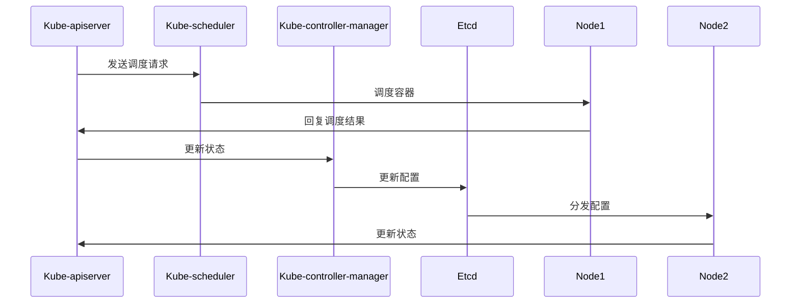

                 

### Kubernetes架构设计与实践

---

#### 关键词：
- Kubernetes
- 架构设计
- 实践应用
- 微服务
- 运维管理

#### 摘要：
本文将深入探讨Kubernetes的架构设计与实践。我们将从基础概念开始，逐步讲解Kubernetes的搭建、核心功能、高级应用以及运维管理。同时，通过案例分析，总结最佳实践，并展望Kubernetes的未来发展。希望通过本文，读者能够全面了解Kubernetes，掌握其在实际项目中的应用。

---

## 第一部分: Kubernetes概述

### 第1章: Kubernetes简介

Kubernetes（简称K8s）是一个开源的容器编排平台，由Google设计并捐赠给Cloud Native Computing Foundation（CNCF）进行维护。其核心价值在于自动化容器操作，如部署、扩展和管理容器化应用程序。Kubernetes采用控制器模式，通过各种控制器（如ReplicaSet、Deployment、Service等）来实现对容器集群的管理。

#### Kubernetes的概念与核心价值

Kubernetes的主要概念包括：

- **节点（Node）**：运行Kubernetes工作负载的物理或虚拟机。
- **Pod**：Kubernetes中的最小工作单元，一个Pod可以包含一个或多个容器。
- **ReplicaSet**：确保在任何时候都有指定数量的Pod副本运行。
- **Deployment**：提供声明式更新和管理ReplicaSet的方式。

Kubernetes的核心价值体现在以下几个方面：

- **高可用性**：通过自动调度和故障转移，确保应用程序的持续运行。
- **弹性伸缩**：根据需求自动调整容器数量，提高资源利用率。
- **服务发现和负载均衡**：通过Service和Ingress实现服务的自动发现和负载均衡。
- **声明式API**：通过YAML文件定义应用程序的状态，简化了部署和管理。

#### Kubernetes的历史背景与发展趋势

Kubernetes起源于Google内部的Borg系统，Google在2014年将Kubernetes开源，并迅速获得了社区的广泛关注和参与。截至2023，Kubernetes已成为最流行的容器编排平台，广泛应用于云计算、大数据、物联网等领域。

未来，Kubernetes将持续融合云原生技术，如服务网格（Service Mesh）、持续集成和持续部署（CI/CD）等，进一步提升自动化和智能化水平。

#### Kubernetes的核心组件与架构

Kubernetes的核心组件包括：

- **控制平面（Control Plane）**：由Kube-apiserver、Kube-scheduler、Kube-controller-manager和Etcd组成，负责集群的总体管理。
- **节点组件**：包括Kubelet、Kube-proxy和Container Runtime（如Docker、rkt等），负责节点上的容器管理。

Kubernetes的架构如图所示：



#### Kubernetes与传统虚拟化技术的对比

与传统的虚拟化技术（如VMware、Xen等）相比，Kubernetes具有以下优势：

- **轻量级**：Kubernetes通过容器实现虚拟化，无需额外的操作系统层，降低资源消耗。
- **动态性**：Kubernetes支持自动伸缩和动态调度，提高资源利用率。
- **分布式**：Kubernetes支持跨多个节点部署和管理容器，实现真正的分布式计算。

然而，传统虚拟化技术仍然在一些场景下具有优势，如安全隔离、多租户等。选择虚拟化技术时，应根据具体需求进行权衡。

### 第2章: Kubernetes集群的搭建

在搭建Kubernetes集群时，我们可以选择使用Kubeadm工具进行自动化部署。以下是一个简单的集群搭建流程：

#### Kubernetes集群搭建流程

1. **环境准备**：确保所有节点均已安装Docker等容器运行时。
2. **初始化Master节点**：
    ```shell
    kubeadm init --pod-network-cidr=10.244.0.0/16
    ```
3. **安装网络插件**：如Flannel、Calico等。
4. **配置kubectl**：
    ```shell
    mkdir -p $HOME/.kube
    sudo cp -i /etc/kubernetes/admin.conf $HOME/.kube/config
    sudo chown $(id -u):$(id -g) $HOME/.kube/config
    ```
5. **初始化Worker节点**：
    ```shell
    kubeadm join <master-node-ip>:<master-node-port> --token <token> --discovery-token-ca-cert-hash sha256:<hash>
    ```

#### 集群节点角色分配与配置

在Kubernetes集群中，通常有以下几种节点角色：

- **Master节点**：负责集群的管理和控制，包括Kube-apiserver、Kube-scheduler、Kube-controller-manager等。
- **Worker节点**：负责运行Pod和容器，由Kubelet管理。

Master节点和Worker节点的配置方法基本相同，但需要注意以下事项：

- **Master节点**：需要配置TLS认证，确保集群的安全性。
- **Worker节点**：需要加入集群，并确保Kubelet、Kube-proxy等组件正常运行。

#### 集群网络配置与容器编排

Kubernetes集群的网络配置通常由网络插件完成，如Flannel、Calico等。以下是一个简单的Flannel网络插件配置示例：

1. **安装Flannel**：
    ```shell
    kubectl apply -f https://raw.githubusercontent.com/coreos/flannel/master/Documentation/kube-flannel.yml
    ```

2. **验证网络配置**：
    ```shell
    kubectl get pods -n kube-system
    ```

3. **部署容器应用**：
    ```shell
    kubectl apply -f <your-app-yaml-file>.yaml
    ```

通过以上步骤，我们可以搭建一个简单的Kubernetes集群，并使用容器编排功能部署和管理容器应用。

### 第3章: Kubernetes核心概念

#### Pod的概念与操作

Pod是Kubernetes中的最小工作单元，可以包含一个或多个容器。Pod的主要作用是封装应用程序及其依赖项，确保它们在同一个环境中运行。

#### Deployment的管理与部署

Deployment是Kubernetes中用于管理Pod的主要方式，它提供了一种声明式的方式来更新和管理Pod副本。

#### Service的负载均衡与访问控制

Service用于将集群内部的不同Pod实例暴露给外部网络，实现负载均衡和访问控制。Service可以通过以下命令创建：

```shell
kubectl create service nodeport --name=<service-name> -- selector=<selector> --publish-node-port=<port>
```

#### Ingress的内部网络访问

Ingress用于管理集群内部网络的入口，可以实现外部访问控制、重定向等。

### 第4章: Kubernetes高级功能

#### Kubernetes StatefulSets的使用

StatefulSets是Kubernetes中用于管理有状态应用程序的主要方式，它提供了稳定的网络标识和持久存储。

#### Kubernetes DaemonSets的应用

DaemonSets用于在每个节点上部署一个或多个Pod副本，常用于日志收集、监控等场景。

#### Kubernetes Horizontal Pod Autoscaler的使用

Horizontal Pod Autoscaler（HPA）用于根据CPU使用率等指标自动调整Pod副本数量，实现弹性伸缩。

#### Kubernetes Job和CronJob的调度

Job用于运行一次性的任务，CronJob用于周期性运行的任务。

## 第二部分: Kubernetes实践应用

### 第5章: Kubernetes在微服务架构中的应用

Kubernetes为微服务架构提供了强大的支持，通过自动部署、伸缩和管理，提高了系统的可靠性和灵活性。

### 第6章: Kubernetes运维管理

Kubernetes运维管理包括集群监控、日志管理、备份与恢复、故障排查等方面。

### 第7章: Kubernetes案例分析

通过实际应用案例，分析Kubernetes在不同业务场景下的应用，总结最佳实践。

## 第三部分: Kubernetes展望与未来

### 第9章: Kubernetes生态与技术发展趋势

Kubernetes生态不断丰富，与云原生技术融合，未来将持续推动技术创新。

### 第10章: Kubernetes在中国的发展与挑战

Kubernetes在中国市场具有广阔的应用前景，但同时也面临着一些技术挑战和发展机遇。

## 附录：Kubernetes常用命令与工具

附录部分将介绍Kubernetes常用的命令行工具、配置文件以及插件和工具。

---

以上是Kubernetes架构设计与实践的全景概述，后续章节将深入探讨每个部分的核心概念和实际应用。希望本文能帮助读者全面了解Kubernetes，并掌握其在实际项目中的应用。作者：AI天才研究院/AI Genius Institute & 禅与计算机程序设计艺术 /Zen And The Art of Computer Programming。

