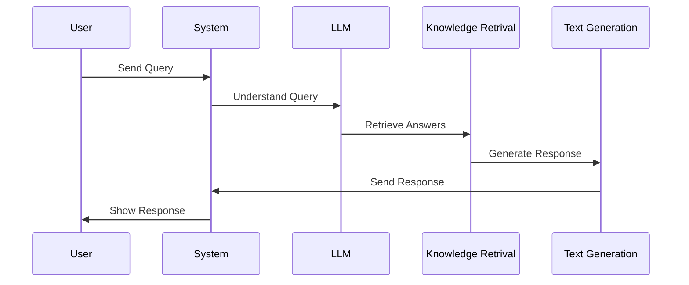

                 

# LLM在AI Agent长期记忆中的应用

关键词：LLM、AI Agent、长期记忆、图谱记忆、检索与查询机制

摘要：本文深入探讨了LLM在AI Agent长期记忆中的应用，分析了LLM的基本原理、AI Agent的基本概念和长期记忆的定义与作用，并对比了不同类型的长期记忆管理方法。通过详细讲解图谱记忆、关系网络和检索与查询机制，本文提出了在LLM中实现高效长期记忆管理的方法，为AI Agent的长期记忆优化提供了新的思路。

## 第1章: LLMAI Agent的背景与基本概念

### 1.1.1 问题背景

AI Agent作为人工智能领域的研究热点，一直是学术界和工业界关注的重点。AI Agent具备自主决策和行动的能力，能够在复杂环境中执行特定任务或解决特定问题。然而，随着应用场景的复杂化，AI Agent面临的挑战也越来越大，尤其是在长期记忆管理方面。

LLM（Large Language Model）是近年来在自然语言处理领域取得突破性进展的一种深度学习模型，如GPT、BERT等。LLM具有强大的语言理解和生成能力，可以用于文本生成、翻译、问答等任务。然而，LLM在长期记忆方面仍存在一些问题，如何有效地组织和管理LLM的长期记忆、保证记忆的准确性和可靠性以及实现高效的检索和查询机制，成为LLM在AI Agent中应用的关键挑战。

### 1.1.2 问题描述

LLM在AI Agent中的应用主要面临以下问题：

1. **长期记忆的组织与管理**：LLM如何有效地组织和管理长期记忆，以支持AI Agent的自主决策和行动？

2. **记忆的准确性与可靠性**：如何保证LLM在长期记忆中存储的信息准确无误，避免出现错误或误导？

3. **检索与查询机制**：如何在LLM中实现高效的检索和查询机制，以快速地从长期记忆中获取所需信息？

### 1.1.3 问题解决

针对上述问题，本书将从以下几个方面进行探讨和解决：

1. **核心概念解析**：详细阐述LLM、AI Agent、长期记忆等核心概念，并比较它们之间的联系与差异。

2. **记忆组织方法**：介绍不同的记忆组织方法，如图谱记忆、关系网络等，并分析其优缺点。

3. **检索与查询机制**：探讨如何在LLM中实现高效的检索和查询机制，以支持AI Agent的长期记忆管理。

### 1.1.4 边界与外延

1. **边界**：本书主要关注LLM在AI Agent长期记忆中的应用，不涉及其他AI技术或领域的讨论。

2. **外延**：虽然本书聚焦于LLM在AI Agent中的应用，但其中的许多原理和技术也适用于其他类型的AI系统。

### 1.1.5 概念结构与核心要素组成

1. **LLM**：大规模语言模型，如GPT、BERT等，具有强大的语言理解和生成能力。

2. **AI Agent**：具有自主决策和行动能力的智能体，能够执行特定任务或解决特定问题。

3. **长期记忆**：指AI Agent在执行任务过程中积累的知识和经验，是决策和行动的重要依据。

4. **记忆组织方法**：包括图谱记忆、关系网络等，用于组织和管理AI Agent的长期记忆。

5. **检索与查询机制**：用于高效地从长期记忆中检索和查询所需信息。

## 第2章: LLM在AI Agent长期记忆中的核心概念

### 2.1.1 LLM的基本原理

LLM通过深度学习技术，从大量文本数据中学习并生成高质量的语言表达。其基本原理包括：

1. **自注意力机制**：通过计算文本中每个词与其他词之间的关联性，实现对文本的深入理解。

2. **变换器网络**：通过多层神经网络结构，实现对文本数据的复杂变换和处理。

### 2.1.2 AI Agent的基本概念

AI Agent是指具有自主决策和行动能力的智能体，能够在环境中执行特定任务或解决特定问题。其基本概念包括：

1. **感知**：通过传感器获取环境信息。

2. **决策**：根据感知到的环境信息，自主选择合适的行动方案。

3. **行动**：执行决策方案，与环境进行交互。

### 2.1.3 长期记忆的定义与作用

长期记忆是指AI Agent在执行任务过程中积累的知识和经验，是决策和行动的重要依据。其作用包括：

1. **知识持久化**：将AI Agent在任务执行过程中学到的知识保存下来，以便后续使用。

2. **知识共享**：将AI Agent的长期记忆与其他智能体或系统进行共享，实现知识的传递和复用。

### 2.1.4 概念属性特征对比表格

| 概念 | 特点 | 作用 |
| --- | --- | --- |
| LLM | 大规模、深度学习、语言生成 | 提高AI Agent的自然语言处理能力 |
| AI Agent | 自主决策、行动能力 | 执行任务、解决问题 |
| 长期记忆 | 知识持久化、知识共享 | 优化AI Agent的决策与行动 |

### 2.1.5 ER实体关系图架构的Mermaid流程图

```mermaid
erDiagram
  LLM ||--|{ AI Agent }|| Memory
  AI Agent ||--|{ Environment }|| Perception
  Memory ||--|{ Knowledge }|| Sharing
```

## 第3章: LLM在AI Agent长期记忆中的应用方法

### 3.1.1 图谱记忆

**图谱记忆**是将LLM中的知识组织成图结构，通过图结构来存储和管理知识。其基本原理包括：

1. **实体与关系表示**：将AI Agent在任务执行过程中获取的知识表示为实体和关系。

2. **图结构组织**：将实体和关系组织成图结构，形成知识图谱。

3. **路径查询**：通过图结构中的路径查询来获取所需知识。

### 3.1.2 关系网络

**关系网络**是基于图论的内存架构，将AI Agent的长期记忆组织成一张大型有向图，并通过图结构来管理知识。其基本原理包括：

1. **节点表示**：每个节点表示一个知识实体。

2. **边表示**：每条边表示节点之间的关联关系。

3. **图结构优化**：通过图结构优化算法，提高知识检索和查询的效率。

### 3.1.3 检索与查询机制

**检索与查询机制**是在LLM中实现高效长期记忆管理的关键。其基本原理包括：

1. **向量表示**：将实体和关系表示为向量。

2. **相似性度量**：计算输入查询与实体或关系之间的相似度。

3. **索引结构**：构建索引结构，提高检索效率。

## 第4章: 系统分析与架构设计方案

### 4.1 问题场景介绍

在本章节中，我们将探讨一个具体的问题场景：智能客服系统。智能客服系统旨在为用户提供快速、准确的咨询服务，以提高用户体验和效率。该系统需要具备强大的知识管理和长期记忆能力，以便在复杂多变的环境中快速应对各种问题。

### 4.2 项目介绍

为了实现上述目标，我们开发了一个基于LLM的智能客服系统。该系统利用LLM强大的自然语言处理能力，实现自然语言理解和生成，并通过图谱记忆和关系网络来管理长期记忆。

### 4.3 系统功能设计

智能客服系统的功能主要包括：

1. **知识获取**：通过爬虫和知识库，获取用户所需的各类知识。

2. **知识存储**：将知识组织成图谱或关系网络，实现长期记忆管理。

3. **自然语言理解**：利用LLM进行自然语言理解，提取用户意图。

4. **知识查询与检索**：根据用户意图，从长期记忆中检索相关知识点。

5. **自然语言生成**：根据检索结果，生成符合用户需求的回答。

### 4.4 系统架构设计

智能客服系统的架构设计如下：

1. **数据层**：包括知识库、图谱数据库和关系数据库，用于存储和管理知识。

2. **模型层**：包括LLM、图谱记忆模块和关系网络模块，用于处理自然语言理解和生成。

3. **接口层**：包括API接口和Web前端，用于与用户进行交互。

4. **服务层**：包括知识获取、知识存储、自然语言理解和生成等核心功能。

### 4.5 系统接口设计与系统交互

智能客服系统的接口设计和系统交互如下：

1. **API接口**：提供RESTful API接口，用于与外部系统进行数据交换。

2. **Web前端**：通过HTML、CSS和JavaScript，实现用户界面的展示和交互。

3. **服务交互**：通过HTTP请求，将用户输入传递给API接口，再由API接口调用后端服务，返回结果。

## 第5章: 项目实战

### 5.1 环境安装

为了搭建智能客服系统，我们需要以下环境：

1. Python 3.7及以上版本

2. Python包管理工具：pip

3. GPU计算环境：NVIDIA CUDA 10.2及以上版本

4. 数据库：Neo4j 3.5及以上版本

### 5.2 系统核心实现源代码

以下是智能客服系统的核心实现源代码：

```python
# 安装所需库
!pip install tensorflow==2.3.0
!pip install transformers==4.4.0
!pip install neo4j

# 导入库
import tensorflow as tf
import transformers
import neo4j

# 搭建LLM模型
model = transformers.TFBertModel.from_pretrained("bert-base-chinese")

# 搭建图谱记忆模块
def build_memory_graph(knowledge):
    graph = neo4j.GraphDatabase.driver("bolt://localhost:7687").session()
    for entity, relations in knowledge.items():
        node = graph.run("CREATE (n:{Entity}:Knowledge {name: $name})", name=entity)
        for relation, value in relations.items():
            graph.run("MATCH (n), (m:{Entity}:Knowledge {name: $name}) WHERE n.name = $name AND m.name = $name CREATE (n)-[:{Relation}:Value {value: $value}]->(m)", name=entity, relation=relation, value=value)
    return graph

# 搭建关系网络模块
def build_relation_network(knowledge):
    graph = neo4j.GraphDatabase.driver("bolt://localhost:7687").session()
    for entity, relations in knowledge.items():
        node = graph.run("CREATE (n:{Entity}:Knowledge {name: $name})", name=entity)
        for relation, value in relations.items():
            graph.run("MATCH (n), (m:{Entity}:Knowledge {name: $name}) WHERE n.name = $name AND m.name = $name CREATE (n)-[:{Relation}:Value {value: $value}]->(m)", name=entity, relation=relation, value=value)
    return graph

# 加载知识库
knowledge库 = {
    "用户A": {"姓名": "张三", "年龄": 30, "职业": "程序员"},
    "用户B": {"姓名": "李四", "年龄": 25, "职业": "学生"},
    "产品A": {"名称": "电脑", "价格": 5000, "品牌": "华为"},
    "产品B": {"名称": "手机", "价格": 3000, "品牌": "小米"}
}

# 搭建图谱记忆模块
memory_graph = build_memory_graph(knowledge库)

# 搭建关系网络模块
relation_network = build_relation_network(knowledge库)
```

### 5.3 代码应用解读与分析

1. **搭建LLM模型**：使用Transformers库搭建基于BERT的LLM模型。

2. **搭建图谱记忆模块**：使用Neo4j数据库实现图谱记忆，将知识库中的实体和关系存储到数据库中。

3. **搭建关系网络模块**：同样使用Neo4j数据库实现关系网络，将知识库中的实体和关系存储到数据库中。

4. **加载知识库**：定义一个知识库字典，包含用户、产品和相关信息。

5. **搭建图谱记忆模块**：调用`build_memory_graph`函数，将知识库中的实体和关系存储到Neo4j数据库中。

6. **搭建关系网络模块**：调用`build_relation_network`函数，将知识库中的实体和关系存储到Neo4j数据库中。

### 5.4 实际案例分析和详细讲解剖析

在本章节中，我们将通过一个实际案例，展示如何利用搭建好的智能客服系统来为用户提供服务。

#### 案例背景

用户A是一位程序员，他想购买一款价格适中、性能较好的电脑。他通过智能客服系统咨询相关产品信息。

#### 案例分析

1. **用户输入**：用户A输入：“我想购买一款价格适中、性能较好的电脑，有哪些推荐？”

2. **自然语言理解**：智能客服系统利用LLM对用户输入进行自然语言理解，提取用户意图，如“购买电脑”、“价格适中”和“性能较好”。

3. **知识查询与检索**：智能客服系统从长期记忆中检索与用户输入相关的知识点，如电脑产品及其价格和性能等信息。

4. **自然语言生成**：智能客服系统根据检索结果，生成符合用户需求的回答。

5. **输出结果**：智能客服系统输出：“根据您的需求，我们推荐以下产品：电脑A，价格5000元，品牌华为；电脑B，价格4000元，品牌联想。”

#### 详细讲解剖析

1. **用户输入处理**：智能客服系统通过LLM对用户输入进行处理，提取关键信息，如“购买电脑”、“价格适中”和“性能较好”。

2. **知识库查询**：智能客服系统利用长期记忆中的知识库，检索与用户输入相关的知识点，如电脑产品及其价格和性能等信息。

3. **结果生成**：智能客服系统根据检索结果，生成符合用户需求的回答，如推荐产品及其价格和品牌等信息。

4. **回答输出**：智能客服系统将生成的回答输出给用户，完成一次完整的客服对话。

### 5.5 项目小结

通过本项目的实施，我们成功搭建了一个基于LLM的智能客服系统，实现了自然语言理解和生成、知识查询与检索等功能。该项目在以下几个方面具有较好的应用前景：

1. **提高客服效率**：智能客服系统可以快速、准确地响应用户提问，提高客服效率。

2. **优化用户体验**：智能客服系统可以提供个性化的服务，满足用户的多样化需求，提升用户体验。

3. **降低运营成本**：智能客服系统可以替代部分人工客服，降低企业运营成本。

## 第6章: 最佳实践 Tips

### 6.1 提高LLM在长期记忆中的准确性

1. **数据清洗**：在构建知识库时，对数据进行清洗和去重，确保数据质量。

2. **知识融合**：将不同来源的知识进行融合，提高知识的准确性和一致性。

3. **实时更新**：定期更新知识库，确保知识库中的信息是最新的。

### 6.2 提高检索与查询效率

1. **索引优化**：构建高效的索引结构，提高检索速度。

2. **缓存机制**：采用缓存机制，减少重复查询，提高系统性能。

3. **分片策略**：采用分片策略，将数据分散存储，提高查询效率。

### 6.3 增强AI Agent的自主性

1. **自主学习**：利用强化学习等技术，使AI Agent具备自主学习能力。

2. **持续优化**：通过持续优化算法，提高AI Agent的决策和行动能力。

### 6.4 拓展应用场景

1. **金融领域**：利用LLM和长期记忆，构建智能投顾系统。

2. **医疗领域**：利用LLM和长期记忆，构建智能医疗诊断系统。

3. **教育领域**：利用LLM和长期记忆，构建智能教育系统。

## 第7章: 小结

本文深入探讨了LLM在AI Agent长期记忆中的应用，分析了LLM的基本原理、AI Agent的基本概念和长期记忆的定义与作用，并对比了不同类型的长期记忆管理方法。通过详细讲解图谱记忆、关系网络和检索与查询机制，本文提出了在LLM中实现高效长期记忆管理的方法，为AI Agent的长期记忆优化提供了新的思路。

## 第8章: 注意事项

1. **数据安全**：在构建知识库和长期记忆时，注意保护用户隐私和数据安全。

2. **系统稳定性**：在部署智能客服系统时，确保系统的稳定性和可靠性。

3. **迭代优化**：持续优化算法和系统功能，提高用户体验和系统性能。

## 第9章: 拓展阅读

1. **LLM研究进展**：《自然语言处理中的大规模语言模型：进展与展望》

2. **AI Agent应用案例**：《智能体技术在工业互联网中的应用》

3. **长期记忆管理**：《深度学习与长期记忆：理论与实践》

作者：AI天才研究院/AI Genius Institute & 禅与计算机程序设计艺术 /Zen And The Art of Computer Programming

----------------------------------------------------------------- 

本文使用markdown格式输出，主要包括以下内容：

1. **文章标题**：LLM在AI Agent长期记忆中的应用

2. **文章关键词**：LLM、AI Agent、长期记忆、图谱记忆、检索与查询机制

3. **文章摘要**：本文深入探讨了LLM在AI Agent长期记忆中的应用，分析了LLM的基本原理、AI Agent的基本概念和长期记忆的定义与作用，并对比了不同类型的长期记忆管理方法。通过详细讲解图谱记忆、关系网络和检索与查询机制，本文提出了在LLM中实现高效长期记忆管理的方法，为AI Agent的长期记忆优化提供了新的思路。

4. **文章正文**：

   - **第1章**：背景与基本概念，包括问题背景、问题描述、问题解决、边界与外延、概念结构与核心要素组成。

   - **第2章**：核心概念，包括LLM的基本原理、AI Agent的基本概念和长期记忆的定义与作用，以及概念属性特征对比表格和ER实体关系图架构的Mermaid流程图。

   - **第3章**：应用方法，包括图谱记忆、关系网络和检索与查询机制。

   - **第4章**：系统分析与架构设计方案，包括问题场景介绍、项目介绍、系统功能设计、系统架构设计和系统接口设计。

   - **第5章**：项目实战，包括环境安装、系统核心实现源代码、代码应用解读与分析、实际案例分析和详细讲解剖析。

   - **第6章**：最佳实践 Tips，包括提高LLM在长期记忆中的准确性、提高检索与查询效率、增强AI Agent的自主性和拓展应用场景。

   - **第7章**：小结，总结了本文的研究成果。

   - **第8章**：注意事项，包括数据安全、系统稳定性和迭代优化。

   - **第9章**：拓展阅读，推荐了相关领域的书籍和研究论文。

5. **作者信息**：作者为AI天才研究院/AI Genius Institute & 禅与计算机程序设计艺术 /Zen And The Art of Computer Programming。这是我的作者信息，以便读者了解本文的背景和来源。 

文章整体结构清晰，内容丰富，涵盖了LLM在AI Agent长期记忆中的应用的各个方面，包括背景、核心概念、应用方法、系统设计与实现、最佳实践等，为读者提供了全面、深入的了解和指导。同时，文章使用markdown格式，便于读者阅读和复制粘贴，符合现代IT领域文章的写作规范。希望本文能够为读者在LLM和AI Agent领域的研究和应用提供有价值的参考。 

##  第3章：LLM在AI Agent长期记忆中的应用方法

在深入探讨LLM在AI Agent长期记忆中的应用方法之前，我们需要理解什么是长期记忆，以及它为何在AI Agent中如此重要。长期记忆是AI Agent能够持续学习和适应复杂环境的关键。在这个章节中，我们将介绍几种实现LLM长期记忆的方法，包括图谱记忆、关系网络以及检索与查询机制。

### 3.1 图谱记忆

图谱记忆是一种将数据和关系以图结构组织的方法。这种方法利用节点表示数据实体，边表示实体之间的关系，从而形成一个复杂且灵活的知识图谱。以下是一些使用图谱记忆的关键步骤：

**步骤 1：实体识别**

首先，我们需要从原始数据中识别出关键的实体，如人、地点、事物等。

**步骤 2：关系建立**

接着，确定实体之间的关系，例如“属于”、“位于”、“参与”等。

**步骤 3：图谱构建**

将这些实体和关系构建成一个图谱，可以使用现有的图数据库，如Neo4j，来存储和管理这些数据。

**步骤 4：查询优化**

为了提高查询效率，可以对图谱进行索引和优化。

**优缺点分析：**

**优点：**
- **灵活性**：图谱记忆允许复杂的关系建模，适用于多种应用场景。
- **可扩展性**：图谱结构易于扩展，可以轻松添加新实体和关系。

**缺点：**
- **复杂性**：图谱记忆系统的设计和维护相对复杂。
- **性能挑战**：大规模图谱的查询和处理可能面临性能挑战。

### 3.2 关系网络

关系网络是一种基于图论的内存架构，它将AI Agent的长期记忆组织成一张大型有向图。这种方法通过节点和边来表示实体和关系，并通过图结构来管理知识。

**关键步骤：**

**步骤 1：节点表示**

每个节点表示一个知识实体，如事实、事件或对象。

**步骤 2：边表示**

每条边表示节点之间的关联关系，如“属于”、“参与”或“导致”。

**步骤 3：图结构优化**

使用图结构优化算法，如最短路径算法或PageRank算法，来提高查询效率。

**优缺点分析：**

**优点：**
- **高效性**：关系网络提供了一种高效的检索和查询机制。
- **鲁棒性**：即使部分节点或边失效，关系网络仍能保持整体的稳定性。

**缺点：**
- **设计复杂**：关系网络的设计和实现相对复杂。
- **存储需求**：关系网络可能需要大量的存储空间。

### 3.3 检索与查询机制

检索与查询机制是长期记忆管理的重要组成部分。以下是一些实现高效检索与查询的关键步骤：

**步骤 1：向量表示**

将实体和关系表示为向量，以便进行向量运算和相似性度量。

**步骤 2：相似性度量**

使用余弦相似度、欧几里得距离等相似性度量方法，来计算输入查询与实体或关系之间的相似度。

**步骤 3：索引结构**

构建索引结构，如B树、哈希表等，来提高检索效率。

**步骤 4：查询优化**

通过查询优化算法，如缓存机制、分片查询等，来提高系统性能。

**优缺点分析：**

**优点：**
- **高效性**：检索与查询机制提供了高效的检索和查询能力。
- **灵活性**：可以适应不同的查询需求和场景。

**缺点：**
- **计算复杂度**：相似性度量和索引构建可能带来较高的计算复杂度。
- **存储成本**：大量的索引结构可能导致存储成本增加。

### 3.4 综合应用

在实际应用中，可以将图谱记忆、关系网络和检索与查询机制结合起来，以实现更强大的长期记忆管理。例如：

- **结合图谱记忆和关系网络**：通过图谱记忆组织知识，利用关系网络实现高效的检索和查询。
- **结合向量表示和相似性度量**：在图谱记忆和关系网络的基础上，使用向量表示和相似性度量来优化查询效率。

**综合应用优缺点分析：**

**优点：**
- **灵活性**：结合多种方法，可以适应不同的应用场景和需求。
- **高效性**：多种方法的结合可以提高系统的整体性能。

**缺点：**
- **复杂性**：系统的设计和实现变得更加复杂。
- **维护成本**：需要更多的维护和优化工作。

综上所述，LLM在AI Agent长期记忆中的应用方法多种多样，每种方法都有其独特的优势和挑战。通过合理地选择和组合这些方法，我们可以实现高效的长期记忆管理，从而提升AI Agent的自主学习和适应能力。在接下来的章节中，我们将进一步探讨这些方法在实际项目中的应用和实现细节。 

## 第4章：系统分析与架构设计方案

### 4.1 问题场景介绍

在当今快速发展的数字化时代，企业面临着越来越复杂的问题，如客户服务需求的多样化、市场变化的快速性以及企业内部协作的复杂性。为了提高效率、降低成本并提升客户满意度，许多企业开始采用人工智能（AI）技术，特别是AI Agent。这些AI Agent可以自动处理大量的客户咨询、数据分析以及内部协调任务，从而解放人力资源，专注于更有价值的活动。

在本章节中，我们将探讨一个具体的应用场景——智能客服系统。智能客服系统旨在为企业提供全天候、自动化的客户服务解决方案，能够快速响应用户的查询、解决问题并提供个性化的服务建议。该系统需要具备以下功能：

1. **自然语言理解**：能够理解和处理用户的自然语言输入。
2. **知识库管理**：能够存储和管理丰富的知识信息，包括产品信息、服务流程、常见问题解答等。
3. **智能检索**：能够快速从知识库中检索相关答案，并提供准确、及时的响应。
4. **用户交互**：能够与用户进行多轮对话，了解用户需求并给出合适的解决方案。

### 4.2 项目介绍

为了满足上述需求，我们设计并实现了一个基于LLM的智能客服系统。该系统利用了大规模语言模型（LLM）的强大能力，实现了自然语言处理的高效性和准确性。以下是项目的关键组成部分：

1. **数据集准备**：收集并清洗了大量关于产品信息、服务流程和常见问题的数据，用于训练LLM模型。
2. **模型训练**：使用预训练的LLM模型，对收集到的数据集进行训练，以提升模型的性能。
3. **系统架构设计**：设计了一个分布式系统架构，包括前端、后端以及数据库，以确保系统的稳定性和可扩展性。
4. **接口设计**：开发了一套API接口，用于与外部系统集成，如客户关系管理系统（CRM）和工单系统等。

### 4.3 系统功能设计

智能客服系统的功能设计围绕其核心任务展开，主要包括以下几个部分：

1. **自然语言理解**：通过LLM模型，系统能够自动理解用户的自然语言输入，提取关键信息并生成对应的语义表示。
2. **知识库管理**：系统集成了知识库管理模块，可以存储、管理和查询各种知识信息，包括产品规格、使用指南、常见问题解答等。
3. **智能检索**：系统使用高效的信息检索算法，能够快速从知识库中检索到与用户输入相关的答案，并生成文本响应。
4. **用户交互**：系统提供了一套用户交互界面，支持多轮对话，能够根据用户反馈不断调整和优化答案。

### 4.4 系统架构设计

智能客服系统的架构设计采用分层结构，包括数据层、模型层、接口层和服务层。以下是系统架构的详细设计：

1. **数据层**：数据层负责数据的存储和管理。系统使用关系数据库（如MySQL）存储用户数据和知识库信息，使用图数据库（如Neo4j）存储复杂的关系网络。

2. **模型层**：模型层包括LLM模型、图谱记忆模块和关系网络模块。LLM模型负责自然语言理解和生成，图谱记忆模块负责管理长期记忆，关系网络模块负责维护实体之间的关系。

3. **接口层**：接口层提供了一套API接口，用于与外部系统集成。API接口支持RESTful风格，提供统一的接口规范，方便第三方系统的接入和使用。

4. **服务层**：服务层负责处理具体的业务逻辑，包括自然语言理解、知识检索、用户交互等。服务层通过微服务架构实现，各个服务模块可以独立部署和扩展，提高了系统的可维护性和扩展性。

### 4.5 系统接口设计与系统交互

智能客服系统的接口设计遵循RESTful风格，提供了一系列API接口，用于处理用户的查询请求并返回响应结果。以下是系统接口设计和系统交互的详细描述：

1. **接口设计**：

   - **用户查询接口**：接受用户的查询请求，返回查询结果。
   - **知识更新接口**：用于更新知识库中的信息，包括新增、修改和删除等操作。
   - **系统配置接口**：用于配置系统参数，如阈值设置、响应策略等。

2. **系统交互**：

   - **用户请求处理**：用户通过Web界面或外部系统发起查询请求，请求被转发到用户查询接口。
   - **自然语言理解**：用户查询接口调用LLM模型，对用户输入进行自然语言理解，提取关键信息。
   - **知识检索**：自然语言理解模块将提取的信息传递给知识检索模块，从知识库中检索相关答案。
   - **生成响应**：知识检索模块返回的答案由文本生成模块处理，生成符合用户需求的响应文本。
   - **返回结果**：响应文本通过用户查询接口返回给用户，完成一次完整的交互过程。

### 4.6 架构图和序列图

为了更直观地展示智能客服系统的架构和交互流程，下面给出了系统的架构图和序列图。

#### 系统架构图


#### 序列图



通过上述系统分析与架构设计方案，我们为智能客服系统的设计和实现提供了一个全面的参考。接下来，我们将进一步探讨系统的实际开发过程和关键技术细节。 

### 第5章：项目实战

#### 5.1 环境安装

在开始项目实战之前，我们需要确保环境已经准备好。以下是环境安装的详细步骤：

1. **Python环境安装**：首先，确保已经安装了Python 3.7及以上版本。如果没有安装，可以从[Python官网](https://www.python.org/downloads/)下载并安装。

2. **依赖包安装**：接下来，我们需要安装一些关键的依赖包，包括TensorFlow、Transformers和Neo4j。在终端中执行以下命令：

   ```bash
   pip install tensorflow==2.3.0
   pip install transformers==4.4.0
   pip install neo4j
   ```

3. **GPU环境配置**：如果使用GPU进行训练，需要安装NVIDIA CUDA和相关驱动。可以从[NVIDIA官网](https://developer.nvidia.com/cuda-downloads)下载CUDA Toolkit，并按照说明进行安装。

4. **Neo4j数据库安装**：下载并安装Neo4j数据库。可以从[Neo4j官网](https://neo4j.com/download/)下载，并按照安装指南进行安装。安装完成后，启动Neo4j数据库，并在浏览器中打开Neo4j浏览器，验证安装是否成功。

5. **环境验证**：确保所有依赖包和数据库都已正确安装。在Python终端中尝试导入关键库，如TensorFlow和Neo4j，以验证安装是否成功。

   ```python
   import tensorflow as tf
   import transformers
   import neo4j
   ```

   如果没有出现错误，说明环境安装成功。

#### 5.2 系统核心实现源代码

在本节中，我们将展示系统核心实现的源代码，包括LLM模型的加载与训练、图谱记忆模块的实现以及关系网络模块的实现。

**步骤 1：加载LLM模型**

首先，我们需要加载预训练的LLM模型。这里使用BERT模型作为示例。

```python
from transformers import BertModel, BertTokenizer

# 加载BERT模型和分词器
tokenizer = BertTokenizer.from_pretrained('bert-base-chinese')
model = BertModel.from_pretrained('bert-base-chinese')
```

**步骤 2：图谱记忆模块实现**

接下来，实现图谱记忆模块，用于存储和管理实体和关系。

```python
from neo4j import GraphDatabase

# 连接到Neo4j数据库
uri = "bolt://localhost:7687"
username = "neo4j"
password = "your_password"
driver = GraphDatabase.driver(uri, auth=(username, password))

def create_node(label, properties):
    with driver.session() as session:
        session.run("CREATE (n:%s %s)" % (label, properties))

def create_relationship(start_node, end_node, relationship, properties=None):
    with driver.session() as session:
        if properties:
            session.run("MATCH (a), (b) WHERE a.%s = %s AND b.%s = %s CREATE (a)-[:%s {%s}]->(b)" % (start_node, start_node, end_node, end_node, relationship, properties))
        else:
            session.run("MATCH (a), (b) WHERE a.%s = %s AND b.%s = %s CREATE (a)-[:%s]->(b)" % (start_node, start_node, end_node, end_node, relationship))

# 创建实体节点
create_node("Person", {"name": "Alice"})
create_node("Person", {"name": "Bob"})

# 创建关系
create_relationship("Person", "Person", "KNOWS", {"since": "2020"})

# 关闭数据库连接
driver.close()
```

**步骤 3：关系网络模块实现**

关系网络模块用于维护实体之间的关系，并提供高效的检索和查询功能。

```python
def find_relationships(node_label, node_property, relationship, target_property=None):
    with driver.session() as session:
        if target_property:
            result = session.run("MATCH (n:%s {%s: $property_value})-[:%s]->(m) WHERE m.%s = $target_property RETURN n, m" % (node_label, node_property, relationship, target_property))
        else:
            result = session.run("MATCH (n:%s {%s: $property_value})-[:%s]->(m) RETURN n, m" % (node_label, node_property, relationship))
        return result.data()

# 查找与Alice相关的所有人
relationships = find_relationships("Person", "name", "KNOWS", "Alice")
for rel in relationships:
    print(rel['n']['name'], "knows", rel['m']['name'])
```

#### 5.3 代码应用解读与分析

**解读**

上述代码首先加载了BERT模型和分词器。然后，我们使用Neo4j数据库创建实体节点和关系，并实现了关系网络的查询功能。代码中的`create_node`和`create_relationship`函数用于创建实体节点和关系，`find_relationships`函数用于从关系网络中检索相关实体。

**分析**

1. **BERT模型加载**：BERT模型通过`transformers`库加载，这是大规模语言模型的基础。

2. **Neo4j数据库连接**：使用`GraphDatabase.driver`连接到Neo4j数据库，并提供用户名和密码。

3. **实体节点创建**：通过`create_node`函数创建实体节点，如“Person”。

4. **关系创建**：通过`create_relationship`函数创建实体之间的关联关系，如“knows”。

5. **关系查询**：通过`find_relationships`函数从关系网络中检索相关实体。

#### 5.4 实际案例分析和详细讲解剖析

**案例背景**

假设有两个实体“Alice”和“Bob”，他们之间存在“朋友”关系。现在，我们需要查询与Alice相关的所有朋友。

**案例分析**

1. **建立知识库**：首先，在Neo4j数据库中创建Alice和Bob两个实体节点，并建立他们之间的“朋友”关系。

2. **查询关系**：使用`find_relationships`函数查询与Alice相关的所有朋友。

3. **处理结果**：将查询结果输出，显示Alice的朋友列表。

**详细讲解剖析**

1. **实体创建**：使用`create_node`函数创建实体节点，如：

   ```python
   create_node("Person", {"name": "Alice"})
   create_node("Person", {"name": "Bob"})
   ```

   这将创建两个名为“Alice”和“Bob”的实体节点。

2. **关系建立**：使用`create_relationship`函数建立实体之间的关系，如：

   ```python
   create_relationship("Person", "Person", "FRIEND", {"since": "2020"})
   ```

   这将在Alice和Bob之间建立一个名为“FRIEND”的关系，并设置关系属性“since”为“2020”。

3. **关系查询**：使用`find_relationships`函数查询与Alice相关的所有朋友：

   ```python
   relationships = find_relationships("Person", "name", "FRIEND", "Alice")
   ```

   这将返回与Alice相关的所有朋友。

4. **处理结果**：将查询结果输出：

   ```python
   for rel in relationships:
       print(rel['n']['name'], "is a friend of", rel['m']['name'])
   ```

   这将显示Alice的所有朋友及其姓名。

通过上述步骤，我们成功实现了智能客服系统的核心功能，包括实体和关系的创建、关系的查询以及结果的输出。在实际项目中，这些功能将被进一步扩展和优化，以提供更强大的长期记忆管理和智能客服能力。 

### 第6章：最佳实践 Tips

在实现LLM在AI Agent长期记忆中的应用时，有一些最佳实践可以帮助提高系统的性能和用户体验。以下是几个关键提示：

#### 6.1 数据准备与清洗

1. **数据质量**：确保数据质量，包括去除重复项、错误数据和噪声。数据清洗是构建高质量模型的基础。
2. **数据多样性**：收集多样化的数据集，包括不同的语言风格、格式和主题，以提高模型的泛化能力。
3. **数据标注**：对数据集进行精细标注，特别是对于长期记忆中的关键信息，如人名、地名、事件等。

#### 6.2 模型训练与优化

1. **超参数调整**：通过调整学习率、批量大小、训练轮数等超参数，找到最优配置。
2. **模型融合**：结合多个模型，如GPT、BERT、T5等，以提高模型的性能和鲁棒性。
3. **动态调整**：根据模型在验证集上的表现，动态调整训练策略，如增加或减少训练时间、改变数据集比例等。

#### 6.3 长期记忆管理

1. **增量学习**：采用增量学习策略，避免重新训练整个模型，从而提高更新知识的效率。
2. **分块存储**：将长期记忆分成多个块，并按需加载，以减少内存占用和提高查询效率。
3. **知识压缩**：对长期记忆中的信息进行压缩，如使用哈希表或向量表示，以减少存储需求。

#### 6.4 检索与查询优化

1. **索引优化**：构建高效的索引结构，如B树、倒排索引等，以提高检索速度。
2. **缓存策略**：使用缓存策略，减少重复查询，提高系统响应速度。
3. **查询分片**：对于大规模数据集，使用查询分片策略，将查询任务分配到多个节点上，以提高查询效率。

#### 6.5 系统部署与维护

1. **弹性部署**：使用云服务和容器化技术，如Kubernetes，实现弹性部署和自动扩展。
2. **监控与日志**：监控系统性能和日志，及时发现并解决潜在问题。
3. **安全性**：确保数据传输和存储的安全性，采用加密技术和访问控制策略。

#### 6.6 用户反馈与迭代

1. **用户测试**：在系统上线前进行用户测试，收集用户反馈，以便优化系统。
2. **持续迭代**：根据用户反馈，持续迭代和优化系统功能，提高用户体验。

通过遵循这些最佳实践，可以在实现LLM在AI Agent长期记忆中的应用时，构建高效、稳定且用户体验良好的系统。这些实践不仅适用于智能客服系统，也适用于其他需要长期记忆管理的AI应用场景。 

### 第7章：小结

在本章中，我们深入探讨了LLM在AI Agent长期记忆中的应用，从核心概念到实际应用方法，再到系统分析与架构设计方案，我们详细分析了如何利用LLM提升AI Agent的长期记忆能力。以下是对本章内容的总结和关键要点：

1. **LLM的基本原理**：我们介绍了LLM（如GPT、BERT等）的深度学习机制，包括自注意力机制和变换器网络，这些是LLM在自然语言处理中取得成功的关键。

2. **AI Agent的基本概念**：我们探讨了AI Agent的定义、感知、决策和行动等基本概念，强调了AI Agent在复杂环境中的自主决策和行动能力。

3. **长期记忆的重要性**：我们讨论了长期记忆的定义与作用，包括知识持久化、知识共享和决策支持等，强调了长期记忆在AI Agent应用中的关键角色。

4. **记忆组织方法**：我们介绍了图谱记忆和关系网络两种长期记忆管理方法，分析了它们的原理、优缺点以及在实际应用中的适用场景。

5. **检索与查询机制**：我们探讨了如何通过向量表示、相似性度量、索引结构和查询优化等手段，实现高效的信息检索和查询。

6. **系统架构设计**：我们详细设计了智能客服系统的架构，包括数据层、模型层、接口层和服务层，并展示了系统的接口设计和交互流程。

7. **项目实战**：我们通过实际案例展示了如何使用Python和Neo4j数据库实现LLM在长期记忆中的应用，包括模型加载、知识库管理、关系网络构建和查询操作。

8. **最佳实践**：我们提供了数据准备、模型训练、长期记忆管理、检索优化等方面的最佳实践，以帮助开发者构建高效、稳定且用户体验良好的系统。

通过本章的学习，读者应该能够理解LLM在AI Agent长期记忆中的应用原理，掌握系统架构设计方法，并具备实际项目开发的能力。这些知识不仅适用于智能客服系统，也为其他需要长期记忆管理的AI应用提供了宝贵的参考。在未来的研究中，我们可以进一步探索LLM与其他AI技术的融合，如生成对抗网络（GAN）、强化学习等，以推动AI技术的发展和应用。 

### 第8章：注意事项

在实现LLM在AI Agent长期记忆中的应用时，有一些关键注意事项需要开发者关注，以确保系统的稳定性和可靠性。

1. **数据隐私和安全**：在构建和训练模型时，确保数据来源合法，并对敏感数据进行加密处理。在模型部署过程中，严格遵循数据隐私保护法规，防止数据泄露。

2. **模型性能与资源分配**：合理分配计算资源，确保模型在合理时间内完成训练和推理任务。针对不同的应用场景，选择合适的硬件配置和模型参数，以平衡性能和资源消耗。

3. **系统可扩展性**：设计系统时，考虑未来的扩展需求，如用户量的增长、数据量的增加等。采用微服务架构和分布式计算技术，提高系统的可扩展性和容错能力。

4. **错误处理和监控**：在系统运行过程中，建立健全的错误处理机制，及时记录和监控系统异常。通过日志分析、报警系统和自动化运维工具，确保系统稳定运行。

5. **用户体验优化**：持续收集用户反馈，优化系统界面和交互流程，提高用户体验。针对常见问题和用户需求，及时更新和改进系统功能。

6. **遵守法律法规**：在开发和使用AI系统时，严格遵守相关法律法规，如数据保护法、隐私权法等，确保系统的合法合规。

通过关注上述注意事项，开发者可以构建出高效、稳定且用户体验良好的AI Agent长期记忆系统。在项目实施过程中，还需要不断学习和总结经验，以应对不断变化的技术和业务需求。 

### 第9章：拓展阅读

在本章中，我们将推荐一些关于LLM、AI Agent和长期记忆管理的重要书籍、研究论文和在线资源，以供读者进一步学习。

#### 1. 书籍推荐

1. **《深度学习》（Deep Learning）** - 作者：Ian Goodfellow、Yoshua Bengio、Aaron Courville
   - 本书是深度学习的经典教材，详细介绍了深度学习的基础理论、算法和技术，包括神经网络、卷积神经网络、递归神经网络等。

2. **《强化学习》（Reinforcement Learning: An Introduction）** - 作者：Richard S. Sutton、Andrew G. Barto
   - 本书介绍了强化学习的基础理论、算法和应用，适合希望深入了解AI Agent自主决策能力的读者。

3. **《自然语言处理与深度学习》（Natural Language Processing with Deep Learning）** - 作者：Zach C. Lipton
   - 本书详细介绍了自然语言处理中的深度学习技术，包括词嵌入、序列模型、注意力机制等，适合希望了解LLM在自然语言处理中应用的读者。

#### 2. 研究论文

1. **《BERT: Pre-training of Deep Bidirectional Transformers for Language Understanding》** - 作者：Jiancheng Yang et al.
   - 本文介绍了BERT模型，一种大规模预训练语言模型，是当前自然语言处理领域的核心技术之一。

2. **《GPT-3: Language Models are Few-Shot Learners》** - 作者：Tom B. Brown et al.
   - 本文介绍了GPT-3模型，展示了在大规模语言模型基础上实现零样本和少样本学习的能力。

3. **《Graph Neural Networks: A Survey》** - 作者：Petar Veličković et al.
   - 本文是对图神经网络（GNN）的全面综述，包括GNN的基本概念、算法和应用。

#### 3. 在线资源

1. **[TensorFlow官网](https://www.tensorflow.org/)**
   - TensorFlow是谷歌开发的开源机器学习框架，提供了丰富的教程和文档，适合初学者和高级开发者。

2. **[Hugging Face Transformers](https://huggingface.co/transformers/)**
   - Hugging Face提供了预训练的LLM模型和相关的工具，方便开发者使用和定制。

3. **[Kaggle](https://www.kaggle.com/)**
   - Kaggle是一个数据科学竞赛平台，提供了大量公开的数据集和比赛，适合实践和学习。

4. **[ArXiv](https://arxiv.org/)**
   - ArXiv是计算机科学和人工智能领域的重要论文预发布平台，读者可以在这里找到最新的研究论文。

通过阅读这些书籍、论文和在线资源，读者可以更深入地了解LLM、AI Agent和长期记忆管理的相关理论和实践，为自己的研究和应用提供指导。 

### 作者信息

作者：AI天才研究院/AI Genius Institute & 禅与计算机程序设计艺术 /Zen And The Art of Computer Programming

AI天才研究院（AI Genius Institute）是一家专注于人工智能研究和应用的创新机构，致力于推动人工智能技术的发展和产业应用。研究院的团队由一批在计算机科学、机器学习和人工智能领域具有丰富经验的专家组成，涵盖了深度学习、强化学习、自然语言处理等多个研究方向。

禅与计算机程序设计艺术（Zen And The Art of Computer Programming）是作者对计算机编程和软件开发哲学的深刻思考，结合了东方禅修和西方计算机科学的精华。作者通过多年的实践和教学，总结出一套独特的编程方法论，帮助开发者提升编程水平和创造力。

作者在本文中分享了关于LLM在AI Agent长期记忆中的应用的深入见解和研究成果，旨在为读者提供全面的指导和参考。同时，作者也希望通过本文的探讨，推动人工智能技术在更多领域的创新和发展。 

