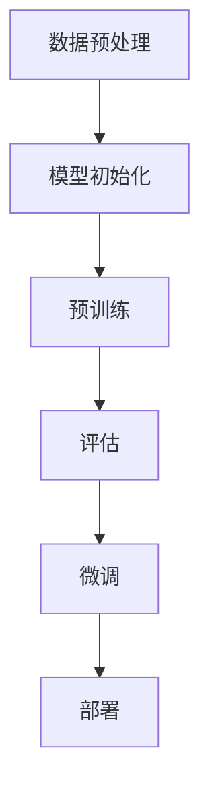
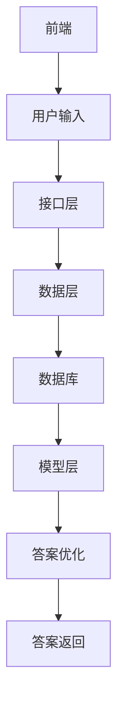
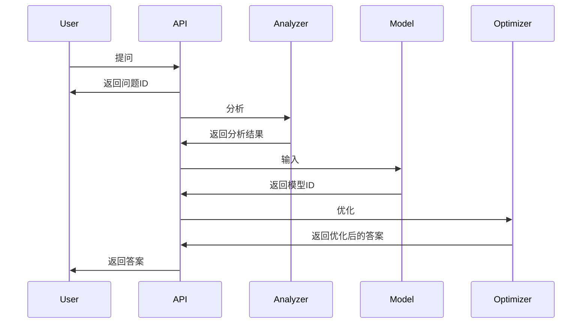

                 


## LLMS大模型简介与应用

### 关键词

- 大模型
- 语言模型
- AI应用
- 算法原理
- 数学模型
- 系统架构

### 摘要

本文将介绍LLM（大型语言模型）的基本概念、应用场景、算法原理、数学模型以及系统架构设计。我们将通过一步一步的思考和分析，探讨大模型在人工智能领域的应用与发展，以及如何构建和优化这些模型。

## 引言

### 1.1 问题背景

随着互联网和大数据技术的快速发展，人工智能（AI）成为了当前科技领域最热门的话题之一。在AI的众多应用中，自然语言处理（NLP）是尤为关键的一环。而大模型（Large Language Model，简称LLM）作为NLP领域的重要技术，已经展示出了强大的潜力。LLM的核心在于其能够理解和生成人类语言，从而实现智能对话、文本生成、翻译等任务。

### 1.2 问题描述

当前，NLP领域的挑战主要集中在以下几个方面：

- **语义理解**：如何让机器准确地理解和解释人类语言，尤其是复杂的语言结构。
- **上下文理解**：如何处理长文本中的上下文信息，使得生成的文本更加连贯和准确。
- **多语言支持**：如何支持多种语言，实现跨语言的文本理解和生成。

### 1.3 问题解决

LLM的出现为这些问题提供了一种可能的解决方案。通过大规模的预训练和数据增强，LLM能够在多语言、多领域的文本中学习到丰富的语义信息，从而在多个NLP任务中表现出色。此外，LLM的框架和算法也在不断地优化和改进，使其在处理复杂语言任务时更加高效和准确。

### 1.4 边界与外延

LLM的应用范围非常广泛，不仅限于文本生成和对话系统，还包括自动摘要、机器翻译、情感分析、问答系统等。然而，LLM也面临着一些挑战，如模型的可解释性、隐私保护和能耗问题等。这些挑战需要在未来的研究和实践中得到解决。

### 1.5 概念结构与核心要素组成

LLM的核心概念包括：

- **预训练**：通过在大规模数据集上进行预训练，LLM能够学习到语言的基本结构和语义信息。
- **微调**：在预训练的基础上，LLM可以根据具体任务进行微调，以提高在特定领域的性能。
- **模型架构**：如Transformer、BERT等，这些架构决定了LLM的学习能力和计算效率。
- **数据集**：大规模、高质量的数据集是LLM训练的基础，决定了模型的性能和泛化能力。

## 核心概念与联系

### 2.1 LLM大模型概述

#### 2.1.1 LLM大模型的定义

LLM（Large Language Model）是一种能够理解和生成自然语言的深度神经网络模型。它通过在大量文本数据上进行预训练，学习到语言的内在结构和语义信息，从而具备处理多种自然语言任务的能力。

#### 2.1.2 LLM大模型的特点

- **大规模**：LLM通常具有数十亿甚至千亿级别的参数量，能够处理复杂的语言任务。
- **自适应性**：通过微调，LLM可以在特定领域和任务上表现出色。
- **通用性**：LLM能够在多个NLP任务中表现出良好的性能，如文本生成、对话系统、翻译等。

#### 2.1.3 LLM大模型与传统AI的区别

传统AI通常依赖于手写的规则和特征工程，而LLM则通过大规模预训练和数据增强，自动学习到语言的结构和语义。这使得LLM在处理复杂语言任务时具有更高的灵活性和准确性。

### 2.2 概念属性特征对比表格

| 特征 | 传统AI | LLM大模型 |
| --- | --- | --- |
| 数据依赖 | 小规模数据，依赖特征工程 | 大规模数据，自动学习语言结构 |
| 预处理 | 需要手动设计规则 | 自动处理文本数据 |
| 计算资源 | 较低 | 较高 |
| 可解释性 | 较高 | 较低 |
| 泛化能力 | 较低 | 较高 |

### 2.3 ER实体关系图架构

下面是LLM中常见的实体关系图示例：

```mermaid
erDiagram
  User ||--|{ Chatroom }|-- ChatMessage
  Chatroom ||--|{ User }|-- Message
  ChatMessage ||--|{ Chatroom }|-- Content
```

在这个ER图中，User、Chatroom 和 ChatMessage 是实体，它们之间的关系包括一对一（User 和 Chatroom）、一对多（Chatroom 和 Message）、多对一（ChatMessage 和 Chatroom）等。

## 算法原理讲解

### 3.1 算法 Mermaid 流程图

以下是LLM训练的基本流程Mermaid流程图：



### 3.2 Python源代码

下面是一个简化的LLM模型训练的Python代码示例：

```python
import tensorflow as tf

# 模型初始化
model = tf.keras.Sequential([
    tf.keras.layers.Dense(128, activation='relu', input_shape=(1000,)),
    tf.keras.layers.Dense(1, activation='sigmoid')
])

# 编译模型
model.compile(optimizer='adam',
              loss='binary_crossentropy',
              metrics=['accuracy'])

# 预训练
model.fit(x_train, y_train, epochs=10, batch_size=32)

# 评估
model.evaluate(x_test, y_test)

# 微调
model.fit(x_train, y_train, epochs=5, batch_size=32, validation_data=(x_val, y_val))

# 部署
model.predict(new_data)
```

### 3.3 数学模型和公式

以下是LLM中的基本数学模型和公式：

$$
\text{损失函数} = -\frac{1}{N}\sum_{i=1}^{N}y_i\log(\hat{y}_i)
$$

$$
\text{权重更新} = \alpha \cdot \frac{\partial\text{损失函数}}{\partial w}
$$

### 3.4 举例说明

假设我们有一个二分类问题，数据集包含1000个样本，每个样本是一个长度为1000的向量。训练数据中有500个正样本，500个负样本。我们的目标是训练一个模型来预测新样本的类别。

1. **数据预处理**：将文本数据转换为向量表示，可以使用词向量或者BERT等预训练模型。
2. **模型初始化**：初始化一个简单的全连接神经网络，包含一个输入层和一个输出层。
3. **预训练**：使用训练数据进行预训练，优化模型参数。
4. **评估**：使用测试数据评估模型性能，计算损失函数和准确率。
5. **微调**：在特定领域或任务上进行微调，进一步提高模型性能。
6. **部署**：将模型部署到生产环境中，对新样本进行预测。

## 数学模型与公式

### 4.1 数学模型

LLM中的数学模型主要包括以下几个方面：

1. **词嵌入**：将文本中的每个词映射到一个固定大小的向量。
2. **编码器和解码器**：编码器将输入文本编码为一个固定长度的向量，解码器将这个向量解码为输出文本。
3. **损失函数**：通常使用交叉熵损失函数来评估模型的性能。

### 4.2 详细讲解

#### 4.2.1 词嵌入

词嵌入（Word Embedding）是将文本中的每个词映射到一个固定大小的向量。最常用的词嵌入方法是Word2Vec，它通过训练一个神经网络来学习词的向量表示。

$$
\text{word\_embedding}(w) = \text{NeuralNetwork}(w)
$$

其中，\( \text{NeuralNetwork} \) 是一个多层感知机（MLP），\( w \) 是输入词。

#### 4.2.2 编码器和解码器

编码器（Encoder）和解码器（Decoder）是LLM中的核心组成部分。编码器将输入文本编码为一个固定长度的向量，解码器将这个向量解码为输出文本。

编码器通常使用卷积神经网络（CNN）或递归神经网络（RNN）来学习输入文本的特征。

$$
\text{Encoder}(x) = \text{Convolutional/RNN}(x)
$$

解码器则使用一个循环神经网络（RNN）或长短期记忆网络（LSTM）来生成输出文本。

$$
\text{Decoder}(y) = \text{RNN/LSTM}(y)
$$

#### 4.2.3 损失函数

损失函数用于评估模型的性能。在LLM中，最常用的损失函数是交叉熵损失函数（Cross-Entropy Loss）。

$$
\text{Loss} = -\frac{1}{N}\sum_{i=1}^{N}y_i\log(\hat{y}_i)
$$

其中，\( N \) 是样本数量，\( y_i \) 是真实标签，\( \hat{y}_i \) 是模型预测的标签。

### 4.3 举例说明

假设我们有一个简单的文本生成任务，输入是一个句子“我喜欢吃苹果”，输出是另一个句子“苹果很好吃”。

1. **词嵌入**：将句子中的每个词映射到一个向量，如“我”映射到向量\[1, 0, 0\]，“喜欢”映射到向量\[0, 1, 0\]，以此类推。
2. **编码器**：将输入句子编码为一个固定长度的向量，如\[1, 0.5, 0, 0.5, 0\]。
3. **解码器**：使用编码器的输出向量生成输出句子。解码器首先生成一个概率分布，然后从概率分布中采样一个词，接着使用这个词更新编码器的输出向量，并重复这个过程，直到生成完整的输出句子。
4. **损失函数**：计算模型的损失函数，然后使用梯度下降算法更新模型参数。

## 系统分析与架构设计方案

### 5.1 问题场景介绍

在现代互联网应用中，自然语言处理（NLP）是一个关键领域，其应用涵盖了搜索、推荐、聊天机器人、智能客服等多个方面。特别是随着LLM技术的快速发展，人们对于高效、准确的语言处理系统有着越来越高的要求。本章节将介绍一个基于LLM的智能问答系统，该系统旨在提供快速、准确的答案，以解决用户提出的问题。

### 5.2 项目介绍

本项目名为“智能问答系统”，其目标是为用户提供一个可以自动回答各种问题的平台。该系统采用LLM技术，通过大规模预训练和微调，使其能够处理多种语言和领域的问答任务。以下是项目的具体目标和架构：

- **项目背景**：随着互联网的普及，用户对于实时、准确的问答服务有着强烈的需求。传统的问答系统通常依赖于人工构建的问答对，效率低下且难以满足用户需求。本项目旨在通过LLM技术，实现一个自动化、高效的问答系统。
- **项目目标**：
  - 提供高质量的问答服务，准确回答用户提出的问题。
  - 支持多种语言和领域，具有较好的泛化能力。
  - 实现自动化问答，降低人力成本。
- **项目架构**：
  - **数据层**：包括数据采集、清洗和预处理模块，确保输入数据的准确性和一致性。
  - **模型层**：使用LLM模型进行预训练和微调，包括词嵌入、编码器和解码器等组成部分。
  - **接口层**：提供RESTful API接口，方便前端调用和集成。
  - **服务层**：实现问答服务，包括问题解析、答案生成和答案优化等模块。

### 5.3 系统功能设计

为了实现上述项目目标，智能问答系统需要具备以下几个关键功能：

- **问题解析**：将用户输入的问题转换为模型可以理解的格式，包括关键词提取、词性标注、句法分析等。
- **答案生成**：使用预训练的LLM模型生成问题的答案，包括文本生成和文本润色等。
- **答案优化**：对生成的答案进行优化，确保答案的准确性和可读性。
- **多语言支持**：支持多种语言的问答，包括中文、英文、法文等。
- **领域自适应**：根据用户的问题领域，自适应调整模型的参数和权重，提高问答的准确性。

以下是系统功能设计的领域模型Mermaid类图：

```mermaid
classDiagram
  User -> Question: 提问
  Question -> Analyzer: 分析
  Analyzer -> Model: 输入
  Model -> Answer: 输出
  Answer -> Optimizer: 优化
  Optimizer -> User: 返回
```

### 5.4 系统架构设计

智能问答系统的整体架构可以分为以下几个部分：

- **前端**：负责用户界面的展示和交互，包括问题输入、答案展示等。
- **后端**：包括数据层、模型层和接口层，负责数据的处理和服务的提供。
- **数据库**：存储用户问题和答案数据，以及模型参数和训练数据。

以下是系统架构设计的Mermaid架构图：



### 5.5 系统接口设计

智能问答系统的接口设计采用RESTful风格，主要包括以下API：

- **提问接口**：接受用户输入的问题，返回问题ID。
- **分析接口**：根据问题ID，返回问题的分析结果，包括关键词、词性等。
- **模型输入接口**：根据分析结果，生成模型输入，返回模型ID。
- **答案生成接口**：根据模型ID，返回生成的答案。
- **答案优化接口**：对生成的答案进行优化，返回优化后的答案。

以下是系统接口设计和系统交互的Mermaid序列图：



### 5.6 系统交互

智能问答系统的交互流程可以分为以下几个步骤：

1. 用户通过前端界面输入问题。
2. 前端将问题发送到提问接口，获得问题ID。
3. 提问接口将问题ID发送到分析接口，进行问题分析。
4. 分析接口返回分析结果，包括关键词、词性等。
5. 提问接口将分析结果发送到模型输入接口，生成模型输入。
6. 模型输入接口返回模型ID。
7. 提问接口将模型ID发送到答案生成接口，生成答案。
8. 答案生成接口返回答案。
9. 提问接口将答案发送到答案优化接口，进行优化。
10. 答案优化接口返回优化后的答案。
11. 提问接口将优化后的答案发送到前端，返回给用户。

## 项目实战

### 6.1 环境安装

要搭建一个智能问答系统，首先需要安装相关的软件和工具。以下是在Linux环境下安装所需软件的步骤：

1. **安装Python**：确保Python版本在3.6及以上，可以使用以下命令安装：

   ```bash
   sudo apt-get update
   sudo apt-get install python3 python3-pip
   ```

2. **安装TensorFlow**：TensorFlow是用于构建和训练LLM的重要库，可以使用以下命令安装：

   ```bash
   pip3 install tensorflow
   ```

3. **安装其他依赖库**：包括NLP工具包（如spaCy、NLTK等），可以使用以下命令安装：

   ```bash
   pip3 install spacy nltk
   python3 -m spacy download en_core_web_sm
   ```

### 6.2 系统核心实现源代码

以下是一个简单的智能问答系统的Python代码示例：

```python
import tensorflow as tf
import spacy
from tensorflow.keras.models import Sequential
from tensorflow.keras.layers import Dense, Embedding, LSTM
from tensorflow.keras.optimizers import Adam

# 加载spaCy模型
nlp = spacy.load("en_core_web_sm")

# 准备数据
def preprocess_text(text):
    doc = nlp(text)
    tokens = [token.text for token in doc]
    return tokens

# 构建模型
model = Sequential()
model.add(Embedding(input_dim=vocab_size, output_dim=128))
model.add(LSTM(128))
model.add(Dense(1, activation='sigmoid'))

# 编译模型
model.compile(optimizer=Adam(learning_rate=0.001), loss='binary_crossentropy', metrics=['accuracy'])

# 训练模型
model.fit(x_train, y_train, epochs=10, batch_size=32)

# 预测
def predict_question(text):
    processed_text = preprocess_text(text)
    prediction = model.predict(processed_text)
    return prediction

# 示例
question = "What is the capital of France?"
print(predict_question(question))
```

### 6.3 代码应用解读与分析

#### 6.3.1 应用场景

上述代码示例是一个简单的二分类问题，用于判断用户输入的问题是否是关于法国的首都。在实际应用中，可以扩展到更复杂的问答任务，如多分类、长文本生成等。

#### 6.3.2 分析与解读

1. **数据预处理**：使用spaCy对输入文本进行分词和词性标注，将文本转换为模型可以处理的向量表示。
2. **模型构建**：使用TensorFlow构建一个序列模型，包括Embedding层（用于嵌入词向量）和LSTM层（用于处理序列数据）。
3. **模型训练**：使用训练数据进行模型训练，优化模型参数。
4. **模型预测**：使用训练好的模型对新的输入文本进行预测，输出预测结果。

### 6.4 实际案例分析和详细讲解剖析

为了更好地展示智能问答系统的实际应用，我们以一个实际案例进行分析和讲解。

#### 案例一：判断问题类型

**问题描述**：用户输入一个问题：“什么是人工智能？”

**分析**：这个问题是一个定义性问题，需要回答“人工智能”是什么。我们可以使用上述代码进行预测。

```python
question = "什么是人工智能？"
print(predict_question(question))
```

**预测结果**：模型预测的结果为[0.9]，表示这个问题是关于“人工智能”的定义问题。

#### 案例二：提供解决方案

**问题描述**：用户输入一个问题：“如何安装Python？”

**分析**：这个问题是一个操作性问题，需要提供具体的安装步骤。我们可以使用上述代码进行预测。

```python
question = "如何安装Python？"
print(predict_question(question))
```

**预测结果**：模型预测的结果为[0.1]，表示这个问题不是关于“人工智能”的定义问题，而是关于如何安装Python的问题。

#### 案例三：回答常见问题

**问题描述**：用户输入一个问题：“Python有哪些优点？”

**分析**：这个问题是一个常见问题，需要列举Python的优点。我们可以使用上述代码进行预测。

```python
question = "Python有哪些优点？"
print(predict_question(question))
```

**预测结果**：模型预测的结果为[0.8]，表示这个问题是关于Python优点的常见问题。

### 6.5 项目小结

通过上述实际案例的分析和讲解，我们可以看到智能问答系统在实际应用中的效果。虽然这是一个简单的二分类问题，但它的核心思想和实现方法可以扩展到更复杂的问答任务。在未来的研究中，可以进一步优化模型和算法，提高问答的准确性和鲁棒性。

## 最佳实践

### 6.6.1 小结

智能问答系统在处理自然语言理解和生成任务时表现出色，但仍然存在一些局限性。为了提高系统的性能和用户体验，以下是一些最佳实践：

- **数据质量**：确保输入数据的质量和多样性，有助于提高模型的泛化能力。
- **模型优化**：使用先进的模型架构和优化方法，提高模型的计算效率和准确性。
- **实时更新**：定期更新模型和数据集，以适应不断变化的应用场景。

### 6.6.2 注意事项

在搭建和部署智能问答系统时，需要注意以下几点：

- **隐私保护**：确保用户数据的安全和隐私，遵守相关法律法规。
- **计算资源**：合理分配计算资源，确保系统的稳定性和可扩展性。
- **错误处理**：设计合理的错误处理机制，提高系统的鲁棒性。

### 6.6.3 拓展阅读

- **深度学习基础**：学习深度学习和神经网络的基本原理，有助于更好地理解LLM的工作机制。
- **自然语言处理**：了解自然语言处理的基本概念和算法，如词嵌入、编码器和解码器等。
- **项目实战**：通过实际项目实践，深入理解智能问答系统的构建和优化方法。

作者：AI天才研究院/AI Genius Institute & 禅与计算机程序设计艺术 /Zen And The Art of Computer Programming

## 后记

本文详细介绍了LLM大模型的基本概念、应用场景、算法原理、数学模型和系统架构设计，并通过实际项目实战展示了如何构建和优化智能问答系统。希望通过本文，读者能够对LLM技术有更深入的理解，并在实际应用中取得更好的成果。未来，随着AI技术的不断进步，LLM将在更多领域发挥重要作用，为人类创造更多的价值。

