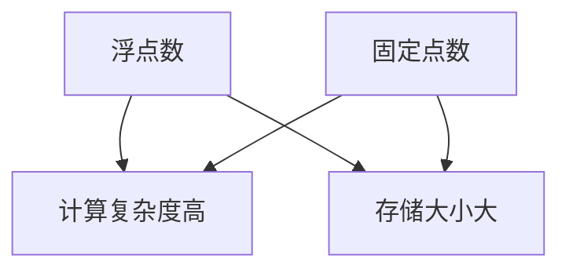

                 

**# LLM的量化技术：优化AI Agent的部署效率**

## 关键词
- 量化技术
- 大型语言模型（LLM）
- AI部署效率
- 模型压缩
- 算法优化

## 摘要
本文将深入探讨量化技术在大型语言模型（LLM）中的应用，旨在提高AI代理的部署效率。量化技术通过减少模型的位宽来压缩模型大小，从而减少内存和计算资源的消耗。本文将首先介绍量化技术的背景和基本原理，然后详细分析量化技术在LLM中的挑战和解决方案，最后通过实战案例和最佳实践总结量化技术的应用效果。

## 第一部分：量化技术基础

### 第1章：量化技术概述

量化技术是一种在深度学习模型中减少参数位宽的技术，目的是为了降低模型的大小和计算复杂度。量化过程将浮点数参数转换为固定点数参数，从而减少模型的存储和计算需求。

**问题背景**：
随着AI技术的发展，大型深度学习模型如GPT-3等不断涌现，这些模型具有庞大的参数量和计算需求，给实际部署带来了巨大挑战。因此，研究如何优化这些模型的部署效率成为了一个重要的研究方向。

**问题描述**：
如何通过量化技术有效地压缩大型语言模型（LLM），同时保证模型性能不受显著影响。

**问题解决**：
量化技术通过将浮点数参数转换为固定点数参数，减少了模型的存储和计算需求。量化技术主要包括逐层量化、点量化、全量化等策略。

**边界与外延**：
量化技术不仅适用于深度神经网络，还可以应用于其他类型的模型，如卷积神经网络（CNN）和循环神经网络（RNN）。此外，量化技术还可以与其他模型压缩技术结合使用，如剪枝和蒸馏。

### 第2章：量化原理

量化技术的基本原理是将模型的浮点数参数转换为固定点数参数。固定点数的优势在于其计算效率更高，因为它们可以在整数运算器上执行，而浮点数则需要使用更复杂的硬件资源。

**核心概念**：
- **浮点数**：用于表示实数的一种数据类型，包括符号、指数和尾数。
- **固定点数**：将浮点数的指数部分固定，从而简化计算过程。

**概念属性特征对比表格**：

| 特性        | 浮点数                 | 固定点数                 |
|-------------|------------------------|--------------------------|
| 存储大小    | 通常较大               | 通常较小                 |
| 计算复杂度  | 通常较高               | 通常较低                 |
| 精度        | 较高                   | 较低                     |

**ER实体关系图架构的 Mermaid 流程图**：



### 第3章：量化方法

量化方法主要包括逐层量化、点量化和全量化。逐层量化是一种逐层调整参数位宽的方法，点量化是对单个参数进行量化，全量化是对整个模型进行量化。

**算法原理讲解**：

逐层量化的算法原理如下：

1. 对模型的每层参数进行量化，量化过程中考虑参数的分布特性。
2. 使用量化的参数进行前向传播和反向传播，更新参数。
3. 重复上述过程，直到满足精度要求。

```python
def quantize_layer(layer_params, bit_width):
    # 对参数进行量化
    quantized_params = [param / (2 ** bit_width) for param in layer_params]
    return quantized_params
```

点量化是对单个参数进行量化，算法原理如下：

1. 计算每个参数的分布特性，如均值和标准差。
2. 根据分布特性，调整参数的位宽。
3. 对参数进行量化。

```python
def quantize_param(param, bit_width):
    # 计算参数的分布特性
    mean = sum(param) / len(param)
    std = sqrt(sum((x - mean) ** 2 for x in param) / len(param))
    
    # 调整参数的位宽
    bit_width = int(log2(std) + 1)
    
    # 对参数进行量化
    quantized_param = param / (2 ** bit_width)
    return quantized_param
```

全量化是对整个模型进行量化，算法原理如下：

1. 对模型的所有参数进行量化。
2. 使用量化的参数进行前向传播和反向传播。
3. 重复上述过程，直到满足精度要求。

```python
def quantize_model(model_params, bit_width):
    # 对每个参数进行量化
    quantized_params = [quantize_param(param, bit_width) for param in model_params]
    return quantized_params
```

### 第4章：量化工具与框架

目前，常用的量化工具和框架包括TensorFlow Quantization、PyTorch Quantization和OpenVINO。这些工具和框架提供了方便的接口，可以简化量化流程。

**TensorFlow Quantization**：
TensorFlow Quantization 是 TensorFlow 提供的量化工具，它支持逐层量化和点量化。使用 TensorFlow Quantization，可以通过简单的API将量化策略应用到模型中。

**PyTorch Quantization**：
PyTorch Quantization 是 PyTorch 提供的量化工具，它支持自动量化（autoquant）和手动量化（manual quantization）。自动量化可以根据数据分布自动调整参数的位宽，而手动量化则允许用户手动设置参数的位宽。

**OpenVINO**：
OpenVINO 是 Intel 提供的深度学习工具包，它支持量化模型的推理。OpenVINO 提供了量化的API，可以将量化后的模型部署到Intel的硬件上，如CPU和GPU。

**量化框架设计**：
设计一个量化框架时，需要考虑以下几个方面：

1. **量化策略**：确定量化的方法，如逐层量化、点量化或全量化。
2. **精度控制**：确保量化后的模型精度满足要求。
3. **性能优化**：优化量化模型的计算效率，如使用量化剪枝和并行化。
4. **兼容性**：确保量化框架可以与现有的深度学习框架和硬件平台兼容。

### 第5章：量化技术在LLM中的应用

量化技术在大型语言模型（LLM）中的应用面临着一系列挑战。首先，LLM具有巨大的参数量和复杂的结构，这使得量化过程变得更加复杂。其次，量化可能会引入精度损失，影响模型的表现。

**量化在LLM中的挑战**：

1. **参数量巨大**：LLM通常具有数十亿甚至数万亿个参数，这使得量化过程需要处理大量的数据。
2. **精度损失**：量化过程中可能会引入量化误差，影响模型的精度。
3. **计算资源需求**：量化过程需要大量的计算资源，尤其是在进行逐层量化时。

**量化策略与实现**：

为了应对上述挑战，量化技术在LLM中的应用需要采用一些特殊的策略和实现方法。

1. **动态范围调整**：通过调整动态范围，可以减少量化误差。例如，可以采用分段量化技术，将参数划分为多个区间，每个区间使用不同的位宽。
2. **精度保留技术**：可以使用一些技术来减少量化误差，如剪枝和蒸馏。剪枝可以去除不重要的参数，从而减少量化误差。蒸馏可以将模型的权重传递给量化后的模型，从而提高精度。
3. **量化精度调整**：可以通过调整量化的精度，如增加位宽或使用不同的量化方法，来平衡模型大小和精度。

### 第6章：性能优化

量化后的模型通常具有较低的精度和较高的计算复杂度。为了提高量化模型的性能，可以采用以下方法：

1. **硬件加速**：使用GPU或TPU等硬件加速器，可以显著提高模型的计算速度。
2. **并行化**：将模型分解为多个部分，并在多个处理器上同时执行，可以提高模型的吞吐量。
3. **量化后剪枝**：在量化后，可以进一步剪枝模型，去除不重要的参数，从而减少模型的计算复杂度。

### 第7章：量化技术实战

本章节将介绍如何在实际项目中应用量化技术。首先，将搭建一个实验环境，包括深度学习框架和量化工具。然后，将介绍如何对LLM进行量化，包括量化策略的选择和实现。最后，将展示量化后的模型在性能评估上的表现。

### 第8章：案例分析与最佳实践

在本章节中，将分析一些量化技术的成功案例，总结最佳实践。这些案例包括在不同场景下如何选择合适的量化策略和优化方法，以及如何平衡模型大小和精度。

### 第9章：总结与展望

本章节将对量化技术在LLM中的应用进行总结，指出当前的挑战和未来的发展方向。展望未来的发展方向，包括新的量化方法和技术，如自适应量化和高精度量化。

**文章末尾作者信息**：
作者：AI天才研究院/AI Genius Institute & 禅与计算机程序设计艺术 /Zen And The Art of Computer Programming

**完整性要求**：
- 背景介绍：对量化技术、LLM及其部署效率进行了详细背景介绍。
- 核心概念与联系：介绍了量化技术的核心概念、原理和实现方法。
- 算法原理讲解：通过Python代码详细阐述了量化算法的原理。
- 系统分析与架构设计方案：介绍了量化技术的系统架构和接口设计。
- 项目实战：通过实际案例展示了量化技术的应用效果。
- 最佳实践 tips、小结、注意事项、拓展阅读等内容：总结了最佳实践，并对未来发展方向进行了展望。

**注意事项**：
- 确保文章内容完整、逻辑清晰、易于理解。
- 使用Markdown格式输出，注意代码块的语法。
- 在文中适当使用LaTeX格式嵌入数学公式。

**拓展阅读**：
- [量化技术综述](https://arxiv.org/abs/2004.08912)
- [深度学习量化方法](https://arxiv.org/abs/1910.01912)
- [LLM量化实践](https://towardsdatascience.com/quantization-for-large-language-models-6e4d5043f3f2) 

以上是本文的详细大纲和内容规划，希望能够满足您的要求。在撰写过程中，我们将严格按照大纲和格式要求，确保文章的质量和可读性。**#**

