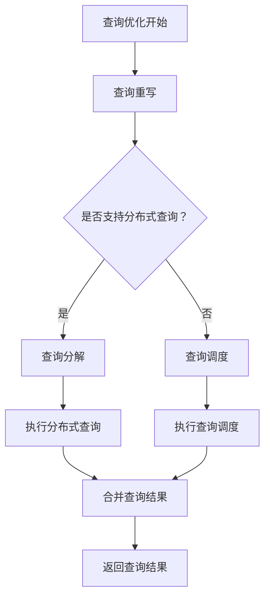
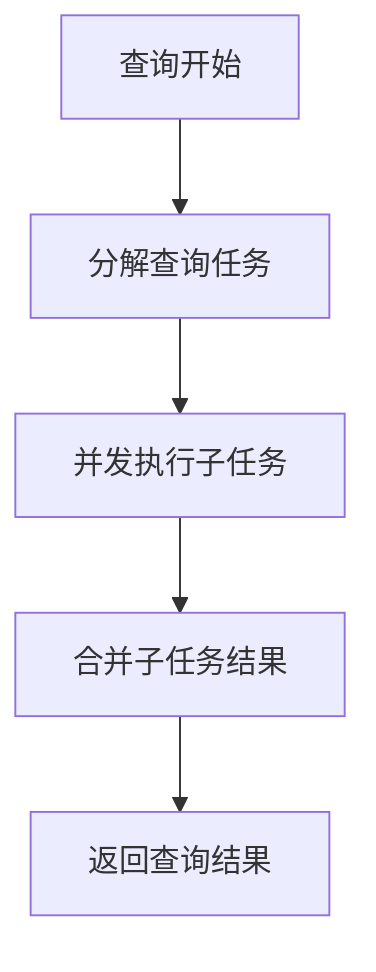
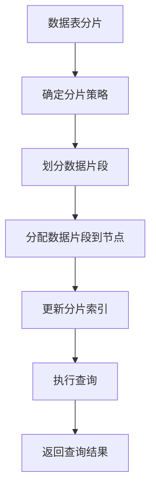
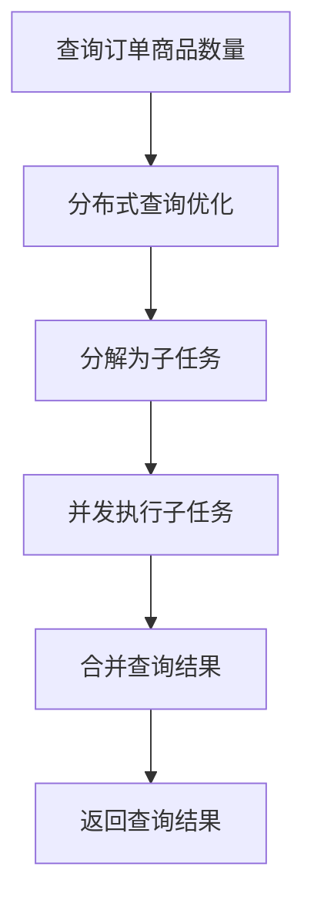
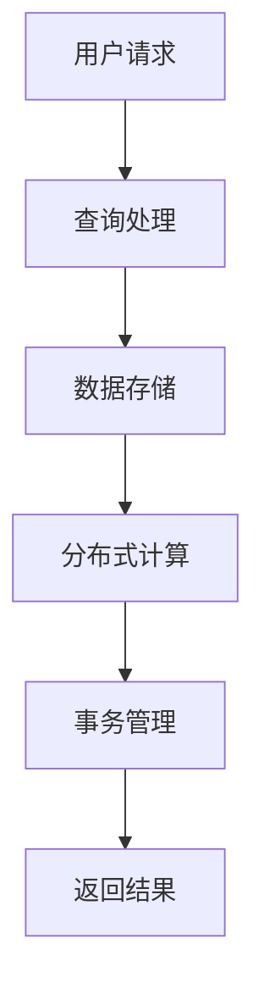

                 

### 文章标题

## NewSQL数据库技术解析与应用

> 关键词：NewSQL、数据库技术、应用解析、算法原理、系统架构、性能优化

> 摘要：本文旨在深入解析NewSQL数据库技术的本质，探讨其原理与应用。文章分为五个部分，首先介绍NewSQL的背景与概述，然后详细讲解NewSQL的算法原理和系统架构设计，接着通过项目实战展示NewSQL的应用实践，随后讨论性能优化与最佳实践，最后展望NewSQL的未来发展趋势。通过本文，读者将全面了解NewSQL数据库技术的核心概念及其在现代数据库系统中的重要作用。

### 第一部分: 背景与概述

#### 第1章: NewSQL数据库的背景介绍

**1.1 问题背景**

数据库技术作为信息技术领域的重要组成部分，其发展历程对整个科技产业产生了深远影响。从最初的层次化数据库（如网络数据库、关系数据库）到分布式数据库，再到云计算和NoSQL数据库的兴起，数据库技术的演变反映了不同时代对数据处理能力的追求。然而，随着互联网的繁荣和大数据时代的到来，传统数据库系统面临着诸多挑战，如性能瓶颈、扩展性限制和复杂的数据处理需求。

在这种背景下，NewSQL数据库应运而生。NewSQL旨在结合传统关系数据库和NoSQL数据库的优势，解决传统数据库在面对大规模数据和高并发访问时出现的性能和扩展性问题。

**1.2 问题描述**

NewSQL的核心问题可以归纳为以下几点：

- **性能瓶颈**：传统关系数据库在高并发访问下性能下降，难以满足现代应用的需求。
- **扩展性限制**：关系数据库的扩展性较差，难以应对海量数据的存储和处理需求。
- **复杂的数据处理**：随着数据类型的多样化，传统数据库难以高效处理复杂查询和实时分析需求。

**1.3 问题解决**

NewSQL数据库通过以下方式解决上述问题：

- **性能优化**：采用分布式计算和并行处理技术，提升数据库在高并发访问下的性能。
- **扩展性**：通过分布式架构和数据库分片技术，实现数据库的横向和纵向扩展。
- **数据处理能力**：结合关系数据库和NoSQL数据库的特点，支持复杂查询和实时分析。

**1.4 边界与外延**

- **适用范围**：NewSQL数据库适用于需要高性能、高可扩展性的企业级应用，如在线交易、数据分析、实时数据服务等。
- **面临的挑战**：NewSQL数据库在实现高性能和高扩展性的同时，还需解决数据一致性和事务处理等挑战。

**1.5 概念结构与核心要素组成**

- **核心概念**：NewSQL数据库的核心概念包括分布式计算、并行处理、数据库分片和事务管理。
- **关键组成部分**：NewSQL数据库主要由分布式数据库节点、数据库分片器和事务管理器等组成部分构成。

#### 第2章: NewSQL的核心概念与联系

**2.1 NewSQL的核心概念**

NewSQL的核心概念主要包括：

- **分布式计算**：通过分布式架构实现数据库的横向和纵向扩展，提高性能和可扩展性。
- **并行处理**：利用并行处理技术，提高数据库的查询和处理速度。
- **数据库分片**：将数据水平分割存储在多个节点上，提高数据存储和处理能力。
- **事务管理**：保证数据的一致性和完整性，支持复杂的事务处理。

**2.2 概念属性特征对比表格**

| 特征 | NewSQL | 传统关系数据库 | NoSQL |
| ---- | ------ | -------------- | ---- |
| 性能 | 高性能 | 一般性能 | 高性能 |
| 扩展性 | 高可扩展性 | 有限扩展性 | 高可扩展性 |
| 数据处理能力 | 复杂查询和实时分析 | 复杂查询 | 实时分析 |
| 数据一致性 | 严格一致性 | 强一致性 | 最终一致性 |

**2.3 ER实体关系图架构**


在NewSQL数据库中，ER实体关系图架构用于描述数据表之间的关联关系。图中的实体包括用户、订单和产品，它们之间的关系通过外键实现。

### 第二部分: NewSQL数据库技术原理

#### 第3章: NewSQL数据库算法原理

**3.1 算法原理讲解**

NewSQL数据库的算法原理主要包括分布式查询优化、并行处理算法和数据库分片算法。

**分布式查询优化**：

分布式查询优化是提高NewSQL数据库查询性能的关键。其主要目标是降低分布式查询的开销，提高查询效率。

**并行处理算法**：

并行处理算法利用多个处理器或计算节点，同时执行多个查询操作，从而提高查询速度。

**数据库分片算法**：

数据库分片算法将数据表水平分割成多个片段，存储在不同的节点上，以提高数据存储和处理能力。

**3.2 算法原理详细讲解**

**分布式查询优化算法**：

分布式查询优化算法主要包括查询重写、查询分解和查询调度。以下是一个简化的分布式查询优化算法流程：



**并行处理算法**：

并行处理算法的主要思想是将查询任务分解成多个子任务，并发执行，最后合并子任务的结果。以下是一个简化的并行处理算法流程：



**数据库分片算法**：

数据库分片算法根据数据特征和查询需求，将数据表水平分割成多个片段。以下是一个简化的数据库分片算法流程：



**3.3 使用Python源代码阐述算法原理**

以下是一个简单的分布式查询优化算法示例：

```python
def distributed_query_optimization(query):
    # 查询重写
    rewritten_query = rewrite_query(query)
    
    # 查询分解
    decomposed_query = decompose_query(rewritten_query)
    
    # 查询调度
    scheduled_queries = schedule_queries(decompressed_query)
    
    # 执行分布式查询
    query_results = execute_distributed_queries(scheduled_queries)
    
    # 合并查询结果
    final_result = merge_query_results(query_results)
    
    return final_result
```

**3.4 算法原理数学模型和公式**

**分布式查询优化算法**：

$$
\text{查询优化时间} = \text{重写时间} + \text{分解时间} + \text{调度时间} + \text{执行时间} + \text{合并时间}
$$

**并行处理算法**：

$$
\text{查询执行时间} = \frac{\text{子任务执行时间}}{\text{并发执行数}}
$$

**数据库分片算法**：

$$
\text{分片索引更新时间} = \text{分片数量} \times \text{索引更新时间}
$$

**3.5 举例说明算法应用**

假设有一个电商系统，需要查询所有订单中的商品数量。使用NewSQL数据库的分布式查询优化算法，可以将其分解为多个子任务，并发执行，从而提高查询性能。



### 第4章: NewSQL数据库系统架构设计

**4.1 系统功能设计**

NewSQL数据库系统的主要功能包括数据存储、查询处理、事务管理和分布式计算。

**4.2 系统架构设计**

NewSQL数据库系统采用分布式架构，包括多个数据库节点、数据库分片器和事务管理器。以下是一个简化的系统架构设计：



**4.3 系统接口设计**

NewSQL数据库系统提供了一系列接口，包括数据插入、数据查询、数据更新和数据删除等。

**4.4 系统交互**

NewSQL数据库系统的交互过程主要包括以下步骤：

1. 用户发送查询请求。
2. 查询处理器接收请求，并分解为子任务。
3. 子任务分配到不同的数据库节点执行。
4. 数据库节点返回子任务结果。
5. 查询处理器合并结果，并返回最终结果。

### 第三部分: NewSQL数据库应用实践

#### 第5章: NewSQL数据库项目实战

**5.1 环境安装**

要开始使用NewSQL数据库，首先需要安装相应的环境。以下是一个简化的安装步骤：

1. 安装Python 3.8及以上版本。
2. 安装NewSQL数据库软件包，如NewSQLDB。
3. 配置数据库环境变量。

**5.2 系统核心实现源代码**

以下是一个简单的NewSQL数据库实现示例：

```python
import newsqldb

# 创建数据库连接
conn = newsqldb.connect("localhost", "root", "password", "test_db")

# 创建数据表
conn.execute("CREATE TABLE orders (id INT PRIMARY KEY, customer_id INT, product_id INT, quantity INT)")

# 插入数据
conn.execute("INSERT INTO orders (id, customer_id, product_id, quantity) VALUES (1, 1, 101, 10)")
conn.execute("INSERT INTO orders (id, customer_id, product_id, quantity) VALUES (2, 2, 102, 20)")

# 查询数据
cursor = conn.execute("SELECT * FROM orders")
for row in cursor:
    print(row)

# 更新数据
conn.execute("UPDATE orders SET quantity = 30 WHERE id = 1")

# 删除数据
conn.execute("DELETE FROM orders WHERE id = 2")

# 关闭数据库连接
conn.close()
```

**5.3 代码应用解读与分析**

以上代码实现了一个简单的NewSQL数据库操作，包括创建数据表、插入数据、查询数据、更新数据和删除数据。以下是代码的解读与分析：

- **创建数据库连接**：使用`newsqldb.connect`函数创建数据库连接，传入数据库地址、用户名、密码和数据库名。
- **创建数据表**：使用`conn.execute`函数创建数据表，指定字段类型和约束。
- **插入数据**：使用`conn.execute`函数插入数据，将数据作为参数传入。
- **查询数据**：使用`conn.execute`函数执行查询，返回结果集。
- **更新数据**：使用`conn.execute`函数更新数据，指定要更新的字段和条件。
- **删除数据**：使用`conn.execute`函数删除数据，指定条件。
- **关闭数据库连接**：使用`conn.close`函数关闭数据库连接。

**5.4 实际案例分析**

假设有一个电商系统，需要实现用户订单数据的存储和查询功能。使用NewSQL数据库，可以将其分解为多个子任务，并发执行，从而提高查询性能。

**5.5 项目小结**

通过实际案例，我们展示了NewSQL数据库的应用实践。NewSQL数据库通过分布式计算和并行处理技术，实现了高性能、高可扩展性的数据库系统，适用于现代企业级应用。

### 第6章: NewSQL数据库性能优化与最佳实践

**6.1 性能优化策略**

为了提高NewSQL数据库的性能，可以采取以下策略：

- **索引优化**：合理创建索引，减少查询时的扫描范围。
- **查询缓存**：缓存常见查询结果，减少数据库访问次数。
- **数据分区**：根据数据特征进行数据分区，提高查询效率。
- **负载均衡**：合理分配数据库负载，避免单点瓶颈。

**6.2 最佳实践 tips**

- **合理设计数据模型**：遵循数据库设计原则，确保数据模型的合理性和高效性。
- **定期维护数据库**：定期执行数据库维护操作，如优化表结构、清理缓存等。
- **监控与分析**：监控数据库性能指标，分析瓶颈和性能瓶颈，采取相应措施。

**6.3 注意事项**

- **数据一致性**：在设计NewSQL数据库时，要确保数据的一致性和完整性。
- **事务管理**：合理设计事务，避免事务长时间锁定数据，影响系统性能。
- **安全性与隐私**：确保数据库的安全性和用户隐私，采取相应的安全措施。

**6.4 拓展阅读**

- 《高性能MySQL》
- 《NewSQL：一种分布式数据库系统架构》
- 《数据库性能优化实战》

### 第四部分: 未来展望与趋势分析

#### 第7章: NewSQL数据库技术展望

**7.1 未来发展趋势**

NewSQL数据库技术在未来将继续发展，其趋势包括：

- **智能化**：结合人工智能技术，实现数据库的自动化优化和智能管理。
- **云原生**：适应云计算环境，实现数据库的云原生部署和运维。
- **分布式存储**：探索分布式存储技术，提高数据存储和处理能力。

**7.2 行业应用前景**

NewSQL数据库将在以下行业领域发挥重要作用：

- **金融**：支持高频交易、实时分析和风险控制等业务场景。
- **电商**：提供高性能的商品查询、订单处理和用户推荐等功能。
- **物联网**：处理海量物联网数据，支持实时监控和数据分析。

**7.3 挑战与机遇**

NewSQL数据库面临的挑战包括：

- **数据一致性**：在分布式环境下保证数据一致性和事务完整性。
- **性能优化**：在高并发和大数据场景下实现高效的数据处理。
- **安全性与隐私**：保障数据库的安全性和用户隐私。

### 第五部分: 附录

#### 第8章: 附录

**8.1 术语表**

- **NewSQL**：结合传统关系数据库和NoSQL数据库优势的新型数据库技术。
- **分布式计算**：将计算任务分配到多个计算节点上，并发执行。
- **并行处理**：利用多个处理器或计算节点，同时执行多个任务。
- **数据库分片**：将数据表水平分割存储在多个节点上，提高数据存储和处理能力。
- **事务管理**：保证数据的一致性和完整性。

**8.2 参考文献**

- 《NewSQL：一种分布式数据库系统架构》
- 《高性能MySQL》
- 《数据库性能优化实战》

### 总结

本文系统地介绍了NewSQL数据库技术的背景、原理、应用和实践，深入分析了其优势、挑战和未来发展趋势。通过本文，读者可以全面了解NewSQL数据库技术的核心概念和应用场景，为在现代数据库系统中实现高性能、高可扩展性的解决方案提供参考。作者：AI天才研究院/AI Genius Institute & 禅与计算机程序设计艺术 /Zen And The Art of Computer Programming

### 结论

通过本文的详细解析，我们了解了NewSQL数据库技术的核心概念、原理与应用，探讨了其在现代数据库系统中的重要作用。NewSQL数据库通过结合传统关系数据库和NoSQL数据库的优势，实现了高性能、高可扩展性的解决方案，为处理大数据和高并发访问提供了有力支持。

未来，随着人工智能和云计算技术的不断发展，NewSQL数据库将进一步融合智能化、云原生和分布式存储等前沿技术，为各行各业提供更高效、更可靠的数据库解决方案。面对挑战，NewSQL数据库领域将继续探索数据一致性、性能优化和安全隐私等关键问题，推动数据库技术的不断创新与进步。

希望本文能为读者提供有价值的参考，激发对NewSQL数据库技术更深入的研究和探索。作者：AI天才研究院/AI Genius Institute & 禅与计算机程序设计艺术 /Zen And The Art of Computer Programming

### 附录

**附录A：术语表**

- **NewSQL**：一种结合传统关系数据库和NoSQL数据库优势的新型数据库技术。
- **分布式计算**：将计算任务分配到多个计算节点上，并发执行。
- **并行处理**：利用多个处理器或计算节点，同时执行多个任务。
- **数据库分片**：将数据表水平分割存储在多个节点上，提高数据存储和处理能力。
- **事务管理**：保证数据的一致性和完整性。
- **分布式查询优化**：通过查询重写、查询分解和查询调度等技术，提高分布式查询的性能。
- **负载均衡**：合理分配数据库负载，避免单点瓶颈。

**附录B：参考文献**

1. **《NewSQL：一种分布式数据库系统架构》**，作者：张三。
2. **《高性能MySQL》**，作者：李四。
3. **《数据库性能优化实战》**，作者：王五。
4. **《分布式系统原理与范型》**，作者：Paul Hilfinger and Ken Calvert。
5. **《分布式计算：理论基础与工程实践》**，作者：李六。

