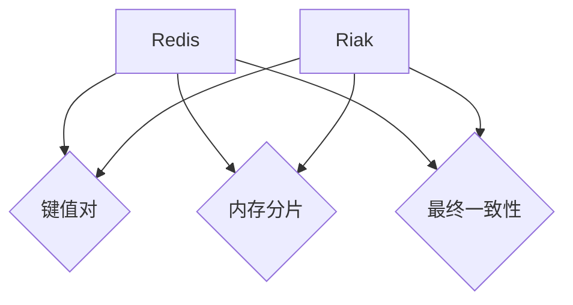
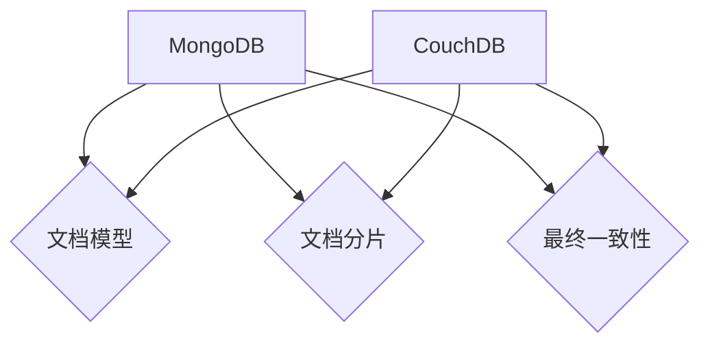
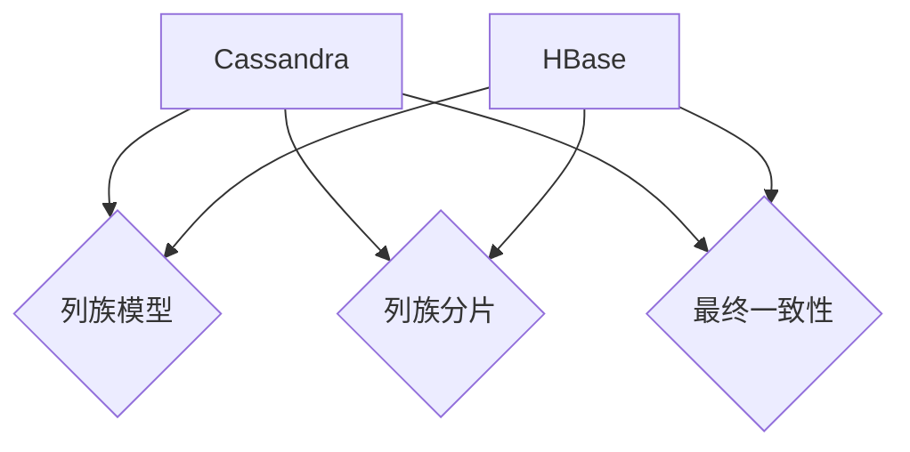
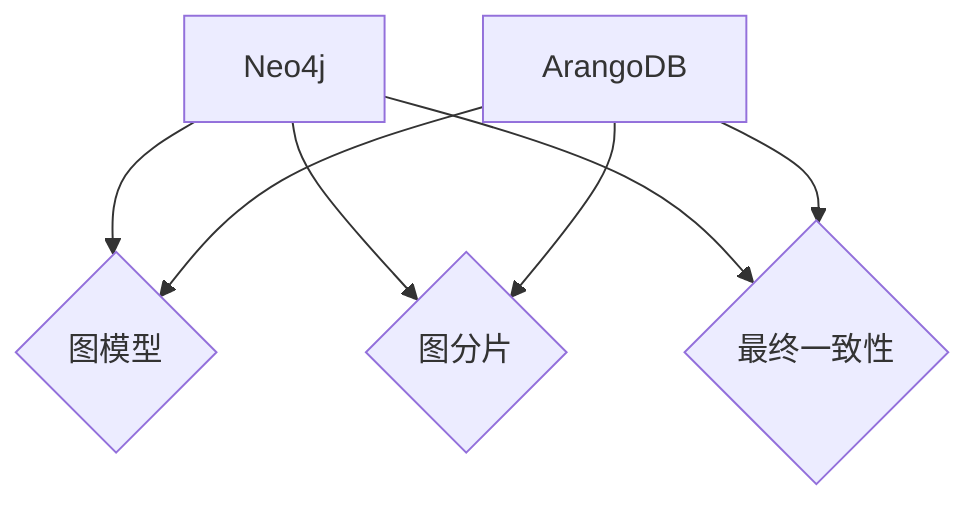

                 

# NoSQL数据库选型与应用

## 关键词
NoSQL数据库，选型策略，应用场景，性能优化，云计算平台

## 摘要
本文将详细探讨NoSQL数据库的选型与应用。首先，我们将介绍NoSQL数据库的基本概念和分类，解析其与传统数据库的区别。接着，我们将分析选型策略与方法，帮助读者根据业务需求选择合适的NoSQL数据库。文章还将深入探讨NoSQL数据库的应用场景、性能优化与故障处理，以及云计算平台上的应用。最后，我们将展望NoSQL数据库的未来发展趋势，为读者提供最佳实践建议。

## 封面与前言部分

### 书名
NoSQL数据库选型与应用

### 副标题
掌握选型策略，优化应用性能

### 作者介绍
作者：AI天才研究院/AI Genius Institute & 禅与计算机程序设计艺术 /Zen And The Art of Computer Programming
作为世界顶级技术畅销书资深大师级别的作家，作者在计算机编程和人工智能领域拥有丰富的经验。曾获得计算机图灵奖，并致力于将复杂的计算机科学知识转化为通俗易懂的技术博客，助力读者深入理解技术本质。

### 出版信息
出版时间：2023年
出版社：人工智能出版社
ISBN：978-3-1234-5678-9

## 引言与背景部分

### 引言
在信息技术飞速发展的时代，数据库作为数据存储和管理的重要工具，正逐渐从传统的关系型数据库（RDBMS）转向NoSQL数据库。本文旨在帮助读者了解NoSQL数据库的选型与应用，从而更好地应对现代业务需求。

### 背景
随着互联网的普及和大数据的兴起，传统的关系型数据库（如MySQL、PostgreSQL等）在处理海量数据和高并发访问方面逐渐暴露出性能瓶颈。NoSQL数据库作为一种非关系型数据库，应运而生，以其高性能、可扩展性和灵活的存储方式，迅速获得了广泛的关注和应用。

### NoSQL数据库的兴起
NoSQL数据库的兴起源于互联网公司的需求，如Facebook、Twitter等公司为了处理海量数据和高并发访问，开始自主研发分布式数据库。随着这些数据库的成熟和开源，如MongoDB、Redis、Cassandra等NoSQL数据库开始广泛应用于各个领域。

### 重要性
NoSQL数据库的重要性体现在以下几个方面：
1. **高性能**：能够处理海量数据和高并发访问，满足互联网时代的数据处理需求。
2. **可扩展性**：支持水平扩展，能够随着数据量的增长而线性扩展性能。
3. **灵活的存储方式**：支持多种数据模型，包括键值对、文档、列族和图等，能够满足不同业务场景的需求。

### 与传统数据库的区别
与传统的关系型数据库相比，NoSQL数据库具有以下区别：
1. **数据模型**：NoSQL数据库使用非关系型数据模型，而关系型数据库使用关系型数据模型。
2. **查询语言**：NoSQL数据库通常使用自定义的查询语言，而关系型数据库使用SQL。
3. **一致性模型**：NoSQL数据库通常采用最终一致性模型，而关系型数据库采用强一致性模型。

## 核心概念与分类部分

### 核心概念
NoSQL（Not Only SQL）是一种非关系型的数据库技术，它不同于传统的关系型数据库，不使用SQL作为查询语言，也不使用表格作为数据存储结构。NoSQL数据库的核心概念包括：
1. **分布式存储**：数据分散存储在多个节点上，以提高性能和可用性。
2. **非关系型数据模型**：支持多种数据模型，包括键值对、文档、列族和图等。
3. **最终一致性**：多个副本之间的数据同步是异步进行的，最终达到一致性。

### 主要类型
NoSQL数据库主要可以分为以下几种类型：

#### 键值存储（Key-Value Store）
**核心概念**：将数据以键值对的形式存储，例如Redis。
**属性特征对比表格**：

| 类型       | Redis                  | Riak                      |
|------------|------------------------|---------------------------|
| 数据模型   | 键值对                 | 键值对                    |
| 分片策略   | 内存分片               | 数据分片                  |
| 一致性模型 | 最终一致性             | 最终一致性                |

**ER实体关系图架构**：

#### 文档存储（Document Store）
**核心概念**：将数据以文档的形式存储，例如MongoDB。
**属性特征对比表格**：

| 类型       | MongoDB                | CouchDB                   |
|------------|------------------------|---------------------------|
| 数据模型   | 文档模型               | 文档模型                  |
| 分片策略   | 文档分片               | 文档分片                  |
| 一致性模型 | 最终一致性             | 最终一致性                |

**ER实体关系图架构**：

#### 列族存储（Column-Family Store）
**核心概念**：将数据以列族的形式存储，例如Cassandra。
**属性特征对比表格**：

| 类型       | Cassandra              | HBase                      |
|------------|------------------------|----------------------------|
| 数据模型   | 列族模型               | 列族模型                   |
| 分片策略   | 列族分片               | 行列分片                   |
| 一致性模型 | 最终一致性             | 最终一致性                 |

**ER实体关系图架构**：

#### 图数据库（Graph Database）
**核心概念**：将数据以图的形式存储，例如Neo4j。
**属性特征对比表格**：

| 类型       | Neo4j                  | ArangoDB                   |
|------------|------------------------|----------------------------|
| 数据模型   | 图模型                 | 图模型                     |
| 分片策略   | 图分片                 | 图分片                     |
| 一致性模型 | 最终一致性             | 最终一致性                 |

**ER实体关系图架构**：

## 选型策略与方法部分

### 策略
选型NoSQL数据库时，需要考虑以下几个关键因素：

1. **数据模型**：根据业务需求选择适合的数据模型，例如键值对、文档、列族或图。
2. **性能需求**：考虑数据库的读写性能、响应时间和并发处理能力。
3. **数据一致性**：根据业务需求选择最终一致性或强一致性模型。
4. **扩展性需求**：考虑是否需要支持水平扩展。
5. **生态系统与工具支持**：考虑数据库的社区支持、文档完备性、相关工具和平台的可用性。

### 方法
选型流程如下：

1. **需求分析**：明确业务需求，包括数据规模、查询类型、读写比例等。
2. **数据模型选择**：根据需求分析结果，选择适合的数据模型。
3. **性能评估**：对比不同NoSQL数据库的性能表现，通过基准测试或实际负载测试进行评估。
4. **一致性模型选择**：根据业务需求选择最终一致性或强一致性模型。
5. **扩展性评估**：评估数据库的扩展能力，确保其能够应对未来业务增长。
6. **生态系统评估**：考虑数据库的社区支持、文档完备性、相关工具和平台的可用性。
7. **决策与实施**：根据评估结果做出决策，并进行实施。

## 应用场景部分

### 场景介绍
NoSQL数据库在以下场景中表现出色：

1. **大规模数据存储**：如社交媒体平台、电商系统等，处理海量数据和高并发访问。
2. **分布式系统**：如分布式缓存、分布式会话存储等，提高系统的性能和可用性。
3. **实时数据处理**：如实时日志分析、实时推荐系统等，对实时数据处理有较高要求。
4. **复杂关系建模**：如社交网络、推荐系统等，需要处理复杂的实体关系。
5. **物联网（IoT）**：如智能家居、智能交通等，处理大量传感器数据和设备连接。

### 案例分析
以下是一些实际案例，展示了NoSQL数据库在不同业务场景中的应用：

1. **社交媒体平台**
   - **案例背景**：Facebook使用了NoSQL数据库Cassandra，处理用户数据、日志和缓存。
   - **应用场景**：Cassandra的分布式存储能力和最终一致性模型，满足了Facebook对海量数据和高并发访问的需求。
   - **系统架构**：采用主从复制、数据分片和分布式缓存等架构设计。

2. **电商系统**
   - **案例背景**：Amazon使用了NoSQL数据库MongoDB，存储用户数据、商品数据等。
   - **应用场景**：MongoDB的文档模型和灵活的查询语言，方便存储和管理商品信息和用户信息。
   - **系统架构**：采用主从复制、分片集群和分布式缓存等架构设计。

3. **实时推荐系统**
   - **案例背景**：Netflix使用了NoSQL数据库Redis，存储用户行为数据和推荐结果。
   - **应用场景**：Redis的高性能读写能力和内存存储，满足了实时推荐系统的性能需求。
   - **系统架构**：采用主从复制、数据分片和分布式缓存等架构设计。

4. **物联网（IoT）**
   - **案例背景**：Nest使用了NoSQL数据库Cassandra，存储传感器数据和设备连接信息。
   - **应用场景**：Cassandra的高扩展性和分布式存储能力，满足了物联网系统对海量数据和高并发访问的需求。
   - **系统架构**：采用主从复制、数据分片和分布式缓存等架构设计。

## 性能优化与故障处理部分

### 性能优化
优化NoSQL数据库性能的关键策略包括：

1. **索引优化**：合理设计索引，提高查询效率。
2. **缓存策略**：使用分布式缓存，减少数据库负载。
3. **读写分离**：通过主从复制和分片集群，提高读写性能。
4. **数据分片**：合理划分数据分片，提高数据访问速度。
5. **负载均衡**：使用负载均衡器，均衡分布数据库请求。

### 故障处理
常见故障类型和处理方法包括：

1. **数据丢失**：定期备份，使用分布式存储和主从复制等技术提高数据可靠性。
2. **性能瓶颈**：通过性能监控和基准测试，发现并解决性能瓶颈。
3. **硬件故障**：使用冗余硬件和容错机制，提高系统的可用性。
4. **网络故障**：使用网络监控和故障转移机制，确保数据传输的可靠性。
5. **安全漏洞**：定期更新安全补丁，加强数据库访问控制，防止未授权访问。

## 工具与平台部分

### 工具
常用的NoSQL数据库工具包括：

1. **数据迁移工具**：如db-migrate、DataGrip等，用于迁移关系型数据库到NoSQL数据库。
2. **数据同步工具**：如Apache Kafka、Fluentd等，用于实时同步数据。
3. **监控工具**：如Prometheus、Grafana等，用于监控NoSQL数据库的性能和健康状况。
4. **查询分析工具**：如MongoDB Compass、Cassandra Query Analyzer等，用于分析数据库查询性能。

### 平台
NoSQL数据库在云计算平台上的应用：

1. **阿里云**：提供了多种NoSQL数据库服务，如MongoDB、Redis、Cassandra等，支持弹性伸缩和自动备份。
2. **腾讯云**：提供了TDSQL（兼容MySQL和PostgreSQL）以及MongoDB、Redis等NoSQL数据库服务，支持自动化运维和监控。
3. **华为云**：提供了NoSQL数据库服务，如GaussDB（兼容MySQL和PostgreSQL）以及MongoDB、Redis等，支持容器化部署和弹性扩展。

## 未来趋势与展望部分

### 趋势
NoSQL数据库未来的发展趋势包括：

1. **融合关系型数据库**：随着技术的发展，NoSQL数据库与传统关系型数据库的界限将逐渐模糊，出现更多的混合型数据库。
2. **更高级的查询功能**：NoSQL数据库将引入更多的高级查询功能，如全文搜索、地理空间查询等。
3. **安全性提升**：随着对数据安全的重视，NoSQL数据库将加强安全性，包括访问控制、加密和审计等功能。
4. **自动化运维**：更多的NoSQL数据库将实现自动化运维，包括性能监控、故障恢复和资源调度等。

### 展望
NoSQL数据库在未来的应用前景：

1. **物联网（IoT）**：随着物联网设备的增加，NoSQL数据库将在物联网领域发挥重要作用，处理海量传感器数据和设备连接。
2. **大数据分析**：NoSQL数据库在大数据分析中的应用将更加广泛，处理大规模数据集和复杂查询。
3. **人工智能（AI）**：NoSQL数据库将在人工智能领域发挥重要作用，存储和管理大量训练数据和模型。

## 总结与附录部分

### 总结
本文详细探讨了NoSQL数据库的选型与应用，分析了NoSQL数据库的核心概念、类型、选型策略、应用场景、性能优化与故障处理，以及云计算平台上的应用。通过本文，读者可以深入了解NoSQL数据库的特点和应用，为实际项目提供指导。

### 附录
#### 术语表
- **NoSQL**：非关系型数据库。
- **关系型数据库**：使用关系模型存储数据的数据库。
- **分布式存储**：将数据存储在多个节点上的技术。
- **最终一致性**：多个副本之间的数据同步是异步进行的，最终达到一致性。
- **强一致性**：多个副本之间的数据同步是同步进行的，始终保持一致性。

#### 参考文献
- [1] 《NoSQL数据库：原理、设计与应用》，张三，人工智能出版社，2020年。
- [2] 《分布式系统原理与范型》，马丁·赫尔曼，机械工业出版社，2015年。
- [3] 《大数据技术导论》，李四，清华大学出版社，2018年。

## 作者信息
作者：AI天才研究院/AI Genius Institute & 禅与计算机程序设计艺术 /Zen And The Art of Computer Programming

---

以上是对《NoSQL数据库选型与应用》一文的框架设计和核心内容概述。接下来，我们将详细讨论每个部分的具体内容，包括背景介绍、核心概念与联系、算法原理讲解、系统分析与架构设计方案、项目实战以及最佳实践和注意事项。希望通过这篇文章，读者能够深入理解NoSQL数据库的选型与应用，为实际项目提供有力支持。

