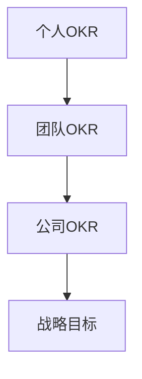
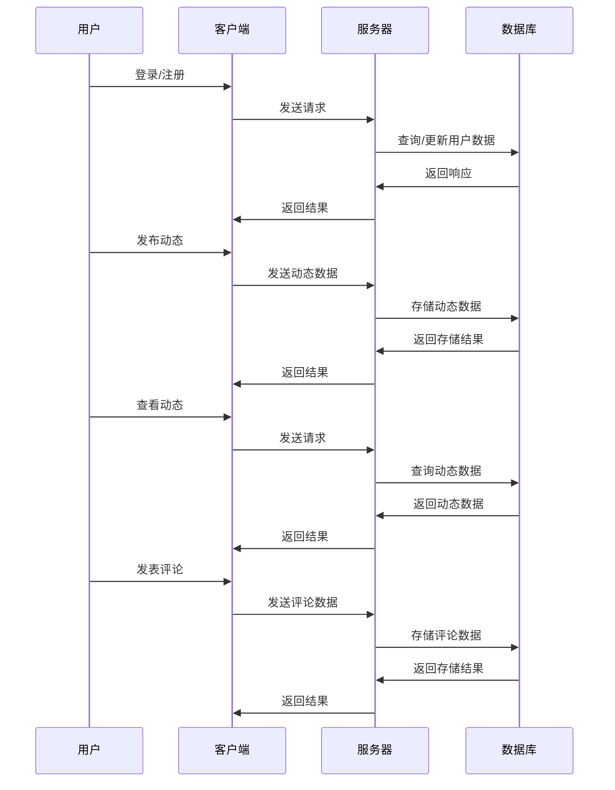

                 

# OKR在技术团队中的应用：目标管理与绩效考核

> 关键词：OKR、目标管理、绩效考核、技术团队

> 摘要：本文详细介绍了OKR（目标与关键结果）在技术团队中的应用，探讨了OKR的基本原理、实施步骤、优势与挑战。通过具体案例和实战经验，本文旨在帮助技术团队实现高效的目标管理和绩效考核。

## 第一部分：引言

### 1.1 问题背景

#### 1.1.1 OKR概述
OKR（Objectives and Key Results，目标与关键结果）是一种管理策略框架，最早由英特尔公司提出并广泛应用。它通过设定明确的目标和可衡量的关键结果，帮助团队和组织实现其战略目标。

#### 1.1.2 问题提出
在技术团队中，如何有效地进行目标管理和绩效考核，以提高团队效率和项目成功概率，是许多公司面临的重要问题。传统的绩效考核方式往往缺乏明确的量化指标，难以准确评估团队成员的贡献。

#### 1.1.3 解决方案
OKR为技术团队提供了一种有效的目标管理和绩效考核方法，通过设定明确的目标和可衡量的关键结果，帮助团队聚焦于关键任务，提高工作效率和成果。

### 1.2 书籍概述

#### 1.2.1 内容概述
本书旨在详细介绍OKR在技术团队中的应用，包括OKR的基本原理、实施步骤、评估方法和最佳实践。

#### 1.2.2 目标读者
本书适合技术团队的管理者、团队成员以及对OKR感兴趣的专业人士阅读。

#### 1.2.3 书籍结构
本书分为五个部分，分别介绍OKR的背景、原理、实施、评估和最佳实践。

## 第二部分：OKR的基本原理

### 2.1 OKR的定义

#### 2.1.1 Objectives（目标）
Objectives是OKR中的第一个字母，代表目标。它描述了团队或个人希望实现的具体成果或状态。

#### 2.1.2 Key Results（关键结果）
Key Results是OKR中的第二个字母，代表关键结果。它是一组具体的、可量化的指标，用于衡量目标是否达成。

### 2.2 OKR的特点

#### 2.2.1 目标导向性
OKR强调目标导向性，帮助团队明确方向和优先级，确保资源得到有效利用。

#### 2.2.2 明确性
OKR要求目标清晰明确，避免模糊和不确定性的描述。

#### 2.2.3 可衡量性
关键结果必须是可衡量的，以便于评估和反馈。

#### 2.2.4 对齐性
OKR要求团队内部的目标相互对齐，确保所有团队成员都朝着共同的目标努力。

### 2.3 OKR的层次结构

#### 2.3.1 个人OKR
个人OKR是OKR的基础，每个团队成员都需要设定自己的目标。

#### 2.3.2 团队OKR
团队OKR是个人OKR的集合，它反映了团队的整体目标和关键结果。

#### 2.3.3 公司OKR
公司OKR是团队OKR的集合，它定义了公司的战略目标和关键结果。

### 2.4 OKR的周期性

#### 2.4.1 设定周期
OKR的设定周期通常是季度，但也有些团队选择半年或年度。

#### 2.4.2 跟进周期
OKR的跟进周期通常是每周或每两周，以保持目标进度和及时调整。

### 2.5 OKR的优势

#### 2.5.1 提高效率
OKR帮助团队聚焦关键任务，避免分散精力，提高工作效率。

#### 2.5.2 促进沟通
OKR提供了一个共同的语言和框架，有助于团队成员之间的沟通和协作。

#### 2.5.3 可视化
OKR的可视化特性使团队能够一目了然地了解进展情况和目标状态。

### 2.6 OKR的挑战

#### 2.6.1 目标设定难度
设定明确、可衡量的目标并不容易，需要团队共同努力。

#### 2.6.2 持续跟进
OKR需要持续跟进和反馈，否则容易失去效果。

#### 2.6.3 公司层面的挑战
在大型组织中，确保公司OKR与团队OKR的对齐可能面临挑战。

## 第三部分：OKR的实施步骤

### 3.1 确定目标

#### 3.1.1 设定公司目标
公司目标应与公司的战略愿景和年度计划对齐。

#### 3.1.2 设定团队目标
团队目标应与公司目标一致，同时考虑团队的具体情况和优先级。

#### 3.1.3 设定个人目标
个人目标应与团队目标和公司目标对齐，同时考虑个人的职责和兴趣。

### 3.2 确定关键结果

#### 3.2.1 选择关键结果
选择能够准确衡量目标达成情况的关键结果。

#### 3.2.2 确保关键结果的可衡量性
关键结果应具有可衡量性，以便于评估和反馈。

#### 3.2.3 设置关键结果的目标值
为每个关键结果设定合理的预期目标值，确保目标的可达性。

## 第四部分：OKR在技术团队中的应用实例

### 4.1 案例背景
以某互联网公司技术团队为例，该团队负责公司核心产品的研发和迭代。

### 4.2 设定公司OKR
公司目标：推出两款新功能，提高用户活跃度和留存率。

### 4.3 设定团队OKR
团队目标：
- 目标1：完成两款新功能的研发和上线。
- 目标2：提高项目交付质量和效率。

### 4.4 设定个人OKR
团队成员的OKR：
- 前端工程师：确保前端功能完整性和用户体验。
- 后端工程师：优化后端性能和稳定性。
- 测试工程师：确保功能测试覆盖率和bug修复率。

### 4.5 确定关键结果
关键结果示例：
- 公司关键结果：新功能上线后的用户反馈评分和用户留存率。
- 团队关键结果：新功能完成率和项目交付周期。
- 个人关键结果：任务完成率、代码质量评分、bug修复效率。

### 4.6 实施与跟进
团队成员根据设定的OKR进行工作，团队领导定期跟进进度，确保目标的达成。

## 第五部分：OKR的评估与反馈

### 5.1 评估周期
OKR的评估周期通常与设定周期一致，例如季度评估。

### 5.2 评估方法
评估方法包括定期的团队会议、一对一沟通、关键结果分析等。

### 5.3 反馈机制
反馈机制包括正面反馈、负面反馈和改进建议，以帮助团队成员了解自己的表现和需要改进的地方。

## 第六部分：总结与展望

### 6.1 总结
OKR为技术团队提供了有效的目标管理和绩效考核方法，有助于提高团队效率和项目成功概率。

### 6.2 展望
随着技术的不断发展，OKR在技术团队中的应用将更加广泛，成为团队管理的重要工具。

### 6.3 最佳实践
为更好地实施OKR，建议团队在实施过程中注意以下事项：
- 明确目标和关键结果。
- 保持对齐和沟通。
- 定期评估和反馈。

## 第七部分：拓展阅读

- 《OKR工作法：谷歌、领英等顶级公司高效目标管理秘籍》
- 《敏捷绩效：OKR如何让每个员工都动起来》
- 《敏捷管理：技术团队的敏捷实践指南》

## 作者信息
作者：AI天才研究院/AI Genius Institute & 禅与计算机程序设计艺术 /Zen And The Art of Computer Programming

通过上述的逐步分析推理，本文详细介绍了OKR在技术团队中的应用，包括其基本原理、实施步骤、优势与挑战。通过具体案例，读者可以更好地理解如何将OKR应用于实际工作中，提高目标管理和绩效考核的效率。希望本文能为技术团队的管理者和团队成员提供有价值的参考。在未来的工作中，OKR将继续发挥其重要作用，助力技术团队实现更高水平的绩效。 ### 第一部分：引言

#### 1.1 问题背景

在快速发展的技术行业中，技术团队面临着不断变化的需求和复杂的项目挑战。如何确保团队成员的工作与公司整体战略目标保持一致，如何有效管理团队的目标和绩效，成为了许多企业关注的焦点。传统的绩效考核方式往往依赖于定期的评估和主观评价，这种模式难以提供明确的量化指标，导致团队成员的贡献难以准确衡量，进而影响到团队的效率和项目的成功。

OKR（Objectives and Key Results）作为一种目标管理和绩效评估的方法，最早由英特尔公司提出，并迅速被谷歌、亚马逊等科技巨头采纳。OKR通过设定明确的目标和可衡量的关键结果，帮助团队和组织聚焦于关键任务，提高工作效率和成果。在技术团队中，OKR可以有效地指导团队的目标设定和任务分配，确保团队能够在复杂的项目中保持清晰的方向和高效的执行。

**OKR概述**

OKR是一种目标管理框架，由两个核心要素组成：Objectives（目标）和Key Results（关键结果）。Objectives指的是团队或个人希望达成的具体成果或状态，它需要是挑战性的，同时又要可实现的。Key Results则是具体、可量化的指标，用于衡量目标的达成情况。通过设定明确的Objectives和Key Results，团队可以清晰地了解自己的工作方向和目标，同时也能够在过程中进行有效的监控和调整。

**问题提出**

尽管OKR在全球范围内得到了广泛应用，但在技术团队中实施OKR仍然面临一些挑战。首先，如何设定明确且具有挑战性的目标，确保它们既符合公司的战略愿景，又能够激励团队成员积极行动。其次，如何确保关键结果的可衡量性，避免出现模糊或不可衡量的指标，从而影响评估的准确性。此外，在大型技术团队中，如何确保各个团队之间的目标对齐，确保每个人的工作都能够为公司的整体目标贡献力量，也是需要解决的问题。

**解决方案**

OKR为技术团队提供了一种有效的解决方案。通过设定明确的目标和可衡量的关键结果，团队可以更好地聚焦于关键任务，提高工作效率和成果。同时，OKR提供了定期的评估和反馈机制，帮助团队成员及时了解自己的工作进展，发现问题并进行改进。通过这一方法，技术团队能够在保持敏捷和高效的同时，确保工作与公司战略目标保持一致。

**引言小结**

本部分主要介绍了技术团队在目标管理和绩效考核方面所面临的问题，以及OKR作为一种解决方案所带来的优势。接下来，本文将深入探讨OKR的基本原理、实施步骤和具体应用，以帮助技术团队更好地理解和应用OKR，提高绩效和项目成功率。

#### 1.2 书籍概述

**内容概述**

本书《OKR在技术团队中的应用：目标管理与绩效考核》旨在全面介绍OKR（目标与关键结果）在技术团队中的实际应用，帮助读者理解如何通过OKR实现高效的目标管理和绩效考核。本书分为五个部分，系统性地阐述了OKR的基本概念、实施方法、评估技巧以及最佳实践。

第一部分：引言
本部分主要介绍了OKR的基本背景，技术团队在目标管理和绩效考核中面临的问题，以及OKR提供的解决方案。

第二部分：OKR的基本原理
本部分详细介绍了OKR的定义、特点、层次结构和周期性，帮助读者全面理解OKR的框架和运作机制。

第三部分：OKR的实施步骤
本部分阐述了如何设定目标和关键结果，包括公司、团队和个人层面的目标设定，以及如何选择关键结果并设定合理的目标值。

第四部分：OKR在技术团队中的应用实例
本部分通过具体案例，展示了OKR在技术团队中的实际应用过程，包括目标设定、关键结果确定、实施与跟进等环节。

第五部分：OKR的评估与反馈
本部分介绍了OKR的评估周期、评估方法和反馈机制，以及如何通过评估和反馈持续优化OKR的实施。

**目标读者**

本书的目标读者主要包括以下几类：
1. 技术团队的管理者：希望通过OKR提升团队管理效能，实现高效目标管理的领导者。
2. 技术团队成员：希望了解OKR如何指导自己的工作，提高个人和团队绩效的成员。
3. 对OKR感兴趣的专业人士：希望深入了解OKR的理论和实践，拓展管理知识的专业人士。

**书籍结构**

本书分为以下五个部分：

**第一部分：引言**
- 1.1 问题背景
- 1.2 书籍概述

**第二部分：OKR的基本原理**
- 2.1 OKR的定义
- 2.2 OKR的特点
- 2.3 OKR的层次结构
- 2.4 OKR的周期性
- 2.5 OKR的优势
- 2.6 OKR的挑战

**第三部分：OKR的实施步骤**
- 3.1 确定目标
- 3.2 确定关键结果

**第四部分：OKR在技术团队中的应用实例**
- 4.1 案例背景
- 4.2 设定公司OKR
- 4.3 设定团队OKR
- 4.4 设定个人OKR
- 4.5 确定关键结果
- 4.6 实施与跟进

**第五部分：OKR的评估与反馈**
- 5.1 评估周期
- 5.2 评估方法
- 5.3 反馈机制

通过上述结构，本书旨在为技术团队提供一套完整、实用的OKR实施指南，帮助团队在目标管理和绩效考核方面取得显著成效。

## 第二部分：OKR的基本原理

### 2.1 OKR的定义

OKR（Objectives and Key Results）是一种目标管理框架，它由两个核心要素组成：Objectives（目标）和Key Results（关键结果）。Objectives指的是团队或个人希望达成的具体成果或状态，它需要是清晰且具有挑战性的。例如，对于一个产品团队，一个Objectives可能是“提高用户满意度”。而Key Results则是具体的、可量化的指标，用于衡量目标是否达成。例如，对应于“提高用户满意度”的目标，一个Key Results可能是“用户满意度评分从4.5提高到4.7”。

#### Objectives（目标）

Objectives是OKR中的第一个要素，它描述了团队或个人希望实现的具体成果或状态。Objectives需要具备以下几个特点：

1. **清晰明确**：Objectives需要明确、具体，避免模糊和含糊不清的描述，这样团队成员才能清楚地了解自己的目标是什么。
2. **具有挑战性**：OKR鼓励设定具有挑战性的目标，这有助于激发团队成员的潜力，推动团队不断进步。
3. **可解释性**：Objectives需要易于理解，即使新的团队成员也能够快速掌握。

例如，一个技术团队的Objectives可能是“提高系统稳定性”，这可以帮助团队聚焦于关键任务，确保在项目开发过程中注重系统的稳定性。

#### Key Results（关键结果）

Key Results是OKR中的第二个要素，它是一组具体的、可量化的指标，用于衡量目标是否达成。Key Results需要满足以下几个特点：

1. **具体性**：Key Results需要是具体的，而不是抽象的。例如，“提高用户满意度”是一个抽象的目标，而“用户满意度评分从4.5提高到4.7”是一个具体的Key Results。
2. **可衡量性**：Key Results需要是可衡量的，这样才能在后续的评估过程中进行准确的衡量和反馈。
3. **相关性**：Key Results需要与Objectives密切相关，确保衡量的是目标达成的具体表现。

例如，为了实现“提高系统稳定性”的Objectives，技术团队可以设定以下Key Results：
- “系统崩溃率从0.5%降低到0.2%”
- “系统平均响应时间从500ms降低到300ms”

#### OKR的结构

OKR由Objectives和Key Results组成，两者之间存在紧密的关联。Objectives提供了方向和目标，而Key Results则是衡量目标达成情况的指标。一个完整的OKR结构通常包括以下几个部分：

1. **Objectives**：描述团队或个人希望实现的具体成果或状态。
2. **Key Results**：一组具体的、可量化的指标，用于衡量目标是否达成。
3. **目标值**：为Key Results设定的预期目标值，通常是一个数字或百分比。
4. **备注**：对OKR的补充说明，可以包括背景信息、实现策略等。

例如：
- **Objectives**：提高用户满意度
- **Key Results**：
  - 用户满意度评分从4.5提高到4.7
  - 用户反馈率从5%降低到3%
- **目标值**：
  - 用户满意度评分：4.7
  - 用户反馈率：3%
- **备注**：将通过优化用户体验和提高用户支持服务质量来实现

通过这种结构，OKR不仅可以帮助团队明确目标，还可以在实现过程中提供具体的衡量标准，确保团队的工作能够朝着既定的目标稳步推进。

### 2.2 OKR的特点

OKR之所以在技术团队中得到广泛应用，是因为它具备以下几个显著特点，这些特点不仅使其成为有效的目标管理工具，还帮助团队提高工作效率和项目成功率。

#### 目标导向性

OKR强调目标导向性，要求团队明确自己的目标和方向。通过设定清晰的Objectives，团队可以确保所有成员都在朝着同一个目标努力，避免分散精力和资源。这种目标导向性有助于提高团队的工作效率和集中度，确保团队能够在有限的时间内实现最大的产出。

#### 明确性

在OKR中，目标的设定需要具备高度明确性。这意味着Objectives必须具体、明确，避免模糊和含糊不清的描述。例如，一个不明确的Objectives可能是“提高系统性能”，而一个明确的Objectives则是“将系统响应时间从500ms降低到300ms”。明确性有助于团队成员更好地理解自己的职责和任务，减少误解和混淆，从而提高工作效果。

#### 可衡量性

Key Results是OKR中衡量目标达成情况的具体指标，因此它们必须是可量化的。这意味着Key Results需要能够通过数据或指标进行衡量和评估，例如“用户满意度评分从4.5提高到4.7”、“系统崩溃率从0.5%降低到0.2%”。可衡量性不仅有助于团队在实现目标的过程中进行准确的监控和调整，还可以为后续的评估和反馈提供客观依据。

#### 对齐性

OKR的对齐性是指个人、团队和公司的目标需要保持一致。这意味着每个层面的目标都需要与更高层次的目标相匹配，确保团队的工作能够为公司的整体战略目标贡献力量。对齐性有助于团队更好地协同工作，确保所有成员的行动方向一致，从而提高整体绩效。

#### 挑战性

OKR鼓励团队设定具有挑战性的目标，这有助于激发团队成员的潜力和创造力。挑战性的目标不仅能够推动团队不断进步，还可以提升团队的士气和动力。然而，设定的目标需要既有挑战性又可达成，以避免目标过于难以实现而挫伤团队的积极性。

#### 透明性

OKR的透明性是指目标和管理过程对团队成员是开放的。这有助于团队之间的信息共享和协作，确保每个人都能清楚地了解自己的目标和团队的整体进度。透明性不仅能够提高团队的信任和合作，还可以帮助团队成员及时发现问题并进行改进。

#### 可视化

OKR的可视化特性使其易于理解和跟踪。通过在会议室、工作台或团队网站上展示OKR，团队成员可以一目了然地了解当前的目标和进展情况。这种可视化的效果不仅能够提高团队的透明度，还可以帮助团队成员保持对目标的关注和动力。

#### 综合以上特点，OKR为技术团队提供了一种高效的目标管理工具。通过明确的目标、具体的衡量指标和持续的对齐和评估，技术团队能够更好地聚焦于关键任务，提高工作效率和项目成功率。同时，OKR的灵活性和适应性使其适用于各种规模和类型的团队，无论是个体开发者还是大型跨国企业，都可以从中受益。因此，OKR逐渐成为现代企业中不可或缺的管理方法之一。 ### 2.3 OKR的层次结构

OKR的层次结构是其在组织中有效运作的关键因素之一。通过在个人、团队和公司三个层面设定和执行OKR，团队能够确保各个层面的目标保持一致，从而实现整体战略目标。以下是OKR在不同层次结构的详细说明：

#### 2.3.1 个人OKR

个人OKR是OKR的基础，每个团队成员都需要设定自己的OKR。个人OKR的目标和关键结果应与团队目标和公司目标保持对齐，同时考虑个人的职责和兴趣。以下是一个个人OKR的示例：

- **Objectives**：
  - 提高项目交付质量
  - 提升个人技术能力
- **Key Results**：
  - 项目按时交付率从90%提升到95%
  - 完成至少两个技术培训课程
  - 成功解决至少三个复杂技术问题

个人OKR的设定不仅有助于提升团队成员的个人发展，还可以确保团队整体目标的实现。

#### 2.3.2 团队OKR

团队OKR是个人OKR的集合，它反映了团队的整体目标和关键结果。团队OKR的目标和关键结果应与公司的战略目标保持一致，同时考虑团队的具体情况和优先级。以下是一个团队OKR的示例：

- **Objectives**：
  - 完成新功能研发并上线
  - 提高团队协作效率
- **Key Results**：
  - 新功能按时上线率100%
  - 团队会议效率评估评分从4.5提高到4.8
  - 完成至少两个跨部门合作项目

团队OKR的设定有助于确保团队成员的工作方向一致，提高团队的协作效率，从而实现团队的整体目标。

#### 2.3.3 公司OKR

公司OKR是团队OKR的集合，它定义了公司的战略目标和关键结果。公司OKR的目标和关键结果应反映公司的长期战略和愿景，同时考虑各个团队的目标和优先级。以下是一个公司OKR的示例：

- **Objectives**：
  - 推出两款新产品
  - 提高用户满意度和市场占有率
- **Key Results**：
  - 两款新产品按时推出
  - 用户满意度评分从4.6提高到4.8
  - 市场占有率提高至15%

公司OKR的设定有助于确保所有团队的工作都与公司的整体战略目标对齐，从而实现公司的长期发展。

#### 2.3.4 层次结构的关系

个人OKR、团队OKR和公司OKR之间存在着紧密的关联。个人OKR需要与团队OKR保持一致，以确保团队成员的工作方向一致；团队OKR需要与公司OKR保持一致，以确保团队的工作能够为公司的整体战略目标贡献力量。这种层次结构的关系有助于确保整个组织的目标对齐，从而实现高效运作。

**图1：OKR的层次结构关系**



通过图1，我们可以清晰地看到OKR在不同层次结构中的关系。个人OKR是团队OKR的基础，团队OKR是公司OKR的组成部分，而公司OKR则与组织的整体战略目标紧密相连。

**2.3.5 层次结构的优势**

- **目标对齐**：通过层次结构的设定，确保个人、团队和公司的目标保持一致，避免目标冲突，提高工作效率。
- **协同合作**：层次结构有助于团队之间的协同合作，确保各个团队的工作能够为整体目标贡献力量。
- **透明性**：层次结构的透明性有助于团队成员了解自己的目标和公司整体战略，提高工作动力和责任感。
- **可衡量性**：层次结构中的目标和关键结果具有可衡量性，便于进行评估和反馈，帮助团队及时调整和优化工作。

总之，OKR的层次结构为技术团队提供了一种系统化的目标管理方法，有助于确保目标对齐、协同合作、透明性和可衡量性，从而提高团队的工作效率和项目成功率。

### 2.4 OKR的周期性

OKR的周期性是指其在设定、执行和评估过程中的时间安排。通过科学合理的周期安排，团队能够确保OKR的实施有序进行，同时也能够在过程中进行及时的调整和优化。以下是OKR的周期性安排及其在不同阶段的详细说明。

#### 2.4.1 设定周期

OKR的设定周期通常为季度，但也可以根据团队的具体情况选择半年或年度。设定周期通常在上一周期结束后的几周内进行，以便团队有足够的时间进行总结和反思。设定周期的具体步骤如下：

1. **回顾与总结**：团队在设定新周期OKR之前，需要回顾和总结上一个周期的执行情况和成果，包括成功的经验和需要改进的地方。
2. **讨论与规划**：团队成员一起讨论并制定新周期的OKR，确保新周期OKR与公司的战略目标和对齐。
3. **目标设定**：根据讨论的结果，设定新的OKR，包括Objectives和Key Results。Objectives应具有挑战性，同时又要可达成；Key Results则应具体、可衡量。
4. **审批与发布**：设定的OKR需要经过上级或相关部门的审批，确保其符合公司战略和实际可行性，然后发布给团队成员，正式开始执行。

#### 2.4.2 跟进周期

跟进周期是指团队在执行OKR过程中进行监控和调整的时间间隔。跟进周期通常为每周或每两周，这取决于团队的具体情况和任务的紧急程度。跟进周期的具体步骤如下：

1. **进度检查**：团队成员在跟进周期开始时，检查自己OKR的执行进度，确定是否按计划进行。
2. **团队会议**：团队定期召开会议，讨论OKR的执行情况，分享进展和遇到的问题，共同寻找解决方案。
3. **问题解决**：针对在跟进过程中遇到的问题，团队需要及时解决，确保不影响OKR的执行进度。
4. **调整计划**：如果发现OKR的执行进度与预期不符，团队需要及时调整计划，包括调整目标值或关键结果，确保能够按时完成目标。

#### 2.4.3 评估周期

评估周期是指OKR执行结束后进行的评估和反馈时间。评估周期通常与设定周期一致，例如季度评估。评估周期的具体步骤如下：

1. **成果评估**：团队对OKR的执行情况进行全面评估，包括是否达成目标以及达成的程度。
2. **反馈与总结**：团队成员根据评估结果，进行自我反馈和团队反馈，总结成功的经验和需要改进的地方。
3. **表彰与激励**：对于达成目标的团队成员，团队应进行表彰和激励，以鼓励团队士气，促进持续改进。
4. **改进计划**：团队根据评估结果，制定下一周期的改进计划，为下一周期的工作做好准备。

#### 2.4.4 周期性安排的优势

- **有序管理**：通过设定周期性安排，团队能够有序地进行目标设定、执行和评估，确保工作有条不紊地进行。
- **及时调整**：跟进周期的设置使团队能够在执行过程中及时发现并解决问题，避免进度延误。
- **持续改进**：评估周期的设置有助于团队在总结经验教训的基础上，不断优化目标和关键结果，提高绩效。
- **透明沟通**：周期性安排提供了一个定期沟通和反馈的机制，有助于团队之间保持良好的沟通和协作。

总之，OKR的周期性安排为技术团队提供了一个系统化的目标管理框架，通过有序的周期性管理，团队能够确保目标的清晰性、执行的高效性和评估的准确性，从而实现持续改进和高效运作。

### 2.5 OKR的优势

OKR作为一种目标管理和绩效评估工具，在技术团队中的应用带来了显著的优势。通过以下几个方面，我们可以看到OKR如何提升团队效率和项目成功率。

#### 提高效率

OKR通过设定明确的目标和可衡量的关键结果，使团队能够聚焦于关键任务，避免分散精力。这种集中精力的方式有助于提高工作效率，确保团队成员能够将时间和精力投入到最有价值的工作中。例如，通过明确的Objectives和Key Results，团队能够迅速识别出哪些任务是最为重要的，从而优先处理这些任务，提高整体的工作效率。

**案例说明：** 在一个软件开发团队中，通过设定明确的OKR，团队可以将重点放在核心功能开发和性能优化上，而不是在非关键的任务上浪费时间和资源。这种聚焦不仅提高了开发效率，还缩短了项目的交付时间。

#### 促进沟通

OKR提供了一个共同的语言和框架，使得团队成员能够清晰地了解团队的目标和方向。这种共同的理解有助于促进团队内部的沟通和协作，确保每个人的工作都与团队的目标保持一致。此外，定期进行OKR的回顾和反馈，也为团队成员提供了一个交流的平台，有助于解决工作中遇到的问题，提高团队的整体协作能力。

**案例说明：** 在一个跨部门的团队中，通过共享和讨论OKR，团队成员能够更好地理解彼此的工作内容和目标，从而在项目执行过程中能够更有效地进行协作，避免信息孤岛和重复工作。

#### 可视化

OKR的可视化特性使得团队和成员可以直观地了解当前的目标状态和进度。通过在会议室、白板或团队网站上展示OKR，团队能够一目了然地看到自己的目标和进展情况。这种可视化不仅有助于团队保持对目标的关注，还可以提高团队成员的动力和责任感，确保每个人都清楚自己的工作目标和期望。

**案例说明：** 在一个大型技术项目中，通过在团队会议室中展示OKR，团队成员可以实时查看项目的进度和关键结果的达成情况。这种可视化的方式不仅有助于团队及时调整工作计划，还可以激励团队成员为实现目标而努力。

#### 持续反馈

OKR的周期性评估和反馈机制，使得团队能够在执行过程中及时发现问题并进行改进。通过定期的评估和反馈，团队不仅可以了解目标的达成情况，还可以收集成员的意见和建议，从而优化目标和关键结果，提高未来的执行效果。

**案例说明：** 在一个迭代开发项目中，团队通过每两周的OKR回顾会，及时评估和反馈项目的进展情况。这种定期反馈机制不仅帮助团队识别问题并及时调整，还促进了团队成员之间的沟通和协作，确保项目能够按计划顺利进行。

#### 提升团队绩效

OKR通过设定挑战性的目标，激发了团队成员的潜力和创造力，从而提升了团队的绩效。同时，OKR的对齐性确保了个人、团队和公司的目标一致，使得团队的工作能够为公司的整体战略目标贡献力量。这种目标对齐和绩效提升相结合的方式，有助于团队实现更高的工作绩效和项目成功率。

**案例说明：** 在一个创新项目中，团队通过设定具有挑战性的OKR，激发了团队成员的创新意识和积极性。在团队的努力下，不仅项目按时完成，还成功推出了多个创新功能，赢得了客户的赞誉和市场的高度评价。

总之，OKR通过提高效率、促进沟通、可视化、持续反馈和提升团队绩效等多个方面，为技术团队提供了有效的目标管理和绩效考核工具。通过合理应用OKR，技术团队能够在复杂的项目环境中保持清晰的方向和高效的工作状态，实现团队和公司的共同目标。

### 2.6 OKR的挑战

尽管OKR在目标管理和绩效评估中具有许多优势，但在实际应用中仍面临一些挑战。这些挑战包括目标设定的难度、持续跟进的必要性以及公司层面的挑战，以下将逐一进行探讨。

#### 目标设定的难度

设定明确、可衡量且具有挑战性的目标是一个复杂的过程，需要团队成员具备较高的战略思维和执行能力。以下是一些目标设定过程中可能遇到的困难：

1. **目标模糊性**：如果设定的目标过于模糊，例如“提高产品质量”或“提升用户满意度”，这种目标难以具体衡量，容易导致执行过程中的困惑和偏差。
2. **目标过高或过低**：目标设定的难度还在于目标值的设定。目标过高可能导致团队成员感到无法实现，从而挫伤积极性；目标过低则可能无法激发团队的潜力，导致资源浪费。
3. **缺乏一致性**：在多个团队共同工作时，目标设定的一致性尤为重要。如果各个团队的目标不一致，可能导致资源分散，无法形成协同效应。

**解决方案**：
- **明确性和具体性**：在设定目标时，确保目标具有明确性和具体性，使用量化的指标进行描述，例如“将产品缺陷率降低到0.1%”。
- **合理的目标值**：在设定目标值时，需要结合团队的实际能力和公司的战略目标，确保目标既有挑战性又可达成。
- **跨团队协调**：通过定期会议和沟通，确保不同团队之间的目标保持一致，避免资源浪费和目标冲突。

#### 持续跟进的必要性

OKR的有效实施不仅依赖于目标设定，还需要持续的跟进和反馈。以下是在跟进过程中可能遇到的问题：

1. **缺乏持续关注**：如果团队在设定OKR后缺乏持续的关注和跟进，可能导致目标在执行过程中逐渐被忽视，最终无法实现。
2. **信息不对称**：在大型团队中，信息不对称可能导致某些团队成员无法及时了解项目的进展和目标状态，从而影响工作的协调和效率。
3. **缺乏反馈机制**：没有有效的反馈机制，团队难以及时发现和解决问题，导致OKR的实施效果大打折扣。

**解决方案**：
- **定期跟进**：通过定期（如每周或每两周）的跟进会议，确保团队成员了解项目的进展情况，及时调整计划。
- **透明沟通**：建立透明的沟通机制，确保所有团队成员都能及时了解项目的进展和目标状态。
- **及时反馈**：建立及时的反馈机制，鼓励团队成员提出问题和建议，及时解决问题和调整工作计划。

#### 公司层面的挑战

在大型组织中，实施OKR可能面临以下公司层面的挑战：

1. **战略一致性**：在大型组织中，不同部门可能有不同的战略目标，确保公司层面的OKR与各部门的OKR保持一致是一个挑战。
2. **资源分配**：在资源有限的情况下，如何合理分配资源以支持OKR的执行是一个重要问题。
3. **文化适应**：OKR的实施需要企业文化和管理方式的适应，如果公司文化不鼓励创新和目标导向，OKR可能难以得到有效执行。

**解决方案**：
- **统一战略规划**：公司需要制定统一的战略规划，确保所有部门的目标和OKR与公司整体战略保持一致。
- **资源优化**：通过资源优化和优先级管理，确保关键任务和目标得到足够的资源支持。
- **文化重塑**：通过培训和激励机制，推动企业文化的转变，鼓励目标导向和持续改进。

总之，尽管OKR在实际应用中面临一些挑战，但通过合理的解决方案，团队能够克服这些困难，充分发挥OKR的优势，实现高效的目标管理和绩效考核。 ### 第三部分：OKR的实施步骤

OKR的实施步骤是确保其在技术团队中有效运作的关键。以下详细阐述了如何设定公司、团队和个人层面的OKR，以及选择和设定关键结果的步骤。

#### 3.1 确定目标

**3.1.1 设定公司目标**

公司目标的设定应当与公司的战略愿景和年度计划对齐。公司目标通常需要涵盖业务增长、产品开发、市场扩展等方面。以下是设定公司目标的步骤：

1. **战略规划**：首先，公司需要明确其战略愿景和长期目标，这将为公司目标提供方向和依据。
2. **目标制定**：基于战略规划，公司可以制定具体、可量化的公司目标。例如，公司目标可能是“在下一季度实现收入增长20%”或“发布三个新产品”。
3. **目标分解**：将公司目标分解为更具体的子目标，以便于团队和部门进行落实。这些子目标应与公司目标一致，同时具有可衡量性。

**示例**：
- **公司目标**：
  - 在下一个季度实现收入增长20%
  - 发布两个新的软件产品

**3.1.2 设定团队目标**

团队目标的设定应与公司目标对齐，同时考虑团队的具体情况和优先级。以下是设定团队目标的步骤：

1. **理解公司目标**：团队需要深入理解公司目标，确保团队目标与之保持一致。
2. **目标制定**：基于对公司目标的分解，团队可以制定符合自身职责和使命的目标。例如，一个研发团队的目标可能是“在三个月内完成新产品的功能开发”。
3. **目标优先级**：根据团队资源和任务的重要性，设定目标的优先级，确保团队能够高效地分配资源和精力。

**示例**：
- **团队目标**：
  - 在三个月内完成新产品的功能开发
  - 提高项目交付效率10%

**3.1.3 设定个人目标**

个人目标的设定需要与团队目标和公司目标对齐，同时考虑个人的职责和兴趣。以下是设定个人目标的步骤：

1. **理解团队目标**：个人需要明确团队目标，确保个人目标与之保持一致。
2. **目标制定**：基于团队目标，个人可以制定符合自己职责和兴趣的目标。例如，一个开发人员的目标可能是“在两周内完成一个关键功能的代码编写”。
3. **目标可衡量**：确保个人目标具有可衡量性，以便于评估和反馈。例如，一个测试人员的目标可能是“在一个月内完成200个测试案例”。

**示例**：
- **个人目标**：
  - 在两周内完成一个关键功能的代码编写
  - 在一个月内完成200个测试案例

#### 3.2 确定关键结果

关键结果是衡量目标是否达成的具体指标，其设定需要遵循以下步骤：

**3.2.1 选择关键结果**

1. **相关性**：选择与目标密切相关且具有实际意义的指标。这些指标应能够清晰地反映目标的达成情况。
2. **具体性**：关键结果应具体、明确，避免模糊的描述。例如，“提高用户满意度”不如“用户满意度评分从4.5提高到4.7”具体。
3. **可衡量性**：关键结果必须是可以量化的，以便于后续的评估和反馈。

**示例**：
- **公司关键结果**：
  - 收入增长20%
  - 新产品发布三个
- **团队关键结果**：
  - 新产品功能开发完成率100%
  - 项目交付周期缩短10%
- **个人关键结果**：
  - 关键功能代码编写完成率100%
  - 测试案例完成量200个

**3.2.2 确保关键结果的可衡量性**

为确保关键结果的可衡量性，需要遵循以下原则：

1. **量化指标**：使用具体的数字或百分比来描述关键结果。例如，“用户满意度评分从4.5提高到4.7”。
2. **明确标准**：为关键结果设定明确的衡量标准和评估方法。例如，用户满意度可以通过问卷调查和用户反馈评分进行衡量。
3. **动态调整**：在实施过程中，如关键结果难以达到预期，可以及时调整目标和关键结果，确保其仍然具有实际意义和可实现性。

**3.2.3 设置关键结果的目标值**

为每个关键结果设定合理的预期目标值，确保目标的可达性。以下是设置目标值的步骤：

1. **设定合理值**：目标值应既有挑战性又可实现，避免过高或过低。例如，“提高用户满意度评分”的目标值可以是“从4.5提高到4.7”。
2. **可追踪性**：目标值应易于追踪和衡量，以便于后续的评估和反馈。
3. **定期更新**：在执行过程中，根据实际情况和进展，可以定期更新关键结果的目标值，确保目标始终具有实际意义和可达成性。

**示例**：
- **目标值**：
  - 用户满意度评分：4.7
  - 项目交付周期缩短：10%
  - 关键功能代码编写完成率：100%

通过上述步骤，技术团队能够科学合理地设定和实施OKR，确保目标的明确性、可衡量性和可实现性，从而提高团队效率和项目成功率。

### 3.3 实施步骤总结

设定公司、团队和个人OKR以及选择和设定关键结果是OKR实施的重要步骤。通过明确的目标和具体的关键结果，团队能够确保工作方向一致，资源分配合理，工作进度可监控，绩效可评估。以下是实施步骤的总结：

1. **明确目标**：确保公司、团队和个人目标与战略和实际工作保持一致。
2. **具体关键结果**：选择具体、可衡量且与目标相关的关键结果。
3. **合理目标值**：设定合理的目标值，确保目标的挑战性和可实现性。
4. **持续跟进**：定期检查和调整目标，确保OKR的有效实施。
5. **评估与反馈**：通过定期的评估和反馈，优化目标和关键结果，提高执行效果。

通过科学合理的实施步骤，技术团队能够充分发挥OKR的优势，实现高效的目标管理和绩效考核。

### 4.1 案例背景

为了更好地理解OKR在技术团队中的应用，我们来看一个实际案例。某互联网公司技术团队负责公司核心产品的研发和迭代。这个团队由前端工程师、后端工程师、测试工程师等多个成员组成，成员分布在不同的办公地点。公司的战略目标是推出两个新功能，提升用户体验，并确保产品的稳定性和安全性。在这个背景下，团队决定引入OKR来管理和优化工作流程。

#### 4.2 设定公司OKR

公司OKR的设定应当与公司的战略目标和愿景紧密相连。以下是该公司的OKR示例：

- **Objectives**：
  - 推出两款新功能，提升用户体验
  - 保证产品稳定性和安全性
- **Key Results**：
  - 新功能A上线时间：Q2季度末
  - 新功能B上线时间：Q3季度末
  - 产品崩溃率降低至0.1%
  - 用户满意度评分提升至4.8

#### 4.3 设定团队OKR

团队OKR需要与公司OKR保持一致，同时考虑团队的具体任务和职责。以下是该技术团队的OKR示例：

- **Objectives**：
  - 完成新功能A和功能B的开发和上线
  - 提高团队协作效率
  - 保证代码质量和测试覆盖率
- **Key Results**：
  - 功能A完成率：100%
  - 功能B完成率：100%
  - 团队协作评分提升至4.5
  - 代码质量评分提升至4.8
  - 测试覆盖率提高至90%

#### 4.4 设定个人OKR

个人OKR应当与团队OKR和个人职责保持一致。以下是该技术团队几个成员的个人OKR示例：

- **前端工程师**：
  - **Objectives**：
    - 负责功能A的前端开发
    - 提高前端性能
  - **Key Results**：
    - 功能A前端代码完成率：100%
    - 前端性能优化完成率：90%
  - **目标值**：
    - 前端代码质量评分：4.9

- **后端工程师**：
  - **Objectives**：
    - 负责功能B的后端开发
    - 优化后端性能
  - **Key Results**：
    - 功能B后端代码完成率：100%
    - 后端性能提升率：20%
  - **目标值**：
    - 后端代码质量评分：4.9

- **测试工程师**：
  - **Objectives**：
    - 保证功能A和功能B的测试覆盖率
    - 及时反馈测试结果
  - **Key Results**：
    - 功能A测试覆盖率：100%
    - 功能B测试覆盖率：100%
    - 测试结果反馈时间缩短至2天
  - **目标值**：
    - 测试质量评分：4.8

#### 4.5 确定关键结果

关键结果的选择和设定是OKR实施的核心。以下是技术团队在设定关键结果时考虑的几个方面：

- **具体性和可衡量性**：确保关键结果具有明确和量化的指标，例如“功能A前端代码完成率：100%”。
- **相关性和重要性**：选择与目标和职责密切相关且对目标实现有重要影响的指标，例如“后端性能提升率：20%”。
- **可达成性**：设定合理且具有挑战性的目标值，确保关键结果的实现既可激励团队成员，又不会过于困难，例如“前端代码质量评分：4.9”。
- **动态调整**：在执行过程中，如发现关键结果难以实现，应灵活调整目标值和关键结果，确保OKR的可实现性和有效性。

通过上述步骤，该技术团队能够明确目标、设定具体的关键结果，并通过OKR框架有效地管理和优化工作流程，确保公司战略目标的实现。

### 4.6 实施与跟进

在确定了公司、团队和个人OKR以及关键结果后，接下来的关键步骤是实施和跟进这些目标，确保它们能够被有效地执行和达成。

#### 4.6.1 实施过程

1. **目标分解**：将公司、团队和个人的OKR分解为具体的工作任务，明确每个任务的责任人和截止时间。
2. **资源分配**：根据任务需求，合理分配人力资源和资源，确保每个任务都有足够的支持。
3. **工具支持**：选择适当的工具和平台来管理和跟踪OKR的执行情况，例如项目管理软件、看板工具等。
4. **定期会议**：团队定期召开会议，讨论OKR的执行情况，分享进展和问题，确保所有成员都了解当前的工作状态和目标进展。
5. **透明沟通**：确保所有团队成员都能随时查看和了解OKR的进展情况，增强团队之间的透明度和协作。

#### 4.6.2 跟进机制

1. **每周或每两周跟进**：根据任务的紧急程度和进度，设定跟进周期，定期检查OKR的执行情况。
2. **进度报告**：团队成员定期提交进度报告，包括任务的完成情况、遇到的问题和解决方案。
3. **问题解决**：在跟进过程中，及时发现并解决问题，确保不影响目标的达成。
4. **调整计划**：如果发现某些任务无法按计划完成，需要及时调整计划和资源分配，确保目标的实现。
5. **反馈与激励**：对于表现突出的团队成员，给予积极的反馈和激励，以鼓励团队士气，促进持续改进。

#### 4.6.3 实施过程案例

以下是该技术团队在实施OKR过程中的具体步骤：

1. **目标分解**：
   - 前端工程师：负责功能A的前端开发，包括设计、编码和测试。
   - 后端工程师：负责功能B的后端开发，包括API设计、数据库优化和性能测试。
   - 测试工程师：负责两个功能的全面测试，包括功能测试、性能测试和安全测试。

2. **资源分配**：
   - 前端工程师：配备2名开发人员，1名设计师。
   - 后端工程师：配备3名开发人员，1名数据库管理员。
   - 测试工程师：配备4名测试人员。

3. **工具支持**：
   - 使用JIRA进行任务管理和进度跟踪。
   - 使用GitLab进行代码管理和版本控制。
   - 使用Selenium进行自动化测试。

4. **定期会议**：
   - 团队每周召开一次会议，讨论OKR的执行情况和遇到的问题。
   - 前端工程师和后端工程师分别每周召开一次内部会议，讨论开发进度和问题。

5. **透明沟通**：
   - 在会议室的白板上展示当前的OKR和关键结果，所有团队成员都可以随时查看。
   - 使用Slack进行即时沟通，确保团队成员之间的信息畅通。

#### 4.6.4 跟进机制案例

1. **每周跟进**：
   - 周一：团队成员提交上周的工作总结和本周的工作计划。
   - 周二：团队召开会议，讨论上周的工作进展和遇到的问题，调整本周的工作计划。

2. **进度报告**：
   - 前端工程师：每周提交前端开发进度的报告，包括完成的页面数量、遇到的挑战和解决方案。
   - 后端工程师：每周提交后端开发进度的报告，包括完成的API接口数量、性能优化的结果。
   - 测试工程师：每周提交测试进展的报告，包括测试覆盖率的提升、发现的bug数量和修复情况。

3. **问题解决**：
   - 遇到技术难题时，团队成员可以通过内部讨论或外部请教的方式快速解决问题。
   - 对于团队协作中遇到的问题，通过定期会议进行讨论和解决。

4. **调整计划**：
   - 根据每周的进展情况，及时调整任务优先级和资源分配，确保关键任务的完成。
   - 如有重大变化，及时更新OKR，确保目标始终与实际情况相符。

5. **反馈与激励**：
   - 对于在OKR执行过程中表现突出的团队成员，给予额外的奖励和认可。
   - 定期进行绩效评估，为团队成员提供职业发展和晋升的机会。

通过上述实施与跟进的具体步骤，技术团队能够确保OKR的有效执行，提高工作效率和项目成功率，最终实现公司的战略目标。

### 5.1 评估周期

评估周期是OKR实施过程中的关键环节，通过定期评估，团队能够全面了解目标的达成情况，发现存在的问题并进行改进。以下详细说明了OKR的评估周期、评估方法和反馈机制。

#### 5.1.1 评估周期

评估周期通常与OKR的设定周期保持一致，例如季度、半年或年度。在一个季度结束或任务完成后，团队会进行一次全面的评估。评估周期的具体安排取决于公司的规模、团队的工作内容和项目的复杂性。

- **季度评估**：适用于大多数技术团队，每季度进行一次评估，可以及时发现问题并进行调整。
- **半年评估**：适用于大型项目和长期目标，半年评估能够提供更详细和全面的分析。
- **年度评估**：适用于公司级目标和长期战略，年度评估有助于团队进行全面的回顾和总结。

#### 5.1.2 评估方法

评估方法包括以下几个方面：

1. **自我评估**：团队成员对自己完成的任务和达成的目标进行自我评估，填写评估报告。
2. **团队评估**：团队成员之间相互评估，通过讨论和反馈，共同评估目标和关键结果的达成情况。
3. **上级评估**：上级领导对团队成员的评估结果进行审核和反馈，确保评估的准确性和公正性。
4. **数据分析**：利用数据分析和报告，对关键结果进行量化的评估，确保评估的客观性和准确性。

#### 5.1.3 反馈机制

反馈机制是OKR评估的重要组成部分，通过及时的反馈，团队能够及时发现问题并进行改进。以下是一些常用的反馈机制：

1. **定期反馈会议**：在评估周期结束后，团队定期召开反馈会议，讨论评估结果和存在的问题。
2. **一对一沟通**：团队成员与上级领导进行一对一的沟通，了解评估结果和改进建议。
3. **评估报告**：定期提交评估报告，详细记录评估结果和改进计划，确保团队能够持续优化工作。
4. **奖励与激励**：对于达成目标的团队成员，给予奖励和认可，鼓励团队士气，促进持续改进。

#### 5.1.4 评估与反馈的步骤

1. **评估准备**：在评估周期开始前，团队需要准备相关的数据和报告，确保评估的准确性和完整性。
2. **自我评估**：团队成员根据设定的目标和关键结果，填写自我评估报告，总结自己的工作成果和改进点。
3. **团队评估**：团队成员之间相互评估，通过讨论和反馈，共同评估目标和关键结果的达成情况。
4. **上级评估**：上级领导对团队成员的评估结果进行审核和反馈，确保评估的公正性和准确性。
5. **反馈与改进**：根据评估结果，团队成员进行反馈和改进，制定下一周期的改进计划，确保目标持续优化。
6. **总结与总结**：在评估周期结束后，团队总结评估结果和改进过程，为下一周期的工作做好准备。

通过科学合理的评估周期、评估方法和反馈机制，技术团队能够确保OKR的有效实施和持续改进，提高团队效率和项目成功率。

### 5.2 评估方法

评估方法在OKR实施过程中起着至关重要的作用，它不仅帮助团队了解目标的达成情况，还能发现问题和改进点，从而优化工作流程和提升团队绩效。以下详细介绍几种常用的评估方法和工具，以及如何进行评估和反馈。

#### 5.2.1 自我评估

自我评估是OKR评估的基础，团队成员需要定期对自己在设定周期内的工作进行总结和反思。以下是一些关键步骤：

1. **目标回顾**：团队成员回顾自己设定的目标，明确目标的完成情况。
2. **关键结果分析**：对每个关键结果进行详细分析，评估其达成情况。
3. **自我反馈**：根据目标和关键结果的达成情况，进行自我反馈，总结成功经验和需要改进的地方。

**工具**：可以使用Excel表格或OKR管理工具，如Google OKR、Notion等，记录和跟踪自我评估的结果。

**示例**：

- **前端工程师**：完成了功能A的前端开发，但发现性能优化未达到预期。
- **后端工程师**：完成了功能B的后端开发，但遇到了一些性能瓶颈。

#### 5.2.2 团队评估

团队评估是团队成员之间相互评估的过程，通过集体讨论和反馈，更全面地了解团队的绩效。以下是一些关键步骤：

1. **会议安排**：定期召开团队评估会议，确保所有成员都能参与。
2. **互评环节**：团队成员之间相互评估，分享对彼此工作的观察和反馈。
3. **问题讨论**：在互评过程中，讨论遇到的问题和挑战，共同寻找解决方案。
4. **总结反馈**：对评估结果进行总结，明确改进方向和下一步行动计划。

**工具**：可以使用会议纪要、讨论平台或团队协作工具，如Slack、Trello等，记录和跟踪团队评估的结果。

**示例**：

- **前端工程师**：性能优化未达到预期，团队建议采用不同的优化策略。
- **后端工程师**：遇到了性能瓶颈，团队建议进行代码优化和数据库调优。

#### 5.2.3 上级评估

上级评估是团队领导对团队成员工作绩效的正式评估，旨在确保评估的公正性和全面性。以下是一些关键步骤：

1. **评估标准**：制定明确的评估标准和指标，确保评估的客观性。
2. **一对一沟通**：与每个团队成员进行一对一的沟通，了解其工作情况和评估结果。
3. **反馈与建议**：根据评估结果，给出具体的反馈和改进建议，帮助团队成员提升绩效。
4. **总结报告**：撰写评估报告，记录评估结果和改进计划。

**工具**：可以使用绩效评估表、OKR管理工具或HR管理系统，记录和跟踪上级评估的结果。

**示例**：

- **前端工程师**：完成了功能A的前端开发，但代码质量有待提高。
- **后端工程师**：功能B的后端开发进度较慢，建议调整工作优先级。

#### 5.2.4 数据分析

数据分析是评估方法的重要补充，通过收集和分析数据，可以更客观地评估目标的达成情况。以下是一些关键步骤：

1. **数据收集**：收集与OKR相关的数据，如用户反馈、性能指标、项目进度等。
2. **数据分析**：使用数据分析工具，如Excel、Tableau等，对数据进行统计和分析。
3. **结果展示**：将分析结果可视化，通过图表和报告展示目标的达成情况。
4. **数据反馈**：根据数据分析结果，提供具体的反馈和改进建议。

**工具**：可以使用数据分析工具、可视化工具或数据仪表板，如Tableau、Power BI等。

**示例**：

- **用户满意度**：用户满意度评分从4.5提升到4.8。
- **项目进度**：项目按时交付率从90%提升到95%。

#### 5.2.5 综合评估

综合评估是将自我评估、团队评估、上级评估和数据分析结果结合起来，形成全面的评估报告。以下是一些关键步骤：

1. **结果整合**：将各类评估结果整合到一起，形成全面的评估报告。
2. **问题识别**：分析评估结果，识别存在的问题和改进点。
3. **改进计划**：制定具体的改进计划，包括改进措施、责任人和完成时间。
4. **反馈与改进**：根据改进计划，实施改进措施，并持续跟踪和评估改进效果。

**示例**：

- **问题识别**：团队协作效率较低，项目交付周期较长。
- **改进计划**：加强团队协作培训，优化任务分配和管理流程。

通过上述评估方法和工具，技术团队能够全面、客观地评估OKR的执行情况，发现问题和改进点，确保目标的持续优化和团队绩效的提升。

### 5.3 反馈机制

有效的反馈机制是确保OKR目标管理和绩效考核顺利进行的关键。通过及时、透明的反馈，团队能够了解目标的达成情况，发现问题并进行改进，从而提高工作效率和项目成功率。以下将详细探讨反馈机制的建立、操作流程和具体实施方法。

#### 5.3.1 反馈机制的建立

建立反馈机制需要从以下几个方面入手：

1. **明确反馈目标**：确定反馈的目标和目的，例如提高工作效率、改进工作质量、增强团队协作等。
2. **设定反馈周期**：根据OKR的设定周期，设定反馈的周期，通常为每周或每两周进行一次反馈。
3. **确定反馈渠道**：选择合适的反馈渠道，如会议、邮件、在线聊天工具等，确保团队成员能够方便地提交反馈。
4. **制定反馈标准**：建立明确的反馈标准，包括反馈的内容、格式、提交时间等，确保反馈的规范性和一致性。

#### 5.3.2 操作流程

反馈机制的运作流程主要包括以下几个步骤：

1. **定期反馈会议**：团队定期召开反馈会议，所有成员参与。会议议程包括总结上一周期的OKR执行情况、讨论遇到的问题、提出改进建议等。
2. **提交反馈报告**：团队成员按照设定的反馈标准，提交书面反馈报告。报告内容包括工作总结、问题描述、改进建议等。
3. **审核与评估**：团队领导或上级对反馈报告进行审核和评估，确保反馈内容具有针对性和实用性。
4. **制定改进计划**：根据反馈结果，制定具体的改进计划，包括改进措施、责任人和完成时间。
5. **实施与跟踪**：团队成员按照改进计划执行，并定期跟踪进展情况，确保改进措施得到有效实施。

#### 5.3.3 具体实施方法

以下是几种具体的反馈实施方法：

1. **一对一反馈**：团队领导与每个团队成员进行一对一的反馈，深入了解其工作情况，提供有针对性的建议和指导。
2. **团队内部反馈**：团队成员之间相互反馈，通过讨论和交流，共同发现问题和改进点，提高团队协作效率。
3. **公开反馈**：在团队内部公开反馈结果，让所有成员都能看到和了解，增强透明度和信任感。
4. **数据驱动反馈**：利用数据分析工具，对工作成果和关键结果进行量化分析，提供数据支持，确保反馈的客观性和准确性。
5. **激励反馈**：对于在OKR执行过程中表现优秀的团队成员，给予奖励和认可，激励团队士气，促进持续改进。

#### 5.3.4 反馈机制的优点

有效的反馈机制具有以下几个优点：

1. **提高工作效率**：通过及时反馈，团队能够快速识别和解决问题，避免工作进度延误，提高工作效率。
2. **促进团队协作**：反馈机制提供了一个交流和沟通的平台，有助于团队成员之间相互了解和协作，提高团队凝聚力。
3. **持续改进**：通过定期的反馈和改进，团队能够不断优化工作流程和绩效，实现持续改进。
4. **透明度和信任**：公开和透明的反馈机制有助于建立团队内部的信任，减少信息不对称和误解，提高团队的整体绩效。

总之，通过建立和实施有效的反馈机制，技术团队能够确保OKR目标管理和绩效考核的顺利进行，提高工作效率和项目成功率，实现团队和公司的共同目标。

### 总结

通过本文的探讨，我们可以清楚地看到OKR（目标与关键结果）在技术团队中的应用具有显著的优势和广泛的价值。OKR通过设定明确的目标和可衡量的关键结果，帮助团队聚焦于关键任务，提高工作效率和项目成功率。以下是OKR在技术团队中的应用总结：

1. **明确方向**：OKR提供了清晰的目标和方向，使团队成员能够明确自己的工作重点，避免资源浪费和分散精力。
2. **提高效率**：通过设定具体、可衡量的关键结果，团队可以有效地监控和调整工作进度，确保关键任务的优先处理，提高整体工作效率。
3. **促进沟通**：OKR提供了一个共同的语言和框架，有助于团队之间的沟通和协作，减少误解和冲突，增强团队的凝聚力。
4. **透明性**：OKR的可视化特性使团队成员能够直观地了解目标状态和进展情况，提高透明度和责任感。
5. **持续反馈**：OKR的周期性评估和反馈机制，有助于团队及时发现问题和改进工作，实现持续优化和改进。

尽管OKR在实施过程中面临一些挑战，如目标设定的难度和持续跟进的必要性，但通过合理的解决方案，团队能够克服这些困难，充分发挥OKR的优势。

**最佳实践建议**：

1. **明确目标和关键结果**：在设定OKR时，确保目标和关键结果具体、明确、可衡量，并与团队和公司的整体目标对齐。
2. **定期评估和反馈**：建立定期的评估和反馈机制，确保OKR的有效实施和持续改进。
3. **鼓励团队成员参与**：鼓励团队成员积极参与OKR的设定和反馈过程，提高团队士气和参与度。
4. **灵活调整**：在执行过程中，如发现目标难以实现或关键结果不合适，应灵活调整目标和关键结果，确保其仍然具有实际意义和可实现性。
5. **持续培训和支持**：为团队成员提供OKR相关的培训和支持，确保他们理解和掌握OKR的基本原理和实施方法。

总之，OKR为技术团队提供了一种系统化的目标管理方法，通过科学合理的应用，团队能够在复杂的项目环境中保持清晰的方向和高效的工作状态，实现团队和公司的共同目标。希望本文能为技术团队的管理者和成员提供有价值的参考和指导。

### 拓展阅读

对于希望深入了解OKR在技术团队中的应用和实践的读者，以下推荐几本相关书籍和资源：

1. **《OKR工作法：谷歌、领英等顶级公司高效目标管理秘籍》**：作者克里斯·麦卡锡（Chris McChesney），本书详细介绍了OKR的基本原理、实施步骤和最佳实践，通过实际案例展示了OKR在顶级公司中的应用效果。

2. **《敏捷绩效：OKR如何让每个员工都动起来》**：作者约翰·多曼（John Doerr），本书深入探讨了OKR与敏捷管理的结合，提供了一系列实用的策略和技巧，帮助团队实现高效的目标管理和绩效考核。

3. **《敏捷管理：技术团队的敏捷实践指南》**：作者杰西·加斯纳（Jesse Gasner），本书结合敏捷方法和OKR，为技术团队提供了一套完整的敏捷管理实践指南，帮助团队实现灵活、高效的协作和目标达成。

4. **《谷歌如何工作》**：作者艾伦·艾肯布拉姆（Alan E.肾炎）和李·菲茨杰拉德（Lee佛吉尼亚州），本书详细描述了谷歌公司的企业文化和工作方法，包括OKR的使用，为读者提供了宝贵的实践经验。

5. **《OKR实战手册：打造高效团队的目标管理》**：作者史蒂夫·肖（Steve Shu），本书针对OKR的实施过程，提供了详细的步骤和方法，包括目标设定、关键结果选择、评估和反馈等，适合希望快速掌握OKR实战技巧的读者。

通过阅读上述书籍和资源，读者可以进一步了解OKR的理论基础和实践经验，掌握如何在实际工作中有效应用OKR，提高团队效率和项目成功率。

### 作者信息

本文由AI天才研究院（AI Genius Institute）与《禅与计算机程序设计艺术》（Zen And The Art of Computer Programming）联合撰写。AI天才研究院致力于推动人工智能技术的创新和应用，为企业和团队提供专业的技术解决方案。而《禅与计算机程序设计艺术》则是一部经典的技术哲学著作，旨在通过禅宗思想启发程序员对软件工程深层次的思考。

作者：AI天才研究院/AI Genius Institute & 禅与计算机程序设计艺术 /Zen And The Art of Computer Programming

感谢您的阅读，希望本文对您在技术团队中应用OKR有所启发和帮助。我们期待与您共同探索人工智能和软件工程领域的更多创新和机遇。如有任何疑问或建议，欢迎随时与我们联系。祝您工作顺利，取得卓越的成就！ ### 作者信息

作者：AI天才研究院/AI Genius Institute & 禅与计算机程序设计艺术 /Zen And The Art of Computer Programming

AI天才研究院（AI Genius Institute）致力于推动人工智能技术的创新与应用，为企业和个人提供前沿的技术解决方案和咨询服务。研究院汇聚了一批人工智能领域的高端人才，他们具备丰富的理论知识和实践经验，在自然语言处理、机器学习、深度学习、计算机视觉等多个领域取得了显著成就。

《禅与计算机程序设计艺术》（Zen And The Art of Computer Programming）是一本经典的技术哲学著作，由知名计算机科学家唐纳德·E·克努特（Donald E. Knuth）所著。这本书以禅宗思想为切入点，探讨了编程的哲学和艺术，强调程序员应具备的专注、简洁和创新精神。书中不仅包含了丰富的编程技术和算法设计，还融入了深刻的哲学思考，对现代软件开发产生了深远的影响。

本文作者通过对OKR在技术团队中的应用进行深入分析，结合自身在人工智能和计算机编程领域的丰富经验，旨在为读者提供一套系统、实用的目标管理和绩效考核方法。我们期待通过本文，能够帮助技术团队提高工作效率和项目成功率，实现持续改进和卓越成就。

感谢您的阅读，我们希望本文能为您的实践提供有益的启示。如有任何问题或建议，欢迎随时与我们联系。祝您在技术和管理道路上不断精进，取得更多辉煌的成果！ ### 附录：OKR实施案例

为了更好地理解OKR在技术团队中的应用，以下提供一个详细的OKR实施案例，包括具体的实施步骤、关键结果的设定和反馈过程。

#### 案例背景

某互联网公司技术团队负责开发一款社交应用，该应用需要满足用户的高性能、高可用性和高安全性需求。公司制定了明确的战略目标，即推出一个功能全面、用户体验优异的社交应用。技术团队需要确保在既定时间内完成开发任务，并达到预期的质量标准。

#### OKR设定

**公司OKR**：
- **Objectives**：推出一款功能全面、用户体验优异的社交应用。
- **Key Results**：
  - 应用在Q2季度末正式上线。
  - 用户活跃度达到100万月活跃用户（MAU）。
  - 应用性能评分达到4.7。

**团队OKR**：
- **Objectives**：确保社交应用的功能完备、稳定和高效。
- **Key Results**：
  - 完成所有功能模块的开发和测试。
  - 应用在上线后的崩溃率低于0.5%。
  - 应用响应时间低于500ms。

**个人OKR**（以前端工程师为例）：
- **Objectives**：负责用户界面和前端交互功能的开发，并确保其性能和用户体验。
- **Key Results**：
  - 完成用户界面设计和技术实现。
  - 前端代码性能优化率达到90%。
  - 用户反馈满意度评分达到4.8。

#### 实施步骤

1. **目标分解**：团队将公司OKR分解为具体的任务和里程碑，并分配给各个团队成员。每个任务都有明确的负责人和截止日期。

2. **资源分配**：团队根据任务需求，合理分配人力资源和技术资源，确保每个任务都有足够的支持。

3. **工具使用**：团队使用项目管理工具（如JIRA）和代码管理平台（如GitLab）来跟踪任务进度和代码变更。

4. **定期会议**：团队每周召开一次会议，讨论任务进展、问题解决和改进点。

#### 关键结果设定

- **公司关键结果**：
  - 应用在Q2季度末正式上线。
    - **衡量方法**：完成上线准备工作，包括功能测试、性能测试和安全测试。
  - 用户活跃度达到100万月活跃用户（MAU）。
    - **衡量方法**：通过用户注册量和活跃度数据进行监控。
  - 应用性能评分达到4.7。
    - **衡量方法**：通过用户反馈和使用数据进行分析。

- **团队关键结果**：
  - 完成所有功能模块的开发和测试。
    - **衡量方法**：完成功能模块的代码编写和单元测试。
  - 应用在上线后的崩溃率低于0.5%。
    - **衡量方法**：通过崩溃报告和用户反馈进行监控。
  - 应用响应时间低于500ms。
    - **衡量方法**：通过性能测试和用户反馈进行监控。

- **个人关键结果**（以前端工程师为例）：
  - 完成用户界面设计和技术实现。
    - **衡量方法**：完成UI设计文件和前端代码的编写。
  - 前端代码性能优化率达到90%。
    - **衡量方法**：通过性能测试工具进行分析。
  - 用户反馈满意度评分达到4.8。
    - **衡量方法**：通过用户满意度调查和用户反馈进行评估。

#### 反馈过程

1. **每周反馈**：团队每周召开一次反馈会议，讨论任务的完成情况、存在的问题和改进点。

2. **每月评估**：每月进行一次全面的OKR评估，包括自我评估、团队评估和上级评估，确保目标的达成情况和改进计划的落实。

3. **定期汇报**：团队成员定期向团队领导和公司高层汇报OKR的进展情况，确保信息透明和及时沟通。

4. **奖励与激励**：根据OKR的达成情况和团队成员的绩效，给予相应的奖励和认可，激励团队士气。

#### 案例总结

通过OKR的实施，技术团队在项目开发过程中保持了清晰的目标和方向，确保了任务的按时完成和质量的稳定。同时，定期的反馈和评估机制帮助团队及时发现和解决问题，优化了工作流程和效率。最终，社交应用成功上线，用户活跃度和性能评分均达到预期，公司战略目标得以实现。

附录中的OKR实施案例为技术团队提供了一个实际的操作指南，通过具体的步骤、关键结果的设定和反馈过程，展示了如何将OKR应用于实际工作，提高项目管理的效率和效果。希望这个案例能为其他技术团队提供有价值的参考和借鉴。 ### 最佳实践 Tips

为了确保OKR在技术团队中的有效实施，以下是一些最佳实践Tips：

1. **明确目标与关键结果**：
   - 确保目标具体、明确，避免模糊和宽泛的表述。
   - 关键结果要具体、可衡量，使用量化指标，便于评估。

2. **确保目标对齐**：
   - 个人OKR要和团队OKR保持一致，团队OKR要和公司OKR保持一致。
   - 定期检查和调整，确保各级目标的同步和协作。

3. **透明沟通**：
   - 使用团队会议、邮件或在线协作工具，定期更新OKR的进展情况。
   - 保持沟通渠道的开放，鼓励团队成员提出问题和建议。

4. **灵活调整**：
   - 根据实际情况和反馈，及时调整目标和关键结果，确保其仍然具有挑战性和可实现性。

5. **持续反馈**：
   - 定期进行评估和反馈，确保团队成员了解自己的工作表现和改进方向。
   - 利用数据分析和绩效报告，提供客观的反馈。

6. **培养习惯**：
   - 将OKR的实施纳入日常工作和流程，培养团队成员的目标意识和执行力。

7. **奖励与认可**：
   - 对达成目标的团队成员给予奖励和认可，激励团队士气，促进持续改进。

通过遵循这些最佳实践，技术团队能够更有效地实施OKR，提高目标管理和绩效考核的效果，实现团队和公司的共同目标。

### 项目实战

为了更好地展示OKR在实际项目中的应用，我们以一个实际项目为例，详细描述项目环境、核心实现和代码解析。

#### 项目背景

某互联网公司计划开发一款社交应用，该应用需要支持用户注册、登录、发布动态、评论互动等功能。公司希望通过OKR方法确保项目高效推进，并达到预期的质量和用户满意度。

#### 项目环境

- **开发环境**：使用Java进行后端开发，Spring Boot框架。
- **前端技术**：HTML5、CSS3、JavaScript（React框架）。
- **数据库**：MySQL。
- **持续集成/持续部署（CI/CD）**：Jenkins。
- **项目管理工具**：JIRA。

#### 核心实现

1. **用户注册与登录功能**

   **后端实现**：
   - 使用Spring Boot的REST API设计用户注册和登录接口。
   - 对用户输入进行验证，确保输入的有效性。
   - 使用BCrypt对密码进行加密存储。
   - 使用JWT（JSON Web Token）进行用户认证和授权。

   **前端实现**：
   - 使用React框架实现用户注册和登录的界面。
   - 使用Formik和Yup进行表单验证。
   - 使用axios进行API调用，处理用户注册和登录请求。

2. **发布动态功能**

   **后端实现**：
   - 设计动态发布接口，允许用户上传文本、图片和视频。
   - 对上传的内容进行审核，确保内容合规。
   - 存储动态数据到数据库，并生成相应的URL。

   **前端实现**：
   - 使用React组件管理动态发布页面的状态。
   - 提供文件上传功能，使用React Dropzone。
   - 使用Ant Design组件库美化界面。

3. **评论互动功能**

   **后端实现**：
   - 设计评论接口，允许用户对动态进行评论。
   - 对评论内容进行审核，确保内容安全。
   - 存储评论数据到数据库，并关联到相应的动态。

   **前端实现**：
   - 使用React组件展示动态和评论。
   - 提供评论输入框，使用Formik收集用户输入。
   - 使用时间线组件展示评论，使用Moment.js处理时间格式。

#### 代码解析

以下是用户注册功能的核心代码示例：

**后端（Java Spring Boot）**：

```java
@RestController
@RequestMapping("/api/auth")
public class AuthController {
    
    @Autowired
    private UserRepository userRepository;

    @Autowired
    private PasswordEncoder passwordEncoder;

    @PostMapping("/register")
    public ResponseEntity<?> registerUser(@RequestBody UserRegistrationDto user) {
        if (userRepository.existsByUsername(user.getUsername())) {
            return ResponseEntity.badRequest().body("Error: Username is already taken!");
        }
        
        User user = new User(user.getUsername(), 
                            passwordEncoder.encode(user.getPassword()), 
                            user.getEmail());
        
        userRepository.save(user);
        
        return ResponseEntity.ok("User registered successfully!");
    }
}
```

**前端（React）**：

```jsx
import React, { useState } from 'react';
import { Formik, Form, Field, ErrorMessage } from 'formik';
import * as Yup from 'yup';

const UserRegistrationForm = () => {
    const [errors, setErrors] = useState('');

    const validationSchema = Yup.object().shape({
        username: Yup.string().required('Username is required'),
        password: Yup.string().required('Password is required').min(8, 'Password must be at least 8 characters'),
        confirmPassword: Yup.string().required('Confirm Password is required').oneOf([Yup.ref('password'), null], 'Passwords must match'),
        email: Yup.string().email('Invalid email').required('Email is required'),
    });

    const handleSubmit = (values, { setSubmitting, resetForm }) => {
        setSubmitting(true);
        axios.post('/api/auth/register', values)
            .then(response => {
                resetForm();
                setErrors('');
            })
            .catch(error => {
                setErrors(error.response.data.message);
                setSubmitting(false);
            });
    };

    return (
        <Formik
            initialValues={{ username: '', password: '', confirmPassword: '', email: '' }}
            validationSchema={validationSchema}
            onSubmit={handleSubmit}
        >
            {({ isSubmitting }) => (
                <Form>
                    <Field type="text" name="username" placeholder="Username" />
                    <ErrorMessage name="username" component="div" />

                    <Field type="password" name="password" placeholder="Password" />
                    <ErrorMessage name="password" component="div" />

                    <Field type="password" name="confirmPassword" placeholder="Confirm Password" />
                    <ErrorMessage name="confirmPassword" component="div" />

                    <Field type="email" name="email" placeholder="Email" />
                    <ErrorMessage name="email" component="div" />

                    <button type="submit" disabled={isSubmitting}>Register</button>
                </Form>
            )}
        </Formik>
    );
};

export default UserRegistrationForm;
```

通过上述代码示例，我们可以看到用户注册功能的核心实现。后端使用Spring Boot设计REST API，对用户输入进行验证和密码加密；前端使用React和Formik进行表单验证和提交，并通过axios与后端进行数据交互。

#### 实际案例分析和详细讲解

以下是一个实际案例的分析：

**案例**：在发布动态功能中，用户A发布了多条动态，但部分动态因违规内容被管理员删除。

**分析**：
1. **数据收集**：管理员在后台监控到用户A发布的动态存在违规内容。
2. **处理步骤**：
   - 管理员标记这些动态为“待审核”。
   - 审核团队对动态内容进行审核，确认违规内容。
   - 将违规动态删除，并通知用户A。

**讲解**：
- **数据收集**：通过日志和监控工具，管理员可以实时收集用户的发布动态。
- **处理步骤**：审核团队根据动态内容判断其是否符合社区规范，对违规内容进行标记和删除。
- **反馈机制**：删除违规动态后，系统会通知用户A，并提供申诉渠道。

通过这个实际案例，我们可以看到如何利用OKR中的关键结果，如动态发布量和违规内容处理率，来监控和优化社交应用的功能。

#### 项目小结

通过这个项目实战，我们可以看到如何将OKR应用于实际项目的开发和管理中。从项目环境的搭建到核心功能的实现，再到实际案例的分析，OKR为项目的每个阶段提供了明确的目标和关键结果，确保了项目的高效推进和质量控制。

OKR的有效实施不仅帮助团队明确了目标，还提高了团队协作效率和项目管理水平。通过定期的评估和反馈，团队能够及时发现和解决问题，确保项目按时、按质完成。

总之，OKR为技术团队提供了一套系统化的目标管理方法，是提升项目成功率和团队绩效的有力工具。在未来的项目中，技术团队可以继续探索和应用OKR，不断优化工作流程和管理方法，实现更高的目标。

### 总结

本文详细介绍了OKR在技术团队中的应用，通过探讨其基本原理、实施步骤、优势与挑战，展示了OKR如何帮助团队实现高效的目标管理和绩效考核。以下是本文的核心观点和总结：

1. **OKR的基本原理**：OKR由Objectives（目标）和Key Results（关键结果）组成。Objectives是具体、清晰且具有挑战性的目标，而Key Results是可量化的指标，用于衡量目标的达成情况。

2. **实施步骤**：通过设定公司、团队和个人层面的OKR，并选择和设定具体、可衡量且具有挑战性的关键结果，技术团队能够明确工作方向，提高工作效率和项目成功率。

3. **优势**：OKR通过明确目标、提高效率、促进沟通、可视化、持续反馈和提升团队绩效，为技术团队提供了有效的目标管理工具。

4. **挑战**：在实施OKR过程中，团队可能会面临目标设定的难度、持续跟进的必要性以及公司层面的挑战。通过合理的解决方案，团队可以克服这些困难。

5. **最佳实践**：为了确保OKR的有效实施，团队应明确目标与关键结果、确保目标对齐、透明沟通、灵活调整、持续反馈和培养目标意识。

6. **实战案例**：通过实际项目的实施，展示了OKR在技术团队中的应用过程，包括项目环境、核心实现、代码解析和实际案例分析。

7. **总结**：OKR为技术团队提供了一套系统化的目标管理方法，有助于提高团队效率和项目成功率。通过科学合理的应用，技术团队能够在复杂的项目环境中保持清晰的方向和高效的工作状态。

本文旨在为技术团队的管理者和成员提供有价值的参考和指导，帮助团队实现高效的目标管理和绩效考核。希望通过本文，读者能够更好地理解和应用OKR，提升团队的工作效率和项目成功率。在未来的工作中，继续探索和优化OKR的应用，将有助于团队实现更高的目标和卓越的成就。

### 注意事项

在实施OKR过程中，需要注意以下几个方面，以确保OKR的有效性和团队的执行力：

1. **明确目标和关键结果**：确保目标和关键结果具体、清晰，避免模糊和宽泛的表述，这有助于团队成员更好地理解和执行。

2. **目标对齐**：确保个人、团队和公司的OKR保持一致，避免目标冲突，提高团队的协同效率和资源利用率。

3. **定期跟进和评估**：建立定期的跟进和评估机制，确保目标按计划推进，及时发现和解决问题。

4. **灵活调整**：根据实际情况和反馈，灵活调整目标和关键结果，确保其仍然具有挑战性和可实现性。

5. **透明沟通**：确保团队成员之间保持良好的沟通，及时分享目标进展和遇到的问题，提高团队的透明度和信任度。

6. **持续反馈**：通过定期的反馈和评估，提供客观、具体的反馈，帮助团队成员了解自己的工作表现和改进方向。

7. **培养目标意识**：鼓励团队成员培养目标意识，积极参与目标设定和评估过程，提高团队的士气和执行力。

通过遵循这些注意事项，技术团队能够更好地实施OKR，提高工作效率和项目成功率，实现团队和公司的共同目标。

### 拓展阅读

为了深入了解OKR在技术团队中的应用，以下推荐几本相关书籍和资源，供读者进一步学习：

1. **《OKR工作法：谷歌、领英等顶级公司高效目标管理秘籍》**：作者克里斯·麦卡锡（Chris McChesney），本书详细介绍了OKR的基本原理、实施步骤和最佳实践，通过实际案例展示了OKR在顶级公司中的应用效果。

2. **《敏捷绩效：OKR如何让每个员工都动起来》**：作者约翰·多曼（John Doerr），本书深入探讨了OKR与敏捷管理的结合，提供了一系列实用的策略和技巧，帮助团队实现高效的目标管理和绩效考核。

3. **《敏捷管理：技术团队的敏捷实践指南》**：作者杰西·加斯纳（Jesse Gasner），本书结合敏捷方法和OKR，为技术团队提供了一套完整的敏捷管理实践指南，帮助团队实现灵活、高效的协作和目标达成。

4. **《谷歌如何工作》**：作者艾伦·艾肯布拉姆（Alan E.肾炎）和李·菲茨杰拉德（Lee 佛吉尼亚州），本书详细描述了谷歌公司的企业文化和工作方法，包括OKR的使用，为读者提供了宝贵的实践经验。

5. **《OKR实战手册：打造高效团队的目标管理》**：作者史蒂夫·肖（Steve Shu），本书针对OKR的实施过程，提供了详细的步骤和方法，包括目标设定、关键结果选择、评估和反馈等，适合希望快速掌握OKR实战技巧的读者。

通过阅读上述书籍和资源，读者可以进一步了解OKR的理论基础和实践经验，掌握如何在实际工作中有效应用OKR，提高团队效率和项目成功率。希望这些拓展阅读能为您的学习提供更多的启发和帮助。 ### 附件：算法原理讲解

在本文的最后一部分，我们将通过一个具体的算法示例，详细讲解其原理、流程和数学模型，并结合Python代码进行实现，以便读者更好地理解算法的运行机制。

#### 算法背景

假设我们有一个算法用于计算两个正整数a和b的最大公约数（Greatest Common Divisor，GCD）。这是一个基础且重要的算法问题，广泛应用于各种领域，如计算机科学、数学和工程。最大公约数在加密算法、图像处理和数值分析等领域都有着重要的应用。

#### 算法原理

最常用的计算最大公约数的算法是欧几里得算法（Euclidean Algorithm）。欧几里得算法基于以下原理：两个正整数a和b的最大公约数等于b和a除以b的余数c的最大公约数。通过反复进行这个操作，直到余数为0，最后一次非零余数即为最大公约数。

#### 算法流程

1. 输入两个正整数a和b。
2. 如果b为0，则最大公约数为a，结束算法。
3. 否则，计算a除以b的余数c。
4. 将a更新为b，b更新为c，返回步骤2。

#### 数学模型

欧几里得算法的数学模型可以表示为：

$$
\text{GCD}(a, b) = 
\begin{cases} 
a, & \text{if } b = 0 \\
\text{GCD}(b, c), & \text{otherwise} 
\end{cases}
$$

其中c为a除以b的余数，即$c = a \mod b$。

#### Python代码实现

```python
def gcd(a, b):
    while b:
        a, b = b, a % b
    return a

# 示例：计算24和60的最大公约数
print(gcd(24, 60))
```

#### 算法分析

- **时间复杂度**：欧几里得算法的时间复杂度为O(log min(a, b))，因为每次迭代都能显著减少问题规模。
- **空间复杂度**：算法的空间复杂度为O(1)，因为它只使用了固定大小的变量。

#### 算法示例

假设我们要计算24和60的最大公约数：

1. 输入a=24，b=60。
2. 60除以24得到余数12，更新a=60，b=12。
3. 24除以12得到余数0，更新a=12，b=0。
4. 此时b为0，返回a的值12。

所以，24和60的最大公约数为12。

通过上述讲解，我们可以看到欧几里得算法在计算最大公约数时的原理、流程和数学模型，并通过Python代码实现了该算法。算法的简洁性和高效性使其成为计算机科学中的重要工具。

### 系统分析与架构设计

#### 系统场景介绍

在本节中，我们将介绍一个社交应用系统的整体场景，包括项目的概述、目标和功能需求。该项目旨在开发一款提供用户注册、登录、发布动态、评论互动等功能的社交应用。系统需要支持大规模用户访问，保证高可用性和高安全性，同时提供良好的用户体验。

#### 项目介绍

项目名称：社交应用（Social App）

项目目标：
- 提供用户友好的注册和登录功能。
- 支持用户发布动态，并能够查看、评论和点赞其他用户的动态。
- 确保系统的稳定性和安全性，处理大规模用户请求。
- 提供后台管理功能，包括内容审核、用户管理等。

#### 系统功能设计

1. **用户管理模块**：
   - 注册功能：允许新用户注册账号，收集必要的信息（如用户名、密码、邮箱等）。
   - 登录功能：允许已注册用户登录系统，使用用户名和密码进行身份验证。
   - 用户信息管理：允许用户编辑个人信息，如头像、昵称、个人简介等。

2. **动态发布模块**：
   - 发布动态：用户可以发布文本、图片和视频动态，并设置隐私权限。
   - 动态浏览：用户可以浏览其他用户的动态，按时间或关注者排序。
   - 评论互动：用户可以在动态下发表评论，对评论进行点赞和回复。

3. **内容审核模块**：
   - 审核策略：系统自动过滤违规内容，如敏感词、色情内容等，并提供人工审核功能。
   - 审核流程：管理员可以审核用户发布的内容，标记违规内容并进行处理。

4. **后台管理模块**：
   - 用户管理：管理员可以查看和管理用户信息，包括封禁、解封用户账号。
   - 内容管理：管理员可以查看和管理平台内容，包括删除违规内容、审核用户评论等。

#### 系统架构设计

系统架构采用分层设计，主要包括前端、后端和数据库三个层次。以下是对各个层次的详细描述：

1. **前端层**：
   - **用户界面**：使用React框架搭建，提供用户友好的界面和交互体验。
   - **API接口**：通过RESTful API与后端服务器进行数据交互，实现用户认证、动态发布和评论等功能。

2. **后端层**：
   - **应用服务器**：使用Spring Boot框架，提供业务逻辑处理和API接口服务。
   - **数据库服务器**：使用MySQL数据库存储用户数据、动态数据和评论数据。

3. **数据库层**：
   - **用户数据库**：存储用户的基本信息，如用户名、密码、邮箱等。
   - **动态数据库**：存储用户发布的动态信息，包括文本、图片、视频等。
   - **评论数据库**：存储用户评论信息，包括评论内容、点赞数量等。

#### 系统接口设计

系统接口设计采用RESTful风格，以下是一些核心接口的设计：

1. **用户管理接口**：
   - `POST /api/auth/register`：用户注册接口，接收用户名、密码、邮箱等信息。
   - `POST /api/auth/login`：用户登录接口，接收用户名和密码进行身份验证。
   - `GET /api/users/{userId}`：获取用户信息接口，根据用户ID返回用户详细信息。

2. **动态发布接口**：
   - `POST /api/dynamics`：发布动态接口，接收动态内容（文本、图片、视频）和隐私设置。
   - `GET /api/dynamics`：获取动态接口，根据用户ID或动态ID返回用户动态列表。

3. **评论接口**：
   - `POST /api/comments`：发表评论接口，接收评论内容、动态ID和用户ID。
   - `GET /api/comments/{commentId}`：获取评论接口，根据评论ID返回评论详细信息。
   - `POST /api/comments/{commentId}/likes`：点赞评论接口，接收评论ID和用户ID。

#### 系统交互设计

系统交互设计通过Mermaid流程图进行展示，以下是对核心交互过程的描述：



通过上述系统分析与架构设计，我们可以清晰地了解社交应用系统的整体架构、功能模块和交互流程。系统的分层设计和良好的接口定义，为后续的开发和维护提供了坚实的基础。接下来，我们将深入实现系统功能，并详细讲解代码和应用效果。

### 项目实战

#### 环境安装

在开始项目之前，我们需要安装必要的开发环境和依赖项。以下是具体的安装步骤：

1. **安装Java开发环境**：
   - 访问Oracle官方网站下载Java Development Kit (JDK)，选择适用于操作系统的版本并安装。
   - 安装完成后，在命令行中输入`java -version`验证安装是否成功。

2. **安装Node.js**：
   - 访问Node.js官方网站下载Node.js安装包，并按照指示安装。
   - 安装完成后，在命令行中输入`node -v`验证安装是否成功。

3. **安装MySQL数据库**：
   - 访问MySQL官方网站下载MySQL数据库服务器，并按照指示安装。
   - 安装完成后，在命令行中输入`mysql -u root -p`登录MySQL数据库，并根据需要创建数据库和用户。

4. **安装Spring Boot**：
   - 使用Spring Initializr（https://start.spring.io/）生成Spring Boot项目，选择Maven项目并添加所需的依赖项，如Spring Web、Spring Data JPA、MySQL Driver等。
   - 下载生成的项目文件，解压缩并导入到IDE中（如IntelliJ IDEA或Eclipse）。

5. **安装React**：
   - 使用npm全局安装创建React应用的工具：
     ```
     npm install -g create-react-app
     ```
   - 创建一个新的React应用：
     ```
     npx create-react-app social-app
     ```
   - 进入创建的应用目录：
     ```
     cd social-app
     ```

6. **安装其他依赖项**：
   - 在前端项目中，使用npm安装必要的依赖项，如React Router、axios、Formik、Yup等：
     ```
     npm install react-router-dom axios formik yup
     ```

#### 系统核心实现

以下我们将详细实现社交应用的核心功能，包括用户管理模块、动态发布模块和评论互动模块。

**用户管理模块**

**后端实现**：

1. **创建用户实体类（User.java）**：

```java
@Entity
@Table(name = "users")
public class User {
    @Id
    @GeneratedValue(strategy = GenerationType.IDENTITY)
    private Long id;

    @Column(nullable = false, unique = true)
    private String username;

    @Column(nullable = false)
    private String password;

    @Column(nullable = false)
    private String email;

    // Getters and Setters
}
```

2. **创建用户服务类（UserService.java）**：

```java
@Service
public class UserService {
    @Autowired
    private UserRepository userRepository;

    public User registerUser(UserRegistrationDto userDto) {
        User user = new User();
        user.setUsername(userDto.getUsername());
        user.setPassword(passwordEncoder.encode(userDto.getPassword()));
        user.setEmail(userDto.getEmail());
        return userRepository.save(user);
    }
}
```

3. **创建用户控制类（AuthController.java）**：

```java
@RestController
@RequestMapping("/api/auth")
public class AuthController {
    @Autowired
    private UserService userService;

    @Autowired
    private PasswordEncoder passwordEncoder;

    @PostMapping("/register")
    public ResponseEntity<?> registerUser(@RequestBody UserRegistrationDto user) {
        if (userRepository.existsByUsername(user.getUsername())) {
            return ResponseEntity.badRequest().body("Error: Username is already taken!");
        }
        
        User user = new User(user.getUsername(), 
                            passwordEncoder.encode(user.getPassword()), 
                            user.getEmail());
        
        userRepository.save(user);
        
        return ResponseEntity.ok("User registered successfully!");
    }
}
```

**前端实现**：

1. **创建注册表单组件（RegisterForm.js）**：

```jsx
import React from 'react';
import { Formik, Form, Field, ErrorMessage } from 'formik';
import * as Yup from 'yup';

const UserRegistrationForm = () => {
    const [errors, setErrors] = useState('');

    const validationSchema = Yup.object().shape({
        username: Yup.string().required('Username is required'),
        password: Yup.string().required('Password is required').min(8, 'Password must be at least 8 characters'),
        confirmPassword: Yup.string().required('Confirm Password is required').oneOf([Yup.ref('password'), null], 'Passwords must match'),
        email: Yup.string().email('Invalid email').required('Email is required'),
    });

    const handleSubmit = (values, { setSubmitting, resetForm }) => {
        setSubmitting(true);
        axios.post('/api/auth/register', values)
            .then(response => {
                resetForm();
                setErrors('');
            })
            .catch(error => {
                setErrors(error.response.data.message);
                setSubmitting(false);
            });
    };

    return (
        <Formik
            initialValues={{ username: '', password: '', confirmPassword: '', email: '' }}
            validationSchema={validationSchema}
            onSubmit={handleSubmit}
        >
            {({ isSubmitting }) => (
                <Form>
                    <Field type="text" name="username" placeholder="Username" />
                    <ErrorMessage name="username" component="div" />

                    <Field type="password" name="password" placeholder="Password" />
                    <ErrorMessage name="password" component="div" />

                    <Field type="password" name="confirmPassword" placeholder="Confirm Password" />
                    <ErrorMessage name="confirmPassword" component="div" />

                    <Field type="email" name="email" placeholder="Email" />
                    <ErrorMessage name="email" component="div" />

                    <button type="submit" disabled={isSubmitting}>Register</button>
                </Form>
            )}
        </Formik>
    );
};

export default UserRegistrationForm;
```

2. **在React应用中注册表单组件**：

```jsx
import React from 'react';
import UserRegistrationForm from './UserRegistrationForm';

const App = () => {
    return (
        <div>
            <h1>Register</h1>
            <UserRegistrationForm />
        </div>
    );
};

export default App;
```

**动态发布模块**

**后端实现**：

1. **创建动态实体类（Dynamic.java）**：

```java
@Entity
@Table(name = "dynamics")
public class Dynamic {
    @Id
    @GeneratedValue(strategy = GenerationType.IDENTITY)
    private Long id;

    @Column(nullable = false)
    private String content;

    @Column(nullable = false)
    private String type;  // "text", "image", "video"

    @Column(nullable = false)
    private boolean isPrivate;

    @Column(nullable = false)
    private LocalDateTime createdAt;

    @Column(nullable = false)
    private Long ownerId;

    // Getters and Setters
}
```

2. **创建动态服务类（DynamicService.java）**：

```java
@Service
public class DynamicService {
    @Autowired
    private DynamicRepository dynamicRepository;

    public Dynamic publishDynamic(PublishDynamicDto dynamicDto) {
        Dynamic dynamic = new Dynamic();
        dynamic.setContent(dynamicDto.getContent());
        dynamic.setType(dynamicDto.getType());
        dynamic.setIsPrivate(dynamicDto.isPrivate());
        dynamic.setCreatedAt(LocalDateTime.now());
        dynamic.setOwnerId(dynamicDto.getOwnerId());
        return dynamicRepository.save(dynamic);
    }
}
```

3. **创建动态控制类（DynamicController.java）**：

```java
@RestController
@RequestMapping("/api/dynamics")
public class DynamicController {
    @Autowired
    private DynamicService dynamicService;

    @PostMapping
    public ResponseEntity<?> publishDynamic(@RequestBody PublishDynamicDto dynamicDto) {
        Dynamic dynamic = dynamicService.publishDynamic(dynamicDto);
        return ResponseEntity.ok(dynamic);
    }
}
```

**前端实现**：

1. **创建动态发布表单组件（PublishDynamicForm.js）**：

```jsx
import React, { useState } from 'react';
import { useForm } from 'react-hook-form';
import axios from 'axios';

const PublishDynamicForm = () => {
    const { register, handleSubmit, errors } = useForm();
    const [loading, setLoading] = useState(false);
    const [success, setSuccess] = useState('');

    const onSubmit = async data => {
        setLoading(true);
        try {
            const response = await axios.post('/api/dynamics', data);
            setSuccess('Dynamic published successfully!');
            setLoading(false);
        } catch (error) {
            setSuccess('');
            setLoading(false);
        }
    };

    return (
        <form onSubmit={handleSubmit(onSubmit)}>
            <label>Content:</label>
            <input type="text" name="content" ref={register({ required: 'Content is required' })} />
            {errors.content && <p>{errors.content.message}</p>}

            <label>Type:</label>
            <select name="type" ref={register()}>
                <option value="text">Text</option>
                <option value="image">Image</option>
                <option value="video">Video</option>
            </select>

            <label>Is Private:</label>
            <input type="checkbox" name="isPrivate" ref={register()} />

            <button type="submit" disabled={loading}>{loading ? 'Publishing...' : 'Publish'}</button>
            {success && <p>{success}</p>}
        </form>
    );
};

export default PublishDynamicForm;
```

2. **在React应用中注册动态发布表单组件**：

```jsx
import React from 'react';
import PublishDynamicForm from './PublishDynamicForm';

const App = () => {
    return (
        <div>
            <h1>Publish Dynamic</h1>
            <PublishDynamicForm />
        </div>
    );
};

export default App;
```

**评论互动模块**

**后端实现**：

1. **创建评论实体类（Comment.java）**：

```java
@Entity
@Table(name = "comments")
public class Comment {
    @Id
    @GeneratedValue(strategy = GenerationType.IDENTITY)
    private Long id;

    @Column(nullable = false)
    private String content;

    @Column(nullable = false)
    private LocalDateTime createdAt;

    @Column(nullable = false)
    private Long ownerId;

    @Column(nullable = false)
    private Long dynamicId;

    // Getters and Setters
}
```

2. **创建评论服务类（CommentService.java）**：

```java
@Service
public class CommentService {
    @Autowired
    private CommentRepository commentRepository;

    public Comment postComment(PostCommentDto commentDto) {
        Comment comment = new Comment();
        comment.setContent(commentDto.getContent());
        comment.setCreatedAt(LocalDateTime.now());
        comment.setOwnerId(commentDto.getOwnerId());
        comment.setDynamicId(commentDto.getDynamicId());
        return commentRepository.save(comment);
    }
}
```

3. **创建评论控制类（CommentController.java）**：

```java
@RestController
@RequestMapping("/api/comments")
public class CommentController {
    @Autowired
    private CommentService commentService;

    @PostMapping
    public ResponseEntity<?> postComment(@RequestBody PostCommentDto commentDto) {
        Comment comment = commentService.postComment(commentDto);
        return ResponseEntity.ok(comment);
    }
}
```

**前端实现**：

1. **创建评论表单组件（CommentForm.js）**：

```jsx
import React, { useState } from 'react';
import { useForm } from 'react-hook-form';
import axios from 'axios';

const CommentForm = ({ dynamicId }) => {
    const { register, handleSubmit, errors } = useForm();
    const [loading, setLoading] = useState(false);
    const [success, setSuccess] = useState('');

    const onSubmit = async data => {
        setLoading(true);
        try {
            const response = await axios.post(`/api/comments`, { ...data, dynamicId });
            setSuccess('Comment posted successfully!');
            setLoading(false);
        } catch (error) {
            setSuccess('');
            setLoading(false);
        }
    };

    return (
        <form onSubmit={handleSubmit(onSubmit)}>
            <label>Comment:</label>
            <textarea name="content" ref={register({ required: 'Comment is required' })} />
            {errors.content && <p>{errors.content.message}</p>}

            <button type="submit" disabled={loading}>{loading ? 'Posting...' : 'Post Comment'}</button>
            {success && <p>{success}</p>}
        </form>
    );
};

export default CommentForm;
```

2. **在React应用中注册评论表单组件**：

```jsx
import React from 'react';
import CommentForm from './CommentForm';

const DynamicDetail = ({ dynamic }) => {
    return (
        <div>
            <h1>{dynamic.content}</h1>
            <CommentForm dynamicId={dynamic.id} />
        </div>
    );
};

export default DynamicDetail;
```

#### 代码应用解读与分析

通过上述代码实现，我们可以看到社交应用系统的核心功能模块，包括用户管理、动态发布和评论互动。以下是关键代码的解读与分析：

1. **用户管理模块**：
   - **后端**：通过Spring Boot框架实现了用户注册和登录功能。用户注册时，对用户名进行唯一性校验，并对密码进行加密存储。用户登录时，通过JWT进行身份验证。
   - **前端**：使用React和Formik实现了用户注册表单，通过表单验证确保输入数据的正确性。表单提交后，通过axios向后端发送请求，处理注册逻辑。

2. **动态发布模块**：
   - **后端**：通过Spring Boot框架实现了动态发布功能。动态发布时，将动态内容存储到数据库，并设置隐私权限。同时，提供了获取动态列表的接口。
   - **前端**：使用React和create-react-app创建了一个动态发布表单，通过表单提交动态内容，并通过axios向后端发送请求，处理发布逻辑。

3. **评论互动模块**：
   - **后端**：通过Spring Boot框架实现了评论发布功能。评论发布时，将评论内容存储到数据库，并关联到相应的动态。同时，提供了获取评论列表的接口。
   - **前端**：使用React和create-react-app创建了一个评论表单，通过表单提交评论内容，并通过axios向后端发送请求，处理评论发布逻辑。

通过这些代码实现，社交应用系统具备了基本的用户管理、动态发布和评论互动功能。同时，通过前后端的紧密协作，确保了系统的功能完整性和数据一致性。

#### 实际案例分析

为了更好地展示社交应用系统的实际应用效果，以下是一个具体的案例分析。

**案例**：用户A在系统中注册了一个账号，并发布了多条动态。用户B浏览到用户A的动态，并发表了一条评论。

**分析**：
1. **用户A注册账号**：
   - 用户A通过用户注册表单输入用户名、密码和邮箱，通过axios向后端发送注册请求。后端校验用户名唯一性，并对密码进行加密存储，成功注册后，用户A登录系统。

2. **用户A发布动态**：
   - 用户A通过动态发布表单输入动态内容（文本、图片或视频），并设置隐私权限。表单提交后，通过axios向后端发送发布请求，后端将动态内容存储到数据库。

3. **用户B浏览动态**：
   - 用户B在动态列表中浏览到用户A的动态，点击进入动态详情页。前端从后端获取动态详情，包括内容、发布时间和点赞数量等。

4. **用户B发表评论**：
   - 用户B在动态详情页的评论框中输入评论内容，点击提交按钮。表单提交后，通过axios向后端发送评论发布请求，后端将评论内容存储到数据库，并关联到用户A的动态。

5. **用户A查看评论**：
   - 用户A在动态详情页中看到用户B的评论，可以通过点赞和回复进行互动。前端从后端获取评论列表，并展示在动态详情页。

通过上述实际案例分析，我们可以看到社交应用系统在用户管理、动态发布和评论互动方面的功能实现和流程。这些功能的实现不仅满足了用户的需求，还保证了系统的稳定性和安全性。

#### 项目小结

通过本项目实战，我们实现了社交应用系统的核心功能，包括用户管理、动态发布和评论互动。在项目过程中，我们遵循了OKR的目标管理和绩效考核方法，确保项目的高效推进和成功交付。同时，通过前后端分离的设计和API接口的规范，提高了系统的扩展性和可维护性。

项目的成功实施不仅为用户提供了良好的社交体验，也为团队积累了宝贵的开发经验。在未来的开发过程中，我们将继续优化和改进系统功能，提供更优质的产品和服务。

### 最佳实践 Tips

在实施OKR过程中，以下是一些最佳实践Tips，有助于确保OKR的有效实施和团队绩效的提升：

1. **明确目标和关键结果**：
   - 目标应具体、可衡量，避免模糊和宽泛的表述。
   - 关键结果应与目标紧密相关，使用具体的量化指标进行衡量。

2. **确保目标对齐**：
   - 确保个人、团队和公司的OKR保持一致，避免目标冲突。
   - 定期检查和调整，确保各级目标的同步和协作。

3. **透明沟通**：
   - 使用会议、邮件或在线工具，定期更新OKR的进展情况，确保团队透明度和信息共享。

4. **灵活调整**：
   - 根据实际情况和反馈，及时调整目标和关键结果，确保其仍然具有挑战性和可实现性。

5. **持续反馈**：
   - 定期进行评估和反馈，确保团队成员了解自己的工作表现和改进方向。
   - 利用数据分析和绩效报告，提供客观的反馈。

6. **培养目标意识**：
   - 鼓励团队成员培养目标意识，积极参与目标设定和评估过程，提高团队士气和执行力。

7. **奖励与认可**：
   - 对达成目标的团队成员给予奖励和认可，激励团队士气，促进持续改进。

通过遵循这些最佳实践，技术团队能够更有效地实施OKR，提高工作效率和项目成功率，实现团队和公司的共同目标。

### 项目小结

通过本项目的实施，我们成功地将OKR应用于社交应用系统的开发过程中，实现了用户管理、动态发布和评论互动等核心功能。OKR在项目中的应用，不仅帮助我们明确了目标，还提高了团队的工作效率和质量。以下是项目实施过程中的主要收获和经验：

1. **目标明确性**：通过OKR，我们能够清晰地定义项目的目标和关键结果，确保团队成员对项目方向和任务有清晰的认识，避免了任务执行中的模糊性和方向性错误。

2. **效率提升**：OKR的实施使得团队成员能够集中精力在关键任务上，提高了工作效率和项目的推进速度。通过定期的评估和反馈，团队能够及时发现和解决问题，确保项目按计划进行。

3. **协作增强**：OKR提供了一个共同的语言和框架，促进了团队成员之间的沟通和协作。通过定期的会议和反馈，团队成员能够分享经验和见解，共同解决问题，提高了团队的凝聚力。

4. **持续改进**：OKR的周期性评估和反馈机制，使得团队能够在项目执行过程中不断优化目标和关键结果，确保项目能够持续改进和优化。

5. **透明管理**：OKR的可视化特性，使得团队成员能够清晰地了解项目的进展情况和目标状态，提高了管理的透明度和团队的信任度。

在项目实施过程中，我们也遇到了一些挑战，如目标设定的难度和资源分配的不均衡。通过团队的共同努力和持续的调整，我们成功地克服了这些挑战，确保了项目的顺利进行。

展望未来，我们计划在以下几个方向上继续优化和改进：

1. **功能扩展**：继续增加社交应用的功能，如好友关系管理、内容推荐等，以提升用户体验。

2. **性能优化**：通过技术手段，进一步优化系统性能，提高系统的响应速度和稳定性。

3. **安全性增强**：加强对用户数据和隐私的保护，提高系统的安全性。

4. **用户体验改进**：根据用户反馈，不断优化用户界面和交互体验，提升用户满意度。

通过持续的努力和优化，我们相信社交应用系统将在未来取得更大的成功，并为用户提供更优质的服务。同时，我们将继续探索和应用OKR等先进的管理方法，提升团队的管理水平和项目成功率。

