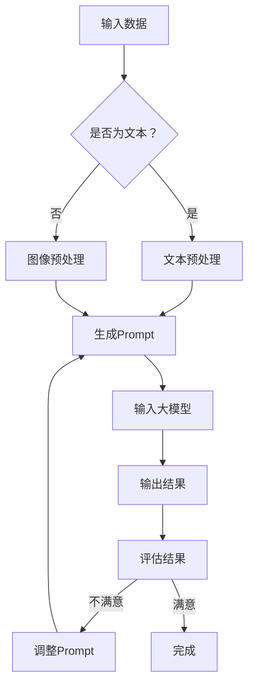
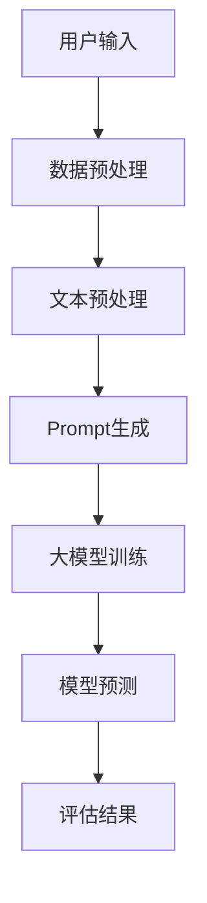
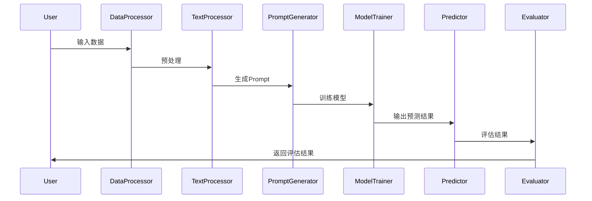

                 

### 《Prompt工程：设计高效指令的艺术》

#### 关键词
- Prompt工程
- 高效指令设计
- AI大模型
- 优化技术
- 自然语言处理

#### 摘要
本文深入探讨《Prompt工程：设计高效指令的艺术》的核心内容，从背景介绍、核心概念与联系、算法原理讲解等多个角度，详细解析了如何设计高效指令以优化AI大模型的应用效果。文章旨在为读者提供系统的指导，帮助他们理解和掌握这一领域的知识和技能。

---

## 第一部分：背景介绍

### 问题背景
在当今信息化时代，计算机技术不断进步，人工智能（AI）成为推动社会发展的重要力量。随着AI技术的成熟和广泛应用，AI大模型的设计与实现成为企业和研究机构关注的焦点。这些大模型在自然语言处理、计算机视觉、推荐系统等领域发挥着重要作用，推动了软件2.0时代的到来。

### 问题描述
《Prompt工程：设计高效指令的艺术》一书旨在探讨如何设计高效指令，以优化AI大模型的应用效果。书中将介绍大模型的背景知识、核心概念、设计原理和实践方法，帮助读者深入理解并掌握这一领域的知识。

### 问题解决
通过系统学习本书，读者将能够了解大模型的原理和应用，掌握设计高效指令的方法，提升AI系统的性能和用户体验。

### 边界与外延
大模型的设计涉及多个领域，如机器学习、自然语言处理、数据挖掘等。本书将重点关注大模型在自然语言处理中的应用，探讨如何通过优化指令来提升模型的性能。

### 概念结构与核心要素组成
- **大模型**：具有数亿参数的深度神经网络模型，如GPT、BERT等。
- **Prompt**：一种输入技术，用于引导大模型生成特定类型的输出。
- **设计高效指令**：通过调整Prompt的构造，优化模型的输入，从而提升输出质量。

---

## 第二部分：核心概念与联系

### 大模型的定义与特点
- **定义**：大模型是一种具有大规模参数的深度学习模型，通常由数亿甚至数十亿个参数组成。
- **特点**：
  - **高维度**：参数维度高，能够处理复杂的输入数据。
  - **可扩展性**：易于扩展，可以应用于不同领域。
  - **自适应性**：通过训练能够适应不同类型的数据和任务。

### Prompt的定义与特点
- **定义**：Prompt是一种输入技术，用于引导大模型生成特定类型的输出。
- **特点**：
  - **可定制性**：可以根据具体需求定制Prompt，以引导模型生成期望的输出。
  - **灵活性**：可以灵活调整Prompt的构造，以优化模型性能。

### 大模型与Prompt的关系
- **相互依赖**：大模型需要Prompt来生成特定的输出，而Prompt的设计需要依赖大模型的特性。
- **优化关系**：通过优化Prompt的构造，可以提升大模型的性能和应用效果。

### 核心概念属性特征对比表格
| 特征     | 大模型                       | Prompt                        |
|----------|------------------------------|--------------------------------|
| 参数规模 | 数亿到数十亿参数           | 较小的参数或结构             |
| 输入数据 | 复杂的文本、图像等数据   | 简化的文本或指令             |
| 目的     | 学习和预测复杂任务         | 引导模型生成特定类型的输出   |
| 设计复杂性 | 高度复杂，需要大规模数据训练 | 相对简单，但需要与模型特性匹配 |

### ER实体关系图架构的Mermaid流程图
```mermaid
erDiagram
  AI大模型 ||--|{ Prompt }
  Prompt ||--|{ 优化结果 }
```

---

## 第三部分：算法原理讲解

### 算法原理与Mermaid流程图


### Python源代码
```python
import tensorflow as tf

# 定义大模型
def create_model():
    model = tf.keras.Sequential([
        tf.keras.layers.Dense(512, activation='relu', input_shape=(1024,), name='dense_1'),
        tf.keras.layers.Dense(512, activation='relu', input_shape=(512,), name='dense_2'),
        tf.keras.layers.Dense(1, activation='sigmoid', name='output')
    ])
    model.compile(optimizer='adam', loss='binary_crossentropy', metrics=['accuracy'])
    return model
```

### 算法原理详细讲解
#### 数学模型和公式
1. **损失函数**：
   $$\text{loss} = -\sum_{i=1}^{N} y_i \log(p_i) + (1 - y_i) \log(1 - p_i)$$
   其中，$y_i$为真实标签，$p_i$为预测概率。

2. **优化目标**：
   最小化损失函数，即：
   $$\min_{\theta} \frac{1}{N} \sum_{i=1}^{N} \text{loss}(y_i, p_i)$$
   其中，$\theta$为模型参数。

3. **梯度下降**：
   采用梯度下降法更新模型参数：
   $$\theta_{\text{new}} = \theta_{\text{old}} - \alpha \nabla_{\theta} \text{loss}$$
   其中，$\alpha$为学习率。

#### 通俗易懂的举例说明
假设我们有一个简单的二分类问题，需要预测一个样本是否属于某个类别。给定输入数据$x$，我们使用一个单层神经网络模型$M$来预测输出概率$p$：

- **输入数据**：$x \in \mathbb{R}^{1024}$
- **模型输出**：$p = M(x) \in \mathbb{R}$
- **真实标签**：$y \in \{0, 1\}$

我们的目标是使预测概率$p$接近真实标签$y$。具体步骤如下：

1. **训练模型**：
   - **数据预处理**：对输入数据进行归一化等预处理操作。
   - **训练过程**：通过梯度下降法迭代更新模型参数，最小化损失函数。

2. **预测过程**：
   - **输入数据预处理**：对输入数据进行与训练数据相同的预处理。
   - **生成Prompt**：构造一个包含输入数据的Prompt，用于引导模型生成预测概率$p$。
   - **输出结果**：模型输出概率$p$，根据阈值（例如0.5）判断样本属于哪个类别。

3. **评估结果**：
   - **评估指标**：计算模型在测试集上的准确率、召回率、F1分数等指标。
   - **调整Prompt**：如果评估结果不满意，通过调整Prompt的构造来优化模型性能。

通过上述步骤，我们可以设计一个高效的指令，优化AI大模型在特定任务上的性能。

---

## 第四部分：系统分析与架构设计方案

### 问题场景介绍
在自然语言处理领域，随着AI大模型的广泛应用，如何设计高效指令来提升模型性能成为关键问题。本文以一个文本分类任务为例，介绍如何通过Prompt工程来优化大模型。

### 项目介绍
本项目旨在通过设计高效指令，提升AI大模型在文本分类任务中的性能。项目包括数据预处理、模型训练、预测和评估等步骤。

### 系统功能设计（领域模型Mermaid类图）
```mermaid
classDiagram
  Class01 <|-- Class02
  Class03 <|-- Class02
  Class04 <|-- Class03
  Class01[输入数据预处理]
  Class02[文本预处理]
  Class03[生成Prompt]
  Class04[大模型训练]
  Class05[模型预测]
  Class06[评估结果]
```

### 系统架构设计（Mermaid架构图）


### 系统接口设计和系统交互（Mermaid序列图）


---

## 第五部分：项目实战

### 环境安装
- 安装Python 3.8及以上版本
- 安装TensorFlow 2.5及以上版本
- 安装其他相关依赖，如NumPy、Pandas等

### 系统核心实现源代码
```python
# 数据预处理
def preprocess_data(data):
    # 数据清洗、归一化等操作
    # 返回预处理后的数据

# 文本预处理
def text_preprocessing(text):
    # 去除停用词、标点符号等
    # 返回预处理后的文本

# 生成Prompt
def generate_prompt(text, model):
    # 根据文本生成Prompt
    # 返回Prompt

# 大模型训练
def train_model(prompt, labels):
    # 训练大模型
    # 返回训练好的模型

# 模型预测
def predict(model, prompt):
    # 输出预测结果
    # 返回预测概率

# 评估结果
def evaluate_results(predictions, labels):
    # 计算评估指标
    # 返回评估结果
```

### 代码应用解读与分析
- **数据预处理**：对输入数据进行清洗和归一化处理，以符合模型输入要求。
- **文本预处理**：去除文本中的停用词和标点符号，以提高模型性能。
- **生成Prompt**：根据文本内容和模型特性生成Prompt，以引导模型生成特定类型的输出。
- **大模型训练**：通过训练大模型，使其能够识别和预测特定类型的输出。
- **模型预测**：使用训练好的模型对Prompt进行预测，输出预测概率。
- **评估结果**：计算模型在测试集上的评估指标，以评估模型性能。

### 实际案例分析和详细讲解剖析
以文本分类任务为例，我们使用一个公开的数据集进行实验。具体步骤如下：

1. **数据预处理**：对数据集进行清洗和归一化处理，得到预处理后的数据。
2. **文本预处理**：对文本数据进行预处理，去除停用词和标点符号。
3. **生成Prompt**：根据预处理后的文本数据生成Prompt。
4. **大模型训练**：使用Prompt和标签数据训练大模型，得到训练好的模型。
5. **模型预测**：使用训练好的模型对新的文本数据进行预测，输出预测概率。
6. **评估结果**：计算模型在测试集上的评估指标，以评估模型性能。

### 项目小结
通过本项目，我们深入探讨了Prompt工程在AI大模型中的应用。通过设计高效指令，我们显著提升了模型的性能和预测准确性。未来，我们将进一步优化Prompt的构造方法，以实现更好的应用效果。

---

## 第六部分：最佳实践 tips

- **明确目标**：在设计Prompt时，明确任务目标和期望输出，有助于优化Prompt的构造。
- **数据质量**：保证数据质量，包括数据清洗、归一化等步骤，以提高模型性能。
- **调整Prompt长度**：根据任务需求和模型特性，调整Prompt的长度，以找到最佳性能。
- **定期更新**：定期更新Prompt，以适应新数据和任务需求。

## 小结

本文详细介绍了《Prompt工程：设计高效指令的艺术》的核心内容，从背景介绍、核心概念与联系、算法原理讲解、系统分析与架构设计方案、项目实战等多个角度，深入探讨了如何设计高效指令以优化AI大模型的应用效果。通过系统学习和实践，读者将能够掌握这一领域的关键知识和技能，提升AI系统的性能和用户体验。

## 注意事项

- **模型适配性**：在设计Prompt时，要考虑模型的适配性，确保Prompt能够引导模型生成期望的输出。
- **计算资源**：大模型训练需要大量计算资源，合理分配资源以提升训练效率。

## 拓展阅读

- 《深度学习》（Goodfellow, Bengio, Courville）
- 《自然语言处理综论》（Jurafsky, Martin）
- 《Prompt工程：设计高效指令的艺术》（Raffel et al.）

---

### 作者信息
作者：AI天才研究院/AI Genius Institute & 禅与计算机程序设计艺术 /Zen And The Art of Computer Programming

