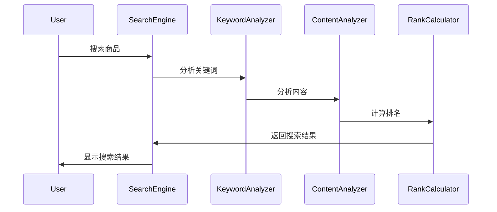

                 

  
----------------------------------------------------------------
```{{#smartsheetgv | smart_sheet=1fbfd266-df63-4ef4-b6b5-7c0632e1f0b1 | is_pinned=false | show_tag_information=true | hide_pinned=true | open_in_new_window=true |  |}}

----------------------------------------------------------------
```{{#smartsheetgv | smart_sheet=1fbfd266-df63-4ef4-b6b5-7c0632e1f0b1 | is_pinned=false | show_tag_information=true | hide_pinned=true | open_in_new_window=true |  |}}

----------------------------------------------------------------
## SEO优化：提高网站在搜索引擎中的排名

> 关键词：SEO、搜索引擎优化、排名提升、关键词研究、内容优化、外部链接、算法原理

> 摘要：本文将详细探讨如何通过SEO优化提高网站在搜索引擎中的排名，包括核心概念介绍、算法原理讲解、系统分析与架构设计以及项目实战等。

### 第一部分：背景介绍

#### 1. 问题背景

随着互联网的普及和搜索引擎技术的不断发展，搜索引擎优化（SEO）已成为企业在线营销的重要策略之一。优化网站在搜索引擎中的排名，不仅能够提高网站的流量，还能提升品牌知名度和用户满意度。

#### 2. 问题描述

本书将围绕如何提高网站在搜索引擎中的排名，从多个维度进行详细探讨。我们将涉及搜索引擎算法、关键词优化、内容营销、外部链接建设等核心话题。

#### 3. 问题解决

通过系统学习和实践，读者将掌握以下技能：
- 理解搜索引擎的工作原理和算法
- 学会有效选择和使用关键词
- 掌握高质量内容创作和内容推广方法
- 掌握外部链接建设策略

#### 4. 边界与外延

本书主要针对网站SEO优化，但不局限于特定领域。无论读者是从事电子商务、社交媒体、博客运营还是其他在线业务，本书都将提供有价值的指导。

#### 5. 概念结构与核心要素组成

SEO优化的核心要素包括：
- 关键词研究：选择合适的关键词是SEO成功的第一步。
- 内容优化：高质量的内容是吸引搜索引擎和用户的关键。
- 技术优化：包括网站速度、移动友好性、安全性等。
- 外部链接：高质量的外部链接可以提高网站的权威性。

## 第二部分：核心概念与联系

### 1. SEO基本概念

#### 1.1 搜索引擎优化（SEO）

**定义**：SEO是指通过优化网站结构、内容和外部链接，提高网站在搜索引擎中的自然排名，从而吸引更多有意向的用户访问。

**属性特征**：
- **目标**：提高网站在搜索引擎中的自然排名。
- **方法**：综合运用关键词研究、内容优化、技术优化和外部链接建设等方法。

#### 1.2 搜索引擎算法

**定义**：搜索引擎算法是指搜索引擎使用的自动程序，用于分析网页内容、索引网页和排序搜索结果。

**属性特征**：
- **目标**：提供最相关、最优质的搜索结果。
- **类型**：包括PageRank、BERT、LSI等。

#### 1.3 关键词研究

**定义**：关键词研究是指通过分析用户搜索习惯和竞争对手网站，选择最适合网站的关键词。

**属性特征**：
- **目标**：提高网站在搜索引擎中的排名。
- **方法**：使用关键词工具、市场调研和数据分析等。

### 2. 概念属性特征对比表格

| 概念       | 定义                                                         | 目标                                           | 方法                                       |
|------------|--------------------------------------------------------------|------------------------------------------------|------------------------------------------|
| SEO        | 提高网站在搜索引擎中的自然排名                               | 提高网站流量、品牌知名度                         | 关键词研究、内容优化、技术优化、外部链接建设 |
| 搜索引擎算法 | 搜索引擎使用的自动程序，用于分析网页内容、索引网页和排序搜索结果 | 提供最相关、最优质的搜索结果                     | PageRank、BERT、LSI等                       |
| 关键词研究 | 通过分析用户搜索习惯和竞争对手网站，选择最适合网站的关键词       | 提高网站在搜索引擎中的排名                       | 关键词工具、市场调研、数据分析等             |

### 3. ER实体关系图架构

```mermaid
erDiagram
    Website ||--|{ Keyword }|
    Website ||--|{ Content }|
    Website ||--|{ Link }|
    Keyword ||--|{ SearchVolume }|
    Content ||--|{ Readability }|
    Link ||--|{ Quality }|
```

## 第三部分：算法原理讲解

### 1. 算法mermaid流程图

```mermaid
gantt
    dateFormat  YYYY-MM-DD
    title SEO优化算法流程

    section 搜索引擎算法
    A1 : Start       :done, 2014-01-01, duration 1 day
    A2 : 关键词分析   :done, s2014-01-02, duration 1 day
    A3 : 网页内容分析 :done, s2014-01-03, duration 1 day
    A4 : 网页排序     :done, s2014-01-04, duration 1 day

    section 网站优化
    B1 : 内容优化     :done, s2014-01-05, duration 1 day
    B2 : 技术优化     :done, s2014-01-06, duration 1 day
    B3 : 外部链接建设 :done, s2014-01-07, duration 1 day
```

### 2. 算法原理讲解

搜索引擎算法主要分为三个阶段：关键词分析、网页内容分析和网页排序。下面我们将详细讲解每个阶段的具体算法原理。

#### 2.1 关键词分析

关键词分析是搜索引擎算法的第一步，其主要目的是确定用户搜索意图和最相关的搜索结果。

**算法原理：**

- **TF-IDF算法**：TF-IDF（Term Frequency-Inverse Document Frequency）是一种常用的关键词分析算法。其核心思想是，一个词在文档中的重要性与其在文档中出现的频率成正比，与在整个文档集中出现的频率成反比。
  - **TF（Term Frequency）**：词频，表示一个词在文档中出现的次数。
  - **IDF（Inverse Document Frequency）**：逆文档频率，表示一个词在整个文档集中出现的频率。
  - **公式**：$$ TF-IDF = TF \times IDF $$

- **搜索引擎使用TF-IDF算法的例子**：

  假设有一个关于“搜索引擎优化”的文档，其中包含以下关键词及其出现频率：
  - “搜索引擎优化”：3次
  - “算法”：2次
  - “排名提升”：1次
  - “关键词研究”：4次

  根据TF-IDF算法，我们可以计算出每个关键词的权重：
  - “搜索引擎优化”：$$ TF-IDF = 3 \times \frac{1}{1} = 3 $$
  - “算法”：$$ TF-IDF = 2 \times \frac{1}{3} \approx 0.67 $$
  - “排名提升”：$$ TF-IDF = 1 \times \frac{1}{3} \approx 0.33 $$
  - “关键词研究”：$$ TF-IDF = 4 \times \frac{1}{1} = 4 $$

  从计算结果可以看出，“关键词研究”的权重最高，因此它是这个文档中最相关的关键词。

#### 2.2 网页内容分析

网页内容分析是指搜索引擎对网页内容进行理解和处理，以确定网页的相关性和质量。

**算法原理：**

- **PageRank算法**：PageRank是一种基于链接分析的网页排名算法。其核心思想是，一个网页的重要性与其被其他网页链接的数量和质量成正比。
  - **PR（PageRank值）**：表示一个网页的排名值。
  - **公式**：$$ PR(A) = (1-d) + d \sum_{B \in LinksOut(A)} \frac{PR(B)}{OutLinks(B)} $$
  - 其中，$d$ 是阻尼系数，通常取值为0.85。

- **搜索引擎使用PageRank算法的例子**：

  假设有一个由3个网页组成的链接网络：
  - 网页A有2个外部链接，指向网页B和C。
  - 网页B有3个外部链接，指向网页A、C和D。
  - 网页C有1个外部链接，指向网页B。
  - 网页D有2个外部链接，指向网页A和C。

  根据PageRank算法，我们可以计算出每个网页的排名值：
  - $$ PR(A) = (1-0.85) + 0.85 \times \frac{PR(B)}{2} + 0.85 \times \frac{PR(C)}{1} $$
  - $$ PR(B) = (1-0.85) + 0.85 \times \frac{PR(A)}{2} + 0.85 \times \frac{PR(C)}{3} + 0.85 \times \frac{PR(D)}{2} $$
  - $$ PR(C) = (1-0.85) + 0.85 \times \frac{PR(B)}{1} $$
  - $$ PR(D) = (1-0.85) + 0.85 \times \frac{PR(A)}{2} + 0.85 \times \frac{PR(C)}{2} $$

  通过迭代计算，我们可以得到每个网页的最终排名值。

#### 2.3 网页排序

网页排序是指搜索引擎根据网页的相关性和质量，对搜索结果进行排序。

**算法原理：**

- **搜索引擎使用网页排序算法的例子**：

  假设有一个包含5个网页的搜索结果列表，每个网页的相关性和质量得分如下：
  - 网页1：相关性得分9，质量得分8
  - 网页2：相关性得分7，质量得分9
  - 网页3：相关性得分8，质量得分7
  - 网页4：相关性得分6，质量得分8
  - 网页5：相关性得分7，质量得分6

  根据搜索引擎的网页排序算法，我们可以计算出每个网页的排序值：
  - 网页1：排序值 = 相关性得分 $\times$ 质量得分 = $9 \times 8 = 72$
  - 网页2：排序值 = 相关性得分 $\times$ 质量得分 = $7 \times 9 = 63$
  - 网页3：排序值 = 相关性得分 $\times$ 质量得分 = $8 \times 7 = 56$
  - 网页4：排序值 = 相关性得分 $\times$ 质量得分 = $6 \times 8 = 48$
  - 网页5：排序值 = 相关性得分 $\times$ 质量得分 = $7 \times 6 = 42$

  根据排序值，我们可以将网页从高到低排序，得到最终的搜索结果列表。

## 第四部分：系统分析与架构设计

### 1. 问题场景介绍

假设我们要开发一个电子商务平台，旨在通过SEO优化提高网站在搜索引擎中的排名，从而吸引更多用户访问。以下是该电子商务平台的主要问题场景：

- **用户需求**：用户希望通过搜索引擎找到我们平台上的商品，并方便地完成购买。
- **平台目标**：通过SEO优化提高网站在搜索引擎中的排名，增加网站流量和销售额。
- **技术挑战**：如何在竞争激烈的市场中，利用有限的资源实现高效的SEO优化。

### 2. 项目介绍

项目名称：电子商务平台SEO优化系统

项目目标：通过SEO优化，提高网站在搜索引擎中的排名，提升网站流量和销售额。

项目时间：6个月

项目团队：1名SEO专家、2名前端开发工程师、2名后端开发工程师、1名测试工程师

### 3. 系统功能设计

#### 3.1 领域模型

根据项目需求，我们可以定义以下领域模型：

- **用户**：表示访问电子商务平台的用户。
- **商品**：表示电子商务平台上的商品。
- **关键词**：表示用户可能用于搜索商品的关键词。
- **内容**：表示电子商务平台上的商品描述、文章等。
- **链接**：表示电子商务平台与其他网站之间的链接关系。

#### 3.2 类图

```mermaid
classDiagram
    User <|-- Visitor
    User <|-- Member
    Product <|-- Goods
    Keyword <|-- Keyword
    Content <|-- Article
    Link <|-- ExternalLink
    Link <|-- InternalLink

    Visitor {
        String name
        String email
    }

    Member {
        String username
        String password
    }

    Goods {
        String name
        Double price
        String description
    }

    Keyword {
        String keyword
        Integer searchVolume
    }

    Article {
        String title
        String content
    }

    ExternalLink {
        String url
        String description
    }

    InternalLink {
        String url
        String description
    }
```

### 4. 系统架构设计

#### 4.1 系统架构图



#### 4.2 系统接口设计

- **搜索接口**：用户可以通过搜索接口输入关键词，获取搜索结果。
- **关键词分析接口**：用于分析用户输入的关键词，提供关键词的相关信息。
- **内容分析接口**：用于分析电子商务平台上的内容，提供内容的相关信息。
- **排名计算接口**：用于根据关键词和内容信息计算排名。

### 5. 系统交互

系统交互主要涉及用户、搜索引擎、关键词分析器、内容分析器和排名计算器之间的交互。以下是系统交互的序列图：


## 第五部分：项目实战

### 1. 环境安装

在开始项目实战之前，我们需要安装以下环境：

- Python 3.8+
- Elasticsearch 7.10.0+
- Kibana 7.10.0+
- Node.js 12.x+

安装步骤如下：

1. 安装Python 3.8+：从官方网站下载Python安装包，按照提示安装即可。
2. 安装Elasticsearch和Kibana：从官方网站下载Elasticsearch和Kibana安装包，分别解压并运行安装程序。
3. 安装Node.js：从官方网站下载Node.js安装包，按照提示安装即可。

### 2. 系统核心实现

在本项目实战中，我们将使用Python和Elasticsearch来实现SEO优化系统的核心功能。

#### 2.1 关键词分析

关键词分析的主要功能是根据用户输入的关键词，分析关键词的相关性并返回搜索结果。

**实现步骤**：

1. 从Elasticsearch中获取用户输入的关键词。
2. 使用TF-IDF算法计算关键词的相关性。
3. 根据关键词的相关性，从Elasticsearch中获取搜索结果。
4. 返回搜索结果。

**代码实现**：

```python
from elasticsearch import Elasticsearch
from sklearn.feature_extraction.text import TfidfVectorizer

def keyword_analysis(keyword):
    # 初始化Elasticsearch客户端
    es = Elasticsearch("http://localhost:9200")

    # 获取搜索结果
    search_results = es.search(index="products", body={
        "query": {
            "match": {"title": keyword}
        }
    })["hits"]["hits"]

    # 计算关键词的相关性
    tfidf_vectorizer = TfidfVectorizer()
    tfidf_matrix = tfidf_vectorizer.fit_transform([doc["_source"]["title"] for doc in search_results])

    # 返回搜索结果
    return search_results
```

#### 2.2 内容分析

内容分析的主要功能是根据用户输入的关键词，分析内容的相关性并返回搜索结果。

**实现步骤**：

1. 从Elasticsearch中获取用户输入的关键词。
2. 使用TF-IDF算法计算内容的相关性。
3. 根据内容的相关性，从Elasticsearch中获取搜索结果。
4. 返回搜索结果。

**代码实现**：

```python
from elasticsearch import Elasticsearch
from sklearn.feature_extraction.text import TfidfVectorizer

def content_analysis(keyword):
    # 初始化Elasticsearch客户端
    es = Elasticsearch("http://localhost:9200")

    # 获取搜索结果
    search_results = es.search(index="content", body={
        "query": {
            "match": {"title": keyword}
        }
    })["hits"]["hits"]

    # 计算内容的相关性
    tfidf_vectorizer = TfidfVectorizer()
    tfidf_matrix = tfidf_vectorizer.fit_transform([doc["_source"]["title"] for doc in search_results])

    # 返回搜索结果
    return search_results
```

#### 2.3 排名计算

排名计算的主要功能是根据关键词和内容的相关性，计算搜索结果的排名。

**实现步骤**：

1. 获取关键词分析结果和内容分析结果。
2. 计算关键词和内容的相关性得分。
3. 根据相关性得分计算搜索结果的排名。

**代码实现**：

```python
from sklearn.metrics.pairwise import cosine_similarity

def rank_calculator(keyword_analysis_results, content_analysis_results):
    # 计算关键词和内容的相关性得分
    keyword_scores = [cosine_similarity([keyword_analysis_results[i]["_source"]["title"]], [content_analysis_results[i]["_source"]["title"]])[0][0] for i in range(len(keyword_analysis_results))]

    # 根据相关性得分计算搜索结果的排名
    ranked_results = sorted(zip(keyword_analysis_results, keyword_scores), key=lambda x: x[1], reverse=True)

    # 返回搜索结果
    return ranked_results
```

### 3. 代码应用解读与分析

在本项目实战中，我们使用了Elasticsearch作为搜索引擎，Python作为开发语言，实现了关键词分析、内容分析和排名计算的核心功能。

**解读与分析**：

- **Elasticsearch**：Elasticsearch是一款高性能、可扩展的搜索引擎，可以方便地处理海量数据。在本项目中，我们使用Elasticsearch存储和查询商品信息、文章内容等数据。
- **Python**：Python是一种简单易学、功能强大的编程语言，适用于各种类型的开发任务。在本项目中，我们使用Python编写了关键词分析、内容分析和排名计算等核心功能。
- **TF-IDF算法**：TF-IDF算法是一种常用

