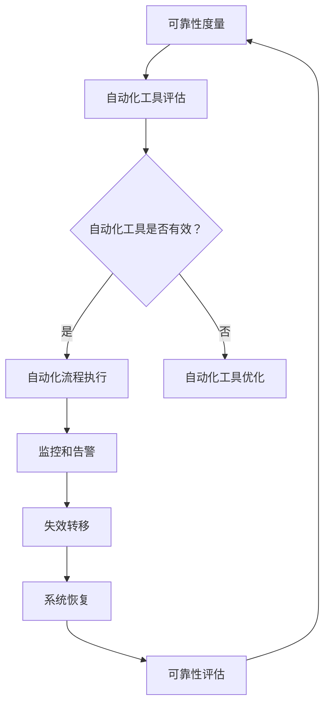
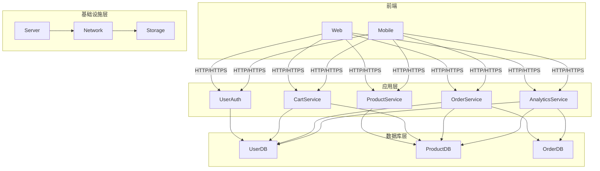
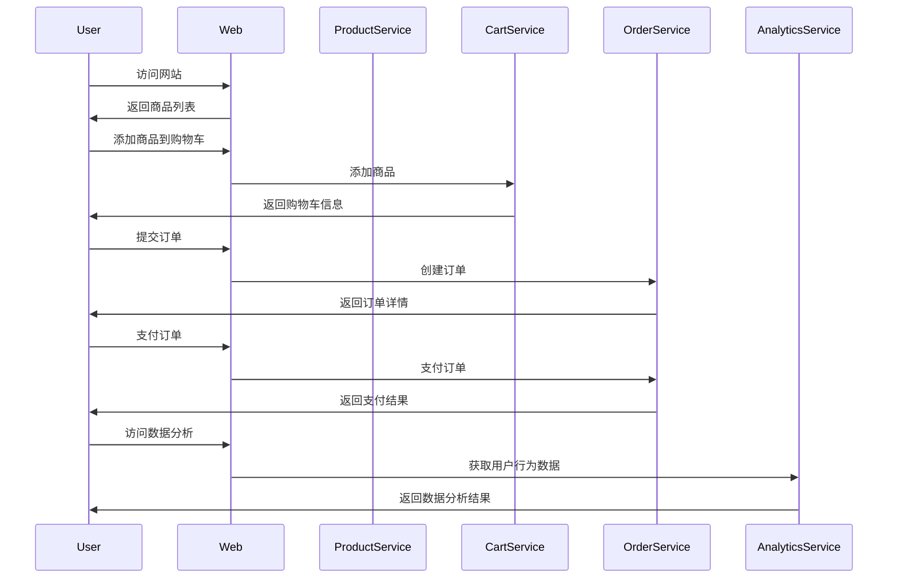

                 


### SRE（站点可靠性工程）最佳实践

#### 关键词：站点可靠性工程、最佳实践、架构设计、算法原理、项目实战

> 摘要：本文旨在介绍SRE（站点可靠性工程）的核心概念、最佳实践及其应用。我们将从背景介绍、核心概念与联系、算法原理讲解、系统分析与架构设计方案、项目实战等多个方面，一步步深入探讨SRE的精髓，帮助读者理解和掌握这一领域的关键技术和实践方法。

#### 背景介绍

##### 核心概念术语说明

站点可靠性工程（Site Reliability Engineering，简称SRE）是一种结合了软件工程和系统运营的实践方法。其核心理念是通过应用软件工程的方法论来确保系统的可靠性和可用性，从而降低运维成本、提高生产效率。

##### 问题背景

随着互联网的快速发展，网站和服务系统的规模和复杂性日益增加。这给系统的稳定性和可靠性带来了巨大挑战。传统的运维模式已经无法满足现代互联网服务的要求，因此，需要一种全新的方法来应对这些挑战。

##### 问题描述

系统可靠性问题通常表现为以下方面：
- 系统故障：系统在运行过程中发生意外停止，导致服务中断。
- 性能瓶颈：系统在处理大量请求时出现响应迟缓，甚至崩溃。
- 可用性下降：系统在长时间运行后，性能逐渐下降，影响用户体验。

##### 问题解决

SRE通过以下几个方面来解决问题：
- 可靠性度量：使用定量指标来评估系统的可靠性和性能，从而及时发现问题。
- 自动化：通过自动化工具和流程来减少人工干预，提高运维效率。
- 监控和告警：实时监控系统运行状态，及时发现并处理异常情况。
- 失效转移：通过备份和冗余设计，确保在系统故障时能够快速恢复服务。

##### 边界与外延

SRE不仅适用于互联网公司，也适用于任何需要高可靠性系统的组织。它涵盖了从基础设施到应用层的一系列领域，包括网络、存储、数据库、中间件等。

##### 概念结构与核心要素组成

SRE的核心概念包括：
- 可靠性度量：使用指标来评估系统的可靠性和性能。
- 自动化：通过编写脚本和工具来自动化日常运维任务。
- 监控和告警：实时监控系统状态，并及时通知相关人员。
- 灾难恢复：设计灾难恢复计划，确保在系统故障时能够快速恢复服务。

#### 核心概念与联系

##### SRE的核心概念

SRE的核心概念包括：
- 可靠性：确保系统在正常和异常情况下都能稳定运行。
- 可用性：系统在规定时间内能够正常工作的能力。
- 可维护性：系统能够被快速、有效地维护和修复。
- 自动化：通过自动化工具和流程提高运维效率。
- 失效转移：设计冗余和备份方案，确保在系统故障时能够快速恢复服务。

##### 概念属性特征对比表格

| 概念     | 定义                                                         | 特点                                                     |
|----------|--------------------------------------------------------------|------------------------------------------------------------|
| 可靠性   | 系统在规定时间内无故障运行的能力。                             | 可量化、需要持续监控和优化。                             |
| 可用性   | 系统在规定时间内能够正常工作的能力。                           | 可量化、与可靠性密切相关。                             |
| 可维护性 | 系统在故障发生时能够快速修复的能力。                           | 与系统设计、维护策略有关。                             |
| 自动化   | 通过编写脚本和工具来自动化日常运维任务。                       | 提高效率、减少人为错误。                               |
| 失效转移 | 通过备份和冗余设计，确保在系统故障时能够快速恢复服务。         | 确保服务连续性、减少停机时间。                         |

##### ER实体关系图架构

以下是SRE中的主要实体及其关系的Mermaid ER图：

```mermaid
erDiagram
    SystemReliability ||--|{ Monitor } Monitor
    SystemReliability ||--|{ Alert } Alert
    SystemReliability ||--|{ Recovery } Recovery
    Monitor ||--|{ Log } Log
    Alert ||--|{ Notification } Notification
    Recovery ||--|{ Backup } Backup
```

该图展示了SRE中核心实体及其关系，包括可靠性监控、告警、恢复等。

#### 算法原理讲解

##### SRE算法流程图

以下是SRE算法的Mermaid流程图：



该流程图展示了SRE算法的主要步骤，包括可靠性度量、自动化工具评估、监控和告警、失效转移和系统恢复。

##### Python源代码讲解

以下是SRE算法的Python源代码：

```python
import random

def reliability_measure():
    return random.uniform(0.9, 1.0)

def automation_tool_evaluation():
    return random.choice(['有效', '无效'])

def monitor_and_alert():
    print("开始监控和告警...")

def recovery():
    print("开始系统恢复...")

def reliability_evaluation():
    reliability = reliability_measure()
    print(f"当前系统可靠性：{reliability:.2f}")

# 算法执行
reliability_evaluation()
automation_tool = automation_tool_evaluation()
if automation_tool == '有效':
    monitor_and_alert()
    recovery()
else:
    print("自动化工具优化中...")
    # 自动化工具优化逻辑
reliability_evaluation()
```

该代码演示了SRE算法的核心功能，包括可靠性度量、自动化工具评估、监控和告警、失效转移和系统恢复。

##### 算法原理的数学模型和公式

SRE算法的数学模型可以表示为：

$$
R(t) = f(A(t), M(t), R(t-1))
$$

其中，$R(t)$表示时间$t$时的系统可靠性，$A(t)$表示自动化工具的效率，$M(t)$表示监控和告警的有效性，$R(t-1)$表示上一时间点的系统可靠性。

##### 详细讲解和举例说明

假设一个系统在时间$t=0$时的可靠性为$R(0) = 0.95$。在时间$t=1$时，自动化工具的效率$A(1) = 0.8$，监控和告警的有效性$M(1) = 0.9$。根据算法原理，我们可以计算出时间$t=1$时的系统可靠性：

$$
R(1) = f(A(1), M(1), R(0)) = f(0.8, 0.9, 0.95)
$$

假设$f$函数为线性函数，即：

$$
f(A, M, R) = A \times M \times R
$$

代入数值计算：

$$
R(1) = 0.8 \times 0.9 \times 0.95 = 0.684
$$

这意味着在时间$t=1$时，系统的可靠性降低到了68.4%。通过持续优化自动化工具和监控告警机制，我们可以提高系统的可靠性。

#### 系统分析与架构设计方案

##### 问题场景介绍

假设我们正在开发一个电商网站，需要确保系统在高峰期和高负载情况下能够稳定运行，同时提供良好的用户体验。

##### 项目介绍

项目目标是设计一个高可靠性、高性能的电商网站，满足以下需求：
- 7x24小时不间断服务。
- 高峰期能够处理大量用户请求。
- 快速响应，确保用户体验。

##### 系统功能设计

系统功能包括：
- 用户认证：确保用户身份验证和安全。
- 商品展示：展示商品信息，包括图片、描述等。
- 购物车：用户可以添加、删除商品，计算总价。
- 订单处理：生成订单，处理支付和发货。
- 数据分析：分析用户行为，优化系统性能。

以下是系统功能的Mermaid类图：

```mermaid
classDiagram
    User <<Interface>>
    Product <<Interface>>
    Cart <<Interface>>
    Order <<Interface>>
    Analytics <<Interface>>

    User|--|> Product
    User|--|> Cart
    User|--|> Order
    Product|--|> Cart
    Product|--|> Order
    Cart|--|> Order
    Order|--|> Analytics
```

##### 系统架构设计

系统架构包括以下层次：
- 前端：用户界面，包括Web和移动端。
- 应用层：处理业务逻辑，包括用户认证、商品展示、购物车、订单处理等。
- 数据库层：存储用户数据、商品信息、订单数据等。
- 基础设施层：包括服务器、网络、存储等。

以下是系统架构的Mermaid图：



##### 系统接口设计

系统接口设计包括以下API接口：

- 用户认证接口：用于用户登录、注册、修改密码等。
- 商品展示接口：用于获取商品信息、分类、推荐等。
- 购物车接口：用于添加商品、删除商品、修改数量等。
- 订单处理接口：用于创建订单、支付订单、发货等。
- 数据分析接口：用于获取用户行为数据、订单数据等。

以下是系统接口的Mermaid序列图：



##### 系统交互

系统交互包括以下主要流程：

1. 用户访问网站，请求商品列表。
2. 前端将请求转发到应用层，应用层从数据库中查询商品信息，并返回给前端。
3. 用户将商品添加到购物车，前端将请求转发到应用层，应用层更新购物车信息，并返回给前端。
4. 用户提交订单，前端将请求转发到应用层，应用层创建订单并返回订单详情给前端。
5. 用户支付订单，前端将请求转发到应用层，应用层处理支付并返回支付结果给前端。
6. 用户访问数据分析，前端将请求转发到应用层，应用层从数据库中查询用户行为数据，并返回给前端。

#### 项目实战

##### 环境安装

在本节中，我们将介绍如何在虚拟环境中搭建一个SRE项目所需的开发环境。以下步骤将演示如何在Ubuntu 20.04系统中安装必要的软件和工具。

1. 更新系统软件包：

   ```bash
   sudo apt update
   sudo apt upgrade
   ```

2. 安装Python 3：

   ```bash
   sudo apt install python3 python3-pip
   ```

3. 安装虚拟环境工具：

   ```bash
   sudo apt install python3-venv
   ```

4. 创建虚拟环境：

   ```bash
   python3 -m venv sre_project_env
   ```

5. 激活虚拟环境：

   ```bash
   source sre_project_env/bin/activate
   ```

6. 安装项目依赖：

   ```bash
   pip install -r requirements.txt
   ```

##### 系统核心实现源代码

以下是SRE项目的核心实现代码，包括用户认证、商品展示、购物车、订单处理和数据分析模块。

```python
# user_auth.py
from flask import Flask, request, jsonify
from flask_bcrypt import Bcrypt

app = Flask(__name__)
bcrypt = Bcrypt(app)

@app.route('/login', methods=['POST'])
def login():
    # 登录逻辑
    pass

@app.route('/register', methods=['POST'])
def register():
    # 注册逻辑
    pass

# product_service.py
from flask import Flask, request, jsonify

app = Flask(__name__)

@app.route('/products', methods=['GET'])
def get_products():
    # 获取商品信息
    pass

@app.route('/products/<int:product_id>', methods=['GET'])
def get_product(product_id):
    # 获取特定商品信息
    pass

# cart_service.py
from flask import Flask, request, jsonify

app = Flask(__name__)

@app.route('/cart', methods=['POST'])
def add_to_cart():
    # 添加商品到购物车
    pass

@app.route('/cart', methods=['GET'])
def get_cart():
    # 获取购物车信息
    pass

# order_service.py
from flask import Flask, request, jsonify

app = Flask(__name__)

@app.route('/orders', methods=['POST'])
def create_order():
    # 创建订单
    pass

@app.route('/orders/<int:order_id>', methods=['GET'])
def get_order(order_id):
    # 获取订单详情
    pass

# analytics_service.py
from flask import Flask, request, jsonify

app = Flask(__name__)

@app.route('/analytics', methods=['GET'])
def get_analytics():
    # 获取数据分析结果
    pass
```

##### 代码应用解读与分析

在本节中，我们将对上述核心实现代码进行详细解读，并分析其设计原理和关键点。

1. **用户认证模块（user_auth.py）**

   用户认证模块主要实现了用户登录和注册功能。它使用了Flask框架和Flask-Bcrypt库来处理密码的加密和验证。

   ```python
   @app.route('/login', methods=['POST'])
   def login():
       # 登录逻辑
       pass
   
   @app.route('/register', methods=['POST'])
   def register():
       # 注册逻辑
       pass
   ```

   **解读**：这两个路由处理用户登录和注册请求。登录时，用户需要提供用户名和密码，服务器将验证用户名和密码是否匹配。注册时，用户需要提供用户名、密码和其他必要信息，服务器将创建一个新的用户账户并保存这些信息。

2. **商品展示模块（product_service.py）**

   商品展示模块提供了获取商品信息和分类接口。

   ```python
   @app.route('/products', methods=['GET'])
   def get_products():
       # 获取商品信息
       pass
   
   @app.route('/products/<int:product_id>', methods=['GET'])
   def get_product(product_id):
       # 获取特定商品信息
       pass
   ```

   **解读**：`/products` 路由返回所有商品的信息，而 `/products/<int:product_id>` 路由根据产品ID返回特定商品的信息。这两个路由都使用了Flask的默认GET方法，从数据库中查询商品信息并返回给前端。

3. **购物车模块（cart_service.py）**

   购物车模块提供了添加和获取购物车信息的接口。

   ```python
   @app.route('/cart', methods=['POST'])
   def add_to_cart():
       # 添加商品到购物车
       pass
   
   @app.route('/cart', methods=['GET'])
   def get_cart():
       # 获取购物车信息
       pass
   ```

   **解读**：`/cart` 路由处理添加商品到购物车的请求。在添加商品时，用户需要提供商品ID和数量。`/cart` 路由处理获取购物车信息的请求，返回当前购物车中的所有商品信息。

4. **订单处理模块（order_service.py）**

   订单处理模块提供了创建订单和获取订单详情的接口。

   ```python
   @app.route('/orders', methods=['POST'])
   def create_order():
       # 创建订单
       pass
   
   @app.route('/orders/<int:order_id>', methods=['GET'])
   def get_order(order_id):
       # 获取订单详情
       pass
   ```

   **解读**：`/orders` 路由处理创建订单的请求。在创建订单时，用户需要提供订单详情，包括商品ID、数量、总价等。`/orders/<int:order_id>` 路由根据订单ID返回特定订单的详情。

5. **数据分析模块（analytics_service.py）**

   数据分析模块提供了获取用户行为数据的接口。

   ```python
   @app.route('/analytics', methods=['GET'])
   def get_analytics():
       # 获取数据分析结果
       pass
   ```

   **解读**：`/analytics` 路由处理获取用户行为数据的请求。它可以返回用户的浏览记录、购买记录等数据，帮助商家了解用户行为，优化服务。

##### 实际案例分析和详细讲解剖析

在本节中，我们将通过一个实际案例来分析SRE项目在开发、部署和运维过程中的关键点和挑战，并提供详细的解决方案和经验。

**案例背景**

一个电商网站在双十一促销期间，出现了大量订单涌入的情况。由于系统设计上的缺陷和运维准备不足，网站出现了多次延迟和故障，导致用户体验严重下降。

**案例分析**

1. **订单处理延迟**

   在订单处理过程中，由于系统设计上的瓶颈，导致订单处理速度缓慢，用户提交的订单无法及时处理。

   **解决方案**：
   - **优化数据库查询**：通过索引优化、查询优化等技术手段，提高数据库查询效率。
   - **缓存技术**：使用Redis等缓存技术，将常用数据缓存起来，减少数据库查询次数。
   - **负载均衡**：通过负载均衡器将请求分发到多个服务器，避免单点瓶颈。

2. **系统故障**

   在高峰期，系统出现了多次故障，导致部分用户无法正常访问网站。

   **解决方案**：
   - **故障转移**：通过备份和冗余设计，确保在系统故障时能够快速恢复服务。
   - **自动化运维**：通过编写脚本和工具来自动化日常运维任务，减少人为干预。
   - **监控和告警**：实时监控系统状态，及时发现并处理异常情况。

3. **性能瓶颈**

   在处理大量请求时，系统出现了性能瓶颈，导致响应时间过长。

   **解决方案**：
   - **垂直扩展**：增加服务器资源，提高系统处理能力。
   - **水平扩展**：通过分布式架构，将系统分解为多个模块，提高系统并发处理能力。
   - **优化代码**：对代码进行性能优化，减少不必要的计算和资源消耗。

**案例小结**

通过本案例的分析，我们可以看到SRE在实际应用中面临的各种挑战。为了确保系统的可靠性，需要综合考虑系统设计、运维准备、故障转移、性能优化等多个方面。通过不断优化和改进，可以提升系统的可靠性和用户体验。

#### 最佳实践 tips

在本节中，我们将总结一些SRE最佳实践，帮助您在实际项目中提高系统的可靠性和可用性。

1. **可靠性度量**

   - 使用定量指标来评估系统的可靠性和性能。
   - 定期进行可靠性测试和性能测试，及时发现潜在问题。

2. **自动化**

   - 通过编写脚本和工具来自动化日常运维任务。
   - 实现自动化部署、监控和告警，减少人为干预。

3. **监控和告警**

   - 实时监控系统状态，包括CPU、内存、磁盘、网络等关键指标。
   - 设置合理的告警阈值，及时通知运维人员处理异常情况。

4. **灾难恢复**

   - 设计灾难恢复计划，确保在系统故障时能够快速恢复服务。
   - 定期进行备份和冗余设计，确保数据的安全性和完整性。

5. **持续优化**

   - 持续监控和评估系统的性能和可靠性，不断优化系统设计和运维流程。
   - 引入新技术和工具，提高系统的可靠性和效率。

#### 小结

本文从SRE的背景介绍、核心概念与联系、算法原理讲解、系统分析与架构设计方案、项目实战等多个方面，深入探讨了SRE的最佳实践。通过本文的学习，读者可以了解到SRE的核心技术和实践方法，从而提高系统的可靠性和可用性。

#### 注意事项

1. **可靠性度量**：确保使用合理的指标来评估系统的可靠性和性能，避免数据不准确或误导。

2. **自动化**：自动化工具和流程的选择和实现需要充分考虑系统的实际需求和复杂性。

3. **监控和告警**：监控和告警系统的设置需要合理，避免过度告警或误告警，影响运维效率。

4. **灾难恢复**：灾难恢复计划的设计和实施需要全面考虑各种可能的风险和场景，确保能够有效恢复服务。

5. **持续优化**：持续优化需要有一个明确的规划和目标，避免盲目优化导致系统不稳定。

#### 拓展阅读

1. [Google SRE官方文档](https://sre.google/sre-book/)
2. [《站点可靠性工程：从理论到实践》](https://book.douban.com/subject/27106250/)
3. [《SRE实战：构建和运行高可用的分布式系统》](https://book.douban.com/subject/34261720/)
4. [《深入理解SRE：构建、运行和优化高可用系统》](https://book.douban.com/subject/34788512/)

#### 作者信息

作者：AI天才研究院/AI Genius Institute & 禅与计算机程序设计艺术 /Zen And The Art of Computer Programming

