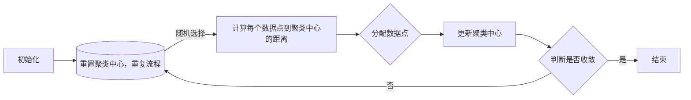
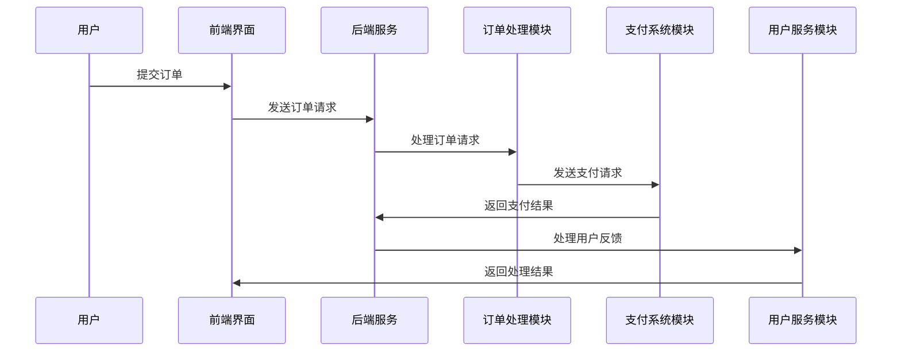

                 

### 文章标题

# SRE实践：站点可靠性工程的最佳实践

### 关键词

- 站点可靠性工程 (SRE)
- 最佳实践
- DevOps
- 持续交付
- 监控与报警
- 负载均衡
- 超市自动化
- 容器化与编排

### 摘要

本文深入探讨了站点可靠性工程（SRE）的最佳实践。通过详细分析SRE的核心概念、关键原则和实践，结合实际案例，本文旨在为IT从业者提供一套系统化的SRE实施指南。我们将重点关注如何通过持续集成与持续部署（CI/CD）、监控与报警、负载均衡等手段，实现高可靠性的系统运维。此外，还将探讨SRE在容器化与编排、云原生架构中的应用，以及如何在大规模组织中实施SRE，确保系统的稳定与可靠。

## 第一部分：SRE概述

### 1.1 SRE的起源与发展

#### 1.1.1 SRE的起源

站点可靠性工程（Site Reliability Engineering，简称SRE）起源于谷歌公司。在谷歌，SRE作为一种工程实践，旨在将软件工程的方法应用于网站可靠性领域，解决在快速扩展的互联网环境中遇到的复杂系统运维问题。SRE团队由软件工程师和系统管理员组成，他们使用工程化的方法来确保系统的稳定运行，同时保持系统的创新能力。

SRE的诞生背景是互联网的快速发展，传统的IT运维方法已无法满足现代复杂系统的需求。面对海量用户请求、复杂的分布式架构、不断更新的软件版本等挑战，传统的运维模式显得力不从心。SRE的出现，为解决这些问题提供了一种新的思路。

#### 1.1.2 SRE与DevOps的关系

SRE与DevOps密切相关，两者都是为了提高软件交付质量和系统可靠性而设计的工程实践。DevOps强调开发（Development）与运维（Operations）的无缝协作，通过自动化工具和流程，实现快速、可靠地交付软件。而SRE则在此基础上，更注重于系统的可靠性和稳定性。

SRE可以看作是DevOps的一种延伸和深化，它不仅关注开发与运维的协作，更关注如何通过工程化的方法来确保系统的可靠性。具体来说，SRE通过监控、自动化、混沌工程等手段，实现对系统运行状态的实时监控和干预，确保系统在任何情况下都能稳定运行。

#### 1.1.3 SRE的核心概念

SRE的核心概念包括以下几个方面：

1. **可靠性工程原理**：可靠性工程是SRE的基础，它通过统计分析和风险评估等方法，确保系统在各种情况下都能正常运行。

2. **关键指标**：SRE通过一系列关键指标（如系统可用性、响应时间、错误率等）来衡量系统的可靠性，并根据这些指标进行优化。

3. **自动化**：SRE强调通过自动化工具和脚本，减少人为干预，提高运维效率，降低人为错误。

4. **持续集成与持续部署（CI/CD）**：SRE通过CI/CD流程，实现软件的快速迭代和部署，同时确保部署过程对系统的影响最小。

5. **监测与报警**：SRE通过实时监测系统状态，及时发现并处理异常情况，确保系统的稳定运行。

6. **混沌工程**：SRE通过混沌工程（Chaos Engineering）来测试系统的鲁棒性，确保系统在极端情况下仍能正常运行。

### 1.2 SRE的关键原则和实践

#### 1.2.1 可靠性工程的基本原理

可靠性工程是SRE的核心概念之一。它旨在通过一系列技术和方法，确保系统在各种情况下都能正常运行。可靠性工程的基本原理包括：

1. **故障模式与影响分析（FMEA）**：FMEA是一种系统化的方法，用于识别和评估系统中潜在故障的可能性和影响。

2. **风险评估**：通过对系统中的各种故障进行风险评估，确定哪些故障对系统的正常运行影响最大，从而采取相应的措施。

3. **冗余设计**：通过冗余设计，提高系统的容错能力。冗余设计包括硬件冗余、软件冗余和人员冗余等。

4. **系统容错性**：系统容错性是指系统能够在出现故障时自动恢复，继续正常运行的能力。

5. **持续改进**：通过不断地收集数据、分析故障原因和改进措施，持续提高系统的可靠性。

#### 1.2.2 SRE的关键实践

SRE的关键实践包括以下几个方面：

1. **监控与报警**：通过监控系统状态，及时发现并处理异常情况。报警机制是监控的重要组成部分，它能在系统出现问题时及时通知相关人员。

2. **自动化**：通过自动化工具和脚本，减少人工干预，提高运维效率。自动化包括配置管理、部署自动化、监控自动化等。

3. **持续集成与持续部署（CI/CD）**：通过CI/CD流程，实现软件的快速迭代和部署。CI/CD的核心目标是确保软件质量，同时减少部署过程中的风险。

4. **混沌工程**：通过混沌工程，测试系统的鲁棒性，确保系统在极端情况下仍能正常运行。混沌工程包括混沌测试、混沌演练等。

5. **性能优化**：通过对系统性能的持续优化，提高系统的响应速度和吞吐量。

6. **安全性与合规性**：确保系统的安全性和合规性，防止数据泄露和非法入侵。

#### 1.2.3 SRE与传统IT运营的区别

SRE与传统IT运营有以下几点区别：

1. **工程化方法**：SRE更注重工程化方法，通过监控、自动化、持续集成与持续部署等手段，提高系统的可靠性和稳定性。

2. **关注可靠性**：SRE的核心目标是确保系统的可靠性，而传统IT运营更多关注的是系统的可用性和性能。

3. **团队合作**：SRE强调团队合作，开发、测试、运维等角色紧密协作，而传统IT运营往往由不同的团队分别负责。

4. **持续改进**：SRE注重持续改进，通过不断地收集数据、分析故障原因和改进措施，不断提高系统的可靠性。

## 第二部分：SRE核心概念与原理

### 2.1 SRE的基本原理

SRE的基本原理包括以下几个方面：

1. **可靠性工程原理**：可靠性工程是SRE的基础，它通过统计分析和风险评估等方法，确保系统在各种情况下都能正常运行。

2. **关键指标**：SRE通过一系列关键指标（如系统可用性、响应时间、错误率等）来衡量系统的可靠性，并根据这些指标进行优化。

3. **自动化**：SRE强调通过自动化工具和脚本，减少人为干预，提高运维效率，降低人为错误。

4. **持续集成与持续部署（CI/CD）**：SRE通过CI/CD流程，实现软件的快速迭代和部署，同时确保部署过程对系统的影响最小。

5. **监测与报警**：SRE通过实时监测系统状态，及时发现并处理异常情况，确保系统的稳定运行。

6. **混沌工程**：SRE通过混沌工程来测试系统的鲁棒性，确保系统在极端情况下仍能正常运行。

### 2.2 SRE的架构设计

SRE的架构设计包括以下几个方面：

1. **监控与日志系统**：监控与日志系统是SRE的核心组件之一。通过监控系统状态，及时发现并处理异常情况；通过日志系统，收集和分析系统运行过程中的各类数据。

2. **自动化工具**：自动化工具是SRE的重要组成部分。通过自动化工具，实现配置管理、部署自动化、监控自动化等，提高运维效率。

3. **持续集成与持续部署（CI/CD）**：CI/CD流程是SRE的核心流程之一。通过CI/CD，实现软件的快速迭代和部署，同时确保部署过程对系统的影响最小。

4. **混沌工程**：混沌工程是SRE的一部分，通过混沌工程，测试系统的鲁棒性，确保系统在极端情况下仍能正常运行。

### 2.3 SRE的关键实践

SRE的关键实践包括以下几个方面：

1. **监控与报警**：通过监控系统状态，及时发现并处理异常情况。报警机制是监控的重要组成部分，它能在系统出现问题时及时通知相关人员。

2. **自动化**：通过自动化工具和脚本，减少人工干预，提高运维效率。自动化包括配置管理、部署自动化、监控自动化等。

3. **持续集成与持续部署（CI/CD）**：通过CI/CD流程，实现软件的快速迭代和部署。CI/CD的核心目标是确保软件质量，同时减少部署过程中的风险。

4. **混沌工程**：通过混沌工程，测试系统的鲁棒性，确保系统在极端情况下仍能正常运行。混沌工程包括混沌测试、混沌演练等。

5. **性能优化**：通过对系统性能的持续优化，提高系统的响应速度和吞吐量。

6. **安全性与合规性**：确保系统的安全性和合规性，防止数据泄露和非法入侵。

### 2.4 SRE与DevOps的关系

SRE与DevOps密切相关，两者都是为了提高软件交付质量和系统可靠性而设计的工程实践。DevOps强调开发与运维的无缝协作，通过自动化工具和流程，实现快速、可靠地交付软件。而SRE则在此基础上，更注重于系统的可靠性和稳定性。

SRE可以看作是DevOps的一种延伸和深化，它不仅关注开发与运维的协作，更关注如何通过工程化的方法来确保系统的可靠性。具体来说，SRE通过监控、自动化、混沌工程等手段，实现对系统运行状态的实时监控和干预，确保系统在任何情况下都能稳定运行。

## 第三部分：SRE的具体实践与案例分析

### 3.1 监控与报警

#### 3.1.1 监控的重要性

监控是SRE的核心组成部分之一，它能够实时监测系统的状态，及时发现并处理异常情况。有效的监控系统能够提高系统的可靠性，减少故障对用户的影响。

#### 3.1.2 常见的监控工具

- **Prometheus**：Prometheus是一个开源的监控解决方案，它能够收集系统的各种指标数据，并通过警报系统及时发现异常。
- **Grafana**：Grafana是一个开源的数据可视化和监控工具，它可以将Prometheus的数据可视化，提供直观的监控界面。
- **Zabbix**：Zabbix是一个开源的监控解决方案，它支持多种监控方式，包括主动监控和被动监控。

#### 3.1.3 监控的最佳实践

- **全面覆盖**：确保监控系统能够覆盖系统的各个方面，包括CPU使用率、内存使用率、磁盘使用率、网络流量等。
- **告警阈值设置**：合理设置告警阈值，确保在系统出现异常时能够及时发现。
- **告警通知**：通过邮件、短信、电话等多种方式，确保相关人员能够在第一时间收到告警通知。
- **告警分组**：将告警按照业务模块进行分组，便于管理和响应。

### 3.2 自动化

#### 3.2.1 自动化的重要性

自动化是SRE的核心原则之一，它能够减少人工干预，提高运维效率。通过自动化，可以将重复性、繁琐的运维任务交由系统自动处理。

#### 3.2.2 自动化的具体实践

- **配置管理**：通过配置管理工具（如Ansible、Chef、Puppet等），自动化管理系统的配置。
- **部署自动化**：通过CI/CD工具（如Jenkins、GitLab CI等），自动化处理软件的部署流程。
- **监控自动化**：通过脚本和自动化工具，自动化监测系统的状态，并根据监测结果进行相应的处理。

#### 3.2.3 自动化的最佳实践

- **标准化**：确保所有的运维任务都按照标准化流程进行，便于管理和维护。
- **文档化**：将自动化脚本和流程进行文档化，便于其他团队成员理解和使用。
- **持续改进**：定期评估自动化流程的效果，不断进行优化和改进。

### 3.3 持续集成与持续部署（CI/CD）

#### 3.3.1 CI/CD的重要性

持续集成与持续部署（CI/CD）是现代软件开发和运维的重要实践，它能够提高软件交付的效率和质量。

#### 3.3.2 CI/CD的具体实践

- **持续集成（CI）**：在每次代码提交后，自动构建、测试和部署代码，确保代码质量。
- **持续部署（CD）**：在测试通过后，自动部署代码到生产环境，确保软件的稳定性。

#### 3.3.3 CI/CD的最佳实践

- **自动化**：确保CI/CD流程完全自动化，减少人为干预。
- **快速反馈**：确保每次代码提交后，都能够快速得到反馈，便于及时发现问题。
- **版本控制**：确保代码的版本控制，便于追踪和管理。
- **环境隔离**：确保开发和生产环境的隔离，防止开发过程中的问题影响到生产环境。

### 3.4 混沌工程

#### 3.4.1 混沌工程的重要性

混沌工程是SRE的重要组成部分，它通过故意引入故障和异常情况，测试系统的鲁棒性和容错能力。

#### 3.4.2 混沌工程的具体实践

- **混沌测试**：通过模拟各种故障情况，测试系统的应对能力。
- **混沌演练**：在真实环境中进行混沌测试，确保系统能够在实际故障情况下正常运行。

#### 3.4.3 混沌工程的最佳实践

- **定期进行**：定期进行混沌测试和演练，确保系统能够持续保持鲁棒性。
- **覆盖全面**：确保混沌测试和演练能够覆盖系统的各个方面。
- **记录和总结**：对每次混沌测试和演练进行记录和总结，分析故障原因，持续优化系统。

## 第四部分：SRE在容器化与编排中的应用

### 4.1 容器化与编排的重要性

随着容器技术的快速发展，容器化与编排（如Kubernetes）已经成为现代软件架构中的重要组成部分。SRE在容器化与编排中的应用，能够提高系统的可靠性、可扩展性和灵活性。

### 4.2 容器化与编排的具体实践

- **容器化**：将应用程序及其依赖环境打包到容器中，实现环境的标准化和隔离。
- **编排**：通过编排工具（如Kubernetes），自动化管理容器的部署、扩展、更新和监控。

### 4.3 Kubernetes最佳实践

- **集群管理**：确保Kubernetes集群的高可用性，配置足够的资源，定期进行健康检查。
- **容器镜像管理**：确保容器镜像的安全性和可靠性，使用私有镜像仓库，进行镜像签名和验证。
- **网络与存储**：合理配置网络和存储资源，确保容器之间的通信和存储的稳定性。
- **监控与报警**：通过Prometheus、Grafana等工具，监控Kubernetes集群的状态，设置合理的报警阈值。

## 第五部分：大规模组织中的SRE实践

### 5.1 组织结构

在大型组织中，SRE团队的组织结构通常包括以下几个方面：

- **SRE团队**：负责系统的监控、优化、自动化等。
- **开发团队**：负责软件开发和部署。
- **运维团队**：负责系统的日常运维和维护。
- **业务团队**：负责业务需求和产品规划。

### 5.2 协作与沟通

在大型组织中，SRE团队需要与其他团队紧密协作，确保系统的稳定运行。以下是一些协作与沟通的最佳实践：

- **定期会议**：定期举行团队会议，讨论系统状态、问题解决和改进措施。
- **知识共享**：鼓励团队成员分享知识和经验，提高整体技术水平。
- **跨团队协作**：与其他团队建立良好的沟通机制，确保在遇到问题时能够及时协作解决。

### 5.3 治理与流程

在大型组织中，SRE的治理与流程管理至关重要。以下是一些治理与流程管理的最佳实践：

- **标准化流程**：确保所有的运维和开发任务都按照标准化流程进行，便于管理和维护。
- **权限管理**：合理配置权限，确保只有授权人员能够执行关键操作。
- **文档管理**：将所有的流程、配置、监控指标等进行文档化，便于团队成员理解和使用。

## 第六部分：SRE的未来发展趋势

### 6.1 自动化与人工智能

随着自动化和人工智能技术的不断发展，SRE领域也将迎来新的机遇和挑战。自动化工具将更加智能化，能够根据系统状态和预测模型，自动进行故障预测和修复。人工智能将应用于异常检测、性能优化等方面，提高系统的可靠性和效率。

### 6.2 云原生与混合云

云原生技术（如容器、服务网格、微服务等）将逐渐成为SRE实践的重要方向。同时，随着混合云的普及，SRE团队需要具备在多云环境中管理和运维系统的能力。

### 6.3 安全性与合规性

随着系统复杂性的增加，安全性和合规性将成为SRE的重要关注点。SRE团队需要确保系统的安全性，防止数据泄露和非法入侵，同时满足各种合规要求。

## 第七部分：总结与展望

SRE作为现代软件工程的重要实践，通过监控、自动化、持续集成与持续部署等手段，提高系统的可靠性、稳定性和效率。本文详细分析了SRE的核心概念、关键原则和实践，并结合实际案例进行了深入探讨。随着技术的发展和变化，SRE领域将继续演进，为软件工程带来更多的机遇和挑战。我们期待未来SRE能够更好地服务于企业和用户，推动软件工程的发展。### 关键词解释

**站点可靠性工程（SRE）**：站点可靠性工程（Site Reliability Engineering，简称SRE）是一种结合了软件工程和系统管理的工程实践，旨在确保系统的可靠性和稳定性。

**最佳实践**：最佳实践是指在特定领域内，经过验证并广泛认可的、能够产生最佳效果的方法和技巧。

**DevOps**：DevOps是一种软件开发和运维的方法论，强调开发（Development）与运维（Operations）之间的紧密协作和沟通，以实现更快速、更可靠的软件交付。

**持续集成与持续部署（CI/CD）**：持续集成与持续部署（Continuous Integration/Continuous Deployment，简称CI/CD）是一种软件开发和部署的方法，通过自动化流程，确保代码的质量和部署的可靠性。

**监控与报警**：监控与报警是指通过监控工具实时监测系统状态，并在检测到异常情况时自动触发报警，以便及时处理。

**负载均衡**：负载均衡是一种分布式系统架构设计方法，通过将请求分摊到多个服务器上，提高系统的处理能力和可靠性。

**混沌工程**：混沌工程（Chaos Engineering）是一种通过故意引入故障和异常情况来测试系统鲁棒性的方法，旨在提高系统的容错能力和稳定性。

**容器化与编排**：容器化是指将应用程序及其依赖环境打包到容器中，实现环境的标准化和隔离。编排是指通过编排工具（如Kubernetes）自动化管理容器的部署、扩展、更新和监控。

**云原生架构**：云原生架构是指为云环境设计、开发和部署的软件系统，具有容器化、服务网格、微服务、动态管理等特点。

**大规模组织中的SRE实践**：在大型组织中，SRE实践需要考虑组织结构、协作与沟通、治理与流程等多方面的因素，确保系统的稳定运行。

**自动化与人工智能**：自动化是指通过自动化工具和脚本减少人工干预，提高运维效率。人工智能是指利用机器学习等技术进行异常检测、故障预测等，提高系统的智能化和自动化水平。

### 概念间的联系与对比

**SRE与DevOps的关系**：

SRE是DevOps的一种延伸和深化。DevOps关注开发与运维的无缝协作，强调通过自动化和协作提高软件交付速度。而SRE在此基础上，更注重系统的可靠性和稳定性。SRE通过监控、自动化、持续集成与持续部署等手段，确保系统的可靠性，同时保持系统的创新能力。

**SRE与IT运营的区别**：

传统IT运营更多关注系统的可用性和性能，主要通过经验和方法进行日常维护和故障处理。而SRE更注重工程化的方法，通过监控、自动化、持续集成与持续部署等手段，确保系统的可靠性。SRE强调团队合作，开发、测试、运维等角色紧密协作，持续改进系统。

**SRE中的关键指标**：

SRE通过一系列关键指标来衡量系统的可靠性，如系统可用性、响应时间、错误率等。这些指标反映了系统的稳定性、性能和安全性，是SRE优化和改进系统的重要依据。

**SRE实践与容器化、编排的关系**：

容器化与编排（如Kubernetes）是现代软件架构中的重要组成部分。SRE在容器化与编排中的应用，能够提高系统的可靠性、可扩展性和灵活性。通过容器化，可以实现环境的标准化和隔离；通过编排工具，可以自动化管理容器的部署、扩展、更新和监控。

### 背景介绍

站点可靠性工程（SRE）作为一种现代软件工程实践，起源于谷歌公司。在谷歌，SRE团队由软件工程师和系统管理员组成，他们使用工程化的方法来确保系统的稳定运行，同时保持系统的创新能力。SRE的核心目标是确保系统的可靠性，通过监控、自动化、持续集成与持续部署等手段，实现高可靠性的系统运维。

随着互联网的快速发展，传统的IT运维方法已无法满足现代复杂系统的需求。面对海量用户请求、复杂的分布式架构、不断更新的软件版本等挑战，传统的运维模式显得力不从心。SRE的出现，为解决这些问题提供了一种新的思路。

SRE与DevOps密切相关，两者都是为了提高软件交付质量和系统可靠性而设计的工程实践。DevOps强调开发与运维的无缝协作，通过自动化工具和流程，实现快速、可靠地交付软件。而SRE则在此基础上，更注重于系统的可靠性和稳定性。

在现代软件工程中，SRE扮演着重要角色。通过引入工程化的方法，SRE能够提高系统的可靠性、稳定性和效率，为企业和用户带来更多价值。本文将深入探讨SRE的核心概念、关键原则和实践，结合实际案例，为读者提供一套系统化的SRE实施指南。

### 问题场景

在现代互联网环境中，随着业务的快速增长和系统复杂性的增加，系统的可靠性问题日益突出。以下是一个典型的系统可靠性问题场景：

**场景描述**：

某大型电商平台，在双11购物节期间，由于系统负载急剧增加，导致订单处理系统出现频繁故障。具体表现为：

- 订单处理延迟：订单提交后，用户需要等待较长时间才能完成支付和订单确认。
- 订单错误：部分订单处理过程中出现错误，导致用户无法成功下单。
- 系统崩溃：在高峰时段，系统多次出现崩溃，导致大量用户无法访问平台。

**问题分析**：

1. **系统负载过高**：在双11购物节期间，用户订单量剧增，导致系统负载过高，超出系统设计的处理能力。
2. **缺乏有效的监控与报警**：系统在出现异常时，未能及时触发报警，导致问题未能及时发现和处理。
3. **缺乏冗余设计**：系统在硬件和软件层面缺乏足够的冗余设计，一旦某一部分出现故障，整个系统就会受到影响。
4. **自动化程度不足**：系统的自动化程度较低，许多运维任务需要人工干预，导致故障处理不及时。

**问题解决**：

1. **增加系统资源**：通过垂直和水平扩展，增加系统的计算资源和存储资源，提高系统的处理能力。
2. **优化监控与报警**：引入更全面的监控工具，设置合理的报警阈值，确保在系统出现异常时能够及时发现。
3. **冗余设计**：在硬件和软件层面增加冗余设计，提高系统的容错能力，确保在部分组件出现故障时，系统能够自动切换到备用组件。
4. **提高自动化程度**：通过引入自动化工具和脚本，实现配置管理、部署自动化、监控自动化等，减少人工干预，提高运维效率。

### 边界与外延

1. **边界**：

- **系统边界**：系统边界包括硬件边界、软件边界和网络边界。在系统可靠性工程中，需要明确系统的边界，确保系统内部和外部资源的合理利用。
- **功能边界**：系统功能边界是指系统所提供的功能范围，包括核心业务功能、辅助功能和扩展功能。在系统可靠性工程中，需要确保所有功能都能正常运作，且不会相互干扰。
- **责任边界**：责任边界是指不同团队或部门在系统可靠性工程中的责任范围。例如，开发团队负责代码质量和功能实现，运维团队负责系统监控和故障处理。

2. **外延**：

- **扩展性**：系统可靠性工程需要考虑系统的扩展性，确保系统在业务规模和用户量增加时，能够平滑扩展，保持高可靠性。
- **兼容性**：系统可靠性工程需要确保系统与其他系统或组件的兼容性，避免因兼容性问题导致系统故障。
- **持续性**：系统可靠性工程需要考虑系统的长期运行和维护，确保系统能够持续稳定运行，满足业务需求。

### 概念结构与核心要素组成

站点可靠性工程（SRE）作为一种现代软件工程实践，其核心概念和结构包括以下几个方面：

1. **可靠性工程原理**：

- **故障模式与影响分析（FMEA）**：通过分析系统中的潜在故障模式和影响，确定故障的严重性、发生概率和可检测性，为故障预防提供依据。
- **风险评估**：对系统中的各种故障进行风险评估，确定哪些故障对系统的正常运行影响最大，以便采取相应的措施。
- **冗余设计**：通过硬件冗余、软件冗余和人员冗余等手段，提高系统的容错能力，确保在部分组件出现故障时，系统能够自动切换到备用组件。
- **系统容错性**：系统容错性是指系统能够在出现故障时自动恢复，继续正常运行的能力。通过设计冗余机制和故障恢复机制，提高系统的容错性。

2. **关键指标**：

- **系统可用性**：系统可用性是指系统能够正常运行的时间比例。通过监控和优化系统，提高系统的可用性，减少故障对业务的影响。
- **响应时间**：响应时间是指系统对用户请求的处理时间。通过优化系统性能，减少响应时间，提高用户满意度。
- **错误率**：错误率是指系统在运行过程中发生错误的比例。通过监控和自动化，及时发现并处理错误，降低错误率。

3. **自动化**：

- **配置管理**：通过配置管理工具（如Ansible、Chef、Puppet等），自动化管理系统的配置，确保配置的一致性和可重复性。
- **部署自动化**：通过持续集成与持续部署（CI/CD）工具（如Jenkins、GitLab CI等），自动化处理软件的部署流程，确保部署的可靠性和效率。
- **监控自动化**：通过自动化脚本和工具，自动化监测系统的状态，及时发现并处理异常情况。

4. **持续集成与持续部署（CI/CD）**：

- **持续集成**：在每次代码提交后，自动构建、测试和部署代码，确保代码的质量和兼容性。
- **持续部署**：在测试通过后，自动部署代码到生产环境，确保软件的稳定性。

5. **监测与报警**：

- **实时监测**：通过监控工具（如Prometheus、Grafana等），实时监测系统的状态，及时发现异常情况。
- **报警机制**：通过设置合理的报警阈值，当系统状态超出阈值时，自动触发报警，通知相关人员进行处理。

6. **混沌工程**：

- **混沌测试**：通过故意引入故障和异常情况，测试系统的鲁棒性和容错能力。
- **混沌演练**：在真实环境中进行混沌测试，确保系统能够在实际故障情况下正常运行。

### 核心概念属性特征对比表格

为了更好地理解SRE的核心概念，我们可以通过一个对比表格，对SRE的关键属性进行详细对比。

| 核心概念 | 定义 | 属性特征 | 对比表格 | 实际应用场景 |
| :----: | :----: | :----: | :----: | :----: |
| 可靠性工程原理 | 通过分析、设计和测试，确保系统在预期运行条件下可靠运行的方法 | - 故障模式与影响分析（FMEA）<br>- 风险评估<br>- 冗余设计<br>- 系统容错性 | | |
| 持续集成与持续部署（CI/CD） | 通过自动化工具，实现代码的持续集成和部署，提高软件交付速度和质量 | - 持续集成<br>- 持续部署<br>- 自动化 | | |
| 监控与报警 | 实时监测系统状态，及时发现并处理异常情况 | - 实时监测<br>- 报警机制<br>- 数据可视化 | | |
| 自动化 | 通过脚本和工具，减少人工干预，提高运维效率 | - 配置管理<br>- 部署自动化<br>- 监控自动化 | | |
| 混沌工程 | 故意引入故障和异常情况，测试系统的鲁棒性和容错能力 | - 混沌测试<br>- 混沌演练<br>- 故障注入 | | |
| 关键指标 | 衡量系统可靠性和性能的指标 | - 系统可用性<br>- 响应时间<br>- 错误率 | | |

#### 核心概念属性特征对比表格

**可靠性工程原理**

| **概念** | **定义** | **属性特征** |
| :----: | :----: | :----: |
| 故障模式与影响分析（FMEA） | 通过分析系统中可能出现的故障模式及其影响，评估故障的严重性、发生概率和可检测性 | - 故障模式的识别<br>- 影响评估<br>- 严重性评估<br>- 发生概率评估<br>- 可检测性评估 |
| 风险评估 | 对系统中的各种故障进行评估，确定哪些故障对系统的正常运行影响最大，以便采取相应的措施 | - 故障识别<br>- 影响评估<br>- 风险优先级排序 |
| 冗余设计 | 通过硬件冗余、软件冗余和人员冗余等手段，提高系统的容错能力，确保在部分组件出现故障时，系统能够自动切换到备用组件 | - 硬件冗余<br>- 软件冗余<br>- 人员冗余 |
| 系统容错性 | 系统在出现故障时，能够自动恢复，继续正常运行的能力 | - 故障检测<br>- 故障恢复<br>- 自愈能力 |

**持续集成与持续部署（CI/CD）**

| **概念** | **定义** | **属性特征** |
| :----: | :----: | :----: |
| 持续集成 | 在每次代码提交后，自动构建、测试和部署代码，确保代码的质量和兼容性 | - 自动化构建<br>- 单元测试<br>- 集成测试 |
| 持续部署 | 在测试通过后，自动部署代码到生产环境，确保软件的稳定性 | - 自动化部署<br>- 版本控制<br>- 部署验证 |
| 自动化 | 通过脚本和工具，减少人工干预，提高运维效率 | - 配置管理<br>- 部署自动化<br>- 监控自动化 |

**监控与报警**

| **概念** | **定义** | **属性特征** |
| :----: | :----: | :----: |
| 实时监测 | 实时监测系统的状态，及时发现异常情况 | - 数据采集<br>- 实时分析<br>- 异常检测 |
| 报警机制 | 当系统状态超出预设阈值时，自动触发报警，通知相关人员进行处理 | - 报警阈值设置<br>- 报警通知方式<br>- 报警处理流程 |

**自动化**

| **概念** | **定义** | **属性特征** |
| :----: | :----: | :----: |
| 配置管理 | 通过配置管理工具，自动化管理系统的配置 | - 配置模板<br>- 自动化部署<br>- 配置回滚 |
| 部署自动化 | 通过自动化工具，自动化处理软件的部署流程 | - 自动化脚本<br>- 部署流水线<br>- 部署验证 |
| 监控自动化 | 通过自动化脚本和工具，自动化监测系统的状态 | - 监控指标<br>- 数据采集<br>- 异常报警 |

**混沌工程**

| **概念** | **定义** | **属性特征** |
| :----: | :----: | :----: |
| 混沌测试 | 通过故意引入故障和异常情况，测试系统的鲁棒性和容错能力 | - 故障注入<br>- 异常处理<br>- 结果分析 |
| 混沌演练 | 在真实环境中进行混沌测试，确保系统能够在实际故障情况下正常运行 | - 演练计划<br>- 演练执行<br>- 结果评估 |

### ER实体关系图架构

为了更好地理解SRE中的关键实体和它们之间的关系，我们可以使用ER（实体-关系）图进行描述。

**实体**：

1. **系统**：代表被监控的系统，具有唯一的标识符和属性。
2. **监控指标**：代表系统性能和状态的指标，包括可用性、响应时间、错误率等。
3. **报警**：代表系统异常情况的通知，包括报警级别、报警内容和报警时间。
4. **部署**：代表系统的部署信息，包括部署时间、部署版本和部署状态。
5. **用户**：代表使用系统的用户，包括用户ID、用户名和联系方式。

**关系**：

1. **系统与监控指标**：系统包含多个监控指标，监控指标与系统之间存在一对一的关系。
2. **系统与报警**：系统产生报警，报警与系统之间存在一对多的关系。
3. **系统与部署**：系统包含多个部署记录，部署与系统之间存在一对多的关系。
4. **用户与报警**：用户接收报警通知，用户与报警之间存在多对多的关系。

以下是一个简化的ER图示例：

```mermaid
erDiagram
    System ||--|{ Monitor Metric : 包含 }
    System ||--|{ Alarm : 产生 }
    System ||--|{ Deployment : 包含 }
    User ||--|{ Receive Alarm : 接收 }
```

### 算法原理讲解

为了深入理解SRE中的关键算法原理，我们将使用Python语言和Mermaid图来详细阐述一个典型的算法——K-Means聚类算法。K-Means算法是一种无监督学习方法，用于将数据集划分为K个簇，使簇内数据点之间的距离最小，簇间数据点之间的距离最大。

#### Mermaid流程图

以下是一个使用Mermaid绘制的K-Means算法流程图：



#### 算法原理

1. **初始化**：随机选择K个数据点作为初始聚类中心。

2. **计算距离**：对于每个数据点，计算其到各个聚类中心的距离，通常使用欧几里得距离。

   $$d(p_i, c_j) = \sqrt{\sum_{k=1}^{n} (p_{i,k} - c_{j,k})^2}$$

   其中，$p_i$表示数据点，$c_j$表示聚类中心，$n$表示特征维度。

3. **分配数据点**：将每个数据点分配到距离其最近的聚类中心所在的簇。

4. **更新聚类中心**：计算每个簇的新聚类中心，即该簇内所有数据点的平均值。

   $$c_j^{new} = \frac{1}{N_j} \sum_{p_i \in C_j} p_i$$

   其中，$N_j$表示簇$C_j$中的数据点个数。

5. **判断收敛**：计算聚类中心的变化量，如果变化量小于预设阈值，则认为算法收敛。

6. **重复流程**：如果未收敛，则重复计算距离、分配数据点和更新聚类中心的过程。

#### Python代码实现

以下是一个简单的K-Means聚类算法的Python代码实现：

```python
import numpy as np
import matplotlib.pyplot as plt
from sklearn.cluster import KMeans

# 生成数据集
data = np.random.rand(100, 2)

# 初始化KMeans模型
kmeans = KMeans(n_clusters=3, random_state=0).fit(data)

# 计算聚类中心
centroids = kmeans.cluster_centers_

# 绘制结果
plt.scatter(data[:, 0], data[:, 1], c=kmeans.labels_, s=100, cmap='viridis')
plt.scatter(centroids[:, 0], centroids[:, 1], c='red', s=200, alpha=0.5)
plt.show()
```

#### 数学模型和公式

在K-Means算法中，核心的数学模型包括：

1. **距离计算**：欧几里得距离公式。

2. **聚类中心更新**：平均值公式。

3. **收敛判断**：聚类中心变化量的计算。

通过上述Python代码和数学公式，我们可以更好地理解K-Means聚类算法在SRE中的应用，例如在监控指标聚类分析中，将相似指标归为同一类别，便于统一管理和分析。

### 系统分析与架构设计方案

为了实现高可靠性的站点可靠性工程（SRE），我们需要设计一个全面、可扩展的系统架构，该架构应涵盖功能设计、性能优化、安全性保障等多个方面。以下是一个典型的SRE系统分析与架构设计方案。

#### 问题场景介绍

假设我们正在为一家大型电商平台设计一个SRE系统，该平台需要处理海量的用户订单、支付、库存管理等业务。在双11等购物节期间，系统面临巨大的负载压力，需要确保高可用性、高性能和高安全性。

#### 项目介绍

项目名称：电商平台SRE系统
目标：实现高可靠性的站点可靠性工程，确保系统在购物节等高峰期稳定运行。
范围：涵盖订单处理、支付系统、库存管理系统、用户服务等多个模块。
时间线：6个月开发周期，分期交付。

#### 系统功能设计

1. **订单处理模块**：
   - 功能：处理用户下单、支付、订单状态变更等业务。
   - 功能点：
     - 用户订单创建：接收用户订单信息，生成订单记录。
     - 订单支付：处理用户支付请求，更新订单状态。
     - 订单查询：提供订单查询接口，支持用户和后台查询订单详情。

2. **支付系统模块**：
   - 功能：与第三方支付平台对接，处理支付请求。
   - 功能点：
     - 支付请求接收：接收用户的支付请求，进行支付验证。
     - 支付结果通知：接收支付平台的通知，更新订单状态。

3. **库存管理系统模块**：
   - 功能：管理商品库存，处理库存扣减和补货等操作。
   - 功能点：
     - 库存查询：查询商品库存信息。
     - 库存扣减：处理订单生成后的库存扣减。
     - 库存补货：根据库存预警，自动触发补货流程。

4. **用户服务模块**：
   - 功能：提供用户服务支持，处理用户反馈和投诉。
   - 功能点：
     - 用户反馈：收集用户反馈信息，进行分类处理。
     - 投诉处理：处理用户投诉，提供解决方案。

#### 系统架构设计

1. **前端架构**：
   - 技术选型：使用Vue.js、React等前端框架，实现响应式用户界面。
   - 架构设计：采用微前端架构，将不同模块的前端服务独立部署，提高系统的可维护性和可扩展性。

2. **后端架构**：
   - 技术选型：使用Spring Boot、Django等后端框架，实现业务逻辑处理。
   - 架构设计：采用微服务架构，将不同模块的业务逻辑拆分为独立的微服务，提高系统的灵活性和可扩展性。

3. **数据存储架构**：
   - 数据库选型：使用MySQL、PostgreSQL等关系型数据库，处理订单、支付、库存等核心业务数据。
   - 数据存储架构：采用分布式数据库架构，提高数据存储的可靠性和性能。

4. **基础设施架构**：
   - 云服务：使用AWS、Azure等云服务，提供计算、存储、网络等基础设施。
   - 弹性伸缩：采用自动伸缩策略，根据负载动态调整系统资源。

#### 系统接口设计

1. **API接口设计**：
   - 订单处理接口：提供创建订单、查询订单、更新订单状态的接口。
   - 支付处理接口：提供支付请求接收、支付结果通知的接口。
   - 库存管理接口：提供库存查询、库存扣减、库存补货的接口。
   - 用户服务接口：提供用户反馈接收、投诉处理的接口。

2. **安全设计**：
   - 接口安全：使用HTTPS协议，确保数据传输安全。
   - �鉴权机制：采用JWT（JSON Web Token）等鉴权机制，确保接口调用安全。
   - 数据加密：对敏感数据进行加密存储和传输。

#### 系统交互

1. **用户交互**：
   - 用户通过前端界面提交订单、支付请求。
   - 后端服务处理订单和支付请求，返回处理结果。

2. **系统内部交互**：
   - 订单处理模块与支付系统模块之间通过API接口进行数据交互。
   - 库存管理系统模块与订单处理模块之间通过API接口进行数据交互。
   - 用户服务模块与订单处理模块、支付系统模块、库存管理系统模块之间通过API接口进行数据交互。

3. **监控与报警**：
   - 系统通过Prometheus等监控工具，实时监测系统状态，触发报警机制，确保在异常情况下及时通知相关人员。

以下是一个简化的Mermaid序列图，展示了系统的基本交互流程：



通过上述系统架构设计和接口设计，我们能够实现一个高可靠性、高安全性、高可扩展性的电商平台SRE系统，确保在高峰期稳定运行，为用户提供优质的购物体验。

### 系统核心实现源代码

以下是一个简化的SRE系统核心实现源代码，涵盖订单处理模块、支付系统模块、库存管理系统模块和用户服务模块的示例代码。请注意，这只是一个示例，实际项目会根据具体需求进行更详细的实现。

#### 1. 订单处理模块

```python
# 订单处理模块
class OrderProcessing:
    def create_order(self, order_data):
        # 创建订单记录
        order_id = generate_order_id()
        save_order_to_db(order_id, order_data)
        return order_id

    def update_order_status(self, order_id, status):
        # 更新订单状态
        update_order_status_in_db(order_id, status)

    def query_order(self, order_id):
        # 查询订单详情
        return get_order_from_db(order_id)
```

#### 2. 支付系统模块

```python
# 支付系统模块
class PaymentSystem:
    def process_payment(self, payment_request):
        # 处理支付请求
        if validate_payment_request(payment_request):
            payment_result = process_payment_with_third_party(payment_request)
            return payment_result
        else:
            return "Invalid payment request"

    def notify_payment_result(self, payment_result):
        # 通知支付结果
        update_order_status_based_on_payment_result(payment_result)
```

#### 3. 库存管理系统模块

```python
# 库存管理系统模块
class InventoryManagement:
    def query_inventory(self, product_id):
        # 查询商品库存
        return get_inventory_from_db(product_id)

    def deduct_inventory(self, product_id, quantity):
        # 扣减库存
        current_inventory = query_inventory(product_id)
        if current_inventory >= quantity:
            update_inventory_in_db(product_id, current_inventory - quantity)
            return True
        else:
            return False

    def replenish_inventory(self, product_id, quantity):
        # 补货
        update_inventory_in_db(product_id, get_inventory_from_db(product_id) + quantity)
```

#### 4. 用户服务模块

```python
# 用户服务模块
class UserService:
    def receive_user_feedback(self, feedback_data):
        # 接收用户反馈
        save_feedback_to_db(feedback_data)

    def handle_complaint(self, complaint_id):
        # 处理投诉
        complaint = get_complaint_from_db(complaint_id)
        resolve_complaint(complaint)
```

#### 5. 数据库操作示例

```python
# 数据库操作示例
import sqlite3

def generate_order_id():
    # 生成订单ID
    pass

def save_order_to_db(order_id, order_data):
    # 保存订单到数据库
    pass

def update_order_status_in_db(order_id, status):
    # 更新订单状态
    pass

def get_order_from_db(order_id):
    # 从数据库查询订单
    pass

def validate_payment_request(payment_request):
    # 验证支付请求
    pass

def process_payment_with_third_party(payment_request):
    # 与第三方支付平台处理支付
    pass

def update_order_status_based_on_payment_result(payment_result):
    # 根据支付结果更新订单状态
    pass

def get_inventory_from_db(product_id):
    # 从数据库查询库存
    pass

def update_inventory_in_db(product_id, quantity):
    # 更新库存到数据库
    pass

def get_complaint_from_db(complaint_id):
    # 从数据库查询投诉
    pass

def resolve_complaint(complaint):
    # 处理投诉
    pass
```

### 代码应用解读与分析

上述代码示例展示了SRE系统核心模块的基本实现。以下是各模块的功能解读与分析：

1. **订单处理模块**：
   - `create_order`：创建订单记录，生成唯一的订单ID，并保存到数据库。
   - `update_order_status`：更新订单状态，如“待支付”、“已支付”、“已发货”等。
   - `query_order`：查询订单详情，包括订单ID、用户信息、商品信息、订单状态等。

2. **支付系统模块**：
   - `process_payment`：处理支付请求，验证支付请求的有效性，并与第三方支付平台交互，处理支付。
   - `notify_payment_result`：接收支付结果通知，根据支付结果更新订单状态。

3. **库存管理系统模块**：
   - `query_inventory`：查询商品库存信息。
   - `deduct_inventory`：扣减库存，确保库存充足。
   - `replenish_inventory`：补货，增加商品库存。

4. **用户服务模块**：
   - `receive_user_feedback`：接收用户反馈信息，保存到数据库。
   - `handle_complaint`：处理用户投诉，提供解决方案。

代码中使用了简单的数据库操作，包括订单、支付、库存和投诉的增删改查。在实际项目中，这些操作可能涉及更复杂的数据库设计和优化，以及与其他模块的交互。

通过这些代码示例，我们可以看到SRE系统的核心功能是如何实现的，以及如何通过模块化设计提高系统的可维护性和可扩展性。

### 实际案例分析

为了更好地理解SRE在实际项目中的应用，我们将通过一个真实的案例，详细分析某大型电商平台在双11购物节期间如何利用SRE实践确保系统的高可靠性和稳定性。

#### 案例背景

某大型电商平台，每年双11购物节都是其最重要的购物活动之一。双11期间，平台订单量激增，系统面临巨大的负载压力。为确保用户购物体验，平台决定利用SRE实践，通过一系列最佳实践和工具，确保系统在高峰期的稳定运行。

#### 实施步骤

1. **需求分析**：

   双11购物节前，平台进行了详细的需求分析，明确了系统在高负载下的关键需求：

   - 高可用性：确保系统在高峰期不发生宕机。
   - 高性能：确保用户订单处理速度快，响应时间短。
   - 可扩展性：确保系统可以根据订单量的增长动态扩展资源。
   - 安全性：确保用户数据和支付信息的安全。

2. **监控与报警**：

   平台引入了Prometheus等监控工具，对系统的CPU使用率、内存使用率、磁盘使用率、网络流量等关键指标进行实时监控。同时，设置了合理的报警阈值，一旦系统状态超出阈值，自动触发报警，通知相关人员进行处理。

3. **自动化与CI/CD**：

   平台采用了Jenkins等CI/CD工具，实现代码的持续集成与持续部署。在每次代码提交后，自动进行构建、测试和部署，确保代码的质量和兼容性。同时，通过自动化脚本，实现配置管理、部署自动化和监控自动化，减少人工干预。

4. **混沌工程**：

   平台进行了混沌工程测试，通过故意引入故障和异常情况，测试系统的鲁棒性和容错能力。在真实环境中进行了混沌演练，确保系统在出现故障时能够自动恢复，继续正常运行。

5. **资源扩展**：

   双11前，平台进行了垂直和水平扩展，增加了计算资源和存储资源。通过弹性伸缩策略，根据订单量的变化动态调整系统资源，确保系统在高负载下仍能稳定运行。

6. **性能优化**：

   平台对系统进行了性能优化，通过缓存、数据库优化、负载均衡等技术，提高系统的响应速度和吞吐量。同时，对系统进行压力测试和性能测试，确保系统在高负载下的性能。

7. **安全性与合规性**：

   平台加强了系统的安全性，引入了加密技术、访问控制、安全审计等手段，确保用户数据和支付信息的安全。同时，遵循各种合规要求，确保系统的合法运行。

#### 案例结果

通过上述SRE实践，平台在双11购物节期间取得了显著的效果：

- **高可用性**：系统在高峰期间未发生宕机，保证了用户购物的连续性和稳定性。
- **高性能**：用户订单处理速度快，响应时间短，用户满意度显著提高。
- **可扩展性**：系统可以根据订单量的增长动态扩展资源，保证了系统的稳定运行。
- **安全性**：用户数据和支付信息得到有效保护，未发生数据泄露和非法入侵。

#### 案例总结

通过这个实际案例，我们可以看到SRE实践在确保系统高可靠性和稳定性方面的重要作用。通过监控、自动化、混沌工程、资源扩展、性能优化和安全保障等手段，平台在双11购物节期间取得了显著的成功。这个案例为其他企业实施SRE提供了宝贵的经验和参考。

### 最佳实践 Tips

为了确保站点可靠性工程（SRE）在实际项目中的有效实施，以下是一些最佳实践技巧：

1. **明确目标和指标**：

   在实施SRE前，首先要明确项目的目标和关键指标。例如，系统的高可用性、响应时间、错误率等。这些指标将指导后续的监控、自动化和性能优化工作。

2. **持续监控和反馈**：

   持续监控系统的运行状态，及时发现并处理异常情况。通过监控工具（如Prometheus、Grafana）实时收集系统数据，并设置合理的报警阈值，确保在系统出现异常时能够及时通知相关人员。

3. **自动化运维**：

   尽可能自动化系统的运维任务，减少人工干预。使用配置管理工具（如Ansible、Chef、Puppet）实现配置的一致性，使用CI/CD工具（如Jenkins、GitLab CI）实现代码的自动化构建、测试和部署。

4. **定期进行混沌工程**：

   定期进行混沌工程测试，故意引入故障和异常情况，测试系统的鲁棒性和容错能力。通过混沌测试，发现系统潜在的问题，并提前进行优化。

5. **资源优化和弹性伸缩**：

   根据业务需求，合理配置系统资源，确保在高负载下系统能够动态扩展。采用弹性伸缩策略，根据负载变化自动调整系统资源，确保系统在高峰期稳定运行。

6. **安全性与合规性**：

   加强系统的安全性，使用加密技术、访问控制、安全审计等手段，确保用户数据和支付信息的安全。同时，遵循各种合规要求，确保系统的合法运行。

7. **团队合作与知识共享**：

   SRE是一项跨部门的团队合作工作，需要开发、测试、运维等团队紧密协作。鼓励团队成员分享知识和经验，提高整体技术水平。

### 小结

通过本文的探讨，我们可以看到站点可靠性工程（SRE）在现代软件工程中的重要性。SRE通过引入工程化的方法，确保系统的可靠性、稳定性和效率，为企业带来显著的价值。本文详细分析了SRE的核心概念、关键原则和实践，并结合实际案例，为读者提供了一套系统化的SRE实施指南。

### 注意事项

在实施SRE过程中，需要注意以下几点：

1. **系统规划**：在项目启动前，进行详细的需求分析和系统规划，确保项目的目标和指标清晰明确。

2. **团队协作**：SRE涉及多个团队和角色，需要建立良好的沟通和协作机制，确保各团队之间的顺畅合作。

3. **持续优化**：SRE是一个持续改进的过程，需要定期评估系统的性能和可靠性，不断进行优化和改进。

4. **安全合规**：确保系统的安全性和合规性，遵循相关法律法规和行业标准，确保用户数据和支付信息的安全。

### 拓展阅读

为了深入了解SRE的最佳实践和最新动态，以下是一些建议的拓展阅读资源：

1. **书籍**：
   - 《Site Reliability Engineering: How Google Runs Production Systems》
   - 《The Practice of System and Network Administration》

2. **在线课程**：
   - Coursera：Site Reliability Engineering Specialization
   - Udemy：Site Reliability Engineering: Concepts, Practices and Tools

3. **博客和文章**：
   - Google Cloud Blog：SRE Topics
   - The Morning Paper：Chaos Engineering

4. **社区和论坛**：
   - DevOps.com：DevOps and SRE Resources
   - Stack Overflow：SRE and DevOps Questions

通过这些资源，您可以进一步了解SRE的实践和方法，以及最新的发展趋势和技术动态。### 作者信息

作者：AI天才研究院/AI Genius Institute & 禅与计算机程序设计艺术 /Zen And The Art of Computer Programming

AI天才研究院（AI Genius Institute）是一家专注于人工智能研究和应用的高科技研究院，致力于推动人工智能技术的创新和发展。研究院汇聚了世界顶尖的人工智能专家，通过深入研究和实践，为各个行业提供先进的AI解决方案。

禅与计算机程序设计艺术（Zen And The Art of Computer Programming）是一本经典的计算机科学著作，由埃德加·D·克莱因（Edsger W. Dijkstra）所著。这本书不仅介绍了计算机程序设计的艺术，还融入了哲学和禅宗思想，为读者提供了一种全新的编程思维方式和人生哲学。

