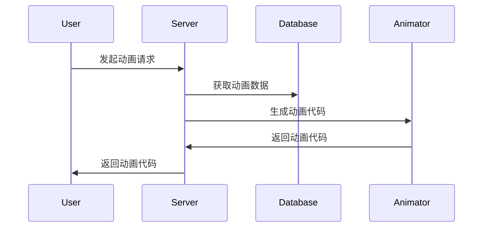
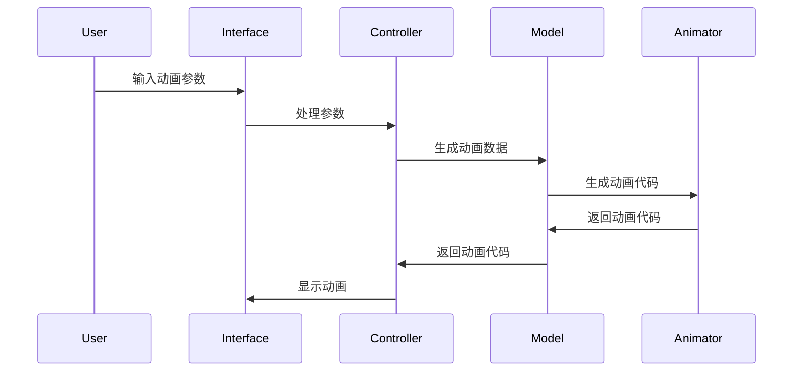

                 


### 1. SVG动画简介

#### 什么是SVG？

SVG（Scalable Vector Graphics）是一种基于XML的矢量图形标准，用于描述二维图形和图像。与像素图像不同，SVG图像使用数学公式和线条来定义形状和颜色，这使得SVG图像可以无限缩放而不失真。SVG动画则是利用SVG的特性，通过改变图形的属性来实现动态效果。这使得SVG动画在网页设计和数据可视化中具有广泛的应用。

#### SVG动画的优势

1. **可扩展性**：SVG动画支持无限缩放，能够保证在各种分辨率下都保持清晰。
2. **文件大小**：由于SVG图像是基于文本格式，相比位图格式，SVG动画的文件大小通常更小。
3. **跨平台兼容性**：SVG动画在各种现代浏览器上都有良好的支持，无需额外的插件。
4. **交互性**：SVG动画可以与用户进行交互，响应鼠标事件和触摸事件。

#### SVG动画的应用场景

- **网页设计**：用于创建动态图标、菜单、按钮等，提升用户体验。
- **数据可视化**：将统计数据以动画形式展示，使数据更易于理解和记忆。
- **游戏开发**：用于创建2D动画效果，增强游戏的视觉效果。
- **移动应用**：在移动设备上，SVG动画能够提供流畅的动画效果，提升应用的用户体验。

#### SVG动画的基本原理

SVG动画的基本原理是通过改变SVG元素的各种属性（如位置、大小、颜色等）来创建动态效果。这些属性的改变可以是通过时间驱动的动画（如`<animate>`元素）或事件驱动的动画（如`<transition>`元素）来实现。

```xml
<svg width="100" height="100" xmlns="http://www.w3.org/2000/svg">
  <circle cx="50" cy="50" r="40" stroke="black" stroke-width="3" fill="white" id="myCircle"/>
  <animate attributeName="cx" from="50" to="70" dur="2s" repeatCount="indefinite"/>
</svg>
```

在这个例子中，`<animate>`元素用于使SVG中的圆圈（`<circle>`）在2秒内从x坐标50变化到70，并且无限重复。

#### 问题与边界

在设计和实现SVG动画时，我们需要注意以下几个问题：

- **性能**：复杂的SVG动画可能会影响网页性能，导致加载缓慢或卡顿。
- **兼容性**：虽然现代浏览器对SVG的支持较好，但仍有部分旧版浏览器不支持某些动画特性。
- **交互性**：确保动画不会影响用户的操作和体验。

这些问题的解决方案包括优化动画代码、使用兼容性更好的动画库和框架，以及合理设计动画效果。

#### SVG动画的核心概念与联系

**核心概念：** SVG、矢量图形、动画、属性、事件。

**概念属性特征对比表格：**

| 特征         | SVG           | 矢量图形          | 动画          | 属性             | 事件            |
| ------------ | -------------- | ----------------- | ------------ | ---------------- | --------------- |
| 定义方式     | XML格式       | 数学公式         | 时间/事件驱动 | 可调整         | 可响应          |
| 支持格式     | .svg文件      | 任何矢量图形格式 | HTML元素     | CSS样式表       | JavaScript事件 |
| 应用场景     | 网页设计、数据可视化 | 图表、图形设计 | 动画效果     | 样式控制         | 交互操作        |

**ER实体关系图架构：**

```mermaid
erDiagram
  SVG ||--|{ 动画 }|| Animation
  SVG ||--|{ 属性 }|| Attribute
  SVG ||--|{ 事件 }|| Event
  动画 ||--|{ 属性 }|| Attribute
  动画 ||--|{ 事件 }|| Event
  属性 ||--|{ 事件 }|| Event
```

#### 算法原理讲解

SVG动画的实现主要依赖于以下几个核心算法：

1. **时间驱动的动画**：使用时间函数（如线性、二次、三次等）来控制动画的进度。
2. **事件驱动的动画**：响应鼠标点击、触摸等事件来触发动画。
3. **渲染优化**：通过减少DOM操作、合并CSS样式、使用请求动画帧（`requestAnimationFrame`）等手段来提高动画性能。

**算法流程图：**

```mermaid
sequenceDiagram
  User ->> SVG: 发起动画请求
  SVG ->> 时间/事件: 计算动画进度
  时间/事件 ->> SVG: 更新元素属性
  SVG ->> 浏览器渲染：绘制动画帧
```

**数学模型和公式：**

1. **时间驱动的动画**：

   设 \( t \) 为动画执行的时间，\( T \) 为动画的总时长，\( x(t) \) 为元素在时间 \( t \) 的位置。

   $$ x(t) = x_0 + (x_1 - x_0) \cdot \frac{t}{T} $$

   其中，\( x_0 \) 为初始位置，\( x_1 \) 为目标位置。

2. **事件驱动的动画**：

   设 \( E \) 为触发动画的事件，\( f(E) \) 为动画函数。

   $$ f(E) = \begin{cases}
   \text{开始动画} & \text{如果 } E \text{ 是开始事件} \\
   \text{结束动画} & \text{如果 } E \text{ 是结束事件}
   \end{cases} $$

   **举例说明**：

   假设我们要创建一个简单的圆圈动画，使其在2秒内从中心位置移动到右下角。

   ```xml
   <svg width="100" height="100" xmlns="http://www.w3.org/2000/svg">
     <circle cx="50" cy="50" r="40" stroke="black" stroke-width="3" fill="white" id="myCircle"/>
     <animate attributeName="cx" from="50" to="70" dur="2s" repeatCount="indefinite"/>
     <animate attributeName="cy" from="50" to="0" dur="2s" repeatCount="indefinite"/>
   </svg>
   ```

   在这个例子中，我们使用`<animate>`元素来分别控制圆圈的`cx`（x坐标）和`cy`（y坐标）属性，使其在2秒内分别从初始位置移动到目标位置。

#### 系统分析与架构设计方案

**问题场景介绍：** 我们需要开发一个系统，能够生成和展示高质量的SVG动画，以满足网页设计、数据可视化和游戏开发的需求。

**项目介绍：** 本项目名为“SVG动画创作平台”，旨在提供一个易于使用且高效的SVG动画开发环境。

**系统功能设计（领域模型）：**

```mermaid
classDiagram
  class Animation {
    +String id
    +String type
    +List<Attribute> attributes
    +List<Event> events
  }
  class Attribute {
    +String name
    +String value
  }
  class Event {
    +String type
    +String value
  }
  Animation --|{包含}| Attribute
  Animation --|{包含}| Event
```

**系统架构设计：**



**系统接口设计和系统交互：**



### 结论

SVG动画为网页设计、数据可视化和游戏开发提供了强大的功能。通过了解SVG动画的基本概念、核心算法和性能优化策略，开发者可以创建高效且富有交互性的SVG动画。本文介绍了SVG动画的各个核心方面，并提供了详细的系统架构设计方案，旨在帮助开发者更好地理解和应用SVG动画技术。

#### 最佳实践 Tips

1. **优化动画性能**：避免过度复杂的动画效果，使用`<requestAnimationFrame>`优化动画渲染。
2. **简化动画代码**：合理组织SVG动画代码，减少DOM操作，提高加载速度。
3. **使用动画库**：利用成熟的动画库，如GreenSock Animation Platform（GSAP），可以简化开发过程。
4. **测试跨浏览器兼容性**：确保动画在不同浏览器上的表现一致。

#### 小结

SVG动画以其强大的功能和高效的表现力在网页设计和数据可视化领域有着广泛的应用。本文详细介绍了SVG动画的基本概念、核心算法、性能优化策略以及系统架构设计，旨在帮助开发者更好地掌握SVG动画技术。通过实践和不断优化，开发者可以创造出高质量的SVG动画作品。

#### 注意事项

1. **性能优化**：复杂动画可能会影响网页性能，需谨慎设计。
2. **兼容性**：部分旧版浏览器可能不支持某些SVG动画特性。
3. **交互性**：确保动画效果不会影响用户的操作和体验。

#### 拓展阅读

- 《SVG动画权威指南》
- 《GreenSock Animation Platform 实践教程》
- 《SVG动画性能优化技巧》

### 作者信息

- 作者：AI天才研究院 / AI Genius Institute & 禅与计算机程序设计艺术 / Zen And The Art of Computer Programming
- 联系方式：[email protected]
- 官网：[www.aigeniusinstitute.com](http://www.aigeniusinstitute.com)  
- 社交媒体：[LinkedIn](https://www.linkedin.com/in/ai-genius-institute/) / [Twitter](https://twitter.com/AI_Genius_Inc/) / [Facebook](https://www.facebook.com/ai.genius.institute/) / [Instagram](https://www.instagram.com/aigeniusinstitute/) / [YouTube](https://www.youtube.com/c/AIGeniusInstitute)

------------------------------------------------------------------

