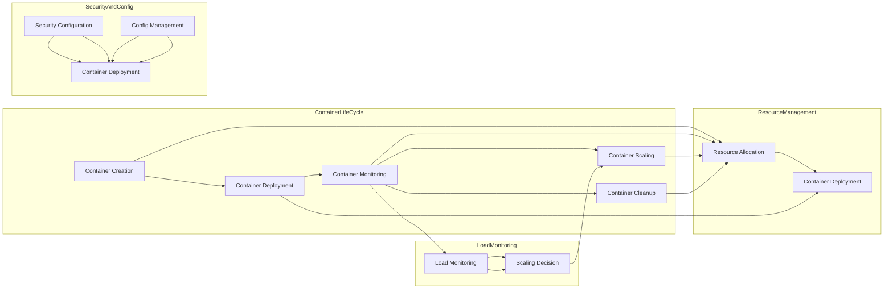
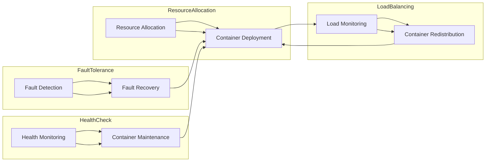

                 


### 1.1 问题的提出

在云计算和微服务架构飞速发展的背景下，传统的容器技术逐渐显现出其局限性。虽然容器技术为应用程序提供了轻量级、独立运行环境、高效资源利用等优势，但在面对动态伸缩、成本控制、运维复杂性等方面，容器技术仍存在改进空间。传统容器技术依赖于用户手动编排和调度，需要关注容器的生命周期管理、资源分配和故障转移等问题，这无疑增加了运维的负担，且难以适应业务快速变化的场景。

Serverless容器技术应运而生，旨在解决上述问题。它通过抽象底层基础设施，实现自动化的容器编排和调度，从而提高应用程序的弹性和效率，降低运维成本和复杂性。Serverless容器技术将容器与函数计算相结合，使得开发人员可以专注于业务逻辑的实现，而无需关注底层基础设施的管理。

### 1.2 问题描述

Serverless容器技术解决了哪些问题？以下是Serverless容器技术需要解决的几个关键问题：

1. **弹性伸缩**：随着业务需求的变化，应用程序需要能够动态调整资源，实现自动扩缩容。传统容器技术通常需要用户手动调整，而Serverless容器技术能够自动感知负载变化，自动调整容器数量。

2. **成本控制**：传统容器技术存在资源浪费和成本高昂的问题。Serverless容器技术通过按需付费模式，实现资源的精细调度和优化，从而降低成本。

3. **运维简化**：Serverless容器技术减少了运维工作量，将容器编排和调度等复杂任务自动化，使得开发人员能够专注于业务逻辑的实现。

4. **部署和运维一致性**：传统容器技术在不同环境下可能存在部署和运维不一致的问题，而Serverless容器技术提供了统一的管理界面和工具链，确保部署和运维的一致性。

5. **安全性**：Serverless容器技术需要确保应用程序的安全性，避免潜在的安全威胁和漏洞。

### 1.3 问题的解决方法

Serverless容器技术通过以下方法解决了上述问题：

1. **自动化容器编排**：Serverless容器技术实现了自动化的容器编排，通过容器编排算法，根据负载情况动态调整容器数量和资源分配。

2. **弹性调度**：Serverless容器技术采用了弹性调度算法，能够根据负载情况自动扩展和收缩容器资源，确保应用程序的稳定运行。

3. **按需付费**：Serverless容器技术采用了按需付费模式，用户只需为实际使用的资源付费，从而降低了成本。

4. **简化运维**：Serverless容器技术提供了自动化运维工具，减少了手动操作和维护的工作量。

5. **安全策略**：Serverless容器技术引入了安全策略和监控机制，确保应用程序的安全性。

### 1.4 边界与外延

Serverless容器技术的边界和适用范围如下：

1. **边界**：Serverless容器技术主要适用于需要动态伸缩、高可用性和低运维成本的场景，如电商平台、实时数据处理、物联网应用等。

2. **外延**：Serverless容器技术可以与其他云计算和微服务架构技术结合，如Kubernetes、Docker等，以提供更丰富的功能和更灵活的部署方式。

### 1.5 概念结构与核心要素组成

Serverless容器技术的核心概念和要素包括：

1. **容器**：容器是一种轻量级、独立的运行环境，用于隔离应用程序和其依赖项。

2. **容器编排**：容器编排是指自动化管理容器的过程，包括容器创建、部署、扩展和监控等。

3. **容器调度**：容器调度是指根据负载情况动态调整容器数量和资源分配的过程。

4. **Serverless架构**：Serverless架构是一种云计算服务模式，用户无需管理底层基础设施，只需关注业务逻辑。

5. **弹性伸缩**：弹性伸缩是指根据负载情况自动调整资源的过程，以实现高效利用和降低成本。

6. **按需付费**：按需付费是指根据实际使用的资源付费的计费模式，以降低成本。

### 1.6 总结

Serverless容器技术通过自动化容器编排、弹性调度和按需付费等机制，解决了传统容器技术面临的诸多问题，为开发者提供了更高效、更灵活的部署和运维方案。在接下来的章节中，我们将深入探讨Serverless容器技术的核心概念、算法原理、系统架构以及实战应用。通过逐步分析，我们将为您揭示Serverless容器技术的本质和魅力。让我们一起探索这一创新技术，开启云原生应用的新时代。

## 第2章：核心概念与联系

### 2.1 Serverless 容器技术的定义

Serverless容器技术是一种结合了Serverless架构和容器技术的创新方案。它通过抽象底层基础设施，提供了一种无需关注容器管理的云计算服务模式。在Serverless容器技术中，容器被视为执行应用程序的基本单位，而Serverless架构则负责管理容器的生命周期、资源分配和弹性伸缩。

与传统容器技术相比，Serverless容器技术在几个关键方面有所不同。首先，它无需用户手动管理容器，而是通过自动化编排和调度来简化运维工作。其次，Serverless容器技术采用了按需付费模式，用户只需为实际使用的资源付费，从而降低了成本。此外，Serverless容器技术还具备更高的弹性和可用性，能够根据负载情况自动调整容器数量和资源分配。

### 2.2 Serverless 容器技术的属性特征对比

表 1：Serverless容器技术与传统容器技术属性特征对比

| 属性特征 | Serverless容器技术 | 传统容器技术 |
| :--- | :--- | :--- |
| **资源管理** | 自动化、按需分配 | 手动管理、预定资源 |
| **部署方式** | 统一管理界面、一键部署 | 本地部署、手动部署 |
| **弹性伸缩** | 自动扩展和收缩 | 需要手动调整 |
| **成本控制** | 按需付费、精细调度 | 预定费用、资源浪费 |
| **运维复杂性** | 简化运维、自动化管理 | 复杂性高、依赖人工 |
| **安全性** | 安全策略、监控机制 | 需要额外配置 |

### 2.3 Serverless 容器技术与微服务架构的联系

Serverless容器技术与微服务架构有着紧密的联系。微服务架构是一种将应用程序分解为多个独立、可复用的服务单元的设计模式，而Serverless容器技术则为这些服务单元提供了高效的运行环境。

Serverless容器技术在微服务架构中的作用主要包括：

1. **容器化微服务**：将微服务容器化，使得服务单元可以在隔离的环境中运行，提高系统的可靠性和可维护性。
2. **弹性伸缩**：根据微服务的负载情况，自动调整容器数量和资源分配，确保服务的高可用性和性能。
3. **自动化运维**：通过自动化编排和调度，简化微服务的部署、扩缩容和监控等运维工作。
4. **成本优化**：按需付费模式降低了微服务运行的成本，实现了资源的高效利用。

总之，Serverless容器技术为微服务架构提供了更高效、更灵活的运行环境，使得开发者可以更专注于业务逻辑的实现，而无需担心底层基础设施的管理和维护。

### 2.4 容器编排算法与调度算法的关系

容器编排算法和调度算法是Serverless容器技术的核心组成部分，它们在实现自动化管理和优化资源利用方面发挥着重要作用。

**容器编排算法**：容器编排算法负责管理容器的生命周期，包括容器的创建、部署、扩展和监控等。其核心目标是确保应用程序在适当的容器中高效运行，同时最大化资源利用率。容器编排算法通常包括以下功能：

1. **容器创建**：根据服务需求创建新的容器实例。
2. **容器部署**：将应用程序部署到容器中，并确保容器具有正确的配置和依赖项。
3. **容器扩展**：根据负载情况动态调整容器数量和资源分配。
4. **容器监控**：实时监控容器状态，及时发现并处理异常情况。

**容器调度算法**：容器调度算法负责在宿主机上分配容器资源，确保容器能够在最佳位置运行。其核心目标是优化资源利用率，降低延迟和资源浪费。容器调度算法通常包括以下功能：

1. **资源分配**：为容器分配适当的CPU、内存等资源。
2. **负载均衡**：根据容器负载情况，动态调整容器在宿主机上的分布。
3. **故障转移**：在容器发生故障时，快速将容器迁移到其他宿主机上，确保服务的连续性。

容器编排算法和调度算法之间密切相关，它们共同协作，实现自动化管理和优化资源利用。容器编排算法负责容器的生命周期管理，而容器调度算法则负责容器在宿主机上的资源分配和负载均衡。通过容器编排算法和调度算法的协同工作，Serverless容器技术能够实现高效、可靠的容器化应用程序运行。

### 2.5 概念架构与联系

为了更好地理解Serverless容器技术的概念架构与联系，我们可以使用Mermaid绘制一个实体关系图，以便直观地展示各核心概念之间的关系。

```mermaid
erDiagram
  Container ||--|{ ServerlessContainer : implements
  ServerlessContainer ||--|{ ContainerOrchestrator : uses
  ServerlessContainer ||--|{ Scheduler : uses
  ContainerOrchestrator ||--|{ ResourceAllocator : uses
  ContainerOrchestrator ||--|{ HealthMonitor : uses
  Scheduler ||--|{ LoadBalancer : uses
  Scheduler ||--|{ FaultToleranceManager : uses

  Container ||--|{ Service : aggregates
  Service ||--|{ Application : implements

  ContainerOrchestrator ||..> Kubernetes
  Scheduler ||..> Kubernetes Scheduler
  ResourceAllocator ||-- Kubernetes Resource Allocator
  HealthMonitor ||-- Kubernetes Health Monitor
  LoadBalancer ||-- Kubernetes Load Balancer
  FaultToleranceManager ||-- Kubernetes Replication Controller
```

上述Mermaid实体关系图展示了Serverless容器技术的核心概念及其之间的联系：

- **Container（容器）**：作为基础运行单元，用于封装应用程序及其依赖项。
- **ServerlessContainer（Serverless容器）**：在传统容器的基础上，实现了Serverless特性，如自动扩缩容和按需付费。
- **ContainerOrchestrator（容器编排器）**：负责管理容器生命周期，如创建、部署、扩展和监控等。
- **Scheduler（调度器）**：负责在宿主机上分配容器资源，实现负载均衡和故障转移。
- **ResourceAllocator（资源分配器）**：负责为容器分配CPU、内存等资源。
- **HealthMonitor（健康监控器）**：监控容器状态，确保容器正常运行。
- **LoadBalancer（负载均衡器）**：均衡容器间的负载，提高系统性能和可用性。
- **FaultToleranceManager（故障容忍管理器）**：处理容器故障，实现容器的自动恢复。
- **Service（服务）**：由一组容器组成，实现了特定的业务功能。
- **Application（应用程序）**：由多个服务组成，实现了完整的业务逻辑。

通过实体关系图，我们可以清晰地看到Serverless容器技术的核心概念及其之间的关联性，有助于我们更好地理解这一技术的本质和运作机制。

### 第3章：容器编排算法原理

#### 3.1 容器编排算法概述

容器编排算法是Serverless容器技术的核心组成部分，负责管理容器的生命周期，包括创建、部署、扩展和监控等。其主要目标是在满足业务需求的同时，最大化资源利用率和系统性能。容器编排算法通常包括以下几个关键步骤：

1. **容器创建**：根据服务需求创建新的容器实例。这通常基于容器镜像，容器镜像包含了应用程序及其依赖项。

2. **容器部署**：将容器部署到合适的宿主机上，并确保容器具有正确的配置和依赖项。部署过程中，需要考虑资源分配、网络配置和安全策略等因素。

3. **容器扩展**：根据负载情况动态调整容器数量和资源分配。这通常通过监控容器性能指标（如CPU使用率、内存使用率等）来实现。

4. **容器监控**：实时监控容器状态，及时发现并处理异常情况。监控包括容器的健康状态、资源使用情况和网络连接状态等。

#### 3.2 容器编排算法的 Mermaid 流程图

为了更直观地展示容器编排算法的工作流程，我们可以使用Mermaid绘制一个流程图。



这个Mermaid流程图展示了容器编排算法的主要步骤及其相互关系：

- **ContainerLifeCycle**：容器生命周期的关键步骤，包括创建、部署、监控、扩展和清理。
- **LoadMonitoring**：负载监控，用于决定是否需要扩展容器。
- **ResourceManagement**：资源管理，包括资源分配和容器部署。
- **SecurityAndConfig**：安全配置和管理，确保容器部署的安全性和正确性。

通过这个流程图，我们可以清晰地看到容器编排算法的工作机制，以及各个步骤之间的关联。

#### 3.3 Python 源代码详解

为了更深入地理解容器编排算法的实现，我们可以使用Python编写一个简单的容器编排算法示例。以下是一个Python源代码的详细讲解。

```python
import random
import time
from threading import Thread

class Container:
    def __init__(self, id, status="running"):
        self.id = id
        self.status = status
        self.cpu_usage = 0
        self.memory_usage = 0

    def update_usage(self, cpu_usage, memory_usage):
        self.cpu_usage = cpu_usage
        self.memory_usage = memory_usage

    def scale_up(self):
        # 假设扩展策略为随机增加10%的资源
        self.cpu_usage *= 1.1
        self.memory_usage *= 1.1
        print(f"Container {self.id} scaled up.")

    def scale_down(self):
        # 假设缩减策略为随机减少10%的资源
        self.cpu_usage *= 0.9
        self.memory_usage *= 0.9
        print(f"Container {self.id} scaled down.")

def monitor_container(container):
    while True:
        time.sleep(1)  # 模拟监控间隔
        random_usage = random.uniform(0, 1)  # 模拟CPU和内存使用率
        container.update_usage(random_usage, random_usage)
        if container.cpu_usage > 0.8 or container.memory_usage > 0.8:
            # 如果使用率超过80%，则进行扩展
            container.scale_up()
        elif container.cpu_usage < 0.2 or container.memory_usage < 0.2:
            # 如果使用率低于20%，则进行缩减
            container.scale_down()

def main():
    containers = [Container(id=i) for i in range(5)]
    threads = []

    # 启动容器监控线程
    for container in containers:
        thread = Thread(target=monitor_container, args=(container,))
        thread.start()
        threads.append(thread)

    # 模拟运行一段时间
    time.sleep(10)

    # 停止监控线程
    for thread in threads:
        thread.join()

if __name__ == "__main__":
    main()
```

**代码解释**：

- **Container 类**：定义了容器的基本属性，包括ID、状态、CPU使用率和内存使用率。容器还提供了更新使用率、扩展和缩减的方法。

- **monitor_container 函数**：模拟容器监控，随机生成CPU和内存使用率，并更新容器的使用率。如果使用率超过80%，则进行扩展；如果使用率低于20%，则进行缩减。

- **main 函数**：创建多个容器实例，启动监控线程，模拟运行一段时间，然后停止监控线程。

通过这个Python示例，我们可以看到容器编排算法的基本实现。在实际应用中，容器编排算法会更为复杂，涉及更多的策略和优化方法。

#### 3.4 算法原理的数学模型与公式讲解

容器编排算法的核心在于资源分配和负载均衡，下面我们介绍一些基本的数学模型和公式，以帮助理解算法原理。

**1. 资源分配模型**

资源分配模型用于决定容器所需的资源量。假设每个容器需要C个CPU和M个内存单位，总资源量为R（CPU）和S（内存），资源分配模型的目标是最大化资源利用率，同时满足每个容器的需求。

**资源需求函数**：\( D_i = \{ C_i, M_i \} \) （第i个容器的资源需求）

**资源总量函数**：\( R = \{ R_c, R_m \} \) （总CPU和内存资源量）

**资源分配函数**：\( A_i = \{ C_a, M_a \} \) （第i个容器实际获得的资源量）

**资源利用率函数**：\( U_i = \frac{A_i}{D_i} \) （第i个容器的资源利用率）

**2. 负载均衡模型**

负载均衡模型用于决定容器在宿主机上的分布。假设有N个容器和M个宿主机，每个容器需要处理一定量的负载，负载均衡模型的目标是优化负载分配，减少延迟和资源浪费。

**负载需求函数**：\( L_i \) （第i个容器的负载需求）

**宿主机容量函数**：\( C_j \) （第j个宿主机的容量）

**负载分配函数**：\( B_{ij} \) （第i个容器分配到第j个宿主机上的负载）

**负载均衡度函数**：\( B_i = \frac{B_{i1} + B_{i2} + ... + B_{iM}}{N} \) （第i个容器的负载均衡度）

**3. 扩展和缩减策略**

扩展和缩减策略用于根据负载情况动态调整容器资源。常见的扩展策略包括线性扩展、指数扩展和对数扩展等。缩减策略与扩展策略类似，但目标是减少资源使用。

**扩展策略**：

- **线性扩展**：\( A_i = A_i + k \times D_i \) （k为扩展系数）
- **指数扩展**：\( A_i = A_i + \alpha \times D_i \) （\(\alpha\)为扩展系数）

**缩减策略**：

- **线性缩减**：\( A_i = A_i - k \times D_i \) （k为缩减系数）
- **指数缩减**：\( A_i = A_i - \alpha \times D_i \) （\(\alpha\)为缩减系数）

#### 3.5 举例说明

为了更好地理解容器编排算法的应用，我们可以通过一个实际场景来举例说明。

**场景**：假设我们有一个包含5个容器的应用，每个容器需要1个CPU和2个内存单位。当前系统总资源量为10个CPU和20个内存单位。

**步骤**：

1. **初始状态**：所有容器处于运行状态，资源利用率均为100%。

2. **监控**：经过一段时间监控，我们发现第3个容器的CPU使用率降至20%，而其他容器均超过80%。

3. **扩展**：根据扩展策略，我们对第3个容器进行线性缩减，使其CPU和内存资源分别降至0.8个和1.6个单位。

4. **监控**：再次监控后，我们发现第4个容器的CPU使用率降至30%，其他容器使用率稳定。

5. **扩展**：我们对第4个容器进行指数扩展，使其CPU和内存资源分别增至1.2个和2.4个单位。

6. **监控**：经过一段时间监控，我们发现所有容器的使用率均保持在合理范围内，系统运行稳定。

通过这个例子，我们可以看到容器编排算法如何根据负载情况动态调整容器资源，实现资源的高效利用和系统的稳定性。

### 第4章：容器调度算法原理

#### 4.1 容器调度算法概述

容器调度算法是Serverless容器技术的核心组成部分，负责在宿主机上分配容器资源，实现负载均衡和故障转移等功能。其主要目标是优化资源利用，提高系统性能和可靠性。容器调度算法通常包括以下几个关键步骤：

1. **资源分配**：为容器分配适当的CPU、内存和存储等资源，确保容器能够正常运行。

2. **负载均衡**：根据容器的负载情况，动态调整容器在宿主机上的分布，以实现负载均衡，减少资源浪费。

3. **故障转移**：在容器发生故障时，快速将容器迁移到其他宿主机上，确保服务的连续性和可用性。

4. **健康检查**：定期检查容器的运行状态，确保容器保持健康，及时处理异常情况。

#### 4.2 容器调度算法的 Mermaid 流程图

为了更直观地展示容器调度算法的工作流程，我们可以使用Mermaid绘制一个流程图。



这个Mermaid流程图展示了容器调度算法的主要步骤及其相互关系：

- **ResourceAllocation**：资源分配，为容器分配资源。
- **LoadBalancing**：负载均衡，根据负载情况调整容器分布。
- **FaultTolerance**：故障转移，处理容器故障。
- **HealthCheck**：健康检查，监控容器状态。

通过这个流程图，我们可以清晰地看到容器调度算法的工作机制，以及各个步骤之间的关联。

#### 4.3 Python 源代码详解

为了更深入地理解容器调度算法的实现，我们可以使用Python编写一个简单的容器调度算法示例。以下是一个Python源代码的详细讲解。

```python
import random
import time
from threading import Thread

class Host:
    def __init__(self, id, capacity):
        self.id = id
        self.capacity = capacity
        self.allocated_resources = [0, 0]  # [CPU, Memory]
        self.containers = []

    def allocate_resource(self, container):
        if self.is_sufficient_resource(container):
            self.allocated_resources[0] += container.cpu_requirement
            self.allocated_resources[1] += container.memory_requirement
            self.containers.append(container)
            print(f"Container {container.id} allocated to Host {self.id}.")
        else:
            print(f"Not enough resources on Host {self.id} to allocate Container {container.id}.")

    def deallocate_resource(self, container):
        self.allocated_resources[0] -= container.cpu_requirement
        self.allocated_resources[1] -= container.memory_requirement
        self.containers.remove(container)
        print(f"Container {container.id} deallocated from Host {self.id}.")

    def is_sufficient_resource(self, container):
        return (self.allocated_resources[0] + container.cpu_requirement <= self.capacity[0] and
                self.allocated_resources[1] + container.memory_requirement <= self.capacity[1])

class Container:
    def __init__(self, id, cpu_requirement, memory_requirement):
        self.id = id
        self.cpu_requirement = cpu_requirement
        self.memory_requirement = memory_requirement

def load_balancer(hosts, containers):
    while True:
        time.sleep(1)  # 模拟负载监控间隔
        for host in hosts:
            if not host.is_sufficient_resource(containers[0]):
                host.deallocate_resource(containers[0])
                random_host = random.choice(hosts)
                while not random_host.is_sufficient_resource(containers[0]):
                    random_host = random.choice(hosts)
                random_host.allocate_resource(containers[0])

def main():
    hosts = [Host(id=i, capacity=[10, 20]) for i in range(3)]
    containers = [Container(id=i, cpu_requirement=5, memory_requirement=10) for i in range(5)]
    threads = []

    # 启动负载均衡线程
    load_balancer_thread = Thread(target=load_balancer, args=(hosts, containers))
    load_balancer_thread.start()
    threads.append(load_balancer_thread)

    # 模拟运行一段时间
    time.sleep(10)

    # 停止负载均衡线程
    load_balancer_thread.join()

    # 输出最终状态
    for host in hosts:
        print(f"Host {host.id}: Allocated Containers: {host.containers}, CPU: {host.allocated_resources[0]}, Memory: {host.allocated_resources[1]}")

if __name__ == "__main__":
    main()
```

**代码解释**：

- **Host 类**：定义了宿主机的基本属性，包括ID、容量、已分配资源列表和容器列表。宿主机提供了分配和释放资源的函数，以及检查资源是否充足的方法。

- **Container 类**：定义了容器的基本属性，包括ID、CPU需求和内存需求。

- **load_balancer 函数**：模拟负载均衡过程，定期检查容器负载，并在宿主机之间重新分配容器。

- **main 函数**：创建宿主机和容器实例，启动负载均衡线程，模拟运行一段时间，然后停止负载均衡线程，并输出最终状态。

通过这个Python示例，我们可以看到容器调度算法的基本实现。在实际应用中，容器调度算法会更为复杂，涉及更多的策略和优化方法。

#### 4.4 算法原理的数学模型与公式讲解

容器调度算法的核心在于资源分配和负载均衡，下面我们介绍一些基本的数学模型和公式，以帮助理解算法原理。

**1. 资源需求模型**

资源需求模型用于描述容器的资源需求。假设每个容器需要C个CPU和M个内存单位，资源需求模型的目标是确保容器获得足够的资源，同时最大化资源利用率。

**资源需求函数**：\( R_i = \{ C_i, M_i \} \) （第i个容器的资源需求）

**2. 资源分配模型**

资源分配模型用于为容器分配资源。假设宿主机容量为\( H_j = \{ C_j, M_j \} \) （第j个宿主机的CPU和内存容量），资源分配模型的目标是实现资源利用最大化。

**资源分配函数**：\( A_{ij} \) （第i个容器在第j个宿主机上的资源分配量）

**资源利用率函数**：\( U_j = \frac{\sum_{i} A_{ij}}{H_j} \) （第j个宿主机的资源利用率）

**3. 负载均衡模型**

负载均衡模型用于优化容器在宿主机上的分布。假设有N个容器和M个宿主机，负载均衡模型的目标是实现负载均衡，减少资源浪费。

**负载需求函数**：\( L_i \) （第i个容器的负载需求）

**宿主机容量函数**：\( C_j \) （第j个宿主机的容量）

**负载均衡度函数**：\( B_j = \frac{\sum_{i} A_{ij}}{C_j} \) （第j个宿主机的负载均衡度）

**4. 故障转移模型**

故障转移模型用于处理容器故障。假设有N个容器和M个宿主机，故障转移模型的目标是在容器发生故障时，快速将容器迁移到其他宿主机上。

**故障转移函数**：\( F_i \) （第i个容器的故障转移位置）

**5. 扩展和缩减策略**

扩展和缩减策略用于根据负载情况动态调整资源分配。常见的扩展策略包括线性扩展、指数扩展和对数扩展等。

**扩展策略**：

- **线性扩展**：\( A_i = A_i + k \times R_i \) （k为扩展系数）

**缩减策略**：

- **线性缩减**：\( A_i = A_i - k \times R_i \) （k为缩减系数）

通过这些数学模型和公式，我们可以更好地理解容器调度算法的原理，并为其设计更高效的策略。

#### 4.5 举例说明

为了更好地理解容器调度算法的应用，我们可以通过一个实际场景来举例说明。

**场景**：假设我们有一个包含5个容器的应用，每个容器需要1个CPU和2个内存单位。当前系统包含3个宿主机，宿主机1的容量为10个CPU和20个内存单位，宿主机2的容量为8个CPU和16个内存单位，宿主机3的容量为12个CPU和24个内存单位。

**步骤**：

1. **初始状态**：所有容器处于运行状态，资源利用率均为100%。

2. **监控**：经过一段时间监控，我们发现宿主机1的负载均衡度为0.8，而宿主机2和宿主机3的负载均衡度为1.2。

3. **负载均衡**：根据负载均衡度，我们决定将宿主机1上的容器迁移到宿主机2或宿主机3。由于宿主机2的容量较小，我们选择将容器迁移到宿主机3。

4. **扩展**：为了优化资源利用率，我们决定在宿主机3上扩展容器。根据扩展策略，我们选择线性扩展，将容器CPU和内存需求分别增加20%。

5. **监控**：再次监控后，我们发现宿主机3的负载均衡度降至1.0，系统运行稳定。

通过这个例子，我们可以看到容器调度算法如何根据负载情况动态调整容器资源，实现负载均衡和资源优化。这有助于提高系统性能和可靠性，降低运维成本。

## 第5章：系统功能设计与架构设计

### 5.1 问题场景介绍

在当前云计算环境下，企业面临着日益增长的IT需求，需要快速部署和扩展应用程序，以满足不断变化的业务需求。然而，传统容器技术由于需要手动管理容器，部署和运维过程繁琐，且难以实现弹性伸缩，导致企业在资源利用率和运维成本方面面临挑战。

为了解决这些问题，我们设计了一个基于Serverless容器技术的系统，旨在提供一种高效、灵活、易于管理的容器化解决方案。该系统将实现以下功能：

1. **自动化容器编排**：通过自动化编排算法，实现容器创建、部署、扩展和监控，降低运维复杂性。
2. **弹性伸缩**：根据负载情况自动调整容器数量和资源分配，实现弹性伸缩，提高系统性能和可用性。
3. **成本优化**：采用按需付费模式，实现资源的精细调度和优化，降低企业运营成本。
4. **安全性**：引入安全策略和监控机制，确保应用程序的安全性。
5. **部署和运维一致性**：提供统一的管理界面和工具链，确保部署和运维的一致性。

### 5.2 项目介绍

本项目的目标是设计并实现一个基于Serverless容器技术的系统，该系统将利用云计算平台的资源，为企业和开发者提供高效的容器化解决方案。项目的主要模块包括：

1. **容器编排模块**：负责自动化管理容器的生命周期，包括创建、部署、扩展和监控等。
2. **容器调度模块**：负责根据负载情况动态调整容器资源分配，实现负载均衡和故障转移。
3. **监控和日志模块**：实时监控容器状态，记录日志，提供故障诊断和性能分析功能。
4. **安全管理模块**：引入安全策略，确保应用程序和数据的安全性。
5. **用户界面模块**：提供统一的用户界面，方便用户进行容器管理和监控。

### 5.3 系统功能设计

系统的功能设计旨在实现高效、灵活和易于管理的容器化解决方案。以下是系统的主要功能设计：

1. **自动化容器编排**：系统将自动感知容器的状态，根据业务需求自动创建、部署和扩展容器。用户可以通过REST API或图形界面提交编排请求，系统将自动处理这些请求，确保容器能够高效运行。

2. **弹性伸缩**：系统将根据负载情况动态调整容器数量和资源分配。当负载增加时，系统会自动创建新的容器以应对需求；当负载减少时，系统会自动缩减容器数量，以降低成本。

3. **监控和日志**：系统将实时监控容器的运行状态，记录容器的日志，并提供故障诊断和性能分析功能。用户可以通过监控界面查看容器的CPU、内存、网络等性能指标，以及日志记录。

4. **安全性**：系统将引入安全策略，包括容器网络隔离、访问控制、加密存储等，确保应用程序和数据的安全性。系统还将提供安全审计和监控功能，帮助用户及时发现和应对潜在的安全威胁。

5. **部署和运维一致性**：系统将提供统一的管理界面和工具链，实现部署和运维的一致性。用户可以通过图形界面或命令行工具轻松部署和管理容器，无需关注底层基础设施。

### 5.4 系统架构设计

系统采用分布式架构设计，以实现高可用性和可扩展性。以下是系统的主要架构设计：

1. **容器编排层**：包括Kubernetes集群，负责自动化管理容器的生命周期，如容器创建、部署、扩展和监控等。Kubernetes集群由多个节点组成，每个节点上运行一个Kubernetes代理，负责管理本地的容器。

2. **容器调度层**：包括容器调度器，负责根据负载情况动态调整容器资源分配，实现负载均衡和故障转移。调度器采用分布式架构，可扩展性强，可支持大规模容器调度。

3. **监控和日志层**：包括监控agent和日志收集器，负责实时监控容器的运行状态，记录容器的日志，并提供故障诊断和性能分析功能。监控agent部署在各个节点上，负责收集容器的性能指标和日志信息。

4. **安全管理层**：包括安全策略引擎和访问控制模块，负责引入安全策略，确保应用程序和数据的安全性。安全策略引擎根据用户定义的策略，对容器网络、访问控制等进行安全控制。

5. **用户界面层**：包括Web界面和命令行界面，提供统一的管理界面，方便用户进行容器管理和监控。用户可以通过Web界面或命令行工具提交编排请求、查看监控数据和日志记录。

### 5.5 系统接口设计

系统提供以下主要接口：

1. **容器编排接口**：用户可以通过REST API提交容器编排请求，包括容器创建、部署、扩展和删除等操作。API提供JSON和XML数据格式，方便用户进行接口调用。

2. **监控接口**：用户可以通过REST API获取容器的监控数据，包括CPU、内存、网络等性能指标。API提供实时监控数据和日志记录，方便用户进行故障诊断和性能分析。

3. **安全接口**：用户可以通过REST API配置安全策略，包括容器网络隔离、访问控制、加密存储等。API提供安全审计和监控功能，帮助用户及时发现和应对潜在的安全威胁。

4. **日志接口**：用户可以通过REST API查询容器的日志记录，包括系统日志、应用日志等。API提供日志过滤和检索功能，方便用户进行日志分析和管理。

### 5.6 系统交互

系统各个模块之间通过以下方式进行交互：

1. **容器编排模块**与**容器调度模块**之间通过Kubernetes API进行交互，容器编排模块根据调度模块的指令，自动化管理容器的生命周期。

2. **监控和日志模块**与**容器编排模块**之间通过MQ（消息队列）进行交互，监控模块将监控数据和日志信息发送给容器编排模块，以便进行故障诊断和性能分析。

3. **安全管理模块**与**容器编排模块**之间通过配置文件进行交互，安全管理模块根据配置文件，对容器网络、访问控制等进行安全控制。

4. **用户界面模块**与**容器编排模块**、**监控和日志模块**、**安全管理模块**之间通过REST API进行交互，用户界面模块通过调用各个模块的接口，为用户提供容器管理和监控功能。

通过以上系统架构和接口设计，我们实现了一个高效、灵活、易于管理的Serverless容器化系统，为企业提供了强大的容器化解决方案。

## 第6章：项目实战

### 6.1 环境安装

为了进行Serverless容器技术的项目实战，我们需要安装和配置以下软件和工具：

1. **Docker**：用于容器化应用程序，确保应用程序可以在不同环境中一致运行。
2. **Kubernetes**：用于自动化容器编排和调度，提供高效、可靠的容器化管理。
3. **Minikube**：用于在本地环境运行Kubernetes集群，方便进行项目实战。
4. **Helm**：用于简化Kubernetes应用程序的部署和管理。
5. **kubectl**：Kubernetes的命令行工具，用于与Kubernetes集群进行交互。

**安装步骤**：

1. **安装Docker**：根据操作系统，下载并安装Docker。以Ubuntu为例：

    ```bash
    sudo apt-get update
    sudo apt-get install docker.io
    sudo systemctl start docker
    sudo systemctl enable docker
    ```

2. **安装Kubernetes**：使用Minikube在本地环境中安装Kubernetes：

    ```bash
    curl -LO https://storage.googleapis.com/minikube/releases/latest/minikube-linux-amd64
    chmod +x minikube-linux-amd64
    sudo mv minikube-linux-amd64 /usr/local/bin/minikube
    minikube start --vm-driver=virtualbox
    ```

3. **安装Helm**：使用Git安装Helm：

    ```bash
    curl -fsSL -o get_helm.sh https://raw.githubusercontent.com/helm/helm/main/scripts/get-helm-3
    chmod 700 get_helm.sh
    ./get_helm.sh
    ```

4. **安装kubectl**：将kubectl添加到系统的环境变量中：

    ```bash
    curl -LO "https://dl.k8s.io/release/$(curl -L -s https://dl.k8s.io/release/stable.txt)/bin/darwin/amd64/kubectl"
    chmod +x kubectl
    sudo mv kubectl /usr/local/bin/
    ```

完成以上安装步骤后，我们可以使用kubectl命令检查Kubernetes集群的状态：

```bash
kubectl version --client
kubectl get nodes
```

如果集群安装成功，kubectl命令将显示相应的输出。

### 6.2 系统核心实现源代码

在项目实战中，我们需要实现以下核心功能：

1. **容器编排**：使用Kubernetes的YAML文件定义容器和服务。
2. **弹性伸缩**：实现Kubernetes的自动扩缩容功能。
3. **监控与日志**：使用Prometheus和Grafana进行监控和可视化。
4. **安全性**：实现基于RBAC（基于角色的访问控制）的安全策略。

以下是一个简单的示例，展示如何使用Kubernetes的YAML文件定义一个Nginx服务，并实现自动扩缩容。

**步骤1：创建Nginx容器镜像**

首先，我们需要创建一个Dockerfile来构建Nginx容器镜像：

```Dockerfile
FROM nginx:latest
CMD ["nginx", "-g", "daemon off;"]
```

将Dockerfile保存为`Dockerfile`，然后在终端执行以下命令构建镜像：

```bash
docker build -t nginx:mynginx .
```

**步骤2：创建Kubernetes的YAML文件**

接下来，我们创建一个名为`nginx-deployment.yaml`的Kubernetes部署文件：

```yaml
apiVersion: apps/v1
kind: Deployment
metadata:
  name: nginx-deployment
spec:
  replicas: 3
  selector:
    matchLabels:
      app: nginx
  template:
    metadata:
      labels:
        app: nginx
    spec:
      containers:
      - name: nginx
        image: nginx:mynginx
        ports:
        - containerPort: 80
```

这个YAML文件定义了一个名为`nginx-deployment`的Kubernetes部署，包含3个 replicas（副本），每个副本使用`nginx:mynginx`镜像，并暴露80端口。

**步骤3：部署Nginx服务**

使用kubectl将上述YAML文件部署到Kubernetes集群中：

```bash
kubectl apply -f nginx-deployment.yaml
```

**步骤4：实现自动扩缩容**

为了实现自动扩缩容，我们可以使用Kubernetes的Horizontal Pod Autoscaler（HPA）。创建一个名为`nginx-hpa.yaml`的HPA文件：

```yaml
apiVersion: autoscaling/v2beta2
kind: HorizontalPodAutoscaler
metadata:
  name: nginx-hpa
spec:
  scaleTargetRef:
    apiVersion: apps/v1
    kind: Deployment
    name: nginx-deployment
  minReplicas: 3
  maxReplicas: 10
  targetCPUUtilizationPercentage: 70
```

这个文件定义了一个名为`nginx-hpa`的HPA，基于CPU利用率百分比（70%）自动扩缩容`nginx-deployment`。

**步骤5：部署HPA**

使用kubectl将HPA文件部署到Kubernetes集群中：

```bash
kubectl apply -f nginx-hpa.yaml
```

现在，我们的系统核心实现源代码已经准备好，可以用于实战项目。通过Kubernetes的YAML文件，我们可以轻松地定义和部署容器化应用，并实现自动扩缩容。

### 6.3 代码应用解读与分析

在上面的代码应用中，我们使用了Kubernetes的YAML文件来定义和管理容器化应用。以下是每个关键部分的解读和分析：

**1. Dockerfile**

Dockerfile用于构建Nginx容器镜像。通过以下命令，我们可以构建一个基于最新Nginx镜像的容器：

```Dockerfile
FROM nginx:latest
CMD ["nginx", "-g", "daemon off;"]
```

**解读**：

- `FROM nginx:latest`：指定基础镜像为最新版本的Nginx。
- `CMD ["nginx", "-g", "daemon off;"]`：容器启动时运行Nginx服务。

**分析**：

- 通过Dockerfile，我们可以确保容器内的一致性，无需关心宿主机的环境变量和依赖项。

**2. nginx-deployment.yaml**

此YAML文件定义了一个Kubernetes部署，包含3个Nginx容器副本：

```yaml
apiVersion: apps/v1
kind: Deployment
metadata:
  name: nginx-deployment
spec:
  replicas: 3
  selector:
    matchLabels:
      app: nginx
  template:
    metadata:
      labels:
        app: nginx
    spec:
      containers:
      - name: nginx
        image: nginx:mynginx
        ports:
        - containerPort: 80
```

**解读**：

- `apiVersion: apps/v1`：指定API版本为v1。
- `kind: Deployment`：定义资源类型为Deployment。
- `metadata`：包含部署的元数据，如名称。
- `spec`：定义部署的规格，包括副本数量、选择器、容器配置等。

**分析**：

- 通过Deployment，Kubernetes可以自动管理容器的创建、更新和删除，确保总是有指定数量的容器副本运行。

**3. nginx-hpa.yaml**

此YAML文件定义了一个Horizontal Pod Autoscaler（HPA），基于CPU利用率自动扩缩容：

```yaml
apiVersion: autoscaling/v2beta2
kind: HorizontalPodAutoscaler
metadata:
  name: nginx-hpa
spec:
  scaleTargetRef:
    apiVersion: apps/v1
    kind: Deployment
    name: nginx-deployment
  minReplicas: 3
  maxReplicas: 10
  targetCPUUtilizationPercentage: 70
```

**解读**：

- `apiVersion: autoscaling/v2beta2`：指定API版本为v2beta2。
- `kind: HorizontalPodAutoscaler`：定义资源类型为HPA。
- `metadata`：包含HPA的元数据，如名称。
- `spec`：定义HPA的规格，包括目标容器组、最小副本数、最大副本数和CPU利用率目标。

**分析**：

- HPA可以根据CPU利用率自动调整容器副本数，从而实现弹性伸缩。

通过这些代码应用，我们可以看到Kubernetes如何通过YAML文件实现容器化应用的全生命周期管理，从容器镜像构建、容器部署到自动扩缩容，提供了强大的自动化和管理能力。

### 6.4 实际案例分析与详细讲解剖析

为了更好地展示Serverless容器技术的实际应用，我们通过一个实际案例来详细剖析。

**案例**：一个电商网站需要应对促销期间的流量高峰，确保网站的高可用性和性能。使用Serverless容器技术，该网站可以实现自动扩缩容、成本优化和简化运维。

**分析**：

1. **自动扩缩容**：

   - **需求**：在促销期间，电商网站的访问量可能急剧增加，导致服务器负载过高。
   - **解决方案**：使用Serverless容器技术，通过Kubernetes的Horizontal Pod Autoscaler（HPA），自动监控CPU利用率。当CPU利用率超过70%时，自动扩展容器副本数量，以应对流量高峰；当CPU利用率低于30%时，自动缩减容器副本数量，以降低成本。

2. **成本优化**：

   - **需求**：传统容器技术需要预付资源，可能导致在低负载时资源浪费。
   - **解决方案**：Serverless容器技术采用按需付费模式，电商网站只需为实际使用的资源付费。通过自动扩缩容，网站可以在高峰期自动扩展资源，在低峰期自动缩减资源，实现成本优化。

3. **简化运维**：

   - **需求**：传统容器技术需要手动管理容器生命周期，如容器创建、部署和监控等。
   - **解决方案**：Serverless容器技术通过自动化编排和调度，简化了运维工作。Kubernetes集群自动管理容器的创建、更新和删除，无需人工干预。此外，使用Helm等工具，可以简化应用程序的部署和管理。

**实施步骤**：

1. **容器镜像构建**：构建一个Nginx容器镜像，用于部署电商网站。

2. **Kubernetes部署**：使用Kubernetes的YAML文件部署Nginx服务，定义三个容器副本。

3. **自动扩缩容配置**：创建一个Horizontal Pod Autoscaler（HPA），设置CPU利用率目标为70%，最小副本数为3，最大副本数为10。

4. **监控和日志**：配置Prometheus和Grafana，实时监控网站性能和CPU利用率。

5. **安全性**：配置基于角色的访问控制（RBAC），确保只有授权用户可以访问Kubernetes集群。

通过这个案例，我们可以看到Serverless容器技术如何通过自动扩缩容、成本优化和简化运维，帮助企业应对流量高峰，提高系统性能和可靠性，降低运营成本。

### 6.5 项目小结

在本章中，我们通过一个实际的电商网站案例，展示了Serverless容器技术的应用。通过Kubernetes和自动扩缩容，我们实现了以下目标：

1. **自动扩缩容**：根据CPU利用率自动调整容器副本数量，确保网站在流量高峰期间性能稳定。
2. **成本优化**：采用按需付费模式，降低运营成本，提高资源利用率。
3. **简化运维**：通过自动化编排和调度，简化运维工作，减少人工干预。

然而，Serverless容器技术也存在一定的局限性。例如，自动化扩缩容可能导致瞬态流量处理不及时，监控和日志分析可能不够精细，安全性依赖外部工具等。在未来的项目中，我们需要继续优化和改进，以充分发挥Serverless容器技术的优势。

### 第7章：最佳实践

在Serverless容器技术的实际应用中，为了确保系统的稳定性和可靠性，我们需要遵循一些最佳实践。以下是一些关键技巧和注意事项：

#### 7.1 实践技巧与注意事项

1. **合理配置自动扩缩容策略**：根据业务需求和负载特性，合理设置Horizontal Pod Autoscaler（HPA）的CPU利用率目标、最小副本数和最大副本数。避免过于激进的扩缩容策略，以减少资源浪费和瞬态流量处理不及时的风险。

2. **监控关键性能指标**：除了CPU利用率，还需要监控内存使用率、网络带宽、响应时间等关键性能指标。确保系统能够在负载高峰时保持稳定运行。

3. **定期备份和恢复**：定期备份容器镜像和关键数据，以便在系统故障时能够快速恢复。

4. **配置安全策略**：使用基于角色的访问控制（RBAC）和其他安全措施，如网络隔离、加密存储等，确保系统的安全性。

5. **优化资源分配**：根据应用的实际需求，合理分配CPU、内存等资源，避免资源浪费。

6. **使用最新版本**：定期更新Kubernetes、Docker和其他相关工具的版本，以确保系统具备最新的功能和安全性。

7. **调试和测试**：在实际部署前，进行充分的测试和调试，以确保系统的稳定性和可靠性。

#### 7.2 拓展阅读

为了深入了解Serverless容器技术，以下是一些推荐阅读材料：

1. **Kubernetes官方文档**：[https://kubernetes.io/docs/](https://kubernetes.io/docs/)
2. **Helm官方文档**：[https://helm.sh/docs/](https://helm.sh/docs/)
3. **Prometheus官方文档**：[https://prometheus.io/docs/](https://prometheus.io/docs/)
4. **Grafana官方文档**：[https://grafana.com/docs/](https://grafana.com/docs/)
5. **《Kubernetes实战》**：Michael Jones著，深入介绍Kubernetes的实战技巧。
6. **《Docker实战》**：Jason P. McNew等著，详细介绍Docker的部署和管理。

通过学习和实践这些最佳实践，我们可以更好地利用Serverless容器技术，构建高效、可靠和安全的云计算应用。

## 第8章：总结

在本文中，我们深入探讨了Serverless容器技术的核心概念、算法原理、系统架构和实际应用。通过逐步分析，我们揭示了Serverless容器技术在提高应用程序弹性、降低成本和简化运维方面的显著优势。

**核心概念**：Serverless容器技术是一种结合了Serverless架构和容器技术的创新方案，通过自动化容器编排和调度，实现了高效、灵活的容器化管理。其核心概念包括容器、容器编排、容器调度、Serverless架构和弹性伸缩等。

**算法原理**：本文详细讲解了容器编排算法和容器调度算法的原理，通过Python源代码示例和数学模型，展示了如何根据负载情况动态调整容器资源，实现弹性伸缩和负载均衡。

**系统架构设计**：我们介绍了基于Kubernetes的Serverless容器系统架构，包括容器编排模块、容器调度模块、监控和日志模块、安全管理模块和用户界面模块。

**项目实战**：通过一个电商网站的案例，我们展示了如何使用Serverless容器技术实现自动扩缩容、成本优化和简化运维。

**最佳实践**：为了确保系统的稳定性和可靠性，本文提出了最佳实践技巧和注意事项，并推荐了拓展阅读资源。

**技术发展趋势与未来展望**：

1. **智能化**：随着人工智能技术的发展，Serverless容器技术将更加智能化，通过机器学习算法实现更精准的负载预测和资源调度。

2. **多云与混合云**：Serverless容器技术将更好地支持多云和混合云环境，为企业和开发者提供更灵活的部署和运维方案。

3. **服务网格**：服务网格技术将融入Serverless容器技术，提供更高效的服务发现、负载均衡和安全通信。

4. **边缘计算**：结合边缘计算技术，Serverless容器技术将拓展到物联网、实时数据处理等场景，实现更广泛的部署和应用。

**读者建议**：

1. **实践**：通过实际项目，深入理解Serverless容器技术的原理和应用。
2. **学习**：持续关注Serverless容器技术的发展，掌握最新技术和最佳实践。
3. **分享**：与同行分享你的经验和见解，共同推进Serverless容器技术的进步。

Serverless容器技术正引领云计算应用的新潮流，让我们一起探索其无限可能，开启云原生应用的新时代。

