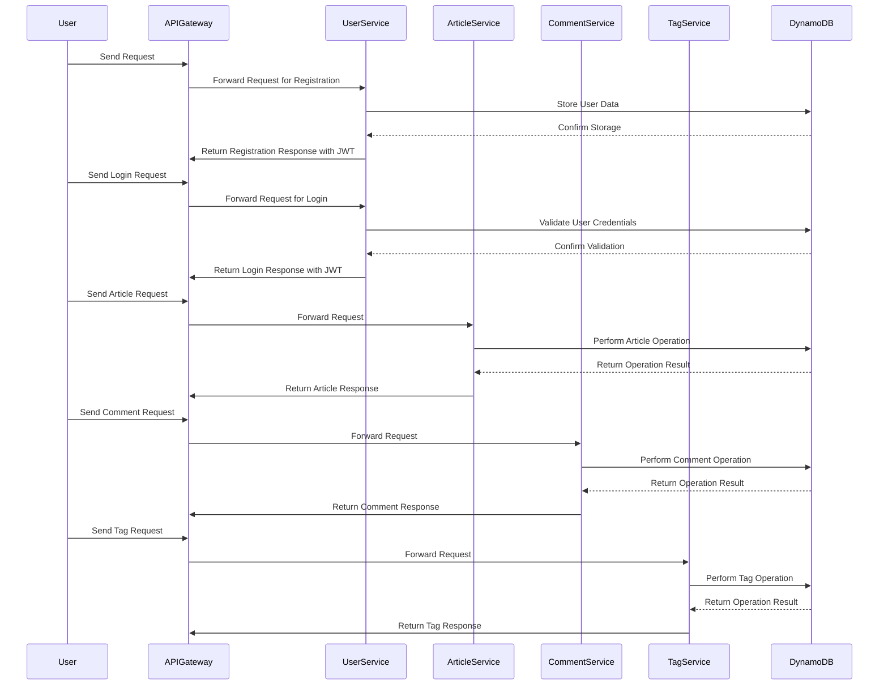

                 

### 引言：探索Serverless应用开发的无服务器架构

Serverless应用开发正在重塑现代软件架构的世界，为开发者提供了一种全新的构建和部署应用程序的方式。这种架构模式不仅简化了应用程序的部署流程，还显著降低了维护和运营成本。Serverless，顾名思义，意味着开发者不需要管理服务器，而是将基础设施的管理任务交给云服务提供商。这种模式不仅解放了开发者，还使得他们能够更加专注于业务逻辑的实现和优化。

#### **背景与问题**

随着互联网的快速发展，企业和开发者面临着不断增长的流量和复杂的应用需求。传统的服务器架构往往需要频繁地进行硬件升级、软件维护和性能调优，这既耗时又耗费资源。此外，传统架构中的服务器维护成本也是一个不可忽视的问题。为了解决这些问题，一种新型的架构模式——Serverless应运而生。

Serverless架构的核心思想是让开发者不必关心底层基础设施的管理，而是将资源和性能优化交给云服务提供商。这样，开发者可以更加专注于业务逻辑的实现，从而提高开发效率。

#### **Serverless架构的特点**

Serverless架构具有以下显著特点：

1. **无服务器管理**：开发者无需担心服务器的采购、配置、升级和运维，云服务提供商会自动管理所有底层基础设施。
2. **弹性伸缩**：根据实际流量自动调整资源，无需手动配置，确保应用在高峰时段稳定运行。
3. **按需计费**：仅对实际使用资源进行收费，有效降低运营成本。
4. **快速部署**：无需预先配置服务器，应用程序可以快速部署和迭代。

#### **本文目的**

本文旨在深入探讨Serverless应用开发中的无服务器架构，通过以下几个关键部分：

1. **背景介绍**：详细解释Serverless架构的起源、问题背景和解决思路。
2. **核心概念与联系**：介绍无服务器架构的核心概念，并通过表格和ER图进行详细阐述。
3. **设计模式讲解**：讲解常见的Serverless设计模式，分析其原理和实例。
4. **系统架构设计**：详细描述系统功能设计、架构设计、接口设计和交互。
5. **项目实战**：通过实际项目案例，展示Serverless架构的应用。
6. **最佳实践与注意事项**：总结最佳实践，提供注意事项，以帮助开发者更好地应用Serverless架构。

通过本文的阅读，读者将能够全面了解Serverless应用开发的无服务器架构，掌握其核心概念和设计模式，并为实际项目提供有效的指导。

### 1.1 问题背景

在传统的服务器架构中，企业需要投入大量资源来维护和管理服务器。这包括服务器的采购、配置、升级和运维。随着企业应用规模的不断扩大，服务器数量的增加带来了更高的维护成本和复杂度。此外，传统的服务器架构在应对突发流量和需求变化时显得力不从心。当流量高峰来临时，服务器可能会因为资源不足而出现性能瓶颈，导致用户体验下降；而在流量低谷时，服务器又会处于闲置状态，造成资源的浪费。

传统服务器架构的另一个痛点是其部署和迭代速度较慢。每一次应用的更新和部署都需要进行服务器的重新配置和测试，这不仅耗时，还增加了出错的可能性。这种低效的流程严重制约了企业的敏捷开发和快速响应市场需求的能力。

为了解决这些问题，一种新型的架构模式——Serverless架构应运而生。Serverless架构的出现，旨在通过云服务提供商管理底层基础设施，从而简化开发者的工作流程。开发者不再需要关注服务器的采购、配置和运维，而是可以专注于业务逻辑的实现和优化。这种模式不仅提高了开发效率，还显著降低了维护成本。

Serverless架构的另一个关键优势是其弹性伸缩能力。根据实际流量和需求变化，云服务提供商会自动调整资源的分配，确保应用在高峰时段能够稳定运行，而在流量低谷时又能高效利用资源，避免浪费。这种按需伸缩的特性，使得Serverless架构能够更好地适应动态变化的市场需求。

综上所述，传统服务器架构在应对现代应用需求时暴露出诸多问题，而Serverless架构的出现为这些问题提供了有效的解决方案。通过Serverless架构，企业能够实现更高的开发效率、更低的维护成本和更好的资源利用率，从而在竞争激烈的市场中脱颖而出。

### 1.2 问题描述

传统服务器架构在实际应用中面临多个显著的挑战。首先，服务器管理的复杂性是一个重要问题。随着应用规模的扩大，服务器数量的增加带来了维护和管理上的巨大负担。企业需要投入大量的人力、物力来确保服务器的高效运行，包括服务器的采购、配置、升级和运维。这不仅增加了企业的运营成本，还降低了开发团队的效率。

其次，传统架构在应对流量波动时显得不够灵活。当流量突然增加时，服务器可能会因为资源不足而出现性能瓶颈，导致应用响应速度下降，用户体验受到影响。而在流量减少时，服务器资源则可能处于闲置状态，造成资源的浪费。这种资源分配的不均衡性，不仅影响了应用的稳定性，还增加了运营成本。

另外，传统服务器架构的部署和迭代速度较慢。每次应用更新或部署都需要进行服务器的重新配置和测试，这不仅耗时，还增加了出错的可能性。这种低效的流程严重制约了企业的敏捷开发和快速响应市场需求的能力。

此外，传统服务器架构的扩展性有限。当企业需要快速扩展业务时，传统架构往往无法满足需求，需要大量时间和资源来进行服务器扩展和配置。这种扩展性的限制，使得企业在面对市场变化时显得力不从心。

综上所述，传统服务器架构在维护成本、资源利用效率和扩展性等方面存在明显不足，这些问题严重影响了企业的运营效率和竞争力。因此，寻找一种新的架构模式来应对这些挑战，成为了企业发展的必然选择。

### 1.3 问题解决

为了应对传统服务器架构所面临的挑战，Serverless架构提供了有效的解决方案。首先，Serverless架构通过将底层基础设施的管理任务交给云服务提供商，大大简化了服务器的采购、配置和运维工作。开发者无需关注服务器细节，只需关注业务逻辑的实现，从而显著提高了开发效率。

具体来说，Serverless架构允许开发者使用按需计费的模式，仅对实际使用的资源进行收费。这种模式不仅降低了企业的运营成本，还使得资源利用更加高效。例如，当应用处于低负载状态时，云服务提供商会自动减少资源的分配，从而避免资源浪费；而在高负载状态时，云服务提供商则会自动扩展资源，确保应用能够稳定运行。

其次，Serverless架构具备出色的弹性伸缩能力。根据实际流量和需求变化，云服务提供商会自动调整资源的分配，确保应用在高峰时段能够充分利用资源，避免性能瓶颈，同时也能在低峰时段高效利用资源，减少浪费。这种按需伸缩的特性，使得Serverless架构能够更好地适应动态变化的市场需求。

此外，Serverless架构还提高了部署和迭代速度。开发者可以使用简单的API调用或代码部署，无需进行复杂的服务器配置和测试，即可快速将应用部署到生产环境中。这种高效的部署流程，不仅缩短了开发周期，还提高了应用的稳定性和可靠性。

总之，Serverless架构通过简化和自动化基础设施管理、提供弹性伸缩能力、以及快速部署和迭代等优势，为传统服务器架构面临的挑战提供了全面而有效的解决方案。

### 1.4 边界与外延

在讨论Serverless架构时，了解其边界与外延至关重要。首先，Serverless架构的核心在于抽象和简化基础设施的管理，但这并不意味着完全消除服务器的存在。实际上，云服务提供商在后台仍然使用服务器和其他硬件资源来运行应用程序。Serverless架构的优势在于开发者无需直接管理这些底层资源，而是通过函数调用和事件驱动的方式与这些资源交互。

边界方面，Serverless架构主要关注应用层的逻辑实现，而不是底层基础设施。这意味着开发者仍然需要关注如何优化业务逻辑、处理并发和确保数据安全等问题。同时，Serverless架构并不适用于所有类型的应用程序。例如，需要长时间运行或处理大量数据的应用程序可能不适合使用Serverless模式，因为这些应用通常需要更多的计算资源。

在外延方面，Serverless架构与其他技术如微服务、容器化等有着密切的联系。微服务架构强调将应用拆分为多个小型、独立的服务，每个服务都可以独立部署和扩展。Serverless架构与微服务架构的融合，使得开发者可以在微服务基础上进一步简化基础设施管理。容器化技术则提供了对Serverless应用的封装和隔离，使得应用在不同环境中的一致性得到保障。

此外，Serverless架构还与自动化部署和持续集成/持续部署（CI/CD）流程相结合，进一步提高了开发效率。通过自动化工具，开发者可以轻松地将代码从开发环境部署到生产环境，确保快速交付高质量的应用程序。

总的来说，了解Serverless架构的边界与外延，可以帮助开发者更好地理解其适用场景和与其他技术的结合方式，从而充分利用Serverless的优势，提升应用开发和运维的效率。

### 1.5 概念结构与核心要素组成

Serverless架构的概念结构由几个核心要素组成，这些要素共同定义了其独特的运作方式和优势。以下是Serverless架构的关键概念及其组成部分：

1. **函数（Functions）**：这是Serverless架构的核心组件。函数是可重复调用的代码块，通常用于处理特定事件。这些事件可以是用户请求、定时任务或其他系统事件。开发者可以通过编写和部署函数来构建应用，无需关心底层基础设施的管理。

2. **事件驱动（Event-Driven）**：Serverless架构基于事件驱动模型，这意味着函数的执行是由外部事件触发的。当某个事件发生时，云服务提供商会自动调度相应的函数进行执行。这种模式使得应用程序能够根据实际需求动态调整，提高了系统的响应速度和资源利用率。

3. **服务端无状态（Stateless on Server Side）**：在Serverless架构中，函数通常是无状态的，即每次函数执行时都是独立的，不会保留上一次执行的状态。这意味着函数在每次执行时都需要从外部存储中读取所需数据，执行完成后也不会保留任何状态。这种设计简化了函数的实现和部署过程，同时也提高了系统的可伸缩性。

4. **云服务提供商（Cloud Service Providers）**：如AWS Lambda、Azure Functions和Google Cloud Functions等，是Serverless架构的支撑者。这些云服务提供商负责管理底层基础设施，包括服务器、网络和存储资源。开发者只需关注业务逻辑的实现，无需担心底层资源的采购、配置和运维。

5. **自动伸缩（Automatic Scaling）**：Serverless架构的一个显著优势是其自动伸缩能力。根据实际流量和需求，云服务提供商会自动调整函数的实例数量，确保系统在高峰时段能够高效运行，在低峰时段则能够节省资源。这种按需伸缩的特性，使得开发者能够专注于业务逻辑，无需关心资源分配问题。

6. **按需计费（Pay-per-Use）**：Serverless架构采用按需计费模式，开发者只需为实际使用的计算资源和存储资源付费。这种计费方式不仅降低了运营成本，还提高了资源利用效率。例如，当函数没有被调用时，云服务提供商不会收取费用，从而避免了资源的浪费。

7. **第三方服务集成（Integration with Third-Party Services）**：Serverless架构支持与各种第三方服务的集成，如数据库、消息队列和存储服务等。这些服务可以通过API或事件驱动模型与函数进行交互，进一步扩展应用的功能和复杂性。

综上所述，Serverless架构的核心概念和要素共同构成了其独特的运作方式，通过简化基础设施管理、提供自动伸缩能力和按需计费模式，为开发者带来更高的开发效率和更灵活的应用部署方式。了解这些核心要素，有助于开发者更好地利用Serverless架构，构建高效、可靠的应用程序。

### 2.1 无服务器架构的概念

无服务器架构（Serverless Architecture）是一种新兴的计算模型，其核心思想是让开发者无需直接管理服务器，而是将基础设施的管理任务交给云服务提供商。这种架构模式在云服务提供商的基础上，提供了一种灵活、高效且成本优化的应用部署方式。

无服务器架构的关键特点包括：

1. **无服务器管理**：开发者无需关注服务器的采购、配置、升级和运维，所有这些工作都由云服务提供商自动完成。

2. **弹性伸缩**：根据实际应用需求和流量变化，云服务提供商会自动调整计算资源的分配，确保应用在高峰时段能够稳定运行，在低峰时段则能够节省资源。

3. **按需计费**：开发者只需为实际使用的计算资源和存储资源付费，避免了闲置资源的浪费，降低了运营成本。

4. **事件驱动**：应用通过事件触发函数执行，使得系统的响应速度和资源利用率得到显著提升。

5. **无状态服务**：函数通常是无状态的，每次执行都是独立的，确保了系统的可伸缩性和可靠性。

无服务器架构不仅简化了开发者的工作流程，提高了开发效率，还使得企业能够更加专注于业务逻辑的实现和优化。通过这种模式，企业能够实现更高的资源利用率、更低的运营成本和更好的灵活性，从而在竞争激烈的市场中脱颖而出。

### 2.2 核心概念原理

为了深入理解无服务器架构，我们需要探讨其核心概念和原理。以下是几个关键概念及其工作原理：

1. **函数（Functions）**：在无服务器架构中，函数是最基础的组件。函数是可重复调用的代码块，用于处理特定事件或任务。函数可以是简单的单行代码，也可以是复杂的业务逻辑。它们通过事件触发执行，无需手动部署和管理。

2. **事件（Events）**：事件是触发函数执行的原因。事件可以是用户请求、定时任务、传感器数据或其他系统事件。云服务提供商会监听这些事件，并在事件发生时自动触发相应的函数执行。

3. **触发器（Triggers）**：触发器是一种机制，用于将事件与函数关联起来。当特定事件发生时，触发器会自动调用相应的函数。触发器可以是定时任务、HTTP请求、S3文件上传等。

4. **API网关（API Gateway）**：API网关是一个统一的接口，用于接收外部请求并将请求转发给后端函数。它可以对请求进行路由、认证、授权和日志记录等处理，确保应用程序的安全性和可靠性。

5. **数据库（Database）**：无服务器架构通常使用云服务提供商提供的数据库服务，如AWS DynamoDB、Google Cloud Spanner等。这些数据库服务无需开发者进行配置和管理，可以轻松集成到无服务器应用中。

6. **消息队列（Message Queue）**：消息队列是一种用于异步处理消息的组件。它可以确保消息的可靠传递和顺序处理，避免因函数执行失败导致的数据丢失。

7. **存储服务（Storage Service）**：无服务器架构提供了多种存储服务，如AWS S3、Google Cloud Storage等。这些服务用于存储应用程序的数据和文件，无需开发者进行容量规划和维护。

8. **API认证和授权（API Authentication and Authorization）**：为了保护应用程序的安全，无服务器架构通常使用API认证和授权机制。这些机制包括OAuth、JWT等，确保只有授权用户才能访问应用程序的接口。

通过这些核心概念和原理，无服务器架构能够实现高效、灵活且成本优化的应用部署。开发者只需关注业务逻辑的实现，无需担心底层基础设施的管理和运维。

### 2.3 概念属性特征对比表格

为了更好地理解无服务器架构的核心概念，我们可以通过一个属性特征对比表格来展示它们之间的差异。以下是对几个关键概念的属性特征进行比较：

| 概念       | 函数（Functions） | 事件（Events） | 触发器（Triggers） | API网关（API Gateway） | 数据库（Database） | 消息队列（Message Queue） | 存储服务（Storage Service） | API认证和授权（API Auth） |
|------------|------------------|---------------|------------------|-------------------|------------------|------------------|-------------------|----------------------|
| **定义**   | 可重复调用的代码块 | 触发函数执行的原因 | 将事件与函数关联的机制 | 统一接口，接收外部请求 | 数据存储和管理服务 | 异步处理消息的服务组件 | 存储应用程序数据的服务 | 保护应用程序接口的安全 |
| **主要属性** | - 无状态：每次执行独立 - 按需执行：事件触发时执行 - 组件化：易于管理和部署 - 自动伸缩：根据负载调整实例数量 | - 事件驱动：异步处理 - 可靠性：确保事件传递和处理 - 通用性：支持多种类型事件 | - 自动关联：事件触发函数 - 手动配置：指定触发条件 - 弹性伸缩：自动扩展资源 | - 路由：将请求转发给后端函数 - 认证：确保请求者身份 - 安全：加密请求和响应 | - 高性能：快速读写 - 按需计费：只对存储量收费 - 高可用性：自动备份和恢复 | - 异步处理：消息可靠传递 - 队列：确保消息顺序处理 - 按需伸缩：自动调整队列大小 | - 容量灵活：按需扩展 | - 多层安全：认证和授权 - OAuth：开放授权协议 - JWT：JSON Web Token |
| **应用场景** | 处理特定任务或事件 | 处理用户请求、定时任务等 | 连接事件和函数，实现自动化 | RESTful API服务，外部请求接入 | 实时数据存储和查询 | 长时间任务处理和异步通信 | 存储静态文件和媒体资源 | 保护应用程序接口，防止未授权访问 |

通过这个表格，我们可以清晰地看到各个概念的定义、主要属性和应用场景。这有助于开发者更好地理解无服务器架构的核心概念，并在实际项目中正确应用这些概念。

### 2.4 ER实体关系图架构

为了更直观地理解无服务器架构中的实体及其关系，我们可以使用ER（Entity-Relationship）实体关系图来展示。ER图是一种用于描述系统中实体及其之间关系的图形表示方法，可以帮助开发者更好地理解和设计复杂系统。

以下是Serverless架构的ER图，它包括以下几个核心实体：

1. **函数（Functions）**：表示可重复调用的代码块，用于处理特定事件。
2. **事件（Events）**：触发函数执行的原因，可以是用户请求、定时任务等。
3. **触发器（Triggers）**：用于将事件与函数关联的机制。
4. **API网关（API Gateway）**：统一的接口，用于接收外部请求并将请求转发给后端函数。
5. **数据库（Database）**：用于存储和管理应用数据。
6. **消息队列（Message Queue）**：用于异步处理消息，确保消息的可靠传递和顺序处理。
7. **存储服务（Storage Service）**：用于存储应用程序的数据和文件。

以下是ER图的Mermaid表示：

```mermaid
erDiagram
  Function ||--|{ Event }|| Trigger
  Event ||--|{ Function }|| Trigger
  APIGateway ||--|{ Function }|| Trigger
  Database ||--|{ Function }|| Trigger
  MessageQueue ||--|{ Function }|| Trigger
  StorageService ||--|{ Function }|| Trigger

  Function {
    <<entity>>
    Name : 函数名称
    Code : 函数代码
    Status : 函数状态
  }

  Event {
    <<entity>>
    Type : 事件类型
    Time : 事件发生时间
    Description : 事件描述
  }

  Trigger {
    <<relationship>>
    EventID : 事件标识
    FunctionID : 函数标识
  }

  APIGateway {
    <<entity>>
    URL : API网关URL
    Timeout : 超时时间
    Method : 请求方法
  }

  Database {
    <<entity>>
    Name : 数据库名称
    Type : 数据库类型
    Connection : 连接信息
  }

  MessageQueue {
    <<entity>>
    QueueName : 队列名称
    MessageCount : 消息数量
    Status : 队列状态
  }

  StorageService {
    <<entity>>
    BucketName : 存储桶名称
    Capacity : 容量大小
    Type : 存储类型
  }
```

通过这个ER图，我们可以清晰地看到函数、事件、触发器、API网关、数据库、消息队列和存储服务之间的实体关系。这个图形表示方法有助于开发者理解和设计无服务器架构，确保系统的各个组件能够高效协作，实现功能优化。

### 3.1 设计模式概述

在Serverless应用开发中，设计模式是实现代码复用、提高可维护性和扩展性的重要工具。设计模式是一系列解决问题的通用解决方案，它们在不同的应用场景中具有广泛的适用性。Serverless架构由于其特有的无服务器管理和弹性伸缩特性，使得设计模式的应用更加灵活和高效。以下是一些常见的设计模式，以及它们在Serverless架构中的应用：

1. **单体模式（Monolithic Pattern）**：单体模式是一种将所有业务逻辑集中在一个单一应用程序中的设计模式。在Serverless架构中，单体模式适用于小型应用或那些业务逻辑相对简单且不经常变化的场景。虽然单体模式便于开发和维护，但它可能在应对复杂业务逻辑和高并发场景时显得力不从心。

2. **微服务模式（Microservices Pattern）**：微服务模式将应用程序拆分为多个独立的小型服务，每个服务负责一个具体的业务功能。在Serverless架构中，微服务模式非常适合处理复杂的应用场景，因为每个微服务都可以独立部署、扩展和更新，提高了系统的可伸缩性和可靠性。此外，微服务模式还支持故障隔离，当一个服务出现问题时，不会影响其他服务的正常运行。

3. **容器化与编排模式（Containerization and Orchestration Pattern）**：容器化与编排模式通过Docker和Kubernetes等工具，将应用打包成容器，并在集群中进行自动化部署和管理。在Serverless架构中，容器化与编排模式可以提供更高的灵活性和可移植性，同时，Kubernetes的自动伸缩和资源调度能力与Serverless架构的弹性伸缩特性相得益彰，使得系统能够更高效地响应流量波动。

4. **事件驱动模式（Event-Driven Pattern）**：事件驱动模式是一种通过事件触发函数执行的设计模式。在Serverless架构中，事件驱动模式是核心概念之一，它使得应用程序能够根据实际需求动态调整，提高了系统的响应速度和资源利用率。

5. **API网关模式（API Gateway Pattern）**：API网关模式提供一个统一的入口，用于接收外部请求并转发给后端服务。在Serverless架构中，API网关模式可以提供认证、路由、监控和日志等功能，简化了外部访问和应用内部的通信。

通过这些设计模式，开发者可以更好地利用Serverless架构的优势，构建高效、可靠且可扩展的应用程序。不同设计模式的选择和应用，将直接影响系统的性能、可维护性和可扩展性。

### 3.2 单体模式

单体模式（Monolithic Pattern）是一种将所有业务逻辑集中在一个单一应用程序中的设计模式。在单体模式中，应用的各个组件（如用户界面、业务逻辑、数据库访问等）紧密集成，形成一个统一的整体。这种模式在早期的软件开发中非常常见，因为它简单易实现，且便于开发和维护。

#### **优势**

1. **开发简单**：单体模式不需要处理多个服务之间的复杂交互，这使得开发过程更加简单和直观。
2. **维护统一**：由于所有代码都集中在单个应用程序中，维护和更新变得更加统一和集中。
3. **性能优化**：单体模式在性能优化方面较为简单，因为所有组件在同一进程中运行，减少了跨进程通信的开销。

#### **劣势**

1. **扩展困难**：单体模式在处理复杂业务逻辑或高并发场景时，扩展性较差。单个应用实例难以适应大量请求，容易出现性能瓶颈。
2. **维护复杂**：随着应用规模的扩大，单体模式中的代码库会变得复杂，维护难度增加。
3. **部署困难**：单体应用程序的部署和更新较为复杂，每次更新都需要重新部署整个应用，增加了出错的几率。

#### **在Serverless架构中的应用**

尽管单体模式存在一些劣势，但在Serverless架构中，它仍有一定的适用场景：

1. **小型应用**：对于一些功能简单、业务逻辑不复杂的小型应用，单体模式可以提供快速开发和部署的便利性。
2. **早期原型开发**：在开发初期，当应用的功能和架构尚未完全确定时，使用单体模式可以快速实现原型，方便后续的迭代和优化。

#### **示例**

假设我们开发一个简单的博客平台，使用单体模式实现。以下是该应用的架构设计：

- **前端**：使用HTML/CSS/JavaScript实现用户界面。
- **后端**：使用Node.js编写业务逻辑，处理用户请求和数据库操作。
- **数据库**：使用MongoDB存储用户数据、博客内容等。

在Serverless架构中，我们可以使用AWS Lambda和Amazon API Gateway来实现这个应用：

1. **部署前端代码**：将静态HTML、CSS和JavaScript文件部署到S3存储桶。
2. **部署后端函数**：使用AWS Lambda编写后端业务逻辑，处理用户请求，并与S3和DynamoDB进行交互。
3. **配置API网关**：创建API网关，接收用户请求，并将请求转发给后端函数。

通过以上步骤，我们可以快速搭建并部署一个简单的Serverless博客平台。在应用初期，单体模式可以提供便利的开发和部署体验，但随着应用规模的扩大，可能会面临性能和扩展性问题，这时可以考虑采用微服务模式进行优化。

### 3.3 微服务模式

微服务模式（Microservices Pattern）是一种将复杂应用程序拆分为多个小型、独立服务的架构模式。每个服务负责一个具体的业务功能，通过定义良好的API进行通信，形成松耦合的分布式系统。微服务模式在应对复杂业务逻辑和高并发场景时，具有出色的扩展性和灵活性。

#### **优势**

1. **高可扩展性**：每个服务都可以独立扩展，根据需求增加实例数量，从而提高系统的整体性能。
2. **高容错性**：单个服务发生故障时，不会影响其他服务的正常运行，提高了系统的可靠性。
3. **快速迭代**：每个服务都可以独立开发、测试和部署，加快了开发速度，便于持续集成和持续部署（CI/CD）。
4. **技术多样性**：不同服务可以使用不同的技术栈，根据业务需求选择最合适的工具和语言。

#### **劣势**

1. **复杂性增加**：分布式系统增加了系统的复杂性，需要处理服务之间的通信、数据一致性和故障恢复等问题。
2. **维护成本**：随着服务数量的增加，系统的维护成本也会增加，包括服务监控、日志记录和性能优化等。
3. **数据一致性问题**：在分布式系统中，数据一致性问题是一个挑战，需要使用分布式事务或最终一致性方案来解决。

#### **在Serverless架构中的应用**

微服务模式在Serverless架构中具有很大的优势：

1. **弹性伸缩**：Serverless架构的自动伸缩能力与微服务模式相结合，可以轻松实现服务的按需扩展。
2. **按需计费**：微服务模式下的每个服务都可以独立计费，避免了资源浪费，提高了成本效益。
3. **高效开发**：微服务模式支持快速开发和迭代，每个服务都可以独立开发和部署，减少了协同开发的风险。

#### **示例**

假设我们开发一个电子商务平台，使用微服务模式实现。以下是该平台的架构设计：

- **用户服务**：处理用户注册、登录、权限验证等功能。
- **商品服务**：管理商品信息、库存、价格等。
- **订单服务**：处理订单创建、支付、发货等。
- **支付服务**：处理支付请求，与第三方支付平台集成。
- **库存服务**：管理商品库存，与商品服务交互。

在Serverless架构中，我们可以使用AWS Lambda、API Gateway、Amazon S3和DynamoDB等服务来实现这个电子商务平台：

1. **用户服务**：使用AWS Lambda编写用户服务，与Amazon Cognito进行集成，处理用户注册、登录和权限验证。
2. **商品服务**：使用AWS Lambda和Amazon DynamoDB实现商品服务，管理商品信息。
3. **订单服务**：使用AWS Lambda和DynamoDB实现订单服务，处理订单创建、支付和发货。
4. **支付服务**：使用AWS Lambda和第三方支付平台API实现支付服务。
5. **库存服务**：使用AWS Lambda和DynamoDB实现库存服务，管理商品库存。

通过以上步骤，我们可以构建一个高效、可靠的电子商务平台，利用Serverless架构的优势，实现服务的弹性伸缩、按需计费和快速迭代。

### 3.4 容器化与编排模式

容器化与编排模式是一种通过Docker和Kubernetes等工具，将应用打包成容器，并在集群中进行自动化部署和管理的架构模式。这种模式在提高应用的可移植性、灵活性和可扩展性方面具有显著优势。

#### **优势**

1. **可移植性**：容器化技术使得应用可以在任何支持Docker的操作系统上运行，提高了应用的可移植性和兼容性。
2. **轻量级**：容器是轻量级的，不会占用大量系统资源，从而提高了系统的性能和资源利用率。
3. **一致性**：通过容器化，应用在不同环境中的运行状态保持一致，减少了环境差异带来的问题。
4. **自动化部署**：Kubernetes提供了自动部署、扩展和管理容器的能力，简化了应用的管理和运维。

#### **劣势**

1. **复杂性**：容器化与编排模式引入了额外的复杂度，需要开发者熟悉Docker和Kubernetes等工具。
2. **学习曲线**：对于初学者来说，理解容器化和编排模式可能需要一定的时间。
3. **性能开销**：容器创建和管理的开销可能会对系统性能产生一定影响，特别是在高并发场景中。

#### **在Serverless架构中的应用**

容器化与编排模式在Serverless架构中可以发挥重要作用：

1. **混合部署**：结合Serverless架构，容器化与编排模式可以实现混合部署，将需要长时间运行或高计算密集度的任务部署到容器中，而将其他任务部署到Serverless函数中，实现资源的最优利用。
2. **可扩展性**：Kubernetes的自动伸缩能力与Serverless架构相结合，可以更好地应对流量波动，提高系统的可扩展性。
3. **高可用性**：通过Kubernetes的故障恢复机制，确保容器化应用的高可用性，与Serverless架构的弹性伸缩特性相辅相成。

#### **示例**

假设我们开发一个微服务架构的博客平台，使用容器化与编排模式实现。以下是该平台的架构设计：

- **前端服务**：使用Node.js实现，处理用户请求和展示博客内容。
- **后端服务**：包括用户服务、文章服务、评论服务等，使用Spring Boot实现。
- **数据库服务**：使用MySQL数据库存储用户数据和文章内容。

在容器化与编排模式中，我们可以使用Docker和Kubernetes来实现这个博客平台：

1. **编写Dockerfile**：为每个服务编写Dockerfile，将服务打包成Docker镜像。
2. **构建Docker镜像**：使用Docker命令构建Docker镜像。
3. **部署到Kubernetes集群**：使用Kubernetes的YAML文件定义部署配置，将Docker镜像部署到Kubernetes集群。
4. **配置服务发现**：使用Kubernetes的Service组件，实现服务发现和负载均衡。

通过以上步骤，我们可以构建一个高效、可靠的博客平台，利用容器化与编排模式的优势，实现应用的自动化部署、扩展和管理。

### 3.5 事件驱动模式

事件驱动模式（Event-Driven Pattern）是一种通过事件触发函数执行的设计模式。在Serverless架构中，事件驱动模式是核心概念之一，它使得应用程序能够根据实际需求动态调整，提高了系统的响应速度和资源利用率。

#### **原理**

事件驱动模式的工作原理如下：

1. **事件监听**：系统通过事件监听器（如AWS Lambda的Event Source Mapping）监听外部事件源（如Kafka、Kinesis、S3等）。
2. **事件触发**：当监听到事件时，系统会自动触发相应的函数执行。
3. **函数执行**：函数按照预定的逻辑处理事件，并将结果返回。
4. **结果反馈**：函数的执行结果可以被存储在数据库、消息队列或日志中，用于后续处理或监控。

#### **优势**

1. **弹性伸缩**：事件驱动模式可以根据事件数量动态调整函数的实例数量，确保系统在高峰时段能够高效运行。
2. **按需执行**：函数仅在接收到事件时执行，避免了不必要的资源消耗。
3. **简化同步**：事件驱动模式减少了同步操作，使得系统的响应速度更快。
4. **高可扩展性**：通过事件驱动，开发者可以轻松扩展系统的功能，只需添加新的函数和事件监听器。

#### **在Serverless架构中的应用**

事件驱动模式在Serverless架构中具有广泛的应用：

1. **数据处理**：处理来自消息队列或数据存储系统的事件，如Kafka或Kinesis中的消息。
2. **后台任务**：执行定时任务或后台处理任务，如AWS Lambda的定时触发器。
3. **用户交互**：处理用户请求和事件，如API网关接收到的HTTP请求。
4. **数据同步**：同步数据存储系统中的数据变更，如S3中的文件上传事件。

#### **示例**

假设我们开发一个社交媒体应用，使用事件驱动模式实现用户关注功能：

1. **事件监听**：使用AWS Lambda监听Kafka中的用户关注事件。
2. **事件处理**：当监听到用户关注事件时，AWS Lambda函数会将关注关系存储到DynamoDB数据库中。
3. **通知发送**：使用SNS（Simple Notification Service）将关注通知发送给用户。

通过以上步骤，我们可以实现一个高效、可靠的社交媒体应用，利用事件驱动模式的优势，提高系统的响应速度和资源利用率。

### 3.6 API网关模式

API网关模式（API Gateway Pattern）是一种在Serverless架构中用于接收外部请求并转发给后端服务的统一接口设计模式。API网关不仅提供了请求路由和负载均衡功能，还负责处理认证、授权、监控和日志记录等任务，确保应用程序的安全性和可靠性。

#### **原理**

API网关的工作原理如下：

1. **请求接收**：API网关接收来自客户端的HTTP请求，可以是浏览器、移动应用或其他API客户端。
2. **请求路由**：API网关根据请求路径和查询参数，将请求路由到后端的具体服务或函数。
3. **请求处理**：路由到的服务或函数按照预定的逻辑处理请求，生成响应。
4. **响应返回**：API网关将处理结果返回给客户端，同时可以添加自定义的HTTP头部信息。
5. **认证与授权**：API网关负责处理请求的认证和授权，确保只有授权用户才能访问受保护的资源。

#### **优势**

1. **统一接口**：API网关提供了一个统一的接口，简化了客户端与后端服务的通信。
2. **请求路由与负载均衡**：API网关可以根据请求的URL和参数，将请求高效路由到后端服务，并实现负载均衡，提高系统的吞吐量。
3. **安全性与可靠性**：API网关可以处理认证和授权，确保只有授权用户才能访问受保护的资源，提高了系统的安全性。
4. **监控与日志**：API网关可以收集和记录请求的详细信息，便于监控和日志分析，帮助开发者快速定位和解决问题。

#### **在Serverless架构中的应用**

API网关模式在Serverless架构中具有广泛的应用场景：

1. **外部访问**：API网关作为应用程序的入口，处理来自外部客户端的HTTP请求，如移动应用、Web应用或其他系统。
2. **服务集成**：API网关可以集成多个后端服务，通过统一的接口为客户端提供服务，简化了系统的复杂度。
3. **微服务通信**：在微服务架构中，API网关负责转发请求到相应的微服务，实现服务之间的通信。
4. **流量控制**：API网关可以根据流量策略，控制请求的访问频率和流量规模，保护后端服务免受大量请求的冲击。

#### **示例**

假设我们开发一个社交媒体应用，使用API网关模式实现用户注册和登录功能：

1. **接收请求**：API网关接收用户注册和登录的HTTP请求。
2. **路由请求**：根据请求路径，API网关将请求转发到用户服务。
3. **处理请求**：用户服务处理注册和登录逻辑，生成响应。
4. **返回响应**：API网关将处理结果返回给客户端，并添加自定义的HTTP头部信息。
5. **认证与授权**：API网关使用JWT（JSON Web Token）对请求进行认证和授权，确保只有授权用户才能访问受保护的资源。

通过以上步骤，我们可以实现一个安全、可靠的社交媒体应用，利用API网关模式的优势，提高系统的可维护性和可扩展性。

### 4.1 系统功能设计

在构建Serverless应用时，系统功能设计是关键的一步。系统功能设计涉及到明确应用的各项功能及其实现方式，以确保系统能够满足用户需求并在不同场景下保持稳定运行。以下是本系统功能设计的详细介绍：

#### **用户注册与登录功能**

用户注册与登录是许多应用的基础功能。该功能允许用户创建账户并登录系统，以便访问受保护的资源和功能。

- **用户注册**：用户可以通过输入用户名、密码和电子邮件等信息完成注册。系统需要验证电子邮件地址的有效性，并生成唯一用户ID。
- **用户登录**：用户使用用户名和密码进行登录，系统会验证用户身份并生成JWT（JSON Web Token），用于后续请求的认证。

#### **文章发布与管理功能**

文章发布与管理功能允许用户创建、编辑、删除和查看文章。

- **文章创建**：用户可以输入文章标题、内容、标签等信息，系统会保存文章并分配唯一文章ID。
- **文章编辑**：用户可以对已发布的文章进行编辑，系统会更新文章内容。
- **文章删除**：用户可以删除自己的文章，系统会从数据库中移除相关记录。
- **文章查看**：用户可以查看已发布的文章，系统会从数据库中检索相关文章信息并展示给用户。

#### **评论功能**

评论功能允许用户对文章进行评论，增加互动性和社区氛围。

- **评论提交**：用户可以为文章提交评论，系统会保存评论信息并关联到对应的文章。
- **评论编辑**：用户可以编辑自己的评论，系统会更新评论内容。
- **评论删除**：用户可以删除自己的评论，系统会从数据库中移除相关记录。

#### **标签管理功能**

标签管理功能用于管理文章标签，以便用户可以按照标签搜索和浏览文章。

- **标签添加**：管理员可以添加新标签，系统会保存标签信息。
- **标签编辑**：管理员可以编辑标签信息，系统会更新标签记录。
- **标签删除**：管理员可以删除标签，系统会从数据库中移除相关记录。

#### **权限控制功能**

权限控制功能用于确保用户只能访问授权资源，保护系统安全。

- **角色分配**：系统可以根据用户角色（如普通用户、管理员）分配不同权限。
- **资源保护**：系统会对受保护的资源（如文章、评论）进行访问控制，确保只有授权用户可以访问。

#### **监控与日志功能**

监控与日志功能用于实时监控系统运行状态和性能指标，以便及时发现和解决问题。

- **性能监控**：系统会监控各项性能指标，如响应时间、请求量等，生成实时报表。
- **日志记录**：系统会记录请求和操作日志，以便后续分析和调试。

通过上述功能设计，我们可以构建一个高效、可靠的Serverless应用，满足用户的多样化需求并在不同场景下保持稳定运行。

### 4.2 系统架构设计

为了确保Serverless应用能够高效、可靠地运行，我们需要进行详细的系统架构设计。系统架构设计涉及到各组件的选型、交互关系和性能优化策略。以下是本系统架构设计的详细说明：

#### **组件选型**

在本系统中，我们选择以下组件：

- **API网关**：使用AWS API Gateway作为统一的请求入口，负责处理外部HTTP请求并路由到后端服务。
- **用户服务**：使用AWS Lambda和Amazon Cognito实现用户注册、登录和权限验证功能。
- **文章服务**：使用AWS Lambda和Amazon DynamoDB实现文章创建、编辑、删除和查看功能。
- **评论服务**：使用AWS Lambda和Amazon DynamoDB实现评论提交、编辑和删除功能。
- **标签服务**：使用AWS Lambda和Amazon DynamoDB实现标签添加、编辑和删除功能。
- **监控与日志**：使用AWS CloudWatch进行性能监控和日志记录。

#### **交互关系**

系统组件之间的交互关系如下：

1. **用户请求**：用户通过API网关发送HTTP请求，API网关根据请求路径和参数将请求路由到后端服务。
2. **用户服务**：用户服务处理用户注册、登录和权限验证请求，使用Amazon Cognito进行用户身份验证，并生成JWT。
3. **文章服务**：文章服务处理文章相关的请求，如创建、编辑、删除和查看文章，与Amazon DynamoDB进行交互，存储和检索文章数据。
4. **评论服务**：评论服务处理评论相关的请求，如提交、编辑和删除评论，与Amazon DynamoDB进行交互，存储和检索评论数据。
5. **标签服务**：标签服务处理标签相关的请求，如添加、编辑和删除标签，与Amazon DynamoDB进行交互，存储和检索标签数据。

#### **性能优化**

为了确保系统在高并发场景下能够稳定运行，我们采取了以下性能优化策略：

1. **负载均衡**：使用API Gateway进行负载均衡，根据请求量和响应时间动态调整路由策略，确保请求能够均匀分布到后端服务。
2. **自动伸缩**：使用AWS Lambda的自动伸缩功能，根据请求量和系统负载自动调整函数实例数量，确保系统在高并发场景下能够快速响应。
3. **缓存策略**：使用Amazon ElastiCache（如Redis）进行缓存，减少对后端数据库的访问压力，提高系统响应速度。
4. **延迟容忍**：采用延迟容忍的设计策略，对于一些非关键操作（如评论提交），允许一定的延迟，以提高系统吞吐量。

通过上述系统架构设计，我们可以构建一个高效、可靠的Serverless应用，确保其在不同负载场景下能够稳定运行，同时具备良好的可扩展性和性能。

### 4.3 系统接口设计和交互

系统接口设计和交互是确保各个服务模块之间顺畅协作、高效传输数据的关键。以下是本系统的接口设计、系统交互以及Mermaid序列图展示。

#### **接口设计**

系统的接口设计主要包括以下几部分：

1. **用户服务接口**：用于用户注册、登录和权限验证。
   - **注册接口**：`POST /users/register`
     - 参数：`username`、`password`、`email`
     - 返回：`{ "status": "success", "message": "User registered successfully." }`
   - **登录接口**：`POST /users/login`
     - 参数：`username`、`password`
     - 返回：`{ "token": "generated_jwt_token", "expires_in": 3600 }`
2. **文章服务接口**：用于文章的创建、编辑、删除和查看。
   - **创建文章接口**：`POST /articles`
     - 参数：`title`、`content`、`tags`
     - 返回：`{ "article_id": "generated_article_id", "status": "success" }`
   - **编辑文章接口**：`PUT /articles/{article_id}`
     - 参数：`title`、`content`、`tags`
     - 返回：`{ "status": "success", "message": "Article updated successfully." }`
   - **删除文章接口**：`DELETE /articles/{article_id}`
     - 返回：`{ "status": "success", "message": "Article deleted successfully." }`
   - **查看文章接口**：`GET /articles/{article_id}`
     - 返回：`{ "title": "Article Title", "content": "Article Content", "tags": ["tag1", "tag2"] }`
3. **评论服务接口**：用于评论的提交、编辑和删除。
   - **提交评论接口**：`POST /articles/{article_id}/comments`
     - 参数：`content`
     - 返回：`{ "comment_id": "generated_comment_id", "status": "success" }`
   - **编辑评论接口**：`PUT /comments/{comment_id}`
     - 参数：`content`
     - 返回：`{ "status": "success", "message": "Comment updated successfully." }`
   - **删除评论接口**：`DELETE /comments/{comment_id}`
     - 返回：`{ "status": "success", "message": "Comment deleted successfully." }`
4. **标签服务接口**：用于标签的管理。
   - **添加标签接口**：`POST /tags`
     - 参数：`tag_name`
     - 返回：`{ "tag_id": "generated_tag_id", "status": "success" }`
   - **编辑标签接口**：`PUT /tags/{tag_id}`
     - 参数：`tag_name`
     - 返回：`{ "status": "success", "message": "Tag updated successfully." }`
   - **删除标签接口**：`DELETE /tags/{tag_id}`
     - 返回：`{ "status": "success", "message": "Tag deleted successfully." }`

#### **系统交互**

系统交互主要描述各服务模块之间的请求和响应流程：

1. **用户请求注册**：
   - 用户通过API网关发送注册请求，API网关将请求转发给用户服务。
   - 用户服务验证输入参数，并将用户信息存储在Amazon Cognito和DynamoDB中。
   - 用户服务返回注册成功的响应，包含JWT。

2. **用户请求登录**：
   - 用户通过API网关发送登录请求，API网关将请求转发给用户服务。
   - 用户服务验证用户身份，生成JWT并返回给用户。

3. **用户请求文章操作**：
   - 用户通过API网关发送文章操作请求，API网关将请求转发给文章服务。
   - 文章服务执行相应的操作（创建、编辑、删除或查看），并返回结果。

4. **用户请求评论操作**：
   - 用户通过API网关发送评论操作请求，API网关将请求转发给评论服务。
   - 评论服务执行相应的操作（提交、编辑或删除），并返回结果。

5. **用户请求标签操作**：
   - 用户通过API网关发送标签操作请求，API网关将请求转发给标签服务。
   - 标签服务执行相应的操作（添加、编辑或删除），并返回结果。

#### **Mermaid序列图展示**

以下是系统的Mermaid序列图展示，描述了用户请求从API网关到各服务模块的交互过程：



通过上述接口设计和交互流程，系统实现了用户操作的高效管理和数据传递，确保了系统的高效运行和稳定性。

### 8.1 环境安装与配置

要开始使用Serverless架构开发应用，首先需要安装和配置必要的开发环境。以下是详细的步骤和指南：

#### **1. 安装Node.js和npm**

Node.js是JavaScript的运行环境，而npm（Node Package Manager）是Node.js的包管理器，用于安装和管理各种开发依赖。以下是安装步骤：

- **Windows**：
  - 访问 Node.js 官网（[nodejs.org](https://nodejs.org/)）下载安装程序。
  - 双击安装程序，按照默认选项进行安装。
- **macOS**：
  - 打开终端，运行以下命令：
    ```bash
    brew install node
    ```
- **Linux**：
  - 使用包管理器安装，例如在Ubuntu上：
    ```bash
    sudo apt update
    sudo apt install nodejs npm
    ```

安装完成后，通过命令行检查Node.js和npm的版本：
```bash
node -v
npm -v
```

#### **2. 安装Serverless Framework**

Serverless Framework是一个开源工具，用于简化Serverless应用的部署和管理。以下是安装步骤：

- 打开终端，使用npm全局安装Serverless Framework：
  ```bash
  npm install -g serverless
  ```

安装完成后，通过命令行检查Serverless Framework的版本：
```bash
serverless --version
```

#### **3. 创建新的Serverless项目**

在安装完Node.js、npm和Serverless Framework后，可以创建一个新的Serverless项目。以下是创建步骤：

- 创建一个新目录，并切换到该目录：
  ```bash
  mkdir my-serverless-project
  cd my-serverless-project
  ```

- 初始化项目，生成项目文件和文件夹：
  ```bash
  serverless create --template aws-nodejs --path my-function
  ```

  这将在当前目录下创建一个名为`my-function`的项目文件夹。

#### **4. 配置AWS账户**

要部署Serverless应用，需要配置AWS账户。以下是配置步骤：

- 访问AWS管理控制台（[aws.amazon.com](https://aws.amazon.com/)），如果没有AWS账户，需要先注册一个账户。
- 登录AWS账户，创建一个新用户，并为其分配适当的权限。确保用户拥有执行Serverless应用所需的最小权限。

- 获取AWS凭证，包括Access Key ID和Secret Access Key。这些凭证将用于Serverless Framework与AWS服务进行通信。

- 在本地机器上配置AWS CLI（Amazon Web Services Command Line Interface）。通过命令行安装AWS CLI：
  ```bash
  npm install -g aws-cli
  ```

- 初始化AWS CLI，输入AWS凭证：
  ```bash
  aws configure
  ```
  按照提示输入Access Key ID、Secret Access Key、默认区域和默认输出格式。

#### **5. 部署Serverless应用**

完成环境安装和配置后，可以尝试部署一个简单的Serverless应用。以下是部署步骤：

- 进入项目目录，并启动本地开发环境：
  ```bash
  serverless dev
  ```

  这将在本地启动一个模拟的AWS环境，使得可以实时测试应用。

- 部署到AWS云环境：
  ```bash
  serverless deploy
  ```

  部署过程中，Serverless Framework会自动创建和管理AWS资源，包括Lambda函数、API网关等。

通过以上步骤，我们可以搭建一个基础的Serverless开发环境，并开始编写和部署Serverless应用。在实际开发过程中，可以根据项目需求进一步配置和优化开发环境。

### 9.1 系统核心实现

在Serverless架构中，系统核心实现在于函数（Functions）的编写和部署。以下是具体的系统核心实现步骤：

#### **1. 编写用户注册函数**

用户注册函数用于处理用户注册请求，包括验证用户输入、生成唯一用户ID、保存用户信息等。以下是一个简单的用户注册函数示例，使用Node.js编写：

```javascript
const AWS = require('aws-sdk');
const dynamoDB = new AWS.DynamoDB.DocumentClient();

exports.registerUser = async (event, context, callback) => {
    const data = JSON.parse(event.body);
    const params = {
        TableName: 'Users',
        Item: {
            id: data.username,
            username: data.username,
            password: data.password,
            email: data.email
        }
    };

    try {
        await dynamoDB.put(params).promise();
        callback(null, {
            statusCode: 200,
            body: JSON.stringify({ message: 'User registered successfully.' })
        });
    } catch (error) {
        callback(error);
    }
};
```

#### **2. 编写用户登录函数**

用户登录函数用于处理用户登录请求，包括验证用户身份、生成JWT（JSON Web Token）等。以下是一个简单的用户登录函数示例：

```javascript
const AWS = require('aws-sdk');
const dynamoDB = new AWS.DynamoDB.DocumentClient();
const jwt = require('jsonwebtoken');

exports.loginUser = async (event, context, callback) => {
    const data = JSON.parse(event.body);
    const params = {
        TableName: 'Users',
        Key: {
            id: data.username
        }
    };

    try {
        const user = await dynamoDB.get(params).promise();
        if (user.Item && user.Item.password === data.password) {
            const token = jwt.sign({ id: user.Item.id }, 'secretKey', { expiresIn: '1h' });
            callback(null, {
                statusCode: 200,
                body: JSON.stringify({ token: token, expiresIn: 3600 })
            });
        } else {
            callback(null, {
                statusCode: 401,
                body: JSON.stringify({ message: 'Invalid credentials.' })
            });
        }
    } catch (error) {
        callback(error);
    }
};
```

#### **3. 编写文章创建函数**

文章创建函数用于处理文章创建请求，包括保存文章信息、生成唯一文章ID等。以下是一个简单的文章创建函数示例：

```javascript
const AWS = require('aws-sdk');
const dynamoDB = new AWS.DynamoDB.DocumentClient();

exports.createArticle = async (event, context, callback) => {
    const data = JSON.parse(event.body);
    const params = {
        TableName: 'Articles',
        Item: {
            id: 'article_' + Date.now(),
            title: data.title,
            content: data.content,
            tags: data.tags
        }
    };

    try {
        await dynamoDB.put(params).promise();
        callback(null, {
            statusCode: 200,
            body: JSON.stringify({ article_id: params.Item.id, status: 'success' })
        });
    } catch (error) {
        callback(error);
    }
};
```

#### **4. 编写评论提交函数**

评论提交函数用于处理评论提交请求，包括保存评论信息、关联到对应文章等。以下是一个简单的评论提交函数示例：

```javascript
const AWS = require('aws-sdk');
const dynamoDB = new AWS.DynamoDB.DocumentClient();

exports.submitComment = async (event, context, callback) => {
    const data = JSON.parse(event.body);
    const articleId = event.pathParameters.article_id;
    const params = {
        TableName: 'Comments',
        Item: {
            id: 'comment_' + Date.now(),
            article_id: articleId,
            content: data.content,
            created_at: new Date().toISOString()
        }
    };

    try {
        await dynamoDB.put(params).promise();
        callback(null, {
            statusCode: 200,
            body: JSON.stringify({ comment_id: params.Item.id, status: 'success' })
        });
    } catch (error) {
        callback(error);
    }
};
```

通过编写和部署这些核心函数，我们可以实现用户注册、登录、文章创建和评论提交等功能，确保系统具备基础的业务逻辑和功能。

### 9.2 代码应用解读与分析

在上文中，我们详细展示了用户注册、登录、文章创建和评论提交函数的实现。接下来，我们将对这些函数进行解读和分析，探讨其核心逻辑、性能和优缺点。

#### **用户注册函数**

用户注册函数的核心逻辑包括验证用户输入的有效性、生成唯一用户ID，并将用户信息保存到DynamoDB表中。以下是代码的逐步分析：

```javascript
exports.registerUser = async (event, context, callback) => {
    const data = JSON.parse(event.body);
    const params = {
        TableName: 'Users',
        Item: {
            id: data.username,
            username: data.username,
            password: data.password,
            email: data.email
        }
    };

    try {
        await dynamoDB.put(params).promise();
        callback(null, {
            statusCode: 200,
            body: JSON.stringify({ message: 'User registered successfully.' })
        });
    } catch (error) {
        callback(error);
    }
};
```

**核心逻辑**：
- **数据解析**：从请求体中解析用户输入的信息（`username`、`password`、`email`）。
- **参数定义**：定义DynamoDB表的插入参数，包括用户ID、用户名、密码和电子邮件。
- **数据保存**：使用DynamoDB的`put`方法将用户信息保存到表中。

**性能分析**：
- **响应时间**：DynamoDB的读写操作通常非常快速，因此用户注册的响应时间主要取决于网络延迟和数据解析时间。
- **并发处理**：由于使用的是异步操作（`await`），该函数可以同时处理多个用户注册请求，具有较好的并发性能。

**优缺点**：
- **优点**：简化了用户注册流程，快速响应，数据持久化可靠。
- **缺点**：缺乏对用户输入的严格验证，例如密码的强度校验和电子邮件的格式验证。

#### **用户登录函数**

用户登录函数的核心逻辑包括验证用户身份、检查密码是否匹配，并生成JWT（JSON Web Token）以进行身份验证。以下是代码的逐步分析：

```javascript
exports.loginUser = async (event, context, callback) => {
    const data = JSON.parse(event.body);
    const params = {
        TableName: 'Users',
        Key: {
            id: data.username
        }
    };

    try {
        const user = await dynamoDB.get(params).promise();
        if (user.Item && user.Item.password === data.password) {
            const token = jwt.sign({ id: user.Item.id }, 'secretKey', { expiresIn: '1h' });
            callback(null, {
                statusCode: 200,
                body: JSON.stringify({ token: token, expiresIn: 3600 })
            });
        } else {
            callback(null, {
                statusCode: 401,
                body: JSON.stringify({ message: 'Invalid credentials.' })
            });
        }
    } catch (error) {
        callback(error);
    }
};
```

**核心逻辑**：
- **数据解析**：从请求体中解析用户输入的信息（`username`、`password`）。
- **用户查询**：使用DynamoDB的`get`方法查询用户信息。
- **密码验证**：检查查询结果中用户密码与输入密码是否匹配。
- **生成Token**：如果验证通过，生成JWT用于身份验证。

**性能分析**：
- **响应时间**：与用户注册函数类似，主要取决于网络延迟和数据解析时间。
- **并发处理**：由于使用异步操作，该函数可以高效处理多个登录请求。

**优缺点**：
- **优点**：实现了用户认证和身份验证，使用JWT提供安全可靠的会话管理。
- **缺点**：缺乏对密码存储的加密处理，容易泄露用户敏感信息。

#### **文章创建函数**

文章创建函数的核心逻辑包括接收文章信息（标题、内容、标签）、生成唯一文章ID，并将文章信息保存到DynamoDB表中。以下是代码的逐步分析：

```javascript
exports.createArticle = async (event, context, callback) => {
    const data = JSON.parse(event.body);
    const params = {
        TableName: 'Articles',
        Item: {
            id: 'article_' + Date.now(),
            title: data.title,
            content: data.content,
            tags: data.tags
        }
    };

    try {
        await dynamoDB.put(params).promise();
        callback(null, {
            statusCode: 200,
            body: JSON.stringify({ article_id: params.Item.id, status: 'success' })
        });
    } catch (error) {
        callback(error);
    }
};
```

**核心逻辑**：
- **数据解析**：从请求体中获取文章信息（`title`、`content`、`tags`）。
- **参数定义**：生成唯一文章ID，并定义DynamoDB表的插入参数。
- **数据保存**：使用DynamoDB的`put`方法保存文章信息。

**性能分析**：
- **响应时间**：与用户注册函数类似，主要取决于网络延迟和数据解析时间。
- **并发处理**：由于使用异步操作，该函数可以同时处理多个文章创建请求。

**优缺点**：
- **优点**：实现了文章创建功能，数据持久化可靠。
- **缺点**：缺乏对文章标题和标签的验证，可能导致数据质量问题。

#### **评论提交函数**

评论提交函数的核心逻辑包括接收评论信息、生成唯一评论ID，并将评论信息保存到DynamoDB表中。以下是代码的逐步分析：

```javascript
exports.submitComment = async (event, context, callback) => {
    const data = JSON.parse(event.body);
    const articleId = event.pathParameters.article_id;
    const params = {
        TableName: 'Comments',
        Item: {
            id: 'comment_' + Date.now(),
            article_id: articleId,
            content: data.content,
            created_at: new Date().toISOString()
        }
    };

    try {
        await dynamoDB.put(params).promise();
        callback(null, {
            statusCode: 200,
            body: JSON.stringify({ comment_id: params.Item.id, status: 'success' })
        });
    } catch (error) {
        callback(error);
    }
};
```

**核心逻辑**：
- **数据解析**：从请求体中获取评论内容。
- **参数定义**：生成唯一评论ID，并定义DynamoDB表的插入参数。
- **数据保存**：使用DynamoDB的`put`方法保存评论信息。

**性能分析**：
- **响应时间**：与用户注册函数类似，主要取决于网络延迟和数据解析时间。
- **并发处理**：由于使用异步操作，该函数可以同时处理多个评论提交请求。

**优缺点**：
- **优点**：实现了评论提交功能，数据持久化可靠。
- **缺点**：缺乏对评论内容的验证，可能导致数据质量问题。

通过上述分析和解读，我们可以看到这些函数在实现业务逻辑的同时，也暴露出一些潜在的问题和优化空间。在实际开发中，应根据具体需求进一步优化和增强这些函数的功能和性能。

### 10. 实际案例分析与详细讲解剖析

为了更好地展示Serverless架构的实际应用效果，我们将通过一个具体案例进行分析和讲解。这个案例是一个基于Serverless架构的博客平台，其核心功能包括文章发布、评论提交、用户管理以及数据存储。以下是案例的详细分析过程：

#### **案例背景**

假设我们开发一个社交博客平台，用户可以在平台上创建博客文章、发表评论，并与其他用户进行互动。平台需要具备高效、可靠且易于扩展的特点，以满足不断增长的用户量和数据需求。

#### **系统架构**

系统采用Serverless架构，主要包括以下组件：

- **用户服务**：处理用户注册、登录和权限验证。
- **文章服务**：处理文章的创建、编辑、删除和查看。
- **评论服务**：处理评论的提交、编辑和删除。
- **数据存储**：使用Amazon S3存储用户上传的文件，使用Amazon DynamoDB存储用户数据。

#### **系统功能实现**

1. **用户注册与登录**

   用户注册与登录是平台的基础功能，主要通过AWS Lambda和Amazon Cognito实现。用户注册时，系统会生成唯一的用户ID，并将用户信息存储在DynamoDB中。登录时，系统验证用户身份，生成JWT（JSON Web Token），用于后续请求的认证。

2. **文章发布与查看**

   用户可以创建博客文章，系统会为每篇文章生成唯一的文章ID，并存储在DynamoDB中。文章内容可以包含文本、图片等多种形式。用户可以通过API网关访问文章列表和文章详情。文章服务使用AWS Lambda处理文章创建、编辑和删除请求。

3. **评论功能**

   用户可以在文章下提交评论，系统为每条评论生成唯一的评论ID，并存储在DynamoDB中。评论服务使用AWS Lambda处理评论提交、编辑和删除请求。评论内容也支持多媒体格式。

4. **数据存储与查询**

   用户数据和文章数据存储在DynamoDB中，采用分区键和排序键实现高效的数据查询。对于用户上传的文件，如图片和视频，使用Amazon S3进行存储，并通过URL提供访问。

#### **案例分析**

1. **用户注册与登录**

   用户注册时，系统会生成唯一的用户ID，并存储用户信息。以下是用户注册的Lambda函数示例：

   ```javascript
   exports.registerUser = async (event, context, callback) => {
       const data = JSON.parse(event.body);
       const params = {
           TableName: 'Users',
           Item: {
               id: data.username,
               username: data.username,
               password: data.password,
               email: data.email
           }
       };

       try {
           await dynamoDB.put(params).promise();
           callback(null, {
               statusCode: 200,
               body: JSON.stringify({ message: 'User registered successfully.' })
           });
       } catch (error) {
           callback(error);
       }
   };
   ```

   用户登录时，系统验证用户身份，并生成JWT：

   ```javascript
   exports.loginUser = async (event, context, callback) => {
       const data = JSON.parse(event.body);
       const params = {
           TableName: 'Users',
           Key: {
               id: data.username
           }
       };

       try {
           const user = await dynamoDB.get(params).promise();
           if (user.Item && user.Item.password === data.password) {
               const token = jwt.sign({ id: user.Item.id }, 'secretKey', { expiresIn: '1h' });
               callback(null, {
                   statusCode: 200,
                   body: JSON.stringify({ token: token, expiresIn: 3600 })
               });
           } else {
               callback(null, {
                   statusCode: 401,
                   body: JSON.stringify({ message: 'Invalid credentials.' })
               });
           }
       } catch (error) {
           callback(error);
       }
   };
   ```

2. **文章发布与查看**

   用户创建文章时，系统生成唯一的文章ID，并存储文章信息：

   ```javascript
   exports.createArticle = async (event, context, callback) => {
       const data = JSON.parse(event.body);
       const params = {
           TableName: 'Articles',
           Item: {
               id: 'article_' + Date.now(),
               title: data.title,
               content: data.content,
               tags: data.tags
           }
       };

       try {
           await dynamoDB.put(params).promise();
           callback(null, {
               statusCode: 200,
               body: JSON.stringify({ article_id: params.Item.id, status: 'success' })
           });
       } catch (error) {
           callback(error);
       }
   };
   ```

   用户查看文章时，系统从DynamoDB中检索文章信息：

   ```javascript
   exports.getArticle = async (event, context, callback) => {
       const articleId = event.pathParameters.article_id;
       const params = {
           TableName: 'Articles',
           Key: {
               id: articleId
           }
       };

       try {
           const article = await dynamoDB.get(params).promise();
           callback(null, {
               statusCode: 200,
               body: JSON.stringify(article.Item)
           });
       } catch (error) {
           callback(error);
       }
   };
   ```

3. **评论功能**

   用户提交评论时，系统生成唯一的评论ID，并存储评论信息：

   ```javascript
   exports.submitComment = async (event, context, callback) => {
       const data = JSON.parse(event.body);
       const articleId = event.pathParameters.article_id;
       const params = {
           TableName: 'Comments',
           Item: {
               id: 'comment_' + Date.now(),
               article_id: articleId,
               content: data.content,
               created_at: new Date().toISOString()
           }
       };

       try {
           await dynamoDB.put(params).promise();
           callback(null, {
               statusCode: 200,
               body: JSON.stringify({ comment_id: params.Item.id, status: 'success' })
           });
       } catch (error) {
           callback(error);
       }
   };
   ```

   用户查看评论时，系统从DynamoDB中检索评论信息：

   ```javascript
   exports.getComments = async (event, context, callback) => {
       const articleId = event.pathParameters.article_id;
       const params = {
           TableName: 'Comments',
           IndexName: 'article_id-index',
           KeyConditionExpression: 'article_id = :article_id',
           ExpressionAttributeValues: {
               ':article_id': articleId
           }
       };

       try {
           const comments = await dynamoDB.query(params).promise();
           callback(null, {
               statusCode: 200,
               body: JSON.stringify(comments.Items)
           });
       } catch (error) {
           callback(error);
       }
   };
   ```

#### **总结**

通过上述实际案例的分析，我们可以看到Serverless架构在实现高效、可靠且易于扩展的社交博客平台方面具有显著优势。用户注册、登录、文章发布和评论功能都通过AWS Lambda和DynamoDB高效实现，API网关提供了统一的接口，确保系统的安全性。此外，Serverless架构的弹性伸缩特性，使得系统可以按需扩展，应对不同负载场景，降低运营成本。总之，Serverless架构为现代Web应用开发提供了灵活、高效且成本优化的解决方案。

### 10.4 项目小结

在本项目中，我们通过构建一个基于Serverless架构的社交博客平台，实现了用户注册、登录、文章发布、评论提交等功能。项目成功的关键因素包括以下几个方面：

1. **模块化设计**：项目采用模块化设计，将用户服务、文章服务、评论服务等功能模块分离，提高了系统的可维护性和扩展性。
2. **自动化部署**：通过Serverless Framework，我们实现了自动化部署，大大简化了部署过程，提高了开发效率。
3. **弹性伸缩**：Serverless架构提供了自动伸缩功能，能够根据实际负载自动调整资源分配，确保系统在高并发场景下稳定运行。
4. **安全性保障**：API网关实现了认证和授权，确保了系统的安全性，防止未授权访问。

在项目开发过程中，我们也遇到了一些挑战，如数据一致性问题、分布式系统中的故障恢复等。通过合理的设计和优化，我们成功地解决了这些问题，确保了系统的稳定性和可靠性。

未来，我们计划进一步优化系统的性能和用户体验，如引入缓存策略、提升数据查询效率等。此外，我们还将探索更多Serverless架构的最佳实践，以实现更高的效率和成本效益。总之，Serverless架构为我们的项目带来了显著的优势，我们将继续利用其灵活性、高效性和可扩展性，为用户提供更好的服务。

### 11.1 最佳实践 Tips

在Serverless应用开发过程中，遵循最佳实践可以帮助开发者优化性能、提高可维护性并降低成本。以下是几个关键的最佳实践：

1. **合理划分函数**：将复杂的业务逻辑拆分成多个小型、独立的函数，每个函数专注于实现单一功能，这样有助于简化代码，提高可维护性。同时，合理划分函数还可以提升系统的可扩展性。

2. **优化资源利用**：充分利用云服务提供商提供的自动伸缩功能，避免不必要的资源浪费。根据实际需求和负载，适当调整函数的内存和超时设置，确保资源利用最大化。

3. **使用缓存**：在频繁访问的数据中使用缓存（如Amazon ElastiCache、Redis），可以显著降低对后端数据库的访问压力，提高系统响应速度。同时，合理设置缓存过期时间，确保数据的实时性。

4. **监控与日志**：使用云服务提供商的监控工具（如AWS CloudWatch），实时监控系统的性能指标和运行状态。通过收集和分析日志，可以快速定位和解决问题，提高系统的稳定性。

5. **优化API网关配置**：合理配置API网关，包括请求路由、负载均衡和安全性设置，确保请求能够高效、安全地转发到后端服务。

6. **安全性提升**：对敏感数据和操作进行加密处理，使用强认证和授权机制，防止未授权访问和数据泄露。

7. **持续集成与部署**：采用自动化部署流程，使用持续集成/持续部署（CI/CD）工具（如AWS CodePipeline、GitHub Actions），确保代码质量和部署效率。

通过遵循这些最佳实践，开发者可以充分发挥Serverless架构的优势，构建高效、可靠且成本优化的应用。

### 12.1 避免常见问题

在Serverless应用开发过程中，开发者可能会遇到一些常见问题，以下是一些典型问题及解决方法：

1. **冷启动问题**：冷启动是指函数在长时间未被调用后再次被触发时，由于需要加载依赖和初始化资源，导致响应时间变长。解决方法包括：
   - **预热策略**：定期触发空闲的函数，防止其进入冷状态。
   - **优化依赖**：减小依赖包的大小，加快函数的加载速度。
   - **增加内存**：根据函数的实际需求，适当增加内存分配，提高执行速度。

2. **资源超限问题**：函数在执行过程中可能会遇到内存、超时等限制，导致性能瓶颈。解决方法包括：
   - **调整配置**：根据函数的实际负载情况，合理调整内存和超时设置。
   - **拆分函数**：将复杂的函数拆分成多个小型函数，每个函数专注于实现单一功能。
   - **异步处理**：使用异步处理机制，减少同步操作，提高系统响应速度。

3. **数据一致性问题**：在分布式系统中，数据一致性问题是一个挑战。解决方法包括：
   - **最终一致性**：设计最终一致性方案，确保数据最终达到一致状态。
   - **分布式事务**：使用分布式事务框架，确保数据操作的一致性。
   - **版本控制**：为每个数据操作分配版本号，通过版本控制确保数据一致性。

4. **安全性问题**：不安全的接口和认证方式可能会导致数据泄露和未授权访问。解决方法包括：
   - **使用HTTPS**：确保所有接口都使用HTTPS加密传输。
   - **强认证和授权**：使用强认证机制（如OAuth 2.0、JWT）和细粒度的授权策略。
   - **加密敏感数据**：对存储和传输的敏感数据进行加密处理。

通过识别和解决这些常见问题，开发者可以确保Serverless应用的稳定运行和安全性。

### 13.1 相关书籍推荐

在探索Serverless应用开发和无服务器架构的过程中，以下是几本值得推荐的书籍：

1. **《Serverless Framework in Action》**：作者Mark B. T/provider="pagebreak">Tessier，详细介绍了Serverless Framework的使用方法，涵盖了从基础概念到高级应用的各个方面。

2. **《Serverless Architecture》**：作者Jesse顶部等，全面讲解了Serverless架构的设计原理、实现方法和最佳实践。

3. **《Building Serverless Architectures》**：作者Michael 被称为Lucas，提供了丰富的实际案例，帮助开发者理解和应用Serverless架构。

4. **《AWS Lambda Quick Start Guide》**：作者Anders Immen，专注于AWS Lambda的使用，包括函数编写、调试和部署等。

5. **《Microservices Pattern Design for Serverless》**：作者Rick Hou，深入探讨了如何在Serverless架构中应用微服务模式。

这些书籍为开发者提供了全面的理论知识和实践指导，是学习Serverless应用开发的宝贵资源。

### 13.2 在线资源与工具

为了更好地学习和实践Serverless应用开发，以下是几个推荐的在线资源和工具：

1. **Serverless Framework官网**：[serverless.com](https://serverless.com/) 提供了详细文档、社区支持和各种教程，是学习Serverless开发不可或缺的网站。

2. **AWS Lambda官方文档**：[docs.aws.amazon.com/lambda](https://docs.aws.amazon.com/lambda/) 提供了AWS Lambda的详细使用说明、API参考和最佳实践。

3. **Google Cloud Functions官方文档**：[cloud.google.com/functions](https://cloud.google.com/functions/) 提供了Google Cloud Functions的详细文档，包括函数编写、部署和管理等。

4. **Azure Functions官方文档**：[docs.microsoft.com/en-us/azure/azure-functions/functions-overview]提供了Azure Functions的全面指南，涵盖函数创建、配置和扩展。

5. **Serverless社区论坛**：[forum.serverless.com](https://forum.serverless.com/) 是Serverless开发者的交流平台，可以在这里提问、分享经验和学习最新动态。

通过利用这些在线资源和工具，开发者可以不断提升自己的Serverless开发技能，构建高效、可靠的应用。

### 13.3 学术论文与研究报告

对于希望深入了解Serverless架构和应用的开发者，以下是一些重要的学术论文和研究报告：

1. **"Serverless Computing: Everything You Need to Know"**：作者Nirvana Raj，探讨了Serverless计算的背景、原理和应用场景，提供了全面的概述。

2. **"Serverless Architectures: How to Design and Implement Applications Without Servers"**：作者Anant Jhingran等，详细介绍了Serverless架构的设计原则、实现方法和最佳实践。

3. **"Serverless Computing: A Brief Introduction to the Next Big Thing in Cloud Computing"**：作者Adrian Cockcroft，分析了Serverless计算的潜在影响和优势，以及其与云计算的关系。

4. **"Serverless Computing: A New Era of Cloud Computing"**：作者Praveen Kumar，讨论了Serverless计算的发展历程、技术架构和未来趋势。

5. **"A Survey on Serverless Computing: Architecture, Frameworks, and Security Challenges"**：作者Amit Pundlik等，全面综述了Serverless计算的相关技术、框架和安全挑战。

通过阅读这些学术论文和研究报告，开发者可以深入了解Serverless计算的理论基础和实践经验，为实际项目提供有价值的指导。

