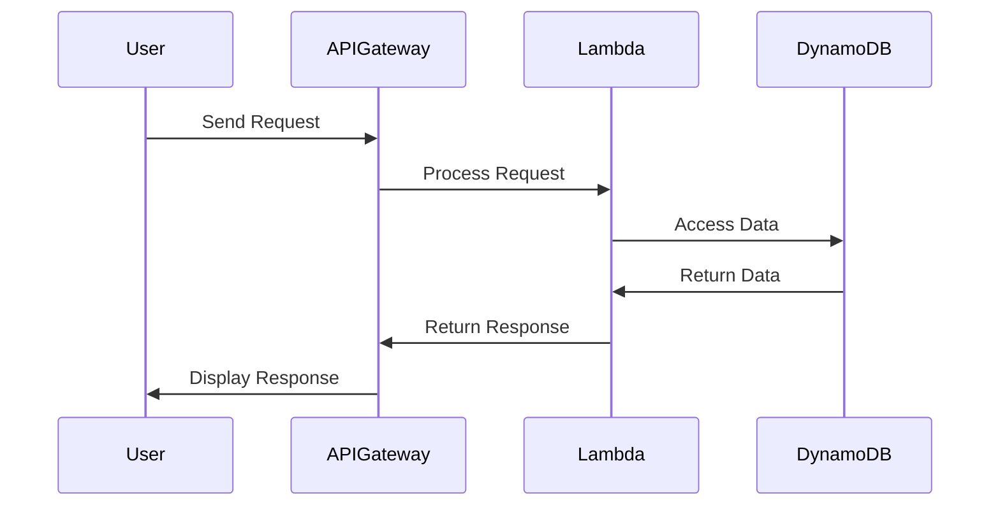

                 

## Serverless架构与实践

### 关键词：Serverless架构、函数即服务（FaaS）、云计算、性能优化、成本控制

### 摘要：

本文旨在深入探讨Serverless架构，一种近年来在软件开发中崭露头角的先进技术。我们将从Serverless架构的定义、核心概念、应用场景、技术栈、实践应用、优化策略等方面进行详细分析，并通过实际案例和最佳实践，帮助读者全面理解Serverless架构的优势和挑战，以及如何在项目中有效应用和优化。文章将分为以下章节：

1. **引言与背景介绍**：介绍Serverless架构的起源、发展现状以及其重要性。
2. **核心概念与原理**：详细解释Serverless架构的核心概念、组成及其与传统架构的区别。
3. **技术栈与工具**：介绍实现Serverless架构所需的云服务、编程语言和框架。
4. **实践应用**：通过具体案例展示Serverless架构在Web开发、移动应用和数据处理的实际应用。
5. **最佳实践与优化**：提供性能优化、成本优化和安全性的最佳实践。
6. **案例研究**：分析成功的Serverless架构案例和失败案例，总结经验和教训。
7. **总结与展望**：总结全文内容，展望Serverless架构的未来发展趋势。

让我们一步一步地深入探索Serverless架构，理解其在现代软件开发中的重要地位和巨大潜力。

----------------------------------------------------------------

### 1. 引言与背景介绍

#### 1.1 Serverless架构概述

Serverless架构，也被称为“无服务器”架构，是一种新兴的云计算服务模型。与传统的服务器架构不同，Serverless架构将服务器管理的工作交给了云服务提供商，开发者只需专注于编写和部署代码。这种模型的出现，旨在简化开发流程、降低运营成本，并提高系统的可扩展性和弹性。

Serverless架构的起源可以追溯到云计算的早期阶段。随着云计算技术的不断发展，云服务提供商逐渐提供了更多的自动化服务，例如自动扩展、自动备份和自动安全更新等。这使得开发者可以更专注于代码编写，而无需关心底层基础设施的管理。Serverless架构正是这种趋势的进一步发展，其核心思想是“无服务器”——即无需自己购买和维护服务器，所有资源均由云服务提供商提供。

#### 1.2 Serverless架构的优势

Serverless架构具有许多显著的优势，使其成为现代软件开发的热门选择。以下是Serverless架构的主要优势：

1. **低成本**：Serverless架构根据实际使用量收费，无需支付固定的服务器费用。这使得开发者可以更灵活地控制成本，尤其是对于流量波动较大的应用。

2. **高可扩展性**：Serverless架构能够自动扩展，以应对突发流量。当流量增加时，云服务提供商会自动分配更多的资源，而当流量减少时，则会自动释放资源。这种弹性扩展能力有助于确保系统的高可用性和性能。

3. **高可靠性**：由于云服务提供商负责管理底层基础设施，Serverless架构通常具有更高的可靠性。服务提供商通常会提供多节点集群和故障转移机制，以确保服务的高可用性。

4. **简化开发**：Serverless架构简化了开发流程，开发者无需担心服务器配置、软件安装和更新等繁琐任务。这有助于加快开发速度，提高开发效率。

5. **更灵活的部署**：Serverless架构允许开发者将代码部署到多个环境，例如开发、测试和生产环境。这使得开发者可以更灵活地管理和部署应用程序。

#### 1.3 Serverless架构的应用场景

Serverless架构适用于多种不同的应用场景。以下是几个典型的应用场景：

1. **Web应用**：Serverless架构非常适合构建动态Web应用，尤其是需要处理高流量和复杂业务逻辑的应用。使用Serverless架构，开发者可以轻松实现API网关、数据库连接和前后端分离。

2. **移动应用**：Serverless架构也适用于移动应用开发。通过使用Serverless架构，开发者可以轻松实现后端逻辑、数据存储和实时同步功能。

3. **数据处理**：Serverless架构非常适合处理大规模数据，例如数据分析和大数据处理。开发者可以利用Serverless架构提供的计算资源和数据处理工具，快速构建数据处理的解决方案。

4. **物联网（IoT）**：Serverless架构适用于IoT应用，例如设备数据收集、分析和处理。通过Serverless架构，开发者可以轻松实现设备的远程监控和管理。

总之，Serverless架构以其低成本、高可扩展性、高可靠性、简化开发和灵活部署等优势，正逐渐成为现代软件开发的重要工具。接下来，我们将深入探讨Serverless架构的核心概念和原理，以帮助读者更好地理解这一技术。

----------------------------------------------------------------

### 2. 核心概念与原理

#### 2.1 Serverless架构的组成

Serverless架构由多个关键组件组成，每个组件在实现无服务器环境中扮演着重要角色。以下是Serverless架构的主要组成部分：

1. **函数即服务（FaaS）**：
   - **定义**：函数即服务（FaaS）是一种云服务模型，允许开发者将代码作为函数部署到云端，这些函数根据触发事件执行。
   - **特点**：FaaS函数通常是无状态的，可以独立运行，且只需关注业务逻辑的实现。例如，AWS Lambda、Google Cloud Functions和Azure Functions都是常见的FaaS服务。
   - **应用场景**：FaaS非常适合处理事件驱动的工作负载，例如Web API、数据处理和后台任务等。

2. **事件触发器**：
   - **定义**：事件触发器是一种机制，用于触发FaaS函数的执行。事件可以来自各种来源，如Web请求、定时任务、物联网设备等。
   - **特点**：事件触发器可以确保函数仅在需要时运行，从而提高资源利用率。常见的触发器包括API网关、定时器和物联网设备。
   - **应用场景**：事件触发器广泛用于构建实时应用程序，例如实时数据处理、物联网数据监控和动态Web服务。

3. **API网关**：
   - **定义**：API网关是服务器端的一个入口点，用于处理外部请求，并将请求转发到相应的后端服务。
   - **特点**：API网关提供了统一的接口，可以处理跨域请求、身份验证和路由等任务。此外，API网关还可以提供负载均衡和安全性功能。
   - **应用场景**：API网关适用于构建复杂的Web应用和服务，例如多服务集成和分布式系统。

4. **数据库服务**：
   - **定义**：数据库服务是用于存储和检索数据的系统。在Serverless架构中，通常使用无服务器数据库服务，如AWS DynamoDB、Google Cloud Spanner和Azure Cosmos DB。
   - **特点**：无服务器数据库服务自动处理扩展、备份和复制等任务，无需开发者关心底层基础设施。
   - **应用场景**：无服务器数据库服务适用于构建数据密集型应用程序，例如电子商务、社交媒体和数据分析。

5. **后端服务**：
   - **定义**：后端服务包括处理业务逻辑和数据处理的各种服务，如消息队列、缓存和存储服务等。
   - **特点**：后端服务通常是无状态的，可以独立部署和扩展。开发者可以使用各种后端服务框架，如AWS Step Functions、Google Cloud Functions和Azure Logic Apps。
   - **应用场景**：后端服务适用于处理复杂的业务逻辑和数据转换任务，例如订单处理、消息路由和数据同步等。

#### 2.2 FaaS与Serverless的关系

函数即服务（FaaS）是Serverless架构的核心组成部分，但并不等同于Serverless架构。以下是FaaS与Serverless的关系：

- **FaaS是Serverless架构的一部分**：FaaS提供了Serverless架构的核心功能，即函数的部署和执行。然而，Serverless架构还包括其他组件，如事件触发器、API网关和后端服务，这些组件共同构成了完整的Serverless架构。
- **FaaS与Serverless的区别**：FaaS关注的是函数的部署和执行，而Serverless架构则是一个更广泛的模型，包括云服务提供商、开发者工具和开发流程等。Serverless架构不仅提供了函数服务，还提供了自动扩展、负载均衡和安全等功能。

#### 2.3 Serverless架构与传统架构的比较

Serverless架构与传统服务器架构有许多显著的区别，以下是两者之间的主要对比：

1. **资源管理**：
   - **传统架构**：在传统服务器架构中，开发者需要自己购买和管理服务器，负责服务器配置、软件安装和更新等任务。
   - **Serverless架构**：在Serverless架构中，云服务提供商负责管理底层基础设施，包括服务器、存储和网络等。开发者只需关注代码编写和部署，无需担心资源管理。

2. **部署模型**：
   - **传统架构**：传统服务器架构通常使用虚拟机或容器进行部署，需要开发者手动配置和管理。
   - **Serverless架构**：Serverless架构使用函数即服务（FaaS）模型进行部署，函数根据触发事件自动执行。开发者只需上传代码，无需关心部署细节。

3. **扩展性**：
   - **传统架构**：传统服务器架构通常需要手动配置负载均衡和扩展策略，以应对流量变化。
   - **Serverless架构**：Serverless架构具有自动扩展功能，云服务提供商根据实际流量自动分配和释放资源，确保系统的高可用性和性能。

4. **成本**：
   - **传统架构**：传统服务器架构的成本通常较高，包括服务器购买、维护和运营费用。
   - **Serverless架构**：Serverless架构根据实际使用量收费，无需支付固定的服务器费用，有助于降低成本。

5. **开发流程**：
   - **传统架构**：传统服务器架构的开发流程较为复杂，涉及服务器配置、软件安装和更新等任务。
   - **Serverless架构**：Serverless架构简化了开发流程，开发者只需关注业务逻辑的实现，无需担心底层基础设施的管理。

总之，Serverless架构与传统服务器架构相比，具有显著的资源管理、部署模型、扩展性、成本和开发流程的优势。这种模型为开发者提供了更高的开发效率、更好的性能和更低的运营成本。

接下来，我们将介绍实现Serverless架构所需的技术栈和工具，帮助读者了解如何在实际项目中应用Serverless架构。

----------------------------------------------------------------

### 3. 技术栈与工具

#### 3.1 实现Serverless架构所需的云服务

实现Serverless架构需要依赖多种云服务提供商的支持，以下是一些常用的云服务：

1. **AWS Lambda**：
   - **简介**：AWS Lambda是一种无服务器计算服务，允许开发者将代码部署到AWS云上，并按使用量收费。
   - **特点**：支持多种编程语言（如Python、Node.js、Java等），自动扩展，高可用性，可与其他AWS服务集成。
   - **应用场景**：适用于构建Web应用、数据处理、后台任务和物联网应用等。

2. **Google Cloud Functions**：
   - **简介**：Google Cloud Functions是一种无服务器计算服务，允许开发者将代码部署到Google Cloud上，并按使用量收费。
   - **特点**：支持多种编程语言（如JavaScript、Python、Go等），自动扩展，高可用性，可与其他Google Cloud服务集成。
   - **应用场景**：适用于构建Web应用、数据处理、后台任务和物联网应用等。

3. **Azure Functions**：
   - **简介**：Azure Functions是一种无服务器计算服务，允许开发者将代码部署到Azure云上，并按使用量收费。
   - **特点**：支持多种编程语言（如C#、JavaScript、Python等），自动扩展，高可用性，可与其他Azure服务集成。
   - **应用场景**：适用于构建Web应用、数据处理、后台任务和物联网应用等。

4. **IBM Cloud Functions**：
   - **简介**：IBM Cloud Functions是一种无服务器计算服务，允许开发者将代码部署到IBM Cloud上，并按使用量收费。
   - **特点**：支持多种编程语言（如Node.js、Python、Java等），自动扩展，高可用性，可与其他IBM Cloud服务集成。
   - **应用场景**：适用于构建Web应用、数据处理、后台任务和物联网应用等。

5. **Oracle Functions**：
   - **简介**：Oracle Functions是一种无服务器计算服务，允许开发者将代码部署到Oracle Cloud上，并按使用量收费。
   - **特点**：支持多种编程语言（如JavaScript、Python、Java等），自动扩展，高可用性，可与其他Oracle Cloud服务集成。
   - **应用场景**：适用于构建Web应用、数据处理、后台任务和物联网应用等。

#### 3.2 编程语言与框架

实现Serverless架构时，选择合适的编程语言和框架非常重要。以下是一些常用的编程语言和框架：

1. **Node.js**：
   - **简介**：Node.js是一种基于Chrome V8引擎的JavaScript运行时环境。
   - **特点**：支持异步编程，高性能，广泛的应用程序生态系统。
   - **应用场景**：适用于构建Web应用、实时数据处理和后台任务。

2. **Python**：
   - **简介**：Python是一种高级编程语言，具有简单易学的语法和丰富的库。
   - **特点**：易于阅读和理解，高效的代码执行，广泛的应用程序生态系统。
   - **应用场景**：适用于构建Web应用、数据处理、机器学习和科学计算。

3. **Java**：
   - **简介**：Java是一种广泛使用的面向对象的编程语言。
   - **特点**：强类型语言，安全性高，跨平台性，广泛的应用程序生态系统。
   - **应用场景**：适用于构建大型企业级应用、后台任务和数据处理。

4. **C#**：
   - **简介**：C#是一种面向对象的编程语言，主要用于.NET平台。
   - **特点**：易于学习和使用，强大的类型系统和面向对象特性，与.NET生态系统紧密集成。
   - **应用场景**：适用于构建企业级应用、Web应用和后台任务。

5. **Go**：
   - **简介**：Go（又称Golang）是一种由Google开发的静态强类型、编译型语言。
   - **特点**：高性能，内存管理简单，并发支持良好。
   - **应用场景**：适用于构建高性能、可扩展的后台服务和物联网应用。

6. **Python的Serverless框架**：如`Basho`、`Serverless Framework`等，可以帮助开发者轻松部署和管理Serverless应用。

7. **Node.js的Serverless框架**：如`Serverless`、`Zappa`等，可以简化Node.js应用的部署和管理。

8. **Java的Serverless框架**：如`Spring Cloud Function`、`Java Serverless Framework`等，可以支持Java应用的Serverless部署。

#### 3.3 DevOps与CI/CD在Serverless架构中的应用

在Serverless架构中，DevOps和CI/CD（持续集成/持续部署）同样发挥着重要作用。以下是如何在Serverless架构中应用DevOps和CI/CD的一些要点：

1. **容器化**：使用Docker等容器技术，可以将应用程序及其依赖打包成容器镜像，确保在不同环境中的一致性和可移植性。

2. **持续集成**：使用Jenkins、GitLab CI/CD等工具，实现代码的自动化测试和构建，确保代码质量。

3. **持续部署**：使用Kubernetes、AWS Lambda、Google Cloud Functions等平台，实现自动化部署和版本控制，确保应用程序的快速上线和更新。

4. **监控和日志管理**：使用Prometheus、Grafana、ELK（Elasticsearch、Logstash、Kibana）等工具，实现应用程序的监控和日志管理，确保系统稳定性和性能。

通过以上技术栈和工具，开发者可以更高效地实现Serverless架构，提高开发效率和应用性能。接下来，我们将通过实际案例展示Serverless架构在Web开发、移动应用和数据处理的实际应用。

----------------------------------------------------------------

### 4. 实践应用

#### 4.1 Serverless架构在Web开发中的应用

Serverless架构在Web开发中的应用非常广泛，其高扩展性、低成本和简化开发流程的特点使其成为构建现代Web应用的首选。以下是一个Web开发的实际案例：

**案例：使用AWS Lambda和API Gateway构建动态Web应用**

1. **项目介绍**：
   - **项目名称**：动态博客平台
   - **目标**：构建一个可以实时处理用户请求、支持多用户并发访问的博客平台。

2. **系统功能设计**：
   - **用户注册与登录**：允许用户注册、登录和修改个人信息。
   - **文章发布与管理**：允许用户发布文章、编辑文章和删除文章。
   - **评论系统**：允许用户对文章进行评论。
   - **数据存储**：使用AWS DynamoDB进行数据存储。

3. **系统架构设计**：
   - **API网关**：作为前端请求的入口，处理用户请求并转发到后端服务。
   - **AWS Lambda**：作为后端服务，处理各种业务逻辑，如用户认证、文章发布、评论管理等。
   - **AWS DynamoDB**：作为数据存储，存储用户数据、文章数据和评论数据。

4. **接口设计和系统交互**：
   - **用户接口**：使用React框架构建，提供用户友好的界面。
   - **API接口**：通过RESTful API进行交互，实现用户注册、登录、文章发布等操作。

以下是系统的交互序列图（使用Mermaid绘制）：



5. **环境安装**：
   - 安装Node.js和npm。
   - 安装AWS CLI。
   - 使用`serverless`框架创建新的Serverless项目。

6. **系统核心实现**：
   - **用户认证**：
     ```python
     from flask import Flask, request, jsonify
     from flask_httpauth import HTTPBasicAuth

     app = Flask(__name__)
     auth = HTTPBasicAuth()

     users = {
         "user1": "password1",
         "user2": "password2"
     }

     @auth.get_password
     def get_password(username):
         if username in users:
             return users.get(username)
         return None

     @app.route('/login', methods=['POST'])
     def login():
         username = request.json.get('username')
         password = request.json.get('password')
         if username in users and users[username] == password:
             return jsonify({"status": "success"})
         return jsonify({"status": "failure"})

     if __name__ == '__main__':
         app.run()
     ```
   - **文章发布**：
     ```python
     @app.route('/post', methods=['POST'])
     @auth.login_required
     def post_article():
         article = request.json.get('article')
         # 处理文章数据，存储到DynamoDB
         return jsonify({"status": "success", "article": article})
     ```

7. **代码应用解读与分析**：
   - 上述代码实现了用户认证和文章发布功能。用户认证通过HTTP Basic Auth进行，确保只有合法用户才能访问受保护的API。文章发布功能接收JSON格式的文章数据，并将其存储到DynamoDB数据库。

8. **实际案例分析**：
   - 在实际项目中，通过Serverless架构，我们能够快速部署和扩展系统，同时降低运维成本。使用AWS Lambda，我们能够以最小化资源消耗处理高并发请求，而使用DynamoDB，我们能够高效地存储和管理用户数据。

9. **项目小结**：
   - 通过这个案例，我们展示了如何使用Serverless架构构建一个动态Web应用。Serverless架构不仅简化了开发流程，还提供了高扩展性和低成本的优势。

#### 4.2 Serverless架构在移动应用开发中的应用

Serverless架构在移动应用开发中也表现出强大的优势，可以帮助开发者快速构建后端服务，并轻松实现实时同步和数据存储。以下是一个移动应用的案例：

**案例：使用AWS Amplify和AWS Lambda构建移动应用后端**

1. **项目介绍**：
   - **项目名称**：社交健身应用
   - **目标**：构建一个允许用户跟踪健身活动、分享进度和挑战朋友的移动应用。

2. **系统功能设计**：
   - **用户管理**：允许用户注册、登录和编辑个人信息。
   - **健身活动记录**：允许用户记录健身活动，如跑步、瑜伽和力量训练。
   - **社交功能**：允许用户挑战和评论朋友的健身活动。
   - **数据存储**：使用AWS Amplify和DynamoDB进行数据存储。

3. **系统架构设计**：
   - **API网关**：作为移动应用的入口，处理用户请求并转发到后端服务。
   - **AWS Lambda**：作为后端服务，处理各种业务逻辑，如用户认证、健身活动记录和社交功能。
   - **AWS Amplify**：提供移动应用开发和部署工具，包括数据存储、用户认证和API网关等功能。
   - **DynamoDB**：作为数据存储，存储用户数据、健身活动和社交数据。

4. **环境安装**：
   - 安装AWS CLI。
   - 安装AWS Amplify CLI。

5. **系统核心实现**：
   - **用户认证**：
     ```python
     from flask import Flask, request, jsonify
     from flask_httpauth import HTTPBasicAuth

     app = Flask(__name__)
     auth = HTTPBasicAuth()

     users = {
         "user1": "password1",
         "user2": "password2"
     }

     @auth.get_password
     def get_password(username):
         if username in users:
             return users.get(username)
         return None

     @app.route('/login', methods=['POST'])
     def login():
         username = request.json.get('username')
         password = request.json.get('password')
         if username in users and users[username] == password:
             return jsonify({"status": "success"})
         return jsonify({"status": "failure"})

     if __name__ == '__main__':
         app.run()
     ```
   - **健身活动记录**：
     ```python
     @app.route('/activity', methods=['POST'])
     @auth.login_required
     def post_activity():
         activity = request.json.get('activity')
         # 处理健身活动数据，存储到DynamoDB
         return jsonify({"status": "success", "activity": activity})
     ```

6. **代码应用解读与分析**：
   - 上述代码实现了用户认证和健身活动记录功能。用户认证使用HTTP Basic Auth进行，确保只有合法用户才能访问受保护的API。健身活动记录功能接收JSON格式的活动数据，并将其存储到DynamoDB数据库。

7. **实际案例分析**：
   - 在实际项目中，通过AWS Amplify和Lambda，我们能够快速构建和部署移动应用后端，实现用户认证、数据存储和实时同步功能。使用AWS Lambda，我们能够以最小化资源消耗处理高并发请求，而使用DynamoDB，我们能够高效地存储和管理用户数据。

8. **项目小结**：
   - 通过这个案例，我们展示了如何使用Serverless架构构建移动应用后端。Serverless架构不仅简化了开发流程，还提供了高扩展性和低成本的优势。

#### 4.3 Serverless架构在数据处理和分析中的应用

Serverless架构在数据处理和分析领域也非常有优势，可以快速构建数据处理管道，处理大规模数据，并实现实时分析和可视化。以下是一个数据处理和分析的案例：

**案例：使用AWS Lambda和Amazon Kinesis构建数据处理和分析管道**

1. **项目介绍**：
   - **项目名称**：实时数据分析平台
   - **目标**：构建一个可以实时处理物联网设备数据、进行实时分析和可视化的平台。

2. **系统功能设计**：
   - **数据采集**：采集物联网设备的数据，如温度、湿度、运动等。
   - **实时分析**：对采集到的数据进行实时分析，如趋势分析、异常检测等。
   - **数据可视化**：将分析结果以图表形式展示。

3. **系统架构设计**：
   - **API网关**：作为数据采集的入口，接收物联网设备的数据。
   - **AWS Lambda**：作为数据处理和计算单元，处理实时数据和分析逻辑。
   - **Amazon Kinesis**：作为数据流平台，存储和处理实时数据。
   - **Amazon S3**：作为数据存储，存储分析结果和可视化数据。
   - **Amazon QuickSight**：作为数据可视化工具，展示分析结果。

4. **环境安装**：
   - 安装AWS CLI。
   - 安装AWS SDK。

5. **系统核心实现**：
   - **数据采集**：
     ```python
     import json
     import boto3

     kinesis = boto3.client('kinesis')

     def lambda_handler(event, context):
         for record in event['Records']:
             data = json.loads(record['kinesis']['data'])
             # 处理和存储数据到Kinesis
             kinesis.put_record(
                 StreamName='iot_data_stream',
                 Data=json.dumps(data),
                 PartitionKey='1'
             )
     ```
   - **实时分析**：
     ```python
     import json
     import boto3

     kinesis = boto3.client('kinesis')

     def lambda_handler(event, context):
         for record in event['Records']:
             data = json.loads(record['kinesis']['data'])
             # 实时分析数据
             # 存储分析结果到S3
             s3 = boto3.client('s3')
             s3.put_object(
                 Bucket='my-bucket',
                 Key='analysis_result.json',
                 Body=json.dumps(data)
             )
     ```

6. **代码应用解读与分析**：
   - 上述代码实现了数据采集和实时分析功能。数据采集函数接收Kinesis Stream中的数据，并将其存储到Kinesis Stream中。实时分析函数从Kinesis Stream中读取数据，进行实时分析，并将分析结果存储到Amazon S3。

7. **实际案例分析**：
   - 在实际项目中，通过AWS Lambda和Kinesis，我们能够快速构建和处理大规模实时数据。使用Lambda，我们能够以最小化资源消耗处理高并发数据，而使用Kinesis，我们能够高效地存储和处理实时数据。

8. **项目小结**：
   - 通过这个案例，我们展示了如何使用Serverless架构构建数据处理和分析管道。Serverless架构不仅简化了开发流程，还提供了高扩展性和低成本的优势。

### 4.4 小结

通过以上案例，我们可以看到Serverless架构在Web开发、移动应用和数据处理和分析等领域的广泛应用。Serverless架构不仅简化了开发流程，还提供了高扩展性和低成本的优势，使其成为现代软件开发的重要工具。在接下来的章节中，我们将进一步探讨Serverless架构的最佳实践和优化策略。

----------------------------------------------------------------

### 5. 最佳实践与优化

#### 5.1 Serverless架构的性能优化

在Serverless架构中，性能优化是确保系统高效运行的关键。以下是一些常用的性能优化策略：

1. **函数优化**：
   - **减少函数执行时间**：优化代码，减少不必要的计算和数据库查询。
   - **使用异步调用**：避免在函数中阻塞执行，使用异步调用提高并发性。
   - **减少函数调用次数**：合理设计函数调用，避免不必要的重复调用。

2. **缓存策略**：
   - **使用内存缓存**：缓存常用的数据和计算结果，减少数据库查询和计算时间。
   - **使用分布式缓存**：使用如Redis或Memcached等分布式缓存系统，提高缓存性能和可扩展性。

3. **数据库优化**：
   - **使用合适的数据模型**：设计合适的数据模型，减少数据库查询次数。
   - **使用数据库缓存**：使用数据库缓存，减少数据库查询时间。
   - **优化数据库查询**：使用索引和查询优化技术，提高数据库查询效率。

4. **网络优化**：
   - **使用CDN**：使用内容分发网络（CDN），减少网络延迟和数据传输时间。
   - **优化API接口**：优化API接口的设计，减少数据传输量和接口调用次数。

#### 5.2 Serverless架构的成本优化

成本优化是Serverless架构的重要一环，以下是一些常用的成本优化策略：

1. **合理配置函数**：
   - **调整内存和超时时间**：根据实际需求和性能测试，合理配置函数的内存和超时时间，避免资源浪费。
   - **拆分大函数**：将大函数拆分成多个小函数，按需调用，减少资源占用。

2. **优化部署策略**：
   - **使用分层部署**：将不同层次的代码和依赖部署到不同的函数中，减少重复部署和资源占用。
   - **利用多环境部署**：使用多环境部署策略，根据不同的流量和需求，动态调整资源分配。

3. **优化数据库使用**：
   - **使用共享数据库**：对于轻量级应用，使用共享数据库可以降低成本。
   - **优化数据库查询**：优化数据库查询，减少查询次数和查询时间。

4. **利用免费和优惠资源**：
   - **使用免费或优惠的资源**：充分利用云服务提供商提供的免费试用和优惠资源，降低成本。

#### 5.3 Serverless架构的安全性与合规性

在Serverless架构中，安全性和合规性是至关重要的。以下是一些常用的安全性和合规性策略：

1. **数据加密**：
   - **传输加密**：使用TLS协议加密数据传输，确保数据在传输过程中安全。
   - **存储加密**：使用数据加密技术，对存储在数据库和文件中的敏感数据进行加密。

2. **访问控制**：
   - **最小权限原则**：确保函数和数据库的访问权限最小化，仅授权必要的操作。
   - **使用身份验证和授权**：使用身份验证和授权机制，确保只有合法用户可以访问系统和数据。

3. **日志和监控**：
   - **记录日志**：记录系统操作和错误日志，方便故障排查和问题定位。
   - **实时监控**：使用实时监控工具，及时发现和响应异常情况。

4. **合规性检查**：
   - **遵循法规和标准**：确保系统和数据处理遵循相关法规和标准，如GDPR、PCI-DSS等。

#### 5.4 最佳实践总结

- **优化函数性能**：合理配置函数，使用缓存和异步调用，减少计算和查询时间。
- **成本优化**：合理配置资源，分层部署，利用免费和优惠资源。
- **安全性保障**：数据加密，访问控制，日志和监控。
- **合规性遵循**：遵循法规和标准，确保系统和数据处理合规。

通过上述最佳实践和优化策略，开发者可以更好地利用Serverless架构的优势，构建高效、安全、合规的应用系统。在接下来的章节中，我们将通过案例研究，进一步探讨Serverless架构的成功和失败经验。

----------------------------------------------------------------

### 6. 案例研究

#### 6.1 成功案例：Uber的Serverless转型

Uber作为全球知名的移动出行服务公司，其技术团队一直在探索如何提高开发效率、降低成本。在经历了从传统服务器架构向Serverless架构的转型后，Uber取得了显著的成效。

**案例背景**：
- **问题**：Uber面临不断增长的并发请求、复杂的业务逻辑和庞大的数据处理需求，传统的服务器架构难以满足这些要求。
- **解决方案**：Uber决定采用Serverless架构，以实现更高效、更灵活的解决方案。

**实施过程**：
1. **迁移现有服务**：
   - Uber将许多现有服务迁移到AWS Lambda和API Gateway。
   - 使用AWS Lambda处理后台任务、订单处理和实时消息传递。
   - 使用API Gateway作为统一的API入口，处理外部请求。

2. **优化数据处理**：
   - 利用AWS Kinesis处理实时数据流，对订单、支付和司机位置信息进行实时分析。
   - 使用Amazon S3存储静态资源，如司机和乘客的照片。

3. **集成第三方服务**：
   - 集成Google Maps API，实现实时导航和路线规划。
   - 使用Twilio进行短信和语音通信。

**成效**：
- **成本降低**：通过使用Serverless架构，Uber实现了成本的大幅降低。根据Uber的内部数据，使用Serverless架构后，其服务器成本减少了约40%。
- **性能提升**：Serverless架构的高扩展性和弹性，使Uber能够更好地应对突发流量，确保系统的高性能和高可用性。
- **开发效率提高**：Serverless架构简化了开发流程，Uber的开发团队可以将更多精力投入到核心业务逻辑的实现上，提高了开发效率。

**最佳实践**：
- **合理设计函数**：Uber将复杂的业务逻辑拆分成多个小函数，按需调用，提高了系统的性能和可维护性。
- **充分利用第三方服务**：Uber充分利用了第三方服务，如Google Maps和Twilio，简化了开发流程，提高了系统的可靠性。

#### 6.2 失败案例：Airbnb的Serverless尝试

尽管Serverless架构具有许多优势，但在实际应用中也可能面临挑战。以下是一个Serverless架构失败的案例：

**案例背景**：
- **问题**：Airbnb在尝试采用Serverless架构时，遇到了一些问题，导致项目失败。
- **解决方案**：Airbnb希望通过Serverless架构提高系统的可扩展性和开发效率。

**实施过程**：
1. **迁移部分服务**：
   - Airbnb将一些后台服务迁移到AWS Lambda和API Gateway。
   - 使用AWS Lambda处理用户认证、订单处理和后台任务。

2. **遇到挑战**：
   - **性能瓶颈**：由于AWS Lambda函数的执行时间限制，Airbnb发现一些关键任务无法在规定时间内完成，导致性能下降。
   - **资源分配不均**：在某些高流量时段，AWS Lambda的扩展速度无法满足需求，导致系统响应时间延长。
   - **成本超支**：由于未充分了解Serverless架构的成本模型，Airbnb在迁移过程中遇到了成本超支的问题。

**失败原因**：
- **缺乏充分测试**：Airbnb在迁移前未进行充分的性能测试和压力测试，导致在迁移过程中发现了一些隐藏的问题。
- **资源分配不当**：未合理配置AWS Lambda的内存和超时时间，导致性能和扩展性不足。
- **成本控制不足**：未提前制定详细的成本预算和优化策略，导致成本超支。

**教训**：
- **充分测试**：在迁移到Serverless架构之前，应进行全面的性能测试和压力测试，确保系统能够应对高流量和高并发场景。
- **合理配置资源**：根据实际需求和性能测试结果，合理配置AWS Lambda的内存和超时时间，确保系统的高性能和可扩展性。
- **成本控制**：提前制定详细的成本预算和优化策略，确保Serverless架构的成本可控。

通过以上成功和失败案例，我们可以看到Serverless架构在实践中的应用优势和潜在挑战。了解这些案例的经验和教训，有助于开发者更好地利用Serverless架构的优势，构建高效、可靠的应用系统。

### 6.3 小结

成功案例和失败案例都为我们提供了宝贵的经验和教训。通过Uber的成功案例，我们了解到合理设计函数、充分利用第三方服务和充分测试是Serverless架构成功的关键。而通过Airbnb的失败案例，我们认识到充分测试、合理配置资源和成本控制的重要性。在实际应用Serverless架构时，开发者应充分考虑这些因素，确保系统能够高效、可靠地运行。在接下来的章节中，我们将总结全文内容，并展望Serverless架构的未来发展趋势。

----------------------------------------------------------------

### 7. 总结与展望

#### 7.1 Serverless架构的现状与趋势

Serverless架构自推出以来，迅速在软件开发领域崭露头角。其低成本、高可扩展性、高可靠性和简化开发流程等优势，使其成为现代软件开发的重要工具。根据市场研究公司Gartner的预测，到2025年，全球超过65%的企业将会采用Serverless架构。

当前，Serverless架构已经广泛应用于多个领域，包括Web开发、移动应用、数据处理和物联网等。云服务提供商，如AWS、Google Cloud和Azure，也在不断扩展和完善自己的Serverless服务，以吸引更多的开发者和企业客户。

#### 7.2 Serverless架构的未来发展趋势

未来，Serverless架构将呈现以下几个发展趋势：

1. **更加成熟和稳定**：随着技术的不断成熟和优化，Serverless架构将变得更加稳定和可靠，降低系统的故障率和维护成本。

2. **更广泛的采用**：随着更多企业和开发者的认可，Serverless架构的采用范围将不断扩展，包括更多的垂直行业和应用场景。

3. **更强大的生态系统**：随着Serverless架构的普及，将出现更多适用于Serverless架构的编程语言、框架和工具，为开发者提供更丰富的选择和更好的开发体验。

4. **更多集成服务**：Serverless架构将与更多的云服务和第三方服务进行集成，提供更加全面和便捷的服务，如自动化部署、监控和安全性等。

5. **跨云和多云支持**：Serverless架构将更加支持跨云和多云部署，为开发者提供更多的灵活性和可扩展性。

#### 7.3 Serverless架构的影响与潜力

Serverless架构的崛起对软件开发产生了深远的影响。首先，它改变了传统的软件开发模式，使开发者能够更专注于业务逻辑的实现，而无需关心底层基础设施的管理。其次，它降低了开发门槛和成本，使更多企业和开发者能够快速构建和部署高质量的应用系统。

Serverless架构的潜力在于，它能够为开发者提供前所未有的灵活性和效率，使企业能够更快地响应市场变化，提高竞争力。同时，它也为云计算服务提供商带来了新的增长点和盈利模式，推动了整个云计算行业的发展。

### 7.4 展望与建议

对于开发者而言，掌握Serverless架构是未来的发展趋势，以下是几点建议：

1. **学习和实践**：积极学习和实践Serverless架构，了解其核心概念、技术和应用场景。
2. **关注最佳实践**：关注Serverless架构的最佳实践和优化策略，确保系统能够高效、可靠地运行。
3. **持续创新**：不断探索和尝试新的Serverless架构应用，推动技术的发展和创新。

总之，Serverless架构作为一种新兴的云计算服务模型，正逐渐改变软件开发的方式和模式。其低成本、高可扩展性和高可靠性的优势，使其成为未来软件开发的重要工具。开发者应抓住这一机遇，积极探索和实践Serverless架构，为企业的数字化转型和创新提供强有力的支持。

### 作者信息

作者：AI天才研究院/AI Genius Institute & 禅与计算机程序设计艺术 /Zen And The Art of Computer Programming

在本文中，我们深入探讨了Serverless架构的核心概念、应用场景、技术栈、实践应用、优化策略以及案例研究。通过详细的分析和实际案例，我们展示了Serverless架构在提高开发效率、降低成本和提升系统性能方面的巨大潜力。Serverless架构不仅简化了开发流程，还为云计算服务提供商带来了新的机遇。未来，随着技术的不断成熟和普及，Serverless架构将在更广泛的领域得到应用，成为现代软件开发的重要工具。

----------------------------------------------------------------

### 1.6 目录大纲设计规划

在设计《Serverless架构与实践》的目录大纲时，我们需要遵循以下原则：

1. **内容完整性**：确保每个章节都能涵盖核心概念、原理、实战案例和最佳实践等内容。

2. **逻辑性**：章节之间需要有清晰的逻辑关系，便于读者理解。

3. **简洁性**：避免过多的冗余内容，保持大纲的简洁明了。

4. **可读性**：使用markdown格式和适当的标题层级，提高文档的可读性。

5. **实用性**：确保每个章节的内容都具有实际操作价值，能帮助读者掌握Serverless架构的实践应用。

### 1.7 确定目录结构

根据上述原则，我们可以将目录结构分为以下几个部分：

**引言与背景介绍**

- **1.1 Serverless架构概述**
  - 介绍Serverless架构的定义、起源和发展现状。

- **1.2 Serverless架构的优势**
  - 讨论Serverless架构相比传统架构的优势。

- **1.3 Serverless架构的应用场景**
  - 分析Serverless架构在不同领域的应用。

**核心概念与原理**

- **2.1 Serverless架构的组成**
  - 介绍Serverless架构的核心组成部分。

- **2.2 FaaS与Serverless的关系**
  - 解释FaaS（函数即服务）在Serverless架构中的作用。

- **2.3 Serverless架构与传统架构的比较**
  - 深入分析Serverless架构与传统架构的差异。

**技术栈与工具**

- **3.1 实现Serverless架构所需的云服务**
  - 介绍AWS、Azure、Google Cloud等云服务提供的Serverless服务。

- **3.2 编程语言与框架**
  - 讨论Python、Node.js、Go等编程语言以及Serverless框架的使用。

- **3.3 DevOps与CI/CD在Serverless架构中的应用**
  - 介绍如何在Serverless架构中实施DevOps和持续集成/持续部署（CI/CD）。

**实践应用**

- **4.1 Serverless架构在Web开发中的应用**
  - 通过案例展示如何使用Serverless架构构建Web应用。

- **4.2 Serverless架构在移动应用开发中的应用**
  - 分析如何将Serverless架构应用于移动应用开发。

- **4.3 Serverless架构在数据处理和分析中的应用**
  - 讨论Serverless架构在数据处理和分析领域的应用。

**最佳实践与优化**

- **5.1 Serverless架构的性能优化**
  - 提供性能优化技巧和最佳实践。

- **5.2 Serverless架构的成本优化**
  - 讨论如何降低Serverless架构的成本。

- **5.3 Serverless架构的安全性与合规性**
  - 分析Serverless架构的安全性和合规性挑战。

**案例研究**

- **6.1 成功案例**
  - 分析成功的Serverless架构案例，了解最佳实践。

- **6.2 失败案例**
  - 通过分析失败案例，避免常见的陷阱。

**总结与展望**

- **7.1 Serverless架构的现状与趋势**
  - 总结Serverless架构的现状和未来发展趋势。

- **7.2 Serverless架构的未来发展**
  - 展望Serverless架构在未来的发展趋势和潜在影响。

通过上述规划，我们确保了《Serverless架构与实践》的目录大纲内容完整性、逻辑性、简洁性和实用性，为读者提供了一个全面、系统、易于理解的学习路径。

----------------------------------------------------------------

### 1.8 确定各章节内容

根据目录结构，我们需要为每个章节确定具体的内容。以下是《Serverless架构与实践》各章节的内容规划：

**第1章：引言与背景介绍**

- **1.1 Serverless架构概述**
  - **内容**：
    - 介绍Serverless架构的定义。
    - 概述Serverless架构的起源和发展现状。
    - 解释Serverless架构的核心思想。

- **1.2 Serverless架构的优势**
  - **内容**：
    - 分析Serverless架构相比传统架构的优势，包括低成本、高可扩展性和高可靠性等。
    - 讨论Serverless架构对开发流程的影响。

- **1.3 Serverless架构的应用场景**
  - **内容**：
    - 探讨Serverless架构在不同领域的应用，如Web开发、移动应用、数据处理等。
    - 分析Serverless架构在特定场景中的优势。

**第2章：核心概念与原理**

- **2.1 Serverless架构的组成**
  - **内容**：
    - 介绍Serverless架构的主要组成部分，包括FaaS、事件触发器、API网关等。
    - 讨论每个组件的作用和如何协同工作。

- **2.2 FaaS与Serverless的关系**
  - **内容**：
    - 解释函数即服务（FaaS）在Serverless架构中的作用。
    - 分析FaaS与传统后端服务的差异。

- **2.3 Serverless架构与传统架构的比较**
  - **内容**：
    - 深入分析Serverless架构与传统服务器架构的区别。
    - 比较两者在资源管理、部署模型、扩展性和成本等方面的差异。

**第3章：技术栈与工具**

- **3.1 实现Serverless架构所需的云服务**
  - **内容**：
    - 介绍AWS、Azure、Google Cloud等云服务提供商的Serverless服务。
    - 讨论每个服务的特点和优势。

- **3.2 编程语言与框架**
  - **内容**：
    - 讨论Python、Node.js、Go等编程语言以及Serverless框架（如Serverless Framework）的使用。
    - 分析每种语言和框架在Serverless架构中的应用场景。

- **3.3 DevOps与CI/CD在Serverless架构中的应用**
  - **内容**：
    - 介绍如何在Serverless架构中实施DevOps和持续集成/持续部署（CI/CD）。
    - 讨论CI/CD工具（如Jenkins、GitLab CI）在Serverless架构中的实际应用。

**第4章：实践应用**

- **4.1 Serverless架构在Web开发中的应用**
  - **内容**：
    - 通过案例展示如何使用Serverless架构构建Web应用。
    - 详细讲解使用AWS Lambda、API Gateway等服务的实际应用。

- **4.2 Serverless架构在移动应用开发中的应用**
  - **内容**：
    - 分析如何将Serverless架构应用于移动应用开发。
    - 讨论使用AWS Amplify等工具构建移动应用后端的方法。

- **4.3 Serverless架构在数据处理和分析中的应用**
  - **内容**：
    - 讨论Serverless架构在数据处理和分析领域的应用。
    - 通过案例展示如何使用Serverless架构进行实时数据处理和可视化。

**第5章：最佳实践与优化**

- **5.1 Serverless架构的性能优化**
  - **内容**：
    - 提供性能优化技巧和最佳实践，包括函数优化、缓存策略等。

- **5.2 Serverless架构的成本优化**
  - **内容**：
    - 讨论如何降低Serverless架构的成本，包括资源配置、部署策略等。

- **5.3 Serverless架构的安全性与合规性**
  - **内容**：
    - 分析Serverless架构的安全性和合规性挑战，提供解决方案和最佳实践。

**第6章：案例研究**

- **6.1 成功案例**
  - **内容**：
    - 分析成功的Serverless架构案例，总结最佳实践和成功经验。

- **6.2 失败案例**
  - **内容**：
    - 通过分析失败案例，探讨常见陷阱和解决方案，避免类似错误。

**第7章：总结与展望**

- **7.1 Serverless架构的现状与趋势**
  - **内容**：
    - 总结Serverless架构的现状和未来发展趋势。

- **7.2 Serverless架构的未来发展**
  - **内容**：
    - 展望Serverless架构在未来的发展趋势和潜在影响。

通过上述内容规划，我们确保了《Serverless架构与实践》的每个章节都包含丰富的信息和具体的实战案例，能够帮助读者全面了解和掌握Serverless架构的理论和实践应用。每个章节的内容都经过精心设计，确保逻辑清晰、结构紧凑，易于读者理解和学习。

