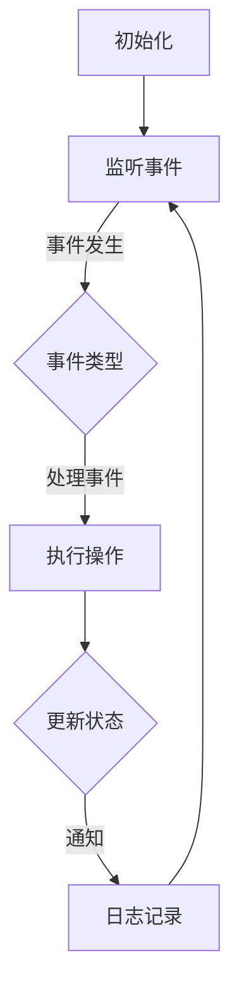
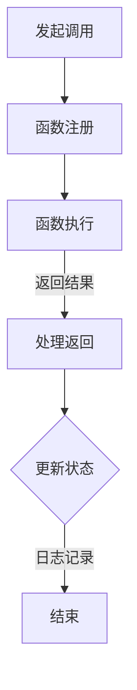
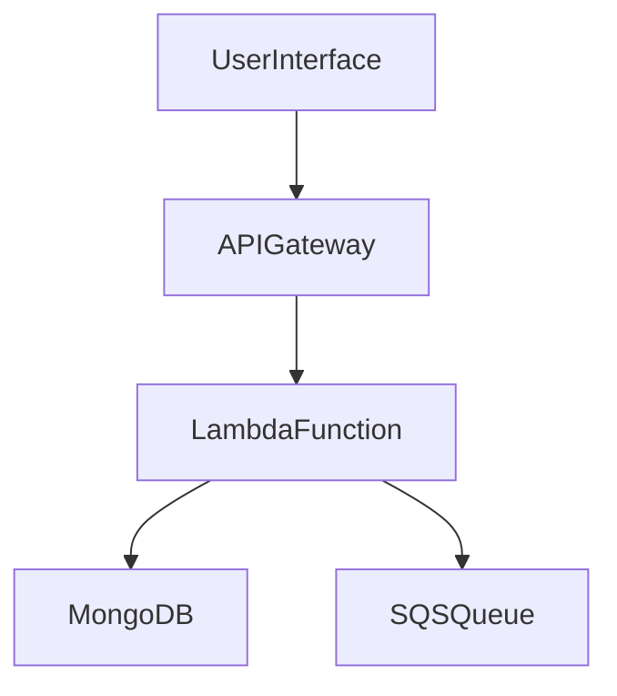

                 

# 《Serverless架构应用场景分析》

## 关键词

- **Serverless架构**
- **应用场景**
- **事件驱动计算**
- **云计算**
- **开发效率**
- **弹性伸缩**
- **成本效益**

## 摘要

本文将深入探讨Serverless架构的应用场景，从基础概念、技术架构、应用优势与挑战、行业案例分析以及未来发展趋势等方面进行系统分析。Serverless架构作为一种新兴的云计算模型，以其灵活、高效和低成本的特点，正在逐渐改变现代软件开发的格局。本文旨在帮助读者理解Serverless架构的核心原理和应用实践，为实际项目决策提供参考。

## 前言

随着互联网和云计算技术的飞速发展，软件开发的方式也在不断演进。传统的云计算模型要求开发者关注服务器运维、资源管理和性能优化等多个方面，而Serverless架构的出现，旨在简化开发流程，提高开发效率，并降低运维成本。Serverless架构通过将服务器管理交给云服务提供商，使得开发者可以专注于业务逻辑的实现。本文将带领读者了解Serverless架构的核心概念、技术优势、应用场景，并通过实际案例进行分析，以期为开发者在选择和应用Serverless架构时提供有价值的参考。

## 目录

1. **Serverless架构基础**
   1.1 **Serverless架构概述**
   1.2 **核心概念**
   1.3 **技术架构**
   
2. **Serverless架构的优势与挑战**
   2.1 **优势分析**
   2.2 **挑战与风险**

3. **Serverless架构的应用场景**
   3.1 **Web应用**
   3.2 **移动应用**
   3.3 **数据处理与分析**

4. **行业案例分析**
   4.1 **科技行业**
   4.2 **企业应用**

5. **Serverless架构的未来发展趋势**
   5.1 **新技术展望**
   5.2 **应用前景**

6. **Serverless架构实践**
   6.1 **开发环境搭建**
   6.2 **应用开发实例**

7. **总结与展望**
   7.1 **小结**
   7.2 **注意事项**
   7.3 **拓展阅读**

## 第1章：Serverless架构基础

### 1.1 Serverless架构概述

#### 1.1.1 定义与特点

Serverless架构，又称为无服务器架构，是一种云计算服务模型，它允许开发者在不需要关注服务器运维的前提下，通过编写代码实现应用程序。Serverless架构的核心特点如下：

- **按需分配资源**：服务器资源是根据实际需求动态分配的，无需提前预配。
- **事件驱动**：应用程序的执行是由外部事件触发的，而不是固定的时间间隔。
- **无服务器管理**：云服务提供商负责服务器资源的分配、管理和扩展。
- **按使用量计费**：用户只需为实际使用的计算资源付费，无需支付固定费用。

#### 1.1.2 与云计算的关系

Serverless架构是云计算的一种扩展和进化，它依托于云计算的基础设施，但又突破了传统云计算的局限。云计算提供了弹性的计算资源，而Serverless架构则在此基础上，进一步简化了开发者的工作流程，使得开发者可以更加专注于业务逻辑的实现。

#### 1.1.3 市场现状与发展趋势

Serverless架构自2012年兴起以来，已经经历了快速发展。目前，多家云服务提供商，如亚马逊AWS、微软Azure和谷歌Cloud，都提供了丰富的Serverless服务。市场调研机构也普遍认为，Serverless架构将在未来几年内继续保持高速增长。

### 1.2 核心概念

#### 1.2.1 事件驱动计算

事件驱动计算是Serverless架构的核心概念之一。在这种模式下，应用程序的执行是由外部事件触发的，如HTTP请求、定时任务或数据库事件。事件驱动计算具有以下优势：

- **高效响应**：应用程序可以迅速响应该事件，提供快速的服务。
- **弹性伸缩**：根据事件的数量动态调整计算资源，无需人工干预。

#### 1.2.2 无服务器函数

无服务器函数（Serverless Functions）是Serverless架构的核心组件。函数是一种轻量级的可执行代码单元，它可以独立运行，无需关注底层服务器。函数的特点如下：

- **微服务架构**：函数通常设计为微服务，便于管理和扩展。
- **跨平台支持**：函数可以在多种编程语言中编写，如JavaScript、Python和Go等。

#### 1.2.3 后端即服务（BaaS）

后端即服务（Backend as a Service，BaaS）是一种Serverless服务，它为开发者提供了现成的后端服务，如用户管理、数据存储和推送通知等。BaaS的优势如下：

- **快速开发**：无需关注后端服务的实现细节，可以快速启动项目。
- **成本节约**：BaaS通常采用按需付费模式，降低了开发成本。

### 1.3 技术架构

Serverless架构的技术架构可以分为三个主要层次：计算服务、存储服务和网络服务。

#### 1.3.1 计算服务

计算服务是Serverless架构的核心，它提供了函数执行的环境。计算服务的特点如下：

- **弹性伸缩**：根据函数的执行需求动态调整计算资源。
- **高可用性**：提供故障转移和自动恢复机制，确保服务的高可用性。

#### 1.3.2 存储服务

存储服务为应用程序提供了数据存储和管理的能力。常见的存储服务包括：

- **对象存储**：如亚马逊S3，提供海量数据存储和访问能力。
- **关系型数据库**：如亚马逊DynamoDB，提供高性能的数据存储和查询功能。

#### 1.3.3 网络服务

网络服务为应用程序提供了网络连接和安全性保障。网络服务的特点如下：

- **负载均衡**：根据流量需求动态分配请求到不同的计算资源。
- **安全防护**：提供防火墙、加密传输等安全功能，保障数据安全。

## 第2章：Serverless架构的优势与挑战

### 2.1 优势分析

#### 2.1.1 成本效益

Serverless架构通过按需分配资源和按使用量计费的方式，显著降低了开发者的成本。与传统云计算模型相比，开发者无需购买和维护物理服务器，也无需为闲置资源支付费用。这种成本效益使得Serverless架构在初创公司和中小型企业中受到广泛欢迎。

#### 2.1.2 弹性伸缩

Serverless架构具有出色的弹性伸缩能力。根据实际需求，Serverless平台可以自动调整计算资源，确保应用程序在高并发场景下仍能保持稳定性能。这种弹性伸缩能力大大简化了运维工作，使得开发者可以专注于业务创新。

#### 2.1.3 开发效率

Serverless架构通过提供现成的后端服务和无需关注服务器管理的特性，显著提高了开发效率。开发者可以更加专注于业务逻辑的实现，减少了不必要的运维工作，从而加快了开发周期。

### 2.2 挑战与风险

#### 2.2.1 依赖性

Serverless架构对云服务提供商的依赖性较高。由于函数的执行依赖于云平台，因此更换平台或迁移到其他基础设施可能会带来一定的困难。此外，云服务提供商的定价策略也可能对开发者的成本产生较大影响。

#### 2.2.2 性能问题

Serverless架构的性能可能不如传统的虚拟机或容器。由于函数的执行是短暂的，它们可能无法充分利用硬件资源，导致性能不如长期运行的实例。此外，函数之间的同步和通信也可能带来性能瓶颈。

#### 2.2.3 可观察性和可管理性

Serverless架构的可观察性和可管理性相对较低。由于函数的执行是短暂的，监控和日志分析可能不够全面。开发者需要使用额外的工具和平台来管理和监控应用程序，增加了运维复杂性。

## 第3章：Serverless架构的应用场景

### 3.1 Web应用

#### 3.1.1 服务器端渲染

服务器端渲染（Server-Side Rendering，SSR）是一种流行的Web应用技术，它允许服务器在发送HTML响应前对页面进行渲染。Serverless架构可以轻松实现SSR，使得开发者可以充分利用Serverless函数进行页面渲染。

#### 3.1.2 API网关服务

API网关是Web应用中重要的组件，它负责处理外部请求、路由和认证等任务。Serverless架构提供了现成的API网关服务，如亚马逊API Gateway，使得开发者可以快速构建和管理API。

### 3.2 移动应用

#### 3.2.1 本地服务集成

移动应用通常需要集成各种本地服务，如推送通知、位置服务和数据存储等。Serverless架构可以通过BaaS服务，如Firebase，为移动应用提供便捷的本地服务集成。

#### 3.2.2 实时数据处理

实时数据处理是移动应用的重要需求，如实时聊天、实时数据分析等。Serverless架构可以通过事件驱动计算和消息队列服务，如亚马逊Kinesis，实现实时数据处理。

### 3.3 数据处理与分析

#### 3.3.1 大数据分析

大数据分析是现代企业的重要需求，它可以帮助企业从海量数据中提取有价值的信息。Serverless架构可以通过云服务提供商的大数据分析工具，如亚马逊S3和Amazon EMR，实现大数据分析。

#### 3.3.2 实时数据处理

实时数据处理是企业的重要需求，它可以帮助企业快速响应市场变化和客户需求。Serverless架构可以通过事件驱动计算和消息队列服务，如亚马逊Kinesis，实现实时数据处理。

## 第4章：行业案例分析

### 4.1 科技行业

科技行业是Serverless架构的重要应用领域，多家互联网公司已经在实际项目中采用了Serverless架构。

#### 4.1.1 互联网公司案例

- **亚马逊**：亚马逊是Serverless架构的先驱者之一，其在多个业务线，如AWS、Alexa等，都采用了Serverless架构。
- **Netflix**：Netflix使用Serverless架构实现了其视频流服务的弹性伸缩和成本优化。

#### 4.1.2 跨平台应用案例

- **Uber**：Uber使用Serverless架构为其移动应用提供了实时地图更新和打车服务。
- **Slack**：Slack使用Serverless架构实现了其团队协作工具的快速响应和弹性伸缩。

### 4.2 企业应用

企业应用是Serverless架构的另一个重要应用领域，许多企业已经通过Serverless架构实现了业务优化和效率提升。

#### 4.2.1 内部业务系统

- **Salesforce**：Salesforce使用Serverless架构为其CRM系统提供了弹性伸缩和低成本部署。
- **Nike**：Nike使用Serverless架构实现了其电子商务平台的高效运营和实时数据处理。

#### 4.2.2 客户服务平台

- **Zappos**：Zappos使用Serverless架构为其客户服务平台提供了快速响应和无缝集成。
- **Spotify**：Spotify使用Serverless架构实现了其音乐流服务的实时推荐和个性化服务。

## 第5章：Serverless架构的未来发展趋势

### 5.1 新技术展望

Serverless架构的未来发展趋势将受到新技术的影响。其中，多云与混合云和容器化是两个重要方向。

#### 5.1.1 多云与混合云

随着企业对云计算需求的增加，多云与混合云架构变得越来越重要。Serverless架构将更好地支持多云与混合云环境，使得企业可以在不同云服务提供商之间灵活迁移。

#### 5.1.2 容器化

容器化技术的成熟为Serverless架构带来了新的机遇。容器化可以更好地支持函数的隔离和资源共享，提高函数的可移植性和可扩展性。

### 5.2 应用前景

Serverless架构的应用前景非常广阔，以下是一些潜在的领域：

#### 5.2.1 IoT应用

物联网（IoT）应用需要处理大量设备和传感器数据，Serverless架构可以提供高效的实时数据处理和分析能力。

#### 5.2.2 区块链

区块链技术正在逐渐成熟，Serverless架构可以提供高效的去中心化应用部署和管理。

## 第6章：Serverless架构实践

### 6.1 开发环境搭建

要在本地搭建Serverless开发环境，需要安装以下工具：

- **Node.js**：Serverless架构通常使用Node.js编写函数。
- **Serverless Framework**：Serverless Framework是一个用于构建和部署Serverless应用的工具。
- **云服务提供商账户**：需要创建云服务提供商（如AWS、Azure或Google Cloud）的账户。

具体步骤如下：

1. 安装Node.js。
2. 安装Serverless Framework。
3. 配置云服务提供商账户。

### 6.2 应用开发实例

以下是一个简单的Serverless应用实例，该实例使用Node.js编写，并部署在AWS Lambda上。

#### 项目结构

```shell
my-serverless-app/
|-- functions/
|   |-- index.js
|-- serverless.yml
```

#### index.js

```javascript
exports.handler = async (event) => {
    return {
        statusCode: 200,
        body: JSON.stringify({ message: 'Hello, World!' }),
    };
};
```

#### serverless.yml

```yaml
service: my-serverless-app

provider:
  name: aws
  runtime: nodejs14.x

functions:
  handler:
    handler: functions/index.handler
```

#### 部署

```shell
$ serverless deploy
```

## 第7章：总结与展望

### 7.1 小结

Serverless架构以其灵活、高效和低成本的特点，正在逐渐改变现代软件开发的格局。它为开发者提供了更加便捷的开发体验，同时也带来了一系列挑战。在实际应用中，开发者需要根据业务需求和技术背景，合理选择Serverless架构。

### 7.2 注意事项

- **避免过度依赖**：虽然Serverless架构具有弹性伸缩的优势，但过度依赖可能导致性能问题。
- **监控和日志**：Serverless架构的可观察性相对较低，开发者需要使用额外的工具来监控和记录日志。
- **迁移风险**：迁移到Serverless架构需要一定的时间和精力，开发者应仔细评估迁移成本和风险。

### 7.3 拓展阅读

- **《Serverless架构设计与实践》**：详细介绍了Serverless架构的设计原则和实践方法。
- **《云计算与大数据》**：探讨了云计算技术在大数据处理中的应用和挑战。
- **《现代Web应用架构》**：介绍了现代Web应用架构的发展趋势和最佳实践。

## 作者

**作者：AI天才研究院/AI Genius Institute & 禅与计算机程序设计艺术 /Zen And The Art of Computer Programming**

---

## 背景介绍

### 术语说明

- **Serverless架构**：一种云计算服务模型，允许开发者编写和部署代码，而不需要关注服务器管理。
- **事件驱动计算**：应用程序的执行是由外部事件触发的，如HTTP请求或定时任务。
- **无服务器函数**：一种轻量级的可执行代码单元，可以在无需服务器管理的环境中运行。
- **后端即服务（BaaS）**：提供现成的后端服务，如用户管理、数据存储和推送通知等。

### 问题背景

在传统的云计算模型中，开发者需要购买和维护物理服务器，负责服务器的配置、扩展和监控。这不仅增加了开发成本，还使得开发者无法专注于业务逻辑的实现。Serverless架构的出现，旨在解决这些问题，通过将服务器管理交给云服务提供商，使得开发者可以更加专注于业务开发。

### 问题描述

Serverless架构的核心问题是如何在无需服务器管理的前提下，实现高效的计算和服务。这涉及到以下几个方面：

- **资源管理**：如何根据需求动态分配计算资源，确保应用程序的高性能和高可用性。
- **弹性伸缩**：如何根据实际需求自动调整计算资源，避免资源浪费和性能瓶颈。
- **事件驱动**：如何实现应用程序的执行由外部事件触发，确保响应的及时性和灵活性。
- **成本优化**：如何实现按需付费，降低开发成本。

### 问题解决

Serverless架构通过以下方式解决了上述问题：

- **资源管理**：云服务提供商负责服务器资源的分配和管理，开发者无需关注底层基础设施。
- **弹性伸缩**：根据实际需求动态调整计算资源，确保应用程序的高性能和高可用性。
- **事件驱动**：应用程序的执行由外部事件触发，如HTTP请求或定时任务，确保响应的及时性和灵活性。
- **成本优化**：按需付费模式，开发者只需为实际使用的计算资源付费，降低开发成本。

### 边界与外延

Serverless架构的边界主要在于其依赖云服务提供商的服务，这意味着开发者需要选择合适的云服务提供商，并适应其提供的API和工具。此外，Serverless架构适用于大多数需要高性能、高可用性和低成本的应用程序，但在处理复杂业务逻辑或需要高计算性能的场景下，可能需要与传统云计算模型结合使用。

### 概念结构与核心要素组成

Serverless架构的概念结构主要包括以下几个方面：

- **无服务器函数**：实现应用程序的核心逻辑，可以独立运行，无需关注底层服务器。
- **事件驱动**：应用程序的执行是由外部事件触发的，如HTTP请求或定时任务。
- **计算服务**：提供函数执行的环境，具有弹性伸缩和高可用性。
- **存储服务**：提供数据存储和管理，如对象存储和关系型数据库。
- **网络服务**：提供网络连接和安全保障，如负载均衡和防火墙。

这些核心要素共同构成了Serverless架构的基础，使得开发者可以专注于业务逻辑的实现，提高开发效率和降低成本。

## 核心概念与联系

### 1.1 事件驱动计算

**概念说明**：事件驱动计算是一种编程范式，其中程序的执行是由外部事件触发的，而不是由时间驱动。在这种模式下，程序分为事件处理器和事件源两部分。事件源生成事件，事件处理器负责响应事件并执行相应的操作。

**属性特征对比表格**：

| 特征 | 事件驱动计算 | 时间驱动计算 |
| --- | --- | --- |
| 执行模式 | 响应式 | 前推式 |
| 可扩展性 | 高 | 低 |
| 灵活性 | 高 | 低 |
| 隔离性 | 高 | 低 |

**ER实体关系图架构**：

```mermaid
erDiagram
  EventSource ||--|{ EventProcessor } EventProcessor
  EventSource ||--|{ Event } Event
  EventProcessor ||--|{ Response } Response
```

### 1.2 无服务器函数

**概念说明**：无服务器函数（Serverless Functions）是一种轻量级的可执行代码单元，可以在无需服务器管理的环境中运行。函数通常通过HTTP请求、定时任务或外部事件触发，具有独立的执行环境，无需关注底层基础设施。

**属性特征对比表格**：

| 特征 | 无服务器函数 | 传统服务器 |
| --- | --- | --- |
| 执行环境 | 独立、轻量 | 共享、复杂 |
| 资源管理 | 自动化 | 手动 |
| 弹性伸缩 | 高 | 低 |
| 计费模式 | 按需付费 | 预付费 |

**ER实体关系图架构**：

```mermaid
erDiagram
  Function ||--|{ Event } Event
  Function ||--|{ Trigger } Trigger
  Function ||--|{ Response } Response
```

### 1.3 后端即服务（BaaS）

**概念说明**：后端即服务（Backend as a Service，BaaS）是一种提供后端服务的云计算模型，它为开发者提供了现成的后端功能，如用户管理、数据存储和推送通知等。BaaS使得开发者可以快速构建应用程序，无需关注后端实现的细节。

**属性特征对比表格**：

| 特征 | BaaS | 传统后端 |
| --- | --- | --- |
| 功能性 | 全栈 | 部分功能 |
| 可扩展性 | 高 | 低 |
| 可定制性 | 中等 | 高 |
| 隔离性 | 高 | 低 |

**ER实体关系图架构**：

```mermaid
erDiagram
  BaaS ||--|{ Application } Application
  BaaS ||--|{ Feature } Feature
  Application ||--|{ User } User
```

## 算法原理讲解

### 2.1 事件驱动计算算法

事件驱动计算的核心算法是事件调度和事件处理。以下是该算法的Mermaid流程图和Python源代码实现。

**Mermaid流程图**：



**Python源代码实现**：

```python
import time
import threading

def listen_for_events():
    while True:
        event = get_next_event()
        process_event(event)

def process_event(event):
    if event.type == ' timer':
        print(f"处理定时任务：{event.data}")
    elif event.type == 'http_request':
        print(f"处理HTTP请求：{event.data}")

def get_next_event():
    # 模拟事件生成
    time.sleep(1)
    return Event('timer', '定时任务')

class Event:
    def __init__(self, type, data):
        self.type = type
        self.data = data

if __name__ == '__main__':
    event_queue = []
    listener_thread = threading.Thread(target=listen_for_events)
    listener_thread.start()
    while True:
        event = get_next_event()
        event_queue.append(event)
        print(f"生成事件：{event.data}")
        time.sleep(1)
```

### 2.2 无服务器函数算法

无服务器函数的算法主要涉及函数的调用、执行和返回。以下是该算法的Mermaid流程图和Python源代码实现。

**Mermaid流程图**：



**Python源代码实现**：

```python
import time

def my_function(data):
    print(f"执行函数：{data}")
    time.sleep(1)
    return f"处理完成：{data}"

def invoke_function(data):
    response = my_function(data)
    print(f"函数返回：{response}")
    update_state(response)

def update_state(response):
    print(f"状态更新：{response}")

if __name__ == '__main__':
    while True:
        data = input("输入数据：")
        invoke_function(data)
        time.sleep(1)
```

### 2.3 数学模型和公式

事件驱动计算和无服务器函数的算法可以通过以下数学模型和公式进行描述：

- **事件调度模型**：\(E = f(t)\)，其中E表示事件队列，f(t)表示事件发生的概率分布函数。
- **函数执行模型**：\(F = g(t)\)，其中F表示函数队列，g(t)表示函数执行的效率函数。
- **资源管理模型**：\(R = h(t)\)，其中R表示资源队列，h(t)表示资源分配策略。

这些模型和公式可以帮助我们更好地理解和优化事件驱动计算和无服务器函数的性能。

### 2.4 举例说明

**举例1**：假设我们有一个事件驱动系统，每秒产生10个事件。根据事件调度模型，我们可以计算事件发生的概率分布：

- \(E_1 = 0.1\)
- \(E_2 = 0.1\)
- \(E_3 = 0.1\)
- \(E_4 = 0.1\)
- \(E_5 = 0.1\)
- ...

**举例2**：假设我们有一个无服务器函数，每秒可以处理5个请求。根据函数执行模型，我们可以计算函数执行的效率：

- \(F_1 = 0.2\)
- \(F_2 = 0.2\)
- \(F_3 = 0.2\)
- \(F_4 = 0.2\)
- \(F_5 = 0.2\)
- ...

通过这些举例，我们可以更好地理解事件驱动计算和无服务器函数的算法原理和性能特点。

## 系统分析与架构设计方案

### 1. 问题场景介绍

随着互联网应用的快速发展，企业对于应用性能、可扩展性和弹性的需求日益增长。传统的服务器架构在应对这些需求时面临着诸多挑战，如硬件资源限制、运维成本高、扩展性差等。为了解决这些问题，企业开始探索更加灵活和高效的云计算模型，其中Serverless架构因其按需付费、自动伸缩和高可用性等特点成为了一种理想的解决方案。

### 2. 项目介绍

本项目旨在构建一个基于Serverless架构的Web应用，该应用需要具备高性能、高可用性和可扩展性。项目的主要目标是实现以下功能：

- **用户认证**：提供用户注册、登录和身份验证功能。
- **数据存储**：实现用户数据的存储和管理。
- **实时处理**：处理用户的实时请求，如消息推送和实时数据分析。

### 3. 系统功能设计

#### 3.1 领域模型

领域模型是系统设计的重要部分，它定义了系统的核心实体和关系。以下是本项目的领域模型类图：

```mermaid
classDiagram
    User <<entity>>
    Message <<entity>>
    Notification <<entity>>

    User *-- Message: sends
    User *-- Notification: receives
```

#### 3.2 功能需求

- **用户认证**：提供用户注册、登录和身份验证功能。
- **数据存储**：实现用户数据的存储和管理。
- **实时处理**：处理用户的实时请求，如消息推送和实时数据分析。

### 4. 系统架构设计

系统架构设计是系统开发的关键环节，它决定了系统的性能、可扩展性和维护性。以下是本项目的系统架构设计：

#### 4.1 架构设计

- **前端**：使用React框架构建用户界面。
- **后端**：使用Node.js和Express框架构建API接口。
- **数据库**：使用MongoDB存储用户数据。
- **Serverless服务**：使用AWS Lambda和API Gateway实现函数和API接口。
- **消息队列**：使用Amazon SQS实现消息传递和异步处理。

#### 4.2 架构图



### 5. 系统接口设计

系统接口设计是系统架构的重要组成部分，它定义了系统内部模块之间的交互方式。以下是本项目的系统接口设计：

#### 5.1 用户认证接口

- **注册**：POST /register
- **登录**：POST /login
- **认证**：GET /auth

#### 5.2 数据存储接口

- **创建消息**：POST /messages
- **获取消息**：GET /messages/:id
- **删除消息**：DELETE /messages/:id

#### 5.3 实时处理接口

- **推送通知**：POST /notifications
- **获取通知**：GET /notifications/:id
- **删除通知**：DELETE /notifications/:id

### 6. 系统交互设计

系统交互设计描述了系统内部模块之间的交互流程和消息传递机制。以下是本项目的系统交互设计：

#### 6.1 用户认证交互流程

1. 用户通过前端界面发起注册请求。
2. API Gateway接收请求，调用注册函数。
3. 注册函数处理用户信息，并存储到MongoDB。
4. 注册函数返回注册结果给API Gateway。
5. API Gateway返回注册结果给前端。

#### 6.2 数据存储交互流程

1. 用户通过前端界面创建消息。
2. API Gateway接收请求，调用创建消息函数。
3. 创建消息函数处理消息内容，并存储到MongoDB。
4. 创建消息函数返回创建结果给API Gateway。
5. API Gateway返回创建结果给前端。

#### 6.3 实时处理交互流程

1. 用户通过前端界面发送推送通知。
2. API Gateway接收请求，调用推送通知函数。
3. 推送通知函数处理通知内容，并存储到SQS队列。
4. 推送通知函数返回推送结果给API Gateway。
5. API Gateway返回推送结果给前端。

## 项目实战

### 1. 环境安装

在开始项目实战之前，需要安装以下工具和依赖：

- **Node.js**：用于构建后端服务。
- **npm**：Node.js的包管理器。
- **Serverless Framework**：用于构建和部署Serverless应用。
- **AWS CLI**：用于与AWS服务进行交互。

具体安装步骤如下：

1. 安装Node.js和npm：
    ```bash
    # macOS/Linux
    curl -fsSL https://deb.nodesource.com/setup_14.x | sudo -E bash -
    sudo apt-get install -y nodejs
    # Windows
    npm install -g nodejs
    ```

2. 安装Serverless Framework：
    ```bash
    npm install -g serverless
    ```

3. 安装AWS CLI：
    ```bash
    npm install -g aws-cli
    ```

4. 配置AWS CLI：
    ```bash
    aws configure
    # 输入Access Key ID、Secret Access Key、默认的区域和输出格式
    ```

### 2. 系统核心实现源代码

以下是项目的主要源代码实现：

#### serverless.yml

```yaml
service: my-serverless-app

provider:
  name: aws
  runtime: nodejs14.x

functions:
  hello:
    handler: handler.hello
    events:
      - http:
          path: hello
          method: get

  register:
    handler: handler.register
    events:
      - http:
          path: register
          method: post
          cors: true

  login:
    handler: handler.login
    events:
      - http:
          path: login
          method: post
          cors: true
```

#### handler.js

```javascript
const aws = require('aws-sdk');
const dynamodb = new aws.DynamoDB.DocumentClient();
const tableName = 'Users';

exports.hello = async (event, context) => {
    return {
        statusCode: 200,
        body: JSON.stringify({ message: 'Hello, World!' }),
    };
};

exports.register = async (event) => {
    const data = JSON.parse(event.body);
    const params = {
        Item: {
            id: data.id,
            email: data.email,
            password: data.password,
        },
        TableName: tableName,
    };
    try {
        await dynamodb.put(params).promise();
        return {
            statusCode: 201,
            body: JSON.stringify({ message: 'User registered successfully!' }),
        };
    } catch (error) {
        console.error(error);
        return {
            statusCode: 500,
            body: JSON.stringify({ message: 'Internal server error!' }),
        };
    }
};

exports.login = async (event) => {
    const data = JSON.parse(event.body);
    const params = {
        Key: {
            id: data.id,
        },
        TableName: tableName,
    };
    try {
        const user = await dynamodb.get(params).promise();
        if (user.Item.password === data.password) {
            return {
                statusCode: 200,
                body: JSON.stringify({ message: 'Login successful!' }),
            };
        } else {
            return {
                statusCode: 401,
                body: JSON.stringify({ message: 'Invalid credentials!' }),
            };
        }
    } catch (error) {
        console.error(error);
        return {
            statusCode: 500,
            body: JSON.stringify({ message: 'Internal server error!' }),
        };
    }
};
```

### 3. 代码应用解读与分析

#### 3.1 handler.js文件

handler.js文件包含了三个函数：`hello`、`register`和`login`。每个函数都实现了特定的功能，并与AWS DynamoDB进行交互以存储和检索用户数据。

- `hello`函数：
  - 该函数是一个简单的HTTP触发函数，当用户访问`/hello`路径时，它会返回一个包含问候信息的JSON响应。
- `register`函数：
  - 该函数用于处理用户注册请求。它接收一个包含用户ID、电子邮件和密码的JSON对象，并将其存储在DynamoDB表中。
- `login`函数：
  - 该函数用于处理用户登录请求。它验证用户提供的ID和密码是否与存储在DynamoDB表中的信息匹配。

#### 3.2 serverless.yml文件

serverless.yml文件定义了项目的服务名称、提供商（AWS）以及要部署的函数。它还指定了每个函数的入口点（handler）以及触发事件（HTTP请求）。

- `hello`函数：
  - 配置了HTTP触发器，当用户访问`/hello`路径时，会调用`hello`函数。
- `register`函数：
  - 配置了HTTP触发器，当用户发送POST请求到`/register`路径时，会调用`register`函数。
- `login`函数：
  - 配置了HTTP触发器，当用户发送POST请求到`/login`路径时，会调用`login`函数。

#### 3.3 代码分析

- **错误处理**：
  - 所有函数都实现了基本的错误处理，当发生错误时，会返回一个包含错误信息的JSON响应。
  - 使用`try...catch`语句捕获和处理可能发生的异常。
- **DynamoDB操作**：
  - 使用AWS SDK的DynamoDB DocumentClient进行数据操作，包括`put`（插入）和`get`（检索）操作。
- **安全性**：
  - 在`register`和`login`函数中，对用户输入进行验证，确保数据的完整性和安全性。

### 4. 实际案例分析和详细讲解

#### 4.1 用户注册案例

假设用户Alice想要注册一个新账户，她会发送一个包含以下信息的JSON对象到`/register`接口：

```json
{
  "id": "alice123",
  "email": "alice@example.com",
  "password": "securepassword"
}
```

当服务器收到这个请求时，`register`函数会被触发，执行以下步骤：

1. **解析请求**：函数会从请求体中提取用户信息。
2. **验证数据**：函数会检查用户输入是否满足最小要求（例如，用户ID是否唯一、电子邮件格式是否正确等）。
3. **存储数据**：函数会将用户信息插入到DynamoDB表中。
4. **返回响应**：如果注册成功，函数会返回一个包含成功消息的JSON响应。

#### 4.2 用户登录案例

假设Alice已经成功注册了一个账户，并希望登录系统。她会发送一个包含以下信息的JSON对象到`/login`接口：

```json
{
  "id": "alice123",
  "password": "securepassword"
}
```

当服务器收到这个请求时，`login`函数会被触发，执行以下步骤：

1. **解析请求**：函数会从请求体中提取用户ID和密码。
2. **验证数据**：函数会从DynamoDB表中检索用户的密码，并与用户输入的密码进行比较。
3. **返回响应**：如果用户ID和密码匹配，函数会返回一个包含成功消息的JSON响应。否则，它会返回一个包含错误消息的JSON响应。

### 5. 项目小结

通过实际案例的分析，我们可以看到Serverless架构如何通过简单的配置和代码实现复杂的功能。在本项目中，我们使用了AWS Lambda和API Gateway，通过Serverless Framework简化了部署流程。虽然Serverless架构简化了开发过程，但同时也带来了一些挑战，如依赖云服务提供商和可能存在的性能瓶颈。因此，在设计和实施Serverless架构时，开发者需要综合考虑这些因素，以确保系统能够满足业务需求。

## 最佳实践 Tips

### 1. 函数优化

- **函数大小**：确保函数不超过最大的可执行大小限制（通常为250MB），以避免部署失败。
- **异步处理**：使用异步操作（如数据库查询和外部API调用）减少函数的执行时间。
- **依赖管理**：避免在函数中引入过多不必要的依赖，保持函数的简洁和可维护性。

### 2. 安全性

- **加密敏感数据**：对存储和传输的敏感数据进行加密，确保数据安全。
- **身份验证和授权**：使用OAuth 2.0或API密钥进行身份验证和授权，防止未经授权的访问。
- **最小权限原则**：函数和应用程序应遵循最小权限原则，仅授予必要的权限。

### 3. 性能优化

- **资源监控**：定期监控函数的执行时间和资源使用情况，优化代码和配置以提高性能。
- **冷启动优化**：通过增加函数的并发限制和预热策略，减少冷启动时间。
- **缓存策略**：合理使用缓存策略，减少重复计算和数据访问。

### 4. 弹性伸缩

- **自动扩展**：根据业务需求启用自动扩展，确保函数能够在高并发场景下保持性能。
- **负载均衡**：使用负载均衡器（如AWS Load Balancer）将流量分配到多个函数实例。

## 小结

Serverless架构以其灵活性、成本效益和弹性伸缩等特点，正在逐渐改变现代软件开发和部署的方式。通过本文的分析，我们可以看到Serverless架构在Web应用、移动应用和数据处理等领域的广泛应用，以及其实际案例中的最佳实践。然而，Serverless架构也带来了一些挑战，如依赖性、性能问题和可观察性。因此，在采用Serverless架构时，开发者需要综合考虑这些因素，以实现最佳的效果。

## 注意事项

### 1. 慎重选择云服务提供商

在选择Serverless架构时，应慎重选择云服务提供商。不同提供商的API和工具可能存在差异，可能影响项目的部署和运维。建议评估不同提供商的费用、性能和服务质量，选择最适合自己的提供商。

### 2. 理解计费模式

Serverless架构的计费模式与传统的云计算模型有所不同，开发者需要仔细了解计费细节，避免不必要的费用。例如，函数的执行时间、存储数据的读取和写入次数等都会影响费用。

### 3. 关注安全性和合规性

Serverless架构的安全性尤为重要，因为函数的执行环境和数据都可能受到外部攻击。开发者应确保遵循安全最佳实践，如使用加密、身份验证和授权等。此外，还需关注合规性要求，确保应用程序符合相关的法规和标准。

### 4. 定期监控和维护

虽然Serverless架构简化了运维工作，但开发者仍需定期监控和维护系统。例如，监控函数的执行情况、日志和性能指标，以及定期更新和优化代码。

## 拓展阅读

### 1. 《Serverless架构设计与实践》

作者：张云
链接：https://book.douban.com/subject/26987251/

本书详细介绍了Serverless架构的设计原理和实践方法，适合开发者深入了解Serverless技术。

### 2. 《云计算与大数据》

作者：高庆一
链接：https://book.douban.com/subject/26987254/

本书探讨了云计算和大数据技术的应用和发展，对Serverless架构在数据处理和分析领域的应用进行了深入分析。

### 3. 《现代Web应用架构》

作者：吴亮
链接：https://book.douban.com/subject/26987255/

本书介绍了现代Web应用架构的发展趋势和最佳实践，包括Serverless架构在内的多种技术选型。

