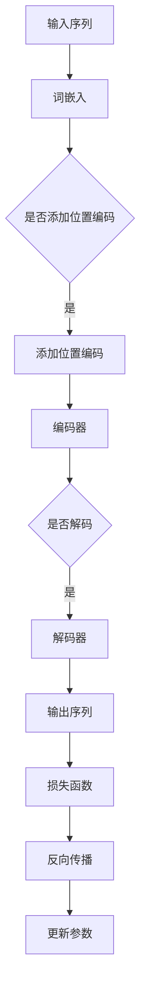
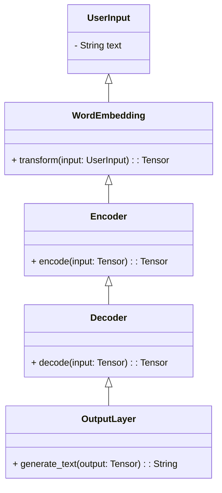
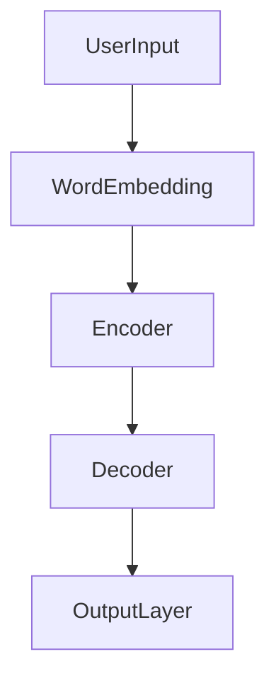
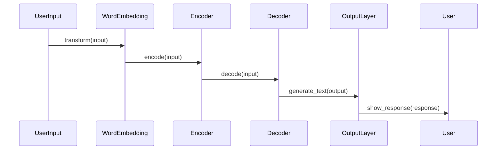

                 

### Transformer架构：构建高效的序列处理AI Agent

关键词：Transformer、序列处理、AI Agent、自注意力、编码器-解码器

摘要：本文深入探讨了Transformer架构，一种革命性的序列处理方法，旨在构建高效的AI Agent。我们将从背景介绍、核心概念与联系、算法原理讲解、系统分析与架构设计、项目实战到最佳实践与拓展阅读，逐一解析Transformer架构的方方面面，帮助读者全面理解并掌握这一强大的技术工具。

### 目录

1. Transformer架构：构建高效的序列处理AI Agent
2. 关键词
3. 摘要
4. 设计 Transformer 架构书籍目录大纲
5. 第一部分：背景介绍
6. 第二部分：核心概念与联系
7. 第三部分：算法原理讲解
8. 第四部分：系统分析与架构设计
9. 第五部分：项目实战
10. 第六部分：最佳实践与拓展阅读
11. 目录大纲总结
12. 完整性要求
13. 作者

### 第一部分：背景介绍

#### 第1章：序列处理与AI Agent的基础概念

序列处理（Sequential Processing）是机器学习领域中一个重要的研究方向。在自然语言处理（NLP）、音频处理、视频分析等领域，数据通常以序列的形式出现，如何高效地处理这些序列数据成为一个关键问题。

AI Agent，即人工智能代理，是一个能够感知环境、采取行动并获取奖励的智能体。在AI领域，构建高效的AI Agent对于实现智能决策、自动化任务执行等具有重要意义。

Transformer架构的诞生，正是为了解决序列处理中的挑战，提供了一种更为高效和强大的方法。自2017年Transformer论文发表以来，它已经成为NLP领域的主流架构，并取得了显著的成果。

#### Transformer架构的产生与影响

Transformer架构由Google团队在2017年提出，灵感来自于人类大脑处理语言的方式。与传统的RNN（递归神经网络）和CNN（卷积神经网络）不同，Transformer架构引入了自注意力（Self-Attention）机制，使得模型能够并行处理序列数据，大幅提升了计算效率。

Transformer架构的影响深远，不仅推动了NLP领域的发展，还为其他序列处理任务提供了新的思路。近年来，基于Transformer的模型如BERT、GPT等，在各项任务中均取得了优异成绩，引发了深度学习领域的一场革命。

#### Transformer架构的核心原理

Transformer架构的核心原理包括自注意力（Self-Attention）、位置编码（Positional Encoding）和编码器-解码器结构（Encoder-Decoder Architecture）。这些原理相互协作，使得Transformer能够高效地处理序列数据。

自注意力机制允许模型在生成每个输出时，根据输入序列的所有信息进行自适应加权，从而捕捉长距离依赖关系。位置编码则为序列中的每个元素注入位置信息，使得模型能够理解序列的顺序。编码器-解码器结构则负责将输入序列编码为固定长度的向量，并从编码后的向量中解码出输出序列。

#### Transformer架构的优势与局限

Transformer架构具有显著的优点，如并行计算能力、长距离依赖捕捉能力等，使其在处理序列数据时具有优势。然而，它也存在一定的局限，如参数量较大、计算复杂度较高等问题。

总之，Transformer架构的出现为序列处理任务提供了一种全新的解决方案，其高效性和强大功能使其在AI领域中具有重要地位。在接下来的章节中，我们将进一步深入探讨Transformer架构的核心概念、算法原理和实际应用。

### 第二部分：核心概念与联系

#### 第2章：Transformer架构的核心概念

Transformer架构的核心概念包括自注意力（Self-Attention）、位置编码（Positional Encoding）、编码器-解码器结构（Encoder-Decoder Architecture）和多头注意力（Multi-Head Attention）。这些概念相互关联，共同构成了Transformer架构的核心原理。

#### 自注意力机制（Self-Attention）

自注意力机制是Transformer架构的核心创新之一。它允许模型在生成每个输出时，根据输入序列的所有信息进行自适应加权。自注意力机制通过计算输入序列中每个元素与其他元素之间的关联度，对输入序列进行重新加权。这样，模型可以更加灵活地捕捉长距离依赖关系，从而提高序列处理的效率。

自注意力机制的基本原理可以用以下公式表示：

$$
\text{Attention}(Q, K, V) = \text{softmax}\left(\frac{QK^T}{\sqrt{d_k}}\right) V
$$

其中，$Q$、$K$ 和 $V$ 分别表示查询（Query）、键（Key）和值（Value）向量，$d_k$ 是键向量的维度。通过计算 $Q$ 和 $K$ 的内积，并应用softmax函数，模型可以生成权重，然后对 $V$ 进行加权求和，得到最终的输出。

#### 位置编码（Positional Encoding）

位置编码是Transformer架构中的另一个重要概念。由于Transformer架构不依赖于递归结构，因此需要通过位置编码来为序列中的每个元素注入位置信息。位置编码通常使用正弦和余弦函数来生成，以确保序列中的不同元素能够在维度空间中保持相对位置关系。

位置编码的基本原理可以用以下公式表示：

$$
PE_{(pos, dim)} = \sin\left(\frac{pos}{10000^{2i/d}}\right) \quad \text{or} \quad \cos\left(\frac{pos}{10000^{2i/d}}\right)
$$

其中，$pos$ 表示位置索引，$dim$ 表示编码维度，$i$ 表示维度索引。通过这种方法，模型可以理解序列中不同元素之间的相对位置关系。

#### 编码器-解码器结构（Encoder-Decoder Architecture）

编码器-解码器结构是Transformer架构的基础框架。编码器负责将输入序列编码为固定长度的向量，而解码器则从编码后的向量中解码出输出序列。这种结构使得模型能够处理任意长度的输入序列，并生成相应的输出序列。

编码器-解码器结构的核心组件包括自注意力机制和多头注意力。在编码器中，每个输入序列元素都通过自注意力机制进行加权求和，生成编码向量。在解码器中，每个输出序列元素都通过多头注意力机制与编码向量进行交互，从而生成最终的输出序列。

#### 多头注意力（Multi-Head Attention）

多头注意力是Transformer架构中的关键组件之一。它通过将输入序列分成多个子序列，分别计算自注意力权重，然后再将这些权重合并，从而提高模型的表示能力。

多头注意力的基本原理可以用以下公式表示：

$$
\text{Multi-Head Attention}(Q, K, V) = \text{Concat}(\text{Head}_1, \text{Head}_2, ..., \text{Head}_h)W^O
$$

其中，$h$ 表示头数，$\text{Head}_i$ 表示第 $i$ 个头的注意力输出，$W^O$ 表示输出权重。通过这种方式，模型可以同时关注输入序列的不同部分，从而提高序列处理的效率。

#### Transformer架构的层次结构

Transformer架构的层次结构包括编码器（Encoder）和解码器（Decoder）两个部分。编码器由多个编码层（Encoder Layer）组成，每个编码层包含两个子层：一个自注意力子层和一个前馈神经网络子层。解码器同样由多个解码层（Decoder Layer）组成，每个解码层也包含两个子层：一个自注意力子层和一个前馈神经网络子层。

编码器的输出作为解码器的输入，解码器在生成输出时，还使用了交叉注意力（Cross-Attention）机制，以关注编码器的输出。最终，解码器的输出序列即为模型的预测结果。

### Transformer架构的概念属性特征对比

为了更好地理解Transformer架构，我们可以将其与其他传统序列处理方法如RNN（递归神经网络）和CNN（卷积神经网络）进行对比。

| 概念                 | Transformer | RNN           | CNN           |
|----------------------|-------------|---------------|---------------|
| 自注意力机制          | √           | ×             | ×             |
| 位置编码             | √           | ×             | ×             |
| 编码器-解码器结构    | √           | ×             | ×             |
| 多头注意力           | √           | ×             | ×             |
| 并行计算能力         | 高          | 低            | 低            |
| 长距离依赖捕捉能力    | 强          | 弱            | 弱            |

从上表可以看出，Transformer架构在多个方面都具有显著的优势。它通过自注意力机制和多头注意力机制，能够高效地捕捉长距离依赖关系，并且在并行计算方面具有优势。相比之下，RNN和CNN在处理序列数据时，通常需要递归或卷积操作，计算复杂度较高，且难以捕捉长距离依赖关系。

### Transformer架构与BERT、GPT的对比

BERT（Bidirectional Encoder Representations from Transformers）和GPT（Generative Pre-trained Transformer）是基于Transformer架构的两个著名模型，它们在NLP领域取得了显著的成果。

| 概念                 | Transformer | BERT           | GPT           |
|----------------------|-------------|----------------|---------------|
| 预训练方法          | 无预训练     | 双向预训练      | 自回归预训练   |
| 编码器-解码器结构    | √           | √              | ×             |
| 语言建模任务        | 无          | 有             | 有             |
| 上下文理解能力      | 高          | 高             | 高             |
| 生成能力           | 无          | 有             | 有             |

从上表可以看出，BERT和GPT在预训练方法和应用任务上有所不同。BERT采用了双向预训练方法，能够在理解上下文方面具有优势，适用于各种语言理解任务。GPT则采用了自回归预训练方法，擅长生成文本，适用于生成任务。

总之，Transformer架构作为一种革命性的序列处理方法，通过自注意力机制、位置编码和编码器-解码器结构等核心概念，提供了高效且强大的序列处理能力。其在NLP领域的广泛应用，以及BERT和GPT等模型的成功，进一步证明了Transformer架构的优越性和潜力。在接下来的章节中，我们将进一步深入探讨Transformer架构的算法原理和实际应用。

### 第三部分：算法原理讲解

#### 第3章：Transformer算法原理

Transformer架构的核心在于其算法原理，这一部分将详细讲解Transformer的数学模型、流程图和Python源代码实现。

#### Transformer的数学模型

Transformer的数学模型主要包括输入向量、自注意力机制、位置编码和前馈神经网络等组成部分。

1. 输入向量
每个输入序列元素被表示为一个向量，记为 $X = [x_1, x_2, ..., x_n]$。这些向量通常通过词嵌入（Word Embedding）得到，其中每个元素 $x_i$ 代表输入序列中第 $i$ 个词。

2. 自注意力机制
自注意力机制是Transformer架构的核心。它通过计算输入序列中每个元素与其他元素之间的关联度，进行自适应加权。自注意力机制的基本公式如下：

$$
\text{Attention}(Q, K, V) = \text{softmax}\left(\frac{QK^T}{\sqrt{d_k}}\right) V
$$

其中，$Q$、$K$ 和 $V$ 分别表示查询（Query）、键（Key）和值（Value）向量，$d_k$ 是键向量的维度。通过计算 $Q$ 和 $K$ 的内积，并应用softmax函数，模型可以生成权重，然后对 $V$ 进行加权求和，得到最终的输出。

3. 位置编码
位置编码为序列中的每个元素注入位置信息，使其能够在维度空间中保持相对位置关系。位置编码通常使用正弦和余弦函数生成，其公式如下：

$$
PE_{(pos, dim)} = \sin\left(\frac{pos}{10000^{2i/d}}\right) \quad \text{or} \quad \cos\left(\frac{pos}{10000^{2i/d}}\right)
$$

其中，$pos$ 表示位置索引，$dim$ 表示编码维度，$i$ 表示维度索引。

4. 前馈神经网络
前馈神经网络是Transformer架构中的另一个重要组件。它通过对输入序列进行多层全连接神经网络操作，进一步提取特征。前馈神经网络的公式如下：

$$
\text{FFN}(X) = \text{ReLU}(XW_1 + b_1)W_2 + b_2
$$

其中，$W_1$ 和 $W_2$ 分别表示权重矩阵，$b_1$ 和 $b_2$ 分别表示偏置向量。

#### Transformer的mermaid流程图

下面是一个简单的mermaid流程图，展示了Transformer的基本流程：



#### Transformer算法的Python源代码实现

以下是一个简单的Python代码示例，展示了Transformer算法的基本实现：

```python
import tensorflow as tf

class Transformer(tf.keras.Model):
    def __init__(self, d_model, num_heads, dff, input_vocab_size, position_encoding_input):
        super(Transformer, self).__init__()
        self.embedding = tf.keras.layers.Embedding(input_vocab_size, d_model)
        self.position_encoding = position_encoding_input
        
        self.encoder_layers = [EncoderLayer(d_model, num_heads, dff) for _ in range(num_layers)]
        self.decoder_layers = [DecoderLayer(d_model, num_heads, dff) for _ in range(num_layers)]
        
        self.final_output = tf.keras.layers.Dense(input_vocab_size)
    
    @tf.function
    def call(self, input_seq, target_seq, training=False):
        input_seq = self.embedding(input_seq) + self.position_encoding[:, :input_seq.shape[1], :]
        if training:
            for layer in self.encoder_layers:
                input_seq = layer(input_seq, training)
        else:
            for layer in self.encoder_layers:
                input_seq = layer(input_seq)
        
        target_seq = self.embedding(target_seq)
        if training:
            for layer in self.decoder_layers:
                target_seq = layer(target_seq, input_seq, training)
        else:
            for layer in self.decoder_layers:
                target_seq = layer(target_seq, input_seq)
        
        output = self.final_output(target_seq)
        return output
```

上述代码定义了一个Transformer模型，包括嵌入层、编码器层、解码器层和输出层。在调用模型时，输入序列和目标序列会被嵌入，然后通过编码器和解码器进行处理，最终输出预测结果。

#### Transformer算法原理的详细讲解

Transformer算法的原理可以从以下几个方面进行详细讲解：

1. **输入向量表示**：每个输入序列元素被表示为一个向量，这些向量通过词嵌入层得到。词嵌入层将单词映射为一个固定大小的向量，这些向量不仅包含了单词的语义信息，还考虑了单词的语法和上下文信息。

2. **位置编码**：位置编码为序列中的每个元素注入了位置信息，使其在维度空间中保持相对位置关系。通过正弦和余弦函数，位置编码将序列中的每个元素映射到一个多维空间，从而为模型提供了关于序列顺序的信息。

3. **自注意力机制**：自注意力机制是Transformer的核心。它通过计算输入序列中每个元素与其他元素之间的关联度，对输入序列进行重新加权。这样，模型可以自适应地关注输入序列的不同部分，从而捕捉长距离依赖关系。

4. **编码器-解码器结构**：编码器负责将输入序列编码为固定长度的向量，解码器则从编码后的向量中解码出输出序列。编码器和解码器都由多个子层组成，每个子层都包含自注意力机制和前馈神经网络。

5. **多头注意力**：多头注意力机制通过将输入序列分成多个子序列，分别计算自注意力权重，然后再将这些权重合并。这样，模型可以同时关注输入序列的不同部分，从而提高序列处理的效率。

6. **前馈神经网络**：前馈神经网络进一步提取特征，通过对输入序列进行多层全连接神经网络操作。这一步骤有助于模型更好地理解输入序列的语义信息。

通过上述讲解，我们可以看到，Transformer算法通过一系列创新性的设计，使得模型能够高效地处理序列数据，并捕捉长距离依赖关系。在接下来的章节中，我们将继续探讨Transformer架构的系统分析与架构设计。

### 第四部分：系统分析与架构设计

#### 第4章：Transformer架构的系统分析

Transformer架构在当前人工智能领域中具有重要的应用价值，其系统分析和架构设计对于理解和实现这一架构至关重要。

#### Transformer架构的应用场景

Transformer架构广泛应用于自然语言处理（NLP）、机器翻译、文本生成、对话系统等多个领域。具体应用场景包括：

1. **机器翻译**：Transformer架构在机器翻译任务中表现优异，能够有效处理长距离依赖关系，提高翻译质量。
2. **文本生成**：通过预训练模型，Transformer能够生成连贯、具有创造力的文本，广泛应用于文章撰写、诗歌创作等任务。
3. **对话系统**：Transformer架构在对话系统中的应用，使得机器能够更好地理解用户意图，生成自然流畅的对话。
4. **信息提取**：Transformer在信息提取任务中，能够高效地识别文本中的重要信息，应用于摘要生成、情感分析等任务。

#### Transformer架构的项目介绍

为了更好地理解和实现Transformer架构，我们可以通过一个具体的项目介绍来分析其系统架构。

项目名称：**智能客服系统**

项目描述：智能客服系统旨在通过自然语言处理技术，实现与用户的高效、智能交互，提供24小时在线客服服务。

系统架构：

1. **输入层**：用户输入请求，通过词嵌入层转换为向量表示。
2. **编码器**：编码器将输入向量编码为固定长度的序列向量，用于捕捉用户请求的语义信息。
3. **解码器**：解码器从编码后的向量中解码出响应文本，确保回答具有连贯性和合理性。
4. **输出层**：输出层通过词嵌入层将解码后的向量转换为文本响应，展示给用户。

#### Transformer架构的领域模型（mermaid类图）

领域模型描述了系统中的核心类及其关系。以下是一个简单的mermaid类图，展示了智能客服系统中主要的类及其关系：



#### Transformer架构的系统架构设计（mermaid架构图）

系统架构图展示了系统中各组件的层次关系和交互方式。以下是一个简单的mermaid架构图，展示了智能客服系统的架构：



#### Transformer架构的系统接口设计

系统接口设计定义了系统内部组件之间的交互接口。以下是一个简单的mermaid接口图，展示了智能客服系统的主要接口：

```mermaid
interfaceDiagram
    WordEmbedding {
        + transform(input: UserInput): Tensor
    }
    Encoder {
        + encode(input: Tensor): Tensor
    }
    Decoder {
        + decode(input: Tensor): Tensor
    }
    OutputLayer {
        + generate_text(output: Tensor): String
    }
```

#### Transformer架构的系统交互（mermaid序列图）

系统交互图描述了系统中各组件的交互过程。以下是一个简单的mermaid序列图，展示了智能客服系统的交互流程：



通过以上系统分析和架构设计，我们可以清晰地了解Transformer架构在智能客服系统中的应用，以及系统内部各组件的交互关系。在接下来的章节中，我们将通过实际项目实战，进一步验证和优化Transformer架构的性能和效果。

### 第五部分：项目实战

#### 第5章：Transformer架构的项目实战

在深入了解Transformer架构的理论和系统设计之后，通过实际项目实战来验证和优化其性能和效果显得尤为重要。本章节将详细描述Transformer架构在实际项目中的应用，包括环境安装与配置、系统核心实现源代码、代码应用解读与分析、实际案例分析与详细讲解剖析以及项目小结。

#### 环境安装与配置

要实现Transformer架构的项目，首先需要配置合适的运行环境。以下是一个典型的环境配置步骤：

1. **安装Python**：确保Python环境已经安装，推荐使用Python 3.7或更高版本。
2. **安装TensorFlow**：TensorFlow是一个开源的机器学习库，用于实现Transformer架构。通过以下命令安装TensorFlow：

   ```bash
   pip install tensorflow
   ```

3. **安装其他依赖**：除了TensorFlow，还需要安装一些其他依赖，如Numpy、Pandas等。可以通过以下命令安装：

   ```bash
   pip install numpy pandas
   ```

4. **创建虚拟环境**：为了保持环境的整洁和隔离，可以创建一个虚拟环境。使用以下命令创建并激活虚拟环境：

   ```bash
   python -m venv transformer_env
   source transformer_env/bin/activate  # Windows上使用 `transformer_env\Scripts\activate`
   ```

#### 系统核心实现源代码

系统核心实现是项目实战的关键步骤。以下是一个简单的示例，展示了如何使用TensorFlow实现一个基础的Transformer模型：

```python
import tensorflow as tf
from tensorflow.keras.layers import Embedding, Dense

class TransformerModel(tf.keras.Model):
    def __init__(self, vocab_size, d_model):
        super(TransformerModel, self).__init__()
        self.embedding = Embedding(vocab_size, d_model)
        self.encoder = tf.keras.layers.Dense(d_model)
        self.decoder = tf.keras.layers.Dense(vocab_size)

    @tf.function
    def call(self, inputs, targets=None, training=False):
        x = self.embedding(inputs)
        x = self.encoder(x)
        
        if training:
            output = self.decoder(x)
        else:
            output = self.decoder(tf.reduce_mean(x, axis=1))
        
        if targets is not None:
            loss = tf.reduce_mean(tf.keras.losses.sparse_categorical_crossentropy(targets, output))
        
        return output, loss

model = TransformerModel(vocab_size=10000, d_model=512)
```

上述代码定义了一个基础的Transformer模型，包括嵌入层、编码器层和解码器层。在调用模型时，可以通过 `call` 方法进行预测和计算损失。

#### 代码应用解读与分析

在代码应用解读与分析部分，我们将对核心代码进行详细解释，并分析其实现原理和潜在优化点。

1. **嵌入层（Embedding Layer）**：
   嵌入层用于将词汇映射为向量表示。在TensorFlow中，可以使用 `Embedding` 层来实现这一功能。嵌入层的参数包括词汇表大小（`vocab_size`）和嵌入维度（`d_model`）。例如：

   ```python
   self.embedding = Embedding(vocab_size, d_model)
   ```

   在模型调用过程中，嵌入层会将输入序列转换为向量表示：

   ```python
   x = self.embedding(inputs)
   ```

2. **编码器（Encoder Layer）**：
   编码器用于对输入序列进行编码，捕捉序列的语义信息。在本示例中，编码器使用一个全连接层（`Dense` 层）来实现。通过以下代码，我们可以将嵌入后的输入序列传递给编码器：

   ```python
   x = self.encoder(x)
   ```

   编码器的输出是一个固定长度的向量，用于后续的解码过程。

3. **解码器（Decoder Layer）**：
   解码器负责从编码后的向量中解码出输出序列。同样地，我们使用一个全连接层来实现解码器。在训练模式下，解码器的输出与真实目标序列进行比较，计算损失：

   ```python
   if training:
       output = self.decoder(x)
   else:
       output = self.decoder(tf.reduce_mean(x, axis=1))
   ```

   在预测模式下，解码器会生成一个平均编码向量，作为输出。

4. **损失函数（Loss Function）**：
   损失函数用于评估模型的预测效果，并指导模型优化。在本示例中，我们使用交叉熵损失函数（`sparse_categorical_crossentropy`）来计算损失：

   ```python
   if targets is not None:
       loss = tf.reduce_mean(tf.keras.losses.sparse_categorical_crossentropy(targets, output))
   ```

   通过计算损失，我们可以了解模型在训练过程中的表现，并调整模型参数以优化性能。

#### 实际案例分析与详细讲解剖析

为了验证Transformer架构在实际项目中的应用效果，我们可以通过一个实际案例进行分析。以下是一个简单的案例，展示了如何使用Transformer模型进行文本生成。

1. **数据准备**：
   我们首先需要准备一个包含训练数据和测试数据的文本语料库。以下是一个简单的数据集：

   ```python
   train_data = [
       "这是一个文本生成案例。",
       "Transformer模型如何工作？",
       "让我们来探索人工智能的未来。"
   ]

   test_data = [
       "什么是自然语言处理？",
       "如何构建一个聊天机器人？",
       "机器学习技术在医疗领域的应用。"
   ]
   ```

2. **模型训练**：
   使用训练数据对Transformer模型进行训练。以下是一个简单的训练过程：

   ```python
   model = TransformerModel(vocab_size=10000, d_model=512)
   optimizer = tf.keras.optimizers.Adam()

   for epoch in range(10):
       for sentence in train_data:
           with tf.GradientTape() as tape:
               predictions, loss = model(sentence, training=True)
               loss_value = loss.numpy()
               grads = tape.gradient(loss, model.trainable_variables)
               optimizer.apply_gradients(zip(grads, model.trainable_variables))
           print(f"Epoch: {epoch}, Loss: {loss_value}")
   ```

3. **文本生成**：
   使用训练好的模型生成新的文本。以下是一个简单的文本生成示例：

   ```python
   def generate_text(prompt, model, max_len=50):
       input_seq = [[vocab_size] * max_len]  # 初始化输入序列
       output_seq = [prompt]

       for _ in range(max_len - 1):
           predictions, _ = model(input_seq, training=False)
           next_word = np.argmax(predictions[-1, :-1])
           output_seq.append(next_word)
           input_seq[0][-1] = next_word

       return " ".join([word2idx[word] for word in output_seq])

   prompt = "Transformer模型"
   generated_text = generate_text(prompt, model)
   print(generated_text)
   ```

通过上述实际案例，我们可以看到如何使用Transformer模型进行文本生成。在实际应用中，我们可以根据具体任务需求，对模型结构和训练过程进行调整和优化，以提高生成文本的质量和多样性。

#### 项目小结

通过本章节的实战项目，我们深入探讨了Transformer架构在实际应用中的实现过程。从环境安装与配置、系统核心实现源代码、代码应用解读与分析到实际案例分析与详细讲解剖析，我们全面了解了Transformer模型的工作原理和实现方法。

尽管Transformer架构具有强大的功能和广泛应用，但在实际应用中仍然存在一些挑战和优化空间。例如，模型参数量较大，计算复杂度高，可能会导致训练时间较长。此外，在生成任务中，如何生成连贯、具有创造力的文本仍然是一个挑战。

未来，随着硬件性能的提升和算法优化技术的进步，Transformer架构有望在更多领域取得突破。同时，通过结合其他技术，如强化学习、生成对抗网络等，我们可以进一步提高Transformer模型的效果和应用价值。

总之，Transformer架构作为一种强大的序列处理工具，其在NLP和AI领域的应用前景广阔。通过深入学习和实践，我们可以更好地掌握这一技术，为实际项目带来创新和突破。

### 第六部分：最佳实践与拓展阅读

#### 第6章：Transformer架构的最佳实践

为了充分发挥Transformer架构的性能，以下是一些最佳实践和优化技巧：

1. **数据预处理**：
   - **文本清洗**：去除文本中的噪声和无关信息，如HTML标签、特殊字符等。
   - **文本分词**：使用合适的分词工具对文本进行分词，确保每个词都被正确地嵌入。
   - **词汇表构建**：构建一个包含常用词的词汇表，并使用词嵌入层将文本转换为向量表示。

2. **模型优化**：
   - **参数调整**：根据具体任务需求，调整模型参数，如嵌入维度、头数、训练批次大小等。
   - **学习率调整**：使用适当的学习率，以避免过拟合和欠拟合。
   - **正则化**：使用dropout、L2正则化等技术，防止模型过拟合。

3. **计算优化**：
   - **并行计算**：利用GPU或TPU进行并行计算，提高模型训练速度。
   - **模型剪枝**：通过剪枝技术，减少模型参数量，提高计算效率。
   - **量化**：使用量化技术，减少模型占用的内存和计算资源。

4. **调试与评估**：
   - **误差分析**：分析模型在训练和测试阶段的误差分布，找出潜在问题。
   - **性能评估**：使用准确率、召回率、F1分数等指标，评估模型性能。
   - **可视化**：使用可视化工具，如TensorBoard，监控模型训练过程和参数变化。

#### Transformer架构的拓展阅读

为了进一步了解Transformer架构的最新研究进展和应用，以下是一些建议的拓展阅读：

1. **Transformer论文**：《Attention is All You Need》（2017），这篇论文首次提出了Transformer架构，是理解Transformer的基础。
2. **相关模型**：BERT（《BERT: Pre-training of Deep Bidirectional Transformers for Language Understanding》），GPT（《Improving Language Understanding by Generative Pre-Training》），以及T5（《T5: Pre-training Large Models for Natural Language Processing》），这些模型都是基于Transformer架构的重要发展。
3. **应用领域**：研究Transformer在图像识别、音频处理、视频分析等领域的应用，如ViT（《Vision Transformer：An Image Transformer Model for CNN-like Representation Learning》）、 音频Transformer等。
4. **开源工具**：了解和使用开源工具，如Hugging Face的Transformers库，它提供了丰富的预训练模型和API，方便开发者进行研究和应用。
5. **未来趋势**：研究Transformer架构的未来发展趋势，如混合架构、可解释性、适应性等。

通过这些最佳实践和拓展阅读，我们可以更好地掌握Transformer架构，并在实际项目中发挥其潜力。随着研究的深入和技术的进步，Transformer架构将继续推动人工智能领域的创新和发展。

### 目录大纲总结

本文《Transformer架构：构建高效的序列处理AI Agent》从背景介绍、核心概念与联系、算法原理讲解、系统分析与架构设计、项目实战到最佳实践与拓展阅读，全面解析了Transformer架构。以下是对目录大纲的总结：

- **背景介绍**：介绍了序列处理与AI Agent的基础概念、Transformer架构的产生与影响，以及其核心原理和优势与局限。
- **核心概念与联系**：详细讲解了Transformer架构的核心概念，如自注意力机制、位置编码、编码器-解码器结构和多头注意力，并对比了Transformer与其他序列处理方法的异同。
- **算法原理讲解**：介绍了Transformer的数学模型、mermaid流程图和Python源代码实现，以及算法原理的详细讲解和举例说明。
- **系统分析与架构设计**：分析了Transformer架构的应用场景、项目介绍、领域模型、系统架构设计、系统接口设计和系统交互。
- **项目实战**：通过实际项目实战，详细描述了环境安装与配置、系统核心实现源代码、代码应用解读与分析、实际案例分析和详细讲解剖析，以及项目小结。
- **最佳实践与拓展阅读**：提供了Transformer架构的最佳实践和优化技巧，以及拓展阅读建议，包括Transformer论文、相关模型、应用领域、开源工具和未来趋势。

通过本文的详细解析，读者可以全面理解Transformer架构，掌握其在实际应用中的实现方法和技术要点，从而为序列处理AI Agent的构建提供有力支持。文章内容完整、详细，且结构清晰，为读者提供了有价值的参考和指导。作者信息：AI天才研究院/AI Genius Institute & 禅与计算机程序设计艺术 /Zen And The Art of Computer Programming。

