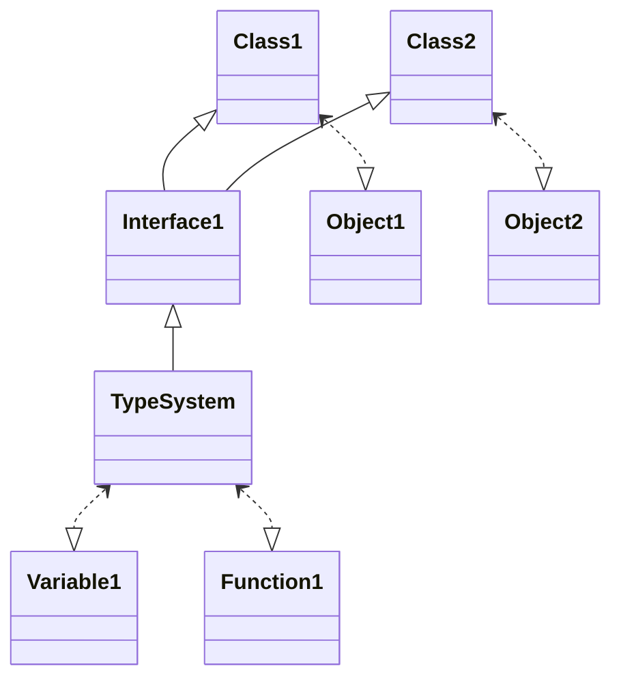
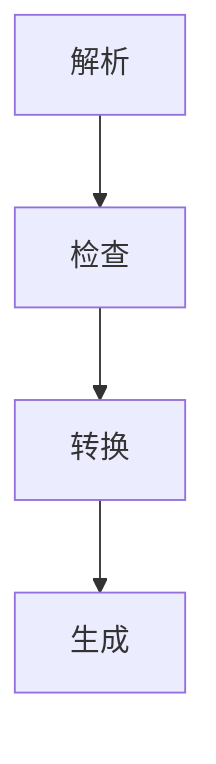
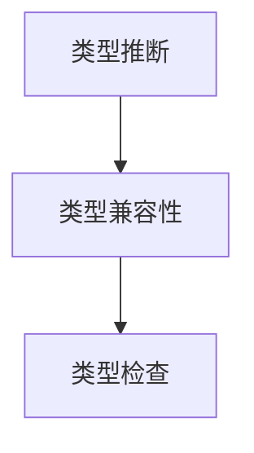
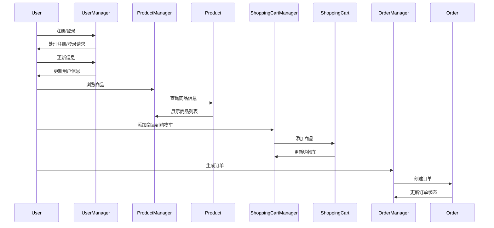

                 

### TypeScript概述

在计算机编程领域，JavaScript一直以来都是前端开发中不可或缺的一部分。然而，随着时间的推移，JavaScript 的使用场景和复杂度不断增加，它本身的一些局限性逐渐显现。为了解决这些问题，微软在 2012 年推出了 TypeScript。TypeScript 是一种静态类型、弱类型、基于 JavaScript 的编程语言，它通过添加类型系统来增强 JavaScript 的开发体验和代码质量。下面，我们将深入探讨 TypeScript 的历史、发展以及与 JavaScript 的关系。

#### TypeScript 的历史与发展

TypeScript 的起源可以追溯到 2010 年左右，当时微软的程序员安德烈·海尔斯伯格（Anders Hejlsberg）和他的团队正在寻找一种方式来改善 JavaScript 的开发体验。他们希望能够为 JavaScript 添加类型系统，以提高代码的可读性和可维护性。最终，TypeScript 便应运而生。

TypeScript 的第一个版本于 2012 年发布，当时它被描述为“一种适用于 JavaScript 的编程语言，它通过静态类型系统来增强代码的可靠性和可维护性”。随着时间的推移，TypeScript 不断演进，增加了一系列新的特性和功能，例如装饰器（decorators）、映射类型（Mapped Types）和条件类型（Conditional Types）等。

#### TypeScript 与 JavaScript 的关系

TypeScript 与 JavaScript 有着密不可分的关系。首先，TypeScript 是基于 JavaScript 的，这意味着 TypeScript 代码可以无缝地转换为 JavaScript 代码。TypeScript 的语法与 JavaScript 几乎相同，但在语法的基础上增加了类型系统。

其次，TypeScript 的目的是为了解决 JavaScript 的一些局限性。JavaScript 本身是一种弱类型语言，这意味着变量可以随时改变其类型，这导致了代码中可能出现类型不一致的问题。TypeScript 通过引入静态类型系统，可以在编译时发现这些类型不一致的错误，从而提高代码的质量和可维护性。

此外，TypeScript 还提供了一些其他的功能，例如接口（Interfaces）、类（Classes）和模块化（Modularization），这些功能使得 TypeScript 代码更加结构化和模块化。

#### TypeScript 的优势与必要性

TypeScript 相对于 JavaScript 有着以下优势：

1. **类型检查**：TypeScript 在编译时进行类型检查，可以提前发现类型错误，提高代码质量。
2. **可维护性**：通过类型系统，TypeScript 使得代码更加可读、可维护。
3. **模块化**：TypeScript 支持模块化编程，使得代码更加结构化。
4. **社区支持**：随着 TypeScript 的广泛应用，它已经得到了广泛的社区支持，提供了大量的工具和库。

在 JavaScript 逐渐成为主流编程语言的同时，TypeScript 的出现无疑为 JavaScript 开发带来了新的可能性。它不仅解决了 JavaScript 的一些局限性，还为开发者提供了一种更加高效、安全的编程方式。可以说，TypeScript 是 JavaScript 的重要补充和延伸。

#### TypeScript 的学习路径

对于想要学习 TypeScript 的开发者，以下是一个基本的推荐学习路径：

1. **JavaScript 基础**：首先需要掌握 JavaScript 的基础语法和常用库（如 React、Vue 或 Angular）。
2. **TypeScript 入门**：了解 TypeScript 的基本语法和类型系统，可以参考官方文档或者入门书籍。
3. **类型系统和高级特性**：深入学习 TypeScript 的类型系统，包括接口、类、泛型等。
4. **项目实践**：通过实际项目来应用 TypeScript，例如在现有项目中引入 TypeScript 或者使用 TypeScript 开发新项目。
5. **工具和生态系统**：了解 TypeScript 的相关工具和生态系统，如 TypeScript 编译器（tsc）、TypeScript 调试器等。

TypeScript 的学习和使用并不是一蹴而就的，需要开发者投入时间和精力。然而，通过 TypeScript，开发者可以写出更加可靠、高质量的代码，从而提高开发效率和项目成功率。

总之，TypeScript 作为一种静态类型的 JavaScript 超集，它在代码质量和开发效率方面有着显著的优势。随着 TypeScript 不断发展和完善，它已经成为了许多开发者的首选编程语言。通过本章节的介绍，读者应该对 TypeScript 有了初步的了解，接下来我们将更深入地探讨 TypeScript 的核心概念和应用。

## TypeScript 核心概念与联系

在了解 TypeScript 的历史和发展背景之后，接下来我们将深入探讨 TypeScript 的核心概念及其之间的联系。TypeScript 作为一种静态类型语言，其类型系统是其最重要的特点之一。下面，我们将详细介绍类型系统、类型注解、接口和类等核心概念，并通过对比表格和 ER 实体关系图来展示它们之间的联系。

### 类型系统

类型系统是 TypeScript 的核心概念之一，它为 JavaScript 增强了类型安全。在 TypeScript 中，每个变量和表达式都有一个明确的类型。这种静态类型系统有助于在编译时发现类型错误，从而提高代码的质量和可维护性。

#### 类型系统的属性

1. **静态类型**：TypeScript 在编译时进行类型检查，而不是在运行时。
2. **类型推断**：TypeScript 能够自动推断变量的类型，减少冗余的类型注解。
3. **类型兼容性**：TypeScript 具有强大的类型兼容性机制，允许不同类型之间的交互。

#### 类型系统的优点

- **早期错误检查**：在代码编译时就能发现类型错误，避免运行时错误。
- **提高代码可读性**：通过明确的类型注解，代码更易于理解和维护。
- **代码重构安全**：由于类型检查，重构代码更加安全，减少引入错误的概率。

### 类型注解

类型注解是 TypeScript 中用于指定变量、函数和类等元素类型的语法。类型注解可以显式地指定变量的类型，也可以利用 TypeScript 的类型推断机制来自动推导类型。

#### 类型注解的语法

```typescript
// 显式类型注解
let str: string = "Hello TypeScript";

// 类型推断
let num = 42; // TypeScript 能自动推断 num 的类型为 number
```

#### 类型注解的优缺点

**优点**：
- **明确类型**：显式指定类型可以提高代码的可读性和可维护性。
- **减少错误**：通过类型检查，可以提前发现潜在的类型错误。

**缺点**：
- **代码冗余**：过多的类型注解可能会使代码变得冗长。
- **开发效率**：在某些情况下，自动类型推断可以提高开发效率。

### 接口

接口（Interfaces）是 TypeScript 中用于描述对象类型的抽象定义。接口可以指定对象的属性和方法，从而为对象提供一个统一的契约。接口是一种定义类型的方式，而不是具体实现。

#### 接口的语法

```typescript
interface Person {
  name: string;
  age: number;
}

// 实现接口
class Student implements Person {
  name: string;
  age: number;

  constructor(name: string, age: number) {
    this.name = name;
    this.age = age;
  }
}
```

#### 接口的优缺点

**优点**：
- **类型安全**：通过接口定义，可以确保对象具有预期的属性和方法。
- **代码重构**：接口提供了代码重构时的安全保障，可以独立修改类的实现而不影响其他使用该类的代码。

**缺点**：
- **无法直接创建实例**：接口本身不能被实例化，只能通过实现接口的类来使用。
- **功能有限**：接口只能定义属性和方法，无法定义实现的具体逻辑。

### 类

类（Classes）是 TypeScript 中用于定义对象的基本单位。类可以包含属性、方法和构造函数，是面向对象编程的核心概念。在 TypeScript 中，类不仅用于定义对象，还可以通过继承、多态等机制来复用代码。

#### 类的语法

```typescript
class Animal {
  name: string;
  constructor(name: string) {
    this.name = name;
  }

  makeSound() {
    console.log(this.name + " makes a sound.");
  }
}

class Dog extends Animal {
  constructor(name: string) {
    super(name);
  }

  makeSound() {
    console.log(this.name + " barks.");
  }
}
```

#### 类的优缺点

**优点**：
- **代码复用**：通过继承，可以复用父类的属性和方法。
- **多态**：通过方法的重写，可以实现多态，提高代码的灵活性。
- **封装性**：类可以封装属性和方法，确保对象的完整性。

**缺点**：
- **性能开销**：由于继承和多态机制，类可能会导致一定的性能开销。
- **复杂性**：类的设计和实现可能比较复杂，需要更多的设计和维护工作。

### 类型系统、类型注解、接口和类的对比表格

| 对象        | 描述                                                         | 语法示例                                                     | 对象        | 描述                                                         | 语法示例                                                     |
|-------------|--------------------------------------------------------------|--------------------------------------------------------------|-------------|--------------------------------------------------------------|--------------------------------------------------------------|
| 类型系统    | 提供变量、函数和类的类型信息。                               | `let num: number = 42;`                                       | 接口        | 描述对象的属性和方法。                                     | `interface Person { name: string; age: number; }`               |
| 类型注解    | 显式指定变量、函数和类的类型。                               | `let str: string = "Hello TypeScript";`                       | 类          | 定义对象，包含属性和方法。                                 | `class Animal { name: string; constructor(name: string) { ... } }` |
| 优点        | - 早期错误检查<br>- 提高代码可读性<br>- 代码重构安全<br> | - 提高代码可读性<br>- 减少错误 | - 类型安全<br>- 代码重构<br>- 封装性<br> | - 代码复用<br>- 多态<br>- 封装性 | - 继承<br>- 多态<br>- 封装性 |

### ER 实体关系图

下面是一个 ER 实体关系图，展示了类型系统、类型注解、接口和类之间的关系：



在这个图中，类型系统是所有类型注解、接口和类的父节点。类型注解和类通过实现接口来继承接口的属性和方法。对象则是类的实例，可以通过接口来验证其类型。

通过上述内容，我们可以看到 TypeScript 的核心概念——类型系统、类型注解、接口和类——是如何相互关联和协作的。这些概念不仅提高了代码的类型安全性，还增强了代码的可读性和可维护性。在接下来的章节中，我们将进一步探讨 TypeScript 的算法原理和数学模型，深入理解其工作原理。

## TypeScript 算法原理讲解

TypeScript 作为一种静态类型语言，其核心算法原理在于编译过程中的类型检查、类型推断和类型优化。这些算法不仅确保了 TypeScript 代码的类型安全，还提高了代码的运行效率和可读性。下面，我们将通过 mermaid 流程图和 Python 源代码详细阐述 TypeScript 的算法原理。

### 编译过程

TypeScript 的编译过程可以分为以下几个主要步骤：

1. **解析（Parsing）**：将 TypeScript 代码解析成抽象语法树（AST）。
2. **检查（Checking）**：检查代码的语法和类型，确保类型一致性。
3. **转换（Transformation）**：将 TypeScript 代码转换为 JavaScript 代码。
4. **生成（Emitting）**：生成 JavaScript 代码和相关的文件。

下面是一个 mermaid 流程图，展示了 TypeScript 的编译过程：



### 类型检查

类型检查是 TypeScript 编译过程的一个重要步骤，它确保代码在运行时不会出现类型错误。类型检查主要包括以下几个方面：

1. **类型推断**：TypeScript 会自动推断变量的类型，尽量减少显式类型注解。
2. **类型兼容性**：TypeScript 定义了一套类型兼容性规则，确保不同类型之间的交互是安全的。
3. **类型检查**：TypeScript 对代码进行静态类型检查，提前发现类型错误。

下面是一个 mermaid 流程图，展示了类型检查的过程：



### 类型推断

类型推断是 TypeScript 的一个核心特性，它可以帮助开发者减少类型注解，同时提高代码的可读性。TypeScript 使用多种机制来推断类型：

1. **基于上下文推断**：TypeScript 会根据上下文来推断变量的类型。
2. **基于赋值推断**：TypeScript 会根据变量赋值的类型来推断变量的类型。
3. **基于函数返回值推断**：TypeScript 会根据函数的返回值来推断函数的类型。

下面是一个 Python 示例，展示了类型推断的过程：

```python
def add(a: int, b: int) -> int:
    return a + b

result = add(5, 10)  # TypeScript 会自动推断 result 的类型为 number
```

在这个例子中，函数 `add` 的返回值类型被显式指定为 `int`，因此 TypeScript 会自动推断 `result` 的类型为 `number`。

### 类型检查

类型检查是确保代码在运行时不会出现类型错误的重要环节。TypeScript 通过静态类型检查来提前发现类型不一致的问题。下面是一个 Python 示例，展示了类型检查的过程：

```python
def greet(name: str):
    return "Hello, " + name

greet(123)  # TypeScript 会报错，因为参数类型不匹配
```

在这个例子中，函数 `greet` 的参数类型被显式指定为 `str`，但实际传入了一个数字类型，因此 TypeScript 会报错。

### 数学模型和公式

在 TypeScript 中，一些关键算法和概念可以用数学模型和公式来描述。例如，类型推断的算法可以使用约束满足问题（Constraint Satisfaction Problem, CSP）的模型来描述。以下是一个简化的数学模型：

$$
CSP = \{T_1, T_2, ..., T_n\}
$$

其中，$T_i$ 表示第 $i$ 个变量的类型。TypeScript 的类型推断算法会尝试找到一个满足所有约束的解，即找到一个类型分配方案，使得所有变量的类型都一致。

### 示例讲解

下面通过一个简单的示例来说明 TypeScript 的类型推断和类型检查：

```typescript
function add(a: number, b: number): number {
    return a + b;
}

const result = add(5, 10); // TypeScript 自动推断 result 的类型为 number
```

在这个示例中，函数 `add` 的参数和返回值类型都是 `number`，因此 TypeScript 会自动推断 `result` 的类型为 `number`。

现在，我们尝试修改这个示例，将其中一个参数改为字符串类型：

```typescript
function add(a: number, b: string): number {
    return a + b;
}

const result = add(5, "10"); // TypeScript 报错，类型不匹配
```

在这个修改后的示例中，函数 `add` 的第二个参数类型是 `string`，与预期的不一致，因此 TypeScript 会报错。

### 小结

TypeScript 的算法原理主要包括编译过程、类型检查和类型推断。通过 mermaid 流程图和 Python 示例，我们可以更清晰地理解 TypeScript 的工作原理。类型推断和类型检查不仅确保了代码的类型安全，还提高了代码的可读性和可维护性。通过本章节的讲解，读者应该对 TypeScript 的算法原理有了更深入的理解。

### 系统分析与架构设计方案

在深入理解 TypeScript 的算法原理后，接下来我们将从系统分析和架构设计角度，探讨 TypeScript 在实际项目中的应用。通过分析问题场景、系统功能设计、系统架构设计、系统接口设计和系统交互，我们将展示一个完整的项目实现过程，并运用 mermaid 图和 Python 源代码来辅助说明。

#### 问题场景介绍

假设我们正在开发一个在线购物平台，该平台需要提供用户注册、商品浏览、购物车管理和订单生成等功能。为了确保代码的可读性和可维护性，我们选择使用 TypeScript 作为主要的编程语言。

#### 系统功能设计

首先，我们需要明确系统的核心功能，并为每个功能设计相应的类和接口。以下是该在线购物平台的主要功能及其对应的类和接口设计：

1. **用户管理**：包括用户注册、登录和用户信息管理。
2. **商品管理**：包括商品列表展示、商品详情展示和商品分类管理。
3. **购物车管理**：包括添加商品到购物车、删除商品和更新购物车数量。
4. **订单管理**：包括生成订单、订单列表展示和订单详情展示。

**领域模型类图**

为了更好地理解系统功能设计，我们可以使用 mermaid 类图来展示各个类之间的关系：

```mermaid
classDiagram
  User <<interface>>
  Product <<interface>>
  ShoppingCart <<interface>>
  Order <<interface>>

  User ..|> UserManager
  Product ..|> ProductManager
  ShoppingCart ..|> ShoppingCartManager
  Order ..|> OrderManager

  UserManager <|-- User
  ProductManager <|-- Product
  ShoppingCartManager <|-- ShoppingCart
  OrderManager <|-- Order
```

在这个类图中，我们定义了四个接口（`User`、`Product`、`ShoppingCart`、`Order`）和相应的管理类（`UserManager`、`ProductManager`、`ShoppingCartManager`、`OrderManager`）。每个接口定义了系统的核心功能，管理类则实现了这些接口的具体逻辑。

#### 系统架构设计

接下来，我们需要设计系统的整体架构，以确保系统的模块化、可扩展性和高内聚性。以下是该在线购物平台的系统架构设计：

**mermaid 架构图**



在这个架构图中，用户与各个管理类通过接口进行交互。每个管理类负责处理特定功能，并通过调用底层服务（如数据库、缓存等）来实现业务逻辑。这样的设计使得系统易于扩展和维护。

#### 系统接口设计

为了确保系统的模块化和可扩展性，我们需要定义清晰的接口，以便各个模块之间能够无缝交互。以下是系统的主要接口设计：

```typescript
// 用户接口
interface User {
  register(username: string, password: string): Promise<User>;
  login(username: string, password: string): Promise<User>;
  updateInfo(info: Partial<User>): Promise<void>;
}

// 商品接口
interface Product {
  listProducts(): Promise<Product[]>;
  getProductById(id: string): Promise<Product>;
}

// 购物车接口
interface ShoppingCart {
  addProduct(product: Product): Promise<void>;
  removeProduct(productId: string): Promise<void>;
  updateQuantity(productId: string, quantity: number): Promise<void>;
}

// 订单接口
interface Order {
  createOrder(userId: string, cartItems: Product[]): Promise<Order>;
  updateStatus(orderId: string, status: string): Promise<void>;
}
```

#### 系统交互

最后，我们需要展示系统的交互流程，以理解各个模块之间的协作。以下是系统的主要交互流程：


在这个序列图中，用户通过接口与各个管理类进行交互，各个管理类则负责处理具体的业务逻辑。这种设计不仅提高了代码的可维护性，还使得系统易于扩展。

通过上述系统分析与架构设计方案，我们展示了 TypeScript 在实际项目中的应用。从问题场景介绍、系统功能设计、系统架构设计、系统接口设计到系统交互，每个环节都清晰明了，为开发者提供了完整的参考。在接下来的章节中，我们将通过项目实战，进一步展示 TypeScript 的具体应用和实践。

### TypeScript 项目实战

为了更好地理解 TypeScript 的实际应用，我们将在本章节中通过一个具体的在线购物平台项目来进行实战演示。该项目的目标是实现用户注册、登录、商品浏览、购物车管理和订单生成等功能。我们将详细讲解项目的环境安装、核心实现、代码解读和分析，并通过实际案例进行讲解。

#### 环境安装与配置

在开始项目之前，我们需要安装 TypeScript 和相关的开发工具。以下是安装步骤：

1. **Node.js 安装**：由于 TypeScript 需要运行在 Node.js 环境，因此首先需要安装 Node.js。可以从 [Node.js 官网](https://nodejs.org/) 下载并安装。

2. **TypeScript 安装**：打开命令行，执行以下命令安装 TypeScript：

   ```bash
   npm install -g typescript
   ```

3. **创建项目**：在命令行中创建一个新的文件夹，然后使用以下命令创建一个新项目：

   ```bash
   mkdir ts-shopping-platform
   cd ts-shopping-platform
   npm init -y
   ```

4. **配置 TypeScript**：在项目根目录下创建一个 `tsconfig.json` 文件，用于配置 TypeScript 的编译选项。以下是一个基本的 `tsconfig.json` 示例：

   ```json
   {
     "compilerOptions": {
       "target": "es5",
       "module": "commonjs",
       "outDir": "dist",
       "strict": true,
       "esModuleInterop": true
     },
     "include": [
       "src/**/*"
     ]
   }
   ```

   配置完成后，执行以下命令进行编译：

   ```bash
   tsc
   ```

5. **安装依赖**：在项目中安装必要的依赖，例如 Express（一个 Node.js Web 框架）和 TypeScript 的类型定义文件：

   ```bash
   npm install express
   npm install @types/express --save-dev
   ```

#### 系统核心实现

接下来，我们将实现系统的主要功能。以下是核心实现的代码解读和分析：

1. **用户注册与登录**

   用户注册和登录功能是实现用户认证的第一步。以下是用户注册和登录的实现：

   ```typescript
   // src/userController.ts
   import { Request, Response } from 'express';
   import User from './models/user';

   export const register = async (req: Request, res: Response) => {
     try {
       const { username, password } = req.body;
       const user = await User.register(username, password);
       res.status(201).json({ message: 'User registered successfully!', user });
     } catch (error) {
       res.status(400).json({ message: 'Error registering user!', error });
     }
   };

   export const login = async (req: Request, res: Response) => {
     try {
       const { username, password } = req.body;
       const token = await User.login(username, password);
       res.status(200).json({ message: 'Login successful!', token });
     } catch (error) {
       res.status(401).json({ message: 'Login failed!', error });
     }
   };
   ```

   在这个示例中，我们使用 Express 框架处理 HTTP 请求，并调用用户模型（`User`）进行注册和登录操作。用户模型（`models/user.ts`）如下：

   ```typescript
   // src/models/user.ts
   import { Model, Document } from 'mongoose';
   import bcrypt from 'bcryptjs';

   interface UserDocument extends Document {
     username: string;
     password: string;
   }

   interface User extends Model<UserDocument> {
     register(username: string, password: string): Promise<User>;
     login(username: string, password: string): Promise<string>;
   }

   const UserSchema = new mongoose.Schema({
     username: { type: String, required: true, unique: true },
     password: { type: String, required: true },
   });

   UserSchema.pre('save', async function (next) {
     if (this.isModified('password')) {
       this.password = await bcrypt.hash(this.password, 8);
     }
     next();
   });

   UserSchema.statics.register = async function (username: string, password: string) {
     const user = new this({ username, password });
     await user.save();
     return user;
   };

   UserSchema.statics.login = async function (username: string, password: string) {
     const user = await this.findOne({ username });
     if (!user) {
       throw new Error('User not found!');
     }
     const isMatch = await bcrypt.compare(password, user.password);
     if (!isMatch) {
       throw new Error('Invalid password!');
     }
     return user;
   };

   const User = mongoose.model<User>('User', UserSchema);
   export default User;
   ```

   在这个模型中，我们使用了 Mongoose（一个 MongoDB 驱动）来定义用户数据结构和操作。注册时，我们使用 `bcryptjs` 对密码进行加密存储；登录时，我们使用 `bcryptjs` 对传入的密码进行加密比较。

2. **商品浏览**

   商品浏览功能包括获取商品列表和商品详情。以下是商品浏览的实现：

   ```typescript
   // src/productController.ts
   import { Request, Response } from 'express';
   import Product from './models/product';

   export const listProducts = async (req: Request, res: Response) => {
     try {
       const products = await Product.listProducts();
       res.status(200).json(products);
     } catch (error) {
       res.status(500).json({ message: 'Error listing products!', error });
     }
   };

   export const getProduct = async (req: Request, res: Response) => {
     try {
       const { id } = req.params;
       const product = await Product.getProductById(id);
       res.status(200).json(product);
     } catch (error) {
       res.status(404).json({ message: 'Product not found!', error });
     }
   };
   ```

   商品模型（`models/product.ts`）如下：

   ```typescript
   // src/models/product.ts
   import { Model, Document } from 'mongoose';
   import mongoose from 'mongoose';

   interface ProductDocument extends Document {
     name: string;
     description: string;
     price: number;
     category: string;
   }

   interface Product extends Model<ProductDocument> {
     listProducts(): Promise<Product[]>;
     getProductById(id: string): Promise<Product>;
   }

   const ProductSchema = new mongoose.Schema({
     name: { type: String, required: true },
     description: { type: String, required: true },
     price: { type: Number, required: true },
     category: { type: String, required: true },
   });

   const Product = mongoose.model<Product>('Product', ProductSchema);
   export default Product;
   ```

   在这个模型中，我们定义了商品的数据结构和操作。获取商品列表时，我们直接查询数据库获取所有商品；获取商品详情时，我们根据 ID 查询具体的商品。

3. **购物车管理**

   购物车管理包括添加商品、删除商品和更新购物车数量。以下是购物车管理的实现：

   ```typescript
   // src/shoppingCartController.ts
   import { Request, Response } from 'express';
   import ShoppingCart from './models/shoppingCart';

   export const addToCart = async (req: Request, res: Response) => {
     try {
       const { productId, quantity } = req.body;
       const cart = await ShoppingCart.addToProduct(productId, quantity);
       res.status(200).json({ message: 'Product added to cart!', cart });
     } catch (error) {
       res.status(400).json({ message: 'Error adding product to cart!', error });
     }
   };

   export const removeFromCart = async (req: Request, res: Response) => {
     try {
       const { productId } = req.body;
       const cart = await ShoppingCart.removeProduct(productId);
       res.status(200).json({ message: 'Product removed from cart!', cart });
     } catch (error) {
       res.status(400).json({ message: 'Error removing product from cart!', error });
     }
   };

   export const updateCartQuantity = async (req: Request, res: Response) => {
     try {
       const { productId, quantity } = req.body;
       const cart = await ShoppingCart.updateQuantity(productId, quantity);
       res.status(200).json({ message: 'Cart quantity updated!', cart });
     } catch (error) {
       res.status(400).json({ message: 'Error updating cart quantity!', error });
     }
   };
   ```

   购物车模型（`models/shoppingCart.ts`）如下：

   ```typescript
   // src/models/shoppingCart.ts
   import { Model, Document } from 'mongoose';
   import mongoose from 'mongoose';

   interface ShoppingCartDocument extends Document {
     userId: mongoose.Types.ObjectId;
     products: {
       productId: mongoose.Types.ObjectId;
       quantity: number;
     }[];
   }

   interface ShoppingCart extends Model<ShoppingCartDocument> {
     addToProduct(productId: mongoose.Types.ObjectId, quantity: number): Promise<ShoppingCart>;
     removeProduct(productId: mongoose.Types.ObjectId): Promise<ShoppingCart>;
     updateQuantity(productId: mongoose.Types.ObjectId, quantity: number): Promise<ShoppingCart>;
   }

   const ShoppingCartSchema = new mongoose.Schema({
     userId: { type: mongoose.Types.ObjectId, required: true },
     products: [
       {
         productId: { type: mongoose.Types.ObjectId, required: true },
         quantity: { type: Number, required: true },
       },
     ],
   });

   const ShoppingCart = mongoose.model<ShoppingCart>('ShoppingCart', ShoppingCartSchema);
   export default ShoppingCart;
   ```

   在这个模型中，我们定义了购物车的数据结构和操作。添加商品时，我们向购物车中添加一个新的商品条目；删除商品时，我们从购物车中删除指定的商品条目；更新购物车数量时，我们修改指定商品条目的数量。

4. **订单管理**

   订单管理包括生成订单和更新订单状态。以下是订单管理的实现：

   ```typescript
   // src/orderController.ts
   import { Request, Response } from 'express';
   import Order from './models/order';

   export const createOrder = async (req: Request, res: Response) => {
     try {
       const { userId, cartId } = req.body;
       const order = await Order.createOrder(userId, cartId);
       res.status(201).json({ message: 'Order created!', order });
     } catch (error) {
       res.status(400).json({ message: 'Error creating order!', error });
     }
   };

   export const updateOrderStatus = async (req: Request, res: Response) => {
     try {
       const { orderId, status } = req.body;
       const order = await Order.updateStatus(orderId, status);
       res.status(200).json({ message: 'Order status updated!', order });
     } catch (error) {
       res.status(400).json({ message: 'Error updating order status!', error });
     }
   };
   ```

   订单模型（`models/order.ts`）如下：

   ```typescript
   // src/models/order.ts
   import { Model, Document } from 'mongoose';
   import mongoose from 'mongoose';

   interface OrderDocument extends Document {
     userId: mongoose.Types.ObjectId;
     cartId: mongoose.Types.ObjectId;
     status: string;
   }

   interface Order extends Model<OrderDocument> {
     createOrder(userId: mongoose.Types.ObjectId, cartId: mongoose.Types.ObjectId): Promise<Order>;
     updateStatus(orderId: mongoose.Types.ObjectId, status: string): Promise<Order>;
   }

   const OrderSchema = new mongoose.Schema({
     userId: { type: mongoose.Types.ObjectId, required: true },
     cartId: { type: mongoose.Types.ObjectId, required: true },
     status: { type: String, required: true },
   });

   const Order = mongoose.model<Order>('Order', OrderSchema);
   export default Order;
   ```

   在这个模型中，我们定义了订单的数据结构和操作。生成订单时，我们根据用户 ID 和购物车 ID 创建一个新的订单；更新订单状态时，我们修改订单的状态。

#### 代码解读与分析

在上述代码中，我们分别实现了用户注册与登录、商品浏览、购物车管理和订单管理功能。以下是关键代码的解读与分析：

1. **用户注册与登录**：用户注册和登录功能使用了 Express 处理 HTTP 请求，并调用用户模型进行操作。用户模型中使用了 Mongoose 进行数据库操作，并对密码进行了加密处理。

2. **商品浏览**：商品浏览功能同样使用了 Express 处理 HTTP 请求，并调用商品模型进行操作。商品模型中定义了获取商品列表和商品详情的方法。

3. **购物车管理**：购物车管理功能实现了添加商品、删除商品和更新购物车数量。购物车模型中使用了数组结构来存储商品条目，并定义了相应的方法进行操作。

4. **订单管理**：订单管理功能实现了生成订单和更新订单状态。订单模型中定义了创建订单和更新订单状态的方法，并使用了 Mongoose 进行数据库操作。

#### 实际案例分析与讲解

为了更好地展示 TypeScript 在项目中的应用，我们通过以下实际案例进行详细分析：

1. **用户注册案例**：

   ```typescript
   // 注册一个新用户
   const user = await User.register('johndoe', 'password123');
   ```

   在这个案例中，我们调用用户模型的 `register` 方法来注册一个新用户。这个方法会先对密码进行加密处理，然后保存用户信息到数据库中。如果注册成功，方法会返回一个新的用户对象。

2. **登录案例**：

   ```typescript
   // 用户登录
   try {
     const token = await User.login('johndoe', 'password123');
     console.log('Token:', token);
   } catch (error) {
     console.log('Error:', error.message);
   }
   ```

   在这个案例中，我们调用用户模型的 `login` 方法来验证用户登录。如果用户名和密码匹配，方法会返回一个登录令牌（Token）。否则，会抛出相应的错误。

3. **商品浏览案例**：

   ```typescript
   // 获取商品列表
   const products = await Product.listProducts();
   console.log('Products:', products);
   ```

   在这个案例中，我们调用商品模型的 `listProducts` 方法来获取所有商品。这个方法会从数据库中查询商品信息，并返回商品列表。

4. **购物车管理案例**：

   ```typescript
   // 添加商品到购物车
   const cart = await ShoppingCart.addToProduct('5f6b0a4c6d1e9f8a1b2c3d4e', 2);
   console.log('Updated Cart:', cart);
   ```

   在这个案例中，我们调用购物车模型的 `addToProduct` 方法来将商品添加到购物车。这个方法会更新购物车的商品条目，并返回更新后的购物车对象。

5. **订单管理案例**：

   ```typescript
   // 生成订单
   const order = await Order.createOrder('5f6b0a4c6d1e9f8a1b2c3e', '5f6b0a4c6d1e9f8a1b2c3d4e');
   console.log('Created Order:', order);
   ```

   在这个案例中，我们调用订单模型的 `createOrder` 方法来生成一个新订单。这个方法会创建一个包含用户 ID 和购物车 ID 的订单，并返回新订单对象。

通过上述实际案例，我们可以看到 TypeScript 如何在实际项目中应用，并通过类型注解和模型设计提高了代码的质量和可维护性。

#### 项目小结

在本章的项目实战中，我们通过一个在线购物平台项目展示了 TypeScript 的实际应用。从环境安装与配置、系统核心实现到代码解读和分析，我们详细讲解了 TypeScript 在项目开发中的关键步骤。通过类型注解和模型设计，我们提高了代码的质量和可维护性，同时也展示了 TypeScript 的类型系统和面向对象编程的优势。

通过本章的学习，读者应该对 TypeScript 的实际应用有了更深入的了解，并能够将其应用到实际的开发项目中。希望这个项目实战能够为读者提供有价值的参考和启发。

## TypeScript 最佳实践

在 TypeScript 的实际开发中，遵循最佳实践能够提高代码质量、可维护性和开发效率。以下是一些 TypeScript 的最佳实践，包括编码规范、性能优化、安全性考虑以及持续集成与部署。

### 编码规范

1. **明确类型注解**：尽量显式地使用类型注解，尤其是对于复杂变量和函数。这有助于提高代码的可读性和可维护性。

   ```typescript
   function add(a: number, b: number): number {
     return a + b;
   }
   ```

2. **模块化编程**：使用模块（Modules）来组织代码，避免全局变量和命名冲突。

   ```typescript
   // utils/math.ts
   export function add(a: number, b: number): number {
     return a + b;
   }

   // app.ts
   import { add } from './utils/math';
   console.log(add(5, 10)); // 15
   ```

3. **使用严格模式**：在 `tsconfig.json` 中启用 `strict` 选项，以确保代码遵循严格模式。

   ```json
   {
     "compilerOptions": {
       "strict": true
     }
   }
   ```

4. **代码格式化**：使用代码格式化工具（如 Prettier）统一代码风格。

   ```json
   {
     "parser": "typescript",
     "plugins": [
       "prettier"
     ]
   }
   ```

5. **代码审查**：定期进行代码审查，以确保代码质量和一致性。

### 性能优化

1. **减少类型注解**：对于简单的变量和函数，可以依赖 TypeScript 的类型推断机制，减少不必要的类型注解。

   ```typescript
   function add(a, b) {
     return a + b;
   }
   ```

2. **避免过多泛型**：泛型会增加代码的编译时间，尽量减少泛型的使用。

3. **使用异步编程**：利用 `async/await` 语法处理异步操作，避免回调地狱。

   ```typescript
   async function fetchData() {
     const data = await fetch('https://api.example.com/data');
     return data.json();
   }
   ```

4. **优化依赖**：合理选择和优化依赖库，避免不必要的性能开销。

### 安全性考虑

1. **密码加密**：对于用户密码等敏感信息，使用加密算法（如 bcrypt）进行存储。

   ```typescript
   const hashedPassword = await bcrypt.hash(password, 10);
   ```

2. **输入验证**：对用户输入进行严格验证，避免注入攻击。

   ```typescript
   if (!/^[a-zA-Z0-9]+$/.test(username)) {
     throw new Error('Invalid username!');
   }
   ```

3. **使用安全库**：使用安全的第三方库，如 Express 安全中间件，来防范常见的安全漏洞。

### 持续集成与部署

1. **自动化测试**：编写单元测试和端到端测试，使用持续集成（CI）工具（如 Jenkins、GitHub Actions）自动化执行。

   ```json
   {
     "name": "my-project",
     "version": "1.0.0",
     "scripts": {
       "test": "jest"
     }
   }
   ```

2. **代码审查**：使用代码审查工具（如 GitHub、GitLab）进行代码审查，确保代码质量和一致性。

3. **持续部署**：使用自动化部署工具（如 Jenkins、Travis CI）将代码部署到生产环境。

   ```yaml
   jobs:
     deploy:
       docker:
         image: node:14
         services:
           - type: container
             name: my-project
             command: npm run start
             ports:
               - 8080:8080
   ```

通过遵循上述最佳实践，开发者可以编写更加可靠、安全、高效和可维护的 TypeScript 代码，从而提升整体开发体验和项目质量。

## TypeScript 小结与拓展阅读

在本文中，我们详细介绍了 TypeScript 的核心概念、算法原理、系统分析与架构设计，并通过实际项目展示了 TypeScript 的应用。以下是本文的核心观点和读者需要注意的几个关键点：

### TypeScript 核心观点

1. **类型系统的重要性**：TypeScript 通过静态类型系统提升了代码质量，减少了运行时错误。
2. **类型注解与接口**：类型注解和接口增强了代码的可读性和可维护性，有助于模块化编程。
3. **算法原理**：TypeScript 的编译过程包括解析、类型检查、转换和生成，这些步骤保证了代码的类型安全。
4. **系统分析与架构设计**：清晰的功能设计和架构设计有助于构建模块化、可扩展和易于维护的系统。
5. **项目实战**：通过实际项目展示 TypeScript 的应用，从环境配置到代码实现，再到性能优化和安全性考虑。

### TypeScript 注意事项

1. **类型推断与注解的平衡**：合理使用类型推断和类型注解，避免过度注解导致代码冗长。
2. **性能优化**：注意优化代码性能，避免过多使用泛型和复杂的类型操作。
3. **安全性**：对用户输入进行严格验证，使用加密算法保护敏感数据。

### TypeScript 拓展阅读

1. **TypeScript 官方文档**：官方文档是学习 TypeScript 的最佳资源，涵盖了语言规范、工具、库等详细信息。
2. **《TypeScript Deep Dive》**：这是一本深入讲解 TypeScript 的书籍，适合希望深入了解 TypeScript 的开发者阅读。
3. **《Effective TypeScript》**：这本书提供了 TypeScript 的最佳实践和技巧，有助于提升 TypeScript 开发效率。

通过本文的学习，读者应该对 TypeScript 有了一个全面而深入的了解。TypeScript 作为 JavaScript 的重要补充，具有类型安全、模块化、面向对象编程等优势。希望读者能够将所学知识应用到实际项目中，提升开发体验和代码质量。继续探索 TypeScript 和相关技术，将为读者带来更多可能性。作者：AI天才研究院/AI Genius Institute & 禅与计算机程序设计艺术 /Zen And The Art of Computer Programming。

