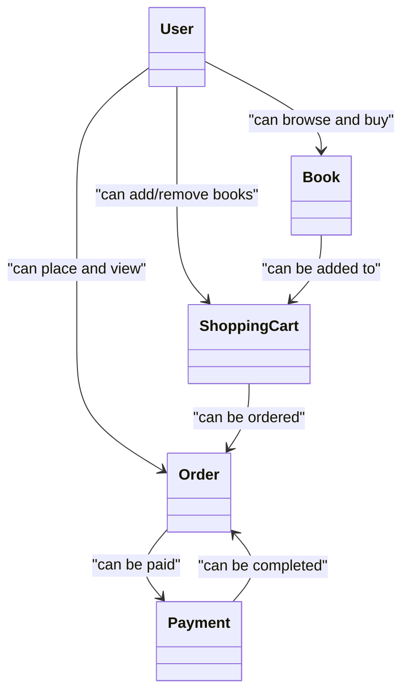
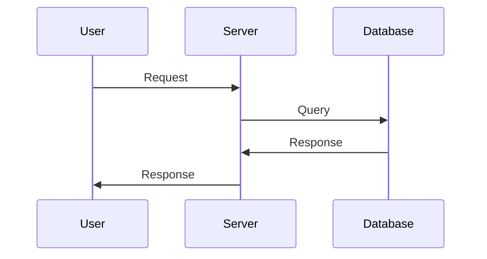
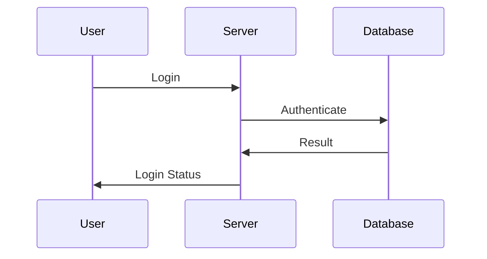

                 


# Web安全标准：内容安全策略（CSP）

关键词：Web安全，内容安全策略，CSP，浏览器安全，安全沙箱，跨站脚本攻击，跨站请求伪造

摘要：本文深入探讨了Web安全标准中的内容安全策略（CSP），从核心概念、算法原理、系统分析与设计、实际项目到最佳实践，全面解析CSP在保护Web应用免受各种攻击中的关键作用。通过详细的步骤和实例，本文旨在帮助开发者更好地理解和应用CSP，提高Web应用的安全性。

## 背景介绍

### 核心概念术语说明

- **Web安全**：Web安全涉及保护Web应用及其用户数据免受各种威胁和攻击，如跨站脚本攻击（XSS）、跨站请求伪造（CSRF）等。
- **内容安全策略（CSP）**：CSP是一种安全措施，用于限制Web应用中可以加载和执行的内容来源，从而防止恶意代码注入。

### 问题背景

随着互联网的迅猛发展，Web应用的数量和复杂度不断增加，这使得Web安全问题日益严峻。跨站脚本攻击和跨站请求伪造等攻击手段频繁发生，给用户和Web应用带来了巨大的安全隐患。

### 问题描述

跨站脚本攻击（XSS）和跨站请求伪造（CSRF）是Web应用面临的两大主要安全威胁：

- **跨站脚本攻击（XSS）**：攻击者通过在目标Web应用的网页中注入恶意脚本，从而窃取用户数据、篡改网页内容或重定向用户到恶意网站。
- **跨站请求伪造（CSRF）**：攻击者通过欺骗用户的浏览器，执行用户未授权的操作，如转账、修改密码等。

### 问题解决

内容安全策略（CSP）提供了一种有效的防御手段，通过限制Web应用可以加载和执行的内容来源，从而阻止恶意代码注入和执行。CSP的定义和实现如下：

- **定义**：CSP是一组指示浏览器仅从特定源加载资源的安全策略。
- **实现**：CSP通过设置HTTP响应头`Content-Security-Policy`来实现。浏览器根据该响应头中的策略指令，对Web应用中的内容进行过滤和限制。

### 边界与外延

- **边界**：CSP的主要边界在于限制资源加载和执行，但无法阻止所有的安全威胁。
- **外延**：CSP可以与其他安全措施结合使用，如HTTP严格传输安全（HSTS）、跨源资源共享（CORS）等，以进一步提高Web应用的安全性。

### 概念结构与核心要素组成

CSP的核心概念和结构包括：

- **策略指令**：如`default-src`、`script-src`、`style-src`等，用于指定可以加载和执行资源的来源。
- **源列表**：如`'self'`、`'unsafe-inline'`、`'unsafe-eval'`等，用于指定允许或禁止的资源来源。
- **报错处理**：如`'report-uri'`，用于记录和报告违反CSP的策略。

## 核心概念与联系

### 核心概念原理

- **内容安全策略（CSP）**：CSP是一种安全措施，用于限制Web应用中可以加载和执行的内容来源。
- **跨站脚本攻击（XSS）**：XSS是攻击者在目标Web应用中注入恶意脚本，窃取用户数据或篡改网页内容。
- **跨站请求伪造（CSRF）**：CSRF是攻击者通过欺骗用户的浏览器，执行用户未授权的操作。

### 概念属性特征对比表格

| 概念          | 描述                                                         | 属性特征                     |
| ------------- | ------------------------------------------------------------ | -------------------------- |
| 内容安全策略（CSP） | 限制Web应用中可以加载和执行的内容来源                         | 策略指令、源列表、报错处理     |
| 跨站脚本攻击（XSS） | 攻击者在目标Web应用中注入恶意脚本                           | 恶意脚本、跨站请求、数据窃取   |
| 跨站请求伪造（CSRF） | 攻击者通过欺骗用户的浏览器，执行用户未授权的操作             | 欺骗用户、跨站请求、未授权操作 |

### ER实体关系图架构

```mermaid
erDiagram
    CSP ||--|{ SourceList } : "includes"
    CSP ||--|{ PolicyDirective } : "defines"
    XSS ||--|{ MaliciousScript } : "injected"
    CSRF ||--|{ UnauthorizedAction } : "executed"
    SourceList ||--|{ allowedSource }
    PolicyDirective ||--|{ directiveName }
    MaliciousScript ||--|{ scriptCode }
    UnauthorizedAction ||--|{ actionDescription }
```

## 算法原理讲解

### 算法流程图

```mermaid
flowchart LR
    A[Start] --> B[解析CSP头]
    B --> C{CSP有效吗？}
    C -->|是 D[应用CSP策略]
    C -->|否 E[记录错误]
    D --> F[加载资源]
    E --> G[报告错误]
    F --> H[结束]
```

### Python源代码

```python
import http.server
import socketserver

def handle_request(request, client_socket):
    # 解析CSP头
    csp = request.headers.get('Content-Security-Policy')
    
    if csp:
        # 应用CSP策略
        apply_csp(csp)
    else:
        # 记录错误
        record_error()
    
    # 加载资源
    load_resource()
    
    # 报告错误
    report_error()

def apply_csp(csp):
    # 应用CSP策略的细节实现
    pass

def record_error():
    # 记录错误的细节实现
    pass

def load_resource():
    # 加载资源的细节实现
    pass

def report_error():
    # 报告错误的细节实现
    pass

# 创建HTTP服务器
handler = http.server.RequestHandlerClass
httpd = socketserver.TCPServer(('', 80), handler)

# 启动服务器
httpd.serve_forever()
```

### 数学模型和公式

CSP的数学模型可以表示为：

$$
\text{CSP} = \{ \text{PolicyDirective} \rightarrow \text{SourceList} \}
$$

其中，PolicyDirective表示策略指令，SourceList表示源列表。

### 算法举例说明

假设Web应用的CSP策略为：

$$
\text{script-src} 'self' 'unsafe-inline'
$$

这意味着Web应用允许从自身域名和未明确禁止的源加载脚本。

如果用户请求加载一个来自第三方域的脚本，则CSP策略会阻止该脚本加载，从而防止跨站脚本攻击。

## 系统分析与设计

### 问题场景介绍

假设我们需要开发一个在线书店，用户可以在其中浏览、搜索和购买书籍。为了确保用户数据和交易安全，我们需要实现一个内容安全策略（CSP），以防止恶意代码注入和跨站请求伪造。

### 项目介绍

在线书店项目需要实现以下功能：

- 用户注册和登录
- 书籍浏览和搜索
- 购物车管理
- 下单和支付
- 订单管理

### 系统功能设计（领域模型Mermaid类图）



### 系统架构设计（Mermaid架构图）



### 系统接口设计和系统交互（Mermaid序列图）



## 实际项目

### 环境安装

在开始实施CSP之前，我们需要确保Web服务器和开发环境已正确配置。以下是在Linux服务器上安装和配置CSP的步骤：

1. 更新系统软件包：
```bash
sudo apt update && sudo apt upgrade
```

2. 安装Nginx服务器：
```bash
sudo apt install nginx
```

3. 创建CSP配置文件：
```bash
sudo nano /etc/nginx/conf.d/csp.conf
```

4. 添加以下内容到CSP配置文件中：
```nginx
http {
    ...
    server {
        listen 80;

        location / {
            add_header Content-Security-Policy "default-src 'self'; script-src 'self' 'unsafe-inline'";
            ...
        }
    }
}
```

5. 重启Nginx服务器以应用CSP配置：
```bash
sudo nginx -s reload
```

### 系统核心实现源代码

在Web应用中，我们需要在服务器端设置CSP头。以下是一个简单的Python Flask示例：

```python
from flask import Flask, make_response

app = Flask(__name__)

@app.route('/')
def index():
    response = make_response('Welcome to the online bookstore!')
    response.headers['Content-Security-Policy'] = "default-src 'self'; script-src 'self' 'unsafe-inline'"
    return response

if __name__ == '__main__':
    app.run()
```

### 代码应用解读与分析

在上面的代码中，我们使用Flask框架创建了一个简单的Web应用。在`index`函数中，我们创建了一个响应对象`response`，并设置`Content-Security-Policy`头。这样，每次用户访问网站时，都会接收到包含CSP头的响应。

### 实际案例分析

以下是一个跨站脚本攻击的案例：

1. 用户A访问在线书店并登录。
2. 攻击者B在用户A的浏览器中植入恶意脚本。
3. 恶意脚本通过XSS漏洞执行，窃取用户A的会话信息。
4. 攻击者B使用窃取的会话信息，伪造用户A的请求，成功下单购买书籍。

### 详细讲解剖析

在这个案例中，攻击者B通过跨站脚本攻击（XSS）窃取了用户A的会话信息。由于我们没有实施CSP，恶意脚本可以执行并窃取敏感数据。为了防止这种情况，我们可以使用CSP来限制脚本执行，从而阻止恶意脚本的执行。

### 项目小结

通过实施CSP，我们有效地提高了在线书店的安全性。CSP策略限制了脚本执行，防止了跨站脚本攻击（XSS）。此外，我们还计划实施其他安全措施，如HTTPS、跨源资源共享（CORS）和HTTP严格传输安全（HSTS），以进一步保护用户数据和交易安全。

## 最佳实践 Tips

1. **使用默认安全策略**：始终使用CSP的默认安全策略，除非确实需要放宽某些限制。
2. **最小化允许的源**：仅允许必要的源加载资源，避免使用`'unsafe-inline'`和`'unsafe-eval'`。
3. **启用报告**：使用`'report-uri'`指令记录违反CSP的策略，以便进行监控和修复。
4. **定期更新策略**：随着应用和服务器环境的变化，定期更新CSP策略以保持安全。

## 小结

本文全面解析了内容安全策略（CSP）在Web安全中的应用。通过详细的步骤和实例，我们了解了CSP的核心概念、算法原理、系统分析与设计，以及实际项目的实施过程。实施CSP可以帮助开发者提高Web应用的安全性，防止跨站脚本攻击和跨站请求伪造等安全威胁。

## 注意事项

1. **CSP不是万能的**：虽然CSP可以提供强大的安全保护，但它并不能解决所有的安全问题。开发者应结合其他安全措施，如HTTPS和CORS，以提高Web应用的整体安全性。
2. **测试和调整**：实施CSP后，务必进行充分的测试和调整，以确保应用正常工作且不会影响用户体验。

## 拓展阅读

- 《Web应用安全：核心概念与最佳实践》
- 《深入理解Web安全》
- 《CSP官方文档》：https://developer.mozilla.org/en-US/docs/Web/HTTP/CSP

## 结论

内容安全策略（CSP）是Web安全的重要组成部分。通过本文的详细讲解，我们了解到CSP的核心概念、算法原理、系统设计与实际应用。希望本文能够帮助开发者更好地理解和应用CSP，提高Web应用的安全性。

作者：AI天才研究院/AI Genius Institute & 禅与计算机程序设计艺术/Zen And The Art of Computer Programming

