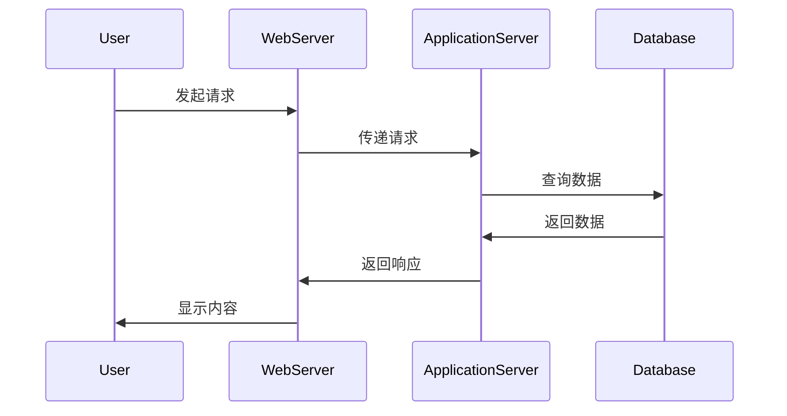
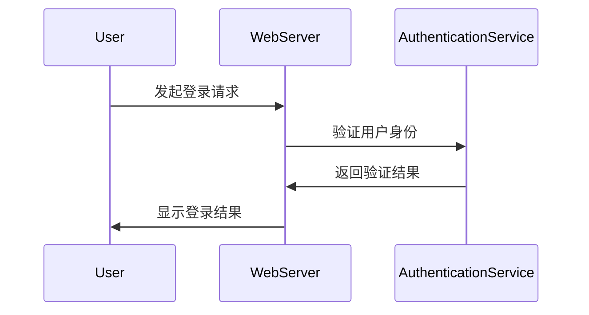

                 

# 《Web访问性：构建包容性的网络应用》

## 关键词
- Web 访问性
- 无障碍性
- 包容性网络应用
- 无障碍设计
- 可访问性标准
- 系统分析与架构设计

## 摘要
本文旨在探讨Web访问性的核心概念，分析其在构建包容性网络应用中的重要性。我们将逐步介绍无障碍性原则、可访问性标准和Web内容可访问性，详细讲解相关算法原理和数学模型。此外，还将讨论系统分析与架构设计方法，并通过项目实战和最佳实践提供实际操作指导。

## 第1章 背景介绍

### 1.1 问题背景
Web访问性是指所有人，无论其能力、设备或环境限制，都能无障碍地访问和使用Web内容和服务的能力。随着互联网的普及和技术的进步，Web访问性成为一个不可忽视的问题。

**定义**：Web访问性是指Web内容和服务对于所有用户都是可访问的，包括残疾人、老年人、视障者和其他有特殊需求的人群。

**重要性**：Web访问性不仅关乎社会公正和包容性，也对企业业务和用户体验有着直接影响。无障碍Web设计能够吸引更多的用户，提高用户体验，增强品牌形象，甚至符合法律法规要求。

### 1.2 问题解决
当前Web访问性面临的主要挑战包括技术复杂性、设计意识不足和法规执行不力。为了解决这些问题，需要推动以下几个关键因素：

- **技术创新**：不断开发新的技术工具和框架，使Web开发者和设计师能够轻松实现无障碍性。
- **教育普及**：提高开发者和企业对Web访问性重要性的认识，普及无障碍设计的基本原则和实践方法。
- **法规驱动**：加强法规执行，确保无障碍性要求在Web设计和开发中得到充分落实。

### 1.3 边界与外延
Web访问性与无障碍性密切相关，但并不完全相同。无障碍性强调的是用户与系统之间的交互无障碍，而Web访问性则更广泛地涉及Web内容的可访问性。

- **Web访问性与无障碍性的关系**：无障碍性是Web访问性的一个重要组成部分，但Web访问性还包括更广泛的因素，如信息可用性和内容结构化。
- **标准与法规**：Web访问性标准，如WCAG（Web内容可访问性指南），提供了具体的实现准则。法规，如《美国残疾人法案》（ADA）和《欧盟无障碍指令》，则要求网站符合特定的访问性要求。

### 1.4 概念结构与核心要素组成
构建包容性的网络应用需要关注以下几个核心要素：

- **无障碍性原则**：无障碍性原则是无障碍设计的核心，包括可访问性、可操作性、易理解性和稳定性等。
- **技术实现**：使用适当的技术和工具来确保Web内容和服务对于所有用户都是可访问的。
- **用户体验**：关注用户的实际使用体验，确保Web应用易于使用和理解。
- **可访问性评估**：定期进行可访问性评估，以发现和修复潜在的问题。

## 第2章 核心概念与联系

### 2.1 无障碍性原则

**定义**：无障碍性原则是指设计产品和服务时，确保所有人，包括有特殊需求的人群，都能无障碍地使用。

**应用**：无障碍性原则在Web设计中体现在多个方面，如使用语义化HTML标签、提供足够的对比度和文本大小、避免使用仅视觉的交互元素等。

### 2.2 可访问性与可访问性标准

**定义**：可访问性是指Web内容和服务对于所有用户都是可用的，不受其能力、设备或环境限制。

**标准**：WCAG是Web内容可访问性指南，提供了详细的指南，帮助开发者和设计师创建无障碍的Web内容。

### 2.3 Web内容可访问性

**定义**：Web内容可访问性是指Web内容能够被所有人理解和使用。

**核心要素**：
- 文本内容的可访问性
- 图像和多媒体内容的可访问性
- 表格和数据图表的可访问性
- 交互元素的可访问性

### 2.4 无障碍设计与评估

**定义**：无障碍设计是指在设计阶段就考虑无障碍性，确保最终产品能够满足所有人的需求。

**评估**：无障碍评估通常包括自动化工具和手动测试，如使用屏幕阅读器测试、对比度测试和键盘导航测试。

## 第3章 算法原理讲解

### 3.1 无障碍性算法概述

**基本概念**：无障碍性算法是指用于检测和优化Web内容和服务可访问性的算法。

**分类**：无障碍性算法可以分为检测算法和优化算法。检测算法用于检测Web内容是否符合无障碍性标准，而优化算法则用于调整和改进Web内容，使其更符合无障碍性要求。

### 3.2 关键算法详细讲解

#### 3.2.1 无障碍性检测算法

**原理与流程**：无障碍性检测算法通常包括以下步骤：解析Web内容、检查内容是否符合无障碍性标准、生成报告。

**实现与性能分析**：算法实现通常涉及使用爬虫技术收集Web内容，然后使用规则库或机器学习模型进行检测。性能分析关注算法的准确性、效率和可扩展性。

#### 3.2.2 无障碍性优化算法

**原理与流程**：无障碍性优化算法包括识别不符合无障碍性标准的内容、提供修复建议和自动修复。

**实现与性能分析**：算法实现通常涉及使用自然语言处理技术和自动化工具来分析Web内容，并提供具体的修复建议。性能分析关注算法的修复效率和质量。

### 3.3 算法比较与评估

**比较**：不同算法在准确性、效率和可扩展性等方面存在差异。比较算法需要考虑具体应用场景和需求。

**评估方法与指标**：评估方法通常包括实验测试和用户反馈。评估指标包括算法的准确率、覆盖率、修复率和用户满意度。

## 第4章 数学模型和数学公式详细讲解

### 4.1 无障碍性数学模型

**模型定义**：无障碍性数学模型用于量化Web内容和服务对用户的可访问性。

**模型特性**：无障碍性数学模型通常包括输入（用户需求、系统性能）、输出（可访问性评分）和中间过程（评估指标的计算）。

**应用场景**：无障碍性数学模型可以用于评估Web内容的无障碍性、指导无障碍性优化和评估无障碍性算法的性能。

### 4.2 数学公式讲解

$$
A = f(W, U, S)
$$

其中，$A$代表可访问性评分，$W$代表Web内容，$U$代表用户需求，$S$代表系统性能。

**公式推导与解释**：该公式表示可访问性评分是Web内容、用户需求和系统性能的函数。通过调整这些因素，可以提高Web内容的服务质量。

## 第5章 系统分析与架构设计方案

### 5.1 问题场景介绍

**场景**：一个电子商务网站需要确保其网站内容和服务对所有用户，包括有特殊需求的人群，都是可访问的。

### 5.2 系统功能设计

**领域模型**：使用Mermaid类图表示领域模型，包括用户、产品、订单等实体。

```mermaid
classDiagram
User <<Entity>>
Product <<Entity>>
Order <<Entity>>

User o--* 1 Order
Product o--* 1 Order
```

### 5.3 系统架构设计

**架构图**：使用Mermaid架构图表示系统架构，包括前端、后端和服务层。



### 5.4 系统接口设计

**接口设计规范**：定义API接口，包括GET、POST、PUT、DELETE等操作。

```mermaid
interface API {
    GET /users: 获取用户列表
    POST /users: 创建新用户
    PUT /users/{id}: 更新用户信息
    DELETE /users/{id}: 删除用户
}
```

### 5.5 系统交互设计

**交互序列图**：使用Mermaid序列图表示系统交互流程。



## 第6章 项目实战

### 6.1 环境安装

**步骤**：安装必要的开发工具和库，如Node.js、Python和无障碍性测试工具。

### 6.2 系统核心实现

**代码实现**：提供核心功能的源代码，如用户注册、登录和订单管理。

```python
# Python 示例：用户注册
def register_user(username, password):
    # 验证用户名和密码的有效性
    if not is_valid_username(username) or not is_valid_password(password):
        return "注册失败：无效的用户名或密码"
    
    # 存储用户信息到数据库
    database.save_user(username, password)
    
    return "注册成功"
```

### 6.3 代码应用解读与分析

**应用场景**：分析用户注册功能在实际项目中的应用和可能的优化。

### 6.4 实际案例分析与详细讲解剖析

**案例**：分析一个实际项目的Web访问性问题和解决方案。

### 6.5 项目小结

**总结**：回顾项目过程中的关键经验和收获，提出改进建议。

## 第7章 最佳实践 tips

**内容**：提供关于无障碍Web设计的一些建议和最佳实践。

## 小结
本文详细介绍了Web访问性的核心概念、算法原理和系统架构设计，并通过项目实战和最佳实践提供了实际操作指导。通过遵循这些原则和实践，开发者可以构建更加包容性和无障碍的Web应用。

## 注意事项
在实现Web访问性时，需要特别注意以下几点：
- 确保内容结构清晰，易于理解
- 使用适当的对比度和字体大小
- 提供多媒体内容的文本替代
- 测试Web应用的无障碍性，包括自动化测试和手动测试

## 拓展阅读
- [WCAG 2.1 - Web内容可访问性指南](https://www.w3.org/WAI/standards-guidelines/wcag/)
- [无障碍Web设计指南](https://www.w3.org/WAI/tutorials/create-accessible/)
- [无障碍性算法研究](https://www.researchgate.net/publication/327695184_Authomatic_Automated_Web_Accessibility_Monitoring_and_Reporting_System)

作者：AI天才研究院/AI Genius Institute & 禅与计算机程序设计艺术 /Zen And The Art of Computer Programming

