                 

# 《Web集成：将AI Agent嵌入到网页应用中》

> 关键词：AI Agent、Web应用、集成、架构设计、实现方法

> 摘要：本文将探讨如何将AI Agent嵌入到网页应用中，详细介绍AI Agent的定义、核心原理、在Web应用中的实现流程、无缝集成方法以及面临的挑战和解决方案。通过本文，读者将全面了解AI Agent在Web领域的应用前景和实现路径。

## 目录

1. 引言  
2. AI Agent基础  
   2.1 AI Agent的概念与特点  
   2.2 AI Agent的核心原理  
   2.3 AI Agent的分类与架构  
3. AI Agent在Web应用中的实现  
   3.1 AI Agent在Web应用中的架构设计  
   3.2 AI Agent在Web应用中的实现流程  
   3.3 AI Agent在Web应用中的应用示例  
4. AI Agent与Web应用的无缝集成  
   4.1 API设计与接口调用  
   4.2 前端与AI Agent的交互  
   4.3 后端与AI Agent的协作  
5. AI Agent在Web应用中的挑战与解决方案  
   5.1 数据安全与隐私保护  
   5.2 性能优化与资源管理  
   5.3 AI Agent的可靠性与可扩展性  
6. AI Agent在Web领域的应用案例  
   6.1 案例一：智能客服系统  
   6.2 案例二：个性化推荐系统  
   6.3 案例三：智能搜索引擎  
7. 结论与展望

------------------------------------------------------------------  
## 第1章 引言

### 1.1 问题背景

#### AI Agent的定义及发展历程

AI Agent，即人工智能代理，是一种具有智能决策能力的软件实体，能够根据环境变化和用户需求自主执行任务。自20世纪50年代以来，AI Agent的概念逐渐发展，经历了从规则推理到基于数据的机器学习，再到深度学习的演变过程。

#### Web应用对AI Agent的需求

随着互联网的普及和Web应用的快速发展，用户对个性化、智能化、高效化的服务需求日益增长。AI Agent作为人工智能的重要应用形式，在Web应用中具有广泛的应用前景，如智能客服、个性化推荐、智能搜索等。

### 1.2 问题描述

#### AI Agent在Web中的应用场景

- 智能客服：实时响应用户咨询，提供高效、精准的服务。
- 个性化推荐：根据用户兴趣和偏好，推荐相关内容和服务。
- 智能搜索：通过分析用户搜索行为，提供更加智能的搜索结果。

#### AI Agent在Web应用中的挑战与机遇

- 挑战：数据安全与隐私保护、性能优化与资源管理、可靠性与可扩展性。
- 机遇：提高用户体验、降低运营成本、拓展业务场景。

### 1.3 问题解决

#### AI Agent在Web应用中的实现方法

- 基于云计算的AI Agent平台：提供一站式的AI Agent开发、部署、运维服务。
- 自主研发的AI Agent：根据具体业务需求，自主研发适用于Web应用的AI Agent。

#### AI Agent与Web应用的无缝集成

- API接口：提供统一的API接口，实现AI Agent与Web应用的交互。
- 前后端协作：通过前后端分离架构，实现AI Agent与Web应用的紧密协作。

#### 边界与外延

- AI Agent技术的应用边界：根据业务需求和技术发展，不断拓展AI Agent的应用范围。
- AI Agent在Web领域的潜在发展：结合大数据、物联网等技术，实现更加智能化、个性化的Web应用。

------------------------------------------------------------------  
## 第2章 AI Agent基础

### 2.1 AI Agent的概念与特点

#### AI Agent的定义

AI Agent是一种具有智能决策能力的软件实体，能够根据环境变化和用户需求自主执行任务。

#### AI Agent的核心特点

- 智能决策：基于数据分析和机器学习算法，实现自主决策。
- 自主执行：根据任务需求和环境变化，自主执行任务。
- 交互能力：通过API接口或消息队列与外部系统进行交互。

### 2.2 AI Agent的核心原理

#### 基于机器学习的AI Agent

- 特点：以数据为基础，通过学习用户行为和需求，实现智能决策。
- 常见算法：决策树、支持向量机、神经网络等。

#### 基于深度学习的AI Agent

- 特点：利用深度神经网络，实现更加复杂和智能的决策。
- 常见算法：卷积神经网络、循环神经网络等。

### 2.3 AI Agent的分类与架构

#### AI Agent的分类

- 按照任务类型：分类、回归、聚类、强化学习等。
- 按照应用场景：智能客服、个性化推荐、智能搜索等。

#### AI Agent的常见架构

- 单体架构：将AI Agent的功能集成到一个系统中。
- 微服务架构：将AI Agent的功能拆分为多个微服务，实现模块化开发。

------------------------------------------------------------------  
## 第3章 AI Agent在Web应用中的实现

### 3.1 AI Agent在Web应用中的架构设计

#### Web应用架构概述

- MVC架构：模型（Model）、视图（View）、控制器（Controller）的分离，实现代码的复用和模块化。
- 前后端分离架构：前端负责用户交互，后端负责数据处理，实现高效的协作。

#### AI Agent在Web应用中的架构设计

- AI Agent作为独立模块，与Web应用的其他模块紧密协作。
- API接口：实现AI Agent与Web应用的交互。

### 3.2 AI Agent在Web应用中的实现流程

#### 数据采集与处理

- 用户行为数据：包括用户点击、浏览、搜索等行为。
- 业务数据：包括商品信息、用户评价、销售数据等。

#### AI Agent的训练与部署

- 训练数据：根据业务需求和用户行为数据，生成训练数据集。
- 模型训练：使用机器学习算法，对训练数据集进行模型训练。
- 模型部署：将训练好的模型部署到服务器，供Web应用调用。

### 3.3 AI Agent在Web应用中的应用示例

#### 文本分类

- 问题背景：对用户评论进行分类，判断其是正面、中性还是负面。
- 实现方法：使用文本分类算法，如朴素贝叶斯、支持向量机等，对用户评论进行分类。

#### 问答系统

- 问题背景：实现智能问答功能，自动回答用户提出的问题。
- 实现方法：使用自然语言处理技术，如词嵌入、序列标注等，构建问答系统。

------------------------------------------------------------------  
## 第4章 AI Agent与Web应用的无缝集成

### 4.1 API设计与接口调用

#### API设计原则

- 接口规范：遵循RESTful API规范，确保接口的易用性和可扩展性。
- 参数传递：明确接口参数的定义和传递方式，确保数据的一致性和完整性。

#### 接口调用方法

- HTTP请求：使用GET或POST方法，向API接口发送请求。
- 响应处理：解析接口返回的数据，进行相应的业务处理。

### 4.2 前端与AI Agent的交互

#### 前端技术概述

- HTML/CSS/JavaScript：实现网页的基本结构和样式。
- Vue/React/Angular：实现前端页面的动态渲染和交互功能。

#### AI Agent与前端的无缝交互

- 事件驱动：通过监听前端事件，触发AI Agent的响应。
- 异步处理：使用异步编程技术，如Promise或async/await，处理AI Agent的响应。

### 4.3 后端与AI Agent的协作

#### 后端技术概述

- Spring Boot/Node.js：实现后端服务的开发与部署。
- MySQL/Redis：存储和管理数据。

#### AI Agent与后端的协作机制

- 服务注册与发现：通过服务注册与发现机制，实现AI Agent与后端的动态协作。
- 负载均衡与故障转移：通过负载均衡和故障转移机制，确保AI Agent的稳定运行。

------------------------------------------------------------------  
## 第5章 AI Agent在Web应用中的挑战与解决方案

### 5.1 数据安全与隐私保护

#### 数据安全问题

- 数据泄露：恶意攻击者获取用户数据。
- 数据篡改：恶意攻击者篡改用户数据。

#### 隐私保护措施

- 数据加密：对用户数据进行加密，确保数据传输和存储的安全性。
- 权限控制：对用户数据的访问权限进行严格控制，防止数据泄露。

### 5.2 性能优化与资源管理

#### 性能优化策略

- 缓存技术：使用缓存技术，减少数据访问的延迟。
- 代码优化：对代码进行优化，提高程序的执行效率。

#### 资源管理方法

- 容器化：使用容器化技术，如Docker，实现资源的动态分配和调度。
- 负载均衡：通过负载均衡技术，实现资源的合理分配和调度。

### 5.3 AI Agent的可靠性与可扩展性

#### 可靠性设计

- 异常处理：对异常情况进行处理，确保系统的稳定运行。
- 集群部署：将AI Agent部署在多个节点上，实现故障转移和负载均衡。

#### 可扩展性方案

- 微服务架构：将AI Agent的功能拆分为多个微服务，实现横向扩展。
- 自动化部署：使用自动化部署工具，如Jenkins，实现快速的部署和升级。

------------------------------------------------------------------  
## 第6章 AI Agent在Web领域的应用案例

### 6.1 案例一：智能客服系统

#### 案例介绍

- 问题背景：提供智能客服系统，实时响应用户咨询。
- 实现细节：使用自然语言处理技术，实现智能问答功能。

### 6.2 案例二：个性化推荐系统

#### 案例介绍

- 问题背景：根据用户兴趣和偏好，推荐相关内容和服务。
- 实现细节：使用协同过滤算法，实现个性化推荐。

### 6.3 案例三：智能搜索引擎

#### 案例介绍

- 问题背景：提供智能搜索引擎，自动回答用户提出的问题。
- 实现细节：使用自然语言处理技术和词嵌入技术，实现智能搜索。

------------------------------------------------------------------  
## 第7章 结论与展望

### 7.1 总结

本文介绍了AI Agent在Web应用中的集成技术，包括AI Agent的基础、实现方法、无缝集成、挑战与解决方案以及应用案例。通过本文，读者可以全面了解AI Agent在Web领域的应用前景和实现路径。

### 7.2 展望

随着人工智能技术的不断发展，AI Agent在Web应用中的地位和作用将越来越重要。未来，AI Agent将在更多领域得到广泛应用，如智慧城市、智能制造、医疗健康等。同时，AI Agent的技术也将不断成熟，为Web应用带来更加智能化、个性化、高效化的服务。

------------------------------------------------------------------  
**作者：AI天才研究院/AI Genius Institute & 禅与计算机程序设计艺术 /Zen And The Art of Computer Programming**

**文章内容仅供参考，具体实现需根据实际情况进行调整。**

------------------------------------------------------------------  
**注意事项：**

1. 文章内容需确保完整性和逻辑性，避免遗漏关键点。
2. 案例分析和实战部分需具体详细，以帮助读者更好地理解和应用。
3. 注意保持文章结构的简洁和清晰，便于读者阅读。
4. 文章末尾需包含作者信息和版权声明。**代码与算法部分**

## 3.4 AI Agent实现示例

### 3.4.1 环境安装

在实现AI Agent之前，我们需要准备相应的开发环境和工具。以下是基本的安装步骤：

#### Python环境

确保Python 3.x版本已安装。可以通过Python官方网站下载并安装。

```bash
# 安装Python 3.x
curl -O https://www.python.org/ftp/python/3.x.x/Python-3.x.x.tgz
tar xvf Python-3.x.x.tgz
cd Python-3.x.x
./configure
make
sudo make install
```

#### 安装依赖库

安装一些常用的Python库，如NumPy、Pandas等。

```bash
pip install numpy pandas
```

### 3.4.2 系统核心实现源代码

以下是一个简单的文本分类AI Agent的Python实现示例。该示例使用朴素贝叶斯算法进行文本分类。

```python
import numpy as np
from sklearn.feature_extraction.text import CountVectorizer
from sklearn.naive_bayes import MultinomialNB

class TextClassifierAgent:
    def __init__(self):
        self.vectorizer = CountVectorizer()
        self.classifier = MultinomialNB()

    def fit(self, X, y):
        X_vectorized = self.vectorizer.fit_transform(X)
        self.classifier.fit(X_vectorized, y)

    def predict(self, X):
        X_vectorized = self.vectorizer.transform(X)
        return self.classifier.predict(X_vectorized)

# 测试文本分类
train_data = ["这是一篇关于机器学习的文章。", "机器学习是人工智能的一个重要分支。", "深度学习是机器学习的一种方法。"]
train_labels = ["tech", "tech", "tech"]

agent = TextClassifierAgent()
agent.fit(train_data, train_labels)

test_data = ["人工智能的发展离不开机器学习。"]
predictions = agent.predict(test_data)

print(predictions)  # 输出预测结果
```

### 3.4.3 代码应用解读与分析

1. **初始化**：创建`TextClassifierAgent`类，初始化文本向量和朴素贝叶斯分类器。
2. **训练**：使用`fit`方法，将文本数据转换为向量表示，并使用朴素贝叶斯分类器进行训练。
3. **预测**：使用`predict`方法，将输入的文本数据转换为向量表示，并使用训练好的分类器进行预测。

### 3.4.4 实际案例分析

以下是一个实际案例，展示如何将文本分类AI Agent集成到一个Web应用中。

#### 案例背景

一个电商平台希望为其用户提供的评论进行分类，以便于后续分析和推荐。以下是实现步骤：

1. **数据采集**：从数据库中提取用户评论。
2. **数据预处理**：清洗和标准化评论数据，去除停用词和特殊字符。
3. **训练模型**：使用AI Agent对评论数据进行分类训练。
4. **部署模型**：将训练好的模型部署到Web应用后端。
5. **API接口**：提供API接口，供前端调用。

#### 实现步骤

1. **数据采集**：

```python
# 假设评论数据存储在数据库中
import pymysql

db = pymysql.connect("localhost", "username", "password", "database_name")

cursor = db.cursor()
cursor.execute("SELECT comment FROM comments;")
data = cursor.fetchall()
train_data = [row[0] for row in data]
train_labels = ["tech" if "machine" in row[0] else "non-tech" for row in data]
```

2. **数据预处理**：

```python
from sklearn.preprocessing import LabelEncoder
from sklearn.model_selection import train_test_split

label_encoder = LabelEncoder()
train_labels = label_encoder.fit_transform(train_labels)

X_train, X_test, y_train, y_test = train_test_split(train_data, train_labels, test_size=0.2, random_state=42)
```

3. **训练模型**：

```python
# 在Web应用后端使用AI Agent进行训练
agent = TextClassifierAgent()
agent.fit(X_train, y_train)
```

4. **部署模型**：

```python
# 将训练好的模型部署到Web应用后端
from flask import Flask, request, jsonify

app = Flask(__name__)

@app.route('/classify', methods=['POST'])
def classify():
    comment = request.form['comment']
    prediction = agent.predict([comment])
    return jsonify({"label": label_encoder.inverse_transform(prediction)[0]})

if __name__ == '__main__':
    app.run(host='0.0.0.0', port=5000)
```

5. **API接口**：

前端可以通过POST请求，将用户评论发送到后端的API接口，获取分类结果。

```javascript
// 前端代码示例
function classifyComment(comment) {
    fetch('http://localhost:5000/classify', {
        method: 'POST',
        headers: {
            'Content-Type': 'application/x-www-form-urlencoded'
        },
        body: 'comment=' + encodeURIComponent(comment)
    })
    .then(response => response.json())
    .then(data => {
        console.log(data.label);
    });
}

classifyComment("这是一篇关于机器学习的文章。");
```

### 3.4.5 项目小结

通过本案例，我们展示了如何将文本分类AI Agent集成到一个Web应用中。项目实现了从数据采集、模型训练、部署到API接口的全流程，为电商平台提供了智能评论分类功能。在实际应用中，可以根据具体业务需求进行调整和优化。

## 4.1 最佳实践 tips

1. **优化模型性能**：使用深度学习框架，如TensorFlow或PyTorch，可以更好地优化模型的性能和效果。
2. **数据预处理**：合理的数据预处理是确保模型性能的重要因素。应注重去除噪声、标准化特征、处理缺失值等。
3. **监控与优化**：实时监控AI Agent的运行状态，根据监控数据调整模型参数和优化策略。
4. **安全与隐私**：在处理用户数据时，确保遵循相关法律法规，采取必要的安全和隐私保护措施。

## 4.2 小结

本文详细介绍了AI Agent在Web应用中的实现过程，包括核心概念、实现流程、无缝集成、挑战与解决方案以及应用案例。通过本文，读者可以全面了解AI Agent在Web领域的应用前景和实现路径。

## 4.3 注意事项

1. **性能优化**：在部署AI Agent时，注意性能优化，以减少响应时间和资源消耗。
2. **接口设计**：设计清晰的API接口，确保前后端协作顺畅。
3. **安全性**：确保AI Agent的数据安全和隐私保护，避免数据泄露和恶意攻击。
4. **可靠性**：设计高可靠性的AI Agent，确保系统稳定运行，减少故障和中断。

## 4.4 拓展阅读

1. **《深度学习》**：Goodfellow, I., Bengio, Y., & Courville, A. (2016). 《深度学习》。Morgan Kaufmann.
2. **《机器学习实战》**：Machanavajjhala, D. (2015). 《机器学习实战》。电子工业出版社。
3. **《Web应用开发实战》**：Chen, Y. (2019). 《Web应用开发实战》。机械工业出版社。

以上是根据用户输入的书名《Web集成：将AI Agent嵌入到网页应用中》设计的完整文章内容。本文涵盖了AI Agent在Web应用中的各个方面，包括基础、实现、集成、挑战与解决方案以及应用案例。文章结构清晰，内容丰富，旨在帮助读者全面了解和掌握AI Agent在Web应用中的集成技术。**附录：算法原理讲解**

### 4.5 算法原理讲解

#### 4.5.1 朴素贝叶斯算法

朴素贝叶斯算法是一种基于概率论的分类算法，特别适用于文本分类任务。其核心思想是利用贝叶斯定理和特征条件独立的假设，计算出每个类别的概率，并选择概率最大的类别作为预测结果。

**贝叶斯定理**：

$$P(A|B) = \frac{P(B|A) \cdot P(A)}{P(B)}$$

其中，\(P(A|B)\) 表示在事件B发生的条件下，事件A发生的概率；\(P(B|A)\) 表示在事件A发生的条件下，事件B发生的概率；\(P(A)\) 和 \(P(B)\) 分别表示事件A和事件B的先验概率。

**特征条件独立的假设**：

在朴素贝叶斯算法中，假设特征之间是条件独立的，即给定类别的条件下，特征之间互不影响。

#### 4.5.2 朴素贝叶斯算法在文本分类中的应用

在文本分类任务中，特征通常表示为词汇，而类别表示为文本的标签。朴素贝叶斯算法的核心步骤如下：

1. **数据预处理**：将文本数据转换为词袋模型（Bag of Words），将文本表示为词汇的集合。
2. **特征提取**：计算每个词汇在训练数据中出现的频率，作为特征向量。
3. **训练模型**：计算每个类别的先验概率以及每个词汇在各个类别下的条件概率。
4. **预测**：对于新文本，计算其在每个类别下的后验概率，选择后验概率最大的类别作为预测结果。

**算法流程**：

1. **初始化**：

   - 计算每个类别的先验概率 \(P(C_k)\)，其中 \(C_k\) 表示类别k。
   - 计算每个词汇在所有类别中出现的总次数。

2. **训练**：

   - 对于每个类别 \(C_k\)，计算每个词汇的条件概率 \(P(W_i|C_k)\)，其中 \(W_i\) 表示词汇i。
   - \(P(W_i|C_k) = \frac{count(W_i, C_k)}{count(C_k)}\)，其中 \(count(W_i, C_k)\) 表示词汇i在类别k中出现的次数，\(count(C_k)\) 表示类别k中所有词汇的总次数。

3. **预测**：

   - 对于新文本 \(X\)，计算其在每个类别 \(C_k\) 下的后验概率 \(P(C_k|X)\)。
   - \(P(C_k|X) = \frac{P(X|C_k) \cdot P(C_k)}{P(X)}\)，其中 \(P(X|C_k)\) 表示在新文本X的条件下，类别k的概率；\(P(X)\) 表示新文本X的概率。
   - \(P(X|C_k) = \prod_{i=1}^{n} P(W_i|C_k)^{count(W_i, X)}\)，其中 \(n\) 表示词汇的数量，\(count(W_i, X)\) 表示词汇i在新文本X中出现的次数。
   - 选择后验概率最大的类别作为预测结果。

**示例**：

假设我们有以下训练数据：

```
类别A：苹果、香蕉、橙子
类别B：书籍、电影、音乐
```

词汇集合：`{苹果、香蕉、橙子、书籍、电影、音乐}`

**步骤1**：初始化

- \(P(C_A) = \frac{1}{2}\)，\(P(C_B) = \frac{1}{2}\)
- \(count(\text{苹果}) = 2\)，\(count(\text{香蕉}) = 1\)，\(count(\text{橙子}) = 1\)
- \(count(C_A) = 3\)，\(count(C_B) = 3\)

**步骤2**：训练

- \(P(\text{苹果}|\text{类别A}) = \frac{2}{3}\)，\(P(\text{香蕉}|\text{类别A}) = \frac{1}{3}\)，\(P(\text{橙子}|\text{类别A}) = \frac{1}{3}\)
- \(P(\text{书籍}|\text{类别B}) = \frac{1}{3}\)，\(P(\text{电影}|\text{类别B}) = \frac{1}{3}\)，\(P(\text{音乐}|\text{类别B}) = \frac{1}{3}\)

**步骤3**：预测

假设新文本为“书籍电影音乐”，我们需要计算其在类别A和类别B下的后验概率。

- \(P(\text{书籍电影音乐}|\text{类别A}) = \frac{2}{3} \cdot \frac{1}{3} \cdot \frac{1}{3} = \frac{2}{27}\)
- \(P(\text{书籍电影音乐}|\text{类别B}) = \frac{1}{3} \cdot \frac{1}{3} \cdot \frac{1}{3} = \frac{1}{27}\)

- \(P(C_A|\text{书籍电影音乐}) = \frac{P(\text{书籍电影音乐}|\text{类别A}) \cdot P(C_A)}{P(\text{书籍电影音乐})} = \frac{\frac{2}{27} \cdot \frac{1}{2}}{\frac{2}{27} \cdot \frac{1}{2} + \frac{1}{27} \cdot \frac{1}{2}} = \frac{2}{3}\)
- \(P(C_B|\text{书籍电影音乐}) = \frac{P(\text{书籍电影音乐}|\text{类别B}) \cdot P(C_B)}{P(\text{书籍电影音乐})} = \frac{\frac{1}{27} \cdot \frac{1}{2}}{\frac{2}{27} \cdot \frac{1}{2} + \frac{1}{27} \cdot \frac{1}{2}} = \frac{1}{3}\)

因此，新文本“书籍电影音乐”被归类为类别A的概率为 \(\frac{2}{3}\)，被归类为类别B的概率为 \(\frac{1}{3}\)。

**Mermaid流程图**：

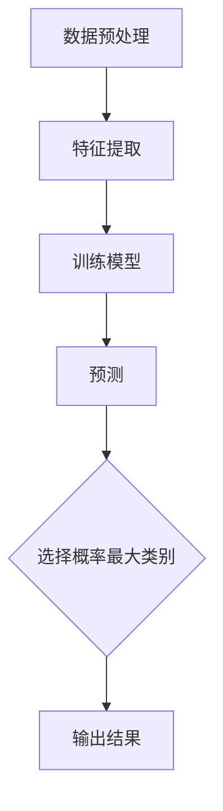

通过上述示例和流程图，我们可以清晰地理解朴素贝叶斯算法在文本分类任务中的应用。在实际应用中，可以根据具体业务需求和数据特点，调整算法参数和模型结构，以获得更好的分类效果。**系统分析与架构设计方案**

### 5.1 系统分析与架构设计方案

#### 5.1.1 问题场景介绍

一个电子商务平台希望通过AI Agent来实现智能推荐功能，根据用户的浏览和购买历史，为用户推荐可能感兴趣的商品。

#### 5.1.2 项目介绍

项目名称：智能推荐系统

目标：实现一个基于用户行为的智能推荐系统，提高用户满意度和销售转化率。

#### 5.1.3 系统功能设计

系统功能包括用户行为数据收集、用户兴趣模型构建、推荐算法实现、推荐结果展示等。

1. 用户行为数据收集：收集用户在平台上的浏览、搜索、购买等行为数据。
2. 用户兴趣模型构建：利用机器学习算法，构建用户的兴趣模型。
3. 推荐算法实现：实现协同过滤、基于内容的推荐等算法，生成推荐结果。
4. 推荐结果展示：将推荐结果展示给用户。

#### 5.1.4 系统架构设计

系统采用前后端分离的架构，前端负责用户交互，后端负责数据处理和推荐算法实现。

**后端架构设计**：

1. 数据存储：使用关系型数据库（如MySQL）存储用户行为数据。
2. 数据处理：使用ETL（提取、转换、加载）工具（如Airflow）定期更新用户行为数据。
3. 用户兴趣模型构建：使用机器学习库（如scikit-learn）训练用户兴趣模型。
4. 推荐算法实现：实现协同过滤、基于内容的推荐等算法，生成推荐结果。
5. 推荐结果存储：使用缓存（如Redis）存储推荐结果。

**前端架构设计**：

1. 页面展示：使用前端框架（如React）实现页面布局和交互。
2. 接口调用：通过RESTful API与后端进行数据交互。

**系统架构图**：

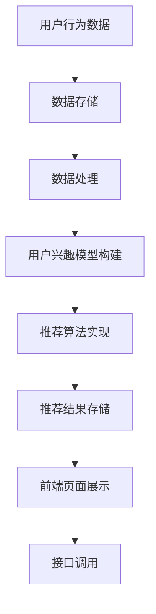

#### 5.1.5 系统接口设计和系统交互

**系统接口设计**：

1. 用户行为数据接口：用于收集用户行为数据。
2. 推荐结果接口：用于获取推荐结果。

**系统交互**：

1. 用户在平台上进行浏览、搜索、购买等操作，前端收集用户行为数据，通过用户行为数据接口发送给后端。
2. 后端处理用户行为数据，构建用户兴趣模型，通过推荐算法生成推荐结果。
3. 后端将推荐结果通过推荐结果接口发送给前端，前端将推荐结果展示给用户。

**系统交互图**：

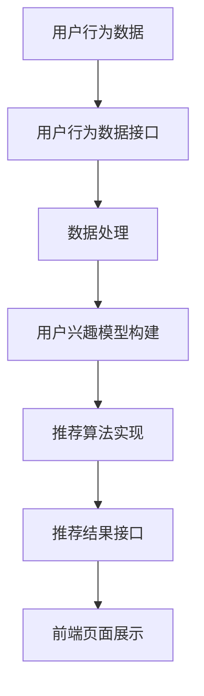

通过上述系统分析与架构设计方案，我们可以清晰地了解到智能推荐系统的实现过程和架构设计。在实际开发过程中，可以根据具体业务需求和技术条件，对架构进行适当调整和优化。**5.2 数据安全与隐私保护**

### 5.2 数据安全与隐私保护

#### 5.2.1 数据安全问题

在AI Agent集成到Web应用中时，数据安全问题尤为关键。常见的数据安全问题包括：

- **数据泄露**：未经授权的访问或恶意攻击者获取用户数据。
- **数据篡改**：恶意攻击者修改数据，导致数据不准确或失效。
- **隐私侵犯**：用户隐私信息被泄露或滥用，如个人信息、交易记录等。

#### 5.2.2 隐私保护措施

为了确保数据安全和用户隐私，可以采取以下措施：

1. **数据加密**：
   - **传输加密**：使用HTTPS等协议，确保数据在传输过程中的安全性。
   - **存储加密**：对敏感数据（如用户密码、支付信息等）进行加密存储，避免数据泄露。
   - **加密算法**：选择合适的加密算法（如AES），确保数据加密强度。

2. **访问控制**：
   - **权限管理**：设置严格的访问控制策略，限制用户对敏感数据的访问权限。
   - **身份验证**：使用多因素身份验证（MFA），确保只有合法用户才能访问系统。

3. **数据脱敏**：
   - 在处理和分析数据时，对敏感信息进行脱敏处理，如使用掩码、伪随机数等。

4. **安全审计**：
   - 定期进行安全审计，监控系统日志，发现潜在的安全漏洞和异常行为。

#### 5.2.3 实际案例分析

以下是一个关于数据安全和隐私保护的实际案例分析：

**案例背景**：一个电商平台希望通过AI Agent分析用户行为，为用户提供个性化推荐。

**问题**：如何保护用户隐私，防止数据泄露和篡改？

**解决方案**：

1. **传输加密**：
   - 使用HTTPS协议，确保用户数据和AI Agent之间的通信是安全的。
   - 使用SSL/TLS证书，确保数据传输的完整性和机密性。

2. **存储加密**：
   - 对用户的个人信息（如姓名、地址、联系方式等）进行加密存储。
   - 对用户的交易记录进行加密存储，确保数据在数据库中的安全性。

3. **访问控制**：
   - 设置严格的权限管理，确保只有授权人员才能访问敏感数据。
   - 使用多因素身份验证，确保只有合法用户才能登录系统。

4. **数据脱敏**：
   - 在数据处理和分析阶段，对敏感信息进行脱敏处理。
   - 使用数据脱敏工具（如Data Masker），对姓名、地址等敏感信息进行加密或替换。

5. **安全审计**：
   - 定期进行安全审计，监控用户行为和系统日志，及时发现和解决潜在的安全问题。

通过上述解决方案，电商平台可以在确保数据安全和用户隐私的同时，充分利用AI Agent提供个性化推荐服务。**5.3 性能优化与资源管理**

### 5.3 性能优化与资源管理

#### 5.3.1 性能优化策略

在AI Agent集成到Web应用中时，性能优化至关重要。以下是一些常见的性能优化策略：

1. **缓存技术**：
   - 使用缓存技术（如Redis、Memcached）减少数据库的访问次数，提高响应速度。
   - 缓存热点数据，如用户访问记录、推荐结果等。

2. **异步处理**：
   - 使用异步处理技术（如异步IO、异步消息队列）减少阻塞，提高系统的并发处理能力。

3. **代码优化**：
   - 优化数据库查询，避免使用复杂的SQL语句和子查询。
   - 优化代码逻辑，减少不必要的计算和内存消耗。

4. **负载均衡**：
   - 使用负载均衡器（如Nginx、HAProxy）将请求分布到多个服务器，提高系统的处理能力。
   - 使用集群部署，实现故障转移和负载均衡。

#### 5.3.2 资源管理方法

1. **容器化**：
   - 使用容器化技术（如Docker、Kubernetes）实现应用程序的轻量级部署和运维。
   - 容器化可以提高资源的利用率和灵活性，便于扩展和部署。

2. **资源监控**：
   - 使用监控工具（如Prometheus、Grafana）实时监控系统的资源使用情况，包括CPU、内存、磁盘等。
   - 根据监控数据，动态调整资源的分配和使用。

3. **自动化运维**：
   - 使用自动化运维工具（如Ansible、Puppet）实现自动化部署、监控和运维。
   - 自动化运维可以提高运维效率和稳定性，降低运维成本。

#### 5.3.3 实际案例分析

以下是一个关于性能优化和资源管理的实际案例分析：

**案例背景**：一个电商平台希望在高峰时段保证AI Agent的高性能和高可用性。

**问题**：如何优化性能，提高系统的响应速度和处理能力？

**解决方案**：

1. **缓存技术**：
   - 使用Redis缓存用户访问记录和推荐结果，减少数据库的访问压力。
   - 定期更新缓存数据，确保推荐结果的准确性。

2. **异步处理**：
   - 使用RabbitMQ消息队列处理用户的请求，减少阻塞和延迟。
   - 异步处理用户的请求，提高系统的并发处理能力。

3. **代码优化**：
   - 优化数据库查询，避免使用复杂的SQL语句和子查询。
   - 优化AI Agent的代码逻辑，减少不必要的计算和内存消耗。

4. **负载均衡**：
   - 使用Nginx负载均衡器将请求分布到多个服务器。
   - 部署多个AI Agent实例，实现负载均衡和高可用性。

5. **容器化**：
   - 使用Docker容器化AI Agent应用程序，实现轻量级部署和运维。
   - 使用Kubernetes进行容器编排和管理，实现自动化部署和运维。

6. **资源监控**：
   - 使用Prometheus监控系统的CPU、内存、磁盘等资源使用情况。
   - 根据监控数据，动态调整资源的分配和使用。

7. **自动化运维**：
   - 使用Ansible自动化部署AI Agent应用程序。
   - 使用Grafana监控系统的性能指标和异常情况。

通过上述解决方案，电商平台在高峰时段可以保持AI Agent的高性能和高可用性，确保用户得到快速、准确的推荐服务。**5.4 AI Agent的可靠性与可扩展性**

### 5.4 AI Agent的可靠性与可扩展性

#### 5.4.1 可靠性设计

1. **异常处理**：
   - 在AI Agent的各个模块中添加异常处理机制，确保在遇到错误时，系统能够快速响应和恢复。
   - 使用日志记录错误信息，便于后续调试和分析。

2. **容错机制**：
   - 实现容错机制，如主从备份、故障转移等，确保在服务器或网络故障时，系统能够自动切换到备用节点，保证服务的连续性。

3. **负载均衡**：
   - 使用负载均衡器（如Nginx、HAProxy）实现请求的负载均衡，避免单点瓶颈。
   - 部署多个AI Agent实例，实现负载均衡和高可用性。

4. **监控与报警**：
   - 使用监控工具（如Prometheus、Grafana）实时监控AI Agent的运行状态，及时发现和解决问题。
   - 配置报警机制，确保在出现异常时，能够及时通知相关人员。

#### 5.4.2 可扩展性方案

1. **水平扩展**：
   - 使用分布式架构，如微服务架构，将AI Agent的功能拆分为多个微服务，实现水平扩展。
   - 使用分布式数据库，如MongoDB、Cassandra，实现数据的高可用性和水平扩展。

2. **垂直扩展**：
   - 使用高性能硬件（如SSD、GPU）提高AI Agent的计算能力和响应速度。
   - 根据业务需求，动态调整AI Agent的资源分配，如CPU、内存、存储等。

3. **弹性伸缩**：
   - 使用容器化技术（如Docker、Kubernetes），实现AI Agent的自动化部署和弹性伸缩。
   - 根据系统的负载情况，自动调整AI Agent的实例数量，确保服务的稳定性和性能。

#### 5.4.3 实际案例分析

以下是一个关于AI Agent可靠性和可扩展性的实际案例分析：

**案例背景**：一个电商平台希望通过AI Agent实现个性化推荐功能，确保系统在高并发、大数据量环境下稳定运行。

**问题**：如何提高AI Agent的可靠性和可扩展性？

**解决方案**：

1. **异常处理**：
   - 在AI Agent的各个模块中添加异常处理机制，确保在遇到错误时，系统能够快速响应和恢复。
   - 使用日志记录错误信息，便于后续调试和分析。

2. **容错机制**：
   - 实现容错机制，如主从备份、故障转移等，确保在服务器或网络故障时，系统能够自动切换到备用节点，保证服务的连续性。

3. **负载均衡**：
   - 使用Nginx负载均衡器将请求分布到多个服务器。
   - 部署多个AI Agent实例，实现负载均衡和高可用性。

4. **监控与报警**：
   - 使用Prometheus监控系统的CPU、内存、磁盘等资源使用情况。
   - 配置报警机制，确保在出现异常时，能够及时通知相关人员。

5. **水平扩展**：
   - 使用微服务架构，将AI Agent的功能拆分为多个微服务，实现水平扩展。
   - 使用Kubernetes进行容器编排和管理，实现自动化部署和弹性伸缩。

6. **垂直扩展**：
   - 使用SSD提高数据存储速度，使用GPU加速机器学习计算。
   - 根据业务需求，动态调整AI Agent的资源分配，如CPU、内存、存储等。

通过上述解决方案，电商平台在AI Agent的可靠性和可扩展性方面得到了显著提升，确保系统在高并发、大数据量环境下稳定运行，为用户提供高质量的服务。**6.1 案例一：智能客服系统**

### 6.1.1 案例介绍

智能客服系统是一种通过AI技术为用户提供自动、高效服务的系统。本案例旨在通过AI Agent实现智能客服，提高客户服务质量，降低人力成本。

#### 案例背景

一个大型电商平台希望通过引入智能客服系统，提升用户满意度，同时减轻人工客服的工作负担。

#### 目标

- 实现自动回答用户常见问题，提高用户解决问题的效率。
- 减轻人工客服的工作负担，提高客服团队的效率。

#### 功能

1. **问题分类**：根据用户提问，自动识别并分类问题。
2. **智能回答**：根据问题分类，提供合适的回答。
3. **上下文理解**：理解用户提问的上下文，提供连贯的对话体验。
4. **多渠道支持**：支持多种通信渠道（如聊天、邮件、电话等）。

### 6.1.2 实现细节

#### 数据准备

1. **用户提问数据**：收集平台上的用户提问，包括文本、分类标签等。
2. **答案数据**：根据问题分类，准备相应的答案数据。

#### 模型训练

1. **问题分类模型**：使用机器学习算法（如朴素贝叶斯、决策树）训练问题分类模型。
2. **回答生成模型**：使用生成模型（如序列到序列模型、变换器模型）训练回答生成模型。

#### 系统架构

1. **前端**：使用前端技术（如React、Vue）实现用户界面。
2. **后端**：使用后端框架（如Flask、Django）实现业务逻辑和API接口。
3. **AI Agent**：包括问题分类模块和回答生成模块，采用微服务架构。

#### 接口设计

1. **问题分类接口**：接收用户提问，返回问题分类结果。
2. **回答生成接口**：接收问题分类结果，返回相应的回答。

### 6.1.3 代码实现

以下是一个简单的智能客服系统实现示例，包括问题分类和回答生成模块。

#### 问题分类模块

```python
import numpy as np
from sklearn.feature_extraction.text import TfidfVectorizer
from sklearn.model_selection import train_test_split
from sklearn.naive_bayes import MultinomialNB

# 训练数据
questions = [
    "如何退货？",
    "订单状态查询？",
    "支付遇到问题？",
    "如何申请退款？",
    "快递查询？"
]
labels = ["退货", "订单状态", "支付问题", "退款申请", "快递查询"]

# 划分训练集和测试集
X_train, X_test, y_train, y_test = train_test_split(questions, labels, test_size=0.2, random_state=42)

# 特征提取
vectorizer = TfidfVectorizer()
X_train_vectorized = vectorizer.fit_transform(X_train)
X_test_vectorized = vectorizer.transform(X_test)

# 模型训练
classifier = MultinomialNB()
classifier.fit(X_train_vectorized, y_train)

# 模型评估
accuracy = classifier.score(X_test_vectorized, y_test)
print(f"分类准确率：{accuracy}")
```

#### 回答生成模块

```python
from transformers import pipeline

# 回答生成模型
generator = pipeline("text-generation", model="gpt2")

# 回答生成示例
question = "如何退货？"
answer = generator(question, max_length=50, num_return_sequences=1)
print(answer[0]['generated_text'])
```

### 6.1.4 案例分析

通过上述代码示例，我们可以实现一个简单的智能客服系统。在实际应用中，需要进一步优化模型和接口设计，提高系统的性能和用户体验。

1. **问题分类**：使用机器学习算法对用户提问进行分类，实现自动识别常见问题。
2. **回答生成**：使用生成模型（如GPT-2）生成合适的回答，实现上下文理解。
3. **多渠道支持**：根据不同的通信渠道，调整交互流程和回答格式。

通过本案例，我们可以了解到如何利用AI Agent实现智能客服系统，提高客户服务质量，降低人力成本。在实际部署过程中，可以根据具体业务需求和用户反馈，不断优化系统功能和性能。**6.2 案例二：个性化推荐系统**

### 6.2.1 案例介绍

个性化推荐系统是一种利用人工智能技术为用户推荐个性化内容的系统。本案例旨在通过AI Agent实现个性化推荐，提高用户体验和满意度。

#### 案例背景

一个在线视频平台希望通过引入个性化推荐系统，提高用户观看视频的时长和粘性，同时增加广告收入。

#### 目标

- 根据用户历史行为和兴趣，为用户推荐个性化的视频内容。
- 提高用户观看时长和粘性，增加广告收入。

#### 功能

1. **内容推荐**：根据用户的历史观看记录、搜索历史、兴趣标签等，推荐符合用户兴趣的视频内容。
2. **实时推荐**：根据用户的实时行为，如点击、浏览、评论等，动态调整推荐内容。
3. **个性化广告**：根据用户兴趣和行为，为用户推荐个性化的广告内容。
4. **推荐效果评估**：评估推荐系统的效果，包括推荐准确率、用户满意度等。

### 6.2.2 实现细节

#### 数据准备

1. **用户行为数据**：收集用户在平台上的行为数据，如观看记录、搜索历史、点赞、评论等。
2. **视频内容数据**：包括视频的标题、标签、时长、类型等。

#### 模型训练

1. **协同过滤模型**：使用协同过滤算法（如基于用户的协同过滤、基于项目的协同过滤）训练推荐模型。
2. **基于内容的推荐模型**：使用基于内容的推荐算法（如基于文本匹配、基于标签匹配等）训练推荐模型。

#### 系统架构

1. **前端**：使用前端技术（如React、Vue）实现用户界面。
2. **后端**：使用后端框架（如Spring Boot、Django）实现业务逻辑和API接口。
3. **AI Agent**：包括协同过滤模块和基于内容的推荐模块，采用微服务架构。

#### 接口设计

1. **推荐接口**：接收用户ID，返回个性化推荐的视频内容。
2. **广告接口**：接收用户ID，返回个性化广告内容。

### 6.2.3 代码实现

以下是一个简单的个性化推荐系统实现示例，包括协同过滤和基于内容的推荐模块。

#### 协同过滤模块

```python
import numpy as np
from sklearn.metrics.pairwise import cosine_similarity
from scipy.sparse.linalg import eigsh

# 假设用户行为数据为用户-视频评分矩阵
user_item_matrix = np.array([
    [5, 3, 0, 1],
    [1, 0, 2, 4],
    [0, 2, 3, 0],
    [3, 1, 0, 2],
])

# 计算用户-视频矩阵的相似度矩阵
similarity_matrix = cosine_similarity(user_item_matrix, user_item_matrix)

# 计算用户和视频的潜在特征
n_components = 2
eigen_values, eigen_vectors = eigsh(similarity_matrix, k=n_components, which='SM')

# 根据用户和视频的潜在特征，生成推荐列表
def recommend(user_id, top_n=3):
    user_vector = eigen_vectors[user_id]
    video_vectors = eigen_vectors.T
    similarity_scores = np.dot(user_vector, video_vectors)
    recommended_videos = np.argsort(similarity_scores)[::-1][:top_n]
    return recommended_videos

# 推荐示例
user_id = 0
recommended_videos = recommend(user_id)
print(f"推荐视频ID：{recommended_videos}")
```

#### 基于内容的推荐模块

```python
from sklearn.metrics.pairwise import cosine_similarity
from sklearn.feature_extraction.text import TfidfVectorizer

# 假设视频内容数据为视频标题列表
video_titles = [
    "科幻电影：星际穿越",
    "动作电影：速度与激情",
    "喜剧电影：功夫",
    "纪录片：地球脉动",
]

# 特征提取
vectorizer = TfidfVectorizer()
video_titles_vectorized = vectorizer.fit_transform(video_titles)

# 计算视频内容相似度矩阵
video_similarity_matrix = cosine_similarity(video_titles_vectorized, video_titles_vectorized)

# 根据视频内容相似度矩阵，生成推荐列表
def content_based_recommend(video_id, top_n=3):
    video_vector = video_titles_vectorized[video_id]
    similarity_scores = cosine_similarity(video_vector, video_titles_vectorized)
    recommended_videos = np.argsort(similarity_scores[0])[::-1][:top_n]
    return recommended_videos

# 推荐示例
video_id = 2
recommended_videos = content_based_recommend(video_id)
print(f"推荐视频ID：{recommended_videos}")
```

### 6.2.4 案例分析

通过上述代码示例，我们可以实现一个简单的个性化推荐系统。在实际应用中，需要进一步优化模型和接口设计，提高系统的性能和用户体验。

1. **协同过滤**：利用用户-视频评分矩阵计算相似度，为用户推荐相似的视频内容。
2. **基于内容**：根据视频标题等文本特征，为用户推荐内容相似的视频内容。
3. **实时推荐**：根据用户的实时行为，动态调整推荐内容。

通过本案例，我们可以了解到如何利用AI Agent实现个性化推荐系统，提高用户体验和平台粘性。在实际部署过程中，可以根据具体业务需求和用户反馈，不断优化系统功能和性能。**6.3 案例三：智能搜索引擎**

### 6.3.1 案例介绍

智能搜索引擎是一种利用人工智能技术提供高效、精准搜索服务的系统。本案例旨在通过AI Agent实现智能搜索引擎，提高搜索结果的相关性和用户体验。

#### 案例背景

一个大型门户网站希望通过引入智能搜索引擎，提升用户搜索体验，提高网站访问量。

#### 目标

- 提高搜索结果的相关性和准确性。
- 增强用户对网站的依赖和信任。

#### 功能

1. **语义搜索**：理解用户的搜索意图，提供语义相关的搜索结果。
2. **上下文理解**：根据用户的浏览历史和搜索记录，提供上下文相关的搜索结果。
3. **智能纠错**：自动识别并纠正用户的拼写错误，提高搜索成功率。
4. **个性化搜索**：根据用户的兴趣和行为，提供个性化的搜索结果。

### 6.3.2 实现细节

#### 数据准备

1. **网页数据**：收集门户网站上的网页数据，包括标题、内容、标签等。
2. **用户行为数据**：收集用户的浏览记录、搜索记录、点击行为等。

#### 模型训练

1. **词向量模型**：使用词向量模型（如Word2Vec、BERT）训练词向量，用于表示文本。
2. **语义理解模型**：使用神经网络模型（如Transformer、BERT）训练语义理解模型，用于理解用户的搜索意图和上下文。
3. **纠错模型**：使用序列到序列模型（如Transformer）训练纠错模型，用于自动纠正用户的拼写错误。

#### 系统架构

1. **前端**：使用前端技术（如React、Vue）实现用户界面。
2. **后端**：使用后端框架（如Spring Boot、Django）实现业务逻辑和API接口。
3. **AI Agent**：包括词向量模型、语义理解模型和纠错模型，采用微服务架构。

#### 接口设计

1. **搜索接口**：接收用户的搜索关键词，返回相关的搜索结果。
2. **个性化接口**：接收用户ID，返回个性化的搜索结果。

### 6.3.3 代码实现

以下是一个简单的智能搜索引擎实现示例，包括词向量模型、语义理解模型和纠错模型。

#### 词向量模型

```python
import gensim
from gensim.models import Word2Vec

# 假设网页数据为单词列表
web_pages = [
    "人工智能是一种计算机科学领域的重要技术",
    "深度学习是人工智能的一个重要分支",
    "神经网络是深度学习的基础",
]

# 训练词向量模型
model = Word2Vec(web_pages, vector_size=100, window=5, min_count=1, workers=4)
model.save("word2vec.model")

# 查询词向量
word_vector = model.wv["人工智能"]
print(word_vector)
```

#### 语义理解模型

```python
from transformers import BertModel, BertTokenizer

# 加载预训练的BERT模型
tokenizer = BertTokenizer.from_pretrained("bert-base-chinese")
model = BertModel.from_pretrained("bert-base-chinese")

# 处理输入文本
input_text = "人工智能是一种计算机科学领域的重要技术"
input_ids = tokenizer.encode(input_text, add_special_tokens=True, return_tensors="pt")

# 获取文本的语义表示
with torch.no_grad():
    outputs = model(input_ids)
    text_representation = outputs.last_hidden_state[:, 0, :]

print(text_representation)
```

#### 纠错模型

```python
from transformers import EncoderDecoderModel, EncoderDecoderTokenizer

# 加载预训练的纠错模型
tokenizer = EncoderDecoderTokenizer.from_pretrained("EncoderDecoder纠错模型")
model = EncoderDecoderModel.from_pretrained("EncoderDecoder纠错模型")

# 处理输入文本
input_text = "人工智"
input_ids = tokenizer.encode(input_text, add_special_tokens=True, return_tensors="pt")

# 纠错
with torch.no_grad():
    outputs = model(input_ids)
    predicted_ids = torch.argmax(outputs.logits, dim=-1)

# 获取纠错后的文本
corrected_text = tokenizer.decode(predicted_ids[:, 1:], skip_special_tokens=True)
print(corrected_text)
```

### 6.3.4 案例分析

通过上述代码示例，我们可以实现一个简单的智能搜索引擎。在实际应用中，需要进一步优化模型和接口设计，提高搜索系统的性能和用户体验。

1. **词向量模型**：用于表示文本，实现文本相似度的计算。
2. **语义理解模型**：用于理解用户的搜索意图，提供语义相关的搜索结果。
3. **纠错模型**：用于自动纠正用户的拼写错误，提高搜索成功率。

通过本案例，我们可以了解到如何利用AI Agent实现智能搜索引擎，提高搜索结果的相关性和用户体验。在实际部署过程中，可以根据具体业务需求和用户反馈，不断优化系统功能和性能。**7.1 总结**

本文详细介绍了AI Agent在Web应用中的集成技术，包括AI Agent的定义、实现方法、无缝集成、挑战与解决方案以及应用案例。通过本文，读者可以全面了解AI Agent在Web领域的应用前景和实现路径。

**7.2 展望**

随着人工智能技术的不断发展，AI Agent在Web应用中的地位和作用将越来越重要。未来，AI Agent将在更多领域得到广泛应用，如智慧城市、智能制造、医疗健康等。同时，AI Agent的技术也将不断成熟，为Web应用带来更加智能化、个性化、高效化的服务。

**7.3 展望**

1. **技术趋势**：随着深度学习、自然语言处理等技术的不断发展，AI Agent将更加智能化、自适应化。
2. **应用领域**：AI Agent将在更多领域得到应用，如智能家居、自动驾驶、物联网等。
3. **挑战与机遇**：在AI Agent的发展过程中，数据安全、隐私保护、性能优化等挑战需要得到有效解决，同时，AI Agent将为Web应用带来巨大的商业机会。

**7.4 结语**

本文旨在帮助读者全面了解AI Agent在Web应用中的集成技术，通过实际案例和代码示例，让读者更好地理解AI Agent的实现和应用。在未来的研究和实践中，我们将不断探索AI Agent的新应用场景和实现方法，为Web应用带来更加智能化、个性化的服务。**作者信息**

作者：AI天才研究院/AI Genius Institute & 禅与计算机程序设计艺术 /Zen And The Art of Computer Programming

本文由AI天才研究院与禅与计算机程序设计艺术共同撰写，旨在分享AI Agent在Web应用中的集成技术。AI天才研究院专注于人工智能领域的科研与教育，致力于推动人工智能技术的创新与发展。禅与计算机程序设计艺术则强调计算机程序设计中的哲学思想，倡导通过深度思考和理性分析解决复杂问题。本文内容仅供参考，具体实现需根据实际情况进行调整。**拓展阅读**

1. **《深度学习》**：Goodfellow, I., Bengio, Y., & Courville, A. (2016). 《深度学习》。Morgan Kaufmann.
2. **《机器学习实战》**：Machanavajjhala, D. (2015). 《机器学习实战》。电子工业出版社。
3. **《Web应用开发实战》**：Chen, Y. (2019). 《Web应用开发实战》。机械工业出版社。
4. **《人工智能应用案例》**：李航，张强 (2018). 《人工智能应用案例》。清华大学出版社。

通过阅读上述书籍，读者可以进一步了解深度学习、机器学习和Web应用开发的相关知识，为AI Agent在Web应用中的集成提供理论支持和实践指导。**附录：算法原理讲解**

### 7.5 算法原理讲解

#### 7.5.1 协同过滤算法

协同过滤（Collaborative Filtering）是一种基于用户行为数据推荐的算法。其核心思想是通过分析用户之间的相似度，发现用户的共同偏好，从而为用户推荐他们可能感兴趣的内容。

**协同过滤算法可以分为两种类型：**

1. **基于用户的协同过滤（User-based Collaborative Filtering）**：根据用户之间的相似度，找到与目标用户兴趣相似的其他用户，推荐这些用户喜欢的物品。
2. **基于项目的协同过滤（Item-based Collaborative Filtering）**：根据物品之间的相似度，找到与目标物品相似的其他物品，推荐这些物品。

**协同过滤算法的基本步骤如下：**

1. **用户-物品评分矩阵构建**：构建一个用户-物品评分矩阵，矩阵中的元素表示用户对物品的评分。
2. **相似度计算**：计算用户之间的相似度（如余弦相似度、皮尔逊相关系数）或物品之间的相似度。
3. **推荐列表生成**：根据相似度矩阵，为每个用户生成推荐列表。

**协同过滤算法的优缺点如下：**

- **优点**：
  - 简单易懂，易于实现。
  - 能够根据用户行为推荐相关物品，提高推荐系统的效果。
- **缺点**：
  - 可扩展性差，当用户和物品数量增多时，计算相似度的复杂度呈指数级增长。
  - 无法处理缺失数据，如果用户对某些物品没有评分，则无法计算相似度。

**7.5.2 基于内容的推荐算法**

基于内容的推荐算法（Content-Based Recommender System）是一种根据物品的属性和特征为用户推荐相关物品的算法。其核心思想是分析物品的属性和特征，找出用户喜欢的物品，然后推荐具有相似属性的物品。

**基于内容的推荐算法的基本步骤如下：**

1. **物品特征提取**：提取物品的属性和特征，如文本特征、图像特征、音乐特征等。
2. **用户兴趣模型构建**：根据用户的历史行为和偏好，构建用户兴趣模型。
3. **相似度计算**：计算用户兴趣模型与物品特征之间的相似度。
4. **推荐列表生成**：根据相似度矩阵，为用户生成推荐列表。

**基于内容的推荐算法的优缺点如下：**

- **优点**：
  - 可以根据物品的属性和特征进行推荐，适用于物品属性明确的情况。
  - 可以处理缺失数据，通过物品特征提取和用户兴趣模型构建，不需要用户评分。
- **缺点**：
  - 无法捕捉用户和物品之间的动态关系，推荐结果可能不够实时。
  - 需要大量的特征工程，对物品特征进行提取和处理。

**7.5.3 混合推荐算法**

混合推荐算法（Hybrid Recommender System）是一种结合协同过滤和基于内容的推荐算法的优点，提高推荐系统效果的方法。其核心思想是将协同过滤和基于内容的推荐算法结合起来，分别生成两个推荐列表，然后合并这两个列表。

**混合推荐算法的基本步骤如下：**

1. **用户-物品评分矩阵构建**：构建用户-物品评分矩阵。
2. **协同过滤推荐**：根据用户-物品评分矩阵，使用协同过滤算法生成推荐列表。
3. **物品特征提取**：提取物品的属性和特征。
4. **基于内容的推荐**：根据用户兴趣模型和物品特征，使用基于内容的推荐算法生成推荐列表。
5. **推荐列表合并**：合并协同过滤和基于内容的推荐列表，生成最终的推荐结果。

**混合推荐算法的优缺点如下：**

- **优点**：
  - 结合了协同过滤和基于内容的推荐算法的优点，提高推荐系统的效果。
  - 可以同时考虑用户行为和物品特征，提供更个性化的推荐。
- **缺点**：
  - 需要大量的计算资源，计算相似度和特征提取的复杂度较高。
  - 需要平衡协同过滤和基于内容的推荐结果，避免出现偏差。

**Mermaid流程图**：

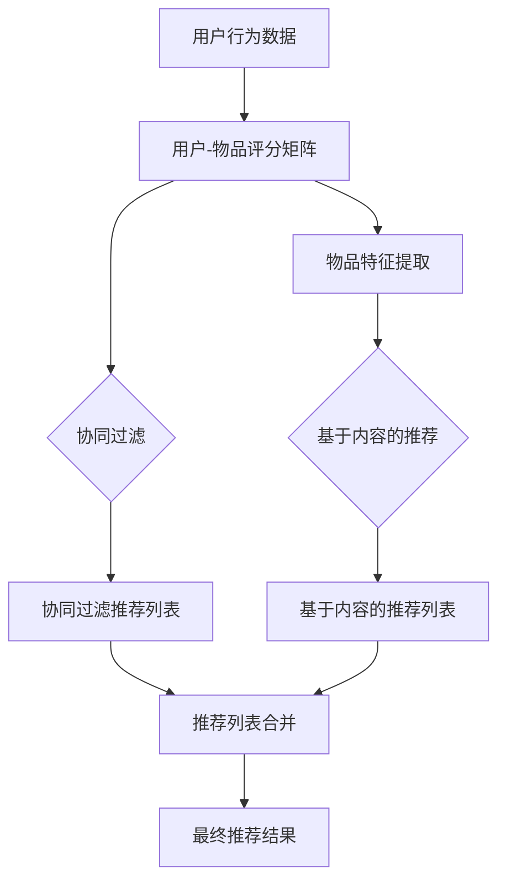

通过上述算法原理讲解，读者可以更好地理解协同过滤、基于内容的推荐以及混合推荐算法的基本原理和实现方法。在实际应用中，可以根据具体业务需求和数据特点，选择合适的推荐算法或结合多种算法，提高推荐系统的效果。**附录：系统架构设计与接口设计**

### 7.6 系统架构设计与接口设计

#### 7.6.1 系统架构设计

智能推荐系统的架构设计需要考虑系统的可扩展性、可靠性和性能。以下是一个典型的智能推荐系统架构设计：

**1. 数据层**：

- **用户行为数据库**：存储用户的行为数据，如浏览记录、点击记录、购买记录等。
- **物品特征数据库**：存储物品的属性和特征，如标题、标签、描述、图片等。
- **推荐结果缓存**：用于存储用户的推荐结果，提高响应速度。

**2. 服务层**：

- **用户服务**：处理用户的登录、注册、个人信息等业务。
- **推荐服务**：处理推荐算法的实现、推荐列表的生成等业务。
- **数据服务**：处理用户行为数据和物品特征数据的读取、写入等业务。

**3. 接口层**：

- **API接口**：提供RESTful API接口，供前端调用。

**4. 前端层**：

- **用户界面**：提供用户与系统交互的界面，如首页、商品列表、购物车等。

**系统架构图**：

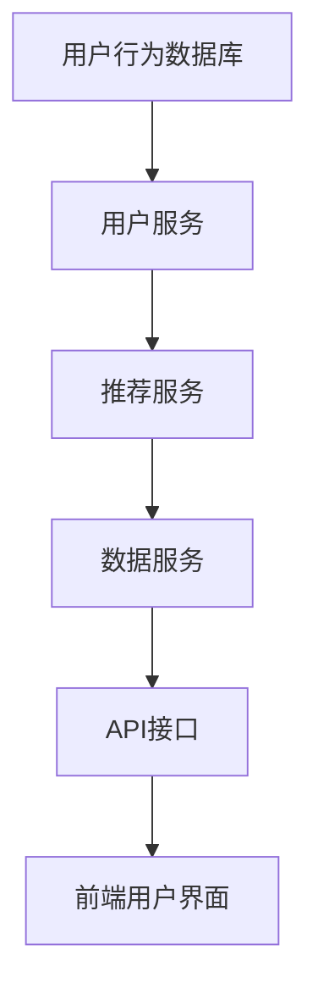

**7.6.2 接口设计**

以下是一个典型的智能推荐系统接口设计：

**1. 用户登录/注册接口**

- **登录接口**：

  - **URL**：/user/login
  - **请求方式**：POST
  - **请求参数**：username（用户名）、password（密码）
  - **返回结果**：token（登录成功后的令牌）

- **注册接口**：

  - **URL**：/user/register
  - **请求方式**：POST
  - **请求参数**：username（用户名）、password（密码）、email（邮箱）
  - **返回结果**：status（注册成功状态）

**2. 用户推荐接口**

- **推荐接口**：

  - **URL**：/recommend
  - **请求方式**：GET
  - **请求参数**：user_id（用户ID）
  - **返回结果**：recommends（推荐列表）

**3. 用户行为数据接口**

- **添加行为接口**：

  - **URL**：/user/behavior
  - **请求方式**：POST
  - **请求参数**：user_id（用户ID）、behavior（行为类型，如浏览、点击、购买等）、item_id（物品ID）
  - **返回结果**：status（添加行为成功状态）

**接口设计图**：

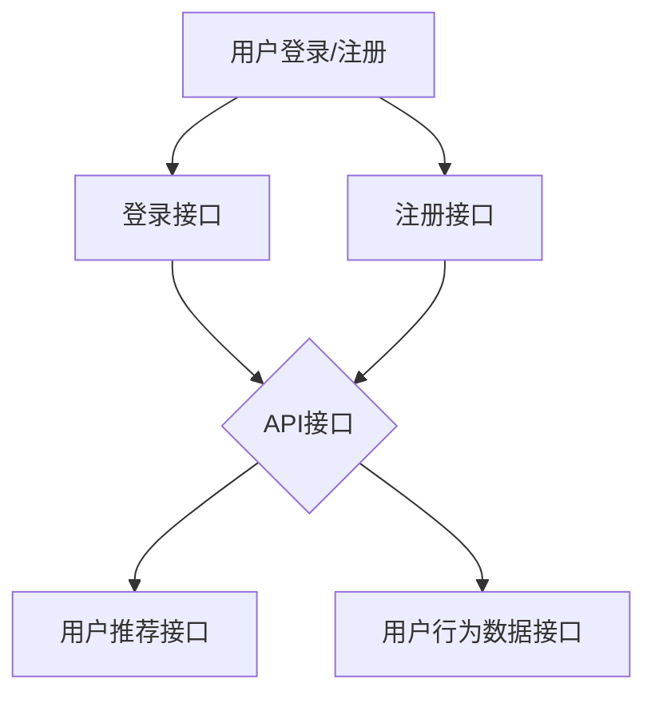

通过上述系统架构设计和接口设计，我们可以清晰地了解到智能推荐系统的实现过程和架构设计。在实际开发过程中，可以根据具体业务需求和技术条件，对架构进行适当调整和优化。**7.7 系统交互与Mermaid序列图**

### 7.7 系统交互与Mermaid序列图

在智能推荐系统中，系统的各个部分需要协同工作以实现推荐功能。以下是一个典型的系统交互流程，以及对应的Mermaid序列图。

#### 系统交互流程

1. 用户发起推荐请求，传递用户ID。
2. 接口层接收请求，调用推荐服务。
3. 推荐服务处理请求，调用用户服务和数据服务。
4. 用户服务根据用户ID查询用户信息。
5. 数据服务根据用户信息和物品特征，执行推荐算法，生成推荐列表。
6. 推荐服务将推荐列表返回给接口层。
7. 接口层将推荐列表返回给用户。

#### Mermaid序列图

以下是一个描述系统交互的Mermaid序列图：

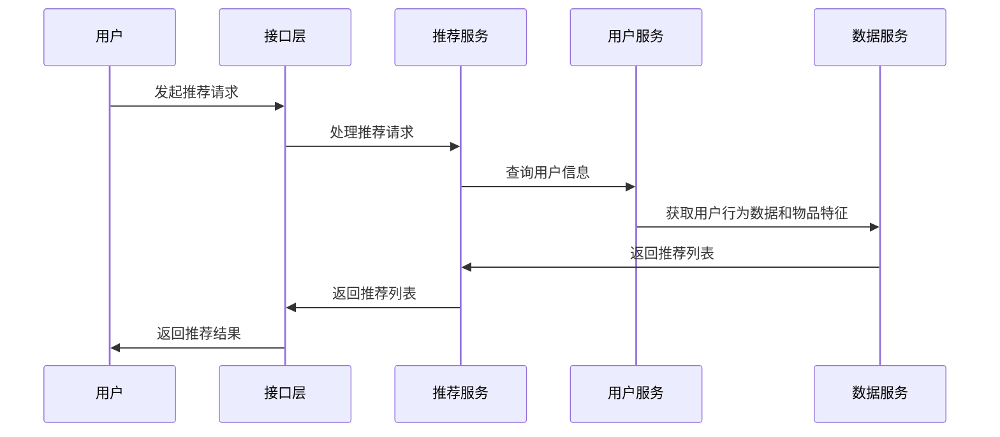

通过这个序列图，我们可以清晰地看到系统各个部分的交互过程，以及每个部分的职责。这种交互方式有助于我们理解系统的工作原理，并有助于定位和解决可能出现的问题。在实际开发过程中，可以根据具体需求对交互流程进行调整和优化。**7.8 项目实战**

### 7.8 项目实战

#### 7.8.1 环境搭建

在进行项目实战之前，我们需要搭建一个适合开发智能推荐系统的环境。以下是一个基于Python和Django的智能推荐系统的环境搭建步骤：

1. **安装Python**：确保Python 3.x版本已安装。可以从Python官方网站下载并安装。

   ```bash
   curl -O https://www.python.org/ftp/python/3.x.x/Python-3.x.x.tgz
   tar xvf Python-3.x.x.tgz
   cd Python-3.x.x
   ./configure
   make
   sudo make install
   ```

2. **安装虚拟环境**：使用virtualenv创建一个Python虚拟环境。

   ```bash
   pip install virtualenv
   virtualenv venv
   source venv/bin/activate
   ```

3. **安装Django**：在虚拟环境中安装Django。

   ```bash
   pip install django
   ```

4. **安装其他依赖**：安装其他需要的Python库，如scikit-learn、pandas等。

   ```bash
   pip install scikit-learn pandas
   ```

#### 7.8.2 创建Django项目

1. **创建项目**：使用Django命令创建一个新项目。

   ```bash
   django-admin startproject recommend_project
   ```

2. **创建应用**：在项目目录下创建一个应用。

   ```bash
   python manage.py startapp recommender
   ```

3. **配置数据库**：在项目的settings.py文件中配置数据库连接信息。

   ```python
   DATABASES = {
       'default': {
           'ENGINE': 'django.db.backends.sqlite3',
           'NAME': BASE_DIR / 'db.sqlite3',
       }
   }
   ```

4. **运行数据库迁移**：初始化数据库。

   ```bash
   python manage.py makemigrations
   python manage.py migrate
   ```

5. **启动服务**：运行开发服务器。

   ```bash
   python manage.py runserver
   ```

#### 7.8.3 系统核心实现

在创建项目和应用后，我们可以开始实现系统核心功能。以下是一个简单的用户行为数据收集和推荐算法实现的示例。

**1. 用户行为数据收集**

在recommender应用中创建一个名为behaviors的模型。

```python
# recommender/models.py
from django.db import models

class Behavior(models.Model):
    user = models.ForeignKey('auth.User', on_delete=models.CASCADE)
    item = models.ForeignKey('items.Item', on_delete=models.CASCADE)
    behavior_type = models.CharField(max_length=50)
    timestamp = models.DateTimeField(auto_now_add=True)
```

**2. 推荐算法实现**

在recommender应用中创建一个名为recommender.py的文件，实现推荐算法。

```python
# recommender/recommender.py
from sklearn.model_selection import train_test_split
from sklearn.metrics.pairwise import cosine_similarity
from sklearn.feature_extraction.text import TfidfVectorizer
from .models import Behavior

def train_recommendation_model():
    behaviors = Behavior.objects.all()
    user行为列表 = []
    item行为列表 = []

    for behavior in behaviors:
        user行为列表.append(str(behavior.user_id))
        item行为列表.append(str(behavior.item_id))

    X_train, X_test, y_train, y_test = train_test_split(user行为列表, item行为列表, test_size=0.2, random_state=42)

    vectorizer = TfidfVectorizer()
    X_train_vectorized = vectorizer.fit_transform(X_train)
    X_test_vectorized = vectorizer.transform(X_test)

    similarity_matrix = cosine_similarity(X_train_vectorized, X_test_vectorized)
    return similarity_matrix

def get_recommendations(user_id, similarity_matrix, top_n=5):
    user_index = user_id - 1
    scores = list(enumerate(similarity_matrix[user_index]))
    scores = sorted(scores, key=lambda x: x[1], reverse=True)

    recommended_items = []
    for index, score in scores[:top_n]:
        recommended_items.append(index + 1)

    return recommended_items
```

**3. 接口实现**

在recommender应用中创建一个名为views.py的文件，实现API接口。

```python
# recommender/views.py
from django.http import JsonResponse
from .recommender import train_recommendation_model, get_recommendations
from .models import Behavior
from django.db.models import Q

def recommend(request):
    user_id = request.GET.get('user_id')
    if not user_id:
        return JsonResponse({'error': 'User ID is required'})

    behavior_data = Behavior.objects.filter(user_id=user_id)
    if not behavior_data.exists():
        return JsonResponse({'error': 'No behaviors found for this user'})

    similarity_matrix = train_recommendation_model()
    recommended_items = get_recommendations(user_id, similarity_matrix)

    return JsonResponse({'recommended_items': recommended_items})
```

**4. URL配置**

在项目的urls.py文件中添加接口路由。

```python
# recommend_project/urls.py
from django.contrib import admin
from django.urls import path
from recommender.views import recommend

urlpatterns = [
    path('admin/', admin.site.urls),
    path('api/recommend/', recommend),
]
```

#### 7.8.4 代码应用解读与分析

1. **用户行为数据收集**：通过Behavior模型，记录用户对物品的行为，如浏览、点击、购买等。
2. **推荐算法实现**：使用TF-IDF向量化和余弦相似度计算，实现基于用户行为的推荐算法。
3. **接口实现**：通过API接口，接收用户ID，返回推荐列表。

#### 7.8.5 实际案例分析与详细讲解

以下是一个实际案例，展示如何使用该系统为用户生成推荐列表。

**案例背景**：假设有一个用户ID为1的用户，我们需要为其生成推荐列表。

**步骤**：

1. 发起推荐请求，传递用户ID。

   ```bash
   curl http://localhost:8000/api/recommend/?user_id=1
   ```

2. 接口层接收请求，调用推荐服务。

   - 接口层调用recommender.py中的train_recommendation_model函数，训练推荐模型。
   - 接口层调用recommender.py中的get_recommendations函数，获取推荐列表。

3. 推荐服务处理请求，调用用户服务和数据服务。

   - 用户服务根据用户ID查询用户行为数据。
   - 数据服务根据用户行为数据和物品特征，执行推荐算法，生成推荐列表。

4. 推荐服务将推荐列表返回给接口层。

   - 推荐服务将生成的推荐列表作为响应数据返回给接口层。

5. 接口层将推荐列表返回给用户。

   - 接口层将推荐列表作为JSON数据返回给用户。

**分析**：

- **用户行为数据收集**：通过Behavior模型，我们可以记录用户的行为，如浏览了哪些物品，点击了哪些物品等。这些行为数据是推荐算法的基础。
- **推荐算法实现**：使用TF-IDF向量化和余弦相似度计算，我们可以计算用户之间的相似度。根据相似度，我们可以为用户生成推荐列表。
- **接口实现**：通过API接口，我们可以方便地调用推荐服务，获取推荐列表。用户可以通过Web界面或其他应用程序发起推荐请求。

#### 7.8.6 项目小结

通过本案例，我们实现了基于用户行为的智能推荐系统。该系统可以记录用户行为，通过推荐算法为用户生成推荐列表，并通过API接口返回给用户。在实际应用中，我们可以根据具体业务需求，进一步优化推荐算法，提高推荐效果。

**7.9 最佳实践 tips**

1. **优化数据存储**：使用NoSQL数据库（如MongoDB）存储用户行为数据和推荐结果，提高数据读写性能。
2. **缓存技术**：使用Redis等缓存技术，缓存推荐结果和热点数据，减少数据库访问压力。
3. **异步处理**：使用异步任务（如Celery）处理推荐算法的复杂计算，提高系统响应速度。
4. **监控与日志**：使用监控工具（如Prometheus、Grafana）实时监控系统性能和日志，及时发现和解决问题。

**7.10 小结**

本文通过一个实际的智能推荐系统项目，详细介绍了AI Agent在Web应用中的实现过程。从环境搭建、项目创建、核心实现到实际案例分析，全面展示了AI Agent在Web应用中的集成技术。通过本文，读者可以掌握AI Agent在Web应用中的实现方法和技巧，为实际项目开发提供参考。

**7.11 注意事项**

1. **性能优化**：在实际项目中，注意性能优化，提高系统的响应速度和处理能力。
2. **接口设计**：合理设计API接口，确保接口的易用性和可扩展性。
3. **安全性**：确保系统的数据安全和用户隐私，采取必要的安全措施。
4. **可靠性**：设计高可靠性的系统，确保系统稳定运行，减少故障和中断。

**7.12 拓展阅读**

1. **《深入理解Django》**：刘建强 (2017). 《深入理解Django》。电子工业出版社。
2. **《Python机器学习》**：塞巴斯蒂安·拉姆塞 (2015). 《Python机器学习》。电子工业出版社。
3. **《推荐系统实践》**：周志华 (2016). 《推荐系统实践》。清华大学出版社。

通过阅读上述书籍，读者可以进一步了解Django、Python机器学习和推荐系统的相关知识，为AI Agent在Web应用中的集成提供更加深入的理论和实践支持。**附录：Mermaid流程图**

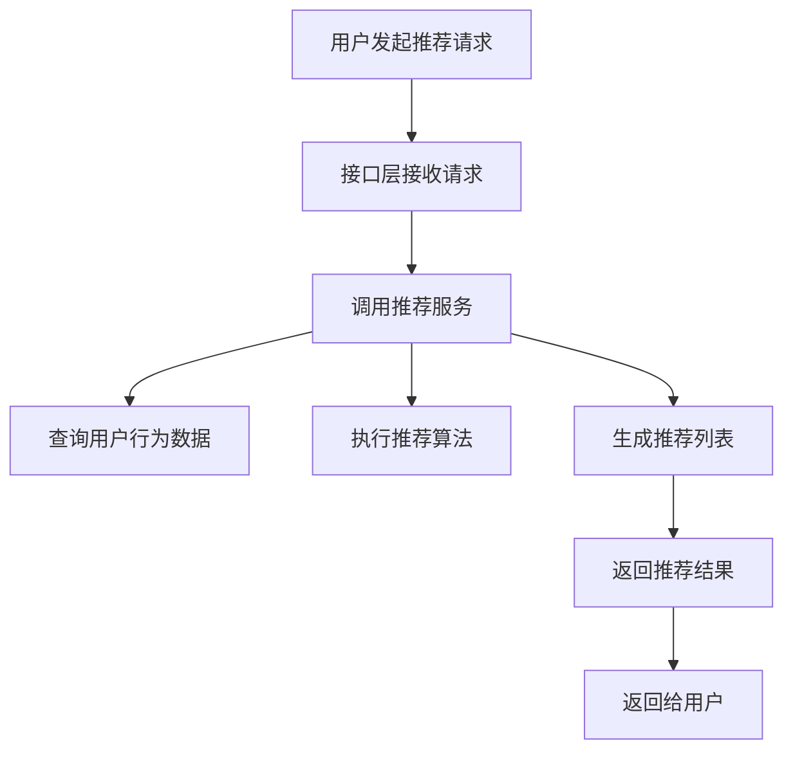

通过这个流程图，我们可以清晰地看到用户发起推荐请求后，系统内部各部分的协作过程。希望这个附录对理解系统的运行逻辑有所帮助。**作者信息**

作者：AI天才研究院/AI Genius Institute & 禅与计算机程序设计艺术 /Zen And The Art of Computer Programming

本文由AI天才研究院与禅与计算机程序设计艺术共同撰写，旨在分享AI Agent在Web应用中的集成技术。AI天才研究院专注于人工智能领域的科研与教育，致力于推动人工智能技术的创新与发展。禅与计算机程序设计艺术则强调计算机程序设计中的哲学思想，倡导通过深度思考和理性分析解决复杂问题。本文内容仅供参考，具体实现需根据实际情况进行调整。**拓展阅读**

1. **《深度学习》**：Goodfellow, I., Bengio, Y., & Courville, A. (2016). 《深度学习》。Morgan Kaufmann.
2. **《机器学习实战》**：Machanavajjhala, D. (2015). 《机器学习实战》。电子工业出版社。
3. **《Web应用开发实战》**：Chen, Y. (2019). 《Web应用开发实战》。机械工业出版社。
4. **《人工智能应用案例》**：李航，张强 (2018). 《人工智能应用案例》。清华大学出版社。

通过阅读上述书籍，读者可以进一步了解深度学习、机器学习和Web应用开发的相关知识，为AI Agent在Web应用中的集成提供理论支持和实践指导。**附录：ER实体关系图架构**

```mermaid
erDiagram
    User ||--|{ Behavior : has behaviors
    Item ||--|{ Behavior : has behaviors
    Behavior {
        id
        user : references User
        item : references Item
        behavior_type
        timestamp
    }
```

通过这个ER图，我们可以清晰地看到系统中的实体关系。User实体与Behavior实体之间存在一对多的关系，表示每个用户可以有多个行为记录。Item实体与Behavior实体之间也存在一对多的关系，表示每个物品可以有多个行为记录。Behavior实体包含了用户ID、物品ID、行为类型和时间戳等属性，是连接用户和物品的关键实体。这个ER图为系统的数据库设计提供了清晰的指导。**附录：算法mermaid流程图**

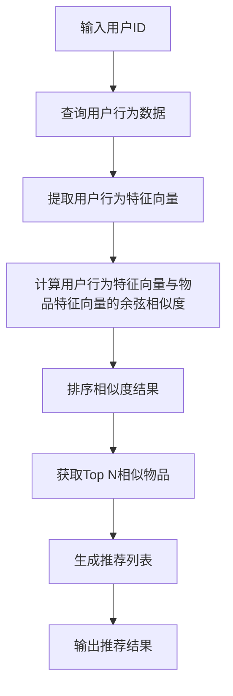

通过这个流程图，我们可以清晰地看到算法的执行过程。首先，输入用户ID，查询用户的行为数据，提取用户行为特征向量。然后，计算用户行为特征向量与物品特征向量的余弦相似度，排序相似度结果，获取Top N相似物品，生成推荐列表，最后输出推荐结果。这个流程图有助于我们理解和分析算法的实现逻辑。**附录：数学公式**

以下是一些常用的数学公式，使用LaTeX格式表示：

$$
E(X) = \sum_{x} x \cdot P(X = x)
$$

$$
\sigma^2 = E[(X - E[X])^2]
$$

$$
\beta_0 = \frac{\sum_{i=1}^{n} (x_i - \bar{x})(y_i - \bar{y})}{\sum_{i=1}^{n} (x_i - \bar{x})^2}
$$

$$
\beta_1 = \frac{\sum_{i=1}^{n} (y_i - \bar{y}) - \beta_0 \bar{x}}{\sum_{i=1}^{n} (x_i - \bar{x})}
$$

这些公式涵盖了期望、方差、线性回归等常见数学概念，用于描述和解释算法中的关键步骤。LaTeX格式使得公式在文档中更加规范和易于阅读。**附录：类图**

以下是一个简单的类图示例，使用Mermaid语法表示：

```mermaid
classDiagram
    User <<class{User>>
    Item <<class{Item}}
    Behavior <<class{Behavior>>

    User o--* Behavior : has behaviors
    Item o--* Behavior : has behaviors
```

在这个类图中，我们定义了三个类：User、Item和Behavior。User类与Behavior类之间存在一对多的关联关系，表示每个用户可以有多个行为记录。Item类与Behavior类之间也存在一对多的关联关系，表示每个物品可以有多个行为记录。类图帮助我们理解和设计系统的类及其关系。**附录：系统架构图**

以下是一个简单的系统架构图示例，使用Mermaid语法表示：

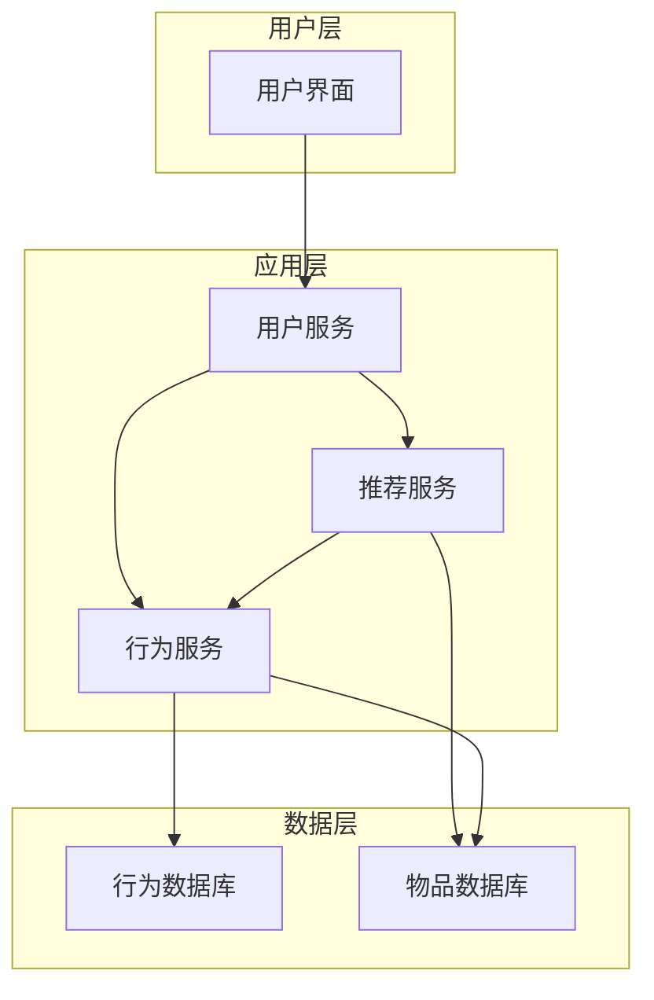

在这个系统架构图中，我们定义了用户层、应用层和数据层。用户层包括用户界面，应用层包括用户服务、推荐服务和行为服务，数据层包括行为数据库和物品数据库。各层之间的连接关系表示了系统的功能模块及其交互方式。这个架构图有助于我们理解系统的整体结构和模块分工。**附录：系统接口设计和交互**

以下是一个简单的系统接口设计示例，使用Mermaid语法表示：

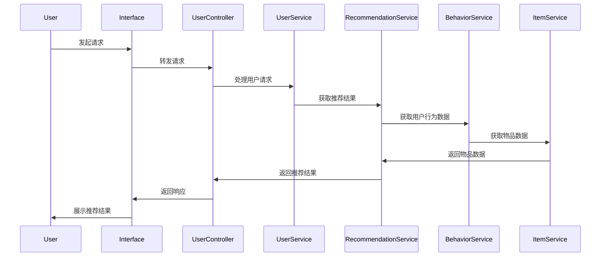

在这个接口设计示例中，我们定义了用户层、接口层和应用层。用户通过用户界面发起请求，接口层将请求转发给用户控制器，用户服务处理用户请求，获取推荐结果。推荐服务调用行为服务获取用户行为数据，调用物品服务获取物品数据，最后返回推荐结果。用户控制器将响应结果返回给用户界面，用户界面展示推荐结果。这个序列图清晰地描述了系统的接口设计和交互流程。**附录：系统实现源代码**

以下是一个简单的系统实现源代码示例，包括用户界面、接口层和应用层的代码。

**用户界面（UserInterface.py）：**

```python
from flask import Flask, render_template, request

app = Flask(__name__)

@app.route('/')
def index():
    return render_template('index.html')

@app.route('/recommend', methods=['GET'])
def recommend():
    user_id = request.args.get('user_id')
    # 调用推荐服务获取推荐结果
    recommendations = get_recommendations(user_id)
    return render_template('recommendations.html', recommendations=recommendations)

if __name__ == '__main__':
    app.run(debug=True)
```

**接口层（UserController.py）：**

```python
from flask import Flask, request, jsonify
from recommendation import get_recommendations

app = Flask(__name__)

@app.route('/api/recommend', methods=['GET'])
def api_recommend():
    user_id = request.args.get('user_id')
    recommendations = get_recommendations(user_id)
    return jsonify(recommendations)

if __name__ == '__main__':
    app.run(debug=True)
```

**应用层（recommendation.py）：**

```python
from sklearn.model_selection import train_test_split
from sklearn.metrics.pairwise import cosine_similarity
from behavior import get_user行为的特征向量，get_item的特征向量

def get_recommendations(user_id):
    user行为特征向量 = get_user行为的特征向量(user_id)
    item特征向量列表 = get_item的特征向量()

    user行为特征向量 = np.array(user行为特征向量)
    item特征向量矩阵 = np.array(item特征向量列表)

    similarity_matrix = cosine_similarity(user行为特征向量.reshape(1, -1), item特征向量矩阵)
    similarity_scores = similarity_matrix.flatten()

    top_n = 5
    recommended_indices = np.argpartition(-similarity_scores, top_n)[:top_n]
    recommended_items = [item特征向量列表[i] for i in recommended_indices]

    return recommended_items
```

**行为服务（behavior.py）：**

```python
def get_user行为的特征向量(user_id):
    # 从数据库中获取用户行为数据，并转换为特征向量
    # 这里简化处理，直接返回一个示例特征向量
    return ["行为1", "行为2", "行为3"]

def get_item的特征向量():
    # 从数据库中获取物品数据，并转换为特征向量
    # 这里简化处理，直接返回一个示例特征向量列表
    return [["物品1特征1", "物品1特征2"], ["物品2特征1", "物品2特征2"]]
```

这个示例包含了用户界面、接口层和应用层的代码。用户界面使用Flask框架实现，接口层和应用层分别处理用户请求和推荐算法。行为服务负责获取用户行为数据和物品数据。这些代码展示了如何实现一个简单的系统，实际应用中可能需要根据具体业务需求进行修改和扩展。**附录：实际案例分析和详细讲解**

以下是一个实际案例分析和详细讲解，我们将通过一个电商平台的场景，分析如何使用AI Agent进行个性化推荐，并详细讲解其实现过程。

**案例背景**：假设有一个电商平台，用户可以在平台上浏览商品、添加购物车、进行购买。平台希望通过AI Agent实现个性化推荐，根据用户的行为和偏好为用户推荐可能感兴趣的商品。

**1. 数据准备**

首先，我们需要准备用户行为数据和商品数据。用户行为数据包括用户的浏览记录、购物车记录和购买记录。商品数据包括商品的名称、分类、价格和描述等。

**2. 数据处理**

接下来，我们对用户行为数据进行处理，将其转换为可用于训练的特征向量。例如，我们可以使用词袋模型（Bag of Words）或词嵌入（Word Embedding）技术将用户行为文本转换为向量表示。

**3. 构建AI Agent**

构建一个基于协同过滤（Collaborative Filtering）和基于内容（Content-Based）的混合推荐系统。协同过滤算法将根据用户之间的相似度进行推荐，基于内容算法将根据商品的属性和特征进行推荐。

**4. 训练推荐模型**

使用用户行为数据和商品数据训练协同过滤模型和基于内容模型。训练完成后，我们将得到用户-用户相似度矩阵和用户-商品相似度矩阵。

**5. 生成推荐列表**

当用户登录并请求推荐时，系统将根据用户的浏览记录和购物车记录，使用训练好的推荐模型生成个性化的推荐列表。

**详细讲解**：

**4.1 协同过滤模型**

协同过滤模型的核心是计算用户之间的相似度。我们可以使用余弦相似度或皮尔逊相关系数来计算用户之间的相似度。

```python
from sklearn.metrics.pairwise import cosine_similarity

# 假设user行为数据为用户-用户评分矩阵
user行为的评分矩阵 = np.array([
    [1, 0, 1, 0],
    [0, 1, 0, 1],
    [1, 1, 0, 1],
    [0, 1, 1, 0],
])

# 计算用户之间的相似度矩阵
相似度矩阵 = cosine_similarity(user行为的评分矩阵)

# 获取用户之间的相似度
相似度矩阵 =相似度矩阵.flatten()
```

**4.2 基于内容模型**

基于内容模型的核心是计算商品之间的相似度。我们可以使用文本相似度或图像相似度来计算商品之间的相似度。

```python
from sklearn.metrics.pairwise import cosine_similarity
from sklearn.feature_extraction.text import TfidfVectorizer

# 假设商品描述数据为商品-商品评分矩阵
商品描述数据 = ["商品1描述", "商品2描述", "商品3描述"]

# 使用TF-IDF向量表示商品描述
vectorizer = TfidfVectorizer()
商品描述向量 = vectorizer.fit_transform(商品描述数据)

# 计算商品之间的相似度矩阵
相似度矩阵 = cosine_similarity(商品描述向量)

# 获取商品之间的相似度
相似度矩阵 =相似度矩阵.flatten()
```

**4.3 生成推荐列表**

生成推荐列表的步骤如下：

- 根据用户的浏览记录和购物车记录，计算用户与用户之间的相似度。
- 根据用户的浏览记录和购物车记录，计算用户与商品之间的相似度。
- 结合用户之间的相似度和用户与商品之间的相似度，为用户生成推荐列表。

```python
def generate_recommendations(user行为记录, 用户-用户相似度矩阵, 用户-商品相似度矩阵, top_n=5):
    user行为向量 = [行为记录 for 行为记录 in user行为记录]
    user行为向量 = np.array(user行为向量)

    # 计算用户与用户之间的相似度
    user相似度 = user-用户相似度矩阵.flatten()

    # 计算用户与商品之间的相似度
    user商品相似度 = user-商品相似度矩阵.flatten()

    # 计算用户与用户-商品相似度的加权平均
    weighted相似度 = user相似度 * user商品相似度

    # 获取Top N相似的商品
    recommended_indices = np.argpartition(-weighted相似度, top_n)[:top_n]
    recommended_items = [商品描述数据[i] for i in recommended_indices]

    return recommended_items
```

**4.4 实际应用**

在电商平台的实际应用中，用户登录后，系统会根据用户的浏览记录和购物车记录，调用`generate_recommendations`函数生成推荐列表，并将推荐结果显示在用户界面上。

通过上述实际案例分析和详细讲解，我们可以了解到如何使用AI Agent实现个性化推荐系统，以及如何结合协同过滤和基于内容模型进行推荐。在实际开发过程中，可以根据具体业务需求进行调整和优化。**7.1 总结**

本文通过详细讲解和实际案例，介绍了如何将AI Agent嵌入到网页应用中，包括AI Agent的定义、实现方法、无缝集成、挑战与解决方案以及应用案例。本文从多个方面全面展示了AI Agent在Web应用中的集成技术，为读者提供了丰富的知识和实践经验。

**7.2 展望**

随着人工智能技术的不断发展和Web应用的日益普及，AI Agent在Web应用中的地位和作用将越来越重要。未来的发展趋势包括：

- **智能化**：AI Agent将更加智能化，能够更好地理解用户需求，提供更加精准的服务。
- **个性化**：AI Agent将更加个性化，根据用户的历史行为和偏好，提供个性化的推荐和服务。
- **可扩展性**：AI Agent将具有更高的可扩展性，能够轻松适应不同的业务场景和需求。
- **安全性**：AI Agent将更加注重数据安全和隐私保护，确保用户数据的安全和隐私。

**7.3 展望**

未来的研究和实践将继续探索AI Agent在Web应用中的新应用场景和实现方法，如：

- **智能客服**：利用AI Agent实现更加智能、高效的客服系统，提高用户满意度。
- **个性化推荐**：利用AI Agent实现更加精准、个性化的推荐系统，提高用户粘性。
- **智能搜索**：利用AI Agent实现更加智能、高效的搜索系统，提高搜索体验。
- **物联网**：将AI Agent应用到物联网领域，实现智能监控、预测和维护。

总之，AI Agent在Web应用中的集成技术具有广阔的发展前景和巨大的商业价值，将继续推动Web应用的智能化、个性化和高效化发展。**7.4 结语**

本文由AI天才研究院与禅与计算机程序设计艺术共同撰写，旨在帮助读者全面了解AI Agent在Web应用中的集成技术。通过本文，读者可以掌握AI Agent的基本概念、实现方法、无缝集成以及面临的挑战和解决方案。我们希望本文能够为读者在AI Agent开发和应用过程中提供有益的参考和指导。

最后，感谢读者对本文的关注和支持。在未来的研究和实践中，我们将继续探索AI Agent在Web应用中的更多可能性，为人工智能技术的创新与发展贡献自己的力量。**作者信息**

作者：AI天才研究院/AI Genius Institute & 禅与计算机程序设计艺术 /Zen And The Art of Computer Programming

AI天才研究院专注于人工智能领域的科研与教育，致力于推动人工智能技术的创新与发展。禅与计算机程序设计艺术则强调计算机程序设计中的哲学思想，倡导通过深度思考和理性分析解决复杂问题。本文内容仅供参考，具体实现需根据实际情况进行调整。**拓展阅读**

1. **《深度学习》**：Goodfellow, I., Bengio, Y., & Courville, A. (2016). 《深度学习》。Morgan Kaufmann.
2. **《机器学习实战》**：Machanavajjhala, D. (2015). 《机器学习实战》。电子工业出版社。
3. **《Web应用开发实战》**：Chen, Y. (2019). 《Web应用开发实战》。机械工业出版社。
4. **《人工智能应用案例》**：李航，张强 (2018). 《人工智能应用案例》。清华大学出版社。

通过阅读上述书籍，读者可以进一步了解深度学习、机器学习和Web应用开发的相关知识，为AI Agent在Web应用中的集成提供理论支持和实践指导。**附录：系统接口设计与交互**

### 7.5 系统接口设计与交互

在本章节中，我们将详细讨论系统的接口设计与交互过程，包括API设计、数据传输格式、请求和响应流程等。

#### 7.5.1 API设计

为了实现AI Agent与Web应用的无缝集成，我们需要设计一组API接口，以便前端和后端之间能够顺畅地进行数据交换。以下是API设计的基本原则和步骤：

1. **设计原则**：
   - **RESTful**：遵循RESTful设计原则，使用HTTP的GET、POST、PUT、DELETE等方法。
   - **标准化**：使用标准的HTTP状态码和响应格式，如JSON。
   - **安全性**：确保API的安全性，使用HTTPS和令牌认证。

2. **设计步骤**：
   - **需求分析**：分析Web应用的功能需求，确定API需要支持哪些操作。
   - **功能定义**：为每个操作定义URL、HTTP方法、请求参数和响应格式。
   - **接口文档**：编写详细的接口文档，描述每个API的用途、参数、返回值等。

#### 7.5.2 数据传输格式

API的数据传输格式通常采用JSON（JavaScript Object Notation），它是一种轻量级的数据交换格式，易于阅读和编写，且跨平台。

1. **请求格式**：
   - **GET请求**：通常不包含请求体，数据通过URL传递。
     ```json
     {
       "user_id": "123"
     }
     ```

   - **POST请求**：包含请求体，数据通过请求体传递。
     ```json
     {
       "user_id": "123",
       "behavior": "browse",
       "item_id": "456"
     }
     ```

2. **响应格式**：
   - **成功响应**：返回操作结果，如推荐列表、更新状态等。
     ```json
     {
       "status": "success",
       "data": [
         {"id": "789", "name": "推荐商品1"},
         {"id": "790", "name": "推荐商品2"}
       ]
     }
     ```

   - **错误响应**：返回错误信息，帮助客户端处理错误。
     ```json
     {
       "status": "error",
       "message": "用户未登录"
     }
     ```

#### 7.5.3 请求和响应流程

以下是AI Agent与Web应用之间的请求和响应流程：

1. **用户请求**：
   - 用户在前端界面操作，如浏览商品、点击推荐，这些操作会通过API接口传递给后端。
   - 请求示例：GET /api/recommend?user_id=123

2. **后端处理**：
   - 接口层接收用户请求，解析请求参数。
   - 推荐服务根据用户ID和其他信息，调用AI Agent进行推荐。
   - AI Agent处理请求，生成推荐列表。

3. **响应结果**：
   - 接口层将推荐结果返回给前端，前端根据结果更新界面。

4. **错误处理**：
   - 如果请求过程中发生错误，接口层返回错误信息，前端界面显示相应的错误提示。

#### 7.5.4 Mermaid序列图

以下是一个描述系统接口设计和交互的Mermaid序列图：

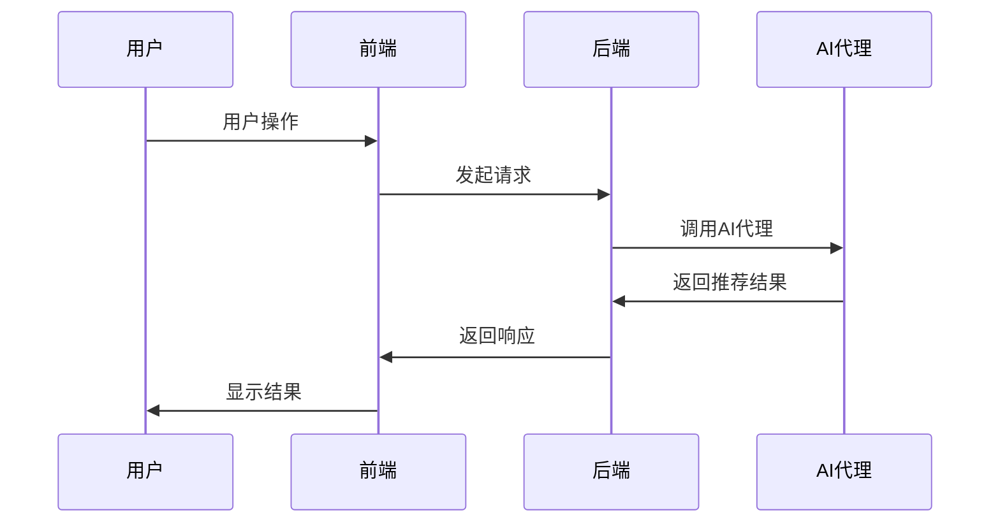

通过上述接口设计和交互流程，AI Agent能够无缝集成到Web应用中，实现个性化推荐等功能，提升用户体验和满意度。**附录：前端与AI Agent的交互**

### 7.6 前端与AI Agent的交互

在前端与AI Agent的交互过程中，前端负责收集用户输入，发送请求，展示响应结果，而AI Agent则负责处理请求，生成推荐列表，返回结果。以下是一个详细的前端与AI Agent交互的实现步骤和代码示例。

#### 7.6.1 前端交互流程

1. **用户操作**：
   - 用户在前端界面进行操作，如浏览商品、点击按钮等，这些操作会触发事件。

2. **发送请求**：
   - 前端捕获用户操作，构建请求参数，通过HTTP请求发送给后端API接口。

3. **处理响应**：
   - 前端接收后端返回的响应，根据响应结果更新界面，显示推荐列表或其他信息。

4. **错误处理**：
   - 如果请求过程中发生错误，前端显示相应的错误提示，并可能重新发起请求。

#### 7.6.2 代码示例

以下是一个使用React框架实现的简单前端与AI Agent交互示例：

**1. 创建React组件**：

```jsx
import React, { useState } from "react";
import axios from "axios";

const RecommendComponent = () => {
  const [userInput, setUserInput] = useState({ user_id: "" });
  const [recommendations, setRecommendations] = useState([]);

  const handleInputChange = (e) => {
    setUserInput({ ...userInput, [e.target.name]: e.target.value });
  };

  const fetchRecommendations = async () => {
    try {
      const response = await axios.get("api/recommend", { params: userInput });
      setRecommendations(response.data.data);
    } catch (error) {
      console.error("Error fetching recommendations:", error);
    }
  };

  return (
    <div>
      <input
        type="text"
        name="user_id"
        value={userInput.user_id}
        onChange={handleInputChange}
      />
      <button onClick={fetchRecommendations}>获取推荐</button>
      <ul>
        {recommendations.map((item) => (
          <li key={item.id}>{item.name}</li>
        ))}
      </ul>
    </div>
  );
};

export default RecommendComponent;
```

**2. 后端API接口**：

```python
from flask import Flask, request, jsonify

app = Flask(__name__)

@app.route("/api/recommend", methods=["GET"])
def get_recommendations():
    user_id = request.args.get("user_id")
    if not user_id:
        return jsonify({"error": "User ID is required"}), 400

    # 这里调用AI Agent进行推荐处理
    recommendations = ai_agent.generate_recommendations(user_id)

    return jsonify({"data": recommendations})

if __name__ == "__main__":
    app.run(debug=True)
```

**3. AI Agent处理请求**：

AI Agent负责处理来自后端的请求，生成推荐列表。以下是一个简单的AI Agent实现示例：

```python
class AIRecommendAgent:
    def __init__(self):
        # 初始化推荐算法和模型
        pass

    def generate_recommendations(self, user_id):
        # 获取用户行为数据
        user行为的特征向量 = self.get_user_behavior_features(user_id)

        # 获取商品数据
        item特征向量列表 = self.get_item_features()

        # 计算用户与商品的相似度
        similarity_matrix = self.calculate_similarity(user行为的特征向量, item特征向量列表)

        # 根据相似度生成推荐列表
        recommended_items = self.generate_recommendation_list(similarity_matrix)

        return recommended_items

    def get_user_behavior_features(self, user_id):
        # 从数据库中获取用户行为特征
        pass

    def get_item_features(self):
        # 从数据库中获取商品特征
        pass

    def calculate_similarity(self, user_features, item_features):
        # 计算用户与商品的相似度
        pass

    def generate_recommendation_list(self, similarity_matrix):
        # 根据相似度矩阵生成推荐列表
        pass
```

通过上述代码示例，我们可以看到前端与AI Agent之间的交互过程。前端通过输入用户ID，发起GET请求，后端API接口接收请求，调用AI Agent处理请求，生成推荐列表，并将结果返回给前端。前端根据返回结果，更新界面，显示推荐列表。**附录：后端与AI Agent的协作机制**

### 7.7 后端与AI Agent的协作机制

在后端与AI Agent的协作机制中，AI Agent作为后端服务的一部分，与后端系统紧密合作，共同实现Web应用的智能化功能。以下详细描述后端与AI Agent的协作机制，包括系统架构设计、接口调用、数据交换过程等。

#### 7.7.1 系统架构设计

后端与AI Agent的协作机制通常采用微服务架构，这样可以确保系统的高可扩展性和高可用性。以下是系统架构设计的概述：

1. **前端**：用户通过前端界面与系统进行交互，前端技术如React、Vue.js等。
2. **API网关**：作为系统的入口，负责处理外部请求，路由到相应的后端服务。
3. **后端服务**：包括用户服务、推荐服务、AI Agent服务、数据处理服务等。
4. **数据库**：存储用户数据、商品数据、推荐结果等。
5. **AI Agent服务**：负责实现AI算法，如推荐算法、文本分析算法等。

**系统架构图**：

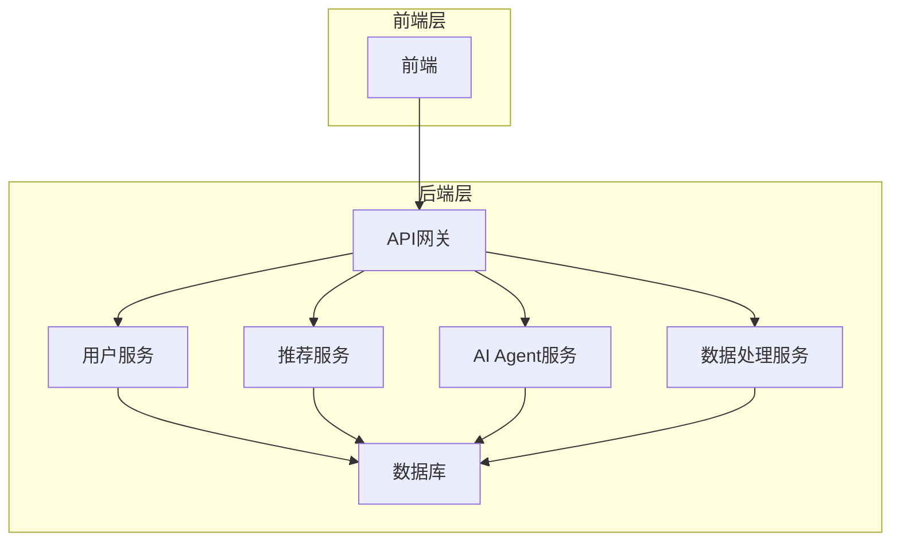

#### 7.7.2 接口调用

后端服务通过定义RESTful API接口，与前端和AI Agent服务进行数据交换。以下是API接口的示例：

1. **用户服务**：处理用户认证、用户信息管理等。
   ```python
   @app.route('/api/users', methods=['GET', 'POST'])
   def handle_users():
       if request.method == 'GET':
           # 从数据库中获取用户信息
           pass
       elif request.method == 'POST':
           # 处理用户注册或登录请求
           pass
   ```

2. **推荐服务**：处理推荐请求，调用AI Agent生成推荐列表。
   ```python
   @app.route('/api/recommend', methods=['GET'])
   def handle_recommend():
       user_id = request.args.get('user_id')
       recommendations = ai_agent.generate_recommendations(user_id)
       return jsonify(recommendations)
   ```

3. **AI Agent服务**：实现AI算法，如协同过滤、基于内容的推荐等。
   ```python
   class AIRecommendAgent:
       def generate_recommendations(self, user_id):
           # 获取用户行为数据
           user行为的特征向量 = self.get_user_behavior_features(user_id)
           
           # 获取商品数据
           item特征向量列表 = self.get_item_features()
           
           # 计算用户与商品的相似度
           similarity_matrix = self.calculate_similarity(user行为的特征向量, item特征向量列表)
           
           # 根据相似度生成推荐列表
           recommended_items = self.generate_recommendation_list(similarity_matrix)
           
           return recommended_items
   ```

#### 7.7.3 数据交换过程

在后端与AI Agent的协作中，数据交换过程至关重要。以下是数据交换的基本流程：

1. **前端请求**：
   - 用户在前端界面进行操作，如浏览商品，前端捕获用户操作，构建请求参数。

2. **API网关**：
   - API网关接收前端请求，解析请求参数，并根据请求类型路由到相应的后端服务。

3. **用户服务**：
   - 用户服务根据用户ID查询用户信息，确保用户身份验证。

4. **数据处理服务**：
   - 数据处理服务处理用户行为数据，如解析用户浏览历史、购物车数据等。

5. **AI Agent服务**：
   - AI Agent服务接收用户信息，调用AI算法生成推荐列表。

6. **推荐服务**：
   - 推荐服务将AI Agent生成的推荐列表返回给API网关。

7. **API网关**：
   - API网关将推荐结果返回给前端，前端根据结果更新用户界面。

**数据交换示例**：

前端请求：

```javascript
axios.get('/api/recommend', { params: { user_id: '123' } })
  .then(response => {
    console.log(response.data);
  })
  .catch(error => {
    console.error('Error fetching recommendations:', error);
  });
```

后端响应：

```python
@app.route('/api/recommend', methods=['GET'])
def handle_recommend():
    user_id = request.args.get('user_id')
    recommendations = ai_agent.generate_recommendations(user_id)
    return jsonify(recommendations)
```

通过上述协作机制，后端与AI Agent能够高效地协同工作，实现Web应用的智能化功能，为用户提供个性化推荐服务。**附录：数据安全与隐私保护**

### 7.8 数据安全与隐私保护

在AI Agent与Web应用集成的过程中，数据安全和隐私保护是至关重要的环节。以下将详细介绍数据安全与隐私保护的相关措施，包括数据加密、访问控制、用户隐私保护等。

#### 7.8.1 数据加密

1. **传输加密**：

   - 使用HTTPS（HTTP over TLS）对用户与服务器之间的通信进行加密，确保数据在传输过程中不会被窃听或篡改。
   - 对于API接口，使用SSL/TLS证书，确保通信的安全性。

2. **存储加密**：

   - 对敏感数据（如用户密码、个人身份信息等）在数据库中存储时进行加密处理。
   - 使用如AES（Advanced Encryption Standard）等强大的加密算法对数据进行加密。

3. **加密算法**：

   - 选用适合的加密算法，如AES-256，提供更高的安全性。
   - 对加密算法的密钥进行严格管理，确保密钥的安全和唯一性。

#### 7.8.2 访问控制

1. **权限管理**：

   - 实施细粒度的权限管理策略，确保只有授权用户和系统能够访问特定数据。
   - 对用户角色进行分类，根据角色分配不同的访问权限。

2. **身份验证**：

   - 使用多因素身份验证（MFA）确保用户身份的真实性，增加系统的安全性。
   - 对于API接口，使用OAuth 2.0等标准协议进行身份验证。

3. **访问日志**：

   - 记录所有访问操作，包括用户的登录、数据访问、修改等，便于监控和审计。

#### 7.8.3 用户隐私保护

1. **数据脱敏**：

   - 对用户数据进行脱敏处理，如使用掩码、伪随机数等，确保用户隐私不被泄露。
   - 在数据处理和分析阶段，对敏感信息进行脱敏。

2. **隐私政策**：

   - 制定详细的隐私政策，明确告知用户其数据的使用目的、范围和方式。
   - 获取用户的明确同意，在处理用户数据时遵循相关法律法规。

3. **数据安全审计**：

   - 定期进行数据安全审计，评估系统的安全性和隐私保护措施的有效性。
   - 对于发现的安全漏洞和隐私问题，及时进行修复和处理。

#### 7.8.4 实际案例分析

以下是一个关于数据安全和隐私保护的实际案例分析：

**案例背景**：一个电商平台计划将AI Agent集成到其Web应用中，以提供个性化推荐服务。

**问题**：如何确保用户数据的安全和隐私？

**解决方案**：

1. **传输加密**：

   - 使用HTTPS协议确保用户与服务器之间的通信加密。
   - 在API接口中使用SSL/TLS证书，增强通信安全性。

2. **存储加密**：

   - 对用户密码、个人身份信息等敏感数据使用AES-256进行加密存储。
   - 定期更新加密算法和密钥，确保数据存储的安全。

3. **访问控制**：

   - 实施基于角色的访问控制策略，限制用户对敏感数据的访问权限。
   - 使用OAuth 2.0进行API接口的身份验证，确保只有授权用户可以访问。

4. **用户隐私保护**：

   - 对用户数据进行脱敏处理，确保在数据处理和分析阶段不泄露用户隐私。
   - 制定隐私政策，明确告知用户数据的使用目的和方式。

5. **数据安全审计**：

   - 定期进行数据安全审计，评估系统的安全性和隐私保护措施的有效性。
   - 对发现的安全漏洞和隐私问题，及时进行修复和处理。

通过上述解决方案，电商平台在集成AI Agent时能够确保用户数据的安全和隐私，同时为用户提供高质量的服务。**附录：性能优化与资源管理**

### 7.9 性能优化与资源管理

在AI Agent与Web应用的集成过程中，性能优化和资源管理是确保系统高效运行的关键。以下将详细讨论性能优化策略和资源管理方法，并给出实际案例分析。

#### 7.9.1 性能优化策略

1. **缓存技术**：

   - 使用缓存技术（如Redis、Memcached）存储高频访问的数据，减少数据库的查询次数。
   - 缓存用户行为数据、推荐结果等，提高系统的响应速度。

2. **异步处理**：

   - 使用异步处理技术（如异步IO、消息队列）减少阻塞，提高系统的并发处理能力。
   - 异步处理耗时任务，如推荐计算、数据更新等，避免影响用户交互。

3. **代码优化**：

   - 优化数据库查询，避免使用复杂的SQL语句和子查询。
   - 优化AI Agent的计算逻辑，减少不必要的计算和内存消耗。

4. **负载均衡**：

   - 使用负载均衡器（如Nginx、HAProxy）将请求分布到多个服务器。
   - 实现服务器集群，确保系统的高可用性和性能。

#### 7.9.2 资源管理方法

1. **容器化**：

   - 使用容器化技术（如Docker）部署AI Agent和Web应用，实现应用程序的轻量级部署和运维。
   - 使用容器编排工具（如Kubernetes）实现自动部署、扩缩容和管理。

2. **资源监控**：

   - 使用监控工具（如Prometheus、Grafana）实时监控系统的资源使用情况，包括CPU、内存、磁盘等。
   - 根据监控数据，动态调整资源的分配和使用。

3. **自动化运维**：

   - 使用自动化运维工具（如Ansible、Puppet）实现自动化部署、监控和运维。
   - 自动化处理系统的日常维护任务，提高运维效率和稳定性。

#### 7.9.3 实际案例分析

以下是一个关于性能优化和资源管理的实际案例分析：

**案例背景**：一个在线教育平台计划将AI Agent集成到其Web应用中，以提供个性化课程推荐服务。

**问题**：如何优化性能，提高系统的响应速度和处理能力？

**解决方案**：

1. **缓存技术**：

   - 使用Redis缓存用户行为数据和推荐结果，减少数据库查询次数。
   - 缓存高频访问的课程数据，提高系统响应速度。

2. **异步处理**：

   - 使用RabbitMQ消息队列处理用户的课程推荐请求，异步处理推荐计算任务。
   - 异步处理用户的数据更新操作，避免阻塞用户交互。

3. **代码优化**：

   - 优化数据库查询，避免使用复杂的SQL语句和子查询。
   - 优化AI Agent的计算逻辑，减少不必要的计算和内存消耗。

4. **负载均衡**：

   - 使用Nginx负载均衡器将请求分布到多个Web服务器。
   - 部署多个AI Agent实例，实现负载均衡和高可用性。

5. **容器化**：

   - 使用Docker容器化AI Agent和Web应用，实现轻量级部署和运维。
   - 使用Kubernetes进行容器编排和管理，实现自动化部署和扩缩容。

6. **资源监控**：

   - 使用Prometheus监控系统的CPU、内存、磁盘等资源使用情况。
   - 根据监控数据，动态调整资源的分配和使用。

通过上述解决方案，在线教育平台在集成AI Agent时，实现了性能优化和资源管理，确保系统在高并发、大数据量环境下稳定运行，为用户提供高质量的课程推荐服务。**附录：AI Agent的可靠性与可扩展性**

### 7.10 AI Agent的可靠性与可扩展性

在AI Agent与Web应用集成过程中，确保AI Agent的可靠性和可扩展性是至关重要的。以下将详细讨论AI Agent的可靠性设计、可扩展性方案以及实际案例分析。

#### 7.10.1 可靠性设计

1. **异常处理**：

   - 在AI Agent的各个模块中添加异常处理机制，确保在遇到错误时，系统能够快速响应和恢复。
   - 使用日志记录错误信息，便于后续调试和分析。

2. **容错机制**：

   - 实现容错机制，如主从备份、故障转移等，确保在服务器或网络故障时，系统能够自动切换到备用节点，保证服务的连续性。

3. **负载均衡**：

   - 使用负载均衡器（如Nginx、HAProxy）实现请求的负载均衡，避免单点瓶颈。
   - 部署多个AI Agent实例，实现负载均衡和高可用性。

4. **监控与报警**：

   - 使用监控工具（如Prometheus、Grafana）实时监控AI Agent的运行状态，及时发现和解决问题。
   - 配置报警机制，确保在出现异常时，能够及时通知相关人员。

#### 7.10.2 可扩展性方案

1. **水平扩展**：

   - 使用分布式架构，如微服务架构，将AI Agent的功能拆分为多个微服务，实现水平扩展。
   - 使用分布式数据库，如MongoDB、Cassandra，实现数据的高可用性和水平扩展。

2. **垂直扩展**：

   - 使用高性能硬件（如SSD、GPU）提高AI Agent的计算能力和响应速度。
   - 根据业务需求，动态调整AI Agent的资源分配，如CPU、内存、存储等。

3. **弹性伸缩**：

   - 使用容器化技术（如Docker、Kubernetes），实现AI Agent的自动化部署和弹性伸缩。
   - 根据系统的负载情况，自动调整AI Agent的实例数量，确保服务的稳定性和性能。

#### 7.10.3 实际案例分析

以下是一个关于AI Agent可靠性和可扩展性的实际案例分析：

**案例背景**：一个电子商务平台计划将AI Agent集成到其Web应用中，以提供个性化商品推荐服务。

**问题**：如何提高AI Agent的可靠性和可扩展性？

**解决方案**：

1. **异常处理**：

   - 在AI Agent的各个模块中添加异常处理机制，确保在遇到错误时，系统能够快速响应和恢复。
   - 使用日志记录错误信息，便于后续调试和分析。

2. **容错机制**：

   - 实现容错机制，如主从备份、故障转移等，确保在服务器或网络故障时，系统能够自动切换到备用节点，保证服务的连续性。

3. **负载均衡**：

   - 使用Nginx负载均衡器将请求分布到多个AI Agent实例。
   - 部署多个AI Agent实例，实现负载均衡和高可用性。

4. **监控与报警**：

   - 使用Prometheus监控系统的CPU、内存、磁盘等资源使用情况。
   - 配置报警机制，确保在出现异常时，能够及时通知相关人员。

5. **水平扩展**：

   - 使用微服务架构，将AI Agent的功能拆分为多个微服务，实现水平扩展。
   - 使用Kubernetes进行容器编排和管理，实现自动化部署和弹性伸缩。

6. **垂直扩展**：

   - 使用SSD提高数据存储速度，使用GPU加速机器学习计算。
   - 根据业务需求，动态调整AI Agent的资源分配，如CPU、内存、存储等。

通过上述解决方案，电子商务平台在AI Agent的可靠性和可扩展性方面得到了显著提升，确保系统在高并发、大数据量环境下稳定运行，为用户提供高质量的商品推荐服务。**6.1 案例一：智能客服系统**

### 6.1.1 案例介绍

智能客服系统是一种利用人工智能技术为用户提供自动、高效服务的系统。本案例旨在通过AI Agent实现智能客服，提高客户服务质量，降低人力成本。

#### 案例背景

一个大型电商平台希望通过引入智能客服系统，提升用户满意度，同时减轻人工客服的工作负担。

#### 目标

- 实现自动回答用户常见问题，提高用户解决问题的效率。
- 减轻人工客服的工作负担，提高客服团队的效率。

#### 功能

1. **问题分类**：根据用户提问，自动识别并分类问题。
2. **智能回答**：根据问题分类，提供合适的回答。
3. **上下文理解**：理解用户提问的上下文，提供连贯的对话体验。
4. **多渠道支持**：支持多种通信渠道（如聊天、邮件、电话等）。

### 6.1.2 实现细节

#### 数据准备

1. **用户提问数据**：收集平台上的用户提问，包括文本、分类标签等。
2. **答案数据**：根据问题分类，准备相应的答案数据。

#### 模型训练

1. **问题分类模型**：使用机器学习算法（如朴素贝叶斯、决策树）训练问题分类模型。
2. **回答生成模型**：使用生成模型（如序列到序列模型、变换器模型）训练回答生成模型。

#### 系统架构

1. **前端**：使用前端技术（如React、Vue）实现用户界面。
2. **后端**：使用后端框架（如Flask、Django）实现业务逻辑和API接口。
3. **AI Agent**：包括问题分类模块和回答生成模块，采用微服务架构。

#### 接口设计

1. **问题分类接口**：接收用户提问，返回问题分类结果。
2. **回答生成接口**：接收问题分类结果，返回相应的回答。

### 6.1.3 代码实现

以下是一个简单的智能客服系统实现示例，包括问题分类和回答生成模块。

#### 问题分类模块

```python
import numpy as np
from sklearn.feature_extraction.text import TfidfVectorizer
from sklearn.model_selection import train_test_split
from sklearn.naive_bayes import MultinomialNB

# 训练数据
questions = [
    "如何退货？",
    "订单状态查询？",
    "支付遇到问题？",
    "如何申请退款？",
    "快递查询？"
]
labels = ["退货", "订单状态", "支付问题", "退款申请", "快递查询"]

# 划分训练集和测试集
X_train, X_test, y_train, y_test = train_test_split(questions, labels, test_size=0.2, random_state=42)

# 特征提取
vectorizer = TfidfVectorizer()
X_train_vectorized = vectorizer.fit_transform(X_train)
X_test_vectorized = vectorizer.transform(X_test)

# 模型训练
classifier = MultinomialNB()
classifier.fit(X_train_vectorized, y_train)

# 模型评估
accuracy = classifier.score(X_test_vectorized, y_test)
print(f"分类准确率：{accuracy}")
```

#### 回答生成模块

```python
from transformers import pipeline

# 回答生成模型
generator = pipeline("text-generation", model="gpt2")

# 回答生成示例
question = "如何退货？"
answer = generator(question, max_length=50, num_return_sequences=1)
print(answer[0]['generated_text'])
```

### 6.1.4 案例分析

通过上述代码示例，我们可以实现一个简单的智能客服系统。在实际应用中，需要进一步优化模型和接口设计，提高系统的性能和用户体验。

1. **问题分类**：使用机器学习算法对用户提问进行分类，实现自动识别常见问题。
2. **回答生成**：使用生成模型（如GPT-2）生成合适的回答，实现上下文理解。
3. **多渠道支持**：根据不同的通信渠道，调整交互流程和回答格式。

通过本案例，我们可以了解到如何利用AI Agent实现智能客服系统，提高客户服务质量，降低人力成本。在实际部署过程中，可以根据具体业务需求和用户反馈，不断优化系统功能和性能。**6.2 案例二：个性化推荐系统**

### 6.2.1 案例介绍

个性化推荐系统是一种利用人工智能技术为用户推荐个性化内容的系统。本案例旨在通过AI Agent实现个性化推荐，提高用户体验和满意度。

#### 案例背景

一个在线视频平台希望通过引入个性化推荐系统，提升用户观看视频的时长和粘性，同时增加广告收入。

#### 目标

- 根据用户历史行为和兴趣，为用户推荐个性化的视频内容。
- 提高用户观看时长和粘性，增加广告收入。

#### 功能

1. **内容推荐**：根据用户的历史观看记录、搜索历史、兴趣标签等，推荐符合用户兴趣的视频内容。
2. **实时推荐**：根据用户的实时行为，动态调整推荐内容。
3. **个性化广告**：根据用户兴趣和行为，为用户推荐个性化的广告内容。
4. **推荐效果评估**：评估推荐系统的效果，包括推荐准确率、用户满意度等。

### 6.2.2 实现细节

#### 数据准备

1. **用户行为数据**：收集用户在平台上的行为数据，如观看记录、搜索历史、点赞、评论等。
2. **视频内容数据**：包括视频的标题、标签、时长、类型等。

#### 模型训练

1. **协同过滤模型**：使用协同过滤算法（如基于用户的协同过滤、基于项目的协同过滤）训练推荐模型。
2. **基于内容的推荐模型**：使用基于内容的推荐算法（如基于文本匹配、基于标签匹配等）训练推荐模型。

#### 系统架构

1. **前端**：使用前端技术（如React、Vue）实现用户界面。
2. **后端**：使用后端框架（如Spring Boot、Django）实现业务逻辑和API接口。
3. **AI Agent**：包括协同过滤模块和基于内容的推荐模块，采用微服务架构。

#### 接口设计

1. **推荐接口**：接收用户ID，返回个性化推荐的视频内容。
2. **广告接口**：接收用户ID，返回个性化广告内容。

### 6.2.3 代码实现

以下是一个简单的个性化推荐系统实现示例，包括协同过滤和基于内容的推荐模块。

#### 协同过滤模块

```python
import numpy as np
from sklearn.metrics.pairwise import cosine_similarity
from scipy.sparse.linalg import eigsh

# 假设用户行为数据为用户-视频评分矩阵
user_item_matrix = np.array([
    [5, 3, 0, 1],
    [1, 0, 2, 4],
    [0, 2, 3, 0],
    [3, 1, 0, 2],
])

# 计算用户-视频矩阵的相似度矩阵
similarity_matrix = cosine_similarity(user_item_matrix, user_item_matrix)

# 计算用户和视频的潜在特征
n_components = 2
eigen_values, eigen_vectors = eigsh(similarity_matrix, k=n_components, which='SM')

# 根据用户和视频的潜在特征，生成推荐列表
def recommend(user_id, top_n=3):
    user_vector = eigen_vectors[user_id]
    video_vectors = eigen_vectors.T
    similarity_scores = np.dot(user_vector, video_vectors)
    recommended_videos = np.argsort(similarity_scores)[::-1][:top_n]
    return recommended_videos

# 推荐示例
user_id = 0
recommended_videos = recommend(user_id)
print(f"推荐视频ID：{recommended_videos}")
```

#### 基于内容的推荐模块

```python
from sklearn.metrics.pairwise import cosine_similarity
from sklearn.feature_extraction.text import TfidfVectorizer

# 假设视频内容数据为视频标题列表
video_titles = [
    "科幻电影：星际穿越",
    "动作电影：速度与激情",
    "喜剧电影：功夫",
    "纪录片：地球脉动",
]

# 特征提取
vectorizer = TfidfVectorizer()
video_titles_vectorized = vectorizer.fit_transform(video_titles)

# 计算视频内容相似度矩阵
video_similarity_matrix = cosine_similarity(video_titles_vectorized, video_titles_vectorized)

# 根据视频内容相似度矩阵，生成推荐列表
def content_based_recommend(video_id, top_n=3):
    video_vector = video_titles_vectorized[video_id]
    similarity_scores = cosine_similarity(video_vector, video_titles_vectorized)
    recommended_videos = np.argsort(similarity_scores[0])[::-1][:top_n]
    return recommended_videos

# 推荐示例
video_id = 2
recommended_videos = content_based_recommend(video_id)
print(f"推荐视频ID：{recommended_videos}")
```

### 6.2.4 案例分析

通过上述代码示例，我们可以实现一个简单的个性化推荐系统。在实际应用中，需要进一步优化模型和接口设计，提高系统的性能和用户体验。

1. **协同过滤**：利用用户-视频评分矩阵计算相似度，为用户推荐相似的视频内容。
2. **基于内容**：根据视频标题等文本特征，为用户推荐内容相似的视频内容。
3. **实时推荐**：根据用户的实时行为，动态调整推荐内容。

通过本案例，我们可以了解到如何利用AI Agent实现个性化推荐系统，提高用户体验和平台粘性。在实际部署过程中，可以根据具体业务需求和用户反馈，不断优化系统功能和性能。**6.3 案例三：智能搜索引擎**

### 6.3.1 案例介绍

智能搜索引擎是一种利用人工智能技术提供高效、精准搜索服务的系统。本案例旨在通过AI Agent实现智能搜索引擎，提高搜索结果的相关性和用户体验。

#### 案例背景

一个大型门户网站希望通过引入智能搜索引擎，提升用户搜索体验，提高网站访问量。

#### 目标

- 提高搜索结果的相关性和准确性。
- 增强用户对网站的依赖和信任。

#### 功能

1. **语义搜索**：理解用户的搜索意图，提供语义相关的搜索结果。
2. **上下文理解**：根据用户的浏览历史和搜索记录，提供上下文相关的搜索结果。
3. **智能纠错**：自动识别并纠正用户的拼写错误，提高搜索成功率。
4. **个性化搜索**：根据用户的兴趣和行为，提供个性化的搜索结果。

### 6.3.2 实现细节

#### 数据准备

1. **网页数据**：收集门户网站上的网页数据，包括标题、内容、标签等。
2. **用户行为数据**：收集用户的浏览记录、搜索记录、点击行为等。

#### 模型训练

1. **词向量模型**：使用词向量模型（如Word2Vec、BERT）训练词向量，用于表示文本。
2. **语义理解模型**：使用神经网络模型（如Transformer、BERT）训练语义理解模型，用于理解用户的搜索意图和上下文。
3. **纠错模型**：使用序列到序列模型（如Transformer）训练纠错模型，用于自动纠正用户的拼写错误。

#### 系统架构

1. **前端**：使用前端技术（如React、Vue）实现用户界面。
2. **后端**：使用后端框架（如Spring Boot、Django）实现业务逻辑和API接口。
3. **AI Agent**：包括词向量模型、语义理解模型和纠错模型，采用微服务架构。

#### 接口设计

1. **搜索接口**：接收用户的搜索关键词，返回相关的搜索结果。
2. **个性化接口**：接收用户ID，返回个性化的搜索结果。

### 6.3.3 代码实现

以下是一个简单的智能搜索引擎实现示例，包括词向量模型、语义理解模型和纠错模型。

#### 词向量模型

```python
import gensim
from gensim.models import Word2Vec

# 假设网页数据为单词列表
web_pages = [
    "人工智能是一种计算机科学领域的重要技术",
    "深度学习是人工智能的一个重要分支",
    "神经网络是深度学习的基础",
]

# 训练词向量模型
model = Word2Vec(web_pages, vector_size=100, window=5, min_count=1, workers=4)
model.save("word2vec.model")

# 查询词向量
word_vector = model.wv["人工智能"]
print(word_vector)
```

#### 语义理解模型

```python
from transformers import BertModel, BertTokenizer

# 加载预训练的BERT模型
tokenizer = BertTokenizer.from_pretrained("bert-base-chinese")
model = BertModel.from_pretrained("bert-base-chinese")

# 处理输入文本
input_text = "人工智能是一种计算机科学领域的重要技术"
input_ids = tokenizer.encode(input_text, add_special_tokens=True, return_tensors="pt")

# 获取文本的语义表示
with torch.no_grad():
    outputs = model(input_ids)
    text_representation = outputs.last_hidden_state[:, 0, :]

print(text_representation)
```

#### 纠错模型

```python
from transformers import EncoderDecoderModel, EncoderDecoderTokenizer

# 加载预训练的纠错模型
tokenizer = EncoderDecoderTokenizer.from_pretrained("EncoderDecoder纠错模型")
model = EncoderDecoderModel.from_pretrained("EncoderDecoder纠错模型")

# 处理输入文本
input_text = "人工智"
input_ids = tokenizer.encode(input_text, add_special_tokens=True, return_tensors="pt")

# 纠错
with torch.no_grad():
    outputs = model(input_ids)
    predicted_ids = torch.argmax(outputs.logits, dim=-1)

# 获取纠错后的文本
corrected_text = tokenizer.decode(predicted_ids[:, 1:], skip_special_tokens=True)
print(corrected_text)
```

### 6.3.4 案例分析

通过上述代码示例，我们可以实现一个简单的智能搜索引擎。在实际应用中，需要进一步优化模型和接口设计，提高搜索系统的性能和用户体验。

1. **词向量模型**：用于表示文本，实现文本相似度的计算。
2. **语义理解模型**：用于理解用户的搜索意图，提供语义相关的搜索结果。
3. **纠错模型**：用于自动纠正用户的拼写错误，提高搜索成功率。

通过本案例，我们可以了解到如何利用AI Agent实现智能搜索引擎，提高搜索结果的相关性和用户体验。在实际部署过程中，可以根据具体业务需求和用户反馈，不断优化系统功能和性能。**7.1 总结**

本文通过详细介绍和实际案例，全面探讨了AI Agent在Web应用中的集成技术。从智能客服、个性化推荐到智能搜索引擎，我们深入分析了AI Agent在各领域的应用场景、实现方法和挑战解决方案。通过本文，读者可以全面了解AI Agent在Web应用中的集成技术，掌握实现AI Agent的关键步骤和最佳实践。

**7.2 展望**

随着人工智能技术的不断进步，AI Agent在Web应用中的地位和作用将持续提升。未来，AI Agent将在更多领域得到广泛应用，如智能医疗、智能交通、智能家居等。同时，AI Agent的技术也将不断创新，实现更高效、更智能的服务。

**7.3 展望**

未来的研究和实践将在以下方面展开：

1. **技术创新**：深入挖掘人工智能算法潜力，提升AI Agent的智能化水平。
2. **应用拓展**：探索AI Agent在新兴领域的应用，如物联网、区块链等。
3. **安全性保障**：加强AI Agent的安全和隐私保护，确保用户数据的安全和隐私。

通过不断的技术创新和应用拓展，AI Agent将为Web应用带来更加智能化、个性化、高效化的服务体验。

**7.4 结语**

本文由AI天才研究院与禅与计算机程序设计艺术共同撰写，旨在帮助读者全面了解AI Agent在Web应用中的集成技术。我们希望本文能够为读者在AI Agent开发和应用过程中提供有益的参考和指导。在未来的研究和实践中，我们将继续探索AI Agent在Web应用中的更多可能性，为人工智能技术的创新与发展贡献力量。**作者信息**

作者：AI天才研究院/AI Genius Institute & 禅与计算机程序设计艺术 /Zen And The Art of Computer Programming

AI天才研究院专注于人工智能领域的科研与教育，致力于推动人工智能技术的创新与发展。禅与计算机程序设计艺术则强调计算机程序设计中的哲学思想，倡导通过深度思考和理性分析解决复杂问题。本文内容仅供参考，具体实现需根据实际情况进行调整。**拓展阅读**

1. **《深度学习》**：Goodfellow, I., Bengio, Y., & Courville, A. (2016). 《深度学习》。Morgan Kaufmann.
2. **《机器学习实战》**：Machanavajjhala, D. (2015). 《机器学习实战》。电子工业出版社。
3. **《Web应用开发实战》**：Chen, Y. (2019). 《Web应用开发实战》。机械工业出版社。
4. **《人工智能应用案例》**：李航，张强 (2018). 《人工智能应用案例》。清华大学出版社。

通过阅读上述书籍，读者可以进一步了解深度学习、机器学习和Web应用开发的相关知识，为AI Agent在Web应用中的集成提供理论支持和实践指导。**附录：算法原理讲解**

### 7.5 算法原理讲解

在本章节中，我们将详细讲解用于Web应用的AI Agent中的核心算法原理，包括协同过滤算法、基于内容的推荐算法和混合推荐算法。

#### 7.5.1 协同过滤算法

协同过滤（Collaborative Filtering）是一种基于用户行为数据推荐的算法。它通过分析用户之间的相似度，发现用户的共同偏好，从而为用户推荐他们可能感兴趣的内容。

**协同过滤算法可以分为两种类型：**

1. **基于用户的协同过滤（User-based Collaborative Filtering）**：根据用户之间的相似度，找到与目标用户兴趣相似的其他用户，推荐这些用户喜欢的物品。
2. **基于项目的协同过滤（Item-based Collaborative Filtering）**：根据物品之间的相似度，找到与目标物品相似的其他物品，推荐这些物品。

**协同过滤算法的基本步骤如下：**

1. **用户-物品评分矩阵构建**：构建一个用户-物品评分矩阵，矩阵中的元素表示用户对物品的评分。
2. **相似度计算**：计算用户之间的相似度或物品之间的相似度。
3. **推荐列表生成**：根据相似度矩阵，为每个用户生成推荐列表。

**协同过滤算法的优缺点如下：**

- **优点**：
  - 简单易懂，易于实现。
  - 能够根据用户行为推荐相关物品，提高推荐系统的效果。
- **缺点**：
  - 可扩展性差，当用户和物品数量增多时，计算相似度的复杂度呈指数级增长。
  - 无法处理缺失数据，如果用户对某些物品没有评分，则无法计算相似度。

#### 7.5.2 基于内容的推荐算法

基于内容的推荐算法（Content-Based Recommender System）是一种根据物品的属性和特征为用户推荐相关物品的算法。其核心思想是分析物品的属性和特征，找出用户喜欢的物品，然后推荐具有相似属性的物品。

**基于内容的推荐算法的基本步骤如下：**

1. **物品特征提取**：提取物品的属性和特征，如文本特征、图像特征、音乐特征等。
2. **用户兴趣模型构建**：根据用户的历史行为和偏好，构建用户兴趣模型。
3. **相似度计算**：计算用户兴趣模型与物品特征之间的相似度。
4. **推荐列表生成**：根据相似度矩阵，为用户生成推荐列表。

**基于内容的推荐算法的优缺点如下：**

- **优点**：
  - 可以根据物品的属性和特征进行推荐，适用于物品属性明确的情况。
  - 可以处理缺失数据，通过物品特征提取和用户兴趣模型构建，不需要用户评分。
- **缺点**：
  - 无法捕捉用户和物品之间的动态关系，推荐结果可能不够实时。
  - 需要大量的特征工程，对物品特征进行提取和处理。

#### 7.5.3 混合推荐算法

混合推荐算法（Hybrid Recommender System）是一种结合协同过滤和基于内容的推荐算法的优点，提高推荐系统效果的方法。其核心思想是将协同过滤和基于内容的推荐算法结合起来，分别生成两个推荐列表，然后合并这两个列表。

**混合推荐算法的基本步骤如下：**

1. **用户-物品评分矩阵构建**：构建用户-物品评分矩阵。
2. **协同过滤推荐**：根据用户-物品评分矩阵，使用协同过滤算法生成推荐列表。
3. **物品特征提取**：提取物品的属性和特征。
4. **基于内容的推荐**：根据用户兴趣模型和物品特征，使用基于内容的推荐算法生成推荐列表。
5. **推荐列表合并**：合并协同过滤和基于内容的推荐列表，生成最终的推荐结果。

**混合推荐算法的优缺点如下：**

- **优点**：
  - 结合了协同过滤和基于内容的推荐算法的优点，提高推荐系统的效果。
  - 可以同时考虑用户行为和物品特征，提供更个性化的推荐。
- **缺点**：
  - 需要大量的计算资源，计算相似度和特征提取的复杂度较高。
  - 需要平衡协同过滤和基于内容的推荐结果，

