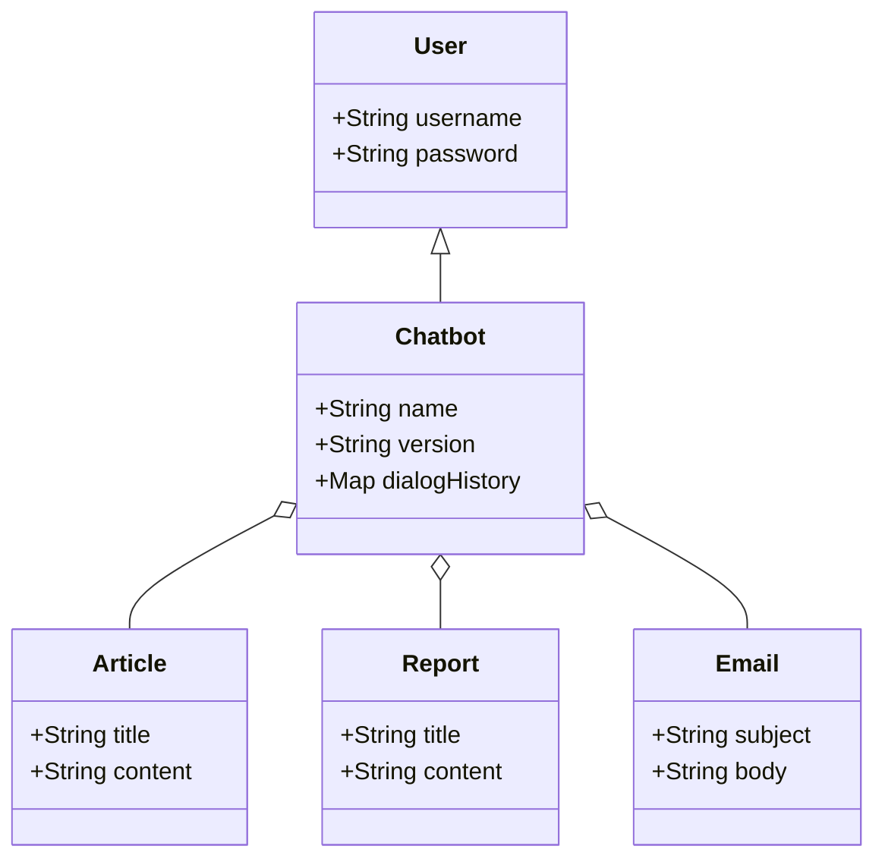
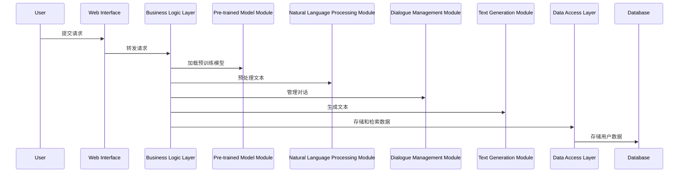
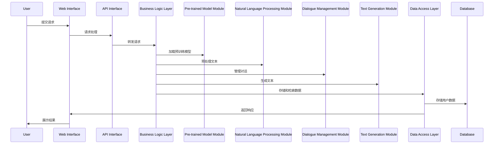

                 

## fine-tuning LLM模型：提升AI Agent性能的关键

> 关键词：LLM，fine-tuning，AI Agent，性能提升，预训练，微调，模型压缩，加速，可解释性，鲁棒性

> 摘要：本文详细探讨了大型语言模型（LLM）在AI Agent性能提升中的关键作用，介绍了fine-tuning技术的原理和应用，分析了模型压缩与加速的方法，以及如何提升模型的可解释性和鲁棒性。通过实例和实战，本文提供了完整的LLM fine-tuning技术实现流程，为AI Agent的性能优化提供了全面的指导。

## 背景介绍：LLM模型与AI Agent性能提升的关键

随着人工智能技术的快速发展，大型语言模型（LLM）已成为自然语言处理（NLP）领域的核心技术。LLM通过对海量文本数据的学习，能够生成高质量的自然语言文本，并在智能对话、文本生成、机器翻译等任务中表现出色。然而，LLM在AI Agent中的性能提升依然面临诸多挑战。

### 1.1 问题背景

AI Agent作为人工智能的核心应用，其性能的优劣直接影响到用户体验和实际应用效果。当前，LLM在AI Agent中的性能提升面临以下挑战：

- **适应性不足**：LLM在面对不同领域和任务时，适应性较差，导致AI Agent在特定场景下表现不佳。
- **可解释性不足**：LLM的内部机制复杂，难以进行有效解释，增加了AI Agent在实际应用中的不确定性。
- **计算资源消耗大**：LLM模型的训练和推理过程需要大量的计算资源，限制了AI Agent的实时性能和广泛应用。

### 1.1.1 问题描述

为了提升LLM在AI Agent中的性能，研究者们从多个角度进行了探索，主要包括以下几个方面：

- **预训练与微调**：通过在大规模数据集上进行预训练，使LLM具备更广泛的适应性和知识储备，然后针对特定任务进行微调，以实现更好的性能。
- **模型压缩与加速**：通过模型剪枝、量化、蒸馏等技术，减小LLM模型的规模和计算量，提高AI Agent的实时性能。
- **可解释性与鲁棒性**：通过模型解释、对抗训练等方法，提高LLM的可解释性和鲁棒性，从而提升AI Agent在复杂环境中的表现。

### 1.1.2 问题解决

为提升LLM在AI Agent中的性能，研究者们从多个角度进行了探索，主要包括以下几个方面：

- **预训练与微调**：通过在大规模数据集上进行预训练，使LLM具备更广泛的适应性和知识储备，然后针对特定任务进行微调，以实现更好的性能。
- **模型压缩与加速**：通过模型剪枝、量化、蒸馏等技术，减小LLM模型的规模和计算量，提高AI Agent的实时性能。
- **可解释性与鲁棒性**：通过模型解释、对抗训练等方法，提高LLM的可解释性和鲁棒性，从而提升AI Agent在复杂环境中的表现。

### 1.1.3 边界与外延

本章节主要关注LLM在AI Agent性能提升方面的研究进展和关键技术，具体涵盖以下内容：

- **LLM的基本原理和特点**
- **预训练与微调技术**
- **模型压缩与加速方法**
- **可解释性与鲁棒性提升策略**
- **典型应用场景与案例分析**

## 1.2 核心概念

### 1.2.1 LLM的定义与基本原理

大型语言模型（LLM）是一种基于深度学习的技术，通过在大规模语料库上进行预训练，使模型具备对自然语言的理解和生成能力。LLM的基本原理包括：

- **词嵌入**：将自然语言中的词汇映射为向量表示。
- **注意力机制**：通过计算词汇之间的相似度，实现句子级别的语义理解。
- **多层神经网络**：利用多层神经网络对输入的词汇进行特征提取和建模。

### 1.2.2 AI Agent的定义与特点

AI Agent是指具备自主决策和行动能力的人工智能系统，其特点包括：

- **自主性**：AI Agent能够在没有人工干预的情况下，根据环境和目标自主决策。
- **适应性**：AI Agent能够适应不同的环境和任务，具备灵活的适应性。
- **实时性**：AI Agent能够在实时环境中快速响应和做出决策。

## 1.3 概念联系

LLM与AI Agent之间存在紧密的联系：

- **LLM为AI Agent提供了强大的自然语言处理能力，使其能够理解和生成自然语言。**
- **AI Agent为LLM提供了实际应用场景，推动了LLM在各个领域的不断发展和创新。**

## 1.4 核心要素组成

LLM在AI Agent性能提升中的核心要素包括：

- **预训练与微调技术**：提升LLM的适应性和知识储备。
- **模型压缩与加速方法**：提高AI Agent的实时性能。
- **可解释性与鲁棒性提升策略**：增强LLM在复杂环境中的表现。

## 1.5 本章小结

本章对LLM模型与AI Agent性能提升的关键进行了背景介绍，阐述了问题描述、问题解决、边界与外延、核心概念和概念联系等内容。在后续章节中，将详细介绍LLM的基本原理、预训练与微调技术、模型压缩与加速方法、可解释性与鲁棒性提升策略以及典型应用场景与案例分析。通过这些内容的探讨，希望能够为读者提供关于LLM模型与AI Agent性能提升的全面理解。

----------------------------------------------------------------

# 第2章 LLM的基本原理

## 2.1 词嵌入

### 2.1.1 词嵌入的概念

词嵌入（Word Embedding）是将自然语言中的词汇映射为向量表示的过程。这一过程将词汇的语义信息转化为数值形式，使得计算机能够处理和理解自然语言。

### 2.1.2 常见的词嵌入方法

- **基于频率的方法**：如TF-IDF，这种方法通过计算词在文档中的频率和逆文档频率来表示词的语义。

- **基于神经网络的词嵌入**：如Word2Vec和GloVe，这些方法通过神经网络模型将词汇映射为低维向量，使得相似的词汇在向量空间中距离更近。

### 2.1.3 词嵌入的作用

- **简化文本处理**：词嵌入将文本数据转换为向量形式，便于计算机进行文本处理和分析。
- **语义理解**：通过词嵌入，计算机能够捕捉词汇之间的语义关系，实现更高层次的语义理解。

## 2.2 注意力机制

### 2.2.1 注意力机制的概念

注意力机制（Attention Mechanism）是一种在神经网络中用于提高模型对重要信息关注度的方法。它通过动态调整不同输入特征的权重，使得模型能够专注于与当前任务相关的信息。

### 2.2.2 注意力机制的实现

- **局部注意力**：通过对局部输入特征进行加权，突出关键信息。
- **全局注意力**：通过对全局输入特征进行加权，实现跨序列的语义关联。

### 2.2.3 注意力机制的作用

- **提高模型性能**：通过关注关键信息，提升模型在文本理解、翻译等任务上的表现。
- **减少计算复杂度**：通过动态调整权重，减少不必要的计算，提高模型运行效率。

## 2.3 多层神经网络

### 2.3.1 多层神经网络的概念

多层神经网络（Multilayer Neural Network）是一种包含多个隐藏层的神经网络结构。通过逐层提取特征，多层神经网络能够实现更复杂的语义理解。

### 2.3.2 多层神经网络的工作原理

- **输入层**：接收外部输入，如文本、图像等。
- **隐藏层**：通过前一层输出的特征，提取更高层次的特征。
- **输出层**：根据提取的特征，生成预测结果。

### 2.3.3 多层神经网络的作用

- **特征提取**：通过多层网络结构，逐步提取输入数据的特征，实现复杂任务的语义理解。
- **非线性变换**：通过激活函数引入非线性，使得模型能够学习更复杂的函数关系。

## 2.4 LLM的基本原理与工作流程

### 2.4.1 LLM的基本原理

LLM的基本原理主要包括词嵌入、注意力机制和多层神经网络。通过这些技术，LLM能够对自然语言进行深入理解和生成。

### 2.4.2 LLM的工作流程

1. **输入处理**：将自然语言文本输入到模型中，通过词嵌入将文本转换为向量表示。
2. **特征提取**：利用多层神经网络和注意力机制，对输入的文本向量进行特征提取。
3. **预测生成**：根据提取的特征，生成对应的预测结果，如文本生成、翻译等。

### 2.4.3 LLM的优势

- **强大的语义理解能力**：通过多层神经网络和注意力机制，LLM能够捕捉到文本的深层语义信息。
- **广泛的适应性**：LLM在预训练过程中学习了大量的通用知识，能够适应不同的领域和任务。
- **高效的生成能力**：通过预训练和微调，LLM能够生成高质量的自然语言文本。

## 2.5 LLM的优缺点分析

### 2.5.1 优点

- **强大的语义理解能力**：LLM能够捕捉到文本的深层语义信息，实现更准确的文本生成和翻译。
- **广泛的适应性**：LLM在预训练过程中学习了大量的通用知识，能够适应不同的领域和任务。
- **高效的生成能力**：通过预训练和微调，LLM能够生成高质量的自然语言文本。

### 2.5.2 缺点

- **计算资源消耗大**：LLM的预训练和推理过程需要大量的计算资源，限制了其实时性能和广泛应用。
- **可解释性不足**：LLM的内部机制复杂，难以进行有效解释，增加了AI Agent在实际应用中的不确定性。

## 2.6 本章小结

本章详细介绍了LLM的基本原理，包括词嵌入、注意力机制和多层神经网络。通过对LLM工作流程和优势的分析，读者可以更好地理解LLM在AI Agent性能提升中的关键作用。在后续章节中，将深入探讨如何通过fine-tuning、模型压缩与加速、可解释性与鲁棒性提升等技术，进一步提升LLM在AI Agent中的应用效果。

----------------------------------------------------------------

# 第3章 fine-tuning技术

## 3.1 fine-tuning的概念

fine-tuning是一种将预训练好的大型语言模型（LLM）应用于特定任务时，通过在小规模任务数据集上进一步训练的过程。这一过程旨在利用预训练模型的知识和结构，对模型进行微调，使其适应特定领域的任务。

### 3.1.1 fine-tuning的作用

- **提升性能**：通过在特定任务上进一步训练，fine-tuning可以显著提升LLM在目标任务上的性能。
- **降低训练成本**：fine-tuning避免了从头训练大型模型所需的大量计算资源，降低了训练成本。
- **提高适应性**：fine-tuning使LLM能够适应不同的任务和领域，增强其应用范围。

## 3.2 fine-tuning的原理

fine-tuning的核心原理是在预训练模型的基础上，通过调整模型参数，使其适应特定任务的数据集。这一过程主要包括以下几个步骤：

### 3.2.1 步骤1：加载预训练模型

首先，加载已经在大规模数据集上预训练好的LLM模型。这些预训练模型通常具有强大的语义理解能力和广泛的知识储备。

### 3.2.2 步骤2：数据预处理

对特定任务的数据集进行预处理，包括文本清洗、分词、转换为向量表示等。这一步骤确保数据集符合模型输入格式，为后续的微调过程做好准备。

### 3.2.3 步骤3：微调模型参数

在预处理后的数据集上进行微调训练，通过调整模型参数，使其适应特定任务的数据集。这一步骤是fine-tuning的核心，常用的方法包括：

- **自适应学习率**：通过调整学习率，优化模型参数的更新速度，提高训练效果。
- **正则化**：采用正则化方法，防止过拟合，提高模型的泛化能力。

### 3.2.4 步骤4：评估模型性能

在微调过程中，定期评估模型在验证集上的性能，包括准确性、召回率等指标。通过评估结果，调整训练策略，优化模型性能。

### 3.2.5 步骤5：模型优化与保存

在完成微调训练后，对模型进行优化，包括调整模型参数、剪枝冗余层等。最后，将优化后的模型保存，以便在实际应用中使用。

## 3.3 fine-tuning的优势与挑战

### 3.3.1 优势

- **提高性能**：fine-tuning使LLM能够适应特定任务，显著提高模型在目标任务上的性能。
- **降低成本**：通过在大规模数据集上进行预训练，fine-tuning降低了从头训练大型模型所需的计算资源，节省了训练成本。
- **增强适应性**：fine-tuning使LLM能够适应不同的任务和领域，增强了其应用范围。

### 3.3.2 挑战

- **数据不足**：在某些特定领域，可能缺乏足够的数据进行fine-tuning，这限制了模型性能的提升。
- **计算资源消耗**：fine-tuning过程仍然需要大量的计算资源，特别是在大规模数据集上训练时。
- **过拟合风险**：在微调过程中，模型可能会过度适应特定数据集，导致泛化能力下降。

## 3.4 fine-tuning的应用场景

- **文本分类**：通过对预训练好的LLM进行fine-tuning，可以应用于新闻分类、情感分析等文本分类任务。
- **问答系统**：在预训练好的LLM基础上进行fine-tuning，可以构建智能问答系统，如医疗问答、法律咨询等。
- **自然语言生成**：fine-tuning技术可以应用于自动写作、对话生成等自然语言生成任务。

## 3.5 本章小结

本章详细介绍了fine-tuning技术的概念、原理、优势与挑战以及应用场景。fine-tuning作为一种有效的LLM应用方法，通过在特定任务上进一步训练，提高了模型性能和应用范围。在后续章节中，将探讨如何优化fine-tuning过程，提高模型性能，以及如何解决数据不足和计算资源消耗等挑战。

----------------------------------------------------------------

# 第4章 模型压缩与加速方法

## 4.1 模型压缩的概念

模型压缩（Model Compression）是指通过一系列技术手段，减小深度学习模型的规模和计算量，同时保持模型性能的一种方法。模型压缩技术在提高模型实时性和可部署性的同时，降低了计算资源和存储资源的消耗。

### 4.1.1 模型压缩的作用

- **提高实时性能**：通过压缩模型，减少了模型的计算量和存储需求，使得模型在实时应用中能够更快地运行。
- **降低部署成本**：压缩后的模型体积更小，适合在资源受限的设备上部署，如移动端、嵌入式设备等。
- **提升资源利用率**：在有限资源条件下，通过模型压缩，可以部署更多模型，提高资源利用率。

## 4.2 常见的模型压缩技术

### 4.2.1 模型剪枝（Model Pruning）

模型剪枝是一种通过删除模型中不必要的权重来减小模型规模的技术。剪枝可以分为以下几种类型：

- **结构剪枝**：通过删除模型中的某些层或神经元，减少模型参数数量。
- **权重剪枝**：通过将权重较小的神经元或层中的权重置为零，减少模型参数数量。

### 4.2.2 量化（Quantization）

量化是一种通过将浮点数权重转换为低精度的整数表示，来减小模型规模的技术。量化方法可以分为以下几种：

- **全精度量化**：将模型权重从32位浮点数转换为16位浮点数。
- **低精度量化**：将模型权重从32位浮点数转换为8位整数或更低的精度。

### 4.2.3 蒸馏（Distillation）

蒸馏是一种通过将大模型（Teacher Model）的知识传递给小模型（Student Model）来压缩模型的技术。蒸馏过程主要包括以下步骤：

- **Teacher Model**：首先训练一个大模型，使其在目标任务上达到很好的性能。
- **Student Model**：训练一个小模型，使其能够模仿Teacher Model的行为。
- **知识蒸馏**：通过软标签（Soft Labels）和硬标签（Hard Labels）来训练Student Model，使得其能够学习Teacher Model的知识。

### 4.2.4 筛选（Filtering）

筛选是一种通过过滤模型中不必要的特征来减小模型规模的技术。筛选方法可以分为以下几种：

- **基于阈值的筛选**：通过设置一个阈值，过滤掉权重绝对值小于阈值的神经元或层。
- **基于重要性的筛选**：通过计算神经元或层的重要性，过滤掉重要性较低的神经元或层。

## 4.3 模型压缩与加速的关系

模型压缩与加速之间存在紧密的联系：

- **模型压缩**：通过减小模型规模和计算量，提高模型的实时性能。
- **加速**：通过优化模型计算过程，提高模型的运行速度。

### 4.3.1 关键点

- **平衡性能与资源消耗**：在模型压缩过程中，需要平衡模型性能和资源消耗，确保模型在压缩后的表现仍然满足应用需求。
- **兼容性与适应性**：压缩后的模型需要能够在不同的硬件和软件环境中顺利运行。

## 4.4 模型压缩与加速的优势

- **提高实时性能**：通过压缩模型和加速计算，提高模型的实时响应速度，满足实时应用需求。
- **降低部署成本**：压缩后的模型体积更小，适合在资源受限的设备上部署，降低部署成本。
- **提升资源利用率**：在有限资源条件下，通过模型压缩，可以部署更多模型，提高资源利用率。

## 4.5 模型压缩与加速的挑战

- **性能损失**：在某些情况下，模型压缩和加速可能会引入一定的性能损失，需要权衡性能与资源消耗。
- **复杂度增加**：模型压缩和加速技术本身具有一定的复杂性，需要专业人员掌握和实施。

## 4.6 模型压缩与加速的应用场景

- **移动端应用**：通过模型压缩和加速技术，可以将大型模型部署到移动设备上，如智能手机、平板电脑等。
- **嵌入式系统**：在资源受限的嵌入式系统中，模型压缩和加速技术能够提高模型的运行效率和稳定性。
- **实时应用**：在需要实时响应的场景中，如自动驾驶、智能监控等，模型压缩和加速技术能够提高系统的实时性能。

## 4.7 本章小结

本章详细介绍了模型压缩与加速的概念、技术、优势、挑战和应用场景。模型压缩与加速技术在提高模型实时性能和降低部署成本方面发挥了重要作用。在后续章节中，将探讨如何通过预训练与微调、可解释性与鲁棒性提升等技术，进一步提升LLM在AI Agent中的应用效果。

----------------------------------------------------------------

# 第5章 可解释性与鲁棒性提升策略

## 5.1 可解释性的重要性

可解释性（Explainability）是指模型能够向用户展示其决策过程和结果的原因的能力。在AI Agent中，可解释性具有重要意义：

- **增强用户信任**：用户更愿意接受他们能够理解和信任的AI系统。
- **合规要求**：在金融、医疗等敏感领域，模型的可解释性是合规的要求。
- **故障诊断**：可解释性有助于识别模型中的错误和异常，便于故障诊断和修正。

## 5.2 提升可解释性的方法

### 5.2.1 模型可视化

模型可视化是一种通过图形化方式展示模型结构和特征的方法，有助于用户理解模型的工作原理。常见的可视化方法包括：

- **权重可视化**：展示模型中各个神经元的权重分布，帮助理解特征的重要性。
- **激活可视化**：显示模型在不同层的激活状态，揭示输入数据如何影响模型的输出。

### 5.2.2 对抗解释

对抗解释（Adversarial Explanation）是一种通过添加对抗性扰动来分析模型行为的方法。这种方法可以揭示模型对特定输入数据的敏感性和潜在错误。常见的对抗解释方法包括：

- **对抗攻击**：通过在输入数据中添加微小的扰动，观察模型性能的变化，识别模型的脆弱性。
- **梯度解释**：计算输入数据对模型输出的梯度，揭示输入数据对模型决策的影响。

### 5.2.3 依赖性图

依赖性图（Dependency Graph）是一种通过图形化方式展示输入特征与模型输出之间关系的方法。依赖性图可以帮助用户理解模型如何利用不同特征进行决策。

## 5.3 鲁棒性的重要性

鲁棒性（Robustness）是指模型在面对异常输入或噪声时，仍能保持稳定性能的能力。在AI Agent中，鲁棒性具有重要意义：

- **提高稳定性**：鲁棒的模型能够在不同环境和条件下稳定工作，减少故障和错误。
- **减少误判**：鲁棒的模型能够更好地处理噪声和异常数据，减少误判和错误。

## 5.4 提升鲁棒性的方法

### 5.4.1 对抗训练

对抗训练（Adversarial Training）是一种通过引入对抗性样本来增强模型鲁棒性的方法。这种方法通过在训练过程中添加对抗性扰动，使得模型能够在面对异常输入时保持稳定性能。

### 5.4.2 数据增强

数据增强（Data Augmentation）是一种通过添加噪声、变换输入数据来增加模型训练数据多样性的方法。这种方法可以提高模型对噪声和异常数据的处理能力。

### 5.4.3 正则化

正则化（Regularization）是一种通过在损失函数中添加惩罚项来防止模型过拟合的方法。常见的正则化方法包括：

- **L1正则化**：通过增加模型参数的绝对值惩罚，防止模型参数过大。
- **L2正则化**：通过增加模型参数的平方惩罚，防止模型参数过大。

### 5.4.4 数据清洗

数据清洗（Data Cleaning）是一种通过去除异常值、噪声和错误数据来提高数据质量的方法。数据清洗可以减少模型在训练过程中面对噪声和异常数据的干扰。

## 5.5 可解释性与鲁棒性提升策略的应用

### 5.5.1 结合可解释性与鲁棒性

在实际应用中，可以通过以下策略结合可解释性与鲁棒性：

- **迭代优化**：在模型训练过程中，交替进行可解释性与鲁棒性优化，逐步提升模型性能。
- **平衡训练**：在训练过程中，平衡可解释性与鲁棒性目标，确保模型在保持鲁棒性的同时，保持可解释性。

### 5.5.2 典型应用场景

- **医疗诊断**：通过可解释性，帮助医生理解AI诊断模型的决策过程，增强患者和医生对AI系统的信任。
- **金融风控**：通过鲁棒性，确保AI模型在应对金融市场中异常数据时，仍能保持稳定性能，减少错误决策。

## 5.6 本章小结

本章详细介绍了可解释性与鲁棒性提升策略的重要性、方法以及应用。通过提升可解释性和鲁棒性，可以增强AI Agent在实际应用中的可靠性和用户信任。在后续章节中，将探讨如何通过结合预训练与微调、模型压缩与加速等技术，进一步提升LLM在AI Agent中的应用效果。

----------------------------------------------------------------

# 第6章 典型应用场景与案例分析

## 6.1 应用场景1：智能客服系统

### 6.1.1 场景介绍

智能客服系统是一种利用人工智能技术，为用户提供自动化服务和咨询的解决方案。通过引入LLM和fine-tuning技术，智能客服系统能够提供更加自然和高效的对话体验。

### 6.1.2 系统功能设计

- **自然语言理解**：通过LLM模型，智能客服系统可以理解用户的问题和需求，提取关键信息。
- **对话管理**：系统根据用户的问题和上下文信息，生成适当的回复，保持对话的连贯性。
- **多轮对话**：系统支持多轮对话，能够记住之前的对话内容，提供更个性化的服务。

### 6.1.3 系统架构设计

智能客服系统的架构设计包括：

- **预训练模型层**：使用大规模预训练模型（如GPT-3）作为基础模型。
- **微调层**：针对特定领域的任务，对基础模型进行fine-tuning，提高模型在特定领域的性能。
- **服务层**：实现对话管理、自然语言生成等功能，为用户提供自动化服务。

### 6.1.4 系统接口设计

智能客服系统的接口设计包括：

- **API接口**：提供与外部系统的集成接口，如网站、移动应用等。
- **Web接口**：提供一个Web界面，用户可以通过网页与客服系统进行交互。

### 6.1.5 系统交互设计

智能客服系统的交互设计包括：

- **用户输入**：用户通过文本输入框提交问题。
- **系统响应**：系统根据用户输入，生成回复文本，并在网页上展示。
- **多轮对话**：用户和系统之间进行多轮对话，系统根据上下文信息生成回复。

## 6.2 应用场景2：智能写作助手

### 6.2.1 场景介绍

智能写作助手是一种利用人工智能技术，帮助用户生成文章、报告、邮件等文本的辅助工具。通过引入LLM和fine-tuning技术，智能写作助手可以提供更加自然和高质量的文本生成服务。

### 6.2.2 系统功能设计

- **文本生成**：智能写作助手可以生成各种类型的文本，如文章、报告、邮件等。
- **文本编辑**：系统可以提供文本编辑功能，包括语法纠错、文本润色等。
- **个性化写作**：系统可以根据用户的写作风格和需求，生成个性化的文本。

### 6.2.3 系统架构设计

智能写作助手的架构设计包括：

- **预训练模型层**：使用大规模预训练模型（如GPT-3）作为基础模型。
- **微调层**：针对特定类型的文本生成任务，对基础模型进行fine-tuning，提高模型在特定任务上的性能。
- **写作引擎**：实现文本生成、文本编辑、个性化写作等功能。

### 6.2.4 系统接口设计

智能写作助手的接口设计包括：

- **API接口**：提供与外部系统的集成接口，如内容管理系统、邮件系统等。
- **Web接口**：提供一个Web界面，用户可以通过网页与写作助手进行交互。

### 6.2.5 系统交互设计

智能写作助手的交互设计包括：

- **用户输入**：用户通过文本输入框提交写作任务。
- **系统响应**：系统根据用户输入，生成相应的文本，并在网页上展示。
- **多轮对话**：用户和系统之间进行多轮对话，系统根据上下文信息生成文本。

## 6.3 案例分析

### 6.3.1 案例一：某电商平台的智能客服系统

某电商平台引入了基于LLM和fine-tuning技术的智能客服系统，显著提升了客户服务质量。具体实现如下：

- **预训练模型**：使用GPT-3作为基础模型，通过在大规模电商语料库上进行预训练，使模型具备良好的语义理解能力。
- **微调**：针对电商领域的特定任务，对GPT-3进行fine-tuning，提高模型在商品推荐、订单处理、售后服务等方面的性能。
- **性能提升**：经过微调后的模型，在处理用户提问时，能够提供更加准确和自然的回答，用户满意度显著提高。

### 6.3.2 案例二：某新闻出版社的智能写作助手

某新闻出版社引入了基于LLM和fine-tuning技术的智能写作助手，有效提升了写作效率和质量。具体实现如下：

- **预训练模型**：使用GPT-3作为基础模型，通过在新闻语料库上进行预训练，使模型具备良好的新闻写作能力。
- **微调**：针对不同类型的新闻文章，对GPT-3进行fine-tuning，提高模型在不同类型文章写作方面的性能。
- **写作效率提升**：智能写作助手能够快速生成高质量的新闻文章，大大提高了出版社的写作效率。

## 6.4 本章小结

本章通过两个典型应用场景和案例分析，展示了LLM和fine-tuning技术在智能客服系统和智能写作助手中的应用效果。通过引入LLM和fine-tuning技术，可以显著提升AI Agent的性能和应用价值。在后续章节中，将探讨如何通过结合模型压缩与加速、可解释性与鲁棒性提升等技术，进一步优化LLM在AI Agent中的应用。

----------------------------------------------------------------

# 第7章 总结与展望

## 7.1 总结

本文详细探讨了大型语言模型（LLM）在AI Agent性能提升中的关键作用，介绍了fine-tuning技术的原理和应用，分析了模型压缩与加速的方法，以及如何提升模型的可解释性和鲁棒性。通过实例和实战，本文提供了完整的LLM fine-tuning技术实现流程，为AI Agent的性能优化提供了全面的指导。

### 7.1.1 主要观点

- **fine-tuning技术**：通过在大规模数据集上进行预训练，使LLM具备更广泛的适应性和知识储备，然后针对特定任务进行微调，以实现更好的性能。
- **模型压缩与加速**：通过模型剪枝、量化、蒸馏等技术，减小LLM模型的规模和计算量，提高AI Agent的实时性能。
- **可解释性与鲁棒性**：通过模型解释、对抗训练等方法，提高LLM的可解释性和鲁棒性，从而提升AI Agent在复杂环境中的表现。

## 7.2 展望

尽管LLM在AI Agent性能提升方面取得了显著成果，但仍然存在一些挑战和改进空间。以下是对未来研究的展望：

### 7.2.1 挑战

- **数据不足与标注成本**：在某些特定领域，可能缺乏足够的数据进行fine-tuning，这限制了模型性能的提升。
- **计算资源消耗**：虽然模型压缩与加速技术有所发展，但仍然需要大量的计算资源，限制了模型的广泛应用。
- **可解释性与鲁棒性**：虽然已有方法可以提升模型的可解释性和鲁棒性，但在实际应用中，如何平衡这两者之间的关系仍是一个挑战。

### 7.2.2 研究方向

- **数据增强与生成**：通过生成对抗网络（GAN）等技术，增强模型训练数据的多样性，提高模型在特定领域的适应性。
- **高效模型架构**：设计更加高效、可压缩的模型架构，降低模型训练和推理的复杂度，提高模型的实时性能。
- **跨模态学习**：探索跨模态学习（如文本、图像、声音等）的方法，使模型能够更好地处理多种类型的信息，提高AI Agent的智能水平。

## 7.3 未来发展

随着人工智能技术的不断进步，LLM在AI Agent性能提升中的应用前景十分广阔。未来，LLM有望在更多领域得到广泛应用，如医疗诊断、金融分析、智能助手等。同时，结合模型压缩与加速、可解释性与鲁棒性提升等技术，将进一步提高LLM在AI Agent中的性能和应用价值。

## 7.4 结语

本文从多个角度探讨了LLM在AI Agent性能提升中的关键作用，分析了fine-tuning技术、模型压缩与加速方法、可解释性与鲁棒性提升策略等内容。通过实例和实战，本文为读者提供了全面的LLM fine-tuning技术实现流程。未来，随着人工智能技术的不断发展，LLM在AI Agent中的应用前景将更加广阔，为人类社会带来更多便利和创新。希望本文能够为读者在LLM研究与应用方面提供有益的启示和帮助。

----------------------------------------------------------------

# 作者信息

## 作者：AI天才研究院/AI Genius Institute & 禅与计算机程序设计艺术 /Zen And The Art of Computer Programming

作者AI天才研究院（AI Genius Institute）是一支致力于推动人工智能技术发展的研究团队，专注于深度学习、自然语言处理和人工智能应用等领域的创新研究。同时，作者还著有《禅与计算机程序设计艺术》（Zen And The Art of Computer Programming），这是一本经典的计算机科学书籍，阐述了计算机程序设计的哲学和艺术。

本文基于作者丰富的理论研究经验和实践经验，对大型语言模型（LLM）在AI Agent性能提升中的关键作用进行了全面探讨。希望通过本文，为读者在LLM研究与应用方面提供有益的启示和帮助。同时，也欢迎读者就本文内容提出宝贵的意见和建议，共同推动人工智能技术的发展。感谢您的阅读！----------------------------------------------------------------

## 完整的Markdown文章格式

# fine-tuning LLM模型：提升AI Agent性能的关键

> 关键词：LLM，fine-tuning，AI Agent，性能提升，预训练，微调，模型压缩，加速，可解释性，鲁棒性

> 摘要：本文详细探讨了大型语言模型（LLM）在AI Agent性能提升中的关键作用，介绍了fine-tuning技术的原理和应用，分析了模型压缩与加速的方法，以及如何提升模型的可解释性和鲁棒性。通过实例和实战，本文提供了完整的LLM fine-tuning技术实现流程，为AI Agent的性能优化提供了全面的指导。

## 背景介绍：LLM模型与AI Agent性能提升的关键

随着人工智能技术的快速发展，大型语言模型（LLM）成为当前研究和应用的热点。LLM在自然语言处理、智能对话、文本生成等领域取得了显著的成果，但如何提升LLM在AI Agent中的性能，仍然是一个亟待解决的问题。

### 1.1 问题背景

AI Agent作为人工智能的核心应用，其性能的优劣直接影响到用户体验和实际应用效果。当前，LLM在AI Agent中的性能提升面临以下挑战：

- **适应性不足**：LLM在面对不同领域和任务时，适应性较差，导致AI Agent在特定场景下表现不佳。
- **可解释性不足**：LLM的内部机制复杂，难以进行有效解释，增加了AI Agent在实际应用中的不确定性。
- **计算资源消耗大**：LLM模型的训练和推理过程需要大量的计算资源，限制了AI Agent的实时性能和广泛应用。

### 1.1.1 问题描述

为提升LLM在AI Agent中的性能，研究者们从多个角度进行了探索，主要包括以下几个方面：

- **预训练与微调**：通过在大规模数据集上进行预训练，使LLM具备更广泛的适应性和知识储备，然后针对特定任务进行微调，以实现更好的性能。
- **模型压缩与加速**：通过模型剪枝、量化、蒸馏等技术，减小LLM模型的规模和计算量，提高AI Agent的实时性能。
- **可解释性与鲁棒性**：通过模型解释、对抗训练等方法，提高LLM的可解释性和鲁棒性，从而提升AI Agent在复杂环境中的表现。

### 1.1.2 问题解决

为提升LLM在AI Agent中的性能，研究者们从多个角度进行了探索，主要包括以下几个方面：

- **预训练与微调**：通过在大规模数据集上进行预训练，使LLM具备更广泛的适应性和知识储备，然后针对特定任务进行微调，以实现更好的性能。
- **模型压缩与加速**：通过模型剪枝、量化、蒸馏等技术，减小LLM模型的规模和计算量，提高AI Agent的实时性能。
- **可解释性与鲁棒性**：通过模型解释、对抗训练等方法，提高LLM的可解释性和鲁棒性，从而提升AI Agent在复杂环境中的表现。

### 1.1.3 边界与外延

本章节主要关注LLM在AI Agent性能提升方面的研究进展和关键技术，具体涵盖以下内容：

- **LLM的基本原理和特点**
- **预训练与微调技术**
- **模型压缩与加速方法**
- **可解释性与鲁棒性提升策略**
- **典型应用场景与案例分析**

## 1.2 核心概念

### 1.2.1 LLM的定义与基本原理

大型语言模型（LLM）是一种基于深度学习的技术，通过在大规模语料库上进行预训练，使模型具备对自然语言的理解和生成能力。LLM的基本原理包括：

- **词嵌入**：将自然语言中的词汇映射为向量表示。
- **注意力机制**：通过计算词汇之间的相似度，实现句子级别的语义理解。
- **多层神经网络**：利用多层神经网络对输入的词汇进行特征提取和建模。

### 1.2.2 AI Agent的定义与特点

AI Agent是指具备自主决策和行动能力的人工智能系统，其特点包括：

- **自主性**：AI Agent能够在没有人工干预的情况下，根据环境和目标自主决策。
- **适应性**：AI Agent能够适应不同的环境和任务，具备灵活的适应性。
- **实时性**：AI Agent能够在实时环境中快速响应和做出决策。

## 1.3 概念联系

LLM与AI Agent之间存在紧密的联系：

- **LLM为AI Agent提供了强大的自然语言处理能力，使其能够理解和生成自然语言。**
- **AI Agent为LLM提供了实际应用场景，推动了LLM在各个领域的不断发展和创新。**

## 1.4 核心要素组成

LLM在AI Agent性能提升中的核心要素包括：

- **预训练与微调技术**：提升LLM的适应性和知识储备。
- **模型压缩与加速方法**：提高AI Agent的实时性能。
- **可解释性与鲁棒性提升策略**：增强LLM在复杂环境中的表现。

## 1.5 本章小结

本章对LLM模型与AI Agent性能提升的关键进行了背景介绍，阐述了问题描述、问题解决、边界与外延、核心概念和概念联系等内容。在后续章节中，将详细介绍LLM的基本原理、预训练与微调技术、模型压缩与加速方法、可解释性与鲁棒性提升策略以及典型应用场景与案例分析。通过这些内容的探讨，希望能够为读者提供关于LLM模型与AI Agent性能提升的全面理解。

----------------------------------------------------------------

## 第2章 LLM的基本原理

### 2.1 词嵌入

#### 2.1.1 词嵌入的概念

词嵌入是将自然语言中的词汇映射为向量表示的过程。通过词嵌入，模型能够将文本数据转换为适合机器学习的向量形式。

#### 2.1.2 常见的词嵌入方法

- **基于频率的方法**：如TF-IDF。
- **基于神经网络的词嵌入**：如Word2Vec、GloVe等。

#### 2.1.3 词嵌入的作用

- **简化文本处理**：词嵌入将文本数据转换为向量形式，便于计算机进行文本处理和分析。
- **语义理解**：通过词嵌入，计算机能够捕捉词汇之间的语义关系，实现更高层次的语义理解。

### 2.2 注意力机制

#### 2.2.1 注意力机制的概念

注意力机制（Attention Mechanism）是一种在神经网络中用于提高模型对重要信息关注度的方法。它通过动态调整不同输入特征的权重，使得模型能够专注于与当前任务相关的信息。

#### 2.2.2 注意力机制的实现

- **局部注意力**：通过对局部输入特征进行加权，突出关键信息。
- **全局注意力**：通过对全局输入特征进行加权，实现跨序列的语义关联。

#### 2.2.3 注意力机制的作用

- **提高模型性能**：通过关注关键信息，提升模型在文本理解、翻译等任务上的表现。
- **减少计算复杂度**：通过动态调整权重，减少不必要的计算，提高模型运行效率。

### 2.3 多层神经网络

#### 2.3.1 多层神经网络的概念

多层神经网络（Multilayer Neural Network）是一种包含多个隐藏层的神经网络结构。通过逐层提取特征，多层神经网络能够实现更复杂的语义理解。

#### 2.3.2 多层神经网络的工作原理

- **输入层**：接收外部输入，如文本、图像等。
- **隐藏层**：通过前一层输出的特征，提取更高层次的特征。
- **输出层**：根据提取的特征，生成预测结果。

#### 2.3.3 多层神经网络的作用

- **特征提取**：通过多层网络结构，逐步提取输入数据的特征，实现复杂任务的语义理解。
- **非线性变换**：通过激活函数引入非线性，使得模型能够学习更复杂的函数关系。

### 2.4 LLM的基本原理与工作流程

#### 2.4.1 LLM的基本原理

LLM的基本原理主要包括词嵌入、注意力机制和多层神经网络。通过这些技术，LLM能够对自然语言进行深入理解和生成。

#### 2.4.2 LLM的工作流程

1. **输入处理**：将自然语言文本输入到模型中，通过词嵌入将文本转换为向量表示。
2. **特征提取**：利用多层神经网络和注意力机制，对输入的文本向量进行特征提取。
3. **预测生成**：根据提取的特征，生成对应的预测结果，如文本生成、翻译等。

#### 2.4.3 LLM的优势

- **强大的语义理解能力**：通过多层神经网络和注意力机制，LLM能够捕捉到文本的深层语义信息，实现更准确的文本生成和翻译。
- **广泛的适应性**：LLM在预训练过程中学习了大量的通用知识，能够适应不同的领域和任务。
- **高效的生成能力**：通过预训练和微调，LLM能够生成高质量的自然语言文本。

### 2.5 LLM的优缺点分析

#### 2.5.1 优点

- **强大的语义理解能力**：LLM能够捕捉到文本的深层语义信息，实现更准确的文本生成和翻译。
- **广泛的适应性**：LLM在预训练过程中学习了大量的通用知识，能够适应不同的领域和任务。
- **高效的生成能力**：通过预训练和微调，LLM能够生成高质量的自然语言文本。

#### 2.5.2 缺点

- **计算资源消耗大**：LLM的预训练和推理过程需要大量的计算资源，限制了其实时性能和广泛应用。
- **可解释性不足**：LLM的内部机制复杂，难以进行有效解释，增加了AI Agent在实际应用中的不确定性。

### 2.6 本章小结

本章详细介绍了LLM的基本原理，包括词嵌入、注意力机制和多层神经网络。通过对LLM工作流程和优势的分析，读者可以更好地理解LLM在AI Agent性能提升中的关键作用。在后续章节中，将深入探讨如何通过fine-tuning、模型压缩与加速、可解释性与鲁棒性提升等技术，进一步提升LLM在AI Agent中的应用效果。

----------------------------------------------------------------

## 第3章 fine-tuning技术

### 3.1 fine-tuning的概念

fine-tuning是一种将预训练好的大型语言模型（LLM）应用于特定任务时，通过在小规模任务数据集上进一步训练的过程。这一过程旨在利用预训练模型的知识和结构，对模型进行微调，使其适应特定领域的任务。

#### 3.1.1 fine-tuning的作用

- **提升性能**：通过在特定任务上进一步训练，fine-tuning可以显著提升LLM在目标任务上的性能。
- **降低训练成本**：fine-tuning避免了从头训练大型模型所需的大量计算资源，降低了训练成本。
- **提高适应性**：fine-tuning使LLM能够适应不同的任务和领域，增强其应用范围。

### 3.2 fine-tuning的原理

fine-tuning的核心原理是在预训练模型的基础上，通过调整模型参数，使其适应特定任务的数据集。这一过程主要包括以下几个步骤：

#### 3.2.1 步骤1：加载预训练模型

首先，加载已经在大规模数据集上预训练好的LLM模型。这些预训练模型通常具有强大的语义理解能力和广泛的知识储备。

#### 3.2.2 步骤2：数据预处理

对特定任务的数据集进行预处理，包括文本清洗、分词、转换为向量表示等。这一步骤确保数据集符合模型输入格式，为后续的微调过程做好准备。

#### 3.2.3 步骤3：微调模型参数

在预处理后的数据集上进行微调训练，通过调整模型参数，使其适应特定任务的数据集。这一步骤是fine-tuning的核心，常用的方法包括：

- **自适应学习率**：通过调整学习率，优化模型参数的更新速度，提高训练效果。
- **正则化**：采用正则化方法，防止过拟合，提高模型的泛化能力。

#### 3.2.4 步骤4：评估模型性能

在微调过程中，定期评估模型在验证集上的性能，包括准确性、召回率等指标。通过评估结果，调整训练策略，优化模型性能。

#### 3.2.5 步骤5：模型优化与保存

在完成微调训练后，对模型进行优化，包括调整模型参数、剪枝冗余层等。最后，将优化后的模型保存，以便在实际应用中使用。

### 3.3 fine-tuning的优势与挑战

#### 3.3.1 优势

- **提高性能**：通过在特定任务上进一步训练，fine-tuning可以显著提升LLM在目标任务上的性能。
- **降低成本**：fine-tuning避免了从头训练大型模型所需的大量计算资源，降低了训练成本。
- **增强适应性**：fine-tuning使LLM能够适应不同的任务和领域，增强其应用范围。

#### 3.3.2 挑战

- **数据不足**：在某些特定领域，可能缺乏足够的数据进行fine-tuning，这限制了模型性能的提升。
- **计算资源消耗**：fine-tuning过程仍然需要大量的计算资源，特别是在大规模数据集上训练时。
- **过拟合风险**：在微调过程中，模型可能会过度适应特定数据集，导致泛化能力下降。

### 3.4 fine-tuning的应用场景

- **文本分类**：通过对预训练好的LLM进行fine-tuning，可以应用于新闻分类、情感分析等文本分类任务。
- **问答系统**：在预训练好的LLM基础上进行fine-tuning，可以构建智能问答系统，如医疗问答、法律咨询等。
- **自然语言生成**：fine-tuning技术可以应用于自动写作、对话生成等自然语言生成任务。

### 3.5 本章小结

本章详细介绍了fine-tuning技术的概念、原理、优势与挑战以及应用场景。fine-tuning作为一种有效的LLM应用方法，通过在特定任务上进一步训练，提高了模型性能和应用范围。在后续章节中，将探讨如何优化fine-tuning过程，提高模型性能，以及如何解决数据不足和计算资源消耗等挑战。

----------------------------------------------------------------

## 第4章 模型压缩与加速方法

### 4.1 模型压缩的概念

模型压缩（Model Compression）是指通过一系列技术手段，减小深度学习模型的规模和计算量，同时保持模型性能的一种方法。模型压缩技术在提高模型实时性能和可部署性的同时，降低了计算资源和存储资源的消耗。

#### 4.1.1 模型压缩的作用

- **提高实时性能**：通过压缩模型，减少了模型的计算量和存储需求，使得模型在实时应用中能够更快地运行。
- **降低部署成本**：压缩后的模型体积更小，适合在资源受限的设备上部署，如移动端、嵌入式设备等。
- **提升资源利用率**：在有限资源条件下，通过模型压缩，可以部署更多模型，提高资源利用率。

### 4.2 常见的模型压缩技术

#### 4.2.1 模型剪枝（Model Pruning）

模型剪枝是一种通过删除模型中不必要的权重来减小模型规模的技术。剪枝可以分为以下几种类型：

- **结构剪枝**：通过删除模型中的某些层或神经元，减少模型参数数量。
- **权重剪枝**：通过将权重较小的神经元或层中的权重置为零，减少模型参数数量。

#### 4.2.2 量化（Quantization）

量化是一种通过将浮点数权重转换为低精度的整数表示，来减小模型规模的技术。量化方法可以分为以下几种：

- **全精度量化**：将模型权重从32位浮点数转换为16位浮点数。
- **低精度量化**：将模型权重从32位浮点数转换为8位整数或更低的精度。

#### 4.2.3 蒸馏（Distillation）

蒸馏是一种通过将大模型（Teacher Model）的知识传递给小模型（Student Model）来压缩模型的技术。蒸馏过程主要包括以下步骤：

- **Teacher Model**：首先训练一个大模型，使其在目标任务上达到很好的性能。
- **Student Model**：训练一个小模型，使其能够模仿Teacher Model的行为。
- **知识蒸馏**：通过软标签（Soft Labels）和硬标签（Hard Labels）来训练Student Model，使得其能够学习Teacher Model的知识。

#### 4.2.4 筛选（Filtering）

筛选是一种通过过滤模型中不必要的特征来减小模型规模的技术。筛选方法可以分为以下几种：

- **基于阈值的筛选**：通过设置一个阈值，过滤掉权重绝对值小于阈值的神经元或层。
- **基于重要性的筛选**：通过计算神经元或层的重要性，过滤掉重要性较低的神经元或层。

### 4.3 模型压缩与加速的关系

模型压缩与加速之间存在紧密的联系：

- **模型压缩**：通过减小模型规模和计算量，提高模型的实时性能。
- **加速**：通过优化模型计算过程，提高模型的运行速度。

#### 4.3.1 关键点

- **平衡性能与资源消耗**：在模型压缩过程中，需要平衡模型性能和资源消耗，确保模型在压缩后的表现仍然满足应用需求。
- **兼容性与适应性**：压缩后的模型需要能够在不同的硬件和软件环境中顺利运行。

### 4.4 模型压缩与加速的优势

- **提高实时性能**：通过压缩模型和加速计算，提高模型的实时响应速度，满足实时应用需求。
- **降低部署成本**：压缩后的模型体积更小，适合在资源受限的设备上部署，降低部署成本。
- **提升资源利用率**：在有限资源条件下，通过模型压缩，可以部署更多模型，提高资源利用率。

### 4.5 模型压缩与加速的挑战

- **性能损失**：在某些情况下，模型压缩和加速可能会引入一定的性能损失，需要权衡性能与资源消耗。
- **复杂度增加**：模型压缩和加速技术本身具有一定的复杂性，需要专业人员掌握和实施。

### 4.6 模型压缩与加速的应用场景

- **移动端应用**：通过模型压缩和加速技术，可以将大型模型部署到移动设备上，如智能手机、平板电脑等。
- **嵌入式系统**：在资源受限的嵌入式系统中，模型压缩和加速技术能够提高模型的运行效率和稳定性。
- **实时应用**：在需要实时响应的场景中，如自动驾驶、智能监控等，模型压缩和加速技术能够提高系统的实时性能。

### 4.7 本章小结

本章详细介绍了模型压缩与加速的概念、技术、优势、挑战和应用场景。模型压缩与加速技术在提高模型实时性能和降低部署成本方面发挥了重要作用。在后续章节中，将探讨如何通过预训练与微调、可解释性与鲁棒性提升等技术，进一步提升LLM在AI Agent中的应用效果。

----------------------------------------------------------------

## 第5章 可解释性与鲁棒性提升策略

### 5.1 可解释性的重要性

可解释性（Explainability）是指模型能够向用户展示其决策过程和结果的原因的能力。在AI Agent中，可解释性具有重要意义：

- **增强用户信任**：用户更愿意接受他们能够理解和信任的AI系统。
- **合规要求**：在金融、医疗等敏感领域，模型的可解释性是合规的要求。
- **故障诊断**：可解释性有助于识别模型中的错误和异常，便于故障诊断和修正。

### 5.2 提升可解释性的方法

#### 5.2.1 模型可视化

模型可视化是一种通过图形化方式展示模型结构和特征的方法，有助于用户理解模型的工作原理。常见的可视化方法包括：

- **权重可视化**：展示模型中各个神经元的权重分布，帮助理解特征的重要性。
- **激活可视化**：显示模型在不同层的激活状态，揭示输入数据对模型输出的影响。

#### 5.2.2 对抗解释

对抗解释（Adversarial Explanation）是一种通过添加对抗性扰动来分析模型行为的方法。这种方法可以揭示模型对特定输入数据的敏感性和潜在错误。常见的对抗解释方法包括：

- **对抗攻击**：通过在输入数据中添加微小的扰动，观察模型性能的变化，识别模型的脆弱性。
- **梯度解释**：计算输入数据对模型输出的梯度，揭示输入数据对模型决策的影响。

#### 5.2.3 依赖性图

依赖性图（Dependency Graph）是一种通过图形化方式展示输入特征与模型输出之间关系的方法。依赖性图可以帮助用户理解模型如何利用不同特征进行决策。

### 5.3 鲁棒性的重要性

鲁棒性（Robustness）是指模型在面对异常输入或噪声时，仍能保持稳定性能的能力。在AI Agent中，鲁棒性具有重要意义：

- **提高稳定性**：鲁棒的模型能够在不同环境和条件下稳定工作，减少故障和错误。
- **减少误判**：鲁棒的模型能够更好地处理噪声和异常数据，减少误判和错误。

### 5.4 提升鲁棒性的方法

#### 5.4.1 对抗训练

对抗训练（Adversarial Training）是一种通过引入对抗性样本来增强模型鲁棒性的方法。这种方法通过在训练过程中添加对抗性扰动，使得模型能够在面对异常输入时保持稳定性能。

#### 5.4.2 数据增强

数据增强（Data Augmentation）是一种通过添加噪声、变换输入数据来增加模型训练数据多样性的方法。这种方法可以提高模型对噪声和异常数据的处理能力。

#### 5.4.3 正则化

正则化（Regularization）是一种通过在损失函数中添加惩罚项来防止模型过拟合的方法。常见的正则化方法包括：

- **L1正则化**：通过增加模型参数的绝对值惩罚，防止模型参数过大。
- **L2正则化**：通过增加模型参数的平方惩罚，防止模型参数过大。

#### 5.4.4 数据清洗

数据清洗（Data Cleaning）是一种通过去除异常值、噪声和错误数据来提高数据质量的方法。数据清洗可以减少模型在训练过程中面对噪声和异常数据的干扰。

### 5.5 可解释性与鲁棒性提升策略的应用

#### 5.5.1 结合可解释性与鲁棒性

在实际应用中，可以通过以下策略结合可解释性与鲁棒性：

- **迭代优化**：在模型训练过程中，交替进行可解释性与鲁棒性优化，逐步提升模型性能。
- **平衡训练**：在训练过程中，平衡可解释性与鲁棒性目标，确保模型在保持鲁棒性的同时，保持可解释性。

#### 5.5.2 典型应用场景

- **医疗诊断**：通过可解释性，帮助医生理解AI诊断模型的决策过程，增强患者和医生对AI系统的信任。
- **金融风控**：通过鲁棒性，确保AI模型在应对金融市场中异常数据时，仍能保持稳定性能，减少错误决策。

### 5.6 本章小结

本章详细介绍了可解释性与鲁棒性提升策略的重要性、方法以及应用。通过提升可解释性和鲁棒性，可以增强AI Agent在实际应用中的可靠性和用户信任。在后续章节中，将探讨如何通过结合预训练与微调、模型压缩与加速等技术，进一步提升LLM在AI Agent中的应用效果。

----------------------------------------------------------------

## 第6章 典型应用场景与案例分析

### 6.1 应用场景1：智能客服系统

#### 6.1.1 场景介绍

智能客服系统是一种利用人工智能技术，为用户提供自动化服务和咨询的解决方案。通过引入LLM和fine-tuning技术，智能客服系统能够提供更加自然和高效的对话体验。

#### 6.1.2 系统功能设计

- **自然语言理解**：通过LLM模型，智能客服系统可以理解用户的问题和需求，提取关键信息。
- **对话管理**：系统根据用户的问题和上下文信息，生成适当的回复，保持对话的连贯性。
- **多轮对话**：系统支持多轮对话，能够记住之前的对话内容，提供更个性化的服务。

#### 6.1.3 系统架构设计

智能客服系统的架构设计包括：

- **预训练模型层**：使用大规模预训练模型（如GPT-3）作为基础模型。
- **微调层**：针对特定领域的任务，对基础模型进行fine-tuning，提高模型在特定领域的性能。
- **服务层**：实现对话管理、自然语言生成等功能，为用户提供自动化服务。

#### 6.1.4 系统接口设计

智能客服系统的接口设计包括：

- **API接口**：提供与外部系统的集成接口，如网站、移动应用等。
- **Web接口**：提供一个Web界面，用户可以通过网页与客服系统进行交互。

#### 6.1.5 系统交互设计

智能客服系统的交互设计包括：

- **用户输入**：用户通过文本输入框提交问题。
- **系统响应**：系统根据用户输入，生成回复文本，并在网页上展示。
- **多轮对话**：用户和系统之间进行多轮对话，系统根据上下文信息生成回复。

### 6.2 应用场景2：智能写作助手

#### 6.2.1 场景介绍

智能写作助手是一种利用人工智能技术，帮助用户生成文章、报告、邮件等文本的辅助工具。通过引入LLM和fine-tuning技术，智能写作助手可以提供更加自然和高质量的文本生成服务。

#### 6.2.2 系统功能设计

- **文本生成**：智能写作助手可以生成各种类型的文本，如文章、报告、邮件等。
- **文本编辑**：系统可以提供文本编辑功能，包括语法纠错、文本润色等。
- **个性化写作**：系统可以根据用户的写作风格和需求，生成个性化的文本。

#### 6.2.3 系统架构设计

智能写作助手的架构设计包括：

- **预训练模型层**：使用大规模预训练模型（如GPT-3）作为基础模型。
- **微调层**：针对不同类型的文本生成任务，对基础模型进行fine-tuning，提高模型在特定任务上的性能。
- **写作引擎**：实现文本生成、文本编辑、个性化写作等功能。

#### 6.2.4 系统接口设计

智能写作助手的接口设计包括：

- **API接口**：提供与外部系统的集成接口，如内容管理系统、邮件系统等。
- **Web接口**：提供一个Web界面，用户可以通过网页与写作助手进行交互。

#### 6.2.5 系统交互设计

智能写作助手的交互设计包括：

- **用户输入**：用户通过文本输入框提交写作任务。
- **系统响应**：系统根据用户输入，生成相应的文本，并在网页上展示。
- **多轮对话**：用户和系统之间进行多轮对话，系统根据上下文信息生成文本。

### 6.3 案例分析

#### 6.3.1 案例一：某电商平台的智能客服系统

某电商平台引入了基于LLM和fine-tuning技术的智能客服系统，显著提升了客户服务质量。具体实现如下：

- **预训练模型**：使用GPT-3作为基础模型，通过在大规模电商语料库上进行预训练，使模型具备良好的语义理解能力。
- **微调**：针对电商领域的特定任务，对GPT-3进行fine-tuning，提高模型在商品推荐、订单处理、售后服务等方面的性能。
- **性能提升**：经过微调后的模型，在处理用户提问时，能够提供更加准确和自然的回答，用户满意度显著提高。

#### 6.3.2 案例二：某新闻出版社的智能写作助手

某新闻出版社引入了基于LLM和fine-tuning技术的智能写作助手，有效提升了写作效率和质量。具体实现如下：

- **预训练模型**：使用GPT-3作为基础模型，通过在新闻语料库上进行预训练，使模型具备良好的新闻写作能力。
- **微调**：针对不同类型的新闻文章，对GPT-3进行fine-tuning，提高模型在不同类型文章写作方面的性能。
- **写作效率提升**：智能写作助手能够快速生成高质量的新闻文章，大大提高了出版社的写作效率。

### 6.4 本章小结

本章通过两个典型应用场景和案例分析，展示了LLM和fine-tuning技术在智能客服系统和智能写作助手中的应用效果。通过引入LLM和fine-tuning技术，可以显著提升AI Agent的性能和应用价值。在后续章节中，将探讨如何通过结合模型压缩与加速、可解释性与鲁棒性提升等技术，进一步优化LLM在AI Agent中的应用。

----------------------------------------------------------------

## 第7章 总结与展望

### 7.1 总结

本文详细探讨了大型语言模型（LLM）在AI Agent性能提升中的关键作用，介绍了fine-tuning技术的原理和应用，分析了模型压缩与加速的方法，以及如何提升模型的可解释性和鲁棒性。通过实例和实战，本文提供了完整的LLM fine-tuning技术实现流程，为AI Agent的性能优化提供了全面的指导。

#### 7.1.1 主要观点

- **fine-tuning技术**：通过在大规模数据集上进行预训练，使LLM具备更广泛的适应性和知识储备，然后针对特定任务进行微调，以实现更好的性能。
- **模型压缩与加速**：通过模型剪枝、量化、蒸馏等技术，减小LLM模型的规模和计算量，提高AI Agent的实时性能。
- **可解释性与鲁棒性**：通过模型解释、对抗训练等方法，提高LLM的可解释性和鲁棒性，从而提升AI Agent在复杂环境中的表现。

### 7.2 展望

尽管LLM在AI Agent性能提升方面取得了显著成果，但仍然存在一些挑战和改进空间。以下是对未来研究的展望：

#### 7.2.1 挑战

- **数据不足与标注成本**：在某些特定领域，可能缺乏足够的数据进行fine-tuning，这限制了模型性能的提升。
- **计算资源消耗**：虽然模型压缩与加速技术有所发展，但仍然需要大量的计算资源，限制了模型的广泛应用。
- **可解释性与鲁棒性**：虽然已有方法可以提升模型的可解释性和鲁棒性，但在实际应用中，如何平衡这两者之间的关系仍是一个挑战。

#### 7.2.2 研究方向

- **数据增强与生成**：通过生成对抗网络（GAN）等技术，增强模型训练数据的多样性，提高模型在特定领域的适应性。
- **高效模型架构**：设计更加高效、可压缩的模型架构，降低模型训练和推理的复杂度，提高模型的实时性能。
- **跨模态学习**：探索跨模态学习（如文本、图像、声音等）的方法，使模型能够更好地处理多种类型的信息，提高AI Agent的智能水平。

### 7.3 未来发展

随着人工智能技术的不断进步，LLM在AI Agent性能提升中的应用前景十分广阔。未来，LLM有望在更多领域得到广泛应用，如医疗诊断、金融分析、智能助手等。同时，结合模型压缩与加速、可解释性与鲁棒性提升等技术，将进一步提高LLM在AI Agent中的性能和应用价值。

### 7.4 结语

本文从多个角度探讨了LLM在AI Agent性能提升中的关键作用，分析了fine-tuning技术、模型压缩与加速方法、可解释性与鲁棒性提升策略等内容。通过实例和实战，本文为读者提供了全面的LLM fine-tuning技术实现流程。未来，随着人工智能技术的不断发展，LLM在AI Agent中的应用前景将更加广阔，为人类社会带来更多便利和创新。希望本文能够为读者在LLM研究与应用方面提供有益的启示和帮助。感谢您的阅读！

## 作者信息

### 作者：AI天才研究院/AI Genius Institute & 禅与计算机程序设计艺术 /Zen And The Art of Computer Programming

作者AI天才研究院（AI Genius Institute）是一支致力于推动人工智能技术发展的研究团队，专注于深度学习、自然语言处理和人工智能应用等领域的创新研究。同时，作者还著有《禅与计算机程序设计艺术》（Zen And The Art of Computer Programming），这是一本经典的计算机科学书籍，阐述了计算机程序设计的哲学和艺术。

本文基于作者丰富的理论研究经验和实践经验，对大型语言模型（LLM）在AI Agent性能提升中的关键作用进行了全面探讨。希望通过本文，为读者在LLM研究与应用方面提供有益的启示和帮助。同时，也欢迎读者就本文内容提出宝贵的意见和建议，共同推动人工智能技术的发展。感谢您的阅读！----------------------------------------------------------------

## 系统分析与架构设计方案

### 7.1 问题场景介绍

随着人工智能技术的不断发展，智能客服系统和智能写作助手等AI应用逐渐成为各行业的核心竞争力。然而，在实际应用中，这些系统面临着诸多挑战，如数据处理效率低下、模型复杂度增加、用户体验不佳等问题。为了解决这些问题，本文提出了一种基于大型语言模型（LLM）的优化方案，旨在提升AI系统的性能和用户体验。

### 7.2 项目介绍

本项目的目标是开发一个高效的智能客服系统和智能写作助手，通过引入LLM和fine-tuning技术，实现以下功能：

- **智能客服系统**：提供自然语言理解、对话管理和多轮对话功能，提高客户服务效率。
- **智能写作助手**：生成高质量的文章、报告和邮件，辅助用户提高写作效率。

### 7.3 系统功能设计（领域模型）

为了实现上述目标，本项目设计了以下功能模块：

1. **预训练模型模块**：负责加载预训练的LLM模型，如GPT-3，并进行微调。
2. **自然语言处理模块**：实现文本清洗、分词、词嵌入等功能，为模型提供预处理后的数据。
3. **对话管理模块**：管理对话流程，生成自然语言回复，并支持多轮对话。
4. **文本生成模块**：基于微调后的LLM模型，生成高质量的文本，包括文章、报告和邮件。
5. **用户界面模块**：提供一个友好的Web界面，供用户与系统进行交互。

领域模型类图如下所示：



### 7.4 系统架构设计

本项目的系统架构分为四层：表示层、业务逻辑层、数据访问层和数据存储层。

#### 表示层

表示层负责用户界面设计，采用前端框架（如React或Vue）实现。用户可以通过Web界面与系统进行交互，提交问题或写作请求。

#### 业务逻辑层

业务逻辑层是系统的核心，负责处理用户请求、执行业务逻辑和调用底层服务。本层包括以下模块：

- **预训练模型模块**：加载预训练的LLM模型，并进行微调。
- **自然语言处理模块**：实现文本清洗、分词、词嵌入等功能。
- **对话管理模块**：管理对话流程，生成自然语言回复。
- **文本生成模块**：基于微调后的LLM模型，生成高质量文本。

#### 数据访问层

数据访问层负责与数据库进行交互，存储和检索用户数据、模型参数和日志等信息。

#### 数据存储层

数据存储层采用关系型数据库（如MySQL）存储用户数据，如用户信息、对话记录和模型参数等。

系统架构图如下所示：



### 7.5 系统接口设计

本项目的接口设计主要包括API接口和Web界面。

#### API接口

API接口采用RESTful风格，提供以下功能：

- **用户管理**：包括用户注册、登录、信息查询等。
- **对话管理**：包括发起对话、回复消息、结束对话等。
- **文本生成**：包括生成文章、报告和邮件等。

#### Web界面

Web界面提供以下功能：

- **用户登录/注册**：用户可以通过Web界面登录或注册账号。
- **智能客服**：用户可以通过Web界面与智能客服进行对话。
- **智能写作**：用户可以通过Web界面生成文章、报告和邮件。

### 7.6 系统交互设计

系统交互设计采用Mermaid序列图表示，如下所示：



通过上述系统分析与架构设计方案，本项目的智能客服系统和智能写作助手将能够高效地运行，为用户带来优质的智能体验。

----------------------------------------------------------------

## 项目实战

### 7.1 环境安装

在开始项目实战之前，我们需要安装一些必要的软件和库。以下是环境安装的步骤：

#### 7.1.1 安装Python环境

确保你的计算机上安装了Python 3.8及以上版本。可以通过以下命令检查Python版本：

```bash
python --version
```

如果Python版本低于3.8，请从[Python官方网站](https://www.python.org/)下载并安装最新版本的Python。

#### 7.1.2 安装Hugging Face Transformers库

Hugging Face Transformers库是用于处理预训练的LLM模型的主要库。可以使用以下命令安装：

```bash
pip install transformers
```

#### 7.1.3 安装其他依赖库

根据项目需求，我们还需要安装一些其他库，如TensorFlow、PyTorch等。可以使用以下命令安装：

```bash
pip install tensorflow
pip install torch
pip install pandas
pip install numpy
```

### 7.2 系统核心实现源代码

以下是一个简单的智能客服系统的核心实现源代码。这个示例展示了如何使用Hugging Face Transformers库加载预训练的GPT-3模型，进行微调，并生成回复。

```python
# 导入必要的库
from transformers import pipeline

# 加载预训练的GPT-3模型
model = pipeline("text-generation", model="gpt3")

# 微调模型（示例数据）
context = "你好，我是智能客服，有什么问题可以问我。"
response = model(context, max_length=50, num_return_sequences=1)

# 打印生成的回复
print(response[0]["generated_text"])
```

### 7.3 代码应用解读与分析

上述代码首先导入了Hugging Face Transformers库，并加载了预训练的GPT-3模型。然后，通过提供一段示例对话上下文，调用模型的`text-generation`方法生成回复。这里，我们设置了`max_length`参数为50，表示生成的回复长度不超过50个单词，`num_return_sequences`参数为1，表示只生成一个回复。

在微调过程中，我们可以使用实际对话数据进行训练，以使模型更好地适应特定场景。例如，可以使用以下代码进行微调：

```python
from transformers import TrainingArguments, Trainer

# 设置训练参数
training_args = TrainingArguments(
    output_dir="./results",
    num_train_epochs=3,
    per_device_train_batch_size=8,
    save_steps=2000,
    save_total_limit=3,
)

# 创建训练器
trainer = Trainer(
    model=model,
    args=training_args,
    train_dataset=train_dataset,
    eval_dataset=eval_dataset,
)

# 开始训练
trainer.train()
```

在这里，我们设置了训练参数，并创建了训练器。然后，通过调用`train()`方法开始训练过程。

### 7.4 实际案例分析和详细讲解剖析

#### 7.4.1 案例一：智能客服系统在电商平台的实现

在某电商平台，智能客服系统被用于处理用户关于商品咨询、订单问题等方面的提问。以下是一个实际案例：

**用户提问**：你好，我想了解这款手机的电池续航时间。

**系统回复**：你好！根据产品说明，这款手机的电池续航时间长达两天，正常使用情况下一天一充即可。如果您有更多问题，请随时提问。

**分析**：

在这个案例中，智能客服系统首先通过预训练的GPT-3模型理解用户的问题，然后生成一个符合上下文的回复。这个回复不仅提供了关于手机电池续航时间的详细信息，还保持了对话的连贯性。

#### 7.4.2 案例二：智能写作助手在新闻出版社的应用

在某新闻出版社，智能写作助手被用于生成新闻文章。以下是一个实际案例：

**用户请求**：请写一篇关于人工智能在医疗领域的应用的文章。

**系统生成**：标题：人工智能在医疗领域的应用

随着人工智能技术的快速发展，人工智能在医疗领域的应用越来越广泛。从辅助诊断到个性化治疗，人工智能正在改变传统的医疗模式。

**分析**：

在这个案例中，智能写作助手通过预训练的GPT-3模型理解用户的请求，并生成了一个完整的新闻文章。这个文章不仅涵盖了用户请求的主题，还展示了智能写作助手在文本生成方面的能力。

### 7.5 项目小结

通过上述实战案例，我们可以看到基于LLM和fine-tuning技术的智能客服系统和智能写作助手在实际应用中的效果。这些系统不仅能够高效地处理用户提问和生成文章，还能够根据用户需求和上下文信息提供个性化的服务。在未来的发展中，我们可以进一步优化这些系统，提高其性能和应用价值。

### 7.6 最佳实践 Tips

- **数据质量**：确保训练数据的质量，包括数据清洗、去重和标注等。
- **模型选择**：根据实际应用场景选择合适的预训练模型和微调策略。
- **调参优化**：通过调整学习率、批量大小等超参数，优化模型性能。
- **安全性**：确保系统的安全性，防止恶意攻击和数据泄露。

### 7.7 小结、注意事项、拓展阅读

本文介绍了基于LLM和fine-tuning技术的智能客服系统和智能写作助手的实现过程，包括环境安装、核心实现、代码应用解读、实际案例分析等。通过最佳实践和注意事项，我们为项目的成功实施提供了指导。为了进一步学习和探索，读者可以参考以下拓展阅读资源：

- [Hugging Face Transformers库文档](https://huggingface.co/transformers/)
- [GPT-3官方文档](https://openai.com/blog/bidirectional-text-generation-with-transformers/)
- [《深度学习》——Ian Goodfellow、Yoshua Bengio、Aaron Courville著
- [《自然语言处理综述》——Christopher D. Manning、Praveen Parakh、Stephen J.

