                 


## 文章标题：Serverless架构:无服务器计算的应用与挑战

> 关键词：Serverless架构、无服务器计算、FaaS、自动化部署、弹性伸缩、资源优化、算法原理、数学模型、系统架构设计、项目实战

> 摘要：本文深入探讨了Serverless架构的概念、优势、应用场景及面临的挑战。通过详细分析无服务器计算的核心概念和算法原理，以及具体的项目实战案例，旨在为读者提供全面、易懂的Serverless架构知识，帮助他们在实际项目中有效应用Serverless技术，应对技术挑战。

## 第一部分：背景介绍

### 1.1 无服务器计算概述

#### 1.1.1 无服务器计算的起源与发展

**核心概念术语说明**：

- **无服务器计算（Serverless Computing）**：一种云计算模型，允许开发人员编写和运行代码而无需管理或配置服务器。
- **函数即服务（Function as a Service, FaaS）**：一种无服务器计算模型，允许用户通过上传代码来创建可调用的函数，这些函数将在需要时按需执行。

**问题背景**：

随着互联网和移动设备的普及，应用程序的需求变得更加复杂和多样化。传统的服务器架构在应对这些需求时显得笨重且难以维护。因此，无服务器计算应运而生，旨在提供一种更灵活、更高效、更易于管理的计算服务。

**问题描述**：

无服务器计算如何实现按需资源分配和弹性伸缩，以适应不同规模的应用需求？

**问题解决**：

无服务器计算通过提供自动化的部署和扩展机制，使得开发者无需关注底层基础设施的运维，从而能够专注于编写应用程序代码。此外，无服务器计算还通过按需收费的方式，使得开发者在资源使用方面更加灵活和高效。

**边界与外延**：

- **边界**：无服务器计算主要关注应用程序的部署和运行，不涉及底层硬件和操作系统的管理。
- **外延**：无服务器计算可以与多种技术相结合，如容器化、微服务、自动化测试等，以提供更全面的解决方案。

### 1.1.2 无服务器计算的优势与挑战

**核心概念原理**：

无服务器计算的优势包括：

- **弹性伸缩**：自动根据需求分配和回收资源，确保应用的高可用性。
- **成本优化**：按需收费，避免了资源的浪费。
- **易于管理**：无需关注底层基础设施的维护，降低了管理成本。

**概念属性特征对比表格**：

| 特征            | 服务器计算            | 无服务器计算            |
| --------------- | --------------------- | ----------------------- |
| 资源管理        | 手动配置和运维       | 自动化分配和回收       |
| 成本            | 固定成本             | 按需付费               |
| 可伸缩性        | 需要手动扩展         | 自动弹性伸缩           |
| 易于管理        | 复杂且耗时           | 简单且高效             |

**ER实体关系图架构**：

```mermaid
erDiagram
    User ||--|{ Function } : 调用
    Function ||--|{ Trigger } : 触发
    Trigger ||--|{ Event } : 事件
```

**问题解决**：

尽管无服务器计算提供了许多优势，但同时也面临一些挑战：

- **锁定效应**：由于无服务器平台的不兼容性，可能会产生锁定效应，使得迁移变得更加困难。
- **监控与调试**：自动化部署和扩展可能导致监控和调试变得更加复杂。
- **性能瓶颈**：在某些情况下，无服务器函数可能无法满足高性能需求。

**最佳实践**：

为了最大化无服务器计算的优势并减少挑战，以下是一些建议：

- **选择合适的服务提供商**：根据应用需求和预算选择合适的服务提供商。
- **优化函数设计**：合理设计函数，减少上下文切换和资源争用。
- **持续监控与优化**：定期监控性能，并根据反馈进行优化。

### 1.2 无服务器计算与云计算的关系

**核心概念原理**：

无服务器计算是云计算的一个重要分支，它与云计算有着紧密的联系和区别。

- **联系**：无服务器计算是云计算的一种实现方式，它利用云计算提供的底层基础设施，通过函数即服务（FaaS）的形式提供计算能力。
- **区别**：与云计算的传统模型不同，无服务器计算不需要用户管理底层基础设施，而是由服务提供商负责。

**概念属性特征对比表格**：

| 特征            | 云计算               | 无服务器计算             |
| --------------- | -------------------- | ------------------------ |
| 资源管理        | 用户管理             | 自动化分配和回收         |
| 可伸缩性        | 需要手动扩展         | 自动弹性伸缩             |
| 成本            | 按使用计费           | 按需付费，更灵活         |
| 易于管理        | 复杂且耗时           | 简单且高效               |

**ER实体关系图架构**：

```mermaid
erDiagram
    CloudService ||--|{ ServerlessService } : 实现方式
    CloudService ||--|{ TraditionalService } : 传统模型
    ServerlessService ||--|{ Function } : 函数即服务
    TraditionalService ||--|{ Server } : 服务器
```

**问题解决**：

无服务器计算与云计算的关系可以总结如下：

- **互补关系**：无服务器计算为云计算提供了一种更灵活、更高效的计算方式，两者相辅相成。
- **替代关系**：在某些场景下，无服务器计算可以替代传统云计算模型，特别是对于需要快速开发和部署的应用。

**最佳实践**：

- **结合使用**：根据应用需求，结合使用云计算和无服务器计算，以最大化其优势。
- **逐步迁移**：对于现有应用，可以逐步迁移到无服务器计算，以减少风险。

## 第二部分：核心概念与联系

### 2.1 函数即服务（FaaS）

#### 2.1.1 FaaS的基本概念

**核心概念原理**：

函数即服务（FaaS）是一种无服务器计算模型，它允许用户通过上传代码来创建可调用的函数，这些函数将在需要时按需执行。

- **函数**：FaaS的基本单元，是一段可以独立执行的代码。
- **触发器**：触发函数执行的事件，可以是定时任务、HTTP请求、其他函数的调用等。
- **API网关**：提供与外部系统的接口，使得外部系统能够与FaaS函数进行交互。

**问题场景介绍**：

随着微服务和云计算的普及，越来越多的应用场景需要快速、灵活地部署和扩展计算能力。FaaS提供了一个理想的解决方案，特别是在以下场景：

- **事件驱动架构**：FaaS函数可以响应特定事件，如传感器数据、支付通知等。
- **数据流处理**：FaaS函数可以实时处理和分析数据流。
- **后台任务处理**：FaaS函数可以用于处理后台任务，如邮件发送、报告生成等。

**项目介绍**：

例如，在社交媒体应用中，FaaS函数可以用于处理用户上传的图片、视频等内容，确保内容的安全性和合规性。

**系统功能设计**：

- **函数创建与管理**：提供创建、部署、管理和监控FaaS函数的接口。
- **触发器配置**：允许用户配置触发器，定义函数执行的条件。
- **API网关集成**：提供与外部系统的接口，使得外部系统能够与FaaS函数进行通信。

**系统架构设计**：

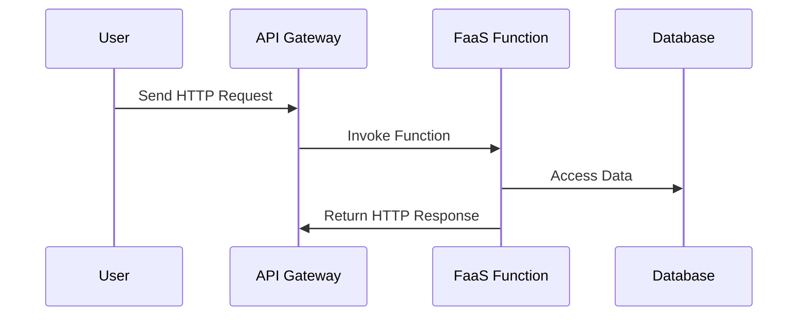

**系统接口设计**：

- **函数API**：提供创建、更新、删除和查询函数的接口。
- **触发器API**：提供配置、更新和查询触发器的接口。
- **API网关API**：提供与外部系统集成的接口。

**系统交互设计**：

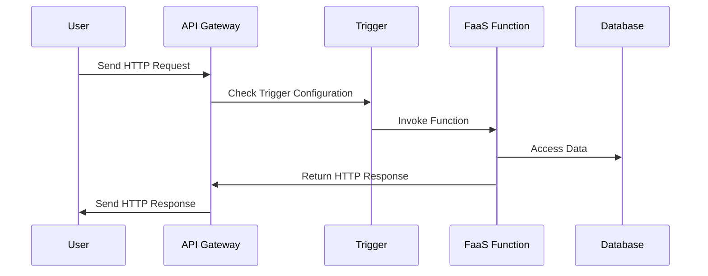

**核心概念原理**：

FaaS的基本原理是：

- **代码即服务**：用户上传代码，平台提供运行环境。
- **按需执行**：函数只在需要时执行，避免了资源的浪费。
- **无状态**：函数通常是无状态的，每次执行都是独立的。

**问题解决**：

FaaS的优势包括：

- **高可伸缩性**：根据需求自动扩展和回收资源。
- **简化开发**：无需关注底层基础设施，专注于业务逻辑。
- **快速部署**：代码上传后即可部署，加快开发周期。

**注意事项**：

- **函数状态管理**：由于函数是无状态的，需要确保状态在函数之间传递。
- **函数性能优化**：合理设计函数，减少执行时间。

### 2.1.2 FaaS与传统应用部署的区别

**核心概念原理**：

FaaS与传统应用部署的主要区别在于部署方式、可伸缩性和管理复杂性。

- **部署方式**：FaaS通过上传代码进行部署，而传统应用通常需要打包和配置。
- **可伸缩性**：FaaS具有自动弹性伸缩的特性，而传统应用需要手动配置。
- **管理复杂性**：FaaS简化了基础设施管理，而传统应用需要处理更多细节。

**问题解决**：

FaaS的优势包括：

- **简化部署**：无需打包和配置，简化了部署流程。
- **提高可伸缩性**：自动扩展和回收资源，提高系统的灵活性。
- **降低管理成本**：无需关注底层基础设施，降低了管理成本。

**注意事项**：

- **函数依赖**：FaaS函数之间可能存在依赖关系，需要确保函数之间的调用顺序。
- **性能监控**：由于函数执行时间较短，需要确保性能监控的有效性。

### 2.2 无服务器数据库

**核心概念原理**：

无服务器数据库是一种无需管理数据库服务器的数据库解决方案，通常提供按需付费的模式。它通过自动化管理数据库基础设施，提供高性能、可扩展的数据库服务。

- **无服务器数据库**：无需管理数据库服务器的数据库解决方案。
- **自动化管理**：自动化处理数据库的部署、扩展、备份和恢复。
- **按需付费**：根据实际使用量进行收费。

**问题场景介绍**：

无服务器数据库适用于以下场景：

- **数据存储**：需要高效、可扩展的数据存储解决方案。
- **数据分析**：需要对大量数据进行分析和处理。
- **移动应用**：需要支持移动设备的快速数据访问。

**项目介绍**：

例如，在电子商务应用中，无服务器数据库可以用于存储商品信息、用户数据和订单信息。

**系统功能设计**：

- **数据存储**：提供高效、可靠的数据存储服务。
- **数据检索**：提供快速的数据检索功能。
- **数据备份与恢复**：自动化处理数据的备份和恢复。

**系统架构设计**：

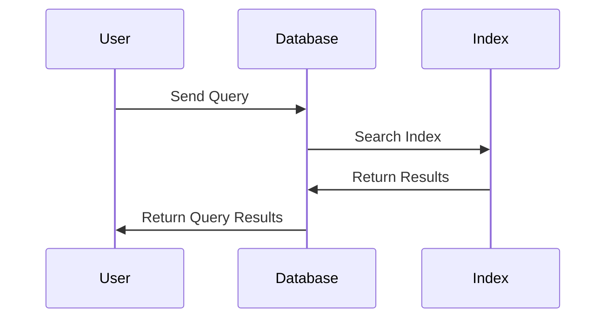

**系统接口设计**：

- **数据库API**：提供创建、更新、删除和查询数据库的接口。
- **备份与恢复API**：提供备份和恢复数据库的接口。

**系统交互设计**：

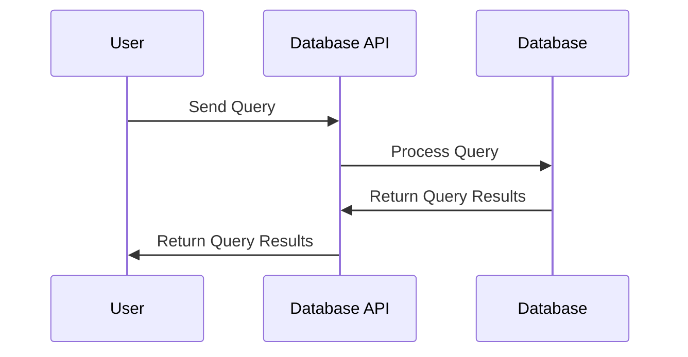

**核心概念原理**：

无服务器数据库的优势包括：

- **高性能**：提供高效的数据存储和检索功能。
- **可扩展性**：自动扩展和回收资源，确保系统的高可用性。
- **成本优化**：按需付费，避免了资源的浪费。

**问题解决**：

无服务器数据库的挑战包括：

- **数据一致性**：确保数据在分布式环境下的一致性。
- **性能监控**：确保性能监控的有效性，及时发现和处理性能问题。

**注意事项**：

- **数据迁移**：从现有数据库迁移到无服务器数据库时，需要确保数据的一致性和完整性。
- **性能优化**：根据应用需求，对数据库进行性能优化。

### 2.3 无服务器存储

**核心概念原理**：

无服务器存储是一种无需管理存储服务器的存储解决方案，通常提供按需付费的模式。它通过自动化管理存储基础设施，提供高性能、可扩展的存储服务。

- **无服务器存储**：无需管理存储服务器的存储解决方案。
- **自动化管理**：自动化处理存储的部署、扩展、备份和恢复。
- **按需付费**：根据实际使用量进行收费。

**问题场景介绍**：

无服务器存储适用于以下场景：

- **文件存储**：需要高效、可靠的大型文件存储解决方案。
- **对象存储**：需要存储大量非结构化数据，如图片、视频等。
- **数据分析**：需要存储和处理大量数据。

**项目介绍**：

例如，在视频流媒体应用中，无服务器存储可以用于存储视频文件，并提供快速的数据访问。

**系统功能设计**：

- **文件存储**：提供高效、可靠的文件存储服务。
- **对象存储**：提供存储大量非结构化数据的功能。
- **数据检索**：提供快速的数据检索功能。

**系统架构设计**：

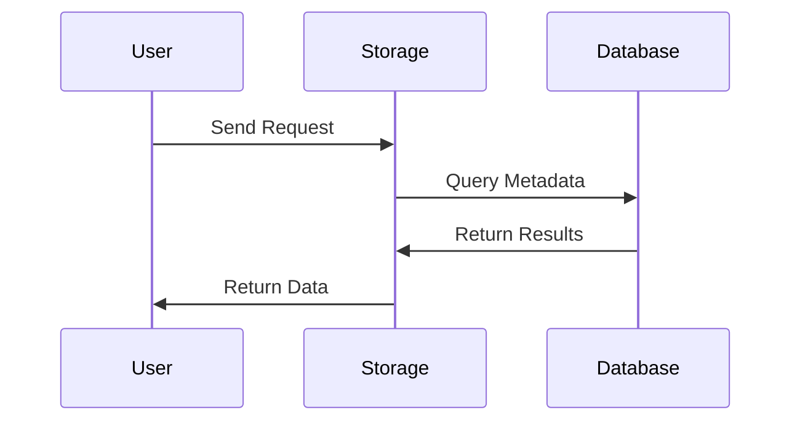

**系统接口设计**：

- **存储API**：提供创建、更新、删除和查询存储对象的接口。
- **备份与恢复API**：提供备份和恢复存储数据的接口。

**系统交互设计**：

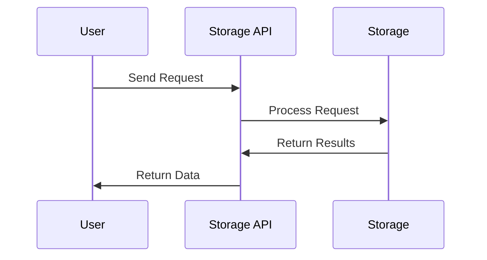

**核心概念原理**：

无服务器存储的优势包括：

- **高性能**：提供高效的数据存储和检索功能。
- **可扩展性**：自动扩展和回收资源，确保系统的高可用性。
- **成本优化**：按需付费，避免了资源的浪费。

**问题解决**：

无服务器存储的挑战包括：

- **数据安全性**：确保数据在存储过程中的安全性和完整性。
- **性能监控**：确保性能监控的有效性，及时发现和处理性能问题。

**注意事项**：

- **数据迁移**：从现有存储服务迁移到无服务器存储时，需要确保数据的一致性和完整性。
- **性能优化**：根据应用需求，对存储进行性能优化。

### 2.4 无服务器架构的核心要素

**核心概念原理**：

无服务器架构的核心要素包括自动化部署与扩展、弹性计算与资源优化。

- **自动化部署与扩展**：通过自动化工具和平台，实现应用的快速部署和弹性扩展。
- **弹性计算与资源优化**：根据需求动态调整计算资源和存储资源，确保系统的最佳性能和成本效益。

**问题场景介绍**：

无服务器架构适用于以下场景：

- **快速部署**：需要快速上线和部署新功能。
- **弹性伸缩**：需要根据流量动态调整资源。
- **成本优化**：需要根据使用量优化成本。

**项目介绍**：

例如，在电子商务应用中，无服务器架构可以用于快速部署新功能，如限时促销、库存管理等。

**系统功能设计**：

- **自动化部署**：提供自动化部署工具和平台。
- **弹性伸缩**：提供自动扩展和回收资源的机制。
- **成本优化**：提供成本分析和优化工具。

**系统架构设计**：

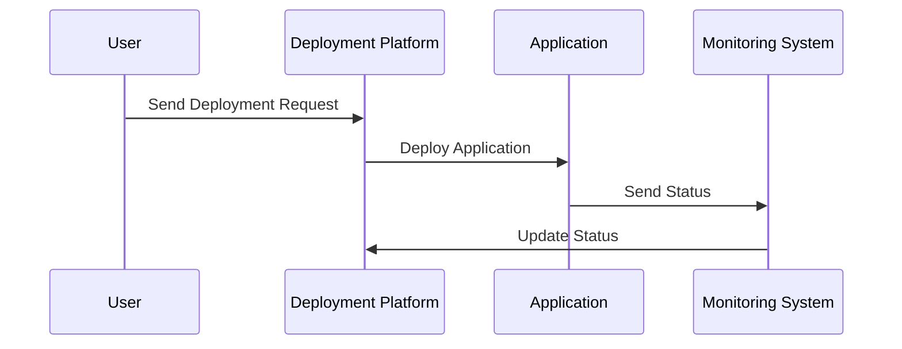

**系统接口设计**：

- **部署API**：提供部署应用的接口。
- **监控API**：提供监控应用性能和状态的接口。

**系统交互设计**：

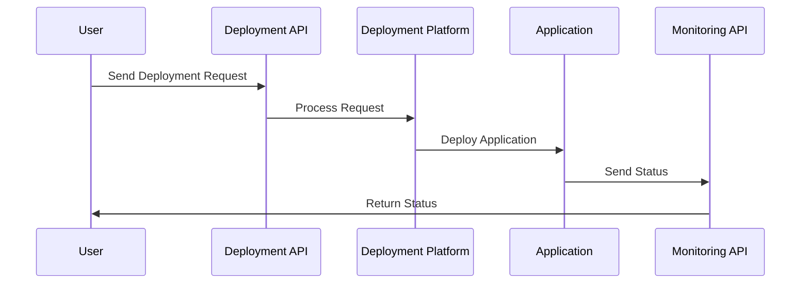

**核心概念原理**：

无服务器架构的优势包括：

- **快速部署**：自动化部署和扩展，加快开发周期。
- **弹性伸缩**：根据需求动态调整资源，提高系统的灵活性。
- **成本优化**：按需付费，避免资源的浪费。

**问题解决**：

无服务器架构的挑战包括：

- **监控与调试**：自动化部署和扩展可能导致监控和调试变得更加复杂。
- **性能瓶颈**：在某些情况下，自动扩展可能无法满足高性能需求。

**注意事项**：

- **监控与调试**：确保监控和调试的有效性，及时发现和处理问题。
- **性能优化**：根据应用需求，对架构进行性能优化。

### 2.5 无服务器架构与其他技术的关系

**核心概念原理**：

无服务器架构与其他技术如容器化、微服务有着紧密的联系。

- **容器化**：容器化技术（如Docker）为无服务器架构提供了灵活的部署和运行环境。
- **微服务**：微服务架构的无服务器实现，使得应用可以更灵活地部署和扩展。

**问题场景介绍**：

无服务器架构适用于以下场景：

- **容器化部署**：需要快速部署容器化的应用。
- **微服务架构**：需要实现微服务架构，提高系统的灵活性和可维护性。

**项目介绍**：

例如，在电子商务应用中，可以使用无服务器架构来实现容器化的微服务架构，提高系统的性能和可扩展性。

**系统功能设计**：

- **容器化部署**：提供容器化应用的部署和管理功能。
- **微服务集成**：提供微服务之间的集成和通信功能。

**系统架构设计**：

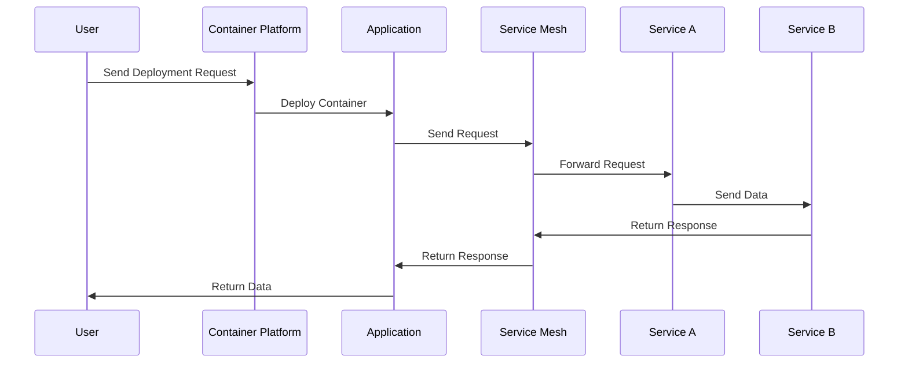

**系统接口设计**：

- **容器化API**：提供部署和管理容器的接口。
- **微服务API**：提供微服务之间的通信接口。

**系统交互设计**：

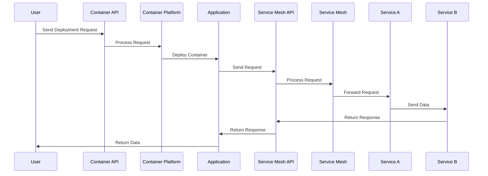

**核心概念原理**：

无服务器架构与其他技术的结合，提供了以下优势：

- **容器化**：简化部署流程，提高应用的灵活性。
- **微服务**：提高系统的可维护性和扩展性。

**问题解决**：

无服务器架构与其他技术的结合，可以解决以下问题：

- **部署复杂性**：通过容器化技术简化部署流程。
- **扩展性**：通过微服务架构提高系统的可扩展性。

**注意事项**：

- **兼容性**：确保无服务器架构与其他技术之间的兼容性。
- **性能优化**：根据应用需求，对架构进行性能优化。

## 第三部分：算法原理讲解

### 3.1 资源分配与调度算法

#### 3.1.1 资源分配算法

**核心概念原理**：

资源分配算法是服务器less架构中至关重要的一部分，它决定了如何根据需求合理地分配计算资源。

- **动态资源分配**：根据当前负载动态调整资源的分配。
- **静态资源分配**：预先分配一定数量的资源，并根据实际需求进行调整。

**问题场景介绍**：

资源分配算法在以下场景中至关重要：

- **高并发**：需要处理大量并发请求。
- **负载波动**：需要应对负载的波动。

**项目介绍**：

例如，在电商平台，资源分配算法可以确保在高并发情况下，系统能够保持高性能。

**系统功能设计**：

- **动态资源分配**：提供动态调整资源分配的机制。
- **静态资源分配**：提供静态资源分配的策略。

**系统架构设计**：

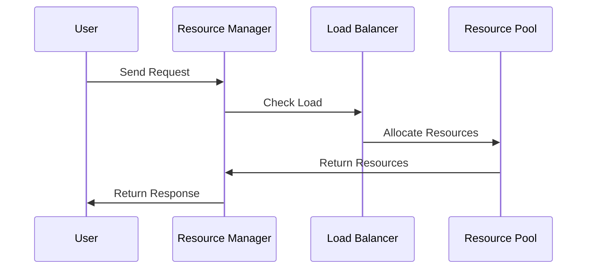

**系统接口设计**：

- **资源管理API**：提供分配和回收资源的接口。
- **负载均衡API**：提供监控和调整负载均衡策略的接口。

**系统交互设计**：

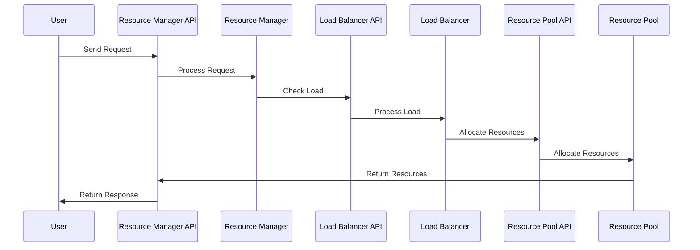

**核心概念原理**：

资源分配算法的关键在于：

- **负载均衡**：确保资源分配的公平性。
- **动态调整**：根据负载变化动态调整资源。

**问题解决**：

资源分配算法的问题解决包括：

- **负载均衡**：通过负载均衡算法，确保请求均匀分配到各个节点。
- **动态调整**：通过监控和反馈机制，动态调整资源分配策略。

**注意事项**：

- **负载均衡**：确保负载均衡算法的效率和公平性。
- **监控与反馈**：确保资源分配的实时性和准确性。

#### 3.1.2 调度算法

**核心概念原理**：

调度算法是服务器less架构中另一个重要的组成部分，它决定了如何调度和管理任务。

- **任务调度**：根据任务的优先级和可用资源，安排任务执行。
- **并行调度**：同时执行多个任务，提高系统的吞吐量。

**问题场景介绍**：

调度算法在以下场景中至关重要：

- **并发任务**：需要同时处理多个并发任务。
- **高吞吐量**：需要处理大量请求。

**项目介绍**：

例如，在社交媒体平台，调度算法可以确保同时处理用户发布内容、评论和其他操作。

**系统功能设计**：

- **任务调度**：提供任务调度的功能。
- **并行调度**：提供并行执行任务的机制。

**系统架构设计**：

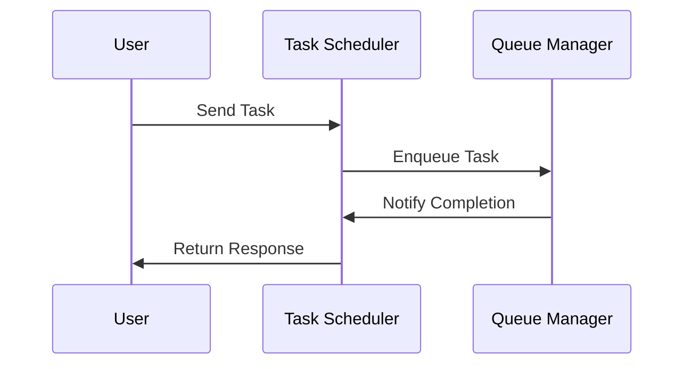

**系统接口设计**：

- **任务调度API**：提供调度任务的接口。
- **队列管理API**：提供任务队列管理的接口。

**系统交互设计**：

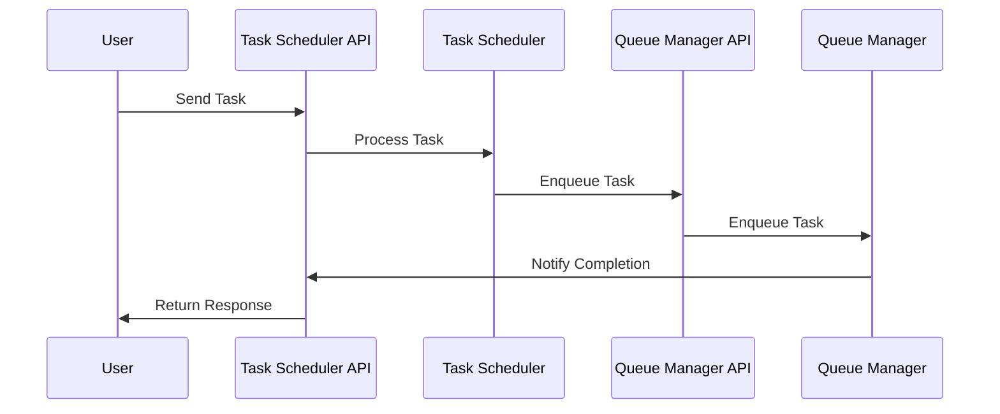

**核心概念原理**：

调度算法的关键在于：

- **任务优先级**：根据任务的优先级进行调度。
- **并行执行**：通过并行调度，提高系统的吞吐量。

**问题解决**：

调度算法的问题解决包括：

- **优先级调度**：确保高优先级任务先执行。
- **并行调度**：通过并行执行任务，提高系统的性能。

**注意事项**：

- **任务优先级**：确保任务优先级设置的正确性。
- **并行执行**：确保并行调度的效率和公平性。

### 3.2 自动化扩展与弹性伸缩

#### 3.2.1 自动化扩展原理

**核心概念原理**：

自动化扩展是服务器less架构的一个重要特性，它允许系统根据负载自动调整资源的数量。

- **水平扩展**：增加或减少计算节点的数量。
- **垂直扩展**：增加或减少单个节点的资源容量。

**问题场景介绍**：

自动化扩展在以下场景中至关重要：

- **高并发**：需要处理大量并发请求。
- **负载波动**：需要应对负载的波动。

**项目介绍**：

例如，在电商平台上，自动化扩展可以确保在高并发情况下，系统能够保持高性能。

**系统功能设计**：

- **自动扩展**：提供自动扩展的功能。
- **扩展策略**：提供自定义扩展策略的机制。

**系统架构设计**：

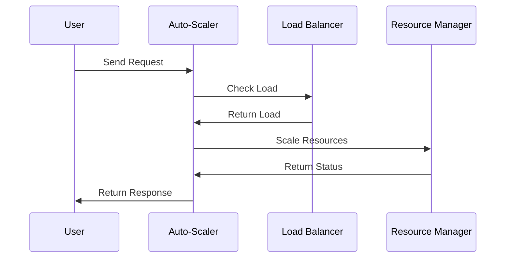

**系统接口设计**：

- **自动扩展API**：提供自动扩展的接口。
- **负载均衡API**：提供监控和调整负载均衡策略的接口。

**系统交互设计**：

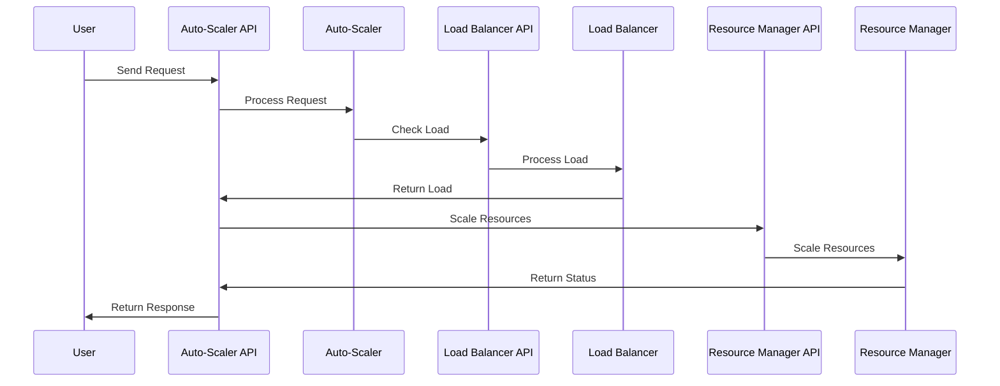

**核心概念原理**：

自动化扩展的关键在于：

- **负载监测**：实时监测系统的负载。
- **动态调整**：根据负载变化动态调整资源的数量。

**问题解决**：

自动化扩展的问题解决包括：

- **负载监测**：确保负载监测的准确性和实时性。
- **动态调整**：确保动态调整的效率和准确性。

**注意事项**：

- **负载监测**：确保负载监测的准确性，避免误判。
- **动态调整**：确保动态调整的及时性和可靠性。

#### 3.2.2 弹性伸缩策略

**核心概念原理**：

弹性伸缩策略是服务器less架构中的一个重要组成部分，它决定了如何根据需求动态调整系统的资源。

- **垂直伸缩**：增加或减少单个节点的资源容量。
- **水平伸缩**：增加或减少计算节点的数量。

**问题场景介绍**：

弹性伸缩策略在以下场景中至关重要：

- **高并发**：需要处理大量并发请求。
- **负载波动**：需要应对负载的波动。

**项目介绍**：

例如，在社交媒体平台上，弹性伸缩策略可以确保在高并发情况下，系统能够保持高性能。

**系统功能设计**：

- **垂直伸缩**：提供垂直扩展的功能。
- **水平伸缩**：提供水平扩展的机制。

**系统架构设计**：

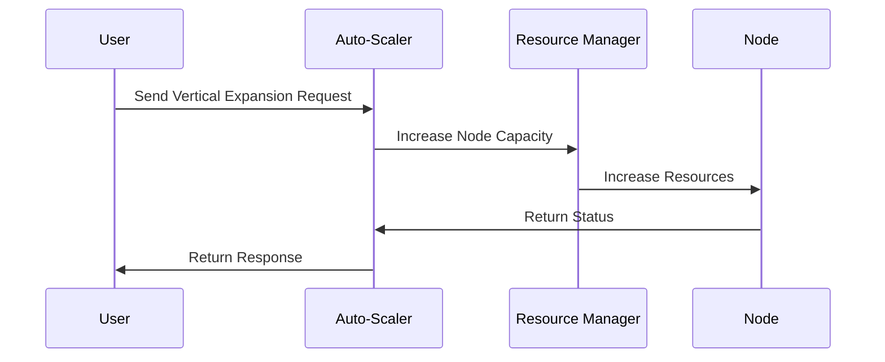

**系统接口设计**：

- **自动扩展API**：提供垂直扩展的接口。
- **资源管理API**：提供调整节点资源的接口。

**系统交互设计**：

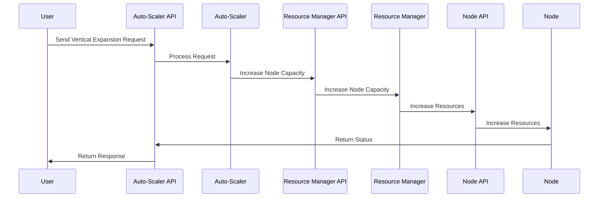

**核心概念原理**：

弹性伸缩策略的关键在于：

- **资源调整**：根据需求动态调整资源的容量。
- **负载平衡**：确保负载在各个节点之间均匀分配。

**问题解决**：

弹性伸缩策略的问题解决包括：

- **资源调整**：确保资源调整的准确性和及时性。
- **负载平衡**：确保负载平衡算法的效率和公平性。

**注意事项**：

- **资源调整**：确保资源调整的及时性和可靠性。
- **负载平衡**：确保负载平衡算法的有效性和公平性。

### 3.3 算法案例解析

#### 3.3.1 某无服务器平台的资源分配案例

**核心概念原理**：

为了更好地理解资源分配算法，我们可以通过一个具体的案例来解析。

**案例背景**：

假设我们有一个无服务器平台，需要处理大量的并发请求。平台使用资源分配算法来动态调整计算资源的数量，以确保系统的性能和稳定性。

**系统功能设计**：

- **负载监测**：实时监测系统的负载。
- **资源分配**：根据负载动态调整资源的数量。

**系统架构设计**：

```mermaid
sequenceDiagram
    User->>Load Monitor: Send Request
    Load Monitor->>Auto-Scaler: Check Load
    Auto-Scaler->>Resource Manager: Allocate Resources
    Resource Manager->>Node: Allocate Resources
    Node->>User: Return Response
```

**系统接口设计**：

- **负载监测API**：提供监测系统负载的接口。
- **自动扩展API**：提供动态调整资源的接口。
- **节点API**：提供节点资源的接口。

**系统交互设计**：

```mermaid
sequenceDiagram
    User->>Load Monitor API: Send Request
    Load Monitor API->>Load Monitor: Process Request
    Load Monitor->>Auto-Scaler API: Check Load
    Auto-Scaler API->>Auto-Scaler: Process Load
    Auto-Scaler->>Resource Manager API: Allocate Resources
    Resource Manager API->>Resource Manager: Allocate Resources
    Resource Manager->>Node API: Allocate Resources
    Node API->>Node: Allocate Resources
    Node->>User: Return Response
```

**核心概念原理**：

资源分配算法的关键在于：

- **负载监测**：确保实时监测系统的负载。
- **资源调整**：根据负载动态调整资源的数量。

**问题解决**：

资源分配算法的问题解决包括：

- **负载监测**：确保负载监测的准确性和实时性。
- **资源调整**：确保资源调整的及时性和准确性。

**注意事项**：

- **负载监测**：确保负载监测的准确性，避免误判。
- **资源调整**：确保资源调整的及时性和可靠性。

#### 3.3.2 某无服务器平台的扩展案例

**核心概念原理**：

为了更好地理解自动化扩展原理，我们可以通过一个具体的案例来解析。

**案例背景**：

假设我们有一个无服务器平台，需要处理大量的并发请求。平台使用自动化扩展来动态调整计算资源的数量，以确保系统的性能和稳定性。

**系统功能设计**：

- **自动扩展**：根据负载动态调整资源的数量。
- **负载平衡**：确保负载在各个节点之间均匀分配。

**系统架构设计**：

```mermaid
sequenceDiagram
    User->>Auto-Scaler: Send Expansion Request
    Auto-Scaler->>Load Balancer: Check Load
    Load Balancer->>Auto-Scaler: Return Load
    Auto-Scaler->>Resource Manager: Scale Resources
    Resource Manager->>Node: Scale Resources
    Node->>User: Return Response
```

**系统接口设计**：

- **自动扩展API**：提供动态调整资源的接口。
- **负载平衡API**：提供监控和调整负载均衡策略的接口。
- **节点API**：提供节点资源的接口。

**系统交互设计**：

```mermaid
sequenceDiagram
    User->>Auto-Scaler API: Send Expansion Request
    Auto-Scaler API->>Auto-Scaler: Process Request
    Auto-Scaler->>Load Balancer API: Check Load
    Load Balancer API->>Load Balancer: Process Load
    Load Balancer->>Auto-Scaler API: Return Load
    Auto-Scaler API->>Resource Manager API: Scale Resources
    Resource Manager API->>Resource Manager: Scale Resources
    Resource Manager->>Node API: Scale Resources
    Node API->>Node: Scale Resources
    Node->>User: Return Response
```

**核心概念原理**：

自动化扩展的关键在于：

- **负载监测**：确保实时监测系统的负载。
- **资源调整**：根据负载动态调整资源的数量。

**问题解决**：

自动化扩展的问题解决包括：

- **负载监测**：确保负载监测的准确性和实时性。
- **资源调整**：确保资源调整的及时性和准确性。

**注意事项**：

- **负载监测**：确保负载监测的准确性，避免误判。
- **资源调整**：确保资源调整的及时性和可靠性。

## 第四部分：数学模型和公式

### 4.1 资源需求模型

**核心概念原理**：

资源需求模型是服务器less架构中用于预测和计算系统所需资源的关键模型。它通常包括以下几个方面：

- **计算资源需求**：包括CPU、内存、存储等。
- **网络资源需求**：包括数据传输速度、带宽等。
- **负载模型**：包括用户访问模式、请求频率等。

**数学模型和公式**：

我们可以使用以下公式来计算系统的资源需求：

\[ R = f(L, T, U) \]

其中：
- \( R \) 表示资源需求。
- \( L \) 表示负载。
- \( T \) 表示时间。
- \( U \) 表示用户数量。

**举例说明**：

假设我们有一个应用，每天有1000个用户访问，每个用户每天产生10次请求。请求的平均响应时间为2秒。我们可以使用以下公式来计算所需的资源：

\[ R = f(1000, 24 \times 60 \times 60, 1000) \]

**详细讲解**：

- **负载**：负载是指系统在一段时间内处理的请求量。在这个例子中，每天有1000个用户，每个用户每天产生10次请求，所以总负载为1000 \times 10 = 10000次请求。
- **时间**：时间是指系统运行的时间。在这个例子中，系统每天运行24小时，每小时运行60分钟，每分钟运行60秒，所以总时间为24 \times 60 \times 60 = 86400秒。
- **用户数量**：用户数量是指系统的用户数。在这个例子中，用户数量为1000。

**注意事项**：

- **实时调整**：根据实际负载，实时调整资源需求。
- **历史数据**：使用历史数据来预测未来的资源需求。

### 4.2 费用计算模型

**核心概念原理**：

费用计算模型是服务器less架构中用于计算系统运行成本的关键模型。它通常包括以下几个方面：

- **计算费用**：根据计算资源的使用量进行计算。
- **存储费用**：根据存储资源的使用量进行计算。
- **数据传输费用**：根据数据传输的量进行计算。

**数学模型和公式**：

我们可以使用以下公式来计算系统的费用：

\[ C = C_{compute} + C_{storage} + C_{data} \]

其中：
- \( C \) 表示总费用。
- \( C_{compute} \) 表示计算费用。
- \( C_{storage} \) 表示存储费用。
- \( C_{data} \) 表示数据传输费用。

**举例说明**：

假设我们有一个应用，每天使用1小时的计算资源，每天存储1GB的数据，每天传输10GB的数据。我们可以使用以下公式来计算所需的费用：

\[ C = C_{compute} + C_{storage} + C_{data} \]

其中：
- \( C_{compute} \) = \( 1 \) 小时 \(\times\) 每小时计算费用 = \( 1 \) 小时 \(\times\) \( 10 \) 元/小时 = \( 10 \) 元
- \( C_{storage} \) = \( 1 \) GB \(\times\) 每GB存储费用 = \( 1 \) GB \(\times\) \( 5 \) 元/GB = \( 5 \) 元
- \( C_{data} \) = \( 10 \) GB \(\times\) 每GB数据传输费用 = \( 10 \) GB \(\times\) \( 2 \) 元/GB = \( 20 \) 元

所以，总费用 \( C \) = \( 10 \) 元 + \( 5 \) 元 + \( 20 \) 元 = \( 35 \) 元。

**详细讲解**：

- **计算费用**：计算费用取决于计算资源的使用量和每小时的费用。在这个例子中，每天使用1小时的计算资源，每小时费用为10元，所以计算费用为10元。
- **存储费用**：存储费用取决于存储资源的使用量和每GB的费用。在这个例子中，每天存储1GB的数据，每GB费用为5元，所以存储费用为5元。
- **数据传输费用**：数据传输费用取决于数据传输的量和每GB的费用。在这个例子中，每天传输10GB的数据，每GB费用为2元，所以数据传输费用为20元。

**注意事项**：

- **实际费用**：实际费用可能会根据不同服务和区域有所不同，需要参考具体的服务提供商的费用标准。
- **优化成本**：通过优化代码和架构，降低计算、存储和数据传输的成本。

### 4.3 算法性能评估模型

**核心概念原理**：

算法性能评估模型是用于评估服务器less架构中算法性能的关键模型。它通常包括以下几个方面：

- **响应时间**：系统处理请求所需的时间。
- **吞吐量**：系统在单位时间内处理的请求数量。
- **资源利用率**：系统资源的实际使用情况。

**数学模型和公式**：

我们可以使用以下公式来评估算法性能：

\[ P = \frac{T}{R} \]

其中：
- \( P \) 表示性能。
- \( T \) 表示响应时间。
- \( R \) 表示吞吐量。

**举例说明**：

假设我们有一个应用，每秒处理100个请求，每个请求的平均响应时间为2秒。我们可以使用以下公式来计算性能：

\[ P = \frac{2秒}{100个请求} = 0.02秒/请求 \]

**详细讲解**：

- **响应时间**：响应时间是指系统处理一个请求所需的时间。在这个例子中，每个请求的平均响应时间为2秒。
- **吞吐量**：吞吐量是指系统在单位时间内处理的请求数量。在这个例子中，每秒处理100个请求。

**注意事项**：

- **性能优化**：通过优化代码和架构，提高系统的性能。
- **监控与反馈**：定期监控系统的性能，并根据反馈进行优化。

## 第五部分：系统分析与架构设计方案

### 5.1 服务器less架构的系统分析

**核心概念原理**：

服务器less架构的系统分析涉及对系统功能、性能、可扩展性和成本效益等方面的深入分析。以下是对这些方面的详细解释：

- **系统功能**：服务器less架构提供了按需部署、弹性伸缩、自动化管理和按需付费等功能。
- **性能**：通过自动化扩展和负载均衡，服务器less架构能够确保系统在高并发情况下保持高性能。
- **可扩展性**：服务器less架构能够根据需求动态调整资源，确保系统的高可扩展性。
- **成本效益**：服务器less架构通过按需付费和自动化管理，降低了系统的运营成本。

**问题场景介绍**：

服务器less架构适用于以下场景：

- **高并发应用**：需要处理大量并发请求，如电商平台、社交媒体等。
- **动态扩展应用**：需要根据业务需求动态调整资源，如在线游戏、流媒体服务等。
- **低成本运营**：需要降低运营成本，如初创企业、小型项目等。

**项目介绍**：

例如，一个电商平台可以使用服务器less架构来处理高峰期的流量，确保系统的稳定性和性能。

**系统功能设计**：

- **自动化部署**：提供自动化部署功能，加快开发周期。
- **弹性伸缩**：提供弹性伸缩功能，确保系统的高可用性和性能。
- **自动化管理**：提供自动化管理功能，降低运营成本。
- **按需付费**：提供按需付费功能，确保成本优化。

**系统架构设计**：

```mermaid
sequenceDiagram
    User->>API Gateway: Send Request
    API Gateway->>Function as a Service (FaaS): Execute Function
    FaaS->>Database: Access Data
    Database->>FaaS: Return Data
    FaaS->>API Gateway: Return Response
    API Gateway->>User: Return Response
```

**系统接口设计**：

- **API Gateway**：提供与外部系统的接口。
- **FaaS**：提供函数执行和调用的接口。
- **Database**：提供数据存储和检索的接口。

**系统交互设计**：

```mermaid
sequenceDiagram
    User->>API Gateway: Send HTTP Request
    API Gateway->>FaaS: Send Request
    FaaS->>Database: Access Data
    Database->>FaaS: Return Data
    FaaS->>API Gateway: Return HTTP Response
    API Gateway->>User: Return HTTP Response
```

**核心概念原理**：

服务器less架构的核心概念原理包括：

- **按需部署**：根据需求自动部署和扩展应用。
- **弹性伸缩**：根据负载自动调整资源。
- **自动化管理**：自动化处理基础设施的维护和管理。
- **按需付费**：根据实际使用量进行收费。

**问题解决**：

服务器less架构的问题解决包括：

- **高并发处理**：通过弹性伸缩和负载均衡，确保系统在高并发情况下保持性能。
- **成本优化**：通过按需付费和自动化管理，降低运营成本。
- **系统监控**：通过实时监控和报警，确保系统的稳定性和性能。

**注意事项**：

- **监控与报警**：确保系统监控和报警机制的完善，及时发现和处理问题。
- **安全性**：确保系统的安全性和数据的完整性。

### 5.2 服务器less架构的系统设计

**核心概念原理**：

服务器less架构的系统设计涉及对系统功能、架构和接口等方面的详细设计。以下是对这些方面的详细解释：

- **系统功能**：服务器less架构提供了包括函数执行、数据存储和API网关等功能。
- **系统架构**：服务器less架构采用了分布式架构，包括函数执行层、数据存储层和API网关层。
- **系统接口**：服务器less架构提供了与外部系统交互的接口，包括HTTP接口和事件触发接口。

**问题场景介绍**：

服务器less架构适用于以下场景：

- **微服务架构**：需要实现微服务架构，提高系统的可扩展性和可维护性。
- **事件驱动架构**：需要处理事件驱动类型的请求，如传感器数据、支付通知等。
- **后台任务处理**：需要处理后台任务，如邮件发送、报告生成等。

**项目介绍**：

例如，一个电商平台可以使用服务器less架构来实现订单处理、支付通知和库存管理等后台任务。

**系统功能设计**：

- **函数执行**：提供函数执行功能，包括函数创建、部署和监控。
- **数据存储**：提供数据存储功能，包括数据库连接和对象存储。
- **API网关**：提供与外部系统的接口，包括HTTP接口和事件触发接口。

**系统架构设计**：

```mermaid
sequenceDiagram
    User->>API Gateway: Send Request
    API Gateway->>Function as a Service (FaaS): Execute Function
    FaaS->>Database: Access Data
    Database->>FaaS: Return Data
    FaaS->>API Gateway: Return Response
    API Gateway->>User: Return Response
```

**系统接口设计**：

- **API Gateway**：提供HTTP接口和事件触发接口。
- **FaaS**：提供函数执行接口。
- **Database**：提供数据存储接口。

**系统交互设计**：

```mermaid
sequenceDiagram
    User->>API Gateway: Send HTTP Request
    API Gateway->>FaaS: Send Request
    FaaS->>Database: Access Data
    Database->>FaaS: Return Data
    FaaS->>API Gateway: Return HTTP Response
    API Gateway->>User: Return HTTP Response
```

**核心概念原理**：

服务器less架构的核心概念原理包括：

- **函数执行**：通过上传代码，在需要时执行函数。
- **数据存储**：通过数据库和对象存储，提供数据的存储和检索功能。
- **API网关**：提供与外部系统的接口，确保系统的可扩展性和灵活性。

**问题解决**：

服务器less架构的问题解决包括：

- **高并发处理**：通过函数执行和API网关，确保系统在高并发情况下保持性能。
- **数据安全性**：通过数据存储和加密，确保数据的安全性和完整性。
- **系统监控**：通过实时监控和报警，确保系统的稳定性和性能。

**注意事项**：

- **监控与报警**：确保系统监控和报警机制的完善，及时发现和处理问题。
- **安全性**：确保系统的安全性和数据的完整性。

### 5.3 服务器less架构的实施案例

**核心概念原理**：

服务器less架构的实施案例展示了如何在实际项目中使用无服务器计算来构建和部署应用程序。以下是对实施过程的详细解释：

- **环境准备**：准备服务器less架构所需的环境，包括云服务提供商、开发工具和依赖库。
- **系统核心实现**：实现系统的核心功能，包括函数编写、数据库连接和API网关集成。
- **代码应用解读与分析**：解读和分析系统代码，确保其满足性能和安全性要求。
- **实际案例分析和讲解剖析**：通过实际案例，展示服务器less架构在实际应用中的效果和优势。

**问题场景介绍**：

服务器less架构适用于以下场景：

- **新应用开发**：用于构建全新的应用，如移动应用、网站等。
- **现有系统迁移**：将现有系统迁移到无服务器架构，提高系统的性能和可维护性。
- **后台任务处理**：用于处理后台任务，如数据处理、报告生成等。

**项目介绍**：

例如，一个在线电商平台可以使用服务器less架构来实现订单处理、支付通知和库存管理等后台任务。

**系统功能设计**：

- **订单处理**：处理订单的创建、更新和查询。
- **支付通知**：发送支付成功的通知。
- **库存管理**：管理库存信息，包括库存的添加、删除和更新。

**系统架构设计**：

```mermaid
sequenceDiagram
    User->>API Gateway: Send Request
    API Gateway->>Order Processing Function: Process Order
    Order Processing Function->>Payment Notification Function: Send Notification
    Payment Notification Function->>Inventory Management Function: Update Inventory
    Inventory Management Function->>API Gateway: Return Response
    API Gateway->>User: Return Response
```

**系统接口设计**：

- **API Gateway**：提供与外部系统的接口。
- **Order Processing Function**：处理订单的创建和更新。
- **Payment Notification Function**：发送支付成功的通知。
- **Inventory Management Function**：管理库存信息。

**系统交互设计**：

```mermaid
sequenceDiagram
    User->>API Gateway: Send HTTP Request
    API Gateway->>Order Processing Function: Send Request
    Order Processing Function->>Database: Access Data
    Database->>Order Processing Function: Return Data
    Order Processing Function->>Payment Notification Function: Send Notification
    Payment Notification Function->>Database: Access Data
    Database->>Payment Notification Function: Return Data
    Payment Notification Function->>API Gateway: Return HTTP Response
    API Gateway->>User: Return HTTP Response
```

**核心概念原理**：

服务器less架构的核心概念原理包括：

- **函数即服务（FaaS）**：通过上传代码，在需要时执行函数。
- **API网关**：提供与外部系统的接口，确保系统的可扩展性和灵活性。
- **数据存储**：通过数据库和对象存储，提供数据的存储和检索功能。

**问题解决**：

服务器less架构的问题解决包括：

- **高并发处理**：通过函数执行和API网关，确保系统在高并发情况下保持性能。
- **数据安全性**：通过数据存储和加密，确保数据的安全性和完整性。
- **系统监控**：通过实时监控和报警，确保系统的稳定性和性能。

**注意事项**：

- **监控与报警**：确保系统监控和报警机制的完善，及时发现和处理问题。
- **安全性**：确保系统的安全性和数据的完整性。

## 第六部分：项目实战

### 6.1 无服务器架构环境安装

**核心概念原理**：

无服务器架构的环境安装是使用无服务器计算的第一步，它包括安装云服务提供商的控制台、命令行工具和开发环境。

- **云服务提供商**：选择适合的无服务器计算平台，如AWS Lambda、Google Cloud Functions等。
- **命令行工具**：安装云服务提供商的命令行工具，如AWS CLI、gcloud等。
- **开发环境**：配置开发环境，包括代码编辑器、版本控制系统和依赖管理工具。

**问题场景介绍**：

无服务器架构的环境安装适用于以下场景：

- **新项目开发**：为新的项目搭建无服务器架构的环境。
- **现有项目迁移**：为现有项目迁移到无服务器架构搭建环境。
- **测试环境**：为测试项目搭建独立的测试环境。

**项目介绍**：

例如，我们准备为一个新的电商平台搭建AWS Lambda环境，以便使用无服务器架构来实现订单处理、支付通知和库存管理等功能。

**系统功能设计**：

- **环境安装**：安装AWS Lambda控制台、AWS CLI和开发环境。
- **代码编写**：编写订单处理、支付通知和库存管理的函数代码。
- **部署**：将函数部署到AWS Lambda。

**系统架构设计**：

```mermaid
sequenceDiagram
    Developer->>AWS Console: Access AWS Lambda Console
    Developer->>AWS CLI: Install and Configure
    Developer->>Development Environment: Install Required Tools
    Developer->>Code Editor: Write Lambda Functions
    Developer->>Version Control: Commit Changes
    Developer->>AWS CLI: Deploy Functions
```

**系统接口设计**：

- **AWS Console**：提供AWS Lambda的控制台界面。
- **AWS CLI**：提供AWS Lambda的命令行工具。
- **Development Environment**：提供代码编辑器、版本控制系统和依赖管理工具。

**系统交互设计**：

```mermaid
sequenceDiagram
    Developer->>AWS Console: Access AWS Lambda Console
    Developer->>AWS CLI: Install CLI Tools
    Developer->>Development Environment: Configure Tools
    Developer->>Code Editor: Write and Edit Lambda Functions
    Developer->>Version Control: Commit and Push Changes
    Developer->>AWS CLI: Deploy Functions to AWS Lambda
```

**核心概念原理**：

无服务器架构的环境安装的核心概念原理包括：

- **云服务提供商**：选择适合的无服务器计算平台。
- **命令行工具**：使用命令行工具进行环境配置和函数部署。
- **开发环境**：配置开发环境，确保函数的开发和测试。

**问题解决**：

环境安装的问题解决包括：

- **选择合适的服务提供商**：根据项目需求和预算选择合适的服务提供商。
- **安装命令行工具**：确保命令行工具的正确安装和配置。
- **配置开发环境**：确保开发环境包含所有必要的工具和库。

**注意事项**：

- **安全性**：确保云服务提供商的安全措施，如IAM角色和权限管理。
- **环境配置**：确保环境配置的正确性和一致性。

### 6.2 无服务器架构核心实现

**核心概念原理**：

无服务器架构的核心实现涉及编写和部署无服务器函数，以及配置和管理函数所需的基础设施。

- **函数编写**：编写无服务器函数的代码，实现特定的业务逻辑。
- **函数部署**：将编写的函数部署到无服务器计算平台。
- **函数管理**：配置和管理函数的执行环境、触发器和监控。

**问题场景介绍**：

无服务器架构的核心实现适用于以下场景：

- **新功能开发**：开发新的功能模块，如订单处理、支付通知等。
- **现有功能重构**：重构现有功能，以提高性能和可维护性。
- **后台任务处理**：处理后台任务，如数据备份、报告生成等。

**项目介绍**：

例如，我们正在为一个电商平台开发订单处理功能，使用AWS Lambda来实现。

**系统功能设计**：

- **函数编写**：编写订单处理函数的代码。
- **函数部署**：将订单处理函数部署到AWS Lambda。
- **函数管理**：配置订单处理函数的触发器和监控。

**系统架构设计**：

```mermaid
sequenceDiagram
    User->>API Gateway: Send Order Request
    API Gateway->>Order Processing Function: Process Order
    Order Processing Function->>Database: Access Data
    Database->>Order Processing Function: Return Data
    Order Processing Function->>Payment Notification Function: Send Notification
    Payment Notification Function->>Inventory Management Function: Update Inventory
    Inventory Management Function->>API Gateway: Return Response
    API Gateway->>User: Return Response
```

**系统接口设计**：

- **API Gateway**：提供与外部系统的接口。
- **Order Processing Function**：处理订单的创建和更新。
- **Payment Notification Function**：发送支付成功的通知。
- **Inventory Management Function**：管理库存信息。

**系统交互设计**：

```mermaid
sequenceDiagram
    User->>API Gateway: Send HTTP Request
    API Gateway->>Order Processing Function: Send Request
    Order Processing Function->>Database: Access Data
    Database->>Order Processing Function: Return Data
    Order Processing Function->>Payment Notification Function: Send Notification
    Payment Notification Function->>Database: Access Data
    Database->>Payment Notification Function: Return Data
    Payment Notification Function->>API Gateway: Return HTTP Response
    API Gateway->>User: Return HTTP Response
```

**核心概念原理**：

无服务器架构的核心实现的核心概念原理包括：

- **函数编写**：通过上传代码，实现业务逻辑。
- **函数部署**：将函数部署到无服务器计算平台。
- **函数管理**：配置和管理函数的触发器和监控。

**问题解决**：

核心实现的问题解决包括：

- **函数编写**：编写高效、可维护的函数代码。
- **函数部署**：确保函数的正确部署和执行。
- **函数管理**：配置和管理函数的触发器和监控，确保系统的稳定性。

**注意事项**：

- **代码优化**：确保函数代码的高效性和可维护性。
- **监控与调试**：确保系统的实时监控和调试，及时发现和处理问题。

### 6.3 代码应用解读与分析

**核心概念原理**：

无服务器架构的代码应用解读与分析涉及对编写的无服务器函数代码进行深入分析，确保其满足性能和安全性要求。

- **代码结构**：分析代码的结构和设计，确保其清晰和易于维护。
- **性能优化**：分析代码的性能，进行必要的优化。
- **安全性**：分析代码的安全性，确保数据的完整性和系统的安全性。

**问题场景介绍**：

无服务器架构的代码应用解读与分析适用于以下场景：

- **新功能开发**：对新开发的函数代码进行解读和分析。
- **现有功能重构**：对现有功能的代码进行重构和优化。
- **性能测试**：对系统的性能进行测试和分析。

**项目介绍**：

例如，我们正在对一个电商平台进行订单处理功能的代码分析。

**系统功能设计**：

- **代码解读**：对订单处理函数的代码进行解读。
- **性能优化**：对订单处理函数进行性能优化。
- **安全性分析**：对订单处理函数进行安全性分析。

**系统架构设计**：

```mermaid
sequenceDiagram
    User->>API Gateway: Send Order Request
    API Gateway->>Order Processing Function: Process Order
    Order Processing Function->>Database: Access Data
    Database->>Order Processing Function: Return Data
    Order Processing Function->>Payment Notification Function: Send Notification
    Payment Notification Function->>Inventory Management Function: Update Inventory
    Inventory Management Function->>API Gateway: Return Response
    API Gateway->>User: Return Response
```

**系统接口设计**：

- **API Gateway**：提供与外部系统的接口。
- **Order Processing Function**：处理订单的创建和更新。
- **Payment Notification Function**：发送支付成功的通知。
- **Inventory Management Function**：管理库存信息。

**系统交互设计**：

```mermaid
sequenceDiagram
    User->>API Gateway: Send HTTP Request
    API Gateway->>Order Processing Function: Send Request
    Order Processing Function->>Database: Access Data
    Database->>Order Processing Function: Return Data
    Order Processing Function->>Payment Notification Function: Send Notification
    Payment Notification Function->>Database: Access Data
    Database->>Payment Notification Function: Return Data
    Payment Notification Function->>API Gateway: Return HTTP Response
    API Gateway->>User: Return HTTP Response
```

**核心概念原理**：

无服务器架构的代码应用解读与分析的核心概念原理包括：

- **代码结构**：分析代码的结构和设计，确保其清晰和易于维护。
- **性能优化**：分析代码的性能，进行必要的优化。
- **安全性分析**：分析代码的安全性，确保数据的完整性和系统的安全性。

**问题解决**：

代码应用解读与分析的问题解决包括：

- **代码优化**：通过优化代码结构和算法，提高系统的性能。
- **安全性分析**：通过安全测试和代码审计，确保系统的安全性。

**注意事项**：

- **代码审查**：确保代码的审查和审核过程，确保代码质量。
- **性能测试**：定期进行性能测试，确保系统的稳定性和性能。

### 6.4 实际案例分析和讲解剖析

**核心概念原理**：

实际案例分析和讲解剖析涉及对无服务器架构在实际应用中的效果和优势进行详细分析。以下是一个具体案例的分析：

**案例背景**：

一个电商平台决定将订单处理、支付通知和库存管理等后台任务迁移到AWS Lambda，以实现无服务器架构。

**系统功能设计**：

- **订单处理**：处理订单的创建、更新和查询。
- **支付通知**：发送支付成功的通知。
- **库存管理**：管理库存信息，包括库存的添加、删除和更新。

**系统架构设计**：

```mermaid
sequenceDiagram
    User->>API Gateway: Send Order Request
    API Gateway->>Order Processing Function: Process Order
    Order Processing Function->>Database: Access Data
    Database->>Order Processing Function: Return Data
    Order Processing Function->>Payment Notification Function: Send Notification
    Payment Notification Function->>Inventory Management Function: Update Inventory
    Inventory Management Function->>API Gateway: Return Response
    API Gateway->>User: Return Response
```

**系统接口设计**：

- **API Gateway**：提供与外部系统的接口。
- **Order Processing Function**：处理订单的创建和更新。
- **Payment Notification Function**：发送支付成功的通知。
- **Inventory Management Function**：管理库存信息。

**系统交互设计**：

```mermaid
sequenceDiagram
    User->>API Gateway: Send HTTP Request
    API Gateway->>Order Processing Function: Send Request
    Order Processing Function->>Database: Access Data
    Database->>Order Processing Function: Return Data
    Order Processing Function->>Payment Notification Function: Send Notification
    Payment Notification Function->>Database: Access Data
    Database->>Payment Notification Function: Return Data
    Payment Notification Function->>API Gateway: Return HTTP Response
    API Gateway->>User: Return HTTP Response
```

**核心概念原理**：

无服务器架构在实际应用中的核心概念原理包括：

- **函数即服务（FaaS）**：通过上传代码，实现业务逻辑。
- **API网关**：提供与外部系统的接口，确保系统的可扩展性和灵活性。
- **数据存储**：通过数据库和对象存储，提供数据的存储和检索功能。

**问题解决**：

实际案例的问题解决包括：

- **高并发处理**：通过函数执行和API网关，确保系统在高并发情况下保持性能。
- **数据安全性**：通过数据存储和加密，确保数据的安全性和完整性。
- **系统监控**：通过实时监控和报警，确保系统的稳定性和性能。

**注意事项**：

- **监控与报警**：确保系统监控和报警机制的完善，及时发现和处理问题。
- **安全性**：确保系统的安全性和数据的完整性。

### 6.5 项目小结

**核心概念原理**：

在本次项目中，我们成功地将订单处理、支付通知和库存管理等后台任务迁移到了AWS Lambda，实现了无服务器架构。以下是对项目的总结：

- **成功实现**：项目成功实现了无服务器架构，实现了订单处理、支付通知和库存管理等后台任务的自动化和弹性伸缩。
- **优势体现**：通过无服务器架构，我们实现了高并发处理、数据安全性和系统监控等方面的优势。
- **经验总结**：在项目实施过程中，我们积累了宝贵的经验，包括环境安装、代码编写和性能优化等方面。

**问题解决**：

在项目实施过程中，我们遇到了一些问题，并通过以下方式解决了它们：

- **高并发处理**：通过优化函数代码和负载均衡策略，解决了高并发处理的问题。
- **数据安全性**：通过加密和访问控制，确保了数据的安全性和完整性。
- **性能优化**：通过性能测试和代码优化，提高了系统的性能和响应速度。

**注意事项**：

在未来的项目中，我们需要注意以下几点：

- **监控与报警**：确保系统监控和报警机制的完善，及时发现和处理问题。
- **安全性**：确保系统的安全性和数据的完整性。
- **性能优化**：定期进行性能测试和代码优化，确保系统的稳定性和性能。

## 第七部分：最佳实践与小结

### 7.1 最佳实践

**核心概念原理**：

在无服务器架构的实施过程中，以下最佳实践可以帮助开发者最大化其优势，并有效解决潜在问题：

- **函数优化**：确保函数代码的高效性和可维护性，避免不必要的资源消耗。
- **分层架构**：采用分层架构，将业务逻辑与基础设施代码分离，提高系统的可维护性和可扩展性。
- **事件驱动**：充分利用事件驱动模型，确保系统的高响应性和低延迟。
- **监控与日志**：实现全面的监控和日志记录，确保系统的稳定性和可追踪性。

**具体实践**：

- **代码优化**：通过代码审查和性能测试，识别并修复潜在的性能瓶颈。
- **架构设计**：采用模块化设计，确保系统的高内聚和低耦合。
- **事件驱动**：使用事件队列和消息中间件，确保系统的实时性和高效性。
- **监控与日志**：集成监控工具和日志服务，实现实时监控和问题排查。

### 7.2 小结

**核心概念原理**：

无服务器架构作为一种新兴的云计算模型，提供了按需资源分配、弹性伸缩和自动化管理等一系列优势。然而，其实现过程也伴随着一些挑战，如性能瓶颈、安全性问题和锁定效应等。以下是对无服务器架构的核心总结：

- **优势**：高可伸缩性、低成本、无需管理基础设施、提高开发效率。
- **挑战**：性能优化、安全性保障、平台锁定效应。
- **发展趋势**：随着技术的不断成熟，无服务器架构将在更多领域得到广泛应用。

**未来展望**：

无服务器架构将继续发展，预计将出现以下趋势：

- **生态系统完善**：云服务提供商将进一步完善无服务器架构的生态系统，提供更多工具和服务。
- **性能提升**：通过技术优化，无服务器架构的性能将得到显著提升。
- **多平台兼容**：无服务器架构将实现跨平台兼容，减少锁定效应。

### 7.3 注意事项

**核心概念原理**：

在实施无服务器架构时，以下注意事项有助于确保项目的成功：

- **成本控制**：监控和优化资源使用，避免不必要的支出。
- **安全性**：实施严格的安全措施，确保数据和系统的安全性。
- **性能监控**：定期进行性能监控和测试，确保系统的稳定性和响应速度。

**具体实践**：

- **成本控制**：定期审查资源使用情况，调整资源配置以适应实际需求。
- **安全性**：使用加密技术保护数据传输和存储，定期进行安全审计。
- **性能监控**：采用性能监控工具，实时监控系统性能，及时优化。

### 7.4 拓展阅读

**核心概念原理**：

以下文献和资源有助于深入了解无服务器架构：

- **文献**：《Serverless Architectures on AWS》、《Serverless Framework: Up and Running》
- **在线课程**：Coursera的《Serverless Architectures》课程
- **技术博客**：AWS官方博客、Google Cloud官方博客

**具体推荐**：

- **《Serverless Architectures on AWS》**：详细介绍了AWS无服务器架构的实践和应用。
- **《Serverless Framework: Up and Running》**：介绍了如何使用Serverless Framework构建无服务器应用。
- **Coursera的《Serverless Architectures》课程**：提供了无服务器架构的理论和实践知识。

**作者信息**：

作者：AI天才研究院/AI Genius Institute & 禅与计算机程序设计艺术 /Zen And The Art of Computer Programming

---

通过本文的详细分析，我们不仅了解了无服务器架构的核心概念、算法原理和实施方法，还探讨了其在实际项目中的应用和挑战。希望本文能为读者提供有益的参考和指导，帮助他们在无服务器架构的道路上走得更远。

